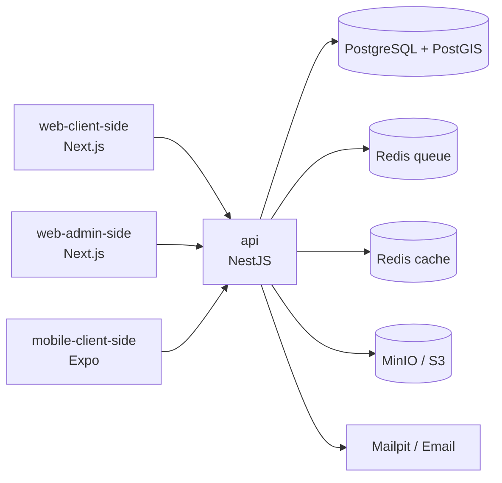

# Da Nang Connect

Nền tảng kết nối cộng đồng người nước ngoài (expat) tại Đà Nẵng: tạo, tìm và tham gia sự kiện, buổi thể thao, trao đổi ngôn ngữ ở một nơi, thay vì phải lướt qua Facebook Groups, Meetup, WhatsApp và các trang rời rạc.

> Monorepo gồm API (NestJS), web người dùng (Next.js), console vận hành (Next.js) và app mobile (Expo).

---

## Vì sao có dự án này

Phân tích 3.504 bài đăng trong hai nhóm Facebook expat lớn nhất Đà Nẵng (Insight Social, 12/2025 – 07/2026):

- Bài **hỏi tìm** gấp khoảng **11 lần** bài **chào dịch vụ**.
- Nhu cầu sự kiện + thể thao (**809 bài**) vượt nhu cầu nhà ở (**349 bài**).
- Expat phải tự gom thông tin từ **ít nhất 5 kênh** khác nhau.

Nhu cầu kết nối không thiếu, chỉ bị phân mảnh. Da Nang Connect gom lại và cho tìm theo khu vực, thời gian, ngôn ngữ.

## Phạm vi

| Giai đoạn | Mảng | Trạng thái |
|---|---|---|
| **1** | Kết nối cộng đồng: sự kiện, thể thao, trao đổi ngôn ngữ | **Đang làm (MVP)** |
| 2 | Nhà ở | Chưa làm |
| 3 | Y tế và dịch vụ chuyên môn | Chưa làm |

**MVP Giai đoạn 1** gồm 45 use case, xoay quanh một vòng lặp:

```
Tìm thấy sự kiện → tin người tổ chức → RSVP → có mặt → được ghi nhận (trust)
```

| Nhóm chức năng | Nội dung chính |
|---|---|
| Tài khoản | Đăng ký email, đăng nhập Google / Apple / Facebook, onboarding, xác minh email và SĐT, xoá tài khoản |
| Sự kiện | Tạo sự kiện 4 bước, ghim bản đồ và tự gán khu vực, sửa, huỷ, quản lý người tham dự |
| Khám phá | Feed "Tuần này ở Đà Nẵng", tìm kiếm, lọc theo loại hình / khu vực / thời gian / ngôn ngữ, bản đồ, quanh tôi |
| RSVP | Giữ chỗ theo sức chứa, waitlist tự đẩy người lên (giữ chỗ 12 giờ), nhắc lịch T-24h và T-2h |
| Trust | Bậc tin cậy T0–T5 tính từ hành vi thật (xác minh, có mặt, vắng mặt) |
| Vận hành | Curate sự kiện thủ công (không scraping), mời organizer gốc nhận listing, báo cáo vi phạm và kiểm duyệt |

Hai ngôn ngữ **English** (mặc định) và **Tiếng Việt**.

## Hiện trạng

| App / package | Trạng thái |
|---|---|
| `apps/api` | Đã có: auth, event, rsvp, comment, profile, media, health (kèm post, reaction, chat ngoài phạm vi MVP) |
| `apps/web-client-side` | Đã có: đăng nhập / đăng ký, discover, chi tiết và tạo sự kiện, sự kiện của tôi, thông báo, hồ sơ |
| `apps/web-admin-side` | Chưa khởi tạo |
| `apps/mobile-client-side` | Chưa khởi tạo (mới có README quy ước) |

## Kiến trúc

Modular monolith (xem [ADR 0000](docs/adr/0000-kien-truc-monolith-first.md)): một API phục vụ ba client, dùng chung hợp đồng và luật nghiệp vụ qua `packages/`.



| Lớp | Công nghệ |
|---|---|
| API | NestJS 12, `pg` (SQL thuần), Zod, JWT RS256 (`jose`), Argon2, socket.io, Swagger, Vitest |
| Web người dùng | Next.js 16 (App Router), React 19, Tailwind CSS 4, MapLibre |
| Console vận hành | Next.js 16, ưu tiên desktop, không index |
| Mobile | Expo 57, React Native, Expo Router |
| Dữ liệu | PostgreSQL 18 + PostGIS 3.6, Redis 7.4 (cache và queue tách riêng), MinIO |
| Monorepo | pnpm 11 workspaces, Turborepo, TypeScript 7, oxlint, dependency-cruiser |

## Cấu trúc thư mục

```
apps/
  api/                  NestJS API — modules, SQL schema, seeds
  web-client-side/      Web người dùng cuối (SEO, RSVP, bản đồ)
  web-admin-side/       Console curate, kiểm duyệt, quản trị
  mobile-client-side/   App Expo
packages/
  contracts/            Zod schema cho mọi dữ liệu đi qua mạng
  domain/               Luật nghiệp vụ thuần, không phụ thuộc framework
  geo/                  Polygon 6 khu vực Đà Nẵng
  i18n/                 Catalog en/vi + kiểu MessageKey sinh tự động
  tokens/               Design token (màu, chữ, khoảng cách)
  config/               tsconfig dùng chung
ops/                    Script dev, smoke test DB, cấu hình Redis
docs/                   Tài liệu phân tích, ADR, kiến trúc, mockup
.agent/                 Luật, agent và skill cho quy trình phát triển
```

## Chạy local

**Yêu cầu:** Node.js ≥ 24, pnpm 11 (hoặc Corepack), Docker.

```bash
pnpm install
cp apps/api/.env.example apps/api/.env   # điền giá trị nếu cần
pnpm dev                                 # bật container, seed khu vực, chạy API + web
```

`pnpm dev` tự làm theo đúng thứ tự: bật PostgreSQL và MinIO → chờ DB sẵn sàng → seed 6 khu vực → chạy API và web. `Ctrl+C` dừng app, container vẫn chạy; `pnpm db:down` để tắt hẳn.

| Dịch vụ | Địa chỉ |
|---|---|
| Web | http://localhost:3000 |
| API | http://localhost:3101 |
| API docs (Swagger) | http://localhost:3101/api/docs |
| MinIO console | http://localhost:9003 |
| Mailpit | http://localhost:8025 |
| PostgreSQL | `localhost:5433` (user / db: `dnc`) |

Schema DB nằm ở `apps/api/src/database/sql/` và được nạp tự động khi container PostgreSQL khởi tạo lần đầu.

## Scripts

| Lệnh | Việc |
|---|---|
| `pnpm dev` | Chạy toàn bộ stack local |
| `pnpm build` | Build mọi app |
| `pnpm typecheck` | Kiểm tra kiểu |
| `pnpm test` | Unit và e2e test |
| `pnpm lint` | oxlint có kiểm tra kiểu |
| `pnpm dep-check` | Kiểm tra luật ranh giới giữa apps và packages |
| `pnpm gen:i18n-keys` | Sinh lại kiểu khoá i18n |
| `pnpm db:up` / `pnpm db:down` | Bật / tắt container |
| `pnpm db:seed` | Seed khu vực |
| `pnpm db:smoke` | Smoke test bất biến sức chứa RSVP |

## Quy ước làm việc

- **Nhánh:** `main` ổn định, `develop` tích hợp, làm việc trên `feature/*` rồi mở PR vào `develop`.
- **CI** chạy trên mỗi PR: lint, typecheck, test, luật ranh giới, i18n key đồng bộ, smoke test sức chứa RSVP trên PostgreSQL thật.
- **Hợp đồng dữ liệu** lấy từ `@dnc/contracts`, luật nghiệp vụ từ `@dnc/domain`; app không tự định nghĩa lại.
- **Mọi chuỗi hiển thị** đi qua khoá i18n có ở cả `en` và `vi`.
- **Comment trong code** viết bằng tiếng Anh.
- **Không scraping** Facebook / Meetup / WhatsApp; nội dung mồi được curate thủ công và ghi rõ nguồn.

Luật chi tiết, định nghĩa agent và skill: [`.agent/`](.agent/).

## Tài liệu

Bắt đầu từ [`docs/README.md`](docs/README.md).

| Tài liệu | Nội dung |
|---|---|
| [Brief dự án](docs/source/) | Bối cảnh, insight, chiến lược ra mắt, mô hình kiếm tiền |
| [00 Tổng hợp](docs/analysis/00-TONG-HOP-DU-AN.md) | Tóm tắt điều hành, decision log |
| [01 Tác nhân và phân quyền](docs/analysis/01-tac-nhan-va-phan-quyen.md) | Role, trust T0–T5, ma trận quyền |
| [02 Use case](docs/analysis/02-use-case.md) | 76 use case, ranh giới MVP |
| [03 Domain và dữ liệu](docs/analysis/03-domain-va-du-lieu.md) | Entity, ERD, PostGIS |
| [10 UX và i18n](docs/analysis/10-ux-luong-man-hinh-va-i18n.md) | Danh sách màn hình, user flow |
| [14 Stakeholder và kiểm duyệt](docs/analysis/14-stakeholder-flow-kiem-duyet-va-swipe-ui.md) | Luồng trải nghiệm, chính sách nội dung |
