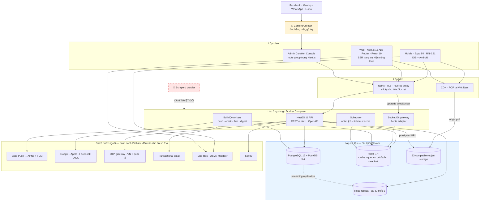

# 00 — Tổng hợp dự án Da Nang Connect

| Thuộc tính | Giá trị |
|---|---|
| Tài liệu | Bản tổng hợp chủ (master synthesis) của 10 tài liệu phân tích |
| Sản phẩm | **Da Nang Connect** — nền tảng kết nối cộng đồng người nước ngoài tại Đà Nẵng |
| Phạm vi | Giai đoạn 1 — Kết nối cộng đồng (sự kiện, thể thao, trao đổi ngôn ngữ). Địa lý: **chỉ Đà Nẵng** |
| Ngày lập | 2026-08-31 · Phiên bản 1.0 |
| Trạng thái | **Draft để chủ dự án ra quyết định** — chứa 16 câu hỏi còn mở và 15 mâu thuẫn giữa các tài liệu |
| Nguồn | `docs/analysis/01` → `docs/analysis/10`, `docs/source/Da_Nang_Connect_Brief.txt` |
| Đối tượng đọc | Chủ dự án / Founder, Tech Lead, Product Owner, nhà đầu tư, luật sư |

> **Cách dùng tài liệu này.** Đây là bản rút gọn có thẩm quyền để ra quyết định. Mọi chi tiết triển khai vẫn nằm ở 10 tài liệu gốc (xem [§11 Mục lục](#11-mục-lục-liên-kết-tới-10-tài-liệu-chi-tiết)). Khi bản tổng hợp này mâu thuẫn với tài liệu con, **[§12 Mâu thuẫn cần giải quyết](#12-mâu-thuẫn-cần-giải-quyết)** là nơi ghi nhận, không phải chỗ để lờ đi.

---

## Mục lục

1. [Tóm tắt điều hành](#1-tóm-tắt-điều-hành)
2. [Tác nhân & role](#2-tác-nhân--role)
3. [Use case MVP theo MoSCoW](#3-use-case-mvp-theo-moscow)
4. [Kiến trúc & tech stack đã chốt](#4-kiến-trúc--tech-stack-đã-chốt)
5. [Roadmap & milestone](#5-roadmap--milestone)
6. [Top 10 rủi ro và cách xử lý](#6-top-10-rủi-ro-và-cách-xử-lý)
7. [Yêu cầu pháp lý bắt buộc trước khi ra mắt](#7-yêu-cầu-pháp-lý-bắt-buộc-trước-khi-ra-mắt)
8. [Decision log](#8-decision-log)
9. [Câu hỏi còn mở cần chủ dự án trả lời](#9-câu-hỏi-còn-mở-cần-chủ-dự-án-trả-lời)
10. [Việc cần làm ngay: 01/09 → 14/09/2026](#10-việc-cần-làm-ngay-0109--14092026)
11. [Mục lục liên kết tới 10 tài liệu chi tiết](#11-mục-lục-liên-kết-tới-10-tài-liệu-chi-tiết)
12. [Mâu thuẫn cần giải quyết](#12-mâu-thuẫn-cần-giải-quyết)

---

## 1. Tóm tắt điều hành

### Dự án là gì

Da Nang Connect là nền tảng web + ứng dụng di động giúp người nước ngoài đang sống tại Đà Nẵng trả lời một câu hỏi duy nhất trong dưới 60 giây: **"tuần này ở khu tôi có gì diễn ra, ai sẽ đi, và còn chỗ không?"**. Giai đoạn 1 tập trung vào sự kiện cộng đồng, thể thao và trao đổi ngôn ngữ, với bốn năng lực lõi: tạo hoạt động không ma sát, RSVP có sức chứa kèm waitlist, tìm kiếm/lọc theo khu vực cấp phường, và hồ sơ có trust level để người lạ dám gặp nhau ngoài đời. Giai đoạn 2 (Nhà ở) và Giai đoạn 3 (Y tế / dịch vụ chuyên môn) đã được thiết kế chừa chỗ trong lược đồ dữ liệu nhưng **không kích hoạt** ở giai đoạn 1.

### Tại sao là bây giờ

Nhu cầu đã tồn tại và đang bị phân mảnh trên ít nhất 5 kênh (Facebook Groups, Meetup, WhatsApp/Telegram, Luma, truyền miệng). Phân tích 3.504 bài đăng cộng đồng cho thấy tỷ lệ **cầu/cung là 11:1** — cứ 11 người hỏi mới có 1 người chào — và số bài đăng về sự kiện tăng gấp 10 lần trong T5–T6/2026. Không đối thủ nào (Meetup, Luma, Eventbrite, InterNations) có động cơ kinh tế để phục vụ riêng một thành phố 15.000 người nước ngoài; điểm khả năng phản ứng của tất cả đều ≤ 3/5. Rào cản gia nhập bằng công nghệ gần bằng 0 — **rào cản thật là mật độ nội dung sống trong bán kính 1,5 km, quan hệ với ~25 organizer, và pháp nhân + giấy phép mạng xã hội tại Việt Nam**. Cửa sổ cơ hội mở, nhưng không rộng.

### Làm gì trong 6 tháng tới (09/2026 → 02/2027)

| Mốc | Ngày | Nội dung |
|---|---|---|
| M0 | 18/09/2026 | Hạ tầng, CI/CD, staging, dev build trên máy thật |
| M1 | 02/10/2026 | API nền + Auth (email, Google, Apple, Facebook), refresh token xoay vòng |
| M2 | 30/10/2026 | Tạo & khám phá sự kiện, PostGIS, bản đồ, SEO trang chi tiết |
| M3 | 13/11/2026 | RSVP + waitlist + push notification + nhắc lịch |
| M4 | 27/11/2026 | Trust & Safety tối thiểu + toàn bộ tài liệu pháp lý đã công bố |
| M5 | 25/12/2026 | Beta kín 100 user thật, ≥ 60 sự kiện đã curate |
| M6 | 25/02/2027 | Ra mắt công khai trên App Store + Google Play + web |

Song song và **quan trọng ngang phần kỹ thuật**: đội sáng lập tự tay curate lịch sự kiện đầy đủ nhất Đà Nẵng (nhập tay, ghi nguồn, tuyệt đối không scraping), rồi dùng chính lưu lượng RSVP làm đòn bẩy mời organizer gốc nhận quyền quản lý listing của họ.

### Cần bao nhiêu tiền và người

| Hạng mục | Kịch bản đủ đội | Kịch bản tinh gọn |
|---|---|---|
| Nhân sự | **5,5 FTE** (Tech Lead, Backend, Frontend, Mobile, Designer 0.5, QA 0.5, Community Manager 0.5) | **2 lập trình viên** + Founder kiêm PO/Community |
| Ngân sách 7 tháng | **≈ 2,04 tỷ VND ≈ 78.500 USD** | **≈ 0,91 tỷ VND ≈ 35.000 USD** |
| Hạ tầng | ≈ 196 USD/tháng ở mốc A (≤ 500 user), ≈ 1.127 USD/tháng ở mốc B (5.000 user) | như trên |
| Pháp lý tới M6 | **130 – 350 triệu VND** (+30% dự phòng) — chiếm 7–17% ngân sách tổng | không được cắt tư vấn pháp lý M0 và ToS/Privacy M4 |
| Khối lượng | ≈ 563 story point (chưa gồm 15% dự phòng), 11 sprint 2 tuần | phải cắt scope, kéo dài thêm 2–4 sprint |

Tỷ giá quy đổi thống nhất: **1 USD = 26.000 VND**.

### Chỉ số nào quyết định thành bại

**North Star Metric: Weekly Confirmed Attendances (WCA)** — số lượt tham dự sự kiện được xác nhận trong 7 ngày gần nhất. Đây là đơn vị nhỏ nhất của "giá trị đã giao": một người thật đã gặp người thật vì Da Nang Connect.

Hai chỉ số trả lời câu hỏi duy nhất thực sự quan trọng — *sản phẩm có tự chạy được không, hay chỉ chạy khi founder đẩy?*

| Chỉ số | Ngưỡng xanh tại M6 + 8 tuần (22/04/2027) | Ngưỡng đỏ |
|---|---|---|
| **Tỷ lệ sự kiện tự phục vụ** (organizer tự đăng, không do đội curate) | ≥ 25% | < 15% |
| **Tỷ trọng user từ vòng lặp giới thiệu + tự nhiên** | ≥ 35% | < 20% |
| Số sự kiện đang mở mỗi tuần | ≥ 25, không khu vực MVP nào bằng 0 | < 15 |
| WCA/tuần (mục tiêu đã hiệu chỉnh) | ≥ 220 | < 110 |
| MAU | ≥ 700 | < 350 |
| `retention_in_city` D30 (đã loại cohort đã rời thành phố) | ≥ 22% | < 15% |

> **Ngưỡng chặn tuyệt đối:** không ra mắt công khai khi chưa có đường xử lý pháp lý cho yêu cầu xác thực số điện thoại theo Nghị định 147/2024/NĐ-CP — bất kể mọi chỉ số khác đẹp đến đâu.

---

## 2. Tác nhân & role

*Rút gọn từ `docs/analysis/01-tac-nhan-va-phan-quyen.md`.*

### 2.1 Tác nhân

| Nhóm | Mã | Tác nhân | Vai trò trong sản phẩm | Thiết bị chính | Trạng thái GĐ1 |
|---|---|---|---|---|---|
| Primary | A1 | **Expat / Member** | Tìm hoạt động, RSVP, gặp người. Actor đông nhất, là lý do tồn tại của sản phẩm | Mobile ~80% | ✅ Kích hoạt |
| Primary | A2 | **Event Organizer** | Tạo & quản lý hoạt động. Hai nhánh: nghiệp dư (mobile 100%) và chuyên nghiệp (web cho tạo & phân tích) | Mobile / Web | ✅ Kích hoạt |
| Primary | A3 | **Local Bilingual Host** | Người Việt nói tiếng Anh dẫn dắt hoạt động — nguồn cung quý, cầu nối văn hoá | Mobile (Android) | ✅ Kích hoạt, có badge `local_host` |
| Primary | A4 | **Local Service Provider** | Nhà cung cấp dịch vụ nhà ở / y tế | — | ❌ Chỉ giữ chỗ enum, không có UI, không có endpoint |
| Secondary | B1 | **Content Curator** | Nhập tay sự kiện công khai, mời organizer gốc nhận listing. **Quan trọng bậc nhất tháng 1–6** | Web/desktop 95% | ✅ Kích hoạt |
| Secondary | B2 | **Community Moderator** | Xử lý hàng đợi báo cáo, gỡ nội dung, đình chỉ tài khoản | Web + mobile | ✅ Kích hoạt |
| Secondary | B3 | **Support Agent** | Sự cố tài khoản, gửi lại xác minh, impersonate chỉ đọc | Web | ⚠️ Có thể gộp vào `admin` ở MVP |
| Secondary | B4 | **Admin** | Taxonomy khu vực & danh mục, feature flag, analytics toàn hệ thống | Web/desktop | ✅ Kích hoạt |
| Secondary | B5 | **Super Admin** | Gán/thu hồi role, xoá vĩnh viễn, ẩn danh hoá, audit log đầy đủ | Web, bắt buộc 2FA | ✅ 2–3 tài khoản |
| System | C1–C7 | Push (Expo), Email/SMS, Map/geocoding, Object Storage + CDN, BullMQ scheduler, Socket.IO gateway, Sentry | Dịch vụ tự động | ✅ Kích hoạt |
| System | C8 | Payment Gateway | Thanh toán | ❌ GĐ2, chỉ có quyền `billing.*` dự trữ |
| External | D1–D4 | Facebook Groups, Meetup.com, WhatsApp Groups, Luma / trang sự kiện độc lập | **Nguồn phát hiện sự kiện — con người đọc bằng mắt, gõ tay** | 🚫 Cấm tuyệt đối scraping, crawler, headless browser, API không chính thức |
| External | D5 | Nhà cung cấp OAuth (Google, Apple, Facebook) | Đăng nhập xã hội, scope tối thiểu `email` + `profile` | ✅ Kích hoạt |

### 2.2 Persona chốt

| Persona | Chân dung | Điều họ cần nhất | Điều làm họ bỏ app |
|---|---|---|---|
| **P1 Marco** | Nam 29, Ý, nomad 6 tuần, ở An Thượng | Bộ lọc `Tonight` + trong 3 km; RSVP 2 chạm | Bắt đăng ký trước khi được xem gì; app trống |
| **P2 Sarah** | Nữ 41, Anh, năm thứ 4, có 2 con, ở Mỹ An | Bộ lọc `family_friendly` / `alcohol_free`; biết rõ ai tổ chức | Nhận tin nhắn quấy rối, không có cách báo cáo |
| **P3 Tom** | Nam 34, Mỹ, tổ chức cầu lông tối T3 & T5, Sơn Trà | Nhân bản buổi tuần trước < 30 giây; waitlist tự đôn; đánh dấu no-show 1 chạm | Bắt trả phí; form dài quá 1 màn hình; phải dùng web |
| **P4 Linh** | Nữ 33, Việt, đồng sở hữu studio yoga ở An Thượng | Hồ sơ tổ chức tách khỏi cá nhân; co-host; analytics lượt xem → RSVP → có mặt | Bị đối xử như spammer; không có analytics |
| **P5 Minh** | Nam 27, Việt, Content Curator nội bộ | Form curate nhớ giá trị cũ; bảng theo dõi vòng đời claim | Công cụ nhập liệu tệ |
| **P6 Anna** | Nữ 38, Đức, Moderator tình nguyện | Hàng đợi ưu tiên; **tên cá nhân không bao giờ xuất hiện trên thông báo cấm** | Kiệt sức, lộ danh tính |

### 2.3 Hệ thống role — ⚠️ chưa thống nhất

Bốn tài liệu định nghĩa bốn tập role khác nhau. Đây là **mâu thuẫn MT-02**, phải chốt trước Sprint 1.

| Nguồn | Tập role |
|---|---|
| `01` (§3–§5) | `member` → `verified_member` → `organizer`, `curator`, `support`, `moderator`, `admin`, `super_admin` |
| `02` (§3) | Guest, Member, Organizer, **Co-host**, Curator, Moderator, Admin (không có Support, không có Super Admin) |
| `03` (§4.1 enum) | `member` \| `curator` \| `moderator` \| `admin` — **nói rõ "không có role `organizer`"** |
| `08` (E2-S7) | `user` \| `organizer` \| `moderator` \| `admin` |

**Khuyến nghị chốt** (chờ chủ dự án xác nhận — [CH-02](#9-câu-hỏi-còn-mở-cần-chủ-dự-án-trả-lời)): lấy enum của `03` làm chuẩn kỹ thuật (`member`, `curator`, `moderator`, `admin`, `super_admin`), coi **organizer là vai trò theo ngữ cảnh** (`events.host_user_id`), `verified_member` là **trạng thái xác minh** chứ không phải role, `co-host` là bảng nối cấp sự kiện, `support` gộp vào `admin` + feature flag ở MVP.

---

## 3. Use case MVP theo MoSCoW

*Rút gọn từ `docs/analysis/02-use-case.md` — 76 use case, 11 epic.*

### 3.1 Phân bổ tổng

| MoSCoW | Số UC | Ước lượng | Ghi chú |
|---|---:|---:|---|
| **Must** | 44 | ~186 ngày-người | Thiếu thì không ra mắt được |
| **Should** | 18 | ~80 ngày-người | Cuối MVP nếu còn thời gian |
| **Could** | 8 | ~35 ngày-người | Cắt được không ảnh hưởng giả thuyết lõi |
| **Won't (GĐ1)** | 6 | — | Đã thiết kế trước để không phải đập đi làm lại |
| **Tổng** | **76** | **~301 ngày-người** | |

Quy đổi: `S ≈ 1,5 ngày-người` · `M ≈ 4` · `L ≈ 9` (đã gồm API + web + mobile + test). Với 2 backend + 1 web + 1 mobile chạy song song, phần **Must** rơi vào **10–12 tuần lịch**.

### 3.2 Danh mục Must — bắt buộc có để ra mắt

| Epic | Use case Must | Ghi chú |
|---|---|---|
| **EP-01 Onboarding & Auth** | UC-01 đăng ký email · UC-02 xác minh email · UC-03 đăng nhập · UC-04 social login (Google/Apple/Facebook) · UC-05 onboarding lần đầu · UC-06 đặt lại mật khẩu · UC-07 refresh & đăng xuất · UC-08 đổi ngôn ngữ · UC-09 **duyệt ở chế độ khách** · UC-10 xoá tài khoản & xuất dữ liệu | UC-09 và UC-10 là điều kiện sống còn: một là ràng buộc persona P1, một là chính sách store |
| **EP-02 Hồ sơ & Trust** | UC-11 sửa hồ sơ · UC-12 xem hồ sơ công khai · UC-13 xác minh email + SĐT · UC-15 tính & hiển thị chỉ số tin cậy | UC-14 xác minh giấy tờ = **Won't** ở GĐ1 |
| **EP-03 Tạo & quản lý sự kiện** | UC-19 tạo hoạt động · UC-20 chọn địa điểm trên bản đồ + gán khu vực · UC-21 nháp & xuất bản · UC-22 sửa đã xuất bản · UC-23 huỷ · UC-25 quản lý người tham dự | UC-24 lặp lại = Should; UC-26 co-host = Could; UC-27 QR check-in = Should; UC-28 nhân bản = Could |
| **EP-04 Khám phá & tìm kiếm** | UC-29 feed "Tuần này ở Đà Nẵng" · UC-30 tìm kiếm toàn văn · UC-31 lọc nâng cao · UC-32 quanh vị trí hiện tại · UC-33 bản đồ · UC-35 lưu quan tâm | Khác biệt cạnh tranh số 1 |
| **EP-05 RSVP & tham gia** | UC-38 đăng ký tham gia · UC-39 huỷ đăng ký · UC-43 xem danh sách người tham dự | UC-40 waitlist = **Should** ⚠️ mâu thuẫn với brief (xem MT-05) |
| **EP-06 Tương tác** | UC-45 bình luận · UC-48 chia sẻ ra ngoài (deep link + OG image) | UC-46 chat nhóm = Should; UC-47 DM = Could |
| **EP-07 Thông báo** | UC-51 đăng ký push · UC-52 nhắc lịch trước giờ · UC-54 trung tâm thông báo | UC-53 tuỳ chọn thông báo = Should; UC-55 digest tuần = Should |
| **EP-09 Kiểm duyệt** | UC-60 báo cáo vi phạm · UC-61 xử lý hàng đợi · UC-62 gỡ nội dung & đình chỉ | UC-63 khiếu nại = Could ⚠️ mâu thuẫn với cam kết công khai (xem MT-08) |
| **EP-10 Curate** | UC-65 nhập curate thủ công · UC-66 gắn nhãn nguồn · UC-67 mời organizer nhận listing · UC-68 organizer nhận quyền sở hữu | Chiến lược ra mắt, không phải tính năng phụ |
| **EP-11 Quản trị** | UC-70 quản lý khu vực & loại hình · UC-73 quản lý người dùng & phân quyền · UC-76 giám sát sức khoẻ hệ thống | UC-71 analytics sản phẩm = Should; UC-72 analytics organizer = Could ⚠️ (xem MT-06) |

### 3.3 Won't trong GĐ1 — đã thiết kế trước

`UC-14` xác minh danh tính bằng giấy tờ · `UC-36` gợi ý cá nhân hoá · `UC-56` → `UC-59` toàn bộ EP-08 nhu cầu ad-hoc.

> **Kiểm chứng độ phủ:** `docs/analysis/10-ux-luong-man-hinh-va-i18n.md` §15 xác nhận toàn bộ 44 use case Must đều có ít nhất một màn hình chịu trách nhiệm. Đây là ma trận truy vết duy nhất hiện có giữa UC → màn hình → Epic.

---

## 4. Kiến trúc & tech stack đã chốt

*Rút gọn từ `docs/analysis/03-domain-va-du-lieu.md` và `docs/analysis/04-tech-stack-va-kien-truc.md`.*

### 4.1 Sơ đồ kiến trúc

### 4.2 Bảng tech stack chốt

| Lớp | Công nghệ | Phiên bản | Lý do một dòng |
|---|---|---|---|
| Runtime | Node.js | 22.x LTS | LTS tới 04/2027 |
| Backend | NestJS | 11.x | Module + DI + Swagger sinh OpenAPI làm nguồn sinh typed client |
| ORM | TypeORM | 0.3.2x | DataSource API, migration CLI, chạy raw SQL khi cần PostGIS |
| CSDL | PostgreSQL | 16.x | Nguồn sự thật duy nhất |
| Địa lý | PostGIS | 3.4.x | `geography(Point,4326)` + GIST, `ST_DWithin` tính bằng mét |
| Cache / queue | Redis | 7.4.x | Cache, rate limit, pub/sub socket, backend BullMQ |
| Job queue | BullMQ | 5.x | Push, resize ảnh, email, digest, tính trust score |
| Realtime | Socket.IO | 4.8.x | `@socket.io/redis-adapter` để scale ngang |
| Web | Next.js + React | 15.x / 19.x | App Router, RSC, SEO cho trang sự kiện công khai |
| CSS | Tailwind CSS | 4.x | Design token chia sẻ qua `@theme` |
| Mobile | Expo + React Native | 54 / 0.81 | Một codebase, EAS Build/Submit, OTA update |
| Điều hướng mobile | Expo Router | 6.x | File-based routing, universal link gọn |
| Bản đồ web | Leaflet + react-leaflet | 1.9.x / 5.x | Nhẹ, tile đổi nhà cung cấp được |
| Bản đồ mobile | react-native-maps | 1.2x | Native map, cluster tốt |
| Xác thực | JWT RS256 + refresh xoay vòng | — | Access 15 phút, refresh 30 ngày, phát hiện tái sử dụng → thu hồi cả `family_id` |
| Social login | Google, Apple, Facebook | — | **Apple Sign-In bắt buộc trên iOS** khi có social login khác |
| Push | Expo Push → APNs/FCM | — | Một API cho cả hai nền tảng |
| Lưu trữ | S3-compatible + CDN có POP tại VN | — | Presigned upload, ảnh không đi qua API |
| Đóng gói | Docker + Docker Compose | 27.x / v2 | Không Kubernetes ở GĐ1 |
| CI/CD | GitHub Actions + EAS | — | Lint/test/build/migrate/deploy |
| Theo dõi lỗi | Sentry | SDK 9.x | `beforeSend` scrub PII bắt buộc |
| Monorepo | pnpm workspace + Turborepo | pnpm 10.x / turbo 2.x | **`node-linker=hoisted` bắt buộc** để Metro chạy được |

**Monorepo:** `apps/api` (`@dnc/api`) · `apps/web` (`@dnc/web`) · `apps/mobile` (`@dnc/mobile`) · `packages/shared-types` · `packages/api-client` · `packages/i18n` · `packages/config` · `packages/ui` · `packages/validation` · `ops/` (runbook, hồ sơ pháp lý, migration script).

### 4.3 Ba quyết định kiến trúc lớn nhất

1. **Monolith module hoá, không microservices.** Một đội nhỏ, một miền nghiệp vụ. Ranh giới module vẽ đủ sạch (`import/no-restricted-paths` chặn ở ESLint) để tách sau nếu cần.
2. **Hosting trọng tâm tại Việt Nam.** Toàn bộ dữ liệu cá nhân và nghiệp vụ (Postgres, Redis, object storage, sao lưu, log) đặt tại hạ tầng trong nước có hoá đơn VAT Việt Nam. Lý do chính không phải giá mà là **phương sai độ trễ khi đứt cáp quang biển** (RTT Singapore 30–55 ms bình thường → 120–300 ms khi sự cố) và nghĩa vụ lưu trữ dữ liệu trong nước.
3. **Xác thực SĐT dùng định tuyến lai theo mã quốc gia.** Số `+84` qua nhà cung cấp Việt Nam (rẻ 3–5 lần), số quốc tế qua nhà cung cấp toàn cầu. Cộng đồng expat có cả hai loại.

### 4.4 Domain model — 12 quyết định dữ liệu

| # | Quyết định | Lựa chọn |
|---|---|---|
| D-01 | Khoá chính | `uuid` (UUIDv7 sinh ở tầng ứng dụng) |
| D-02 | Tách `Event` / `EventOccurrence` | **Bắt buộc**, kể cả sự kiện một lần. RSVP gắn vào **occurrence** ⚠️ (xem MT-03) |
| D-03 | Vị trí | `geography(Point,4326)` + index GIST |
| D-04 | Khu vực | Bảng `areas` phân cấp city → district → ward → micro_area, gán `area_id` lúc ghi |
| D-05 | Tìm kiếm | Postgres FTS (`tsvector`) + `unaccent` + `pg_trgm` |
| D-06 | Trạng thái | Native PostgreSQL `ENUM` cho state machine đóng, `varchar` + CHECK cho taxonomy còn biến động |
| D-07 | Ngôn ngữ nội dung | 1 bản theo `content_locale` + bảng `event_translations` phụ; từ vựng hệ thống dùng `name_en`/`name_vi` |
| D-08 | Thời gian | `timestamptz`, lưu UTC, connection ép `timezone = 'UTC'`, IANA zone lưu riêng |
| D-09 | Xoá | 3 tầng: `status` (ẩn) → `deleted_at` (soft delete) → anonymize/hard delete theo lịch |
| D-10 | Đếm | Cột phi chuẩn hoá (`rsvp_going_count`…) do trigger DB duy trì + job đối soát hằng đêm |
| D-11 | Curate thủ công | `curated_sources` + `curation_tasks` là công dân hạng nhất trong schema |
| D-12 | Không thu thập tự động | `collection_method` mặc định `manual_only`, có ràng buộc CHECK — **chặn từ gốc ở tầng dữ liệu** |

**Bounded context:** Identity & Trust · Geo · Events · Attendance · Community & Safety · Messaging · Notifications · Curation & Ops.

### 4.5 SLO Giai đoạn 1

Khả dụng 99,5%/tháng · p95 API đọc < 300 ms · p95 tạo RSVP < 500 ms · push tới thiết bị < 30 giây · crash-free session ≥ 99,5%.

---

## 5. Roadmap & milestone

*Rút gọn từ `docs/analysis/08-roadmap-va-ke-hoach-trien-khai.md`.*

> ⚠️ **Lưu ý về "6 sprint".** Tài liệu `08` lập kế hoạch **11 sprint** (S0 → S10) tới ngày ra mắt, không phải 6. Bảng dưới trình bày **6 sprint xây dựng lõi (S0 → S5)** — đủ để hoàn thành toàn bộ M0 → M4, tức tất cả năng lực MVP có thể demo — rồi liệt kê 5 sprint còn lại dành cho beta, sửa lỗi và phát hành. Xem [MT-01](#12-mâu-thuẫn-cần-giải-quyết).

### 5.1 Sáu sprint xây dựng lõi

| Sprint | Thời gian | Trọng tâm | Đầu ra nghiệm thu | Mốc chạm |
|---|---|---|---|---|
| **S0 · Nền móng** | 07/09 → 18/09/2026 | Monorepo pnpm + Turborepo, Docker Compose (Postgres 16 + PostGIS + Redis), khung NestJS 11, khung Next.js 15, dev build Expo trên máy thật, CI GitHub Actions, deploy staging tự động, Sentry, khung i18n | `docker compose up` chạy trong 5 phút; CI xanh; `GET /health` trả 200 từ tên miền staging | **M0 · 18/09** |
| **S1 · Auth & Hồ sơ** | 21/09 → 02/10/2026 | Đăng ký email + xác minh, JWT RS256 + refresh xoay vòng có phát hiện tái sử dụng, Google/Apple/Facebook Sign-In, RBAC guard, hồ sơ cá nhân, màn đăng nhập web + mobile, secure storage | Đăng ký/đăng nhập end-to-end trên web và mobile; test luồng phát hiện tái sử dụng token; RBAC chặn đúng | **M1 · 02/10** |
| **S2 · Sự kiện lõi** | 05/10 → 16/10/2026 | Data model sự kiện + PostGIS + seed khu vực Đà Nẵng, API tạo/sửa/huỷ, upload ảnh qua presigned URL + CDN, form tạo nhiều bước trên web, trang chi tiết sự kiện, hồ sơ công khai organizer | Tạo được sự kiện từ web; ảnh phục vụ qua CDN; trang chi tiết có SEO/OG | |
| **S3 · Khám phá & Bản đồ** | 19/10 → 30/10/2026 | API search/filter + cursor pagination + facet count, truy vấn bán kính `ST_DWithin`, trang khám phá web, feed + bottom sheet lọc trên mobile, bản đồ gom cụm, sự kiện lặp lại, tạo sự kiện trên mobile < 90 giây, Admin Console khung | Lọc theo loại hình/khu vực/thời gian/ngôn ngữ cho kết quả đúng; p95 `GET /events` < 200 ms với 10.000 sự kiện giả lập | **M2 · 30/10** |
| **S4 · RSVP & Thông báo** | 02/11 → 13/11/2026 | RSVP có sức chứa + waitlist + `SELECT … FOR UPDATE`, BullMQ + worker + retry, Expo Push, email giao dịch, Socket.IO đếm chỗ realtime, nhắc lịch T‑24h và T‑2h, chuyển chế độ danh sách ↔ bản đồ | 200 request RSVP đồng thời vào sự kiện 50 chỗ → đúng 50 `going`, phần còn lại `waitlisted`; push tới thiết bị thật | **M3 · 13/11** |
| **S5 · Trust & Safety** | 16/11 → 27/11/2026 | Report + block, hàng đợi kiểm duyệt theo mức nghiêm trọng, gỡ nội dung & đình chỉ có audit log, trust score v1, xác minh SĐT bằng OTP, Community Guidelines + Privacy Policy công bố, trung tâm thông báo, tuỳ chọn thông báo | Toàn bộ tài liệu pháp lý EN + VI đã qua luật sư và đã công bố; điểm tin cậy hiển thị trên hồ sơ | **M4 · 27/11** |

### 5.2 Năm sprint còn lại tới ra mắt

| Sprint | Thời gian | Trọng tâm | Mốc |
|---|---|---|---|
| S6 · Sẵn sàng beta | 30/11 → 11/12/2026 | Admin Curation Console đầy đủ, luồng organizer nhận quyền listing, QR check-in, xuất dữ liệu / xoá tài khoản, EAS production build, nộp TestFlight + Play closed testing | |
| S7 · Vận hành beta | 14/12 → 25/12/2026 | Beta wave 1 (40 user) → wave 2 (60 user), phỏng vấn 15 user, hotfix hằng ngày | **M5 · 25/12** |
| — | 28/12/2026 → 01/01/2027 | **Đóng băng cuối năm** — chỉ trực sự cố | |
| S8 · Sửa lỗi beta | 04/01 → 15/01/2027 | Lỗi P0/P1, tinh chỉnh onboarding, tối ưu danh sách/bản đồ, giảm rớt phễu RSVP, bản dịch tiếng Việt do người bản ngữ viết | |
| S9 · Chuẩn bị ra mắt | 18/01 → 29/01/2027 | Analytics funnel, SEO, referral link, release candidate, tài sản cửa hàng, diễn tập runbook | |
| — | 01/02 → 12/02/2027 | **Đóng băng Tết Đinh Mùi** (mùng 1 rơi vào 06/02/2027) — chỉ trực sự cố P0 | |
| S10 · Ra mắt | 15/02 → 26/02/2027 | Nộp store review, soft launch nội bộ, hồi quy đầy đủ, ra mắt công khai, war-room | **M6 · 25/02**, sự kiện ra mắt 27–28/02 |

### 5.3 Bảng milestone

| Mốc | Tên | Ngày chốt | Sprint | Gate nghiệm thu |
|---|---|---|---|---|
| **M0** | Setup hạ tầng | **18/09/2026** | S0 | Staging chạy; CI xanh; dev build cài được trên iOS + Android thật |
| **M1** | API nền + Auth | **02/10/2026** | S1 | Auth end-to-end web + mobile; refresh rotation có test; RBAC chặn đúng |
| **M2** | Tạo & khám phá sự kiện | **30/10/2026** | S2–S3 | Tạo từ web và mobile; lọc 4 trục hoạt động; bản đồ đúng khu vực; SEO/OG |
| **M3** | RSVP + Thông báo | **13/11/2026** | S4 | RSVP/huỷ/waitlist đúng khi tranh chấp chỗ; push thật; nhắc T‑24h và T‑2h |
| **M4** | Trust & Safety tối thiểu | **27/11/2026** | S5 | Report/block/kiểm duyệt/ban; Guidelines + Privacy đã công bố; trust score hiển thị |
| **M5** | Beta kín 100 user | **25/12/2026** | S6–S7 | 100 tài khoản beta thật; ≥ 60 sự kiện curate; TestFlight + Play closed testing 14 ngày; crash-free ≥ 99% |
| **M6** | Ra mắt công khai | **25/02/2027** | S9–S10 | App trên cả hai cửa hàng; web production; ≥ 80 sự kiện *(khuyến nghị đổi sang **≥ 25 sự kiện đang mở/tuần** — xem MT-09)*; ≥ 8 organizer tự quản lý listing; runbook đã diễn tập |

### 5.4 Phân bổ story point theo epic

| Epic | Tên | SP | Mốc |
|---|---|---:|---|
| E1 | Nền tảng & Hạ tầng | 54 | M0 |
| E2 | Định danh & Xác thực | 53 | M1 |
| E3 | Hồ sơ cá nhân & Tín hiệu tin cậy | 42 | M1 / M4 |
| E4 | Quản lý sự kiện | 84 | M2 |
| E5 | Khám phá & Tìm kiếm hyperlocal | 83 | M2 |
| E6 | RSVP & Điểm danh | 55 | M3 |
| E7 | Thông báo & Realtime | 57 | M3 |
| E8 | Trust & Safety | 39 | M4 |
| E9 | Admin & Curation Console | 34 | M2 → M5 |
| E10 | i18n & Nội dung | 11 | xuyên suốt |
| E11 | Analytics & Tăng trưởng | 25 | M5 / M6 |
| E12 | Phát hành ứng dụng di động | 26 | M5 / M6 |
| | **Tổng** | **563** | |

### 5.5 Ba việc chặn phải khởi động ngay tuần đầu

| Việc | Thời gian chờ | Nếu trễ |
|---|---|---|
| Tài khoản Apple Developer (tổ chức) + mã D‑U‑N‑S | **2–4 tuần** | Trượt M5, không có TestFlight |
| Tài khoản Google Play Console (tổ chức) + closed testing 14 ngày liên tục | 14 ngày bắt buộc | Trượt M5 |
| Ký hợp đồng luật sư CNTT/dữ liệu | 2–3 tuần | Khoá cứng thiết kế luồng auth ở S1 |

---

## 6. Top 10 rủi ro và cách xử lý

*Hợp nhất từ `docs/analysis/09-canh-tranh-va-rui-ro.md` (RK-xx, cấp doanh nghiệp), `docs/analysis/04` (R1–R12, kỹ thuật) và `docs/analysis/06` (L-xx, pháp lý).*

| # | Mã | Rủi ro | Điểm | Chủ sở hữu | Biện pháp chính | Dấu hiệu sớm |
|---|---|---|:--:|---|---|---|
| 1 | **RK-01** | **Cold-start hai phía** — không đủ sự kiện thì không có người dùng; không có người dùng thì organizer không đăng. Cung vốn chỉ chiếm ~6% bài đăng | 🔴 20 | Founder + Community Manager | Curate là hạng mục sprint có Definition of Done, không phải việc làm thêm · **chỉ tiêu tồn kho cứng: không bao giờ dưới 20 sự kiện đang mở** trải đều 4 khu vực MVP, cảnh báo tự động · 2 sự kiện signature/tuần do đội đứng tên · nạp 60 sự kiện **trước khi mời một người lạ nào** · mời organizer bằng số liệu của chính họ | Sự kiện đang mở < 20 trong 2 tuần liên tiếp; bất kỳ khu vực MVP nào = 0 trong 7 ngày; `search_zero_result_rate` > 15% |
| 2 | **RK-07 / L-01** | **Pháp lý** — yêu cầu xác thực tài khoản bằng **số điện thoại di động Việt Nam** theo NĐ 147/2024 xung đột trực tiếp với tệp người dùng expat; thêm giấy phép mạng xã hội, DPIA/TIA, bản đồ chủ quyền | 🔴 20 | Founder + Luật sư | Hỏi luật sư **trước khi code luồng đăng ký** · kiến trúc adapter tách rời cho OTP · cờ `FEATURE_PHONE_OTP_REQUIRED` đổi chính sách không cần deploy · mặc định chọn phương án hạn chế hơn | Luật sư chưa có kết luận bằng văn bản sau Sprint 3 |
| 3 | **RK-06** | **Churn địa lý** — phân khúc seed (nomad) thay máu 6–10 lần/năm; kết bạn rồi người ta rời đi | 🔴 20 | Product | Tách chỉ số `retention_in_city` (loại cohort `left_city`) khỏi retention thô — **không kết luận thất bại trước khi loại cohort này** · onboarding hỏi `arrival_date` + `planned_stay_length` · hồ sơ ngủ đông thay vì xoá khi rời thành phố · badge "Community Passer" khi giới thiệu người thay thế | Retention thô giảm mà `retention_in_city` không giảm |
| 4 | **RK-04** | **CAC cao hơn khả năng chi trả** | 🔴 16 | Founder | Không mua user trong 6 tuần đầu — quảng cáo che mất tín hiệu sản phẩm có tự nhiên hấp dẫn hay không · đo CAC biên theo `channel_code` · ngưỡng đỏ 600k VND/user | CAC biên vượt 400k VND |
| 5 | **RK-09** | **Đội ngũ mỏng** — Founder giữ 5/7 vai, bus factor = 1 | 🔴 16 | Founder | ADR bắt buộc cho mọi quyết định kiến trúc · runbook viết trước M5 · luân phiên trực · tuyển Community Manager 0.5 FTE sớm | Chỉ một người deploy được |
| 6 | **RK-05** | **Tính mùa vụ** — mùa mưa T10–T12, Tết, mùa du lịch cao điểm | 🟠 15 | Community Manager | **Không ra quyết định xoay trục trong tháng 12/2026 và tháng 02/2027** · so sánh với sự kiện trong nhà để loại yếu tố thời tiết · đóng băng phát triển đã tính vào lịch | Nhầm sụt giảm mùa vụ thành thất bại sản phẩm |
| 7 | **RK-11** | **Hết runway trước khi đạt tín hiệu** | 🟠 15 | Founder | Giữ đủ 20 ngày dự phòng cho quy trình quyết định xoay trục ở mỗi cửa sổ · ngưỡng đóng dự án SD-1 viết trước · kịch bản tinh gọn 0,91 tỷ VND sẵn sàng kích hoạt | Runway < 5 tháng tại cửa sổ 3 |
| 8 | **R6 / L-03** | **Bản đồ hiển thị sai chủ quyền Việt Nam** (thiếu Hoàng Sa/Trường Sa) — Leaflet + tile bên thứ ba | 🟠 15 | Tech Lead | **Kiểm thử vùng Biển Đông là gate phát hành bắt buộc, mỗi lần** · ảnh chụp có ngày tháng lưu ở `ops/legal/map-audit/` · giới hạn `maxBounds` trong phạm vi Đà Nẵng · sẵn phương án tự host tile | Chưa ai kiểm tra tới tuần trước ra mắt |
| 9 | **R2 / R5** | **Kỹ thuật:** tranh chấp chỗ RSVP làm vượt sức chứa; và **gian lận cước SMS** (SMS pumping) làm hoá đơn tăng gấp mười trong một đêm | 🟠 12–16 | Backend + Tech Lead | RSVP: `SELECT … FOR UPDATE` + ràng buộc CHECK ở DB + test tải 200 request đồng thời trong CI · SMS: `OTP_ALLOWED_COUNTRY_CODES`, `OTP_DAILY_SPEND_LIMIT_USD`, CAPTCHA khi vượt ngưỡng, cảnh báo chi tiêu phía nhà cung cấp | Test tranh chấp bị bỏ qua khi vội; tỷ lệ yêu cầu OTP tăng đột biến kèm tỷ lệ xác minh thành công giảm |
| 10 | **RK-08 / RK-15** | **Sự cố an toàn khi gặp mặt ngoài đời** trong một cộng đồng nhỏ truyền miệng cực nhanh | 🟠 10–12 | Community Ops + Founder | An toàn là tính năng MVP, không phải backlog · **số điện thoại không bao giờ hiển thị công khai** · fail closed cho rủi ro thân thể (nghi ngờ nguy hiểm → ẩn trước, xem xét sau) · người ra quyết định ≠ người xử lý khiếu nại từ ngày đầu · Điều 7 & 8 của ToS + Event Safety Disclaimer | Một report `critical` vượt SLA |

**Ba cửa sổ ra quyết định lớn** (không quyết ngoài ba thời điểm này): cuối Tuần 6 — **19/10/2026**; cuối M5 — **25/12/2026**; M6 + 8 tuần — **22/04/2027**.

**Phương án xoay trục đã xếp hạng:** PV-1 thu hẹp địa lý còn 2 khu vực (**luôn thử đầu tiên**, chi phí gần 0) → PV-2 công cụ vận hành cho organizer (B2B nhỏ, dùng lại 80% backend) → PV-3 đổi phân khúc → PV-5 sản phẩm truyền thông (digest + SEO) → PV-6 mở thành phố thứ hai. **PV-4 nhảy sớm sang Giai đoạn 2 (Nhà ở) bị gắn nhãn không khuyến nghị trong mọi kịch bản thất bại.**

---

## 7. Yêu cầu pháp lý bắt buộc trước khi ra mắt

*Rút gọn từ `docs/analysis/06-phap-ly-va-tuan-thu-viet-nam.md`. Đây là bản phân tích nội bộ, **không phải ý kiến pháp lý**.*

### 7.1 Sáu kết luận khoá cứng thiết kế

| # | Kết luận | Mức | Hệ quả ngay |
|---|---|---|---|
| 1 | **Khung bảo vệ dữ liệu cá nhân đã đổi.** Từ 01/01/2026 vai trò trung tâm thuộc về **Luật Bảo vệ dữ liệu cá nhân số 91/2025/QH15** và nghị định hướng dẫn kế thừa NĐ 13/2023/NĐ-CP | 🟢 | Mọi mẫu Privacy Policy viết trước 2026 dựa trên NĐ 13 đều lỗi thời ⚠️ **xung đột với brief gốc — xem MT-04** |
| 2 | Sản phẩm **là dịch vụ mạng xã hội** theo NĐ 147/2024/NĐ-CP. Không né được bằng cách tự gọi tên khác | 🟡 | Phải làm thủ tục **Thông báo trước ngày ra mắt**, chuẩn bị hồ sơ **Giấy phép** trước khi chạm ngưỡng |
| 3 | **Yêu cầu xác thực bằng số điện thoại di động Việt Nam** — chỉ khi người dùng xác nhận không có số VN mới dùng số định danh cá nhân | 🔴 | **Rủi ro pháp lý số 1.** Phải hỏi luật sư **trước khi code luồng đăng ký** |
| 4 | **Dữ liệu vị trí là dữ liệu cá nhân nhạy cảm.** Stack có PostGIS lưu toạ độ | 🟢 | Tách bảng `user_locations` TTL 30 ngày, consent riêng, ghi log truy cập, ghi rõ "nhạy cảm" trong thông báo |
| 5 | **DPIA và TIA phải nộp cho A05 — Bộ Công an trong 60 ngày** kể từ ngày bắt đầu xử lý dữ liệu cá nhân thật (tức từ M5) | 🟢 | Đưa vào lịch: 25/12/2026 + 60 ngày. Không phải "khi nào rảnh" |
| 6 | **Nội dung do đội sáng lập curate KHÔNG phải UGC** — là nội dung do chính doanh nghiệp đăng → **không có miễn trừ trách nhiệm trung gian** | 🟡 | Nội dung curate phải qua duyệt **chặt hơn** UGC, không phải lỏng hơn |

### 7.2 Bộ tài liệu pháp lý bắt buộc

| # | Tài liệu | Ngôn ngữ | Hạn chót | Công bố ở |
|---|---|---|---|---|
| 1 | **Terms of Service** — Điều 7 (miễn trừ trách nhiệm với sự kiện ngoài đời thực) và Điều 8 (giao dịch giữa người dùng) là **lá chắn chính**, đừng để luật sư viết theo mẫu chung | EN chính + VI | M4 · 27/11/2026 | `/legal/terms` |
| 2 | **Privacy Policy** — cả hai bản EN và VI đều **đầy đủ**, không phải bản tóm tắt | EN + VI | M4 | `/legal/privacy` — URL bắt buộc cho cả hai store |
| 3 | **Community Guidelines** — phải có mục riêng giải thích cho người nước ngoài giới hạn nội dung tại Việt Nam, bằng tiếng Anh, không phán xét | EN chính + VI | M4 | `/legal/community` |
| 4 | **Quy chế quản lý, cung cấp và sử dụng dịch vụ** | **VI có hiệu lực** | Trước hồ sơ Thông báo | `/legal/content-policy` |
| 5 | **Organizer Agreement** — chấp nhận **một lần tại lần đầu tạo sự kiện**, ghi `consent_records` với `purpose = agreement.organizer` | EN + VI | M5 · 25/12/2026 | Hiển thị khi lần đầu tạo sự kiện |
| 6 | Cookie / Tracking Notice | EN + VI | M4 | Banner trên web |
| 7 | **Event Safety Disclaimer** | EN + VI | M4 | Trang chi tiết sự kiện |
| 8 | **Photo & Media Consent** | EN + VI | M5 | Màn hình check-in |
| 9 | **DPIA** + **TIA** | VI | Ra mắt + 60 ngày | Nội bộ, nộp A05 |
| 10 | **ROPA** — hồ sơ hoạt động xử lý dữ liệu | VI | M4 | `ops/legal/ropa.md` |
| 11 | **DPA với từng nhà cung cấp** | EN hoặc VI | Trước khi đưa vào production | `ops/legal/dpa/` |
| 12 | Quy trình phản hồi cơ quan nhà nước + Runbook sự cố dữ liệu | VI | M5 | Nội bộ / `ops/runbooks/` |

### 7.3 Checklist gate ra mắt (M6 · 25/02/2027)

- [ ] **M6-1** Đã có Giấy xác nhận thông báo cung cấp dịch vụ mạng xã hội, hoặc bằng chứng đã nộp hồ sơ hợp lệ — *Founder*
- [ ] **M6-2** Đã nộp DPIA và TIA trong hạn 60 ngày kể từ ngày bắt đầu xử lý dữ liệu thật — *Founder*
- [ ] **M6-3** Kiểm tra bản đồ chủ quyền lần cuối trước phát hành, có ảnh chụp ghi ngày tháng — *Tech Lead*
- [ ] **M6-4** Toàn bộ 12 nhóm tài liệu ở §7.2 đã công bố đúng URL — *Founder*
- [ ] **M6-5** Kiểm thử toàn bộ luồng quyền chủ thể dữ liệu (xuất dữ liệu trong 72 giờ, xoá tài khoản trong app **và** qua đường dẫn web cho Google Play) bằng tài khoản thật — *QA*
- [ ] **M6-6** Rà soát Data Safety form (Google Play) và Privacy Nutrition Label (App Store) khớp hành vi thật của app — *Mobile*
- [ ] **M6-7** Cảnh báo tự động khi số liệu chạm **50% ngưỡng cấp phép** — *Product*
- [ ] **M6-8** Kế toán xác nhận cơ chế **thuế nhà thầu nước ngoài** với từng nhà cung cấp — *Kế toán*
- [ ] **M6-9** Ba màn hình bắt buộc đã có: Report, Block, Contact us — *FE + Mobile*
- [ ] **M6-10** **Sign in with Apple** hoạt động trên iOS (bắt buộc khi đã có social login khác) — *Mobile*
- [ ] **M6-11** Age gate 18+ và điều khoản đủ 18 tuổi — *Backend + FE*
- [ ] **M6-12** Tài khoản `reviewer@` với dữ liệu mẫu cho App Review — *Mobile*

### 7.4 Nghĩa vụ định kỳ sau ra mắt

| Tần suất | Việc |
|---|---|
| Hằng tuần | Rà soát hàng đợi kiểm duyệt; kiểm tra SLA takedown 24 giờ |
| Hằng tháng | Báo cáo số lượt truy cập thường xuyên; rà soát blocklist; rà soát listing curate chưa có phản hồi organizer |
| Hằng quý | Rà soát quyền truy cập nhân sự; cập nhật ROPA; rà soát danh sách nhà cung cấp và DPA |
| Khi thay đổi | Cập nhật và nộp lại DPIA/TIA khi thêm loại dữ liệu, thêm nhà cung cấp, đổi hạ tầng |
| Trước mỗi phát hành | Map sovereignty check; rà soát khai báo quyền riêng tư nếu có thay đổi thu thập dữ liệu |

### 7.5 Ngân sách pháp lý

**130 – 350 triệu VND** tới M6 (+30% dự phòng khuyến nghị), chiếm 7–17% ngân sách tổng. Khoản chi quan trọng nhất là **tư vấn pháp lý ban đầu (15–40 triệu, M0–M1)** để trả lời 30 câu hỏi ở `docs/analysis/06` §15. Nếu chạy kịch bản tinh gọn: **không được cắt** hai khoản — tư vấn pháp lý M0 và ToS/Privacy Policy M4.

---

## 8. Decision log

Danh sách quyết định **đã chốt** qua 10 tài liệu phân tích. Một quyết định đã ghi ở đây chỉ được đảo ngược bằng một quyết định mới ghi rõ điều gì đã thay đổi, ai quyết và ngày nào — không sửa dòng cũ.

### 8.1 Phạm vi & sản phẩm

| # | Quyết định | Nguồn |
|---|---|---|
| **QĐ-01** | Giai đoạn 1 **chỉ** làm kết nối cộng đồng (sự kiện, thể thao, trao đổi ngôn ngữ). Nhà ở là GĐ2, y tế/dịch vụ chuyên môn là GĐ3 | brief, `01`, `02` |
| **QĐ-02** | Phạm vi địa lý **chỉ Đà Nẵng**. Không xây đa thành phố, nhưng data model có `city_id` để không phải migrate đau đớn | `08` A8 |
| **QĐ-03** | **Không xử lý tiền giữa hai người dùng ở GĐ1.** Trường `price` chỉ là thông tin hiển thị; organizer tự thu ngoài ứng dụng | `02` G4, `05` R-01 |
| **QĐ-04** | **Tuyệt đối không scraping.** Mọi nội dung mồi đến từ curate thủ công có ghi nguồn. Chặn từ gốc bằng `collection_method = manual_only` + ràng buộc CHECK | brief, `03` D-12, ADR-0019 |
| **QĐ-05** | **Ngôn ngữ UI mặc định là tiếng Anh**, tiếng Việt là ngôn ngữ thứ hai. i18n từ commit đầu tiên, ESLint chặn literal string trong JSX | `04` NT6, `10` Q-10 |
| **QĐ-06** | Thời gian lưu UTC (`timestamptz`), hiển thị theo `Asia/Ho_Chi_Minh`, kèm cảnh báo khi thiết bị lệch múi giờ | `03` D-08, `10` Q-08 |
| **QĐ-07** | **North Star Metric = Weekly Confirmed Attendances (WCA)** | `07` §1.3 |
| **QĐ-08** | Bốn khu vực MVP để seed: `an-thuong`, `my-an`, `my-khe`, `hai-chau`. Sơn Trà và Hải Châu mở rộng từ M3 | `07` §5.3 ⚠️ xem MT-11 |

### 8.2 Kiến trúc & kỹ thuật

| # | Quyết định | Nguồn |
|---|---|---|
| **QĐ-09** | **Monolith module hoá**, không microservices ở GĐ1 | ADR-0001 |
| **QĐ-10** | **PostgreSQL 16 + PostGIS** là nguồn sự thật duy nhất | ADR-0002 |
| **QĐ-11** | NestJS 11 trên Node.js 22 LTS, **Express adapter** (không Fastify) | ADR-0003 |
| **QĐ-12** | pnpm workspace + Turborepo, **`node-linker=hoisted`** bắt buộc cho Metro | ADR-0004 |
| **QĐ-13** | Envelope response + danh mục mã lỗi tập trung; **phân trang cursor có chữ ký, không dùng OFFSET** | ADR-0006, ADR-0007 |
| **QĐ-14** | **JWT RS256 + refresh token xoay vòng** có phát hiện tái sử dụng (access 15 phút, refresh 30 ngày). Mobile lưu ở SecureStore, web dùng BFF với cookie `httpOnly` | ADR-0008, ADR-0009 |
| **QĐ-15** | **Định tuyến OTP lai theo mã quốc gia** — chấp thuận nhưng **phụ thuộc kết luận pháp lý** | ADR-0010 |
| **QĐ-16** | Socket.IO cho realtime, Expo Push cho thông báo nền; **Universal Link / App Link là cơ chế deep link duy nhất** | ADR-0011, ADR-0012 |
| **QĐ-17** | Leaflet ở web, `react-native-maps` ở mobile; tile phải đổi được nhà cung cấp | ADR-0013 |
| **QĐ-18** | **Ảnh đi thẳng lên object storage bằng presigned URL, strip EXIF.** Ảnh không bao giờ đi qua API | ADR-0014, `04` NT4 |
| **QĐ-19** | **Docker Compose thay vì Kubernetes** ở GĐ1 | ADR-0015 |
| **QĐ-20** | Migration **expand–contract**, `synchronize: false` ở **mọi** môi trường kể cả dev | ADR-0016, `03` §3.2 |
| **QĐ-21** | **Hosting trọng tâm tại Việt Nam** (phương án lai có kiểm soát), danh sách SaaS nước ngoài tối thiểu và liệt kê tường minh làm đầu vào TIA | ADR-0017, `04` §14.4 |
| **QĐ-22** | **Không dùng NativeWind**; chia sẻ design token thay vì chia sẻ class | ADR-0018 |
| **QĐ-23** | Toàn bộ file test nằm **ngoài** `src/`, phản chiếu cây thư mục nguồn | ADR-0020 |
| **QĐ-24** | Khoá chính là **UUIDv7** sinh ở tầng ứng dụng; mọi UNIQUE là partial index `WHERE deleted_at IS NULL` | `03` D-01, §3.3 |
| **QĐ-25** | Xoá theo **3 tầng**: `status` (ẩn) → `deleted_at` (soft delete) → anonymize/hard delete theo lịch | `03` D-09 |

### 8.3 Trust, an toàn & vận hành

| # | Quyết định | Nguồn |
|---|---|---|
| **QĐ-26** | **Tạo hoạt động gần như không ma sát** — bất kỳ member nào cũng tạo được, không có "đơn xin làm organizer" | `01` P1, `02` G1 |
| **QĐ-27** | **Độ tin cậy thay cho kiểm duyệt trước.** Mặc định publish ngay; kiểm duyệt là hậu kiểm. Chỉ tài khoản trust thấp mới vào hàng đợi duyệt | `01` P2 |
| **QĐ-28** | **Số điện thoại và email KHÔNG BAO GIỜ hiển thị công khai** cho người dùng khác | `05` §1 |
| **QĐ-29** | **Không bao giờ hiển thị điểm tin cậy dạng số trần trụi** — chỉ hiển thị nhãn + bằng chứng cụ thể | `05` §5.3 |
| **QĐ-30** | **Ma sát tỷ lệ thuận với rủi ro** — không KYC ở bước đăng ký, nhưng có yêu cầu xác thực cao hơn khi tạo sự kiện lớn/thu phí | `05` P1 |
| **QĐ-31** | **Người ra quyết định ≠ người xử lý khiếu nại**, bắt buộc từ ngày đầu kể cả khi đội chỉ có 2 người | `05` P4 |
| **QĐ-32** | **Người báo cáo được bảo vệ tuyệt đối** — danh tính không bao giờ lộ. Hành động kiểm duyệt ký tên "Da Nang Connect Moderation Team", không lộ tên moderator | `05` P7, `01` §7.6 |
| **QĐ-33** | **Fail closed cho rủi ro thân thể, fail open cho rủi ro nội dung** | `05` P9 |
| **QĐ-34** | Moderator **không được** xử lý report liên quan đến chính mình hoặc hoạt động mình tổ chức — hệ thống chặn cứng | `01` §7.6 |
| **QĐ-35** | Nội dung curate **luôn dán nhãn rõ ràng**, không bao giờ đăng dưới danh nghĩa organizer gốc; gỡ ngay khi organizer yêu cầu; không copy ảnh có bản quyền cá nhân | `05` P8, `01` §4.1 |
| **QĐ-36** | **Quyền huỷ hoại chỉ nằm ở `super_admin`.** Mọi hành động của moderator/admin/super_admin ghi `audit_log` **bất biến** | `01` P5 |

### 8.4 UX

| # | Quyết định | Nguồn |
|---|---|---|
| **QĐ-37** | **Guest-first** — khách chưa đăng nhập xem được feed, chi tiết sự kiện, bản đồ, hồ sơ công khai. Chỉ chặn ở hành động tạo cam kết | `10` Q-01 |
| **QĐ-38** | **Onboarding đặt sau hành động**, không đặt trước. Lưu `pending_intent`, phát lại sau khi đăng nhập | `10` Q-02 |
| **QĐ-39** | Bộ lọc thời gian là công dân hạng nhất: hàng chip đầu tiên luôn là `Tonight · Tomorrow · This weekend · Next 7 days` | `10` Q-03 |
| **QĐ-40** | **Bản đồ là chế độ xem thứ hai, không phải mặc định.** Lazy import bundle bản đồ | `10` Q-04 |
| **QĐ-41** | **Trạng thái phải là số, không phải tính từ** — `7 of 20 spots left`, `4 people waiting`, không dùng "sắp hết chỗ" | `10` Q-05, N-4 |
| **QĐ-42** | **RSVP tối đa 2 chạm** với người đã đăng nhập | `10` Q-06 |
| **QĐ-43** | **Giảm ma sát theo tier, không chặn theo tier** — người tier thấp vẫn thấy hành động và thấy rõ đường mở khoá | `10` N-7 |
| **QĐ-44** | Form tạo sự kiện **tự lưu nháp mỗi 5 giây** và khi rời màn hình. Ngân sách 90 giây để tạo sự kiện trên mobile | `10` N-6, `01` §7.3 |
| **QĐ-45** | **Empty state là tính năng, không phải trạng thái lỗi** — mỗi màn hình có ≥ 2 biến thể với CTA có ích | `10` Q-09 |

### 8.5 Pháp lý & vận hành công ty

| # | Quyết định | Nguồn |
|---|---|---|
| **QĐ-46** | Loại hình pháp nhân là **Công ty TNHH**, không đi đường vòng qua hộ kinh doanh (điều kiện cấp phép mạng xã hội yêu cầu tổ chức có trụ sở, bộ phận quản lý nội dung, tên miền `.vn`, máy chủ tại Việt Nam) | `06` #10 |
| **QĐ-47** | Chấp nhận sản phẩm **là dịch vụ mạng xã hội** theo NĐ 147/2024 và làm thủ tục Thông báo trước ngày ra mắt | `06` #3 |
| **QĐ-48** | **Không mua user trong 6 tuần đầu.** Không quảng cáo trả tiền — quảng cáo che mất tín hiệu sản phẩm có tự nhiên hấp dẫn hay không | `07` §5.5 |
| **QĐ-49** | **Mọi RSVP đi qua app**, không có ngoại lệ kể cả với bạn bè | `07` §5.5 |
| **QĐ-50** | **Không mở phân khúc thứ hai và không mở khu vực thứ hai** trước khi chạm mốc 100 seed user | `07` §5.5 |
| **QĐ-51** | Ngưỡng thất bại được viết **trước** ngày 07/09/2026 và **không được sửa sau khi biết kết quả** | `09` N1 |
| **QĐ-52** | **PV-4 (nhảy sớm sang Giai đoạn 2 Nhà ở) bị loại** khỏi mọi kịch bản phản ứng với thất bại | `09` §8.4 |
| **QĐ-53** | Tỷ giá quy đổi thống nhất toàn bộ tài liệu: **1 USD = 26.000 VND** | `08` A6, `04` G1 |

---

## 9. Câu hỏi còn mở cần chủ dự án trả lời

Mỗi câu ghi rõ **ảnh hưởng nếu trả lời khác nhau** và **deadline cần chốt**. Câu 🔴 là câu khoá cứng thiết kế — trả lời sai hoặc trả lời muộn đều tốn kém.

| # | Câu hỏi | Nếu trả lời A | Nếu trả lời B | Deadline | Ai quyết |
|---|---|---|---|---|---|
| **CH-01** 🔴 | **Xác thực số điện thoại Việt Nam:** nghĩa vụ theo NĐ 147/2024 áp dụng cho mọi tài khoản hay chỉ tài khoản đăng nội dung công khai? Số nước ngoài đã xác minh OTP có được chấp nhận? | *Chỉ tài khoản đăng nội dung* → phân tầng: guest và người chỉ RSVP không cần SĐT VN. Giữ nguyên phễu onboarding, CAC thấp | *Mọi tài khoản* → **phải cắt bỏ phần lớn tệp expat không có số VN**, hoặc buộc dùng số định danh cá nhân. Conversion sụt mạnh, có thể phải đổi mô hình sản phẩm | **21/09/2026** (trước Sprint 1) | Founder + Luật sư |
| **CH-02** 🔴 | **Chốt tập role hệ thống nào?** Bốn tài liệu định nghĩa bốn tập khác nhau | *Enum tối giản của `03`* (`member`/`curator`/`moderator`/`admin`/`super_admin`, organizer là ngữ cảnh) → migration đơn giản, guard gọn | *Tập đầy đủ của `01`* (thêm `verified_member`, `support`, `organizer` là bậc tài khoản) → RBAC phức tạp hơn, nhưng khớp persona P4 (organization profile) | **14/09/2026** (trước Sprint 0 kết thúc) | Tech Lead + PO |
| **CH-03** 🔴 | **Chốt một mô hình trust score duy nhất.** Hiện có **ba** thang điểm mâu thuẫn ở `03`, `05` và `08` | *Mô hình `05` (T1–T5 + 5 thành phần)* → giàu ngữ nghĩa, gắn với rate limit theo tier, nhưng nặng để triển khai ở M4 | *Mô hình `08` E3-S3 (9 tín hiệu cộng/trừ)* → làm được trong 8 SP, nhưng không đủ để lái rate limit theo tier | **02/10/2026** (trước Sprint 2) | Tech Lead + PO |
| **CH-04** 🔴 | **RSVP gắn vào `Event` hay `EventOccurrence`?** `03` D-02 bắt buộc tách; `08` E6 và mọi endpoint trong `02`/`04` lại dùng `POST /events/:id/rsvp` | *Occurrence* → sự kiện lặp lại đúng ngay từ đầu, nhưng API phức tạp hơn và phải sửa toàn bộ endpoint đã đặc tả | *Event phẳng* → API đơn giản, nhưng UC-24 (chuỗi lặp lại) phải làm lại schema ở GĐ2 — nợ kỹ thuật đắt | **05/10/2026** (trước Sprint 2, là quyết định migration) | Tech Lead |
| **CH-05** 🔴 | **Ngưỡng chuyển từ Thông báo sang Giấy phép mạng xã hội là bao nhiêu?** `06` ghi ~10.000 lượt/tháng; `09` ghi > 1.000 người dùng thường xuyên/tháng — lệch 10 lần | *10.000* → chạm ngưỡng sau M6 6–12 tháng, khởi động hồ sơ giấy phép ở M6 | *1.000* → **chạm ngưỡng trước cả mục tiêu MAU M6 (700–820)**, phải khởi động hồ sơ giấy phép ngay ở M4 (11/2026) và dự phòng 40–120 triệu VND sớm hơn | **30/09/2026** | Founder + Luật sư |
| **CH-06** 🔴 | **Ngân sách: kịch bản đủ đội (2,04 tỷ) hay tinh gọn (0,91 tỷ)?** | *Đủ đội (5,5 FTE)* → giữ được lịch 11 sprint, ra mắt 25/02/2027 | *Tinh gọn (2 dev + Founder)* → velocity 24–28 SP/sprint thay vì 55, **kéo dài 2–4 sprint**, ra mắt trượt sang 04–05/2027, và bus factor = 1 (RK-09 thành đỏ đậm) | **07/09/2026** (ngày khởi động) | Founder |
| **CH-07** 🟡 | **Waitlist là Must hay Should?** Brief liệt kê waitlist trong MVP; `02` xếp UC-40 là **Should** | *Must* → +4 ngày-người ở S4, nhưng giữ đúng lời hứa với persona P3 (Tom) — waitlist tự đôn là lý do anh ta bỏ Facebook | *Should* → tiết kiệm S4, nhưng sự kiện hết chỗ trở thành ngõ cụt, giảm giá trị RSVP | **02/11/2026** (đầu Sprint 4) | PO |
| **CH-08** 🟡 | **Analytics cho organizer là MVP hay không?** `01` §7.4 nói "là tính năng MVP, không để GĐ sau"; `02` xếp UC-72 là **Could** | *MVP* → giữ được persona P4 (Linh, business) — nhóm duy nhất sẵn sàng trả phí sau này | *Could* → tiết kiệm ~4 ngày-người, nhưng mất nhóm organizer chuyên nghiệp, tức mất nguồn cung ổn định nhất | **30/11/2026** (đầu Sprint 6) | PO |
| **CH-09** 🟡 | **SLA cho report `critical` là 1 giờ hay 2 giờ?** `05` cam kết công khai 1 giờ; `01` và `08` đều ghi 2 giờ | *1 giờ* → cần người trực 24/7 hoặc luân phiên chặt, chi phí vận hành cao hơn nhiều với đội 5,5 FTE | *2 giờ* → khả thi với đội hiện tại, nhưng **phải sửa cam kết công khai** trước khi công bố trang Safety | **27/11/2026** (M4, trước khi công bố Guidelines) | Founder + Community Manager |
| **CH-10** 🟡 | **Nhắc lịch trước sự kiện: T‑2h hay T‑3h?** `01` và `07` ghi T‑3h; `02`, `08`, `10` ghi T‑2h | Chênh lệch nhỏ về kỹ thuật, nhưng **ảnh hưởng trực tiếp tỷ lệ no-show** — chỉ số đầu vào của trust score | Phải chọn một và ghi vào `notification_preferences`, template i18n và job BullMQ | **02/11/2026** (Sprint 4) | PO |
| **CH-11** 🟡 | **Xác minh danh tính bằng giấy tờ (UC-14): Won't ở GĐ1, nhưng `03` có `id_document +25` và `05` yêu cầu KYC khi tạo sự kiện thu phí 100 người. Chốt thế nào?** | *Giữ Won't hoàn toàn* → phải bỏ `id_document` khỏi bảng trọng số và bỏ điều kiện KYC trong `05` P1; trust ceiling thấp hơn | *Làm phiên bản thủ công tối thiểu* (admin duyệt tay, không tự động) → +9 ngày-người nhưng giữ được ma sát-theo-rủi-ro | **16/11/2026** (Sprint 5) | PO + Tech Lead |
| **CH-12** 🟡 | **Mục tiêu WCA ở M6: giữ 550 hay hiệu chỉnh về 220–280?** `09` §7.1 chứng minh 550 đòi hỏi 7,5 RSVP/tháng/người có hoạt động — mức hợp lý chỉ 2–4 | *Giữ 550* → cần ~2.050 MAU, gấp 2,5 lần SOM M6; mục tiêu không đạt được sẽ làm hỏng niềm tin nội bộ và với nhà đầu tư | *Hiệu chỉnh 220–280* → giữ tham vọng ở đúng chỗ đo được; **khuyến nghị chọn phương án này** | **19/10/2026** (cửa sổ quyết định 1) | Founder |
| **CH-13** 🟡 | **Gate M6 dùng chỉ tiêu tồn kho (≥ 80 sự kiện tích luỹ) hay dòng chảy (≥ 25 sự kiện đang mở/tuần)?** | *Tồn kho* → đạt được bằng cách nạp dồn một lần, không chứng minh sản phẩm sống | *Dòng chảy* → khó hơn nhưng là chỉ số thật; **khuyến nghị chọn phương án này** | **25/12/2026** (M5) | Founder + Community Manager |
| **CH-14** 🟢 | **Tab thứ hai trên mobile nên là Map hay Saved?** | *Map* → củng cố định vị hyperlocal | *Saved* → nếu dưới 15% phiên mở tab Map trong 4 tuần đầu, đổi và đưa Map thành chế độ xem của Discover | **Sau 4 tuần beta (22/01/2027)** | PO |
| **CH-15** 🟢 | **Có hiển thị sự kiện đã đầy trong feed mặc định không?** | *Có* → người dùng biết đường vào waitlist | *Không* → feed sạch hơn, nhưng giấu mất tín hiệu "chỗ này đông" | **Sau 6 tuần beta** | PO |
| **CH-16** 🟢 | **Ngưỡng nào để tự động mở rộng sang khu vực lân cận khi feed trống?** Đề xuất tạm: 3 km đường chim bay hoặc chung ranh giới quận | Quá hẹp → empty state xuất hiện nhiều, phá ấn tượng đầu tiên (UX-R1) | Quá rộng → mất định vị hyperlocal, đẩy người dùng tới sự kiện cách 15 km (anti-goal của persona P1) | **Sprint 3 (30/10/2026)** | PO + Tech Lead |

---

## 10. Việc cần làm ngay: 01/09 → 14/09/2026

Hai tuần này quyết định việc có kịp mốc M0 (18/09) hay không. **Ba việc có thời gian chờ dài (Apple D‑U‑N‑S, luật sư, thành lập công ty) phải khởi động trong ngày đầu tiên, không phải tuần thứ hai.**

### Tuần 1 — 01/09 → 07/09/2026 (Tuần 0 vận hành, chưa có sprint kỹ thuật)

#### Pháp lý & pháp nhân — *Founder*
- [ ] **01/09** Khởi động thủ tục thành lập **Công ty TNHH** qua đơn vị dịch vụ, với đủ mã ngành *(bằng chứng: hồ sơ đã nộp)*
- [ ] **01/09** Bắt đầu chọn và **ký hợp đồng luật sư CNTT/dữ liệu** — ưu tiên hãng đã từng làm hồ sơ giấy phép mạng xã hội *(hạn hoàn tất: 21/09)*
- [ ] **02/09** Gửi nguyên văn **30 câu hỏi ở `docs/analysis/06` §15** cho luật sư, yêu cầu trả lời **bằng văn bản** có trích dẫn số hiệu văn bản đang hiệu lực *(bằng chứng: email đã gửi)*
- [ ] **02/09** Đăng ký **tên miền `.vn`** và tên miền quốc tế — *Tech Lead*
- [ ] **02/09** Mở **tài khoản Apple Developer (tổ chức) + đăng ký mã D‑U‑N‑S** — ⏱️ thời gian chờ 2–4 tuần, đây là việc chặn M5
- [ ] **02/09** Mở **tài khoản Google Play Console (tổ chức)** — ⏱️ 14 ngày

#### Quyết định khoá cứng — *Founder + Tech Lead*
- [ ] **03/09** Chốt **[CH-06] kịch bản ngân sách và quy mô đội** (đủ đội 5,5 FTE hay tinh gọn 2 dev) — mọi việc còn lại phụ thuộc câu này
- [ ] **04/09** Chốt **ADR data residency** (hosting trong nước) và ghi vào `docs/adr/` — *Tech Lead*
- [ ] **05/09** Chốt và **đóng băng bảng ngưỡng thất bại** ở `docs/analysis/09` §8.2 — theo nguyên tắc N1, sau ngày 07/09 mọi thay đổi ngưỡng phải ghi lại lý do và người quyết

#### Vận hành cộng đồng — *Founder + Community Manager*
- [ ] **01–02/09** **Khảo sát thực địa** toàn cụm An Thượng – Mỹ An, ghi nhận 20 địa điểm kèm tên người quyết định và số liên lạc *(đầu ra: bảng 20 địa điểm)*
- [ ] **01–05/09** **Dựng curation board và thu thập 60 sự kiện thật** trải trong 3 tuần tới. ⚠️ App chưa tồn tại — làm trên bảng tính/Notion theo đúng cấu trúc trường của `curated_sources`, để nhập thẳng vào Admin Console khi có (xem MT-07)
- [ ] **03/09** Chốt 4 `area_slug` cho MVP: `an-thuong`, `my-an`, `my-khe`, `hai-chau`
- [ ] **04/09** Thiết kế & in POSM: 20 standee A5, 200 thẻ A6, 15 poster A3 — **mỗi địa điểm một `channel_code` riêng**
- [ ] **06/09** Chốt lịch 8 tuần sự kiện signature, giờ cố định không đổi
- [ ] **07/09** Chụp lại số thành viên 6 nhóm Facebook + 4 nhóm Telegram làm mốc gốc *(nâng độ tin cậy dữ liệu thị trường từ `C` lên `B`)*

> **Nguyên tắc Tuần 0 (bắt buộc):** không mời một người lạ nào. *Một người mở app thấy trống là một người mất vĩnh viễn.*

### Tuần 2 — 08/09 → 14/09/2026 (Sprint 0 tuần 1, khởi động 07/09)

#### Kỹ thuật — Sprint 0
- [ ] **E1-S1** Dựng **monorepo pnpm + Turborepo** với `node-linker=hoisted`, chuẩn lint/format thống nhất — *Tech Lead* · 5 SP
- [ ] **E1-S2** `docker-compose.yml` với `postgis/postgis:16-3.4` + `redis:7-alpine`, script bật extension `postgis`/`pgcrypto`/`citext`/`unaccent`/`pg_trgm`, healthcheck, `.env.example` — *Tech Lead* · 5 SP · **DoD: người thứ hai chạy được trong 5 phút theo README**
- [ ] **E1-S3** Khung **NestJS 11** với config theo môi trường validate bằng Zod + `GET /health/live` và `/health/ready` — *Backend* · 5 SP
- [ ] **E1-S4** **TypeORM DataSource** với `SnakeNamingStrategy`, `synchronize: false`, khung migration + seed — *Backend* · 5 SP
- [ ] **E1-S5** Khung **Next.js 15 App Router** + Tailwind 4 + design token — *Frontend* · 5 SP
- [ ] **E1-S6** Khung **Expo 54 + RN 0.81** + Expo Router, **dev build cài được lên máy iOS và Android thật** — *Mobile* · 8 SP
- [ ] **E1-S10 / E10-S1** Khung `packages/i18n` với 14 file namespace, `en` đầy đủ, `vi` là bản sao chờ dịch; ESLint chặn literal string trong JSX — *Frontend* · 5+3 SP
- [ ] **E12-S1** Ba profile EAS Build (`development`, `preview`, `production`) + versioning tự động — *Mobile* · 5 SP
- [ ] Tạo thư mục `ops/legal/` với cấu trúc hồ sơ, và `ops/legal/drafts/` cho bản nháp ToS/Privacy — *Tech Lead*
- [ ] Cấu hình **secret scanning (`gitleaks`)**, TLS, phân tách môi trường trong CI — *Tech Lead*

#### Vận hành cộng đồng — Tuần 1 seed
- [ ] Gặp trực tiếp community manager của **6 coworking**, mục tiêu ký miệng ≥ 4 — *Founder + CM*
- [ ] Gia nhập 6 nhóm Telegram/WhatsApp, **chỉ quan sát, chưa đăng gì** — *Community Manager*
- [ ] Trả lời 25 câu hỏi trên nhóm Facebook theo chiến thuật answer-first, tỷ lệ đóng góp/quảng bá 10:1 — *Community Manager*
- [ ] Tổ chức `Language Exchange` số 1 (≥ 15 người) và `Newcomers Coffee` số 1 (≥ 8 người) — ⚠️ RSVP thu thủ công vì app chưa có, ghi lại để nhập sau — *Community Manager*

#### Thiết kế — chuẩn bị cho Sprint 1
- [ ] Dựng `packages/ui/tokens.ts` từ `docs/analysis/10` §12 và cắm vào Tailwind 4 `@theme` — *Designer + FE* · **hạn: trước Sprint S1 (21/09)**

#### Quyết định cần chốt trong tuần
- [ ] **14/09** Chốt **[CH-02] tập role hệ thống** — chặn thiết kế RBAC ở Sprint 1
- [ ] **14/09** Xác nhận với luật sư đã nhận bộ 30 câu hỏi và có lịch trả lời trước 21/09 — chặn **[CH-01]**

### Tổng hợp người chịu trách nhiệm

| Vai | Việc chính trong 2 tuần |
|---|---|
| **Founder / PO** | Pháp nhân, luật sư, tài khoản Apple/Google, chốt CH-06, khảo sát thực địa, quan hệ coworking |
| **Tech Lead** | Monorepo, Docker Compose, CI, ADR data residency, `ops/legal/`, secret scanning |
| **Backend** | Khung NestJS, TypeORM + migration, health check |
| **Frontend** | Khung Next.js + Tailwind, `packages/i18n`, ESLint i18n rule |
| **Mobile** | Khung Expo + Expo Router, dev build trên máy thật, 3 profile EAS |
| **Community Manager** | Curation board 60 sự kiện, POSM + `channel_code`, 6 nhóm Telegram, 25 câu trả lời Facebook, 2 sự kiện signature |
| **Designer (0.5)** | `packages/ui/tokens.ts` trước 21/09 |

---

## 11. Mục lục liên kết tới 10 tài liệu chi tiết

| # | Tài liệu | Nội dung chính | Trạng thái |
|---|---|---|---|
| 01 | [`01-tac-nhan-va-phan-quyen.md`](./01-tac-nhan-va-phan-quyen.md) | 5 nguyên tắc phân quyền · bản đồ tác nhân · 4 nhóm actor (primary/secondary/system/external) · 6 persona chi tiết · ranh giới curate | ⚠️ **Thiếu §8–§14** (hệ thống role, ma trận RBAC, vòng đời tài khoản, trust level & badge, mapping role→UC, ghi chú kỹ thuật, rủi ro phân quyền) — xem MT-13 |
| 02 | [`02-use-case.md`](./02-use-case.md) | 76 use case / 11 epic · bảng MoSCoW đầy đủ · 13 actor · 10 sơ đồ Mermaid (use case, state machine, sequence RSVP, sequence chuyển giao listing) | ⚠️ **Thiếu đặc tả chi tiết 19 use case trọng yếu** và mục ranh giới MVP đã hứa ở §1 |
| 03 | [`03-domain-va-du-lieu.md`](./03-domain-va-du-lieu.md) | 12 quyết định dữ liệu · 8 bounded context · quy ước đặt tên & kiểu · base entity · **Nhóm A**: `users`, `social_accounts`, `auth_sessions`, `profiles`, `trust_signals`, `push_tokens`, `notification_preferences` | ⚠️ **Thiếu Nhóm B–D** (Geo, Events, Attendance, Community & Safety, Messaging, Curation) và mục 15.2 được tham chiếu |
| 04 | [`04-tech-stack-va-kien-truc.md`](./04-tech-stack-va-kien-truc.md) | Bảng chốt stack · 7 nguyên tắc kiến trúc · sơ đồ triển khai & ranh giới module · giải trình từng lớp công nghệ · monorepo · quy ước API · auth · realtime & push · PostGIS · migration · CI/CD · **chi phí hạ tầng 3 mốc** · quyết định hosting · bảo mật · quan sát · 12 rủi ro kỹ thuật · **20 ADR** | ✅ Đầy đủ |
| 05 | [`05-trust-safety-va-kiem-duyet.md`](./05-trust-safety-va-kiem-duyet.md) | 10 nguyên tắc T&S · 3 cam kết công khai · **14 loại rủi ro an toàn R-01→R-14** · xác thực theo tầng · trust score & quyền hạn · rate limit theo tier · chống bot · phát hiện trùng lặp | ⚠️ **Thiếu §7–§13** (quy trình báo cáo & hàng đợi kiểm duyệt, thang cưỡng chế & khiếu nại, đánh giá hai chiều, an toàn khi gặp mặt, chuẩn đạo đức curate, checklist an toàn sự kiện, data model) |
| 06 | [`06-phap-ly-va-tuan-thu-viet-nam.md`](./06-phap-ly-va-tuan-thu-viet-nam.md) | **12 kết luận pháp lý** · bản đồ khung pháp luật · bảo vệ dữ liệu cá nhân · an ninh mạng & lưu trữ trong nước · NĐ 147/2024 · thương mại điện tử · pháp nhân & thuế · rủi ro curate · yêu cầu App Store/Google Play · **16 tài liệu pháp lý phải soạn** · nội dung tuyệt đối tránh · ma trận rủi ro L-01→L-14 · **checklist M0→M6** · ngân sách · **30 câu hỏi gửi luật sư** | ✅ Đầy đủ |
| 07 | [`07-go-to-market-da-nang.md`](./07-go-to-market-da-nang.md) | North Star WCA · TAM/SAM/SOM (15.000 / 10.000 / 820 MAU) · 5 phân khúc · bản đồ kênh · **chiến lược seed 100 user theo tuần** · thư viện tin nhắn mẫu tiếng Anh | ⚠️ **Thiếu §7–§14** (playbook curate, kịch bản chuyển đổi organizer, growth loop, hệ thống chỉ số, event tracking, tính mùa vụ, ngân sách & nhân sự GTM, rủi ro GTM) |
| 08 | [`08-roadmap-va-ke-hoach-trien-khai.md`](./08-roadmap-va-ke-hoach-trien-khai.md) | Tóm tắt điều hành · 8 giả định lập kế hoạch · **milestone M0→M6** · Gantt + lịch 26 tuần · **12 epic / 563 SP với user story và task mẫu** | ⚠️ **Thiếu §6 trở đi** — trong đó có §10.2 (kịch bản cắt scope cho đội tinh gọn) được tham chiếu từ chính §1 |
| 09 | [`09-canh-tranh-va-rui-ro.md`](./09-canh-tranh-va-rui-ro.md) | 9 kết luận · khung chấm điểm · phân tích 11 đối thủ · bảng so sánh tính năng · rào cản gia nhập thật · **risk register 17 rủi ro RK-01→RK-17** · phân tích độ nhạy · **ngưỡng thất bại & 6 phương án xoay trục** · theo dõi cạnh tranh | ✅ Đầy đủ |
| 10 | [`10-ux-luong-man-hinh-va-i18n.md`](./10-ux-luong-man-hinh-va-i18n.md) | **10 quyết định UX** · 7 nguyên tắc · ràng buộc từ persona · sitemap & mã màn hình · danh sách màn hình mobile/web/console · **10 user flow Mermaid** · 6 wireframe · thiết kế bộ lọc & bản đồ · onboarding & aha moment · 37 empty state · hệ thống thiết kế · **i18n chi tiết** · accessibility · **ma trận truy vết UC ↔ màn hình** · rủi ro UX | ✅ Đầy đủ |

---

## 12. Mâu thuẫn cần giải quyết

Bảng này ghi nhận **mọi chỗ tài liệu này nói khác tài liệu kia**. Không lờ đi mâu thuẫn nào. Mỗi dòng có mức nghiêm trọng, ảnh hưởng và người phải giải quyết.

| Mã | Mâu thuẫn | Mức | Chi tiết | Ảnh hưởng nếu không giải | Người giải · Hạn |
|---|---|:--:|---|---|---|
| **MT-01** | **Số sprint: 6 hay 11?** | 🟡 | Yêu cầu tổng hợp nói "roadmap 6 sprint"; `08` lập kế hoạch **11 sprint (S0→S10) + S11, S12**. 6 sprint (S0→S5) chỉ đủ tới M4, chưa có beta, chưa phát hành | Kỳ vọng sai về ngày ra mắt giữa đội kỹ thuật và nhà đầu tư | Founder · 07/09/2026 |
| **MT-02** | **Bốn tập role khác nhau** | 🔴 | `01`: 8 role có `verified_member`/`support`/`super_admin` · `02`: 7 actor có `Co-host`, không có Support/Super Admin · `03` enum: chỉ 4 giá trị và **nói rõ không có role `organizer`** · `08` E2-S7: `user`/`organizer`/`moderator`/`admin` | Migration `user_role_enum` sai ngay từ Sprint 1; guard RBAC viết lại; audit log không truy vết được | Tech Lead + PO · **14/09/2026** — [CH-02] |
| **MT-03** | **RSVP gắn vào `Event` hay `EventOccurrence`?** | 🔴 | `03` D-02 tuyên bố "RSVP luôn gắn vào **occurrence**, không gắn vào event" và coi việc tách là **bắt buộc**. Nhưng `08` E4/E6 định nghĩa bảng `event_rsvps(event_id, user_id)` phẳng, và mọi endpoint ở `02` §6.9, `04` §3.3, `10` Q-06 đều là `POST /events/:id/rsvp` | Migration đắt nếu đổi sau; sự kiện lặp lại (UC-24) là ca phổ biến nhất của cộng đồng expat sẽ sai ngữ nghĩa | Tech Lead · **05/10/2026** — [CH-04] |
| **MT-04** | **Căn cứ pháp lý bảo vệ dữ liệu: NĐ 13/2023 hay Luật 91/2025?** | 🔴 | Brief gốc và yêu cầu dự án ghi "tuân thủ **Nghị định 13/2023/NĐ-CP**". `06` kết luận #1 và `04` §14.1 khẳng định từ 01/01/2026 vai trò trung tâm thuộc về **Luật Bảo vệ dữ liệu cá nhân 91/2025/QH15** và nghị định hướng dẫn, và cảnh báo mọi mẫu dựa trên NĐ 13 đều **lỗi thời** | Privacy Policy trích sai văn bản; hồ sơ DPIA/TIA dùng sai biểu mẫu; mức phạt có thể tính theo % doanh thu | Founder + Luật sư · **30/09/2026** (nằm trong câu hỏi số 12 gửi luật sư) |
| **MT-05** | **Waitlist: Must hay Should?** | 🟡 | Brief liệt kê "RSVP có sức chứa + waitlist" là năng lực MVP. `02` xếp UC-40 (danh sách chờ và tự động thăng hạng) là **Should**. `08` E6-S3 lại xếp vào Sprint 4 cùng M3 | Nếu cắt, sự kiện hết chỗ thành ngõ cụt; mất ràng buộc thiết kế bắt buộc của persona P3 | PO · 02/11/2026 — [CH-07] |
| **MT-06** | **Analytics organizer và tính năng nhân bản/lặp lại: MVP hay không?** | 🟡 | `01` §7.3 ghi "`duplicate` và `recurrence_rule` là tính năng MVP, **không phải để sau**" và §7.4 ghi "analytics cấp organizer là tính năng MVP". `02` xếp UC-28 nhân bản = **Could**, UC-24 lặp lại = **Should**, UC-72 analytics organizer = **Could** | Mất hai persona organizer (P3 nghiệp dư và P4 chuyên nghiệp) — tức mất nguồn cung | PO · 30/11/2026 — [CH-08] |
| **MT-07** | **Lịch GTM đi trước lịch kỹ thuật ~3 tháng** | 🔴 | `07` §5.3 đặt mốc **100 seed user vào 12/10/2026** và yêu cầu "nạp 60 sự kiện vào app" trong tuần 01–07/09, "RSVP chỉ qua app" từ tuần 1. Nhưng `08` cho biết RSVP chỉ hoạt động từ **M3 · 13/11/2026** và beta kín 100 user là **M5 · 25/12/2026**. `09` FT-1 đo seed user tại **19/10/2026** khi app chưa có RSVP | Toàn bộ ngưỡng thất bại của cửa sổ 1 (FT-1 → FT-6) không đo được; đội community làm việc không có công cụ; nguy cơ kết luận sai là "thất bại sản phẩm" | Founder + PO · **07/09/2026** — phải hoặc dời cửa sổ 1 về sau M3, hoặc định nghĩa lại "seed user" cho giai đoạn tiền-app |
| **MT-08** | **Khiếu nại quyết định kiểm duyệt: Could hay bắt buộc?** | 🟡 | `05` cam kết công khai #3: "Mọi quyết định hạn chế tài khoản đều có lý do cụ thể **và có quyền khiếu nại**", và nguyên tắc P4 bắt buộc tách người quyết/người xử lý khiếu nại từ ngày đầu. `02` xếp UC-63 (khiếu nại) là **Could** | Công bố cam kết mà không có tính năng thực hiện là rủi ro danh tiếng và có thể là rủi ro pháp lý | PO + Founder · 27/11/2026 (M4) |
| **MT-09** | **Gate M6: tồn kho hay dòng chảy** | 🟡 | `08` M6 yêu cầu "≥ 80 sự kiện". `09` §7.1 chứng minh chỉ tiêu tồn kho đạt được bằng cách nạp dồn một lần và khuyến nghị đổi sang "**≥ 25 sự kiện đang mở/tuần**, không khu vực MVP nào bằng 0" | Ra mắt với app trông đầy nhưng thực chất chết — đúng kịch bản RK-01 | Founder · 25/12/2026 — [CH-13] |
| **MT-10** | **Mục tiêu WCA M6: 550 hay 220–280** | 🟡 | `07` §1.2 cam kết 550 lượt tham dự xác nhận/tuần ở M6. `09` §7.1 tính ngược ra rằng con số này đòi hỏi 7,5 RSVP/tháng trên mỗi người có hoạt động, trong khi mức hợp lý là 2–4, và khuyến nghị hiệu chỉnh về **220–280** | Đặt mục tiêu bất khả thi làm hỏng niềm tin nội bộ và làm sai lệch quyết định xoay trục ở cửa sổ 3 | Founder · 19/10/2026 — [CH-12] |
| **MT-11** | **Số khu vực MVP: 4, 6 hay 12?** | 🟢 | Brief liệt kê 6 khu vực (An Thượng, Mỹ Khê, Mỹ An, Hải Châu, Sơn Trà, Ngũ Hành Sơn). `07` §5.3 chốt **4** (`an-thuong`, `my-an`, `my-khe`, `hai-chau`). `08` E5-S1 seed **12** khu vực. `09` RK-01 nói "4 khu vực MVP" | Seed data không khớp bộ lọc; chỉ tiêu "không khu vực nào bằng 0" đo trên tập nào? | PO · 19/10/2026 (Sprint 3, khi seed `areas`) |
| **MT-12** | **Ba mô hình trust score không tương thích** | 🔴 | `01` dùng thang **T0–T5**. `03` §4.5 dùng enum `new`/`verified`/`established`/`trusted`/`ambassador` với ngưỡng <10/10–29/30–54/55–79/≥80 và trọng số riêng (email +8, phone +12, social +6, id_document +25…). `05` §5 dùng công thức 5 thành phần với `base_tier_points` T1=5…T5=50 và dải hiển thị 0–19/20–39/40–64/65–84/85–100. `08` E3-S3 dùng 9 tín hiệu khác hẳn (email +15, social +15, phone +15, avatar +10, ≥3 sự kiện +20…) | Trust level là đầu vào của rate limit theo tier (`05` §6.1), của quyền chat 1-1, của badge hiển thị. Bốn cách tính khác nhau nghĩa là hệ thống hạn chế hoạt động sai | Tech Lead + PO · **02/10/2026** — [CH-03] |
| **MT-13** | **Bốn tài liệu bị cắt cụt so với chính mục lục của chúng** | 🔴 | `01` có mục lục 14 mục nhưng dừng ở §7 — **thiếu toàn bộ ma trận RBAC, vòng đời tài khoản, định nghĩa trust level & badge, mapping role→use case**. `02` hứa đặc tả chi tiết 19 use case trọng yếu nhưng dừng ở §6. `03` chỉ có Nhóm A — **thiếu toàn bộ lược đồ `events`, `rsvps`, `areas`, `reports`, `conversations`**. `05` dừng ở §6 — **thiếu quy trình kiểm duyệt, thang cưỡng chế, data model**. `07` dừng ở §6 — **thiếu hệ thống chỉ số và ngân sách GTM**. `08` dừng ở §5 — **thiếu §10.2 kịch bản cắt scope** mà chính §1 tham chiếu | Đội không có đặc tả để implement `events`/`rsvps` — tức toàn bộ M2 và M3. Không có ma trận RBAC để viết guard. Không có kịch bản cắt scope nếu chọn đội tinh gọn | Tác giả tài liệu · **hoàn thiện trước 21/09/2026** (trước Sprint 1) |
| **MT-14** | **Ngưỡng cấp giấy phép mạng xã hội lệch 10 lần** | 🔴 | `06` kết luận #4: "khoảng **10.000 lượt truy cập thường xuyên/tháng**". `09` kết luận #8: "**> 1.000 người dùng thường xuyên/tháng**", và kết luận rằng ngưỡng sẽ bị chạm khoảng M6–M7 | Nếu `09` đúng, hồ sơ giấy phép (40–120 triệu VND, thời gian xử lý chưa rõ) phải khởi động ở **M4 · 11/2026** chứ không phải sau M6 — lệch 4 tháng và một khoản ngân sách lớn | Founder + Luật sư · **30/09/2026** — [CH-05] |
| **MT-15** | **Ba mốc thời gian nhỏ không khớp** | 🟢 | (a) **Nhắc lịch**: `01` §5 và `07` tuần 4 ghi T‑24h và **T‑3h**; `02` UC-52, `08` E7-S8, `10` đều ghi T‑24h và **T‑2h**. (b) **SLA report critical**: `05` cam kết công khai **1 giờ**; `01` §4.2 và `08` E8-S3 ghi **2 giờ**. (c) **Đặt tên cột**: `03` dùng `host_user_id`, `05` dùng `creator_id`, `08` dùng `organizer_id` cho cùng một khái niệm; `03` dùng enum chữ thường, `05` dùng `status = 'PUBLISHED'` chữ hoa | (a) và (b) ảnh hưởng trực tiếp tỷ lệ no-show và cam kết công khai. (c) gây lỗi migration và code review lặp lại | PO + Tech Lead · 02/11/2026 — [CH-09], [CH-10] |

### Tổng kết mức nghiêm trọng

| Mức | Số lượng | Mã |
|---|---:|---|
| 🔴 **Chặn — phải giải trước Sprint 2** | 7 | MT-02, MT-03, MT-04, MT-07, MT-12, MT-13, MT-14 |
| 🟡 **Quan trọng — giải trong M2–M4** | 6 | MT-01, MT-05, MT-06, MT-08, MT-09, MT-10 |
| 🟢 **Nhỏ — giải trước khi seed dữ liệu** | 2 | MT-11, MT-15 |

---

*Tài liệu 00 — Tổng hợp dự án Da Nang Connect. Lập ngày 31/08/2026, phiên bản 1.0. Đây là bản tổng hợp có thẩm quyền để ra quyết định; mọi chi tiết triển khai nằm ở 10 tài liệu phân tích gốc. Khi một tài liệu con được cập nhật, tài liệu này phải được đối chiếu lại, đặc biệt là §8 Decision log và §12 Mâu thuẫn cần giải quyết.*
