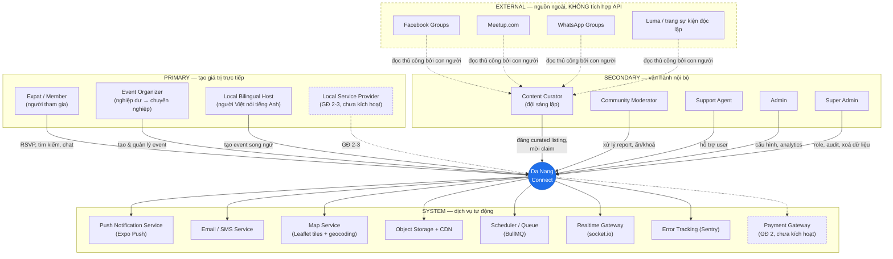
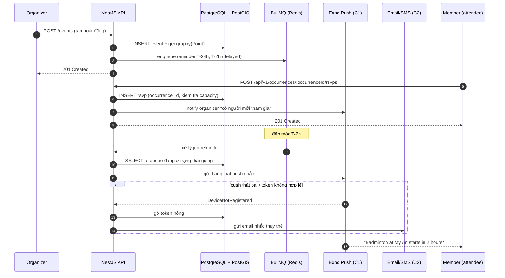
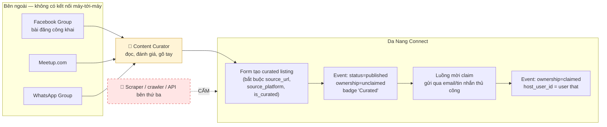
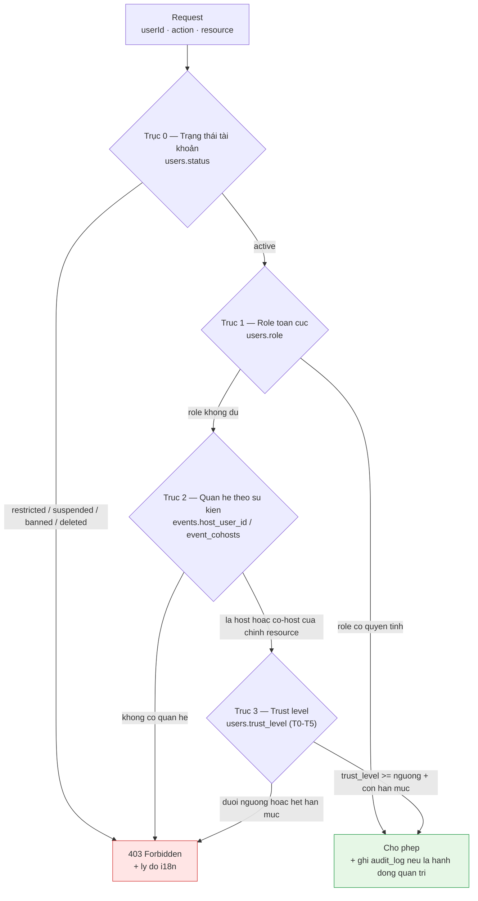
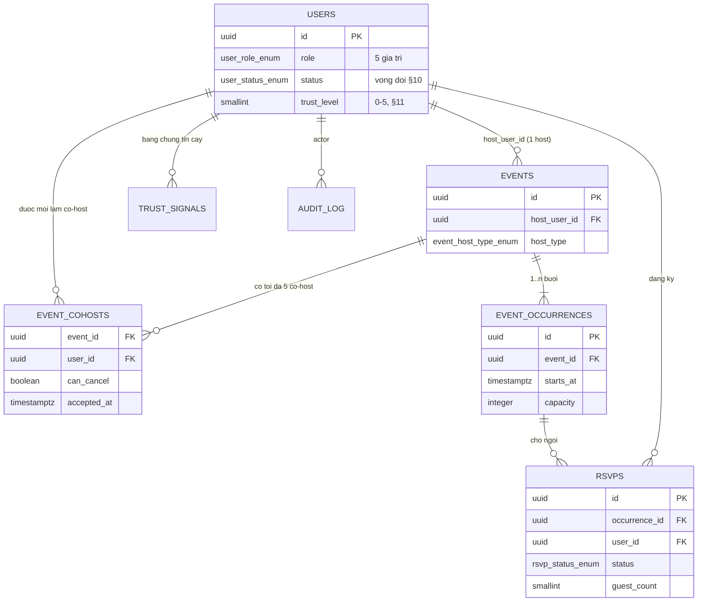
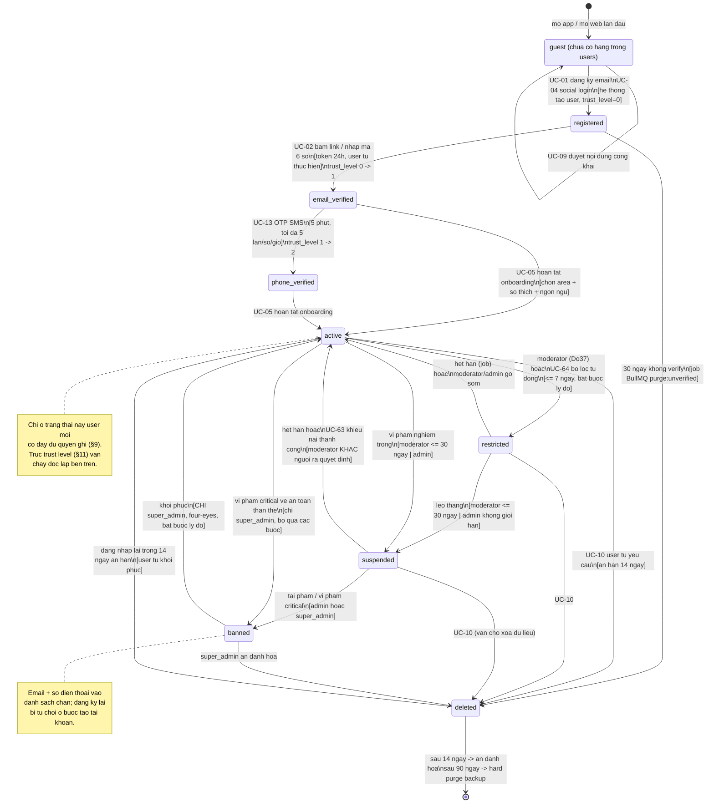
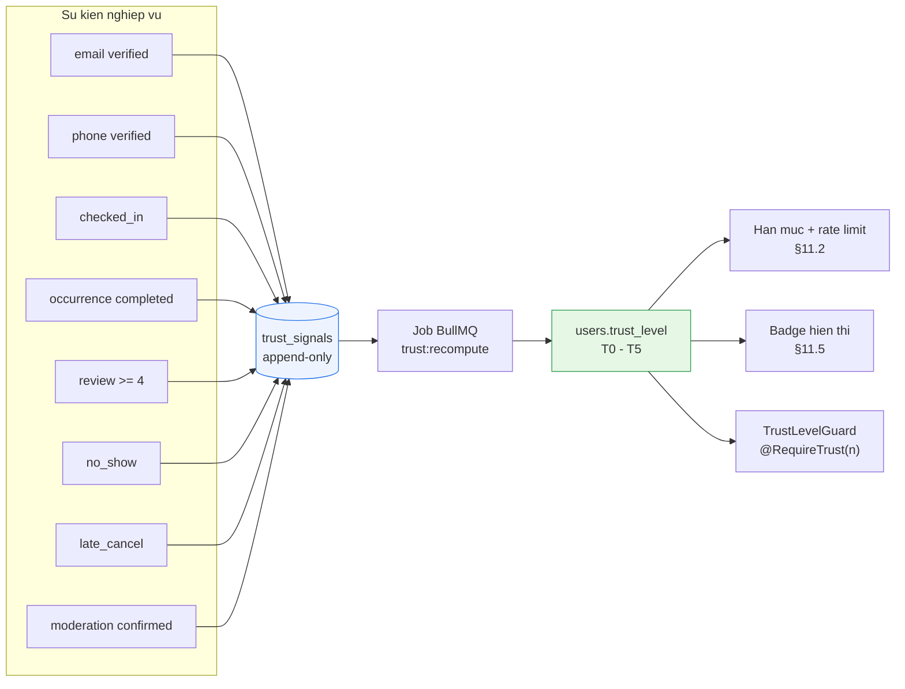

# 01 — Tác nhân & Phân quyền — Da Nang Connect (Giai đoạn 1)

| Thuộc tính | Giá trị |
|---|---|
| Tài liệu | Phân tích tác nhân (actor) & mô hình phân quyền (RBAC) |
| Sản phẩm | **Da Nang Connect** |
| Phạm vi | Giai đoạn 1 — Kết nối cộng đồng (event, thể thao, trao đổi ngôn ngữ). Địa lý: **chỉ Đà Nẵng** |
| Phiên bản | 1.0 |
| Ngày | 2026-08-31 |
| Trạng thái | Draft để review với đội sáng lập |
| Tài liệu nguồn | `docs/source/Da_Nang_Connect_Brief.txt` |
| Đối tượng đọc | Product owner, backend/mobile/web engineer, community ops |

---

## Mục lục

1. [Phạm vi & nguyên tắc thiết kế](#1-phạm-vi--nguyên-tắc-thiết-kế)
2. [Bản đồ tác nhân tổng quan](#2-bản-đồ-tác-nhân-tổng-quan)
3. [Primary actor — người dùng trực tiếp tạo giá trị](#3-primary-actor--người-dùng-trực-tiếp-tạo-giá-trị)
4. [Secondary actor — vận hành & kiểm duyệt](#4-secondary-actor--vận-hành--kiểm-duyệt)
5. [System actor — dịch vụ nội bộ & tích hợp](#5-system-actor--dịch-vụ-nội-bộ--tích-hợp)
6. [External actor — nguồn ngoài, không tích hợp API](#6-external-actor--nguồn-ngoài-không-tích-hợp-api)
7. [Persona chi tiết](#7-persona-chi-tiết)
8. [Hệ thống role](#8-hệ-thống-role)
9. [Ma trận phân quyền RBAC](#9-ma-trận-phân-quyền-rbac)
10. [Vòng đời tài khoản (state machine)](#10-vòng-đời-tài-khoản-state-machine)
11. [Trust level & badge](#11-trust-level--badge)
12. [Mapping role → use case](#12-mapping-role--use-case)
13. [Ghi chú triển khai kỹ thuật](#13-ghi-chú-triển-khai-kỹ-thuật)
14. [Rủi ro phân quyền & câu hỏi mở](#14-rủi-ro-phân-quyền--câu-hỏi-mở)
15. [Quyết định đã chốt](#15-quyết-định-đã-chốt)

---

## 1. Phạm vi & nguyên tắc thiết kế

### 1.1 Điều gì thuộc giai đoạn 1

Giai đoạn 1 chỉ phục vụ **kết nối cộng đồng**: tạo hoạt động, RSVP, tìm kiếm/lọc theo khu vực, hồ sơ cá nhân có độ tin cậy. Không có dòng tiền giữa hai người dùng, không có xác thực chuyên môn, không có tranh chấp hợp đồng. Đây là lý do mô hình phân quyền ở giai đoạn 1 có thể **nhẹ và mở**, ưu tiên giảm ma sát cho người tạo nội dung.

Các actor thuộc giai đoạn 2 (nhà ở) và giai đoạn 3 (y tế/dịch vụ chuyên môn) vẫn được liệt kê trong tài liệu này ở dạng **thiết kế trước, chưa kích hoạt** — mục đích là để schema `roles`, `permissions`, `trust_level` không phải migrate phá vỡ khi mở rộng.

### 1.2 Năm nguyên tắc chi phối toàn bộ mô hình phân quyền

| # | Nguyên tắc | Hệ quả thiết kế |
|---|---|---|
| P1 | **Tạo hoạt động phải gần như không ma sát** | Bất kỳ `member` nào (chỉ cần verified email) đều tạo được hoạt động. Không có "đơn xin làm organizer". `organizer` **không phải role toàn cục** mà là **quan hệ theo sự kiện** (`events.host_user_id` / `event_cohosts`) — xem §8.4. |
| P2 | **Độ tin cậy thay cho kiểm duyệt trước** | Mặc định hoạt động publish ngay (`auto-approve`). Kiểm duyệt là **hậu kiểm** dựa trên report + tín hiệu rủi ro. Chỉ tài khoản trust thấp mới bị đưa vào hàng đợi duyệt. |
| P3 | **Curate thủ công là công dân hạng nhất** | `curator` là role có thật trong hệ thống ngay từ MVP, có quyền tạo listing thay mặt bên thứ ba và quyền bàn giao (claim) listing đó cho organizer gốc. |
| P4 | **An toàn khi gặp người lạ ngoài đời** | Mọi quyền liên quan đến gặp mặt trực tiếp (xem danh sách người tham gia, chat 1-1, xem địa điểm chính xác) đều gắn với trust level, không mở cho `guest`. |
| P5 | **Least privilege + audit** | Mọi hành động của `moderator`/`admin`/`super_admin` ghi `audit_log` bất biến. Quyền huỷ hoại (xoá vĩnh viễn, đổi role) chỉ nằm ở `super_admin`. |

### 1.3 Từ vựng thống nhất

| Thuật ngữ (EN — dùng trong code) | Nghĩa trong sản phẩm |
|---|---|
| `event` | Một hoạt động có thời gian & địa điểm: buổi thể thao, meetup ngôn ngữ, sự kiện cộng đồng |
| `rsvp` | Hành động đăng ký tham gia một `event` |
| `attendee` | Người đã RSVP và được ghi nhận |
| `host` / `organizer` | Người chịu trách nhiệm tổ chức một `event`. **Là quan hệ theo sự kiện, không phải role toàn cục** — xem §8.4 |
| `curated listing` | `event` do đội sáng lập đăng lại từ nguồn công khai, chưa có organizer gốc trên hệ thống |
| `claim` | Quy trình organizer gốc nhận quyền quản lý một `curated listing` |
| `area` | Khu vực trong Đà Nẵng (An Thượng, Mỹ Khê, Mỹ An, Hải Châu…) |
| `trust_level` | Bậc tin cậy T0–T5 của một tài khoản |
| `no_show` | Đã RSVP nhưng không có mặt, bị host đánh dấu |

**Ngôn ngữ UI**: tiếng Anh là mặc định, tiếng Việt là ngôn ngữ thứ hai. Mọi nhãn role/badge/trạng thái trong tài liệu này đều có key i18n dạng `role.curator.label`, `trust.level.t2.label`, `badge.reliable_attendee.name`.

---

## 2. Bản đồ tác nhân tổng quan



> **Đọc sơ đồ**: mũi tên nét đứt từ khối EXTERNAL đi vào **con người** (`Content Curator`), không đi vào hệ thống. Đây là biểu diễn trực quan của quyết định "không scraping, không tích hợp API Facebook/Meetup" trong brief.

---

## 3. Primary actor — người dùng trực tiếp tạo giá trị

### 3.1 A1 — Expat / Member (người tham gia)

Actor đông nhất và là lý do tồn tại của sản phẩm. Bao gồm digital nomad ngắn hạn, expat định cư dài hạn, du học sinh, người đi làm theo hợp đồng nước ngoài, và người nước ngoài đã lập gia đình tại Đà Nẵng.

| Khía cạnh | Nội dung |
|---|---|
| **Mục tiêu chính** | Biết "tuần này ở Đà Nẵng có gì diễn ra" trong dưới 60 giây, và đăng ký tham gia mà không cần vào 5 kênh khác nhau |
| **Mục tiêu phụ** | Tìm bạn cùng chơi thể thao gần chỗ ở; luyện tiếng Việt/tiếng Anh; mở rộng mạng lưới xã hội khi vừa tới thành phố |
| **Động lực** | Cô đơn khi mới đến; nhu cầu thuộc về một cộng đồng; sợ bỏ lỡ (FOMO) các hoạt động; muốn gặp người "cùng tần số" nói được tiếng Anh |
| **Pain point** | (1) Sự kiện chìm trong feed Facebook, không lọc được theo khu vực/thời gian; (2) phải theo dõi song song Facebook + Meetup + WhatsApp + Luma; (3) đến nơi mới biết sự kiện đã huỷ hoặc hết chỗ; (4) không biết người tổ chức là ai, có đáng tin không; (5) sự kiện ghi tiếng Việt, không rõ có nói tiếng Anh không |
| **Tần suất sử dụng** | Chủ động 2–4 lần/tuần (thường tối thứ Tư → sáng thứ Bảy khi lên kế hoạch cuối tuần); thụ động hằng ngày qua push notification |
| **Thiết bị chính** | **Mobile (Expo app) ~80%** — iOS chiếm ưu thế ở nhóm nomad phương Tây, Android ở nhóm Đông Á/Nga. Web (Next.js) dùng khi đọc chi tiết dài hoặc từ coworking space |
| **Kỳ vọng** | UI tiếng Anh mặc định; lọc theo khu vực **cấp phường/khu**, không phải cấp thành phố; thấy rõ ai đã tham gia; RSVP trong 2 chạm; nhắc trước sự kiện ở mốc T-24h và T-2h; huỷ RSVP không bị phán xét |
| **Anti-goal (điều họ *không* muốn)** | Bị spam quảng cáo dịch vụ; bị lộ số điện thoại; phải điền form dài khi đăng ký; nhận thông báo về sự kiện cách chỗ ở 15km |
| **Role hệ thống tương ứng** | Role toàn cục `member`; trust level đi từ **T0 → T2** sau khi verify email + phone (xem §11) |
| **Chỉ số thành công** | Tỷ lệ RSVP/lượt xem chi tiết ≥ 12%; tỷ lệ quay lại tuần kế tiếp (W1 retention) ≥ 35% |

### 3.2 A2 — Event Organizer

Chia làm hai nhánh rất khác nhau về hành vi, được mô tả kỹ ở phần persona (§7.3, §7.4). Ở đây mô tả đặc điểm chung.

| Khía cạnh | Nội dung |
|---|---|
| **Mục tiêu chính** | Có đủ người tham gia hoạt động mình tổ chức, đúng đối tượng, không phải tự đi mời từng người trong inbox |
| **Mục tiêu phụ** | Dự đoán được số lượng để đặt chỗ/mua vật tư; xây dựng danh tiếng cá nhân trong cộng đồng; giữ liên lạc với người tham gia cũ |
| **Động lực** | Nghiệp dư: nhu cầu xã hội thuần tuý, muốn có đủ người để hoạt động diễn ra. Chuyên nghiệp: dòng khách ổn định cho quán bar / phòng gym / trung tâm ngôn ngữ / studio yoga |
| **Pain point** | (1) Đăng bài Facebook thì 30 phút sau đã trôi mất; (2) Meetup thu phí duy trì nhóm — quá đắt cho một buổi cầu lông ngẫu hứng; (3) không biết bao nhiêu người thực sự đến (comment "interested" ≠ đến); (4) no-show phá hỏng kế hoạch; (5) phải trả lời cùng một câu hỏi (địa chỉ ở đâu, có nói tiếng Anh không) hàng chục lần |
| **Tần suất sử dụng** | Nghiệp dư: theo đợt, 1–4 lần/tháng, tập trung quanh ngày tạo và ngày diễn ra. Chuyên nghiệp: 3–7 lần/tuần, có thói quen kiểm tra dashboard |
| **Thiết bị chính** | Nghiệp dư: mobile gần như 100%. Chuyên nghiệp: **web cho tạo & phân tích** (nhập mô tả dài, upload ảnh chất lượng cao, xem analytics), mobile cho check-in tại chỗ |
| **Kỳ vọng** | Tạo hoạt động dưới 90 giây trên mobile; nhân bản (duplicate) hoạt động tuần trước; lặp lại theo lịch (recurring); danh sách người tham gia xuất được; nhắn tin cho toàn bộ người đã RSVP một lần; số liệu lượt xem — RSVP — có mặt |
| **Anti-goal** | Phải trả phí ở giai đoạn 1; bị bắt xác minh danh tính trước khi đăng bài đầu tiên; giao diện phức tạp kiểu CRM |
| **Role hệ thống tương ứng** | Role toàn cục `member`; trở thành **host theo sự kiện** ngay khi hoạt động đầu tiên được publish (§8.4) |
| **Chỉ số thành công** | ≥ 40% organizer tạo hoạt động thứ hai trong vòng 30 ngày; tỷ lệ hoạt động bị huỷ vì thiếu người < 15% |

### 3.3 A3 — Local Bilingual Host (người Việt nói tiếng Anh)

Actor này **không có trong brief một cách tường minh** nhưng suy ra trực tiếp từ insight "gần như mọi nhu cầu đều kèm điều kiện English-speaking". Đây là nguồn cung quý và là cầu nối văn hoá — cần được thiết kế đường vào riêng, không ép họ tự nhận mình là "expat".

| Khía cạnh | Nội dung |
|---|---|
| **Mục tiêu chính** | Tổ chức/dẫn dắt hoạt động cho người nước ngoài: language exchange, dẫn tour ẩm thực địa phương, lớp nấu ăn, nhóm chạy bộ |
| **Động lực** | Luyện tiếng Anh miễn phí; mở rộng quan hệ quốc tế; một số có động cơ nghề nghiệp (giáo viên, hướng dẫn viên, chủ quán nhỏ) |
| **Pain point** | Bị nhóm Facebook expat coi là "người ngoài" hoặc nghi ngờ động cơ thương mại; không biết đăng ở đâu để tới đúng đối tượng; rào cản viết mô tả bằng tiếng Anh |
| **Tần suất sử dụng** | 1–3 lần/tuần |
| **Thiết bị chính** | Mobile (Android chiếm ưu thế) |
| **Kỳ vọng** | UI có thể chuyển sang tiếng Việt; gợi ý mẫu mô tả song ngữ; badge thể hiện "người bản địa" để tạo tin cậy chứ không bị nghi ngờ |
| **Role hệ thống tương ứng** | Role toàn cục `member` (thường kiêm host theo sự kiện) + badge `local_host` |
| **Ghi chú thiết kế** | Trường `is_local` trên profile là **tự khai + xác minh nhẹ** (số điện thoại đầu số Việt Nam + verify). Không dùng để hạn chế quyền, chỉ để hiển thị badge và phục vụ bộ lọc "hoạt động có người bản địa dẫn". |

### 3.4 A4 — Local Service Provider *(giai đoạn 2–3, thiết kế trước — chưa kích hoạt)*

| Khía cạnh | Nội dung |
|---|---|
| **Mục tiêu** | Tiếp cận khách hàng expat cho dịch vụ nhà ở (GĐ2) hoặc y tế/chuyên môn (GĐ3) |
| **Động lực** | Khoảng trống cung 11:1 (chung) và 90× (y tế/wellness) — nhu cầu có sẵn, không phải tạo mới |
| **Pain point** | Không nói tiếng Anh đủ tốt để tự tiếp thị; không có kênh tiếp cận tập trung; khó chứng minh uy tín với người lạ nước ngoài |
| **Tần suất** | Hằng ngày (khi đã kích hoạt) |
| **Kỳ vọng** | Hồ sơ doanh nghiệp có xác minh; nhận yêu cầu trực tiếp; thống kê lượt xem |
| **Role dự kiến** | Ở GĐ1 **không thêm giá trị nào vào `user_role_enum`** (enum chốt đúng 5 giá trị — §8.1). GĐ2–3 mô hình hoá nhà cung cấp bằng bảng riêng `service_providers` + quan hệ `provider_members`, không đụng vào enum role |
| **Quyết định GĐ1** | ❌ Không kích hoạt. Không có UI đăng ký. Không có endpoint. Chỉ có giá trị enum dự trữ trong DB. |

---

## 4. Secondary actor — vận hành & kiểm duyệt

### 4.1 B1 — Content Curator (đội sáng lập)

Actor **quan trọng bậc nhất ở tháng 1–6** vì là lời giải trực tiếp cho rủi ro cold-start trong brief. Người thật, thuộc đội sáng lập, làm việc chủ yếu trên web.

| Khía cạnh | Nội dung |
|---|---|
| **Mục tiêu chính** | Làm app "có sự sống" ngay ngày đầu: mỗi tuần có ≥ 25 hoạt động thật, trải đều các khu vực và loại hình |
| **Mục tiêu phụ** | Chuyển đổi organizer gốc từ bị động sang chủ động — mời họ claim listing |
| **Động lực** | Sống còn của sản phẩm; mỗi listing được claim là một tín hiệu product-market fit |
| **Pain point** | (1) Nhập liệu thủ công lặp đi lặp lại từ Facebook/Meetup/WhatsApp rất tốn công; (2) khó theo dõi listing nào đã liên hệ organizer, đã gửi lời mời claim lần mấy; (3) sợ đăng nhầm thông tin sai (sai giờ, sai địa chỉ) làm mất uy tín |
| **Tần suất sử dụng** | **Hằng ngày**, tập trung 2 phiên: sáng thứ Hai (gom sự kiện tuần) và chiều thứ Năm (chốt cuối tuần) |
| **Thiết bị chính** | **Web/desktop 95%** — cần nhiều tab, copy-paste, upload ảnh |
| **Kỳ vọng công cụ** | Form tạo nhanh có nhớ giá trị lần trước; trường `source_url` + `source_platform` bắt buộc; nhãn "Curated by Da Nang Connect" hiển thị công khai; hàng đợi "chưa liên hệ / đã mời claim / đã claim"; template email mời claim; nhân bản listing hằng tuần chỉ đổi ngày |
| **Ranh giới đạo đức (bắt buộc)** | Chỉ đăng lại **sự kiện công khai**; ghi rõ nguồn; **không copy ảnh có bản quyền cá nhân**; gỡ ngay khi organizer gốc yêu cầu; **tuyệt đối không dùng script tự động thu thập dữ liệu** — đây là điều kiện pháp lý đã chốt trong brief |
| **Role hệ thống** | `curator` |

### 4.2 B2 — Community Moderator

| Khía cạnh | Nội dung |
|---|---|
| **Mục tiêu chính** | Giữ không gian an toàn, đặc biệt cho phụ nữ đi một mình và người mới đến; xử lý report trong SLA |
| **Động lực** | Trách nhiệm cộng đồng; ở giai đoạn đầu là thành viên đội sáng lập kiêm nhiệm, sau đó tuyển từ chính cộng đồng (trusted member tình nguyện) |
| **Pain point** | Report đến rải rác ngoài giờ hành chính; khó phân biệt hiểu lầm văn hoá với quấy rối thật; sợ ra quyết định sai làm mất thành viên tích cực |
| **Tần suất sử dụng** | Hằng ngày, phiên ngắn 15–30 phút; tăng vọt cuối tuần |
| **Thiết bị chính** | Web (hàng đợi xử lý), mobile cho cảnh báo khẩn |
| **Kỳ vọng công cụ** | Hàng đợi report ưu tiên theo mức độ; xem toàn bộ ngữ cảnh (nội dung, lịch sử user, report trước đó); hành động phân bậc (cảnh báo → ẩn nội dung → hạn chế → khoá tạm → cấm); mọi hành động đều ghi lý do; **không có quyền xoá vĩnh viễn** |
| **Role hệ thống** | `moderator` |
| **SLA đề xuất** | Mức `critical` (an toàn thân thể, quấy rối tình dục): 2 giờ. `high` (lừa đảo, spam hàng loạt): 12 giờ. `normal`: 48 giờ |

### 4.3 B3 — Support Agent

| Khía cạnh | Nội dung |
|---|---|
| **Mục tiêu** | Giải quyết vấn đề tài khoản: không nhận được email xác minh, quên mật khẩu, RSVP không hiện, yêu cầu xoá dữ liệu |
| **Động lực** | Giảm churn do sự cố kỹ thuật; ở tháng đầu, mỗi user đều quý |
| **Pain point** | Không thấy được điều user thấy; user mô tả sự cố mơ hồ; lệch múi giờ với user vừa rời Đà Nẵng |
| **Tần suất** | Hằng ngày, phản ứng theo ticket |
| **Thiết bị** | Web |
| **Kỳ vọng công cụ** | Tra cứu user theo email/phone; xem trạng thái tài khoản + lịch sử verify; **gửi lại** email/SMS xác minh; xem log RSVP; **impersonate ở chế độ chỉ đọc** (bắt buộc ghi audit + thông báo cho user) |
| **Role hệ thống** | Gộp vào `moderator` — **không có role `support` riêng** (quyết định MT-02, §8.1). Quyền hỗ trợ tài khoản được cấp cho `moderator` qua permission `user.support.*` |

### 4.4 B4 — Admin

| Khía cạnh | Nội dung |
|---|---|
| **Mục tiêu** | Vận hành nền tảng: quản lý taxonomy khu vực & danh mục, cấu hình feature flag, xem analytics toàn hệ thống, gửi thông báo broadcast |
| **Động lực** | Ra quyết định sản phẩm dựa trên số liệu thật, không phải cảm tính |
| **Pain point** | Số liệu rời rạc; không biết khu vực nào đang thiếu hoạt động; không đo được hiệu quả của từng đợt curate |
| **Tần suất** | 2–5 lần/tuần |
| **Thiết bị** | Web/desktop |
| **Kỳ vọng công cụ** | Dashboard: hoạt động mới/tuần theo khu vực, tỷ lệ RSVP, tỷ lệ no-show, tỷ lệ claim thành công, phễu đăng ký, top khu vực thiếu cung |
| **Role hệ thống** | `admin` |

### 4.5 B5 — Super Admin

| Khía cạnh | Nội dung |
|---|---|
| **Mục tiêu** | Giữ quyền huỷ hoại ở một chỗ duy nhất; đảm bảo tuân thủ và khả năng phục hồi |
| **Quyền độc quyền** | Gán/thu hồi role; xoá vĩnh viễn dữ liệu; ẩn danh hoá tài khoản theo yêu cầu; truy cập audit log đầy đủ; đổi cấu hình bảo mật; khôi phục tài khoản bị cấm |
| **Tần suất** | Hiếm — chỉ khi cần |
| **Thiết bị** | Web, bắt buộc bật 2FA |
| **Ràng buộc** | Tối thiểu 2 tài khoản (tránh khoá chính mình), tối đa 3 ở giai đoạn 1. Mọi hành động ghi audit log **không thể sửa/xoá**. Không được tự hạ role của chính mình khi chỉ còn 1 super admin hoạt động. |
| **Role hệ thống** | `super_admin` |

---

## 5. System actor — dịch vụ nội bộ & tích hợp

System actor là các tác nhân **không phải người**, kích hoạt use case hoặc bị use case kích hoạt. Chúng cần được liệt kê vì ảnh hưởng trực tiếp tới thiết kế queue, retry và trạng thái dữ liệu.

| ID | System Actor | Vai trò trong hệ thống | Kích hoạt bởi | Kỳ vọng / SLA nội bộ | Xử lý khi lỗi |
|---|---|---|---|---|---|
| C1 | **Push Notification Service** (Expo Push) | Nhắc trước sự kiện (T-24h, T-2h), báo có người RSVP, tin nhắn mới, hoạt động mới trong khu vực đã lưu | Job BullMQ theo lịch; sự kiện domain | Gửi < 30s kể từ khi enqueue; tỷ lệ giao thành công > 95% | Retry backoff 3 lần; token hỏng (`DeviceNotRegistered`) → gỡ token khỏi DB; fallback sang email cho nhắc T-2h |
| C2 | **Email / SMS Service** | Email xác minh, khôi phục mật khẩu, thư mời claim listing, thông báo hành động kiểm duyệt; SMS OTP xác minh số điện thoại | Đăng ký, curator, moderator | Email < 60s; OTP SMS < 20s, hiệu lực 5 phút, tối đa 5 lần/số/giờ | Hàng đợi riêng, retry 5 lần; cảnh báo Sentry khi tỷ lệ lỗi > 5% |
| C3 | **Map Service** (Leaflet/react-leaflet trên web, react-native-maps trên mobile + nguồn tile & geocoding) | Hiển thị bản đồ, chọn điểm khi tạo hoạt động, geocode địa chỉ → toạ độ, gợi ý khu vực từ toạ độ | Tạo/sửa hoạt động; màn hình khám phá | Tile tải < 2s; geocoding < 1s | Bản đồ lỗi → vẫn cho nhập địa chỉ dạng chữ + chọn `area` thủ công; **không chặn việc tạo hoạt động** |
| C4 | **Object Storage + CDN** (S3-compatible) | Lưu ảnh bìa hoạt động, avatar, ảnh giấy tờ khi verify ID | Upload từ web/mobile | Upload qua pre-signed URL; ảnh phục vụ qua CDN; ảnh giấy tờ nằm ở bucket **private**, có thời hạn lưu | Upload lỗi → hoạt động vẫn tạo được với ảnh mặc định theo danh mục |
| C5 | **Scheduler / Queue** (BullMQ trên Redis) | Job định kỳ: chuyển hoạt động sang `completed` sau giờ kết thúc, nhắc host đánh dấu điểm danh, tính lại `users.trust_level` (T0–T5) từ `trust_signals` hằng đêm, dọn RSVP mồ côi | Cron nội bộ | Job trễ < 5 phút | Job idempotent; dead-letter queue + cảnh báo |
| C6 | **Realtime Gateway** (socket.io) | Chat trong hoạt động, chat 1-1, cập nhật số chỗ còn lại theo thời gian thực, chỉ báo đang gõ | Client kết nối sau khi xác thực JWT | Độ trễ < 500ms | Mất kết nối → tự kết nối lại; tin nhắn vẫn lưu qua REST, realtime chỉ là lớp tăng tốc |
| C7 | **Error Tracking** (Sentry) | Thu thập lỗi backend/web/mobile, gắn `user_id` đã ẩn danh và `release` | Runtime | — | Không được chứa PII thô; lọc token/OTP khỏi payload |
| C8 | **Payment Gateway** *(GĐ 2 — chưa kích hoạt)* | Thanh toán gói premium (bộ lọc nâng cao), sau đó là hoa hồng/phí niêm yết | — | — | Ở GĐ1: **không có endpoint thanh toán**. Chỉ thiết kế trước quyền `billing.*` trong enum permission |

### 5.1 Sơ đồ tương tác system actor cho luồng nhắc sự kiện



---

## 6. External actor — nguồn ngoài, không tích hợp API

| ID | External Actor | Quan hệ với hệ thống | Cách tương tác **duy nhất được phép** | Điều bị cấm tuyệt đối |
|---|---|---|---|---|
| D1 | **Facebook Groups** ("Expats in Da Nang", "Expats in Da Nang City") | Nguồn phát hiện sự kiện công khai; kênh seed 100 user đầu | Curator **đọc bằng mắt**, nhập tay vào form tạo listing, ghi `source_platform=facebook` + `source_url` | Scraping tự động, crawler, headless browser, dùng API không chính thức, lưu trữ hàng loạt nội dung nhóm |
| D2 | **Meetup.com** | Nguồn sự kiện có lịch cố định; đối thủ trực tiếp | Curator đọc thủ công, nhập tay, ghi nguồn | Đồng bộ tự động, nhập khẩu hàng loạt |
| D3 | **WhatsApp Groups** | Nguồn nhu cầu ad-hoc; kênh liên hệ organizer để mời claim | Curator là **thành viên thật** của nhóm, đọc và nhập tay | Bot đọc tin nhắn, export chat hàng loạt |
| D4 | **Luma, Da Nang Leisure, What's Up Da Nang** | Nguồn sự kiện quy mô lớn hơn | Đọc thủ công, nhập tay, ghi nguồn | Crawl định kỳ |
| D5 | **Nhà cung cấp OAuth** (Google, Apple, Facebook Login) | Đăng nhập xã hội | OAuth 2.0 / OIDC chuẩn, chỉ xin scope tối thiểu (`email`, `profile`) | Xin quyền đọc danh sách bạn bè, nhóm, hay bất kỳ scope nào ngoài đăng nhập |

> **Ràng buộc bắt buộc trên iOS**: nếu có bất kỳ social login nào (Google/Facebook), **phải** có Apple Sign-In. Đây là điều kiện duyệt App Store, không phải lựa chọn.

### 6.1 Ranh giới curate — biểu diễn dạng sơ đồ



---

## 7. Persona chi tiết

Sáu persona, trong đó bốn persona bắt buộc theo yêu cầu phân tích (§7.1–§7.4) và hai persona vận hành (§7.5–§7.6) vì họ là người dùng thật của phần admin.

### 7.1 Persona P1 — "Marco, digital nomad ngắn hạn"

| | |
|---|---|
| **Ảnh chân dung** | Nam, 29 tuổi, người Ý, product designer freelance |
| **Thời gian ở Đà Nẵng** | 6 tuần (đã đi Chiang Mai, Bali, Lisbon trước đó) |
| **Nơi ở** | Căn hộ ngắn hạn ở **An Thượng**, đi bộ ra biển Mỹ Khê 8 phút |
| **Thu nhập** | ~4.000 USD/tháng, khách hàng châu Âu, làm theo múi giờ CET |
| **Ngôn ngữ** | Tiếng Anh (thành thạo), tiếng Ý (mẹ đẻ), tiếng Việt gần như không |
| **Thiết bị** | iPhone 15, MacBook Air. Dùng app khi nằm dài; dùng web ở coworking |
| **Kênh hiện tại** | 3 nhóm WhatsApp nomad, 2 nhóm Facebook expat, Meetup (ít khi mở), Luma |

**Một ngày điển hình liên quan tới sản phẩm**
> 17:30 xong việc → mở điện thoại → "tối nay có gì?" → lướt Facebook 8 phút, thấy 4 bài trùng nhau, 2 bài không rõ giờ, 1 bài bằng tiếng Việt → bỏ cuộc → ăn một mình → cảm thấy tiếc.

| Khía cạnh | Nội dung |
|---|---|
| **Mục tiêu** | Trong 6 tuần, có được 3–5 người quen đủ thân để đi ăn/leo núi/lướt sóng cùng; giữ nhịp thể thao (bóng rổ, chạy bộ, lướt sóng) |
| **Động lực sâu** | Sợ 6 tuần trôi qua mà chỉ có laptop và biển; muốn có "cảm giác thuộc về" nhanh chóng vì thời gian ngắn |
| **Pain point (xếp theo mức đau)** | 1. **Thời gian ngắn** — không đủ kiên nhẫn theo dõi 5 kênh, cần biết ngay hôm nay/tối nay có gì<br/>2. **Ad-hoc không có chỗ** — "ai chơi bóng rổ tối nay 19h ở Mỹ An?" không hợp cơ chế sự kiện có lịch của Meetup<br/>3. **Không biết ai sẽ đến** — ngại đến một mình chỗ toàn người lạ<br/>4. **Bán kính quan trọng** — không đi sự kiện cách hơn 4km bằng xe máy thuê |
| **Tần suất** | Mở app **hằng ngày**, cao điểm 17:00–20:00; RSVP 2–4 lần/tuần |
| **Kỳ vọng với Da Nang Connect** | Bộ lọc "Tonight" + "Within 3km of me"; xem avatar & trust badge của người đã tham gia; RSVP 2 chạm; nhắc T-2h; chat nhóm sự kiện để hỏi "vẫn diễn ra chứ?" |
| **Điều làm anh ta bỏ app** | Đăng ký bắt buộc trước khi được xem gì; app trống trơn tuần đầu; push notification về sự kiện ở Hoà Vang |
| **Trust level thực tế đạt được** | T2–T3 (verify email + phone). Hiếm khi lên T4 vì rời thành phố trước khi đủ số hoạt động |
| **Role** | `member` (toàn cục), trust level T2–T3 |
| **Câu nói đại diện** | *"I don't want to join another group chat. I just want to know what's happening tonight within walking distance."* |
| **Hệ quả thiết kế bắt buộc** | (a) Cho phép **browse không cần đăng nhập** (guest xem được danh sách + chi tiết cơ bản); (b) bộ lọc thời gian ưu tiên **Tonight / Tomorrow / This weekend**; (c) sắp xếp mặc định theo khoảng cách khi đã cấp quyền vị trí; (d) chuẩn bị sẵn kiểu hoạt động ad-hoc cho GĐ2 nhưng GĐ1 hỗ trợ tối thiểu bằng cách cho tạo hoạt động **trong ngày** |

---

### 7.2 Persona P2 — "Sarah, expat định cư dài hạn có gia đình"

| | |
|---|---|
| **Ảnh chân dung** | Nữ, 41 tuổi, người Anh, quản lý marketing từ xa cho công ty Singapore |
| **Thời gian ở Đà Nẵng** | Năm thứ 4, có ý định ở lâu dài |
| **Gia đình** | Chồng (người Úc, dạy tiếng Anh), 2 con 6 và 9 tuổi học trường quốc tế |
| **Nơi ở** | Nhà thuê ở **Mỹ An**, gần trường quốc tế khu Ngũ Hành Sơn |
| **Ngôn ngữ** | Tiếng Anh (mẹ đẻ), tiếng Việt giao tiếp cơ bản (đi chợ, taxi) |
| **Thiết bị** | iPhone 13, iPad (dùng buổi tối), laptop công việc. Ưu tiên mobile nhưng đọc kỹ hơn trên iPad |
| **Kênh hiện tại** | Nhóm Facebook phụ huynh trường quốc tế, nhóm WhatsApp hàng xóm, nhóm "Expats in Da Nang" (đọc nhiều, ít đăng) |

| Khía cạnh | Nội dung |
|---|---|
| **Mục tiêu** | Tìm hoạt động **cả gia đình tham gia được** (dã ngoại, dọn rác bãi biển, hội chợ); giữ vòng bạn bè ổn định; thỉnh thoảng có buổi riêng cho bản thân (yoga, book club) |
| **Động lực sâu** | Con cái cần bạn; bản thân cần cộng đồng bền vững chứ không phải người quen 2 tuần rồi biến mất; muốn đóng góp lại cho cộng đồng |
| **Pain point** | 1. **An toàn & phù hợp** — cần biết hoạt động có phù hợp trẻ em không, có rượu bia không<br/>2. **Nhiễu từ nhóm nomad** — 80% nội dung là party, pub crawl, không liên quan<br/>3. **Lên kế hoạch trước** — cần biết trước 1–2 tuần để sắp lịch gia đình; sự kiện đăng trước 3 giờ là vô dụng<br/>4. **Người lạ** — không cho con đến chỗ không rõ ai tổ chức<br/>5. **Vòng lặp mất người** — kết bạn rồi người ta rời đi, mệt mỏi |
| **Tần suất** | 1–2 lần/tuần, thường tối Chủ nhật khi lên lịch tuần; hiếm khi mở app lúc gấp |
| **Kỳ vọng** | Bộ lọc `family_friendly`, `alcohol_free`, độ tuổi phù hợp; xem lịch dạng calendar 2 tuần tới; thấy rõ organizer là ai, đã tổ chức bao nhiêu buổi, đánh giá thế nào; lưu bộ lọc + nhận thông báo hằng tuần thay vì realtime; kiểm soát quyền riêng tư chặt (không hiện họ tên đầy đủ, không cho người lạ nhắn tin) |
| **Điều làm cô ấy bỏ app** | Nhận tin nhắn quấy rối từ tài khoản lạ; không có cách báo cáo; app đầy sự kiện nhậu |
| **Trust level thực tế** | T4–T5 — sẵn sàng verify ID nếu điều đó giúp cô ấy và con an toàn hơn |
| **Role** | `member` (toàn cục), trust level T4–T5; trở thành host theo sự kiện khi tự tổ chức picnic gia đình |
| **Câu nói đại diện** | *"I need to know who's running it and whether I can bring my kids. Everything else is secondary."* |
| **Hệ quả thiết kế bắt buộc** | (a) Thuộc tính `audience` trên event: `adults_only` / `family_friendly` / `all_ages`;<br/>(b) `alcohol_served: boolean`;<br/>(c) cài đặt riêng tư: `who_can_message_me = everyone / verified_only / attendees_of_my_events`, mặc định **verified_only**;<br/>(d) hiển thị hồ sơ organizer nổi bật ngay trên card sự kiện, không giấu ở màn hình phụ;<br/>(e) digest email/push hằng tuần cho người dùng ít mở app |

---

### 7.3 Persona P3 — "Tom, organizer nghiệp dư"

| | |
|---|---|
| **Ảnh chân dung** | Nam, 34 tuổi, người Mỹ, kỹ sư phần mềm làm từ xa |
| **Thời gian ở Đà Nẵng** | 1,5 năm |
| **Nơi ở** | **Sơn Trà**, gần biển Mỹ Khê |
| **Vai trò cộng đồng** | Tự phát tổ chức cầu lông tối thứ Ba & thứ Năm, thỉnh thoảng leo Bán đảo Sơn Trà sáng Chủ nhật |
| **Không kiếm tiền từ việc này** | Chia đều tiền sân, đôi khi tự bù |
| **Thiết bị** | Android (Pixel), gần như 100% mobile — tạo hoạt động khi đang ngồi quán cà phê |

| Khía cạnh | Nội dung |
|---|---|
| **Mục tiêu** | Đủ 8 người cho 2 sân cầu lông; không phải nhắn từng người trong 3 nhóm chat mỗi tuần |
| **Động lực sâu** | Muốn chơi thể thao, không muốn làm "quản lý sự kiện"; việc tổ chức chỉ là chi phí phải trả để được chơi |
| **Pain point** | 1. **Bài đăng chìm** — đăng Facebook lúc 10h sáng, 12h trưa đã trôi<br/>2. **"Interested" ≠ đến** — 15 người thả tim, 5 người xuất hiện<br/>3. **No-show phá kế hoạch** — đã đặt 2 sân, đến nơi có 5 người<br/>4. **Trả lời lặp lại** — "sân ở đâu?", "bao nhiêu tiền?", "có vợt cho mượn không?" × 20 lần/tuần<br/>5. **Chi phí Meetup** — phí duy trì nhóm không đáng cho việc phi lợi nhuận |
| **Tần suất** | 2–3 lần/tuần tạo/nhân bản hoạt động; kiểm tra danh sách người tham gia mỗi ngày trước buổi chơi |
| **Kỳ vọng** | Nhân bản buổi tuần trước chỉ đổi ngày (< 30 giây); recurring weekly; đặt `capacity` cứng + danh sách chờ tự động; ô "thông tin thường gặp" hiển thị ngay trên trang chi tiết; nhắn một lần tới tất cả người đã RSVP; **đánh dấu no-show bằng 1 chạm** sau buổi chơi; xem ai hay bỏ hẹn |
| **Điều làm anh ta bỏ app** | Bắt trả phí; form tạo hoạt động dài quá 1 màn hình; phải dùng web mới tạo được |
| **Trust level** | T4 (trusted) sau ~8 buổi tổ chức |
| **Role** | `member` (toàn cục) + host của các buổi cầu lông mình tạo |
| **Câu nói đại diện** | *"I'm not an event manager. I just want to play badminton and I need seven other people to show up."* |
| **Hệ quả thiết kế bắt buộc** | (a) `POST /events` phải làm được **hoàn toàn trên mobile trong ≤ 90 giây**, tối đa 6 trường bắt buộc;<br/>(b) `duplicate` và `recurrence_rule` là tính năng MVP, không phải "để sau";<br/>(c) `waitlist` tự động đôn lên khi có người huỷ;<br/>(d) màn hình check-in kiểu danh sách, chạm để đổi `attended` / `no_show`;<br/>(e) thông báo đẩy cho host khi có người huỷ trong vòng 6 giờ trước giờ bắt đầu |

---

### 7.4 Persona P4 — "Linh, organizer chuyên nghiệp / business"

| | |
|---|---|
| **Ảnh chân dung** | Nữ, 33 tuổi, người Việt, đồng sở hữu một studio yoga & không gian cộng đồng ở **An Thượng**; nói tiếng Anh tốt |
| **Bối cảnh kinh doanh** | Studio sống nhờ khách expat và khách lưu trú dài ngày; tổ chức 5–8 hoạt động/tuần (yoga, thiền, sound healing, language exchange tối thứ Sáu) |
| **Đội ngũ** | Bản thân + 1 nhân viên marketing bán thời gian |
| **Thiết bị** | **Laptop cho việc tạo & phân tích**, iPhone cho check-in tại quầy lễ tân |
| **Kênh hiện tại** | Instagram (chính), Facebook Page, Google Business, một số nhóm WhatsApp |

| Khía cạnh | Nội dung |
|---|---|
| **Mục tiêu** | Dòng người tham gia ổn định và **dự đoán được**; đo được kênh nào mang khách; xây thương hiệu studio trong cộng đồng expat |
| **Động lực sâu** | Doanh thu. Mỗi ghế trống là tiền mất. Nhưng cũng thật lòng muốn tạo cộng đồng — đó là điểm khác biệt của studio |
| **Pain point** | 1. **Instagram không đo được** — không biết ai thực sự sẽ đến<br/>2. **Không có lịch tập trung** — khách hỏi lịch tuần qua DM, phải trả lời tay<br/>3. **Bị coi là spam** — đăng vào nhóm Facebook expat hay bị gỡ vì "quảng cáo"<br/>4. **Rào cản ngôn ngữ ngược** — cần mô tả tiếng Anh tự nhiên, không phải dịch máy<br/>5. **Không có hồ sơ thương hiệu** — mọi thứ gắn với tài khoản cá nhân |
| **Tần suất** | Hằng ngày; tạo hàng loạt vào thứ Hai cho cả tuần; xem analytics thứ Hai và thứ Sáu |
| **Kỳ vọng** | Hồ sơ tổ chức (organization profile) tách khỏi hồ sơ cá nhân; tạo hàng loạt / lịch lặp; **nhiều người cùng quản lý một hồ sơ** (co-host); analytics: lượt xem → RSVP → có mặt, theo từng loại hoạt động; xuất danh sách người tham gia; badge xác minh doanh nghiệp; **sẵn sàng trả phí** cho nổi bật/ưu tiên khu vực (mô hình freemium GĐ sau) |
| **Điều làm cô ấy bỏ app** | Bị đối xử như spammer; không có analytics; không thể để nhân viên cùng quản lý |
| **Trust level** | T5 (ID/business verified) — chủ động muốn có badge để tạo tin cậy |
| **Role** | `member` (toàn cục) + host/co-host các buổi của studio + badge `verified_business` (+ `local_host` vì là người Việt) |
| **Câu nói đại diện** | *"I need to know which of my classes actually fill up, and I need my assistant to be able to post without using my account."* |
| **Hệ quả thiết kế bắt buộc** | (a) Khái niệm **organization** (nhiều `user` ↔ một `organization`, vai trò `owner`/`editor`) — dù MVP có thể làm tối giản, schema phải chừa chỗ;<br/>(b) `events.host_type = individual \| organization` (cột đi kèm `events.host_user_id`);<br/>(c) analytics cấp organizer là tính năng MVP, không để GĐ sau;<br/>(d) badge `verified_business` cần quy trình duyệt thủ công bởi `admin`;<br/>(e) ranh giới nội dung thương mại: cho phép quảng bá hoạt động **có thu phí** nhưng phải khai `price` minh bạch — cấm bài đăng thuần quảng cáo dịch vụ không phải hoạt động |

---

### 7.5 Persona P5 — "Minh, Content Curator (nội bộ)"

| | |
|---|---|
| **Ảnh chân dung** | Nam, 27 tuổi, người Việt, thành viên đội sáng lập, phụ trách community ops |
| **Bối cảnh** | Là thành viên thật của 6 nhóm Facebook/WhatsApp expat; biết mặt nhiều organizer ngoài đời |
| **Thiết bị** | Laptop, 2 màn hình. Mở song song app admin + trình duyệt nhóm |

| Khía cạnh | Nội dung |
|---|---|
| **Mục tiêu tuần** | 25 listing mới/tuần, phủ ≥ 5 khu vực và ≥ 4 loại hình; 3 lời mời claim gửi đi; ≥ 1 claim thành công |
| **Pain point** | Nhập tay lặp lại; mất dấu listing nào đã liên hệ; sợ sai giờ/địa chỉ; không có cách nhanh để "tuần này giống tuần trước" |
| **Tần suất** | Hằng ngày, 2 phiên/ngày |
| **Kỳ vọng công cụ (rất cụ thể)** | Form curate có: dán URL nguồn → tự điền `source_platform`; ghi nhớ khu vực & danh mục dùng gần nhất; nút "nhân bản sang tuần sau"; bảng theo dõi vòng đời claim (`not_contacted` → `contacted` → `claim_sent` → `claimed` / `declined`); template thư mời claim có chèn số liệu thật ("X người quan tâm") |
| **Trust level** | T5, role `curator` |
| **Câu nói đại diện** | *"Every listing I type by hand is a bet that the original organizer will take it over. I need to know which bets are paying off."* |
| **Hệ quả thiết kế bắt buộc** | Bảng `curated_listing_pipeline` với `claim_status`, `contact_attempts`, `last_contacted_at`, `original_organizer_contact` (lưu tối thiểu, mã hoá); dashboard tỷ lệ claim |

---

### 7.6 Persona P6 — "Anna, Community Moderator (tình nguyện từ cộng đồng)"

| | |
|---|---|
| **Ảnh chân dung** | Nữ, 38 tuổi, người Đức, sống ở Đà Nẵng 5 năm, thành viên tích cực, được đội sáng lập mời làm moderator |
| **Thời gian dành ra** | 3–5 giờ/tuần, không lương (được ghi nhận bằng badge + quyền truy cập sớm tính năng) |
| **Thiết bị** | Laptop cho xử lý hàng đợi, mobile cho cảnh báo `critical` |

| Khía cạnh | Nội dung |
|---|---|
| **Mục tiêu** | Không để một sự cố an toàn nào rơi qua kẽ hở; giữ tông cộng đồng thân thiện, không độc hại |
| **Pain point** | Report đến lúc 23h; khó phân biệt hiểu lầm văn hoá với hành vi xấu thật; áp lực khi phải khoá một người quen ngoài đời; lo bị trả đũa cá nhân |
| **Tần suất** | Hằng ngày, phiên ngắn |
| **Kỳ vọng công cụ** | Hàng đợi ưu tiên; toàn bộ ngữ cảnh trong một màn hình; hành động phân bậc có gợi ý; **ẩn danh người báo cáo**; hành động của moderator hiển thị dưới danh nghĩa "Da Nang Connect Moderation Team", **không lộ tên cá nhân**; leo thang lên `admin` bằng 1 chạm |
| **Trust level** | T5, role `moderator` |
| **Câu nói đại diện** | *"I'll do this because I care about this community — but my name must never appear on a ban notice."* |
| **Hệ quả thiết kế bắt buộc** | (a) Bút danh vận hành: thông báo kiểm duyệt gửi đi luôn ký tên tổ chức;<br/>(b) `moderation_action.actor_id` chỉ hiển thị cho `admin`/`super_admin`;<br/>(c) báo cáo luôn ẩn danh với người bị báo cáo;<br/>(d) moderator **không được** xử lý report liên quan đến chính mình hoặc hoạt động mình tổ chức — hệ thống chặn cứng (conflict-of-interest guard) |

### 7.7 So sánh nhanh sáu persona

| Tiêu chí | P1 Marco (nomad) | P2 Sarah (gia đình) | P3 Tom (nghiệp dư) | P4 Linh (business) | P5 Minh (curator) | P6 Anna (moderator) |
|---|---|---|---|---|---|---|
| Thiết bị chính | Mobile iOS | Mobile iOS + iPad | Mobile Android | **Web** + mobile | **Web** | Web + mobile |
| Tần suất | Hằng ngày | 1–2×/tuần | 2–3×/tuần | Hằng ngày | Hằng ngày | Hằng ngày |
| Tầm nhìn thời gian | Hôm nay – 3 ngày | 1–2 tuần | Tuần này | Cả tháng | Tuần tới | Thời gian thực |
| Bán kính quan tâm | ≤ 3 km | ≤ 8 km, ưu tiên gần trường | ≤ 5 km | Cố định 1 địa điểm | Toàn thành phố | Toàn thành phố |
| Nhạy cảm giá | Cao (miễn phí) | Trung bình | Rất cao (miễn phí) | Thấp (sẵn sàng trả) | — | — |
| Trust level đạt tới | T2–T3 | T4–T5 | T4 | T5 | T5 | T5 |
| Role toàn cục | `member` | `member` | `member` | `member` | `curator` | `moderator` |
| Quan hệ theo sự kiện | attendee | attendee → host | host | host + co-host (nhân viên) | — | — |
| Rủi ro lớn nhất khiến rời bỏ | App trống | Vấn đề an toàn | Có ma sát/phí | Không có analytics | Công cụ nhập liệu tệ | Kiệt sức, lộ danh tính |

---

## 8. Hệ thống role

### 8.1 Quyết định nền tảng — role toàn cục là một enum đúng 5 giá trị

Trước bản 1.0, tài liệu phân tích tồn tại mâu thuẫn **MT-02**: có chỗ nói tới `guest`, `organizer`,
`verified_member`, `support`, `service_provider` như thể chúng là role trong DB, trong khi lược đồ ở
`03-domain-va-du-lieu.md` chỉ có 4 giá trị. Bản này **chốt dứt điểm**:

> Cột `users.role` kiểu `user_role_enum` có **đúng 5 giá trị**:
> `member` | `curator` | `moderator` | `admin` | `super_admin`.
> Không có giá trị nào khác, không có giá trị "dự trữ cho giai đoạn sau".

```sql
CREATE TYPE user_role_enum AS ENUM (
  'member',       -- mặc định cho mọi tài khoản
  'curator',      -- đội sáng lập, nhập listing từ nguồn ngoài
  'moderator',    -- kiểm duyệt + hỗ trợ tài khoản (đã gộp 'support')
  'admin',        -- vận hành nền tảng, taxonomy, analytics
  'super_admin'   -- gán role, xoá vĩnh viễn, audit đầy đủ
);

ALTER TABLE users
  ADD COLUMN role user_role_enum NOT NULL DEFAULT 'member';
```

**Bốn thứ trông giống role nhưng KHÔNG phải role** — đây là nguồn gốc của MT-02:

| Khái niệm | Bản chất thật | Lưu ở đâu | Kiểm tra bằng gì |
|---|---|---|---|
| `guest` | **Trạng thái phiên**, không phải hàng trong `users`. Là "chưa có JWT hợp lệ" | Không lưu ở đâu cả | `@Public()` decorator + `request.user === undefined` |
| `organizer` | **Quan hệ theo sự kiện** — một user là organizer *của những sự kiện mình tạo*, không phải của toàn hệ thống | `events.host_user_id` và bảng `event_cohosts` | `EventRoleGuard` truy vấn quan hệ với `eventId`/`occurrenceId` trong route param |
| `verified_member` | **Trust level**, một bậc trên thang T0–T5 | `users.trust_level` (smallint 0–5) | `@RequireTrust(2)` decorator |
| `support` | **Đã gộp vào `moderator`.** Không tồn tại như role riêng | — | Permission `user.support.*` gán cho `moderator` |

Và `service_provider` (giai đoạn 2–3) **không** được thêm vào enum. Khi tới giai đoạn đó, nhà cung cấp
dịch vụ được mô hình hoá bằng bảng `service_providers` + bảng nối `provider_members(user_id, provider_id, role)`
— tức là cùng một khuôn "quan hệ theo thực thể" như `event_cohosts`, không làm phình enum toàn cục.

### 8.2 Ba trục phân quyền — mô hình chính thức

Mọi quyết định cho phép/từ chối trong hệ thống là hàm của **ba trục độc lập**, cộng thêm một cổng chặn
trạng thái tài khoản:



**Thứ tự đánh giá là bắt buộc và không đổi**: trạng thái → role → quan hệ → trust. Lý do: một `admin`
đang bị `suspended` phải bị chặn trước khi hệ thống kịp nghĩ tới role của họ; và một `member` ở T0 không
được vượt rào bằng cách trở thành host của chính event mình vừa tạo.

### 8.3 Chi tiết từng role toàn cục

| Role | Ai được cấp | Cách cấp | Ai cấp được | Số lượng dự kiến GĐ1 | Thu hồi | 2FA |
|---|---|---|---|---|---|---|
| `member` | Mọi tài khoản | Mặc định khi `INSERT users` | Hệ thống | ~100 (M1) → ~2.000 (M6) | Không áp dụng (là sàn) | Tuỳ chọn |
| `curator` | Thành viên đội sáng lập phụ trách community ops | Gán tay | `super_admin` | 2–3 | `super_admin` hạ về `member`; listing đã tạo giữ nguyên, chuyển `owned_by_team = true` | **Bắt buộc** |
| `moderator` | Nhân sự nội bộ kiêm nhiệm (M1–M3) → thành viên cộng đồng T5 tình nguyện (từ M4) | Gán tay sau khi ký cam kết bảo mật | `super_admin` (`admin` chỉ **đề xuất**) | 1–2 (M1) → 4–6 (M6) | `super_admin`; tự động hạ nếu 30 ngày không xử lý report nào | **Bắt buộc** |
| `admin` | Founder kỹ thuật / product owner | Gán tay | `super_admin` | 2 | `super_admin` | **Bắt buộc** |
| `super_admin` | CTO + một founder dự phòng | Gán tay, bắt buộc 2 người xác nhận (four-eyes) | `super_admin` khác | **Tối thiểu 2, tối đa 3** | Chỉ bởi `super_admin` khác; **hệ thống chặn cứng** thao tác làm số `super_admin` đang `active` xuống dưới 2 | **Bắt buộc + khoá bảo mật phần cứng khuyến nghị** |

**Quy tắc cứng về nâng/hạ role** (áp dụng ở tầng service, không chỉ ở UI):

1. Không role nào tự nâng chính mình. `actor_id != target_user_id` là ràng buộc kiểm tra ở `UsersService.changeRole()`.
2. Không ai gán được role **cao hơn hoặc bằng** role của chính mình, trừ `super_admin` (được gán `super_admin`).
3. Mọi lần đổi role ghi `audit_log` với `before_role`, `after_role`, `reason` (bắt buộc, tối thiểu 20 ký tự).
4. Đổi role làm **thu hồi toàn bộ refresh token** của người bị đổi → buộc đăng nhập lại, tránh giữ quyền cũ trong access token còn hạn.
5. Nâng lên `moderator`/`admin`/`super_admin` yêu cầu tài khoản đích đang ở `status = active` và `trust_level >= 3`.

### 8.4 Quan hệ theo sự kiện — `host` và `co-host`

Đây là trục thay thế cho "role `organizer`" đã bị loại bỏ.

```sql
-- Chủ sở hữu chính: đúng một người, nằm ngay trên bảng events
ALTER TABLE events
  ADD COLUMN host_user_id uuid NOT NULL REFERENCES users(id),
  ADD COLUMN host_type    event_host_type_enum NOT NULL DEFAULT 'individual'; -- individual | organization

-- Đồng tổ chức: nhiều người, quyền hạn cấu hình được
CREATE TABLE event_cohosts (
  id            uuid PRIMARY KEY DEFAULT gen_random_uuid(),
  event_id      uuid NOT NULL REFERENCES events(id) ON DELETE CASCADE,
  user_id       uuid NOT NULL REFERENCES users(id),
  can_edit      boolean NOT NULL DEFAULT true,
  can_cancel    boolean NOT NULL DEFAULT false,  -- mặc định KHÔNG cho huỷ
  can_message   boolean NOT NULL DEFAULT true,
  can_check_in  boolean NOT NULL DEFAULT true,
  invited_by    uuid NOT NULL REFERENCES users(id),
  accepted_at   timestamptz,                     -- NULL = lời mời chưa được nhận
  created_at    timestamptz NOT NULL DEFAULT now(),
  CONSTRAINT uq_event_cohosts UNIQUE (event_id, user_id)
);
CREATE INDEX idx_event_cohosts_user ON event_cohosts (user_id) WHERE accepted_at IS NOT NULL;
```

| Đặc tính | `host` | `co-host` |
|---|---|---|
| Số lượng trên một event | Đúng 1 | 0–5 (GĐ1 giới hạn 5) |
| Cách đạt được | Tạo event (UC-19), hoặc nhận quyền sở hữu listing curated (UC-68) | Được host mời và **đã bấm chấp nhận** (UC-26) — `accepted_at IS NOT NULL` |
| Trust tối thiểu | T1 để tạo, T2 để publish event có `location_precision = exact` | T2 |
| Chuyển quyền sở hữu | Chỉ host chuyển được cho một co-host đã chấp nhận | Không |
| Huỷ event | Có, luôn có | Chỉ khi `can_cancel = true` |
| Xoá event | Không ai — event đã publish chỉ chuyển sang `cancelled` | Không |
| Áp dụng ở cấp nào | Cấp `event` (áp xuống mọi `event_occurrences` con) | Cấp `event` |
| Gỡ bỏ | — | Host gỡ bất cứ lúc nào; co-host tự rời |

> **Lưu ý phạm vi**: quan hệ host/co-host gắn ở cấp **`events`**, còn RSVP và điểm danh gắn ở cấp
> **`event_occurrences`** (quyết định MT-03). Guard vì vậy phải giải `occurrenceId → event_id` trước khi
> kiểm tra quan hệ. Xem §13.3.

### 8.5 Sơ đồ quan hệ ba trục



---

## 9. Ma trận phân quyền RBAC

### 9.1 Cách đọc ma trận

- **Sáu cột role** (`guest` → `super_admin`) trả lời: *chỉ dựa vào role toàn cục*, user có quyền này không —
  **chưa** tính quan hệ với sự kiện cụ thể.
- **Hai cột ngữ cảnh** (`host của sự kiện đó`, `co-host`) là **lớp cộng thêm**: quyền mở ra khi user có
  quan hệ đó với chính resource đang thao tác, bất kể role toàn cục là gì.
- Ký hiệu: **✅ Có** · **❌ Không** · **⚠️ Đn** = có điều kiện, tra mã `Đn` ở §9.3 · **—** = không áp dụng.
- Mọi ô ✅/⚠️ đều ngầm định điều kiện nền **Đ0**: `users.status = 'active'` (hoặc `guest` với các quyền công khai).

### 9.2 Ma trận chính — 22 quyền × 8 cột

| # | Quyền | Permission key | guest | member | curator | moderator | admin | super_admin | **host của sự kiện đó** | **co-host** |
|---|---|---|---|---|---|---|---|---|---|---|
| 1 | Xem sự kiện công khai | `event.view_public` | ⚠️ Đ1 | ✅ | ✅ | ✅ | ✅ | ✅ | ✅ (kể cả `draft` của mình) | ✅ (kể cả `draft`) |
| 2 | Tạo sự kiện | `event.create` | ❌ | ⚠️ Đ2 | ✅ | ⚠️ Đ2 | ⚠️ Đ2 | ⚠️ Đ2 | — | — |
| 3 | Sửa sự kiện của mình | `event.update.own` | ❌ | ⚠️ Đ6 | ⚠️ Đ6 | ⚠️ Đ6 | ⚠️ Đ6 | ⚠️ Đ6 | ✅ Đ4 | ⚠️ Đ5 |
| 4 | Sửa sự kiện người khác | `event.update.any` | ❌ | ❌ | ⚠️ Đ7 | ⚠️ Đ8 | ⚠️ Đ9 | ⚠️ Đ9 | ❌ | ❌ |
| 5 | Huỷ sự kiện | `event.cancel` | ❌ | ⚠️ Đ6 | ⚠️ Đ7 | ⚠️ Đ11 | ⚠️ Đ9 | ⚠️ Đ9 | ✅ Đ12 | ⚠️ Đ13 |
| 6 | RSVP (đăng ký tham gia) | `rsvp.create` | ❌ Đ14 | ⚠️ Đ15 | ⚠️ Đ15 | ⚠️ Đ15 | ⚠️ Đ15 | ⚠️ Đ15 | ❌ Đ16 | ❌ Đ16 |
| 7 | Huỷ RSVP | `rsvp.cancel.own` | ❌ | ✅ Đ17 | ✅ Đ17 | ✅ Đ17 | ✅ Đ17 | ✅ Đ17 | ⚠️ Đ18 | ⚠️ Đ18 |
| 8 | Xem danh sách người tham gia | `attendee.list` | ❌ Đ19 | ⚠️ Đ20 | ⚠️ Đ7 | ⚠️ Đ21 | ⚠️ Đ21 | ⚠️ Đ21 | ✅ Đ22 | ✅ Đ22 |
| 9 | Đánh dấu check-in | `attendance.check_in` | ❌ | ❌ | ⚠️ Đ7 | ❌ | ⚠️ Đ23 | ⚠️ Đ23 | ✅ Đ24 | ⚠️ Đ25 |
| 10 | Đánh dấu no-show | `attendance.no_show` | ❌ | ❌ | ⚠️ Đ7 | ⚠️ Đ26 | ⚠️ Đ26 | ⚠️ Đ26 | ✅ Đ27 | ⚠️ Đ25 |
| 11 | Bình luận | `comment.create` | ❌ | ⚠️ Đ28 | ✅ | ✅ | ✅ | ✅ | ✅ + ghim được 1 comment | ✅ |
| 12 | Nhắn tin 1-1 | `dm.send` | ❌ | ⚠️ Đ29 | ⚠️ Đ30 | ⚠️ Đ31 | ⚠️ Đ31 | ⚠️ Đ31 | ⚠️ Đ32 | ⚠️ Đ32 |
| 13 | Báo cáo vi phạm | `report.create` | ⚠️ Đ33 | ✅ | ✅ | ⚠️ Đ34 | ⚠️ Đ34 | ⚠️ Đ34 | ✅ | ✅ |
| 14 | Ẩn nội dung | `content.hide` | ❌ | ❌ | ⚠️ Đ7 | ✅ Đ35 | ✅ Đ35 | ✅ Đ35 | ⚠️ Đ36 | ⚠️ Đ36 |
| 15 | Khoá tài khoản | `user.suspend` | ❌ | ❌ | ❌ | ⚠️ Đ37 | ⚠️ Đ38 | ✅ Đ39 | ❌ | ❌ |
| 16 | Xem hàng đợi kiểm duyệt | `moderation.queue.view` | ❌ | ❌ | ⚠️ Đ40 | ✅ Đ41 | ✅ | ✅ | ❌ | ❌ |
| 17 | Curate sự kiện từ nguồn ngoài | `curation.create` | ❌ | ❌ | ✅ Đ42 | ❌ | ✅ Đ42 | ✅ Đ42 | — | — |
| 18 | Xem analytics cấp sự kiện | `analytics.event.view` | ❌ | ❌ | ⚠️ Đ7 | ❌ | ✅ | ✅ | ✅ Đ43 | ✅ Đ43 |
| 19 | Xem analytics toàn hệ thống | `analytics.platform.view` | ❌ | ❌ | ⚠️ Đ44 | ❌ | ✅ | ✅ | ❌ | ❌ |
| 20 | Quản lý khu vực | `area.manage` | ❌ | ❌ | ❌ Đ45 | ❌ | ⚠️ Đ46 | ⚠️ Đ46 | ❌ | ❌ |
| 21 | Quản lý danh mục | `category.manage` | ❌ | ❌ | ❌ Đ45 | ❌ | ⚠️ Đ47 | ⚠️ Đ47 | ❌ | ❌ |
| 22 | Xem audit log | `audit_log.view` | ❌ | ⚠️ Đ48 | ⚠️ Đ48 | ⚠️ Đ49 | ⚠️ Đ50 | ✅ Đ51 | ❌ | ❌ |

### 9.3 Bảng điều kiện — giải thích từng mã `Đn`

| Mã | Điều kiện đầy đủ (là đặc tả để viết guard, không phải mô tả chung chung) |
|---|---|
| **Đ0** | Điều kiện nền cho mọi ô: `users.status = 'active'`. Trạng thái `restricted` chỉ giữ lại quyền đọc + `report.create` + `rsvp.cancel.own`; `suspended`/`banned`/`deleted` mất toàn bộ quyền ghi và không đăng nhập được. |
| **Đ1** | `guest` thấy: tiêu đề, mô tả, ảnh bìa, danh mục, `area`, ngày giờ, tên hiển thị + badge của host, số chỗ còn lại. **Bị che**: địa chỉ chính xác (chỉ thấy tâm khu vực với bán kính 500 m khi `location_precision = area_only`), danh sách người tham gia, bình luận (chỉ thấy 3 comment đầu rồi chặn), link liên hệ. Sự kiện `draft` / `pending_review` / `cancelled` không nằm trong feed công khai. |
| **Đ2** | `trust_level >= 1` (email đã verify) **và** còn hạn mức tạo theo bậc (§11.2) **và** `status = 'active'`. Với `trust_level = 1`, event tạo ra vào `pending_review` nếu mô tả chứa link ngoài allowlist hoặc số điện thoại. `moderator`/`admin`/`super_admin` tạo event **với tư cách member bình thường** — role vận hành không cho đặc quyền tạo. |
| **Đ4** | Host sửa được mọi trường. Nếu là **thay đổi trọng yếu** (`starts_at`, `ends_at`, `venue`, `price`, `capacity` giảm) thì: bắt buộc nhập `change_reason`, hệ thống gửi thông báo tới toàn bộ RSVP `going` + `waitlisted`, và huỷ/đặt lại job nhắc T-24h & T-2h. Sau khi occurrence đã `completed` thì chỉ sửa được `summary` và ảnh tổng kết. |
| **Đ5** | Co-host cần `event_cohosts.can_edit = true` và `accepted_at IS NOT NULL`. **Không** sửa được: `host_user_id`, `host_type`, danh sách co-host, và không xoá được occurrence đã có RSVP. |
| **Đ6** | Không có quyền nhờ role. Chỉ có quyền khi chính user là `events.host_user_id` hoặc co-host của **chính** event đó — tức là rơi về hai cột ngữ cảnh. Ghi ⚠️ ở đây để nhắc rằng nhãn "của mình" trong tên quyền là quan hệ, không phải role. |
| **Đ7** | `curator` chỉ thao tác trên event có `source_type != 'self_serve'` **và** `claim_status != 'claimed'` **và** `created_by = <chính curator đó>` (hoặc `owned_by_team = true`). Ngay khi organizer gốc claim thành công (UC-68), quyền này tắt tự động. |
| **Đ8** | `moderator` **không** sửa nội dung nghiệp vụ. Chỉ được: che/xoá ảnh bìa vi phạm, che đoạn mô tả vi phạm (thay bằng placeholder i18n `moderation.content_removed`), gỡ link. Mọi thao tác ghi `audit_log` + `moderation_actions` với `reason` bắt buộc và thông báo tới host. |
| **Đ9** | `admin`/`super_admin` sửa/huỷ được event bất kỳ nhưng **chỉ qua màn hình admin có ô lý do bắt buộc**, không qua endpoint công khai. Ghi `audit_log` mức `high`. `admin` không sửa được event mà `host_user_id` là `super_admin`. |
| **Đ11** | `moderator` huỷ event chỉ với lý do thuộc nhóm an toàn (`safety_risk`, `illegal_content`, `impersonation`, `scam`). Không huỷ được vì lý do chất lượng nội dung. Bắt buộc thông báo host + toàn bộ attendee, và mở đường khiếu nại UC-63. |
| **Đ12** | Host huỷ bất cứ lúc nào, **bắt buộc** `cancellation_reason`. Nếu huỷ trong vòng 24 h trước `starts_at` **và** occurrence đã có ≥ 3 RSVP `going`: phải chọn lý do từ danh sách cố định, và hệ thống ghi `trust_signal` loại `late_cancel_as_host` (trọng số âm). Event chuyển `cancelled`, **không xoá** — trang vẫn truy cập được để attendee hiểu chuyện gì xảy ra. |
| **Đ13** | Co-host chỉ huỷ được khi `event_cohosts.can_cancel = true` (mặc định `false`). Khi huỷ, thông báo gửi đi vẫn ký tên host chính; host nhận push riêng "co-host X đã huỷ buổi Y". |
| **Đ14** | `guest` bị chặn có chủ đích tại đây — đây là "cổng giá trị" của sản phẩm. UI không ẩn nút RSVP mà hiện nó rồi mở màn hình đăng ký, giữ nguyên ngữ cảnh event để quay lại sau khi đăng nhập (UC-09). |
| **Đ15** | Endpoint chuẩn: `POST /api/v1/occurrences/{occurrenceId}/rsvps`. Điều kiện: `trust_level >= 1`; nếu `trust_level = 0` thì chỉ RSVP được occurrence có `trust_gate = 'none'`. Thêm: occurrence chưa `starts_at`, chưa `cancelled`, chưa bị host chặn user này, và `guest_count <= max_guests_per_rsvp`. Hết chỗ → `status = 'waitlisted'` (waitlist là **MUST** của MVP). Đường tắt `POST /api/v1/events/{eventId}/rsvps` tự trỏ tới occurrence sắp diễn ra gần nhất và trả **409** nếu event có nhiều occurrence sắp tới. |
| **Đ16** | Host/co-host **không** tạo RSVP cho chính occurrence mình tổ chức — hệ thống mặc định tính họ là có mặt và đếm vào `capacity` nếu `host_occupies_slot = true`. Trả `409 HOST_CANNOT_RSVP`. |
| **Đ17** | Huỷ RSVP của chính mình bất cứ lúc nào, không cần lý do (nguyên tắc P4 — không phán xét). Nếu huỷ trong vòng 6 h trước `starts_at`: ghi `trust_signal` `late_cancel` (âm nhẹ), và đôn người đầu waitlist lên ngay với cửa sổ xác nhận 12 h (UC-40). |
| **Đ18** | Host/co-host không "huỷ RSVP" của người khác mà dùng hành động riêng `attendee.remove` — cần lý do, gửi thông báo cho người bị gỡ, và người đó không RSVP lại được occurrence này. Co-host cần `can_edit = true`. |
| **Đ19** | `guest` chỉ thấy **số đếm** ("12 người sẽ tham gia") và tối đa 3 avatar mờ, không thấy tên. Đây là ràng buộc an toàn P4, không phải giới hạn kỹ thuật. |
| **Đ20** | `member` thấy danh sách khi **đã RSVP** occurrence đó (`going` hoặc `waitlisted`) **và** `trust_level >= 2`. Chỉ hiển thị những attendee bật `profiles.show_in_attendee_list = true`; số còn lại gộp thành "và N người khác". Không bao giờ lộ email/phone. |
| **Đ21** | `moderator`/`admin`/`super_admin` xem đầy đủ **chỉ khi đang xử lý một report gắn với occurrence đó** (`moderation_case_id` bắt buộc trên request). Mỗi lần xem ghi `audit_log` loại `pii_access`. Không có màn hình duyệt danh sách attendee tự do. |
| **Đ22** | Host/co-host thấy đầy đủ tên hiển thị, avatar, badge, trust level, câu trả lời câu hỏi đăng ký (UC-41). Email/phone **chỉ** hiển thị khi attendee bật `share_contact_with_host`. Xuất CSV yêu cầu `trust_level >= 3` của host và ghi `audit_log`. |
| **Đ23** | `admin`/`super_admin` chỉ **sửa lỗi** điểm danh khi có ticket hỗ trợ, kèm `reason`; không dùng cho vận hành thường ngày. |
| **Đ24** | Cửa sổ điểm danh mở từ **T-2h** trước `starts_at` đến **T+48h** sau `ends_at`. Ngoài cửa sổ trả `409 CHECK_IN_WINDOW_CLOSED`. Chỉ điểm danh được người có RSVP `going`. |
| **Đ25** | Co-host cần `event_cohosts.can_check_in = true`. |
| **Đ26** | Vai trò vận hành chỉ **gỡ** nhãn `no_show` khi xử lý khiếu nại (UC-63), không tự gắn nhãn. Gỡ nhãn sẽ hoàn lại `trust_signal` âm tương ứng. |
| **Đ27** | Chỉ gắn được trong cửa sổ **T+2h → T+48h** sau `ends_at`. Nếu host đánh dấu `no_show` cho **hơn 50 %** attendee của một occurrence, bản ghi vào hàng đợi kiểm duyệt để chống lạm dụng. Attendee được khiếu nại trong 7 ngày. |
| **Đ28** | `trust_level >= 1`. T0 không bình luận. Hạn mức và quyền chèn link/ảnh theo bậc — xem §11.2. Comment đầu tiên của tài khoản < 48 h tuổi đi qua bộ lọc tự động UC-64. |
| **Đ29** | Cần **đồng thời**: (a) `trust_level >= 2` của người gửi; (b) hai bên đã từng cùng có mặt trong ít nhất một `event_occurrence` (một bên là host cũng tính); (c) cài đặt `who_can_message_me` của người nhận cho phép (mặc định `verified_only`); (d) không có bản ghi `blocks` giữa hai bên; (e) còn hạn mức hội thoại mới trong ngày. Không thoả (b) → chỉ gửi được **1 tin nhắn yêu cầu kết nối**, người nhận chấp nhận thì mở luồng. |
| **Đ30** | `curator` **không** DM tự do. Thư mời claim (UC-67) gửi qua kênh hệ thống `claim_invitation`, có template cố định, token hết hạn 14 ngày, tối đa 3 lần liên hệ cho một listing. |
| **Đ31** | Vai trò vận hành chỉ gửi **tin nhắn hệ thống** dưới danh nghĩa "Da Nang Connect Team". Người nhận không trả lời trực tiếp vào luồng đó mà mở ticket. Danh tính cá nhân moderator không bao giờ lộ (yêu cầu của persona P6). |
| **Đ32** | Host/co-host nhắn được attendee của mình **bỏ qua** điều kiện (b) của Đ29, nhưng vẫn tôn trọng `blocks` và vẫn bị giới hạn tần suất. Ưu tiên dùng "broadcast tới toàn bộ attendee" (1 lượt/occurrence/ngày) thay vì DM từng người. |
| **Đ33** | `guest` báo cáo được nội dung công khai qua form không cần đăng nhập, có captcha, giới hạn 3 báo cáo/IP/ngày, mặc định xếp mức `normal`. Không báo cáo được người dùng (chỉ nội dung). |
| **Đ34** | Vai trò vận hành báo cáo được, nhưng hệ thống **chặn cứng** việc chính người đó xử lý report do mình tạo, hoặc report liên quan tới sự kiện mình host — conflict-of-interest guard (persona P6, hệ quả (d)). |
| **Đ35** | Ẩn là `status = 'hidden'` + `hidden_reason` + `hidden_by`, **không phải xoá**. Nội dung vẫn nằm trong DB phục vụ khiếu nại và nghĩa vụ lưu trữ. Xoá vĩnh viễn chỉ `super_admin` (§9.4). Bắt buộc `reason` ≥ 20 ký tự và ghi `audit_log`. |
| **Đ36** | Host/co-host ẩn được **comment trong chính event của mình**. Hành động này tự sinh một report `auto_generated` đưa vào hàng đợi moderator để chống lạm dụng bịt miệng. Không ẩn được comment của `moderator`/`admin`. |
| **Đ37** | `moderator` được: cảnh cáo, chuyển sang `restricted` **tối đa 7 ngày**, chuyển sang `suspended` **tối đa 30 ngày**. **Không** được `banned` vĩnh viễn, không khoá được tài khoản có `role != 'member'`. |
| **Đ38** | `admin` được `suspended` không giới hạn thời gian và `banned`. Không khoá được `admin` khác hay `super_admin`. |
| **Đ39** | `super_admin` khoá được mọi tài khoản trừ chính mình, và là người duy nhất **khôi phục** được tài khoản `banned`. |
| **Đ40** | `curator` chỉ thấy tab "Curated content" — các report gắn với listing do đội tạo — để tự sửa thông tin sai. Không thấy report về người dùng, không thấy nội dung nhạy cảm. |
| **Đ41** | `moderator` thấy toàn bộ hàng đợi **trừ** các case bị conflict-of-interest guard lọc ra (report do chính mình tạo, về chính mình, hoặc về event mình host/co-host). |
| **Đ42** | Bắt buộc điền `source_url`, `source_platform`, `source_verified_at`, `is_curated = true`, và listing hiển thị công khai nhãn "Curated by Da Nang Connect". **Cấm tuyệt đối** nhập bằng script/crawler — endpoint curate có rate limit 30 listing/giờ/tài khoản và chặn user-agent không phải trình duyệt. |
| **Đ43** | Analytics cấp sự kiện gồm: lượt xem, lượt xem → RSVP, RSVP → có mặt, tỉ lệ no-show, nguồn truy cập, phân bố khu vực của attendee. Số liệu **tổng hợp**, không cho khoan xuống danh tính cá nhân ngoài danh sách attendee đã có ở quyền #8. Cần `trust_level >= 2`. |
| **Đ44** | `curator` chỉ xem dashboard phễu curate (UC-69): nhập → được quan tâm → gửi lời mời → claim → tự đăng buổi kế. Không xem được số liệu doanh thu, giữ chân, hay dữ liệu toàn hệ thống. |
| **Đ45** | `curator`/`moderator` **đề xuất** thêm khu vực/danh mục qua ticket nội bộ, `admin` là người thực thi. Ghi ❌ vì không có quyền ghi trực tiếp. |
| **Đ46** | `admin` thêm/sửa được `areas` (nhãn EN/VI, `parent_id`, polygon PostGIS, thứ tự hiển thị). **Sáu khu vực MVP** — An Thượng, Mỹ Khê, Mỹ An, Hải Châu, Sơn Trà, Ngũ Hành Sơn — bị đánh dấu `is_mvp_filter = true` và **không được xoá hay ẩn**; đổi polygon của chúng cần xác nhận hai bước. Xoá một `area` đang có event trả `409`. |
| **Đ47** | Tương tự Đ46 cho `categories`. Danh mục đang được dùng bởi ≥ 1 event chỉ được **đổi tên/ẩn**, không xoá. Mọi danh mục bắt buộc có bản dịch EN **và** VI trước khi bật hiển thị. |
| **Đ48** | `member`/`curator` chỉ xem được các bản ghi audit **liên quan trực tiếp tới chính tài khoản mình** và chỉ qua bản xuất dữ liệu cá nhân (UC-10) — không có màn hình duyệt log. |
| **Đ49** | `moderator` xem được log **hành động của chính mình** (để tự kiểm tra và bảo vệ khi bị chất vấn), không xem được log của moderator khác. |
| **Đ50** | `admin` xem toàn bộ `audit_log` **trừ** các bản ghi có `actor_role = 'super_admin'` và trừ các bản ghi loại `pii_access` do super_admin thực hiện. Không sửa, không xoá. |
| **Đ51** | `super_admin` xem toàn bộ. `audit_log` là **append-only**: không có endpoint UPDATE/DELETE, và ở tầng DB thu hồi quyền `UPDATE, DELETE` của role ứng dụng trên bảng này. |

### 9.4 Ma trận bổ sung — các quyền quản trị nhạy cảm

Những quyền dưới đây không nằm trong 22 dòng chính nhưng bắt buộc phải khai báo tường minh vì chúng là
"quyền huỷ hoại" theo nguyên tắc P5.

| Quyền | Permission key | guest | member | curator | moderator | admin | super_admin | Ghi chú |
|---|---|---|---|---|---|---|---|---|
| Gán / thu hồi role | `user.role.assign` | ❌ | ❌ | ❌ | ❌ | ❌ | ✅ | Four-eyes; không tự đổi role mình; giữ ≥ 2 `super_admin` active |
| Xoá vĩnh viễn nội dung | `content.purge` | ❌ | ❌ | ❌ | ❌ | ❌ | ✅ | Chỉ khi có yêu cầu pháp lý hoặc nội dung bất hợp pháp |
| Ẩn danh hoá tài khoản | `user.anonymize` | ❌ | ❌ | ❌ | ❌ | ❌ | ✅ | Thực thi quyền được xoá dữ liệu; giữ lại bản ghi tham gia dạng ẩn danh |
| Xuất dữ liệu cá nhân của mình | `user.export.self` | ❌ | ✅ | ✅ | ✅ | ✅ | ✅ | UC-10; gửi qua link có hạn 24 h |
| Xoá tài khoản của mình | `user.delete.self` | ❌ | ✅ | ⚠️ | ⚠️ | ⚠️ | ⚠️ | Tài khoản có role ≠ `member` phải hạ role trước khi xoá được |
| Impersonate chỉ đọc | `user.impersonate.readonly` | ❌ | ❌ | ❌ | ⚠️ | ⚠️ | ✅ | Tối đa 30 phút/phiên; **bắt buộc** gửi thông báo cho user; banner đỏ trên toàn UI; ghi `audit_log` mức `critical` |
| Gửi thông báo broadcast | `notification.broadcast` | ❌ | ❌ | ❌ | ❌ | ✅ | ✅ | Tối đa 2 lượt/tuần; bắt buộc có bản EN và VI; user tắt được trong UC-53 |
| Bật/tắt feature flag | `feature_flag.manage` | ❌ | ❌ | ❌ | ❌ | ✅ | ✅ | UC-74; flag ảnh hưởng bảo mật chỉ `super_admin` |
| Mời & gỡ co-host | `event.cohost.manage` | ❌ | ⚠️ | ⚠️ | ❌ | ⚠️ | ⚠️ | Chỉ host của chính event đó; tối đa 5 co-host |
| Đôn waitlist thủ công | `waitlist.promote` | ❌ | ❌ | ⚠️ | ❌ | ⚠️ | ⚠️ | Host/co-host (`can_edit`) đôn được; hệ thống tự đôn theo FIFO là mặc định |
| Gửi lời mời claim listing | `curation.claim_invite` | ❌ | ❌ | ✅ | ❌ | ✅ | ✅ | Tối đa 3 lần/listing; token 14 ngày (UC-67) |
| Nhận quyền sở hữu listing | `event.claim` | ❌ | ⚠️ | ❌ | ❌ | ❌ | ❌ | Cần token hợp lệ + `trust_level >= 2` + email khớp domain nguồn hoặc xác minh thủ công (UC-68) |

### 9.5 Bốn bất biến phải có test tự động

| # | Bất biến | Kiểm bằng |
|---|---|---|
| INV-1 | Không tồn tại đường đi nào cho `guest` tới một endpoint ghi dữ liệu, trừ `report.create` (Đ33) | Test quét toàn bộ route, mọi route không có `@Public()` phải qua `JwtAuthGuard` |
| INV-2 | Mọi hành động của `curator`/`moderator`/`admin`/`super_admin` trên dữ liệu người khác đều sinh đúng 1 bản ghi `audit_log` | Test tích hợp cho từng permission quản trị |
| INV-3 | Số `super_admin` có `status = 'active'` luôn ≥ 2 | Ràng buộc kiểm tra ở service + test cố hạ xuống 1 phải trả `409` |
| INV-4 | Conflict-of-interest: `moderation_cases.resolved_by != moderation_cases.reported_by` và người xử lý không phải host của event liên quan | Test tích hợp EP-09 |

---

## 10. Vòng đời tài khoản (state machine)

### 10.1 Sơ đồ trạng thái

`guest` là **trạng thái phiên**, không phải hàng trong bảng `users` — nó được vẽ trong sơ đồ để thể hiện
điểm vào, nhưng không bao giờ là giá trị của `users.status`.



### 10.2 Bảng chuyển trạng thái đầy đủ

| # | Từ | Đến | Sự kiện kích hoạt | **Ai được phép chuyển** | Điều kiện bắt buộc | Tác dụng phụ | UC |
|---|---|---|---|---|---|---|---|
| S1 | `guest` | `registered` | Đăng ký email/mật khẩu hoặc social login | Chính người dùng | Email chưa tồn tại (không phân biệt hoa thường); mật khẩu ≥ 10 ký tự; chấp nhận ToS + Chính sách quyền riêng tư (ghi `consents`) | Tạo `users` với `role='member'`, `status='registered'`, `trust_level=0`; gửi email xác minh; ghi `consent_log` | UC-01, UC-04 |
| S2 | `registered` | `email_verified` | Bấm link hoặc nhập mã 6 số | Chính người dùng | Token còn hạn 24 h; tối đa 5 lần gửi lại/ngày | `trust_level = 1`; ghi `trust_signals(email_verified)`; mở quyền tạo event & bình luận (Đ2, Đ28) | UC-02 |
| S2b | `guest` | `email_verified` | Social login Google/Apple với email đã được nhà cung cấp xác minh | Hệ thống | Provider trả `email_verified = true` | Bỏ qua bước S2; vẫn phải qua S4 để `active` | UC-04 |
| S3 | `email_verified` | `phone_verified` | Nhập OTP SMS | Chính người dùng | OTP hiệu lực 5 phút; tối đa 5 lần/số/giờ; một số điện thoại chỉ gắn được một tài khoản `active` | `trust_level = 2`; mở DM (Đ29), xem attendee list (Đ20) | UC-13 |
| S4 | `email_verified` / `phone_verified` | `active` | Hoàn tất onboarding | Chính người dùng | Đã chọn `home_area` (trong 6 khu vực MVP hoặc khác), ≥ 1 sở thích, ngôn ngữ nói | Xuất hiện trong tìm kiếm hồ sơ; nhận digest hằng tuần | UC-05 |
| S5 | `active` | `restricted` | Quyết định kiểm duyệt hoặc luật tự động | `moderator` (≤ 7 ngày), `admin`, `super_admin`, hoặc **hệ thống** qua UC-64 | Bắt buộc `reason` ≥ 20 ký tự + `restricted_until`; không áp dụng được cho tài khoản `role != 'member'` bởi `moderator` | Mất quyền ghi (còn đọc, huỷ RSVP của mình, báo cáo, xoá tài khoản); thông báo cho user kèm đường khiếu nại; ghi `audit_log` | UC-62 |
| S6 | `restricted` | `active` | Hết hạn hoặc gỡ sớm | Job BullMQ `moderation:expire`, hoặc `moderator`/`admin` | — | Khôi phục quyền; ghi `audit_log`; **không** tự khôi phục trust level đã bị trừ | UC-62, UC-63 |
| S7 | `restricted` / `active` | `suspended` | Vi phạm nghiêm trọng hoặc tái phạm | `moderator` (≤ 30 ngày), `admin` (không giới hạn), `super_admin` | Bắt buộc `reason` + case kiểm duyệt liên kết | Đăng xuất mọi phiên, thu hồi refresh token; ẩn toàn bộ event đang mở của user khỏi feed (không huỷ, để host có thể khiếu nại); huỷ mọi RSVP tương lai và đôn waitlist | UC-62 |
| S8 | `suspended` | `active` | Hết hạn hoặc khiếu nại thành công | Job BullMQ, hoặc **một `moderator` khác** người ra quyết định gốc, hoặc `admin` | Conflict-of-interest guard (INV-4) | Khôi phục event đã ẩn; thông báo cho user | UC-63 |
| S9 | `suspended` / `active` | `banned` | Vi phạm critical (an toàn thân thể, quấy rối tình dục, lừa đảo có tổ chức) hoặc tái phạm sau `suspended` | `admin` (từ `suspended`), `super_admin` (từ bất kỳ trạng thái nào) | Bắt buộc `reason` + phê duyệt của người thứ hai khi đi thẳng từ `active` | Thêm hash email + hash số điện thoại vào `ban_list`; huỷ toàn bộ event tương lai kèm thông báo cho attendee; chặn đăng ký lại | UC-62 |
| S10 | `banned` | `active` | Khôi phục sau rà soát | **Chỉ `super_admin`** | Four-eyes; `reason` bắt buộc; gỡ khỏi `ban_list` | Trust level đặt lại về mức T1 bất kể trước đó là bao nhiêu | — |
| S11 | mọi trạng thái | `deleted` | Người dùng yêu cầu xoá | Chính người dùng; hoặc `super_admin` khi có yêu cầu pháp lý | Tài khoản `role != 'member'` phải được hạ về `member` trước; nhập lại mật khẩu hoặc OTP để xác nhận | Đặt `deleted_at = now()`; ẩn hồ sơ và toàn bộ nội dung khỏi công khai ngay; **ân hạn 14 ngày**; gửi email xác nhận có link huỷ yêu cầu | UC-10 |
| S12 | `deleted` | `active` | Đăng nhập lại trong ân hạn | Chính người dùng | `now() - deleted_at < 14 ngày` | Khôi phục hồ sơ và nội dung; ghi `audit_log` | UC-10 |
| S13 | `deleted` | *(kết thúc)* | Hết ân hạn | Job BullMQ `user:anonymize` | 14 ngày | Ẩn danh hoá: xoá `email`, `phone`, `avatar`, `bio`, `password_hash`; thay tên hiển thị bằng "Deleted user"; **giữ** `rsvps` và `attendance` ở dạng ẩn danh để không phá vỡ số liệu lịch sử và hồ sơ an toàn của người khác; sau 90 ngày xoá khỏi backup | UC-10 |
| S14 | `registered` | `deleted` | Không xác minh email sau 30 ngày | Job BullMQ `purge:unverified` | Không có hoạt động nào | Xoá thẳng (chưa có dữ liệu liên quan), không cần ân hạn | — |

### 10.3 Ràng buộc kỹ thuật của state machine

```sql
CREATE TYPE user_status_enum AS ENUM (
  'registered', 'email_verified', 'phone_verified',
  'active', 'restricted', 'suspended', 'banned', 'deleted'
);

ALTER TABLE users
  ADD COLUMN status           user_status_enum NOT NULL DEFAULT 'registered',
  ADD COLUMN restricted_until timestamptz,
  ADD COLUMN suspended_until  timestamptz,
  ADD COLUMN status_reason    text,
  ADD COLUMN status_changed_at timestamptz NOT NULL DEFAULT now(),
  ADD COLUMN status_changed_by uuid REFERENCES users(id);

-- Trang thai co thoi han bat buoc phai co moc het han
ALTER TABLE users ADD CONSTRAINT ck_users_restricted_until
  CHECK (status <> 'restricted' OR restricted_until IS NOT NULL);

-- Moi lan roi khoi 'active' bang quyet dinh kiem duyet deu phai co ly do
ALTER TABLE users ADD CONSTRAINT ck_users_status_reason
  CHECK (status NOT IN ('restricted','suspended','banned') OR length(coalesce(status_reason,'')) >= 20);

CREATE INDEX idx_users_status_expiry ON users (status, restricted_until, suspended_until)
  WHERE status IN ('restricted','suspended');
```

- **Chuyển trạng thái chỉ đi qua một chỗ**: `UserLifecycleService.transition(userId, toStatus, ctx)`. Không
  service nào khác được `UPDATE users SET status`. Bảng chuyển hợp lệ khai báo dạng hằng số và có unit test
  phủ toàn bộ 8 × 8 ô (các ô không hợp lệ phải ném `InvalidStateTransitionException`).
- **Job hết hạn** chạy mỗi 5 phút (`moderation:expire`), idempotent, có dead-letter queue.
- **`status` khác `trust_level`**: một tài khoản `active` vẫn có thể ở T0. Đừng suy diễn cái này từ cái kia.
- **Khôi phục ≠ xoá lịch sử**: rời `restricted`/`suspended` không hoàn lại các `trust_signals` âm đã ghi.

---

## 11. Trust level & badge

### 11.1 Định nghĩa T0–T5 — điều kiện đạt bậc

Thang **T0–T5** trong tài liệu này là **thang duy nhất** của sản phẩm (quyết định MT-12, §15.2). Cột lưu:
`users.trust_level smallint NOT NULL DEFAULT 0 CHECK (trust_level BETWEEN 0 AND 5)`.

| Bậc | Nhãn hiển thị (EN / VI) | Key i18n | Điều kiện đạt — phải thoả **tất cả** | Cách xác nhận |
|---|---|---|---|---|
| **T0** | *New* / Mới | `trust.level.t0.label` | Mặc định khi tạo tài khoản | Tự động |
| **T1** | *Email verified* / Đã xác minh email | `trust.level.t1.label` | Email đã xác minh (UC-02) hoặc social login trả `email_verified = true` | Tự động, tức thì |
| **T2** | *Phone verified* / Đã xác minh số điện thoại | `trust.level.t2.label` | T1 **+** số điện thoại đã xác minh bằng OTP (UC-13); một số chỉ gắn một tài khoản `active` | Tự động, tức thì |
| **T3** | *Active member* / Thành viên tích cực | `trust.level.t3.label` | T2 **+** tài khoản ≥ **14 ngày** **+** ( ≥ **3 occurrence** có `attendance = 'checked_in'` trong 90 ngày **HOẶC** host ≥ **1 occurrence** hoàn tất có ≥ 3 người `checked_in` ) **+** `no_show_rate < 25 %` **+** 0 case kiểm duyệt `confirmed` trong 90 ngày | Job `trust:recompute` |
| **T4** | *Trusted* / Đáng tin cậy | `trust.level.t4.label` | T3 **+** tài khoản ≥ **60 ngày** **+** ( ≥ **8 occurrence** `checked_in` trong 180 ngày **HOẶC** host ≥ **4 occurrence** hoàn tất ) **+** điểm đánh giá trung bình ≥ **4,5/5** với ≥ **5 lượt** (UC-16) **+** `no_show_rate < 10 %` **+** 0 case kiểm duyệt `confirmed` trong 180 ngày | Job `trust:recompute` |
| **T5** | *Community leader* / Người dẫn dắt cộng đồng | `trust.level.t5.label` | T4 **+ một trong**: (a) `admin` cấp `trust_signal` loại `staff_endorsement` (thủ công, có lý do); (b) đang giữ role `curator` hoặc `moderator` và còn hoạt động; (c) host ≥ **20 occurrence** hoàn tất với `no_show_rate < 8 %` **và** được `admin` duyệt | **Không bao giờ tự động hoàn toàn** — luôn cần một hành động thủ công của `admin` |

> **Vì sao T5 không tự động**: T5 mở ra hạn mức gần như không giới hạn và badge "Community leader" mang trọng
> lượng xã hội thật. Một cổng thủ công là hàng rào rẻ nhất chống lại việc nuôi tài khoản để lạm dụng.

`no_show_rate` = `no_show_count / (checked_in_count + no_show_count)`, chỉ tính occurrence trong cửa sổ thời
gian tương ứng và chỉ khi mẫu ≥ 4 lượt; mẫu nhỏ hơn coi như đạt điều kiện.

### 11.2 Quyền lợi mở ra ở từng bậc

| Quyền lợi | T0 | T1 | T2 | T3 | T4 | T5 |
|---|---|---|---|---|---|---|
| **Tạo sự kiện / ngày** | 0 | **1** | **3** | **5** | **10** | 20 (mềm) |
| Sự kiện đang mở tối đa cùng lúc | 0 | 3 | 10 | 20 | 50 | 200 |
| Sự kiện tạo ra vào trạng thái nào | — | `pending_review` nếu có link/số điện thoại, ngược lại `published` | `published` | `published` | `published`, bỏ qua bộ lọc tự động | `published` |
| Chuỗi sự kiện lặp (recurring, UC-24) | ❌ | ❌ | ❌ | ✅ | ✅ | ✅ |
| **RSVP** | Chỉ occurrence có `trust_gate = 'none'` | ✅ | ✅ | ✅ | ✅ | ✅ |
| RSVP kèm người đi cùng (`guest_count`) | 0 | 0 | 1 | 2 | 3 | 5 |
| **Nhắn tin 1-1 — hội thoại mới/ngày** | 0 | 0 | **10** | **30** | **100** | Không giới hạn mềm |
| Nhắn cho người **chưa** từng chung occurrence | ❌ | ❌ | ❌ (chỉ 1 yêu cầu kết nối) | ❌ (chỉ 1 yêu cầu kết nối) | ✅ nếu người nhận để `everyone` | ✅ |
| **Đăng ảnh** | ❌ (avatar chữ cái mặc định) | 1 ảnh bìa/sự kiện, qua kiểm duyệt | 5 ảnh/sự kiện | 10 ảnh | 20 ảnh + album tổng kết (UC-49) | 20 ảnh + album |
| Đăng avatar thật | ❌ | ✅ | ✅ | ✅ | ✅ | ✅ |
| **Link trong mô tả / bình luận** | Bị gỡ | Chỉ domain trong allowlist | Tự do trừ blocklist | Tự do trừ blocklist | Tự do | Tự do |
| **Bình luận / ngày** | 0 | 5 | 30 | 100 | 300 | Không giới hạn mềm |
| Xem danh sách người tham gia | ❌ | ❌ | ✅ (đã RSVP) | ✅ | ✅ | ✅ |
| Xem địa chỉ chính xác của sự kiện `location_precision = exact` | ❌ | ❌ | ✅ sau khi RSVP | ✅ | ✅ | ✅ |
| Xuất danh sách attendee CSV (khi là host) | ❌ | ❌ | ❌ | ✅ | ✅ | ✅ |
| Được mời làm co-host | ❌ | ❌ | ✅ | ✅ | ✅ | ✅ |
| Bảo lãnh người khác (`community_vouch`) | ❌ | ❌ | ❌ | ❌ | ✅ (3 lượt/tháng) | ✅ (10 lượt/tháng) |
| Sự kiện được ưu tiên trong dải "Featured" theo khu vực | ❌ | ❌ | ❌ | ❌ | ✅ | ✅ |
| Được mời làm `moderator` | ❌ | ❌ | ❌ | ✅ (đủ điều kiện tối thiểu) | ✅ | ✅ |
| **Rate limit API chung (req/phút/tài khoản)** | 30 | 60 | 120 | 180 | 300 | 600 |
| Rate limit ghi (POST/PATCH, req/phút) | 5 | 10 | 20 | 40 | 60 | 100 |
| Rate limit tìm kiếm (req/phút) | 20 | 40 | 60 | 90 | 120 | 120 |

> Hạn mức tính theo **cửa sổ trượt 24 h** lưu ở Redis với key `ratelimit:{scope}:{userId}`, không reset theo
> nửa đêm. Khi vượt, API trả `429` kèm header `Retry-After` và mã lỗi i18n `error.rate_limit.<scope>`.

### 11.3 Bảng tín hiệu tin cậy — `trust_signals` (append-only)

Bậc T0–T5 **không** được lưu bằng cách cộng điểm rời rạc trong code; nó được tính lại từ bảng bằng chứng.

```sql
CREATE TABLE trust_signals (
  id          uuid PRIMARY KEY DEFAULT gen_random_uuid(),
  user_id     uuid NOT NULL REFERENCES users(id) ON DELETE CASCADE,
  type        trust_signal_type_enum NOT NULL,
  direction   smallint NOT NULL,          -- +1 tich cuc, -1 tieu cuc
  weight      smallint NOT NULL,          -- do lon, dung de xep hang trong cung mot bac
  evidence_id uuid,                       -- occurrence_id / moderation_case_id / review_id
  status      trust_signal_status_enum NOT NULL DEFAULT 'verified',
  expires_at  timestamptz,
  revoked_at  timestamptz,
  revoked_by  uuid REFERENCES users(id),
  created_at  timestamptz NOT NULL DEFAULT now()
);
CREATE INDEX idx_trust_signals_user_live ON trust_signals (user_id, type)
  WHERE status = 'verified' AND revoked_at IS NULL;
```

| `type` | Hướng | Ý nghĩa & cách sinh | Hết hạn |
|---|---|---|---|
| `email_verified` | + | UC-02 hoặc social login | Không (mất khi email bounce cứng) |
| `phone_verified` | + | UC-13 OTP | 24 tháng, phải xác minh lại |
| `event_attended` | + | Host đánh dấu `checked_in` (Đ24) | Tính trong cửa sổ 90/180 ngày |
| `event_hosted_completed` | + | Occurrence do user host chuyển `completed` và có ≥ 3 người `checked_in` | 180 ngày |
| `review_received` | + | UC-16, điểm ≥ 4 | 180 ngày |
| `community_vouch` | + | Người T4/T5 bảo lãnh; trần 3 lượt nhận/người | 12 tháng |
| `staff_endorsement` | + | `admin` cấp thủ công — điều kiện cần của T5 | Không, nhưng thu hồi được |
| `no_show` | − | Host đánh dấu `no_show` (Đ27) và attendee không khiếu nại thành công | 180 ngày |
| `late_cancel` | − | Huỷ RSVP trong 6 h trước giờ bắt đầu (Đ17) | 90 ngày |
| `late_cancel_as_host` | − | Host huỷ occurrence trong 24 h khi đã có ≥ 3 RSVP (Đ12) | 180 ngày |
| `moderation_confirmed` | − | Case kiểm duyệt kết luận vi phạm | 90 ngày (`normal`) / 180 (`high`) / vĩnh viễn (`critical`) |
| `report_abuse` | − | Người dùng báo cáo sai sự thật lặp lại ≥ 3 lần | 180 ngày |

Job `trust:recompute` (BullMQ) chạy: (a) ngay sau mỗi sự kiện domain sinh signal; (b) quét toàn bộ hằng đêm
02:00 giờ Asia/Ho_Chi_Minh để xử lý signal hết hạn. Job **chỉ ghi** `users.trust_level` và
`users.trust_recomputed_at`; không có nơi nào khác được ghi hai cột này.

### 11.4 Điều kiện bị tụt bậc

Nguyên tắc: **bằng chứng xác minh** (email, phone) chỉ mất khi chính bằng chứng bị thu hồi; **bậc hành vi**
(T3–T5) mất được do hành vi.

| Sự kiện | Hệ quả | Sàn không tụt dưới | Thời gian chờ trước khi được lên lại |
|---|---|---|---|
| `no_show_rate ≥ 30 %` trong 90 ngày (mẫu ≥ 4) | Tụt **1 bậc** | T2 | 30 ngày |
| 1 case kiểm duyệt `confirmed` mức `high` | Tụt **1 bậc** | T2 | 60 ngày |
| 1 case kiểm duyệt `confirmed` mức `critical` | Về **T1** + chuyển `restricted` | T1 | 180 ngày, cần `admin` duyệt |
| Host huỷ ≥ 3 occurrence trong 30 ngày, mỗi occurrence đã có ≥ 3 RSVP | Tụt **1 bậc** | T2 | 30 ngày |
| Điểm đánh giá trung bình tụt dưới 4,0 với ≥ 5 lượt | Không giữ được T4/T5 → về T3 | T3 | 30 ngày |
| Không hoạt động 180 ngày (không RSVP, không host, không đăng nhập) | T4/T5 → **T3** | T3 | Lên lại ngay khi đủ điều kiện T4 |
| Số điện thoại bị gỡ, hết hạn 24 tháng, hoặc có khiếu nại chủ sở hữu số | Về **T1** | T1 | Xác minh lại là lên ngay |
| Email bounce cứng hoặc bị chủ sở hữu khiếu nại | Về **T0** + chuyển `registered` | T0 | Xác minh lại là lên ngay |
| `staff_endorsement` bị `admin` thu hồi | T5 → **T4** | T4 | Cần endorsement mới |
| Bị `banned` rồi được `super_admin` khôi phục (S10) | Về **T1** bất kể bậc cũ | T1 | 90 ngày |

Ràng buộc chống dao động: **một tài khoản không tụt quá 1 bậc trong 7 ngày** trừ hai trường hợp `critical` và
mất bằng chứng xác minh. Mỗi lần tụt bậc gửi thông báo in-app giải thích lý do bằng ngôn ngữ trung tính và
kèm đường dẫn tới trang "Cách hoạt động của trust level" — không dùng từ trừng phạt.

### 11.5 Badge hiển thị

Badge là **lớp hiển thị**, không cấp quyền. Một user có nhiều badge; UI hiển thị tối đa 3 badge ưu tiên cao
nhất cạnh tên, phần còn lại nằm trong hồ sơ.

| Badge | Key i18n | Điều kiện đạt | Nơi hiển thị | Mất khi nào |
|---|---|---|---|---|
| **Email verified** | `badge.email_verified` | `trust_level >= 1` | Hồ sơ (biểu tượng nhỏ) | Email bị thu hồi |
| **Phone verified** | `badge.phone_verified` | `trust_level >= 2` | Hồ sơ; card attendee | Hết hạn 24 tháng |
| **Trusted** | `badge.trusted` | `trust_level >= 4` | Cạnh tên ở mọi nơi: card sự kiện, danh sách attendee, bình luận, hồ sơ | Tụt dưới T4 |
| **Community leader** | `badge.community_leader` | `trust_level = 5` | Cạnh tên ở mọi nơi; dải "Trusted organizers" ở trang khám phá | Tụt dưới T5 |
| **Local host** | `badge.local_host` | `profiles.is_local = true` **và** `trust_level >= 2` (số điện thoại đầu số Việt Nam đã xác minh) | Card sự kiện, hồ sơ; là điều kiện của bộ lọc "có người bản địa dẫn" | Gỡ xác minh số điện thoại |
| **Verified business** | `badge.verified_business` | `admin` duyệt hồ sơ doanh nghiệp thủ công (giấy phép + địa chỉ + đối chiếu) | Card sự kiện, hồ sơ tổ chức | `admin` thu hồi; tự hết hạn sau 12 tháng nếu không gia hạn |
| **Reliable attendee** | `badge.reliable_attendee` | ≥ 10 lượt `checked_in` **và** `no_show_rate < 5 %` trong 180 ngày | Danh sách attendee, hồ sơ | Rơi khỏi ngưỡng |
| **Reliable host** | `badge.reliable_host` | ≥ 5 occurrence host hoàn tất, tỉ lệ huỷ muộn = 0, đánh giá ≥ 4,5 | Card sự kiện, hồ sơ | Rơi khỏi ngưỡng |
| **Bilingual host** | `badge.bilingual_host` | Hồ sơ khai ≥ 2 ngôn ngữ trong đó có Tiếng Việt và English, **và** đã host ≥ 2 occurrence gắn nhãn `language = bilingual` | Card sự kiện | Tự khai lại |
| **Curator team** | `badge.curator_team` | `role = 'curator'` | Chỉ trên các listing curated, dạng nhãn "Curated by Da Nang Connect" — **không** hiển thị tên cá nhân | Mất role |
| **Moderation team** | `badge.moderation_team` | `role = 'moderator'` | **Chỉ trong khu vực admin.** Không hiển thị công khai — yêu cầu bảo vệ danh tính của persona P6 | Mất role |
| **Founding member** | `badge.founding_member` | Nằm trong 500 tài khoản `active` đầu tiên | Hồ sơ | Vĩnh viễn |
| **New in town** | `badge.new_in_town` | Tài khoản < 30 ngày tuổi **và** `trust_level >= 1` | Danh sách attendee, hồ sơ — nhằm khuyến khích cộng đồng chào đón, **không** phải cảnh báo | Tự hết sau 30 ngày |

**Quy tắc hiển thị bắt buộc**: không có badge nào mang nghĩa tiêu cực. Số `no_show`, số lần bị báo cáo, và
điểm thành phần trust **không bao giờ** hiển thị công khai — chỉ ảnh hưởng gián tiếp qua bậc và badge. Đây là
quyết định an toàn tâm lý: nhãn tiêu cực công khai đẩy người dùng rời nền tảng thay vì sửa hành vi.


