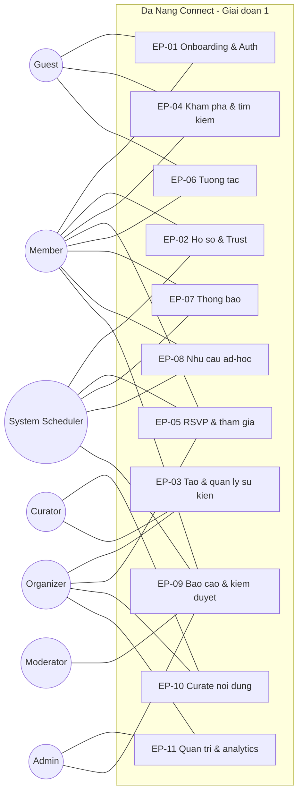
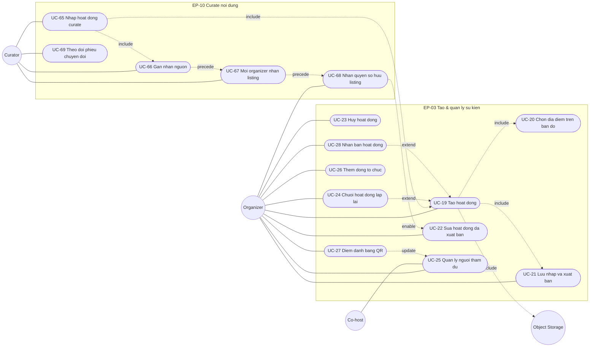
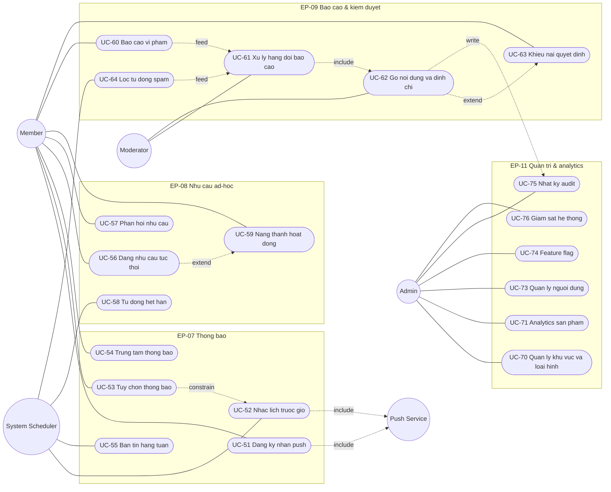
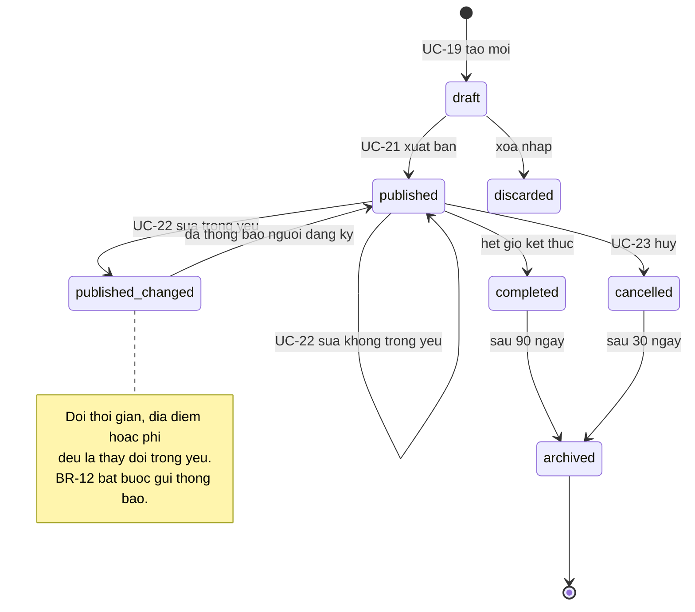
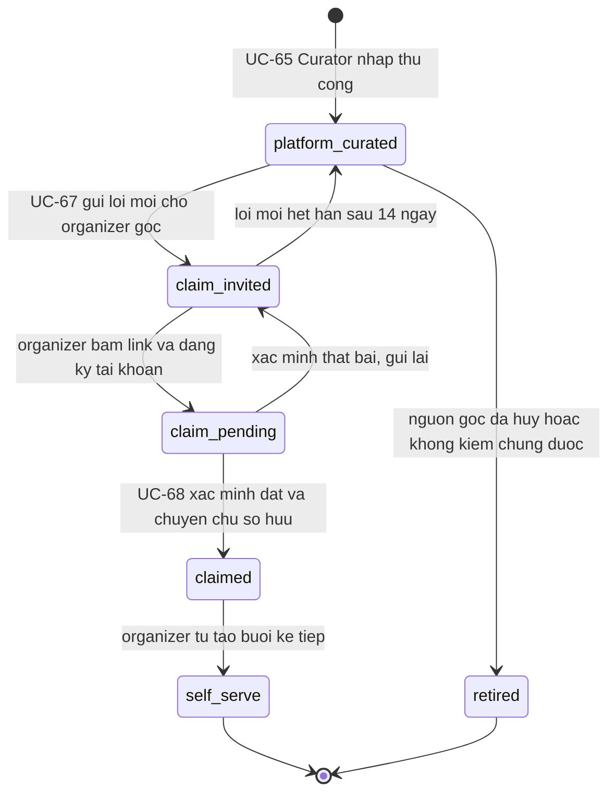
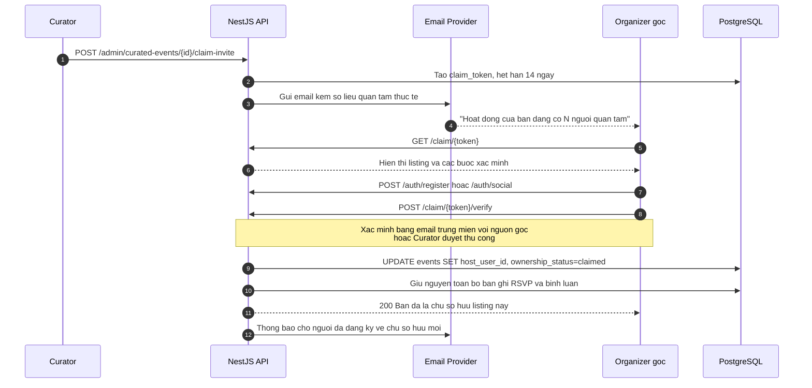

# Da Nang Connect — Đặc tả Use Case (Giai đoạn 1: Kết nối cộng đồng)

| Trường | Nội dung |
|---|---|
| Sản phẩm | Da Nang Connect |
| Tài liệu | 02 — Danh mục & đặc tả use case |
| Phạm vi | Giai đoạn 1 — Kết nối cộng đồng (sự kiện, thể thao, trao đổi ngôn ngữ) |
| Địa bàn | Chỉ Đà Nẵng |
| Phiên bản | 1.0 |
| Ngày | 2026-08-31 |
| Trạng thái | Sẵn sàng cho review kỹ thuật & lập backlog |
| Tài liệu liên quan | `docs/source/Da_Nang_Connect_Brief.txt` |

---

## Mục lục

| Mục | Nội dung |
|---|---|
| [1. Mục đích & cách đọc tài liệu](#1-mục-đích--cách-đọc-tài-liệu) | Quy ước ký hiệu, giả thuyết cốt lõi |
| [2. Phạm vi & giả định nền](#2-phạm-vi--giả-định-nền) | Trong/ngoài phạm vi, giả định kỹ thuật và nghiệp vụ |
| [3. Danh sách actor](#3-danh-sách-actor) | 13 actor người / hệ thống / bên ngoài |
| [4. Danh mục epic](#4-danh-mục-epic) | 11 epic EP-01 → EP-11 |
| [5. Bảng tổng hợp use case](#5-bảng-tổng-hợp-use-case) | 76 use case, MoSCoW, độ phức tạp, thống kê phân bổ |
| [6. Sơ đồ use case](#6-sơ-đồ-use-case) | Sơ đồ tổng quan, theo epic, state machine, sequence |
| [7. Business rule dùng chung](#7-business-rule-dùng-chung) | BR-01 → BR-30, thang trust level, mã lỗi chuẩn |
| [8. Đặc tả chi tiết 19 use case trọng yếu](#8-đặc-tả-chi-tiết-19-use-case-trọng-yếu) | Tiền điều kiện, luồng chính/thay thế/ngoại lệ, endpoint, tiêu chí chấp nhận |
| [9. Ma trận truy vết use case → endpoint → màn hình](#9-ma-trận-truy-vết-use-case--endpoint--màn-hình) | Truy vết đủ 76 UC sang API và mã màn hình của `10-ux-luong-man-hinh-va-i18n.md` |
| [10. Ranh giới MVP](#10-ranh-giới-mvp) | Từng UC vào MVP hay hoãn, kèm lý do |
| [11. Phụ lục A — Tổng hợp endpoint API giai đoạn 1](#11-phụ-lục-a--tổng-hợp-endpoint-api-giai-đoạn-1) | Danh mục endpoint theo module |
| [12. Phụ lục B — Câu hỏi mở và việc phải làm tiếp](#12-phụ-lục-b--câu-hỏi-mở-và-việc-phải-làm-tiếp) | Vấn đề còn treo, người chịu trách nhiệm |

> **Ghi chú phiên bản 1.0.** Các mục 7 → 12 được viết bổ sung sau khi chốt 9 quyết định giải mâu thuẫn liên tài liệu (vai trò toàn cục, RSVP gắn vào `event_occurrences`, thang trust level `T0`–`T5`, 6 khu vực MVP, tên cột `events.host_user_id`, mốc nhắc lịch `T-24h` / `T-2h`, SLA critical 2 giờ, khung pháp lý theo Luật 91/2025/QH15, waitlist là `Must`). Mục 5 và mục 6 đã được sửa tối thiểu để khớp với các quyết định này.

---

## 1. Mục đích & cách đọc tài liệu

Tài liệu liệt kê **76 use case** cho giai đoạn 1 của Da Nang Connect, nhóm theo 11 epic, kèm:

- Bảng tổng hợp có mã `UC-XX`, actor chính, mức ưu tiên MoSCoW cho MVP, độ phức tạp `S/M/L`.
- Sơ đồ use case dạng Mermaid (tổng quan + theo epic + sơ đồ trạng thái + sequence cho luồng nghiệp vụ khó).
- Đặc tả chi tiết cho **19 use case trọng yếu** (pre-condition, luồng chính, luồng thay thế, luồng ngoại lệ, post-condition, business rule, endpoint, tiêu chí chấp nhận).
- Ranh giới MVP: cái gì vào, cái gì hoãn, kèm lý do.

Quy ước ký hiệu:

| Ký hiệu | Ý nghĩa |
|---|---|
| `UC-XX` | Mã use case, duy nhất toàn tài liệu |
| `EP-XX` | Mã epic |
| `BR-XX` | Business rule dùng chung, tham chiếu chéo từ nhiều use case |
| `Must` | Bắt buộc có trong MVP — thiếu thì không ra mắt được |
| `Should` | Quan trọng, đưa vào ngay sau MVP hoặc cuối MVP nếu còn thời gian |
| `Could` | Có thì tốt, cắt được mà không ảnh hưởng giả thuyết cốt lõi |
| `Won't` | Không làm trong MVP — nhưng đã thiết kế trước để không phải đập đi làm lại |
| `S / M / L` | Ước lượng độ phức tạp: S ≈ 1–2 ngày-người, M ≈ 3–5 ngày-người, L ≈ 6–12 ngày-người (đã gồm cả web + mobile + API) |

Giả thuyết cốt lõi mà MVP phải kiểm chứng: **expat tại Đà Nẵng có sẵn sàng rời thói quen dùng các nhóm mạng xã hội để dùng một nền tảng chuyên biệt hay không.** Mọi quyết định MoSCoW trong tài liệu đều quay về câu hỏi này.

---

## 2. Phạm vi & giả định nền

### 2.1 Trong phạm vi giai đoạn 1

- Tạo, xuất bản, tìm kiếm, lọc, RSVP và tham gia hoạt động cộng đồng tại Đà Nẵng.
- Hồ sơ cá nhân có chỉ số tin cậy để người lạ dám gặp nhau ngoài đời.
- Quy trình curate thủ công của đội sáng lập và chuyển giao listing cho organizer gốc.
- Kiểm duyệt, báo cáo vi phạm, quản trị nền tảng.

### 2.2 Ngoài phạm vi giai đoạn 1

- Nhà ở (giai đoạn 2), y tế / dịch vụ chuyên môn (giai đoạn 3).
- Thanh toán trong ứng dụng, gói premium, quảng cáo — chỉ chừa điểm mở rộng ở tầng dữ liệu.
- Thu thập dữ liệu tự động từ nền tảng mạng xã hội bên thứ ba. **Tuyệt đối không scraping** — vi phạm điều khoản và có rủi ro app gãy đột ngột. Nội dung mồi đến từ curate thủ công có ghi nguồn.

### 2.3 Giả định kỹ thuật đã chốt

| Lớp | Công nghệ |
|---|---|
| Backend | NestJS 11 + TypeScript + TypeORM + PostgreSQL 16 (bật PostGIS) |
| Cache / hàng đợi | Redis + BullMQ |
| Web | Next.js 15 App Router + React 19 + TypeScript + Tailwind CSS |
| Mobile | Expo 54 + React Native 0.81 (iOS + Android), EAS Build/Submit |
| Bản đồ | Leaflet / react-leaflet (web), react-native-maps (mobile) |
| Auth | JWT + refresh token, social login Google / Apple / Facebook |
| Realtime | socket.io + Expo Push Notifications |
| Lưu trữ | S3-compatible object storage, ảnh phục vụ qua CDN |
| Hạ tầng | Docker Compose, GitHub Actions CI/CD, môi trường staging + production |
| Quan sát | Health check, logging tập trung, Sentry |
| Ngôn ngữ UI | Tiếng Anh là mặc định, tiếng Việt là ngôn ngữ thứ hai, i18n ngay từ đầu |

### 2.4 Giả định nghiệp vụ

- **G1** — Mọi user đều có thể tạo hoạt động; không có vai trò "organizer" tách biệt lúc đăng ký. Vai trò organizer là **ngữ cảnh** (người sở hữu một event), không phải bậc tài khoản.
- **G2** — Ngôn ngữ mặc định của mọi nội dung do user tạo là tiếng Anh; user có thể gắn nhãn ngôn ngữ khác cho hoạt động.
- **G3** — Khu vực (neighborhood) là dữ liệu do nền tảng quản lý dạng polygon PostGIS, không cho user tự nhập tự do.
- **G4** — Giai đoạn 1 không xử lý tiền giữa các bên. Hoạt động có phí thì organizer tự thu ngoài ứng dụng, nền tảng chỉ hiển thị con số.
- **G5** — Toàn bộ thời gian lưu `timestamptz`, hiển thị theo `Asia/Ho_Chi_Minh`.

---

## 3. Danh sách actor

| Mã | Actor | Loại | Mô tả |
|---|---|---|---|
| A1 | Guest | Người | Khách chưa đăng nhập. Xem được nội dung công khai, bị chặn ở hành động cần danh tính. |
| A2 | Member | Người | Expat đã có tài khoản. Tìm kiếm, RSVP, bình luận, chat, tạo hoạt động. |
| A3 | Organizer | Người | Member trong vai trò chủ sở hữu một hoạt động. Kế thừa toàn bộ quyền của Member. |
| A4 | Co-host | Người | Member được Organizer ủy quyền quản trị một hoạt động cụ thể. |
| A5 | Curator | Người | Thành viên đội sáng lập nhập nội dung mồi thủ công và tiếp cận organizer gốc. |
| A6 | Moderator | Người | Xử lý hàng đợi báo cáo vi phạm, gỡ nội dung, đình chỉ tài khoản. |
| A7 | Admin | Người | Quản trị danh mục, phân quyền, feature flag, xem analytics toàn nền tảng. |
| A8 | System Scheduler | Hệ thống | Job BullMQ: nhắc lịch, thăng hạng danh sách chờ, hết hạn nhu cầu ad-hoc, tổng hợp digest. |
| A9 | Identity Provider | Ngoài | Google / Apple / Facebook — phát hành `id_token` cho social login. |
| A10 | Push Service | Ngoài | Expo Push Notifications. |
| A11 | Object Storage / CDN | Ngoài | S3-compatible + CDN cho ảnh bìa, avatar, ảnh recap. |
| A12 | Email Provider | Ngoài | Gửi email xác minh, đặt lại mật khẩu, digest hằng tuần. |
| A13 | Error Tracking | Ngoài | Sentry — nhận exception từ backend, web, mobile. |

---

## 4. Danh mục epic

| Mã | Epic | Mục tiêu | Số UC | Trọng số MVP |
|---|---|---|---|---|
| EP-01 | Onboarding & Auth | Đưa expat vào ứng dụng trong dưới 60 giây, hạ ma sát đăng ký xuống thấp nhất | 10 | Rất cao |
| EP-02 | Hồ sơ & Trust | Tạo cảm giác an toàn khi gặp người lạ — điều kiện tiên quyết để RSVP thật sự xảy ra | 8 | Cao |
| EP-03 | Tạo & quản lý sự kiện | Nguồn cung nội dung; miễn phí và nhanh hơn hẳn việc đăng bài trên nhóm mạng xã hội | 10 | Rất cao |
| EP-04 | Khám phá & tìm kiếm/lọc | Khác biệt cạnh tranh số 1 — trả lời câu hỏi "tuần này ở Đà Nẵng có gì" trong một màn hình | 9 | Rất cao |
| EP-05 | RSVP & tham gia | Chuyển đổi từ xem sang tham dự; nguồn dữ liệu cho trust score | 7 | Rất cao |
| EP-06 | Tương tác | Giữ hội thoại ở trong app thay vì rơi về kênh nhắn tin ngoài | 6 | Trung bình |
| EP-07 | Thông báo | Kéo user quay lại; giảm tỉ lệ vắng mặt | 5 | Cao |
| EP-08 | Nhu cầu ad-hoc | Khoảng trống mà nền tảng sự kiện có lịch cố định không phục vụ được; giai đoạn 2 nhưng phải thiết kế trước | 4 | Thấp trong MVP |
| EP-09 | Báo cáo vi phạm & kiểm duyệt | Điều kiện bắt buộc để app tồn tại trên store và để cộng đồng không vỡ | 5 | Cao |
| EP-10 | Curate nội dung của đội sáng lập | Giải bài toán cold-start; là chiến lược ra mắt chứ không phải tính năng phụ | 5 | Rất cao |
| EP-11 | Quản trị & analytics | Đo được giả thuyết cốt lõi, vận hành được nền tảng | 7 | Cao |

---

## 5. Bảng tổng hợp use case

### 5.1 EP-01 — Onboarding & Auth

| Mã | Tên use case | Actor chính | MoSCoW | Phức tạp | Epic | Mô tả ngắn |
|---|---|---|---|---|---|---|
| UC-01 | Đăng ký bằng email và mật khẩu | Guest | Must | M | EP-01 | Tạo tài khoản mới, nhận email xác minh |
| UC-02 | Xác minh địa chỉ email | Member | Must | S | EP-01 | Bấm link hoặc nhập mã 6 số để kích hoạt tài khoản |
| UC-03 | Đăng nhập bằng email và mật khẩu | Guest | Must | S | EP-01 | Nhận cặp access token + refresh token |
| UC-04 | Đăng nhập bằng tài khoản mạng xã hội | Guest | Must | L | EP-01 | Google / Apple / Facebook; Apple Sign-In bắt buộc trên iOS |
| UC-05 | Hoàn tất onboarding lần đầu | Member | Must | M | EP-01 | Chọn khu vực đang sống, sở thích, ngôn ngữ nói |
| UC-06 | Quên và đặt lại mật khẩu | Guest | Must | S | EP-01 | Gửi link đặt lại có hạn dùng, đăng xuất mọi phiên |
| UC-07 | Làm mới phiên và đăng xuất | Member | Must | M | EP-01 | Refresh token xoay vòng, thu hồi theo thiết bị |
| UC-08 | Đổi ngôn ngữ giao diện | Guest, Member | Must | S | EP-01 | Chuyển giữa English và Tiếng Việt, nhớ lựa chọn |
| UC-09 | Duyệt nội dung ở chế độ khách | Guest | Must | M | EP-01 | Xem feed và chi tiết hoạt động, chặn ở hành động cần danh tính |
| UC-10 | Xóa tài khoản và xuất dữ liệu cá nhân | Member | Must | M | EP-01 | Bắt buộc theo chính sách store, có thời gian ân hạn 14 ngày |

### 5.2 EP-02 — Hồ sơ & Trust

| Mã | Tên use case | Actor chính | MoSCoW | Phức tạp | Epic | Mô tả ngắn |
|---|---|---|---|---|---|---|
| UC-11 | Chỉnh sửa hồ sơ cá nhân | Member | Must | M | EP-02 | Ảnh đại diện, bio, ngôn ngữ nói, khu vực sinh sống, sở thích |
| UC-12 | Xem hồ sơ công khai của người khác | Guest, Member | Must | S | EP-02 | Huy hiệu, lịch sử tham gia, hoạt động đang tổ chức |
| UC-13 | Xác minh email và số điện thoại | Member | Must | M | EP-02 | Gắn huy hiệu xác minh, cộng điểm tin cậy |
| UC-14 | Xác minh danh tính bằng giấy tờ | Member | Won't | L | EP-02 | Đối chiếu ảnh chân dung với giấy tờ; hoãn sang giai đoạn 2 |
| UC-15 | Tính và hiển thị bậc tin cậy | System Scheduler | Must | M | EP-02 | Thang `T0`–`T5` ghi ở `users.trust_level`, tính lại bằng job BullMQ từ bảng `trust_signals` |
| UC-16 | Đánh giá sau hoạt động | Member | Should | M | EP-02 | Người tham dự chấm organizer và ngược lại, cửa sổ 7 ngày |
| UC-17 | Cấu hình quyền riêng tư hồ sơ | Member | Should | S | EP-02 | Ẩn họ tên đầy đủ, ẩn lịch sử tham gia khỏi người lạ |
| UC-18 | Chặn người dùng khác | Member | Should | M | EP-02 | Ẩn hai chiều nội dung, chặn nhắn tin, không lộ trạng thái chặn |

### 5.3 EP-03 — Tạo & quản lý sự kiện

| Mã | Tên use case | Actor chính | MoSCoW | Phức tạp | Epic | Mô tả ngắn |
|---|---|---|---|---|---|---|
| UC-19 | Tạo hoạt động mới | Organizer | Must | L | EP-03 | Biểu mẫu nhiều bước, ảnh bìa, giới hạn chỗ, ngôn ngữ hoạt động |
| UC-20 | Chọn địa điểm trên bản đồ và gán khu vực | Organizer | Must | L | EP-03 | Ghim tọa độ, tự suy ra khu vực bằng PostGIS, tùy chọn ẩn địa chỉ chính xác |
| UC-21 | Lưu nháp và xuất bản hoạt động | Organizer | Must | M | EP-03 | Nháp không hiển thị công khai, kiểm tra đủ điều kiện trước khi xuất bản |
| UC-22 | Chỉnh sửa hoạt động đã xuất bản | Organizer | Must | M | EP-03 | Phân biệt thay đổi trọng yếu và không trọng yếu, thông báo người đã đăng ký |
| UC-23 | Hủy hoạt động | Organizer | Must | M | EP-03 | Bắt buộc nêu lý do, thông báo toàn bộ danh sách, giữ trang ở trạng thái đã hủy |
| UC-24 | Tạo chuỗi hoạt động lặp lại | Organizer | Should | L | EP-03 | Lặp hằng tuần hoặc hai tuần một lần, sửa một buổi hoặc cả chuỗi |
| UC-25 | Quản lý danh sách người tham dự | Organizer | Must | M | EP-03 | Duyệt, từ chối, mời từ danh sách chờ, đánh dấu có mặt hoặc vắng |
| UC-26 | Thêm và gỡ đồng tổ chức | Organizer | Could | M | EP-03 | Ủy quyền quản trị một hoạt động cho member khác |
| UC-27 | Điểm danh tại chỗ bằng mã QR | Organizer | Should | M | EP-03 | Quét mã của người tham dự, cập nhật trạng thái có mặt |
| UC-28 | Nhân bản hoạt động cũ | Organizer | Could | S | EP-03 | Sao chép toàn bộ trường trừ thời gian, để tạo buổi mới trong 10 giây |

### 5.4 EP-04 — Khám phá & tìm kiếm/lọc

| Mã | Tên use case | Actor chính | MoSCoW | Phức tạp | Epic | Mô tả ngắn |
|---|---|---|---|---|---|---|
| UC-29 | Xem feed "Tuần này ở Đà Nẵng" | Guest, Member | Must | M | EP-04 | Trang chủ nhóm theo ngày, có dải nổi bật do đội sáng lập chọn |
| UC-30 | Tìm kiếm toàn văn | Guest, Member | Must | M | EP-04 | Tìm theo tiêu đề, mô tả, tên địa điểm, tên organizer |
| UC-31 | Lọc nâng cao nhiều tiêu chí | Guest, Member | Must | L | EP-04 | Loại hình, khu vực, khoảng thời gian, ngôn ngữ, phí, trình độ, còn chỗ |
| UC-32 | Tìm hoạt động quanh vị trí hiện tại | Member | Must | L | EP-04 | Truy vấn bán kính bằng PostGIS, sắp xếp theo khoảng cách |
| UC-33 | Xem hoạt động trên bản đồ | Guest, Member | Must | L | EP-04 | Bản đồ có gom cụm ghim, đồng bộ hai chiều với danh sách |
| UC-34 | Lưu bộ lọc và bật cảnh báo | Member | Should | M | EP-04 | Nhận thông báo khi có hoạt động mới khớp bộ lọc đã lưu |
| UC-35 | Lưu hoạt động vào danh sách quan tâm | Member | Must | S | EP-04 | Đánh dấu quan tâm mà chưa cam kết tham gia |
| UC-36 | Gợi ý cá nhân hóa | Member | Won't | L | EP-04 | Xếp hạng theo sở thích và hành vi; cần dữ liệu mới làm được |
| UC-37 | Xem theo dạng lịch tháng | Member | Could | M | EP-04 | Lưới lịch tháng, bấm ngày để xem hoạt động trong ngày |

### 5.5 EP-05 — RSVP & tham gia

| Mã | Tên use case | Actor chính | MoSCoW | Phức tạp | Epic | Mô tả ngắn |
|---|---|---|---|---|---|---|
| UC-38 | Đăng ký tham gia hoạt động | Member | Must | M | EP-05 | Giữ chỗ, chống đua tranh khi hết chỗ, trả về trạng thái tức thì |
| UC-39 | Hủy đăng ký tham gia | Member | Must | S | EP-05 | Trả lại chỗ, kích hoạt thăng hạng danh sách chờ |
| UC-40 | Vào danh sách chờ và tự động thăng hạng | Member | Must | M | EP-05 | Xếp hàng theo thứ tự, người đầu tiên có 12 giờ để xác nhận |
| UC-41 | Trả lời câu hỏi khi đăng ký | Member | Could | M | EP-05 | Organizer đặt tối đa 3 câu hỏi tùy chỉnh |
| UC-42 | Thêm hoạt động vào lịch cá nhân | Member | Should | S | EP-05 | Tải tệp ICS hoặc mở deep link tới ứng dụng lịch |
| UC-43 | Xem danh sách người tham dự | Member | Must | S | EP-05 | Xem ai sẽ đến, tôn trọng cấu hình riêng tư của từng người |
| UC-44 | Mời người khác cùng tham gia | Member | Should | M | EP-05 | Mời trong app hoặc gửi link mời có gắn nguồn |

### 5.6 EP-06 — Tương tác

| Mã | Tên use case | Actor chính | MoSCoW | Phức tạp | Epic | Mô tả ngắn |
|---|---|---|---|---|---|---|
| UC-45 | Bình luận trong trang hoạt động | Member | Must | M | EP-06 | Hỏi đáp công khai trước buổi gặp, hỗ trợ trả lời lồng một cấp |
| UC-46 | Chat nhóm của hoạt động | Member | Should | L | EP-06 | Phòng chat realtime chỉ dành cho người đã đăng ký |
| UC-47 | Nhắn tin riêng một-một | Member | Could | L | EP-06 | Chỉ mở khi hai bên từng chung một hoạt động |
| UC-48 | Chia sẻ hoạt động ra ngoài | Guest, Member | Must | M | EP-06 | Deep link universal link, ảnh xem trước tự sinh |
| UC-49 | Đăng ảnh tổng kết sau hoạt động | Member | Could | M | EP-06 | Bộ sưu tập ảnh mở trong 72 giờ sau khi kết thúc |
| UC-50 | Theo dõi organizer | Member | Should | S | EP-06 | Nhận thông báo khi organizer đó đăng hoạt động mới |

### 5.7 EP-07 — Thông báo

| Mã | Tên use case | Actor chính | MoSCoW | Phức tạp | Epic | Mô tả ngắn |
|---|---|---|---|---|---|---|
| UC-51 | Đăng ký nhận và hiển thị push notification | Member | Must | M | EP-07 | Xin quyền đúng thời điểm, lưu Expo push token theo thiết bị |
| UC-52 | Nhắc lịch trước giờ diễn ra | System Scheduler | Must | M | EP-07 | Nhắc ở mốc trước 24 giờ và trước 2 giờ, hủy khi có thay đổi |
| UC-53 | Cấu hình tùy chọn nhận thông báo | Member | Should | M | EP-07 | Bật tắt theo từng loại và từng kênh, có khung giờ yên tĩnh |
| UC-54 | Trung tâm thông báo trong ứng dụng | Member | Must | M | EP-07 | Danh sách hợp nhất, đánh dấu đã đọc, điều hướng sâu |
| UC-55 | Bản tin tổng hợp hằng tuần qua email | System Scheduler | Should | M | EP-07 | Gửi sáng thứ Năm, nội dung theo khu vực và sở thích |

### 5.8 EP-08 — Nhu cầu ad-hoc (thiết kế trước cho giai đoạn 2)

| Mã | Tên use case | Actor chính | MoSCoW | Phức tạp | Epic | Mô tả ngắn |
|---|---|---|---|---|---|---|
| UC-56 | Đăng nhu cầu tức thời | Member | Won't | M | EP-08 | Ví dụ "cần bạn đánh cầu lông chiều nay ở An Thượng" |
| UC-57 | Phản hồi một nhu cầu tức thời | Member | Won't | M | EP-08 | Giơ tay tham gia, mở luồng nhắn tin nhẹ |
| UC-58 | Tự động hết hạn nhu cầu tức thời | System Scheduler | Won't | S | EP-08 | Vòng đời tối đa 24 giờ rồi tự ẩn khỏi feed |
| UC-59 | Nâng nhu cầu tức thời thành hoạt động chính thức | Member | Won't | M | EP-08 | Khi đủ số người quan tâm thì chuyển sang thực thể event |

### 5.9 EP-09 — Báo cáo vi phạm & kiểm duyệt

| Mã | Tên use case | Actor chính | MoSCoW | Phức tạp | Epic | Mô tả ngắn |
|---|---|---|---|---|---|---|
| UC-60 | Báo cáo nội dung hoặc người dùng | Member | Must | M | EP-09 | Chọn lý do từ danh mục, kèm mô tả và ảnh chụp màn hình |
| UC-61 | Xử lý hàng đợi báo cáo | Moderator | Must | M | EP-09 | Sắp xếp theo mức nghiêm trọng, gộp các báo cáo trùng đối tượng |
| UC-62 | Gỡ nội dung và đình chỉ tài khoản | Moderator | Must | M | EP-09 | Cảnh cáo, ẩn nội dung, đình chỉ tạm thời hoặc vĩnh viễn |
| UC-63 | Khiếu nại quyết định kiểm duyệt | Member | Could | M | EP-09 | Một lần khiếu nại, do người kiểm duyệt khác xử lý |
| UC-64 | Lọc tự động spam và nội dung nhạy cảm | System Scheduler | Should | M | EP-09 | Giới hạn tần suất, danh sách từ khóa, chặn link lạ ở tài khoản mới |

### 5.10 EP-10 — Curate nội dung của đội sáng lập

| Mã | Tên use case | Actor chính | MoSCoW | Phức tạp | Epic | Mô tả ngắn |
|---|---|---|---|---|---|---|
| UC-65 | Nhập hoạt động curate thủ công | Curator | Must | M | EP-10 | Biểu mẫu nội bộ, bắt buộc ghi nguồn công khai và ngày kiểm chứng |
| UC-66 | Gắn nhãn nguồn và trạng thái chưa có chủ | Curator | Must | S | EP-10 | Hiển thị minh bạch "listing do đội ngũ tổng hợp, chưa được organizer nhận" |
| UC-67 | Mời organizer gốc nhận listing | Curator | Must | M | EP-10 | Gửi lời mời kèm số liệu quan tâm thực tế, token có hạn |
| UC-68 | Organizer nhận quyền sở hữu listing | Organizer | Must | L | EP-10 | Xác minh quyền, chuyển chủ sở hữu, giữ nguyên dữ liệu đăng ký |
| UC-69 | Theo dõi hiệu quả chuyển đổi curate | Curator | Should | M | EP-10 | Phễu: nhập → được quan tâm → gửi lời mời → nhận → tự đăng buổi kế tiếp |

### 5.11 EP-11 — Quản trị & analytics

| Mã | Tên use case | Actor chính | MoSCoW | Phức tạp | Epic | Mô tả ngắn |
|---|---|---|---|---|---|---|
| UC-70 | Quản lý danh mục khu vực và loại hình | Admin | Must | M | EP-11 | Chỉnh polygon khu vực, thêm sửa loại hình, quản lý bản dịch |
| UC-71 | Bảng điều khiển analytics sản phẩm | Admin | Should | L | EP-11 | Giữ chân, tỉ lệ chuyển đổi RSVP, tỉ lệ tự phục vụ trên tổng nguồn cung |
| UC-72 | Analytics cho organizer | Organizer | Could | M | EP-11 | Lượt xem, tỉ lệ xem thành đăng ký, tỉ lệ có mặt của một hoạt động |
| UC-73 | Quản lý người dùng và phân quyền | Admin | Must | M | EP-11 | Tìm user, gán vai trò, xem lịch sử xử lý vi phạm |
| UC-74 | Cấu hình feature flag | Admin | Should | M | EP-11 | Bật tắt tính năng theo môi trường và theo nhóm user |
| UC-75 | Nhật ký audit hành động quản trị | Admin | Should | M | EP-11 | Ghi bất biến mọi hành động của Moderator, Curator, Admin |
| UC-76 | Giám sát sức khỏe hệ thống | Admin | Must | S | EP-11 | Health check, thu thập lỗi qua Sentry, cảnh báo khi hàng đợi ùn |

### 5.12 Thống kê phân bổ

Quy đổi ước lượng: `S = 1,5 ngày-người`, `M = 4 ngày-người`, `L = 9 ngày-người` (đã gồm API, web, mobile, test).

| MoSCoW | Số use case | Ước lượng cộng dồn |
|---|---|---|
| Must | 45 | ~190 ngày-người |
| Should | 17 | ~76 ngày-người |
| Could | 8 | ~35 ngày-người |
| Won't trong giai đoạn 1 | 6 | không tính |
| **Tổng** | **76** | **~301 ngày-người** |

| Độ phức tạp | Số use case | Ghi chú |
|---|---|---|
| S | 15 | Chủ yếu là màn hình đơn hoặc endpoint đơn |
| M | 48 | Có trạng thái, có thông báo kèm theo |
| L | 13 | Đụng PostGIS, realtime, tích hợp ngoài, hoặc chuyển quyền sở hữu dữ liệu |

Nếu nhóm phát triển gồm 2 backend + 1 web + 1 mobile chạy song song, phần **Must** rơi vào khoảng **10–12 tuần lịch**, chưa tính thời gian curate nội dung mồi vốn chạy song song từ tuần thứ 4.

---

## 6. Sơ đồ use case

### 6.1 Tổng quan actor và epic



### 6.2 EP-01 Onboarding & Auth và EP-02 Hồ sơ & Trust


### 6.3 EP-03 Tạo & quản lý sự kiện, EP-10 Curate



### 6.4 EP-04 Khám phá, EP-05 RSVP, EP-06 Tương tác


### 6.5 EP-07 Thông báo, EP-08 Ad-hoc, EP-09 Kiểm duyệt, EP-11 Quản trị



### 6.6 Vòng đời hoạt động



### 6.7 Vòng đời quyền sở hữu listing curate



### 6.8 Vòng đời trạng thái RSVP


### 6.9 Sequence — RSVP khi số chỗ sắp hết

```mermaid
sequenceDiagram
    autonumber
    participant U as Member
    participant W as Web hoac Mobile
    participant API as NestJS API
    participant DB as PostgreSQL
    participant R as Redis
    participant Q as BullMQ
    participant WS as socket.io

    U->>W: Bam "Join this activity"
    W->>API: POST /api/v1/occurrences/{occurrenceId}/rsvps
    API->>R: Lock phan tan rsvp:occurrence:{occurrenceId}, TTL 5s
    alt Lay duoc lock
        API->>DB: BEGIN; SELECT capacity, rsvp_going_count FROM event_occurrences FOR UPDATE
        alt going_count < capacity
            API->>DB: INSERT rsvp status=going; UPDATE going_count
            API->>DB: COMMIT
            API->>Q: enqueue reminder T-24h va T-2h
            API->>Q: enqueue recalc_trust_score
            API->>WS: emit occurrence.rsvp_updated
            API-->>W: 201 status=going, seats_left
        else Het cho
            API->>DB: INSERT rsvp status=waitlisted, position=n
            API->>DB: COMMIT
            API-->>W: 201 status=waitlisted, position
        end
        API->>R: Nha lock
    else Khong lay duoc lock
        API-->>W: 409 RSVP_CONTENTION, client thu lai mot lan
    end
    WS-->>U: So cho con lai cap nhat realtime
```

### 6.10 Sequence — Chuyển giao listing từ đội sáng lập sang organizer gốc




---

## 7. Business rule dùng chung

Mọi đặc tả ở mục 8 tham chiếu tới các quy tắc dưới đây bằng mã `BR-XX`. Quy tắc nào mâu thuẫn với tài liệu khác thì **bản trong mục này là bản chốt**.

### 7.1 Bảng business rule BR-01 → BR-30

| Mã | Tên | Phát biểu bắt buộc | UC áp dụng |
|---|---|---|---|
| BR-01 | Vai trò toàn cục | Cột `users.role` là enum toàn cục với đúng 5 giá trị: `member` \| `curator` \| `moderator` \| `admin` \| `super_admin`. `guest` là **trạng thái chưa đăng nhập**, không phải giá trị trong DB. `organizer` là **quan hệ theo sự kiện**, lưu qua `events.host_user_id` và bảng `event_cohosts`. `verified_member` **không tồn tại** — thứ tương đương là `users.trust_level`. Vai trò `support` đã gộp vào `moderator`. | Toàn bộ |
| BR-02 | Guard RBAC ba tầng | Mọi quyết định phân quyền là hợp của ba tầng: `(1)` vai trò toàn cục, `(2)` quan hệ theo sự kiện (`host_user_id`, `event_cohosts.user_id`), `(3)` ngưỡng `trust_level`. Guard NestJS phải kiểm đủ ba, thiếu tầng nào thì trả `403` với mã lỗi riêng của tầng đó để client hiển thị đúng thông điệp. | UC-19, UC-22, UC-25, UC-27, UC-61, UC-68 |
| BR-03 | Nguồn sự thật của trust | `users.trust_level` kiểu `smallint` trong khoảng `0..5`, là **bản cache**. Nguồn sự thật là bảng `trust_signals` (append-only, không UPDATE, không DELETE). Job BullMQ `trust:recompute` tính lại `trust_level` khi có signal mới và quét toàn bộ hằng đêm để hạ bậc khi signal hết hạn hoặc bị thu hồi. | UC-13, UC-15, UC-16, UC-25, UC-62 |
| BR-04 | Ngưỡng hành động theo trust level | Xem bảng §7.2. Backend là nơi cưỡng chế; client chỉ ẩn nút cho đẹp, không được coi là lớp bảo vệ. | UC-19, UC-38, UC-45, UC-60, UC-68 |
| BR-05 | RSVP gắn vào occurrence | RSVP **luôn** gắn vào `event_occurrences`, không bao giờ gắn vào `events`. Bảng `rsvps(id, occurrence_id, user_id, status, guest_count, position, promotion_expires_at, ...)` có UNIQUE `(occurrence_id, user_id)` khi `deleted_at IS NULL`. Sự kiện không lặp lại vẫn có **đúng một** occurrence — không có ngoại lệ, không có nhánh code riêng. | UC-38 → UC-44, UC-25, UC-27 |
| BR-06 | Endpoint tắt theo event | `POST /api/v1/events/{eventId}/rsvps` được giữ lại làm đường tắt cho deep link cũ và cho UI web. Server tự trỏ tới **occurrence gần nhất sắp diễn ra** của event đó. Nếu event có **từ hai occurrence sắp tới trở lên**, trả `409 EVENT_HAS_MULTIPLE_UPCOMING_OCCURRENCES` kèm mảng `occurrences[]` để client bắt người dùng chọn buổi. | UC-38 |
| BR-07 | Sức chứa | `event_occurrences.capacity` kiểu `int`; `NULL` nghĩa là không giới hạn. Số chỗ chiếm dụng của một RSVP là `1 + guest_count`, mặc định `guest_count = 0`, trần `guest_count <= 3` và chỉ mở khi organizer bật `allow_guests`. Khi `rsvp_going_count + (1 + guest_count) > capacity` thì RSVP mới rơi vào `waitlisted`, **không** trả lỗi. | UC-38, UC-40 |
| BR-08 | Thăng hạng waitlist | Hàng đợi FIFO theo `rsvps.position` tăng dần. Khi có chỗ trống, job `waitlist:promote` chuyển người đầu hàng sang `offered` và đặt `promotion_expires_at = now() + 12h`. Nếu occurrence bắt đầu trong dưới 2 giờ, cửa sổ rút còn **30 phút**. Hết hạn → `expired_offer`, người đó được quay lại **cuối hàng đúng một lần**, lần thứ hai thì rời hàng đợi. | UC-39, UC-40 |
| BR-09 | Chống đua tranh khi hết chỗ | Mọi thao tác đổi số chỗ đi qua khoá phân tán Redis `rsvp:occurrence:{occurrenceId}` TTL 5 giây, bên trong transaction có `SELECT capacity, rsvp_going_count FROM event_occurrences WHERE id = $1 FOR UPDATE`. Không lấy được khoá → `409 RSVP_CONTENTION`; client thử lại **đúng một lần** sau 300–800 ms jitter rồi mới báo lỗi cho người dùng. | UC-38, UC-39, UC-40 |
| BR-10 | Cửa sổ huỷ RSVP | Người dùng huỷ tự do tới mốc `T-2h`. Sau `T-2h` vẫn huỷ được nhưng bản ghi được đánh `late_cancel = true`; ba lần `late_cancel` trong 60 ngày sinh `trust_signal` phạt và hạ ưu tiên trong hàng đợi waitlist của các sự kiện sau. | UC-39 |
| BR-11 | Quy ước enum | Mọi giá trị enum trong PostgreSQL viết **chữ thường snake_case**: `published`, `checked_in`, `no_show`, `expired_offer`, `platform_curated`. Tầng TypeScript ánh xạ sang union type cùng chuỗi, không viết hoa lại. | Toàn bộ |
| BR-12 | Thay đổi trọng yếu | Thay đổi **trọng yếu** gồm: thời gian bắt đầu/kết thúc, địa điểm (toạ độ hoặc `area_id`), mức phí, giảm `capacity`, đổi ngôn ngữ hoạt động. Mỗi thay đổi trọng yếu bắt buộc: ghi `event_change_log`, gửi thông báo tới toàn bộ RSVP `going` + `offered` + `waitlisted`, lên lịch lại job nhắc, và hiển thị dải "Updated" trên trang chi tiết trong 72 giờ. Thay đổi mô tả, ảnh bìa, tag không trọng yếu. | UC-22 |
| BR-13 | Huỷ sự kiện | Huỷ bắt buộc chọn lý do từ danh mục và nhập mô tả tối thiểu 20 ký tự. Trang sự kiện **không bị xoá**, chuyển sang trạng thái `cancelled` và vẫn truy cập được 30 ngày để người đã đăng ký hiểu chuyện gì xảy ra, sau đó `archived`. Huỷ trong vòng 12 giờ trước giờ bắt đầu sinh `trust_signal` phạt cho host. | UC-23 |
| BR-14 | Khu vực | Bảng `areas` phân cấp `city > district > ward > micro_area`. Tập hiển thị trong bộ lọc MVP là **6 khu vực**: An Thượng, Mỹ Khê, Mỹ An, Hải Châu, Sơn Trà, Ngũ Hành Sơn. `area_id` của sự kiện suy ra tự động bằng `ST_Contains(areas.boundary, event.location)`; không khớp polygon nào thì lấy khu vực gần nhất trong bán kính 1 500 m, vẫn không có thì gán khu vực `da-nang-other` và đưa vào hàng đợi Admin kiểm tra. | UC-19, UC-20, UC-29 → UC-33, UC-70 |
| BR-15 | Ẩn địa chỉ chính xác | Khi `hide_exact_location = true`, người chưa có RSVP `going` chỉ thấy toạ độ đã làm tròn về ô lưới ~300 m và tên khu vực. Địa chỉ đầy đủ mở ra ngay sau khi RSVP được xác nhận và trong email nhắc lịch. | UC-20, UC-38 |
| BR-16 | Thời gian | Lưu `timestamptz` theo UTC, connection ép `timezone = 'UTC'`. Hiển thị theo `Asia/Ho_Chi_Minh`. Không hardcode `+07` trong bất kỳ truy vấn hay logic nghiệp vụ nào. Chuỗi hiển thị định dạng theo `locale` của người xem. | Toàn bộ |
| BR-17 | Mốc nhắc lịch | Đúng **hai** mốc: `T-24h` và `T-2h` trước `starts_at` của occurrence. Job đặt bằng `delayed job` của BullMQ, `jobId = reminder:{occurrenceId}:{userId}:{t24\|t2}` để idempotent. Huỷ RSVP, huỷ sự kiện, hoặc đổi giờ đều phải `remove` job cũ rồi `add` job mới. Nếu thời điểm nhắc đã trôi qua thì bỏ qua, không gửi bù. | UC-38, UC-22, UC-23, UC-52 |
| BR-18 | Không thu thập tự động | `curated_sources.collection_method` mặc định `manual_only` và có ràng buộc `CHECK`. Mọi listing curate bắt buộc có `source_url` công khai, `source_verified_at`, và hiển thị công khai nhãn ghi nguồn. Tuyệt đối không scraping, không dùng API không được cấp phép. | UC-65, UC-66, UC-67 |
| BR-19 | SLA kiểm duyệt | `critical` **2 giờ** · `high` 12 giờ · `normal` 48 giờ, tính theo giờ hành chính Việt Nam nhưng `critical` tính 24/7. Báo cáo mức `critical` (R-01, R-03, R-07, R-09, R-10, R-13) tự động ẩn nội dung ngay khi tiếp nhận, chờ moderator xác nhận. Thông điệp cho người báo cáo dùng cam kết chung "trong vòng 4 giờ" để không hứa quá mức ở các mức thấp hơn. | UC-60, UC-61, UC-62, UC-64 |
| BR-20 | Khiếu nại | Mỗi quyết định kiểm duyệt được khiếu nại **một lần**, trong 14 ngày, và phải do **moderator khác** với người ra quyết định gốc xử lý. Hệ thống chặn ở tầng service, không phụ thuộc quy trình con người. | UC-62, UC-63 |
| BR-21 | Giới hạn tần suất theo trust level | `T0`: 0 sự kiện/ngày, 3 bình luận/giờ, không được chèn link. `T1`: 1 sự kiện/ngày, 10 bình luận/giờ, link bị treo chờ duyệt. `T2`: 3 sự kiện/ngày, 30 bình luận/giờ, link tự do. `T3+`: 5 sự kiện/ngày, 60 bình luận/giờ. Vượt ngưỡng → `429 RATE_LIMITED` kèm `Retry-After`. | UC-19, UC-45, UC-64 |
| BR-22 | i18n nội dung | Nội dung do người dùng tạo lưu **một bản** kèm `content_locale`, không tự động dịch máy. Từ vựng hệ thống (loại hình, khu vực, lý do báo cáo) có cặp cột `name_en` / `name_vi`. UI mặc định tiếng Anh, tiếng Việt là ngôn ngữ thứ hai. | UC-08, UC-19, UC-70 |
| BR-23 | Idempotency | Mọi `POST` có tác dụng phụ tạo bản ghi nghiệp vụ (`/rsvps`, `/events`, `/reports`, `/check-ins`) bắt buộc header `Idempotency-Key` dạng UUID. Server lưu khoá 24 giờ trong Redis, gọi lại cùng khoá trả về **đúng response cũ** kèm `Idempotent-Replay: true`. | UC-19, UC-38, UC-60, UC-27 |
| BR-24 | Phân trang | Toàn bộ danh sách dùng cursor-based (`?cursor=&limit=`), `limit` mặc định 20, trần 50. Không dùng offset cho feed vì dữ liệu chèn liên tục. | UC-29 → UC-33, UC-43, UC-61 |
| BR-25 | Audit log | Mọi hành động của `curator`, `moderator`, `admin`, `super_admin` ghi vào `audit_logs` bất biến (append-only, không cấp quyền UPDATE/DELETE cho application role). Bản ghi gồm actor, hành động, đối tượng, ảnh chụp trước/sau dạng `jsonb`, IP, thời điểm. | UC-61 → UC-62, UC-65, UC-70, UC-73, UC-75 |
| BR-26 | Xoá tài khoản | Yêu cầu xoá đặt `deletion_requested_at`, ân hạn **14 ngày** để khôi phục. Sau ân hạn, job ẩn danh hoá thay vì xoá cứng để giữ toàn vẹn lịch sử tham gia; `legal_hold_until` chặn ẩn danh khi đang có vụ việc an toàn đang mở. | UC-10 |
| BR-27 | Tải ảnh | Client không gửi multipart vào API. Luồng bắt buộc: `POST /api/v1/media/upload-intent` → nhận presigned URL → `PUT` thẳng lên object storage → `POST /api/v1/media/confirm`. Ảnh chưa `confirm` bị job dọn sau 24 giờ. | UC-11, UC-19, UC-49, UC-60 |
| BR-28 | No-show | Chỉ đánh dấu `no_show` **sau khi** occurrence kết thúc, trong cửa sổ 48 giờ. Quá 48 giờ, job `attendance:finalize` tự chốt: RSVP còn ở `going` mà không có bản ghi check-in chuyển thành `no_show`. Mỗi `no_show` sinh `trust_signal` phạt, chỉ tính trong 90 ngày gần nhất. Người bị đánh dấu nhận thông báo kèm nút phản hồi "Tôi có mặt" mở khiếu nại nhẹ tới host. | UC-25, UC-27, UC-15 |
| BR-29 | Cửa sổ check-in | Check-in mở từ `T-60 phút` trước `starts_at` tới `T+180 phút` sau `ends_at`. Ngoài cửa sổ, endpoint trả `409 CHECK_IN_WINDOW_CLOSED`. Mã QR của người tham dự là JWT ngắn hạn, hiệu lực 5 phút, xoay vòng phía client, chống chụp màn hình chuyền tay. | UC-27 |
| BR-30 | Cơ sở pháp lý cho xử lý dữ liệu | Mọi biểu mẫu thu thập dữ liệu cá nhân (đăng ký, hồ sơ, vị trí, ảnh, số điện thoại) phải nêu **cả hai** văn bản: Nghị định 13/2023/NĐ-CP và **Luật Bảo vệ dữ liệu cá nhân 91/2025/QH15**, ghi rõ rằng từ `01/01/2026` Luật 91/2025 là văn bản có hiệu lực cao hơn, và mẫu biểu phải theo Luật 91/2025 cùng nghị định hướng dẫn. Đồng ý phải tách bạch theo mục đích, có thể rút lại, và ghi vết `consent_records`. **CẦN LUẬT SƯ XÁC NHẬN.** | UC-01, UC-04, UC-05, UC-10, UC-11, UC-32 |

### 7.2 Thang trust level `T0` → `T5` và ngưỡng hành động

`users.trust_level` là `smallint` trong khoảng `0..5`. Đây là **thang duy nhất** của sản phẩm; mọi enum kiểu `new / verified / established / trusted / ambassador` và mọi thang điểm `0–100` khác đã bị loại bỏ.

| Bậc | Nhãn hiển thị (EN) | Nhãn hiển thị (VI) | Điều kiện đạt bậc | Tín hiệu nguồn trong `trust_signals` |
|---|---|---|---|---|
| `T0` | `New` | `Thành viên mới` | Vừa tạo tài khoản | — |
| `T1` | `Email verified` | `Đã xác minh email` | `email_verified_at IS NOT NULL` | `email_verified` |
| `T2` | `Phone verified` | `Đã xác minh số điện thoại` | Đạt `T1` **và** `phone_verified_at IS NOT NULL` | `phone_verified` |
| `T3` | `Active member` | `Thành viên tích cực` | Đạt `T2`, hồ sơ đầy đủ (avatar + bio + ≥1 ngôn ngữ + khu vực), **và** (`≥ 2` lần `checked_in` **hoặc** `≥ 1` occurrence do mình host đã `completed`) | `profile_completed`, `attended_event`, `hosted_event_completed` |
| `T4` | `Trusted` | `Đáng tin cậy` | Đạt `T3`, `≥ 5` lần `checked_in` **hoặc** `≥ 3` occurrence host đã `completed`, điểm đánh giá trung bình `≥ 4.5`, không có case kiểm duyệt `critical`/`high` bị xử bất lợi trong 180 ngày | `positive_review`, `community_vouch` |
| `T5` | `Community leader` | `Người dẫn dắt cộng đồng` | Đạt `T4` **và** được đội Community Ops phê duyệt thủ công, có ghi chú người phê duyệt | `staff_endorsement` |

Hạ bậc: job `trust:recompute` hạ `trust_level` ngay khi điều kiện của bậc hiện tại không còn thoả (ví dụ signal hết hạn, bị thu hồi, hoặc có `penalty_report_upheld`). Hạ bậc gửi thông báo cho người dùng kèm lý do chung, không tiết lộ chi tiết báo cáo.

Ngưỡng hành động tối thiểu (cưỡng chế ở backend, guard `@MinTrustLevel(n)`):

| Hành động | Bậc tối thiểu | Mã lỗi khi không đủ |
|---|---|---|
| Xem feed, chi tiết sự kiện, hồ sơ công khai | không cần đăng nhập | — |
| RSVP một buổi miễn phí | `T1` | `TRUST_LEVEL_TOO_LOW` |
| RSVP một buổi có phí hoặc có `capacity <= 10` | `T2` | `TRUST_LEVEL_TOO_LOW` |
| Bình luận, gửi lời mời | `T1` | `TRUST_LEVEL_TOO_LOW` |
| Chèn liên kết ngoài trong nội dung | `T2` | `LINK_NOT_ALLOWED_AT_TRUST_LEVEL` |
| Tạo và xuất bản sự kiện | `T1` (bắt buộc `T2` nếu sự kiện có phí) | `TRUST_LEVEL_TOO_LOW` |
| Bật `allow_guests` cho sự kiện | `T2` | `TRUST_LEVEL_TOO_LOW` |
| Nhận quyền sở hữu một listing curate | `T2` | `CLAIM_REQUIRES_PHONE_VERIFICATION` |
| Bảo lãnh người khác (`community_vouch`) | `T4` | `TRUST_LEVEL_TOO_LOW` |

### 7.3 Mã lỗi chuẩn dùng chung

Toàn bộ lỗi trả về theo `application/problem+json` mở rộng: `{ type, title, status, code, detail, traceId, meta }`. `code` là chuỗi ổn định để client ánh xạ sang khoá i18n `errors.<code>`.

| HTTP | `code` | Ý nghĩa | Hành vi client mong đợi |
|---|---|---|---|
| 400 | `VALIDATION_FAILED` | Payload sai kiểu hoặc thiếu trường | Hiển thị lỗi tại từng field theo `meta.fields[]` |
| 401 | `AUTH_INVALID_CREDENTIALS` | Sai email hoặc mật khẩu | Thông báo chung, không nói field nào sai |
| 401 | `AUTH_TOKEN_EXPIRED` | Access token hết hạn | Gọi `/auth/refresh` một lần rồi thử lại |
| 401 | `AUTH_REFRESH_REUSED` | Phát hiện tái sử dụng refresh token | Xoá phiên cục bộ, đưa về màn hình đăng nhập |
| 403 | `AUTH_EMAIL_NOT_VERIFIED` | Tài khoản chưa xác minh email | Điều hướng `M-03` / `W-03` |
| 403 | `AUTH_ACCOUNT_SUSPENDED` | Tài khoản đang bị đình chỉ | Màn hình `X-05` kèm nút khiếu nại `M-68` |
| 403 | `TRUST_LEVEL_TOO_LOW` | Chưa đạt bậc tin cậy tối thiểu | Sheet giải thích + đường tắt tới bước xác minh còn thiếu |
| 403 | `NOT_EVENT_HOST` | Không phải host hoặc co-host | Ẩn hành động, hiển thị thông báo trung tính |
| 404 | `RESOURCE_NOT_FOUND` | Không tồn tại hoặc đã bị ẩn | `X-03` kèm 3 gợi ý cùng khu vực |
| 409 | `RSVP_ALREADY_EXISTS` | Đã có RSVP còn hiệu lực | Đồng bộ lại trạng thái nút từ response |
| 409 | `RSVP_CONTENTION` | Không lấy được khoá phân tán | Thử lại đúng một lần, sau đó báo lỗi |
| 409 | `RSVP_CLOSED` | Occurrence đã bắt đầu, đã huỷ, hoặc đã đóng đăng ký | Vô hiệu hoá nút, hiển thị lý do |
| 409 | `EVENT_HAS_MULTIPLE_UPCOMING_OCCURRENCES` | Dùng endpoint tắt trên event nhiều buổi | Mở bộ chọn buổi từ `meta.occurrences[]` |
| 409 | `CHECK_IN_WINDOW_CLOSED` | Ngoài cửa sổ check-in | Hiển thị khung giờ hợp lệ |
| 409 | `OFFER_EXPIRED` | Lời mời từ waitlist đã hết hạn | Cập nhật thẻ trạng thái sang `expired_offer` |
| 410 | `CLAIM_TOKEN_EXPIRED` | Token nhận listing quá 14 ngày | Trang xin cấp lại lời mời |
| 422 | `BUSINESS_RULE_VIOLATED` | Vi phạm ràng buộc nghiệp vụ cụ thể | Đọc `meta.rule` (ví dụ `BR-12`) để hiển thị đúng câu |
| 429 | `RATE_LIMITED` | Vượt giới hạn theo `BR-21` | Tôn trọng `Retry-After`, khoá nút đếm ngược |
| 503 | `SERVICE_DEGRADED` | Phụ thuộc ngoài đang lỗi | Bật chế độ đọc từ cache, hiển thị dải cảnh báo |

---

## 8. Đặc tả chi tiết 19 use case trọng yếu

### 8.0 Khuôn mẫu và cách đọc

Mỗi đặc tả gồm khối định danh, tiền điều kiện, luồng chính đánh số, luồng thay thế (`A-n`), luồng ngoại lệ kèm cách xử lý lỗi (`E-n`), hậu điều kiện, business rule áp dụng, endpoint, và tiêu chí chấp nhận.

| Ký hiệu | Ý nghĩa |
|---|---|
| `A-n` | Luồng thay thế — vẫn đi tới kết quả thành công, chỉ khác đường đi |
| `E-n` | Luồng ngoại lệ — kết thúc bằng lỗi hoặc trạng thái không mong muốn, phải có cách xử lý rõ ràng |
| `M-xx` / `W-xx` / `AD-xx` / `X-xx` | Mã màn hình, tra ở `10-ux-luong-man-hinh-va-i18n.md` §3.1 |
| `F-xx` | Mã user flow, tra ở `10-ux-luong-man-hinh-va-i18n.md` §7 |

Danh sách 19 use case được đặc tả: UC-01, UC-02, UC-04, UC-05, UC-09, UC-15, UC-19, UC-22, UC-23, UC-25, UC-27, UC-31, UC-38, UC-39, UC-40, UC-52, UC-60, UC-61, UC-65 — kèm UC-68 gộp trong đặc tả UC-65 vì hai use case chia chung một state machine quyền sở hữu.

---

### 8.1 UC-01 — Đăng ký bằng email và mật khẩu

| Trường | Nội dung |
|---|---|
| Mã | `UC-01` |
| Tên | Đăng ký bằng email và mật khẩu |
| Actor chính | Guest (A1) |
| Actor phụ | Email Provider (A12), System Scheduler (A8), Error Tracking (A13) |
| Mức ưu tiên | `Must` · độ phức tạp `M` |
| Epic | EP-01 Onboarding & Auth |
| Màn hình | `M-01` (mobile), `W-01` (web) → `M-03` / `W-03` (chờ xác minh) |
| Luồng UX | `F-01` |
| Kích hoạt | Guest chạm "Create account" từ auth gate `M-05`, từ trang chi tiết sự kiện khi bấm RSVP, hoặc từ deep link claim listing |

**Tiền điều kiện**

- Người dùng chưa đăng nhập trên thiết bị hiện tại.
- Ứng dụng đã tải xong danh mục `areas` và `interests` để dùng ở bước onboarding kế tiếp (tải nền, không chặn).
- Trang đăng ký đã hiển thị đầy đủ liên kết Điều khoản sử dụng, Chính sách quyền riêng tư và thông báo xử lý dữ liệu cá nhân theo `BR-30`.

**Luồng chính**

1. Guest mở `M-01` / `W-01`, hệ thống hiển thị ba lựa chọn: Google, Apple (bắt buộc trên iOS), Facebook, và đường dẫn "Continue with email".
2. Guest chọn "Continue with email"; form hiện 3 trường: `email`, `password`, `displayName`.
3. Guest nhập email. Client kiểm tra định dạng RFC 5322 rút gọn ngay khi rời ô, chưa gọi API.
4. Guest nhập mật khẩu. Client hiển thị thanh đo độ mạnh và 4 điều kiện: tối thiểu 10 ký tự, có chữ, có số, không nằm trong danh sách 10 000 mật khẩu phổ biến nhúng sẵn.
5. Guest nhập `displayName` (2–40 ký tự, cho phép Unicode, chặn ký tự điều khiển và emoji ở đầu chuỗi).
6. Guest tích ô đồng ý Điều khoản và ô đồng ý xử lý dữ liệu cá nhân. **Hai ô tách riêng**, không tích sẵn, theo `BR-30`.
7. Guest bấm "Create account". Client gửi `POST /api/v1/auth/register` kèm header `Idempotency-Key`, `Accept-Language`, và `X-Device-Id`.
8. Backend chuẩn hoá email (lowercase, cắt khoảng trắng), kiểm tra trùng trên index `uq_users_email` với điều kiện `deleted_at IS NULL`.
9. Backend băm mật khẩu bằng Argon2id (`memoryCost` 19 MiB, `timeCost` 2, `parallelism` 1), tạo `users` với `role = 'member'`, `status = 'pending'`, `trust_level = 0`, `locale` lấy từ `Accept-Language`, `timezone = 'Asia/Ho_Chi_Minh'`.
10. Backend tạo `profiles` rỗng liên kết 1–1, ghi `consent_records` cho từng mục đích đã đồng ý kèm phiên bản văn bản.
11. Backend sinh mã xác minh 6 chữ số và token dạng URL, hạn dùng 24 giờ, lưu bản băm; đẩy job `email:send-verification` vào BullMQ.
12. Backend trả `201` với `{ userId, email, status: 'pending', verification: { expiresAt, resendAvailableAt } }`. **Không** phát hành access token khi tài khoản chưa xác minh.
13. Client điều hướng sang `M-03` / `W-03`: ô nhập 6 số, nút "Resend" bị khoá đếm ngược 60 giây, và đường dẫn "Change email".
14. Email Provider gửi thư song ngữ theo `locale`; người dùng bấm liên kết hoặc nhập mã → tiếp tục **UC-02**.

**Luồng thay thế**

| Mã | Điều kiện | Xử lý |
|---|---|---|
| `A-1` | Guest chọn đăng nhập bằng mạng xã hội ở bước 1 | Chuyển sang **UC-04**, bỏ qua toàn bộ luồng này |
| `A-2` | Email đã tồn tại nhưng tài khoản đó là **social-only** (`password_hash IS NULL`) | Trả `200` với `{ action: 'link_password' }`; gửi email "đặt mật khẩu cho tài khoản sẵn có" thay vì tạo tài khoản mới; UI hiển thị "We sent you a link to add a password to your existing account" — không tiết lộ nhà cung cấp nào đã liên kết |
| `A-3` | Guest đến từ deep link claim listing (`F-09`) | Giữ `claim_token` trong state, sau xác minh email thì nhảy thẳng `W-29` thay vì onboarding đầy đủ; onboarding rút gọn chạy sau |
| `A-4` | Guest đăng ký trên web trong luồng RSVP (`F-10`) | Sau xác minh, quay lại đúng occurrence đang xem và tự mở sheet RSVP, không bắt duyệt lại feed |
| `A-5` | Guest đổi email ở `M-03` | Cho phép sửa **một lần** trong 24 giờ đầu khi `status = 'pending'`; huỷ token cũ, phát token mới, ghi audit nhẹ |

**Luồng ngoại lệ và xử lý lỗi**

| Mã | Tình huống | Phản hồi | Xử lý |
|---|---|---|---|
| `E-1` | Email đã tồn tại và **đã có mật khẩu** | `200` `{ action: 'check_email' }` | Gửi email "có người vừa thử đăng ký bằng địa chỉ này" kèm link đăng nhập và link đặt lại mật khẩu. **Không** trả `409` để tránh dò danh sách email |
| `E-2` | Mật khẩu yếu hoặc nằm trong danh sách rò rỉ | `400 VALIDATION_FAILED` | `meta.fields.password` chỉ rõ điều kiện chưa đạt, không xoá nội dung đã nhập |
| `E-3` | Quá 5 lần đăng ký từ cùng IP trong 15 phút | `429 RATE_LIMITED` | Trả `Retry-After`; client khoá nút và đếm ngược; ghi sự kiện vào bộ đếm chống lạm dụng |
| `E-4` | Email Provider lỗi, job `email:send-verification` thất bại | `201` vẫn trả về | BullMQ retry 5 lần theo backoff mũ (1m, 5m, 15m, 1h, 6h); sau lần cuối ghi Sentry và bật cờ để `M-03` hiển thị "Having trouble? Contact support"; nút Resend vẫn hoạt động |
| `E-5` | Không tích ô đồng ý dữ liệu cá nhân | Chặn ở client, `400` nếu bypass | Không tạo bản ghi; thông điệp giải thích cơ sở pháp lý theo `BR-30` |
| `E-6` | `displayName` chứa từ khoá bị chặn (mạo danh staff, chứa số điện thoại, URL) | `400 VALIDATION_FAILED` | Danh sách chặn quản lý ở Admin; gợi ý tên thay thế |
| `E-7` | Gửi lại cùng `Idempotency-Key` | `201` với `Idempotent-Replay: true` | Trả nguyên response cũ, không tạo tài khoản trùng, không gửi email lần hai |
| `E-8` | Mất mạng giữa chừng | — | Client giữ nguyên form trong bộ nhớ, hiển thị `X-02` offline, cho phép thử lại với cùng `Idempotency-Key` |

**Hậu điều kiện**

- Thành công: tồn tại `users` với `status = 'pending'`, `role = 'member'`, `trust_level = 0`; có `profiles` rỗng; có `consent_records`; có token xác minh còn hạn; **chưa** có phiên đăng nhập.
- Thất bại: không có bản ghi mới nào; không có email nào được gửi ngoài trường hợp `E-1`.

**Business rule áp dụng**: `BR-01`, `BR-16`, `BR-22`, `BR-23`, `BR-26`, `BR-30`.

**Endpoint liên quan**

| Method | Path | Vai trò |
|---|---|---|
| `POST` | `/api/v1/auth/register` | Tạo tài khoản |
| `POST` | `/api/v1/auth/verify-email/resend` | Gửi lại mã, khoá 60 giây |
| `PATCH` | `/api/v1/auth/registration/email` | Đổi email khi còn `pending` (`A-5`) |
| `GET` | `/api/v1/legal/documents?type=terms,privacy` | Lấy phiên bản văn bản đang hiệu lực để ghi `consent_records` |

**Tiêu chí chấp nhận**

- Đăng ký thành công trong ≤ 3 lần chạm sau khi bàn phím mở, đo trên `M-01`.
- Gửi lại cùng `Idempotency-Key` hai lần chỉ tạo đúng một `users` và gửi đúng một email.
- Email đã tồn tại không bao giờ trả mã lỗi khác với email chưa tồn tại (chống dò danh sách).
- Bản ghi `consent_records` lưu đúng `document_version` của văn bản mà người dùng thực sự nhìn thấy.

---

### 8.2 UC-02 — Xác minh địa chỉ email

| Trường | Nội dung |
|---|---|
| Mã | `UC-02` |
| Tên | Xác minh địa chỉ email |
| Actor chính | Member (A2, tài khoản `status = 'pending'`) |
| Actor phụ | Email Provider (A12), System Scheduler (A8) |
| Mức ưu tiên | `Must` · độ phức tạp `S` |
| Epic | EP-01 |
| Màn hình | `M-03`, `W-03`; deep link `dnc.link/verify/{token}` |
| Luồng UX | `F-01` |

**Tiền điều kiện**

- Tồn tại `users` với `status = 'pending'` và token xác minh chưa hết hạn, chưa dùng.

**Luồng chính**

1. Người dùng mở email và bấm nút "Verify my email", hoặc nhập 6 chữ số vào `M-03`.
2. Client gọi `POST /api/v1/auth/verify-email` với `{ token }` hoặc `{ email, code }`.
3. Backend so sánh bản băm token, kiểm tra `expires_at > now()` và `used_at IS NULL`.
4. Backend trong một transaction: đặt `users.email_verified_at = now()`, `users.status = 'active'`, đánh dấu token đã dùng, chèn `trust_signals(type='email_verified', status='verified', weight=+8)`.
5. Backend đẩy job `trust:recompute` cho user này; job nâng `users.trust_level` từ `0` lên `1` (`T1 Email verified`) theo `BR-03`.
6. Backend phát hành cặp token: access token 15 phút, refresh token 30 ngày kèm `family_id`, ghi `auth_sessions` với `device_id`, `platform`, `app_version`.
7. Backend trả `200` với `{ accessToken, refreshToken, user, nextStep: 'onboarding' }`.
8. Client lưu refresh token vào SecureStore (mobile) hoặc cookie `HttpOnly` `SameSite=Lax` (web), rồi điều hướng sang `M-02` / `W-02` → tiếp **UC-05**.

**Luồng thay thế**

| Mã | Điều kiện | Xử lý |
|---|---|---|
| `A-1` | Người dùng bấm link trên máy khác với máy đăng ký | Xác minh vẫn thành công nhưng **không** phát hành token cho thiết bị lạ; hiển thị trang "Email verified, now sign in on your phone"; thiết bị gốc đang mở `M-03` nhận tín hiệu qua polling 5 giây và tự chuyển bước |
| `A-2` | Người dùng có app cài sẵn, bấm link trên mobile browser | Universal link mở thẳng app, truyền token qua deep link, xác minh trong app |
| `A-3` | Người dùng bấm "Resend" | Huỷ token cũ, phát token mới, khoá nút 60 giây, tối đa 5 lần trong 24 giờ |

**Luồng ngoại lệ và xử lý lỗi**

| Mã | Tình huống | Phản hồi | Xử lý |
|---|---|---|---|
| `E-1` | Token hết hạn quá 24 giờ | `410 VERIFICATION_TOKEN_EXPIRED` | Trang hiển thị nút "Send me a new link" gọi thẳng `resend`, không bắt nhập lại email |
| `E-2` | Token đã dùng | `409 VERIFICATION_ALREADY_USED` | Nếu tài khoản đã `active` thì điều hướng sang đăng nhập, thông điệp trung tính |
| `E-3` | Nhập sai mã 6 số quá 5 lần trong 15 phút | `429 RATE_LIMITED` | Khoá ô nhập 15 phút, vẫn cho dùng link trong email |
| `E-4` | Tài khoản bị đình chỉ trước khi kịp xác minh | `403 AUTH_ACCOUNT_SUSPENDED` | Màn hình `X-05`, không phát hành token |
| `E-5` | Job `trust:recompute` lỗi | — | Xác minh vẫn thành công; `trust_level` được job quét đêm sửa lại; không chặn người dùng |

**Hậu điều kiện**

- Thành công: `users.status = 'active'`, `email_verified_at` đã set, `trust_level = 1`, có một `auth_sessions` hoạt động, có `trust_signals` loại `email_verified`.
- Thất bại: trạng thái tài khoản không đổi; token cũ có thể đã bị vô hiệu nếu người dùng bấm "Resend".

**Business rule áp dụng**: `BR-03`, `BR-04`, `BR-11`, `BR-16`.

**Endpoint liên quan**

| Method | Path | Vai trò |
|---|---|---|
| `POST` | `/api/v1/auth/verify-email` | Xác minh bằng token hoặc mã 6 số |
| `POST` | `/api/v1/auth/verify-email/resend` | Gửi lại |
| `GET` | `/api/v1/auth/registration/status?email=` | Polling cho `A-1`, trả `pending` \| `verified`, có rate limit |

**Tiêu chí chấp nhận**

- Sau xác minh, `trust_level` bằng `1` trong vòng 5 giây (đo p95).
- Link hết hạn không bao giờ dẫn tới trang trắng — luôn có nút gửi lại.
- Token chỉ dùng được một lần, kiểm bằng test đồng thời hai request cùng token.

---

### 8.3 UC-04 — Đăng nhập bằng tài khoản mạng xã hội

| Trường | Nội dung |
|---|---|
| Mã | `UC-04` |
| Tên | Đăng nhập bằng tài khoản mạng xã hội (Google / Apple / Facebook) |
| Actor chính | Guest (A1) |
| Actor phụ | Identity Provider (A9), Object Storage (A11), System Scheduler (A8) |
| Mức ưu tiên | `Must` · độ phức tạp `L` |
| Epic | EP-01 |
| Màn hình | `M-01`, `W-01`; sheet chọn tài khoản do OS/IdP cung cấp |
| Luồng UX | `F-01` |

**Tiền điều kiện**

- App đã cấu hình `client_id` cho từng nhà cung cấp theo môi trường (`staging`, `production`) và đã khai báo bundle id / package name / redirect URI khớp.
- **Ràng buộc App Store**: nếu bản iOS có Google hoặc Facebook login thì bắt buộc có Apple Sign-In hiển thị ngang hàng.

**Luồng chính**

1. Guest chạm nút của một nhà cung cấp trên `M-01` / `W-01`.
2. Client mở luồng native: `expo-auth-session` cho Google/Facebook, `expo-apple-authentication` cho Apple; web dùng redirect flow với PKCE.
3. Người dùng chọn tài khoản và chấp thuận phạm vi tối thiểu: `openid`, `email`, `profile`. **Không** xin quyền danh bạ, không xin quyền đăng bài.
4. IdP trả `id_token` (JWT) về client. Client **không** tự giải mã để tin, chỉ chuyển tiếp.
5. Client gọi `POST /api/v1/auth/social` với `{ provider, idToken, deviceId, platform, appVersion }` và header `Accept-Language`.
6. Backend tải JWKS của nhà cung cấp (cache 24 giờ, có `stale-while-revalidate`), xác thực chữ ký, `iss`, `aud`, `exp`, `nonce`.
7. Backend tra `social_accounts` theo `(provider, provider_user_id)`.
8. Nếu **đã tồn tại**: cập nhật `last_login_at`, bỏ qua bước 9–12, nhảy tới bước 13.
9. Nếu **chưa tồn tại** và `email` từ IdP trùng một `users` đang hoạt động: **không** tự động hợp nhất. Backend trả `409 SOCIAL_ACCOUNT_LINK_REQUIRED` kèm `linkChallengeToken`; client hiển thị màn hình "This email already has an account — sign in to link it" và yêu cầu người dùng đăng nhập bằng mật khẩu hoặc bằng nhà cung cấp đã liên kết trước đó.
10. Nếu chưa tồn tại và email không trùng: tạo `users` mới với `status = 'active'`, `role = 'member'`, `trust_level = 0`; nếu IdP khẳng định `email_verified = true` thì set luôn `email_verified_at` và tạo `trust_signals(email_verified)`.
11. Backend tạo `social_accounts`, lưu `email_at_provider`, `display_name_at_provider`, `avatar_url_at_provider`, và `raw_profile` (purge sau 90 ngày).
12. Backend đẩy job `media:import-avatar` tải ảnh đại diện về object storage một lần; **không hotlink** ảnh của IdP. Tạo `trust_signals(type='social_google'|'social_facebook'|'social_apple', weight=+6)`.
13. Backend phát hành access token + refresh token, ghi `auth_sessions`, đẩy `trust:recompute`.
14. Backend trả `200` với `{ accessToken, refreshToken, user, isNewUser, nextStep }` — `nextStep` là `onboarding` nếu `profiles.onboarding_completed_at IS NULL`, ngược lại là `home`.
15. Client điều hướng: người mới → `M-02` (**UC-05**), người cũ → `M-10`.

**Luồng thay thế**

| Mã | Điều kiện | Xử lý |
|---|---|---|
| `A-1` | Apple Sign-In với "Hide My Email" | `email_at_provider` là địa chỉ `@privaterelay.appleid.com`. Chấp nhận bình thường, đánh dấu `is_private_relay = true`. Không dùng email này để hợp nhất tài khoản. Email nhắc lịch vẫn gửi được qua relay |
| `A-2` | Apple chỉ trả tên ở **lần đăng nhập đầu tiên** | Bắt buộc lưu `fullName` ngay lần đầu; các lần sau IdP không gửi lại. Nếu bỏ lỡ, `displayName` để trống và onboarding bắt nhập |
| `A-3` | Người dùng đã có tài khoản email, nay muốn thêm social | Từ `M-69` gọi `POST /api/v1/me/social-accounts` khi đã đăng nhập, không đi qua endpoint này |
| `A-4` | Facebook trả tài khoản không có email (số điện thoại) | Tạo tài khoản với `email = NULL`; onboarding thêm bước bắt buộc nhập email hoặc xác minh số điện thoại để đạt `T1` |
| `A-5` | Đăng nhập social trên web trong luồng deep link `F-10` | Sau đăng nhập quay lại đúng occurrence, mở luôn sheet RSVP |

**Luồng ngoại lệ và xử lý lỗi**

| Mã | Tình huống | Phản hồi | Xử lý |
|---|---|---|---|
| `E-1` | `id_token` sai chữ ký, sai `aud`, hoặc hết hạn | `401 SOCIAL_TOKEN_INVALID` | Xoá state, yêu cầu thử lại; ghi Sentry kèm `provider` nhưng **không** log token |
| `E-2` | Người dùng huỷ sheet chọn tài khoản | — | Không gọi API, quay về `M-01` nguyên trạng, không hiển thị lỗi đỏ |
| `E-3` | JWKS không tải được | `503 SERVICE_DEGRADED` | Dùng JWKS cache cũ tối đa 7 ngày; nếu vẫn không có thì báo "Sign-in with Google is temporarily unavailable" và làm nổi lựa chọn email |
| `E-4` | `provider_user_id` đã liên kết với **user khác** | `409 SOCIAL_ACCOUNT_TAKEN` | Không tự động chuyển; hướng dẫn liên hệ hỗ trợ; ghi audit vì đây có thể là dấu hiệu chiếm tài khoản |
| `E-5` | Tài khoản gắn với social đang `suspended` | `403 AUTH_ACCOUNT_SUSPENDED` | `X-05` kèm nút khiếu nại; không phát hành token |
| `E-6` | Job `media:import-avatar` lỗi hoặc ảnh quá 5 MB | — | Dùng avatar chữ cái sinh sẵn; onboarding vẫn tiếp tục; không chặn đăng nhập |
| `E-7` | Người dùng thu hồi quyền ở phía IdP rồi quay lại | `401 SOCIAL_TOKEN_INVALID` | Yêu cầu cấp quyền lại; tài khoản và dữ liệu giữ nguyên |

**Hậu điều kiện**

- Thành công: có `users` `active`, có `social_accounts` khớp `(provider, provider_user_id)`, có `auth_sessions`, `trust_level` ≥ `0` và bằng `1` nếu email đã được IdP xác minh.
- Thất bại: không tạo `users` mới; không có phiên; state OAuth phía client đã được xoá.

**Business rule áp dụng**: `BR-01`, `BR-03`, `BR-04`, `BR-27`, `BR-30`.

**Endpoint liên quan**

| Method | Path | Vai trò |
|---|---|---|
| `POST` | `/api/v1/auth/social` | Đăng nhập / đăng ký bằng `id_token` |
| `POST` | `/api/v1/auth/social/link` | Hoàn tất liên kết sau `linkChallengeToken` (bước 9) |
| `POST` | `/api/v1/me/social-accounts` | Thêm nhà cung cấp khi đã đăng nhập (`A-3`) |
| `DELETE` | `/api/v1/me/social-accounts/{provider}` | Gỡ liên kết, chặn nếu đó là cách đăng nhập duy nhất |
| `POST` | `/api/v1/auth/refresh` | Xoay vòng refresh token |

**Tiêu chí chấp nhận**

- Trên iOS, Apple Sign-In hiển thị ngang hàng với Google/Facebook, đúng guideline nút của Apple.
- Email từ Apple private relay không bao giờ được dùng làm khoá hợp nhất tài khoản.
- Không có bất kỳ log nào chứa `id_token` hoặc `raw_profile` ở môi trường production.
- Người dùng huỷ sheet chọn tài khoản không nhìn thấy thông báo lỗi nào.

---

### 8.4 UC-05 — Hoàn tất onboarding lần đầu (chọn khu vực + sở thích)

| Trường | Nội dung |
|---|---|
| Mã | `UC-05` |
| Tên | Hoàn tất onboarding lần đầu |
| Actor chính | Member (A2) |
| Actor phụ | System Scheduler (A8), Push Service (A10) |
| Mức ưu tiên | `Must` · độ phức tạp `M` |
| Epic | EP-01 |
| Màn hình | `M-02` (3 bước), `W-02`; xin quyền vị trí `M-07`, xin quyền push `M-08` |
| Luồng UX | `F-02` |

**Tiền điều kiện**

- Người dùng đã đăng nhập (`status = 'active'`) và `profiles.onboarding_completed_at IS NULL`.
- Danh mục `areas` (6 khu vực MVP theo `BR-14`) và `interests` đã tải được; nếu tải lỗi thì dùng bản cache đóng gói sẵn trong app.

**Luồng chính**

1. Hệ thống hiển thị `M-02` bước 1: "Where do you live in Da Nang?" với 6 thẻ khu vực MVP — **An Thượng, Mỹ Khê, Mỹ An, Hải Châu, Sơn Trà, Ngũ Hành Sơn** — kèm tên song ngữ và ảnh nhỏ.
2. Người dùng chọn **một** khu vực chính (bắt buộc) và tuỳ chọn thêm tối đa 2 khu vực "cũng hay lui tới".
3. Người dùng bấm "Next". Client lưu tạm vào state, chưa gọi API.
4. Bước 2: "What do you want to do here?" hiển thị lưới sở thích lấy từ `GET /api/v1/interests` (thể thao, trao đổi ngôn ngữ, ăn uống, âm nhạc, hoạt động ngoài trời, nghề nghiệp, gia đình, tình nguyện…).
5. Người dùng chọn **tối thiểu 1, tối đa 8** sở thích. Nút "Next" chỉ bật khi có ≥ 1 lựa chọn.
6. Bước 3: "What languages do you speak?" — chọn từ danh sách ngôn ngữ, mặc định gợi ý `en` và `vi`, cho phép gắn mức độ (`native`, `fluent`, `learning`).
7. Người dùng bấm "Finish". Client gửi **một** request `POST /api/v1/me/onboarding` với toàn bộ lựa chọn của 3 bước.
8. Backend validate: `primaryAreaId` phải thuộc tập khu vực đang `is_active`; `interestIds` phải tồn tại; số lượng trong ngưỡng.
9. Backend trong một transaction cập nhật `profiles` (`primary_area_id`, `secondary_area_ids`, `spoken_languages`), ghi `profile_interests`, đặt `onboarding_completed_at = now()`.
10. Backend đánh giá điều kiện `profile_completed` của `BR-03`. Ở bước này hồ sơ thường chưa đủ (thiếu avatar hoặc bio) nên **chưa** cấp `trust_signal`; nếu đã đủ thì cấp ngay.
11. Backend trả `200` kèm **payload feed khởi động**: 6 occurrence sắp diễn ra khớp khu vực + sở thích vừa chọn, để màn hình kế tiếp không bao giờ trống.
12. Client điều hướng sang `M-10` và hiển thị ngay 6 kết quả đó — đây là **aha moment** theo `10-ux-luong-man-hinh-va-i18n.md` §10.1.
13. Sau khi `M-10` đã render, client hiện `M-08` xin quyền push với lý do cụ thể: "Get reminded 2 hours before events you join". Xin quyền **sau** khi đã thấy giá trị, không xin ở màn hình đầu.

**Luồng thay thế**

| Mã | Điều kiện | Xử lý |
|---|---|---|
| `A-1` | Người dùng bấm "Skip" ở bước 1 hoặc 2 | Cho phép bỏ qua. Gán `primary_area_id` = `hai-chau` làm mặc định trung tính, `onboarding_completed_at` vẫn set, gắn cờ `onboarding_skipped = true`. Feed hiển thị toàn thành phố. Nhắc lại nhẹ ở `M-10` sau 3 phiên bằng dải "Personalize your feed" |
| `A-2` | Người dùng cho phép truy cập vị trí ở `M-07` | Gọi `POST /api/v1/geo/resolve-area` với toạ độ hiện tại, tự chọn sẵn thẻ khu vực tương ứng, vẫn cho người dùng đổi |
| `A-3` | Người dùng đến từ `F-09` (claim listing) | Onboarding rút gọn còn bước 1, hoãn bước 2–3 tới sau khi nhận listing xong |
| `A-4` | Người dùng đăng nhập lại trên thiết bị mới, onboarding đã xong | Bỏ qua toàn bộ, vào thẳng `M-10` |
| `A-5` | Người dùng từ chối quyền push ở `M-08` | Không hỏi lại trong app. Bật kênh email cho nhắc lịch `T-24h`; hiển thị đường tắt tới cài đặt hệ điều hành ở `M-61` |

**Luồng ngoại lệ và xử lý lỗi**

| Mã | Tình huống | Phản hồi | Xử lý |
|---|---|---|---|
| `E-1` | `GET /api/v1/areas` lỗi | — | Dùng bản cache đóng gói 6 khu vực MVP; hiển thị dải nhẹ "Showing saved areas"; vẫn cho hoàn tất |
| `E-2` | `primaryAreaId` không tồn tại hoặc đã bị vô hiệu hoá | `400 VALIDATION_FAILED` | Tải lại danh mục, giữ nguyên các lựa chọn khác |
| `E-3` | Gửi onboarding hai lần (bấm đúp, retry mạng) | `200` idempotent | Ghi đè bằng payload mới nhất, không nhân đôi `profile_interests` |
| `E-4` | Không có occurrence nào khớp ở bước 11 | `200` với `items: []` và `fallback` | Trả 6 occurrence sắp tới của toàn thành phố kèm cờ `isFallback = true`; `M-10` hiển thị empty state "Nothing in An Thượng this week — here is what's happening nearby" thay vì màn hình trắng |
| `E-5` | Quyền vị trí bị từ chối vĩnh viễn | — | Ẩn nút "Use my location" ở lần sau, không hỏi lại; lọc theo khu vực vẫn dùng bình thường |
| `E-6` | Người dùng thoát app giữa chừng | — | State 3 bước lưu ở local; mở lại vào đúng bước đang dở; `onboarding_completed_at` vẫn `NULL` |

**Hậu điều kiện**

- Thành công: `profiles.onboarding_completed_at` đã set; có `primary_area_id`; có ≥ 1 `profile_interests` (trừ khi `A-1`); người dùng đang ở `M-10` với ít nhất 6 thẻ sự kiện thật.
- Thất bại: `onboarding_completed_at` vẫn `NULL`, lần mở app kế tiếp quay lại `M-02`.

**Business rule áp dụng**: `BR-04`, `BR-14`, `BR-22`, `BR-23`, `BR-30`.

**Endpoint liên quan**

| Method | Path | Vai trò |
|---|---|---|
| `GET` | `/api/v1/areas?level=micro_area&mvpOnly=true` | 6 khu vực MVP, có `name_en` / `name_vi` |
| `GET` | `/api/v1/interests` | Danh mục sở thích song ngữ |
| `GET` | `/api/v1/languages` | Danh mục ngôn ngữ |
| `POST` | `/api/v1/geo/resolve-area` | Suy khu vực từ toạ độ (`A-2`) |
| `POST` | `/api/v1/me/onboarding` | Ghi toàn bộ lựa chọn, trả feed khởi động |
| `POST` | `/api/v1/me/push-tokens` | Đăng ký Expo push token sau `M-08` |

**Tiêu chí chấp nhận**

- Từ lúc xác minh xong tới lúc thấy 6 thẻ sự kiện thật: ≤ 90 giây với người dùng thao tác bình thường.
- Bộ lọc khu vực trong MVP hiển thị **đúng 6 khu vực** đã chốt, không nhiều hơn.
- Không có trạng thái nào của `M-10` sau onboarding là màn hình trắng — luôn có ít nhất fallback toàn thành phố.
- Quyền push chỉ được xin **sau** khi feed đã render, không xin trước.
