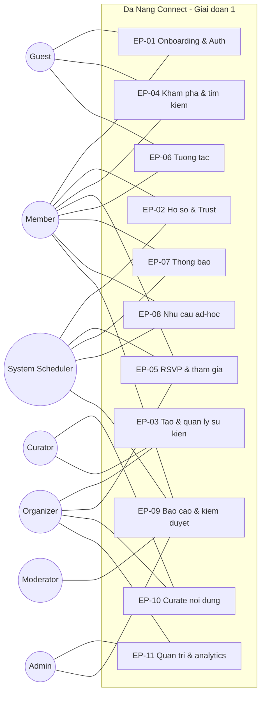
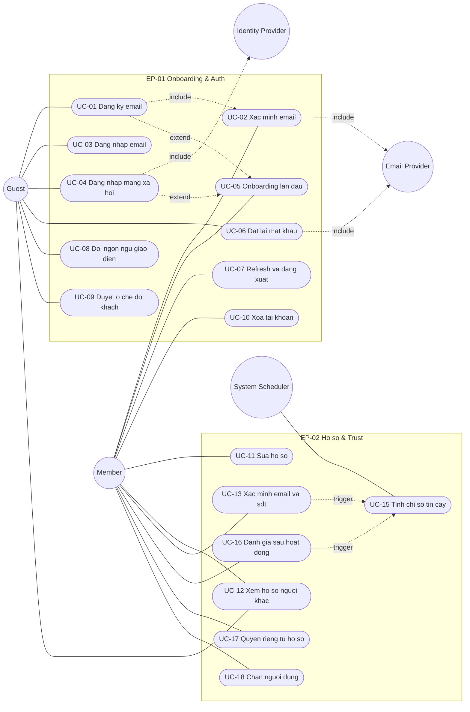
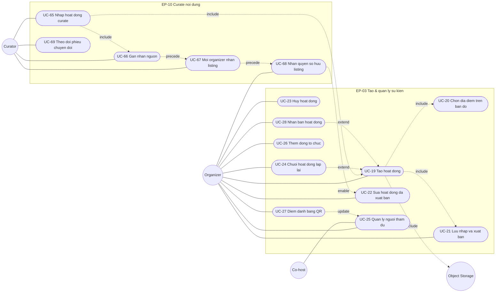
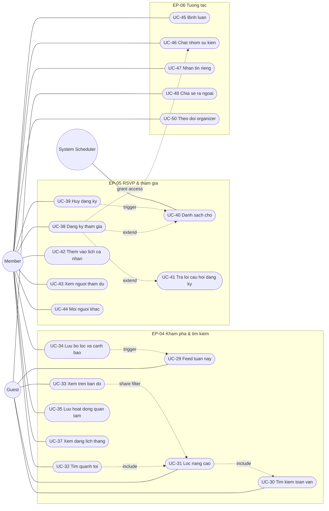
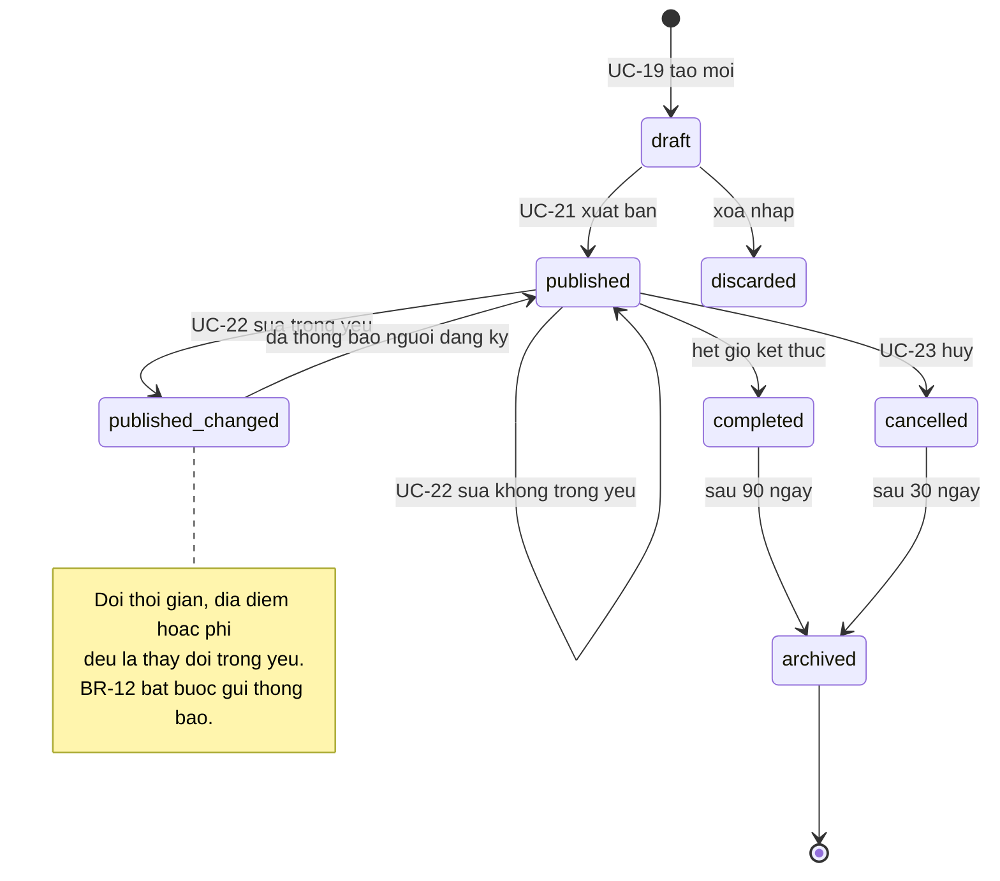
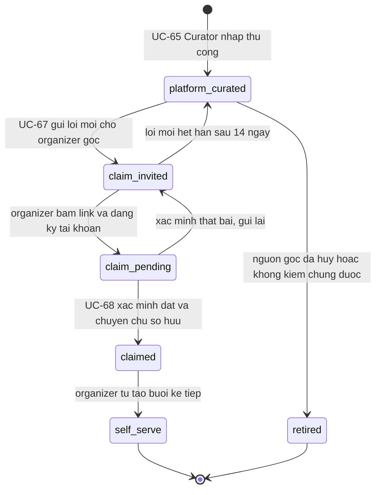
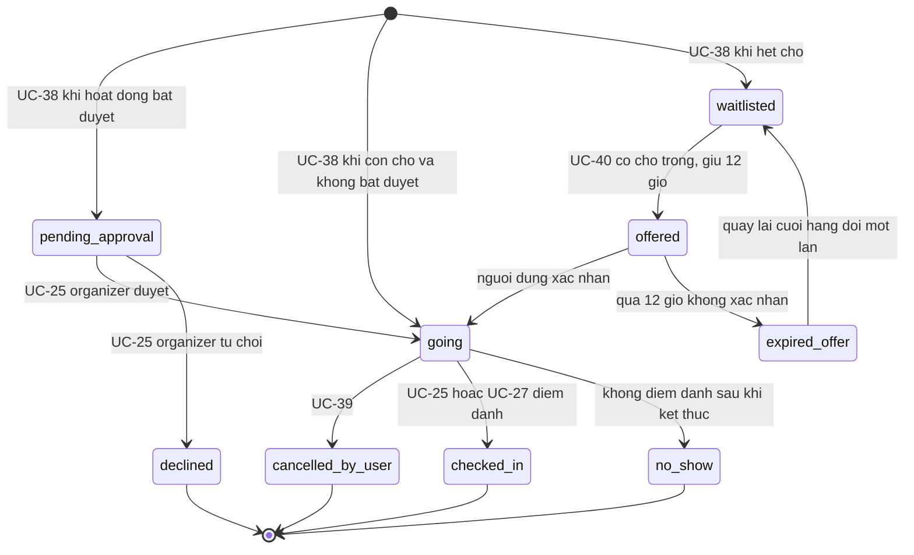
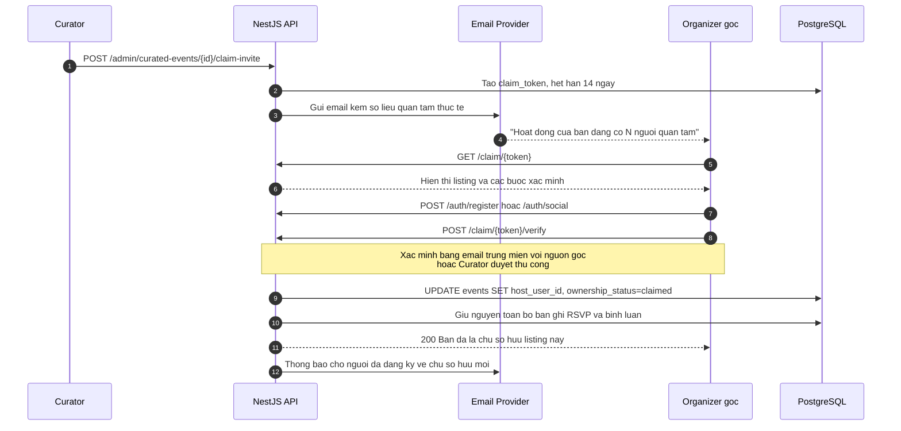
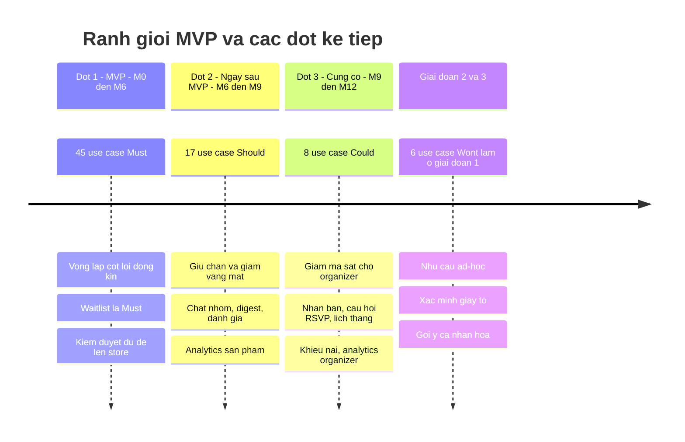
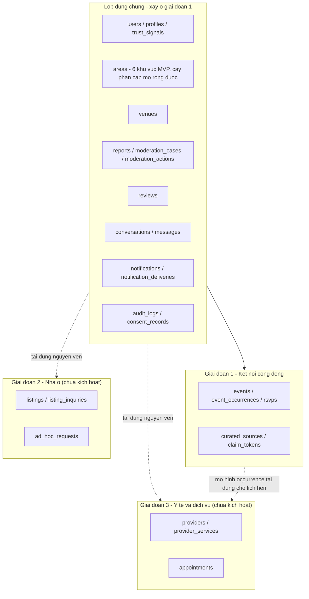

# Da Nang Connect — Đặc tả Use Case (Giai đoạn 1: Kết nối cộng đồng)

| Trường | Nội dung |
|---|---|
| Sản phẩm | Da Nang Connect |
| Tài liệu | 02 — Danh mục & đặc tả use case |
| Phạm vi | Giai đoạn 1 — Kết nối cộng đồng (sự kiện, thể thao, trao đổi ngôn ngữ) |
| Địa bàn | Chỉ Đà Nẵng |
| Phiên bản | 1.0 |
| Ngày | 2026-08-31 |
| Trạng thái | Sẵn sàng cho review kỹ thuật & lập backlog |
| Tài liệu liên quan | `docs/source/Da_Nang_Connect_Brief.txt` |

---

## Mục lục

| Mục | Nội dung |
|---|---|
| [1. Mục đích & cách đọc tài liệu](#1-mục-đích--cách-đọc-tài-liệu) | Quy ước ký hiệu, giả thuyết cốt lõi |
| [2. Phạm vi & giả định nền](#2-phạm-vi--giả-định-nền) | Trong/ngoài phạm vi, giả định kỹ thuật và nghiệp vụ |
| [3. Danh sách actor](#3-danh-sách-actor) | 13 actor người / hệ thống / bên ngoài |
| [4. Danh mục epic](#4-danh-mục-epic) | 11 epic EP-01 → EP-11 |
| [5. Bảng tổng hợp use case](#5-bảng-tổng-hợp-use-case) | 76 use case, MoSCoW, độ phức tạp, thống kê phân bổ |
| [6. Sơ đồ use case](#6-sơ-đồ-use-case) | Sơ đồ tổng quan, theo epic, state machine, sequence |
| [7. Business rule dùng chung](#7-business-rule-dùng-chung) | BR-01 → BR-30, thang trust level, mã lỗi chuẩn |
| [8. Đặc tả chi tiết 19 use case trọng yếu](#8-đặc-tả-chi-tiết-19-use-case-trọng-yếu) | Tiền điều kiện, luồng chính/thay thế/ngoại lệ, endpoint, tiêu chí chấp nhận |
| [9. Ma trận truy vết use case → endpoint → màn hình → bảng dữ liệu](#9-ma-trận-truy-vết-use-case--endpoint--màn-hình--bảng-dữ-liệu) | Truy vết đủ 76 UC sang API, mã màn hình của `10-ux-luong-man-hinh-va-i18n.md` và bảng của `03-domain-va-du-lieu.md` |
| [10. Ranh giới MVP](#10-ranh-giới-mvp) | Từng UC vào MVP hay hoãn, kèm lý do và chi phí nếu hoãn; điều kiện ra mắt |
| [11. Use case giai đoạn 2 và 3](#11-use-case-giai-đoạn-2-và-3--đã-chừa-chỗ-trong-thiết-kế-không-kích-hoạt-ở-giai-đoạn-1) | Đã chừa chỗ trong thiết kế, không kích hoạt ở giai đoạn 1 |
| [12. Phụ lục A — Tổng hợp endpoint API giai đoạn 1](#12-phụ-lục-a--tổng-hợp-endpoint-api-giai-đoạn-1) | Danh mục endpoint theo module |
| [13. Phụ lục B — Câu hỏi mở và giả định cần kiểm chứng](#13-phụ-lục-b--câu-hỏi-còn-mở-và-giả-định-cần-kiểm-chứng) | Vấn đề còn treo, giả định phải đo, mục cần luật sư, việc làm tiếp |

> **Ghi chú phiên bản 1.0.** Các mục 7 → 13 được viết bổ sung sau khi chốt 9 quyết định giải mâu thuẫn liên tài liệu (vai trò toàn cục, RSVP gắn vào `event_occurrences`, thang trust level `T0`–`T5`, 6 khu vực MVP, tên cột `events.host_user_id`, mốc nhắc lịch `T-24h` / `T-2h`, SLA critical 2 giờ, khung pháp lý theo Luật 91/2025/QH15, waitlist là `Must`). Mục 5 và mục 6 đã được sửa tối thiểu để khớp với các quyết định này — xem danh sách mâu thuẫn đã xử lý ở §13.4.

---

## 1. Mục đích & cách đọc tài liệu

Tài liệu liệt kê **76 use case** cho giai đoạn 1 của Da Nang Connect, nhóm theo 11 epic, kèm:

- Bảng tổng hợp có mã `UC-XX`, actor chính, mức ưu tiên MoSCoW cho MVP, độ phức tạp `S/M/L`.
- Sơ đồ use case dạng Mermaid (tổng quan + theo epic + sơ đồ trạng thái + sequence cho luồng nghiệp vụ khó).
- Đặc tả chi tiết cho **19 use case trọng yếu** (pre-condition, luồng chính, luồng thay thế, luồng ngoại lệ, post-condition, business rule, endpoint, tiêu chí chấp nhận).
- Ranh giới MVP: cái gì vào, cái gì hoãn, kèm lý do.

Quy ước ký hiệu:

| Ký hiệu | Ý nghĩa |
|---|---|
| `UC-XX` | Mã use case, duy nhất toàn tài liệu |
| `EP-XX` | Mã epic |
| `BR-XX` | Business rule dùng chung, tham chiếu chéo từ nhiều use case |
| `Must` | Bắt buộc có trong MVP — thiếu thì không ra mắt được |
| `Should` | Quan trọng, đưa vào ngay sau MVP hoặc cuối MVP nếu còn thời gian |
| `Could` | Có thì tốt, cắt được mà không ảnh hưởng giả thuyết cốt lõi |
| `Won't` | Không làm trong MVP — nhưng đã thiết kế trước để không phải đập đi làm lại |
| `S / M / L` | Ước lượng độ phức tạp: S ≈ 1–2 ngày-người, M ≈ 3–5 ngày-người, L ≈ 6–12 ngày-người (đã gồm cả web + mobile + API) |

Giả thuyết cốt lõi mà MVP phải kiểm chứng: **expat tại Đà Nẵng có sẵn sàng rời thói quen dùng các nhóm mạng xã hội để dùng một nền tảng chuyên biệt hay không.** Mọi quyết định MoSCoW trong tài liệu đều quay về câu hỏi này.

---

## 2. Phạm vi & giả định nền

### 2.1 Trong phạm vi giai đoạn 1

- Tạo, xuất bản, tìm kiếm, lọc, RSVP và tham gia hoạt động cộng đồng tại Đà Nẵng.
- Hồ sơ cá nhân có chỉ số tin cậy để người lạ dám gặp nhau ngoài đời.
- Quy trình curate thủ công của đội sáng lập và chuyển giao listing cho organizer gốc.
- Kiểm duyệt, báo cáo vi phạm, quản trị nền tảng.

### 2.2 Ngoài phạm vi giai đoạn 1

- Nhà ở (giai đoạn 2), y tế / dịch vụ chuyên môn (giai đoạn 3).
- Thanh toán trong ứng dụng, gói premium, quảng cáo — chỉ chừa điểm mở rộng ở tầng dữ liệu.
- Thu thập dữ liệu tự động từ nền tảng mạng xã hội bên thứ ba. **Tuyệt đối không scraping** — vi phạm điều khoản và có rủi ro app gãy đột ngột. Nội dung mồi đến từ curate thủ công có ghi nguồn.

### 2.3 Giả định kỹ thuật đã chốt

| Lớp | Công nghệ |
|---|---|
| Backend | NestJS 11 + TypeScript + TypeORM + PostgreSQL 16 (bật PostGIS) |
| Cache / hàng đợi | Redis + BullMQ |
| Web | Next.js 15 App Router + React 19 + TypeScript + Tailwind CSS |
| Mobile | Expo 54 + React Native 0.81 (iOS + Android), EAS Build/Submit |
| Bản đồ | Leaflet / react-leaflet (web), react-native-maps (mobile) |
| Auth | JWT + refresh token, social login Google / Apple / Facebook |
| Realtime | socket.io + Expo Push Notifications |
| Lưu trữ | S3-compatible object storage, ảnh phục vụ qua CDN |
| Hạ tầng | Docker Compose, GitHub Actions CI/CD, môi trường staging + production |
| Quan sát | Health check, logging tập trung, Sentry |
| Ngôn ngữ UI | Tiếng Anh là mặc định, tiếng Việt là ngôn ngữ thứ hai, i18n ngay từ đầu |

### 2.4 Giả định nghiệp vụ

- **G1** — Mọi user đều có thể tạo hoạt động; không có vai trò "organizer" tách biệt lúc đăng ký. Vai trò organizer là **ngữ cảnh** (người sở hữu một event), không phải bậc tài khoản.
- **G2** — Ngôn ngữ mặc định của mọi nội dung do user tạo là tiếng Anh; user có thể gắn nhãn ngôn ngữ khác cho hoạt động.
- **G3** — Khu vực (neighborhood) là dữ liệu do nền tảng quản lý dạng polygon PostGIS, không cho user tự nhập tự do.
- **G4** — Giai đoạn 1 không xử lý tiền giữa các bên. Hoạt động có phí thì organizer tự thu ngoài ứng dụng, nền tảng chỉ hiển thị con số.
- **G5** — Toàn bộ thời gian lưu `timestamptz`, hiển thị theo `Asia/Ho_Chi_Minh`.

---

## 3. Danh sách actor

| Mã | Actor | Loại | Mô tả |
|---|---|---|---|
| A1 | Guest | Người | Khách chưa đăng nhập. Xem được nội dung công khai, bị chặn ở hành động cần danh tính. |
| A2 | Member | Người | Expat đã có tài khoản. Tìm kiếm, RSVP, bình luận, chat, tạo hoạt động. |
| A3 | Organizer | Người | Member trong vai trò chủ sở hữu một hoạt động. Kế thừa toàn bộ quyền của Member. |
| A4 | Co-host | Người | Member được Organizer ủy quyền quản trị một hoạt động cụ thể. |
| A5 | Curator | Người | Thành viên đội sáng lập nhập nội dung mồi thủ công và tiếp cận organizer gốc. |
| A6 | Moderator | Người | Xử lý hàng đợi báo cáo vi phạm, gỡ nội dung, đình chỉ tài khoản. |
| A7 | Admin | Người | Quản trị danh mục, phân quyền, feature flag, xem analytics toàn nền tảng. |
| A8 | System Scheduler | Hệ thống | Job BullMQ: nhắc lịch, thăng hạng danh sách chờ, hết hạn nhu cầu ad-hoc, tổng hợp digest. |
| A9 | Identity Provider | Ngoài | Google / Apple / Facebook — phát hành `id_token` cho social login. |
| A10 | Push Service | Ngoài | Expo Push Notifications. |
| A11 | Object Storage / CDN | Ngoài | S3-compatible + CDN cho ảnh bìa, avatar, ảnh recap. |
| A12 | Email Provider | Ngoài | Gửi email xác minh, đặt lại mật khẩu, digest hằng tuần. |
| A13 | Error Tracking | Ngoài | Sentry — nhận exception từ backend, web, mobile. |

---

## 4. Danh mục epic

| Mã | Epic | Mục tiêu | Số UC | Trọng số MVP |
|---|---|---|---|---|
| EP-01 | Onboarding & Auth | Đưa expat vào ứng dụng trong dưới 60 giây, hạ ma sát đăng ký xuống thấp nhất | 10 | Rất cao |
| EP-02 | Hồ sơ & Trust | Tạo cảm giác an toàn khi gặp người lạ — điều kiện tiên quyết để RSVP thật sự xảy ra | 8 | Cao |
| EP-03 | Tạo & quản lý sự kiện | Nguồn cung nội dung; miễn phí và nhanh hơn hẳn việc đăng bài trên nhóm mạng xã hội | 10 | Rất cao |
| EP-04 | Khám phá & tìm kiếm/lọc | Khác biệt cạnh tranh số 1 — trả lời câu hỏi "tuần này ở Đà Nẵng có gì" trong một màn hình | 9 | Rất cao |
| EP-05 | RSVP & tham gia | Chuyển đổi từ xem sang tham dự; nguồn dữ liệu cho trust score | 7 | Rất cao |
| EP-06 | Tương tác | Giữ hội thoại ở trong app thay vì rơi về kênh nhắn tin ngoài | 6 | Trung bình |
| EP-07 | Thông báo | Kéo user quay lại; giảm tỉ lệ vắng mặt | 5 | Cao |
| EP-08 | Nhu cầu ad-hoc | Khoảng trống mà nền tảng sự kiện có lịch cố định không phục vụ được; giai đoạn 2 nhưng phải thiết kế trước | 4 | Thấp trong MVP |
| EP-09 | Báo cáo vi phạm & kiểm duyệt | Điều kiện bắt buộc để app tồn tại trên store và để cộng đồng không vỡ | 5 | Cao |
| EP-10 | Curate nội dung của đội sáng lập | Giải bài toán cold-start; là chiến lược ra mắt chứ không phải tính năng phụ | 5 | Rất cao |
| EP-11 | Quản trị & analytics | Đo được giả thuyết cốt lõi, vận hành được nền tảng | 7 | Cao |

---

## 5. Bảng tổng hợp use case

### 5.1 EP-01 — Onboarding & Auth

| Mã | Tên use case | Actor chính | MoSCoW | Phức tạp | Epic | Mô tả ngắn |
|---|---|---|---|---|---|---|
| UC-01 | Đăng ký bằng email và mật khẩu | Guest | Must | M | EP-01 | Tạo tài khoản mới, nhận email xác minh |
| UC-02 | Xác minh địa chỉ email | Member | Must | S | EP-01 | Bấm link hoặc nhập mã 6 số để kích hoạt tài khoản |
| UC-03 | Đăng nhập bằng email và mật khẩu | Guest | Must | S | EP-01 | Nhận cặp access token + refresh token |
| UC-04 | Đăng nhập bằng tài khoản mạng xã hội | Guest | Must | L | EP-01 | Google / Apple / Facebook; Apple Sign-In bắt buộc trên iOS |
| UC-05 | Hoàn tất onboarding lần đầu | Member | Must | M | EP-01 | Chọn khu vực đang sống, sở thích, ngôn ngữ nói |
| UC-06 | Quên và đặt lại mật khẩu | Guest | Must | S | EP-01 | Gửi link đặt lại có hạn dùng, đăng xuất mọi phiên |
| UC-07 | Làm mới phiên và đăng xuất | Member | Must | M | EP-01 | Refresh token xoay vòng, thu hồi theo thiết bị |
| UC-08 | Đổi ngôn ngữ giao diện | Guest, Member | Must | S | EP-01 | Chuyển giữa English và Tiếng Việt, nhớ lựa chọn |
| UC-09 | Duyệt nội dung ở chế độ khách | Guest | Must | M | EP-01 | Xem feed và chi tiết hoạt động, chặn ở hành động cần danh tính |
| UC-10 | Xóa tài khoản và xuất dữ liệu cá nhân | Member | Must | M | EP-01 | Bắt buộc theo chính sách store, có thời gian ân hạn 14 ngày |

### 5.2 EP-02 — Hồ sơ & Trust

| Mã | Tên use case | Actor chính | MoSCoW | Phức tạp | Epic | Mô tả ngắn |
|---|---|---|---|---|---|---|
| UC-11 | Chỉnh sửa hồ sơ cá nhân | Member | Must | M | EP-02 | Ảnh đại diện, bio, ngôn ngữ nói, khu vực sinh sống, sở thích |
| UC-12 | Xem hồ sơ công khai của người khác | Guest, Member | Must | S | EP-02 | Huy hiệu, lịch sử tham gia, hoạt động đang tổ chức |
| UC-13 | Xác minh email và số điện thoại | Member | Must | M | EP-02 | Gắn huy hiệu xác minh, cộng điểm tin cậy |
| UC-14 | Xác minh danh tính bằng giấy tờ | Member | Won't | L | EP-02 | Đối chiếu ảnh chân dung với giấy tờ; hoãn sang giai đoạn 2 |
| UC-15 | Tính và hiển thị bậc tin cậy | System Scheduler | Must | M | EP-02 | Thang `T0`–`T5` ghi ở `users.trust_level`, tính lại bằng job BullMQ từ bảng `trust_signals` |
| UC-16 | Đánh giá sau hoạt động | Member | Should | M | EP-02 | Người tham dự chấm organizer và ngược lại, cửa sổ 7 ngày |
| UC-17 | Cấu hình quyền riêng tư hồ sơ | Member | Should | S | EP-02 | Ẩn họ tên đầy đủ, ẩn lịch sử tham gia khỏi người lạ |
| UC-18 | Chặn người dùng khác | Member | Should | M | EP-02 | Ẩn hai chiều nội dung, chặn nhắn tin, không lộ trạng thái chặn |

### 5.3 EP-03 — Tạo & quản lý sự kiện

| Mã | Tên use case | Actor chính | MoSCoW | Phức tạp | Epic | Mô tả ngắn |
|---|---|---|---|---|---|---|
| UC-19 | Tạo hoạt động mới | Organizer | Must | L | EP-03 | Biểu mẫu nhiều bước, ảnh bìa, giới hạn chỗ, ngôn ngữ hoạt động |
| UC-20 | Chọn địa điểm trên bản đồ và gán khu vực | Organizer | Must | L | EP-03 | Ghim tọa độ, tự suy ra khu vực bằng PostGIS, tùy chọn ẩn địa chỉ chính xác |
| UC-21 | Lưu nháp và xuất bản hoạt động | Organizer | Must | M | EP-03 | Nháp không hiển thị công khai, kiểm tra đủ điều kiện trước khi xuất bản |
| UC-22 | Chỉnh sửa hoạt động đã xuất bản | Organizer | Must | M | EP-03 | Phân biệt thay đổi trọng yếu và không trọng yếu, thông báo người đã đăng ký |
| UC-23 | Hủy hoạt động | Organizer | Must | M | EP-03 | Bắt buộc nêu lý do, thông báo toàn bộ danh sách, giữ trang ở trạng thái đã hủy |
| UC-24 | Tạo chuỗi hoạt động lặp lại | Organizer | Should | L | EP-03 | Lặp hằng tuần hoặc hai tuần một lần, sửa một buổi hoặc cả chuỗi |
| UC-25 | Quản lý danh sách người tham dự | Organizer | Must | M | EP-03 | Duyệt, từ chối, mời từ danh sách chờ, đánh dấu có mặt hoặc vắng |
| UC-26 | Thêm và gỡ đồng tổ chức | Organizer | Could | M | EP-03 | Ủy quyền quản trị một hoạt động cho member khác |
| UC-27 | Điểm danh tại chỗ bằng mã QR | Organizer | Should | M | EP-03 | Quét mã của người tham dự, cập nhật trạng thái có mặt |
| UC-28 | Nhân bản hoạt động cũ | Organizer | Could | S | EP-03 | Sao chép toàn bộ trường trừ thời gian, để tạo buổi mới trong 10 giây |

### 5.4 EP-04 — Khám phá & tìm kiếm/lọc

| Mã | Tên use case | Actor chính | MoSCoW | Phức tạp | Epic | Mô tả ngắn |
|---|---|---|---|---|---|---|
| UC-29 | Xem feed "Tuần này ở Đà Nẵng" | Guest, Member | Must | M | EP-04 | Trang chủ nhóm theo ngày, có dải nổi bật do đội sáng lập chọn |
| UC-30 | Tìm kiếm toàn văn | Guest, Member | Must | M | EP-04 | Tìm theo tiêu đề, mô tả, tên địa điểm, tên organizer |
| UC-31 | Lọc nâng cao nhiều tiêu chí | Guest, Member | Must | L | EP-04 | Loại hình, khu vực, khoảng thời gian, ngôn ngữ, phí, trình độ, còn chỗ |
| UC-32 | Tìm hoạt động quanh vị trí hiện tại | Member | Must | L | EP-04 | Truy vấn bán kính bằng PostGIS, sắp xếp theo khoảng cách |
| UC-33 | Xem hoạt động trên bản đồ | Guest, Member | Must | L | EP-04 | Bản đồ có gom cụm ghim, đồng bộ hai chiều với danh sách |
| UC-34 | Lưu bộ lọc và bật cảnh báo | Member | Should | M | EP-04 | Nhận thông báo khi có hoạt động mới khớp bộ lọc đã lưu |
| UC-35 | Lưu hoạt động vào danh sách quan tâm | Member | Must | S | EP-04 | Đánh dấu quan tâm mà chưa cam kết tham gia |
| UC-36 | Gợi ý cá nhân hóa | Member | Won't | L | EP-04 | Xếp hạng theo sở thích và hành vi; cần dữ liệu mới làm được |
| UC-37 | Xem theo dạng lịch tháng | Member | Could | M | EP-04 | Lưới lịch tháng, bấm ngày để xem hoạt động trong ngày |

### 5.5 EP-05 — RSVP & tham gia

| Mã | Tên use case | Actor chính | MoSCoW | Phức tạp | Epic | Mô tả ngắn |
|---|---|---|---|---|---|---|
| UC-38 | Đăng ký tham gia hoạt động | Member | Must | M | EP-05 | Giữ chỗ, chống đua tranh khi hết chỗ, trả về trạng thái tức thì |
| UC-39 | Hủy đăng ký tham gia | Member | Must | S | EP-05 | Trả lại chỗ, kích hoạt thăng hạng danh sách chờ |
| UC-40 | Vào danh sách chờ và tự động thăng hạng | Member | Must | M | EP-05 | Xếp hàng theo thứ tự, người đầu tiên có 12 giờ để xác nhận |
| UC-41 | Trả lời câu hỏi khi đăng ký | Member | Could | M | EP-05 | Organizer đặt tối đa 3 câu hỏi tùy chỉnh |
| UC-42 | Thêm hoạt động vào lịch cá nhân | Member | Should | S | EP-05 | Tải tệp ICS hoặc mở deep link tới ứng dụng lịch |
| UC-43 | Xem danh sách người tham dự | Member | Must | S | EP-05 | Xem ai sẽ đến, tôn trọng cấu hình riêng tư của từng người |
| UC-44 | Mời người khác cùng tham gia | Member | Should | M | EP-05 | Mời trong app hoặc gửi link mời có gắn nguồn |

### 5.6 EP-06 — Tương tác

| Mã | Tên use case | Actor chính | MoSCoW | Phức tạp | Epic | Mô tả ngắn |
|---|---|---|---|---|---|---|
| UC-45 | Bình luận trong trang hoạt động | Member | Must | M | EP-06 | Hỏi đáp công khai trước buổi gặp, hỗ trợ trả lời lồng một cấp |
| UC-46 | Chat nhóm của hoạt động | Member | Should | L | EP-06 | Phòng chat realtime chỉ dành cho người đã đăng ký |
| UC-47 | Nhắn tin riêng một-một | Member | Could | L | EP-06 | Chỉ mở khi hai bên từng chung một hoạt động |
| UC-48 | Chia sẻ hoạt động ra ngoài | Guest, Member | Must | M | EP-06 | Deep link universal link, ảnh xem trước tự sinh |
| UC-49 | Đăng ảnh tổng kết sau hoạt động | Member | Could | M | EP-06 | Bộ sưu tập ảnh mở trong 72 giờ sau khi kết thúc |
| UC-50 | Theo dõi organizer | Member | Should | S | EP-06 | Nhận thông báo khi organizer đó đăng hoạt động mới |

### 5.7 EP-07 — Thông báo

| Mã | Tên use case | Actor chính | MoSCoW | Phức tạp | Epic | Mô tả ngắn |
|---|---|---|---|---|---|---|
| UC-51 | Đăng ký nhận và hiển thị push notification | Member | Must | M | EP-07 | Xin quyền đúng thời điểm, lưu Expo push token theo thiết bị |
| UC-52 | Nhắc lịch trước giờ diễn ra | System Scheduler | Must | M | EP-07 | Nhắc ở mốc trước 24 giờ và trước 2 giờ, hủy khi có thay đổi |
| UC-53 | Cấu hình tùy chọn nhận thông báo | Member | Should | M | EP-07 | Bật tắt theo từng loại và từng kênh, có khung giờ yên tĩnh |
| UC-54 | Trung tâm thông báo trong ứng dụng | Member | Must | M | EP-07 | Danh sách hợp nhất, đánh dấu đã đọc, điều hướng sâu |
| UC-55 | Bản tin tổng hợp hằng tuần qua email | System Scheduler | Should | M | EP-07 | Gửi sáng thứ Năm, nội dung theo khu vực và sở thích |

### 5.8 EP-08 — Nhu cầu ad-hoc (thiết kế trước cho giai đoạn 2)

| Mã | Tên use case | Actor chính | MoSCoW | Phức tạp | Epic | Mô tả ngắn |
|---|---|---|---|---|---|---|
| UC-56 | Đăng nhu cầu tức thời | Member | Won't | M | EP-08 | Ví dụ "cần bạn đánh cầu lông chiều nay ở An Thượng" |
| UC-57 | Phản hồi một nhu cầu tức thời | Member | Won't | M | EP-08 | Giơ tay tham gia, mở luồng nhắn tin nhẹ |
| UC-58 | Tự động hết hạn nhu cầu tức thời | System Scheduler | Won't | S | EP-08 | Vòng đời tối đa 24 giờ rồi tự ẩn khỏi feed |
| UC-59 | Nâng nhu cầu tức thời thành hoạt động chính thức | Member | Won't | M | EP-08 | Khi đủ số người quan tâm thì chuyển sang thực thể event |

### 5.9 EP-09 — Báo cáo vi phạm & kiểm duyệt

| Mã | Tên use case | Actor chính | MoSCoW | Phức tạp | Epic | Mô tả ngắn |
|---|---|---|---|---|---|---|
| UC-60 | Báo cáo nội dung hoặc người dùng | Member | Must | M | EP-09 | Chọn lý do từ danh mục, kèm mô tả và ảnh chụp màn hình |
| UC-61 | Xử lý hàng đợi báo cáo | Moderator | Must | M | EP-09 | Sắp xếp theo mức nghiêm trọng, gộp các báo cáo trùng đối tượng |
| UC-62 | Gỡ nội dung và đình chỉ tài khoản | Moderator | Must | M | EP-09 | Cảnh cáo, ẩn nội dung, đình chỉ tạm thời hoặc vĩnh viễn |
| UC-63 | Khiếu nại quyết định kiểm duyệt | Member | Could | M | EP-09 | Một lần khiếu nại, do người kiểm duyệt khác xử lý |
| UC-64 | Lọc tự động spam và nội dung nhạy cảm | System Scheduler | Should | M | EP-09 | Giới hạn tần suất, danh sách từ khóa, chặn link lạ ở tài khoản mới |

### 5.10 EP-10 — Curate nội dung của đội sáng lập

| Mã | Tên use case | Actor chính | MoSCoW | Phức tạp | Epic | Mô tả ngắn |
|---|---|---|---|---|---|---|
| UC-65 | Nhập hoạt động curate thủ công | Curator | Must | M | EP-10 | Biểu mẫu nội bộ, bắt buộc ghi nguồn công khai và ngày kiểm chứng |
| UC-66 | Gắn nhãn nguồn và trạng thái chưa có chủ | Curator | Must | S | EP-10 | Hiển thị minh bạch "listing do đội ngũ tổng hợp, chưa được organizer nhận" |
| UC-67 | Mời organizer gốc nhận listing | Curator | Must | M | EP-10 | Gửi lời mời kèm số liệu quan tâm thực tế, token có hạn |
| UC-68 | Organizer nhận quyền sở hữu listing | Organizer | Must | L | EP-10 | Xác minh quyền, chuyển chủ sở hữu, giữ nguyên dữ liệu đăng ký |
| UC-69 | Theo dõi hiệu quả chuyển đổi curate | Curator | Should | M | EP-10 | Phễu: nhập → được quan tâm → gửi lời mời → nhận → tự đăng buổi kế tiếp |

### 5.11 EP-11 — Quản trị & analytics

| Mã | Tên use case | Actor chính | MoSCoW | Phức tạp | Epic | Mô tả ngắn |
|---|---|---|---|---|---|---|
| UC-70 | Quản lý danh mục khu vực và loại hình | Admin | Must | M | EP-11 | Chỉnh polygon khu vực, thêm sửa loại hình, quản lý bản dịch |
| UC-71 | Bảng điều khiển analytics sản phẩm | Admin | Should | L | EP-11 | Giữ chân, tỉ lệ chuyển đổi RSVP, tỉ lệ tự phục vụ trên tổng nguồn cung |
| UC-72 | Analytics cho organizer | Organizer | Could | M | EP-11 | Lượt xem, tỉ lệ xem thành đăng ký, tỉ lệ có mặt của một hoạt động |
| UC-73 | Quản lý người dùng và phân quyền | Admin | Must | M | EP-11 | Tìm user, gán vai trò, xem lịch sử xử lý vi phạm |
| UC-74 | Cấu hình feature flag | Admin | Should | M | EP-11 | Bật tắt tính năng theo môi trường và theo nhóm user |
| UC-75 | Nhật ký audit hành động quản trị | Admin | Should | M | EP-11 | Ghi bất biến mọi hành động của Moderator, Curator, Admin |
| UC-76 | Giám sát sức khỏe hệ thống | Admin | Must | S | EP-11 | Health check, thu thập lỗi qua Sentry, cảnh báo khi hàng đợi ùn |

### 5.12 Thống kê phân bổ

Quy đổi ước lượng: `S = 1,5 ngày-người`, `M = 4 ngày-người`, `L = 9 ngày-người` (đã gồm API, web, mobile, test).

| MoSCoW | Số use case | Ước lượng cộng dồn |
|---|---|---|
| Must | 45 | ~190 ngày-người |
| Should | 17 | ~76 ngày-người |
| Could | 8 | ~35 ngày-người |
| Won't trong giai đoạn 1 | 6 | không tính |
| **Tổng** | **76** | **~301 ngày-người** |

| Độ phức tạp | Số use case | Ghi chú |
|---|---|---|
| S | 15 | Chủ yếu là màn hình đơn hoặc endpoint đơn |
| M | 48 | Có trạng thái, có thông báo kèm theo |
| L | 13 | Đụng PostGIS, realtime, tích hợp ngoài, hoặc chuyển quyền sở hữu dữ liệu |

Nếu nhóm phát triển gồm 2 backend + 1 web + 1 mobile chạy song song, phần **Must** rơi vào khoảng **10–12 tuần lịch**, chưa tính thời gian curate nội dung mồi vốn chạy song song từ tuần thứ 4.

---

## 6. Sơ đồ use case

### 6.1 Tổng quan actor và epic



### 6.2 EP-01 Onboarding & Auth và EP-02 Hồ sơ & Trust



### 6.3 EP-03 Tạo & quản lý sự kiện, EP-10 Curate



### 6.4 EP-04 Khám phá, EP-05 RSVP, EP-06 Tương tác



### 6.5 EP-07 Thông báo, EP-08 Ad-hoc, EP-09 Kiểm duyệt, EP-11 Quản trị


### 6.6 Vòng đời hoạt động



### 6.7 Vòng đời quyền sở hữu listing curate



### 6.8 Vòng đời trạng thái RSVP



### 6.9 Sequence — RSVP khi số chỗ sắp hết

```mermaid
sequenceDiagram
    autonumber
    participant U as Member
    participant W as Web hoac Mobile
    participant API as NestJS API
    participant DB as PostgreSQL
    participant R as Redis
    participant Q as BullMQ
    participant WS as socket.io

    U->>W: Bam "Join this activity"
    W->>API: POST /api/v1/occurrences/{occurrenceId}/rsvps
    API->>R: Lock phan tan rsvp:occurrence:{occurrenceId}, TTL 5s
    alt Lay duoc lock
        API->>DB: BEGIN; SELECT capacity, rsvp_going_count FROM event_occurrences FOR UPDATE
        alt going_count < capacity
            API->>DB: INSERT rsvp status=going; UPDATE going_count
            API->>DB: COMMIT
            API->>Q: enqueue reminder T-24h va T-2h
            API->>Q: enqueue recalc_trust_score
            API->>WS: emit occurrence.rsvp_updated
            API-->>W: 201 status=going, seats_left
        else Het cho
            API->>DB: INSERT rsvp status=waitlisted, position=n
            API->>DB: COMMIT
            API-->>W: 201 status=waitlisted, position
        end
        API->>R: Nha lock
    else Khong lay duoc lock
        API-->>W: 409 RSVP_CONTENTION, client thu lai mot lan
    end
    WS-->>U: So cho con lai cap nhat realtime
```

### 6.10 Sequence — Chuyển giao listing từ đội sáng lập sang organizer gốc




---

## 7. Business rule dùng chung

Mọi đặc tả ở mục 8 tham chiếu tới các quy tắc dưới đây bằng mã `BR-XX`. Quy tắc nào mâu thuẫn với tài liệu khác thì **bản trong mục này là bản chốt**.

### 7.1 Bảng business rule BR-01 → BR-30

| Mã | Tên | Phát biểu bắt buộc | UC áp dụng |
|---|---|---|---|
| BR-01 | Vai trò toàn cục | Cột `users.role` là enum toàn cục với đúng 5 giá trị: `member` \| `curator` \| `moderator` \| `admin` \| `super_admin`. `guest` là **trạng thái chưa đăng nhập**, không phải giá trị trong DB. `organizer` là **quan hệ theo sự kiện**, lưu qua `events.host_user_id` và bảng `event_cohosts`. `verified_member` **không tồn tại** — thứ tương đương là `users.trust_level`. Vai trò `support` đã gộp vào `moderator`. | Toàn bộ |
| BR-02 | Guard RBAC ba tầng | Mọi quyết định phân quyền là hợp của ba tầng: `(1)` vai trò toàn cục, `(2)` quan hệ theo sự kiện (`host_user_id`, `event_cohosts.user_id`), `(3)` ngưỡng `trust_level`. Guard NestJS phải kiểm đủ ba, thiếu tầng nào thì trả `403` với mã lỗi riêng của tầng đó để client hiển thị đúng thông điệp. | UC-19, UC-22, UC-25, UC-27, UC-61, UC-68 |
| BR-03 | Nguồn sự thật của trust | `users.trust_level` kiểu `smallint` trong khoảng `0..5`, là **bản cache**. Nguồn sự thật là bảng `trust_signals` (append-only, không UPDATE, không DELETE). Job BullMQ `trust:recompute` tính lại `trust_level` khi có signal mới và quét toàn bộ hằng đêm để hạ bậc khi signal hết hạn hoặc bị thu hồi. | UC-13, UC-15, UC-16, UC-25, UC-62 |
| BR-04 | Ngưỡng hành động theo trust level | Xem bảng §7.2. Backend là nơi cưỡng chế; client chỉ ẩn nút cho đẹp, không được coi là lớp bảo vệ. | UC-19, UC-38, UC-45, UC-60, UC-68 |
| BR-05 | RSVP gắn vào occurrence | RSVP **luôn** gắn vào `event_occurrences`, không bao giờ gắn vào `events`. Bảng `rsvps(id, occurrence_id, user_id, status, guest_count, position, promotion_expires_at, ...)` có UNIQUE `(occurrence_id, user_id)` khi `deleted_at IS NULL`. Sự kiện không lặp lại vẫn có **đúng một** occurrence — không có ngoại lệ, không có nhánh code riêng. | UC-38 → UC-44, UC-25, UC-27 |
| BR-06 | Endpoint tắt theo event | `POST /api/v1/events/{eventId}/rsvps` được giữ lại làm đường tắt cho deep link cũ và cho UI web. Server tự trỏ tới **occurrence gần nhất sắp diễn ra** của event đó. Nếu event có **từ hai occurrence sắp tới trở lên**, trả `409 EVENT_HAS_MULTIPLE_UPCOMING_OCCURRENCES` kèm mảng `occurrences[]` để client bắt người dùng chọn buổi. | UC-38 |
| BR-07 | Sức chứa | `event_occurrences.capacity` kiểu `int`; `NULL` nghĩa là không giới hạn. Số chỗ chiếm dụng của một RSVP là `1 + guest_count`, mặc định `guest_count = 0`, trần `guest_count <= 3` và chỉ mở khi organizer bật `allow_guests`. Khi `rsvp_going_count + (1 + guest_count) > capacity` thì RSVP mới rơi vào `waitlisted`, **không** trả lỗi. | UC-38, UC-40 |
| BR-08 | Thăng hạng waitlist | Hàng đợi FIFO theo `rsvps.position` tăng dần. Khi có chỗ trống, job `waitlist:promote` chuyển người đầu hàng sang `offered` và đặt `promotion_expires_at = now() + 12h`. Nếu occurrence bắt đầu trong dưới 2 giờ, cửa sổ rút còn **30 phút**. Hết hạn → `expired_offer`, người đó được quay lại **cuối hàng đúng một lần**, lần thứ hai thì rời hàng đợi. | UC-39, UC-40 |
| BR-09 | Chống đua tranh khi hết chỗ | Mọi thao tác đổi số chỗ đi qua khoá phân tán Redis `rsvp:occurrence:{occurrenceId}` TTL 5 giây, bên trong transaction có `SELECT capacity, rsvp_going_count FROM event_occurrences WHERE id = $1 FOR UPDATE`. Không lấy được khoá → `409 RSVP_CONTENTION`; client thử lại **đúng một lần** sau 300–800 ms jitter rồi mới báo lỗi cho người dùng. | UC-38, UC-39, UC-40 |
| BR-10 | Cửa sổ huỷ RSVP | Người dùng huỷ tự do tới mốc `T-2h`. Sau `T-2h` vẫn huỷ được nhưng bản ghi được đánh `late_cancel = true`; ba lần `late_cancel` trong 60 ngày sinh `trust_signal` phạt và hạ ưu tiên trong hàng đợi waitlist của các sự kiện sau. | UC-39 |
| BR-11 | Quy ước enum | Mọi giá trị enum trong PostgreSQL viết **chữ thường snake_case**: `published`, `checked_in`, `no_show`, `expired_offer`, `platform_curated`. Tầng TypeScript ánh xạ sang union type cùng chuỗi, không viết hoa lại. | Toàn bộ |
| BR-12 | Thay đổi trọng yếu | Thay đổi **trọng yếu** gồm: thời gian bắt đầu/kết thúc, địa điểm (toạ độ hoặc `area_id`), mức phí, giảm `capacity`, đổi ngôn ngữ hoạt động. Mỗi thay đổi trọng yếu bắt buộc: ghi `event_change_log`, gửi thông báo tới toàn bộ RSVP `going` + `offered` + `waitlisted`, lên lịch lại job nhắc, và hiển thị dải "Updated" trên trang chi tiết trong 72 giờ. Thay đổi mô tả, ảnh bìa, tag không trọng yếu. | UC-22 |
| BR-13 | Huỷ sự kiện | Huỷ bắt buộc chọn lý do từ danh mục và nhập mô tả tối thiểu 20 ký tự. Trang sự kiện **không bị xoá**, chuyển sang trạng thái `cancelled` và vẫn truy cập được 30 ngày để người đã đăng ký hiểu chuyện gì xảy ra, sau đó `archived`. Huỷ trong vòng 12 giờ trước giờ bắt đầu sinh `trust_signal` phạt cho host. | UC-23 |
| BR-14 | Khu vực | Bảng `areas` phân cấp `city > district > ward > micro_area`. Tập hiển thị trong bộ lọc MVP là **6 khu vực**: An Thượng, Mỹ Khê, Mỹ An, Hải Châu, Sơn Trà, Ngũ Hành Sơn. `area_id` của sự kiện suy ra tự động bằng `ST_Contains(areas.boundary, event.location)`; không khớp polygon nào thì lấy khu vực gần nhất trong bán kính 1 500 m, vẫn không có thì gán khu vực `da-nang-other` và đưa vào hàng đợi Admin kiểm tra. | UC-19, UC-20, UC-29 → UC-33, UC-70 |
| BR-15 | Ẩn địa chỉ chính xác | Khi `hide_exact_location = true`, người chưa có RSVP `going` chỉ thấy toạ độ đã làm tròn về ô lưới ~300 m và tên khu vực. Địa chỉ đầy đủ mở ra ngay sau khi RSVP được xác nhận và trong email nhắc lịch. | UC-20, UC-38 |
| BR-16 | Thời gian | Lưu `timestamptz` theo UTC, connection ép `timezone = 'UTC'`. Hiển thị theo `Asia/Ho_Chi_Minh`. Không hardcode `+07` trong bất kỳ truy vấn hay logic nghiệp vụ nào. Chuỗi hiển thị định dạng theo `locale` của người xem. | Toàn bộ |
| BR-17 | Mốc nhắc lịch | Đúng **hai** mốc: `T-24h` và `T-2h` trước `starts_at` của occurrence. Job đặt bằng `delayed job` của BullMQ, `jobId = reminder:{occurrenceId}:{userId}:{t24\|t2}` để idempotent. Huỷ RSVP, huỷ sự kiện, hoặc đổi giờ đều phải `remove` job cũ rồi `add` job mới. Nếu thời điểm nhắc đã trôi qua thì bỏ qua, không gửi bù. | UC-38, UC-22, UC-23, UC-52 |
| BR-18 | Không thu thập tự động | `curated_sources.collection_method` mặc định `manual_only` và có ràng buộc `CHECK`. Mọi listing curate bắt buộc có `source_url` công khai, `source_verified_at`, và hiển thị công khai nhãn ghi nguồn. Tuyệt đối không scraping, không dùng API không được cấp phép. | UC-65, UC-66, UC-67 |
| BR-19 | SLA kiểm duyệt | `critical` **2 giờ** · `high` 12 giờ · `normal` 48 giờ, tính theo giờ hành chính Việt Nam nhưng `critical` tính 24/7. Báo cáo mức `critical` (R-01, R-03, R-07, R-09, R-10, R-13) tự động ẩn nội dung ngay khi tiếp nhận, chờ moderator xác nhận. Thông điệp cho người báo cáo dùng cam kết chung "trong vòng 4 giờ" để không hứa quá mức ở các mức thấp hơn. | UC-60, UC-61, UC-62, UC-64 |
| BR-20 | Khiếu nại | Mỗi quyết định kiểm duyệt được khiếu nại **một lần**, trong 14 ngày, và phải do **moderator khác** với người ra quyết định gốc xử lý. Hệ thống chặn ở tầng service, không phụ thuộc quy trình con người. | UC-62, UC-63 |
| BR-21 | Giới hạn tần suất theo trust level | `T0`: 0 sự kiện/ngày, 3 bình luận/giờ, không được chèn link. `T1`: 1 sự kiện/ngày, 10 bình luận/giờ, link bị treo chờ duyệt. `T2`: 3 sự kiện/ngày, 30 bình luận/giờ, link tự do. `T3+`: 5 sự kiện/ngày, 60 bình luận/giờ. Vượt ngưỡng → `429 RATE_LIMITED` kèm `Retry-After`. | UC-19, UC-45, UC-64 |
| BR-22 | i18n nội dung | Nội dung do người dùng tạo lưu **một bản** kèm `content_locale`, không tự động dịch máy. Từ vựng hệ thống (loại hình, khu vực, lý do báo cáo) có cặp cột `name_en` / `name_vi`. UI mặc định tiếng Anh, tiếng Việt là ngôn ngữ thứ hai. | UC-08, UC-19, UC-70 |
| BR-23 | Idempotency | Mọi `POST` có tác dụng phụ tạo bản ghi nghiệp vụ (`/rsvps`, `/events`, `/reports`, `/check-ins`) bắt buộc header `Idempotency-Key` dạng UUID. Server lưu khoá 24 giờ trong Redis, gọi lại cùng khoá trả về **đúng response cũ** kèm `Idempotent-Replay: true`. | UC-19, UC-38, UC-60, UC-27 |
| BR-24 | Phân trang | Toàn bộ danh sách dùng cursor-based (`?cursor=&limit=`), `limit` mặc định 20, trần 50. Không dùng offset cho feed vì dữ liệu chèn liên tục. | UC-29 → UC-33, UC-43, UC-61 |
| BR-25 | Audit log | Mọi hành động của `curator`, `moderator`, `admin`, `super_admin` ghi vào `audit_logs` bất biến (append-only, không cấp quyền UPDATE/DELETE cho application role). Bản ghi gồm actor, hành động, đối tượng, ảnh chụp trước/sau dạng `jsonb`, IP, thời điểm. | UC-61 → UC-62, UC-65, UC-70, UC-73, UC-75 |
| BR-26 | Xoá tài khoản | Yêu cầu xoá đặt `deletion_requested_at`, ân hạn **14 ngày** để khôi phục. Sau ân hạn, job ẩn danh hoá thay vì xoá cứng để giữ toàn vẹn lịch sử tham gia; `legal_hold_until` chặn ẩn danh khi đang có vụ việc an toàn đang mở. | UC-10 |
| BR-27 | Tải ảnh | Client không gửi multipart vào API. Luồng bắt buộc: `POST /api/v1/media/upload-intent` → nhận presigned URL → `PUT` thẳng lên object storage → `POST /api/v1/media/confirm`. Ảnh chưa `confirm` bị job dọn sau 24 giờ. | UC-11, UC-19, UC-49, UC-60 |
| BR-28 | No-show | Chỉ đánh dấu `no_show` **sau khi** occurrence kết thúc, trong cửa sổ 48 giờ. Quá 48 giờ, job `attendance:finalize` tự chốt: RSVP còn ở `going` mà không có bản ghi check-in chuyển thành `no_show`. Mỗi `no_show` sinh `trust_signal` phạt, chỉ tính trong 90 ngày gần nhất. Người bị đánh dấu nhận thông báo kèm nút phản hồi "Tôi có mặt" mở khiếu nại nhẹ tới host. | UC-25, UC-27, UC-15 |
| BR-29 | Cửa sổ check-in | Check-in mở từ `T-60 phút` trước `starts_at` tới `T+180 phút` sau `ends_at`. Ngoài cửa sổ, endpoint trả `409 CHECK_IN_WINDOW_CLOSED`. Mã QR của người tham dự là JWT ngắn hạn, hiệu lực 5 phút, xoay vòng phía client, chống chụp màn hình chuyền tay. | UC-27 |
| BR-30 | Cơ sở pháp lý cho xử lý dữ liệu | Mọi biểu mẫu thu thập dữ liệu cá nhân (đăng ký, hồ sơ, vị trí, ảnh, số điện thoại) phải nêu **cả hai** văn bản: Nghị định 13/2023/NĐ-CP và **Luật Bảo vệ dữ liệu cá nhân 91/2025/QH15**, ghi rõ rằng từ `01/01/2026` Luật 91/2025 là văn bản có hiệu lực cao hơn, và mẫu biểu phải theo Luật 91/2025 cùng nghị định hướng dẫn. Đồng ý phải tách bạch theo mục đích, có thể rút lại, và ghi vết `consent_records`. **CẦN LUẬT SƯ XÁC NHẬN.** | UC-01, UC-04, UC-05, UC-10, UC-11, UC-32 |

### 7.2 Thang trust level `T0` → `T5` và ngưỡng hành động

`users.trust_level` là `smallint` trong khoảng `0..5`. Đây là **thang duy nhất** của sản phẩm; mọi enum kiểu `new / verified / established / trusted / ambassador` và mọi thang điểm `0–100` khác đã bị loại bỏ.

| Bậc | Nhãn hiển thị (EN) | Nhãn hiển thị (VI) | Điều kiện đạt bậc | Tín hiệu nguồn trong `trust_signals` |
|---|---|---|---|---|
| `T0` | `New` | `Thành viên mới` | Vừa tạo tài khoản | — |
| `T1` | `Email verified` | `Đã xác minh email` | `email_verified_at IS NOT NULL` | `email_verified` |
| `T2` | `Phone verified` | `Đã xác minh số điện thoại` | Đạt `T1` **và** `phone_verified_at IS NOT NULL` | `phone_verified` |
| `T3` | `Active member` | `Thành viên tích cực` | Đạt `T2`, hồ sơ đầy đủ (avatar + bio + ≥1 ngôn ngữ + khu vực), **và** (`≥ 2` lần `checked_in` **hoặc** `≥ 1` occurrence do mình host đã `completed`) | `profile_completed`, `attended_event`, `hosted_event_completed` |
| `T4` | `Trusted` | `Đáng tin cậy` | Đạt `T3`, `≥ 5` lần `checked_in` **hoặc** `≥ 3` occurrence host đã `completed`, điểm đánh giá trung bình `≥ 4.5`, không có case kiểm duyệt `critical`/`high` bị xử bất lợi trong 180 ngày | `positive_review`, `community_vouch` |
| `T5` | `Community leader` | `Người dẫn dắt cộng đồng` | Đạt `T4` **và** được đội Community Ops phê duyệt thủ công, có ghi chú người phê duyệt | `staff_endorsement` |

Hạ bậc: job `trust:recompute` hạ `trust_level` ngay khi điều kiện của bậc hiện tại không còn thoả (ví dụ signal hết hạn, bị thu hồi, hoặc có `penalty_report_upheld`). Hạ bậc gửi thông báo cho người dùng kèm lý do chung, không tiết lộ chi tiết báo cáo.

Ngưỡng hành động tối thiểu (cưỡng chế ở backend, guard `@MinTrustLevel(n)`):

| Hành động | Bậc tối thiểu | Mã lỗi khi không đủ |
|---|---|---|
| Xem feed, chi tiết sự kiện, hồ sơ công khai | không cần đăng nhập | — |
| RSVP một buổi miễn phí | `T1` | `TRUST_LEVEL_TOO_LOW` |
| RSVP một buổi có phí hoặc có `capacity <= 10` | `T2` | `TRUST_LEVEL_TOO_LOW` |
| Bình luận, gửi lời mời | `T1` | `TRUST_LEVEL_TOO_LOW` |
| Chèn liên kết ngoài trong nội dung | `T2` | `LINK_NOT_ALLOWED_AT_TRUST_LEVEL` |
| Tạo và xuất bản sự kiện | `T1` (bắt buộc `T2` nếu sự kiện có phí) | `TRUST_LEVEL_TOO_LOW` |
| Bật `allow_guests` cho sự kiện | `T2` | `TRUST_LEVEL_TOO_LOW` |
| Nhận quyền sở hữu một listing curate | `T2` | `CLAIM_REQUIRES_PHONE_VERIFICATION` |
| Bảo lãnh người khác (`community_vouch`) | `T4` | `TRUST_LEVEL_TOO_LOW` |

### 7.3 Mã lỗi chuẩn dùng chung

Toàn bộ lỗi trả về theo `application/problem+json` mở rộng: `{ type, title, status, code, detail, traceId, meta }`. `code` là chuỗi ổn định để client ánh xạ sang khoá i18n `errors.<code>`.

| HTTP | `code` | Ý nghĩa | Hành vi client mong đợi |
|---|---|---|---|
| 400 | `VALIDATION_FAILED` | Payload sai kiểu hoặc thiếu trường | Hiển thị lỗi tại từng field theo `meta.fields[]` |
| 401 | `AUTH_INVALID_CREDENTIALS` | Sai email hoặc mật khẩu | Thông báo chung, không nói field nào sai |
| 401 | `AUTH_TOKEN_EXPIRED` | Access token hết hạn | Gọi `/auth/refresh` một lần rồi thử lại |
| 401 | `AUTH_REFRESH_REUSED` | Phát hiện tái sử dụng refresh token | Xoá phiên cục bộ, đưa về màn hình đăng nhập |
| 403 | `AUTH_EMAIL_NOT_VERIFIED` | Tài khoản chưa xác minh email | Điều hướng `M-03` / `W-03` |
| 403 | `AUTH_ACCOUNT_SUSPENDED` | Tài khoản đang bị đình chỉ | Màn hình `X-05` kèm nút khiếu nại `M-68` |
| 403 | `TRUST_LEVEL_TOO_LOW` | Chưa đạt bậc tin cậy tối thiểu | Sheet giải thích + đường tắt tới bước xác minh còn thiếu |
| 403 | `NOT_EVENT_HOST` | Không phải host hoặc co-host | Ẩn hành động, hiển thị thông báo trung tính |
| 404 | `RESOURCE_NOT_FOUND` | Không tồn tại hoặc đã bị ẩn | `X-03` kèm 3 gợi ý cùng khu vực |
| 409 | `RSVP_ALREADY_EXISTS` | Đã có RSVP còn hiệu lực | Đồng bộ lại trạng thái nút từ response |
| 409 | `RSVP_CONTENTION` | Không lấy được khoá phân tán | Thử lại đúng một lần, sau đó báo lỗi |
| 409 | `RSVP_CLOSED` | Occurrence đã bắt đầu, đã huỷ, hoặc đã đóng đăng ký | Vô hiệu hoá nút, hiển thị lý do |
| 409 | `EVENT_HAS_MULTIPLE_UPCOMING_OCCURRENCES` | Dùng endpoint tắt trên event nhiều buổi | Mở bộ chọn buổi từ `meta.occurrences[]` |
| 409 | `CHECK_IN_WINDOW_CLOSED` | Ngoài cửa sổ check-in | Hiển thị khung giờ hợp lệ |
| 409 | `OFFER_EXPIRED` | Lời mời từ waitlist đã hết hạn | Cập nhật thẻ trạng thái sang `expired_offer` |
| 410 | `CLAIM_TOKEN_EXPIRED` | Token nhận listing quá 14 ngày | Trang xin cấp lại lời mời |
| 422 | `BUSINESS_RULE_VIOLATED` | Vi phạm ràng buộc nghiệp vụ cụ thể | Đọc `meta.rule` (ví dụ `BR-12`) để hiển thị đúng câu |
| 429 | `RATE_LIMITED` | Vượt giới hạn theo `BR-21` | Tôn trọng `Retry-After`, khoá nút đếm ngược |
| 503 | `SERVICE_DEGRADED` | Phụ thuộc ngoài đang lỗi | Bật chế độ đọc từ cache, hiển thị dải cảnh báo |

---

## 8. Đặc tả chi tiết 19 use case trọng yếu

### 8.0 Khuôn mẫu và cách đọc

Mỗi đặc tả gồm khối định danh, tiền điều kiện, luồng chính đánh số, luồng thay thế (`A-n`), luồng ngoại lệ kèm cách xử lý lỗi (`E-n`), hậu điều kiện, business rule áp dụng, endpoint, và tiêu chí chấp nhận.

| Ký hiệu | Ý nghĩa |
|---|---|
| `A-n` | Luồng thay thế — vẫn đi tới kết quả thành công, chỉ khác đường đi |
| `E-n` | Luồng ngoại lệ — kết thúc bằng lỗi hoặc trạng thái không mong muốn, phải có cách xử lý rõ ràng |
| `M-xx` / `W-xx` / `AD-xx` / `X-xx` | Mã màn hình, tra ở `10-ux-luong-man-hinh-va-i18n.md` §3.1 |
| `F-xx` | Mã user flow, tra ở `10-ux-luong-man-hinh-va-i18n.md` §7 |

Danh sách 19 use case được đặc tả: UC-01, UC-02, UC-04, UC-05, UC-09, UC-15, UC-19, UC-22, UC-23, UC-25, UC-27, UC-31, UC-38, UC-39, UC-40, UC-52, UC-60, UC-61, UC-65 — kèm UC-68 gộp trong đặc tả UC-65 vì hai use case chia chung một state machine quyền sở hữu.

---

### 8.1 UC-01 — Đăng ký bằng email và mật khẩu

| Trường | Nội dung |
|---|---|
| Mã | `UC-01` |
| Tên | Đăng ký bằng email và mật khẩu |
| Actor chính | Guest (A1) |
| Actor phụ | Email Provider (A12), System Scheduler (A8), Error Tracking (A13) |
| Mức ưu tiên | `Must` · độ phức tạp `M` |
| Epic | EP-01 Onboarding & Auth |
| Màn hình | `M-01` (mobile), `W-01` (web) → `M-03` / `W-03` (chờ xác minh) |
| Luồng UX | `F-01` |
| Kích hoạt | Guest chạm "Create account" từ auth gate `M-05`, từ trang chi tiết sự kiện khi bấm RSVP, hoặc từ deep link claim listing |

**Tiền điều kiện**

- Người dùng chưa đăng nhập trên thiết bị hiện tại.
- Ứng dụng đã tải xong danh mục `areas` và `interests` để dùng ở bước onboarding kế tiếp (tải nền, không chặn).
- Trang đăng ký đã hiển thị đầy đủ liên kết Điều khoản sử dụng, Chính sách quyền riêng tư và thông báo xử lý dữ liệu cá nhân theo `BR-30`.

**Luồng chính**

1. Guest mở `M-01` / `W-01`, hệ thống hiển thị ba lựa chọn: Google, Apple (bắt buộc trên iOS), Facebook, và đường dẫn "Continue with email".
2. Guest chọn "Continue with email"; form hiện 3 trường: `email`, `password`, `displayName`.
3. Guest nhập email. Client kiểm tra định dạng RFC 5322 rút gọn ngay khi rời ô, chưa gọi API.
4. Guest nhập mật khẩu. Client hiển thị thanh đo độ mạnh và 4 điều kiện: tối thiểu 10 ký tự, có chữ, có số, không nằm trong danh sách 10 000 mật khẩu phổ biến nhúng sẵn.
5. Guest nhập `displayName` (2–40 ký tự, cho phép Unicode, chặn ký tự điều khiển và emoji ở đầu chuỗi).
6. Guest tích ô đồng ý Điều khoản và ô đồng ý xử lý dữ liệu cá nhân. **Hai ô tách riêng**, không tích sẵn, theo `BR-30`.
7. Guest bấm "Create account". Client gửi `POST /api/v1/auth/register` kèm header `Idempotency-Key`, `Accept-Language`, và `X-Device-Id`.
8. Backend chuẩn hoá email (lowercase, cắt khoảng trắng), kiểm tra trùng trên index `uq_users_email` với điều kiện `deleted_at IS NULL`.
9. Backend băm mật khẩu bằng Argon2id (`memoryCost` 19 MiB, `timeCost` 2, `parallelism` 1), tạo `users` với `role = 'member'`, `status = 'pending'`, `trust_level = 0`, `locale` lấy từ `Accept-Language`, `timezone = 'Asia/Ho_Chi_Minh'`.
10. Backend tạo `profiles` rỗng liên kết 1–1, ghi `consent_records` cho từng mục đích đã đồng ý kèm phiên bản văn bản.
11. Backend sinh mã xác minh 6 chữ số và token dạng URL, hạn dùng 24 giờ, lưu bản băm; đẩy job `email:send-verification` vào BullMQ.
12. Backend trả `201` với `{ userId, email, status: 'pending', verification: { expiresAt, resendAvailableAt } }`. **Không** phát hành access token khi tài khoản chưa xác minh.
13. Client điều hướng sang `M-03` / `W-03`: ô nhập 6 số, nút "Resend" bị khoá đếm ngược 60 giây, và đường dẫn "Change email".
14. Email Provider gửi thư song ngữ theo `locale`; người dùng bấm liên kết hoặc nhập mã → tiếp tục **UC-02**.

**Luồng thay thế**

| Mã | Điều kiện | Xử lý |
|---|---|---|
| `A-1` | Guest chọn đăng nhập bằng mạng xã hội ở bước 1 | Chuyển sang **UC-04**, bỏ qua toàn bộ luồng này |
| `A-2` | Email đã tồn tại nhưng tài khoản đó là **social-only** (`password_hash IS NULL`) | Trả `200` với `{ action: 'link_password' }`; gửi email "đặt mật khẩu cho tài khoản sẵn có" thay vì tạo tài khoản mới; UI hiển thị "We sent you a link to add a password to your existing account" — không tiết lộ nhà cung cấp nào đã liên kết |
| `A-3` | Guest đến từ deep link claim listing (`F-09`) | Giữ `claim_token` trong state, sau xác minh email thì nhảy thẳng `W-29` thay vì onboarding đầy đủ; onboarding rút gọn chạy sau |
| `A-4` | Guest đăng ký trên web trong luồng RSVP (`F-10`) | Sau xác minh, quay lại đúng occurrence đang xem và tự mở sheet RSVP, không bắt duyệt lại feed |
| `A-5` | Guest đổi email ở `M-03` | Cho phép sửa **một lần** trong 24 giờ đầu khi `status = 'pending'`; huỷ token cũ, phát token mới, ghi audit nhẹ |

**Luồng ngoại lệ và xử lý lỗi**

| Mã | Tình huống | Phản hồi | Xử lý |
|---|---|---|---|
| `E-1` | Email đã tồn tại và **đã có mật khẩu** | `200` `{ action: 'check_email' }` | Gửi email "có người vừa thử đăng ký bằng địa chỉ này" kèm link đăng nhập và link đặt lại mật khẩu. **Không** trả `409` để tránh dò danh sách email |
| `E-2` | Mật khẩu yếu hoặc nằm trong danh sách rò rỉ | `400 VALIDATION_FAILED` | `meta.fields.password` chỉ rõ điều kiện chưa đạt, không xoá nội dung đã nhập |
| `E-3` | Quá 5 lần đăng ký từ cùng IP trong 15 phút | `429 RATE_LIMITED` | Trả `Retry-After`; client khoá nút và đếm ngược; ghi sự kiện vào bộ đếm chống lạm dụng |
| `E-4` | Email Provider lỗi, job `email:send-verification` thất bại | `201` vẫn trả về | BullMQ retry 5 lần theo backoff mũ (1m, 5m, 15m, 1h, 6h); sau lần cuối ghi Sentry và bật cờ để `M-03` hiển thị "Having trouble? Contact support"; nút Resend vẫn hoạt động |
| `E-5` | Không tích ô đồng ý dữ liệu cá nhân | Chặn ở client, `400` nếu bypass | Không tạo bản ghi; thông điệp giải thích cơ sở pháp lý theo `BR-30` |
| `E-6` | `displayName` chứa từ khoá bị chặn (mạo danh staff, chứa số điện thoại, URL) | `400 VALIDATION_FAILED` | Danh sách chặn quản lý ở Admin; gợi ý tên thay thế |
| `E-7` | Gửi lại cùng `Idempotency-Key` | `201` với `Idempotent-Replay: true` | Trả nguyên response cũ, không tạo tài khoản trùng, không gửi email lần hai |
| `E-8` | Mất mạng giữa chừng | — | Client giữ nguyên form trong bộ nhớ, hiển thị `X-02` offline, cho phép thử lại với cùng `Idempotency-Key` |

**Hậu điều kiện**

- Thành công: tồn tại `users` với `status = 'pending'`, `role = 'member'`, `trust_level = 0`; có `profiles` rỗng; có `consent_records`; có token xác minh còn hạn; **chưa** có phiên đăng nhập.
- Thất bại: không có bản ghi mới nào; không có email nào được gửi ngoài trường hợp `E-1`.

**Business rule áp dụng**: `BR-01`, `BR-16`, `BR-22`, `BR-23`, `BR-26`, `BR-30`.

**Endpoint liên quan**

| Method | Path | Vai trò |
|---|---|---|
| `POST` | `/api/v1/auth/register` | Tạo tài khoản |
| `POST` | `/api/v1/auth/verify-email/resend` | Gửi lại mã, khoá 60 giây |
| `PATCH` | `/api/v1/auth/registration/email` | Đổi email khi còn `pending` (`A-5`) |
| `GET` | `/api/v1/legal/documents?type=terms,privacy` | Lấy phiên bản văn bản đang hiệu lực để ghi `consent_records` |

**Tiêu chí chấp nhận**

- Đăng ký thành công trong ≤ 3 lần chạm sau khi bàn phím mở, đo trên `M-01`.
- Gửi lại cùng `Idempotency-Key` hai lần chỉ tạo đúng một `users` và gửi đúng một email.
- Email đã tồn tại không bao giờ trả mã lỗi khác với email chưa tồn tại (chống dò danh sách).
- Bản ghi `consent_records` lưu đúng `document_version` của văn bản mà người dùng thực sự nhìn thấy.

---

### 8.2 UC-02 — Xác minh địa chỉ email

| Trường | Nội dung |
|---|---|
| Mã | `UC-02` |
| Tên | Xác minh địa chỉ email |
| Actor chính | Member (A2, tài khoản `status = 'pending'`) |
| Actor phụ | Email Provider (A12), System Scheduler (A8) |
| Mức ưu tiên | `Must` · độ phức tạp `S` |
| Epic | EP-01 |
| Màn hình | `M-03`, `W-03`; deep link `dnc.link/verify/{token}` |
| Luồng UX | `F-01` |

**Tiền điều kiện**

- Tồn tại `users` với `status = 'pending'` và token xác minh chưa hết hạn, chưa dùng.

**Luồng chính**

1. Người dùng mở email và bấm nút "Verify my email", hoặc nhập 6 chữ số vào `M-03`.
2. Client gọi `POST /api/v1/auth/verify-email` với `{ token }` hoặc `{ email, code }`.
3. Backend so sánh bản băm token, kiểm tra `expires_at > now()` và `used_at IS NULL`.
4. Backend trong một transaction: đặt `users.email_verified_at = now()`, `users.status = 'active'`, đánh dấu token đã dùng, chèn `trust_signals(type='email_verified', status='verified', weight=+8)`.
5. Backend đẩy job `trust:recompute` cho user này; job nâng `users.trust_level` từ `0` lên `1` (`T1 Email verified`) theo `BR-03`.
6. Backend phát hành cặp token: access token 15 phút, refresh token 30 ngày kèm `family_id`, ghi `auth_sessions` với `device_id`, `platform`, `app_version`.
7. Backend trả `200` với `{ accessToken, refreshToken, user, nextStep: 'onboarding' }`.
8. Client lưu refresh token vào SecureStore (mobile) hoặc cookie `HttpOnly` `SameSite=Lax` (web), rồi điều hướng sang `M-02` / `W-02` → tiếp **UC-05**.

**Luồng thay thế**

| Mã | Điều kiện | Xử lý |
|---|---|---|
| `A-1` | Người dùng bấm link trên máy khác với máy đăng ký | Xác minh vẫn thành công nhưng **không** phát hành token cho thiết bị lạ; hiển thị trang "Email verified, now sign in on your phone"; thiết bị gốc đang mở `M-03` nhận tín hiệu qua polling 5 giây và tự chuyển bước |
| `A-2` | Người dùng có app cài sẵn, bấm link trên mobile browser | Universal link mở thẳng app, truyền token qua deep link, xác minh trong app |
| `A-3` | Người dùng bấm "Resend" | Huỷ token cũ, phát token mới, khoá nút 60 giây, tối đa 5 lần trong 24 giờ |

**Luồng ngoại lệ và xử lý lỗi**

| Mã | Tình huống | Phản hồi | Xử lý |
|---|---|---|---|
| `E-1` | Token hết hạn quá 24 giờ | `410 VERIFICATION_TOKEN_EXPIRED` | Trang hiển thị nút "Send me a new link" gọi thẳng `resend`, không bắt nhập lại email |
| `E-2` | Token đã dùng | `409 VERIFICATION_ALREADY_USED` | Nếu tài khoản đã `active` thì điều hướng sang đăng nhập, thông điệp trung tính |
| `E-3` | Nhập sai mã 6 số quá 5 lần trong 15 phút | `429 RATE_LIMITED` | Khoá ô nhập 15 phút, vẫn cho dùng link trong email |
| `E-4` | Tài khoản bị đình chỉ trước khi kịp xác minh | `403 AUTH_ACCOUNT_SUSPENDED` | Màn hình `X-05`, không phát hành token |
| `E-5` | Job `trust:recompute` lỗi | — | Xác minh vẫn thành công; `trust_level` được job quét đêm sửa lại; không chặn người dùng |

**Hậu điều kiện**

- Thành công: `users.status = 'active'`, `email_verified_at` đã set, `trust_level = 1`, có một `auth_sessions` hoạt động, có `trust_signals` loại `email_verified`.
- Thất bại: trạng thái tài khoản không đổi; token cũ có thể đã bị vô hiệu nếu người dùng bấm "Resend".

**Business rule áp dụng**: `BR-03`, `BR-04`, `BR-11`, `BR-16`.

**Endpoint liên quan**

| Method | Path | Vai trò |
|---|---|---|
| `POST` | `/api/v1/auth/verify-email` | Xác minh bằng token hoặc mã 6 số |
| `POST` | `/api/v1/auth/verify-email/resend` | Gửi lại |
| `GET` | `/api/v1/auth/registration/status?email=` | Polling cho `A-1`, trả `pending` \| `verified`, có rate limit |

**Tiêu chí chấp nhận**

- Sau xác minh, `trust_level` bằng `1` trong vòng 5 giây (đo p95).
- Link hết hạn không bao giờ dẫn tới trang trắng — luôn có nút gửi lại.
- Token chỉ dùng được một lần, kiểm bằng test đồng thời hai request cùng token.

---

### 8.3 UC-04 — Đăng nhập bằng tài khoản mạng xã hội

| Trường | Nội dung |
|---|---|
| Mã | `UC-04` |
| Tên | Đăng nhập bằng tài khoản mạng xã hội (Google / Apple / Facebook) |
| Actor chính | Guest (A1) |
| Actor phụ | Identity Provider (A9), Object Storage (A11), System Scheduler (A8) |
| Mức ưu tiên | `Must` · độ phức tạp `L` |
| Epic | EP-01 |
| Màn hình | `M-01`, `W-01`; sheet chọn tài khoản do OS/IdP cung cấp |
| Luồng UX | `F-01` |

**Tiền điều kiện**

- App đã cấu hình `client_id` cho từng nhà cung cấp theo môi trường (`staging`, `production`) và đã khai báo bundle id / package name / redirect URI khớp.
- **Ràng buộc App Store**: nếu bản iOS có Google hoặc Facebook login thì bắt buộc có Apple Sign-In hiển thị ngang hàng.

**Luồng chính**

1. Guest chạm nút của một nhà cung cấp trên `M-01` / `W-01`.
2. Client mở luồng native: `expo-auth-session` cho Google/Facebook, `expo-apple-authentication` cho Apple; web dùng redirect flow với PKCE.
3. Người dùng chọn tài khoản và chấp thuận phạm vi tối thiểu: `openid`, `email`, `profile`. **Không** xin quyền danh bạ, không xin quyền đăng bài.
4. IdP trả `id_token` (JWT) về client. Client **không** tự giải mã để tin, chỉ chuyển tiếp.
5. Client gọi `POST /api/v1/auth/social` với `{ provider, idToken, deviceId, platform, appVersion }` và header `Accept-Language`.
6. Backend tải JWKS của nhà cung cấp (cache 24 giờ, có `stale-while-revalidate`), xác thực chữ ký, `iss`, `aud`, `exp`, `nonce`.
7. Backend tra `social_accounts` theo `(provider, provider_user_id)`.
8. Nếu **đã tồn tại**: cập nhật `last_login_at`, bỏ qua bước 9–12, nhảy tới bước 13.
9. Nếu **chưa tồn tại** và `email` từ IdP trùng một `users` đang hoạt động: **không** tự động hợp nhất. Backend trả `409 SOCIAL_ACCOUNT_LINK_REQUIRED` kèm `linkChallengeToken`; client hiển thị màn hình "This email already has an account — sign in to link it" và yêu cầu người dùng đăng nhập bằng mật khẩu hoặc bằng nhà cung cấp đã liên kết trước đó.
10. Nếu chưa tồn tại và email không trùng: tạo `users` mới với `status = 'active'`, `role = 'member'`, `trust_level = 0`; nếu IdP khẳng định `email_verified = true` thì set luôn `email_verified_at` và tạo `trust_signals(email_verified)`.
11. Backend tạo `social_accounts`, lưu `email_at_provider`, `display_name_at_provider`, `avatar_url_at_provider`, và `raw_profile` (purge sau 90 ngày).
12. Backend đẩy job `media:import-avatar` tải ảnh đại diện về object storage một lần; **không hotlink** ảnh của IdP. Tạo `trust_signals(type='social_google'|'social_facebook'|'social_apple', weight=+6)`.
13. Backend phát hành access token + refresh token, ghi `auth_sessions`, đẩy `trust:recompute`.
14. Backend trả `200` với `{ accessToken, refreshToken, user, isNewUser, nextStep }` — `nextStep` là `onboarding` nếu `profiles.onboarding_completed_at IS NULL`, ngược lại là `home`.
15. Client điều hướng: người mới → `M-02` (**UC-05**), người cũ → `M-10`.

**Luồng thay thế**

| Mã | Điều kiện | Xử lý |
|---|---|---|
| `A-1` | Apple Sign-In với "Hide My Email" | `email_at_provider` là địa chỉ `@privaterelay.appleid.com`. Chấp nhận bình thường, đánh dấu `is_private_relay = true`. Không dùng email này để hợp nhất tài khoản. Email nhắc lịch vẫn gửi được qua relay |
| `A-2` | Apple chỉ trả tên ở **lần đăng nhập đầu tiên** | Bắt buộc lưu `fullName` ngay lần đầu; các lần sau IdP không gửi lại. Nếu bỏ lỡ, `displayName` để trống và onboarding bắt nhập |
| `A-3` | Người dùng đã có tài khoản email, nay muốn thêm social | Từ `M-69` gọi `POST /api/v1/me/social-accounts` khi đã đăng nhập, không đi qua endpoint này |
| `A-4` | Facebook trả tài khoản không có email (số điện thoại) | Tạo tài khoản với `email = NULL`; onboarding thêm bước bắt buộc nhập email hoặc xác minh số điện thoại để đạt `T1` |
| `A-5` | Đăng nhập social trên web trong luồng deep link `F-10` | Sau đăng nhập quay lại đúng occurrence, mở luôn sheet RSVP |

**Luồng ngoại lệ và xử lý lỗi**

| Mã | Tình huống | Phản hồi | Xử lý |
|---|---|---|---|
| `E-1` | `id_token` sai chữ ký, sai `aud`, hoặc hết hạn | `401 SOCIAL_TOKEN_INVALID` | Xoá state, yêu cầu thử lại; ghi Sentry kèm `provider` nhưng **không** log token |
| `E-2` | Người dùng huỷ sheet chọn tài khoản | — | Không gọi API, quay về `M-01` nguyên trạng, không hiển thị lỗi đỏ |
| `E-3` | JWKS không tải được | `503 SERVICE_DEGRADED` | Dùng JWKS cache cũ tối đa 7 ngày; nếu vẫn không có thì báo "Sign-in with Google is temporarily unavailable" và làm nổi lựa chọn email |
| `E-4` | `provider_user_id` đã liên kết với **user khác** | `409 SOCIAL_ACCOUNT_TAKEN` | Không tự động chuyển; hướng dẫn liên hệ hỗ trợ; ghi audit vì đây có thể là dấu hiệu chiếm tài khoản |
| `E-5` | Tài khoản gắn với social đang `suspended` | `403 AUTH_ACCOUNT_SUSPENDED` | `X-05` kèm nút khiếu nại; không phát hành token |
| `E-6` | Job `media:import-avatar` lỗi hoặc ảnh quá 5 MB | — | Dùng avatar chữ cái sinh sẵn; onboarding vẫn tiếp tục; không chặn đăng nhập |
| `E-7` | Người dùng thu hồi quyền ở phía IdP rồi quay lại | `401 SOCIAL_TOKEN_INVALID` | Yêu cầu cấp quyền lại; tài khoản và dữ liệu giữ nguyên |

**Hậu điều kiện**

- Thành công: có `users` `active`, có `social_accounts` khớp `(provider, provider_user_id)`, có `auth_sessions`, `trust_level` ≥ `0` và bằng `1` nếu email đã được IdP xác minh.
- Thất bại: không tạo `users` mới; không có phiên; state OAuth phía client đã được xoá.

**Business rule áp dụng**: `BR-01`, `BR-03`, `BR-04`, `BR-27`, `BR-30`.

**Endpoint liên quan**

| Method | Path | Vai trò |
|---|---|---|
| `POST` | `/api/v1/auth/social` | Đăng nhập / đăng ký bằng `id_token` |
| `POST` | `/api/v1/auth/social/link` | Hoàn tất liên kết sau `linkChallengeToken` (bước 9) |
| `POST` | `/api/v1/me/social-accounts` | Thêm nhà cung cấp khi đã đăng nhập (`A-3`) |
| `DELETE` | `/api/v1/me/social-accounts/{provider}` | Gỡ liên kết, chặn nếu đó là cách đăng nhập duy nhất |
| `POST` | `/api/v1/auth/refresh` | Xoay vòng refresh token |

**Tiêu chí chấp nhận**

- Trên iOS, Apple Sign-In hiển thị ngang hàng với Google/Facebook, đúng guideline nút của Apple.
- Email từ Apple private relay không bao giờ được dùng làm khoá hợp nhất tài khoản.
- Không có bất kỳ log nào chứa `id_token` hoặc `raw_profile` ở môi trường production.
- Người dùng huỷ sheet chọn tài khoản không nhìn thấy thông báo lỗi nào.

---

### 8.4 UC-05 — Hoàn tất onboarding lần đầu (chọn khu vực + sở thích)

| Trường | Nội dung |
|---|---|
| Mã | `UC-05` |
| Tên | Hoàn tất onboarding lần đầu |
| Actor chính | Member (A2) |
| Actor phụ | System Scheduler (A8), Push Service (A10) |
| Mức ưu tiên | `Must` · độ phức tạp `M` |
| Epic | EP-01 |
| Màn hình | `M-02` (3 bước), `W-02`; xin quyền vị trí `M-07`, xin quyền push `M-08` |
| Luồng UX | `F-02` |

**Tiền điều kiện**

- Người dùng đã đăng nhập (`status = 'active'`) và `profiles.onboarding_completed_at IS NULL`.
- Danh mục `areas` (6 khu vực MVP theo `BR-14`) và `interests` đã tải được; nếu tải lỗi thì dùng bản cache đóng gói sẵn trong app.

**Luồng chính**

1. Hệ thống hiển thị `M-02` bước 1: "Where do you live in Da Nang?" với 6 thẻ khu vực MVP — **An Thượng, Mỹ Khê, Mỹ An, Hải Châu, Sơn Trà, Ngũ Hành Sơn** — kèm tên song ngữ và ảnh nhỏ.
2. Người dùng chọn **một** khu vực chính (bắt buộc) và tuỳ chọn thêm tối đa 2 khu vực "cũng hay lui tới".
3. Người dùng bấm "Next". Client lưu tạm vào state, chưa gọi API.
4. Bước 2: "What do you want to do here?" hiển thị lưới sở thích lấy từ `GET /api/v1/interests` (thể thao, trao đổi ngôn ngữ, ăn uống, âm nhạc, hoạt động ngoài trời, nghề nghiệp, gia đình, tình nguyện…).
5. Người dùng chọn **tối thiểu 1, tối đa 8** sở thích. Nút "Next" chỉ bật khi có ≥ 1 lựa chọn.
6. Bước 3: "What languages do you speak?" — chọn từ danh sách ngôn ngữ, mặc định gợi ý `en` và `vi`, cho phép gắn mức độ (`native`, `fluent`, `learning`).
7. Người dùng bấm "Finish". Client gửi **một** request `POST /api/v1/me/onboarding` với toàn bộ lựa chọn của 3 bước.
8. Backend validate: `primaryAreaId` phải thuộc tập khu vực đang `is_active`; `interestIds` phải tồn tại; số lượng trong ngưỡng.
9. Backend trong một transaction cập nhật `profiles` (`primary_area_id`, `secondary_area_ids`, `spoken_languages`), ghi `profile_interests`, đặt `onboarding_completed_at = now()`.
10. Backend đánh giá điều kiện `profile_completed` của `BR-03`. Ở bước này hồ sơ thường chưa đủ (thiếu avatar hoặc bio) nên **chưa** cấp `trust_signal`; nếu đã đủ thì cấp ngay.
11. Backend trả `200` kèm **payload feed khởi động**: 6 occurrence sắp diễn ra khớp khu vực + sở thích vừa chọn, để màn hình kế tiếp không bao giờ trống.
12. Client điều hướng sang `M-10` và hiển thị ngay 6 kết quả đó — đây là **aha moment** theo `10-ux-luong-man-hinh-va-i18n.md` §10.1.
13. Sau khi `M-10` đã render, client hiện `M-08` xin quyền push với lý do cụ thể: "Get reminded 2 hours before events you join". Xin quyền **sau** khi đã thấy giá trị, không xin ở màn hình đầu.

**Luồng thay thế**

| Mã | Điều kiện | Xử lý |
|---|---|---|
| `A-1` | Người dùng bấm "Skip" ở bước 1 hoặc 2 | Cho phép bỏ qua. Gán `primary_area_id` = `hai-chau` làm mặc định trung tính, `onboarding_completed_at` vẫn set, gắn cờ `onboarding_skipped = true`. Feed hiển thị toàn thành phố. Nhắc lại nhẹ ở `M-10` sau 3 phiên bằng dải "Personalize your feed" |
| `A-2` | Người dùng cho phép truy cập vị trí ở `M-07` | Gọi `POST /api/v1/geo/resolve-area` với toạ độ hiện tại, tự chọn sẵn thẻ khu vực tương ứng, vẫn cho người dùng đổi |
| `A-3` | Người dùng đến từ `F-09` (claim listing) | Onboarding rút gọn còn bước 1, hoãn bước 2–3 tới sau khi nhận listing xong |
| `A-4` | Người dùng đăng nhập lại trên thiết bị mới, onboarding đã xong | Bỏ qua toàn bộ, vào thẳng `M-10` |
| `A-5` | Người dùng từ chối quyền push ở `M-08` | Không hỏi lại trong app. Bật kênh email cho nhắc lịch `T-24h`; hiển thị đường tắt tới cài đặt hệ điều hành ở `M-61` |

**Luồng ngoại lệ và xử lý lỗi**

| Mã | Tình huống | Phản hồi | Xử lý |
|---|---|---|---|
| `E-1` | `GET /api/v1/areas` lỗi | — | Dùng bản cache đóng gói 6 khu vực MVP; hiển thị dải nhẹ "Showing saved areas"; vẫn cho hoàn tất |
| `E-2` | `primaryAreaId` không tồn tại hoặc đã bị vô hiệu hoá | `400 VALIDATION_FAILED` | Tải lại danh mục, giữ nguyên các lựa chọn khác |
| `E-3` | Gửi onboarding hai lần (bấm đúp, retry mạng) | `200` idempotent | Ghi đè bằng payload mới nhất, không nhân đôi `profile_interests` |
| `E-4` | Không có occurrence nào khớp ở bước 11 | `200` với `items: []` và `fallback` | Trả 6 occurrence sắp tới của toàn thành phố kèm cờ `isFallback = true`; `M-10` hiển thị empty state "Nothing in An Thượng this week — here is what's happening nearby" thay vì màn hình trắng |
| `E-5` | Quyền vị trí bị từ chối vĩnh viễn | — | Ẩn nút "Use my location" ở lần sau, không hỏi lại; lọc theo khu vực vẫn dùng bình thường |
| `E-6` | Người dùng thoát app giữa chừng | — | State 3 bước lưu ở local; mở lại vào đúng bước đang dở; `onboarding_completed_at` vẫn `NULL` |

**Hậu điều kiện**

- Thành công: `profiles.onboarding_completed_at` đã set; có `primary_area_id`; có ≥ 1 `profile_interests` (trừ khi `A-1`); người dùng đang ở `M-10` với ít nhất 6 thẻ sự kiện thật.
- Thất bại: `onboarding_completed_at` vẫn `NULL`, lần mở app kế tiếp quay lại `M-02`.

**Business rule áp dụng**: `BR-04`, `BR-14`, `BR-22`, `BR-23`, `BR-30`.

**Endpoint liên quan**

| Method | Path | Vai trò |
|---|---|---|
| `GET` | `/api/v1/areas?level=micro_area&mvpOnly=true` | 6 khu vực MVP, có `name_en` / `name_vi` |
| `GET` | `/api/v1/interests` | Danh mục sở thích song ngữ |
| `GET` | `/api/v1/languages` | Danh mục ngôn ngữ |
| `POST` | `/api/v1/geo/resolve-area` | Suy khu vực từ toạ độ (`A-2`) |
| `POST` | `/api/v1/me/onboarding` | Ghi toàn bộ lựa chọn, trả feed khởi động |
| `POST` | `/api/v1/me/push-tokens` | Đăng ký Expo push token sau `M-08` |

**Tiêu chí chấp nhận**

- Từ lúc xác minh xong tới lúc thấy 6 thẻ sự kiện thật: ≤ 90 giây với người dùng thao tác bình thường.
- Bộ lọc khu vực trong MVP hiển thị **đúng 6 khu vực** đã chốt, không nhiều hơn.
- Không có trạng thái nào của `M-10` sau onboarding là màn hình trắng — luôn có ít nhất fallback toàn thành phố.
- Quyền push chỉ được xin **sau** khi feed đã render, không xin trước.

### 8.5 UC-09 — Duyệt nội dung ở chế độ khách

| Trường | Nội dung |
|---|---|
| Mã | `UC-09` |
| Tên | Duyệt nội dung ở chế độ khách |
| Actor chính | Guest (A1) |
| Actor phụ | — |
| Mức ưu tiên | `Must` · độ phức tạp `M` |
| Epic | EP-01 |
| Màn hình | `M-10`, `M-20`, `M-51`, `M-05` (auth gate); `W-10`, `W-17`, `W-20`, `W-51` |
| Luồng UX | `F-03`, `F-10` |
| Kích hoạt | Mở app lần đầu chưa đăng nhập, hoặc vào từ deep link chia sẻ trên nhóm mạng xã hội |

**Tiền điều kiện**

- Không có phiên đăng nhập hợp lệ trên thiết bị.
- Client có `X-Device-Id` ổn định để rate limit và để nối lại ngữ cảnh sau khi đăng nhập.

**Luồng chính**

1. Guest mở app hoặc mở `W-20` từ liên kết được chia sẻ. Client **không** hiển thị tường đăng nhập.
2. Client gọi các endpoint công khai với `Authorization` rỗng: `GET /api/v1/occurrences`, `GET /api/v1/events/{slug}`, `GET /api/v1/areas`.
3. Backend trả dữ liệu công khai đã lọc: tiêu đề, mô tả, ảnh bìa, thời gian, khu vực, tên hiển thị host, `trust_level` của host, `seatsLeft`, số người đã tham gia.
4. Backend **che** các trường nhạy cảm: địa chỉ chính xác khi `hide_exact_location = true` (`BR-15`), danh sách người tham dự, bình luận có chứa số điện thoại, và toàn bộ nội dung của người dùng đã chặn nhau.
5. Guest lướt feed `M-10`, mở `M-20`, xem hồ sơ công khai `M-51`. Mọi thao tác đọc đều được phép.
6. Guest chạm một hành động cần danh tính: "Join", "Comment", "Save", "Report", "Message", "Create event".
7. Client mở auth gate `M-05` dạng sheet, **không** điều hướng rời trang. Sheet nêu đúng lợi ích của hành động đang bị chặn: "Sign in to save your spot — 6 seats left".
8. Client lưu `pendingIntent` `{ action, occurrenceId, source }` vào bộ nhớ và vào `sessionStorage` trên web.
9. Guest đăng ký hoặc đăng nhập (**UC-01** / **UC-03** / **UC-04**).
10. Sau khi có phiên, client đọc `pendingIntent`, quay lại **đúng** màn hình cũ và tự thực thi hành động đó nếu điều kiện `trust_level` đã đủ.
11. Backend ghi `analytics_events(guest_view, deep_link_source)` để đo phễu `F-10` — bao nhiêu khách từ liên kết chia sẻ trở thành tài khoản.

**Luồng thay thế**

| Mã | Điều kiện | Xử lý |
|---|---|---|
| `A-1` | Guest chỉ đọc, không bao giờ chạm hành động | Không chặn, không popup. Sau phiên thứ 3 hiện dải mềm dưới feed "Save the events you like" có nút đóng vĩnh viễn |
| `A-2` | Guest mở deep link tới occurrence đã đầy | Vẫn cho xem; nút chính đổi thành "Join the waitlist" và auth gate nêu đúng nội dung đó (`UC-40`) |
| `A-3` | Guest mở deep link tới sự kiện đã `cancelled` | Hiển thị `X-04` giữ nguyên lý do huỷ, kèm 3 gợi ý cùng khu vực và cùng loại hình |
| `A-4` | Guest đổi ngôn ngữ (`UC-08`) | Lưu vào `localStorage` / `AsyncStorage`; sau khi đăng nhập, ghi đè vào `users.locale` một lần |
| `A-5` | Guest bấm "Share" trên `M-20` | Cho phép chia sẻ mà không cần đăng nhập — đây là kênh lan truyền chính, không được đặt tường |

**Luồng ngoại lệ và xử lý lỗi**

| Mã | Tình huống | Phản hồi | Xử lý |
|---|---|---|---|
| `E-1` | Guest gọi endpoint cần đăng nhập bằng cách sửa request | `401 AUTH_TOKEN_EXPIRED` hoặc `401` không token | Không rò rỉ dữ liệu; client mở `M-05` |
| `E-2` | Guest vượt 300 request/giờ trên cùng `X-Device-Id` | `429 RATE_LIMITED` | Khoá mềm 10 phút, vẫn phục vụ từ cache HTTP |
| `E-3` | Slug sự kiện không tồn tại hoặc đã bị ẩn do kiểm duyệt | `404 RESOURCE_NOT_FOUND` | `X-03` kèm 3 gợi ý cùng khu vực. Không tiết lộ lý do bị ẩn |
| `E-4` | Mất mạng khi đang lướt | — | `X-01` overlay, phục vụ danh sách đã cache; nút "Try again" |
| `E-5` | Guest đăng nhập xong nhưng `trust_level` chưa đủ cho `pendingIntent` | `403 TRUST_LEVEL_TOO_LOW` | Không đưa về trang chủ; hiện sheet nêu bước xác minh còn thiếu và giữ nguyên `pendingIntent` |
| `E-6` | Occurrence đã đầy trong lúc guest đang đăng ký | `201` với `status = 'waitlisted'` | Không báo lỗi. Hiển thị vị trí trong hàng đợi ngay ở `M-26` |

**Hậu điều kiện**

- Thành công: Guest xem được nội dung công khai mà không tạo bản ghi nào ngoài số đếm ẩn danh; nếu đăng nhập thì `pendingIntent` được thực thi đúng một lần rồi xoá.
- Thất bại: không có dữ liệu riêng tư nào lọt ra ngoài phiên khách.

**Business rule áp dụng**: `BR-04`, `BR-15`, `BR-21`, `BR-24`, `BR-30`.

**Endpoint liên quan**

| Method | Path | Vai trò |
|---|---|---|
| `GET` | `/api/v1/occurrences` | Feed công khai, hỗ trợ `?areaId=&from=&to=&cursor=` |
| `GET` | `/api/v1/events/{slug}` | Chi tiết công khai, trả `viewerContext.canRsvp = false` cho khách |
| `GET` | `/api/v1/users/{handle}/public-profile` | Hồ sơ công khai đã lọc theo `profiles.visibility` |
| `GET` | `/api/v1/areas?mvpOnly=true` | 6 khu vực MVP |
| `POST` | `/api/v1/analytics/guest-events` | Ghi phễu khách, ẩn danh theo `X-Device-Id` |

**Tiêu chí chấp nhận**

- Không tồn tại màn hình nào bắt đăng nhập trước khi khách nhìn thấy ít nhất một danh sách sự kiện thật.
- Deep link từ nhóm mạng xã hội mở thẳng `W-20`, không qua trang trung gian, `LCP` ≤ 2,5 s trên 4G.
- Sau đăng nhập từ auth gate, người dùng quay lại **đúng** occurrence đang xem trong ≤ 1 lần chạm.
- Địa chỉ chính xác của sự kiện bật `hide_exact_location` không bao giờ có mặt trong payload trả cho khách — kiểm bằng test contract.

---

### 8.6 UC-15 — Tính và hiển thị bậc tin cậy `T0`–`T5`

| Trường | Nội dung |
|---|---|
| Mã | `UC-15` |
| Tên | Tính và hiển thị bậc tin cậy |
| Actor chính | System Scheduler (A8) |
| Actor phụ | Member (A2) — người đọc kết quả; Moderator (A6) — nguồn tín hiệu phạt |
| Mức ưu tiên | `Must` · độ phức tạp `M` |
| Epic | EP-02 |
| Màn hình | `M-53` Trust center, `W-53`; huy hiệu nhỏ trên `M-20`, `M-51`, `M-22` |
| Luồng UX | Không có luồng người dùng riêng — chạy nền, hiển thị ở `M-53` |
| Kích hoạt | Có `trust_signals` mới, hoặc job quét toàn bộ lúc 03:00 giờ Việt Nam |

**Tiền điều kiện**

- Bảng `trust_signals` là append-only; ứng dụng **không** được cấp quyền `UPDATE` / `DELETE` trên bảng này (`BR-03`).
- `users.trust_level` là `smallint` `0..5`, đóng vai trò bản cache đọc nhanh.

**Luồng chính**

1. Một hành động nghiệp vụ sinh tín hiệu: xác minh email (`UC-02`), xác minh số điện thoại (`UC-13`), hoàn tất hồ sơ (`UC-11`), `checked_in` một occurrence (`UC-27`), host một occurrence `completed`, nhận đánh giá tích cực (`UC-16`), bị xử lý vi phạm (`UC-62`).
2. Service ghi một bản ghi mới vào `trust_signals(user_id, type, status, weight, source_ref, occurred_at, expires_at)`. Không sửa bản ghi cũ; thu hồi tín hiệu là **ghi thêm** một bản ghi `status = 'revoked'` trỏ tới bản gốc.
3. Service đẩy job `trust:recompute` với `jobId = trust:{userId}` — BullMQ gộp trùng, nhiều tín hiệu trong vài giây chỉ chạy một lần.
4. Job đọc **toàn bộ** tín hiệu còn hiệu lực của user (`status = 'verified'`, `expires_at IS NULL OR expires_at > now()`), rồi đánh giá tuần tự các điều kiện bậc theo §7.2 từ `T5` xuống `T0`, lấy bậc cao nhất thoả.
5. Job so sánh với `users.trust_level` hiện tại.
   - Bằng nhau → kết thúc, không ghi gì.
   - Cao hơn → `UPDATE users SET trust_level = n`, ghi `trust_level_history`, đẩy thông báo chúc mừng kèm những gì vừa mở khoá.
   - Thấp hơn → hạ bậc, ghi lịch sử, đẩy thông báo với **lý do chung**, không tiết lộ chi tiết báo cáo của người khác.
6. Job phát sự kiện `outbox_events(user.trust_level_changed)` để socket.io đẩy huy hiệu mới xuống các phiên đang mở.
7. Người dùng mở `M-53` Trust center: hiển thị bậc hiện tại, nhãn song ngữ theo §7.2, danh sách tín hiệu đã có (dạng checklist), và **đúng một** hành động kế tiếp để lên bậc — không liệt kê cả 5 việc cùng lúc.
8. Người xem khác chỉ thấy huy hiệu bậc và ngày đạt bậc trên `M-51`; **không** thấy chi tiết tín hiệu, không thấy điểm số.
9. Job quét đêm `trust:sweep` chạy 03:00 `Asia/Ho_Chi_Minh`, xử lý theo lô 500 user, hạ bậc những ai có tín hiệu vừa hết hạn (ví dụ `checked_in` chỉ tính trong 90 ngày gần nhất).

**Luồng thay thế**

| Mã | Điều kiện | Xử lý |
|---|---|---|
| `A-1` | Đội Community Ops phê duyệt `T5` thủ công | `POST /admin/users/{id}/trust-endorsement` ghi `trust_signals(type='staff_endorsement')` kèm `approved_by`, bắt buộc ghi chú ≥ 20 ký tự; vào `audit_logs` (`BR-25`) |
| `A-2` | Tín hiệu đến từ hệ thống ngoài (SMS OTP thành công) | Ghi qua service nội bộ, không mở endpoint công khai nào cho phép tự cấp tín hiệu |
| `A-3` | Người dùng đang trong ân hạn xoá tài khoản (`BR-26`) | Ngừng tính lại, đóng băng `trust_level` cho tới khi huỷ yêu cầu xoá |
| `A-4` | Người dùng bị đình chỉ tạm thời | `trust_level` giữ nguyên nhưng mọi ngưỡng hành động bị chặn trước bởi `AUTH_ACCOUNT_SUSPENDED`, không cần hạ bậc |
| `A-5` | Bảo lãnh cộng đồng (`community_vouch`) từ một `T4`+ | Ghi tín hiệu trọng số thấp, tối đa 3 lượt bảo lãnh có hiệu lực trên một người nhận |

**Luồng ngoại lệ và xử lý lỗi**

| Mã | Tình huống | Phản hồi | Xử lý |
|---|---|---|---|
| `E-1` | Job `trust:recompute` lỗi giữa chừng | — | Job idempotent, retry 3 lần backoff 30 s / 2 m / 10 m; thất bại hết thì `trust:sweep` đêm sẽ sửa; ghi Sentry |
| `E-2` | Hai job cùng chạy cho một user | — | Khoá Redis `trust:lock:{userId}` TTL 10 s; job thứ hai bỏ qua vì kết quả sẽ giống nhau |
| `E-3` | Có ai đó cố `UPDATE trust_signals` | Lỗi quyền ở tầng DB | Application role không có quyền; ghi cảnh báo bảo mật |
| `E-4` | `trust_level` trong DB lệch với kết quả tính lại (drift) | — | Job đối soát hằng đêm ghi số ca lệch vào metric `trust_drift_total`; vượt 0,5 % thì cảnh báo Admin ở `AD-80` |
| `E-5` | Người dùng bị hạ bậc ngay trước khi RSVP một sự kiện yêu cầu `T2` | `403 TRUST_LEVEL_TOO_LOW` | Sheet giải thích trung tính + đường tắt tới bước xác minh còn thiếu; RSVP `going` **đã có** không bị huỷ hồi tố |
| `E-6` | Tín hiệu trùng lặp (retry của job gốc) | — | UNIQUE `(user_id, type, source_ref)` chặn trùng; ghi đè không xảy ra |

**Hậu điều kiện**

- Thành công: `users.trust_level` khớp với kết quả suy ra từ `trust_signals` còn hiệu lực; có bản ghi trong `trust_level_history` cho mỗi lần đổi bậc.
- Thất bại: `trust_level` giữ giá trị cũ (an toàn — không tự nâng bậc khi lỗi), chờ job quét đêm.

**Business rule áp dụng**: `BR-01`, `BR-03`, `BR-04`, `BR-11`, `BR-16`, `BR-25`.

**Endpoint liên quan**

| Method | Path | Vai trò |
|---|---|---|
| `GET` | `/api/v1/me/trust` | Bậc hiện tại, checklist tín hiệu, hành động kế tiếp |
| `GET` | `/api/v1/users/{handle}/trust-badge` | Bậc và ngày đạt bậc, dùng cho hồ sơ công khai |
| `POST` | `/api/v1/admin/users/{id}/trust-endorsement` | Phê duyệt `T5` thủ công (`A-1`), chỉ `admin` / `super_admin` |
| `POST` | `/api/v1/admin/users/{id}/trust-recompute` | Ép tính lại một user, dùng khi hỗ trợ |
| `GET` | `/api/v1/admin/trust/drift` | Báo cáo lệch giữa cache và kết quả tính lại |

**Tiêu chí chấp nhận**

- Từ lúc xác minh email đến lúc `trust_level = 1` hiển thị trên UI: ≤ 5 giây ở p95.
- Không tồn tại bất kỳ đường ghi nào cho phép sửa hoặc xoá một bản ghi `trust_signals`.
- `M-53` luôn chỉ ra **đúng một** việc cần làm tiếp, không phải một danh sách dài.
- Không có bất kỳ chỗ nào trong UI hoặc API hiển thị điểm số dạng `0–100` — chỉ có `T0`–`T5`.
- Test đối soát: dựng 200 user với tổ hợp tín hiệu ngẫu nhiên, chạy job, số ca lệch phải bằng `0`.

---

### 8.7 UC-19 — Tạo hoạt động mới

| Trường | Nội dung |
|---|---|
| Mã | `UC-19` |
| Tên | Tạo hoạt động mới |
| Actor chính | Member (A2) — trở thành Organizer (A3) sau khi tạo |
| Actor phụ | Object Storage / CDN (A11), System Scheduler (A8), Moderator (A6) khi rơi vào hàng chờ duyệt |
| Mức ưu tiên | `Must` · độ phức tạp `L` |
| Epic | EP-03 |
| Màn hình | `M-30` wizard 4 bước → `M-31` chọn địa điểm → `M-32` preview; web `W-30` |
| Luồng UX | `F-06` |
| Kích hoạt | Nút "+" trên tab bar `M-10`, hoặc "Create similar event" từ `M-41` (`UC-28`) |

**Tiền điều kiện**

- Người dùng đã đăng nhập, `status = 'active'`, `trust_level >= 1` (`T1`); nếu sự kiện có phí thì cần `T2` (§7.2).
- Người dùng chưa chạm trần số sự kiện/ngày theo `BR-21`.
- Danh mục `event_categories`, `areas`, `languages` đã tải được.

**Luồng chính**

1. Người dùng chạm "+" → hệ thống kiểm tra `trust_level` và hạn mức ngay ở client bằng `viewerContext` đã có, mở `M-30` bước 1.
2. **Bước 1 — Cái gì**: `title` (5–120 ký tự), `categoryId` (bắt buộc, chọn một), `description` (20–5 000 ký tự, markdown rút gọn), `contentLocale` (`en` mặc định, `vi`, hoặc `both`).
3. Client kiểm tra nội dung theo `BR-21`: nếu `trust_level = 1` mà mô tả chứa URL, cảnh báo trước rằng bài sẽ vào hàng chờ duyệt `AD-33`.
4. **Bước 2 — Ở đâu**: mở `M-31` (**UC-20**). Người dùng ghim toạ độ hoặc chọn `venue` có sẵn; hệ thống gọi `POST /api/v1/geo/resolve-area` và hiển thị khu vực suy ra được để người dùng xác nhận.
5. Người dùng chọn `locationPrecision`: `exact` hoặc `approximate`. Chọn `approximate` thì bật `hide_exact_location` theo `BR-15`, và UI nói rõ "Only people who joined will see the full address".
6. **Bước 3 — Khi nào**: `startsAt`, `endsAt` (nhập theo giờ `Asia/Ho_Chi_Minh`, client chuyển sang UTC trước khi gửi theo `BR-16`), `timezone` ghi kèm. Tuỳ chọn "Repeats" mở `M-33` (**UC-24**).
7. **Bước 4 — Ai và bao nhiêu**: `capacity` (`NULL` = không giới hạn), `allowGuests` (chỉ bật được khi `T2`, trần `guest_count <= 3` theo `BR-07`), `requiresApproval`, `eventLanguages[]`, `skillLevel`, `priceAmount` + `priceCurrency` (`VND` mặc định; quy đổi hiển thị theo tỉ giá thống nhất `1 USD = 26.000 VND`).
8. Người dùng tải ảnh bìa theo `BR-27`: `POST /api/v1/media/upload-intent` → `PUT` presigned URL → `POST /api/v1/media/confirm`. Không có ảnh thì hệ thống sinh ảnh bìa theo loại hình + khu vực.
9. Người dùng bấm "Preview" → `M-32` render đúng như `M-20` sẽ hiển thị, kèm dải cảnh báo nếu thiếu trường khuyến nghị (ảnh bìa, mô tả dưới 80 ký tự).
10. Người dùng bấm "Publish". Client gửi `POST /api/v1/events` kèm `Idempotency-Key` (`BR-23`).
11. Backend chạy guard `BR-02` ba tầng, kiểm hạn mức `BR-21`, validate toàn bộ payload.
12. Backend trong **một** transaction:
    - `INSERT events(... host_user_id = <userId>, source = 'user_generated', status = 'published', area_id = <suy ra>, ...)`.
    - `INSERT event_occurrences` — **luôn tạo ít nhất một occurrence**, kể cả sự kiện một lần (`BR-05`); sự kiện lặp lại sinh occurrence cho 12 lần kế tiếp.
    - Cập nhật `search_vector` (`tsvector` có `unaccent`).
    - `INSERT outbox_events(event.published)`.
13. Backend đẩy job `event:index` (làm mới cache feed theo khu vực), `event:notify-followers` (**UC-50**), và job `trust:recompute` (host lần đầu nhận tín hiệu `first_event_created`).
14. Backend trả `201` với `{ eventId, slug, occurrences: [{ id, startsAt }], shareUrl }`.
15. Client điều hướng sang `M-20` của sự kiện vừa tạo và mở sheet chia sẻ `M-25` — đây là hành vi cần khuyến khích ngay sau khi đăng.

**Luồng thay thế**

| Mã | Điều kiện | Xử lý |
|---|---|---|
| `A-1` | Người dùng bấm "Save draft" ở bất kỳ bước nào | `POST /api/v1/events` với `status = 'draft'`; bỏ qua toàn bộ validate của trường không bắt buộc; nháp chỉ hiện ở `M-41`, không index, không có URL công khai (**UC-21**) |
| `A-2` | Người dùng chọn "Repeats weekly" | Mở `M-33`; backend sinh chuỗi `event_occurrences` theo `RRULE` rút gọn (`WEEKLY` hoặc `BIWEEKLY`), tối đa 12 buổi/lần sinh, job `occurrence:extend` sinh tiếp khi còn dưới 4 buổi tương lai (**UC-24**) |
| `A-3` | Người dùng nhân bản sự kiện cũ (`UC-28`) | Prefill toàn bộ trường trừ `startsAt` / `endsAt`; wizard mở thẳng bước 3 |
| `A-4` | `trust_level = 1` và nội dung có link ngoài | Sự kiện tạo với `status = 'pending_review'`, vào hàng đợi `AD-33`; host thấy dải "Under review, usually within 4 hours"; SLA theo `BR-19` mức `normal` |
| `A-5` | Người dùng thêm co-host ngay khi tạo (`UC-26`) | Ghi `event_cohosts(event_id, user_id, role='cohost', invited_by)` trạng thái `invited`; co-host chỉ có quyền sau khi chấp nhận |
| `A-6` | Toạ độ nằm ngoài mọi polygon của 6 khu vực MVP | Theo `BR-14`: lấy khu vực gần nhất trong 1 500 m; vẫn không có thì gán `da-nang-other` và đẩy vào hàng đợi Admin `AD-50` để bổ sung polygon |

**Luồng ngoại lệ và xử lý lỗi**

| Mã | Tình huống | Phản hồi | Xử lý |
|---|---|---|---|
| `E-1` | `trust_level = 0` (chưa xác minh email) | `403 TRUST_LEVEL_TOO_LOW` | Sheet "Verify your email to publish events" kèm nút gửi lại mã, giữ nguyên toàn bộ nội dung đã nhập |
| `E-2` | Vượt hạn mức sự kiện/ngày (`BR-21`) | `429 RATE_LIMITED` | Hiển thị `Retry-After` dạng "You can publish your next event in 3h 12m"; cho lưu nháp |
| `E-3` | `startsAt` nằm trong quá khứ hoặc `endsAt <= startsAt` | `400 VALIDATION_FAILED` | Lỗi tại đúng field; không reset các bước khác |
| `E-4` | `startsAt` xa hơn 12 tháng | `422 BUSINESS_RULE_VIOLATED` `meta.rule = 'BR-16'` | Giải thích trần thời gian, gợi ý tạo gần ngày hơn |
| `E-5` | Upload ảnh thất bại hoặc quá 8 MB | `400` từ tầng media | Vẫn cho xuất bản; dùng ảnh bìa sinh sẵn; hiện nút "Add a photo later" trên `M-20` |
| `E-6` | Ảnh đã `upload-intent` nhưng chưa `confirm` | — | Job dọn sau 24 giờ theo `BR-27`; không tính vào quota lưu trữ của host |
| `E-7` | Gửi lại cùng `Idempotency-Key` | `201` `Idempotent-Replay: true` | Trả nguyên event cũ, **không** tạo occurrence trùng |
| `E-8` | Transaction thất bại ở bước sinh occurrence | `500` + rollback | Không để tồn tại `events` mồ côi không có occurrence — đây là bất biến của `BR-05`, có ràng buộc kiểm tra ở job đối soát đêm |
| `E-9` | `categoryId` hoặc `areaId` không còn `is_active` | `400 VALIDATION_FAILED` | Tải lại danh mục, giữ nguyên phần còn lại của form |
| `E-10` | Mất mạng ở bước 10 | — | State wizard lưu ở local; mở lại vào đúng bước; retry dùng lại `Idempotency-Key` cũ |

**Hậu điều kiện**

- Thành công: tồn tại `events` với `host_user_id` là người tạo, `status = 'published'` (hoặc `pending_review` theo `A-4`), `area_id` đã gán; tồn tại **ít nhất một** `event_occurrences`; `search_vector` đã cập nhật; sự kiện xuất hiện trong feed khu vực trong ≤ 60 giây.
- Thất bại: không có `events` mới; ảnh đã upload nhưng chưa `confirm` sẽ bị job dọn; nháp (nếu có) vẫn giữ nguyên.

**Business rule áp dụng**: `BR-02`, `BR-04`, `BR-05`, `BR-07`, `BR-11`, `BR-14`, `BR-15`, `BR-16`, `BR-21`, `BR-22`, `BR-23`, `BR-27`.

**Endpoint liên quan**

| Method | Path | Vai trò |
|---|---|---|
| `POST` | `/api/v1/events` | Tạo sự kiện, tự sinh occurrence |
| `POST` | `/api/v1/geo/resolve-area` | Suy `area_id` từ toạ độ (`UC-20`) |
| `POST` | `/api/v1/media/upload-intent` | Xin presigned URL |
| `POST` | `/api/v1/media/confirm` | Xác nhận ảnh đã lên |
| `GET` | `/api/v1/event-categories` | Danh mục loại hình song ngữ |
| `POST` | `/api/v1/events/{eventId}/occurrences` | Thêm buổi vào chuỗi (`A-2`) |
| `POST` | `/api/v1/events/{eventId}/cohosts` | Mời co-host (`A-5`, `UC-26`) |
| `GET` | `/api/v1/me/limits` | Hạn mức còn lại theo `BR-21`, dùng để ẩn nút trước |

**Tiêu chí chấp nhận**

- Tạo và xuất bản một sự kiện đơn giản (không lặp, không ảnh) trong ≤ 90 giây trên `M-30`.
- **Không tồn tại** đường nào tạo được `events` mà không có `event_occurrences` — kiểm bằng test tích hợp và bằng job đối soát đêm trả `0` bản ghi mồ côi.
- Sự kiện vừa xuất bản hiện trong feed của đúng khu vực đã gán trong ≤ 60 giây.
- Ảnh bìa luôn được phục vụ qua CDN của nền tảng, không bao giờ hotlink nguồn ngoài.
- Giờ nhập ở UI là giờ Đà Nẵng, giờ lưu trong DB là UTC — kiểm bằng test tạo sự kiện lúc 23:30 giờ Việt Nam và đọc lại đúng ngày.

---

### 8.8 UC-22 — Chỉnh sửa hoạt động đã xuất bản

| Trường | Nội dung |
|---|---|
| Mã | `UC-22` |
| Tên | Chỉnh sửa hoạt động đã xuất bản |
| Actor chính | Organizer (A3) hoặc Co-host (A4) |
| Actor phụ | System Scheduler (A8), Push Service (A10), Email Provider (A12) |
| Mức ưu tiên | `Must` · độ phức tạp `M` |
| Epic | EP-03 |
| Màn hình | `M-34`, `W-34`; dải "Updated" hiển thị trên `M-20` / `W-20` |
| Luồng UX | `F-07` |

**Tiền điều kiện**

- Sự kiện ở trạng thái `published` hoặc `published_changed`, chưa `completed`, chưa `cancelled`.
- Người thao tác là `events.host_user_id` hoặc có bản ghi `event_cohosts` trạng thái `accepted` (`BR-02` tầng 2).

**Luồng chính**

1. Organizer mở `M-34` từ `M-41` hoặc từ `M-20` (nút "Edit" chỉ hiện với host / co-host).
2. Client tải bản hiện tại kèm `version` (optimistic locking) và `rsvpCounts` để cảnh báo trước hệ quả.
3. Organizer sửa các trường. UI **phân nhóm rõ ràng**:
   - Nhóm "Safe to change": mô tả, ảnh bìa, tag, `skillLevel`, câu hỏi RSVP.
   - Nhóm "This will notify N people": thời gian, địa điểm, phí, `capacity` giảm, ngôn ngữ hoạt động — đúng danh sách **thay đổi trọng yếu** của `BR-12`.
4. Khi organizer chạm một trường ở nhóm hai, UI hiển thị ngay số người sẽ nhận thông báo: "12 people going and 3 on the waitlist will be notified".
5. Organizer bấm "Save". Client gửi `PATCH /api/v1/events/{eventId}` (hoặc `PATCH /api/v1/occurrences/{occurrenceId}` khi chỉ sửa một buổi trong chuỗi) kèm `If-Match: <version>`.
6. Backend guard `BR-02`, so `version`; lệch thì trả `409`.
7. Backend phân loại thay đổi: so payload với bản ghi hiện tại, dựng danh sách `materialChanges[]`.
8. Nếu `materialChanges` rỗng → cập nhật, ghi `event_change_log` mức `minor`, **không** gửi thông báo, trả `200`.
9. Nếu có thay đổi trọng yếu, backend trong một transaction:
   - Cập nhật `events` / `event_occurrences`, tăng `version`.
   - `INSERT event_change_log(changed_by, fields, before, after, is_material = true)`.
   - Đặt `events.status = 'published_changed'` và `material_changed_at = now()`.
   - `INSERT outbox_events(occurrence.materially_changed)`.
10. Job `notify:event-changed` gửi tới **toàn bộ** RSVP ở `going`, `offered`, `waitlisted`, `pending_approval`: push + in-app + email, nội dung nêu **cụ thể trường nào đổi từ gì sang gì**.
11. Nếu `startsAt` đổi, job `reminder:reschedule` `remove` toàn bộ job nhắc cũ theo `jobId = reminder:{occurrenceId}:{userId}:{t24|t2}` rồi `add` job mới theo mốc mới (`BR-17`).
12. Nếu `capacity` **giảm xuống dưới** `rsvp_going_count`, backend **không** đá ai ra. Người vượt trần giữ nguyên `going`; occurrence tạm ở trạng thái vượt sức chứa, `seatsLeft = 0`, và hàng đợi waitlist bị đóng băng cho tới khi số `going` tự giảm về dưới `capacity`.
13. `M-20` hiển thị dải "Updated · time changed" trong 72 giờ kể từ `material_changed_at`, sau đó `status` quay về `published`.

**Luồng thay thế**

| Mã | Điều kiện | Xử lý |
|---|---|---|
| `A-1` | Sự kiện lặp lại, organizer chọn "This occurrence only" | Chỉ `PATCH /api/v1/occurrences/{occurrenceId}`; buổi đó được đánh `is_overridden = true` và không bị job sinh chuỗi ghi đè về sau |
| `A-2` | Chọn "This and all future occurrences" | Cập nhật template ở `events` + toàn bộ occurrence tương lai chưa `is_overridden`; buổi đã qua giữ nguyên |
| `A-3` | Co-host thực hiện sửa | Được phép trên nhóm "Safe to change"; sửa thời gian / địa điểm cần host xác nhận, trừ khi host đã cấp `event_cohosts.can_edit_schedule = true` |
| `A-4` | Organizer tăng `capacity` | Không phải thay đổi trọng yếu. Kích hoạt ngay job `waitlist:promote` cho số chỗ vừa mở (**UC-40**) và thông báo cho người trong hàng đợi |
| `A-5` | Đổi ảnh bìa hoặc mô tả | Không gửi thông báo; nhưng vẫn ghi `event_change_log` mức `minor` để phục vụ kiểm duyệt |
| `A-6` | Sửa sự kiện đang `pending_review` | Cho phép, nhưng reset về đầu hàng đợi `AD-33` |

**Luồng ngoại lệ và xử lý lỗi**

| Mã | Tình huống | Phản hồi | Xử lý |
|---|---|---|---|
| `E-1` | Không phải host / co-host | `403 NOT_EVENT_HOST` | Ẩn nút; nếu bypass thì trả lỗi trung tính, ghi audit |
| `E-2` | `version` lệch (người khác vừa sửa) | `409 EVENT_VERSION_CONFLICT` | Hiển thị diff hai bên, cho chọn "Keep mine" / "Reload theirs"; không tự ghi đè |
| `E-3` | Đổi `startsAt` sang thời điểm quá khứ | `400 VALIDATION_FAILED` | Chặn tại field |
| `E-4` | Đổi thời gian khi còn dưới 2 giờ tới giờ bắt đầu | `422 BUSINESS_RULE_VIOLATED` `meta.rule = 'BR-12'` | Chặn. Gợi ý huỷ và tạo lại (**UC-23**) để người tham dự có thông tin rõ ràng thay vì bị đổi giờ vào phút chót |
| `E-5` | Giảm `capacity` xuống dưới số `going` | `200` kèm `warnings[]` | Áp dụng theo bước 12, hiển thị cảnh báo "You now have 14 going for 10 seats" |
| `E-6` | Job `notify:event-changed` lỗi | — | Retry 5 lần backoff mũ; thất bại hết thì ghi Sentry và hiện cảnh báo cho host ở `M-41`: "We could not notify everyone — please post in the event comments" |
| `E-7` | Đổi địa điểm sang toạ độ ngoài Đà Nẵng | `422 BUSINESS_RULE_VIOLATED` | Giai đoạn 1 chỉ phục vụ Đà Nẵng (`BR-14`); chặn kèm giải thích |
| `E-8` | Sửa sự kiện đã `cancelled` | `409 RSVP_CLOSED` biến thể `EVENT_NOT_EDITABLE` | Chỉ cho phép sửa mô tả lý do huỷ |

**Hậu điều kiện**

- Thành công: bản ghi đã cập nhật, `version` tăng, có bản ghi `event_change_log`; nếu trọng yếu thì **mọi** RSVP còn hiệu lực đã nhận thông báo và job nhắc đã được đặt lại đúng mốc mới.
- Thất bại: không thay đổi gì; không gửi thông báo nào.

**Business rule áp dụng**: `BR-02`, `BR-05`, `BR-07`, `BR-12`, `BR-14`, `BR-16`, `BR-17`, `BR-24`.

**Endpoint liên quan**

| Method | Path | Vai trò |
|---|---|---|
| `PATCH` | `/api/v1/events/{eventId}` | Sửa cấp event (áp cho cả chuỗi) |
| `PATCH` | `/api/v1/occurrences/{occurrenceId}` | Sửa một buổi (`A-1`) |
| `GET` | `/api/v1/events/{eventId}/change-log` | Lịch sử thay đổi, hiển thị cho người đã RSVP |
| `GET` | `/api/v1/occurrences/{occurrenceId}/rsvp-counts` | Số người sẽ bị ảnh hưởng, dùng ở bước 4 |
| `POST` | `/api/v1/occurrences/{occurrenceId}/notify-attendees` | Host chủ động gửi thông báo bổ sung, giới hạn 3 lần/buổi |

**Tiêu chí chấp nhận**

- Đổi giờ một buổi có 20 người `going` → đúng 20 thông báo được tạo, đúng 40 job nhắc cũ bị xoá và 40 job mới được đặt.
- Người đã RSVP nhìn thấy **trường nào đổi**, không phải thông báo chung chung "Event updated".
- Hai người sửa cùng lúc không bao giờ ghi đè lặng lẽ — luôn có `409` và màn hình chọn.
- Sửa mô tả không sinh bất kỳ thông báo nào — kiểm bằng test đếm hàng đợi.

---

### 8.9 UC-23 — Huỷ hoạt động

| Trường | Nội dung |
|---|---|
| Mã | `UC-23` |
| Tên | Huỷ hoạt động |
| Actor chính | Organizer (A3) |
| Actor phụ | System Scheduler (A8), Push Service (A10), Email Provider (A12), Moderator (A6) khi huỷ do vi phạm |
| Mức ưu tiên | `Must` · độ phức tạp `M` |
| Epic | EP-03 |
| Màn hình | `M-35` (sheet của `M-41`), `W-40`; trang sau huỷ là `X-04` |
| Luồng UX | `F-07` |

**Tiền điều kiện**

- Occurrence ở trạng thái `scheduled`, chưa `completed`.
- Người thao tác là host (co-host **không** được huỷ, chỉ host hoặc `moderator`+).

**Luồng chính**

1. Organizer mở `M-41`, chọn buổi, chạm "Cancel event" → mở `M-35`.
2. `M-35` hiển thị hệ quả **trước** khi hỏi lý do: "18 people are going. They will all be notified and this page will stay online for 30 days."
3. Organizer chọn lý do từ danh mục: `weather`, `venue_unavailable`, `too_few_attendees`, `organizer_unavailable`, `safety_concern`, `other`.
4. Organizer nhập mô tả **tối thiểu 20 ký tự** (`BR-13`). Nút xác nhận chỉ bật khi đủ.
5. Với sự kiện lặp lại, organizer chọn phạm vi: "This occurrence only" (mặc định) hoặc "This and all future occurrences".
6. Organizer gõ lại tiêu đề sự kiện để xác nhận — chống bấm nhầm ở thao tác không hoàn tác được.
7. Client gửi `POST /api/v1/occurrences/{occurrenceId}/cancel` với `{ reasonCode, message, scope }`.
8. Backend guard host, kiểm trạng thái, rồi trong một transaction:
   - `UPDATE event_occurrences SET status = 'cancelled', cancelled_at, cancel_reason_code, cancel_message, cancelled_by`.
   - Nếu `scope = 'series'` thì áp cho mọi occurrence tương lai và đặt `events.status = 'cancelled'`.
   - Chuyển mọi RSVP `going` / `offered` / `waitlisted` / `pending_approval` sang `cancelled_by_host` — **không xoá** bản ghi, để lịch sử tham gia không bị thủng.
   - `INSERT event_change_log(is_material = true, fields = ['status'])`.
   - `INSERT outbox_events(occurrence.cancelled)`.
9. Job `reminder:cancel` gỡ **toàn bộ** job nhắc `T-24h` / `T-2h` của occurrence đó (`BR-17`).
10. Job `notify:event-cancelled` gửi push + in-app + email tới toàn bộ danh sách, nội dung gồm: tên sự kiện, giờ cũ, lý do, mô tả của organizer, và **3 gợi ý thay thế** cùng khu vực + cùng loại hình trong 7 ngày tới.
11. Nếu huỷ trong vòng **12 giờ** trước `startsAt`, backend ghi `trust_signals(type='late_cancellation_host', status='verified', weight = -12)` cho host và đẩy `trust:recompute` (`BR-13`).
12. Trang sự kiện chuyển sang `X-04`: giữ nguyên nội dung, phủ dải đỏ "Cancelled", ẩn nút RSVP, **vẫn** cho xem bình luận. Truy cập được 30 ngày rồi chuyển `archived`.
13. Sự kiện biến mất khỏi feed, khỏi bản đồ, khỏi kết quả tìm kiếm ngay ở lần làm mới cache kế tiếp (≤ 60 giây).

**Luồng thay thế**

| Mã | Điều kiện | Xử lý |
|---|---|---|
| `A-1` | Huỷ cả chuỗi lặp lại | `scope = 'series'`; thông báo nêu rõ "all future sessions"; job `occurrence:extend` bị vô hiệu cho event này |
| `A-2` | Moderator huỷ do vi phạm (`UC-62`) | Endpoint riêng `POST /admin/occurrences/{id}/cancel`; `cancelled_by_role = 'moderator'`; thông điệp gửi người tham dự **không** nêu chi tiết vi phạm; ghi `audit_logs` và `moderation_actions` |
| `A-3` | Sự kiện chưa có ai RSVP | Bỏ qua bước xác nhận gõ tiêu đề; vẫn bắt nhập lý do để phục vụ phân tích nguồn cung |
| `A-4` | Organizer muốn dời thay vì huỷ | `M-35` hiển thị lựa chọn nổi bật "Reschedule instead" dẫn sang `M-34` (**UC-22**) — dời giữ được người đã đăng ký, huỷ thì mất hết |
| `A-5` | Sự kiện là listing curate chưa có chủ (`source = 'platform_curated'`) | Chỉ `curator` / `admin` huỷ được; chuyển `ownership_status = 'retired'` theo §6.7 |

**Luồng ngoại lệ và xử lý lỗi**

| Mã | Tình huống | Phản hồi | Xử lý |
|---|---|---|---|
| `E-1` | Co-host cố huỷ | `403 NOT_EVENT_HOST` | Nút không hiển thị cho co-host; thông điệp "Only the host can cancel" |
| `E-2` | Occurrence đã `completed` | `409 RSVP_CLOSED` biến thể `OCCURRENCE_ALREADY_COMPLETED` | Gợi ý dùng ghi chú sau sự kiện thay vì huỷ |
| `E-3` | Occurrence đã `cancelled` trước đó | `409` idempotent | Trả trạng thái hiện tại, không gửi thông báo lần hai |
| `E-4` | Mô tả dưới 20 ký tự | `400 VALIDATION_FAILED` | Chặn ở client và ở server |
| `E-5` | Job thông báo lỗi một phần | — | Hàng đợi retry theo từng người nhận; host thấy ở `M-41` số người đã nhận / tổng số; có nút "Resend to remaining" |
| `E-6` | Huỷ lần thứ 3 trong 60 ngày | `200` kèm cảnh báo | Vẫn cho huỷ nhưng sinh `trust_signal` phạt nặng hơn và đẩy host vào danh sách theo dõi của Community Ops |
| `E-7` | Transaction thất bại sau khi đã gửi một phần thông báo | `500` + rollback DB | Job thông báo chỉ chạy **sau** khi `outbox_events` commit — mẫu transactional outbox, không có khả năng gửi thông báo cho việc huỷ chưa xảy ra |

**Hậu điều kiện**

- Thành công: `event_occurrences.status = 'cancelled'` với lý do đầy đủ; mọi RSVP chuyển `cancelled_by_host`; mọi job nhắc đã gỡ; mọi người trong danh sách đã nhận thông báo; trang vẫn truy cập được 30 ngày.
- Thất bại: trạng thái không đổi; không thông báo nào được gửi.

**Business rule áp dụng**: `BR-02`, `BR-05`, `BR-11`, `BR-13`, `BR-16`, `BR-17`, `BR-25`.

**Endpoint liên quan**

| Method | Path | Vai trò |
|---|---|---|
| `POST` | `/api/v1/occurrences/{occurrenceId}/cancel` | Huỷ một buổi hoặc cả chuỗi theo `scope` |
| `POST` | `/api/v1/admin/occurrences/{occurrenceId}/cancel` | Moderator huỷ do vi phạm (`A-2`) |
| `GET` | `/api/v1/cancel-reasons` | Danh mục lý do song ngữ |
| `GET` | `/api/v1/occurrences/{occurrenceId}/alternatives` | 3 gợi ý thay thế cùng khu vực, dùng trong email huỷ |
| `POST` | `/api/v1/occurrences/{occurrenceId}/notify-attendees/resend` | Gửi lại cho người chưa nhận (`E-5`) |

**Tiêu chí chấp nhận**

- Trang sự kiện đã huỷ **không bao giờ** trả `404` trong 30 ngày đầu — luôn là `X-04` có lý do.
- Không còn job nhắc nào cho occurrence đã huỷ — kiểm bằng đếm `delayed job` theo tiền tố `reminder:{occurrenceId}:`.
- Email huỷ luôn có ít nhất một gợi ý thay thế khi khu vực đó còn sự kiện trong 7 ngày.
- Huỷ hai lần liên tiếp chỉ tạo đúng một đợt thông báo.

---

### 8.10 UC-25 — Quản lý danh sách người tham dự

| Trường | Nội dung |
|---|---|
| Mã | `UC-25` |
| Tên | Quản lý danh sách người tham dự |
| Actor chính | Organizer (A3), Co-host (A4) |
| Actor phụ | System Scheduler (A8), Push Service (A10) |
| Mức ưu tiên | `Must` · độ phức tạp `M` |
| Epic | EP-03 |
| Màn hình | `M-42`, `W-42`; số liệu tóm tắt trên `M-41` |
| Luồng UX | `F-07` |

**Tiền điều kiện**

- Occurrence tồn tại, người thao tác là host hoặc co-host `accepted` (`BR-02`).
- Danh sách gắn với **một occurrence cụ thể**, không phải cấp event (`BR-05`).

**Luồng chính**

1. Organizer mở `M-42` cho một buổi cụ thể. Nếu event có nhiều buổi, có bộ chọn buổi ở đầu màn hình.
2. Client gọi `GET /api/v1/occurrences/{occurrenceId}/rsvps?status=&cursor=&limit=` (`BR-24`).
3. Hệ thống hiển thị 4 tab với số đếm: **Going** (`n`), **Waitlist** (`n`), **Pending** (`n`, chỉ khi `requiresApproval`), **Declined / Cancelled**.
4. Mỗi dòng gồm: avatar, tên hiển thị, huy hiệu `trust_level`, số khách kèm theo (`guest_count`), thời điểm RSVP, câu trả lời cho câu hỏi tuỳ chỉnh (`UC-41`), và trạng thái check-in.
5. Header hiển thị: `going / capacity`, số chỗ còn lại, độ dài hàng đợi, và tỉ lệ có mặt trung bình của nhóm này ở các buổi trước (nếu có dữ liệu).
6. **Duyệt / từ chối** (khi `requiresApproval`): organizer chạm "Approve" → `PATCH /api/v1/rsvps/{rsvpId}` với `{ status: 'going' }`. Backend đi qua khoá phân tán `BR-09`, kiểm sức chứa `BR-07`; nếu duyệt làm vượt sức chứa thì trả `409` và gợi ý tăng `capacity`.
7. **Từ chối**: `{ status: 'declined', reason }`. Lý do là tuỳ chọn nhưng nếu có thì gửi kèm thông báo; nếu không có thì gửi thông điệp trung tính.
8. **Mời từ hàng đợi thủ công**: organizer chạm "Offer a seat" cho một người trong Waitlist → chuyển `waitlisted` → `offered`, đặt `promotion_expires_at` theo `BR-08`. Thao tác này **bỏ qua thứ tự FIFO** nhưng bắt buộc ghi `audit_logs` và người bị vượt mặt vẫn giữ nguyên `position`.
9. **Đánh dấu có mặt**: sau khi occurrence bắt đầu, mỗi dòng có nút chuyển `going` → `checked_in`. Có nút "Check in all" cho buổi nhỏ.
10. **Đánh dấu vắng**: chỉ bật **sau** `ends_at`, trong cửa sổ 48 giờ (`BR-28`). Chuyển `going` → `no_show`, sinh `trust_signal` phạt cho người vắng.
11. **Nhắn cho cả nhóm**: nút mở `POST /api/v1/occurrences/{occurrenceId}/notify-attendees`, giới hạn 3 lần/buổi để không thành kênh spam.
12. **Xuất danh sách**: `GET .../rsvps/export?format=csv` — chỉ host, chỉ các trường mà người tham dự đã đồng ý chia sẻ với host, có ghi `audit_logs` mỗi lần xuất (`BR-30`).
13. Mọi thay đổi trạng thái phát `outbox_events(rsvp.status_changed)`; socket.io đẩy cập nhật số chỗ realtime xuống `M-20` của mọi người đang xem.

**Luồng thay thế**

| Mã | Điều kiện | Xử lý |
|---|---|---|
| `A-1` | Co-host thao tác | Được duyệt / từ chối / check-in; **không** được xuất CSV và không được xoá người khỏi danh sách |
| `A-2` | Organizer gỡ một người khỏi danh sách | `PATCH` sang `removed_by_host` kèm lý do bắt buộc; chỗ được trả lại, job `waitlist:promote` chạy ngay (`UC-40`) |
| `A-3` | Người tham dự đăng ký hộ khách (`guest_count > 0`) | Một dòng hiển thị "Anna +2"; chiếm 3 chỗ theo `BR-07`; check-in tính cho cả nhóm |
| `A-4` | Occurrence không giới hạn chỗ (`capacity IS NULL`) | Ẩn tab Waitlist và mọi cảnh báo sức chứa |
| `A-5` | Organizer mở `M-42` khi buổi đang diễn ra | Màn hình chuyển sang chế độ check-in: nút quét QR `M-43` nổi lên đầu (**UC-27**), danh sách sắp theo "chưa check-in" trước |
| `A-6` | Host chặn một người dùng (`UC-18`) | Người đó bị gỡ khỏi danh sách tự động, nhận thông báo trung tính, và không RSVP lại được sự kiện của host này |

**Luồng ngoại lệ và xử lý lỗi**

| Mã | Tình huống | Phản hồi | Xử lý |
|---|---|---|---|
| `E-1` | Không phải host / co-host | `403 NOT_EVENT_HOST` | Không hiển thị màn hình; API trả lỗi trung tính |
| `E-2` | Duyệt một RSVP làm vượt `capacity` | `409 RSVP_CLOSED` biến thể `CAPACITY_EXCEEDED` | Đề nghị tăng `capacity` (`UC-22` `A-4`) hoặc đợi có người huỷ |
| `E-3` | Duyệt một RSVP mà người đó đã tự huỷ | `409 RSVP_ALREADY_EXISTS` biến thể `RSVP_STATE_STALE` | Làm mới danh sách, hiển thị trạng thái mới |
| `E-4` | Đánh dấu `no_show` trước khi buổi kết thúc | `422 BUSINESS_RULE_VIOLATED` `meta.rule = 'BR-28'` | Nút bị vô hiệu kèm tooltip nêu thời điểm mở |
| `E-5` | Đánh dấu `no_show` sau 48 giờ | `409 ATTENDANCE_WINDOW_CLOSED` | Job `attendance:finalize` đã chốt; không cho sửa hồi tố |
| `E-6` | Hai co-host duyệt cùng một RSVP đồng thời | — | Khoá `BR-09`; người thứ hai nhận trạng thái đã cập nhật, không sinh hai thông báo |
| `E-7` | Xuất CSV danh sách hơn 5 000 dòng | `202 Accepted` | Sinh file bất đồng bộ, gửi link tải hết hạn 24 giờ qua email |
| `E-8` | Người tham dự đã bật ẩn tên với người lạ (`UC-17`) | — | Host **vẫn** thấy tên thật vì đó là điều kiện tham gia; điều này được nêu rõ ở `M-21` trước khi RSVP |

**Hậu điều kiện**

- Thành công: trạng thái RSVP đã cập nhật, số đếm phi chuẩn hoá `rsvp_going_count` khớp, người liên quan đã nhận thông báo, mọi hành động vượt FIFO đã có bản ghi audit.
- Thất bại: trạng thái không đổi; số đếm không lệch.

**Business rule áp dụng**: `BR-02`, `BR-05`, `BR-07`, `BR-08`, `BR-09`, `BR-11`, `BR-24`, `BR-25`, `BR-28`, `BR-30`.

**Endpoint liên quan**

| Method | Path | Vai trò |
|---|---|---|
| `GET` | `/api/v1/occurrences/{occurrenceId}/rsvps` | Danh sách phân trang theo `status` |
| `PATCH` | `/api/v1/rsvps/{rsvpId}` | Đổi trạng thái: `going`, `declined`, `offered`, `checked_in`, `no_show`, `removed_by_host` |
| `POST` | `/api/v1/occurrences/{occurrenceId}/rsvps/bulk-check-in` | Check-in hàng loạt (`A-5`) |
| `POST` | `/api/v1/occurrences/{occurrenceId}/notify-attendees` | Nhắn cả nhóm, tối đa 3 lần/buổi |
| `GET` | `/api/v1/occurrences/{occurrenceId}/rsvps/export?format=csv` | Xuất danh sách, chỉ host, có audit |
| `GET` | `/api/v1/occurrences/{occurrenceId}/rsvp-counts` | Số đếm nhanh cho header và cho `M-41` |

**Tiêu chí chấp nhận**

- Số đếm ở header luôn khớp với số dòng thực tế — kiểm bằng job đối soát đêm trả `0` ca lệch.
- Không có đường nào đánh dấu `no_show` trước `ends_at`.
- Mọi lần "Offer a seat" vượt thứ tự FIFO đều có một bản ghi `audit_logs` tương ứng.
- Duyệt 50 RSVP liên tiếp không sinh lỗi khoá và không tạo thông báo trùng.

---

### 8.11 UC-27 — Điểm danh tại chỗ bằng mã QR

| Trường | Nội dung |
|---|---|
| Mã | `UC-27` |
| Tên | Điểm danh tại chỗ bằng mã QR |
| Actor chính | Organizer (A3), Co-host (A4) |
| Actor phụ | Member (A2) — người trình mã; System Scheduler (A8) |
| Mức ưu tiên | `Should` · độ phức tạp `M` |
| Epic | EP-03 |
| Màn hình | `M-43` scanner (chỉ mobile), `M-46` vé QR của người tham dự |
| Luồng UX | `F-07` |

**Tiền điều kiện**

- Occurrence đang trong **cửa sổ check-in**: từ `T-60 phút` trước `starts_at` tới `T+180 phút` sau `ends_at` (`BR-29`).
- Người quét là host hoặc co-host; người bị quét có RSVP `going` hoặc `offered` đã xác nhận.
- Thiết bị của người quét đã cấp quyền camera.

**Luồng chính**

1. Người tham dự mở `M-46` từ `M-20` hoặc từ thông báo nhắc `T-2h`. Vé hiển thị mã QR, tên sự kiện, giờ, và số khách kèm theo.
2. Client sinh mã bằng cách gọi `GET /api/v1/rsvps/{rsvpId}/check-in-token`, nhận JWT **ngắn hạn hiệu lực 5 phút**, tự làm mới mỗi 4 phút khi màn hình đang mở (`BR-29`). Ảnh chụp màn hình chuyền tay hết hiệu lực sau 5 phút.
3. Organizer mở `M-43`, camera bật, khung quét hiển thị số đã check-in / tổng số `going`.
4. Organizer quét mã. Client giải mã, lấy `token`, gọi `POST /api/v1/occurrences/{occurrenceId}/check-ins` với `{ token }` và header `Idempotency-Key` (`BR-23`).
5. Backend xác thực JWT: chữ ký, `exp`, `rsvpId`, và `occurrenceId` trong token **phải khớp** occurrence đang quét.
6. Backend kiểm cửa sổ check-in, kiểm quyền người quét, kiểm trạng thái RSVP.
7. Backend cập nhật `rsvps.status = 'checked_in'`, ghi `check_ins(rsvp_id, checked_in_by, method = 'qr', checked_in_at, guest_count_present)`.
8. Backend ghi `trust_signals(type='attended_event', status='verified')` cho người tham dự và đẩy `trust:recompute` (`BR-03`) — đây là tín hiệu chính đưa người dùng lên `T3`.
9. Backend trả `200` với `{ displayName, avatarUrl, guestCount, trustLevel, checkedInAt }`.
10. `M-43` hiển thị phản hồi **rõ ràng trong 1,5 giây**: nền xanh + tên + avatar + rung nhẹ. Camera tự sẵn sàng quét người kế tiếp, không cần chạm thêm.
11. Nếu `guest_count > 0`, hiện bước phụ nhanh: "Anna +2 — how many came?" với 3 nút số. Ghi `guest_count_present`.
12. Số liệu check-in cập nhật realtime lên `M-42` của các co-host khác qua socket.io.
13. Sau `ends_at + 48 giờ`, job `attendance:finalize` chốt: RSVP còn `going` mà không có `check_ins` chuyển thành `no_show` (`BR-28`), sinh `trust_signal` phạt và gửi thông báo kèm nút "I was there" mở khiếu nại nhẹ tới host.

**Luồng thay thế**

| Mã | Điều kiện | Xử lý |
|---|---|---|
| `A-1` | Người tham dự không mở được app (hết pin, không mạng) | Organizer chuyển sang tab danh sách trong `M-43`, tìm theo tên, check-in thủ công; ghi `check_ins.method = 'manual'` |
| `A-2` | Không có mạng tại địa điểm | `M-43` hoạt động **offline**: xác thực chữ ký JWT bằng public key đã cache, xếp hàng cục bộ, đồng bộ khi có mạng; UI hiển thị "3 check-ins pending sync" |
| `A-3` | Người đến mà không có RSVP (walk-in) | Nút "Add walk-in": tạo RSVP `going` + `checked_in` ngay, chỉ khi còn chỗ hoặc `capacity IS NULL`; nếu hết chỗ thì hỏi xác nhận vượt trần |
| `A-4` | Người tham dự tự check-in bằng cách quét mã của **sự kiện** | Chế độ ngược: `M-20` hiển thị mã QR của occurrence trong cửa sổ check-in; người tham dự quét → `POST /api/v1/occurrences/{occurrenceId}/check-ins/self`. Chỉ bật khi host cho phép, và có giới hạn bán kính 300 m theo toạ độ |
| `A-5` | Buổi nhỏ dưới 10 người | Host bỏ qua QR, dùng "Check in all" trên `M-42` (`UC-25` bước 9) |
| `A-6` | Co-host quét song song trên hai thiết bị | Cho phép; `Idempotency-Key` + UNIQUE `(rsvp_id)` trên `check_ins` chặn ghi trùng |

**Luồng ngoại lệ và xử lý lỗi**

| Mã | Tình huống | Phản hồi | Xử lý |
|---|---|---|---|
| `E-1` | Token hết hạn (quá 5 phút) | `401 CHECK_IN_TOKEN_EXPIRED` | Màn hình vàng "Ask them to refresh their ticket"; không phải lỗi đỏ |
| `E-2` | Ngoài cửa sổ check-in | `409 CHECK_IN_WINDOW_CLOSED` | Hiển thị khung giờ hợp lệ; host có thể mở sớm 30 phút bằng `POST .../check-ins/open-early` một lần |
| `E-3` | Token thuộc occurrence khác | `403 CHECK_IN_WRONG_OCCURRENCE` | Nền đỏ, nêu tên sự kiện đúng của vé đó |
| `E-4` | RSVP đã `checked_in` | `200` idempotent | Nền xám "Already checked in at 18:42" — không coi là lỗi |
| `E-5` | RSVP ở `waitlisted` hoặc `cancelled_by_user` | `409 RSVP_NOT_ELIGIBLE` | Gợi ý dùng "Add walk-in" nếu còn chỗ |
| `E-6` | Quyền camera bị từ chối | — | Chuyển thẳng sang tab danh sách thủ công, kèm đường tắt tới cài đặt hệ điều hành |
| `E-7` | Mã QR bị chụp màn hình và chuyền tay | — | JWT 5 phút + xoay vòng làm rủi ro thấp; ngoài ra `check_ins` UNIQUE theo `rsvp_id` nên một vé chỉ dùng được một lần |
| `E-8` | Đồng bộ offline gặp xung đột (người đó đã bị check-in trên máy khác) | — | Giữ bản ghi sớm nhất, bản sau ghi log, không báo lỗi cho host |
| `E-9` | Job `attendance:finalize` chạy khi host chưa kịp check-in ai | — | Cảnh báo cho host ở `T+24h`: "You have not checked anyone in — 18 people will be marked as no-show in 24 hours"; host có nút "Everyone showed up" |

**Hậu điều kiện**

- Thành công: `rsvps.status = 'checked_in'`, có bản ghi `check_ins` với phương thức và người quét, có `trust_signals(attended_event)`; số liệu có mặt cập nhật trên `M-42` và `M-47`.
- Thất bại: trạng thái RSVP không đổi; không sinh tín hiệu tin cậy nào.

**Business rule áp dụng**: `BR-02`, `BR-03`, `BR-05`, `BR-09`, `BR-11`, `BR-23`, `BR-28`, `BR-29`.

**Endpoint liên quan**

| Method | Path | Vai trò |
|---|---|---|
| `GET` | `/api/v1/rsvps/{rsvpId}/check-in-token` | Cấp JWT 5 phút cho vé `M-46` |
| `POST` | `/api/v1/occurrences/{occurrenceId}/check-ins` | Host quét mã của người tham dự |
| `POST` | `/api/v1/occurrences/{occurrenceId}/check-ins/self` | Người tham dự tự quét mã sự kiện (`A-4`) |
| `POST` | `/api/v1/occurrences/{occurrenceId}/check-ins/walk-in` | Thêm người đến không đăng ký (`A-3`) |
| `POST` | `/api/v1/occurrences/{occurrenceId}/check-ins/open-early` | Mở cửa sổ sớm 30 phút (`E-2`) |
| `GET` | `/api/v1/occurrences/{occurrenceId}/check-ins` | Danh sách đã check-in, phục vụ đồng bộ offline |
| `POST` | `/api/v1/occurrences/{occurrenceId}/attendance/confirm-all` | "Everyone showed up" (`E-9`) |

**Tiêu chí chấp nhận**

- Từ lúc quét đến lúc thấy phản hồi trên `M-43`: ≤ 1,5 giây khi có mạng; ≤ 0,3 giây ở chế độ offline.
- Một vé không bao giờ check-in được hai lần thành hai bản ghi.
- Mã QR chụp màn hình quá 5 phút không dùng được.
- Chế độ offline xử lý được ít nhất 200 lượt quét rồi đồng bộ đủ khi có mạng lại.
- Không ai bị đánh `no_show` khi host chưa từng mở màn hình check-in mà đã bấm "Everyone showed up".

---

### 8.12 UC-31 — Lọc nâng cao nhiều tiêu chí

| Trường | Nội dung |
|---|---|
| Mã | `UC-31` |
| Tên | Lọc nâng cao nhiều tiêu chí |
| Actor chính | Guest (A1), Member (A2) |
| Actor phụ | — |
| Mức ưu tiên | `Must` · độ phức tạp `L` |
| Epic | EP-04 |
| Màn hình | `M-12` filter sheet, `M-17` area landing; web `W-10` sidebar, `W-15`, `W-16` |
| Luồng UX | `F-03` |
| Kích hoạt | Chạm "Filters" trên `M-10`, hoặc mở URL đã có query param từ liên kết chia sẻ |

**Tiền điều kiện**

- Danh mục `areas` (6 khu vực MVP), `event_categories`, `languages` đã tải; có bản cache đóng gói trong app để lọc vẫn dùng được khi API danh mục lỗi.

**Luồng chính**

1. Người dùng mở `M-12`. Sheet hiển thị **6 nhóm bộ lọc**, mỗi nhóm có số kết quả ước tính cập nhật ngay khi đổi lựa chọn:
   - **Loại hình** (`categoryIds[]`) — đa chọn.
   - **Khu vực** (`areaIds[]`) — đúng 6 khu vực MVP theo `BR-14`, đa chọn.
   - **Thời gian** (`from`, `to`) — chip nhanh: Today · Tomorrow · This weekend · Next 7 days · Custom range.
   - **Ngôn ngữ hoạt động** (`languages[]`) — `en`, `vi`, `ko`, `ru`, `zh`, `other`.
   - **Phí** (`priceMax`, `isFree`) — chip "Free only" và thanh trượt theo `VND`.
   - **Trình độ / khác** (`skillLevel`, `hasSeatsLeft`, `allowsGuests`, `hostTrustLevelMin`).
2. Mỗi lần đổi lựa chọn, client gọi `GET /api/v1/occurrences/count` (debounce 250 ms) để cập nhật nút "Show 34 events" — người dùng không bao giờ áp bộ lọc rồi mới biết là ra 0 kết quả.
3. Người dùng bấm "Show results". Client gọi `GET /api/v1/occurrences` với toàn bộ tham số + `cursor` (`BR-24`).
4. Backend dựng truy vấn trên `event_occurrences` join `events`:
   - Chỉ `events.status IN ('published', 'published_changed')` và `event_occurrences.status = 'scheduled'`.
   - `starts_at` trong khoảng `[from, to)`, so sánh ở UTC sau khi client đã quy đổi từ `Asia/Ho_Chi_Minh` (`BR-16`).
   - `area_id = ANY($areaIds)` — dùng index B-tree.
   - `hasSeatsLeft` → `capacity IS NULL OR rsvp_going_count < capacity`.
   - Loại bỏ sự kiện của người mà viewer đã chặn hoặc bị chặn (`blocks`), và nội dung đang bị ẩn do kiểm duyệt.
5. Backend sắp xếp mặc định: `starts_at ASC`, tie-break bằng `rsvp_going_count DESC` rồi `id`.
6. Backend trả `{ items[], nextCursor, appliedFilters, totalEstimate, facets }`. `facets` là số đếm theo khu vực và theo loại hình để UI hiển thị "An Thượng (12)".
7. Client render `M-10` ở chế độ đã lọc: hàng chip ngang hiển thị bộ lọc đang bật, mỗi chip có nút `×` gỡ riêng lẻ, và nút "Clear all".
8. Trạng thái bộ lọc được **mã hoá vào URL** trên web (`/events?area=an-thuong,my-khe&cat=sports&from=2026-09-05`) và vào deep link trên mobile — bộ lọc chia sẻ được, đây là điểm khác biệt so với việc lướt nhóm mạng xã hội.
9. Member có thể bấm "Save this filter" → **UC-34**, ghi `saved_searches` và bật cảnh báo khi có sự kiện mới khớp.
10. Client ghi `analytics_events(filter_applied, { facets, resultCount })` để đo bộ lọc nào thực sự được dùng — đầu vào cho quyết định cắt bớt bộ lọc ở bản sau.

**Luồng thay thế**

| Mã | Điều kiện | Xử lý |
|---|---|---|
| `A-1` | Người dùng vào từ `M-17` / `W-15` (landing khu vực) | `areaIds` được prefill đúng một khu vực; sheet mở với khu vực đó đã chọn sẵn |
| `A-2` | Kết hợp với "Near me" (`UC-32`) | Thêm `lat`, `lng`, `radiusM`; backend dùng `ST_DWithin` trên `geography` và sắp xếp theo khoảng cách thay vì thời gian |
| `A-3` | Kết hợp với tìm kiếm toàn văn (`UC-30`) | Thêm `q`; backend `AND` điều kiện `search_vector @@ websearch_to_tsquery(unaccent($q))`, sắp theo `ts_rank` rồi `starts_at` |
| `A-4` | Xem trên bản đồ (`UC-33`) | Cùng bộ lọc, thêm `bbox`; danh sách và bản đồ đồng bộ hai chiều, không có hai bộ lọc riêng |
| `A-5` | Người dùng mở URL có bộ lọc không hợp lệ (khu vực đã đổi slug) | Bỏ qua phần không hợp lệ, áp phần còn lại, hiện dải "Some filters are no longer available" |
| `A-6` | Guest áp bộ lọc | Hoạt động đầy đủ; chỉ "Save this filter" bị chặn bởi auth gate `M-05` |

**Luồng ngoại lệ và xử lý lỗi**

| Mã | Tình huống | Phản hồi | Xử lý |
|---|---|---|---|
| `E-1` | Không có kết quả nào | `200` `items: []` | **Không** để màn hình trắng: hiển thị "No events match" + nút gỡ từng bộ lọc theo thứ tự tác động lớn nhất, kèm 3 sự kiện gần khớp nhất (nới rộng thời gian trước, rồi khu vực) |
| `E-2` | `from > to` | `400 VALIDATION_FAILED` | Tự hoán đổi ở client trước khi gửi |
| `E-3` | Khoảng thời gian dài hơn 90 ngày | `422 BUSINESS_RULE_VIOLATED` | Cắt về 90 ngày và thông báo nhẹ |
| `E-4` | Quá 20 giá trị trong một mảng lọc | `400 VALIDATION_FAILED` | Chống lạm dụng truy vấn |
| `E-5` | Truy vấn chậm quá 2 giây | `200` với dữ liệu từ cache | Cache theo `hash(filters)` TTL 60 giây; ghi metric `slow_filter_query` |
| `E-6` | API danh mục lỗi | — | Dùng bản cache đóng gói 6 khu vực + loại hình; dải nhẹ "Showing saved filters" |
| `E-7` | Người dùng lọc `hasSeatsLeft` nhưng chỗ hết ngay khi bấm vào | — | Trang chi tiết hiển thị nút "Join the waitlist" (`UC-40`), không báo lỗi |
| `E-8` | Bộ lọc trả kết quả chứa sự kiện của người đã chặn | — | Không được xảy ra; có test contract kiểm điều kiện `blocks` luôn nằm trong truy vấn |

**Hậu điều kiện**

- Thành công: người dùng thấy danh sách đã lọc, URL / deep link phản ánh đúng bộ lọc, `facets` khớp với số dòng thực tế.
- Thất bại: bộ lọc trước đó giữ nguyên, không mất trạng thái đã chọn.

**Business rule áp dụng**: `BR-14`, `BR-16`, `BR-22`, `BR-24`.

**Endpoint liên quan**

| Method | Path | Vai trò |
|---|---|---|
| `GET` | `/api/v1/occurrences` | Danh sách đã lọc, hỗ trợ toàn bộ tham số ở bước 1 |
| `GET` | `/api/v1/occurrences/count` | Đếm nhanh cho nút "Show N events" |
| `GET` | `/api/v1/occurrences/facets` | Số đếm theo khu vực và loại hình |
| `GET` | `/api/v1/areas?mvpOnly=true` | 6 khu vực MVP |
| `GET` | `/api/v1/event-categories` | Loại hình song ngữ |
| `POST` | `/api/v1/me/saved-searches` | Lưu bộ lọc (`UC-34`) |

**Tiêu chí chấp nhận**

- Bộ lọc khu vực trong MVP hiển thị **đúng 6 khu vực** đã chốt: An Thượng, Mỹ Khê, Mỹ An, Hải Châu, Sơn Trà, Ngũ Hành Sơn.
- Nút "Show results" luôn hiển thị số kết quả **trước khi** người dùng bấm.
- p95 thời gian phản hồi `GET /api/v1/occurrences` ≤ 400 ms với 5 000 occurrence trong DB.
- URL bộ lọc dán sang máy khác cho ra **đúng cùng** kết quả.
- Không có trạng thái rỗng nào là màn hình trắng — luôn có đề xuất nới bộ lọc.

---

### 8.13 UC-38 — Đăng ký tham gia hoạt động (RSVP)

> Đây là use case trung tâm của giai đoạn 1. Mọi chi tiết dưới đây bám sát `BR-05` → `BR-09`: **RSVP luôn gắn vào `event_occurrences`, không bao giờ gắn vào `events`.**

| Trường | Nội dung |
|---|---|
| Mã | `UC-38` |
| Tên | Đăng ký tham gia hoạt động |
| Actor chính | Member (A2) |
| Actor phụ | System Scheduler (A8), Push Service (A10), Organizer (A3) |
| Mức ưu tiên | `Must` · độ phức tạp `M` |
| Epic | EP-05 |
| Màn hình | `M-20` → `M-21` sheet xác nhận → `M-26` khi vào waitlist; web `W-20`, `W-46` |
| Luồng UX | `F-04`, rẽ sang `F-05` khi hết chỗ |
| Kích hoạt | Nút chính "Join" trên `M-20` / `W-20`, hoặc `pendingIntent` sau khi đăng nhập từ `UC-09` |

**Tiền điều kiện**

- Người dùng đã đăng nhập, `status = 'active'`.
- `trust_level >= 1` (`T1`) cho buổi miễn phí; `>= 2` (`T2`) cho buổi có phí hoặc `capacity <= 10` (§7.2).
- Occurrence ở `status = 'scheduled'`, `starts_at > now()`, event `published` hoặc `published_changed`.
- Người dùng chưa có RSVP còn hiệu lực cho **chính occurrence này** (UNIQUE `(occurrence_id, user_id)` khi `deleted_at IS NULL`).

**Luồng chính**

1. Người dùng mở `M-20`. Nút chính hiển thị theo `viewerContext`: "Join" · "Join the waitlist" · "You're going" · "Approval required".
2. Người dùng chạm "Join" → mở `M-21` sheet xác nhận. Sheet nêu: giờ theo `Asia/Ho_Chi_Minh`, khu vực, số chỗ còn lại, chính sách huỷ (`BR-10`), và **cảnh báo minh bạch** rằng host sẽ thấy tên thật của mình.
3. Nếu host bật `allow_guests`, sheet có bộ chọn `guestCount` `0..3` (`BR-07`); mỗi khách chiếm thêm một chỗ. Bộ chọn chỉ hiện khi viewer đạt `T2`.
4. Nếu host có câu hỏi tuỳ chỉnh (`UC-41`), sheet hiển thị tối đa 3 câu, tối đa 300 ký tự mỗi câu.
5. Người dùng bấm "Confirm". Client gửi:

   ```http
   POST /api/v1/occurrences/{occurrenceId}/rsvps
   Idempotency-Key: <uuid>
   Content-Type: application/json

   { "guestCount": 0, "answers": [ ... ], "source": "event_detail" }
   ```

6. Backend guard: xác thực, kiểm `trust_level` theo §7.2, kiểm `blocks` hai chiều giữa viewer và host.
7. Backend lấy khoá phân tán Redis `rsvp:occurrence:{occurrenceId}` TTL 5 giây (`BR-09`). Không lấy được → `409 RSVP_CONTENTION`.
8. Backend mở transaction và `SELECT capacity, rsvp_going_count, status, starts_at FROM event_occurrences WHERE id = $1 FOR UPDATE`.
9. Backend tính `seatsNeeded = 1 + guestCount` và rẽ nhánh:

   | Điều kiện | Kết quả |
   |---|---|
   | `requiresApproval = true` | `INSERT rsvps(status = 'pending_approval')`, **không** chiếm chỗ, thông báo cho host |
   | `capacity IS NULL` hoặc `rsvp_going_count + seatsNeeded <= capacity` | `INSERT rsvps(status = 'going')`, `UPDATE rsvp_going_count = rsvp_going_count + seatsNeeded` |
   | `rsvp_going_count + seatsNeeded > capacity` | `INSERT rsvps(status = 'waitlisted', position = <max(position)+1>)` — trả `201`, **không** trả lỗi (`BR-07`) |

10. Backend `INSERT outbox_events(rsvp.created)` trong **cùng** transaction rồi `COMMIT`, sau đó nhả khoá Redis.
11. Với `status = 'going'`, worker đọc outbox và đẩy:
    - `reminder:{occurrenceId}:{userId}:t24` — delayed job tới `starts_at - 24h`.
    - `reminder:{occurrenceId}:{userId}:t2` — delayed job tới `starts_at - 2h`.
    - `jobId` idempotent theo `BR-17`; mốc nào đã trôi qua thì bỏ qua, không gửi bù.
12. Worker đẩy `trust:recompute` (tín hiệu `rsvp_created` trọng số thấp) và `notify:host-new-rsvp` (gộp lô 15 phút để host không bị dội thông báo).
13. socket.io phát `occurrence.rsvp_updated` tới phòng `occurrence:{occurrenceId}`; mọi người đang mở `M-20` thấy số chỗ còn lại đổi ngay.
14. Backend trả `201`:

    ```json
    {
      "rsvpId": "...", "occurrenceId": "...", "status": "going",
      "guestCount": 0, "position": null, "seatsLeft": 5,
      "exactLocation": { "address": "...", "lat": ..., "lng": ... },
      "reminders": [ "2026-09-04T10:00:00Z", "2026-09-05T08:00:00Z" ]
    }
    ```

15. `M-20` chuyển sang trạng thái "You're going", mở khoá địa chỉ chính xác (`BR-15`), hiện nút phụ: "Add to calendar" (`UC-42`), "Invite friends" (`UC-44`), "See who's going" (`UC-43`), và mở quyền vào chat nhóm (`UC-46`).

**Đường tắt theo event (`BR-06`)**

`POST /api/v1/events/{eventId}/rsvps` được giữ lại **chỉ** để phục vụ deep link cũ và UI web đơn giản. Hành vi bắt buộc:

| Số occurrence sắp diễn ra của event | Hành vi |
|---|---|
| Đúng 1 | Server tự trỏ tới occurrence đó và xử lý y hệt luồng chính; response có thêm `resolvedOccurrenceId` |
| 0 | `409 RSVP_CLOSED` — không còn buổi nào để tham gia |
| ≥ 2 | `409 EVENT_HAS_MULTIPLE_UPCOMING_OCCURRENCES` kèm `meta.occurrences[] = [{ id, startsAt, seatsLeft }]`; client **bắt buộc** mở bộ chọn buổi, không được tự đoán |

Endpoint tắt **không** có nhánh logic riêng: sau khi phân giải `occurrenceId`, nó gọi đúng service của luồng chính.

**Luồng thay thế**

| Mã | Điều kiện | Xử lý |
|---|---|---|
| `A-1` | Hết chỗ tại thời điểm bấm | RSVP tạo với `status = 'waitlisted'` và `position`; client mở `M-26` hiển thị "You're #3 on the waitlist" (**UC-40**) |
| `A-2` | Host bật `requiresApproval` | `status = 'pending_approval'`; **không** chiếm chỗ; không đặt job nhắc cho tới khi được duyệt (`UC-25` bước 6) |
| `A-3` | Guest chưa đăng nhập bấm "Join" | Auth gate `M-05` với `pendingIntent`; sau đăng nhập tự thực thi RSVP (`UC-09` bước 10) |
| `A-4` | Người dùng đến từ đường tắt theo event có đúng 1 buổi | Xử lý trong suốt, client không cần biết `occurrenceId` |
| `A-5` | Người dùng RSVP nhiều buổi trong cùng một chuỗi | Mỗi buổi là **một** bản ghi `rsvps` riêng; `M-21` có tuỳ chọn "Join all upcoming sessions" gửi mảng `occurrenceIds[]` tới `POST /api/v1/rsvps/batch`, xử lý từng buổi độc lập và trả kết quả từng phần |
| `A-6` | Người dùng đã từng huỷ rồi muốn quay lại | Bản ghi cũ ở `cancelled_by_user`; tạo bản ghi **mới**; UNIQUE partial index chỉ áp cho RSVP còn hiệu lực nên không xung đột |
| `A-7` | Occurrence có `hide_exact_location` | Địa chỉ đầy đủ chỉ xuất hiện trong response `201` và trong email nhắc — không có trong payload công khai (`BR-15`) |

**Luồng ngoại lệ và xử lý lỗi**

| Mã | Tình huống | Phản hồi | Xử lý |
|---|---|---|---|
| `E-1` | `trust_level` chưa đủ | `403 TRUST_LEVEL_TOO_LOW` | Sheet nêu **đúng một** bước còn thiếu ("Verify your phone to join small events") + nút đi thẳng tới `M-04` |
| `E-2` | Đã có RSVP còn hiệu lực | `409 RSVP_ALREADY_EXISTS` | Đồng bộ nút từ response, không tạo bản ghi thứ hai |
| `E-3` | Không lấy được khoá phân tán | `409 RSVP_CONTENTION` | Client thử lại **đúng một lần** sau 300–800 ms jitter, rồi mới hiện lỗi (`BR-09`) |
| `E-4` | Occurrence đã bắt đầu, đã huỷ, hoặc host đã đóng đăng ký | `409 RSVP_CLOSED` | Vô hiệu nút, hiển thị lý do cụ thể |
| `E-5` | `guestCount > 0` mà host không bật `allow_guests` | `422 BUSINESS_RULE_VIOLATED` `meta.rule = 'BR-07'` | Đặt lại về `0` và cho gửi lại |
| `E-6` | `guestCount > 3` | `400 VALIDATION_FAILED` | Trần cứng ở cả client và server |
| `E-7` | Viewer và host đã chặn nhau | `404 RESOURCE_NOT_FOUND` | Trả `404` chứ không phải `403`, để không tiết lộ quan hệ chặn |
| `E-8` | Gửi lại cùng `Idempotency-Key` | `201` `Idempotent-Replay: true` | Trả nguyên response cũ; **không** tăng `rsvp_going_count` lần hai |
| `E-9` | Vượt hạn mức RSVP (chống bot: 20 RSVP/giờ) | `429 RATE_LIMITED` | `Retry-After`; ghi tín hiệu vào bộ đếm chống lạm dụng |
| `E-10` | Đường tắt theo event, event có ≥ 2 buổi sắp tới | `409 EVENT_HAS_MULTIPLE_UPCOMING_OCCURRENCES` | Mở bộ chọn buổi từ `meta.occurrences[]` |
| `E-11` | Transaction commit nhưng job nhắc không đẩy được | — | Mẫu transactional outbox: worker đọc `outbox_events` và retry; RSVP **không** bị rollback vì lỗi hàng đợi |
| `E-12` | Mất mạng sau khi server đã ghi | — | Client retry cùng `Idempotency-Key`; nhận lại `201` cũ, trạng thái nhất quán |
| `E-13` | Tài khoản bị đình chỉ | `403 AUTH_ACCOUNT_SUSPENDED` | `X-05` kèm nút khiếu nại `M-68` |

**Hậu điều kiện**

- Thành công `going`: có `rsvps(occurrence_id, user_id, status = 'going')`; `rsvp_going_count` tăng đúng `1 + guest_count`; có **đúng hai** delayed job nhắc; người dùng thấy địa chỉ chính xác; host nhận thông báo (đã gộp lô).
- Thành công `waitlisted`: có `rsvps(status = 'waitlisted', position)`; **không** tăng `rsvp_going_count`; **không** đặt job nhắc cho tới khi được thăng hạng và xác nhận.
- Thành công `pending_approval`: không chiếm chỗ, không đặt job nhắc; host có việc cần xử lý ở `M-42`.
- Thất bại: không có bản ghi `rsvps` mới; `rsvp_going_count` không đổi; không job nào được đẩy.

**Business rule áp dụng**: `BR-02`, `BR-04`, `BR-05`, `BR-06`, `BR-07`, `BR-08`, `BR-09`, `BR-10`, `BR-11`, `BR-15`, `BR-16`, `BR-17`, `BR-23`, `BR-30`.

**Endpoint liên quan**

| Method | Path | Vai trò |
|---|---|---|
| `POST` | `/api/v1/occurrences/{occurrenceId}/rsvps` | **Endpoint chính** — RSVP gắn vào occurrence |
| `POST` | `/api/v1/events/{eventId}/rsvps` | Đường tắt theo `BR-06`, tự phân giải occurrence gần nhất |
| `POST` | `/api/v1/rsvps/batch` | RSVP nhiều buổi trong một chuỗi (`A-5`) |
| `GET` | `/api/v1/occurrences/{occurrenceId}` | Trả `viewerContext { canRsvp, myRsvpStatus, seatsLeft, requiredTrustLevel }` |
| `GET` | `/api/v1/me/rsvps?status=upcoming` | Danh sách sự kiện tôi tham gia, dùng cho `W-46` |
| `GET` | `/api/v1/rsvps/{rsvpId}` | Chi tiết một RSVP, gồm vé QR và địa chỉ chính xác |

**Tiêu chí chấp nhận**

- Không tồn tại bất kỳ đường ghi nào tạo được `rsvps` mà không có `occurrence_id` — ràng buộc `NOT NULL` + FK ở DB, và **không có** cột `event_id` trên bảng `rsvps`.
- Test tải: 200 request RSVP đồng thời vào một occurrence có `capacity = 50` cho ra **chính xác** 50 chỗ `going` (tính cả khách kèm theo) và phần còn lại `waitlisted`, `rsvp_going_count` khớp tuyệt đối.
- Hết chỗ **không bao giờ** trả lỗi cho người dùng — luôn là `201` với `waitlisted`.
- Gọi lại cùng `Idempotency-Key` 10 lần chỉ tạo một bản ghi và một cặp job nhắc.
- Đường tắt theo event với 2 buổi sắp tới trả `409` kèm mảng đủ dữ liệu để render bộ chọn — kiểm bằng test contract.
- Từ lúc bấm "Confirm" tới lúc `M-20` đổi trạng thái: ≤ 800 ms ở p95.

---

### 8.14 UC-39 — Huỷ đăng ký tham gia

| Trường | Nội dung |
|---|---|
| Mã | `UC-39` |
| Tên | Huỷ đăng ký tham gia |
| Actor chính | Member (A2) |
| Actor phụ | System Scheduler (A8), Organizer (A3) |
| Mức ưu tiên | `Must` · độ phức tạp `S` |
| Epic | EP-05 |
| Màn hình | `M-20` (nút phụ), `M-21` biến thể huỷ, `W-46` |
| Luồng UX | `F-04` |

**Tiền điều kiện**

- Tồn tại `rsvps` của người dùng cho occurrence đó ở `going`, `waitlisted`, `offered`, hoặc `pending_approval`.
- Occurrence chưa `completed`, chưa `cancelled`.

**Luồng chính**

1. Người dùng mở `M-20` (đã ở trạng thái "You're going") hoặc `W-46`, chạm "Cancel my spot".
2. Client hiển thị xác nhận **có ngữ cảnh**:
   - Còn hơn 2 giờ: "Cancel your spot? Someone on the waitlist will get it."
   - Còn dưới 2 giờ: "It's less than 2 hours before the event. Late cancellations affect your trust level." (`BR-10`)
3. Tuỳ chọn nhập lý do ngắn (không bắt buộc, dùng cho analytics nguồn cầu).
4. Client gửi `DELETE /api/v1/rsvps/{rsvpId}` hoặc `POST /api/v1/rsvps/{rsvpId}/cancel` với `{ reason }`.
5. Backend lấy khoá `rsvp:occurrence:{occurrenceId}` (`BR-09`), mở transaction, `SELECT ... FOR UPDATE` trên occurrence.
6. Backend cập nhật `rsvps.status = 'cancelled_by_user'`, `cancelled_at = now()`; nếu `now() > starts_at - 2h` thì đặt `late_cancel = true`.
7. Nếu trạng thái cũ là `going`, backend `UPDATE rsvp_going_count = rsvp_going_count - (1 + guest_count)`. Nếu là `waitlisted` thì **không** đụng số đếm nhưng phải **dồn lại `position`** của những người phía sau (`position = position - 1`) để hàng đợi không bị thủng.
8. Backend `INSERT outbox_events(rsvp.cancelled)`, `COMMIT`, nhả khoá.
9. Worker `reminder:cancel` gỡ **cả hai** delayed job `T-24h` và `T-2h` theo `jobId` (`BR-17`).
10. Worker `waitlist:promote` chạy ngay nếu vừa có chỗ trống — chuyển người đầu hàng đợi sang `offered` (**UC-40**).
11. Worker kiểm `BR-10`: đếm số `late_cancel = true` của người dùng trong 60 ngày. Đạt 3 lần → ghi `trust_signals(type='late_cancellation', weight = -8)` và đặt cờ `waitlist_priority_penalty` khiến các lần xếp hàng sau bị xếp sau người cùng thời điểm.
12. socket.io phát `occurrence.rsvp_updated`; số chỗ còn lại cập nhật realtime cho mọi người đang xem.
13. Host **không** nhận push cho từng lượt huỷ (tránh dội); thay vào đó nhận bản tổng hợp trong thông báo gộp lô 15 phút, trừ khi huỷ xảy ra trong 24 giờ cuối thì gửi ngay.
14. Client đưa `M-20` về trạng thái "Join", ẩn địa chỉ chính xác trở lại nếu `hide_exact_location`, và rút quyền vào chat nhóm.

**Luồng thay thế**

| Mã | Điều kiện | Xử lý |
|---|---|---|
| `A-1` | Đang ở `waitlisted` | Rời hàng đợi, dồn `position`, không sinh `late_cancel`, không ảnh hưởng trust |
| `A-2` | Đang ở `offered` (đã được mời từ waitlist) | Chuyển `declined_offer`; chỗ trả lại ngay và job `waitlist:promote` mời người kế tiếp trong cùng transaction |
| `A-3` | Đang ở `pending_approval` | Rút yêu cầu, chuyển `withdrawn`; host thấy dòng biến mất khỏi tab Pending |
| `A-4` | Huỷ nhiều buổi trong chuỗi | `POST /api/v1/rsvps/batch-cancel` với `rsvpIds[]`; xử lý từng buổi độc lập, trả kết quả từng phần |
| `A-5` | Người dùng huỷ rồi đổi ý ngay | Cho phép RSVP lại bình thường (`UC-38` `A-6`) — nhưng nếu chỗ đã bị waitlist lấy mất thì vào cuối hàng đợi, **không** có ưu tiên hoàn lại |
| `A-6` | Host gỡ người dùng khỏi danh sách (`UC-25` `A-2`) | Trạng thái `removed_by_host`, không tính là `late_cancel`, không phạt trust |

**Luồng ngoại lệ và xử lý lỗi**

| Mã | Tình huống | Phản hồi | Xử lý |
|---|---|---|---|
| `E-1` | RSVP không tồn tại hoặc không thuộc về người gọi | `404 RESOURCE_NOT_FOUND` | Đồng bộ lại trạng thái từ server |
| `E-2` | Occurrence đã bắt đầu | `409 RSVP_CLOSED` | Không cho huỷ nữa; giải thích rằng vắng mặt sẽ được đánh dấu `no_show` sau khi kết thúc (`BR-28`) |
| `E-3` | Occurrence đã bị host huỷ | `409` | Trạng thái đã là `cancelled_by_host`; không cần thao tác |
| `E-4` | Không lấy được khoá phân tán | `409 RSVP_CONTENTION` | Thử lại đúng một lần |
| `E-5` | Huỷ lần thứ 3 muộn trong 60 ngày | `200` kèm `warnings[]` | Vẫn cho huỷ; hiển thị thông báo trung thực về hệ quả lên trust; ghi tín hiệu phạt |
| `E-6` | Gọi huỷ hai lần | `200` idempotent | Trả trạng thái hiện tại; không trừ số đếm hai lần |
| `E-7` | Job gỡ nhắc lỗi | — | Job nhắc kiểm lại trạng thái RSVP **ngay trước khi gửi**; RSVP đã huỷ thì bỏ qua — đây là lớp bảo vệ thứ hai, không phụ thuộc việc gỡ job thành công |
| `E-8` | Số đếm `rsvp_going_count` xuống âm do lỗi | — | `CHECK (rsvp_going_count >= 0)` ở DB chặn; job đối soát đêm phát hiện và sửa |

**Hậu điều kiện**

- Thành công: `rsvps.status = 'cancelled_by_user'`; `rsvp_going_count` giảm đúng `1 + guest_count`; hàng đợi đã dồn `position`; hai job nhắc đã gỡ; người đầu waitlist (nếu có) đã nhận lời mời.
- Thất bại: trạng thái RSVP không đổi; số chỗ không đổi.

**Business rule áp dụng**: `BR-03`, `BR-05`, `BR-08`, `BR-09`, `BR-10`, `BR-11`, `BR-17`, `BR-28`.

**Endpoint liên quan**

| Method | Path | Vai trò |
|---|---|---|
| `POST` | `/api/v1/rsvps/{rsvpId}/cancel` | Huỷ, có body chứa lý do |
| `DELETE` | `/api/v1/rsvps/{rsvpId}` | Bí danh RESTful của trên |
| `POST` | `/api/v1/rsvps/batch-cancel` | Huỷ nhiều buổi (`A-4`) |
| `GET` | `/api/v1/me/rsvps?status=upcoming` | Danh sách để huỷ từ `W-46` |

**Tiêu chí chấp nhận**

- Huỷ một RSVP `going` trả lại chỗ và kích hoạt thăng hạng waitlist trong ≤ 5 giây.
- Huỷ trước `T-2h` **không** ảnh hưởng gì tới `trust_level`.
- Sau khi huỷ, người dùng **không** nhận bất kỳ thông báo nhắc lịch nào cho buổi đó — kiểm bằng test tích hợp chạy thẳng qua worker.
- Rời hàng đợi ở vị trí 3 làm người ở vị trí 4, 5, 6 dồn lên đúng 3, 4, 5.

---

### 8.15 UC-40 — Vào danh sách chờ và tự động thăng hạng (waitlist)

> **`Must` cho MVP.** Waitlist không phải tính năng phụ: nó là cách duy nhất để sự kiện nhỏ (yoga 12 chỗ, cầu lông 8 chỗ — kích thước phổ biến nhất của hoạt động expat tại Đà Nẵng) không biến trạng thái "hết chỗ" thành một ngõ cụt. Không có waitlist thì mỗi lượt huỷ là một chỗ bị mất trắng.

| Trường | Nội dung |
|---|---|
| Mã | `UC-40` |
| Tên | Vào danh sách chờ và tự động thăng hạng |
| Actor chính | Member (A2) |
| Actor phụ | System Scheduler (A8), Push Service (A10), Email Provider (A12), Organizer (A3) |
| Mức ưu tiên | `Must` · độ phức tạp `M` |
| Epic | EP-05 |
| Màn hình | `M-26` waitlist status (sheet của `M-20`), `M-61` notification center, `W-20` |
| Luồng UX | `F-05` |

**Tiền điều kiện**

- Occurrence có `capacity` không `NULL` và `rsvp_going_count + (1 + guestCount) > capacity`.
- Người dùng đủ điều kiện RSVP như `UC-38` (cùng ngưỡng `trust_level`, cùng kiểm tra `blocks`).

**Luồng chính — vào hàng đợi**

1. Người dùng bấm "Join the waitlist" trên `M-20`. Nút này thay thế nút "Join" khi hết chỗ, **không** phải là một nút phụ giấu ở đâu đó.
2. Sheet `M-21` biến thể waitlist nêu rõ ba điều: vị trí dự kiến, xác suất được vào dựa trên tỉ lệ huỷ lịch sử của host, và cửa sổ xác nhận 12 giờ.
3. Client gửi cùng endpoint `POST /api/v1/occurrences/{occurrenceId}/rsvps` — **không có endpoint riêng cho waitlist**. Việc rơi vào hàng đợi là kết quả của `BR-07`, do server quyết định.
4. Backend trong transaction có khoá (`BR-09`) tạo `rsvps(status = 'waitlisted', position = COALESCE(MAX(position), 0) + 1)`.
5. Nếu người dùng có cờ `waitlist_priority_penalty` (3 lần huỷ muộn, `BR-10`), họ được xếp **sau** những người đăng ký cùng phút — thực hiện bằng cách cộng thêm một khoảng `position` chứ không phải bằng một cột ưu tiên riêng.
6. Backend trả `201` với `{ status: 'waitlisted', position: 3, estimatedChance: 0.42 }`.
7. `M-26` hiển thị: vị trí, số người phía trước, và nút "Leave the waitlist" (**UC-39** `A-1`).

**Luồng chính — thăng hạng tự động**

8. Một chỗ trống xuất hiện do: người dùng huỷ (`UC-39`), host gỡ ai đó (`UC-25` `A-2`), host tăng `capacity` (`UC-22` `A-4`), hoặc một lời mời hết hạn.
9. Backend đẩy job `waitlist:promote` với `jobId = waitlist:{occurrenceId}` — gộp trùng, nhiều chỗ trống liên tiếp chỉ chạy một lượt.
10. Job lấy khoá `rsvp:occurrence:{occurrenceId}`, tính `seatsFree = capacity - rsvp_going_count`, rồi lặp lấy người đứng đầu hàng đợi theo `position ASC` mà `seatsNeeded <= seatsFree`.

    > Người có `guest_count = 2` cần 3 chỗ; nếu chỉ còn 1 chỗ, job **bỏ qua** họ và xét người kế tiếp, nhưng **không** thay đổi `position` của ai — họ vẫn ở đầu hàng cho lần có nhiều chỗ hơn. Số lần bị bỏ qua được ghi để tránh đói vô hạn: quá 3 lần thì hệ thống gợi ý người đó giảm `guestCount`.

11. Job chuyển người được chọn sang `status = 'offered'`, đặt `promotion_expires_at`:

    | Điều kiện | Cửa sổ xác nhận |
    |---|---|
    | `starts_at - now() > 2h` | **12 giờ** |
    | `starts_at - now() <= 2h` | **30 phút** |
    | `starts_at - now() <= 30 phút` | Không mời nữa; hàng đợi đóng |

12. Job **tạm giữ chỗ**: tăng `rsvp_going_count` ngay khi mời, để không mời hai người cho một chỗ. Nếu lời mời hết hạn thì trả chỗ lại.
13. Job gửi thông báo **đa kênh cùng lúc** (push + email + in-app) với tiêu đề rõ ràng: "A seat opened up — confirm within 12 hours". Deep link mở thẳng `M-26` với nút "Confirm my spot" nổi bật.
14. Job đặt delayed job `waitlist:expire-offer:{rsvpId}` đúng vào `promotion_expires_at`.
15. Người dùng bấm "Confirm my spot" → `POST /api/v1/rsvps/{rsvpId}/accept-offer`. Backend kiểm `promotion_expires_at > now()`, chuyển `offered` → `going`, đặt hai job nhắc `T-24h` / `T-2h` (`BR-17`), mở khoá địa chỉ chính xác.
16. Nếu hết hạn không xác nhận, job `waitlist:expire-offer` chuyển `offered` → `expired_offer`, trả chỗ lại, và đẩy `waitlist:promote` cho người kế tiếp.
17. Người bị `expired_offer` được đưa **về cuối hàng đợi đúng một lần** (`position = MAX(position) + 1`, đặt cờ `requeued = true`). Lần thứ hai bỏ lỡ thì rời hàng đợi hẳn, nhận thông báo giải thích.

**Luồng thay thế**

| Mã | Điều kiện | Xử lý |
|---|---|---|
| `A-1` | Người dùng chủ động rời hàng đợi | `UC-39` `A-1`; dồn `position` của người phía sau |
| `A-2` | Host chủ động mời một người cụ thể vượt thứ tự | `UC-25` bước 8; bắt buộc ghi `audit_logs`; những người bị vượt giữ nguyên `position` |
| `A-3` | Host tăng `capacity` thêm 5 chỗ | Job mời **lần lượt** 5 người đầu hàng đợi trong một lượt chạy, mỗi người một lời mời riêng |
| `A-4` | Occurrence bị huỷ khi còn người trong hàng đợi | Toàn bộ `waitlisted` + `offered` chuyển `cancelled_by_host`, nhận thông báo huỷ như người `going` (`UC-23` bước 8) |
| `A-5` | Người trong hàng đợi từ chối lời mời | `POST /api/v1/rsvps/{rsvpId}/decline-offer` → `declined_offer`; trả chỗ ngay, mời người kế tiếp trong cùng transaction; không phạt trust |
| `A-6` | Chuỗi sự kiện lặp lại | Hàng đợi là **của từng occurrence**, không kế thừa sang buổi sau (`BR-05`); nhưng thông báo có gợi ý "This series repeats weekly — join next Tuesday instead" kèm nút RSVP buổi kế |
| `A-7` | Hàng đợi rỗng khi có chỗ trống | Job kết thúc im lặng; `seatsLeft` cập nhật realtime để người đang xem `M-20` bấm "Join" ngay |

**Luồng ngoại lệ và xử lý lỗi**

| Mã | Tình huống | Phản hồi | Xử lý |
|---|---|---|---|
| `E-1` | Xác nhận sau khi lời mời hết hạn | `409 OFFER_EXPIRED` | `M-26` cập nhật sang `expired_offer`, giải thích đã về cuối hàng, nêu vị trí mới |
| `E-2` | Hai người cùng xác nhận cho một chỗ | — | Không xảy ra: chỗ đã được giữ ở bước 12 khi mời, mỗi lời mời gắn với một chỗ cụ thể |
| `E-3` | Job `waitlist:promote` chạy trùng | — | `jobId` gộp trùng + khoá phân tán; lượt thứ hai thấy `seatsFree = 0` và kết thúc |
| `E-4` | Người đầu hàng đợi cần 3 chỗ, chỉ có 1 chỗ trống | — | Bỏ qua theo bước 10, xét người kế tiếp; đếm số lần bỏ qua, quá 3 lần thì gửi gợi ý giảm `guestCount` |
| `E-5` | Push không gửi được (người dùng tắt thông báo) | — | Email là kênh bắt buộc cho lời mời waitlist, **không** tôn trọng khung giờ yên tĩnh của `UC-53` vì đây là thông báo giao dịch có hạn |
| `E-6` | Lời mời phát ra lúc 3 giờ sáng | — | Vẫn gửi (giao dịch có hạn), nhưng push dùng chế độ im lặng từ 22:00 tới 07:00; email và in-app vẫn tới ngay |
| `E-7` | `promotion_expires_at` vượt quá `starts_at` | — | Cắt về `min(promotion_expires_at, starts_at - 15 phút)` |
| `E-8` | Người trong hàng đợi bị đình chỉ | — | Job bỏ qua họ khi mời, giữ nguyên `position`; nếu được gỡ đình chỉ trước khi buổi diễn ra thì lại đủ điều kiện |
| `E-9` | `rsvp_going_count` lệch làm job mời quá số chỗ | — | `SELECT ... FOR UPDATE` + `CHECK (rsvp_going_count <= capacity OR capacity IS NULL)`; job đối soát đêm phát hiện lệch và cảnh báo `AD-80` |
| `E-10` | Người dùng bỏ lỡ lời mời lần thứ hai | — | Rời hàng đợi hẳn; thông báo nêu rõ và gợi ý sự kiện thay thế cùng khu vực |

**Hậu điều kiện**

- Thành công vào hàng đợi: có `rsvps(status = 'waitlisted', position)`; `rsvp_going_count` **không** đổi.
- Thành công thăng hạng: `status = 'offered'` với `promotion_expires_at` đúng công thức; chỗ đã được giữ; có delayed job hết hạn; người dùng đã nhận thông báo trên ít nhất hai kênh.
- Thành công xác nhận: `status = 'going'`; có hai job nhắc; địa chỉ chính xác đã mở.
- Hết hạn: `status = 'expired_offer'`; chỗ đã trả lại; người kế tiếp đã được mời; người bỏ lỡ đã về cuối hàng (lần đầu) hoặc đã rời hàng (lần hai).

**Business rule áp dụng**: `BR-05`, `BR-07`, `BR-08`, `BR-09`, `BR-10`, `BR-11`, `BR-15`, `BR-16`, `BR-17`.

**Endpoint liên quan**

| Method | Path | Vai trò |
|---|---|---|
| `POST` | `/api/v1/occurrences/{occurrenceId}/rsvps` | Cùng endpoint với `UC-38`; server quyết định `waitlisted` |
| `GET` | `/api/v1/occurrences/{occurrenceId}/waitlist/me` | Vị trí và xác suất ước tính của tôi |
| `POST` | `/api/v1/rsvps/{rsvpId}/accept-offer` | Xác nhận chỗ được mời |
| `POST` | `/api/v1/rsvps/{rsvpId}/decline-offer` | Từ chối chỗ, trả lại ngay (`A-5`) |
| `GET` | `/api/v1/occurrences/{occurrenceId}/waitlist` | Danh sách hàng đợi, chỉ host / co-host |
| `POST` | `/api/v1/occurrences/{occurrenceId}/waitlist/{rsvpId}/offer` | Host mời vượt thứ tự (`A-2`), bắt buộc audit |

**Tiêu chí chấp nhận**

- Từ lúc một người `going` huỷ tới lúc người đầu hàng đợi nhận push: ≤ 30 giây ở p95.
- Không bao giờ có hai lời mời sống cho cùng một chỗ — kiểm bằng test tải: 1 chỗ trống, 20 người trong hàng đợi, đúng 1 lời mời được phát.
- Cửa sổ xác nhận đúng 12 giờ khi còn xa, đúng 30 phút khi occurrence bắt đầu trong dưới 2 giờ.
- Người bỏ lỡ lời mời lần đầu về **cuối** hàng đợi; lần hai rời hàng — kiểm bằng test trạng thái.
- `M-26` luôn hiển thị vị trí thật, không hiển thị "You're on the waitlist" chung chung.
- Lời mời waitlist đến được người dùng qua ít nhất **hai** kênh (push + email), kể cả khi họ đã tắt push khuyến mãi.

---

### 8.16 UC-52 — Nhắc lịch trước giờ diễn ra (`T-24h` và `T-2h`)

| Trường | Nội dung |
|---|---|
| Mã | `UC-52` |
| Tên | Nhắc lịch trước giờ diễn ra |
| Actor chính | System Scheduler (A8) |
| Actor phụ | Member (A2), Push Service (A10), Email Provider (A12) |
| Mức ưu tiên | `Must` · độ phức tạp `M` |
| Epic | EP-07 |
| Màn hình | Push notification → `M-20`; danh sách ở `M-61`; cấu hình ở `M-63` |
| Luồng UX | `F-04` (nhánh sau RSVP) |

**Tiền điều kiện**

- Tồn tại `rsvps` ở `going` (hoặc `checked_in` — vẫn nhắc `T-2h` để nhớ đường đi).
- Occurrence `scheduled`, chưa `cancelled`.
- Người dùng có ít nhất một kênh khả dụng: `push_tokens` còn hiệu lực hoặc email đã xác minh.

**Luồng chính**

1. Khi RSVP chuyển sang `going` (`UC-38` bước 11, hoặc `UC-40` bước 15), worker đẩy **đúng hai** delayed job:

   | `jobId` | Thời điểm chạy |
   |---|---|
   | `reminder:{occurrenceId}:{userId}:t24` | `starts_at - 24 giờ` |
   | `reminder:{occurrenceId}:{userId}:t2` | `starts_at - 2 giờ` |

   `jobId` cố định làm cho việc đẩy trùng trở thành no-op — đây là cơ chế idempotent chính (`BR-17`).
2. Nếu thời điểm nhắc đã trôi qua tại lúc RSVP (ví dụ đăng ký trước giờ diễn ra 40 phút), job đó **không** được đặt. Không gửi bù, không gửi trễ.
3. Đến giờ, worker chạy job và kiểm tra lại **tại thời điểm gửi**, không tin vào dữ liệu lúc đặt job:
   - RSVP còn ở `going` / `offered đã accept` / `checked_in`?
   - Occurrence còn `scheduled`?
   - Người dùng còn bật loại thông báo `event_reminder` ở kênh nào (`notification_preferences`)?
   - Người dùng có bị đình chỉ không?

   Bất kỳ điều kiện nào sai → bỏ qua, ghi lý do vào `notification_deliveries.skipped_reason`.
4. Worker dựng nội dung theo `users.locale` (EN mặc định, VI thứ hai) và theo mốc:

   | Mốc | Nội dung | Kênh |
   |---|---|---|
   | `T-24h` | Tên sự kiện · giờ theo `Asia/Ho_Chi_Minh` · khu vực · thời tiết dự báo nếu là hoạt động ngoài trời · nút "I can't make it" huỷ nhanh | Push + email + in-app |
   | `T-2h` | Tên sự kiện · **địa chỉ đầy đủ** (đã mở khoá theo `BR-15`) · nút mở bản đồ chỉ đường · vé QR `M-46` · tên host và cách liên hệ | Push + in-app; email chỉ khi người dùng bật |

5. Worker ghi `notifications(user_id, type='event_reminder', target_type='occurrence', target_id, payload)` và `notification_deliveries` cho từng kênh với trạng thái `queued` → `sent` → `delivered` / `failed`.
6. Push gửi qua Expo Push với `collapseKey = reminder:{occurrenceId}` — thông báo mới thay thế thông báo cũ trên khay, không chồng đống.
7. Người dùng chạm thông báo → deep link mở thẳng `M-20` của **đúng occurrence** (không phải trang event chung), cuộn tới khối thời gian và địa chỉ.
8. `notifications.read_at` được đặt khi người dùng mở, phục vụ `M-61` và phục vụ đo tỉ lệ mở.

**Luồng thay thế**

| Mã | Điều kiện | Xử lý |
|---|---|---|
| `A-1` | Host đổi `starts_at` (`UC-22` bước 11) | `remove` cả hai job cũ theo `jobId`, `add` hai job mới theo mốc mới. Nếu mốc mới đã trôi qua thì không đặt |
| `A-2` | Người dùng huỷ RSVP (`UC-39`) | `remove` cả hai job; ngoài ra bước 3 vẫn kiểm lại nên kể cả gỡ job thất bại cũng không gửi nhầm |
| `A-3` | Occurrence bị huỷ (`UC-23`) | `remove` toàn bộ job của occurrence theo tiền tố; gửi thông báo huỷ thay thế |
| `A-4` | Người dùng đặt khung giờ yên tĩnh 22:00–07:00 (`UC-53`) | `T-24h` được **dời** tới đầu khung giờ hoạt động kế tiếp nếu vẫn còn trước sự kiện. `T-2h` **không** dời — đây là thông báo giao dịch có hạn, giá trị của nó nằm ở đúng thời điểm |
| `A-5` | Người dùng tắt hoàn toàn `event_reminder` | Không gửi push và email; vẫn ghi `notifications` để hiển thị ở `M-61` khi họ mở app |
| `A-6` | Người dùng có nhiều thiết bị | Gửi tới mọi `push_tokens` còn hiệu lực; token trả về `DeviceNotRegistered` bị đánh dấu `revoked_at` và không dùng lại |
| `A-7` | Nhiều sự kiện cùng khung giờ | Mỗi occurrence một thông báo riêng; nhưng nếu có ≥ 3 sự kiện trong cùng ngày thì `T-24h` gộp thành một thông báo tóm tắt "You have 3 events tomorrow" |

**Luồng ngoại lệ và xử lý lỗi**

| Mã | Tình huống | Phản hồi | Xử lý |
|---|---|---|---|
| `E-1` | Expo Push trả lỗi tạm thời | — | Retry 3 lần backoff 1 m / 5 m / 15 m; sau đó fallback sang email nếu mốc vẫn còn ý nghĩa (còn > 30 phút tới giờ) |
| `E-2` | Token không còn hợp lệ | — | Đánh dấu `revoked_at`; nếu người dùng không còn token nào, chuyển hẳn sang email |
| `E-3` | Worker chết giữa lượt chạy | — | BullMQ `stalled` job được nhặt lại; `notification_deliveries` có UNIQUE `(notification_id, channel)` chặn gửi trùng |
| `E-4` | Job chạy trễ hơn mốc quá 15 phút | — | `T-24h` trễ vẫn gửi (còn hữu ích); `T-2h` trễ quá 15 phút thì **bỏ** và ghi metric `reminder_late_dropped` |
| `E-5` | Người dùng bị đình chỉ giữa lúc chờ | — | Bỏ qua, ghi `skipped_reason = 'account_suspended'` |
| `E-6` | Email bounce cứng | — | Đánh dấu `email_deliverable = false`, ngừng gửi email cho địa chỉ đó, hiện cảnh báo ở `M-67` |
| `E-7` | Đẩy trùng job do retry của tầng gọi | — | `jobId` cố định → BullMQ bỏ qua; không có khả năng gửi hai lần |
| `E-8` | Occurrence bắt đầu trong dưới 2 giờ tại lúc RSVP | — | Chỉ đặt job `T-2h` nếu còn kịp; nếu không thì gửi **ngay một** thông báo xác nhận có đủ địa chỉ, thay cho nhắc lịch |

**Hậu điều kiện**

- Thành công: mỗi RSVP `going` có tối đa hai bản ghi `notifications` loại `event_reminder` cho một occurrence; `notification_deliveries` phản ánh đúng trạng thái từng kênh.
- Thất bại: không gửi thông báo nào; lý do được ghi lại để phân tích ở `AD-80`.

**Business rule áp dụng**: `BR-05`, `BR-11`, `BR-15`, `BR-16`, `BR-17`.

**Endpoint liên quan**

| Method | Path | Vai trò |
|---|---|---|
| `POST` | `/api/v1/me/push-tokens` | Đăng ký Expo push token theo thiết bị |
| `DELETE` | `/api/v1/me/push-tokens/{token}` | Gỡ token khi đăng xuất |
| `GET` | `/api/v1/me/notifications` | Trung tâm thông báo `M-61` (`UC-54`) |
| `PATCH` | `/api/v1/me/notification-preferences` | Bật tắt theo loại và kênh, khung giờ yên tĩnh (`UC-53`) |
| `POST` | `/api/v1/me/notifications/{id}/read` | Đánh dấu đã đọc |
| `GET` | `/api/v1/admin/queues/reminders` | Giám sát hàng đợi nhắc ở `AD-80` |

**Tiêu chí chấp nhận**

- Đúng **hai** mốc nhắc: `T-24h` và `T-2h`. Không có mốc thứ ba nào trong code, cấu hình, hay tài liệu.
- Huỷ RSVP rồi để job chạy tới mốc → **không** có thông báo nào được gửi (kiểm bằng test tích hợp chạy qua worker thật).
- Đổi giờ sự kiện hai lần liên tiếp → cuối cùng chỉ còn đúng hai job đang chờ cho mỗi người tham dự.
- Thông báo `T-2h` chứa địa chỉ đầy đủ kể cả với sự kiện bật `hide_exact_location`.
- Deep link từ thông báo mở đúng occurrence, không mở nhầm buổi khác trong cùng chuỗi.

---

### 8.17 UC-60 — Báo cáo nội dung hoặc người dùng

| Trường | Nội dung |
|---|---|
| Mã | `UC-60` |
| Tên | Báo cáo nội dung hoặc người dùng |
| Actor chính | Member (A2) |
| Actor phụ | Moderator (A6), System Scheduler (A8), Object Storage (A11) |
| Mức ưu tiên | `Must` · độ phức tạp `M` |
| Epic | EP-09 |
| Màn hình | `M-60` report sheet (toàn cục), `W-20` menu "…"; hàng đợi hệ quả ở `AD-30` |
| Luồng UX | `F-08` |
| Kích hoạt | Menu "…" trên `M-20`, `M-51`, `M-23`, `M-22`, `M-24`, hoặc long-press một bình luận |

**Tiền điều kiện**

- Người báo cáo đã đăng nhập, `trust_level >= 1`. Guest muốn báo cáo được điều hướng qua auth gate `M-05` — điều này chặn phần lớn báo cáo rác.
- Đối tượng bị báo cáo tồn tại và đang hiển thị công khai.

**Luồng chính**

1. Người dùng mở menu "…" và chọn "Report". `M-60` mở dạng sheet, **không** rời khỏi màn hình đang xem.
2. Sheet hiển thị danh mục lý do song ngữ, sắp theo mức nghiêm trọng giảm dần, lấy từ `GET /api/v1/report-reasons`:

   | Mã | Lý do | Mức mặc định |
   |---|---|---|
   | `R-07` | An toàn thân thể khi gặp mặt | `critical` |
   | `R-10` | Trẻ vị thành niên trong môi trường người lớn | `critical` |
   | `R-13` | Ma tuý / chất cấm gắn với sự kiện | `critical` |
   | `R-03` | Quấy rối | `critical` |
   | `R-01` | Lừa đảo tài chính | `critical` |
   | `R-09` | Nội dung khiêu dâm, mại dâm trá hình | `critical` |
   | `R-11` | Doxxing / rò rỉ dữ liệu cá nhân | `high` |
   | `R-06` | Giả mạo / mạo danh | `high` |
   | `R-04` | Sự kiện ma / không có thật | `high` |
   | `R-08` | Nội dung nhạy cảm chính trị / tôn giáo | `high` |
   | `R-12` | Rủi ro pháp lý từ nội dung curate | `high` |
   | `R-14` | Tai nạn thể thao / hoạt động ngoài trời | `normal` |
   | `R-02` | Spam quảng cáo dịch vụ | `normal` |
   | `R-05` | No-show hàng loạt | `normal` |

3. Người dùng chọn **một** lý do. Sheet hiển thị mô tả ngắn của lý do đó để chọn đúng, không đoán.
4. Người dùng nhập mô tả tự do (tối đa 1 000 ký tự). Bắt buộc ≥ 20 ký tự với các lý do mức `normal` để lọc báo cáo bấm bừa; các lý do `critical` **không** bắt buộc mô tả — không được đặt ma sát trước một báo cáo an toàn.
5. Tuỳ chọn đính kèm tối đa 3 ảnh chụp màn hình theo `BR-27` (`upload-intent` → `PUT` → `confirm`).
6. Sheet hiển thị hai lựa chọn kèm theo, không tích sẵn: "Also block this person" (`UC-18`) và "Hide their content from my feed".
7. Người dùng gửi. Client gọi `POST /api/v1/reports` kèm `Idempotency-Key` (`BR-23`):

   ```json
   {
     "targetType": "event | occurrence | comment | user | message | review",
     "targetId": "...", "reasonCode": "R-07",
     "description": "...", "attachmentIds": [], "alsoBlock": false
   }
   ```

8. Backend validate đối tượng tồn tại, chống tự báo cáo chính mình, và kiểm hạn mức 10 báo cáo/24 giờ trên một người báo cáo.
9. Backend tạo `reports(reporter_user_id, target_type, target_id, reason_code, severity, description, status = 'open')`.
10. Backend **gộp**: nếu đã có case `open` cho cùng `(target_type, target_id)`, gắn báo cáo mới vào case đó (`moderation_cases`), tăng `report_count`, và **nâng mức nghiêm trọng** một bậc khi đạt 3 báo cáo độc lập từ 3 người khác nhau.
11. Với mức `critical` (`R-01`, `R-03`, `R-07`, `R-09`, `R-10`, `R-13` theo `BR-19`), backend **tự động ẩn nội dung ngay lập tức**: đặt `visibility = 'hidden_pending_review'`. Nội dung biến mất khỏi feed và tìm kiếm trong vài giây; chủ sở hữu nhận thông báo trung tính "Your content is temporarily unavailable while we review it".
12. Backend tính `sla_due_at` theo `BR-19`: `critical` `+2 giờ` (tính 24/7) · `high` `+12 giờ` · `normal` `+48 giờ` (giờ hành chính Việt Nam).
13. Backend đẩy job `moderation:notify-queue`. Mức `critical` gửi cảnh báo tức thì vào kênh trực của đội Trust & Safety, không chờ moderator mở `AD-30`.
14. Backend trả `202 Accepted` với `{ reportId, caseId, acknowledgement }`. Thông điệp cho người báo cáo dùng cam kết chung **"trong vòng 4 giờ"** theo `BR-19` — không hứa 2 giờ ở mọi mức.
15. Client hiển thị xác nhận: "Thanks — our team will review this within 4 hours. You won't see this content again." và ẩn nội dung đó khỏi phiên của người báo cáo ngay lập tức, bất kể kết quả xử lý sau này.

**Luồng thay thế**

| Mã | Điều kiện | Xử lý |
|---|---|---|
| `A-1` | Người dùng chọn "Also block" | Gọi thêm `POST /api/v1/me/blocks` (`UC-18`); ẩn hai chiều ngay; không tiết lộ cho người bị chặn |
| `A-2` | Báo cáo từ trong chat nhóm hoặc tin nhắn riêng | `targetType = 'message'`; kèm 10 tin nhắn ngữ cảnh trước đó dưới dạng snapshot bất biến để moderator có bối cảnh mà không cần đọc toàn bộ hội thoại |
| `A-3` | Báo cáo một listing curate (`source = 'platform_curated'`) | `reasonCode = 'R-12'` định tuyến thẳng tới hàng đợi Curator `AD-20` thay vì `AD-30`, vì đây là vấn đề nguồn chứ không phải hành vi người dùng |
| `A-4` | Báo cáo khẩn cấp có nguy cơ thân thể | `M-60` hiển thị **ngay đầu sheet** số điện thoại khẩn cấp Việt Nam (113 công an, 115 cấp cứu) và câu "If someone is in immediate danger, contact local emergency services first" — trước cả form |
| `A-5` | Người báo cáo muốn ẩn danh với chủ nội dung | Mặc định luôn ẩn danh: chủ nội dung **không bao giờ** biết ai báo cáo. Chỉ moderator thấy `reporter_user_id` |
| `A-6` | Cùng một người báo cáo cùng một đối tượng lần hai | Không tạo báo cáo mới; cập nhật mô tả vào case cũ và trả `202` |

**Luồng ngoại lệ và xử lý lỗi**

| Mã | Tình huống | Phản hồi | Xử lý |
|---|---|---|---|
| `E-1` | Đối tượng đã bị xoá hoặc đã ẩn | `202` vẫn nhận | Vẫn ghi báo cáo để phục vụ hồ sơ hành vi; không báo lỗi cho người dùng |
| `E-2` | Tự báo cáo chính mình | `400 VALIDATION_FAILED` | Ẩn nút "Report" trên nội dung của chính mình |
| `E-3` | Vượt 10 báo cáo/24 giờ | `429 RATE_LIMITED` | Vẫn nhận báo cáo mức `critical`; chặn các mức thấp hơn; đẩy người dùng vào danh sách xem xét lạm dụng báo cáo |
| `E-4` | Upload ảnh thất bại | — | Vẫn gửi báo cáo không ảnh; ảnh có thể bổ sung sau qua `PATCH /api/v1/reports/{id}/attachments` trong 24 giờ |
| `E-5` | `trust_level = 0` | `403 TRUST_LEVEL_TOO_LOW` | Với lý do mức `critical`, **vẫn nhận** báo cáo nhưng gắn cờ `low_trust_reporter` để moderator cân nhắc — an toàn ưu tiên hơn chống spam |
| `E-6` | Gửi trùng cùng `Idempotency-Key` | `202` `Idempotent-Replay: true` | Không tạo case thứ hai |
| `E-7` | Mất mạng khi gửi | — | Client lưu nháp báo cáo trong bộ nhớ, hiện `X-01`, retry cùng `Idempotency-Key` |
| `E-8` | Có dấu hiệu báo cáo phối hợp (5 người mới tạo tài khoản cùng báo cáo một người trong 10 phút) | `202` | Vẫn nhận, nhưng case được gắn cờ `possible_brigading`; **không** tự động ẩn nội dung; đẩy lên moderator cấp cao |

**Hậu điều kiện**

- Thành công: có `reports` gắn vào một `moderation_cases` với `severity` và `sla_due_at` đúng; nội dung mức `critical` đã bị ẩn; người báo cáo không còn thấy nội dung đó; đội trực đã nhận cảnh báo với mức `critical`.
- Thất bại: không tạo báo cáo; người dùng thấy thông báo rõ ràng và có thể thử lại.

**Business rule áp dụng**: `BR-04`, `BR-11`, `BR-19`, `BR-23`, `BR-25`, `BR-27`, `BR-30`.

**Endpoint liên quan**

| Method | Path | Vai trò |
|---|---|---|
| `POST` | `/api/v1/reports` | Gửi báo cáo |
| `GET` | `/api/v1/report-reasons` | Danh mục lý do song ngữ kèm mức mặc định |
| `PATCH` | `/api/v1/reports/{reportId}/attachments` | Bổ sung ảnh trong 24 giờ (`E-4`) |
| `POST` | `/api/v1/me/blocks` | Chặn kèm theo (`A-1`) |
| `GET` | `/api/v1/me/reports` | Lịch sử báo cáo của tôi và trạng thái xử lý |
| `POST` | `/api/v1/media/upload-intent` | Ảnh chụp màn hình theo `BR-27` |

**Tiêu chí chấp nhận**

- Báo cáo mức `critical` làm nội dung biến mất khỏi feed công khai trong ≤ 10 giây.
- Nút "Report" có mặt trên **mọi** bề mặt hiển thị nội dung do người dùng tạo — kiểm bằng checklist màn hình `M-20`, `M-22`, `M-23`, `M-24`, `M-47`, `M-51`.
- Chủ nội dung không bao giờ nhận được danh tính người báo cáo, kể cả trong email hay thông báo.
- Thông điệp gửi người báo cáo dùng đúng cam kết "trong vòng 4 giờ", không dùng con số SLA nội bộ theo mức.
- Số khẩn cấp Việt Nam hiển thị trước form với các lý do nhóm an toàn thân thể.

---

### 8.18 UC-61 — Xử lý hàng đợi báo cáo

| Trường | Nội dung |
|---|---|
| Mã | `UC-61` |
| Tên | Xử lý hàng đợi báo cáo |
| Actor chính | Moderator (A6) |
| Actor phụ | Admin (A7), System Scheduler (A8), Member (A2) — bên bị xử lý |
| Mức ưu tiên | `Must` · độ phức tạp `M` |
| Epic | EP-09 |
| Màn hình | `AD-30` hàng đợi, `AD-31` chi tiết case, `AD-32` khiếu nại, `AD-41` hồ sơ nội bộ người dùng |
| Luồng UX | `F-08` |

**Tiền điều kiện**

- Người thao tác có `users.role IN ('moderator', 'admin', 'super_admin')` (`BR-01`; vai trò `support` đã gộp vào `moderator`).
- Có ít nhất một `moderation_cases` ở `open` hoặc `in_review`.

**Luồng chính**

1. Moderator mở `AD-30`. Hàng đợi mặc định sắp theo: `severity` giảm dần → `sla_due_at` tăng dần → `report_count` giảm dần.
2. Mỗi dòng hiển thị: mức nghiêm trọng, loại đối tượng, trích đoạn nội dung, số báo cáo độc lập, `trust_level` của bên bị báo cáo, thời gian còn lại tới `sla_due_at` với **màu cảnh báo** khi dưới 25 % thời gian.
3. Bộ lọc: mức nghiêm trọng, loại đối tượng, khu vực, trạng thái, "đã quá SLA", "có cờ `possible_brigading`".
4. Moderator chạm một case → `AD-31`. Backend **khoá mềm** case: `assigned_to = <moderatorId>`, `assigned_at = now()`, tự nhả sau 30 phút không thao tác.
5. `AD-31` hiển thị đầy đủ trong một màn hình:
   - Snapshot bất biến của nội dung tại thời điểm báo cáo (không phải bản hiện tại — chủ nội dung có thể đã sửa).
   - Toàn bộ báo cáo đã gộp, kèm lý do và mô tả của từng người.
   - Hồ sơ tóm tắt bên bị báo cáo: `trust_level`, ngày tham gia, số sự kiện đã host, số lần bị báo cáo trước, kết quả các lần đó.
   - Hồ sơ tóm tắt người báo cáo: tỉ lệ báo cáo được xác nhận đúng trong quá khứ — dữ liệu chống lạm dụng báo cáo.
   - Ngữ cảnh xung quanh: 10 bình luận trước sau, hoặc thông tin occurrence liên quan.
6. Moderator chọn một trong các quyết định (chi tiết hành động ở **UC-62**):

   | Quyết định | Hệ quả |
   |---|---|
   | `no_action` | Gỡ ẩn nội dung nếu đang `hidden_pending_review`; ghi lý do; người báo cáo nhận thông báo trung tính |
   | `warn` | Gửi cảnh cáo chính thức cho chủ nội dung; nội dung giữ nguyên; ghi vào hồ sơ |
   | `remove_content` | Ẩn vĩnh viễn (`visibility = 'removed'`), giữ bản ghi; chủ nội dung nhận thông báo nêu điều khoản bị vi phạm |
   | `suspend_temp` | Đình chỉ 3 / 7 / 30 ngày; mọi phiên bị thu hồi; sự kiện đang host chuyển cho co-host hoặc bị huỷ |
   | `suspend_permanent` | Đình chỉ vĩnh viễn; cần **hai** moderator xác nhận hoặc một `admin` |
   | `escalate` | Chuyển lên `admin` hoặc đội pháp lý; dùng cho `R-08`, `R-10`, `R-12`, `R-13` |

7. Moderator bắt buộc nhập ghi chú ≥ 20 ký tự giải thích căn cứ, và chọn điều khoản Community Guidelines bị vi phạm từ danh sách.
8. Backend trong một transaction: cập nhật `moderation_cases.status = 'resolved'`, ghi `moderation_actions(case_id, actor_user_id, action, reason, guideline_ref)`, áp dụng hệ quả lên đối tượng, và ghi `audit_logs` bất biến (`BR-25`).
9. Backend sinh `trust_signals` phạt cho bên bị xử lý nếu quyết định bất lợi, đẩy `trust:recompute` (`BR-03`) — có thể dẫn tới hạ bậc theo `UC-15`.
10. Backend gửi thông báo cho các bên:
    - Bên bị xử lý: nêu **quyết định, điều khoản vi phạm, thời hạn, và quyền khiếu nại** trong 14 ngày (`BR-20`); **không** nêu ai báo cáo.
    - Người báo cáo: thông báo trung tính "We reviewed your report and took action" hoặc "…and found no violation". Không tiết lộ hình thức xử lý cụ thể.
11. Nếu bên bị xử lý khiếu nại (`UC-63`), case mở lại ở `AD-32` và **bắt buộc** rơi vào tay một moderator **khác** với người ra quyết định gốc — hệ thống chặn ở tầng service, không dựa vào quy trình con người (`BR-20`).
12. Job `moderation:sla-watch` chạy mỗi 5 phút, đẩy cảnh báo khi case sắp quá hạn: `critical` cảnh báo ở `T-30 phút`, đẩy lên trực lãnh đạo khi quá hạn.
13. `AD-10` hiển thị số liệu vận hành: số case mở, tỉ lệ đạt SLA theo từng mức, thời gian xử lý trung vị, tỉ lệ khiếu nại được chấp nhận.

**Luồng thay thế**

| Mã | Điều kiện | Xử lý |
|---|---|---|
| `A-1` | Case có cờ `possible_brigading` | Không cho ẩn nội dung tự động; yêu cầu moderator xem hồ sơ của từng người báo cáo trước khi quyết định; có nút "Mark as coordinated abuse" xử lý ngược lại phía những người báo cáo |
| `A-2` | Case mức `critical` liên quan an toàn thân thể (`R-07`, `R-10`) | Quy trình riêng: liên hệ trực tiếp bên báo cáo trong 2 giờ, lập hồ sơ `safety_incidents`, đặt `legal_hold_until` chặn ẩn danh hoá dữ liệu (`BR-26`); **CẦN LUẬT SƯ XÁC NHẬN** về nghĩa vụ báo cơ quan chức năng |
| `A-3` | Moderator là bên liên quan trong case | Hệ thống ẩn case đó khỏi hàng đợi của họ; xung đột lợi ích được chặn tự động |
| `A-4` | Case cần thêm thông tin | Chuyển `awaiting_reporter`; gửi câu hỏi cho người báo cáo; SLA tạm dừng đếm cho tới khi có phản hồi hoặc 72 giờ |
| `A-5` | Nhiều case cùng một người bị báo cáo | `AD-41` gộp thành hồ sơ hành vi; moderator ra một quyết định áp cho toàn bộ, ghi audit từng case |
| `A-6` | Báo cáo về listing curate (`R-12`) | Định tuyến sang `AD-20`; Curator kiểm chứng lại nguồn theo `BR-18`; nếu nguồn không kiểm chứng được thì `retired` (§6.7) |

**Luồng ngoại lệ và xử lý lỗi**

| Mã | Tình huống | Phản hồi | Xử lý |
|---|---|---|---|
| `E-1` | Hai moderator mở cùng một case | `409 CASE_ALREADY_ASSIGNED` | Người thứ hai thấy "Assigned to Minh · 4 minutes ago" và nút "Take over" có ghi audit |
| `E-2` | Moderator xử lý khiếu nại chính quyết định của mình | `403 APPEAL_SAME_MODERATOR` | Chặn ở tầng service theo `BR-20`; case tự động chuyển cho người khác |
| `E-3` | Quá SLA mức `critical` | — | Cảnh báo leo thang; ghi vào báo cáo vận hành tuần; hiện dải đỏ trên `AD-10` |
| `E-4` | Đối tượng đã bị xoá trước khi xử lý | — | Vẫn ra quyết định trên snapshot; hệ quả áp lên tài khoản chứ không lên nội dung |
| `E-5` | Đình chỉ vĩnh viễn chỉ có một moderator xác nhận | `422 BUSINESS_RULE_VIOLATED` | Yêu cầu người thứ hai hoặc `admin` phê duyệt |
| `E-6` | Đình chỉ một host đang có sự kiện sắp diễn ra | — | Bắt buộc chọn: chuyển cho co-host, hay huỷ occurrence với lý do trung tính. Người tham dự **không** bị bỏ rơi không thông báo |
| `E-7` | Ghi `audit_logs` thất bại | Rollback toàn bộ | Không có quyết định kiểm duyệt nào tồn tại mà không có audit — đây là bất biến của `BR-25` |
| `E-8` | Moderator bỏ case giữa chừng | — | Khoá mềm tự nhả sau 30 phút; case quay lại hàng đợi giữ nguyên `sla_due_at` |

**Hậu điều kiện**

- Thành công: `moderation_cases.status = 'resolved'` với `resolved_by` và `resolved_at`; có `moderation_actions`; có `audit_logs`; các bên đã nhận thông báo đúng nội dung; `trust_signals` đã ghi nếu có phạt.
- Thất bại: case giữ nguyên trạng thái và `sla_due_at`; không có hệ quả nào được áp.

**Business rule áp dụng**: `BR-01`, `BR-02`, `BR-03`, `BR-11`, `BR-19`, `BR-20`, `BR-25`, `BR-26`, `BR-30`.

**Endpoint liên quan**

| Method | Path | Vai trò |
|---|---|---|
| `GET` | `/api/v1/admin/moderation/cases` | Hàng đợi có lọc và sắp xếp |
| `GET` | `/api/v1/admin/moderation/cases/{caseId}` | Chi tiết kèm snapshot và ngữ cảnh |
| `POST` | `/api/v1/admin/moderation/cases/{caseId}/assign` | Khoá mềm / nhận case |
| `POST` | `/api/v1/admin/moderation/cases/{caseId}/resolve` | Ra quyết định (`UC-62`) |
| `POST` | `/api/v1/admin/moderation/cases/{caseId}/escalate` | Chuyển lên admin / pháp lý |
| `GET` | `/api/v1/admin/moderation/sla` | Tỉ lệ đạt SLA theo mức, cho `AD-10` |
| `GET` | `/api/v1/admin/users/{userId}/behaviour-profile` | Hồ sơ hành vi gộp cho `AD-41` |

**Tiêu chí chấp nhận**

- 100 % case mức `critical` có `sla_due_at` đúng `+2 giờ` kể từ lúc tiếp nhận, tính 24/7.
- Không tồn tại `moderation_actions` nào không có `audit_logs` tương ứng — kiểm bằng truy vấn đối soát chạy hằng đêm.
- Một moderator không bao giờ xử lý được khiếu nại đối với quyết định của chính mình.
- Đình chỉ vĩnh viễn luôn có hai chữ ký trong `audit_logs`.
- Người báo cáo không bao giờ biết hình thức xử lý cụ thể; bên bị xử lý không bao giờ biết ai báo cáo.

---

### 8.19 UC-65 + UC-68 — Nhập listing curate và chuyển giao quyền sở hữu cho organizer gốc

> Hai use case này được đặc tả chung vì chúng chia một state machine quyền sở hữu duy nhất (§6.7) và một chuỗi sequence duy nhất (§6.10). Đây là **cơ chế giải cold-start** của sản phẩm, không phải một tính năng nội bộ phụ trợ.

| Trường | Nội dung |
|---|---|
| Mã | `UC-65` (nhập) + `UC-68` (nhận quyền) |
| Tên | Nhập listing curate thủ công · Organizer nhận quyền sở hữu listing |
| Actor chính | Curator (A5) cho `UC-65`; Organizer gốc (A3) cho `UC-68` |
| Actor phụ | Admin (A7), Email Provider (A12), Moderator (A6), Member (A2) — người đã RSVP vào listing |
| Mức ưu tiên | `Must` · độ phức tạp `M` (`UC-65`) + `L` (`UC-68`) |
| Epic | EP-10 |
| Màn hình | `AD-20`, `AD-21`, `AD-22`, `AD-23` (curator); `M-29`, `W-29` (organizer nhận quyền) |
| Luồng UX | `F-09` |

**Tiền điều kiện**

- Curator có `users.role = 'curator'` (hoặc `admin` / `super_admin`).
- Nguồn thông tin là **công khai** và đã được kiểm chứng bằng mắt người; `curated_sources.collection_method = 'manual_only'` có ràng buộc `CHECK` ở DB (`BR-18`).
- **Tuyệt đối không scraping, không dùng API không được cấp phép** — đây là ràng buộc pháp lý, không phải khuyến nghị.

**Luồng chính — `UC-65` nhập listing**

1. Curator phát hiện một hoạt động công khai (nhóm chạy bộ sáng ở Mỹ Khê, lớp tiếng Việt ở An Thượng…) trên một nguồn công khai.
2. Curator mở `AD-21` và nhập biểu mẫu. Các trường **bắt buộc** để có thể lưu:
   - `sourceUrl` — URL công khai, phải mở được, không phải nhóm kín.
   - `sourceName`, `sourceType` (`facebook_group`, `venue_website`, `poster`, `word_of_mouth`, `partner`).
   - `sourceVerifiedAt` — ngày curator **tự mắt** kiểm chứng.
   - `verificationNote` — ghi chú ≥ 20 ký tự về cách kiểm chứng.
   - Toàn bộ trường sự kiện như `UC-19`: tiêu đề, mô tả, loại hình, toạ độ, thời gian, sức chứa ước tính.
3. Hệ thống chặn lưu nếu thiếu bất kỳ trường nguồn nào. Không có chế độ "nhập nhanh bỏ qua nguồn".
4. Curator xác nhận checklist pháp lý hiển thị ngay trong form:
   - [ ] Nguồn công khai, không phải nhóm kín.
   - [ ] Không sao chép nguyên văn mô tả gốc — đã viết lại.
   - [ ] Không dùng ảnh có bản quyền của bên thứ ba; dùng ảnh tự chụp hoặc ảnh sinh theo loại hình.
   - [ ] Không thu thập tự động dưới bất kỳ hình thức nào.
5. Curator gửi. Backend tạo:
   - `curated_sources(source_url, source_name, source_type, collection_method = 'manual_only', verified_at, verified_by)`.
   - `events(source = 'platform_curated', host_user_id = NULL, ownership_status = 'platform_curated', curated_source_id, curated_by_user_id)`.
   - `event_occurrences` như `UC-19` bước 12 — **luôn ít nhất một occurrence** (`BR-05`).
   - `curation_tasks(event_id, stage = 'imported')` để theo dõi phễu.
   - `audit_logs` (`BR-25`).
6. **`UC-66` — nhãn minh bạch**: trang `M-20` / `W-20` của listing curate hiển thị một dải **không thể tắt** ngay dưới tiêu đề:

   > *"Listed by the Da Nang Connect team from a public source. Not yet managed by the organizer."* / *"Do đội ngũ Da Nang Connect tổng hợp từ nguồn công khai. Chưa được ban tổ chức tiếp nhận."*

   kèm liên kết tới nguồn, ngày kiểm chứng, và nút "Are you the organizer? Claim this listing".
7. RSVP vào listing curate **hoạt động bình thường** (`UC-38`) — đây là điểm mấu chốt: nền tảng thu được tín hiệu quan tâm thật trước khi liên hệ organizer gốc. Người RSVP được cảnh báo rõ ràng ở `M-21`: *"This listing is not yet confirmed by the organizer — please double-check on the source before you go."*
8. **`UC-67` — mời nhận listing**: khi listing đạt ngưỡng quan tâm (mặc định ≥ 5 RSVP hoặc ≥ 50 lượt xem), `AD-20` gắn cờ "Ready to invite". Curator mở `AD-22`, soạn lời mời và gửi.
9. Backend tạo `claim_tokens(event_id, token_hash, expires_at = now() + 14 ngày, invited_email, created_by)` và đẩy job gửi email. Nội dung email nêu **số liệu thật**: *"Your Tuesday badminton session has 8 people interested on Da Nang Connect. Want to manage this listing yourself?"*
10. `events.ownership_status` chuyển `platform_curated` → `claim_invited` (§6.7). Nếu 14 ngày không ai nhận, job `claim:expire` trả về `platform_curated` và cho phép mời lại.

**Luồng chính — `UC-68` organizer nhận quyền**

11. Organizer gốc bấm liên kết trong email, mở `W-29` (hoặc `M-29` nếu đã cài app). Trang hiển thị: listing đầy đủ, số người quan tâm, danh sách những gì họ sẽ nhận được, và các bước xác minh.
12. Nếu chưa có tài khoản, organizer đăng ký rút gọn (`UC-01` `A-3` / `UC-04`) — `claim_token` được giữ trong state suốt quá trình.
13. `events.ownership_status` chuyển `claim_invited` → `claim_pending`.
14. Organizer chọn một trong ba cách xác minh:

    | Cách | Điều kiện | Mức tin cậy |
    |---|---|---|
    | Email trùng miền | Email đăng ký cùng miền với `sourceUrl` (ví dụ `@venue.com`) | Tự động chấp nhận |
    | Xác minh số điện thoại | Số điện thoại trùng số công khai trên nguồn gốc | Tự động chấp nhận |
    | Curator duyệt thủ công | Organizer gửi bằng chứng (ảnh màn hình quản trị nhóm, thư xác nhận địa điểm) | Curator duyệt trong 48 giờ |

15. Điều kiện cứng: organizer phải đạt **`T2` (đã xác minh số điện thoại)** trước khi nhận quyền (§7.2, mã lỗi `CLAIM_REQUIRES_PHONE_VERIFICATION`). Nhận quyền một listing đồng nghĩa với việc kiểm soát dữ liệu của những người đã đăng ký — không thể để một tài khoản `T0` làm việc đó.
16. Khi xác minh đạt, backend trong **một** transaction:
    - `UPDATE events SET host_user_id = <organizerId>, ownership_status = 'claimed', claimed_at = now()`.
    - **Giữ nguyên toàn bộ** `rsvps`, `comments`, `event_occurrences`, số đếm — không tạo event mới, không di chuyển dữ liệu.
    - Đánh dấu `claim_tokens.used_at`, vô hiệu mọi token còn lại của event đó.
    - `INSERT curation_tasks(stage = 'claimed')`.
    - `audit_logs` với ảnh chụp trước/sau (`BR-25`).
    - `INSERT outbox_events(event.ownership_transferred)`.
17. Backend gửi thông báo cho **mọi người đã RSVP**: *"Good news — this event is now managed by its organizer, Linh."* Đây là tăng niềm tin, không phải thông tin nội bộ.
18. Dải "platform curated" biến mất khỏi `M-20`; thay bằng hồ sơ host thật với `trust_level`.
19. Organizer vào `M-41` với toàn quyền: sửa (`UC-22`), huỷ (`UC-23`), quản lý danh sách (`UC-25`), check-in (`UC-27`).
20. **`UC-69` — đo phễu**: `AD-23` hiển thị phễu 5 bước — `imported` → `got_interest` → `invited` → `claimed` → `self_serve` (organizer tự đăng buổi kế tiếp mà không cần curator). Bước cuối là chỉ số thật sự quan trọng: nó đo việc nền tảng có tự đứng được hay không.

**Luồng thay thế**

| Mã | Điều kiện | Xử lý |
|---|---|---|
| `A-1` | Organizer gốc từ chối nhận listing | `POST /api/v1/claims/{token}/decline` với lý do; `ownership_status = 'retired'` nếu họ yêu cầu gỡ; người đã RSVP nhận thông báo và gợi ý thay thế. **Yêu cầu gỡ luôn được tôn trọng vô điều kiện** |
| `A-2` | Organizer yêu cầu gỡ listing khỏi nền tảng | Gỡ trong **24 giờ**, không tranh luận, không đặt điều kiện; ghi vào `curated_sources.takedown_requested_at` để không nhập lại nguồn đó |
| `A-3` | Hai người cùng nhận một listing | Người xác minh xong trước thắng; người sau nhận `409 CLAIM_ALREADY_RESOLVED` và được chuyển sang quy trình khiếu nại thủ công với Curator |
| `A-4` | Curator nhập nhầm hoặc nguồn đã huỷ | `AD-20` có nút "Retire listing" kèm lý do; người đã RSVP nhận thông báo như huỷ sự kiện (`UC-23`) |
| `A-5` | Listing curate được nhận rồi organizer tự tạo buổi kế tiếp | `curation_tasks(stage = 'self_serve')`; đây là mục tiêu cuối của toàn bộ epic EP-10 |
| `A-6` | Organizer đã có tài khoản và đang đăng nhập | Bỏ qua bước 12, vào thẳng bước xác minh |
| `A-7` | Nguồn gốc là đối tác chính thức (`sourceType = 'partner'`) | Bỏ qua bước mời; tạo tài khoản organizer và gán `host_user_id` ngay từ đầu, `ownership_status = 'claimed'` |

**Luồng ngoại lệ và xử lý lỗi**

| Mã | Tình huống | Phản hồi | Xử lý |
|---|---|---|---|
| `E-1` | Thiếu `sourceUrl` hoặc `sourceVerifiedAt` | `400 VALIDATION_FAILED` | Không lưu được. Không có đường vòng nào bỏ qua trường nguồn |
| `E-2` | `collection_method != 'manual_only'` | Lỗi ràng buộc `CHECK` ở DB | Chặn ngay ở tầng dữ liệu theo `BR-18`, không phụ thuộc tầng ứng dụng |
| `E-3` | `claim_token` quá 14 ngày | `410 CLAIM_TOKEN_EXPIRED` | Trang xin cấp lại lời mời, gửi thông báo cho Curator ở `AD-22` |
| `E-4` | Token đã dùng | `409 CLAIM_ALREADY_RESOLVED` | Hiển thị ai đang quản lý listing (chỉ tên hiển thị) |
| `E-5` | Organizer chưa đạt `T2` | `403 CLAIM_REQUIRES_PHONE_VERIFICATION` | Điều hướng `M-04` xác minh số điện thoại rồi quay lại đúng bước, token giữ nguyên |
| `E-6` | Xác minh thủ công quá 48 giờ chưa duyệt | — | Job nhắc Curator; nếu quá 96 giờ thì leo thang lên Admin ở `AD-10` |
| `E-7` | Transaction chuyển quyền thất bại giữa chừng | `500` + rollback | Quyền sở hữu là thao tác **nguyên tử**: hoặc chuyển hết, hoặc không gì cả. Không có trạng thái nửa vời |
| `E-8` | Người đã RSVP không muốn dữ liệu của mình sang tay host mới | — | Thông báo ở bước 17 có nút "Cancel my spot" ngay trong đó; đây là yêu cầu của `BR-30` về minh bạch bên xử lý dữ liệu. **CẦN LUẬT SƯ XÁC NHẬN** về nghĩa vụ thông báo khi đổi bên kiểm soát dữ liệu theo Luật 91/2025/QH15 |
| `E-9` | Nguồn công khai bị đặt riêng tư sau khi đã nhập | — | `AD-20` gắn cờ "source unreachable"; Curator phải kiểm chứng lại trong 7 ngày, không thì `retired` |
| `E-10` | Ai đó cố tạo listing curate qua API công khai | `403` | Endpoint curate nằm dưới `/api/v1/admin/`, guard theo `role`; không có đường nào từ app người dùng |

**Hậu điều kiện**

- `UC-65` thành công: có `curated_sources` đầy đủ trường kiểm chứng, có `events` với `source = 'platform_curated'` và `host_user_id IS NULL`, có ít nhất một occurrence, có nhãn minh bạch trên trang công khai, có `audit_logs`.
- `UC-68` thành công: `events.host_user_id` trỏ tới organizer thật, `ownership_status = 'claimed'`, **toàn bộ** RSVP và bình luận còn nguyên, mọi token khác đã vô hiệu, người đã RSVP đã được thông báo, có `audit_logs` với ảnh chụp trước/sau.
- Thất bại: quyền sở hữu không đổi; token vẫn còn hạn để thử lại.

**Business rule áp dụng**: `BR-01`, `BR-02`, `BR-04`, `BR-05`, `BR-11`, `BR-14`, `BR-18`, `BR-22`, `BR-25`, `BR-30`.

**Endpoint liên quan**

| Method | Path | Vai trò |
|---|---|---|
| `POST` | `/api/v1/admin/curated-events` | Nhập listing (`UC-65`), bắt buộc đủ trường nguồn |
| `GET` | `/api/v1/admin/curated-events` | Hàng đợi curate `AD-20`, có cờ "Ready to invite" |
| `POST` | `/api/v1/admin/curated-events/{id}/claim-invite` | Gửi lời mời, tạo `claim_token` (`UC-67`) |
| `POST` | `/api/v1/admin/curated-events/{id}/retire` | Gỡ listing (`A-4`, `A-9`) |
| `GET` | `/api/v1/claims/{token}` | Trang nhận quyền `W-29`, công khai có token |
| `POST` | `/api/v1/claims/{token}/verify` | Nộp bằng chứng / kích hoạt xác minh tự động |
| `POST` | `/api/v1/claims/{token}/accept` | Hoàn tất chuyển quyền (`UC-68`) |
| `POST` | `/api/v1/claims/{token}/decline` | Từ chối hoặc yêu cầu gỡ (`A-1`, `A-2`) |
| `POST` | `/api/v1/admin/claims/{id}/approve` | Curator duyệt thủ công |
| `GET` | `/api/v1/admin/curation/funnel` | Phễu 5 bước cho `AD-23` (`UC-69`) |

**Tiêu chí chấp nhận**

- **Không tồn tại** đường nào tạo được listing curate mà thiếu `source_url` hoặc `source_verified_at`.
- Ràng buộc `CHECK (collection_method = 'manual_only')` có mặt trong migration và có test cố ghi giá trị khác để xác nhận bị chặn.
- Nhãn minh bạch hiển thị trên **mọi** bề mặt của listing chưa có chủ: feed `M-10`, chi tiết `M-20`, kết quả tìm kiếm, bản đồ `M-13`, và trang SEO `W-20`.
- Chuyển quyền sở hữu **không làm mất** bất kỳ bản ghi RSVP hay bình luận nào — kiểm bằng test đếm trước/sau.
- Yêu cầu gỡ listing từ organizer gốc được thực hiện trong ≤ 24 giờ và nguồn đó không bao giờ được nhập lại.
- Phễu `AD-23` đo được đủ 5 bước và tỉ lệ `claimed → self_serve` hiển thị được theo tuần.

---

## 9. Ma trận truy vết use case → endpoint → màn hình → bảng dữ liệu

### 9.1 Cách đọc và quy ước tham chiếu

Bảng này là **hợp đồng liên tài liệu**. Mỗi dòng nối bốn thứ lại với nhau:

| Cột | Nguồn sự thật | Ghi chú |
|---|---|---|
| Use case | §5 của tài liệu này | Mã `UC-XX` duy nhất |
| Endpoint API | §12 Phụ lục A của tài liệu này | Đường dẫn có tiền tố `/api/v1` bị lược bỏ cho gọn |
| Màn hình | `10-ux-luong-man-hinh-va-i18n.md` §3.1 (mobile `M-xx`), §3.2 (web `W-xx`), §3.3 (admin `AD-xx`), §3.4 (trạng thái ngoại lệ `X-xx`) | Mobile ghi trước, web ghi sau dấu `·` |
| Bảng dữ liệu | `03-domain-va-du-lieu.md` §4 và bản đồ module §2 | Bảng **ghi** in đậm; bảng chỉ **đọc** để nguyên |

Ba quy ước bắt buộc khi đọc bảng:

1. **Mọi endpoint RSVP đều đi qua `occurrences`.** Đường dẫn `POST /events/{eventId}/rsvps` là đường tắt của `BR-06`, không phải một cách gắn RSVP vào `events`. Bảng `rsvps` **không có** cột `event_id`.
2. **`organizer` không xuất hiện ở cột vai trò dưới dạng role toàn cục.** Quyền của organizer suy ra từ `events.host_user_id` và `event_cohosts` (`BR-01`, `BR-02`).
3. **Hàng đợi chờ nằm trong `rsvps`.** Bản đồ module của `03-domain-va-du-lieu.md` §2 vẽ `WaitlistEntry` như một thực thể riêng; hiện thực đã chốt là `rsvps.status = 'waitlisted'` + `rsvps.position` + `rsvps.promotion_expires_at` (`BR-05`, `BR-08`). Không tạo bảng `waitlist_entries` riêng.

### 9.2 EP-01 — Onboarding & Auth

| UC | Endpoint chính | Màn hình | Bảng dữ liệu |
|---|---|---|---|
| UC-01 | `POST /auth/register` · `POST /auth/verify-email/resend` · `PATCH /auth/registration/email` · `GET /legal/documents` | `M-01` → `M-03` · `W-01` → `W-03` | **`users`**, **`profiles`**, **`consent_records`**, **`verification_tokens`**, `legal_documents` |
| UC-02 | `POST /auth/verify-email` · `GET /auth/registration/status` | `M-03` · `W-03` | **`users`**, **`verification_tokens`**, **`trust_signals`**, **`auth_sessions`** |
| UC-03 | `POST /auth/login` · `POST /auth/refresh` | `M-01` · `W-01` | **`users`**, **`auth_sessions`**, **`login_attempts`** |
| UC-04 | `POST /auth/social` · `POST /auth/social/link` · `POST /me/social-accounts` · `DELETE /me/social-accounts/{provider}` | `M-01` · `W-01` | **`users`**, **`social_accounts`**, **`auth_sessions`**, **`trust_signals`**, **`profiles`** |
| UC-05 | `POST /me/onboarding` · `GET /areas` · `GET /interests` · `GET /languages` · `POST /geo/resolve-area` | `M-02`, `M-07`, `M-08` · `W-02` | **`profiles`**, **`profile_interests`**, `areas`, `interests`, `languages` |
| UC-06 | `POST /auth/forgot-password` · `POST /auth/reset-password` | `M-06` · `W-06` | **`users`**, **`verification_tokens`**, **`auth_sessions`** (thu hồi toàn bộ) |
| UC-07 | `POST /auth/refresh` · `POST /auth/logout` · `GET /me/sessions` · `DELETE /me/sessions/{id}` | `M-69` · `W-62` | **`auth_sessions`**, **`push_tokens`** |
| UC-08 | `PATCH /me/locale` | `M-65` · `W-62`, chuyển đổi `/[locale]/` | **`users`** (`locale`), lưu cục bộ khi là guest |
| UC-09 | `GET /occurrences` · `GET /events/{slug}` · `GET /users/{handle}/public-profile` · `POST /analytics/guest-events` | `M-10`, `M-20`, `M-51`, `M-05` · `W-10`, `W-17`, `W-20`, `W-51` | `events`, `event_occurrences`, `profiles`, `areas` (chỉ đọc); **`analytics_events`** |
| UC-10 | `POST /me/deletion-request` · `DELETE /me/deletion-request` · `POST /me/data-export` · `GET /me/data-export/{id}` | `M-67` · `W-62` | **`users`** (`deletion_requested_at`, `legal_hold_until`), **`data_export_jobs`**, **`audit_logs`** |

### 9.3 EP-02 — Hồ sơ & Trust

| UC | Endpoint chính | Màn hình | Bảng dữ liệu |
|---|---|---|---|
| UC-11 | `PATCH /me/profile` · `POST /media/upload-intent` · `POST /media/confirm` | `M-50`, `M-52` · `W-50` | **`profiles`**, **`profile_interests`**, **`media_assets`**, **`trust_signals`** |
| UC-12 | `GET /users/{handle}/public-profile` · `GET /users/{handle}/hosted-events` | `M-51` · `W-51` | `profiles`, `users`, `events`, `rsvps` (chỉ đọc, tôn trọng `visibility`) |
| UC-13 | `POST /me/phone/send-otp` · `POST /me/phone/verify` | `M-04` · — | **`users`** (`phone_verified_at`), **`trust_signals`**, **`otp_attempts`** |
| UC-14 | *(hoãn — xem §10)* | — | Chừa chỗ ở **`trust_signals`** loại `id_verified` |
| UC-15 | `GET /me/trust` · `GET /users/{handle}/trust-badge` · `POST /admin/users/{id}/trust-endorsement` · `POST /admin/users/{id}/trust-recompute` · `GET /admin/trust/drift` | `M-53` · `W-53`; huy hiệu trên `M-20`, `M-51`, `M-22` | **`users`** (`trust_level`), `trust_signals` (chỉ đọc trong job), **`trust_level_history`**, **`audit_logs`** |
| UC-16 | `POST /occurrences/{id}/reviews` · `GET /users/{handle}/reviews` | `M-45`, `M-55` · — | **`reviews`**, **`trust_signals`** |
| UC-17 | `PATCH /me/privacy-settings` | `M-64` · `W-62` | **`profiles`** (`visibility`, `show_attendance_history`) |
| UC-18 | `POST /me/blocks` · `DELETE /me/blocks/{userId}` · `GET /me/blocks` | `M-66`, `M-60` · `W-62` | **`blocks`**; ảnh hưởng truy vấn của `events`, `comments`, `conversations` |

### 9.4 EP-03 — Tạo & quản lý sự kiện

| UC | Endpoint chính | Màn hình | Bảng dữ liệu |
|---|---|---|---|
| UC-19 | `POST /events` · `GET /event-categories` · `GET /me/limits` · `POST /media/upload-intent` | `M-30`, `M-32` · `W-30` | **`events`**, **`event_occurrences`**, **`event_translations`**, **`media_assets`**, `areas`, `event_categories` |
| UC-20 | `POST /geo/resolve-area` · `GET /venues/search` · `POST /venues` | `M-31` · `W-30` bước 2 | **`events`** (`location`, `area_id`, `location_precision`), **`venues`**, `areas` |
| UC-21 | `POST /events` (`status='draft'`) · `POST /events/{id}/publish` · `GET /me/events?status=draft` | `M-30` → `M-32`, `M-41` · `W-30`, `W-40` | **`events`** (`status`), **`event_occurrences`** |
| UC-22 | `PATCH /events/{id}` · `PATCH /occurrences/{id}` · `GET /events/{id}/change-log` · `POST /occurrences/{id}/notify-attendees` | `M-34` · `W-34` | **`events`**, **`event_occurrences`**, **`event_change_log`**, **`outbox_events`**, `rsvps` (đọc để thông báo) |
| UC-23 | `POST /occurrences/{id}/cancel` · `POST /admin/occurrences/{id}/cancel` · `GET /cancel-reasons` · `GET /occurrences/{id}/alternatives` | `M-35` · `W-40`; kết quả `X-04` | **`event_occurrences`**, **`events`**, **`rsvps`**, **`event_change_log`**, **`trust_signals`** |
| UC-24 | `POST /events/{id}/occurrences` · `PATCH /events/{id}/recurrence` | `M-33` · `W-30` | **`events`** (`recurrence_rule`), **`event_occurrences`** (sinh hàng loạt) |
| UC-25 | `GET /occurrences/{id}/rsvps` · `PATCH /rsvps/{id}` · `POST /occurrences/{id}/rsvps/bulk-check-in` · `GET /occurrences/{id}/rsvps/export` | `M-42` · `W-42` | **`rsvps`**, **`check_ins`**, **`event_occurrences`** (số đếm), **`audit_logs`** |
| UC-26 | `POST /events/{id}/cohosts` · `PATCH /events/{id}/cohosts/{userId}` · `DELETE /events/{id}/cohosts/{userId}` | `M-36` · — | **`event_cohosts`**, **`notifications`** |
| UC-27 | `GET /rsvps/{id}/check-in-token` · `POST /occurrences/{id}/check-ins` · `POST /occurrences/{id}/check-ins/self` · `POST /occurrences/{id}/check-ins/walk-in` | `M-43`, `M-46` · — | **`check_ins`**, **`rsvps`** (`checked_in`), **`trust_signals`** |
| UC-28 | `POST /events/{id}/duplicate` | `M-41` · `W-40` | **`events`**, **`event_occurrences`** (bản sao mới) |

### 9.5 EP-04 — Khám phá & tìm kiếm/lọc

| UC | Endpoint chính | Màn hình | Bảng dữ liệu |
|---|---|---|---|
| UC-29 | `GET /occurrences?view=this_week` · `GET /occurrences/featured` | `M-10` · `W-10`, `W-17` | `event_occurrences`, `events`, `areas`, `event_categories` (chỉ đọc); **`analytics_events`** |
| UC-30 | `GET /search?q=` · `GET /search/suggestions` | `M-11` · `W-11` | `events.search_vector`, `venues`, `profiles` (chỉ đọc); **`search_queries`** để đo |
| UC-31 | `GET /occurrences` · `GET /occurrences/count` · `GET /occurrences/facets` | `M-12`, `M-17` · `W-10` sidebar, `W-15`, `W-16` | `event_occurrences`, `events`, `areas`, `blocks` (điều kiện loại trừ) |
| UC-32 | `GET /occurrences?lat=&lng=&radiusM=` · `POST /geo/resolve-area` | `M-15`, `M-07` · `W-10` | `event_occurrences` (`ST_DWithin` trên `events.location`), `areas` |
| UC-33 | `GET /occurrences?bbox=` · `GET /occurrences/clusters` | `M-13`, `M-13a` · `W-13` | `event_occurrences`, `events.location` (index GIST), `venues` |
| UC-34 | `POST /me/saved-searches` · `GET /me/saved-searches` · `DELETE /me/saved-searches/{id}` | `M-16` · — | **`saved_searches`**, **`notifications`** (cảnh báo khớp mới) |
| UC-35 | `POST /occurrences/{id}/save` · `DELETE /occurrences/{id}/save` · `GET /me/saved` | `M-44` · `W-44` | **`saved_occurrences`** |
| UC-36 | *(hoãn — xem §10)* | — | Chừa chỗ: **`recommendation_scores`**, đọc `analytics_events` |
| UC-37 | `GET /occurrences?groupBy=day&from=&to=` | `M-14` · `W-14` | `event_occurrences` (chỉ đọc) |

### 9.6 EP-05 — RSVP & tham gia

| UC | Endpoint chính | Màn hình | Bảng dữ liệu |
|---|---|---|---|
| UC-38 | **`POST /occurrences/{occurrenceId}/rsvps`** · `POST /events/{eventId}/rsvps` (đường tắt `BR-06`) · `POST /rsvps/batch` · `GET /me/rsvps` | `M-20`, `M-21` · `W-20`, `W-46` | **`rsvps`**, **`event_occurrences`** (`rsvp_going_count`), **`rsvp_answers`**, **`outbox_events`**, **`trust_signals`** |
| UC-39 | `POST /rsvps/{id}/cancel` · `DELETE /rsvps/{id}` · `POST /rsvps/batch-cancel` | `M-20`, `M-21` biến thể · `W-46` | **`rsvps`**, **`event_occurrences`** (số đếm, `position`), **`trust_signals`** |
| UC-40 | `POST /occurrences/{id}/rsvps` (server quyết định `waitlisted`) · `GET /occurrences/{id}/waitlist/me` · `POST /rsvps/{id}/accept-offer` · `POST /rsvps/{id}/decline-offer` · `POST /occurrences/{id}/waitlist/{rsvpId}/offer` | `M-26` · `W-20` | **`rsvps`** (`status`, `position`, `promotion_expires_at`, `requeued`), **`event_occurrences`**, **`notifications`**, **`audit_logs`** |
| UC-41 | `GET /occurrences/{id}/questions` · `POST /events/{id}/questions` | `M-21`, `M-37` · `W-30` | **`event_questions`**, **`rsvp_answers`** |
| UC-42 | `GET /occurrences/{id}/calendar.ics` | `M-27` · `W-20` | `event_occurrences` (chỉ đọc), không ghi |
| UC-43 | `GET /occurrences/{id}/attendees` | `M-22` · `W-22` | `rsvps`, `profiles` (lọc theo `visibility` của từng người) |
| UC-44 | `POST /occurrences/{id}/invites` · `GET /occurrences/{id}/invite-link` | `M-28` · `W-20` | **`event_invites`**, **`notifications`**, **`analytics_events`** (gắn nguồn) |

### 9.7 EP-06 — Tương tác

| UC | Endpoint chính | Màn hình | Bảng dữ liệu |
|---|---|---|---|
| UC-45 | `GET /events/{id}/comments` · `POST /events/{id}/comments` · `DELETE /comments/{id}` | `M-23` · `W-20` | **`comments`**, **`notifications`**; kiểm `blocks`, `BR-21` |
| UC-46 | `GET /occurrences/{id}/chat/messages` · `POST /occurrences/{id}/chat/messages`; socket.io room `occurrence:{id}` | `M-24` · — | **`conversations`**, **`messages`**; điều kiện vào phòng là `rsvps.status = 'going'` |
| UC-47 | `POST /conversations` · `GET /conversations` · `POST /conversations/{id}/messages` | — (hoãn giao diện đầy đủ) · — | **`conversations`** (`request_status`), **`messages`**, `blocks` |
| UC-48 | `GET /events/{slug}/og-image` · `GET /occurrences/{id}/share-link` | `M-25` · `W-20` | `events` (chỉ đọc); **`analytics_events`** ghi nguồn chia sẻ |
| UC-49 | `POST /occurrences/{id}/recap-photos` · `GET /occurrences/{id}/recap-photos` | — · — | **`media_assets`**, **`event_recaps`** |
| UC-50 | `POST /users/{id}/follow` · `DELETE /users/{id}/follow` · `GET /me/following` | `M-54` · — | **`follows`**, **`notifications`** |

### 9.8 EP-07 — Thông báo

| UC | Endpoint chính | Màn hình | Bảng dữ liệu |
|---|---|---|---|
| UC-51 | `POST /me/push-tokens` · `DELETE /me/push-tokens/{token}` | `M-08` · — | **`push_tokens`** |
| UC-52 | *(chạy nền)* `GET /admin/queues/reminders` để giám sát | Push → `M-20`; danh sách `M-61` · `W-61` | **`notifications`**, **`notification_deliveries`**, `rsvps` + `event_occurrences` (đọc để kiểm lại trước khi gửi) |
| UC-53 | `PATCH /me/notification-preferences` · `GET /me/notification-preferences` | `M-63` · `W-62` | **`notification_preferences`** |
| UC-54 | `GET /me/notifications` · `POST /me/notifications/{id}/read` · `POST /me/notifications/read-all` | `M-61` · `W-61` | **`notifications`** |
| UC-55 | *(chạy nền)* `POST /admin/digests/preview` | Email; đích đến `W-17` | `notifications`, `saved_searches`, `profile_interests` (đọc); **`digest_sends`** |

### 9.9 EP-08 — Nhu cầu ad-hoc (thiết kế trước, không kích hoạt ở giai đoạn 1)

| UC | Endpoint dự kiến | Màn hình dự kiến | Bảng dữ liệu chừa chỗ |
|---|---|---|---|
| UC-56 | `POST /ad-hoc-requests` | Bổ sung `M-18` ở giai đoạn 2 | **`ad_hoc_requests`** — chưa tạo migration ở giai đoạn 1 |
| UC-57 | `POST /ad-hoc-requests/{id}/responses` | `M-18a` | **`ad_hoc_responses`** |
| UC-58 | *(job `adhoc:expire`)* | — | **`ad_hoc_requests`** (`expires_at`) |
| UC-59 | `POST /ad-hoc-requests/{id}/promote` | `M-30` prefill | **`events`**, **`event_occurrences`** (tái dùng nguyên vẹn) |

### 9.10 EP-09 — Báo cáo vi phạm & kiểm duyệt

| UC | Endpoint chính | Màn hình | Bảng dữ liệu |
|---|---|---|---|
| UC-60 | `POST /reports` · `GET /report-reasons` · `PATCH /reports/{id}/attachments` · `GET /me/reports` | `M-60` · `W-20` menu | **`reports`**, **`moderation_cases`**, **`media_assets`**, **`blocks`** (nếu chọn chặn kèm) |
| UC-61 | `GET /admin/moderation/cases` · `GET /admin/moderation/cases/{id}` · `POST .../assign` · `POST .../escalate` · `GET /admin/moderation/sla` | `AD-30`, `AD-31` · — | **`moderation_cases`**, `reports`, **`audit_logs`** |
| UC-62 | `POST /admin/moderation/cases/{id}/resolve` · `POST /admin/users/{id}/suspend` · `POST /admin/content/{type}/{id}/remove` | `AD-31`, `AD-41` · — | **`moderation_actions`**, **`users`** (`status`), **`events`** / **`comments`** (`visibility`), **`trust_signals`**, **`audit_logs`** |
| UC-63 | `POST /appeals` · `GET /admin/appeals` · `POST /admin/appeals/{id}/resolve` | `M-68` · `AD-32` | **`appeals`**, `moderation_actions`, **`audit_logs`** |
| UC-64 | *(chạy nền)* `GET /admin/spam-filters` · `PATCH /admin/spam-filters` | `AD-33` hàng chờ duyệt trước | **`spam_rules`**, **`content_flags`**, `events`/`comments` (`status = 'pending_review'`) |

### 9.11 EP-10 — Curate nội dung của đội sáng lập

| UC | Endpoint chính | Màn hình | Bảng dữ liệu |
|---|---|---|---|
| UC-65 | `POST /admin/curated-events` · `GET /admin/curated-events` | `AD-20`, `AD-21` · — | **`curated_sources`**, **`events`** (`source='platform_curated'`), **`event_occurrences`**, **`curation_tasks`**, **`audit_logs`** |
| UC-66 | *(hiển thị, không có endpoint riêng)* — nhãn nằm trong payload `GET /events/{slug}` | Dải trên `M-10`, `M-20`, `M-13` · `W-10`, `W-20` | `events` (`source`, `ownership_status`), `curated_sources` (chỉ đọc) |
| UC-67 | `POST /admin/curated-events/{id}/claim-invite` · `POST /admin/curated-events/{id}/retire` | `AD-22` · — | **`claim_tokens`**, **`events`** (`ownership_status`), **`curation_tasks`** |
| UC-68 | `GET /claims/{token}` · `POST /claims/{token}/verify` · `POST /claims/{token}/accept` · `POST /claims/{token}/decline` · `POST /admin/claims/{id}/approve` | `M-29` · `W-29` | **`events`** (`host_user_id`, `ownership_status`), **`claim_tokens`**, **`curation_tasks`**, **`audit_logs`**; `rsvps` và `comments` **giữ nguyên** |
| UC-69 | `GET /admin/curation/funnel` | `AD-23` · — | `curation_tasks`, `events`, `rsvps` (chỉ đọc, tổng hợp) |

### 9.12 EP-11 — Quản trị & analytics

| UC | Endpoint chính | Màn hình | Bảng dữ liệu |
|---|---|---|---|
| UC-70 | `GET/POST/PATCH /admin/areas` · `GET/POST/PATCH /admin/event-categories` | `AD-50`, `AD-51` · — | **`areas`** (polygon PostGIS), **`event_categories`**, **`audit_logs`** |
| UC-71 | `GET /admin/analytics/overview` · `GET /admin/analytics/funnel` · `GET /admin/analytics/supply` | `AD-10` · — | `analytics_events`, `events`, `rsvps`, `users` (chỉ đọc, materialized view) |
| UC-72 | `GET /occurrences/{id}/insights` · `GET /events/{id}/insights` | `M-47` · `W-47` | `analytics_events`, `rsvps`, `check_ins` (chỉ đọc) |
| UC-73 | `GET /admin/users` · `GET /admin/users/{id}` · `PATCH /admin/users/{id}/role` | `AD-40`, `AD-41` · — | **`users`** (`role`), **`audit_logs`**; đọc `moderation_actions`, `trust_signals` |
| UC-74 | `GET /admin/feature-flags` · `PATCH /admin/feature-flags/{key}` | `AD-60` · — | **`feature_flags`**, **`audit_logs`** |
| UC-75 | `GET /admin/audit-logs` | `AD-70` · — | `audit_logs` (chỉ đọc — bảng append-only, không cấp `UPDATE`/`DELETE`) |
| UC-76 | `GET /health` · `GET /health/ready` · `GET /admin/queues` · `GET /admin/system/metrics` | `AD-80` · — | Không ghi bảng nghiệp vụ; đọc trạng thái Redis/BullMQ và Postgres |

### 9.13 Kiểm tra tính đầy đủ của ma trận

| Kiểm tra | Kết quả |
|---|---|
| Số UC được truy vết | 76 / 76 |
| UC có endpoint xác định | 70 (6 UC còn lại là job nền hoặc hiển thị thuần: UC-52, UC-55, UC-58, UC-64, UC-66, UC-15 phần job) |
| UC có màn hình xác định | 72 (4 UC nền không có màn hình người dùng: UC-52, UC-55, UC-58, UC-64) |
| UC ghi vào ≥ 1 bảng | 66 (10 UC chỉ đọc: UC-12, UC-29, UC-30, UC-31, UC-32, UC-33, UC-37, UC-42, UC-43, UC-71) |
| Endpoint RSVP gắn vào `occurrences` | 100 % — đường tắt `POST /events/{id}/rsvps` phân giải sang occurrence trước khi chạm service |
| Bảng `rsvps` có cột `event_id` | **Không** — đúng theo `BR-05` |

---

## 10. Ranh giới MVP

### 10.1 Nguyên tắc cắt phạm vi

MVP của Da Nang Connect tồn tại để trả lời **đúng một** câu hỏi: *expat tại Đà Nẵng có sẵn sàng rời thói quen dùng các nhóm mạng xã hội để dùng một nền tảng chuyên biệt hay không.* Bốn quy tắc cắt phạm vi rút ra từ đó:

| # | Quy tắc | Hệ quả |
|---|---|---|
| Q1 | **Vòng lặp cốt lõi phải đóng kín.** Tìm thấy → tin tưởng → đăng ký → có mặt → được ghi nhận. | Mọi UC nằm trên vòng lặp này đều là `Must`, kể cả khi đắt (UC-33 bản đồ, UC-40 waitlist). |
| Q2 | **Cắt cái đẹp, giữ cái làm việc.** | Cắt gợi ý cá nhân hoá (UC-36), nhắn tin riêng (UC-47), ảnh tổng kết (UC-49) — không cái nào chặn vòng lặp. |
| Q3 | **Không cắt thứ mà cắt xong phải đập đi làm lại.** | Không cắt lược đồ `event_occurrences`, không cắt `trust_signals` append-only, không cắt `curated_sources` — dù giai đoạn 1 chưa dùng hết. |
| Q4 | **Không cắt thứ mà thiếu nó thì app không lên được store hoặc vi phạm pháp luật.** | UC-10 xoá tài khoản, UC-60 → UC-62 kiểm duyệt, UC-30 → toàn bộ khung `BR-30` đều là `Must` bất chấp chi phí. |

Ba đợt phát hành:



### 10.2 Use case **vào MVP** (45 `Must`)

| UC | Tên rút gọn | Vì sao bắt buộc có trong MVP | Rủi ro nếu thiếu |
|---|---|---|---|
| UC-01 | Đăng ký email | Cửa vào duy nhất không phụ thuộc bên thứ ba | Không có tài khoản thì không đo được gì |
| UC-02 | Xác minh email | Điều kiện đạt `T1` — ngưỡng tối thiểu để RSVP | Spam tràn, không ai dám gặp ai |
| UC-03 | Đăng nhập email | Quay lại app | — |
| UC-04 | Social login | Giảm ma sát mạnh nhất ở nhóm expat; Apple Sign-In là điều kiện lên App Store | Tỉ lệ bỏ giữa chừng ở màn hình đăng ký tăng gấp đôi |
| UC-05 | Onboarding khu vực + sở thích | Nguồn dữ liệu cho feed cá nhân hoá tối thiểu và cho aha moment 90 giây | Feed rỗng, người dùng rời ngay lần đầu |
| UC-06 | Quên mật khẩu | Không có thì mọi user quên mật khẩu là user mất vĩnh viễn | Mất user không hồi phục được |
| UC-07 | Refresh + đăng xuất | Bảo mật phiên, đăng xuất theo thiết bị | Rủi ro chiếm phiên |
| UC-08 | Đổi ngôn ngữ | Cam kết song ngữ ngay từ đầu; tiếng Việt là ngôn ngữ thứ hai | Mất hoàn toàn nhóm người Việt tham gia cùng expat |
| UC-09 | Chế độ khách | Kênh lan truyền chính là link chia sẻ vào nhóm mạng xã hội; tường đăng nhập giết kênh này | Phễu từ deep link về gần 0 |
| UC-10 | Xoá tài khoản + xuất dữ liệu | Bắt buộc theo chính sách store và theo Luật 91/2025/QH15 | App bị từ chối duyệt; rủi ro pháp lý |
| UC-11 | Sửa hồ sơ | Hồ sơ đầy đủ là điều kiện `T3` | Không ai lên được bậc tin cậy |
| UC-12 | Xem hồ sơ công khai | Cách duy nhất để quyết định "có nên đi gặp người này không" | Giả thuyết an toàn không được kiểm chứng |
| UC-13 | Xác minh email + SĐT | `T2` là ngưỡng cho sự kiện nhỏ và cho việc nhận listing curate | Cơ chế `T2` trở nên vô nghĩa |
| UC-15 | Tính bậc tin cậy `T0`–`T5` | Khác biệt cốt lõi so với nhóm mạng xã hội | Sản phẩm mất lý do tồn tại |
| UC-19 | Tạo hoạt động | Nguồn cung | Không có nội dung |
| UC-20 | Chọn địa điểm + gán khu vực | Lọc theo khu vực là khác biệt số 1; không gán `area_id` thì không lọc được | Bộ lọc khu vực vô dụng |
| UC-21 | Nháp + xuất bản | Tạo sự kiện là form dài; không lưu nháp thì tỉ lệ hoàn thành thấp | Mất nguồn cung ở khâu nhập liệu |
| UC-22 | Sửa sự kiện đã đăng | Thực tế: giờ và địa điểm đổi liên tục | Người tham dự đi nhầm giờ, mất niềm tin |
| UC-23 | Huỷ sự kiện | Không có thì organizer bỏ mặc sự kiện ma | Người dùng đến nơi không có ai |
| UC-25 | Quản lý người tham dự | Lý do chính organizer chuyển từ nhóm mạng xã hội sang | Không có giá trị cho phía cung |
| UC-29 | Feed "Tuần này ở Đà Nẵng" | Màn hình trả lời câu hỏi cốt lõi | Không có sản phẩm |
| UC-30 | Tìm kiếm toàn văn | Kỳ vọng mặc định của mọi người dùng | Cảm giác sản phẩm chưa hoàn thiện |
| UC-31 | Lọc nâng cao | **Khác biệt cạnh tranh số 1** — nhóm mạng xã hội không lọc được | Mất lý do chuyển đổi |
| UC-32 | Quanh vị trí hiện tại | Expat mới đến không biết tên khu vực; đây là lối vào thay thế | Mất nhóm người dùng mới đến |
| UC-33 | Bản đồ | Cách người ta thực sự chọn sự kiện ở một thành phố lạ | Giảm mạnh chuyển đổi xem → đăng ký |
| UC-35 | Lưu quan tâm | Bước trung gian giữa xem và cam kết; nguồn tín hiệu cho listing curate | Mất tín hiệu quan tâm để mời organizer |
| UC-38 | RSVP | Trung tâm của sản phẩm | Không có sản phẩm |
| UC-39 | Huỷ RSVP | Không có thì số chỗ không bao giờ được trả lại | Sức chứa bị khoá chết, waitlist vô nghĩa |
| **UC-40** | **Waitlist + thăng hạng** | **`Must` theo quyết định đã chốt.** Sự kiện expat phổ biến ở kích thước 8–15 chỗ; không có waitlist thì "hết chỗ" là ngõ cụt và mỗi lượt huỷ là một chỗ mất trắng | **Mất 20–30 % lượt tham dự tiềm năng ở các buổi nhỏ; người dùng gặp trạng thái "full" rồi rời app và không quay lại** |
| UC-43 | Xem người tham dự | "Xem ai đã tham gia" là nhu cầu nêu thẳng trong brief; cũng là cơ chế an toàn | Giả thuyết an toàn không được kiểm chứng |
| UC-45 | Bình luận trang sự kiện | Giữ hỏi đáp trước buổi gặp ở trong app | Hội thoại rơi về kênh ngoài, mất dữ liệu |
| UC-48 | Chia sẻ ra ngoài | Kênh tăng trưởng chính ở giai đoạn cold-start | Không có kênh lan truyền |
| UC-51 | Đăng ký push token | Điều kiện của UC-52 | Không nhắc được ai |
| UC-52 | Nhắc `T-24h` và `T-2h` | Giảm vắng mặt — chỉ số quyết định chất lượng trải nghiệm ngoài đời | Tỉ lệ no-show tăng, organizer bỏ nền tảng |
| UC-54 | Trung tâm thông báo | Nơi duy nhất người tắt push vẫn nhận được thông tin | Người tắt push mất hết thông báo |
| UC-60 | Báo cáo vi phạm | Điều kiện bắt buộc để lên store | App bị từ chối duyệt |
| UC-61 | Xử lý hàng đợi báo cáo | Không có thì UC-60 chỉ là cái nút không dẫn tới đâu | Cam kết an toàn là giả |
| UC-62 | Gỡ nội dung, đình chỉ | Hệ quả thực thi của kiểm duyệt | Không xử lý được sự cố an toàn |
| UC-65 | Nhập listing curate | **Chiến lược ra mắt.** Không có nội dung mồi thì feed rỗng ngày đầu | Cold-start không giải được |
| UC-66 | Nhãn nguồn minh bạch | Nghĩa vụ minh bạch và điều kiện để organizer gốc không tức giận | Rủi ro pháp lý và quan hệ cộng đồng |
| UC-67 | Mời organizer nhận listing | Cầu nối từ nội dung mồi sang nguồn cung tự phục vụ | Nền tảng mãi phụ thuộc curator |
| UC-68 | Organizer nhận quyền | Bước chuyển quyết định của EP-10 | Không đo được tỉ lệ tự phục vụ |
| UC-70 | Quản lý khu vực + loại hình | 6 khu vực MVP cần công cụ sửa polygon khi gán sai | Sự kiện rơi vào `da-nang-other`, bộ lọc sai |
| UC-73 | Quản lý người dùng + phân quyền | Gán `curator`, `moderator` cho đội vận hành | Không vận hành được |
| UC-76 | Giám sát sức khoẻ | Hàng đợi BullMQ ùn là sự cố im lặng nguy hiểm nhất | Nhắc lịch và waitlist chết mà không ai biết |

### 10.3 Use case **hoãn lại** (31 UC) — lý do và chi phí của việc hoãn

**Đợt 2 — ngay sau MVP (`Should`, 17 UC)**

| UC | Tên rút gọn | Lý do hoãn | Chi phí của việc hoãn | Giảm nhẹ trong MVP |
|---|---|---|---|---|
| UC-16 | Đánh giá sau hoạt động | Cần khối lượng sự kiện đã hoàn tất mới có ý nghĩa thống kê | `T4` gần như không ai đạt được trong 6 tháng đầu vì thiếu tín hiệu `positive_review` | Vẫn ghi `checked_in` đầy đủ để khi bật đánh giá là có ngay lịch sử |
| UC-17 | Quyền riêng tư hồ sơ | Mặc định an toàn (ẩn họ đầy đủ với người lạ) đã xử lý 80 % nhu cầu | Người dùng nhạy cảm về riêng tư không tuỳ chỉnh được | Đặt mặc định bảo thủ ngay từ MVP, cột `profiles.visibility` đã có |
| UC-18 | Chặn người dùng | Kiểm duyệt tập trung (UC-60 → UC-62) gánh tạm | Nạn nhân quấy rối phải chờ moderator thay vì tự xử lý ngay | Bảng `blocks` tạo sẵn ở MVP; nút "Also block" trong `M-60` gọi endpoint tối giản |
| UC-24 | Chuỗi lặp lại | Lược đồ đã tách `event_occurrences` nên bật lúc nào cũng được | Organizer của lớp học hằng tuần phải tạo tay từng buổi — nhóm nguồn cung giá trị nhất bị ma sát | Bật sớm nhất trong đợt 2; UC-28 nhân bản là giải pháp tạm |
| UC-27 | Check-in QR | Check-in thủ công trên `M-42` đủ cho buổi dưới 30 người | Sự kiện lớn khó chốt danh sách; tín hiệu `attended_event` kém tin cậy hơn | UC-25 bước 9 có "Check in all"; `check_ins.method = 'manual'` |
| UC-34 | Lưu bộ lọc + cảnh báo | Cần lưu lượng nội dung đủ dày mới có gì để cảnh báo | Mất một kênh kéo người dùng quay lại | `saved_searches` có sẵn trong lược đồ |
| UC-42 | Thêm vào lịch cá nhân | Nhắc lịch `T-24h` / `T-2h` đã gánh phần lớn giá trị | Người dùng dùng lịch làm việc chính bị thiếu | File `.ics` là ~1 ngày-người, có thể chen vào cuối MVP nếu còn thời gian |
| UC-44 | Mời người khác | Chia sẻ link (UC-48) gánh tạm | Mất vòng lan truyền trong app và mất dữ liệu quy nguồn | UC-48 có gắn `source` để vẫn đo được |
| UC-46 | Chat nhóm sự kiện | Realtime là hạng mục đắt nhất còn lại; bình luận (UC-45) gánh tạm | Hội thoại trước buổi gặp rơi về kênh ngoài | socket.io đã dựng cho `occurrence.rsvp_updated`, thêm phòng chat là mở rộng chứ không phải làm mới |
| UC-50 | Theo dõi organizer | Cần có organizer thật đã nhận listing mới có ý nghĩa | Mất kênh giữ chân theo quan hệ người–người | Bảng `follows` đã có trong lược đồ |
| UC-53 | Tuỳ chọn thông báo | MVP dùng mặc định hợp lý: bật nhắc lịch, tắt marketing | Người bị làm phiền chỉ có lựa chọn tắt toàn bộ ở cấp hệ điều hành | `notification_preferences` tạo sẵn với giá trị mặc định |
| UC-55 | Digest email hằng tuần | Cần đủ nội dung mỗi tuần mới gửi được thư có giá trị | Mất kênh kéo lại nhóm không mở app | Gửi thủ công bằng công cụ ngoài trong 8 tuần đầu |
| UC-64 | Lọc tự động spam | `BR-21` giới hạn tần suất theo trust level đã chặn phần lớn | Moderator phải xử lý tay nhiều hơn khi quy mô tăng | `BR-21` + duyệt trước link ở `T1` là lớp phòng thủ MVP |
| UC-69 | Đo phễu curate | Số liệu có thể lấy tay bằng truy vấn SQL trong 8 tuần đầu | Đội sáng lập ra quyết định chậm hơn | Ghi đủ `curation_tasks.stage` ngay từ MVP để về sau dựng phễu không mất dữ liệu quá khứ |
| UC-71 | Dashboard analytics | Metabase / truy vấn tay đủ dùng cho đội 4–6 người | Không có màn hình chung để cả đội nhìn cùng một con số | Ghi đủ `analytics_events` từ ngày đầu — **đây là phần không được hoãn** |
| UC-74 | Feature flag | Số lượng tính năng cần bật/tắt còn ít | Mỗi lần bật tính năng phải deploy | Dùng biến môi trường cho 3–4 cờ đầu tiên |
| UC-75 | Nhật ký audit (giao diện) | **Việc ghi `audit_logs` là `Must` và đã nằm trong MVP**; chỉ hoãn phần giao diện đọc | Truy vết sự cố phải chạy SQL tay | `BR-25` cưỡng chế ghi từ ngày đầu; `AD-70` chỉ là màn hình đọc |

**Đợt 3 — củng cố (`Could`, 8 UC)**

| UC | Tên rút gọn | Lý do hoãn | Chi phí của việc hoãn |
|---|---|---|---|
| UC-26 | Thêm/gỡ co-host | Phần lớn sự kiện giai đoạn đầu có một người tổ chức | Cặp đôi hoặc nhóm cùng tổ chức phải chia sẻ tài khoản — rủi ro bảo mật; bảng `event_cohosts` vẫn tạo sẵn để guard `BR-02` không phải viết lại |
| UC-28 | Nhân bản sự kiện | Tạo mới mất ~90 giây, chấp nhận được | Organizer đăng đều đặn hằng tuần chịu ma sát lặp lại; đây là lý do nên kéo UC-24 lên đợt 2 |
| UC-37 | Lịch tháng | Feed theo ngày + bộ lọc khoảng thời gian đã gánh | Người lập kế hoạch xa (du khách dài ngày) khó hình dung cả tháng |
| UC-41 | Câu hỏi khi đăng ký | Organizer hỏi trong bình luận được | Lớp học theo trình độ khó phân nhóm trước |
| UC-47 | Nhắn tin riêng 1–1 | Bề mặt rủi ro an toàn lớn nhất của sản phẩm; mở khi đội kiểm duyệt đã vận hành ổn định | Người dùng phải trao đổi số điện thoại ngoài app — vừa mất dữ liệu vừa kém an toàn hơn. **Đây là hoãn có chủ đích vì an toàn, không phải vì thiếu nguồn lực** |
| UC-49 | Ảnh tổng kết | Không nằm trên vòng lặp cốt lõi | Mất một nguồn nội dung xã hội chứng minh sự kiện có thật |
| UC-63 | Khiếu nại kiểm duyệt | Quy mô case nhỏ, xử lý qua email hỗ trợ được | Quyết định sai không có đường sửa chuẩn hoá — **rủi ro công bằng**; phải có quy trình email thay thế công bố rõ trong Community Guidelines |
| UC-72 | Analytics cho organizer | Số liệu cơ bản (số RSVP, số có mặt) đã hiện trên `M-42` | Organizer khó tự cải thiện; giảm động lực đăng đều |

**Giai đoạn 2 / 3 — không làm trong giai đoạn 1 (`Won't`, 6 UC)**

| UC | Tên rút gọn | Lý do | Chi phí của việc hoãn |
|---|---|---|---|
| UC-14 | Xác minh giấy tờ tuỳ thân | Chi phí tích hợp cao, nghĩa vụ pháp lý nặng theo Luật 91/2025/QH15 (dữ liệu cá nhân nhạy cảm), và `T2` đã đủ cho giai đoạn 1 | Trần tin cậy dừng ở `T4`/`T5` do phê duyệt thủ công; không phục vụ được ca dùng cần bảo đảm danh tính mạnh (sẽ cần ở giai đoạn 2 — nhà ở) |
| UC-36 | Gợi ý cá nhân hoá | Không có dữ liệu hành vi thì mô hình gợi ý là phỏng đoán | Feed xếp theo thời gian, kém phù hợp khi lượng sự kiện vượt ~40/tuần |
| UC-56 | Đăng nhu cầu ad-hoc | Giai đoạn 2 | Khoảng trống "cần bạn đánh cầu lông chiều nay" chưa được phục vụ |
| UC-57 | Phản hồi nhu cầu ad-hoc | Giai đoạn 2 | Như trên |
| UC-58 | Tự hết hạn nhu cầu ad-hoc | Giai đoạn 2 | Như trên |
| UC-59 | Nâng nhu cầu thành sự kiện | Giai đoạn 2 | Như trên |

### 10.4 Bốn thứ **không được cắt** dù bị áp lực tiến độ

| Hạng mục | Vì sao không cắt được | Nếu cắt thì phải làm lại từ đâu |
|---|---|---|
| Tách `events` / `event_occurrences` và RSVP gắn vào occurrence (`BR-05`) | Sự kiện lặp lại là dạng phổ biến nhất của hoạt động expat | Viết lại toàn bộ module RSVP, waitlist, nhắc lịch, check-in — ước tính 25–35 ngày-người |
| `trust_signals` append-only + thang `T0`–`T5` (`BR-03`) | Bậc tin cậy phải suy ra được từ bằng chứng | Mất toàn bộ lịch sử tín hiệu; không tái dựng được bậc trong quá khứ |
| `curated_sources` + `claim_tokens` (`BR-18`) | Chiến lược ra mắt phụ thuộc vào việc chuyển giao listing | Không chứng minh được nguồn gốc nội dung mồi — rủi ro pháp lý không thể vá sau |
| `audit_logs` bất biến (`BR-25`) và `consent_records` (`BR-30`) | Nghĩa vụ pháp lý theo Luật 91/2025/QH15 | Không tái tạo được bằng chứng đồng ý đã thu thập trong quá khứ. **CẦN LUẬT SƯ XÁC NHẬN** |

### 10.5 Điều kiện ra mắt (definition of launch-ready)

MVP chỉ được coi là sẵn sàng khi **cả bảy** điều kiện dưới đây đạt trên môi trường staging với dữ liệu thật:

| # | Điều kiện | Cách kiểm |
|---|---|---|
| L1 | 45 UC `Must` đã xong và qua test tích hợp | Bảng §10.2 tick đủ |
| L2 | Vòng lặp cốt lõi chạy hết trong một phiên: đăng ký → onboarding → tìm → RSVP → nhắc → check-in | Kịch bản E2E chạy trên cả web và mobile |
| L3 | Waitlist hoạt động đúng dưới tải: 1 chỗ trống / 20 người chờ → đúng 1 lời mời | Test tải theo tiêu chí chấp nhận của §8.15 |
| L4 | Đủ nội dung mồi: ≥ 25 sự kiện đang mở mỗi tuần và **không khu vực MVP nào bằng 0** | Truy vấn kiểm tra dòng chảy theo gate M6 |
| L5 | Đội kiểm duyệt đã trực được 24/7 cho mức `critical` với SLA 2 giờ | Diễn tập xử lý case giả |
| L6 | Toàn bộ biểu mẫu thu thập dữ liệu cá nhân đã nêu đủ Nghị định 13/2023/NĐ-CP **và** Luật 91/2025/QH15 | Rà soát theo `BR-30`. **CẦN LUẬT SƯ XÁC NHẬN** |
| L7 | Apple Sign-In hoạt động và đứng ngang hàng Google/Facebook trên iOS | Kiểm trên thiết bị thật trước khi nộp store |

---

## 11. Use case giai đoạn 2 và 3 — đã chừa chỗ trong thiết kế, **không kích hoạt** ở giai đoạn 1

### 11.1 Vì sao phải viết mục này ngay bây giờ

Da Nang Connect được hình dung theo ba giai đoạn: **kết nối cộng đồng** (đang làm) → **nhà ở** → **y tế và dịch vụ chuyên môn**. Nếu giai đoạn 1 được viết như một sản phẩm sự kiện thuần tuý, hai giai đoạn sau sẽ phải đập đi làm lại phần lõi. Mục này ghi rõ **cái gì được chừa chỗ, chừa ở đâu, và ranh giới nào tuyệt đối không được vượt qua trong giai đoạn 1**.

Nguyên tắc bao trùm: **chừa chỗ ở tầng dữ liệu và tầng module, không chừa chỗ ở tầng giao diện.** Không có màn hình nào của giai đoạn 2 hay 3 được xuất hiện trong app giai đoạn 1, kể cả dưới dạng "coming soon" — thứ đó chỉ làm loãng thông điệp và tạo kỳ vọng sai.



### 11.2 Nhu cầu ad-hoc — `UC-56` → `UC-59` (đã có mã, `Won't` ở giai đoạn 1)

Bốn use case này đã nằm trong §5.8 với MoSCoW `Won't`. Chúng được thiết kế trước vì đây là **khoảng trống mà nền tảng sự kiện có lịch cố định không phục vụ được**: "cần thêm một người đánh cầu lông chiều nay ở An Thượng" không phải là một sự kiện, nó là một nhu cầu sống 6 giờ.

| Điểm chừa chỗ | Trạng thái ở giai đoạn 1 | Ràng buộc |
|---|---|---|
| Bảng `ad_hoc_requests`, `ad_hoc_responses` | **Chưa tạo migration** — chỉ ghi trong tài liệu | Không tạo bảng rỗng, để tránh nhầm là đã có tính năng |
| `UC-59` nâng nhu cầu thành sự kiện | Tái dùng nguyên vẹn `events` + `event_occurrences` | Chính vì `BR-05` tách occurrence nên bước nâng cấp này chỉ là một `INSERT`, không phải một cuộc di trú dữ liệu |
| Job `adhoc:expire` | Chưa viết | Hạ tầng BullMQ đã có; thêm một queue là việc của 1 ngày-người |
| Kiểm duyệt | Tái dùng `reports` + `moderation_cases` với `target_type = 'ad_hoc_request'` | Cột `target_type` đã là polymorphic có kiểm soát (`03-domain-va-du-lieu.md` §1.2) — thêm giá trị enum, không thêm bảng |

### 11.3 Giai đoạn 2 — Nhà ở

Danh mục use case dự kiến, đánh mã riêng `UC-2xx` để **không** trộn vào 76 UC của giai đoạn 1:

| Mã | Use case | Tái dùng gì từ giai đoạn 1 | Phải xây mới |
|---|---|---|---|
| UC-201 | Đăng tin cho thuê / tìm người ở ghép | `users`, `profiles`, `trust_signals`, `areas`, `venues`, luồng tải ảnh `BR-27` | Bảng `listings`, taxonomy loại hình nhà |
| UC-202 | Tìm kiếm và lọc nhà theo khu vực, giá, tiện ích | Toàn bộ hạ tầng lọc của `UC-31`, PostGIS của `UC-32`, `UC-33` | Bộ tiêu chí lọc riêng (giá, số phòng, thời hạn thuê) |
| UC-203 | Liên hệ chủ nhà / người đăng tin | `conversations`, `messages`, `blocks`, `request_status` | `listing_inquiries` gắn ngữ cảnh vào hội thoại |
| UC-204 | Xem lịch trống và đặt lịch xem nhà | **Mô hình `event_occurrences` tái dùng gần như nguyên vẹn** | Ánh xạ occurrence → khung giờ xem nhà |
| UC-205 | Đánh giá chủ nhà và người thuê | `reviews` (polymorphic `target_type`) | Bộ tiêu chí đánh giá riêng |
| UC-206 | Báo cáo tin đăng lừa đảo | `reports`, `moderation_cases`, SLA `BR-19` | Thêm lý do `R-15` lừa đảo nhà ở |
| UC-207 | Xác minh chủ nhà bằng giấy tờ | **`UC-14` được kích hoạt ở đây** | Tích hợp nhà cung cấp xác minh danh tính |
| UC-208 | Curate tin nhà ở từ nguồn công khai | `curated_sources`, `claim_tokens`, `BR-18`, toàn bộ `UC-65` → `UC-68` | Chỉ thay `target_type`, không thay cơ chế |

**Điểm chừa chỗ đã có sẵn trong giai đoạn 1**

| Điểm | Chi tiết |
|---|---|
| `areas` phân cấp `city > district > ward > micro_area` | Nhà ở cần độ phân giải nhỏ hơn sự kiện; cây phân cấp đã sẵn, chỉ thêm nút con. **Không** phải sửa lược đồ |
| `reviews`, `reports`, `follows`, `notifications` dùng `target_type` + `target_id` | Bốn bảng polymorphic có kiểm soát này là **cửa mở rộng chính thức**; thêm giai đoạn mới = thêm giá trị enum |
| `trust_signals` append-only | Bậc tin cậy tích luỹ ở giai đoạn 1 **được mang sang** giai đoạn 2 nguyên vẹn — đây là lợi thế cạnh tranh thật sự, người dùng không phải xây lại uy tín từ đầu |
| `events.price_amount` + `price_currency` | Đã có cột nhưng chưa có bảng giao dịch; giai đoạn 2 mới cần đặt cọc thì thêm bounded context `payments` mới |
| `conversations.request_status` | Cơ chế "xin phép trước khi nhắn" đã có trong lược đồ v1 — nhà ở cần nó ngay từ ngày đầu |

**Ranh giới tuyệt đối cho giai đoạn 1**

- Không tạo bảng `listings` rỗng.
- Không thêm tab, mục, hay chữ "Housing" nào vào giao diện.
- Không thu thập trước dữ liệu nhà ở "để dành".
- Không mở rộng `event_categories` bằng các loại hình mang tính bất động sản.

### 11.4 Giai đoạn 3 — Y tế và dịch vụ chuyên môn

| Mã | Use case | Tái dùng gì từ giai đoạn 1 | Phải xây mới |
|---|---|---|---|
| UC-301 | Tìm bác sĩ / phòng khám / dịch vụ nói được ngoại ngữ | Hạ tầng lọc `UC-31`, lọc theo ngôn ngữ đã có sẵn ở giai đoạn 1 | `providers`, `provider_services` |
| UC-302 | Xem hồ sơ nhà cung cấp dịch vụ và đánh giá | `profiles` (biến thể tổ chức), `reviews` | Trường chuyên môn, chứng chỉ hành nghề |
| UC-303 | Đặt lịch hẹn | **Mô hình `event_occurrences` + `rsvps` là khuôn mẫu trực tiếp** cho `appointments` | Ràng buộc riêng tư y tế nghiêm ngặt hơn nhiều |
| UC-304 | Nhắc lịch hẹn | `BR-17` `T-24h` / `T-2h`, toàn bộ `UC-52` | Nội dung nhắc theo ngữ cảnh y tế |
| UC-305 | Kiểm duyệt nội dung y tế | `reports`, `moderation_cases` | Ngưỡng nghiêm ngặt hơn; cần chuyên gia y tế duyệt |
| UC-306 | Xác minh chứng chỉ hành nghề | `trust_signals` với loại tín hiệu mới | Quy trình xác minh với cơ quan cấp phép |

**Cảnh báo pháp lý bắt buộc ghi lại từ bây giờ**

Dữ liệu sức khoẻ là **dữ liệu cá nhân nhạy cảm** theo Luật Bảo vệ dữ liệu cá nhân 91/2025/QH15 và Nghị định 13/2023/NĐ-CP. Từ `01/01/2026`, Luật 91/2025 là văn bản có hiệu lực cao hơn và mọi mẫu biểu phải theo Luật 91/2025 cùng nghị định hướng dẫn. Điều đó kéo theo:

- Cơ sở pháp lý xử lý phải mạnh hơn hẳn giai đoạn 1 (đồng ý rõ ràng, tách bạch theo mục đích, rút lại được).
- Nghĩa vụ đánh giá tác động xử lý dữ liệu trước khi triển khai.
- Có thể phát sinh yêu cầu về lưu trữ dữ liệu trong lãnh thổ.
- Quảng bá dịch vụ y tế chịu quy định riêng về quảng cáo trong lĩnh vực y tế.

**CẦN LUẬT SƯ XÁC NHẬN** trước khi viết bất kỳ dòng code nào của giai đoạn 3. Giai đoạn 1 **không** thu thập, không suy luận, và không lưu bất kỳ dữ liệu nào liên quan tình trạng sức khoẻ — kể cả gián tiếp qua loại hình sự kiện.

### 11.5 Bảng chốt: chừa chỗ ở đâu, không chừa ở đâu

| Hạng mục | Chừa chỗ ở giai đoạn 1? | Cách chừa |
|---|---|---|
| `areas` mở rộng đa thành phố | Có | Cây phân cấp từ `city`; v1 **chỉ seed Đà Nẵng** |
| `reviews` / `reports` / `follows` / `notifications` đa đối tượng | Có | `target_type` + `target_id` có kiểm soát, chỉ 4 bảng này |
| `trust_signals` mở rộng loại tín hiệu | Có | Cột `type` là `varchar` + `CHECK`, thêm giá trị không cần migration cấu trúc |
| Mô hình occurrence cho lịch hẹn | Có | `event_occurrences` được thiết kế đủ tổng quát; giai đoạn 3 tạo bảng riêng theo cùng khuôn mẫu |
| Bảng `listings`, `providers`, `appointments`, `ad_hoc_requests` | **Không** | Không tạo bảng rỗng; chỉ ghi trong tài liệu này |
| Màn hình hoặc menu của giai đoạn 2/3 | **Không** | Không có "coming soon" trong app giai đoạn 1 |
| Thanh toán, đặt cọc, hoa hồng | **Không** | Chỉ có `price_amount` hiển thị; giai đoạn 1 không xử lý tiền giữa các bên (giả định `G4`) |
| Thu thập trước dữ liệu cho giai đoạn sau | **Không** | Vi phạm nguyên tắc "không lưu dữ liệu mình không dùng" và vi phạm nguyên tắc tối thiểu hoá của Luật 91/2025 |

---

## 12. Phụ lục A — Tổng hợp endpoint API giai đoạn 1

### 12.1 Quy ước chung

| Hạng mục | Quy ước |
|---|---|
| Tiền tố | `/api/v1` — bảng dưới lược bỏ tiền tố này |
| Định dạng lỗi | `application/problem+json` mở rộng theo §7.3 |
| Phân trang | Cursor-based `?cursor=&limit=`, mặc định 20, trần 50 (`BR-24`) |
| Idempotency | Bắt buộc header `Idempotency-Key` với mọi `POST` tạo bản ghi nghiệp vụ (`BR-23`) |
| Ngôn ngữ | Header `Accept-Language: en \| vi`; ảnh hưởng nội dung hệ thống, không dịch nội dung người dùng (`BR-22`) |
| Thời gian | Mọi `timestamptz` vào/ra ở định dạng ISO 8601 UTC (`BR-16`) |
| Xác thực | `Authorization: Bearer <accessToken>`; endpoint đánh dấu `public` chạy được không cần token |
| Vai trò | Cột "Quyền" ghi vai trò toàn cục (`BR-01`) và/hoặc quan hệ theo sự kiện (`host`, `cohost`) và/hoặc ngưỡng trust (`T1`…) |

### 12.2 Module `auth`

| Method | Path | Quyền | UC |
|---|---|---|---|
| `POST` | `/auth/register` | public | UC-01 |
| `POST` | `/auth/verify-email` | public | UC-02 |
| `POST` | `/auth/verify-email/resend` | public | UC-01, UC-02 |
| `GET` | `/auth/registration/status` | public, rate limited | UC-02 |
| `PATCH` | `/auth/registration/email` | public, có token đăng ký | UC-01 |
| `POST` | `/auth/login` | public | UC-03 |
| `POST` | `/auth/social` | public | UC-04 |
| `POST` | `/auth/social/link` | public, có `linkChallengeToken` | UC-04 |
| `POST` | `/auth/refresh` | public, có refresh token | UC-07 |
| `POST` | `/auth/logout` | member | UC-07 |
| `POST` | `/auth/forgot-password` | public | UC-06 |
| `POST` | `/auth/reset-password` | public, có token | UC-06 |

### 12.3 Module `me` (hồ sơ, thiết bị, tuỳ chọn của chính mình)

| Method | Path | Quyền | UC |
|---|---|---|---|
| `POST` | `/me/onboarding` | member | UC-05 |
| `GET` `PATCH` | `/me/profile` | member | UC-11 |
| `PATCH` | `/me/locale` | member | UC-08 |
| `PATCH` | `/me/privacy-settings` | member | UC-17 |
| `POST` | `/me/phone/send-otp` · `/me/phone/verify` | member | UC-13 |
| `GET` | `/me/trust` | member | UC-15 |
| `GET` `POST` `DELETE` | `/me/social-accounts` | member | UC-04 |
| `GET` `DELETE` | `/me/sessions` · `/me/sessions/{id}` | member | UC-07 |
| `POST` `DELETE` | `/me/push-tokens` · `/me/push-tokens/{token}` | member | UC-51 |
| `GET` `PATCH` | `/me/notification-preferences` | member | UC-53 |
| `GET` | `/me/notifications` | member | UC-54 |
| `POST` | `/me/notifications/{id}/read` · `/me/notifications/read-all` | member | UC-54 |
| `GET` `POST` `DELETE` | `/me/blocks` | member | UC-18 |
| `GET` `POST` `DELETE` | `/me/saved-searches` | member | UC-34 |
| `GET` | `/me/saved` | member | UC-35 |
| `GET` | `/me/rsvps?status=` | member | UC-38, UC-39 |
| `GET` | `/me/events?status=` | member | UC-21, UC-25 |
| `GET` | `/me/following` | member | UC-50 |
| `GET` | `/me/reports` | member | UC-60 |
| `GET` | `/me/limits` | member | UC-19, `BR-21` |
| `POST` `DELETE` | `/me/deletion-request` | member | UC-10 |
| `POST` `GET` | `/me/data-export` · `/me/data-export/{id}` | member | UC-10 |

### 12.4 Module `events`

| Method | Path | Quyền | UC |
|---|---|---|---|
| `POST` | `/events` | member `T1` (`T2` nếu có phí) | UC-19, UC-21 |
| `GET` | `/events/{slug}` | public | UC-09, UC-19 |
| `PATCH` | `/events/{eventId}` | host, cohost | UC-22 |
| `POST` | `/events/{eventId}/publish` | host | UC-21 |
| `POST` | `/events/{eventId}/duplicate` | host | UC-28 |
| `GET` | `/events/{eventId}/change-log` | host, cohost, người đã RSVP | UC-22 |
| `POST` | `/events/{eventId}/occurrences` | host | UC-24 |
| `PATCH` | `/events/{eventId}/recurrence` | host | UC-24 |
| `GET` `POST` `PATCH` `DELETE` | `/events/{eventId}/cohosts` | host | UC-26 |
| `GET` `POST` | `/events/{eventId}/questions` | host (ghi), member (đọc) | UC-41 |
| `GET` `POST` | `/events/{eventId}/comments` | public (đọc), member `T1` (ghi) | UC-45 |
| `DELETE` | `/comments/{commentId}` | tác giả, host, moderator | UC-45 |
| `GET` | `/events/{slug}/og-image` | public | UC-48 |
| `GET` | `/events/{eventId}/insights` | host, cohost | UC-72 |
| **`POST`** | **`/events/{eventId}/rsvps`** | member `T1`/`T2` | **UC-38 — đường tắt `BR-06`, phân giải sang occurrence gần nhất; `409` nếu có ≥ 2 occurrence sắp tới** |

### 12.5 Module `occurrences` — **nơi RSVP thực sự sống**

| Method | Path | Quyền | UC |
|---|---|---|---|
| `GET` | `/occurrences` | public | UC-29, UC-31, UC-32, UC-33, UC-37 |
| `GET` | `/occurrences/count` · `/occurrences/facets` | public | UC-31 |
| `GET` | `/occurrences/clusters` | public | UC-33 |
| `GET` | `/occurrences/featured` | public | UC-29 |
| `GET` | `/occurrences/{occurrenceId}` | public | UC-38 (`viewerContext`) |
| `PATCH` | `/occurrences/{occurrenceId}` | host, cohost | UC-22 |
| `POST` | `/occurrences/{occurrenceId}/cancel` | host | UC-23 |
| `GET` | `/occurrences/{occurrenceId}/alternatives` | public | UC-23 |
| **`POST`** | **`/occurrences/{occurrenceId}/rsvps`** | member `T1`/`T2` | **UC-38 — endpoint chính; trả `waitlisted` khi hết chỗ theo `BR-07`** |
| `GET` | `/occurrences/{occurrenceId}/rsvps` | host, cohost | UC-25 |
| `GET` | `/occurrences/{occurrenceId}/rsvp-counts` | host, cohost | UC-22, UC-25 |
| `GET` | `/occurrences/{occurrenceId}/rsvps/export` | host | UC-25 |
| `POST` | `/occurrences/{occurrenceId}/rsvps/bulk-check-in` | host, cohost | UC-25, UC-27 |
| `GET` | `/occurrences/{occurrenceId}/attendees` | member đã RSVP | UC-43 |
| `GET` | `/occurrences/{occurrenceId}/waitlist` | host, cohost | UC-40 |
| `GET` | `/occurrences/{occurrenceId}/waitlist/me` | member | UC-40 |
| `POST` | `/occurrences/{occurrenceId}/waitlist/{rsvpId}/offer` | host | UC-40 (`A-2`, có audit) |
| `POST` | `/occurrences/{occurrenceId}/check-ins` | host, cohost | UC-27 |
| `POST` | `/occurrences/{occurrenceId}/check-ins/self` | member đã RSVP | UC-27 |
| `POST` | `/occurrences/{occurrenceId}/check-ins/walk-in` | host, cohost | UC-27 |
| `POST` | `/occurrences/{occurrenceId}/check-ins/open-early` | host | UC-27 |
| `GET` | `/occurrences/{occurrenceId}/check-ins` | host, cohost | UC-27 |
| `POST` | `/occurrences/{occurrenceId}/attendance/confirm-all` | host | UC-27 |
| `POST` | `/occurrences/{occurrenceId}/notify-attendees` | host, cohost | UC-22, UC-23 |
| `POST` | `/occurrences/{occurrenceId}/save` · `DELETE` | member | UC-35 |
| `POST` | `/occurrences/{occurrenceId}/invites` | member đã RSVP | UC-44 |
| `GET` | `/occurrences/{occurrenceId}/invite-link` | member | UC-44 |
| `GET` | `/occurrences/{occurrenceId}/share-link` | public | UC-48 |
| `GET` | `/occurrences/{occurrenceId}/calendar.ics` | member đã RSVP | UC-42 |
| `POST` | `/occurrences/{occurrenceId}/reviews` | member đã `checked_in` | UC-16 |
| `GET` `POST` | `/occurrences/{occurrenceId}/chat/messages` | member `going` | UC-46 |
| `GET` `POST` | `/occurrences/{occurrenceId}/recap-photos` | member đã `checked_in` | UC-49 |
| `GET` | `/occurrences/{occurrenceId}/insights` | host, cohost | UC-72 |

### 12.6 Module `rsvps`

| Method | Path | Quyền | UC |
|---|---|---|---|
| `GET` | `/rsvps/{rsvpId}` | chủ RSVP, host | UC-38 |
| `PATCH` | `/rsvps/{rsvpId}` | host, cohost | UC-25 |
| `POST` | `/rsvps/{rsvpId}/cancel` · `DELETE /rsvps/{rsvpId}` | chủ RSVP | UC-39 |
| `POST` | `/rsvps/{rsvpId}/accept-offer` · `/decline-offer` | chủ RSVP | UC-40 |
| `GET` | `/rsvps/{rsvpId}/check-in-token` | chủ RSVP | UC-27 |
| `POST` | `/rsvps/batch` · `/rsvps/batch-cancel` | member | UC-38, UC-39 |

### 12.7 Module `discovery`, `geo`, `taxonomy`, `media`

| Method | Path | Quyền | UC |
|---|---|---|---|
| `GET` | `/search?q=` · `/search/suggestions` | public | UC-30 |
| `POST` | `/geo/resolve-area` | public (rate limited) | UC-05, UC-19, UC-20, UC-32 |
| `GET` `POST` | `/venues/search` · `/venues` | public (đọc), member `T1` (ghi) | UC-20 |
| `GET` | `/areas?level=&mvpOnly=true` | public | UC-05, UC-31, UC-70 |
| `GET` | `/event-categories` · `/interests` · `/languages` · `/cancel-reasons` · `/report-reasons` | public | nhiều UC |
| `GET` | `/legal/documents?type=` | public | UC-01, `BR-30` |
| `POST` | `/media/upload-intent` · `/media/confirm` | member | `BR-27` |

### 12.8 Module `users`, `social`, `safety`

| Method | Path | Quyền | UC |
|---|---|---|---|
| `GET` | `/users/{handle}/public-profile` | public | UC-09, UC-12 |
| `GET` | `/users/{handle}/hosted-events` · `/users/{handle}/reviews` | public | UC-12, UC-16 |
| `GET` | `/users/{handle}/trust-badge` | public | UC-15 |
| `POST` `DELETE` | `/users/{userId}/follow` | member | UC-50 |
| `GET` `POST` | `/conversations` · `/conversations/{id}/messages` | member | UC-47 |
| `POST` | `/reports` | member `T1` (`critical` nhận cả `T0`) | UC-60 |
| `PATCH` | `/reports/{reportId}/attachments` | người báo cáo | UC-60 |
| `POST` | `/appeals` | member bị xử lý | UC-63 |
| `POST` | `/analytics/guest-events` | public, ẩn danh | UC-09 |

### 12.9 Module `admin` (tiền tố `/admin`)

| Method | Path | Quyền | UC |
|---|---|---|---|
| `GET` | `/admin/moderation/cases` · `/{caseId}` | moderator+ | UC-61 |
| `POST` | `/admin/moderation/cases/{caseId}/assign` · `/resolve` · `/escalate` | moderator+ | UC-61, UC-62 |
| `GET` | `/admin/moderation/sla` | moderator+ | UC-61 |
| `POST` | `/admin/users/{userId}/suspend` | moderator+ (vĩnh viễn cần 2 chữ ký) | UC-62 |
| `POST` | `/admin/content/{type}/{id}/remove` | moderator+ | UC-62 |
| `POST` | `/admin/occurrences/{occurrenceId}/cancel` | moderator+ | UC-23 (`A-2`) |
| `GET` `POST` | `/admin/appeals` · `/{id}/resolve` | moderator khác | UC-63, `BR-20` |
| `GET` `PATCH` | `/admin/spam-filters` | admin | UC-64 |
| `GET` `POST` | `/admin/curated-events` | curator+ | UC-65 |
| `POST` | `/admin/curated-events/{id}/claim-invite` · `/retire` | curator+ | UC-67 |
| `POST` | `/admin/claims/{id}/approve` | curator+ | UC-68 |
| `GET` | `/admin/curation/funnel` | curator+ | UC-69 |
| `GET` `POST` `PATCH` | `/admin/areas` · `/admin/event-categories` | admin | UC-70 |
| `GET` | `/admin/users` · `/admin/users/{id}` | admin, moderator (chỉ đọc) | UC-73 |
| `PATCH` | `/admin/users/{id}/role` | admin, super_admin | UC-73, `BR-01` |
| `GET` | `/admin/users/{userId}/behaviour-profile` | moderator+ | UC-61 |
| `POST` | `/admin/users/{id}/trust-endorsement` · `/trust-recompute` | admin+ | UC-15 |
| `GET` | `/admin/trust/drift` | admin | UC-15 |
| `GET` | `/admin/analytics/overview` · `/funnel` · `/supply` | admin | UC-71 |
| `GET` `PATCH` | `/admin/feature-flags` · `/{key}` | admin | UC-74 |
| `GET` | `/admin/audit-logs` | admin | UC-75 |
| `GET` | `/admin/queues` · `/admin/queues/reminders` · `/admin/system/metrics` | admin | UC-76 |
| `POST` | `/admin/digests/preview` | admin | UC-55 |

### 12.10 Endpoint công khai không cần đăng nhập

| Path | Ghi chú |
|---|---|
| `/health` · `/health/ready` | Không có tiền tố `/api/v1`; dùng cho load balancer |
| `/claims/{token}` · `/claims/{token}/verify` · `/accept` · `/decline` | Bảo vệ bằng token trong URL, hết hạn 14 ngày (UC-68) |
| `GET /occurrences` và các endpoint đọc đánh dấu `public` ở trên | Có rate limit theo `X-Device-Id` |

---

## 13. Phụ lục B — Câu hỏi còn mở và giả định cần kiểm chứng

### 13.1 Câu hỏi còn mở

Mỗi câu hỏi có người chịu trách nhiệm, hạn trả lời tính theo mốc roadmap, và **hệ quả nếu tới hạn vẫn chưa có câu trả lời** — vì một câu hỏi treo không có hệ quả thì sẽ treo mãi.

| Mã | Câu hỏi | Ảnh hưởng tới | Người chịu trách nhiệm | Hạn | Nếu tới hạn chưa trả lời |
|---|---|---|---|---|---|
| Q-01 | Cửa sổ xác nhận waitlist **12 giờ** có quá dài với sự kiện đặt trước 2–3 ngày không? Có nên rút xuống 6 giờ khi `starts_at - now() < 48h`? | UC-40, `BR-08` | Product + Community Ops | M4 | Giữ 12 giờ; đưa vào danh sách A/B test ngay sau MVP |
| Q-02 | Ngưỡng mời organizer gốc nhận listing (`≥ 5` RSVP **hoặc** `≥ 50` lượt xem) có đúng không? | UC-67 | Curator lead | M3 | Giữ ngưỡng hiện tại; điều chỉnh bằng feature flag chứ không sửa code |
| Q-03 | Sự kiện có phí bắt buộc `T2` — có làm nghẽn nguồn cung ở tuần đầu không, khi phần lớn organizer chưa xác minh số điện thoại? | §7.2, UC-19 | Product | M2 | Giữ `T2`; đội curate hỗ trợ organizer xác minh thủ công |
| Q-04 | Có nên cho phép RSVP ẩn danh với người tham dự khác (chỉ host thấy tên) ngay từ MVP? | UC-43, UC-17 | Trust & Safety | M3 | Không làm ở MVP; mặc định hiện tên hiển thị, không hiện họ đầy đủ |
| Q-05 | Trần `guest_count <= 3` có đủ không cho nhóm gia đình đi cùng? | `BR-07`, UC-38 | Product | M4 | Giữ 3; theo dõi số lần người dùng chạm trần |
| Q-06 | `da-nang-other` xuất hiện bao nhiêu phần trăm là chấp nhận được trước khi phải bổ sung polygon? | `BR-14`, UC-70 | Backend + Ops | M2 | Đặt ngưỡng cảnh báo tạm `> 10 %` sự kiện mới trong 7 ngày |
| Q-07 | Có mở chat nhóm (UC-46) trước hay nhắn tin riêng (UC-47) trước sau MVP? | Roadmap đợt 2/3 | Product + Trust & Safety | M5 | Chat nhóm trước — bề mặt rủi ro thấp hơn vì có nhiều người chứng kiến |
| Q-08 | Tỉ giá hiển thị `1 USD = 26.000 VND` là giá trị cố định trong cấu hình hay lấy theo tỉ giá thời điểm? | UC-19, hiển thị giá | Finance + Backend | M4 | Cố định trong cấu hình theo con số đã chốt; ghi rõ trên UI là giá quy đổi tham khảo |
| Q-09 | Người dùng bị hạ bậc trust có nên mất quyền vào chat nhóm của sự kiện đã đăng ký không? | UC-15, UC-46 | Trust & Safety | M6 | Không thu hồi hồi tố; RSVP đã có vẫn giữ nguyên quyền |
| Q-10 | Cần bao nhiêu moderator để trực 24/7 mức `critical` SLA 2 giờ với quy mô dự kiến? | `BR-19`, UC-61, L5 | Ops lead | M4 | Tối thiểu 2 người luân phiên + 1 người trực dự phòng cuối tuần; diễn tập trước ra mắt |
| Q-11 | Có gửi thông báo huỷ RSVP cho host theo thời gian thực khi còn dưới 24 giờ, hay luôn gộp lô? | UC-39 bước 13 | Product | M4 | Gửi ngay khi còn dưới 24 giờ, gộp lô 15 phút ở các thời điểm khác |
| Q-12 | Ảnh bìa sinh tự động theo loại hình + khu vực có đủ chất lượng để không làm feed xấu đi không? | UC-19 bước 8 | Design | M3 | Dùng bộ 12 ảnh nền trung tính do đội tự chụp, phủ chữ tiêu đề |
| Q-13 | Có cần "Community Safety Quiz" (`M-09`) là bắt buộc trước khi RSVP lần đầu không? | UC-05, `M-09` | Trust & Safety | M3 | Để tuỳ chọn, cộng một `trust_signal` nhẹ, không chặn RSVP |
| Q-14 | Lưu trữ dữ liệu (object storage và database) đặt ở vùng nào? | Pháp lý, hạ tầng | CTO + luật sư | M2 | Ưu tiên vùng có hiện diện tại Việt Nam. **CẦN LUẬT SƯ XÁC NHẬN** |

### 13.2 Giả định cần kiểm chứng

| Mã | Giả định | Vì sao rủi ro | Cách kiểm chứng | Ngưỡng chấp nhận | Nếu sai thì làm gì |
|---|---|---|---|---|---|
| GD-01 | Expat sẵn sàng rời nhóm mạng xã hội để dùng nền tảng chuyên biệt | **Giả thuyết cốt lõi.** Sai thì toàn bộ sản phẩm sai | Đo WCA (weekly connected actions — lượt hành động kết nối/tuần) và tỉ lệ quay lại tuần 4 | **220–280 lượt/tuần tại M6** | Chuyển trọng tâm sang công cụ cho organizer thay vì nền tảng cho người tham dự |
| GD-02 | Curate thủ công đủ để lấp cold-start | Nếu curate không tạo được nguồn cung tự phục vụ thì nền tảng phụ thuộc nhân lực mãi | Đo phễu `AD-23`: tỉ lệ `claimed → self_serve` | Gate M6 đo bằng **dòng chảy**: ≥ 25 sự kiện đang mở mỗi tuần và **không khu vực MVP nào bằng 0** | Chuyển sang mô hình đối tác trực tiếp với địa điểm thay vì mời từng organizer |
| GD-03 | Bậc tin cậy `T0`–`T5` đủ để người lạ dám gặp nhau | Trust là khác biệt cốt lõi | Khảo sát sau sự kiện + tỉ lệ chuyển đổi xem → RSVP theo `trust_level` của host | Chênh lệch tỉ lệ chuyển đổi giữa host `T1` và host `T3+` ≥ 1,5 lần | Bổ sung tín hiệu trực quan mạnh hơn (số buổi đã tổ chức, đánh giá) thay vì chỉ huy hiệu bậc |
| GD-04 | Lọc theo khu vực là lý do chuyển đổi số 1 | Toàn bộ đầu tư PostGIS dựa vào giả định này | Đo `analytics_events(filter_applied)`: tỉ lệ phiên có dùng bộ lọc khu vực | ≥ 45 % phiên khám phá dùng ít nhất một bộ lọc khu vực | Nếu thấp, giảm đầu tư bản đồ, dồn vào feed thời gian và tìm kiếm |
| GD-05 | Waitlist tạo ra lượt tham dự thật, không chỉ là hàng đợi chết | `Must` đắt; phải chứng minh giá trị | Đo tỉ lệ `offered → going` trong 8 tuần đầu | ≥ 35 % lời mời waitlist được xác nhận | Rút cửa sổ xác nhận, hoặc chuyển sang mô hình thông báo "có chỗ trống" mở cho tất cả |
| GD-06 | Nhắc `T-24h` và `T-2h` đủ giảm vắng mặt | Chỉ hai mốc, không có mốc thứ ba | Đo tỉ lệ `no_show` theo nhóm có/không nhận nhắc | Tỉ lệ `no_show` ≤ 20 % ở nhóm nhận đủ hai mốc | Kiểm chứng thêm mốc `T-15 phút` **trước khi** thêm vào — không tự ý thêm |
| GD-07 | Người dùng chấp nhận UI mặc định tiếng Anh | Cộng đồng expat đa quốc tịch nhưng có nhóm nói tiếng Việt tham gia | Đo tỉ lệ chuyển sang `vi` ở `M-65` | Nếu > 30 % chuyển sang `vi` thì cân nhắc tự nhận diện ngôn ngữ thiết bị | Bật tự chọn ngôn ngữ theo thiết bị ở lần mở đầu tiên |
| GD-08 | 6 khu vực MVP phủ đủ nơi expat thực sự sinh hoạt | Cắt còn 6 khu vực là quyết định chốt | Đo tỉ lệ sự kiện rơi vào `da-nang-other` và khảo sát khu vực người dùng tự nhập | ≤ 10 % rơi ngoài 6 khu vực | Bổ sung khu vực thứ 7 qua `AD-50`, không cần sửa code |
| GD-09 | Organizer gốc phản ứng tích cực khi được mời nhận listing đã curate | Nếu họ phản ứng tiêu cực thì đây là rủi ro quan hệ cộng đồng nghiêm trọng | Đo tỉ lệ chấp nhận / từ chối / yêu cầu gỡ trong 20 lời mời đầu tiên | Tỉ lệ yêu cầu gỡ ≤ 15 % | Chuyển sang xin phép **trước** khi đăng, chấp nhận nguồn cung chậm hơn |
| GD-10 | Không thu tiền trong app ở giai đoạn 1 là chấp nhận được với organizer thu phí | Giả định `G4` | Phỏng vấn 10 organizer có sự kiện thu phí | ≥ 7/10 chấp nhận thu ngoài app | Đẩy bounded context `payments` lên sớm hơn dự kiến |
| GD-11 | Check-in thủ công đủ cho MVP (UC-27 hoãn sang đợt 2) | Ảnh hưởng chất lượng tín hiệu `attended_event` | Đo tỉ lệ occurrence có ít nhất một check-in | ≥ 60 % occurrence được host check-in | Kéo UC-27 lên MVP |
| GD-12 | Deep link từ nhóm mạng xã hội là kênh tăng trưởng chính | Quyết định giữ chế độ khách không tường đăng nhập (UC-09) | Đo `analytics_events(guest_view, deep_link_source)` → tỉ lệ chuyển thành tài khoản | ≥ 12 % khách từ deep link tạo tài khoản trong 7 ngày | Đầu tư kênh khác (đối tác địa điểm, sự kiện offline ra mắt) |

### 13.3 Mục cần luật sư xác nhận

Toàn bộ khung pháp lý áp dụng theo `BR-30`: nêu **cả hai** văn bản — Nghị định 13/2023/NĐ-CP và Luật Bảo vệ dữ liệu cá nhân **91/2025/QH15** — và ghi rõ rằng **từ `01/01/2026`, Luật 91/2025 là văn bản có hiệu lực cao hơn, mọi mẫu biểu phải theo Luật 91/2025** cùng nghị định hướng dẫn.

| Mã | Nội dung cần xác nhận | UC liên quan | Mức khẩn |
|---|---|---|---|
| PL-01 | Nội dung và bố cục thông báo xử lý dữ liệu cá nhân trong biểu mẫu đăng ký; cách tách bạch đồng ý theo mục đích và cơ chế rút lại | UC-01, UC-04, UC-05 | Trước ra mắt |
| PL-02 | Cơ sở pháp lý cho việc xử lý dữ liệu vị trí (toạ độ sự kiện, "quanh vị trí hiện tại") | UC-20, UC-32 | Trước ra mắt |
| PL-03 | Nghĩa vụ và thời hạn khi người dùng yêu cầu xoá tài khoản; tính hợp lệ của cơ chế ẩn danh hoá thay xoá cứng và của `legal_hold_until` | UC-10, `BR-26` | Trước ra mắt |
| PL-04 | Ranh giới hợp pháp của việc curate thủ công nội dung từ nguồn công khai: quyền tác giả mô tả, quyền hình ảnh, quyền đối với dữ liệu sự kiện | UC-65, UC-66, `BR-18` | Trước ra mắt |
| PL-05 | Nghĩa vụ thông báo cho người đã RSVP khi quyền sở hữu listing chuyển từ nền tảng sang organizer (đổi bên kiểm soát dữ liệu) | UC-68 (`E-8`) | Trước ra mắt |
| PL-06 | Nghĩa vụ báo cơ quan chức năng khi có sự cố an toàn thân thể tại sự kiện (`R-07`, `R-10`, `R-13`) | UC-61 (`A-2`) | Trước ra mắt |
| PL-07 | Yêu cầu về vị trí lưu trữ dữ liệu và chuyển dữ liệu qua biên giới | Q-14, hạ tầng | Trước ra mắt |
| PL-08 | Nghĩa vụ đánh giá tác động xử lý dữ liệu cá nhân trước khi triển khai | Toàn bộ | Trước ra mắt |
| PL-09 | Xử lý dữ liệu sức khoẻ ở giai đoạn 3 (dữ liệu nhạy cảm) | §11.4 | Trước giai đoạn 3 |
| PL-10 | Quy định quảng cáo trong lĩnh vực y tế nếu hiển thị nhà cung cấp dịch vụ y tế | §11.4 | Trước giai đoạn 3 |

### 13.4 Mâu thuẫn liên tài liệu đã xử lý trong phiên bản này

| # | Mâu thuẫn | Hướng xử lý |
|---|---|---|
| 1 | §6.8 dùng trạng thái RSVP `attended`, trong khi quyết định chốt và `BR-11` / `BR-28` / §7.2 dùng `checked_in` | Sửa tối thiểu sơ đồ §6.8: `attended` → `checked_in`. Mọi enum trong DB viết chữ thường snake_case |
| 2 | Bản đồ module của `03-domain-va-du-lieu.md` §2 vẽ `WaitlistEntry` như thực thể riêng | Ghi rõ ở §9.1 quy ước 3: hàng đợi hiện thực bằng `rsvps.status = 'waitlisted'` + `position` + `promotion_expires_at`. **Không** tạo bảng `waitlist_entries` |
| 3 | `10-ux-luong-man-hinh-va-i18n.md` dòng `M-71` chỉ nhắc Nghị định 13/2023/NĐ-CP | Từ tài liệu này trở đi, mọi trang pháp lý phải nêu **cả** Luật 91/2025/QH15 và ghi rõ hiệu lực cao hơn từ `01/01/2026` (`BR-30`, PL-01) |
| 4 | Một số tài liệu trước đây dùng chỉ tiêu tồn kho "≥ 80 sự kiện" và WCA "550 lượt/tuần" | Tài liệu này dùng **đúng** con số đã chốt: WCA tại M6 là **220–280 lượt/tuần**; gate M6 đo bằng **dòng chảy** ≥ 25 sự kiện đang mở mỗi tuần và không khu vực MVP nào bằng 0 (GD-01, GD-02, §10.5 L4) |

### 13.5 Việc phải làm tiếp

| # | Việc | Đầu ra | Phụ thuộc |
|---|---|---|---|
| 1 | Hoàn thiện `03-domain-va-du-lieu.md` nhóm B → G (Geo, Events, Attendance, Community, Messaging, Notifications, Curation) | Lược đồ đầy đủ khớp với §9 của tài liệu này | Tài liệu này |
| 2 | Viết OpenAPI 3.1 spec từ §12 | File `openapi.yaml` sinh được client type cho `packages/shared-types` | §12 |
| 3 | Viết migration đầu tiên với ràng buộc bất biến: `rsvps` không có `event_id`; `CHECK (collection_method = 'manual_only')`; `audit_logs` không cấp `UPDATE`/`DELETE` | Migration + test xác nhận ràng buộc chặn đúng | Việc 1 |
| 4 | Dựng bộ test tải cho UC-38 và UC-40 theo tiêu chí chấp nhận §8.13 và §8.15 | Kịch bản k6 hoặc Artillery chạy trong CI | Việc 2, 3 |
| 5 | Chốt bộ khoá i18n cho 19 use case đã đặc tả, khớp namespace ở `10-ux-luong-man-hinh-va-i18n.md` §3.1 | `packages/i18n` có đủ khoá EN + VI | §8 |
| 6 | Rà soát PL-01 → PL-08 với luật sư | Biên bản xác nhận, mẫu biểu đã duyệt | §13.3 |
| 7 | Chuẩn bị dữ liệu curate mồi cho 6 khu vực MVP, bảo đảm không khu vực nào bằng 0 | ≥ 25 sự kiện đang mở mỗi tuần trước ngày ra mắt | UC-65, §10.5 L4 |
| 8 | Diễn tập quy trình kiểm duyệt mức `critical` với SLA 2 giờ | Biên bản diễn tập, lịch trực 24/7 | UC-61, Q-10, §10.5 L5 |

---

> **Kết thúc tài liệu 02.** Mọi thay đổi đối với `BR-01` → `BR-30`, thang trust `T0`–`T5`, danh sách 6 khu vực MVP, hoặc nguyên tắc "RSVP gắn vào `event_occurrences`" đều là thay đổi phá vỡ hợp đồng liên tài liệu, phải cập nhật đồng thời `01-tac-nhan-va-phan-quyen.md`, `03-domain-va-du-lieu.md`, `04-tech-stack-va-kien-truc.md` và `10-ux-luong-man-hinh-va-i18n.md`.
