# Da Nang Connect — Domain Model & Lược đồ dữ liệu

> Tài liệu phân tích #03 · Phạm vi: Giai đoạn 1 (Kết nối cộng đồng), có chừa chỗ mở rộng cho Giai đoạn 2 (Nhà ở) và Giai đoạn 3 (Y tế / dịch vụ chuyên môn).
> Stack đã chốt: NestJS 11 + TypeORM + PostgreSQL 16 (PostGIS) + Redis/BullMQ · Next.js 15 · Expo 54 · socket.io · S3-compatible + CDN.
> Ngày cập nhật: 2026-08-31.

---

## Mục lục

| § | Nội dung | Ghi chú |
|---|---|---|
| [0](#0-tóm-tắt-các-quyết-định-chốt) | Tóm tắt các quyết định chốt | D-01 → D-12 |
| [1](#1-phạm-vi--nguyên-tắc-thiết-kế) | Phạm vi & nguyên tắc thiết kế | Bài toán, nguyên tắc, ngoài phạm vi v1 |
| [2](#2-bản-đồ-module-bounded-context) | Bản đồ module (bounded context) | Ánh xạ sang `@Module()` |
| [3](#3-quy-ước-kỹ-thuật-chung) | Quy ước kỹ thuật chung | Extension, đặt tên, base entity, kiểu dữ liệu |
| [4](#4-nhóm-a--danh-tính-hồ-sơ--độ-tin-cậy) | **Nhóm A — Danh tính, hồ sơ & độ tin cậy** | `users`, `social_accounts`, `auth_sessions`, `profiles`, `trust_signals`, `push_tokens`, `notification_preferences` |
| [5](#5-nhóm-b--sự-kiện) | **Nhóm B — Sự kiện** | `events`, `event_occurrences`, `event_categories`, `event_cohosts`, `venues`, `event_translations` |
| [6](#6-nhóm-c--tham-gia) | **Nhóm C — Tham gia** | `rsvps`, `waitlist_entries`, `checkins` |
| [7](#7-nhóm-d--địa-lý) | **Nhóm D — Địa lý** | `areas`, cột địa lý trên `events`/`venues` |
| [8](#8-nhóm-e--tương-tác) | **Nhóm E — Tương tác** | `comments`, `conversations`, `messages`, `follows`, `reviews` |
| [9](#9-nhóm-f--an-toàn--kiểm-duyệt) | **Nhóm F — An toàn & kiểm duyệt** | `reports`, `moderation_actions`, `blocks`, `appeals` |
| [10](#10-nhóm-g--hệ-thống) | **Nhóm G — Hệ thống** | `notifications`, `notification_deliveries`, `push_tokens`, `audit_logs`, `curated_sources`, `curation_tasks`, `media`, `saved_searches`, `outbox_events` |
| [11](#11-sơ-đồ-erd-đầy-đủ) | Sơ đồ ERD đầy đủ | Mermaid `erDiagram` |
| [12](#12-state-machine) | State machine | `events` và `rsvps` |
| [13](#13-ddl-sql-mẫu-cho-5-bảng-quan-trọng-nhất) | DDL SQL mẫu | `events`, `event_occurrences`, `rsvps`, `areas`, `reports` |
| [14](#14-truy-vấn-mẫu-tìm-sự-kiện-theo-bán-kính--khu-vực--cursor) | Truy vấn mẫu | Bán kính 1500 m + `area_id` + cursor + EXPLAIN |
| [15](#15-tìm-kiếm-toàn-văn--chuẩn-hóa-dấu-tiếng-việt) | Tìm kiếm toàn văn & bỏ dấu | `f_unaccent` IMMUTABLE, generated column |
| [16](#16-chính-sách-xóaẩn-dữ-liệu-3-tầng) | Chính sách xóa/ẩn dữ liệu 3 tầng | `status` → `deleted_at` → anonymize; quy trình xóa tài khoản |
| [17](#17-danh-sách-extension-postgresql-bắt-buộc) | Extension PostgreSQL bắt buộc | Danh sách hợp nhất + thứ tự cài |

---

## 0. Tóm tắt các quyết định chốt

| # | Quyết định | Lựa chọn | Lý do ngắn gọn |
|---|---|---|---|
| D-01 | Khóa chính | `uuid` (UUIDv7 sinh ở tầng ứng dụng) | Sắp xếp được theo thời gian → index B-tree không phân mảnh; an toàn khi client tạo id offline (mobile) |
| D-02 | Tách `Event` và `EventOccurrence` | Bắt buộc, kể cả sự kiện một lần (1 event = 1 occurrence) | Sự kiện lặp lại (lớp tiếng Anh thứ Ba hàng tuần, cầu lông chiều thứ Năm) là ca phổ biến nhất của cộng đồng expat. RSVP luôn gắn vào **occurrence**, không gắn vào event |
| D-03 | Vị trí | `geography(Point,4326)` + index GIST | Tính khoảng cách bằng mét trực tiếp, `ST_DWithin` đúng trên mặt cầu, không phải tự chọn hệ chiếu |
| D-04 | Khu vực | Bảng `areas` phân cấp (city → district → ward → micro_area) + gán `area_id` lúc ghi | Expat nói chuyện bằng tên khu ("An Thượng", "Mỹ Khê"), không nói bằng bán kính |
| D-05 | Tìm kiếm | Postgres FTS (`tsvector`) + `unaccent` + `pg_trgm` | Quy mô một thành phố; chưa cần thêm dịch vụ vận hành |
| D-06 | Trạng thái (enum) | Native PostgreSQL `ENUM` cho state machine đóng, `varchar` + CHECK cho phân loại còn biến động | State machine tham gia vào index và ràng buộc; taxonomy còn thay đổi nhiều |
| D-07 | Ngôn ngữ nội dung | Nội dung do người dùng tạo: lưu 1 bản theo `content_locale` + bảng `event_translations` phụ; từ vựng hệ thống: cột `name_en`/`name_vi` | Không bắt organizer viết hai lần |
| D-08 | Thời gian | `timestamptz`, lưu UTC, connection ép `timezone = 'UTC'`; IANA zone lưu riêng | Không bao giờ hardcode `+07` trong logic nghiệp vụ |
| D-09 | Xóa | 3 tầng: `status` (ẩn) → `deleted_at` (soft delete) → anonymize/hard delete theo lịch | Giữ được toàn vẹn lịch sử tham gia và hồ sơ an toàn cộng đồng |
| D-10 | Đếm | Cột đếm phi chuẩn hóa (`rsvp_going_count`…) do trigger DB duy trì + job đối soát hằng đêm | Feed và danh sách đọc nhiều gấp bội ghi |
| D-11 | Curate thủ công | Bảng `curated_sources` + `curation_tasks` là công dân hạng nhất trong schema | Chiến lược ra mắt phụ thuộc vào nó; và phải ghi vết "nguồn này đã xin phép chưa" |
| D-12 | Không tự động thu thập dữ liệu | `collection_method` mặc định `manual_only`, có ràng buộc CHECK | Rủi ro pháp lý đã nêu trong brief; schema phải chặn từ gốc |

---

## 1. Phạm vi & nguyên tắc thiết kế

### 1.1 Bài toán mà lược đồ này phải giải

Đọc lại brief, có bốn nhu cầu dữ liệu nổi bật, và toàn bộ schema dưới đây được kéo về từ chúng:

1. **Tìm kiếm & lọc nâng cao** theo *loại hình · khu vực · thời gian · ngôn ngữ*. Đây là điểm khác biệt cốt lõi so với việc lướt feed. Nghĩa là bốn trục này phải là **cột có index**, không phải thuộc tính chôn trong JSON.
2. **RSVP có sức chứa** — "xem ai đã tham gia, số lượng chỗ còn lại". Nghĩa là cần đếm chính xác dưới truy cập đồng thời, và cần hàng đợi chờ.
3. **Hồ sơ có mức độ tin cậy** — "để tạo cảm giác an toàn khi gặp người lạ". Nghĩa là điểm tin cậy phải **suy ra được từ bằng chứng** (`TrustSignal`), không phải một con số ai đó gõ tay vào.
4. **Curate thủ công → chuyển giao cho organizer gốc** — "sự kiện của bạn đã có X người quan tâm, bạn có muốn tự quản lý listing này không?". Nghĩa là một `Event` phải biết mình đến từ đâu, đang *chưa có chủ*, và ai đang liên hệ với chủ thật.

Điểm số 4 là thứ hầu hết lược đồ sự kiện thông thường bỏ sót. Ở đây nó được mô hình hóa tường minh bằng `event.source`, `event.claim_status` và cặp bảng `curated_sources` / `curation_tasks`.

### 1.2 Nguyên tắc

- **Đơn vị nghiệp vụ nhỏ nhất là `EventOccurrence`, không phải `Event`.** Mọi thứ có tính thời điểm (RSVP, check-in, nhắc lịch, đánh giá, hàng đợi) đều móc vào occurrence.
- **Không polymorphic bừa bãi.** Chỉ 5 bảng dùng cặp `target_type` + `target_id`: `reports`, `moderation_actions`, `follows`, `reviews`, `notifications` — vì tập đối tượng của chúng thực sự mở. Mọi chỗ khác dùng FK thật.
- **Mọi thứ hiển thị cho người lạ đều phải kiểm duyệt được.** `events`, `comments`, `reviews`, `venues`, `profiles`, `messages` đều có trường trạng thái cho phép ẩn mà không xóa.
- **An toàn cá nhân là ràng buộc dữ liệu, không phải tính năng phụ.** `location_precision`, `blocks`, `conversations.request_status`, `profiles.visibility` nằm ngay trong lược đồ v1.
- **Không lưu dữ liệu mình không dùng.** Không lưu lịch sử vị trí người dùng, không lưu ảnh giấy tờ sau khi xác minh xong (chỉ lưu kết quả `TrustSignal`).

### 1.3 Ngoài phạm vi v1 (nhưng schema chừa chỗ)

- Thanh toán / hoa hồng: `events.price_amount` + `price_currency` có sẵn nhưng chưa có bảng giao dịch.
- Nhà ở (GĐ2) và Dịch vụ chuyên môn (GĐ3): sẽ là các bounded context riêng (`listings`, `providers`), dùng chung `users`, `areas`, `venues`, `reviews`, `reports`, `conversations`.
- Đa thành phố: `areas` đã phân cấp từ `city` nên mở rộng chỉ là thêm cây con; nhưng v1 **chỉ seed Đà Nẵng**.

---

## 2. Bản đồ module (bounded context)

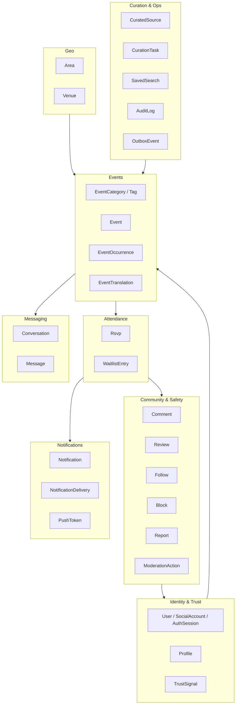

Ánh xạ sang module NestJS: mỗi subgraph là một `@Module()` với thư mục `src/modules/<name>/{entities,dto,services,controllers}`. Bảng dùng chung (`users`, `areas`) được export qua `TypeOrmModule.forFeature` chứ không nhân bản entity.

---

## 3. Quy ước kỹ thuật chung

### 3.1 Extensions PostgreSQL cần bật

| Extension | Dùng cho | Bắt buộc v1 |
|---|---|---|
| `postgis` | `geography(Point,4326)`, `ST_DWithin`, `ST_Distance`, index GIST | Có |
| `pgcrypto` | `gen_random_uuid()` dự phòng, hash token | Có |
| `citext` | Email / handle không phân biệt hoa thường | Có |
| `unaccent` | Gõ "an thuong" vẫn ra "An Thượng" | Có |
| `pg_trgm` | Gợi ý gõ tắt, chịu lỗi chính tả nhẹ | Có |
| `btree_gist` | Ràng buộc loại trừ (chống trùng lịch) — dự phòng GĐ2 | Không |

```sql
CREATE EXTENSION IF NOT EXISTS postgis;
CREATE EXTENSION IF NOT EXISTS pgcrypto;
CREATE EXTENSION IF NOT EXISTS citext;
CREATE EXTENSION IF NOT EXISTS unaccent;
CREATE EXTENSION IF NOT EXISTS pg_trgm;
```

Lưu ý: `unaccent` mặc định là `STABLE`, không dùng trực tiếp trong generated column được. Cách xử lý ở mục 15.2.

### 3.2 Quy ước đặt tên

| Đối tượng | Quy ước | Ví dụ |
|---|---|---|
| Class entity | PascalCase, số ít | `EventOccurrence` |
| Tên bảng | snake_case, số nhiều | `event_occurrences` |
| Tên cột | snake_case | `rsvp_going_count` |
| Thuộc tính TS | camelCase | `rsvpGoingCount` |
| Khóa ngoại | `<entity_số_ít>_id` | `host_user_id`, `occurrence_id` |
| Enum TS | PascalCase + hậu tố mô tả | `EventStatus`, `RsvpStatus` |
| Enum Postgres | snake_case + hậu tố `_enum` | `event_status_enum` |
| Index | `idx_<bảng>_<cột…>` | `idx_events_area_status` |
| Unique index | `uq_<bảng>_<cột…>` | `uq_rsvps_occurrence_user` |
| Ràng buộc CHECK | `ck_<bảng>_<ý nghĩa>` | `ck_events_capacity_positive` |

`SnakeNamingStrategy` được bật ở `DataSource` để không phải viết `name:` cho từng cột:

```ts
// src/database/data-source.ts
import { DataSource } from 'typeorm';
import { SnakeNamingStrategy } from 'typeorm-naming-strategies';

export const AppDataSource = new DataSource({
  type: 'postgres',
  namingStrategy: new SnakeNamingStrategy(),
  synchronize: false,               // luôn dùng migration, kể cả ở dev
  migrationsTransactionMode: 'each',
  extra: { options: '-c timezone=UTC' },
});
```

### 3.3 Base entity

```ts
// src/common/entities/base.entity.ts
import {
  PrimaryColumn, CreateDateColumn, UpdateDateColumn,
  DeleteDateColumn, BeforeInsert, VersionColumn,
} from 'typeorm';
import { uuidv7 } from 'uuidv7';

export abstract class BaseEntity {
  @PrimaryColumn('uuid')
  id: string;

  @BeforeInsert()
  protected assignId(): void {
    if (!this.id) this.id = uuidv7();
  }

  @CreateDateColumn({ type: 'timestamptz' })
  createdAt: Date;

  @UpdateDateColumn({ type: 'timestamptz' })
  updatedAt: Date;
}

export abstract class SoftDeletableEntity extends BaseEntity {
  @DeleteDateColumn({ type: 'timestamptz', nullable: true })
  deletedAt: Date | null;

  @VersionColumn({ default: 1 })
  version: number;   // optimistic locking cho các bảng bị sửa đồng thời
}
```

**Bẫy cần nhớ:** khi dùng `@DeleteDateColumn`, mọi UNIQUE phải là *partial unique index* `WHERE deleted_at IS NULL`, nếu không người dùng sẽ không tạo lại được bản ghi đã xóa mềm. Tất cả UNIQUE trong tài liệu này đều ngầm hiểu như vậy trừ khi ghi chú khác.

### 3.4 Quy ước kiểu dữ liệu

| Loại nghiệp vụ | Kiểu Postgres | Kiểu TS | Ghi chú |
|---|---|---|---|
| Mốc thời gian | `timestamptz` | `Date` | Luôn UTC |
| Ngày địa phương | `date` | `string` (`YYYY-MM-DD`) | Chỉ dùng cho gom nhóm theo ngày Đà Nẵng |
| Tiền | `integer` (VND, không phần lẻ) | `number` | VND không có đơn vị nhỏ hơn |
| Mã ngôn ngữ | `varchar(5)` | `'en' \| 'vi' \| ...` | BCP-47 rút gọn |
| Mã quốc gia | `char(2)` | `string` | ISO 3166-1 alpha-2 |
| Tọa độ | `geography(Point,4326)` | `{ type: 'Point'; coordinates: [lng, lat] }` | **GeoJSON là `[lng, lat]`**, ngược với thói quen đọc "lat, lng" |
| Cấu hình mở | `jsonb` | interface có validate bằng `class-validator` | Không bao giờ dùng jsonb cho thứ cần lọc/index thường xuyên |
| Danh sách ngắn cố định | `varchar[]` | `string[]` | Ví dụ `languages` của sự kiện |

---

## 4. Nhóm A — Danh tính, hồ sơ & độ tin cậy

### 4.1 `users` — `User`

| Cột | Kiểu Postgres | Kiểu TS | Ràng buộc | Ghi chú |
|---|---|---|---|---|
| `id` | uuid | string | PK | UUIDv7 |
| `email` | citext | string \| null | UNIQUE (partial) | Null nếu chỉ đăng nhập bằng social |
| `email_verified_at` | timestamptz | Date \| null | | Sinh `TrustSignal` khi được set |
| `phone` | varchar(20) | string \| null | UNIQUE (partial) | E.164, ví dụ `+84905123456` |
| `phone_verified_at` | timestamptz | Date \| null | | |
| `password_hash` | varchar(255) | string \| null | | Argon2id; null nếu social-only |
| `role` | `user_role_enum` | `UserRole` | NOT NULL, default `member` | Enum toàn cục, **đúng 5 giá trị**: `member` \| `curator` \| `moderator` \| `admin` \| `super_admin` |
| `trust_level` | smallint | number | NOT NULL, default `0`, CHECK `BETWEEN 0 AND 5` | Bậc tin cậy T0–T5. **Đây là nguồn sự thật duy nhất về bậc tin cậy**; job BullMQ `trust:recompute` ghi lại giá trị này |
| `trust_level_changed_at` | timestamptz | Date \| null | | Dùng để chống dao động bậc và để gửi thông báo `trust_level_up` |
| `status` | `user_status_enum` | `UserStatus` | NOT NULL, default `pending` | `pending` \| `active` \| `suspended` \| `deactivated` \| `deleted` |
| `locale` | varchar(5) | string | NOT NULL, default `'en'` | Ngôn ngữ UI ưa thích |
| `timezone` | varchar(64) | string | NOT NULL, default `'Asia/Ho_Chi_Minh'` | IANA name |
| `suspended_until` | timestamptz | Date \| null | | Đình chỉ có thời hạn từ kiểm duyệt |
| `suspension_reason` | varchar(255) | string \| null | | |
| `last_active_at` | timestamptz | Date \| null | | Cập nhật tối đa 1 lần/15 phút để tránh ghi nóng |
| `deletion_requested_at` | timestamptz | Date \| null | | Bắt đầu thời gian ân hạn 14 ngày |
| `anonymized_at` | timestamptz | Date \| null | | Đã chạy xong job ẩn danh |
| `legal_hold_until` | timestamptz | Date \| null | | Chặn ẩn danh khi đang có vụ việc an toàn |
| `created_at` / `updated_at` / `deleted_at` | timestamptz | Date | | |

Index:

```sql
CREATE UNIQUE INDEX uq_users_email ON users (email) WHERE deleted_at IS NULL;
CREATE UNIQUE INDEX uq_users_phone ON users (phone) WHERE deleted_at IS NULL AND phone IS NOT NULL;
CREATE INDEX idx_users_status_active ON users (status) WHERE deleted_at IS NULL;
CREATE INDEX idx_users_deletion_due ON users (deletion_requested_at)
  WHERE deletion_requested_at IS NOT NULL AND anonymized_at IS NULL;
```

Ghi chú thiết kế — bốn thứ **không** phải giá trị của `users.role`:

| Khái niệm | Nó thực sự là gì | Lưu ở đâu |
|---|---|---|
| `guest` | Trạng thái **chưa đăng nhập**, không có hàng nào trong `users` | Không lưu — suy ra từ việc không có access token |
| `organizer` | **Quan hệ theo từng sự kiện**: một user là organizer của những sự kiện mình tạo | `events.host_user_id` và bảng `event_cohosts` (§5.2, §5.4) |
| `verified_member` | **Trust level**, không phải quyền | `users.trust_level` (T0–T5, §4.5) |
| `support` | Đã **gộp vào** `moderator` | `users.role = 'moderator'` |

Vì vậy guard RBAC luôn kiểm tra **tổ hợp ba chiều**: `users.role` (toàn cục) + quan hệ theo sự kiện (`host_user_id` / `event_cohosts`) + `users.trust_level`. Brief nói rõ "bất kỳ user nào cũng có thể tạo" sự kiện, nên "organizer" không thể là quyền hệ thống. `curator` là vai trò nội bộ cho đội sáng lập giai đoạn curate thủ công; `super_admin` là vai trò duy nhất có quyền huỷ hoại (xoá vĩnh viễn, đổi role người khác).

### 4.2 `social_accounts` — `SocialAccount`

| Cột | Kiểu | Ràng buộc | Ghi chú |
|---|---|---|---|
| `id` | uuid | PK | |
| `user_id` | uuid | FK → users, ON DELETE CASCADE | |
| `provider` | `social_provider_enum` | NOT NULL | `google` \| `apple` \| `facebook` |
| `provider_user_id` | varchar(191) | NOT NULL | `sub` của provider |
| `email_at_provider` | citext | | Có thể là email ẩn danh của Apple (`privaterelay.appleid.com`) |
| `display_name_at_provider` | varchar(120) | | Chỉ dùng gợi ý điền hồ sơ lần đầu |
| `avatar_url_at_provider` | varchar(500) | | Tải về S3 một lần, không hotlink |
| `linked_at` / `last_login_at` | timestamptz | | |
| `raw_profile` | jsonb | | Purge sau 90 ngày |

```sql
CREATE UNIQUE INDEX uq_social_accounts_provider_uid ON social_accounts (provider, provider_user_id);
CREATE UNIQUE INDEX uq_social_accounts_user_provider ON social_accounts (user_id, provider);
```

Nhắc lại ràng buộc App Store: iOS có Google/Facebook login thì **bắt buộc** có Apple Sign-In. Apple có thể trả email chuyển tiếp riêng tư → không được coi email là khóa hợp nhất tài khoản duy nhất; hợp nhất theo `provider_user_id` trước, email chỉ là gợi ý cần người dùng xác nhận.

### 4.3 `auth_sessions` — `AuthSession` (refresh token)

| Cột | Kiểu | Ghi chú |
|---|---|---|
| `id` | uuid | PK, đồng thời là `jti` của refresh token |
| `user_id` | uuid | FK → users, CASCADE |
| `token_hash` | varchar(64) | SHA-256 của refresh token — **không lưu token thô** |
| `family_id` | uuid | Nhóm xoay vòng token; phát hiện tái sử dụng → thu hồi cả họ |
| `device_id` | varchar(191) | Từ Expo `Device` / fingerprint web |
| `platform` | `platform_enum` | `ios` \| `android` \| `web` |
| `app_version` | varchar(32) | |
| `ip` | inet | Purge sau 90 ngày |
| `user_agent` | varchar(255) | Purge sau 90 ngày |
| `expires_at` | timestamptz | |
| `revoked_at` | timestamptz | |
| `revoked_reason` | varchar(64) | `logout` \| `rotation_reuse` \| `password_change` \| `admin` \| `account_deletion` |

### 4.4 `profiles` — `Profile` (1–1 với User)

| Cột | Kiểu Postgres | Kiểu TS | Ghi chú |
|---|---|---|---|
| `user_id` | uuid | string | **PK đồng thời là FK** → users, CASCADE |
| `handle` | citext | string | UNIQUE, `^[a-z0-9_]{3,24}$`, dùng cho URL public |
| `display_name` | varchar(60) | string | NOT NULL |
| `headline` | varchar(120) | string \| null | "Yoga teacher · An Thuong" |
| `bio` | text | string \| null | Tối đa 1000 ký tự (kiểm ở DTO) |
| `bio_locale` | varchar(5) | string \| null | Ngôn ngữ người dùng viết bio |
| `avatar_media_id` | uuid | string \| null | FK → media, SET NULL |
| `nationality_code` | char(2) | string \| null | ISO 3166-1 |
| `spoken_languages` | jsonb | `{code,level}[]` | `[{"code":"en","level":"native"},{"code":"vi","level":"basic"}]` |
| `expat_type` | `expat_type_enum` | `ExpatType` | `digital_nomad` \| `long_term_resident` \| `student` \| `teacher` \| `business_owner` \| `short_stay` \| `local_host` |
| `home_area_id` | uuid | string \| null | FK → areas, SET NULL — khu vực người dùng ở |
| `in_da_nang_since` | date | string \| null | "In Da Nang since 03/2024" |
| `birth_year` | smallint | number \| null | Chỉ hiển thị khoảng tuổi, không hiển thị ngày sinh |
| `gender` | `gender_enum` | | `female` \| `male` \| `non_binary` \| `prefer_not_to_say` |
| `visibility` | `profile_visibility_enum` | | `public` \| `members_only` \| `private` |
| `show_area_publicly` | boolean | | Mặc định `true` cho district, `false` cho micro-area |
| `trust_points` | integer | number | Tổng thô các `trust_signals.weight` đã verify. **Chỉ dùng nội bộ** để suy ra bậc T0–T5, không hiển thị cho người dùng, không có trần 100 |
| ~~`trust_level`~~ | — | — | **Đã chuyển lên `users.trust_level` (smallint 0–5)** — xem §4.1 và §4.5. Profile không giữ bản sao để tránh hai nguồn sự thật |
| `trust_recomputed_at` | timestamptz | | |
| `events_hosted_count` | integer | | Phi chuẩn hóa |
| `events_attended_count` | integer | | Chỉ đếm `checked_in` |
| `no_show_count` | integer | | Hiển thị gián tiếp qua trust level, không phơi số thô |
| `rating_avg` | numeric(3,2) | | Chỉ hiện khi `rating_count >= 3` |
| `rating_count` | integer | | |
| `interests` | — | | Qua bảng nối `profile_interests` |
| `search_vector` | tsvector | | Do trigger duy trì |

```sql
CREATE UNIQUE INDEX uq_profiles_handle ON profiles (handle);
CREATE INDEX idx_profiles_home_area ON profiles (home_area_id) WHERE visibility = 'public';
CREATE INDEX idx_profiles_search ON profiles USING GIN (search_vector);
```

Bảng nối sở thích:

```
profile_interests (user_id uuid FK, category_id uuid FK, weight smallint default 1, PRIMARY KEY (user_id, category_id))
```

### 4.5 `trust_signals` — `TrustSignal` (append-only)

Đây là bảng chứng cứ cho "mức độ tin cậy" trong brief. `users.trust_level` và `profiles.trust_points` chỉ là bản cache đọc nhanh; **nguồn sự thật nằm ở đây** — bảng append-only, không UPDATE trừ hai cột `revoked_at` / `revoked_reason`.

| Cột | Kiểu | Ghi chú |
|---|---|---|
| `id` | uuid | PK |
| `user_id` | uuid | FK → users, CASCADE |
| `type` | `trust_signal_type_enum` | Xem bảng trọng số bên dưới |
| `status` | `trust_signal_status_enum` | `pending` \| `verified` \| `rejected` \| `expired` \| `revoked` |
| `weight` | smallint | Có thể âm (hình phạt) |
| `evidence_type` | varchar(40) | `event` \| `review` \| `document` \| `oauth` \| `manual` |
| `evidence_id` | uuid \| null | Không đặt FK vì trỏ nhiều bảng |
| `issued_by_user_id` | uuid \| null | Staff xác minh, hoặc người bảo lãnh (`community_vouch`) |
| `metadata` | jsonb | Ví dụ `{ "provider": "google" }`, `{ "occurrence_id": "..." }` |
| `verified_at` | timestamptz | |
| `expires_at` | timestamptz \| null | Ví dụ hộ chiếu hết hạn |
| `revoked_at` / `revoked_reason` | timestamptz / varchar(255) | |
| `created_at` | timestamptz | |

Bảng trọng số đề xuất cho v1 (điều chỉnh được qua config, không hardcode trong migration):

| `type` | weight | Điều kiện phát sinh |
|---|---|---|
| `email_verified` | +8 | Click link xác minh |
| `phone_verified` | +12 | OTP SMS |
| `social_google` / `social_facebook` | +6 | Liên kết tài khoản |
| `social_apple` | +6 | Liên kết tài khoản |
| `id_document` | +25 | Nhân viên duyệt thủ công; **xóa ảnh giấy tờ ngay sau khi duyệt** |
| `profile_completed` | +5 | Có avatar + bio + ≥1 ngôn ngữ + khu vực |
| `attended_event` | +2 (trần +20) | Mỗi lần `checked_in` |
| `hosted_event_completed` | +5 (trần +30) | Occurrence do mình host chuyển sang `completed` với ≥3 người check-in |
| `positive_review` | +3 (trần +24) | Mỗi review ≥4 sao đã publish |
| `community_vouch` | +4 (trần +12) | Người có `users.trust_level >= 4` (T4 Trusted) bảo lãnh |
| `staff_endorsement` | +15 | Đội sáng lập xác nhận (organizer đã curate) |
| `penalty_no_show` | −4 | Mỗi lần `no_show` (chỉ tính 90 ngày gần nhất) |
| `penalty_report_upheld` | −20 | Báo cáo bị xử lý bất lợi |

#### Thang bậc tin cậy T0–T5 (chuẩn duy nhất)

`users.trust_level` là `smallint` nhận đúng 6 giá trị. Bậc **không** được tính chỉ bằng điểm — mỗi bậc có **điều kiện cứng** (signal bắt buộc) đi kèm ngưỡng `trust_points`. Đây là lý do phải giữ `trust_signals` thay vì một con số duy nhất.

| Bậc | Nhãn hiển thị (i18n key) | Điều kiện cứng (bắt buộc có đủ) | Ngưỡng `trust_points` |
|---|---|---|---|
| 0 | T0 New — `trust.level.0` | Mặc định khi tạo tài khoản | — |
| 1 | T1 Email verified — `trust.level.1` | `email_verified` **hoặc** một trong `social_google` / `social_apple` / `social_facebook` | ≥ 6 |
| 2 | T2 Phone verified — `trust.level.2` | T1 **và** `phone_verified` | ≥ 20 |
| 3 | T3 Active member — `trust.level.3` | T2 **và** (`profile_completed` **và** ≥ 2 signal `attended_event`) | ≥ 35 |
| 4 | T4 Trusted — `trust.level.4` | T3 **và** (`id_document` **hoặc** ≥ 3 `positive_review` **hoặc** ≥ 2 `hosted_event_completed`) | ≥ 60 |
| 5 | T5 Community leader — `trust.level.5` | T4 **và** `staff_endorsement` | ≥ 85 |

Công thức điểm nội bộ (không hiển thị, không có trần 100):

```sql
trust_points = GREATEST(0, SUM(weight) FILTER (
  WHERE status = 'verified'
    AND revoked_at IS NULL
    AND (expires_at IS NULL OR expires_at > now())
))
```

Quy tắc vận hành:

- Job BullMQ `trust:recompute` chạy khi có signal mới (debounce 30 giây/user) và quét toàn bộ hằng đêm lúc 03:00 `Asia/Ho_Chi_Minh` để hạ bậc các signal hết hạn.
- **Chỉ tăng một bậc mỗi lần chạy**, và **hạ bậc thì hạ thẳng** về bậc mà điều kiện cứng còn thoả — tránh nhấp nháy badge.
- Mất điều kiện cứng thì mất bậc, kể cả khi `trust_points` vẫn cao (ví dụ `id_document` hết hạn → rơi từ T4 về T3).
- Mỗi lần `users.trust_level` đổi: ghi `audit_logs` (`action = 'user.trust_level_changed'`) và cập nhật `trust_level_changed_at`.

```sql
CREATE INDEX idx_trust_signals_user_active ON trust_signals (user_id)
  WHERE status = 'verified' AND revoked_at IS NULL;
CREATE UNIQUE INDEX uq_trust_signals_unique_kind ON trust_signals (user_id, type)
  WHERE type IN ('email_verified','phone_verified','id_document','profile_completed')
    AND status = 'verified';
```

### 4.6 `push_tokens` — `PushToken`

| Cột | Kiểu | Ghi chú |
|---|---|---|
| `id` | uuid | PK |
| `user_id` | uuid | FK → users, CASCADE |
| `expo_push_token` | varchar(255) | UNIQUE — `ExponentPushToken[...]` |
| `device_id` | varchar(191) | Một thiết bị chỉ giữ 1 token hoạt động |
| `platform` | `platform_enum` | `ios` \| `android` \| `web` |
| `app_version` / `os_version` | varchar(32) | Dùng để gỡ lỗi vùng phủ |
| `locale` | varchar(5) | Ngôn ngữ render nội dung push cho thiết bị này |
| `is_active` | boolean | |
| `failure_count` | smallint | Đạt 3 lần `DeviceNotRegistered` → `is_active = false` |
| `disabled_reason` | varchar(64) | `device_not_registered` \| `logout` \| `user_disabled` \| `account_deleted` |
| `last_used_at` | timestamptz | Token không dùng 180 ngày → dọn |

```sql
CREATE UNIQUE INDEX uq_push_tokens_token ON push_tokens (expo_push_token);
CREATE INDEX idx_push_tokens_user_active ON push_tokens (user_id) WHERE is_active;
```

### 4.7 `notification_preferences` — `NotificationPreference`

| Cột | Kiểu | Ghi chú |
|---|---|---|
| `user_id` | uuid | PK phần 1, FK → users CASCADE |
| `topic` | `notification_topic_enum` | PK phần 2 — `event_reminder`, `rsvp_activity`, `waitlist`, `messages`, `comments`, `follows`, `reviews`, `weekly_digest`, `product_updates` |
| `push_enabled` / `email_enabled` / `in_app_enabled` | boolean | |
| `quiet_hours_start` / `quiet_hours_end` | time | Diễn giải theo `users.timezone` |
| `digest_frequency` | `digest_frequency_enum` | `off` \| `daily` \| `weekly` |
| `updated_at` | timestamptz | |

Mặc định được sinh sẵn khi tạo user (seed 9 dòng), tránh phân biệt "chưa cấu hình" và "đã tắt".

---

## 5. Nhóm B — Sự kiện

Nguyên tắc chi phối cả nhóm: **`events` là *danh tính* của sự kiện (ai tổ chức, chủ đề gì, ở đâu, mô tả ra sao), `event_occurrences` là *lần diễn ra cụ thể* (bắt đầu lúc nào, còn bao nhiêu chỗ).** Mọi thứ có tính thời điểm không được móc vào `events`. Sự kiện một lần vẫn sinh **đúng một** occurrence — không có ngoại lệ, để tầng ứng dụng chỉ có một đường code.

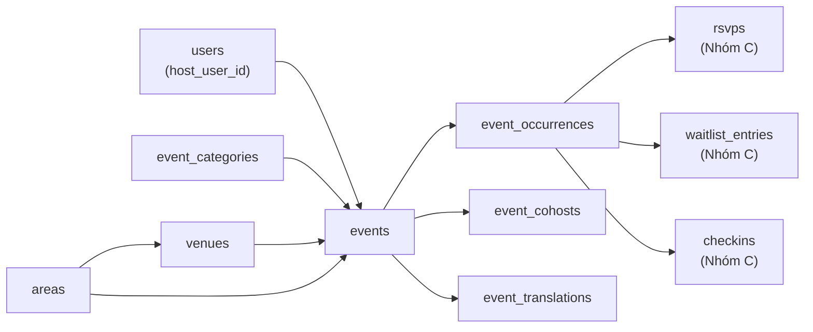

### 5.0 Các enum của nhóm B

| Tên enum Postgres | Giá trị (snake_case, chữ thường) |
|---|---|
| `event_status_enum` | `draft` · `pending_review` · `published` · `paused` · `cancelled` · `archived` |
| `event_visibility_enum` | `public` · `members_only` · `unlisted` |
| `event_location_mode_enum` | `physical` · `online` · `hybrid` |
| `location_precision_enum` | `exact` · `approximate` · `hidden_until_rsvp` |
| `event_source_enum` | `user_created` · `curated` · `imported_with_permission` · `partner` |
| `collection_method_enum` | `manual_only` · `partner_feed_with_contract` |
| `event_claim_status_enum` | `not_applicable` · `unclaimed` · `claim_pending` · `claimed` · `declined` |
| `occurrence_status_enum` | `scheduled` · `live` · `completed` · `cancelled` · `postponed` |
| `cohost_role_enum` | `cohost` · `assistant` · `translator` |
| `cohost_invite_status_enum` | `pending` · `accepted` · `declined` · `revoked` |
| `venue_type_enum` | `cafe` · `coworking` · `sports_facility` · `restaurant` · `bar` · `park` · `beach` · `studio` · `community_center` · `school` · `other` |
| `venue_status_enum` | `pending_review` · `active` · `closed` · `rejected` |
| `moderation_state_enum` | `clean` · `flagged` · `under_review` · `restricted` · `removed` |

> `cohost_role_enum` **không phải** vai trò toàn cục. Vai trò toàn cục chỉ có 5 giá trị trong `users.role` (§4.1). `organizer` / `cohost` là **quan hệ theo từng sự kiện** — đây chính là chỗ nó được lưu.

---

### 5.1 `events` — `Event`

| Cột | Kiểu Postgres | Null | Mặc định | Ràng buộc | Ghi chú |
|---|---|---|---|---|---|
| `id` | uuid | NO | — | PK | UUIDv7 |
| `slug` | citext | NO | — | Partial UNIQUE | `an-thuong-language-exchange-2026-09` |
| `title` | varchar(140) | NO | — | CHECK `length(btrim(title)) >= 6` | Tiêu đề hiển thị |
| `summary` | varchar(300) | YES | — | — | Một câu cho card trong feed |
| `description` | text | YES | — | CHECK `length(description) <= 8000` | Markdown rút gọn, sanitize ở tầng API |
| `content_locale` | varchar(5) | NO | `'en'` | CHECK `IN ('en','vi','ko','ru','zh','ja','fr')` | Ngôn ngữ organizer đã viết (D-07) |
| `languages` | varchar(5)[] | NO | `'{en}'` | CHECK `array_length(languages,1) BETWEEN 1 AND 5` | Ngôn ngữ **dùng trong sự kiện** — trục lọc bắt buộc theo brief |
| `host_user_id` | uuid | NO | — | FK → `users(id)` ON DELETE RESTRICT | **Tên cột chốt.** RESTRICT vì user không bao giờ bị hard-delete (§16) |
| `primary_category_id` | uuid | NO | — | FK → `event_categories(id)` ON DELETE RESTRICT | Một danh mục chính để lọc nhanh |
| `venue_id` | uuid | YES | — | FK → `venues(id)` ON DELETE SET NULL | Null khi organizer nhập địa chỉ tự do |
| `area_id` | uuid | YES | — | FK → `areas(id)` ON DELETE SET NULL | Phi chuẩn hóa từ `venues.area_id` hoặc suy từ `location` (§7.2) |
| `location_mode` | `event_location_mode_enum` | NO | `'physical'` | — | |
| `location` | geography(Point,4326) | YES | — | CHECK `ck_events_location_required` | Tọa độ thật, chỉ backend đọc |
| `location_public` | geography(Point,4326) | YES | — | — | Tọa độ đã làm mờ theo `location_precision`; API công khai **chỉ** trả cột này (§7.2) |
| `location_precision` | `location_precision_enum` | NO | `'exact'` | — | `hidden_until_rsvp` dùng cho gặp mặt tại nhà riêng |
| `address_line` | varchar(255) | YES | — | — | Hiển thị theo `location_precision` |
| `address_note` | varchar(255) | YES | — | — | "Tầng 3, cổng bên hông" — chỉ lộ sau khi RSVP |
| `online_url` | varchar(500) | YES | — | CHECK `ck_events_online_url_required` | Zoom/Meet, chỉ lộ cho `going` |
| `status` | `event_status_enum` | NO | `'draft'` | CHECK `ck_events_published_at` | State machine §12.1 |
| `visibility` | `event_visibility_enum` | NO | `'public'` | — | `unlisted` = chỉ ai có link |
| `min_trust_level` | smallint | NO | `0` | CHECK `BETWEEN 0 AND 5` | Chặn RSVP dưới bậc (T0–T5, §4.5) |
| `requires_approval` | boolean | NO | `false` | — | RSVP vào `pending_approval` thay vì `going` |
| `recurrence_rule` | varchar(255) | YES | — | CHECK `recurrence_rule IS NULL OR recurrence_rule LIKE 'FREQ=%'` | RRULE RFC 5545, ví dụ `FREQ=WEEKLY;BYDAY=TU` |
| `recurrence_timezone` | varchar(64) | NO | `'Asia/Ho_Chi_Minh'` | — | Materialize RRULE theo giờ địa phương rồi mới quy về UTC |
| `recurrence_until` | timestamptz | YES | — | — | Trần sinh occurrence; null = sinh cuốn chiếu 12 tuần |
| `default_capacity` | integer | YES | — | CHECK `ck_events_capacity_positive` | Null = không giới hạn |
| `default_waitlist_enabled` | boolean | NO | `true` | — | Waitlist là MUST của MVP |
| `default_duration_minutes` | integer | NO | `90` | CHECK `BETWEEN 15 AND 1440` | |
| `guests_allowed_max` | smallint | NO | `0` | CHECK `BETWEEN 0 AND 5` | Số người đi kèm tối đa mỗi RSVP |
| `price_amount` | integer | NO | `0` | CHECK `>= 0` | VND nguyên (quy ước kiểu tiền §3.4). Quy đổi thống nhất 1 USD = 26.000 VND |
| `price_currency` | char(3) | NO | `'VND'` | CHECK `IN ('VND','USD')` | Hiển thị song tệ ở UI |
| `price_note` | varchar(120) | YES | — | — | "Free, mua đồ uống tại quán" |
| `cover_media_id` | uuid | YES | — | FK → `media(id)` ON DELETE SET NULL | |
| `source` | `event_source_enum` | NO | `'user_created'` | — | D-11 |
| `collection_method` | `collection_method_enum` | NO | `'manual_only'` | CHECK `ck_events_collection_method` | D-12 — schema chặn thu thập tự động từ gốc |
| `curated_source_id` | uuid | YES | — | FK → `curated_sources(id)` ON DELETE SET NULL | §10.5 |
| `claim_status` | `event_claim_status_enum` | NO | `'not_applicable'` | CHECK `ck_events_claim_source` | Luồng bàn giao listing cho organizer gốc |
| `claimed_by_user_id` | uuid | YES | — | FK → `users(id)` ON DELETE SET NULL | |
| `claimed_at` | timestamptz | YES | — | — | |
| `published_at` | timestamptz | YES | — | — | Lần publish **đầu tiên**, không đổi khi sửa |
| `first_occurrence_start_at` | timestamptz | YES | — | — | Phi chuẩn hóa, do trigger duy trì |
| `next_occurrence_start_at` | timestamptz | YES | — | — | Occurrence `scheduled` gần nhất còn ở tương lai — **cột sắp xếp chính của feed** |
| `occurrence_count` | integer | NO | `0` | CHECK `>= 0` | |
| `total_going_count` | integer | NO | `0` | CHECK `>= 0` | Tổng `going` mọi occurrence, chỉ để hiển thị "đã có 148 lượt tham gia" |
| `view_count` / `save_count` | integer | NO | `0` | CHECK `>= 0` | Cập nhật theo lô từ Redis, không ghi trực tiếp |
| `moderation_state` | `moderation_state_enum` | NO | `'clean'` | — | Nhóm F đọc/ghi |
| `moderation_note` | varchar(255) | YES | — | — | Nội bộ |
| `cancelled_reason` | varchar(255) | YES | — | — | Bắt buộc khi `status = 'cancelled'` (kiểm ở service) |
| `search_vector` | tsvector | YES | — | — | Trigger duy trì, xem §15 |
| `created_at` / `updated_at` | timestamptz | NO | `now()` | — | |
| `deleted_at` | timestamptz | YES | — | — | Soft delete (§16 tầng 2) |
| `version` | integer | NO | `1` | — | Optimistic locking |

Ràng buộc CHECK ở cấp bảng:

| Tên | Biểu thức | Vì sao |
|---|---|---|
| `ck_events_capacity_positive` | `default_capacity IS NULL OR default_capacity > 0` | `0` chỗ là lỗi nhập liệu, không phải "không giới hạn" |
| `ck_events_location_required` | `location_mode = 'online' OR location IS NOT NULL` | Sự kiện offline không có tọa độ thì không lên được bản đồ |
| `ck_events_online_url_required` | `location_mode = 'physical' OR online_url IS NOT NULL` | |
| `ck_events_published_at` | `status <> 'published' OR published_at IS NOT NULL` | Không có sự kiện "đã publish" mà không có mốc publish |
| `ck_events_collection_method` | `collection_method = 'manual_only' OR source = 'partner'` | Chỉ nguồn đối tác có hợp đồng mới được rời `manual_only` |
| `ck_events_claim_source` | `claim_status = 'not_applicable' OR source <> 'user_created'` | Sự kiện do chính user tạo thì không có khái niệm "nhận quyền sở hữu" |
| `ck_events_price` | `price_amount >= 0 AND (price_currency <> 'VND' OR price_amount % 1000 = 0)` | VND không có đơn vị nhỏ hơn 1.000 trong thực tế thu tiền mặt |

Index:

| Tên | Loại | Định nghĩa | Vì sao cần |
|---|---|---|---|
| `uq_events_slug` | **Partial UNIQUE** (B-tree) | `(slug) WHERE deleted_at IS NULL` | Slug nằm trong URL public nên phải duy nhất; nhưng bảng có `deleted_at`, nếu UNIQUE toàn phần thì một sự kiện đã xóa mềm sẽ **giữ slug làm con tin vĩnh viễn** và organizer không tạo lại được sự kiện cùng tên |
| `idx_events_geo` | **GIST** (partial) | `USING GIST (location) WHERE status = 'published' AND deleted_at IS NULL` | `ST_DWithin` chỉ dùng được index GIST. Partial vì ~70–80% hàng ở trạng thái `draft`/`archived` không bao giờ vào kết quả tìm kiếm → index nhỏ hơn nhiều, nằm gọn trong shared_buffers |
| `idx_events_area_status_next` | **Composite** B-tree | `(area_id, status, next_occurrence_start_at)` | Thứ tự cột theo quy tắc **bằng → bằng → khoảng**: truy vấn chủ đạo là `area_id = ? AND status = 'published' AND next_occurrence_start_at >= now() ORDER BY next_occurrence_start_at`. Đảo thứ tự (đặt `next_occurrence_start_at` trước) sẽ mất khả năng dùng index cho vế `ORDER BY` |
| `idx_events_category_next` | **Composite** (partial) | `(primary_category_id, next_occurrence_start_at) WHERE status = 'published' AND deleted_at IS NULL` | Tab "Language exchange", "Sports" trong app |
| `idx_events_host` | Composite | `(host_user_id, created_at DESC)` | Màn "Sự kiện tôi tổ chức" |
| `idx_events_search` | **GIN** | `USING GIN (search_vector)` | FTS (§15) |
| `idx_events_languages` | **GIN** | `USING GIN (languages)` | Lọc `languages && ARRAY['en','vi']` — trục lọc số 4 của brief; B-tree không phục vụ được toán tử mảng |
| `idx_events_claim_open` | Partial | `(claim_status, created_at) WHERE claim_status IN ('unclaimed','claim_pending')` | Hàng đợi công việc của `curator`; số hàng rất nhỏ so với bảng |
| `idx_events_moderation_open` | Partial | `(moderation_state, updated_at) WHERE moderation_state IN ('flagged','under_review')` | Hàng đợi kiểm duyệt phải mở tức thì kể cả khi bảng lớn |
| `idx_events_venue` | B-tree | `(venue_id) WHERE venue_id IS NOT NULL` | Trang địa điểm liệt kê sự kiện |

> **Vì sao `next_occurrence_start_at` nằm trên `events` mà không JOIN?** Feed trang chủ sắp xếp theo "sắp diễn ra" nhưng lọc theo thuộc tính của `events` (khu vực, danh mục, ngôn ngữ). Nếu để mốc thời gian ở bảng con, mọi truy vấn feed đều thành `JOIN + GROUP BY + MIN(start_at)` — không index nào phục vụ nổi. Cột phi chuẩn hóa này do trigger trên `event_occurrences` cập nhật và job `events:reconcile-counters` đối soát hằng đêm (D-10).

---

### 5.2 `event_occurrences` — `EventOccurrence`

Đây là bảng "nóng" nhất hệ thống: RSVP, waitlist, check-in, nhắc lịch đều đọc/ghi ở đây.

| Cột | Kiểu Postgres | Null | Mặc định | Ràng buộc | Ghi chú |
|---|---|---|---|---|---|
| `id` | uuid | NO | — | PK | |
| `event_id` | uuid | NO | — | FK → `events(id)` ON DELETE CASCADE | Xóa event thì xóa cả chuỗi lần diễn ra |
| `sequence` | integer | NO | `1` | CHECK `>= 1` | Thứ tự trong chuỗi lặp; sự kiện một lần luôn là `1` |
| `start_at` | timestamptz | NO | — | — | UTC |
| `end_at` | timestamptz | NO | — | CHECK `end_at > start_at` | |
| `local_date` | date | NO | — | — | Ngày theo `Asia/Ho_Chi_Minh`, do trigger ghi (xem ghi chú bên dưới) |
| `timezone` | varchar(64) | NO | `'Asia/Ho_Chi_Minh'` | — | |
| `status` | `occurrence_status_enum` | NO | `'scheduled'` | — | |
| `capacity` | integer | YES | — | CHECK `capacity IS NULL OR capacity > 0` | Kế thừa `events.default_capacity` lúc sinh, sau đó độc lập |
| `seats_taken` | integer | NO | `0` | CHECK `>= 0` | `SUM(1 + guest_count)` của RSVP đang chiếm chỗ. **Đây là con số dùng để so với `capacity`** |
| `rsvp_going_count` | integer | NO | `0` | CHECK `>= 0` | Số **người** ở trạng thái `going` (không tính khách đi kèm) |
| `rsvp_waitlist_count` | integer | NO | `0` | CHECK `>= 0` | |
| `interested_count` | integer | NO | `0` | CHECK `>= 0` | |
| `checked_in_count` | integer | NO | `0` | CHECK `>= 0` | |
| `no_show_count` | integer | NO | `0` | CHECK `>= 0` | |
| `waitlist_enabled` | boolean | NO | `true` | — | |
| `waitlist_capacity` | integer | YES | — | CHECK `waitlist_capacity IS NULL OR waitlist_capacity > 0` | Trần hàng đợi, tránh hàng đợi 400 người vô nghĩa |
| `rsvp_opens_at` | timestamptz | YES | — | — | Null = mở ngay khi publish |
| `rsvp_closes_at` | timestamptz | YES | — | CHECK `rsvp_closes_at IS NULL OR rsvp_opens_at IS NULL OR rsvp_closes_at > rsvp_opens_at` | Null = đóng lúc `start_at` |
| `venue_id` | uuid | YES | — | FK → `venues(id)` ON DELETE SET NULL | Ghi đè khi buổi này đổi địa điểm |
| `area_id` | uuid | YES | — | FK → `areas(id)` ON DELETE SET NULL | Ghi đè; null = kế thừa `events.area_id` |
| `location` | geography(Point,4326) | YES | — | — | Ghi đè tọa độ |
| `host_note` | varchar(500) | YES | — | — | "Tuần này đổi sang sân số 3" |
| `reminder_24h_sent_at` | timestamptz | YES | — | — | **T-24h** (chốt #6) — mốc *lô* đã được đẩy vào hàng đợi |
| `reminder_2h_sent_at` | timestamptz | YES | — | — | **T-2h** (chốt #6) |
| `checkin_code` | varchar(12) | YES | — | Partial UNIQUE | Mã ngắn để organizer đọc to; xoay vòng mỗi occurrence |
| `completed_at` | timestamptz | YES | — | — | Job `occurrence:close` set sau `end_at + 3h` |
| `cancelled_at` | timestamptz | YES | — | — | |
| `cancelled_reason` | varchar(255) | YES | — | — | |
| `postponed_to_occurrence_id` | uuid | YES | — | FK → `event_occurrences(id)` ON DELETE SET NULL | Dời lịch = tạo occurrence mới và trỏ tới |
| `created_at` / `updated_at` / `deleted_at` | timestamptz | | `now()` / `now()` / — | | |
| `version` | integer | NO | `1` | — | Optimistic locking cho luồng RSVP |

> **Vì sao `local_date` không phải generated column?** `timestamptz AT TIME ZONE 'Asia/Ho_Chi_Minh'` là hàm **STABLE**, không phải IMMUTABLE (dữ liệu múi giờ có thể đổi), nên Postgres từ chối dùng nó trong `GENERATED ALWAYS AS ... STORED`. Cách xử lý: trigger `BEFORE INSERT OR UPDATE OF start_at` ghi giá trị. Đây là cùng loại bẫy với `unaccent` ở §15.2.

Index:

| Tên | Loại | Định nghĩa | Vì sao cần |
|---|---|---|---|
| `uq_occurrences_event_start` | **Partial UNIQUE** | `(event_id, start_at) WHERE deleted_at IS NULL` | Job materialize RRULE chạy lặp (retry, deploy lại) — không có ràng buộc này sẽ sinh occurrence trùng giờ và RSVP bị chia đôi. Partial vì khi organizer xóa một buổi rồi tạo lại đúng giờ đó thì phải cho phép |
| `uq_occurrences_event_sequence` | **Partial UNIQUE** | `(event_id, sequence) WHERE deleted_at IS NULL` | Đánh số buổi ổn định cho UI ("Buổi 7/12") |
| `idx_occurrences_upcoming` | **Composite** (partial) | `(start_at, id) WHERE status = 'scheduled' AND deleted_at IS NULL` | Feed toàn cục "sắp diễn ra" + **cursor pagination keyset** theo `(start_at, id)`; có `id` trong index nên cursor không cần đọc heap để phá thế hòa |
| `idx_occurrences_event_start` | Composite | `(event_id, start_at)` | Trang chi tiết sự kiện liệt kê các buổi; cũng là index dùng cho nested loop trong truy vấn §14 |
| `idx_occurrences_area_start` | **Composite** (partial) | `(area_id, start_at) WHERE status = 'scheduled' AND deleted_at IS NULL` | Lọc theo khu vực + thời gian mà không đụng `events` |
| `idx_occurrences_geo` | **GIST** (partial) | `USING GIST (location) WHERE location IS NOT NULL AND status = 'scheduled'` | Chỉ ~5% occurrence ghi đè tọa độ; index đầy đủ sẽ lãng phí |
| `idx_occurrences_reminder_24h` | Partial | `(start_at) WHERE status = 'scheduled' AND reminder_24h_sent_at IS NULL` | Job quét mỗi 5 phút phải chạm đúng vài chục hàng, không quét cả bảng |
| `idx_occurrences_reminder_2h` | Partial | `(start_at) WHERE status = 'scheduled' AND reminder_2h_sent_at IS NULL` | Như trên, cho mốc T-2h |
| `idx_occurrences_open_seats` | Partial | `(start_at) WHERE status = 'scheduled' AND (capacity IS NULL OR seats_taken < capacity)` | Bộ lọc "chỉ hiện sự kiện còn chỗ" — vị ngữ so sánh hai cột trong `WHERE` của partial index là hợp lệ và được đánh giá lại mỗi lần UPDATE |
| `uq_occurrences_checkin_code` | Partial UNIQUE | `(checkin_code) WHERE checkin_code IS NOT NULL AND status IN ('scheduled','live')` | Mã ngắn được tái sử dụng sau khi buổi kết thúc, nên không thể UNIQUE toàn phần |

---

### 5.3 `event_categories` — `EventCategory`

Cây danh mục 2 tầng (nhóm → mục con). Đây cũng là bảng mà `profile_interests` (§4.4) trỏ tới, nên nó vừa là "loại sự kiện" vừa là "sở thích".

| Cột | Kiểu Postgres | Null | Mặc định | Ràng buộc | Ghi chú |
|---|---|---|---|---|---|
| `id` | uuid | NO | — | PK | |
| `parent_id` | uuid | YES | — | FK → `event_categories(id)` ON DELETE RESTRICT | Null = danh mục gốc |
| `depth` | smallint | NO | `0` | CHECK `BETWEEN 0 AND 1` | Cấm cây sâu hơn 2 tầng — UI mobile không kham nổi |
| `slug` | citext | NO | — | UNIQUE | Khóa i18n: `category.<slug>` |
| `name_en` | varchar(80) | NO | — | — | D-07: từ vựng hệ thống lưu song ngữ trong cột |
| `name_vi` | varchar(80) | NO | — | — | |
| `description_en` / `description_vi` | varchar(255) | YES | — | — | |
| `icon` | varchar(40) | YES | — | — | Tên icon trong design system |
| `color_hex` | char(7) | YES | — | CHECK `color_hex ~ '^#[0-9a-f]{6}$'` | Chữ thường, khớp quy ước enum |
| `is_interest` | boolean | NO | `true` | — | Có xuất hiện trong màn chọn sở thích hồ sơ không |
| `is_active` | boolean | NO | `true` | — | Ẩn danh mục mà không xóa (đã có sự kiện trỏ tới) |
| `sort_order` | smallint | NO | `100` | — | |
| `event_count` | integer | NO | `0` | CHECK `>= 0` | Phi chuẩn hóa, chỉ đếm `published` |
| `created_at` / `updated_at` | timestamptz | NO | `now()` | — | Không có `deleted_at` — dùng `is_active` |

Index:

| Tên | Loại | Định nghĩa | Vì sao |
|---|---|---|---|
| `uq_event_categories_slug` | UNIQUE (không partial) | `(slug)` | Bảng **không có** `deleted_at` nên UNIQUE toàn phần là đúng — đây là ví dụ đối chiếu cho quy tắc partial ở §3.3 |
| `idx_event_categories_tree` | Composite | `(parent_id, sort_order) WHERE is_active` | Render cây trong bộ lọc |

Seed v1 (12 nhóm gốc, khớp brief giai đoạn 1):

| `slug` | `name_en` | `name_vi` | Ghi chú |
|---|---|---|---|
| `language-exchange` | Language exchange | Giao lưu ngôn ngữ | Trụ cột 3 của giai đoạn 1 |
| `sports` | Sports | Thể thao | Con: `badminton`, `football`, `running`, `cycling`, `surfing`, `tennis`, `pickleball` |
| `fitness-wellness` | Fitness & wellness | Rèn luyện & sức khỏe | Con: `yoga`, `gym`, `meditation` |
| `social-meetup` | Social meetup | Gặp gỡ giao lưu | Trụ cột 1 |
| `food-drink` | Food & drink | Ăn uống | |
| `workshop-learning` | Workshop & learning | Workshop & học hỏi | |
| `music-arts` | Music & arts | Âm nhạc & nghệ thuật | |
| `outdoor-adventure` | Outdoor & adventure | Ngoài trời & khám phá | Bán đảo Sơn Trà, Bà Nà |
| `business-networking` | Business & networking | Kinh doanh & kết nối | |
| `family-kids` | Family & kids | Gia đình & trẻ em | |
| `volunteering` | Volunteering | Tình nguyện | |
| `newcomers` | Newcomers | Người mới đến | Cửa vào tự nhiên cho expat vừa tới Đà Nẵng |

---

### 5.4 `event_cohosts` — `EventCohost`

Bảng hiện thực hóa quyết định **"organizer là quan hệ theo sự kiện, không phải role toàn cục"**.

| Cột | Kiểu Postgres | Null | Mặc định | Ràng buộc | Ghi chú |
|---|---|---|---|---|---|
| `id` | uuid | NO | — | PK | Dùng surrogate key vì có vòng đời lời mời (mời → chấp nhận → thu hồi) |
| `event_id` | uuid | NO | — | FK → `events(id)` ON DELETE CASCADE | |
| `user_id` | uuid | NO | — | FK → `users(id)` ON DELETE CASCADE | |
| `role_in_event` | `cohost_role_enum` | NO | `'cohost'` | — | **Chỉ có nghĩa trong phạm vi sự kiện này** |
| `can_edit_event` | boolean | NO | `false` | — | Tách thành cột boolean thay vì jsonb để guard đọc nhanh và index được |
| `can_manage_rsvp` | boolean | NO | `true` | — | Duyệt/hủy RSVP, thăng hạng waitlist |
| `can_checkin` | boolean | NO | `true` | — | Quét QR tại chỗ |
| `can_message_attendees` | boolean | NO | `false` | — | Quyền nhạy cảm — mặc định tắt |
| `invite_status` | `cohost_invite_status_enum` | NO | `'pending'` | — | |
| `invited_by_user_id` | uuid | NO | — | FK → `users(id)` ON DELETE RESTRICT | Ai mời — cần cho audit |
| `invited_at` | timestamptz | NO | `now()` | — | |
| `responded_at` | timestamptz | YES | — | — | |
| `revoked_at` | timestamptz | YES | — | — | |
| `revoked_reason` | varchar(255) | YES | — | — | |
| `created_at` / `updated_at` | timestamptz | NO | `now()` | — | Không soft delete — dùng `invite_status = 'revoked'` để giữ vết lịch sử |

Index:

| Tên | Loại | Định nghĩa | Vì sao |
|---|---|---|---|
| `uq_event_cohosts_active` | **Partial UNIQUE** | `(event_id, user_id) WHERE invite_status IN ('pending','accepted')` | Một người chỉ có **một** lời mời đang hiệu lực cho một sự kiện; nhưng sau khi bị `revoked` thì phải mời lại được — UNIQUE toàn phần sẽ chặn vĩnh viễn |
| `idx_event_cohosts_user` | Partial | `(user_id, event_id) WHERE invite_status = 'accepted'` | Guard RBAC hỏi "user này có quyền trên event này không" ở **mọi** request quản trị sự kiện — phải là index scan một lần chạm |
| `idx_event_cohosts_pending` | Partial | `(user_id, invited_at DESC) WHERE invite_status = 'pending'` | Badge "bạn có 2 lời mời đồng tổ chức" |

Ràng buộc không biểu diễn được bằng CHECK (vì phải đọc bảng khác) → **trigger** `trg_event_cohosts_not_host`:

- `user_id` không được trùng `events.host_user_id` (host đã có toàn quyền, thêm dòng cohost sẽ tạo hai nguồn sự thật về quyền).
- Tối đa 5 cohost `accepted` cho một sự kiện ở v1.

---

### 5.5 `venues` — `Venue`

| Cột | Kiểu Postgres | Null | Mặc định | Ràng buộc | Ghi chú |
|---|---|---|---|---|---|
| `id` | uuid | NO | — | PK | |
| `slug` | citext | NO | — | Partial UNIQUE | |
| `name` | varchar(140) | NO | — | CHECK `length(btrim(name)) >= 2` | Tên gốc như trên biển hiệu |
| `name_vi` | varchar(140) | YES | — | — | Khi tên tiếng Việt khác hẳn |
| `type` | `venue_type_enum` | NO | `'other'` | — | |
| `address_line` | varchar(255) | NO | — | — | |
| `ward_name` | varchar(120) | YES | — | — | Văn bản thô như người dùng nhập |
| `area_id` | uuid | YES | — | FK → `areas(id)` ON DELETE SET NULL | Gán bằng `ST_Contains` (§7.2) |
| `location` | geography(Point,4326) | NO | — | — | Địa điểm công cộng nên luôn `exact` |
| `google_place_id` | varchar(191) | YES | — | Partial UNIQUE | Chống tạo trùng khi nhiều organizer cùng nhập một quán |
| `phone` | varchar(20) | YES | — | — | |
| `website` | varchar(500) | YES | — | — | |
| `opening_hours` | jsonb | YES | — | — | `{"mon":[["07:00","22:00"]], ...}` — không lọc theo cột này nên jsonb là đúng chỗ |
| `amenities` | jsonb | YES | `'{}'` | — | `{"wifi":true,"parking":true,"english_menu":true,"wheelchair":false}` |
| `capacity_hint` | integer | YES | — | CHECK `capacity_hint IS NULL OR capacity_hint > 0` | Gợi ý cho organizer đặt `capacity` |
| `status` | `venue_status_enum` | NO | `'pending_review'` | — | Địa điểm do user tạo phải duyệt trước khi thành gợi ý công khai |
| `moderation_state` | `moderation_state_enum` | NO | `'clean'` | — | |
| `is_verified` | boolean | NO | `false` | — | Đội `curator` đã tới tận nơi hoặc gọi xác nhận |
| `verified_by_user_id` | uuid | YES | — | FK → `users(id)` ON DELETE SET NULL | |
| `verified_at` | timestamptz | YES | — | — | |
| `created_by_user_id` | uuid | YES | — | FK → `users(id)` ON DELETE SET NULL | |
| `event_count` | integer | NO | `0` | CHECK `>= 0` | |
| `search_vector` | tsvector | YES | — | — | |
| `created_at` / `updated_at` / `deleted_at` | timestamptz | | `now()` / `now()` / — | | |

Index:

| Tên | Loại | Định nghĩa | Vì sao |
|---|---|---|---|
| `idx_venues_geo` | **GIST** | `USING GIST (location) WHERE deleted_at IS NULL` | Bản đồ + "địa điểm gần bạn" khi tạo sự kiện |
| `uq_venues_slug` | **Partial UNIQUE** | `(slug) WHERE deleted_at IS NULL` | Như `events` |
| `uq_venues_google_place` | **Partial UNIQUE** | `(google_place_id) WHERE google_place_id IS NOT NULL AND deleted_at IS NULL` | Chống trùng; partial còn vì phần lớn hàng có giá trị NULL |
| `idx_venues_area_status` | Composite | `(area_id, status) WHERE deleted_at IS NULL` | Danh sách địa điểm theo khu vực |
| `idx_venues_name_trgm` | **GIN (trigram)** | `USING GIN (name gin_trgm_ops)` | Autocomplete gõ sai chính tả: "esprsso" vẫn ra "Espresso" |
| `idx_venues_search` | GIN | `USING GIN (search_vector)` | |

---

### 5.6 `event_translations` — `EventTranslation`

Hiện thực D-07: organizer viết **một** bản, bản dịch là dữ liệu phụ (do người dịch cộng đồng hoặc máy dịch có gắn nhãn).

| Cột | Kiểu Postgres | Null | Mặc định | Ràng buộc | Ghi chú |
|---|---|---|---|---|---|
| `id` | uuid | NO | — | PK | |
| `event_id` | uuid | NO | — | FK → `events(id)` ON DELETE CASCADE | |
| `locale` | varchar(5) | NO | — | CHECK `IN ('en','vi','ko','ru','zh','ja','fr')` | |
| `title` | varchar(140) | NO | — | — | |
| `summary` | varchar(300) | YES | — | — | |
| `description` | text | YES | — | — | |
| `source` | varchar(20) | NO | `'human'` | CHECK `IN ('human','machine')` | UI phải gắn nhãn "bản dịch tự động" |
| `translated_by_user_id` | uuid | YES | — | FK → `users(id)` ON DELETE SET NULL | |
| `is_approved` | boolean | NO | `false` | — | Host duyệt bản dịch cho sự kiện của mình |
| `created_at` / `updated_at` | timestamptz | NO | `now()` | — | |

| Tên index | Loại | Định nghĩa | Vì sao |
|---|---|---|---|
| `uq_event_translations` | UNIQUE | `(event_id, locale)` | Một ngôn ngữ một bản; bảng không soft delete nên không cần partial |

### 5.7 Bất biến của nhóm B

1. Mỗi `events` ở trạng thái `published` phải có **≥ 1** `event_occurrences` với `status = 'scheduled'` hoặc `completed`. Kiểm ở service khi publish, và job `events:audit` báo động nếu vi phạm.
2. `events.next_occurrence_start_at` = `MIN(start_at)` của các occurrence `scheduled` có `start_at > now()`, hoặc `NULL`.
3. Sửa `events.default_capacity` **không** hồi tố vào occurrence đã tồn tại — tránh việc một thao tác vô tình đẩy hàng chục người vào waitlist.
4. Hủy `events` → mọi occurrence `scheduled` chuyển `cancelled`, mọi RSVP `going`/`waitlisted` nhận thông báo `event.cancelled` (không tự chuyển sang `cancelled` để người dùng còn thấy lịch sử mình đã đăng ký).

---

## 6. Nhóm C — Tham gia

**Quyết định nền tảng (chốt):** RSVP gắn vào `event_occurrences`, **không** gắn vào `events`. Bảng `rsvps` có `occurrence_id`, và endpoint chính là:

```
POST /api/v1/occurrences/{occurrenceId}/rsvps
```

Đường tắt `POST /api/v1/events/{eventId}/rsvps` chỉ là *cầu nối*: nó tra occurrence `scheduled` sắp diễn ra gần nhất của event đó rồi ủy quyền sang endpoint chính. Nếu event có **nhiều hơn một** occurrence sắp tới, đường tắt trả **409 Conflict** kèm danh sách occurrence để client hỏi lại người dùng — không được đoán hộ.

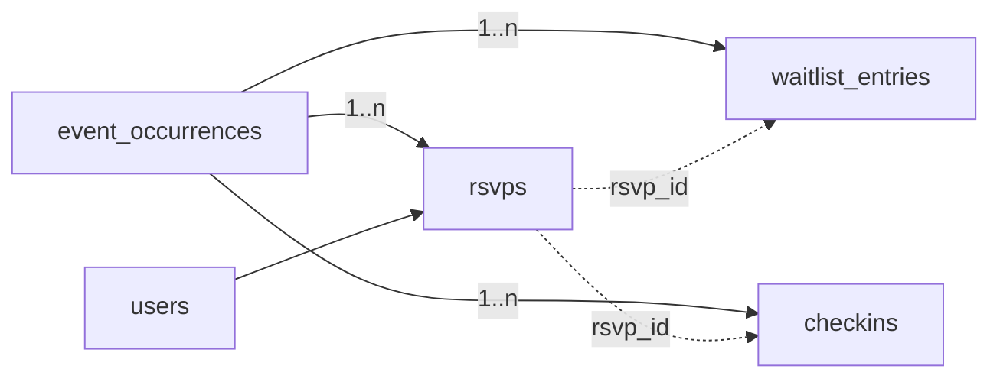

Ba bảng, ba trách nhiệm khác nhau — đây là lý do không gộp:

| Bảng | Trả lời câu hỏi | Số hàng/người/buổi |
|---|---|---|
| `rsvps` | "Hiện tại người này đang ở trạng thái nào với buổi này?" | Đúng **1** |
| `waitlist_entries` | "Ai đã vào hàng đợi lúc nào, được mời lúc nào, hết hạn ra sao?" | 0..n (mỗi lượt vào hàng đợi 1 dòng) |
| `checkins` | "Đã quét mã lúc nào, bằng cách nào, cách địa điểm bao xa?" | 0..n (có lần quét hỏng, quét lại) |

### 6.0 Enum của nhóm C

| Tên enum | Giá trị |
|---|---|
| `rsvp_status_enum` | `interested` · `pending_approval` · `going` · `waitlisted` · `cancelled` · `declined` · `checked_in` · `no_show` |
| `rsvp_source_enum` | `web` · `ios` · `android` · `organizer_added` · `waitlist_promoted` · `import` |
| `waitlist_state_enum` | `queued` · `offered` · `accepted` · `expired` · `withdrawn` · `cancelled` · `closed` |
| `checkin_method_enum` | `qr_scan` · `short_code` · `organizer_manual` · `self_geo` |

Trạng thái **chiếm chỗ** (tính vào `seats_taken`): `going`, `pending_approval`, `checked_in`, `no_show`. Trạng thái **không** chiếm chỗ: `interested`, `waitlisted`, `cancelled`, `declined`.

---

### 6.1 `rsvps` — `Rsvp`

| Cột | Kiểu Postgres | Null | Mặc định | Ràng buộc | Ghi chú |
|---|---|---|---|---|---|
| `id` | uuid | NO | — | PK | |
| `occurrence_id` | uuid | NO | — | FK → `event_occurrences(id)` ON DELETE CASCADE | **Khóa nghiệp vụ thật sự** |
| `event_id` | uuid | NO | — | FK → `events(id)` ON DELETE CASCADE | Phi chuẩn hóa, trigger giữ đồng bộ. Có nó thì "sự kiện tôi đã tham gia" không cần join qua occurrence |
| `user_id` | uuid | NO | — | FK → `users(id)` ON DELETE CASCADE | Thực tế user không bị hard-delete mà bị ẩn danh (§16.4), CASCADE chỉ là lưới an toàn |
| `status` | `rsvp_status_enum` | NO | `'going'` | — | State machine §12.2 |
| `guest_count` | smallint | NO | `0` | CHECK `BETWEEN 0 AND 5` | Khách đi kèm không có tài khoản |
| `seats` | smallint | NO | GENERATED `(1 + guest_count)` STORED | CHECK `>= 1` | Generated column hợp lệ vì biểu thức IMMUTABLE. Dùng để cộng vào `seats_taken` |
| `guest_names` | varchar(60)[] | YES | — | CHECK `guest_names IS NULL OR array_length(guest_names,1) <= guest_count` | Chỉ khi organizer yêu cầu |
| `source` | `rsvp_source_enum` | NO | `'web'` | — | |
| `answers` | jsonb | YES | — | — | Trả lời câu hỏi của organizer ("trình độ tiếng Việt của bạn?") |
| `note_to_host` | varchar(300) | YES | — | — | |
| `visibility` | varchar(20) | NO | `'attendees'` | CHECK `IN ('public','attendees','host_only')` | "Xem ai đã tham gia" phải tôn trọng lựa chọn riêng tư |
| `approved_at` | timestamptz | YES | — | — | Khi `events.requires_approval` |
| `approved_by_user_id` | uuid | YES | — | FK → `users(id)` ON DELETE SET NULL | |
| `joined_waitlist_at` | timestamptz | YES | — | — | Mốc FIFO, sao chép từ `waitlist_entries.queued_at` để sắp xếp nhanh |
| `promoted_at` | timestamptz | YES | — | — | |
| `promotion_expires_at` | timestamptz | YES | — | — | Hết hạn nhận suất → nhả chỗ cho người kế tiếp |
| `cancelled_at` | timestamptz | YES | — | — | |
| `cancel_reason` | varchar(255) | YES | — | — | |
| `checked_in_at` | timestamptz | YES | — | — | Cache của `checkins` mới nhất hợp lệ |
| `no_show_marked_at` | timestamptz | YES | — | — | Sinh `trust_signals.penalty_no_show` (§4.5) |
| `no_show_marked_by_user_id` | uuid | YES | — | FK → `users(id)` ON DELETE SET NULL | Phải là host/cohost — kiểm ở service |
| `reminder_24h_sent_at` | timestamptz | YES | — | — | **T-24h**, mốc *cá nhân* (occurrence giữ mốc *lô*) |
| `reminder_2h_sent_at` | timestamptz | YES | — | — | **T-2h** |
| `review_prompt_sent_at` | timestamptz | YES | — | — | Chỉ gửi cho người `checked_in` |
| `created_at` / `updated_at` / `deleted_at` | timestamptz | | `now()` / `now()` / — | | |
| `version` | integer | NO | `1` | — | Optimistic locking |

Ràng buộc CHECK cấp bảng:

| Tên | Biểu thức | Vì sao |
|---|---|---|
| `ck_rsvps_guest_count` | `guest_count BETWEEN 0 AND 5` | Trần cứng ở DB; trần mềm theo `events.guests_allowed_max` kiểm ở service |
| `ck_rsvps_cancelled_at` | `status <> 'cancelled' OR cancelled_at IS NOT NULL` | Không có RSVP "đã hủy" mà không biết hủy lúc nào |
| `ck_rsvps_checked_in_at` | `status <> 'checked_in' OR checked_in_at IS NOT NULL` | |
| `ck_rsvps_waitlist_at` | `status <> 'waitlisted' OR joined_waitlist_at IS NOT NULL` | Không có ai trong hàng đợi mà không có số thứ tự thời gian |

Index:

| Tên | Loại | Định nghĩa | Vì sao cần |
|---|---|---|---|
| `uq_rsvps_occurrence_user` | **Partial UNIQUE** | `(occurrence_id, user_id) WHERE deleted_at IS NULL` | **Ràng buộc quan trọng nhất của cả hệ thống tham gia.** Nó là thứ chặn double-RSVP khi người dùng bấm hai lần hoặc mobile retry. Bắt buộc **partial** vì bảng có `deleted_at`: nếu UNIQUE toàn phần, một RSVP bị xóa mềm (do gỡ theo yêu cầu kiểm duyệt, hoặc do dọn dữ liệu) sẽ vĩnh viễn chặn người đó đăng ký lại buổi ấy, và lỗi hiện ra là `23505` khó hiểu chứ không phải thông báo nghiệp vụ |
| `idx_rsvps_occurrence_status` | **Composite** | `(occurrence_id, status)` | Đếm và liệt kê "ai đi buổi này"; thứ tự cột đặt `occurrence_id` trước vì nó luôn là vế bằng |
| `idx_rsvps_user_recent` | Composite | `(user_id, status, created_at DESC)` | Màn "Sự kiện của tôi" chia tab theo `status` |
| `idx_rsvps_event_user` | Composite (partial) | `(event_id, user_id) WHERE deleted_at IS NULL` | Trả lời "tôi đã từng tham gia sự kiện lặp này chưa" mà không quét occurrence |
| `idx_rsvps_waitlist_fifo` | **Composite** (partial) | `(occurrence_id, joined_waitlist_at) WHERE status = 'waitlisted' AND deleted_at IS NULL` | Thăng hạng phải lấy đúng người đứng đầu hàng; partial giữ index chỉ vài trăm hàng dù bảng có triệu hàng |
| `idx_rsvps_reminder_24h` | Partial | `(occurrence_id) WHERE status IN ('going','checked_in') AND reminder_24h_sent_at IS NULL` | Job nhắc lịch T-24h |
| `idx_rsvps_reminder_2h` | Partial | `(occurrence_id) WHERE status IN ('going','checked_in') AND reminder_2h_sent_at IS NULL` | Job nhắc lịch T-2h |
| `idx_rsvps_promotion_expiry` | Partial | `(promotion_expires_at) WHERE promotion_expires_at IS NOT NULL AND status = 'going'` | Job thu hồi suất chưa xác nhận |

#### Điều khiển đồng thời khi hết chỗ

Đây là chỗ dễ sai nhất. Không dùng `SELECT count(*)` rồi `INSERT` — hai request song song sẽ cùng thấy còn 1 chỗ. Quy trình đúng:

```sql
BEGIN;
-- 1. Khóa hàng occurrence (khóa hàng, không khóa bảng)
SELECT capacity, seats_taken, waitlist_enabled, rsvp_closes_at, status
  FROM event_occurrences
 WHERE id = $1
   FOR NO KEY UPDATE;          -- không chặn FK từ bảng con

-- 2. Service quyết định going hay waitlisted dựa trên số vừa đọc
INSERT INTO rsvps (id, occurrence_id, event_id, user_id, status, guest_count)
VALUES ($2, $1, $3, $4, $5, $6)
ON CONFLICT (occurrence_id, user_id) WHERE deleted_at IS NULL
DO UPDATE SET status = EXCLUDED.status, updated_at = now()
RETURNING *;

-- 3. Trigger AFTER INSERT/UPDATE cập nhật seats_taken, rsvp_going_count…
COMMIT;
```

`FOR NO KEY UPDATE` tuần tự hóa đúng những request tranh nhau **cùng một** occurrence, không ảnh hưởng occurrence khác. Ràng buộc chốt chặn cuối cùng nằm ở trigger: nếu `seats_taken > capacity` thì `RAISE EXCEPTION 'occurrence_full'` và service dịch thành `409 OCCURRENCE_FULL` (xem DDL §13.5).

---

### 6.2 `waitlist_entries` — `WaitlistEntry`

**Waitlist là MUST của MVP.** `rsvps.status = 'waitlisted'` chỉ nói *đang* xếp hàng; bảng này giữ **sổ cái có thứ tự** của hàng đợi: ai vào lúc nào, được mời lúc nào, mời hết hạn ra sao, mời lần thứ mấy. Không có nó thì mọi khiếu nại kiểu "tôi đợi trước mà người ta được vào trước" đều không tra được.

| Cột | Kiểu Postgres | Null | Mặc định | Ràng buộc | Ghi chú |
|---|---|---|---|---|---|
| `id` | uuid | NO | — | PK | |
| `occurrence_id` | uuid | NO | — | FK → `event_occurrences(id)` ON DELETE CASCADE | |
| `user_id` | uuid | NO | — | FK → `users(id)` ON DELETE CASCADE | |
| `rsvp_id` | uuid | YES | — | FK → `rsvps(id)` ON DELETE SET NULL | Trỏ tới dòng RSVP tương ứng |
| `position` | integer | YES | — | CHECK `position IS NULL OR position >= 1` | Vị trí **hiển thị** ("bạn đứng thứ 4"), tính lại theo lô — không phải nguồn sự thật |
| `seats_requested` | smallint | NO | `1` | CHECK `BETWEEN 1 AND 6` | `1 + guest_count` |
| `state` | `waitlist_state_enum` | NO | `'queued'` | — | |
| `queued_at` | timestamptz | NO | `now()` | — | **Nguồn sự thật của thứ tự FIFO** |
| `offered_at` | timestamptz | YES | — | — | |
| `offer_expires_at` | timestamptz | YES | — | CHECK `offer_expires_at IS NULL OR offer_expires_at > offered_at` | |
| `offer_attempt` | smallint | NO | `0` | CHECK `BETWEEN 0 AND 3` | Quá 3 lần bỏ lỡ → `closed`, không mời nữa |
| `responded_at` | timestamptz | YES | — | — | |
| `resolved_at` | timestamptz | YES | — | — | Mốc rời hàng đợi bằng mọi lý do |
| `resolution_reason` | varchar(40) | YES | — | CHECK `IN ('accepted','expired','withdrawn','event_cancelled','occurrence_started','capacity_reduced')` | |
| `notify_channel` | varchar(20) | YES | — | CHECK `IN ('push','email','in_app')` | Kênh đã dùng để gửi lời mời |
| `created_at` / `updated_at` | timestamptz | NO | `now()` | — | Không soft delete: đây là sổ cái |

Index:

| Tên | Loại | Định nghĩa | Vì sao |
|---|---|---|---|
| `uq_waitlist_active` | **Partial UNIQUE** | `(occurrence_id, user_id) WHERE state IN ('queued','offered')` | Một người chỉ giữ một chỗ trong hàng đợi tại một thời điểm. Không thể UNIQUE toàn phần vì người dùng có quyền rời rồi vào lại (mỗi lượt là một dòng lịch sử) |
| `idx_waitlist_fifo` | **Composite** (partial) | `(occurrence_id, queued_at, id) WHERE state = 'queued'` | Truy vấn thăng hạng: `... ORDER BY queued_at, id LIMIT n FOR UPDATE SKIP LOCKED`. Có `id` để phá thế hòa khi hai người vào cùng mili-giây |
| `idx_waitlist_offer_expiry` | Partial | `(offer_expires_at) WHERE state = 'offered'` | Job `waitlist:expire-offers` chạy mỗi phút |
| `idx_waitlist_user` | Composite | `(user_id, created_at DESC)` | Màn "Tôi đang chờ ở đâu" |

#### Thuật toán thăng hạng (`waitlist:promote`)

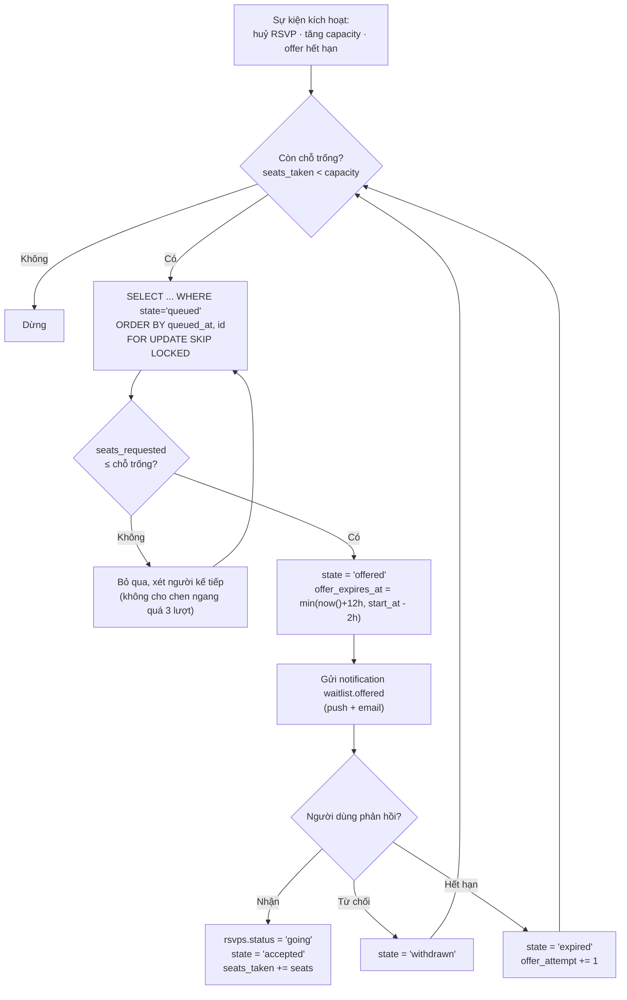

Quy tắc kèm theo:

- Cửa sổ nhận suất: `min(now() + 12 giờ, start_at − 2 giờ)`. Trong 2 giờ cuối trước sự kiện, chuyển sang chế độ **mời hàng loạt** (mời 3 người đầu hàng cùng lúc, ai xác nhận trước được chỗ) vì đợi từng người sẽ để trống chỗ.
- Cắt hàng đợi ở `start_at`: mọi dòng `queued` chuyển `closed` với `resolution_reason = 'occurrence_started'`.
- Khi organizer **giảm** `capacity` xuống dưới `seats_taken`: **không** đá ai ra. Chỗ dôi được thu hồi dần khi có người tự hủy; ghi `capacity_reduced` vào lịch sử và cảnh báo organizer.

---

### 6.3 `checkins` — `Checkin`

| Cột | Kiểu Postgres | Null | Mặc định | Ràng buộc | Ghi chú |
|---|---|---|---|---|---|
| `id` | uuid | NO | — | PK | |
| `occurrence_id` | uuid | NO | — | FK → `event_occurrences(id)` ON DELETE CASCADE | |
| `rsvp_id` | uuid | YES | — | FK → `rsvps(id)` ON DELETE SET NULL | Null khi organizer check-in cho khách vãng lai |
| `user_id` | uuid | YES | — | FK → `users(id)` ON DELETE SET NULL | Null cho khách vãng lai |
| `checked_in_by_user_id` | uuid | NO | — | FK → `users(id)` ON DELETE RESTRICT | Host/cohost quét, hoặc chính chủ nếu `self_geo` |
| `method` | `checkin_method_enum` | NO | `'qr_scan'` | — | |
| `presented_code` | varchar(64) | YES | — | — | Mã QR/short code đã quét — để tra khi tranh chấp |
| `guests_present` | smallint | NO | `0` | CHECK `BETWEEN 0 AND 5` | Thực tế dẫn theo mấy người |
| `location` | geography(Point,4326) | YES | — | — | Vị trí thiết bị lúc quét, **chỉ lưu nếu người dùng đồng ý** |
| `distance_meters` | integer | YES | — | CHECK `distance_meters IS NULL OR distance_meters >= 0` | Khoảng cách tới địa điểm sự kiện |
| `is_valid` | boolean | NO | `true` | — | |
| `invalid_reason` | varchar(40) | YES | — | CHECK `IN ('duplicate','too_far','too_early','too_late','no_rsvp','cancelled_rsvp','revoked')` | |
| `device_id` | varchar(191) | YES | — | — | Chống một máy quét hộ cả nhóm ở xa |
| `created_at` | timestamptz | NO | `now()` | — | Bảng append-only: không `updated_at`, không `deleted_at` |

Index:

| Tên | Loại | Định nghĩa | Vì sao |
|---|---|---|---|
| `uq_checkins_rsvp_valid` | **Partial UNIQUE** | `(rsvp_id) WHERE is_valid AND rsvp_id IS NOT NULL` | Một RSVP chỉ có **một** check-in hợp lệ. Partial vì các lần quét hỏng (`is_valid = false`) vẫn phải lưu lại làm bằng chứng — UNIQUE toàn phần sẽ vứt mất chính những dòng cần cho việc điều tra |
| `idx_checkins_occurrence_time` | Composite | `(occurrence_id, created_at DESC)` | Bảng điều khiển của organizer trong lúc sự kiện đang diễn ra |
| `idx_checkins_user` | Composite | `(user_id, created_at DESC) WHERE user_id IS NOT NULL` | Lịch sử tham dự → tín hiệu `attended_event` (§4.5) |
| `idx_checkins_invalid` | Partial | `(occurrence_id, invalid_reason) WHERE NOT is_valid` | Điều tra lạm dụng |

Quy tắc hợp lệ (kiểm ở service, ghi kết quả vào `is_valid` + `invalid_reason`):

| Điều kiện | Kết quả |
|---|---|
| Quét sớm hơn `start_at − 60 phút` | `too_early` |
| Quét muộn hơn `end_at + 120 phút` | `too_late` |
| `distance_meters > 500` và `method = 'self_geo'` | `too_far` |
| Đã có check-in hợp lệ cho cùng `rsvp_id` | `duplicate` |
| Không có RSVP và organizer không bật "cho phép khách vãng lai" | `no_rsvp` |

Check-in hợp lệ kéo theo: `rsvps.status = 'checked_in'`, `rsvps.checked_in_at`, `event_occurrences.checked_in_count += 1`, và một `trust_signals` loại `attended_event` (+2, trần +20).

---

## 7. Nhóm D — Địa lý

Expat ở Đà Nẵng nói chuyện bằng **tên khu** ("mình ở An Thượng", "ra Mỹ Khê chạy bộ"), không nói bằng bán kính. Nhưng máy tìm kiếm lại làm việc tốt nhất với **tọa độ**. Nhóm D phục vụ cả hai: `areas` cho con người, `geography(Point,4326)` cho máy, và một quy tắc gán tự động nối hai thế giới.

### 7.1 `areas` — `Area`

| Cột | Kiểu Postgres | Null | Mặc định | Ràng buộc | Ghi chú |
|---|---|---|---|---|---|
| `id` | uuid | NO | — | PK | |
| `parent_id` | uuid | YES | — | FK → `areas(id)` ON DELETE RESTRICT | Null chỉ với `level = 'city'` |
| `level` | `area_level_enum` | NO | — | `city` · `district` · `ward` · `micro_area` | Bốn tầng, cố định |
| `depth` | smallint | NO | `0` | CHECK `BETWEEN 0 AND 3` | 0=city, 1=district, 2=ward, 3=micro_area |
| `path` | varchar(255) | NO | — | CHECK `path ~ '^[a-z0-9/-]+$'` | Materialized path: `da-nang/ngu-hanh-son/my-an/an-thuong`. Truy vấn con cháu bằng `path LIKE 'da-nang/son-tra/%'` |
| `code` | varchar(32) | NO | — | UNIQUE | Mã ổn định dùng trong URL/analytics: `DN`, `DN-HC`, `DN-AT` |
| `slug` | citext | NO | — | UNIQUE | `an-thuong` |
| `name_en` | varchar(120) | NO | — | — | `An Thuong` |
| `name_vi` | varchar(120) | NO | — | — | `An Thượng` |
| `aliases` | varchar(80)[] | NO | `'{}'` | — | `{"An Thuong","An Thượng","Western quarter","khu Tây"}` — cách người ta thật sự gõ |
| `boundary` | geography(MultiPolygon,4326) | YES | — | — | Ranh giới. Null với `micro_area` chưa vẽ xong → dùng `center` + `default_radius_meters` |
| `center` | geography(Point,4326) | NO | — | — | Tâm để canh bản đồ và để `ST_Distance` khi không có `boundary` |
| `default_radius_meters` | integer | NO | `1200` | CHECK `BETWEEN 200 AND 20000` | Bán kính suy diễn khi `boundary IS NULL` |
| `bbox_min_lng` / `bbox_min_lat` / `bbox_max_lng` / `bbox_max_lat` | double precision | YES | — | — | Khung nhìn ban đầu của bản đồ, tránh gọi `ST_Envelope` mỗi request |
| `admin_status` | `area_admin_status_enum` | NO | `'official'` | `official` · `legacy` · `colloquial` | **Quan trọng**: `An Thuong` là tên dân gian, không phải đơn vị hành chính. Cột này nói rõ hàng nào là đơn vị hành chính thật, hàng nào là khu vực theo cách gọi của cộng đồng |
| `timezone` | varchar(64) | NO | `'Asia/Ho_Chi_Minh'` | — | Chừa chỗ cho đa thành phố |
| `country_code` | char(2) | NO | `'VN'` | — | |
| `is_mvp` | boolean | NO | `false` | — | Đánh dấu **6 khu vực MVP** đã chốt |
| `is_active` | boolean | NO | `true` | — | Ẩn khỏi bộ lọc mà không xóa |
| `sort_order` | smallint | NO | `100` | — | |
| `event_count` | integer | NO | `0` | CHECK `>= 0` | Sự kiện `published` sắp diễn ra — nuôi chỉ số gate M6 |
| `created_at` / `updated_at` | timestamptz | NO | `now()` | — | Không soft delete |

Index:

| Tên | Loại | Định nghĩa | Vì sao cần |
|---|---|---|---|
| `idx_areas_boundary` | **GIST** | `USING GIST (boundary) WHERE boundary IS NOT NULL` | `ST_Contains(boundary, :point)` để gán `area_id` tự động. Không có GIST thì mỗi lần tạo sự kiện phải so từng đa giác |
| `idx_areas_center` | **GIST** | `USING GIST (center)` | Fallback "khu vực gần nhất" bằng toán tử KNN `center <-> :point` |
| `uq_areas_slug` / `uq_areas_code` | UNIQUE (không partial) | `(slug)` / `(code)` | Bảng **không có** `deleted_at` (dữ liệu tham chiếu, chỉ `is_active`) nên UNIQUE toàn phần là đúng |
| `idx_areas_tree` | Composite | `(parent_id, sort_order) WHERE is_active` | Render cây bộ lọc |
| `idx_areas_path` | B-tree (text_pattern_ops) | `(path text_pattern_ops)` | `path LIKE 'da-nang/son-tra/%'` chỉ dùng được index khi khai báo `text_pattern_ops` (vì collation của DB không phải `C`) |
| `idx_areas_mvp` | Partial | `(sort_order) WHERE is_mvp AND is_active` | Chip lọc trên trang chủ chỉ hiện 6 khu vực |
| `idx_areas_aliases` | **GIN** | `USING GIN (aliases)` | Khớp tên gõ tay: `aliases && ARRAY['an thuong']` |
| `idx_areas_name_trgm` | **GIN (trigram)** | `USING GIN ((name_en \|\| ' ' \|\| name_vi) gin_trgm_ops)` | Gõ sai dấu, sai chính tả vẫn ra kết quả |

#### Seed 6 khu vực MVP (đã chốt)

Cây khu vực v1 chỉ seed Đà Nẵng. Sáu khu vực dưới đây là **toàn bộ** phạm vi MVP — bộ lọc, chỉ tiêu nguồn cung và gate M6 đều nói về đúng sáu khu vực này.

| `code` | `slug` | `name_en` | `name_vi` | `level` | `parent` | `center` (lng, lat) | `admin_status` | Vì sao chọn |
|---|---|---|---|---|---|---|---|---|
| `DN` | `da-nang` | Da Nang | Đà Nẵng | `city` | — | 108.2200, 16.0678 | `official` | Gốc cây |
| `DN-HC` | `hai-chau` | Hai Chau | Hải Châu | `district` | `DN` | 108.2208, 16.0678 | `official` | Trung tâm hành chính, quán cà phê làm việc, sự kiện networking |
| `DN-ST` | `son-tra` | Son Tra | Sơn Trà | `district` | `DN` | 108.2470, 16.0900 | `official` | Ven biển phía bắc, thể thao ngoài trời, bán đảo |
| `DN-NHS` | `ngu-hanh-son` | Ngu Hanh Son | Ngũ Hành Sơn | `district` | `DN` | 108.2500, 16.0100 | `official` | Cụm cư trú expat phía nam |
| `DN-MK` | `my-khe` | My Khe | Mỹ Khê | `micro_area` | `DN-ST` | 108.2470, 16.0620 | `colloquial` | Bãi biển — mốc định vị mà mọi expat đều biết |
| `DN-MA` | `my-an` | My An | Mỹ An | `ward` | `DN-NHS` | 108.2440, 16.0480 | `official` | Mật độ căn hộ cho thuê dài hạn cao |
| `DN-AT` | `an-thuong` | An Thuong | An Thượng | `micro_area` | `DN-MA` | 108.2470, 16.0430 | `colloquial` | "Phố Tây" — mật độ expat cao nhất thành phố |

> **CẦN ĐỐI CHIẾU DỮ LIỆU HÀNH CHÍNH.** Ranh giới `boundary` phải lấy từ nguồn mở (OpenStreetMap / dữ liệu địa giới công bố) rồi rà lại bằng mắt trên bản đồ trước khi seed, và phải đối chiếu với cấu trúc đơn vị hành chính đang có hiệu lực tại thời điểm triển khai. Cột `admin_status` tồn tại chính vì lý do này: khi tên gọi hành chính thay đổi, ta chuyển hàng cũ sang `legacy` và thêm hàng mới, **không sửa đè** — vì `events.area_id` cũ vẫn phải tra được. Toạ độ `center` trong bảng trên là **giá trị khởi tạo gần đúng**, cần chốt lại bằng công cụ bản đồ khi seed thật.

Truy vấn cây thường dùng:

```sql
-- Mọi khu vực con cháu của Sơn Trà (kể cả chính nó)
SELECT id, name_en FROM areas
WHERE path = 'da-nang/son-tra' OR path LIKE 'da-nang/son-tra/%'
ORDER BY depth, sort_order;

-- Khu vực chứa một tọa độ; nếu không đa giác nào chứa thì lấy tâm gần nhất
SELECT id FROM areas
WHERE boundary IS NOT NULL AND ST_Contains(boundary::geometry, ST_SetSRID(ST_MakePoint($1,$2),4326))
ORDER BY depth DESC        -- ưu tiên khu vực chi tiết nhất
LIMIT 1;
```

### 7.2 Cột địa lý trên `events` và `venues`

| Cột | Bảng | Vai trò | Ai được đọc |
|---|---|---|---|
| `location` | `events`, `event_occurrences`, `venues` | Tọa độ **thật**, dùng cho mọi phép tính khoảng cách phía server | Chỉ backend; host và cohost; người đã `going` khi `location_precision <> 'hidden_until_rsvp'` |
| `location_public` | `events` | Tọa độ **đã làm mờ**, là thứ duy nhất API công khai trả về | Mọi người |
| `area_id` | `events`, `event_occurrences`, `venues` | Nhãn khu vực để lọc và để nhóm báo cáo | Mọi người |
| `address_line` | `events`, `venues` | Địa chỉ chữ | Theo `location_precision` |
| `address_note` | `events` | Chỉ dẫn chi tiết ("gọi chuông căn 305") | Chỉ người đã `going` |

Quy tắc làm mờ theo `location_precision`:

| Giá trị | `location_public` được tính thế nào | Hiển thị |
|---|---|---|
| `exact` | Bằng đúng `location` | Ghim chính xác + địa chỉ đầy đủ |
| `approximate` | Dịch ngẫu nhiên **cố định theo `event_id`** trong bán kính 150–300 m (dùng hash của id làm seed, để lần nào cũng ra cùng một điểm — nhấp nháy vị trí trông như lỗi) | Vòng tròn mờ + tên khu vực |
| `hidden_until_rsvp` | Bằng `areas.center` của `area_id` | Chỉ tên khu vực; địa chỉ mở sau khi RSVP được duyệt |

Quy tắc gán `area_id` (chạy trong `BEFORE INSERT OR UPDATE` của service, không phải trigger DB, vì cần log lại quyết định):

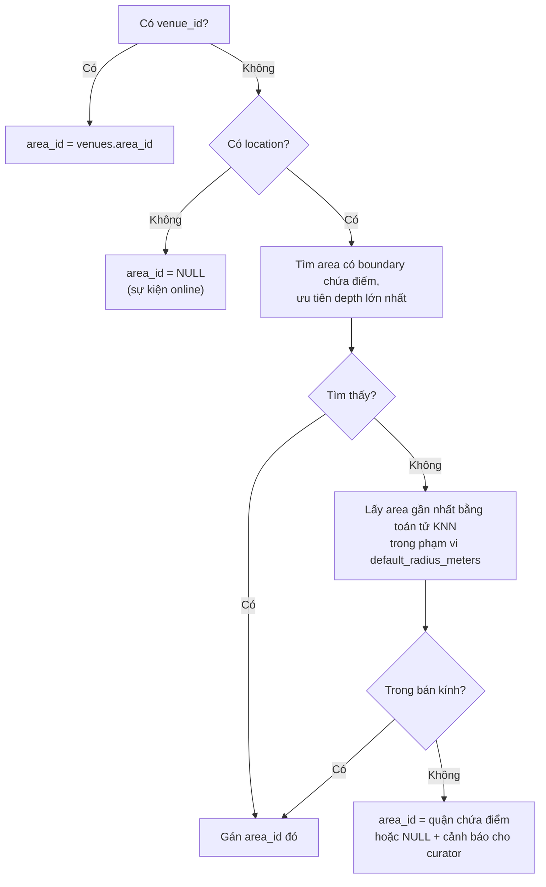

### 7.3 Quy tắc dùng PostGIS trong dự án này

| Việc | Cách đúng | Cách sai thường gặp |
|---|---|---|
| Lọc theo bán kính | `ST_DWithin(location, :point::geography, 1500)` | `ST_Distance(...) <= 1500` — **hủy index**, buộc quét tuần tự |
| Sắp theo khoảng cách | `ORDER BY location <-> :point` (KNN, dùng được GIST với `geography`) | `ORDER BY ST_Distance(...)` khi tập kết quả lớn |
| Lấy khoảng cách để hiển thị | `ST_Distance(location, :point)` trong `SELECT` (không phải `WHERE`) | Tính ở tầng ứng dụng bằng Haversine rồi lệch với bộ lọc |
| Kiểm tra điểm trong vùng | `ST_Contains(boundary::geometry, point::geometry)` | `ST_Contains` trực tiếp trên `geography` — hàm này không nhận `geography` |
| Đơn vị | Luôn **mét** vì dùng `geography` | Trộn với `geometry(4326)` rồi tưởng đơn vị là mét (thực ra là **độ**) |
| Thứ tự tọa độ | `ST_MakePoint(lng, lat)` — kinh độ trước | `ST_MakePoint(lat, lng)` → sự kiện rơi xuống Ấn Độ Dương |

Kiểm tra nhanh sau khi seed:

```sql
-- Mọi sự kiện phải nằm trong hộp bao Đà Nẵng, nếu không là lỗi đảo lat/lng
SELECT count(*) AS suspicious
FROM events
WHERE location IS NOT NULL
  AND NOT ST_DWithin(location, ST_SetSRID(ST_MakePoint(108.2200,16.0678),4326)::geography, 40000);
-- Kỳ vọng: 0
```

---

## 8. Nhóm E — Tương tác

Nhóm này là nơi cộng đồng thực sự "sống", và cũng là nơi rủi ro an toàn cao nhất. Nguyên tắc xuyên suốt: **mọi bảng ở đây đều có đường ẩn nội dung mà không xóa**, và mọi bảng đều là mục tiêu hợp lệ của `reports` (§9.1).

### 8.0 Enum của nhóm E

| Tên enum | Giá trị |
|---|---|
| `content_status_enum` | `visible` · `pending_review` · `hidden` · `removed` |
| `conversation_type_enum` | `direct` · `event_group` |
| `conversation_request_status_enum` | `pending` · `accepted` · `declined` · `blocked` |
| `message_type_enum` | `text` · `image` · `event_share` · `system` |
| `follow_target_enum` | `user` · `event` · `venue` · `category` · `area` |
| `review_target_enum` | `event` · `user` · `venue` |
| `review_status_enum` | `pending` · `published` · `hidden` · `removed` |

---

### 8.1 `comments` — `Comment`

Bình luận gắn vào **sự kiện** (hỏi đáp trước buổi diễn ra), tùy chọn gắn thêm vào một occurrence cụ thể. Dùng FK thật chứ **không** polymorphic — theo nguyên tắc §1.2.

| Cột | Kiểu Postgres | Null | Mặc định | Ràng buộc | Ghi chú |
|---|---|---|---|---|---|
| `id` | uuid | NO | — | PK | |
| `event_id` | uuid | NO | — | FK → `events(id)` ON DELETE CASCADE | |
| `occurrence_id` | uuid | YES | — | FK → `event_occurrences(id)` ON DELETE CASCADE | "Buổi tuần này có đổi giờ không?" |
| `parent_id` | uuid | YES | — | FK → `comments(id)` ON DELETE CASCADE | |
| `depth` | smallint | NO | `0` | CHECK `BETWEEN 0 AND 1` | Chỉ 2 tầng. Trả lời của trả lời gắn phẳng vào tầng 1 — chuỗi lồng sâu không đọc nổi trên mobile |
| `user_id` | uuid | NO | — | FK → `users(id)` ON DELETE CASCADE | |
| `body` | text | NO | — | CHECK `length(btrim(body)) BETWEEN 1 AND 2000` | |
| `body_locale` | varchar(5) | YES | — | — | Để gợi ý dịch |
| `mentioned_user_ids` | uuid[] | NO | `'{}'` | CHECK `array_length(mentioned_user_ids,1) IS NULL OR array_length(mentioned_user_ids,1) <= 10` | Chống spam nhắc tên |
| `status` | `content_status_enum` | NO | `'visible'` | — | |
| `moderation_state` | `moderation_state_enum` | NO | `'clean'` | — | |
| `is_pinned` | boolean | NO | `false` | — | Host ghim thông báo quan trọng |
| `is_edited` | boolean | NO | `false` | — | |
| `edited_at` | timestamptz | YES | — | — | |
| `like_count` / `reply_count` | integer | NO | `0` | CHECK `>= 0` | |
| `report_count` | integer | NO | `0` | CHECK `>= 0` | Đạt ngưỡng 3 → tự chuyển `moderation_state = 'flagged'` |
| `created_at` / `updated_at` / `deleted_at` | timestamptz | | `now()` / `now()` / — | | |

Index:

| Tên | Loại | Định nghĩa | Vì sao |
|---|---|---|---|
| `idx_comments_event_thread` | **Composite** (partial) | `(event_id, is_pinned DESC, created_at DESC) WHERE parent_id IS NULL AND status = 'visible' AND deleted_at IS NULL` | Danh sách bình luận gốc, ghim lên đầu; partial loại hẳn nội dung đã ẩn khỏi index nóng |
| `idx_comments_replies` | Composite | `(parent_id, created_at) WHERE deleted_at IS NULL` | Bung nhánh trả lời |
| `idx_comments_user` | Composite | `(user_id, created_at DESC)` | Điều tra một tài khoản spam |
| `idx_comments_moderation` | Partial | `(moderation_state, created_at) WHERE moderation_state IN ('flagged','under_review')` | Hàng đợi kiểm duyệt |

---

### 8.2 `conversations` — `Conversation`

| Cột | Kiểu Postgres | Null | Mặc định | Ràng buộc | Ghi chú |
|---|---|---|---|---|---|
| `id` | uuid | NO | — | PK | |
| `type` | `conversation_type_enum` | NO | `'direct'` | — | |
| `user_a_id` | uuid | YES | — | FK → `users(id)` ON DELETE CASCADE | Chỉ dùng cho `direct` |
| `user_b_id` | uuid | YES | — | FK → `users(id)` ON DELETE CASCADE | CHECK `user_a_id < user_b_id` — **chuẩn hóa thứ tự** để cặp (A,B) và (B,A) là cùng một hàng |
| `event_id` | uuid | YES | — | FK → `events(id)` ON DELETE CASCADE | Chỉ dùng cho `event_group` |
| `occurrence_id` | uuid | YES | — | FK → `event_occurrences(id)` ON DELETE CASCADE | Nhóm chat theo buổi |
| `created_by_user_id` | uuid | NO | — | FK → `users(id)` ON DELETE RESTRICT | |
| `request_status` | `conversation_request_status_enum` | NO | `'pending'` | — | **Người lạ phải xin phép trước.** Chưa `accepted` thì chỉ gửi được 1 tin mở đầu |
| `request_message_quota` | smallint | NO | `1` | CHECK `BETWEEN 0 AND 3` | Số tin được gửi trước khi đối phương chấp nhận |
| `min_trust_level_to_join` | smallint | NO | `0` | CHECK `BETWEEN 0 AND 5` | Host đặt sàn tin cậy cho nhóm chat sự kiện |
| `status` | varchar(20) | NO | `'active'` | CHECK `IN ('active','archived','closed')` | `closed` khi kiểm duyệt đóng băng |
| `last_message_at` | timestamptz | YES | — | — | Cột sắp xếp của danh sách hội thoại |
| `last_message_preview` | varchar(140) | YES | — | — | Cắt sẵn để danh sách không phải join `messages` |
| `message_count` | integer | NO | `0` | CHECK `>= 0` | |
| `moderation_state` | `moderation_state_enum` | NO | `'clean'` | — | |
| `created_at` / `updated_at` / `deleted_at` | timestamptz | | `now()` / `now()` / — | | |

Ràng buộc CHECK cấp bảng:

| Tên | Biểu thức | Vì sao |
|---|---|---|
| `ck_conversations_shape` | `(type = 'direct' AND user_a_id IS NOT NULL AND user_b_id IS NOT NULL AND event_id IS NULL) OR (type = 'event_group' AND event_id IS NOT NULL AND user_a_id IS NULL)` | Một bảng, hai hình dạng — CHECK giữ cho chúng không lẫn vào nhau |
| `ck_conversations_pair_order` | `user_a_id IS NULL OR user_a_id < user_b_id` | Điều kiện để partial UNIQUE bên dưới thật sự chống trùng |

Index:

| Tên | Loại | Định nghĩa | Vì sao |
|---|---|---|---|
| `uq_conversations_direct_pair` | **Partial UNIQUE** | `(user_a_id, user_b_id) WHERE type = 'direct' AND deleted_at IS NULL` | Hai người chỉ có một hộp thoại 1-1. Partial hai lần: loại `event_group` (hai cột đó NULL) và loại hàng đã xóa mềm — nếu không, sau khi một hội thoại bị gỡ theo lệnh kiểm duyệt, hai người sẽ **không bao giờ** nhắn lại được cho nhau |
| `uq_conversations_occurrence` | Partial UNIQUE | `(occurrence_id) WHERE type = 'event_group' AND occurrence_id IS NOT NULL AND deleted_at IS NULL` | Mỗi buổi một nhóm chat |
| `idx_conversations_recent` | Composite | `(last_message_at DESC) WHERE status = 'active' AND deleted_at IS NULL` | Kết hợp với `conversation_participants` để dựng danh sách hộp thư |
| `idx_conversations_requests` | Partial | `(user_b_id, created_at DESC) WHERE request_status = 'pending'` | Badge "3 lời mời trò chuyện" |

Bảng nối `conversation_participants`:

| Cột | Kiểu | Ràng buộc | Ghi chú |
|---|---|---|---|
| `conversation_id` | uuid | PK phần 1, FK CASCADE | |
| `user_id` | uuid | PK phần 2, FK CASCADE | |
| `role` | varchar(20) | CHECK `IN ('owner','member')` | `owner` = host của sự kiện |
| `joined_at` | timestamptz | NOT NULL default `now()` | |
| `last_read_message_id` | uuid | FK → `messages(id)` ON DELETE SET NULL | |
| `last_read_at` | timestamptz | | |
| `unread_count` | integer | NOT NULL default `0`, CHECK `>= 0` | |
| `muted_until` | timestamptz | | |
| `left_at` | timestamptz | | Rời nhóm nhưng giữ lịch sử |

```sql
CREATE INDEX idx_conv_participants_inbox
  ON conversation_participants (user_id, conversation_id) WHERE left_at IS NULL;
CREATE INDEX idx_conv_participants_unread
  ON conversation_participants (user_id) WHERE unread_count > 0 AND left_at IS NULL;
```

---

### 8.3 `messages` — `Message`

| Cột | Kiểu Postgres | Null | Mặc định | Ràng buộc | Ghi chú |
|---|---|---|---|---|---|
| `id` | uuid | NO | — | PK | UUIDv7 → **thứ tự id trùng thứ tự thời gian**, phân trang chỉ cần so `id` |
| `conversation_id` | uuid | NO | — | FK → `conversations(id)` ON DELETE CASCADE | |
| `sender_user_id` | uuid | YES | — | FK → `users(id)` ON DELETE SET NULL | Null với `type = 'system'` |
| `type` | `message_type_enum` | NO | `'text'` | — | |
| `body` | text | YES | — | CHECK `body IS NULL OR length(body) <= 4000` | |
| `body_locale` | varchar(5) | YES | — | — | |
| `media_id` | uuid | YES | — | FK → `media(id)` ON DELETE SET NULL | |
| `shared_event_id` | uuid | YES | — | FK → `events(id)` ON DELETE SET NULL | Thẻ chia sẻ sự kiện trong chat |
| `reply_to_message_id` | uuid | YES | — | FK → `messages(id)` ON DELETE SET NULL | |
| `client_message_id` | uuid | YES | — | Partial UNIQUE | **Khóa idempotency**: mobile mất sóng gửi lại không tạo tin trùng |
| `status` | `content_status_enum` | NO | `'visible'` | — | |
| `moderation_state` | `moderation_state_enum` | NO | `'clean'` | — | |
| `is_flagged_by_filter` | boolean | NO | `false` | — | Bộ lọc tự động (từ khóa lừa đảo, số tài khoản) |
| `edited_at` | timestamptz | YES | — | — | |
| `created_at` | timestamptz | NO | `now()` | — | |
| `deleted_at` | timestamptz | YES | — | — | Xóa phía người gửi = soft delete |

Index:

| Tên | Loại | Định nghĩa | Vì sao |
|---|---|---|---|
| `idx_messages_thread` | **Composite** | `(conversation_id, id DESC)` | Cuộn hội thoại. Dùng `id` thay `created_at` được vì UUIDv7 sắp theo thời gian — tiết kiệm một cột trong index và không có thế hòa |
| `uq_messages_idempotency` | **Partial UNIQUE** | `(conversation_id, sender_user_id, client_message_id) WHERE client_message_id IS NOT NULL` | Partial vì tin nhắn hệ thống không có `client_message_id`; UNIQUE toàn phần sẽ báo lỗi trùng trên hàng loạt giá trị NULL ở một số cấu hình |
| `idx_messages_flagged` | Partial | `(created_at) WHERE is_flagged_by_filter AND moderation_state = 'clean'` | Hàng đợi soát tin nhắn bị bộ lọc gắn cờ mà chưa ai xem |

**Không** đánh index toàn văn trên `messages`. Tin nhắn riêng tư không được đưa vào bất kỳ chỉ mục tìm kiếm chung nào — đây là quyết định về quyền riêng tư, không phải về hiệu năng.

---

### 8.4 `follows` — `Follow`

Một trong **năm** bảng được phép polymorphic (§1.2), vì tập đối tượng theo dõi thực sự mở.

| Cột | Kiểu Postgres | Null | Mặc định | Ràng buộc | Ghi chú |
|---|---|---|---|---|---|
| `id` | uuid | NO | — | PK | |
| `follower_user_id` | uuid | NO | — | FK → `users(id)` ON DELETE CASCADE | |
| `target_type` | `follow_target_enum` | NO | — | — | |
| `target_id` | uuid | NO | — | Không có FK (đa đích) | Toàn vẹn do service + job đối soát |
| `notify` | boolean | NO | `true` | — | Theo dõi im lặng vẫn có ích cho gợi ý |
| `created_at` | timestamptz | NO | `now()` | — | Không soft delete: bỏ theo dõi thì **xóa thật** (dữ liệu không có giá trị lịch sử) |

| Tên index | Loại | Định nghĩa | Vì sao |
|---|---|---|---|
| `uq_follows_edge` | UNIQUE (không partial) | `(follower_user_id, target_type, target_id)` | Bảng không có `deleted_at` → hard delete khi bỏ theo dõi → UNIQUE toàn phần là đúng và rẻ nhất |
| `idx_follows_target` | **Composite** | `(target_type, target_id) WHERE notify` | "Ai cần được báo khi sự kiện này cập nhật" — thứ tự cột đặt `target_type` trước để index dùng chung cho mọi loại đích |
| `idx_follows_follower` | Composite | `(follower_user_id, target_type, created_at DESC)` | Màn "Đang theo dõi" chia tab |

CHECK `ck_follows_no_self`: `NOT (target_type = 'user' AND target_id = follower_user_id)`.

---

### 8.5 `reviews` — `Review`

| Cột | Kiểu Postgres | Null | Mặc định | Ràng buộc | Ghi chú |
|---|---|---|---|---|---|
| `id` | uuid | NO | — | PK | |
| `author_user_id` | uuid | NO | — | FK → `users(id)` ON DELETE CASCADE | |
| `target_type` | `review_target_enum` | NO | — | — | |
| `target_id` | uuid | NO | — | Không có FK (đa đích) | |
| `occurrence_id` | uuid | YES | — | FK → `event_occurrences(id)` ON DELETE SET NULL | **Bằng chứng ngữ cảnh**: đánh giá này đến từ buổi nào |
| `rating` | smallint | NO | — | CHECK `BETWEEN 1 AND 5` | |
| `sub_ratings` | jsonb | YES | — | — | `{"organization":5,"friendliness":4,"as_described":5}` — không lọc theo nên jsonb hợp lý |
| `body` | text | YES | — | CHECK `body IS NULL OR length(btrim(body)) BETWEEN 10 AND 2000` | Bình luận rỗng thì thà không có |
| `body_locale` | varchar(5) | YES | — | — | |
| `is_verified_attendance` | boolean | NO | `false` | — | `true` khi có `checkins` hợp lệ — UI hiện nhãn "đã tham dự" |
| `status` | `review_status_enum` | NO | `'pending'` | — | Giữ `pending` 2 giờ để cả hai bên cùng đánh giá xong mới publish (chống trả đũa) |
| `published_at` | timestamptz | YES | — | — | |
| `moderation_state` | `moderation_state_enum` | NO | `'clean'` | — | |
| `helpful_count` | integer | NO | `0` | CHECK `>= 0` | |
| `report_count` | integer | NO | `0` | CHECK `>= 0` | |
| `response_body` | varchar(1000) | YES | — | — | Quyền phản hồi của bên bị đánh giá |
| `response_at` | timestamptz | YES | — | — | |
| `created_at` / `updated_at` / `deleted_at` | timestamptz | | `now()` / `now()` / — | | |

Index:

| Tên | Loại | Định nghĩa | Vì sao |
|---|---|---|---|
| `uq_reviews_one_per_context` | **Partial UNIQUE** | `(author_user_id, target_type, target_id, occurrence_id) WHERE deleted_at IS NULL` | Một người đánh giá một đối tượng **một lần cho mỗi buổi**. Partial vì khi review bị gỡ theo khiếu nại hợp lệ, tác giả phải được viết lại |
| `idx_reviews_target_feed` | **Composite** (partial) | `(target_type, target_id, created_at DESC) WHERE status = 'published' AND deleted_at IS NULL` | Danh sách đánh giá trên trang hồ sơ/sự kiện; thứ tự cột: hai vế bằng rồi tới vế sắp xếp |
| `idx_reviews_author` | Composite | `(author_user_id, created_at DESC)` | |
| `idx_reviews_pending_publish` | Partial | `(created_at) WHERE status = 'pending'` | Job publish sau cửa sổ 2 giờ |
| `idx_reviews_moderation` | Partial | `(moderation_state, created_at) WHERE moderation_state IN ('flagged','under_review')` | |

Quy tắc nghiệp vụ (kiểm ở service, không biểu diễn được bằng CHECK vì phải đọc bảng khác):

1. Chỉ tạo được review nếu tồn tại `rsvps` với `status = 'checked_in'` cho `occurrence_id` đó — trừ khi `target_type = 'venue'`.
2. `author_user_id` không được bằng `target_id` khi `target_type = 'user'`.
3. Cửa sổ đánh giá: mở từ `end_at`, đóng sau **14 ngày**.
4. Review chỉ tính vào `profiles.rating_avg` khi `status = 'published'`; và `rating_avg` chỉ hiện khi `rating_count >= 3` (§4.4).
5. Review ≥ 4 sao đã publish sinh `trust_signals.positive_review` (+3, trần +24).

---

## 9. Nhóm F — An toàn & kiểm duyệt

Brief đặt "cảm giác an toàn khi gặp người lạ" làm giá trị cốt lõi, nên nhóm này không phải phần phụ trợ mà là một trong hai trục chính của sản phẩm (trục kia là nguồn cung sự kiện). Ba yêu cầu định hình thiết kế:

1. **Báo cáo phải có SLA đo được** — mức `critical` phản hồi trong **2 giờ** (đã chốt).
2. **Mọi hành động kiểm duyệt phải chụp lại bằng chứng** — vì nội dung có thể bị sửa hoặc xóa ngay sau đó.
3. **Người bị xử lý phải có đường khiếu nại** — `appeals`, với người duyệt khác người ra quyết định.

### 9.0 Enum của nhóm F

| Tên enum | Giá trị |
|---|---|
| `report_target_enum` | `user` · `profile` · `event` · `occurrence` · `comment` · `review` · `message` · `venue` |
| `report_reason_enum` | `spam` · `harassment` · `hate_speech` · `sexual_content` · `violence_threat` · `scam_fraud` · `impersonation` · `personal_info` · `unsafe_meetup` · `illegal_activity` · `misinformation` · `off_topic` · `other` |
| `report_severity_enum` | `low` · `medium` · `high` · `critical` |
| `report_status_enum` | `new` · `triaged` · `in_review` · `action_taken` · `dismissed` · `escalated` · `withdrawn` |
| `moderation_action_enum` | `no_action` · `warn` · `hide_content` · `remove_content` · `restrict_features` · `suspend_account` · `ban_account` · `require_id_verification` · `restore_content` · `unsuspend` |
| `appeal_status_enum` | `submitted` · `in_review` · `upheld` · `overturned` · `partially_overturned` · `withdrawn` · `expired` |
| `block_scope_enum` | `all` · `messages_only` |

---

### 9.1 `reports` — `Report`

| Cột | Kiểu Postgres | Null | Mặc định | Ràng buộc | Ghi chú |
|---|---|---|---|---|---|
| `id` | uuid | NO | — | PK | |
| `reporter_user_id` | uuid | YES | — | FK → `users(id)` ON DELETE SET NULL | Null khi nguồn là bộ lọc tự động; SET NULL để báo cáo sống sót sau khi người báo cáo xóa tài khoản |
| `target_type` | `report_target_enum` | NO | — | — | Polymorphic có chủ đích |
| `target_id` | uuid | NO | — | Không có FK | |
| `target_owner_user_id` | uuid | YES | — | FK → `users(id)` ON DELETE SET NULL | Phi chuẩn hóa: chủ sở hữu nội dung bị báo cáo. Không có cột này thì không đếm nổi "tài khoản này đã bị báo cáo bao nhiêu lần" |
| `reason_code` | `report_reason_enum` | NO | — | — | |
| `severity` | `report_severity_enum` | NO | `'medium'` | — | Sinh tự động từ `reason_code`, moderator được sửa |
| `description` | varchar(1000) | YES | — | — | Lời kể của người báo cáo |
| `evidence_media_ids` | uuid[] | NO | `'{}'` | CHECK `array_length(evidence_media_ids,1) IS NULL OR array_length(evidence_media_ids,1) <= 5` | Ảnh chụp màn hình |
| `content_snapshot` | jsonb | YES | — | — | **Bản chụp nội dung tại thời điểm báo cáo** — nội dung gốc có thể bị sửa/xóa ngay sau đó |
| `status` | `report_status_enum` | NO | `'new'` | — | |
| `priority` | smallint | NO | `50` | CHECK `BETWEEN 0 AND 100` | Số lớn = gấp hơn; tính từ `severity` + trust level người bị báo cáo + số báo cáo trùng |
| `sla_due_at` | timestamptz | NO | — | — | Sinh lúc INSERT theo bảng SLA bên dưới |
| `first_response_at` | timestamptz | YES | — | — | Mốc đo SLA thật sự (khi moderator mở hồ sơ) |
| `assigned_to_user_id` | uuid | YES | — | FK → `users(id)` ON DELETE SET NULL | Phải có `users.role IN ('moderator','admin','super_admin')` — kiểm ở service |
| `assigned_at` | timestamptz | YES | — | — | |
| `resolved_at` | timestamptz | YES | — | — | |
| `resolution_note` | varchar(1000) | YES | — | — | Nội bộ |
| `reporter_feedback_sent_at` | timestamptz | YES | — | — | Đã báo lại cho người gửi chưa (rất quan trọng để người dùng còn tiếp tục báo cáo) |
| `duplicate_of_report_id` | uuid | YES | — | FK → `reports(id)` ON DELETE SET NULL | Gộp báo cáo trùng |
| `source` | varchar(20) | NO | `'user'` | CHECK `IN ('user','automated_filter','staff','partner')` | |
| `reporter_ip` | inet | YES | — | — | Purge sau 90 ngày (§16) |
| `created_at` / `updated_at` | timestamptz | NO | `now()` | — | **Không** soft delete — hồ sơ an toàn là bằng chứng |

Bảng SLA (mức `critical` = **2 giờ** là con số đã chốt; các mức còn lại là đề xuất vận hành):

| `severity` | Lý do điển hình | `sla_due_at` = `created_at` + | Kênh báo động |
|---|---|---|---|
| `critical` | `violence_threat`, `unsafe_meetup`, `illegal_activity`, an toàn thân thể | **2 giờ** | Push cho moderator trực + tin nhắn nhóm vận hành |
| `high` | `harassment`, `scam_fraud`, `sexual_content`, `impersonation` | 12 giờ | Push |
| `medium` | `hate_speech` mức thấp, `personal_info`, `misinformation` | 48 giờ | Hàng đợi |
| `low` | `spam`, `off_topic`, `other` | 7 ngày | Hàng đợi |

Index:

| Tên | Loại | Định nghĩa | Vì sao cần |
|---|---|---|---|
| `idx_reports_queue` | **Composite** (partial) | `(status, priority DESC, created_at) WHERE status IN ('new','triaged','in_review')` | Hàng đợi làm việc — thứ tự cột **bằng → sắp xếp → phá hòa**. Partial giữ index chỉ chứa hồ sơ đang mở (vài trăm hàng) kể cả khi bảng tích lũy hàng triệu |
| `idx_reports_sla_breach` | **Partial** | `(sla_due_at) WHERE status IN ('new','triaged','in_review')` | Job mỗi 5 phút quét "sắp trễ SLA"; với mức `critical` 2 giờ, một lần Seq Scan là đủ để trễ hạn |
| `idx_reports_target` | **Composite** | `(target_type, target_id, created_at DESC)` | "Nội dung này đã bị báo cáo mấy lần" — hiện ngay khi moderator mở hồ sơ |
| `idx_reports_target_owner` | Composite (partial) | `(target_owner_user_id, created_at DESC) WHERE target_owner_user_id IS NOT NULL` | Hồ sơ rủi ro của một tài khoản |
| `uq_reports_no_duplicate_open` | **Partial UNIQUE** | `(reporter_user_id, target_type, target_id) WHERE status IN ('new','triaged','in_review') AND reporter_user_id IS NOT NULL` | Một người không báo cáo cùng một nội dung hai lần khi hồ sơ còn mở. Không thể UNIQUE toàn phần: sau khi hồ sơ đóng, nếu người đó **tái phạm** thì phải báo cáo lại được |
| `idx_reports_assignee` | Partial | `(assigned_to_user_id, sla_due_at) WHERE resolved_at IS NULL` | Bảng công việc cá nhân của moderator |

---

### 9.2 `moderation_actions` — `ModerationAction`

Bảng thứ năm được phép dùng cặp `target_type` + `target_id` (mở rộng danh sách ở §1.2), vì nó phải trỏ tới **đúng tập đối tượng** mà `reports` trỏ tới.

| Cột | Kiểu Postgres | Null | Mặc định | Ràng buộc | Ghi chú |
|---|---|---|---|---|---|
| `id` | uuid | NO | — | PK | |
| `report_id` | uuid | YES | — | FK → `reports(id)` ON DELETE SET NULL | Null khi moderator chủ động xử lý, không từ báo cáo |
| `actor_user_id` | uuid | NO | — | FK → `users(id)` ON DELETE RESTRICT | Ai ra quyết định — **RESTRICT** để không bao giờ mất dấu trách nhiệm |
| `actor_role_at_time` | varchar(20) | NO | — | — | Chụp lại `users.role` tại thời điểm hành động; role có thể đổi về sau |
| `target_type` | `report_target_enum` | NO | — | — | |
| `target_id` | uuid | NO | — | Không có FK | |
| `target_owner_user_id` | uuid | YES | — | FK → `users(id)` ON DELETE SET NULL | |
| `action` | `moderation_action_enum` | NO | — | — | |
| `reason_code` | `report_reason_enum` | YES | — | — | |
| `internal_note` | varchar(1000) | YES | — | — | Chỉ staff đọc |
| `public_note` | varchar(500) | YES | — | — | Văn bản gửi cho người bị xử lý — bắt buộc với `warn` trở lên |
| `policy_version` | varchar(20) | NO | — | — | Ví dụ `cg-2026.03` — để khi khiếu nại còn biết đã áp quy tắc bản nào |
| `evidence_snapshot` | jsonb | YES | — | — | Bản chụp nội dung + ngữ cảnh tại thời điểm xử lý |
| `duration_hours` | integer | YES | — | CHECK `duration_hours IS NULL OR duration_hours > 0` | Null = vĩnh viễn |
| `effective_from` | timestamptz | NO | `now()` | — | |
| `expires_at` | timestamptz | YES | — | CHECK `expires_at IS NULL OR expires_at > effective_from` | |
| `is_appealable` | boolean | NO | `true` | — | |
| `appeal_deadline_at` | timestamptz | YES | — | — | Mặc định `effective_from + 30 ngày` |
| `reversed_at` | timestamptz | YES | — | — | Bị lật do khiếu nại thắng hoặc do sai sót |
| `reversed_by_user_id` | uuid | YES | — | FK → `users(id)` ON DELETE SET NULL | |
| `reversal_reason` | varchar(500) | YES | — | — | |
| `created_at` | timestamptz | NO | `now()` | — | **Append-only**, không sửa, không xóa |

Index:

| Tên | Loại | Định nghĩa | Vì sao |
|---|---|---|---|
| `idx_mod_actions_target` | **Composite** | `(target_type, target_id, created_at DESC)` | Lịch sử xử lý của một nội dung |
| `idx_mod_actions_owner` | Composite (partial) | `(target_owner_user_id, created_at DESC) WHERE target_owner_user_id IS NOT NULL` | Tiền sử của một tài khoản — đầu vào cho thang xử phạt lũy tiến |
| `idx_mod_actions_expiring` | **Partial** | `(expires_at) WHERE expires_at IS NOT NULL AND reversed_at IS NULL` | Job `moderation:expire` gỡ đình chỉ đúng giờ; quét cả bảng thì hình phạt sẽ kéo dài hơn tuyên bố |
| `idx_mod_actions_actor` | Composite | `(actor_user_id, created_at DESC)` | Đối soát chất lượng của từng moderator |
| `idx_mod_actions_report` | B-tree (partial) | `(report_id) WHERE report_id IS NOT NULL` | |

Thang xử phạt lũy tiến (tham chiếu, chi tiết ở tài liệu #05):

| Lần vi phạm | Hành động mặc định | Ảnh hưởng trust |
|---|---|---|
| 1 (nhẹ) | `warn` + ẩn nội dung | Không |
| 2 | `restrict_features` 7 ngày (không tạo sự kiện, không nhắn tin cho người lạ) | `penalty_report_upheld` −20 |
| 3 | `suspend_account` 30 ngày | −20, rớt bậc trust |
| Nghiêm trọng ngay lần đầu (đe dọa, lừa đảo, nội dung tình dục với trẻ vị thành niên) | `ban_account` vĩnh viễn + `legal_hold_until` | Khóa hồ sơ, chặn ẩn danh |

---

### 9.3 `blocks` — `Block`

| Cột | Kiểu Postgres | Null | Mặc định | Ràng buộc | Ghi chú |
|---|---|---|---|---|---|
| `id` | uuid | NO | — | PK | |
| `blocker_user_id` | uuid | NO | — | FK → `users(id)` ON DELETE CASCADE | |
| `blocked_user_id` | uuid | NO | — | FK → `users(id)` ON DELETE CASCADE | |
| `scope` | `block_scope_enum` | NO | `'all'` | — | `messages_only` cho trường hợp "không muốn nhắn tin nhưng vẫn đi chung sự kiện" |
| `reason_code` | `report_reason_enum` | YES | — | — | Tùy chọn; nếu có thì gợi ý tạo `reports` |
| `expires_at` | timestamptz | YES | — | — | Null = vĩnh viễn |
| `created_at` | timestamptz | NO | `now()` | — | Hard delete khi bỏ chặn |

CHECK `ck_blocks_no_self`: `blocker_user_id <> blocked_user_id`.

| Tên index | Loại | Định nghĩa | Vì sao |
|---|---|---|---|
| `uq_blocks_pair` | UNIQUE (không partial) | `(blocker_user_id, blocked_user_id)` | Bảng không có `deleted_at`; bỏ chặn là xóa thật |
| `idx_blocks_reverse` | B-tree | `(blocked_user_id)` | Chặn phải có hiệu lực **hai chiều** trong hiển thị: mỗi lần render danh sách người tham gia đều phải hỏi cả hai chiều, nên chiều ngược cũng cần index riêng |

Hệ quả của một block (thi hành ở tầng service, không ở DB):

| Nơi | Hành vi |
|---|---|
| Danh sách người tham gia | Ẩn nhau hai chiều |
| Bình luận, đánh giá | Ẩn nhau hai chiều |
| Tin nhắn | Không tạo được hội thoại mới; hội thoại cũ chuyển `request_status = 'blocked'` |
| RSVP | **Vẫn cho phép** cả hai cùng đăng ký một buổi — nhưng nếu `blocker` là host thì RSVP của `blocked` bị từ chối |
| Thông báo | Không nhận thông báo do phía kia sinh ra |

Chặn **không** phải công cụ kiểm duyệt: nó không ẩn nội dung với người thứ ba và không sinh `moderation_actions`.

---

### 9.4 `appeals` — `Appeal`

| Cột | Kiểu Postgres | Null | Mặc định | Ràng buộc | Ghi chú |
|---|---|---|---|---|---|
| `id` | uuid | NO | — | PK | |
| `moderation_action_id` | uuid | NO | — | FK → `moderation_actions(id)` ON DELETE RESTRICT | |
| `appellant_user_id` | uuid | NO | — | FK → `users(id)` ON DELETE CASCADE | |
| `status` | `appeal_status_enum` | NO | `'submitted'` | — | |
| `body` | varchar(2000) | NO | — | CHECK `length(btrim(body)) >= 20` | Buộc trình bày tối thiểu |
| `evidence_media_ids` | uuid[] | NO | `'{}'` | CHECK `array_length(evidence_media_ids,1) IS NULL OR array_length(evidence_media_ids,1) <= 5` | |
| `sla_due_at` | timestamptz | NO | — | — | `created_at + 7 ngày` |
| `reviewed_by_user_id` | uuid | YES | — | FK → `users(id)` ON DELETE SET NULL | **Bắt buộc khác `moderation_actions.actor_user_id`** — kiểm bằng trigger |
| `reviewed_at` | timestamptz | YES | — | — | |
| `decision_note` | varchar(1000) | YES | — | — | Gửi cho người khiếu nại |
| `outcome_action_id` | uuid | YES | — | FK → `moderation_actions(id)` ON DELETE SET NULL | Hành động khắc phục (ví dụ `restore_content`) |
| `created_at` / `updated_at` | timestamptz | NO | `now()` | — | |

| Tên index | Loại | Định nghĩa | Vì sao |
|---|---|---|---|
| `uq_appeals_one_open` | **Partial UNIQUE** | `(moderation_action_id, appellant_user_id) WHERE status IN ('submitted','in_review')` | Một quyết định chỉ có một khiếu nại đang mở. Không UNIQUE toàn phần vì nếu có **bằng chứng mới** thì được nộp lại lần hai |
| `idx_appeals_queue` | Composite (partial) | `(status, sla_due_at) WHERE status IN ('submitted','in_review')` | Hàng đợi phúc thẩm |
| `idx_appeals_user` | Composite | `(appellant_user_id, created_at DESC)` | |

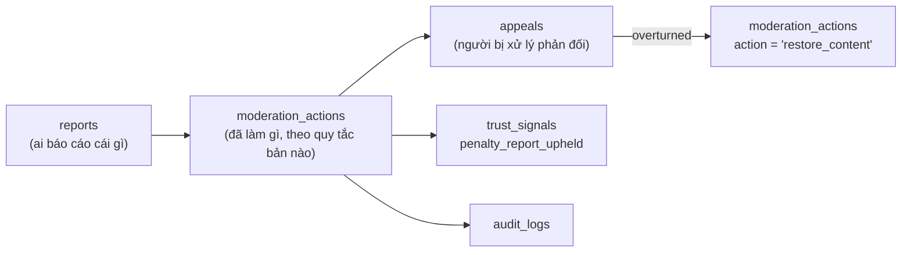

---

## 10. Nhóm G — Hệ thống

### 10.1 `notifications` — `Notification`

Nguyên tắc quan trọng nhất của bảng này: **không lưu văn bản đã render.** Lưu khóa i18n + tham số. Người dùng đổi ngôn ngữ trong app thì toàn bộ hộp thông báo cũ phải đổi theo — nếu lưu chuỗi tiếng Anh thì không sửa được nữa.

| Cột | Kiểu Postgres | Null | Mặc định | Ràng buộc | Ghi chú |
|---|---|---|---|---|---|
| `id` | uuid | NO | — | PK | UUIDv7 |
| `user_id` | uuid | NO | — | FK → `users(id)` ON DELETE CASCADE | Người nhận |
| `topic` | `notification_topic_enum` | NO | — | — | Khớp chính xác `notification_preferences.topic` (§4.7) |
| `type` | varchar(64) | NO | — | CHECK `type ~ '^[a-z_]+\.[a-z_0-9]+$'` | `event.reminder_24h`, `event.reminder_2h`, `waitlist.offered`, `rsvp.approved`, `trust.level_up` |
| `title_key` | varchar(80) | NO | — | — | Khóa i18n |
| `body_key` | varchar(80) | NO | — | — | |
| `params` | jsonb | NO | `'{}'` | — | `{"eventTitle":"Tuesday Language Exchange","startAt":"2026-09-08T12:00:00Z","areaName":"An Thuong"}` |
| `actor_user_id` | uuid | YES | — | FK → `users(id)` ON DELETE SET NULL | Ai gây ra (người bình luận, người RSVP) |
| `target_type` | varchar(24) | YES | — | — | Polymorphic có chủ đích (§1.2) |
| `target_id` | uuid | YES | — | Không có FK | |
| `deep_link` | varchar(255) | YES | — | — | `dnconnect://occurrences/<id>` |
| `image_url` | varchar(500) | YES | — | — | |
| `priority` | smallint | NO | `50` | CHECK `BETWEEN 0 AND 100` | ≥ 80 bỏ qua quiet hours (chỉ dùng cho an toàn/hủy sự kiện) |
| `dedupe_key` | varchar(160) | YES | — | Partial UNIQUE | `reminder_24h:<occurrence_id>:<user_id>` |
| `seen_at` | timestamptz | YES | — | — | Đã thấy trong danh sách |
| `read_at` | timestamptz | YES | — | — | Đã mở |
| `archived_at` | timestamptz | YES | — | — | |
| `expires_at` | timestamptz | YES | — | — | Nhắc lịch hết ý nghĩa sau khi sự kiện xong |
| `created_at` | timestamptz | NO | `now()` | — | Không sửa nội dung sau khi tạo |

| Tên index | Loại | Định nghĩa | Vì sao |
|---|---|---|---|
| `idx_notifications_inbox` | **Composite** (partial) | `(user_id, created_at DESC) WHERE archived_at IS NULL` | Truy vấn chạy mỗi lần mở app |
| `idx_notifications_unread` | **Partial** | `(user_id) WHERE read_at IS NULL AND archived_at IS NULL` | Badge số đỏ — phải là index-only scan, không được đếm cả bảng |
| `uq_notifications_dedupe` | **Partial UNIQUE** | `(dedupe_key) WHERE dedupe_key IS NOT NULL` | Chống gửi trùng khi job retry (T-24h chạy lại sau khi worker chết). Partial vì phần lớn thông báo không cần khóa chống trùng |
| `idx_notifications_expiry` | Partial | `(expires_at) WHERE expires_at IS NOT NULL AND archived_at IS NULL` | Job dọn |

### 10.2 `notification_deliveries` — `NotificationDelivery`

Một `notifications` có thể đi qua nhiều kênh. Tách bảng để biết kênh nào hỏng.

| Cột | Kiểu | Ràng buộc | Ghi chú |
|---|---|---|---|
| `id` | uuid | PK | |
| `notification_id` | uuid | FK → `notifications(id)` ON DELETE CASCADE | |
| `channel` | varchar(16) | CHECK `IN ('push','email','in_app','websocket')` | |
| `push_token_id` | uuid | FK → `push_tokens(id)` ON DELETE SET NULL | |
| `status` | varchar(16) | CHECK `IN ('queued','sent','delivered','failed','skipped')` | |
| `skip_reason` | varchar(40) | CHECK `IN ('pref_off','quiet_hours','token_inactive','blocked','duplicate','user_suspended')` | **Bắt buộc ghi lý do bỏ qua** — nếu không, mọi khiếu nại "tôi không nhận được thông báo" đều không tra được |
| `provider` | varchar(24) | | `expo`, `ses`, `socket_io` |
| `provider_message_id` | varchar(191) | | |
| `attempt` | smallint | NOT NULL default `1`, CHECK `BETWEEN 1 AND 5` | |
| `error_code` / `error_message` | varchar(64) / varchar(500) | | |
| `queued_at` / `sent_at` / `delivered_at` | timestamptz | | |

```sql
CREATE INDEX idx_deliveries_notification ON notification_deliveries (notification_id);
CREATE INDEX idx_deliveries_retry ON notification_deliveries (queued_at)
  WHERE status = 'failed' AND attempt < 5;
CREATE INDEX idx_deliveries_channel_stats ON notification_deliveries (channel, status, sent_at);
```

### 10.3 `push_tokens` — `PushToken`

Bảng đã được đặc tả đầy đủ tại **§4.6** (nó thuộc cả nhóm Danh tính lẫn nhóm Hệ thống). Ở đây chỉ bổ sung phần vòng đời liên quan đến nhóm G:

| Sự kiện | Tác động lên `push_tokens` |
|---|---|
| Đăng nhập trên thiết bị mới | UPSERT theo `expo_push_token`; token cũ cùng `device_id` → `is_active = false`, `disabled_reason = 'logout'` |
| Expo trả `DeviceNotRegistered` | `failure_count += 1`; đạt 3 → `is_active = false`, `disabled_reason = 'device_not_registered'` |
| Không dùng 180 ngày | Job `push:prune` xóa hàng |
| Người dùng yêu cầu xóa tài khoản | **Xóa cứng ngay** ở bước 1 của quy trình §16.4 (không chờ hết ân hạn) — không được gửi push tới người đã yêu cầu rời đi |

### 10.4 `audit_logs` — `AuditLog`

Append-only, phân vùng theo tháng. Ghi **mọi** hành động của staff và mọi thay đổi trạng thái nhạy cảm.

| Cột | Kiểu Postgres | Null | Mặc định | Ràng buộc | Ghi chú |
|---|---|---|---|---|---|
| `id` | uuid | NO | — | PK phần 1 | |
| `created_at` | timestamptz | NO | `now()` | PK phần 2 | **Nằm trong PK** vì bảng phân vùng theo cột này |
| `actor_user_id` | uuid | YES | — | Không FK (giữ được sau khi user bị ẩn danh) | |
| `actor_type` | varchar(16) | NO | `'user'` | CHECK `IN ('user','staff','system','job','api_client')` | |
| `actor_role_at_time` | varchar(20) | YES | — | — | |
| `action` | varchar(80) | NO | — | CHECK `action ~ '^[a-z_]+\.[a-z_0-9]+$'` | `user.trust_level_changed`, `event.published`, `rsvp.promoted`, `moderation.action_taken`, `account.anonymized` |
| `entity_type` | varchar(40) | NO | — | — | |
| `entity_id` | uuid | YES | — | — | |
| `before` | jsonb | YES | — | — | Chỉ các trường thay đổi, đã lọc PII không cần thiết |
| `after` | jsonb | YES | — | — | |
| `reason` | varchar(255) | YES | — | — | |
| `request_id` | uuid | YES | — | — | Nối với log ứng dụng |
| `ip` | inet | YES | — | — | Purge sau 90 ngày (UPDATE `ip = NULL`) |
| `user_agent` | varchar(255) | YES | — | — | Purge sau 90 ngày |
| `severity` | varchar(16) | NO | `'info'` | CHECK `IN ('info','notice','warning','critical')` | |

```sql
CREATE TABLE audit_logs (...) PARTITION BY RANGE (created_at);
CREATE TABLE audit_logs_2026_09 PARTITION OF audit_logs
  FOR VALUES FROM ('2026-09-01') TO ('2026-10-01');

CREATE INDEX idx_audit_entity   ON audit_logs (entity_type, entity_id, created_at DESC);
CREATE INDEX idx_audit_actor    ON audit_logs (actor_user_id, created_at DESC);
CREATE INDEX idx_audit_action   ON audit_logs (action, created_at DESC);
CREATE INDEX idx_audit_critical ON audit_logs (created_at DESC) WHERE severity = 'critical';

-- Chặn sửa/xóa ở cấp quyền, không chỉ ở cấp ứng dụng
REVOKE UPDATE, DELETE ON audit_logs FROM app_user;
```

Vòng đời phân vùng: giữ **24 tháng** ở bảng nóng, sau đó `DETACH PARTITION` + xuất ra S3 (Glacier). Job `ops:partition-maintenance` tạo trước phân vùng của 3 tháng kế tiếp.

### 10.5 `curated_sources` — `CuratedSource`

Hiện thực D-11 và D-12. Đây là bảng khiến chiến lược "curate thủ công rồi bàn giao" trở thành dữ liệu chứ không phải quy trình truyền miệng.

| Cột | Kiểu Postgres | Null | Mặc định | Ràng buộc | Ghi chú |
|---|---|---|---|---|---|
| `id` | uuid | NO | — | PK | |
| `name` | varchar(140) | NO | — | — | "Da Nang Badminton Group" |
| `type` | varchar(24) | NO | — | CHECK `IN ('facebook_group','meetup','venue_partner','newsletter','personal_contact','website','other')` | |
| `url` | varchar(500) | YES | — | — | |
| `area_id` | uuid | YES | — | FK → `areas(id)` ON DELETE SET NULL | Nguồn này phủ khu vực nào — nuôi chỉ tiêu "không khu vực nào bằng 0" |
| `owner_contact_name` | varchar(120) | YES | — | — | |
| `owner_contact_channel` | varchar(24) | YES | — | CHECK `IN ('email','phone','facebook','zalo','in_person','other')` | |
| `owner_contact_value` | varchar(191) | YES | — | — | **Dữ liệu cá nhân** — mã hóa ở tầng ứng dụng, chỉ `curator`/`admin` đọc |
| `permission_status` | varchar(20) | NO | `'not_requested'` | CHECK `IN ('not_requested','requested','granted','denied','revoked')` | |
| `permission_requested_at` | timestamptz | YES | — | — | |
| `permission_granted_at` | timestamptz | YES | — | — | |
| `permission_evidence_media_id` | uuid | YES | — | FK → `media(id)` ON DELETE SET NULL | Ảnh chụp tin nhắn xin phép |
| `collection_method` | `collection_method_enum` | NO | `'manual_only'` | CHECK `ck_curated_sources_manual` | **D-12** |
| `terms_reviewed_at` | timestamptz | YES | — | — | Đã đọc điều khoản của nguồn chưa |
| `terms_note` | varchar(500) | YES | — | — | |
| `assigned_curator_user_id` | uuid | YES | — | FK → `users(id)` ON DELETE SET NULL | Phải có `role = 'curator'` trở lên |
| `is_active` | boolean | NO | `true` | — | |
| `last_curated_at` | timestamptz | YES | — | — | |
| `events_curated_count` | integer | NO | `0` | CHECK `>= 0` | |
| `notes` | text | YES | — | — | |
| `created_at` / `updated_at` / `deleted_at` | timestamptz | | `now()` / `now()` / — | | |

CHECK `ck_curated_sources_manual`:

```sql
CHECK (
  collection_method = 'manual_only'
  OR (permission_status = 'granted' AND permission_evidence_media_id IS NOT NULL)
)
```

Nghĩa là: **không thể** ghi vào DB một nguồn thu thập tự động mà chưa có bằng chứng được cho phép. Rủi ro pháp lý bị chặn ở tầng schema, không phụ thuộc vào việc lập trình viên có nhớ kiểm tra hay không.

| Tên index | Loại | Định nghĩa | Vì sao |
|---|---|---|---|
| `uq_curated_sources_url` | **Partial UNIQUE** | `(url) WHERE url IS NOT NULL AND deleted_at IS NULL` | Tránh hai curator cùng theo một nhóm Facebook |
| `idx_curated_sources_curator` | Composite (partial) | `(assigned_curator_user_id, last_curated_at) WHERE is_active AND deleted_at IS NULL` | Bảng công việc hằng tuần |
| `idx_curated_sources_area` | Composite (partial) | `(area_id, is_active) WHERE deleted_at IS NULL` | Phát hiện khu vực chưa có nguồn nào |
| `idx_curated_sources_permission` | Partial | `(permission_status, permission_requested_at) WHERE permission_status IN ('requested','not_requested')` | Nhắc curator theo đuổi việc xin phép |

### 10.6 `curation_tasks` — `CurationTask`

| Cột | Kiểu | Ràng buộc | Ghi chú |
|---|---|---|---|
| `id` | uuid | PK | |
| `curated_source_id` | uuid | FK → `curated_sources(id)` ON DELETE CASCADE | |
| `assigned_to_user_id` | uuid | FK → `users(id)` ON DELETE SET NULL | |
| `area_id` | uuid | FK → `areas(id)` ON DELETE SET NULL | |
| `week_of` | date | NOT NULL | Thứ Hai của tuần, theo giờ `Asia/Ho_Chi_Minh` |
| `status` | varchar(16) | CHECK `IN ('todo','in_progress','done','blocked','skipped')` | |
| `target_event_count` | smallint | NOT NULL default `3`, CHECK `> 0` | |
| `created_event_count` | smallint | NOT NULL default `0`, CHECK `>= 0` | |
| `due_at` | timestamptz | | |
| `blocked_reason` | varchar(255) | | |
| `notes` | text | | |

```sql
CREATE UNIQUE INDEX uq_curation_tasks_week
  ON curation_tasks (curated_source_id, week_of);
CREATE INDEX idx_curation_tasks_board
  ON curation_tasks (assigned_to_user_id, status, due_at) WHERE status IN ('todo','in_progress');
```

**View đo gate M6.** Cổng M6 được đo bằng **dòng chảy**: ≥ 25 sự kiện đang mở mỗi tuần và **không khu vực MVP nào bằng 0** (không dùng chỉ tiêu tồn kho). View dưới đây là nguồn số duy nhất cho báo cáo đó:

```sql
CREATE VIEW v_weekly_supply_by_area AS
SELECT
  a.id                                   AS area_id,
  a.name_en                              AS area_name,
  date_trunc('week', eo.start_at AT TIME ZONE 'Asia/Ho_Chi_Minh')::date AS week_of,
  count(DISTINCT eo.id)                  AS open_occurrences,
  count(DISTINCT e.host_user_id)         AS distinct_hosts,
  count(DISTINCT eo.id) FILTER (WHERE e.source = 'curated') AS curated_occurrences
FROM areas a
LEFT JOIN events e
       ON e.area_id = a.id
      AND e.status = 'published'
      AND e.deleted_at IS NULL
LEFT JOIN event_occurrences eo
       ON eo.event_id = e.id
      AND eo.status = 'scheduled'
      AND eo.deleted_at IS NULL
WHERE a.is_mvp
GROUP BY a.id, a.name_en, 3;
```

`LEFT JOIN` là cố ý: khu vực **không có sự kiện nào** vẫn phải xuất hiện với số `0`, vì đó chính là điều kiện gate cần phát hiện.

### 10.7 Ba bảng hạ tầng còn lại

**`media`** — mọi tệp tải lên đi qua đây (avatar, ảnh bìa sự kiện, bằng chứng báo cáo).

| Cột | Kiểu | Ghi chú |
|---|---|---|
| `id` | uuid | PK |
| `owner_user_id` | uuid | FK → `users(id)` ON DELETE SET NULL |
| `purpose` | varchar(24) | CHECK `IN ('avatar','event_cover','venue_photo','report_evidence','message_attachment','permission_evidence')` |
| `storage_key` | varchar(255) | Khóa S3, UNIQUE |
| `mime_type` | varchar(80) | CHECK bắt đầu bằng `image/` hoặc `application/pdf` |
| `bytes` | integer | CHECK `> 0 AND bytes <= 10485760` (10 MB) |
| `width` / `height` | integer | |
| `blurhash` | varchar(64) | Placeholder lúc tải |
| `scan_status` | varchar(16) | `pending` · `clean` · `flagged` · `rejected` — chưa `clean` thì không phục vụ công khai |
| `retention_until` | timestamptz | **Ảnh giấy tờ xác minh: 0 ngày** — xóa ngay sau khi duyệt, chỉ giữ `trust_signals` |
| `created_at` / `deleted_at` | timestamptz | |

**`saved_searches`** — brief nhấn mạnh tìm kiếm nâng cao, nên bộ lọc phải lưu lại được và biến thành thông báo.

| Cột | Kiểu | Ghi chú |
|---|---|---|
| `id` / `user_id` | uuid | PK / FK CASCADE |
| `name` | varchar(80) | "Badminton ở An Thượng cuối tuần" |
| `filters` | jsonb | `{"areaIds":[...],"categoryIds":[...],"languages":["en"],"dayOfWeek":[6,0],"maxPriceVnd":100000}` |
| `notify_new_match` | boolean | Bật → job `search:alert` gửi khi có sự kiện mới khớp |
| `last_notified_at` | timestamptz | Chặn gửi quá 1 lần/ngày cho mỗi bộ lọc |

```sql
CREATE UNIQUE INDEX uq_saved_searches_name ON saved_searches (user_id, lower(name)) WHERE deleted_at IS NULL;
CREATE INDEX idx_saved_searches_alerting ON saved_searches (last_notified_at) WHERE notify_new_match;
```

**`outbox_events`** — mẫu transactional outbox, để "ghi DB" và "đẩy job BullMQ" không bao giờ lệch nhau.

| Cột | Kiểu | Ghi chú |
|---|---|---|
| `id` | uuid | PK (UUIDv7 → xử lý theo đúng thứ tự phát sinh) |
| `aggregate_type` / `aggregate_id` | varchar(40) / uuid | `event_occurrence` / `<id>` |
| `event_type` | varchar(64) | `rsvp.created`, `occurrence.capacity_freed` |
| `payload` | jsonb | |
| `status` | varchar(16) | `pending` · `processing` · `done` · `failed` |
| `attempt` | smallint | CHECK `BETWEEN 0 AND 10` |
| `available_at` | timestamptz | Backoff lũy tiến |
| `processed_at` / `last_error` | timestamptz / varchar(500) | |

```sql
CREATE INDEX idx_outbox_pending ON outbox_events (available_at, id)
  WHERE status IN ('pending','failed');
-- Worker: SELECT ... FOR UPDATE SKIP LOCKED LIMIT 100
```

---

## 11. Sơ đồ ERD đầy đủ

Kiểu dữ liệu trong sơ đồ được rút gọn (`geography` thay cho `geography(Point,4326)`, `uuid_arr` thay cho `uuid[]`) vì cú pháp Mermaid không nhận dấu ngoặc. Bản đầy đủ nằm ở các bảng §4–§10.

```mermaid
erDiagram
    users ||--|| profiles : "1-1"
    users ||--o{ social_accounts : "liên kết"
    users ||--o{ auth_sessions : "phiên"
    users ||--o{ trust_signals : "bằng chứng"
    users ||--o{ push_tokens : "thiết bị"
    users ||--o{ notification_preferences : "tuỳ chọn"
    users ||--o{ events : "host_user_id"
    users ||--o{ event_cohosts : "đồng tổ chức"
    users ||--o{ rsvps : "đăng ký"
    users ||--o{ waitlist_entries : "xếp hàng"
    users ||--o{ checkins : "điểm danh"
    users ||--o{ comments : "bình luận"
    users ||--o{ reviews : "đánh giá"
    users ||--o{ follows : "theo dõi"
    users ||--o{ reports : "báo cáo"
    users ||--o{ blocks : "chặn"
    users ||--o{ appeals : "khiếu nại"
    users ||--o{ notifications : "nhận"
    users ||--o{ saved_searches : "bộ lọc đã lưu"
    users ||--o{ media : "tải lên"

    profiles }o--o| areas : "home_area_id"
    profiles }o--o{ event_categories : "profile_interests"

    areas ||--o{ areas : "parent_id"
    areas ||--o{ venues : "chứa"
    areas ||--o{ events : "gán area_id"
    areas ||--o{ event_occurrences : "ghi đè"
    areas ||--o{ curated_sources : "phủ"

    event_categories ||--o{ event_categories : "parent_id"
    event_categories ||--o{ events : "primary_category_id"

    venues ||--o{ events : "venue_id"
    venues ||--o{ event_occurrences : "ghi đè"

    curated_sources ||--o{ events : "nguồn curate"
    curated_sources ||--o{ curation_tasks : "công việc tuần"

    events ||--|{ event_occurrences : "1..n buổi"
    events ||--o{ event_cohosts : "quyền theo sự kiện"
    events ||--o{ event_translations : "bản dịch"
    events ||--o{ comments : "thảo luận"
    events ||--o{ rsvps : "phi chuẩn hoá event_id"
    events }o--o| media : "cover_media_id"

    event_occurrences ||--o{ rsvps : "occurrence_id"
    event_occurrences ||--o{ waitlist_entries : "hàng đợi"
    event_occurrences ||--o{ checkins : "điểm danh"
    event_occurrences ||--o{ reviews : "ngữ cảnh"
    event_occurrences ||--o| conversations : "nhóm chat buổi"

    rsvps ||--o| waitlist_entries : "rsvp_id"
    rsvps ||--o{ checkins : "rsvp_id"

    conversations ||--o{ messages : "chứa"
    conversations ||--o{ conversation_participants : "thành viên"
    messages }o--o| media : "media_id"

    reports ||--o{ moderation_actions : "dẫn tới"
    moderation_actions ||--o{ appeals : "bị khiếu nại"
    moderation_actions ||--o{ audit_logs : "ghi vết"

    notifications ||--o{ notification_deliveries : "kênh gửi"
    push_tokens ||--o{ notification_deliveries : "thiết bị đích"

    users {
        uuid id PK
        citext email UK "partial unique"
        varchar phone UK "partial unique"
        enum role "member curator moderator admin super_admin"
        smallint trust_level "0..5"
        enum status
        timestamptz deletion_requested_at
        timestamptz anonymized_at
        timestamptz legal_hold_until
    }
    profiles {
        uuid user_id PK "đồng thời FK"
        citext handle UK
        varchar display_name
        uuid home_area_id FK
        integer trust_points "nội bộ, không hiển thị"
        numeric rating_avg
        tsvector search_vector
    }
    trust_signals {
        uuid id PK
        uuid user_id FK
        enum type
        enum status
        smallint weight "có thể âm"
        timestamptz expires_at
        timestamptz revoked_at
    }
    areas {
        uuid id PK
        uuid parent_id FK
        enum level "city district ward micro_area"
        varchar path "materialized path"
        geography boundary "MultiPolygon 4326"
        geography center "Point 4326"
        boolean is_mvp "6 khu vực MVP"
    }
    venues {
        uuid id PK
        uuid area_id FK
        varchar name
        geography location
        enum status
        boolean is_verified
    }
    event_categories {
        uuid id PK
        uuid parent_id FK
        citext slug UK
        varchar name_en
        varchar name_vi
        boolean is_interest
    }
    events {
        uuid id PK
        citext slug UK "partial unique"
        uuid host_user_id FK "tên cột chốt"
        uuid primary_category_id FK
        uuid venue_id FK
        uuid area_id FK
        enum status "draft published cancelled"
        geography location
        geography location_public "đã làm mờ"
        varchar_arr languages
        smallint min_trust_level
        integer default_capacity
        boolean default_waitlist_enabled
        enum source
        enum claim_status
        timestamptz next_occurrence_start_at
        tsvector search_vector
    }
    event_occurrences {
        uuid id PK
        uuid event_id FK
        integer sequence
        timestamptz start_at
        timestamptz end_at
        date local_date
        enum status "scheduled live completed cancelled"
        integer capacity
        integer seats_taken
        integer rsvp_going_count
        boolean waitlist_enabled
        timestamptz reminder_24h_sent_at
        timestamptz reminder_2h_sent_at
    }
    event_cohosts {
        uuid id PK
        uuid event_id FK
        uuid user_id FK
        enum role_in_event "quan hệ theo sự kiện"
        enum invite_status
        boolean can_manage_rsvp
    }
    rsvps {
        uuid id PK
        uuid occurrence_id FK "RSVP gắn vào occurrence"
        uuid event_id FK "phi chuẩn hoá"
        uuid user_id FK
        enum status "going waitlisted checked_in no_show"
        smallint guest_count
        smallint seats "generated"
        timestamptz joined_waitlist_at
        timestamptz checked_in_at
    }
    waitlist_entries {
        uuid id PK
        uuid occurrence_id FK
        uuid user_id FK
        uuid rsvp_id FK
        enum state "queued offered accepted expired"
        timestamptz queued_at "FIFO"
        timestamptz offer_expires_at
    }
    checkins {
        uuid id PK
        uuid occurrence_id FK
        uuid rsvp_id FK
        enum method
        geography location
        boolean is_valid
    }
    comments {
        uuid id PK
        uuid event_id FK
        uuid parent_id FK
        uuid user_id FK
        text body
        enum status
    }
    conversations {
        uuid id PK
        enum type "direct event_group"
        uuid user_a_id FK
        uuid user_b_id FK
        uuid occurrence_id FK
        enum request_status
        timestamptz last_message_at
    }
    conversation_participants {
        uuid conversation_id PK
        uuid user_id PK
        integer unread_count
        timestamptz last_read_at
    }
    messages {
        uuid id PK "UUIDv7 = thứ tự thời gian"
        uuid conversation_id FK
        uuid sender_user_id FK
        enum type
        text body
        uuid client_message_id "idempotency"
    }
    follows {
        uuid id PK
        uuid follower_user_id FK
        enum target_type "polymorphic"
        uuid target_id
        boolean notify
    }
    reviews {
        uuid id PK
        uuid author_user_id FK
        enum target_type "polymorphic"
        uuid target_id
        uuid occurrence_id FK
        smallint rating "1..5"
        enum status
    }
    reports {
        uuid id PK
        uuid reporter_user_id FK
        enum target_type "polymorphic"
        uuid target_id
        uuid target_owner_user_id FK
        enum reason_code
        enum severity "critical = SLA 2h"
        enum status
        timestamptz sla_due_at
    }
    moderation_actions {
        uuid id PK
        uuid report_id FK
        uuid actor_user_id FK
        enum target_type "polymorphic"
        uuid target_id
        enum action
        jsonb evidence_snapshot
        timestamptz expires_at
    }
    blocks {
        uuid id PK
        uuid blocker_user_id FK
        uuid blocked_user_id FK
        enum scope
    }
    appeals {
        uuid id PK
        uuid moderation_action_id FK
        uuid appellant_user_id FK
        enum status
        timestamptz sla_due_at
    }
    notifications {
        uuid id PK
        uuid user_id FK
        enum topic
        varchar type
        varchar title_key "khoá i18n"
        jsonb params
        varchar dedupe_key UK
        timestamptz read_at
    }
    notification_deliveries {
        uuid id PK
        uuid notification_id FK
        uuid push_token_id FK
        varchar channel
        varchar status
        varchar skip_reason
    }
    push_tokens {
        uuid id PK
        uuid user_id FK
        varchar expo_push_token UK
        boolean is_active
    }
    audit_logs {
        uuid id PK
        timestamptz created_at PK "phân vùng theo tháng"
        uuid actor_user_id
        varchar action
        jsonb before
        jsonb after
    }
    curated_sources {
        uuid id PK
        varchar name
        varchar permission_status
        enum collection_method "manual_only mặc định"
        uuid area_id FK
    }
    curation_tasks {
        uuid id PK
        uuid curated_source_id FK
        date week_of
        varchar status
        smallint target_event_count
    }
    media {
        uuid id PK
        uuid owner_user_id FK
        varchar purpose
        varchar storage_key UK
        varchar scan_status
        timestamptz retention_until
    }
    saved_searches {
        uuid id PK
        uuid user_id FK
        jsonb filters
        boolean notify_new_match
    }
    event_translations {
        uuid id PK
        uuid event_id FK
        varchar locale
        varchar title
        varchar source "human machine"
    }
```

Đọc sơ đồ theo ba lát cắt:

| Lát cắt | Đường đi | Ý nghĩa |
|---|---|---|
| **Nguồn cung** | `curated_sources` → `curation_tasks` → `events` → `event_occurrences` | Sự kiện đến từ đâu và ai chịu trách nhiệm mỗi tuần |
| **Cầu nối** | `users` → `rsvps` → `checkins` → `trust_signals` → `users.trust_level` | Vòng lặp tạo độ tin cậy: tham gia thật → bằng chứng → bậc cao hơn |
| **An toàn** | nội dung bất kỳ → `reports` → `moderation_actions` → `appeals` → `audit_logs` | Mọi hành động đều truy vết được và khiếu nại được |

---

## 12. State machine

### 12.1 `events.status`

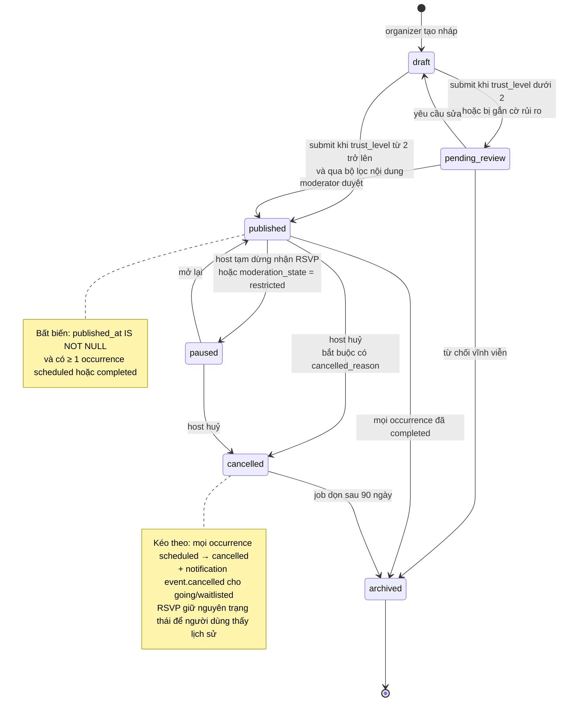

Bảng chuyển trạng thái và ai được phép:

| Từ | Đến | Ai được thực hiện | Điều kiện bắt buộc | Tác dụng phụ |
|---|---|---|---|---|
| `draft` | `pending_review` | host, cohost `can_edit_event` | Đủ trường bắt buộc + ≥ 1 occurrence | Vào hàng đợi kiểm duyệt |
| `draft` / `pending_review` | `published` | host (nếu `trust_level >= 2`) hoặc moderator | `published_at = now()` | Sinh `outbox_events` → index tìm kiếm, thông báo cho người theo dõi |
| `published` | `paused` | host, moderator | — | Đóng RSVP mới; waitlist ngừng thăng hạng |
| `published` / `paused` | `cancelled` | host, moderator, admin | `cancelled_reason` không rỗng | Hủy mọi occurrence `scheduled`; gửi thông báo `priority = 90` (vượt quiet hours) |
| bất kỳ | `archived` | job hệ thống, super_admin | — | Rời khỏi mọi index nóng |

### 12.2 `rsvps.status`

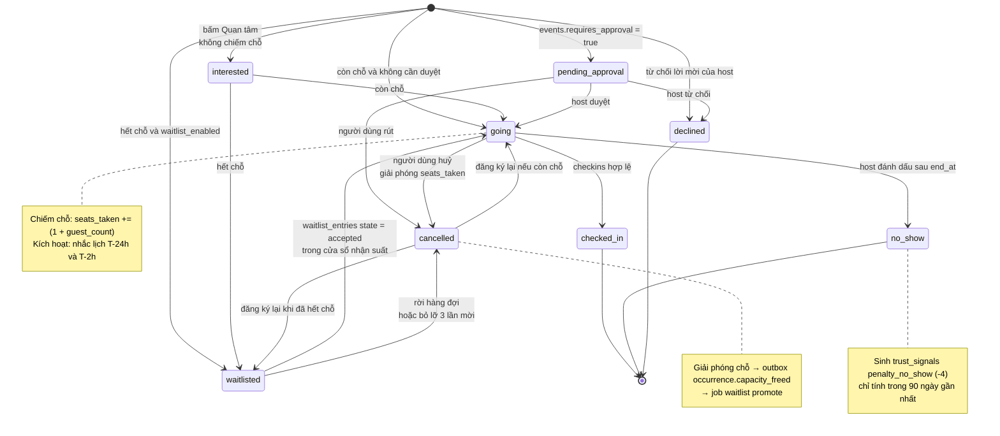

Ma trận quyền chuyển trạng thái:

| Chuyển | Chủ tài khoản | Host / cohost `can_manage_rsvp` | Hệ thống (job) | Moderator |
|---|---|---|---|---|
| `→ going`, `→ interested`, `→ waitlisted` | ✅ | ✅ (thêm hộ) | ✅ (thăng hạng) | — |
| `going → cancelled` | ✅ | ✅ (kèm lý do) | ✅ (hết hạn nhận suất) | ✅ |
| `pending_approval → going/declined` | — | ✅ | — | — |
| `going → checked_in` | ✅ (`self_geo`) | ✅ | — | — |
| `going → no_show` | — | ✅ | ✅ (tự động sau `end_at + 24h` nếu buổi có ≥ 1 check-in) | — |
| Mọi chuyển sau `end_at + 14 ngày` | ❌ | ❌ | ❌ | ✅ (kèm audit) |

Ba bất biến phải luôn đúng, có job `attendance:reconcile` kiểm hằng đêm:

1. `event_occurrences.seats_taken` = `SUM(rsvps.seats)` với `status IN ('going','pending_approval','checked_in','no_show')`.
2. `capacity IS NULL OR seats_taken <= capacity` — trừ trường hợp organizer chủ động giảm `capacity` (ghi nhận ngoại lệ, không sửa dữ liệu).
3. Số hàng `waitlist_entries` ở `state IN ('queued','offered')` = số `rsvps` ở `status = 'waitlisted'`.

---

## 13. DDL SQL mẫu cho 5 bảng quan trọng nhất

Đây là bản dùng được ngay cho migration đầu tiên. `id` do ứng dụng sinh (UUIDv7); `gen_random_uuid()` chỉ là lưới an toàn khi seed bằng SQL thuần.

### 13.1 Enum dùng chung

```sql
-- Nhóm B
CREATE TYPE event_status_enum        AS ENUM ('draft','pending_review','published','paused','cancelled','archived');
CREATE TYPE event_visibility_enum    AS ENUM ('public','members_only','unlisted');
CREATE TYPE event_location_mode_enum AS ENUM ('physical','online','hybrid');
CREATE TYPE location_precision_enum  AS ENUM ('exact','approximate','hidden_until_rsvp');
CREATE TYPE event_source_enum        AS ENUM ('user_created','curated','imported_with_permission','partner');
CREATE TYPE collection_method_enum   AS ENUM ('manual_only','partner_feed_with_contract');
CREATE TYPE event_claim_status_enum  AS ENUM ('not_applicable','unclaimed','claim_pending','claimed','declined');
CREATE TYPE occurrence_status_enum   AS ENUM ('scheduled','live','completed','cancelled','postponed');
CREATE TYPE moderation_state_enum    AS ENUM ('clean','flagged','under_review','restricted','removed');

-- Nhóm C
CREATE TYPE rsvp_status_enum         AS ENUM ('interested','pending_approval','going','waitlisted','cancelled','declined','checked_in','no_show');
CREATE TYPE rsvp_source_enum         AS ENUM ('web','ios','android','organizer_added','waitlist_promoted','import');

-- Nhóm D
CREATE TYPE area_level_enum          AS ENUM ('city','district','ward','micro_area');
CREATE TYPE area_admin_status_enum   AS ENUM ('official','legacy','colloquial');

-- Nhóm F
CREATE TYPE report_target_enum       AS ENUM ('user','profile','event','occurrence','comment','review','message','venue');
CREATE TYPE report_reason_enum       AS ENUM ('spam','harassment','hate_speech','sexual_content','violence_threat',
                                              'scam_fraud','impersonation','personal_info','unsafe_meetup',
                                              'illegal_activity','misinformation','off_topic','other');
CREATE TYPE report_severity_enum     AS ENUM ('low','medium','high','critical');
CREATE TYPE report_status_enum       AS ENUM ('new','triaged','in_review','action_taken','dismissed','escalated','withdrawn');
```

### 13.2 `areas`

```sql
CREATE TABLE areas (
  id                    uuid PRIMARY KEY DEFAULT gen_random_uuid(),
  parent_id             uuid REFERENCES areas(id) ON DELETE RESTRICT,
  level                 area_level_enum NOT NULL,
  depth                 smallint NOT NULL DEFAULT 0,
  path                  varchar(255) NOT NULL,
  code                  varchar(32)  NOT NULL,
  slug                  citext       NOT NULL,
  name_en               varchar(120) NOT NULL,
  name_vi               varchar(120) NOT NULL,
  aliases               varchar(80)[] NOT NULL DEFAULT '{}',
  boundary              geography(MultiPolygon, 4326),
  center                geography(Point, 4326) NOT NULL,
  default_radius_meters integer NOT NULL DEFAULT 1200,
  bbox_min_lng          double precision,
  bbox_min_lat          double precision,
  bbox_max_lng          double precision,
  bbox_max_lat          double precision,
  admin_status          area_admin_status_enum NOT NULL DEFAULT 'official',
  timezone              varchar(64) NOT NULL DEFAULT 'Asia/Ho_Chi_Minh',
  country_code          char(2)     NOT NULL DEFAULT 'VN',
  is_mvp                boolean     NOT NULL DEFAULT false,
  is_active             boolean     NOT NULL DEFAULT true,
  sort_order            smallint    NOT NULL DEFAULT 100,
  event_count           integer     NOT NULL DEFAULT 0,
  created_at            timestamptz NOT NULL DEFAULT now(),
  updated_at            timestamptz NOT NULL DEFAULT now(),

  CONSTRAINT ck_areas_depth        CHECK (depth BETWEEN 0 AND 3),
  CONSTRAINT ck_areas_path         CHECK (path ~ '^[a-z0-9/-]+$'),
  CONSTRAINT ck_areas_radius       CHECK (default_radius_meters BETWEEN 200 AND 20000),
  CONSTRAINT ck_areas_event_count  CHECK (event_count >= 0),
  CONSTRAINT ck_areas_root         CHECK ((level = 'city') = (parent_id IS NULL))
);

CREATE UNIQUE INDEX uq_areas_code ON areas (code);
CREATE UNIQUE INDEX uq_areas_slug ON areas (slug);
CREATE INDEX idx_areas_boundary   ON areas USING GIST (boundary) WHERE boundary IS NOT NULL;
CREATE INDEX idx_areas_center     ON areas USING GIST (center);
CREATE INDEX idx_areas_tree       ON areas (parent_id, sort_order) WHERE is_active;
CREATE INDEX idx_areas_path       ON areas (path text_pattern_ops);
CREATE INDEX idx_areas_mvp        ON areas (sort_order) WHERE is_mvp AND is_active;
CREATE INDEX idx_areas_aliases    ON areas USING GIN (aliases);

-- Seed 6 khu vực MVP (center là giá trị khởi tạo, cần chốt lại khi vẽ boundary)
INSERT INTO areas (id, parent_id, level, depth, path, code, slug, name_en, name_vi, aliases, center, admin_status, is_mvp, sort_order)
VALUES
 (gen_random_uuid(), NULL, 'city', 0, 'da-nang', 'DN', 'da-nang', 'Da Nang', 'Đà Nẵng',
   ARRAY['Da Nang','Danang','Đà Nẵng'], ST_SetSRID(ST_MakePoint(108.2200,16.0678),4326)::geography, 'official', false, 0);

INSERT INTO areas (id, parent_id, level, depth, path, code, slug, name_en, name_vi, aliases, center, admin_status, is_mvp, sort_order)
SELECT gen_random_uuid(), c.id, v.level::area_level_enum, v.depth, v.path, v.code, v.slug, v.name_en, v.name_vi,
       v.aliases, ST_SetSRID(ST_MakePoint(v.lng, v.lat),4326)::geography, v.admin::area_admin_status_enum, true, v.ord
FROM (VALUES
  ('district',   1, 'da-nang/hai-chau',       'DN-HC',  'hai-chau',      'Hai Chau',     'Hải Châu',      ARRAY['Hai Chau','Hải Châu','downtown'],          108.2208, 16.0678, 'official',   10),
  ('district',   1, 'da-nang/son-tra',        'DN-ST',  'son-tra',       'Son Tra',      'Sơn Trà',       ARRAY['Son Tra','Sơn Trà','peninsula'],           108.2470, 16.0900, 'official',   20),
  ('district',   1, 'da-nang/ngu-hanh-son',   'DN-NHS', 'ngu-hanh-son',  'Ngu Hanh Son', 'Ngũ Hành Sơn',  ARRAY['Ngu Hanh Son','Ngũ Hành Sơn','Marble Mountains'], 108.2500, 16.0100, 'official', 30)
) AS v(level, depth, path, code, slug, name_en, name_vi, aliases, lng, lat, admin, ord)
CROSS JOIN (SELECT id FROM areas WHERE code = 'DN') c;

-- My Khe (thuộc Son Tra), My An (thuộc Ngu Hanh Son), An Thuong (thuộc My An) chèn tiếp theo cùng khuôn mẫu.
```

### 13.3 `events`

```sql
CREATE TABLE events (
  id                        uuid PRIMARY KEY DEFAULT gen_random_uuid(),
  slug                      citext       NOT NULL,
  title                     varchar(140) NOT NULL,
  summary                   varchar(300),
  description               text,
  content_locale            varchar(5)   NOT NULL DEFAULT 'en',
  languages                 varchar(5)[] NOT NULL DEFAULT '{en}',

  host_user_id              uuid NOT NULL REFERENCES users(id) ON DELETE RESTRICT,
  primary_category_id       uuid NOT NULL REFERENCES event_categories(id) ON DELETE RESTRICT,
  venue_id                  uuid REFERENCES venues(id) ON DELETE SET NULL,
  area_id                   uuid REFERENCES areas(id)  ON DELETE SET NULL,

  location_mode             event_location_mode_enum NOT NULL DEFAULT 'physical',
  location                  geography(Point, 4326),
  location_public           geography(Point, 4326),
  location_precision        location_precision_enum NOT NULL DEFAULT 'exact',
  address_line              varchar(255),
  address_note              varchar(255),
  online_url                varchar(500),

  status                    event_status_enum     NOT NULL DEFAULT 'draft',
  visibility                event_visibility_enum NOT NULL DEFAULT 'public',
  min_trust_level           smallint NOT NULL DEFAULT 0,
  requires_approval         boolean  NOT NULL DEFAULT false,

  recurrence_rule           varchar(255),
  recurrence_timezone       varchar(64) NOT NULL DEFAULT 'Asia/Ho_Chi_Minh',
  recurrence_until          timestamptz,

  default_capacity          integer,
  default_waitlist_enabled  boolean  NOT NULL DEFAULT true,
  default_duration_minutes  integer  NOT NULL DEFAULT 90,
  guests_allowed_max        smallint NOT NULL DEFAULT 0,

  price_amount              integer NOT NULL DEFAULT 0,
  price_currency            char(3) NOT NULL DEFAULT 'VND',
  price_note                varchar(120),
  cover_media_id            uuid REFERENCES media(id) ON DELETE SET NULL,

  source                    event_source_enum      NOT NULL DEFAULT 'user_created',
  collection_method         collection_method_enum NOT NULL DEFAULT 'manual_only',
  curated_source_id         uuid REFERENCES curated_sources(id) ON DELETE SET NULL,
  claim_status              event_claim_status_enum NOT NULL DEFAULT 'not_applicable',
  claimed_by_user_id        uuid REFERENCES users(id) ON DELETE SET NULL,
  claimed_at                timestamptz,

  published_at              timestamptz,
  first_occurrence_start_at timestamptz,
  next_occurrence_start_at  timestamptz,
  occurrence_count          integer NOT NULL DEFAULT 0,
  total_going_count         integer NOT NULL DEFAULT 0,
  view_count                integer NOT NULL DEFAULT 0,
  save_count                integer NOT NULL DEFAULT 0,

  moderation_state          moderation_state_enum NOT NULL DEFAULT 'clean',
  moderation_note           varchar(255),
  cancelled_reason          varchar(255),
  search_vector             tsvector,

  created_at                timestamptz NOT NULL DEFAULT now(),
  updated_at                timestamptz NOT NULL DEFAULT now(),
  deleted_at                timestamptz,
  version                   integer NOT NULL DEFAULT 1,

  CONSTRAINT ck_events_title             CHECK (length(btrim(title)) >= 6),
  CONSTRAINT ck_events_languages         CHECK (array_length(languages, 1) BETWEEN 1 AND 5),
  CONSTRAINT ck_events_min_trust         CHECK (min_trust_level BETWEEN 0 AND 5),
  CONSTRAINT ck_events_capacity_positive CHECK (default_capacity IS NULL OR default_capacity > 0),
  CONSTRAINT ck_events_duration          CHECK (default_duration_minutes BETWEEN 15 AND 1440),
  CONSTRAINT ck_events_guests            CHECK (guests_allowed_max BETWEEN 0 AND 5),
  CONSTRAINT ck_events_price             CHECK (price_amount >= 0
                                                AND (price_currency <> 'VND' OR price_amount % 1000 = 0)),
  CONSTRAINT ck_events_location_required CHECK (location_mode = 'online' OR location IS NOT NULL),
  CONSTRAINT ck_events_online_url        CHECK (location_mode = 'physical' OR online_url IS NOT NULL),
  CONSTRAINT ck_events_published_at      CHECK (status <> 'published' OR published_at IS NOT NULL),
  CONSTRAINT ck_events_cancel_reason     CHECK (status <> 'cancelled'  OR cancelled_reason IS NOT NULL),
  CONSTRAINT ck_events_collection_method CHECK (collection_method = 'manual_only' OR source = 'partner'),
  CONSTRAINT ck_events_claim_source      CHECK (claim_status = 'not_applicable' OR source <> 'user_created'),
  CONSTRAINT ck_events_recurrence        CHECK (recurrence_rule IS NULL OR recurrence_rule LIKE 'FREQ=%')
);

CREATE UNIQUE INDEX uq_events_slug ON events (slug) WHERE deleted_at IS NULL;

CREATE INDEX idx_events_geo ON events USING GIST (location)
  WHERE status = 'published' AND deleted_at IS NULL;

CREATE INDEX idx_events_area_status_next ON events (area_id, status, next_occurrence_start_at)
  WHERE deleted_at IS NULL;

CREATE INDEX idx_events_category_next ON events (primary_category_id, next_occurrence_start_at)
  WHERE status = 'published' AND deleted_at IS NULL;

CREATE INDEX idx_events_host      ON events (host_user_id, created_at DESC);
CREATE INDEX idx_events_search    ON events USING GIN (search_vector);
CREATE INDEX idx_events_languages ON events USING GIN (languages);
CREATE INDEX idx_events_claim_open ON events (claim_status, created_at)
  WHERE claim_status IN ('unclaimed','claim_pending');
CREATE INDEX idx_events_moderation_open ON events (moderation_state, updated_at)
  WHERE moderation_state IN ('flagged','under_review');
```

### 13.4 `event_occurrences`

```sql
CREATE TABLE event_occurrences (
  id                          uuid PRIMARY KEY DEFAULT gen_random_uuid(),
  event_id                    uuid NOT NULL REFERENCES events(id) ON DELETE CASCADE,
  sequence                    integer NOT NULL DEFAULT 1,

  start_at                    timestamptz NOT NULL,
  end_at                      timestamptz NOT NULL,
  local_date                  date NOT NULL,
  timezone                    varchar(64) NOT NULL DEFAULT 'Asia/Ho_Chi_Minh',

  status                      occurrence_status_enum NOT NULL DEFAULT 'scheduled',

  capacity                    integer,
  seats_taken                 integer NOT NULL DEFAULT 0,
  rsvp_going_count            integer NOT NULL DEFAULT 0,
  rsvp_waitlist_count         integer NOT NULL DEFAULT 0,
  interested_count            integer NOT NULL DEFAULT 0,
  checked_in_count            integer NOT NULL DEFAULT 0,
  no_show_count               integer NOT NULL DEFAULT 0,

  waitlist_enabled            boolean NOT NULL DEFAULT true,
  waitlist_capacity           integer,
  rsvp_opens_at               timestamptz,
  rsvp_closes_at              timestamptz,

  venue_id                    uuid REFERENCES venues(id) ON DELETE SET NULL,
  area_id                     uuid REFERENCES areas(id)  ON DELETE SET NULL,
  location                    geography(Point, 4326),
  host_note                   varchar(500),

  checkin_code                varchar(12),
  reminder_24h_sent_at        timestamptz,
  reminder_2h_sent_at         timestamptz,
  completed_at                timestamptz,
  cancelled_at                timestamptz,
  cancelled_reason            varchar(255),
  postponed_to_occurrence_id  uuid REFERENCES event_occurrences(id) ON DELETE SET NULL,

  created_at                  timestamptz NOT NULL DEFAULT now(),
  updated_at                  timestamptz NOT NULL DEFAULT now(),
  deleted_at                  timestamptz,
  version                     integer NOT NULL DEFAULT 1,

  CONSTRAINT ck_occ_time       CHECK (end_at > start_at),
  CONSTRAINT ck_occ_sequence   CHECK (sequence >= 1),
  CONSTRAINT ck_occ_capacity   CHECK (capacity IS NULL OR capacity > 0),
  CONSTRAINT ck_occ_wl_cap     CHECK (waitlist_capacity IS NULL OR waitlist_capacity > 0),
  CONSTRAINT ck_occ_counters   CHECK (seats_taken >= 0 AND rsvp_going_count >= 0
                                      AND rsvp_waitlist_count >= 0 AND checked_in_count >= 0
                                      AND no_show_count >= 0 AND interested_count >= 0),
  CONSTRAINT ck_occ_rsvp_win   CHECK (rsvp_closes_at IS NULL OR rsvp_opens_at IS NULL
                                      OR rsvp_closes_at > rsvp_opens_at),
  CONSTRAINT ck_occ_cancelled  CHECK (status <> 'cancelled' OR cancelled_at IS NOT NULL)
);

CREATE UNIQUE INDEX uq_occurrences_event_start
  ON event_occurrences (event_id, start_at) WHERE deleted_at IS NULL;
CREATE UNIQUE INDEX uq_occurrences_event_sequence
  ON event_occurrences (event_id, sequence)  WHERE deleted_at IS NULL;
CREATE UNIQUE INDEX uq_occurrences_checkin_code
  ON event_occurrences (checkin_code)
  WHERE checkin_code IS NOT NULL AND status IN ('scheduled','live');

CREATE INDEX idx_occurrences_upcoming ON event_occurrences (start_at, id)
  WHERE status = 'scheduled' AND deleted_at IS NULL;
CREATE INDEX idx_occurrences_event_start ON event_occurrences (event_id, start_at);
CREATE INDEX idx_occurrences_area_start  ON event_occurrences (area_id, start_at)
  WHERE status = 'scheduled' AND deleted_at IS NULL;
CREATE INDEX idx_occurrences_geo ON event_occurrences USING GIST (location)
  WHERE location IS NOT NULL AND status = 'scheduled';
CREATE INDEX idx_occurrences_reminder_24h ON event_occurrences (start_at)
  WHERE status = 'scheduled' AND reminder_24h_sent_at IS NULL;
CREATE INDEX idx_occurrences_reminder_2h  ON event_occurrences (start_at)
  WHERE status = 'scheduled' AND reminder_2h_sent_at IS NULL;
CREATE INDEX idx_occurrences_open_seats ON event_occurrences (start_at)
  WHERE status = 'scheduled' AND (capacity IS NULL OR seats_taken < capacity);

-- local_date phải do trigger ghi: AT TIME ZONE là STABLE nên không dùng được GENERATED
CREATE OR REPLACE FUNCTION fn_occurrences_set_local_date() RETURNS trigger AS $$
BEGIN
  NEW.local_date := (NEW.start_at AT TIME ZONE COALESCE(NEW.timezone, 'Asia/Ho_Chi_Minh'))::date;
  RETURN NEW;
END; $$ LANGUAGE plpgsql;

CREATE TRIGGER trg_occurrences_local_date
BEFORE INSERT OR UPDATE OF start_at, timezone ON event_occurrences
FOR EACH ROW EXECUTE FUNCTION fn_occurrences_set_local_date();
```

### 13.5 `rsvps` (kèm trigger giữ bộ đếm và chặn vượt sức chứa)

```sql
CREATE TABLE rsvps (
  id                        uuid PRIMARY KEY DEFAULT gen_random_uuid(),
  occurrence_id             uuid NOT NULL REFERENCES event_occurrences(id) ON DELETE CASCADE,
  event_id                  uuid NOT NULL REFERENCES events(id) ON DELETE CASCADE,
  user_id                   uuid NOT NULL REFERENCES users(id)  ON DELETE CASCADE,

  status                    rsvp_status_enum NOT NULL DEFAULT 'going',
  guest_count               smallint NOT NULL DEFAULT 0,
  seats                     smallint GENERATED ALWAYS AS (1 + guest_count) STORED,
  guest_names               varchar(60)[],
  source                    rsvp_source_enum NOT NULL DEFAULT 'web',
  answers                   jsonb,
  note_to_host              varchar(300),
  visibility                varchar(20) NOT NULL DEFAULT 'attendees',

  approved_at               timestamptz,
  approved_by_user_id       uuid REFERENCES users(id) ON DELETE SET NULL,
  joined_waitlist_at        timestamptz,
  promoted_at               timestamptz,
  promotion_expires_at      timestamptz,
  cancelled_at              timestamptz,
  cancel_reason             varchar(255),
  checked_in_at             timestamptz,
  no_show_marked_at         timestamptz,
  no_show_marked_by_user_id uuid REFERENCES users(id) ON DELETE SET NULL,
  reminder_24h_sent_at      timestamptz,
  reminder_2h_sent_at       timestamptz,
  review_prompt_sent_at     timestamptz,

  created_at                timestamptz NOT NULL DEFAULT now(),
  updated_at                timestamptz NOT NULL DEFAULT now(),
  deleted_at                timestamptz,
  version                   integer NOT NULL DEFAULT 1,

  CONSTRAINT ck_rsvps_guest_count  CHECK (guest_count BETWEEN 0 AND 5),
  CONSTRAINT ck_rsvps_guest_names  CHECK (guest_names IS NULL
                                          OR coalesce(array_length(guest_names,1),0) <= guest_count),
  CONSTRAINT ck_rsvps_visibility   CHECK (visibility IN ('public','attendees','host_only')),
  CONSTRAINT ck_rsvps_cancelled_at CHECK (status <> 'cancelled'  OR cancelled_at IS NOT NULL),
  CONSTRAINT ck_rsvps_checkin_at   CHECK (status <> 'checked_in' OR checked_in_at IS NOT NULL),
  CONSTRAINT ck_rsvps_waitlist_at  CHECK (status <> 'waitlisted' OR joined_waitlist_at IS NOT NULL)
);

-- Ràng buộc chống double-RSVP. BẮT BUỘC partial vì bảng có deleted_at.
CREATE UNIQUE INDEX uq_rsvps_occurrence_user
  ON rsvps (occurrence_id, user_id) WHERE deleted_at IS NULL;

CREATE INDEX idx_rsvps_occurrence_status ON rsvps (occurrence_id, status);
CREATE INDEX idx_rsvps_user_recent       ON rsvps (user_id, status, created_at DESC);
CREATE INDEX idx_rsvps_event_user        ON rsvps (event_id, user_id) WHERE deleted_at IS NULL;
CREATE INDEX idx_rsvps_waitlist_fifo     ON rsvps (occurrence_id, joined_waitlist_at)
  WHERE status = 'waitlisted' AND deleted_at IS NULL;
CREATE INDEX idx_rsvps_reminder_24h ON rsvps (occurrence_id)
  WHERE status IN ('going','checked_in') AND reminder_24h_sent_at IS NULL;
CREATE INDEX idx_rsvps_reminder_2h  ON rsvps (occurrence_id)
  WHERE status IN ('going','checked_in') AND reminder_2h_sent_at IS NULL;
CREATE INDEX idx_rsvps_promotion_expiry ON rsvps (promotion_expires_at)
  WHERE promotion_expires_at IS NOT NULL AND status = 'going';

-- Bộ đếm + chốt chặn sức chứa
CREATE OR REPLACE FUNCTION fn_rsvps_sync_counters() RETURNS trigger AS $$
DECLARE
  occupying  CONSTANT rsvp_status_enum[] := ARRAY['going','pending_approval','checked_in','no_show'];
  delta_seat integer := 0;
  delta_go   integer := 0;
  delta_wl   integer := 0;
  cap        integer;
  taken      integer;
BEGIN
  IF TG_OP IN ('UPDATE','DELETE') AND OLD.deleted_at IS NULL THEN
    IF OLD.status = ANY(occupying) THEN delta_seat := delta_seat - OLD.seats; END IF;
    IF OLD.status = 'going'        THEN delta_go   := delta_go   - 1;         END IF;
    IF OLD.status = 'waitlisted'   THEN delta_wl   := delta_wl   - 1;         END IF;
  END IF;

  IF TG_OP IN ('INSERT','UPDATE') AND NEW.deleted_at IS NULL THEN
    IF NEW.status = ANY(occupying) THEN delta_seat := delta_seat + NEW.seats; END IF;
    IF NEW.status = 'going'        THEN delta_go   := delta_go   + 1;         END IF;
    IF NEW.status = 'waitlisted'   THEN delta_wl   := delta_wl   + 1;         END IF;
  END IF;

  UPDATE event_occurrences
     SET seats_taken         = seats_taken         + delta_seat,
         rsvp_going_count    = rsvp_going_count    + delta_go,
         rsvp_waitlist_count = rsvp_waitlist_count + delta_wl,
         updated_at          = now()
   WHERE id = COALESCE(NEW.occurrence_id, OLD.occurrence_id)
   RETURNING capacity, seats_taken INTO cap, taken;

  IF delta_seat > 0 AND cap IS NOT NULL AND taken > cap THEN
    RAISE EXCEPTION 'occurrence_full' USING ERRCODE = 'check_violation';
  END IF;

  RETURN NULL;
END; $$ LANGUAGE plpgsql;

CREATE TRIGGER trg_rsvps_counters
AFTER INSERT OR UPDATE OF status, guest_count, deleted_at OR DELETE ON rsvps
FOR EACH ROW EXECUTE FUNCTION fn_rsvps_sync_counters();
```

> Trigger là **chốt chặn cuối**, không phải cơ chế chính. Đường đi bình thường vẫn là `SELECT ... FOR NO KEY UPDATE` trên `event_occurrences` rồi mới INSERT (§6.1) — như vậy người dùng nhận được `409 OCCURRENCE_FULL` có ngữ nghĩa, thay vì một exception rơi ra từ tầng DB.

### 13.6 `reports`

```sql
CREATE TABLE reports (
  id                        uuid PRIMARY KEY DEFAULT gen_random_uuid(),
  reporter_user_id          uuid REFERENCES users(id) ON DELETE SET NULL,
  target_type               report_target_enum NOT NULL,
  target_id                 uuid NOT NULL,
  target_owner_user_id      uuid REFERENCES users(id) ON DELETE SET NULL,

  reason_code               report_reason_enum   NOT NULL,
  severity                  report_severity_enum NOT NULL DEFAULT 'medium',
  description               varchar(1000),
  evidence_media_ids        uuid[] NOT NULL DEFAULT '{}',
  content_snapshot          jsonb,

  status                    report_status_enum NOT NULL DEFAULT 'new',
  priority                  smallint NOT NULL DEFAULT 50,
  sla_due_at                timestamptz NOT NULL,
  first_response_at         timestamptz,
  assigned_to_user_id       uuid REFERENCES users(id) ON DELETE SET NULL,
  assigned_at               timestamptz,
  resolved_at               timestamptz,
  resolution_note           varchar(1000),
  reporter_feedback_sent_at timestamptz,
  duplicate_of_report_id    uuid REFERENCES reports(id) ON DELETE SET NULL,

  source                    varchar(20) NOT NULL DEFAULT 'user',
  reporter_ip               inet,
  created_at                timestamptz NOT NULL DEFAULT now(),
  updated_at                timestamptz NOT NULL DEFAULT now(),

  CONSTRAINT ck_reports_priority  CHECK (priority BETWEEN 0 AND 100),
  CONSTRAINT ck_reports_source    CHECK (source IN ('user','automated_filter','staff','partner')),
  CONSTRAINT ck_reports_evidence  CHECK (coalesce(array_length(evidence_media_ids,1),0) <= 5),
  CONSTRAINT ck_reports_resolved  CHECK (status NOT IN ('action_taken','dismissed')
                                         OR resolved_at IS NOT NULL),
  CONSTRAINT ck_reports_no_self   CHECK (reporter_user_id IS NULL
                                         OR target_owner_user_id IS NULL
                                         OR reporter_user_id <> target_owner_user_id)
);

CREATE INDEX idx_reports_queue ON reports (status, priority DESC, created_at)
  WHERE status IN ('new','triaged','in_review');
CREATE INDEX idx_reports_sla_breach ON reports (sla_due_at)
  WHERE status IN ('new','triaged','in_review');
CREATE INDEX idx_reports_target       ON reports (target_type, target_id, created_at DESC);
CREATE INDEX idx_reports_target_owner ON reports (target_owner_user_id, created_at DESC)
  WHERE target_owner_user_id IS NOT NULL;
CREATE INDEX idx_reports_assignee     ON reports (assigned_to_user_id, sla_due_at)
  WHERE resolved_at IS NULL;

CREATE UNIQUE INDEX uq_reports_no_duplicate_open
  ON reports (reporter_user_id, target_type, target_id)
  WHERE status IN ('new','triaged','in_review') AND reporter_user_id IS NOT NULL;

-- SLA: critical = 2 giờ (đã chốt); các mức còn lại là đề xuất vận hành
CREATE OR REPLACE FUNCTION fn_reports_set_sla() RETURNS trigger AS $$
BEGIN
  NEW.sla_due_at := NEW.created_at + CASE NEW.severity
      WHEN 'critical' THEN interval '2 hours'
      WHEN 'high'     THEN interval '12 hours'
      WHEN 'medium'   THEN interval '48 hours'
      ELSE                 interval '7 days'
  END;
  RETURN NEW;
END; $$ LANGUAGE plpgsql;

CREATE TRIGGER trg_reports_sla
BEFORE INSERT OR UPDATE OF severity ON reports
FOR EACH ROW EXECUTE FUNCTION fn_reports_set_sla();
```

---

## 14. Truy vấn mẫu: tìm sự kiện theo bán kính + khu vực + cursor

Bài toán: **tìm các buổi sự kiện sắp diễn ra trong bán kính 1500 m quanh tâm Đà Nẵng `(108.2450, 16.0600)`, có thể lọc thêm theo `area_id`, phân trang bằng cursor.** Kết quả trả về là **occurrence**, không phải event — vì RSVP gắn vào occurrence.

Endpoint tương ứng: `GET /api/v1/occurrences?lng=108.2450&lat=16.0600&radius=1500&areaIds=...&cursor=...&limit=20`

### 14.1 Câu truy vấn

```sql
WITH params AS (
  SELECT
    ST_SetSRID(ST_MakePoint($1::float8, $2::float8), 4326)::geography AS center,  -- 108.2450, 16.0600
    $3::integer                                            AS radius_m,           -- 1500
    $4::uuid[]                                             AS area_ids,           -- NULL = không lọc
    COALESCE($5::timestamptz, '-infinity'::timestamptz)     AS cur_start,          -- cursor: start_at
    COALESCE($6::uuid, '00000000-0000-0000-0000-000000000000'::uuid) AS cur_id,   -- cursor: id
    $7::integer                                            AS page_size           -- 20
)
SELECT
  eo.id                                              AS occurrence_id,
  e.id                                               AS event_id,
  e.slug,
  e.title,
  e.languages,
  e.price_amount,
  e.price_currency,
  eo.start_at,
  eo.end_at,
  eo.capacity,
  eo.seats_taken,
  CASE WHEN eo.capacity IS NULL THEN NULL
       ELSE GREATEST(eo.capacity - eo.seats_taken, 0) END AS seats_left,
  eo.waitlist_enabled,
  a.slug                                             AS area_slug,
  a.name_en                                          AS area_name,
  round(ST_Distance(e.location, p.center))::int      AS distance_m,
  ST_AsGeoJSON(e.location_public)::json              AS location_public
FROM params p
JOIN events e
  ON  e.status     = 'published'
  AND e.visibility = 'public'
  AND e.deleted_at IS NULL
  AND e.location IS NOT NULL
  AND ST_DWithin(e.location, p.center, p.radius_m)      -- <-- điều kiện dùng index GIST
JOIN event_occurrences eo
  ON  eo.event_id   = e.id
  AND eo.status     = 'scheduled'
  AND eo.deleted_at IS NULL
  AND eo.start_at   > now()
LEFT JOIN areas a
  ON  a.id = COALESCE(eo.area_id, e.area_id)
WHERE (p.area_ids IS NULL OR COALESCE(eo.area_id, e.area_id) = ANY (p.area_ids))
  AND (eo.start_at, eo.id) > (p.cur_start, p.cur_id)     -- <-- keyset pagination
ORDER BY eo.start_at, eo.id
LIMIT (SELECT page_size FROM params);
```

Bốn điểm cần giữ nguyên khi sửa truy vấn này:

| Điểm | Lý do |
|---|---|
| `ST_DWithin(e.location, ..., 1500)` chứ không `ST_Distance(...) <= 1500` | Chỉ `ST_DWithin` được viết lại thành `location && _ST_Expand(center, 1500)` để dùng index GIST. `ST_Distance` trong `WHERE` buộc quét tuần tự toàn bảng |
| Vị ngữ không gian đặt trên `events`, không đặt trên biểu thức `COALESCE(eo.location, e.location)` | Hàm bọc quanh cột làm mất index. Occurrence ghi đè tọa độ chỉ chiếm ~5%; xử lý bằng một truy vấn `UNION ALL` phụ trên `idx_occurrences_geo` rồi gộp ở tầng ứng dụng |
| Cursor so sánh **bộ (tuple)** `(start_at, id)` | So sánh bộ dùng được index composite `(start_at, id)`. Viết tách thành `start_at > x OR (start_at = x AND id > y)` thì planner thường không nhận ra |
| `ORDER BY` trùng đúng thứ tự cột của cursor | Nếu lệch, phân trang sẽ nhảy cóc hoặc lặp bản ghi |

Cursor gửi cho client là base64 của `start_at|id`:

```ts
// packages/shared-types/src/pagination.ts
export const encodeCursor = (startAt: Date, id: string): string =>
  Buffer.from(`${startAt.toISOString()}|${id}`).toString('base64url');
```

### 14.2 EXPLAIN mong đợi

```sql
EXPLAIN (ANALYZE, BUFFERS, COSTS OFF)
-- ... câu truy vấn ở trên, với $1=108.2450 $2=16.0600 $3=1500 $4=NULL $5=NULL $6=NULL $7=20
```

Kế hoạch **đạt yêu cầu** trông như sau (số liệu trên tập ~50.000 events / ~180.000 occurrences):

```
Limit (actual time=1.104..2.318 rows=20 loops=1)
  Buffers: shared hit=412 read=9
  ->  Sort (actual time=1.101..2.221 rows=20 loops=1)
        Sort Key: eo.start_at, eo.id
        Sort Method: top-N heapsort  Memory: 43kB
        ->  Nested Loop Left Join (actual time=0.089..1.902 rows=337 loops=1)
              ->  Nested Loop (actual time=0.081..1.402 rows=337 loops=1)
                    ->  Bitmap Heap Scan on events e (actual time=0.061..0.298 rows=124 loops=1)
                          Recheck Cond: (location && '0101...'::geography)
                          Filter: ((deleted_at IS NULL) AND (visibility = 'public'::event_visibility_enum))
                          Rows Removed by Filter: 11
                          Heap Blocks: exact=57
                          ->  Bitmap Index Scan on idx_events_geo (actual time=0.043..0.043 rows=135 loops=1)
                                Index Cond: (location && _st_expand('0101...'::geography, 1500))
                    ->  Index Scan using idx_occurrences_event_start on event_occurrences eo
                          (actual time=0.004..0.007 rows=3 loops=124)
                          Index Cond: ((event_id = e.id) AND (start_at > now()))
                          Filter: ((deleted_at IS NULL) AND (status = 'scheduled'::occurrence_status_enum))
              ->  Index Scan using areas_pkey on areas a (actual time=0.001..0.001 rows=1 loops=337)
                    Index Cond: (id = COALESCE(eo.area_id, e.area_id))
Planning Time: 0.912 ms
Execution Time: 2.401 ms
```

Danh sách kiểm tra khi đọc EXPLAIN — **phải có** và **không được có**:

| Phải xuất hiện | Ý nghĩa |
|---|---|
| `Bitmap Index Scan on idx_events_geo` (hoặc `Index Scan`) | Bộ lọc không gian đang dùng GIST |
| `Index Cond: (location && _st_expand(...))` | `ST_DWithin` đã được viết lại thành điều kiện index. Nếu thấy `_st_expand` nằm ở dòng `Filter` thay vì `Index Cond` là hỏng |
| `Index Scan using idx_occurrences_event_start` | Vòng lặp lồng đi qua index, không nạp cả bảng con |
| `Sort Method: top-N heapsort` | Chỉ giữ 20 hàng trong bộ nhớ |
| `Execution Time` < 50 ms ở p95 | Ngưỡng chấp nhận cho endpoint tìm kiếm |

| Tuyệt đối không được có | Nghĩa là gì và sửa thế nào |
|---|---|
| `Seq Scan on events` | Thiếu index GIST, hoặc vị ngữ bị bọc hàm, hoặc partial index không khớp `WHERE` (ví dụ quên `status = 'published'` trong truy vấn trong khi index có điều kiện đó) |
| `Seq Scan on event_occurrences` | Thiếu `idx_occurrences_event_start`, hoặc `event_id` bị ép kiểu khác |
| `Filter: (st_distance(...) <= 1500)` | Ai đó đã thay `ST_DWithin` bằng `ST_Distance` |
| `Sort Method: external merge Disk: …` | `work_mem` quá nhỏ, hoặc quên `LIMIT` |
| `rows=…` ước lượng lệch hơn 10 lần so với `actual` | Chưa `ANALYZE`, hoặc thiếu thống kê nhiều cột (xem bên dưới) |

### 14.3 Ba việc phải làm để kế hoạch trên thành hiện thực

```sql
-- 1. PostGIS cần thống kê riêng, chạy ngay sau khi seed và sau mỗi lần nạp dữ liệu lớn
ANALYZE events;
ANALYZE event_occurrences;

-- 2. area_id và status tương quan mạnh với nhau -> thống kê nhiều cột giúp planner ước lượng đúng
CREATE STATISTICS st_events_area_status (dependencies, ndistinct)
  ON area_id, status, primary_category_id FROM events;
ANALYZE events;

-- 3. Kiểm tra rằng partial index thật sự được chọn (dùng khi nghi ngờ, KHÔNG bật ở production)
SET enable_seqscan = off;   -- nếu kế hoạch không đổi -> index đang được dùng thật
EXPLAIN ANALYZE ...;
RESET enable_seqscan;
```

### 14.4 Biến thể: sắp xếp theo khoảng cách thay vì theo thời gian

Khi người dùng chọn "gần tôi nhất", đổi `ORDER BY` sang toán tử KNN — `geography` hỗ trợ `<->` và trả về **mét**:

```sql
SELECT e.id, e.title, ST_Distance(e.location, p.center) AS distance_m
FROM params p
JOIN events e
  ON e.status = 'published' AND e.deleted_at IS NULL
 AND ST_DWithin(e.location, p.center, p.radius_m)
ORDER BY e.location <-> p.center
LIMIT 20;
```

Kế hoạch mong đợi: `Index Scan using idx_events_geo` với `Order By: (location <-> '0101...'::geography)` — **không** có node `Sort`. Đây là điểm khác biệt: KNN sắp xếp ngay trong index, còn biến thể ở §14.1 phải sort vì khóa sắp xếp là `start_at`.

Với chế độ này, cursor không dùng được `(start_at, id)` nữa mà phải là `(distance_m, id)`; API phải trả về `sortMode` trong cursor để tránh trộn hai hệ phân trang.

### 14.5 Truy vấn phụ trợ hay dùng

```sql
-- Đếm chỗ còn lại theo thời gian thực cho một occurrence (đọc, không khoá)
SELECT capacity, seats_taken,
       CASE WHEN capacity IS NULL THEN NULL ELSE GREATEST(capacity - seats_taken, 0) END AS seats_left,
       rsvp_waitlist_count
FROM event_occurrences WHERE id = $1;

-- Sự kiện của tôi, chia theo tab (dùng idx_rsvps_user_recent)
SELECT r.status, eo.start_at, e.title
FROM rsvps r
JOIN event_occurrences eo ON eo.id = r.occurrence_id
JOIN events e ON e.id = r.event_id
WHERE r.user_id = $1 AND r.status = ANY($2::rsvp_status_enum[]) AND r.deleted_at IS NULL
ORDER BY eo.start_at DESC
LIMIT 20;

-- Người kế tiếp trong hàng đợi (dùng idx_waitlist_fifo, an toàn khi nhiều worker chạy song song)
SELECT * FROM waitlist_entries
WHERE occurrence_id = $1 AND state = 'queued'
ORDER BY queued_at, id
FOR UPDATE SKIP LOCKED
LIMIT 1;
```

---

## 15. Tìm kiếm toàn văn & chuẩn hóa dấu tiếng Việt

### 15.1 Chiến lược

Quy mô một thành phố, dữ liệu vài chục nghìn bản ghi → Postgres FTS là đủ (D-05), không thêm dịch vụ tìm kiếm riêng. Ba tầng bổ sung cho nhau:

| Tầng | Công cụ | Dùng khi |
|---|---|---|
| Khớp chính xác/tiền tố | B-tree trên `slug`, `handle`, `code` | Điều hướng trực tiếp |
| Toàn văn có trọng số | `tsvector` + GIN | Ô tìm kiếm chính |
| Gần đúng (gõ sai, thiếu dấu) | `pg_trgm` + `unaccent` | Autocomplete, tên địa điểm |

Cấu hình FTS dùng `simple` chứ **không** dùng `english`: nội dung trộn Anh–Việt, và stemmer tiếng Anh sẽ cắt sai từ tiếng Việt. Bù lại bằng `unaccent` và trigram.

### 15.2 `unaccent` là STABLE — cách xử lý

Đây là chi tiết đã nhắc ở §3.1. `unaccent(text)` mặc định được đánh dấu `STABLE` (nó đọc từ điển từ đĩa), nên **không** dùng trực tiếp trong generated column hay index biểu thức được. Postgres sẽ báo `functions in index expression must be marked IMMUTABLE`.

Cách xử lý — bọc bằng một hàm IMMUTABLE gọi đúng từ điển theo tên đủ:

```sql
CREATE OR REPLACE FUNCTION f_unaccent(text)
RETURNS text
LANGUAGE sql IMMUTABLE PARALLEL SAFE STRICT AS
$$ SELECT public.unaccent('public.unaccent'::regdictionary, $1) $$;
```

Sau đó `search_vector` mới sinh được, có trọng số:

```sql
ALTER TABLE events ADD COLUMN search_vector tsvector
  GENERATED ALWAYS AS (
      setweight(to_tsvector('simple', f_unaccent(coalesce(title, ''))),       'A')
   || setweight(to_tsvector('simple', f_unaccent(coalesce(summary, ''))),     'B')
   || setweight(to_tsvector('simple', f_unaccent(coalesce(description, ''))), 'C')
  ) STORED;

CREATE INDEX idx_events_search ON events USING GIN (search_vector);
```

Truy vấn phải bỏ dấu **cả hai phía**:

```sql
SELECT id, title, ts_rank(search_vector, q) AS rank
FROM events, websearch_to_tsquery('simple', f_unaccent($1)) q
WHERE search_vector @@ q AND status = 'published' AND deleted_at IS NULL
ORDER BY rank DESC, next_occurrence_start_at
LIMIT 20;
```

Ba cảnh báo vận hành:

1. Hàm bọc là **lời hứa** với Postgres rằng kết quả không đổi. Nếu nâng cấp từ điển `unaccent`, phải `REINDEX` mọi index dùng `f_unaccent`, nếu không kết quả sẽ sai lệch âm thầm.
2. `f_unaccent` phải nằm ở schema cố định (`public`) và `search_path` của hàm phải tường minh — nếu không, một `search_path` khác lúc chạy migration sẽ tạo ra index không dùng được.
3. Với `profiles` và `venues`, `search_vector` do **trigger** duy trì thay vì generated column, vì nguồn dữ liệu nằm ở nhiều bảng (`profiles` + `areas.name_en`).

---

## 16. Chính sách xóa/ẩn dữ liệu 3 tầng

Đây là hiện thực của D-09. Một hệ thống cộng đồng có ba nhu cầu mâu thuẫn nhau: người dùng muốn xóa dấu vết, cộng đồng cần giữ lịch sử để tin nhau, và đội an toàn cần giữ bằng chứng. Ba tầng dưới đây tách ba nhu cầu đó ra, thay vì trộn chúng vào một nút "Delete".

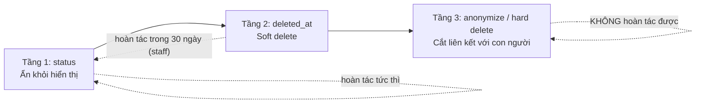

### 16.1 Ba tầng

| | Tầng 1 — `status` | Tầng 2 — `deleted_at` | Tầng 3 — anonymize / hard delete |
|---|---|---|---|
| **Cột** | `status`, `moderation_state`, `is_active` | `deleted_at timestamptz` | `anonymized_at`, hoặc xóa hàng |
| **Ai thấy** | Chủ sở hữu + staff | Chỉ staff (qua truy vấn có `withDeleted`) | Không ai — dữ liệu đã mất định danh |
| **Hoàn tác** | Tức thì, tự phục vụ | Được, trong 30 ngày, cần staff | **Không** |
| **Ai kích hoạt** | Người dùng, host, moderator | Người dùng (xóa nội dung), job dọn dẹp | Job theo lịch, hoặc yêu cầu xóa dữ liệu |
| **Toàn vẹn tham chiếu** | Nguyên vẹn | Nguyên vẹn (FK vẫn trỏ được) | Cắt: FK chuyển `NULL` hoặc trỏ tới hàng ẩn danh |
| **Ví dụ** | `events.status = 'archived'`, `comments.status = 'hidden'` | Người dùng xóa bình luận của mình | `users.anonymized_at` sau khi hết ân hạn |

Quy tắc kỹ thuật đi kèm (đã nêu ở §3.3, nhắc lại vì đây là chỗ nó phát huy tác dụng): **mọi UNIQUE trên bảng có `deleted_at` đều phải là partial unique `WHERE deleted_at IS NULL`.** Nếu không, tầng 2 sẽ biến thành cái bẫy — người dùng xóa mềm một RSVP hoặc một sự kiện rồi không bao giờ tạo lại được cái tương đương.

### 16.2 Ma trận xóa theo bảng

| Bảng | Tầng 1 | Tầng 2 (`deleted_at`) | Tầng 3 | Giữ bao lâu sau khi user rời đi |
|---|---|---|---|---|
| `users` | `status = 'deactivated'` | Có | Ẩn danh: email/phone/password_hash → NULL, gắn `anonymized_at` | Hàng **không xóa** (giữ toàn vẹn lịch sử), đã mất định danh |
| `profiles` | `visibility = 'private'` | Có | `display_name` → `Former member`, `handle` → `user_<8 ký tự ngẫu nhiên>`, bio/avatar/quốc tịch/năm sinh → NULL | Như trên |
| `social_accounts` | — | — | **Xóa cứng** ngay ở bước 1 | 0 |
| `auth_sessions` | `revoked_at` | — | **Xóa cứng** ngay ở bước 1 | 0 |
| `push_tokens` | `is_active = false` | — | **Xóa cứng** ngay ở bước 1 | 0 |
| `trust_signals` | — | — | Xóa cứng, trừ signal loại phạt còn hiệu lực | 0 (hoặc 90 ngày với `penalty_*`) |
| `events` | `status = 'archived'` | Có | `host_user_id` giữ nguyên (trỏ user ẩn danh); nếu chưa từng publish thì xóa cứng | Sự kiện đã diễn ra: giữ vô thời hạn dưới tên ẩn danh |
| `event_occurrences` | `status = 'cancelled'` | Có | Theo `events` | |
| `rsvps` | `status = 'cancelled'` | Có | Giữ hàng, `user_id` trỏ user ẩn danh; xóa `note_to_host`, `answers`, `guest_names` | Giữ để `event_occurrences` còn số liệu đúng |
| `waitlist_entries` | `state = 'withdrawn'` | — | Giữ hàng, mất định danh theo `users` | |
| `checkins` | `is_valid = false` | — | Xóa `location`, `device_id`; giữ dòng | 90 ngày cho cột vị trí |
| `comments` | `status = 'hidden'` | Có | `body` → `[deleted]`, `user_id` trỏ user ẩn danh | Chuỗi hội thoại giữ được mạch |
| `messages` | `status = 'hidden'` | Có | `body` → NULL, `media_id` → NULL sau **90 ngày** kể từ khi tài khoản bị ẩn danh | 90 ngày |
| `conversations` | `status = 'closed'` | Có | Xóa cứng nếu **cả hai** phía đã rời | |
| `reviews` | `status = 'hidden'` | Có | Giữ `rating` (đã nhập vào điểm tổng của người khác), xóa `body` | Vô thời hạn (dạng số) |
| `follows` | — | — | **Xóa cứng** | 0 |
| `blocks` | — | — | **Xóa cứng** khi cả hai phía đã rời; giữ nếu phía kia còn hoạt động | |
| `reports` | — | — | `reporter_user_id` → NULL; nội dung báo cáo **giữ nguyên** | **24 tháng** — hồ sơ an toàn |
| `moderation_actions` | — | — | Giữ nguyên toàn bộ; `actor_user_id` không bao giờ NULL | **24 tháng** tối thiểu |
| `appeals` | — | — | Giữ, mất định danh | 24 tháng |
| `notifications` | `archived_at` | — | **Xóa cứng** | 0 |
| `audit_logs` | — | — | **Giữ nguyên**; chỉ `ip` và `user_agent` bị NULL sau 90 ngày | 24 tháng, sau đó lưu trữ lạnh |
| `media` | `scan_status` | Có | Xóa object trên S3 + xóa hàng; **ảnh giấy tờ xác minh xóa ngay sau khi duyệt**, không chờ | 0 với giấy tờ |

### 16.3 Dữ liệu hết hạn theo lịch (không liên quan tới việc user rời đi)

| Dữ liệu | Thời hạn | Job |
|---|---|---|
| `auth_sessions.ip`, `auth_sessions.user_agent` | 90 ngày | `retention:purge-session-meta` |
| `audit_logs.ip`, `audit_logs.user_agent` | 90 ngày | `retention:purge-audit-meta` |
| `social_accounts.raw_profile` | 90 ngày | `retention:purge-oauth-raw` |
| `checkins.location` | 90 ngày | `retention:purge-checkin-geo` |
| `reports.reporter_ip` | 90 ngày | `retention:purge-report-ip` |
| Hàng `deleted_at IS NOT NULL` quá 30 ngày | 30 ngày | `retention:hard-delete-soft-deleted` |
| Phân vùng `audit_logs` quá 24 tháng | 24 tháng | `ops:partition-maintenance` (DETACH + xuất S3) |
| `notifications` đã đọc quá 180 ngày | 180 ngày | `retention:purge-notifications` |

### 16.4 Quy trình khi người dùng xóa tài khoản

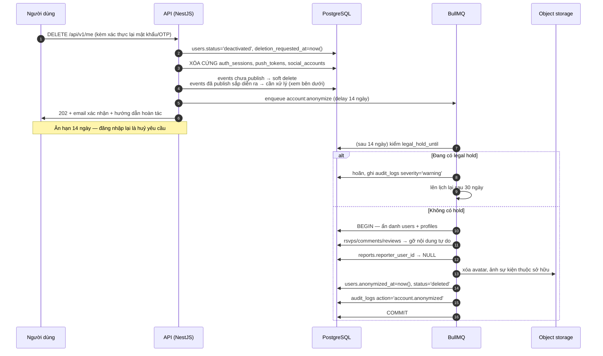

Xử lý các trường hợp vướng — phải hỏi người dùng **trước** khi nhận yêu cầu:

| Tình huống | Cách xử lý |
|---|---|
| Đang host sự kiện đã publish, còn occurrence sắp diễn ra và có người RSVP | Chặn xóa cho tới khi người dùng chọn: **(a)** chuyển quyền host cho một cohost `accepted`, hoặc **(b)** hủy sự kiện (hệ thống tự gửi thông báo cho người đã RSVP) |
| Đang có `reports` mở với vai trò người bị báo cáo | Đặt `legal_hold_until = sla_due_at + 30 ngày`; ân hạn kéo dài tương ứng và báo cho người dùng biết lý do |
| Có `moderation_actions` chưa hết hạn (đình chỉ, cấm) | Ẩn danh vẫn chạy nhưng **giữ nguyên** hành động và một khóa băm không thể đảo ngược của email/số điện thoại, để cùng người đó không lách bằng cách xóa rồi đăng ký lại |
| Có `appeals` đang mở | Hoãn tới khi khiếu nại kết thúc |

Câu SQL ẩn danh (chạy trong một transaction):

```sql
BEGIN;
UPDATE users SET
  email = NULL, phone = NULL, password_hash = NULL,
  email_verified_at = NULL, phone_verified_at = NULL,
  status = 'deleted', anonymized_at = now(), updated_at = now()
WHERE id = $1 AND (legal_hold_until IS NULL OR legal_hold_until < now());

UPDATE profiles SET
  handle = 'user_' || substr(md5(random()::text), 1, 8),
  display_name = 'Former member',
  headline = NULL, bio = NULL, avatar_media_id = NULL,
  nationality_code = NULL, birth_year = NULL, gender = 'prefer_not_to_say',
  spoken_languages = '[]'::jsonb, home_area_id = NULL,
  visibility = 'private', updated_at = now()
WHERE user_id = $1;

UPDATE rsvps    SET note_to_host = NULL, answers = NULL, guest_names = NULL WHERE user_id = $1;
UPDATE comments SET body = '[deleted]', status = 'removed'                   WHERE user_id = $1;
UPDATE reviews  SET body = NULL                                              WHERE author_user_id = $1;
UPDATE reports  SET reporter_user_id = NULL                                  WHERE reporter_user_id = $1;

DELETE FROM follows      WHERE follower_user_id = $1;
DELETE FROM push_tokens  WHERE user_id = $1;
DELETE FROM notifications WHERE user_id = $1;

INSERT INTO audit_logs (id, created_at, actor_type, action, entity_type, entity_id, severity, reason)
VALUES (gen_random_uuid(), now(), 'job', 'account.anonymized', 'user', $1, 'notice', 'user_request');
COMMIT;
```

Lưu ý kỹ thuật: `profiles.handle` mới có thể trùng (xác suất thấp nhưng khác 0) → bọc trong vòng lặp thử lại tối đa 5 lần khi gặp `23505`.

### 16.5 Cơ sở pháp lý — **CẦN LUẬT SƯ XÁC NHẬN**

| Vấn đề | Điều cần đối chiếu | Ghi chú |
|---|---|---|
| Văn bản áp dụng | **Luật Bảo vệ dữ liệu cá nhân 91/2025/QH15** và **Nghị định 13/2023/NĐ-CP** | Từ **01/01/2026**, Luật 91/2025 là văn bản có **hiệu lực pháp lý cao hơn**; **mọi mẫu biểu** (thông báo xử lý dữ liệu, mẫu đồng ý, mẫu yêu cầu xóa, hồ sơ đánh giá tác động) **phải theo Luật 91/2025**. Nghị định 13/2023 chỉ còn được viện dẫn ở phần chưa bị thay thế |
| Thời hạn thực hiện yêu cầu xóa | Nghị định 13/2023 nêu thời hạn **72 giờ** cho yêu cầu xóa dữ liệu | **Mâu thuẫn tiềm tàng với ân hạn 14 ngày ở §16.4.** Cách xử lý đề xuất: tách hai hành động khác nhau trên UI — *"Xóa dữ liệu cá nhân"* (thực hiện trong 72 giờ, không có ân hạn) và *"Đóng tài khoản"* (có ân hạn 14 ngày, người dùng chủ động chọn). Cần luật sư xác nhận cách tách này là hợp lệ |
| Dữ liệu giữ lại vì nghĩa vụ khác | `reports`, `moderation_actions`, `audit_logs` giữ 24 tháng | Cần xác nhận cơ sở pháp lý cho việc giữ (nghĩa vụ pháp lý / lợi ích hợp pháp) và cách thông báo cho chủ thể dữ liệu |
| Dữ liệu vị trí | `checkins.location`, `events.location` | Cần xác nhận có thuộc nhóm dữ liệu nhạy cảm hay không, và mức đồng ý cần thu thập |
| Chuyển dữ liệu ra nước ngoài | S3/CDN, Expo push, nhà cung cấp email | Cần hồ sơ đánh giá tác động chuyển dữ liệu ra nước ngoài theo mẫu của Luật 91/2025 |
| Người dưới 16 tuổi | `profiles.birth_year` | Nền tảng đặt sàn tuổi 16 trong điều khoản; cần xác nhận nghĩa vụ xác minh tuổi tới đâu |

Không triển khai phần này ra production trước khi có ý kiến luật sư bằng văn bản.

---

## 17. Danh sách extension PostgreSQL bắt buộc

Bảng dưới đây là bản hợp nhất của §3.1, có thêm cột phiên bản tối thiểu và ghi chú vận hành.

| Extension | Phiên bản tối thiểu | Bắt buộc v1 | Dùng cho | Có sẵn trên dịch vụ quản lý? |
|---|---|---|---|---|
| `postgis` | 3.4 | **Có** | `geography(Point,4326)`, `geography(MultiPolygon,4326)`, `ST_DWithin`, `ST_Contains`, `ST_Distance`, toán tử KNN `<->`, index GIST | Có (RDS/Cloud SQL/Supabase); **kiểm tra trước** vì đây là extension nặng nhất |
| `pgcrypto` | 1.3 | **Có** | `gen_random_uuid()` dự phòng khi seed bằng SQL, `digest()` để băm token và khóa chặn tái đăng ký | Có |
| `citext` | 1.6 | **Có** | `users.email`, `profiles.handle`, `areas.slug`, `events.slug` — so sánh không phân biệt hoa thường mà không cần `lower()` ở mọi truy vấn | Có |
| `unaccent` | 1.1 | **Có** | Bỏ dấu tiếng Việt cho tìm kiếm; bắt buộc bọc trong `f_unaccent` IMMUTABLE (§15.2) | Có |
| `pg_trgm` | 1.6 | **Có** | Autocomplete chịu lỗi chính tả: `idx_venues_name_trgm`, `idx_areas_name_trgm` | Có |
| `btree_gist` | 1.7 | Không (v1) | Ràng buộc loại trừ chống trùng lịch tại một địa điểm (`EXCLUDE USING gist`) — dự phòng cho GĐ2 | Có |
| `pg_stat_statements` | 1.10 | Khuyến nghị (ops) | Tìm truy vấn chậm ở production; bật qua `shared_preload_libraries` | Có, cần cấu hình tham số |

Thứ tự cài đặt trong migration đầu tiên (`0001_extensions.ts`) — phải chạy **trước** mọi migration tạo bảng, bằng vai trò có quyền `CREATE EXTENSION`:

```sql
CREATE EXTENSION IF NOT EXISTS postgis;
CREATE EXTENSION IF NOT EXISTS pgcrypto;
CREATE EXTENSION IF NOT EXISTS citext;
CREATE EXTENSION IF NOT EXISTS unaccent;
CREATE EXTENSION IF NOT EXISTS pg_trgm;
-- CREATE EXTENSION IF NOT EXISTS btree_gist;   -- bật khi cần EXCLUDE constraint (GĐ2)

-- Kiểm tra sau khi cài
SELECT extname, extversion FROM pg_extension ORDER BY extname;
SELECT postgis_full_version();
```

Ba lưu ý khi triển khai:

1. **Docker dev phải dùng image có PostGIS sẵn** (`postgis/postgis:16-3.4`), không dùng `postgres:16` rồi cài tay — nếu không, môi trường dev và production sẽ lệch phiên bản GEOS/PROJ và cho ra khoảng cách khác nhau ở chữ số thập phân.
2. **Nâng cấp PostGIS** phải chạy `SELECT postgis_extensions_upgrade();` rồi `REINDEX` các index GIST; đưa việc này vào runbook, không làm tay lúc sự cố.
3. `CREATE EXTENSION` cần quyền superuser hoặc `rds_superuser`. Trong CI, migration đầu tiên phải chạy bằng vai trò quản trị, còn ứng dụng chạy bằng vai trò `app_user` quyền thấp hơn (`REVOKE UPDATE, DELETE ON audit_logs FROM app_user` ở §10.4 chỉ có tác dụng khi hai vai trò này thật sự tách nhau).
