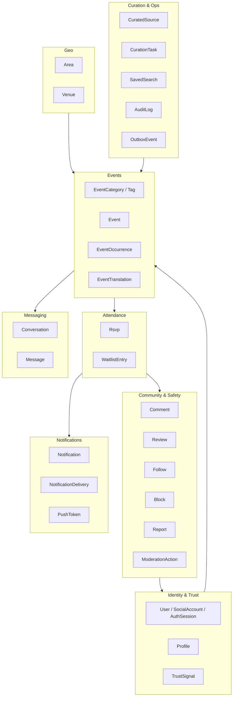

# Da Nang Connect — Domain Model & Lược đồ dữ liệu

> Tài liệu phân tích #03 · Phạm vi: Giai đoạn 1 (Kết nối cộng đồng), có chừa chỗ mở rộng cho Giai đoạn 2 (Nhà ở) và Giai đoạn 3 (Y tế / dịch vụ chuyên môn).
> Stack đã chốt: NestJS 11 + TypeORM + PostgreSQL 16 (PostGIS) + Redis/BullMQ · Next.js 15 · Expo 54 · socket.io · S3-compatible + CDN.
> Ngày cập nhật: 2026-08-31.

---

## 0. Tóm tắt các quyết định chốt

| # | Quyết định | Lựa chọn | Lý do ngắn gọn |
|---|---|---|---|
| D-01 | Khóa chính | `uuid` (UUIDv7 sinh ở tầng ứng dụng) | Sắp xếp được theo thời gian → index B-tree không phân mảnh; an toàn khi client tạo id offline (mobile) |
| D-02 | Tách `Event` và `EventOccurrence` | Bắt buộc, kể cả sự kiện một lần (1 event = 1 occurrence) | Sự kiện lặp lại (lớp tiếng Anh thứ Ba hàng tuần, cầu lông chiều thứ Năm) là ca phổ biến nhất của cộng đồng expat. RSVP luôn gắn vào **occurrence**, không gắn vào event |
| D-03 | Vị trí | `geography(Point,4326)` + index GIST | Tính khoảng cách bằng mét trực tiếp, `ST_DWithin` đúng trên mặt cầu, không phải tự chọn hệ chiếu |
| D-04 | Khu vực | Bảng `areas` phân cấp (city → district → ward → micro_area) + gán `area_id` lúc ghi | Expat nói chuyện bằng tên khu ("An Thượng", "Mỹ Khê"), không nói bằng bán kính |
| D-05 | Tìm kiếm | Postgres FTS (`tsvector`) + `unaccent` + `pg_trgm` | Quy mô một thành phố; chưa cần thêm dịch vụ vận hành |
| D-06 | Trạng thái (enum) | Native PostgreSQL `ENUM` cho state machine đóng, `varchar` + CHECK cho phân loại còn biến động | State machine tham gia vào index và ràng buộc; taxonomy còn thay đổi nhiều |
| D-07 | Ngôn ngữ nội dung | Nội dung do người dùng tạo: lưu 1 bản theo `content_locale` + bảng `event_translations` phụ; từ vựng hệ thống: cột `name_en`/`name_vi` | Không bắt organizer viết hai lần |
| D-08 | Thời gian | `timestamptz`, lưu UTC, connection ép `timezone = 'UTC'`; IANA zone lưu riêng | Không bao giờ hardcode `+07` trong logic nghiệp vụ |
| D-09 | Xóa | 3 tầng: `status` (ẩn) → `deleted_at` (soft delete) → anonymize/hard delete theo lịch | Giữ được toàn vẹn lịch sử tham gia và hồ sơ an toàn cộng đồng |
| D-10 | Đếm | Cột đếm phi chuẩn hóa (`rsvp_going_count`…) do trigger DB duy trì + job đối soát hằng đêm | Feed và danh sách đọc nhiều gấp bội ghi |
| D-11 | Curate thủ công | Bảng `curated_sources` + `curation_tasks` là công dân hạng nhất trong schema | Chiến lược ra mắt phụ thuộc vào nó; và phải ghi vết "nguồn này đã xin phép chưa" |
| D-12 | Không tự động thu thập dữ liệu | `collection_method` mặc định `manual_only`, có ràng buộc CHECK | Rủi ro pháp lý đã nêu trong brief; schema phải chặn từ gốc |

---

## 1. Phạm vi & nguyên tắc thiết kế

### 1.1 Bài toán mà lược đồ này phải giải

Đọc lại brief, có bốn nhu cầu dữ liệu nổi bật, và toàn bộ schema dưới đây được kéo về từ chúng:

1. **Tìm kiếm & lọc nâng cao** theo *loại hình · khu vực · thời gian · ngôn ngữ*. Đây là điểm khác biệt cốt lõi so với việc lướt feed. Nghĩa là bốn trục này phải là **cột có index**, không phải thuộc tính chôn trong JSON.
2. **RSVP có sức chứa** — "xem ai đã tham gia, số lượng chỗ còn lại". Nghĩa là cần đếm chính xác dưới truy cập đồng thời, và cần hàng đợi chờ.
3. **Hồ sơ có mức độ tin cậy** — "để tạo cảm giác an toàn khi gặp người lạ". Nghĩa là điểm tin cậy phải **suy ra được từ bằng chứng** (`TrustSignal`), không phải một con số ai đó gõ tay vào.
4. **Curate thủ công → chuyển giao cho organizer gốc** — "sự kiện của bạn đã có X người quan tâm, bạn có muốn tự quản lý listing này không?". Nghĩa là một `Event` phải biết mình đến từ đâu, đang *chưa có chủ*, và ai đang liên hệ với chủ thật.

Điểm số 4 là thứ hầu hết lược đồ sự kiện thông thường bỏ sót. Ở đây nó được mô hình hóa tường minh bằng `event.source`, `event.claim_status` và cặp bảng `curated_sources` / `curation_tasks`.

### 1.2 Nguyên tắc

- **Đơn vị nghiệp vụ nhỏ nhất là `EventOccurrence`, không phải `Event`.** Mọi thứ có tính thời điểm (RSVP, check-in, nhắc lịch, đánh giá, hàng đợi) đều móc vào occurrence.
- **Không polymorphic bừa bãi.** Chỉ 4 bảng dùng cặp `target_type` + `target_id`: `reports`, `follows`, `reviews`, `notifications` — vì tập đối tượng của chúng thực sự mở. Mọi chỗ khác dùng FK thật.
- **Mọi thứ hiển thị cho người lạ đều phải kiểm duyệt được.** `events`, `comments`, `reviews`, `venues`, `profiles`, `messages` đều có trường trạng thái cho phép ẩn mà không xóa.
- **An toàn cá nhân là ràng buộc dữ liệu, không phải tính năng phụ.** `location_precision`, `blocks`, `conversations.request_status`, `profiles.visibility` nằm ngay trong lược đồ v1.
- **Không lưu dữ liệu mình không dùng.** Không lưu lịch sử vị trí người dùng, không lưu ảnh giấy tờ sau khi xác minh xong (chỉ lưu kết quả `TrustSignal`).

### 1.3 Ngoài phạm vi v1 (nhưng schema chừa chỗ)

- Thanh toán / hoa hồng: `events.price_amount` + `price_currency` có sẵn nhưng chưa có bảng giao dịch.
- Nhà ở (GĐ2) và Dịch vụ chuyên môn (GĐ3): sẽ là các bounded context riêng (`listings`, `providers`), dùng chung `users`, `areas`, `venues`, `reviews`, `reports`, `conversations`.
- Đa thành phố: `areas` đã phân cấp từ `city` nên mở rộng chỉ là thêm cây con; nhưng v1 **chỉ seed Đà Nẵng**.

---

## 2. Bản đồ module (bounded context)



Ánh xạ sang module NestJS: mỗi subgraph là một `@Module()` với thư mục `src/modules/<name>/{entities,dto,services,controllers}`. Bảng dùng chung (`users`, `areas`) được export qua `TypeOrmModule.forFeature` chứ không nhân bản entity.

---

## 3. Quy ước kỹ thuật chung

### 3.1 Extensions PostgreSQL cần bật

| Extension | Dùng cho | Bắt buộc v1 |
|---|---|---|
| `postgis` | `geography(Point,4326)`, `ST_DWithin`, `ST_Distance`, index GIST | Có |
| `pgcrypto` | `gen_random_uuid()` dự phòng, hash token | Có |
| `citext` | Email / handle không phân biệt hoa thường | Có |
| `unaccent` | Gõ "an thuong" vẫn ra "An Thượng" | Có |
| `pg_trgm` | Gợi ý gõ tắt, chịu lỗi chính tả nhẹ | Có |
| `btree_gist` | Ràng buộc loại trừ (chống trùng lịch) — dự phòng GĐ2 | Không |

```sql
CREATE EXTENSION IF NOT EXISTS postgis;
CREATE EXTENSION IF NOT EXISTS pgcrypto;
CREATE EXTENSION IF NOT EXISTS citext;
CREATE EXTENSION IF NOT EXISTS unaccent;
CREATE EXTENSION IF NOT EXISTS pg_trgm;
```

Lưu ý: `unaccent` mặc định là `STABLE`, không dùng trực tiếp trong generated column được. Cách xử lý ở mục 15.2.

### 3.2 Quy ước đặt tên

| Đối tượng | Quy ước | Ví dụ |
|---|---|---|
| Class entity | PascalCase, số ít | `EventOccurrence` |
| Tên bảng | snake_case, số nhiều | `event_occurrences` |
| Tên cột | snake_case | `rsvp_going_count` |
| Thuộc tính TS | camelCase | `rsvpGoingCount` |
| Khóa ngoại | `<entity_số_ít>_id` | `host_user_id`, `occurrence_id` |
| Enum TS | PascalCase + hậu tố mô tả | `EventStatus`, `RsvpStatus` |
| Enum Postgres | snake_case + hậu tố `_enum` | `event_status_enum` |
| Index | `idx_<bảng>_<cột…>` | `idx_events_area_status` |
| Unique index | `uq_<bảng>_<cột…>` | `uq_rsvps_occurrence_user` |
| Ràng buộc CHECK | `ck_<bảng>_<ý nghĩa>` | `ck_events_capacity_positive` |

`SnakeNamingStrategy` được bật ở `DataSource` để không phải viết `name:` cho từng cột:

```ts
// src/database/data-source.ts
import { DataSource } from 'typeorm';
import { SnakeNamingStrategy } from 'typeorm-naming-strategies';

export const AppDataSource = new DataSource({
  type: 'postgres',
  namingStrategy: new SnakeNamingStrategy(),
  synchronize: false,               // luôn dùng migration, kể cả ở dev
  migrationsTransactionMode: 'each',
  extra: { options: '-c timezone=UTC' },
});
```

### 3.3 Base entity

```ts
// src/common/entities/base.entity.ts
import {
  PrimaryColumn, CreateDateColumn, UpdateDateColumn,
  DeleteDateColumn, BeforeInsert, VersionColumn,
} from 'typeorm';
import { uuidv7 } from 'uuidv7';

export abstract class BaseEntity {
  @PrimaryColumn('uuid')
  id: string;

  @BeforeInsert()
  protected assignId(): void {
    if (!this.id) this.id = uuidv7();
  }

  @CreateDateColumn({ type: 'timestamptz' })
  createdAt: Date;

  @UpdateDateColumn({ type: 'timestamptz' })
  updatedAt: Date;
}

export abstract class SoftDeletableEntity extends BaseEntity {
  @DeleteDateColumn({ type: 'timestamptz', nullable: true })
  deletedAt: Date | null;

  @VersionColumn({ default: 1 })
  version: number;   // optimistic locking cho các bảng bị sửa đồng thời
}
```

**Bẫy cần nhớ:** khi dùng `@DeleteDateColumn`, mọi UNIQUE phải là *partial unique index* `WHERE deleted_at IS NULL`, nếu không người dùng sẽ không tạo lại được bản ghi đã xóa mềm. Tất cả UNIQUE trong tài liệu này đều ngầm hiểu như vậy trừ khi ghi chú khác.

### 3.4 Quy ước kiểu dữ liệu

| Loại nghiệp vụ | Kiểu Postgres | Kiểu TS | Ghi chú |
|---|---|---|---|
| Mốc thời gian | `timestamptz` | `Date` | Luôn UTC |
| Ngày địa phương | `date` | `string` (`YYYY-MM-DD`) | Chỉ dùng cho gom nhóm theo ngày Đà Nẵng |
| Tiền | `integer` (VND, không phần lẻ) | `number` | VND không có đơn vị nhỏ hơn |
| Mã ngôn ngữ | `varchar(5)` | `'en' \| 'vi' \| ...` | BCP-47 rút gọn |
| Mã quốc gia | `char(2)` | `string` | ISO 3166-1 alpha-2 |
| Tọa độ | `geography(Point,4326)` | `{ type: 'Point'; coordinates: [lng, lat] }` | **GeoJSON là `[lng, lat]`**, ngược với thói quen đọc "lat, lng" |
| Cấu hình mở | `jsonb` | interface có validate bằng `class-validator` | Không bao giờ dùng jsonb cho thứ cần lọc/index thường xuyên |
| Danh sách ngắn cố định | `varchar[]` | `string[]` | Ví dụ `languages` của sự kiện |

---

## 4. Nhóm A — Danh tính, hồ sơ & độ tin cậy

### 4.1 `users` — `User`

| Cột | Kiểu Postgres | Kiểu TS | Ràng buộc | Ghi chú |
|---|---|---|---|---|
| `id` | uuid | string | PK | UUIDv7 |
| `email` | citext | string \| null | UNIQUE (partial) | Null nếu chỉ đăng nhập bằng social |
| `email_verified_at` | timestamptz | Date \| null | | Sinh `TrustSignal` khi được set |
| `phone` | varchar(20) | string \| null | UNIQUE (partial) | E.164, ví dụ `+84905123456` |
| `phone_verified_at` | timestamptz | Date \| null | | |
| `password_hash` | varchar(255) | string \| null | | Argon2id; null nếu social-only |
| `role` | `user_role_enum` | `UserRole` | NOT NULL, default `member` | Enum toàn cục, **đúng 5 giá trị**: `member` \| `curator` \| `moderator` \| `admin` \| `super_admin` |
| `trust_level` | smallint | number | NOT NULL, default `0`, CHECK `BETWEEN 0 AND 5` | Bậc tin cậy T0–T5. **Đây là nguồn sự thật duy nhất về bậc tin cậy**; job BullMQ `trust:recompute` ghi lại giá trị này |
| `trust_level_changed_at` | timestamptz | Date \| null | | Dùng để chống dao động bậc và để gửi thông báo `trust_level_up` |
| `status` | `user_status_enum` | `UserStatus` | NOT NULL, default `pending` | `pending` \| `active` \| `suspended` \| `deactivated` \| `deleted` |
| `locale` | varchar(5) | string | NOT NULL, default `'en'` | Ngôn ngữ UI ưa thích |
| `timezone` | varchar(64) | string | NOT NULL, default `'Asia/Ho_Chi_Minh'` | IANA name |
| `suspended_until` | timestamptz | Date \| null | | Đình chỉ có thời hạn từ kiểm duyệt |
| `suspension_reason` | varchar(255) | string \| null | | |
| `last_active_at` | timestamptz | Date \| null | | Cập nhật tối đa 1 lần/15 phút để tránh ghi nóng |
| `deletion_requested_at` | timestamptz | Date \| null | | Bắt đầu thời gian ân hạn 14 ngày |
| `anonymized_at` | timestamptz | Date \| null | | Đã chạy xong job ẩn danh |
| `legal_hold_until` | timestamptz | Date \| null | | Chặn ẩn danh khi đang có vụ việc an toàn |
| `created_at` / `updated_at` / `deleted_at` | timestamptz | Date | | |

Index:

```sql
CREATE UNIQUE INDEX uq_users_email ON users (email) WHERE deleted_at IS NULL;
CREATE UNIQUE INDEX uq_users_phone ON users (phone) WHERE deleted_at IS NULL AND phone IS NOT NULL;
CREATE INDEX idx_users_status_active ON users (status) WHERE deleted_at IS NULL;
CREATE INDEX idx_users_deletion_due ON users (deletion_requested_at)
  WHERE deletion_requested_at IS NOT NULL AND anonymized_at IS NULL;
```

Ghi chú thiết kế — bốn thứ **không** phải giá trị của `users.role`:

| Khái niệm | Nó thực sự là gì | Lưu ở đâu |
|---|---|---|
| `guest` | Trạng thái **chưa đăng nhập**, không có hàng nào trong `users` | Không lưu — suy ra từ việc không có access token |
| `organizer` | **Quan hệ theo từng sự kiện**: một user là organizer của những sự kiện mình tạo | `events.host_user_id` và bảng `event_cohosts` (§5.2, §5.4) |
| `verified_member` | **Trust level**, không phải quyền | `users.trust_level` (T0–T5, §4.5) |
| `support` | Đã **gộp vào** `moderator` | `users.role = 'moderator'` |

Vì vậy guard RBAC luôn kiểm tra **tổ hợp ba chiều**: `users.role` (toàn cục) + quan hệ theo sự kiện (`host_user_id` / `event_cohosts`) + `users.trust_level`. Brief nói rõ "bất kỳ user nào cũng có thể tạo" sự kiện, nên "organizer" không thể là quyền hệ thống. `curator` là vai trò nội bộ cho đội sáng lập giai đoạn curate thủ công; `super_admin` là vai trò duy nhất có quyền huỷ hoại (xoá vĩnh viễn, đổi role người khác).

### 4.2 `social_accounts` — `SocialAccount`

| Cột | Kiểu | Ràng buộc | Ghi chú |
|---|---|---|---|
| `id` | uuid | PK | |
| `user_id` | uuid | FK → users, ON DELETE CASCADE | |
| `provider` | `social_provider_enum` | NOT NULL | `google` \| `apple` \| `facebook` |
| `provider_user_id` | varchar(191) | NOT NULL | `sub` của provider |
| `email_at_provider` | citext | | Có thể là email ẩn danh của Apple (`privaterelay.appleid.com`) |
| `display_name_at_provider` | varchar(120) | | Chỉ dùng gợi ý điền hồ sơ lần đầu |
| `avatar_url_at_provider` | varchar(500) | | Tải về S3 một lần, không hotlink |
| `linked_at` / `last_login_at` | timestamptz | | |
| `raw_profile` | jsonb | | Purge sau 90 ngày |

```sql
CREATE UNIQUE INDEX uq_social_accounts_provider_uid ON social_accounts (provider, provider_user_id);
CREATE UNIQUE INDEX uq_social_accounts_user_provider ON social_accounts (user_id, provider);
```

Nhắc lại ràng buộc App Store: iOS có Google/Facebook login thì **bắt buộc** có Apple Sign-In. Apple có thể trả email chuyển tiếp riêng tư → không được coi email là khóa hợp nhất tài khoản duy nhất; hợp nhất theo `provider_user_id` trước, email chỉ là gợi ý cần người dùng xác nhận.

### 4.3 `auth_sessions` — `AuthSession` (refresh token)

| Cột | Kiểu | Ghi chú |
|---|---|---|
| `id` | uuid | PK, đồng thời là `jti` của refresh token |
| `user_id` | uuid | FK → users, CASCADE |
| `token_hash` | varchar(64) | SHA-256 của refresh token — **không lưu token thô** |
| `family_id` | uuid | Nhóm xoay vòng token; phát hiện tái sử dụng → thu hồi cả họ |
| `device_id` | varchar(191) | Từ Expo `Device` / fingerprint web |
| `platform` | `platform_enum` | `ios` \| `android` \| `web` |
| `app_version` | varchar(32) | |
| `ip` | inet | Purge sau 90 ngày |
| `user_agent` | varchar(255) | Purge sau 90 ngày |
| `expires_at` | timestamptz | |
| `revoked_at` | timestamptz | |
| `revoked_reason` | varchar(64) | `logout` \| `rotation_reuse` \| `password_change` \| `admin` \| `account_deletion` |

### 4.4 `profiles` — `Profile` (1–1 với User)

| Cột | Kiểu Postgres | Kiểu TS | Ghi chú |
|---|---|---|---|
| `user_id` | uuid | string | **PK đồng thời là FK** → users, CASCADE |
| `handle` | citext | string | UNIQUE, `^[a-z0-9_]{3,24}$`, dùng cho URL public |
| `display_name` | varchar(60) | string | NOT NULL |
| `headline` | varchar(120) | string \| null | "Yoga teacher · An Thuong" |
| `bio` | text | string \| null | Tối đa 1000 ký tự (kiểm ở DTO) |
| `bio_locale` | varchar(5) | string \| null | Ngôn ngữ người dùng viết bio |
| `avatar_media_id` | uuid | string \| null | FK → media, SET NULL |
| `nationality_code` | char(2) | string \| null | ISO 3166-1 |
| `spoken_languages` | jsonb | `{code,level}[]` | `[{"code":"en","level":"native"},{"code":"vi","level":"basic"}]` |
| `expat_type` | `expat_type_enum` | `ExpatType` | `digital_nomad` \| `long_term_resident` \| `student` \| `teacher` \| `business_owner` \| `short_stay` \| `local_host` |
| `home_area_id` | uuid | string \| null | FK → areas, SET NULL — khu vực người dùng ở |
| `in_da_nang_since` | date | string \| null | "In Da Nang since 03/2024" |
| `birth_year` | smallint | number \| null | Chỉ hiển thị khoảng tuổi, không hiển thị ngày sinh |
| `gender` | `gender_enum` | | `female` \| `male` \| `non_binary` \| `prefer_not_to_say` |
| `visibility` | `profile_visibility_enum` | | `public` \| `members_only` \| `private` |
| `show_area_publicly` | boolean | | Mặc định `true` cho district, `false` cho micro-area |
| `trust_points` | integer | number | Tổng thô các `trust_signals.weight` đã verify. **Chỉ dùng nội bộ** để suy ra bậc T0–T5, không hiển thị cho người dùng, không có trần 100 |
| ~~`trust_level`~~ | — | — | **Đã chuyển lên `users.trust_level` (smallint 0–5)** — xem §4.1 và §4.5. Profile không giữ bản sao để tránh hai nguồn sự thật |
| `trust_recomputed_at` | timestamptz | | |
| `events_hosted_count` | integer | | Phi chuẩn hóa |
| `events_attended_count` | integer | | Chỉ đếm `checked_in` |
| `no_show_count` | integer | | Hiển thị gián tiếp qua trust level, không phơi số thô |
| `rating_avg` | numeric(3,2) | | Chỉ hiện khi `rating_count >= 3` |
| `rating_count` | integer | | |
| `interests` | — | | Qua bảng nối `profile_interests` |
| `search_vector` | tsvector | | Do trigger duy trì |

```sql
CREATE UNIQUE INDEX uq_profiles_handle ON profiles (handle);
CREATE INDEX idx_profiles_home_area ON profiles (home_area_id) WHERE visibility = 'public';
CREATE INDEX idx_profiles_search ON profiles USING GIN (search_vector);
```

Bảng nối sở thích:

```
profile_interests (user_id uuid FK, category_id uuid FK, weight smallint default 1, PRIMARY KEY (user_id, category_id))
```

### 4.5 `trust_signals` — `TrustSignal` (append-only)

Đây là bảng chứng cứ cho "mức độ tin cậy" trong brief. `users.trust_level` và `profiles.trust_points` chỉ là bản cache đọc nhanh; **nguồn sự thật nằm ở đây** — bảng append-only, không UPDATE trừ hai cột `revoked_at` / `revoked_reason`.

| Cột | Kiểu | Ghi chú |
|---|---|---|
| `id` | uuid | PK |
| `user_id` | uuid | FK → users, CASCADE |
| `type` | `trust_signal_type_enum` | Xem bảng trọng số bên dưới |
| `status` | `trust_signal_status_enum` | `pending` \| `verified` \| `rejected` \| `expired` \| `revoked` |
| `weight` | smallint | Có thể âm (hình phạt) |
| `evidence_type` | varchar(40) | `event` \| `review` \| `document` \| `oauth` \| `manual` |
| `evidence_id` | uuid \| null | Không đặt FK vì trỏ nhiều bảng |
| `issued_by_user_id` | uuid \| null | Staff xác minh, hoặc người bảo lãnh (`community_vouch`) |
| `metadata` | jsonb | Ví dụ `{ "provider": "google" }`, `{ "occurrence_id": "..." }` |
| `verified_at` | timestamptz | |
| `expires_at` | timestamptz \| null | Ví dụ hộ chiếu hết hạn |
| `revoked_at` / `revoked_reason` | timestamptz / varchar(255) | |
| `created_at` | timestamptz | |

Bảng trọng số đề xuất cho v1 (điều chỉnh được qua config, không hardcode trong migration):

| `type` | weight | Điều kiện phát sinh |
|---|---|---|
| `email_verified` | +8 | Click link xác minh |
| `phone_verified` | +12 | OTP SMS |
| `social_google` / `social_facebook` | +6 | Liên kết tài khoản |
| `social_apple` | +6 | Liên kết tài khoản |
| `id_document` | +25 | Nhân viên duyệt thủ công; **xóa ảnh giấy tờ ngay sau khi duyệt** |
| `profile_completed` | +5 | Có avatar + bio + ≥1 ngôn ngữ + khu vực |
| `attended_event` | +2 (trần +20) | Mỗi lần `checked_in` |
| `hosted_event_completed` | +5 (trần +30) | Occurrence do mình host chuyển sang `completed` với ≥3 người check-in |
| `positive_review` | +3 (trần +24) | Mỗi review ≥4 sao đã publish |
| `community_vouch` | +4 (trần +12) | Người có `users.trust_level >= 4` (T4 Trusted) bảo lãnh |
| `staff_endorsement` | +15 | Đội sáng lập xác nhận (organizer đã curate) |
| `penalty_no_show` | −4 | Mỗi lần `no_show` (chỉ tính 90 ngày gần nhất) |
| `penalty_report_upheld` | −20 | Báo cáo bị xử lý bất lợi |

#### Thang bậc tin cậy T0–T5 (chuẩn duy nhất)

`users.trust_level` là `smallint` nhận đúng 6 giá trị. Bậc **không** được tính chỉ bằng điểm — mỗi bậc có **điều kiện cứng** (signal bắt buộc) đi kèm ngưỡng `trust_points`. Đây là lý do phải giữ `trust_signals` thay vì một con số duy nhất.

| Bậc | Nhãn hiển thị (i18n key) | Điều kiện cứng (bắt buộc có đủ) | Ngưỡng `trust_points` |
|---|---|---|---|
| 0 | T0 New — `trust.level.0` | Mặc định khi tạo tài khoản | — |
| 1 | T1 Email verified — `trust.level.1` | `email_verified` **hoặc** một trong `social_google` / `social_apple` / `social_facebook` | ≥ 6 |
| 2 | T2 Phone verified — `trust.level.2` | T1 **và** `phone_verified` | ≥ 20 |
| 3 | T3 Active member — `trust.level.3` | T2 **và** (`profile_completed` **và** ≥ 2 signal `attended_event`) | ≥ 35 |
| 4 | T4 Trusted — `trust.level.4` | T3 **và** (`id_document` **hoặc** ≥ 3 `positive_review` **hoặc** ≥ 2 `hosted_event_completed`) | ≥ 60 |
| 5 | T5 Community leader — `trust.level.5` | T4 **và** `staff_endorsement` | ≥ 85 |

Công thức điểm nội bộ (không hiển thị, không có trần 100):

```sql
trust_points = GREATEST(0, SUM(weight) FILTER (
  WHERE status = 'verified'
    AND revoked_at IS NULL
    AND (expires_at IS NULL OR expires_at > now())
))
```

Quy tắc vận hành:

- Job BullMQ `trust:recompute` chạy khi có signal mới (debounce 30 giây/user) và quét toàn bộ hằng đêm lúc 03:00 `Asia/Ho_Chi_Minh` để hạ bậc các signal hết hạn.
- **Chỉ tăng một bậc mỗi lần chạy**, và **hạ bậc thì hạ thẳng** về bậc mà điều kiện cứng còn thoả — tránh nhấp nháy badge.
- Mất điều kiện cứng thì mất bậc, kể cả khi `trust_points` vẫn cao (ví dụ `id_document` hết hạn → rơi từ T4 về T3).
- Mỗi lần `users.trust_level` đổi: ghi `audit_logs` (`action = 'user.trust_level_changed'`) và cập nhật `trust_level_changed_at`.

```sql
CREATE INDEX idx_trust_signals_user_active ON trust_signals (user_id)
  WHERE status = 'verified' AND revoked_at IS NULL;
CREATE UNIQUE INDEX uq_trust_signals_unique_kind ON trust_signals (user_id, type)
  WHERE type IN ('email_verified','phone_verified','id_document','profile_completed')
    AND status = 'verified';
```

### 4.6 `push_tokens` — `PushToken`

| Cột | Kiểu | Ghi chú |
|---|---|---|
| `id` | uuid | PK |
| `user_id` | uuid | FK → users, CASCADE |
| `expo_push_token` | varchar(255) | UNIQUE — `ExponentPushToken[...]` |
| `device_id` | varchar(191) | Một thiết bị chỉ giữ 1 token hoạt động |
| `platform` | `platform_enum` | `ios` \| `android` \| `web` |
| `app_version` / `os_version` | varchar(32) | Dùng để gỡ lỗi vùng phủ |
| `locale` | varchar(5) | Ngôn ngữ render nội dung push cho thiết bị này |
| `is_active` | boolean | |
| `failure_count` | smallint | Đạt 3 lần `DeviceNotRegistered` → `is_active = false` |
| `disabled_reason` | varchar(64) | `device_not_registered` \| `logout` \| `user_disabled` \| `account_deleted` |
| `last_used_at` | timestamptz | Token không dùng 180 ngày → dọn |

```sql
CREATE UNIQUE INDEX uq_push_tokens_token ON push_tokens (expo_push_token);
CREATE INDEX idx_push_tokens_user_active ON push_tokens (user_id) WHERE is_active;
```

### 4.7 `notification_preferences` — `NotificationPreference`

| Cột | Kiểu | Ghi chú |
|---|---|---|
| `user_id` | uuid | PK phần 1, FK → users CASCADE |
| `topic` | `notification_topic_enum` | PK phần 2 — `event_reminder`, `rsvp_activity`, `waitlist`, `messages`, `comments`, `follows`, `reviews`, `weekly_digest`, `product_updates` |
| `push_enabled` / `email_enabled` / `in_app_enabled` | boolean | |
| `quiet_hours_start` / `quiet_hours_end` | time | Diễn giải theo `users.timezone` |
| `digest_frequency` | `digest_frequency_enum` | `off` \| `daily` \| `weekly` |
| `updated_at` | timestamptz | |

Mặc định được sinh sẵn khi tạo user (seed 9 dòng), tránh phân biệt "chưa cấu hình" và "đã tắt".

---
