# 04 — Tech Stack & Kiến trúc — Da Nang Connect

> **Trạng thái:** Chốt phương án cho Giai đoạn 1 (Kết nối cộng đồng), có tính đến đường mở rộng Giai đoạn 2 (Nhà ở) và Giai đoạn 3 (Y tế / dịch vụ chuyên môn).
> **Ngày:** 2026-08-31
> **Phạm vi địa lý:** chỉ Đà Nẵng.
> **Ngôn ngữ sản phẩm:** English là mặc định (người dùng chính là expat), Tiếng Việt là ngôn ngữ thứ hai. i18n bật từ dòng code đầu tiên.
> **Đối tượng đọc:** kỹ sư tham gia dự án, người đánh giá kỹ thuật, người ra quyết định ngân sách hạ tầng.

---

## Mục lục

1. [Tóm tắt điều hành — bảng chốt stack](#1-tóm-tắt-điều-hành--bảng-chốt-stack)
2. [Nguyên tắc kiến trúc](#2-nguyên-tắc-kiến-trúc)
3. [Sơ đồ kiến trúc tổng thể](#3-sơ-đồ-kiến-trúc-tổng-thể)
4. [Giải trình lựa chọn công nghệ theo từng lớp](#4-giải-trình-lựa-chọn-công-nghệ-theo-từng-lớp)
5. [Cấu trúc monorepo](#5-cấu-trúc-monorepo)
6. [Quy ước API](#6-quy-ước-api)
7. [Chiến lược xác thực và định danh](#7-chiến-lược-xác-thực-và-định-danh)
8. [Realtime và Push Notification](#8-realtime-và-push-notification)
9. [Dữ liệu địa lý — khu vực Đà Nẵng và PostGIS](#9-dữ-liệu-địa-lý--khu-vực-đà-nẵng-và-postgis)
10. [Môi trường và biến môi trường](#10-môi-trường-và-biến-môi-trường)
11. [Chiến lược migration TypeORM](#11-chiến-lược-migration-typeorm)
12. [CI/CD](#12-cicd)
13. [Ước tính chi phí hạ tầng](#13-ước-tính-chi-phí-hạ-tầng)
14. [Quyết định hosting — Việt Nam hay nước ngoài](#14-quyết-định-hosting--việt-nam-hay-nước-ngoài)
15. [Bảo mật, quyền riêng tư và tuân thủ](#15-bảo-mật-quyền-riêng-tư-và-tuân-thủ)
16. [Quan sát hệ thống](#16-quan-sát-hệ-thống)
17. [Rủi ro kỹ thuật và cách giảm thiểu](#17-rủi-ro-kỹ-thuật-và-cách-giảm-thiểu)
18. [Đường tiến hoá kiến trúc theo giai đoạn](#18-đường-tiến-hoá-kiến-trúc-theo-giai-đoạn)
19. [Nhật ký quyết định kiến trúc](#19-nhật-ký-quyết-định-kiến-trúc-adr-log)

---

## 1. Tóm tắt điều hành — bảng chốt stack

| Lớp | Công nghệ chốt | Phiên bản | Ghi chú ngắn |
|---|---|---|---|
| Runtime | Node.js | 22.x LTS | LTS tới 04/2027, hỗ trợ đầy đủ ESM + `node:test`, hiệu năng ổn định |
| Backend framework | NestJS | 11.x | Module hoá rõ ràng, DI, decorator, Swagger sẵn |
| ORM | TypeORM | 0.3.2x | DataSource API, migration CLI, hỗ trợ raw SQL khi cần PostGIS |
| CSDL chính | PostgreSQL | 16.x | Ổn định, `pg_stat_io`, logical replication tốt |
| Mở rộng địa lý | PostGIS | 3.4.x | Truy vấn theo khu vực và bán kính (`ST_DWithin`, `ST_Contains`) |
| Cache / hàng đợi | Redis | 7.4.x | Cache, rate limit, pub/sub cho socket, backend cho BullMQ |
| Job queue | BullMQ | 5.x | Push notification, xử lý ảnh, email, digest hàng tuần |
| Realtime | Socket.IO | 4.8.x | Có `@socket.io/redis-adapter` để scale ngang |
| Web | Next.js + React | 15.x / 19.x | App Router, RSC, SEO cho trang sự kiện công khai |
| CSS | Tailwind CSS | 4.x | Tốc độ dựng UI, dễ chia sẻ design token |
| Mobile | Expo + React Native | 54 / 0.81 | Một codebase iOS + Android, EAS Build/Submit, OTA update |
| Điều hướng mobile | Expo Router | 6.x | File-based routing, deep link/universal link gọn |
| Bản đồ web | Leaflet + react-leaflet | 1.9.x / 5.x | Nhẹ, không khoá vào nhà cung cấp, tile OSM |
| Bản đồ mobile | react-native-maps | 1.2x | Native map, cluster tốt, hỗ trợ Google/Apple provider |
| Xác thực | JWT RS256 + refresh token xoay vòng | — | Access 15 phút, refresh 30 ngày, phát hiện tái sử dụng |
| Social login | Google, Apple, Facebook | — | Apple Sign-In bắt buộc trên iOS khi có social login khác |
| Push | Expo Push Service → APNs/FCM | — | Một API duy nhất cho cả hai nền tảng |
| Lưu trữ file | S3-compatible object storage | — | Presigned upload, không cho file đi qua API |
| CDN | CDN có POP tại Việt Nam | — | Ảnh sự kiện và avatar phục vụ qua CDN, không qua origin |
| Đóng gói | Docker + Docker Compose | 27.x / v2 | Cùng một image chạy ở staging và production |
| CI/CD | GitHub Actions + EAS | — | Lint/test/build/migrate/deploy tự động |
| Theo dõi lỗi | Sentry | SDK 9.x | Backend + web + mobile, có source map |
| Quản lý monorepo | pnpm workspace + Turborepo | pnpm 10.x / turbo 2.x | Cache build, chạy task song song theo đồ thị phụ thuộc |

**Ba quyết định lớn nhất trong tài liệu này:**

1. **Monolith module hoá, không microservices.** Giai đoạn 1 có một đội nhỏ và một miền nghiệp vụ duy nhất. Một NestJS app chia module rõ ràng chạy nhanh hơn, rẻ hơn và dễ sửa hơn nhiều so với 5 service nói chuyện qua mạng. Ranh giới module được vẽ đủ sạch để tách ra sau nếu cần.
2. **Hosting đặt tại Việt Nam ngay từ đầu** (chi tiết ở [mục 14](#14-quyết-định-hosting--việt-nam-hay-nước-ngoài)). Lý do chính không phải giá mà là độ trễ khi đứt cáp quang biển và nghĩa vụ lưu trữ dữ liệu cá nhân trong nước.
3. **Xác thực số điện thoại dùng định tuyến lai theo mã quốc gia**: số `+84` đi qua nhà cung cấp Việt Nam (rẻ 3-5 lần), số quốc tế đi qua nhà cung cấp toàn cầu. Cộng đồng expat có cả hai loại số, không thể chọn một nhà cung cấp duy nhất.

---

## 2. Nguyên tắc kiến trúc

Bảy nguyên tắc dưới đây là bộ lọc để giải quyết mọi tranh luận kỹ thuật sau này.

| # | Nguyên tắc | Hệ quả cụ thể |
|---|---|---|
| 1 | **Đơn giản trước, chia nhỏ sau** | Một backend, một database, một Redis. Chỉ tách service khi có số đo chứng minh nút thắt, không tách theo cảm tính. |
| 2 | **Một nguồn sự thật cho kiểu dữ liệu** | Kiểu dữ liệu API sinh từ OpenAPI của backend, dùng chung ở web và mobile qua `packages/api-client`. Không gõ tay interface hai lần. |
| 3 | **Không có gì chạy chỉ trên máy lập trình viên** | Mọi phụ thuộc hạ tầng có trong `docker-compose.yml`. Người mới `pnpm install && docker compose up` là chạy được. |
| 4 | **Ảnh không bao giờ đi qua API** | Client xin presigned URL rồi tải thẳng lên object storage. API chỉ nhận và xác thực khoá file. |
| 5 | **Việc chậm thì đẩy vào hàng đợi** | Gửi push, resize ảnh, gửi email, tính lại điểm tin cậy đều là job BullMQ. Request HTTP luôn dưới 300ms p95. |
| 6 | **i18n từ commit đầu tiên** | Không hardcode chuỗi. Mọi text đi qua key i18n. Thêm tiếng Việt về sau là thêm file, không phải sửa code. |
| 7 | **Portable hơn là tối ưu nhà cung cấp** | Ưu tiên chuẩn mở: S3 API, Postgres, Redis, OSM. Tránh khoá cứng vào dịch vụ độc quyền để có thể đổi nhà cung cấp hạ tầng mà không viết lại. |

---

## 3. Sơ đồ kiến trúc tổng thể

### 3.1 Sơ đồ triển khai

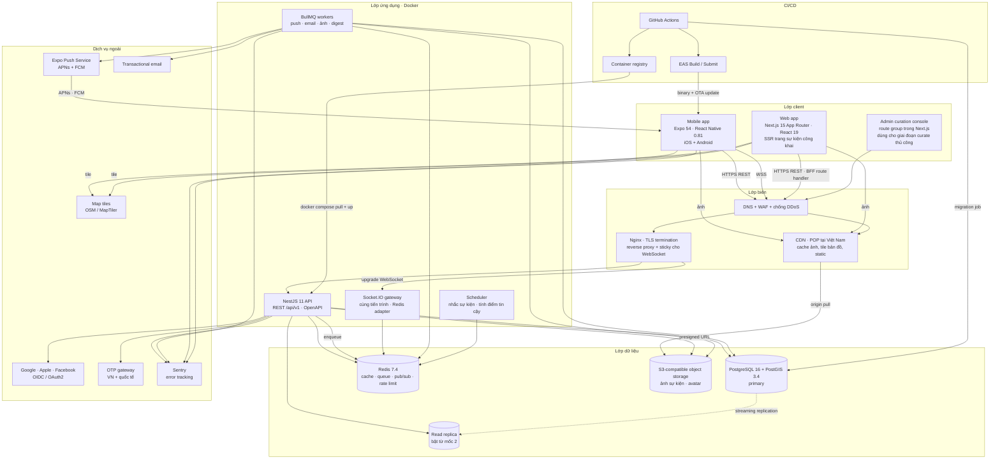

### 3.2 Ranh giới module backend

Monolith nhưng có ranh giới. Sơ đồ dưới là bản đồ module của `apps/api` ở Giai đoạn 1, kèm hai module đã dành chỗ cho Giai đoạn 2-3.

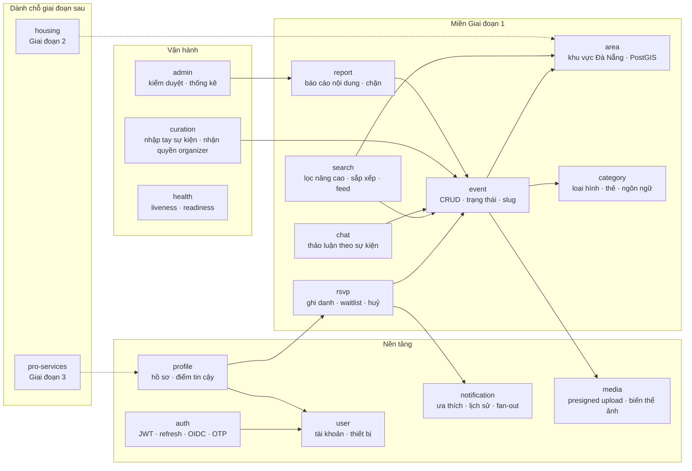

Quy tắc phụ thuộc: mũi tên chỉ đi một chiều. Module miền được phép phụ thuộc module nền tảng; module nền tảng **không bao giờ** import ngược lại module miền. Vi phạm quy tắc này bị chặn bằng ESLint rule `import/no-restricted-paths`.

### 3.3 Luồng tiêu biểu — người dùng RSVP một sự kiện

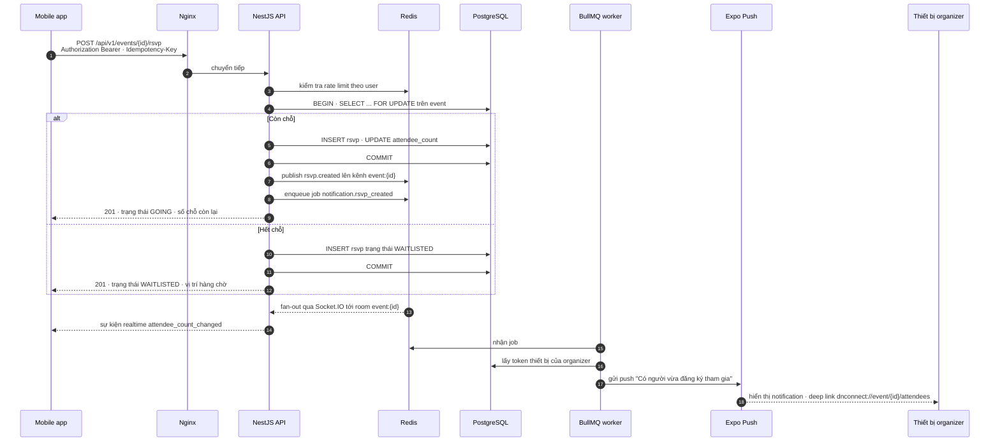

### 3.4 Luồng đăng nhập và xoay vòng refresh token

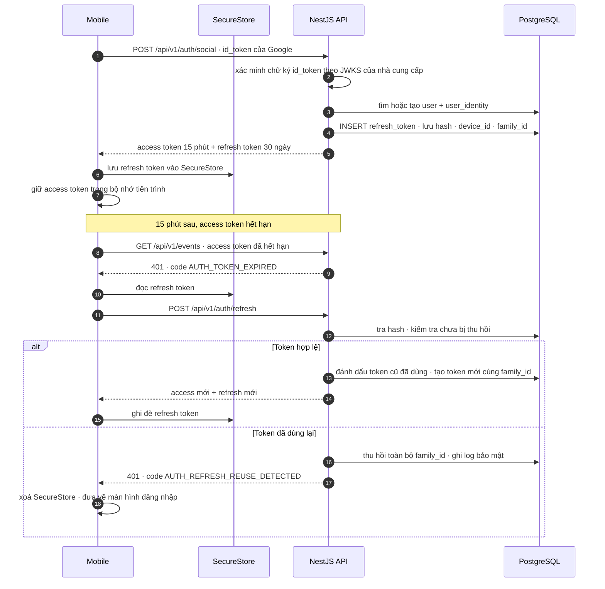

---

## 4. Giải trình lựa chọn công nghệ theo từng lớp

Mỗi mục theo cùng một khuôn: **chọn gì → vì sao → đã cân nhắc gì → vì sao loại**.

### 4.1 Backend framework — NestJS 11

**Chọn:** NestJS 11 trên Node.js 22 LTS, TypeScript 5.6+, chạy Express adapter.

**Vì sao:**
- Cấu trúc module + dependency injection áp đặt sẵn kỷ luật. Với một dự án sẽ phình từ "sự kiện" sang "nhà ở" rồi "dịch vụ chuyên môn", việc có ranh giới module rõ từ đầu quan trọng hơn tốc độ viết một endpoint.
- `@nestjs/swagger` sinh OpenAPI trực tiếp từ DTO và decorator. Đây là mắt xích để sinh typed client dùng chung cho web và mobile — nguyên tắc số 2 ở mục 2.
- Hệ sinh thái sẵn: `@nestjs/typeorm`, `@nestjs/bullmq`, `@nestjs/websockets`, `@nestjs/throttler`, `@nestjs/config`, `@nestjs/schedule` đều là package chính chủ, không phải mảnh ghép cộng đồng.
- Guard/Interceptor/Filter là chỗ đặt tự nhiên cho các mối quan tâm xuyên suốt: RBAC, response envelope, rate limit, ánh xạ lỗi, `requestId`.

**Đã cân nhắc:**

| Phương án | Điểm mạnh | Vì sao loại |
|---|---|---|
| Fastify thuần + Zod | Nhanh nhất, ít lớp trừu tượng | Phải tự dựng DI, module, Swagger, guard. Tiết kiệm 20ms latency không đáng đổi lấy vài tuần dựng nền. |
| Express thuần | Ai cũng biết | Không có cấu trúc áp đặt. Dự án nhiều giai đoạn sẽ thành mớ route file lộn xộn sau 6 tháng. |
| Go + Gin/Echo | Hiệu năng, binary gọn | Chia rẽ ngôn ngữ với web/mobile. Không chia sẻ được kiểu dữ liệu, không chia sẻ được validator. Đội nhỏ không nên nuôi hai hệ sinh thái. |
| Supabase / Firebase (BaaS) | Ra MVP cực nhanh | Truy vấn địa lý phức tạp và logic hàng chờ RSVP khó nhét vào BaaS. Quan trọng hơn: dữ liệu nằm ngoài Việt Nam, xung đột với quyết định ở mục 14. Chi phí tăng phi tuyến khi có traffic thật. |
| NestJS + Fastify adapter | Nhanh hơn Express ~15% | Giữ Express adapter vì `socket.io`, middleware ảnh và một số thư viện tương thích tốt hơn. Có thể đổi sang Fastify sau bằng một dòng nếu đo được nút thắt. |

**Ghi chú phiên bản:** khoá `engines.node` ở `>=22 <23` trong `package.json` và dùng cùng tag Node trong Dockerfile để môi trường local và production không lệch.

### 4.2 Cơ sở dữ liệu — PostgreSQL 16 + PostGIS 3.4

**Chọn:** PostgreSQL 16 với extension `postgis`, `pg_trgm`, `unaccent`, `uuid-ossp` (hoặc `pgcrypto` cho `gen_random_uuid()`).

**Vì sao:**
- Tính năng lõi của MVP là **lọc nâng cao theo khu vực**: "sự kiện thể thao ở An Thượng, tối nay, có người nói tiếng Anh". Đây là truy vấn kết hợp không gian + thời gian + thuộc tính. PostGIS cho phép làm trong một câu SQL với chỉ mục GiST, thay vì kéo hết về ứng dụng rồi lọc.
- `pg_trgm` + `unaccent` giải quyết tìm kiếm tên sự kiện lẫn lộn tiếng Anh và tiếng Việt có dấu ("Mỹ Khê" tìm được bằng "my khe") mà không cần dựng Elasticsearch ở giai đoạn này.
- Postgres 16 có `pg_stat_io` để chẩn đoán I/O và cải thiện đáng kể hiệu năng của `COPY` cùng logical replication — hữu ích khi giai đoạn curate thủ công nhập lô sự kiện.
- Một database quan hệ duy nhất giữ được tính nhất quán giao dịch cho phần khó nhất: đếm chỗ trống và hàng chờ RSVP dưới tải đồng thời.

**Đã cân nhắc:**

| Phương án | Vì sao loại |
|---|---|
| MongoDB | Logic hàng chờ RSVP cần giao dịch và khoá hàng. Truy vấn địa lý của Mongo yếu hơn PostGIS ở phép toán đa giác. Schema lỏng là nợ kỹ thuật khi miền nghiệp vụ mở rộng sang nhà ở và y tế. |
| MySQL 8 | Hỗ trợ không gian có nhưng nghèo hơn PostGIS rõ rệt, không có tương đương `ST_DWithin` trên geography với chỉ mục tốt. Không có kiểu `jsonb` mạnh bằng. |
| PostgreSQL 17 | Mới, một số extension và bản dựng managed tại Việt Nam chưa theo kịp. Chọn 16 để chắc chắn có PostGIS đóng gói sẵn. Nâng lên 17 là việc của 2027. |
| Elasticsearch cho tìm kiếm | Thêm một hệ thống phải vận hành, đồng bộ và trả tiền, trong khi tới 50.000 người dùng thì `pg_trgm` + GiST vẫn dưới 50ms. Để dành cho lúc thật sự cần xếp hạng liên quan phức tạp. |
| Bật `geography` vs `geometry` | Chọn `geography(Point, 4326)` cho toạ độ điểm vì tính khoảng cách theo mét trực tiếp, không cần chiếu. Phạm vi chỉ một thành phố nên sai số chiếu không phải vấn đề. |

### 4.3 Cache và hàng đợi — Redis 7.4 + BullMQ 5

**Chọn:** một instance Redis 7.4 phục vụ bốn mục đích, tách bằng prefix key và số database.

| Mục đích | Prefix / DB | Ví dụ |
|---|---|---|
| Cache đọc | `db 0`, prefix `cache:` | `cache:event:feed:area=an-thuong:page=1` (TTL 60s) |
| Rate limit | `db 0`, prefix `rl:` | `rl:ip:1.2.3.4:auth-otp` (sliding window) |
| Hàng đợi BullMQ | `db 1`, prefix `bull:` | queue `notification`, `media`, `email`, `digest` |
| Pub/Sub cho Socket.IO | `db 2` | `@socket.io/redis-adapter` |

**Vì sao BullMQ:** viết bằng TypeScript, có `@nestjs/bullmq` chính chủ, hỗ trợ delayed job (nhắc sự kiện trước 2 giờ), repeatable job (digest hàng tuần), retry với backoff mũ, và dead-letter thông qua `failed` set. Không cần thêm broker nào ngoài Redis vốn đã có mặt.

**Đã cân nhắc:**

| Phương án | Vì sao loại |
|---|---|
| RabbitMQ / Kafka | Quá nặng cho khối lượng job của giai đoạn này. Thêm một hệ thống có trạng thái phải vận hành và sao lưu. Kafka chỉ đáng khi cần event log bền và replay — chưa phải bài toán hiện tại. |
| `pg-boss` (hàng đợi trên Postgres) | Giữ được số thành phần ở mức tối thiểu, nhưng đẩy tải polling lên chính database đang phục vụ truy vấn feed. Redis dù sao cũng cần cho cache và socket adapter. |
| Cron trong container API | Chạy scheduler cùng tiến trình API sẽ nhân bản job khi scale lên nhiều replica. BullMQ repeatable job dùng khoá phân tán nên chỉ chạy một lần dù có bao nhiêu worker. |

### 4.4 Web — Next.js 15 + React 19 + Tailwind CSS 4

**Chọn:** Next.js 15 App Router, React 19, Tailwind CSS 4, `next-intl` cho i18n.

**Vì sao:**
- **SEO là kênh tăng trưởng miễn phí quan trọng nhất.** Expat gõ Google "events in Da Nang this weekend", "language exchange Da Nang". Mỗi trang sự kiện là một trang public render phía server với JSON-LD `schema.org/Event`. Đây là lợi thế mà app-only không có, và là lý do số một để có web ngay từ MVP thay vì để sau.
- App Router + React Server Components cho phép trang danh sách sự kiện render trên server, gửi HTML gọn về thiết bị di động — nhiều expat mới tới Đà Nẵng dùng roaming hoặc SIM 4G chất lượng không đều.
- Route Handler của Next.js đóng vai trò **BFF** cho web: giữ token trong cookie `httpOnly`, trình duyệt không bao giờ thấy JWT. Chi tiết ở [mục 7](#7-chiến-lược-xác-thực-và-định-danh).
- Cùng ngôn ngữ, cùng typed client, cùng file i18n với mobile.

**Đã cân nhắc:**

| Phương án | Vì sao loại |
|---|---|
| Remix / React Router 7 | Rất tốt, nhưng hệ sinh thái deploy và tài liệu Next.js phổ biến hơn ở Việt Nam, dễ tìm người tiếp quản. |
| Vite + React SPA | Mất SSR đồng nghĩa mất SEO — chính là mất kênh tăng trưởng chính. Loại ngay. |
| Astro | Tuyệt cho trang tĩnh nhưng phần app có đăng nhập, RSVP realtime, bản đồ tương tác sẽ phải ghép thêm framework khác. |
| Chỉ làm mobile, bỏ web | Bỏ SEO và bỏ luôn khả năng chia sẻ link sự kiện vào Facebook/WhatsApp — mà chia sẻ link chính là cách giai đoạn curate thủ công tiếp cận organizer gốc. Loại. |
| Tailwind 3 | Tailwind 4 có engine Oxide nhanh hơn nhiều và cấu hình bằng CSS `@theme`, chia sẻ design token với mobile qua một file token trung lập dễ hơn. |

**Ghi chú:** phần web dùng Tailwind, phần mobile **không** dùng Tailwind/NativeWind — xem 4.5.

### 4.5 Mobile — Expo 54 + React Native 0.81

**Chọn:** Expo SDK 54 (React Native 0.81), Expo Router 6, TypeScript, EAS Build + EAS Submit + EAS Update.

**Vì sao:**
- Một codebase cho iOS và Android. Đội nhỏ không đủ người nuôi Swift và Kotlin song song.
- **EAS Update (OTA)** là vũ khí quan trọng ở giai đoạn curate thủ công: sửa lỗi hiển thị hoặc đổi copy tiếng Anh mà không phải chờ App Store duyệt 1-3 ngày. Chỉ áp dụng cho thay đổi JS; thay đổi native vẫn phải build lại.
- Expo Modules bao trọn những thứ cần thiết mà không phải viết native: `expo-secure-store` (lưu refresh token), `expo-notifications` (push), `expo-location` (lọc "gần tôi"), `expo-image-picker` + `expo-image-manipulator` (ảnh sự kiện), `expo-apple-authentication`, `expo-auth-session`, `expo-linking` (deep link).
- Prebuild + Config Plugin nghĩa là vẫn chèn được native code khi cần (`react-native-maps` là ví dụ), không bị nhốt trong sandbox như Expo Go thời cũ.

**Đã cân nhắc:**

| Phương án | Vì sao loại |
|---|---|
| React Native bare (không Expo) | Tự dựng CI cho iOS cần một máy macOS chạy liên tục hoặc dịch vụ CI đắt. Tự quản Xcode/Gradle upgrade tốn hàng tuần mỗi năm. Expo đổi lấy chút ràng buộc lấy rất nhiều thời gian. |
| Flutter | Kỹ thuật tốt, nhưng chia rẽ ngôn ngữ với backend và web. Mất luôn khả năng dùng chung `packages/shared-types` và `packages/i18n`. |
| PWA thay app native | Push notification trên iOS Safari vẫn hạn chế và cần người dùng "Add to Home Screen" — rào cản lớn. Push là cơ chế giữ chân số một của app sự kiện. Loại. |
| Capacitor / Ionic | Hiệu năng danh sách và bản đồ kém hơn rõ rệt so với RN native view. |
| NativeWind cho mobile | Đã cân nhắc để dùng chung class Tailwind với web. Loại vì thêm một lớp biên dịch, và style di động khác web đủ nhiều (safe area, platform-specific) khiến việc "dùng chung" chỉ đúng trên lý thuyết. **Thay vào đó:** dùng chung *design token* (màu, spacing, typography, radius) qua `packages/ui/tokens.ts`, còn cách viết style thì mỗi nền tảng theo cách tự nhiên của nó — Tailwind ở web, `StyleSheet.create` ở mobile. |

### 4.6 Bản đồ — Leaflet ở web, react-native-maps ở mobile

**Chọn:**
- Web: `leaflet@1.9.x` + `react-leaflet@5.x` + `leaflet.markercluster`.
- Mobile: `react-native-maps@1.2x`, provider Google trên Android, Apple Maps trên iOS.
- Nguồn tile: khởi đầu dùng gói tile miễn phí có hạn mức của một nhà cung cấp tương thích OSM (MapTiler hoặc tương đương), có đường lùi sang tự host `protomaps`/`tileserver-gl` khi lưu lượng tăng.

**Vì sao:**
- Leaflet nhẹ (~42KB gzip), không khoá vào nhà cung cấp, đổi nguồn tile chỉ là đổi một URL template. Với một sản phẩm hyperlocal chỉ phủ Đà Nẵng, khả năng tự host tile cho riêng một thành phố là hoàn toàn khả thi và cực rẻ — vùng phủ nhỏ.
- `react-native-maps` dùng map view native nên cuộn/zoom mượt và cluster hàng trăm marker không giật, khác hẳn nhúng WebView.
- Không dùng Google Maps JS API ở web để tránh chi phí theo lượt tải bản đồ và tránh phải gắn thẻ thanh toán ngay từ MVP.

**Đã cân nhắc:**

| Phương án | Vì sao loại |
|---|---|
| Mapbox GL JS | Đẹp và mạnh, nhưng tính phí theo map load và giấy phép v2 trở đi hạn chế hơn. Chưa cần vector tile 3D cho danh sách sự kiện. |
| MapLibre GL (fork mở của Mapbox) | Ứng viên tốt nếu sau này cần vector tile và style tuỳ biến sâu. Hiện tại raster tile + Leaflet đủ dùng và đơn giản hơn. **Ghi vào danh sách chờ**, không loại vĩnh viễn. |
| Google Maps JS API cho web | Chi phí theo lượt tải, cần khoá API có hạn ngạch, và phải quản lý billing. Với bản đồ chỉ để hiển thị vị trí sự kiện thì không đáng. |
| Dùng tile OSM công cộng trực tiếp | Vi phạm chính sách sử dụng của tile server cộng đồng khi có lưu lượng sản phẩm. Bắt buộc dùng nhà cung cấp có hạn mức rõ ràng hoặc tự host. |

### 4.7 Lưu trữ file và CDN

**Chọn:** object storage tương thích S3 API (nhà cung cấp cụ thể theo quyết định hosting ở mục 14), truy cập công khai qua CDN có POP tại Việt Nam.

**Cách hoạt động:**

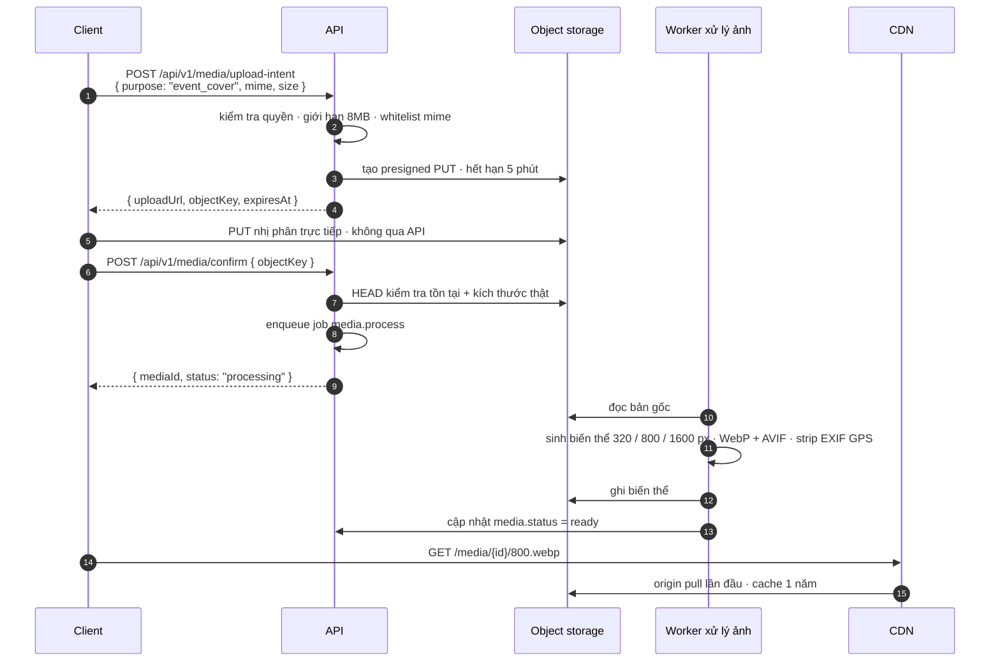

**Điểm bắt buộc:**
- **Strip EXIF, đặc biệt là toạ độ GPS**, trước khi công khai bất kỳ ảnh nào. Ảnh avatar và ảnh sự kiện do người dùng tải lên có thể lộ vị trí nhà riêng. Đây là yêu cầu an toàn cho người dùng, không phải tối ưu.
- Object key theo dạng `media/{yyyy}/{mm}/{uuid}/{variant}.{ext}` — không bao giờ dùng tên file gốc do người dùng đặt.
- Cache-Control `public, max-age=31536000, immutable` cho biến thể vì key là bất biến.
- Ảnh gốc để ở bucket private, chỉ biến thể đã xử lý mới public.

**Đã cân nhắc:** cho ảnh đi qua API rồi lưu vào ổ đĩa server — loại vì chiếm băng thông và bộ nhớ của tiến trình API, và không scale ngang được khi có nhiều replica.

### 4.8 Push và realtime

Chi tiết ở [mục 8](#8-realtime-và-push-notification). Tóm tắt lựa chọn: **Expo Push Service** làm lớp trừu tượng trên APNs và FCM, **Socket.IO 4.8** cho kênh realtime khi app đang mở.

**Vì sao Expo Push thay vì gọi thẳng APNs/FCM:** một API duy nhất, một định dạng payload, Expo lo chứng chỉ APNs và service account FCM. Đổi lại có phụ thuộc vào dịch vụ của bên thứ ba — chấp nhận được vì lớp gọi được bọc trong `NotificationSenderService`, thay bằng `node-apn` + `firebase-admin` là việc của một sprint nếu cần.

**Vì sao Socket.IO thay vì WebSocket thuần hoặc SSE:**

| Phương án | Đánh giá |
|---|---|
| **Socket.IO 4.8** ✅ | Tự động fallback, tự reconnect với backoff, có khái niệm room/namespace sẵn — đúng thứ cần cho `event:{id}`. `@socket.io/redis-adapter` cho phép scale ngang không phải viết gì thêm. |
| `ws` thuần | Phải tự viết reconnect, heartbeat, room registry, fan-out đa node. Tiết kiệm vài KB không đáng. |
| SSE (Server-Sent Events) | Một chiều, không gửi được từ client lên. Chat sự kiện cần hai chiều. |
| Pusher / Ably (SaaS) | Trả tiền theo connection và message. Ở mốc 5.000-50.000 người dùng, chi phí vượt hẳn việc tự chạy Socket.IO trên Redis đã có sẵn. |

### 4.9 Đóng gói và hạ tầng chạy — Docker Compose

**Chọn:** Docker multi-stage build, Docker Compose v2 để orchestrate ở cả staging và production trên VM.

**Vì sao:** Compose là mức phức tạp vừa đủ cho 2-6 container. Kubernetes ở quy mô này là chi phí vận hành thuần tuý không đổi lại lợi ích nào. Khi nào cần: nhiều hơn ~10 service, hoặc cần autoscaling thật sự theo giờ cao điểm — chưa phải bây giờ.

**Đã cân nhắc:**

| Phương án | Vì sao loại (hiện tại) |
|---|---|
| Kubernetes (k8s / k3s) | Chi phí nhận thức và vận hành lớn. Ghi vào đường tiến hoá cho mốc >50.000 người dùng. |
| PaaS kiểu Vercel/Render/Railway cho backend | Tiện, nhưng đều đặt hạ tầng ngoài Việt Nam — xung đột trực tiếp với quyết định mục 14. Web app *có thể* cân nhắc Vercel vì chỉ render HTML public, nhưng để nhất quán thì self-host cả web. |
| Chạy trực tiếp trên host bằng PM2 | Không tái lập được môi trường, "chạy được trên máy tôi" quay lại. Loại. |

---

## 5. Cấu trúc monorepo

### 5.1 Công cụ quản lý — pnpm workspace + Turborepo

**Chọn:** `pnpm@10` workspace làm lớp quản lý phụ thuộc, `turbo@2` làm lớp chạy task.

| Tiêu chí | pnpm + Turborepo (chọn) | npm workspaces | Yarn Berry | Nx |
|---|---|---|---|---|
| Tốc độ cài | Nhanh nhất, content-addressable store, symlink | Chậm, phình `node_modules` | Nhanh, nhưng PnP hay gãy với React Native | Nhanh |
| Tương thích React Native | Tốt với `node-linker=hoisted` | Tốt | PnP xung đột Metro bundler | Tốt |
| Cache task | Turborepo cache local + remote | Không có | Không có | Có, mạnh hơn |
| Chi phí học | Thấp | Rất thấp | Trung bình | **Cao** — nhiều quy ước, generator, plugin |
| Kết luận | ✅ Cân bằng tốt nhất | Thiếu cache | Rủi ro với Metro | Quá nặng cho 3 app |

**Cấu hình bắt buộc để Expo/Metro chạy được trong monorepo pnpm:** đặt `node-linker=hoisted` trong `.npmrc` ở gốc. Metro không đi theo symlink lồng nhau của pnpm mặc định. Đây là cạm bẫy số một khi dựng monorepo có React Native — ghi rõ trong `README` gốc.

### 5.2 Cây thư mục

```text
da-nang-connect/
├── apps/
│   ├── api/                              # NestJS 11 — @dnc/api
│   │   ├── src/
│   │   │   ├── main.ts
│   │   │   ├── app.module.ts
│   │   │   ├── common/                   # xuyên suốt, không nằm trong module nào
│   │   │   │   ├── decorators/           # @CurrentUser, @Public, @Roles
│   │   │   │   ├── guards/               # jwt-auth.guard.ts, roles.guard.ts
│   │   │   │   ├── interceptors/         # response-envelope, request-id, logging
│   │   │   │   ├── filters/              # all-exceptions.filter.ts
│   │   │   │   ├── pipes/                # zod-validation.pipe.ts
│   │   │   │   ├── dto/                  # cursor-page.response.ts, id-param.request.ts
│   │   │   │   ├── enums/                # user-role.enum.ts, rsvp-status.enum.ts
│   │   │   │   └── errors/               # error-code.enum.ts, app.exception.ts
│   │   │   ├── config/                   # cấu hình có kiểu, validate bằng Zod
│   │   │   ├── database/
│   │   │   │   ├── data-source.ts        # DataSource dùng cho CLI migration
│   │   │   │   ├── migrations/
│   │   │   │   └── seeds/                # seed khu vực Đà Nẵng, danh mục
│   │   │   ├── modules/
│   │   │   │   ├── auth/
│   │   │   │   ├── user/
│   │   │   │   ├── profile/
│   │   │   │   ├── event/
│   │   │   │   ├── rsvp/
│   │   │   │   ├── area/
│   │   │   │   ├── category/
│   │   │   │   ├── search/
│   │   │   │   ├── media/
│   │   │   │   ├── chat/
│   │   │   │   ├── notification/
│   │   │   │   ├── report/
│   │   │   │   ├── curation/
│   │   │   │   ├── admin/
│   │   │   │   └── health/
│   │   │   ├── queues/                   # định nghĩa queue + processor BullMQ
│   │   │   └── realtime/                 # socket gateway + adapter
│   │   ├── e2e/                          # TOÀN BỘ file test, gương theo src/**
│   │   │   └── modules/rsvp/rsvp.service.waitlist.spec.ts
│   │   ├── Dockerfile
│   │   ├── jest.config.ts
│   │   └── package.json
│   │
│   ├── web/                              # Next.js 15 — @dnc/web
│   │   ├── src/
│   │   │   ├── app/
│   │   │   │   ├── [locale]/             # en | vi
│   │   │   │   │   ├── (public)/         # trang SEO: /events, /events/[slug], /areas/[slug]
│   │   │   │   │   ├── (app)/            # cần đăng nhập: /my/events, /my/rsvps
│   │   │   │   │   └── (admin)/          # console curate — bảo vệ bằng role
│   │   │   │   ├── api/                  # BFF route handler: /api/auth/*, /api/proxy/*
│   │   │   │   ├── sitemap.ts
│   │   │   │   └── robots.ts
│   │   │   ├── components/
│   │   │   ├── features/                 # gom theo miền: event/, rsvp/, map/
│   │   │   ├── lib/
│   │   │   └── styles/
│   │   ├── e2e/                          # Playwright
│   │   ├── Dockerfile
│   │   └── package.json
│   │
│   └── mobile/                           # Expo 54 — @dnc/mobile
│       ├── app/                          # Expo Router: file-based
│       │   ├── (tabs)/
│       │   │   ├── index.tsx             # Discover feed
│       │   │   ├── map.tsx
│       │   │   ├── my-events.tsx
│       │   │   └── profile.tsx
│       │   ├── event/[id].tsx
│       │   ├── event/create.tsx
│       │   ├── auth/
│       │   └── _layout.tsx
│       ├── src/
│       │   ├── features/
│       │   ├── components/
│       │   ├── hooks/
│       │   ├── services/                 # api client, secure storage, push
│       │   └── theme/
│       ├── __tests__/                    # test mobile ở thư mục riêng, không trong app/
│       ├── app.config.ts                 # cấu hình theo APP_ENV
│       ├── eas.json
│       └── package.json
│
├── packages/
│   ├── shared-types/                     # @dnc/shared-types — enum, hằng số, kiểu miền
│   ├── api-client/                       # @dnc/api-client — sinh từ OpenAPI, có hook TanStack Query
│   ├── i18n/                             # @dnc/i18n — en.json, vi.json, là nguồn duy nhất
│   ├── config/                           # @dnc/config — tsconfig, eslint, prettier preset
│   ├── ui/                               # @dnc/ui — design token dùng chung + component web
│   └── validation/                       # @dnc/validation — Zod schema dùng chung client + server
│
├── ops/
│   ├── compose/
│   │   ├── docker-compose.local.yml      # postgres+postgis, redis, minio, mailpit
│   │   ├── docker-compose.staging.yml
│   │   └── docker-compose.prod.yml
│   ├── nginx/
│   │   ├── nginx.conf
│   │   └── sites/
│   ├── scripts/
│   │   ├── backup-postgres.sh
│   │   ├── restore-postgres.sh
│   │   ├── deploy.sh
│   │   └── seed-danang-areas.ts
│   └── grafana/                          # dashboard định nghĩa dạng file
│
├── docs/
│   ├── analysis/
│   ├── adr/                              # 0001-monolith-modul-hoa.md ...
│   └── source/
│
├── .github/
│   └── workflows/
│       ├── ci.yml
│       ├── deploy-staging.yml
│       ├── deploy-production.yml
│       ├── mobile-preview.yml
│       └── mobile-release.yml
│
├── .npmrc                                # node-linker=hoisted
├── pnpm-workspace.yaml
├── turbo.json
├── package.json
├── .env.example
└── README.md
```

### 5.3 Quy ước đặt tên

| Đối tượng | Quy ước | Ví dụ |
|---|---|---|
| Package npm nội bộ | `@dnc/<kebab-case>` | `@dnc/shared-types` |
| Thư mục và file | `kebab-case` | `event-detail.tsx`, `rsvp.service.ts` |
| File NestJS | `<name>.<role>.ts` | `event.controller.ts`, `event.repository.ts` |
| Class | `PascalCase` | `EventService`, `RsvpRepository` |
| Interface / type | `PascalCase`, **không** tiền tố `I` | `EventSummary`, không phải `IEvent` |
| Enum | `PascalCase` số ít, giá trị `SCREAMING_SNAKE` | `RsvpStatus.WAITLISTED` |
| Bảng database | `snake_case` số nhiều | `events`, `event_rsvps`, `user_identities` |
| Cột database | `snake_case` | `starts_at`, `attendee_count`, `area_id` |
| Cột thời gian | luôn `timestamptz`, hậu tố `_at` | `created_at`, `starts_at`, `deleted_at` |
| Cột boolean | tiền tố `is_` / `has_` | `is_published`, `has_waitlist` |
| Migration | `<epoch_ms>-<PascalCase>.ts` | `1756598400000-CreateEventTable.ts` |
| Key i18n | `<namespace>.<screen>.<element>` | `event.detail.rsvpButton`, `common.error.network` |
| Endpoint REST | số nhiều, kebab-case | `/api/v1/events/{id}/rsvps` |
| Nhánh git | `<type>/<mô-tả-ngắn>` | `feat/event-waitlist`, `fix/rsvp-race` |
| Commit | Conventional Commits | `feat(rsvp): add waitlist promotion job` |
| Biến môi trường | `SCREAMING_SNAKE_CASE`, tiền tố theo miền | `DB_HOST`, `REDIS_URL`, `OTP_VN_PROVIDER` |

### 5.4 Quy ước cấu trúc module backend — bốn class lõi + layer DTO

Đây là quy ước có hiệu lực bắt buộc, đồng bộ một-một với `.agent/rules/backend-module-structure.md`. Mọi module mới dưới `apps/api/src/modules/<name>/` gồm **bốn class lõi**, **một mapper** và **một layer DTO**.

#### 5.4.1 Bốn class lõi

| File | Class | Trách nhiệm | Điều cấm |
|---|---|---|---|
| `<name>.controller.ts` | `<Name>Controller` | Route HTTP + decorator Swagger; nhận request DTO, trả response DTO | Không chứa logic nghiệp vụ, không truy cập repository trực tiếp |
| `<name>.service.ts` | `<Name>Service` | Logic nghiệp vụ và điều phối; nhận/trả DTO hoặc entity nội bộ | **Không viết SQL thô**, không import `DataSource` để chạy query |
| `<name>.repository.ts` | `<Name>Repository` | Toàn bộ truy cập dữ liệu — TypeORM repository hoặc SQL thô cho truy vấn PostGIS | Không chứa quy tắc nghiệp vụ, không gọi service khác |
| `<name>.module.ts` | `<Name>Module` | Nối dây `controllers` / `providers` / `exports` | Không chứa logic |

Không có class thứ năm. Nếu service hoặc repository gánh nhiều hơn một trách nhiệm, đó là dấu hiệu cần **module mới**, không phải thêm class rời rạc vào thư mục cũ. Logic tính năng con gộp vào chính service/repository bằng private method.

#### 5.4.2 Layer DTO — ranh giới hợp đồng, bắt buộc ở mọi module

```text
apps/api/src/modules/<name>/
├── <name>.controller.ts
├── <name>.service.ts
├── <name>.repository.ts
├── <name>.module.ts
├── <name>.mapper.ts              # entity/row → response DTO, hàm thuần
└── dto/
    ├── request/
    │   ├── create-<name>.request.ts     → CreateXxxRequest
    │   ├── update-<name>.request.ts     → UpdateXxxRequest
    │   └── list-<name>.query.ts         → ListXxxQuery      (query string + phân trang)
    └── response/
        ├── <name>.response.ts           → XxxResponse       (rút gọn, dùng trong danh sách)
        └── <name>-detail.response.ts    → XxxDetailResponse (đầy đủ, dùng ở trang chi tiết)
```

Quy ước hậu tố: `Request` cho body, `Query` cho query string, `Param` cho path param phức tạp, `Response` cho chiều trả ra. Không dùng `Dto` trần vì nó không nói lên chiều dữ liệu. Một file một class, tên file `kebab-case` khớp tên class.

#### 5.4.3 Mười luật cứng

| # | Luật | Vì sao |
|---|---|---|
| 1 | Controller **không bao giờ** trả entity TypeORM; mọi đường trả đi qua `<name>.mapper.ts` | Trả entity làm rò `password_hash`, `email`, `phone`, `deleted_at` và khoá cứng lược đồ DB vào hợp đồng API |
| 2 | Request DTO validate bằng `class-validator`, bật global `new ValidationPipe({ whitelist: true, forbidNonWhitelisted: true, transform: true })` | Trường lạ bị loại thẳng, không âm thầm đi tiếp xuống service |
| 3 | Response DTO khai báo **tường minh từng trường** — không `...entity`, không `Object.assign` | Thêm một trường vào response phải là hành động có chủ đích |
| 4 | Email và số điện thoại chỉ xuất hiện trong response của **chính chủ thể dữ liệu**; response danh sách công khai chỉ có `displayName` và `avatarUrl` | Nghĩa vụ tối thiểu hoá dữ liệu theo pháp luật bảo vệ dữ liệu cá nhân — xem [mục 15](#15-bảo-mật-quyền-riêng-tư-và-tuân-thủ) |
| 5 | Mọi trường có `@ApiProperty` kèm mô tả và ví dụ | DTO là nguồn duy nhất sinh OpenAPI, từ đó sinh `packages/api-client` |
| 6 | Enum dùng chung khai báo một lần ở `packages/shared-types`, DTO import vào | Không nhân bản `RsvpStatus` ở ba nơi rồi lệch nhau |
| 7 | Thời gian trong DTO luôn là chuỗi ISO-8601 UTC (`startAt`, `endAt`) | Việc đổi sang `Asia/Ho_Chi_Minh` là trách nhiệm client; DTO không chứa chuỗi giờ đã định dạng |
| 8 | Toạ độ tách khỏi kiểu PostGIS: repository trả `geography(Point)`, mapper đổi thành `{ lat, lng }` | Client không bao giờ thấy WKB/WKT |
| 9 | Phân trang dùng đúng một kiểu bọc `CursorPage<T>` ở `src/common/dto/cursor-page.response.ts` | Xem [mục 6.4](#64-phân-trang-bằng-cursor) — không module nào tự chế kiểu riêng |
| 10 | Message lỗi validate dùng **key i18n**, không hardcode chuỗi tiếng Anh | UI mặc định tiếng Anh nhưng phải dịch được sang tiếng Việt |

#### 5.4.4 Tái sử dụng DTO — kế thừa thay vì chép lại

Khi DTO mới chỉ khác DTO đã có vài trường, dùng mapped type của **`@nestjs/swagger`** (không phải `@nestjs/mapped-types` — bản trong `@nestjs/swagger` mới mang theo metadata tài liệu):

| Tình huống | Cách làm |
|---|---|
| Bỏ bớt vài trường | `class PublicEventResponse extends OmitType(EventResponse, ['ownerEmail', 'internalNote'] as const) {}` |
| Chỉ lấy vài trường | `class EventSummaryResponse extends PickType(EventDetailResponse, ['id', 'title', 'startAt'] as const) {}` |
| Thêm 1–2 trường | `class EventDetailResponse extends EventResponse { @ApiProperty() attendeeCount: number }` |
| Ghép hai nhóm trường | `class ListEventQuery extends IntersectionType(CursorPageQuery, EventFilterQuery) {}` |
| Update = Create nhưng optional | `class UpdateEventRequest extends PartialType(CreateEventRequest) {}` |

**Nguyên tắc phân định:** `PickType` (danh sách trắng) cho ranh giới bảo mật, `OmitType` (danh sách đen) chỉ cho tiện lợi nội bộ. Response cho organizer và response cho người xem lạ **không** được kế thừa bằng `OmitType`, vì thêm một trường nội bộ vào bản organizer là nó tự động lọt ra bản công khai nếu quên cập nhật danh sách `Omit`.

**Giới hạn:** kế thừa tối đa 2 tầng; không dùng `Partial<T>` / `Omit<T, K>` / `Pick<T, K>` của TypeScript thuần cho DTO vì chúng biến mất lúc runtime, làm `ValidationPipe` không validate gì và Swagger ra rỗng. DTO dùng chung từ 3 module trở lên chuyển lên `src/common/dto/`.

#### 5.4.5 Mapper

`<name>.mapper.ts` chỉ chứa hàm thuần, không phụ thuộc DI nên test được bằng unit test đơn giản:

```ts
export function toEventResponse(e: Event): EventResponse { /* ... */ }
export function toEventDetailResponse(e: Event, viewerId?: string): EventDetailResponse { /* ... */ }
```

Mapper nhận thêm ngữ cảnh người xem khi response phụ thuộc quyền — ví dụ chỉ organizer mới thấy danh sách người đăng ký kèm ghi chú.

#### 5.4.6 Mối quan tâm xuyên suốt nằm ở `src/common/`

Guard, decorator, interceptor, filter, pipe và enum dùng chung **không** nằm trong thư mục module:

| Loại | Vị trí | Ví dụ |
|---|---|---|
| Guard | `src/common/guards/` | `jwt-auth.guard.ts`, `roles.guard.ts`, `trust-tier.guard.ts` |
| Decorator | `src/common/decorators/` | `current-user.decorator.ts`, `public.decorator.ts`, `roles.decorator.ts` |
| DTO dùng chung | `src/common/dto/` | `cursor-page.response.ts`, `id-param.request.ts` |
| Enum dùng chung | `src/common/enums/` | `user-role.enum.ts`, `rsvp-status.enum.ts` |

Enum mà web/mobile cũng dùng thì đặt ở `packages/shared-types`, không nhân bản trong `src/common/`. Không tạo `-context.service.ts`, `-membership.repository.ts`, `-tier.guard.ts` bên trong thư mục module.

#### 5.4.7 Ví dụ tham chiếu — module `rsvp`

```text
apps/api/src/modules/rsvp/
├── rsvp.controller.ts       # POST /events/:id/rsvps, DELETE, GET /events/:id/rsvps
├── rsvp.service.ts          # quy tắc hàng chờ, thăng hạng khi có người huỷ, giới hạn theo trust tier
├── rsvp.repository.ts       # SELECT ... FOR UPDATE, đếm nguyên tử, phân trang cursor
├── rsvp.module.ts
├── rsvp.mapper.ts
└── dto/
    ├── request/
    │   ├── create-rsvp.request.ts    # guestCount, note
    │   └── list-rsvp.query.ts        # status, cursor, limit
    └── response/
        ├── rsvp.response.ts          # id, status, joinedAt, user rút gọn
        └── rsvp-detail.response.ts   # thêm note, vị trí hàng chờ, lịch sử đổi trạng thái
```

Module `event` và `area` theo đúng khuôn này. Truy vấn PostGIS (`ST_DWithin`, `ST_Contains`) nằm trong `area.repository.ts` / `event.repository.ts`, không leo lên service, và kết quả đổi sang `{ lat, lng }` tại mapper.

#### 5.4.8 Checklist review module backend

- [ ] Đủ bốn class lõi, không thừa class rời rạc
- [ ] Có `dto/request/` và `dto/response/`, không có DTO nằm lạc ngoài `dto/`
- [ ] Controller không trả entity, mọi đường trả đều qua mapper
- [ ] `@ApiProperty` đầy đủ, Swagger sinh ra đọc được
- [ ] Không có dữ liệu cá nhân lọt vào response danh sách công khai
- [ ] Enum dùng chung lấy từ `packages/shared-types`
- [ ] Phân trang dùng `CursorPage<T>`, không tự chế
- [ ] DTO gần giống nhau đã kế thừa bằng mapped type của `@nestjs/swagger`
- [ ] Ranh giới riêng tư dùng `PickType`, không `OmitType`
- [ ] Kế thừa không quá 2 tầng
- [ ] Thời gian trả về là ISO-8601 UTC

### 5.5 Quy ước đặt file test

**Không bao giờ để file test cạnh mã nguồn.** Mọi spec của `apps/api` nằm dưới `apps/api/e2e/**`, phản chiếu đúng đường dẫn `src/**`:

```text
src/modules/rsvp/rsvp.service.ts
e2e/modules/rsvp/rsvp.service.waitlist.spec.ts     ← test nằm ở đây
```

- Import từ spec trỏ ngược vào source bằng đường dẫn tương đối: `../../../src/modules/rsvp/rsvp.service`.
- Jest config: `rootDir: "."` và `roots: ["<rootDir>/e2e"]`. Không sửa `testRegex` để quét `src/`.
- `tsconfig.json` giữ `e2e` trong `exclude`; `ts-jest` type-check spec lúc chạy test, còn `tsc --noEmit` và bản build production không bao giờ biên dịch spec.
- Các app khác giữ thư mục test riêng: `apps/web` → `e2e/` (Playwright); `apps/mobile` → `__tests__/`. Bất biến chung: file test không nằm cạnh file production.

### 5.6 Phụ thuộc giữa các package

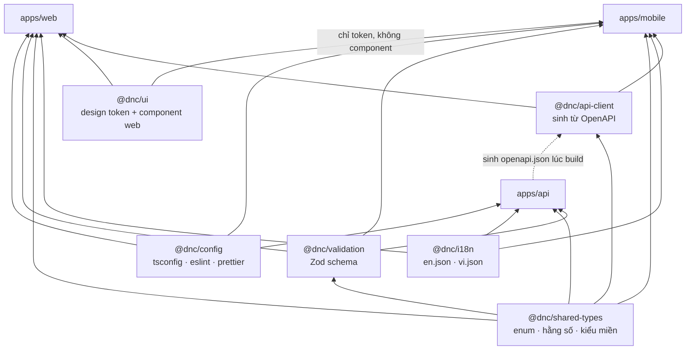

**Quy tắc cứng:** `packages/*` không bao giờ import từ `apps/*`. `apps/*` không bao giờ import chéo nhau. Vi phạm bị `eslint-plugin-import` chặn ở CI.

**Vòng lặp sinh client:** `apps/api` chạy script `pnpm --filter @dnc/api openapi:emit` xuất `openapi.json`, sau đó `packages/api-client` chạy `orval` hoặc `openapi-typescript` sinh kiểu và hook TanStack Query. Job CI kiểm tra file sinh ra không bị lệch (`git diff --exit-code`) — nếu ai đó đổi DTO mà quên chạy lại, CI đỏ.

---

## 6. Quy ước API

### 6.1 Nguyên tắc chung

| # | Quy ước | Chi tiết |
|---|---|---|
| 1 | REST theo tài nguyên | Danh từ số nhiều, kebab-case: `/events`, `/events/{id}/rsvps`. Động từ nằm ở HTTP method, không nằm trong URL. |
| 2 | Version ở path | `/api/v1/...`. Không dùng header hay query để chọn version — khó debug, khó cache, khó đọc log. |
| 3 | JSON UTF-8 | `Content-Type: application/json; charset=utf-8`. Không hỗ trợ XML, không hỗ trợ form-encoded trừ webhook của bên thứ ba. |
| 4 | camelCase ở API, snake_case ở DB | Ranh giới đổi tên nằm ở entity TypeORM (`SnakeNamingStrategy`) và mapper. |
| 5 | ID là UUIDv7 dạng chuỗi | Sắp xếp được theo thời gian tạo, không lộ số lượng bản ghi như `serial`. |
| 6 | Thời gian ISO-8601 UTC | `"2026-11-14T12:30:00.000Z"`. API không bao giờ trả chuỗi giờ đã định dạng cho người đọc. |
| 7 | Mọi response bọc envelope | Kể cả lỗi. Ngoại lệ duy nhất: `/health`, `/metrics`, `/.well-known/*`. |
| 8 | Không trả entity | Xem [mục 5.4](#54-quy-ước-cấu-trúc-module-backend--bốn-class-lõi--layer-dto). |

**Base URL theo môi trường:**

| Môi trường | API | Tài liệu OpenAPI |
|---|---|---|
| Local | `http://localhost:3000/api/v1` | `http://localhost:3000/api/docs` |
| Staging | `https://api-staging.<domain>/api/v1` | `https://api-staging.<domain>/api/docs` (chặn bằng Basic Auth) |
| Production | `https://api.<domain>/api/v1` | **Tắt.** File `openapi.json` phát hành qua CI, không phục vụ công khai. |

### 6.2 Envelope response

Một hình dạng duy nhất cho mọi endpoint. Client chỉ cần viết một lớp bóc tách.

**Thành công:**

```json
{
  "success": true,
  "data": {
    "id": "01930b7e-2f4a-7c31-9e55-1f2b3c4d5e6f",
    "title": "Sunday Beach Volleyball at My Khe",
    "startAt": "2026-11-15T09:00:00.000Z",
    "area": { "id": "01930b6f-...", "slug": "my-khe", "nameEn": "My Khe", "nameVi": "Mỹ Khê" },
    "capacity": 24,
    "goingCount": 19,
    "waitlistCount": 3
  },
  "meta": {
    "requestId": "01930b80-9a11-7f02-bd44-6c7e8a9b0c1d",
    "timestamp": "2026-11-14T03:21:44.812Z",
    "version": "v1"
  }
}
```

**Danh sách** — `data` chính là `CursorPage<T>`:

```json
{
  "success": true,
  "data": {
    "items": [ { "id": "...", "title": "..." } ],
    "nextCursor": "eyJrIjpbIjIwMjYtMTEtMTVUMDk6MDA6MDAuMDAwWiIsIjAxOTMwYjdlLi4uIl0sInMiOiJzdGFydEF0In0",
    "hasMore": true
  },
  "meta": { "requestId": "...", "timestamp": "...", "version": "v1" }
}
```

**Lỗi:**

```json
{
  "success": false,
  "error": {
    "code": "RSVP_EVENT_FULL",
    "message": "This event is full. You have been added to the waitlist.",
    "messageKey": "error.rsvp.eventFull",
    "retryable": false,
    "details": [
      { "field": "guestCount", "code": "MAX_EXCEEDED", "messageKey": "error.rsvp.guestCountMax", "max": 2 }
    ]
  },
  "meta": { "requestId": "...", "timestamp": "...", "version": "v1" }
}
```

**Cách triển khai:**

| Thành phần | File | Việc |
|---|---|---|
| `ResponseEnvelopeInterceptor` | `src/common/interceptors/` | Bọc mọi giá trị trả về từ controller vào `{ success, data, meta }` |
| `AllExceptionsFilter` | `src/common/filters/` | Đổi mọi exception thành envelope lỗi; ánh xạ `HttpException`, `AppException`, lỗi TypeORM, lỗi không lường trước |
| `AppException` | `src/common/errors/app.exception.ts` | Exception nghiệp vụ mang `code` + `messageKey` + `httpStatus` + `retryable` |
| `@SkipEnvelope()` | `src/common/decorators/` | Đánh dấu route trả nguyên văn (`/health`, `/metrics`) |
| `RequestIdMiddleware` | `src/common/middlewares/` | Đọc `X-Request-Id` từ client hoặc sinh UUIDv7; gắn vào log, Sentry và `meta.requestId` |

`message` là tiếng Anh, đã dịch sẵn theo `Accept-Language` nếu có bản dịch. `messageKey` là thứ client nên dùng để tự dịch — vì client biết ngữ cảnh màn hình còn server thì không.

### 6.3 Danh mục mã lỗi

Định dạng: `<MIỀN>_<LÝ_DO>`, SCREAMING_SNAKE_CASE, khai báo tập trung ở `src/common/errors/error-code.enum.ts` và export sang `packages/shared-types`.

| Mã | HTTP | `retryable` | Ý nghĩa / khi nào phát sinh |
|---|---|---|---|
| `VALIDATION_FAILED` | 400 | ✗ | Request DTO không qua `ValidationPipe`; `details[]` liệt kê từng trường |
| `MALFORMED_JSON` | 400 | ✗ | Body không parse được |
| `AUTH_TOKEN_MISSING` | 401 | ✗ | Không có header `Authorization` ở route cần đăng nhập |
| `AUTH_TOKEN_INVALID` | 401 | ✗ | Chữ ký sai, `kid` không có trong JWKS, `aud`/`iss` sai |
| `AUTH_TOKEN_EXPIRED` | 401 | ✓ | Access token hết hạn — client phải gọi `/auth/refresh` rồi thử lại |
| `AUTH_REFRESH_INVALID` | 401 | ✗ | Refresh token không tồn tại hoặc đã hết hạn |
| `AUTH_REFRESH_REUSE_DETECTED` | 401 | ✗ | Phát hiện tái sử dụng — đã thu hồi cả họ token, buộc đăng nhập lại |
| `AUTH_PROVIDER_REJECTED` | 401 | ✗ | `id_token` của Google/Apple/Facebook không hợp lệ |
| `AUTH_ACCOUNT_LOCKED` | 403 | ✗ | Tài khoản bị khoá do kiểm duyệt hoặc quá số lần đăng nhập sai |
| `AUTH_EMAIL_NOT_VERIFIED` | 403 | ✗ | Hành động yêu cầu email đã xác minh |
| `PERM_ROLE_REQUIRED` | 403 | ✗ | Thiếu role (`organizer`, `curator`, `moderator`, `admin`) |
| `PERM_TRUST_TIER_TOO_LOW` | 403 | ✗ | Trust tier chưa đủ; body kèm `requiredTier` và `currentTier` |
| `PERM_NOT_OWNER` | 403 | ✗ | Sửa/xoá tài nguyên không thuộc về mình |
| `RESOURCE_NOT_FOUND` | 404 | ✗ | ID không tồn tại, hoặc tồn tại nhưng người gọi không có quyền thấy (không tiết lộ sự khác biệt) |
| `RESOURCE_GONE` | 410 | ✗ | Sự kiện đã bị gỡ bởi kiểm duyệt hoặc đã xoá mềm |
| `CONFLICT_DUPLICATE` | 409 | ✗ | Vi phạm unique — ví dụ RSVP hai lần cùng một sự kiện |
| `CONFLICT_VERSION_MISMATCH` | 409 | ✗ | Optimistic locking: `version` gửi lên đã cũ, client phải tải lại |
| `CONFLICT_STATE_INVALID` | 409 | ✗ | Chuyển trạng thái không hợp lệ (huỷ một sự kiện đã kết thúc) |
| `EVENT_NOT_PUBLISHED` | 409 | ✗ | RSVP vào sự kiện đang ở `DRAFT` hoặc chờ duyệt |
| `EVENT_ALREADY_STARTED` | 409 | ✗ | Hành động chỉ hợp lệ trước giờ bắt đầu |
| `EVENT_CAPACITY_INVALID` | 400 | ✗ | Giảm sức chứa xuống dưới số người đã nhận chỗ |
| `RSVP_EVENT_FULL` | 409 | ✗ | Hết chỗ — chỉ trả khi sự kiện tắt hàng chờ; nếu bật thì trả 201 với `WAITLISTED` |
| `RSVP_ALREADY_EXISTS` | 409 | ✗ | Đã có bản ghi RSVP còn hiệu lực |
| `RSVP_LIMIT_REACHED` | 429 | ✗ | Vượt giới hạn RSVP theo trust tier (bảng ở tài liệu 05, mục 6.1) |
| `MEDIA_TYPE_NOT_ALLOWED` | 415 | ✗ | MIME ngoài whitelist |
| `MEDIA_TOO_LARGE` | 413 | ✗ | Vượt 8 MB cho ảnh |
| `MEDIA_UPLOAD_EXPIRED` | 410 | ✗ | Presigned URL đã hết hạn, xin lại `upload-intent` |
| `MEDIA_NOT_READY` | 409 | ✓ | Biến thể ảnh chưa xử lý xong, thử lại sau vài giây |
| `OTP_INVALID` | 400 | ✗ | Mã sai |
| `OTP_EXPIRED` | 410 | ✗ | Quá 5 phút |
| `OTP_TOO_MANY_ATTEMPTS` | 429 | ✗ | Quá 5 lần nhập sai — huỷ mã, phải xin mã mới |
| `OTP_COUNTRY_NOT_SUPPORTED` | 400 | ✗ | Mã quốc gia ngoài danh sách cho phép |
| `RATE_LIMIT_EXCEEDED` | 429 | ✓ | Kèm header `Retry-After` |
| `PAGINATION_CURSOR_INVALID` | 400 | ✗ | Cursor sai chữ ký hoặc không giải mã được |
| `PAGINATION_CURSOR_MISMATCH` | 400 | ✗ | Cursor được tạo với `sort` hoặc bộ lọc khác với request hiện tại |
| `IDEMPOTENCY_KEY_REUSED` | 409 | ✗ | Cùng `Idempotency-Key` nhưng body khác lần trước |
| `MODERATION_CONTENT_BLOCKED` | 422 | ✗ | Nội dung bị bộ lọc chặn trước khi lưu |
| `UPSTREAM_UNAVAILABLE` | 502 | ✓ | Nhà cung cấp OTP / push / OIDC lỗi |
| `INTERNAL_ERROR` | 500 | ✓ | Lỗi không lường trước; `requestId` là thứ duy nhất đưa cho người dùng |
| `SERVICE_MAINTENANCE` | 503 | ✓ | Cửa sổ bảo trì có kế hoạch |

**Luật:** không bao giờ đổi ý nghĩa một mã đã phát hành. Thêm mã mới thì thêm; client cũ gặp mã lạ phải rơi về xử lý mặc định theo HTTP status — điều này ghi rõ trong `packages/api-client`.

### 6.4 Phân trang bằng cursor

Không dùng `OFFSET`. Feed sự kiện thay đổi liên tục (sự kiện mới đăng, sự kiện bị gỡ), `OFFSET` sẽ làm người dùng thấy trùng hoặc mất bản ghi khi lật trang, và chi phí quét tăng tuyến tính theo độ sâu.

**Tham số vào:**

| Tham số | Kiểu | Mặc định | Trần | Ghi chú |
|---|---|---|---|---|
| `cursor` | string (base64url) | không | — | Bỏ trống nghĩa là trang đầu |
| `limit` | int | 20 | 50 | Vượt trần thì kẹp về 50, không báo lỗi |
| `sort` | enum | `startAt` | — | Whitelist: `startAt`, `distance`, `popularity`, `createdAt` |

**Cấu trúc cursor** — base64url của JSON, kèm chữ ký HMAC-SHA256 (khoá `CURSOR_SIGNING_SECRET`) để client không tự chế cursor thăm dò dữ liệu:

```jsonc
// nội dung trước khi mã hoá
{
  "k": ["2026-11-15T09:00:00.000Z", "01930b7e-2f4a-7c31-9e55-1f2b3c4d5e6f"], // khoá keyset
  "s": "startAt",        // sort đang dùng
  "f": "9f2c1a...",      // hash của tập bộ lọc, để phát hiện đổi filter giữa chừng
  "v": 1                 // version cấu trúc cursor
}
```

**Truy vấn keyset tương ứng** (`sort=startAt`, chiều tăng dần):

```sql
SELECT e.id, e.title, e.start_at, e.area_id
FROM events e
WHERE e.status = 'PUBLISHED'
  AND e.deleted_at IS NULL
  AND e.area_id = ANY($1)
  AND (e.start_at, e.id) > ($2::timestamptz, $3::uuid)   -- so sánh bộ đôi, dùng đúng index
ORDER BY e.start_at ASC, e.id ASC
LIMIT $4 + 1;                                            -- lấy dư 1 để biết hasMore
```

Index phục vụ: `CREATE INDEX idx_events_feed ON events (status, start_at, id) WHERE deleted_at IS NULL;`

**Quy tắc:**
- Lấy dư một bản ghi để tính `hasMore`, không chạy thêm `COUNT(*)`. API **không trả tổng số** ở feed vô hạn; nơi nào thật sự cần tổng (bảng quản trị) thì có endpoint đếm riêng và trả về `totalApprox`.
- Đổi `sort` hoặc đổi bộ lọc giữa chừng → `PAGINATION_CURSOR_MISMATCH`, client phải bắt đầu lại từ trang một.
- `sort=distance` yêu cầu có `lat`/`lng`; khoá keyset lúc đó là `[distanceMeters, id]` tính bằng `ST_Distance`.
- Chat trong sự kiện phân trang **ngược** (`before` cursor, mới nhất trước) nhưng dùng chung `CursorPage<T>`.

### 6.5 Rate limit

Bảng hạn mức theo trust tier là tài liệu 05, mục 6.1 — tài liệu này chỉ chốt phần giao diện HTTP.

| Header | Ví dụ | Ý nghĩa |
|---|---|---|
| `RateLimit-Limit` | `30` | Hạn mức của cửa sổ hiện tại |
| `RateLimit-Remaining` | `12` | Còn lại |
| `RateLimit-Reset` | `47` | Số giây tới khi cửa sổ đặt lại |
| `Retry-After` | `47` | Chỉ có ở phản hồi 429 |

Triển khai: `ThrottlerGuard` tuỳ biến, khoá Redis theo `rl:{action}:{scope}` với `scope` là `userId` khi đã đăng nhập, `ip` khi ẩn danh. Thuật toán sliding window counter bằng `INCR` + `EXPIRE`, một lệnh Lua để nguyên tử.

Sau reverse proxy, IP thật lấy từ `X-Forwarded-For` — bắt buộc bật `app.set('trust proxy', 1)` và chỉ tin proxy của chính mình, nếu không kẻ tấn công tự đặt header là vượt được mọi giới hạn theo IP.

### 6.6 Idempotency

Bắt buộc header `Idempotency-Key` (UUID do client sinh) cho các POST tạo hiệu ứng phụ: tạo RSVP, tạo sự kiện, xác nhận media, gửi report, đổi trạng thái sự kiện.

| Bước | Hành vi |
|---|---|
| 1 | Khoá Redis `idem:{userId}:{routeKey}:{idempotencyKey}`, TTL 24 giờ |
| 2 | Lần đầu: `SET NX` thành công → xử lý → lưu `{ bodyHash, statusCode, responseBody }` |
| 3 | Lặp lại cùng body: trả nguyên response đã lưu + header `Idempotency-Replayed: true` |
| 4 | Lặp lại **khác** body: `IDEMPOTENCY_KEY_REUSED` (409) |
| 5 | Đang xử lý dở (khoá tồn tại nhưng chưa có response): trả 409 `CONFLICT_STATE_INVALID` với `retryable: true` |

Lý do bắt buộc: mạng 4G ở Đà Nẵng chập chờn, client React Native tự retry, và người dùng bấm nút hai lần khi thấy màn hình chưa phản hồi. Không có idempotency thì RSVP đúp và sự kiện đúp là chuyện xảy ra hằng ngày.

### 6.7 Ngữ nghĩa HTTP

| Method | Dùng cho | Idempotent | Trả về |
|---|---|---|---|
| `GET` | Đọc | ✓ | 200 + tài nguyên hoặc `CursorPage` |
| `POST` | Tạo, hoặc hành động không map được vào CRUD (`/auth/refresh`) | ✗ (dùng `Idempotency-Key`) | 201 + tài nguyên; 200 cho hành động |
| `PATCH` | Sửa một phần | ✗ | 200 + tài nguyên sau khi sửa |
| `PUT` | Thay toàn bộ — hầu như không dùng | ✓ | 200 |
| `DELETE` | Xoá mềm hoặc rút lui (huỷ RSVP) | ✓ | 204 không body |

Không dùng 3xx trong API. Không trả 200 kèm `success: false` — status HTTP và `success` luôn nhất quán.

### 6.8 Danh mục endpoint MVP

| Nhóm | Method + Path | Quyền | Ghi chú |
|---|---|---|---|
| Auth | `POST /auth/register` | công khai | email + mật khẩu, gửi mail xác minh |
| | `POST /auth/login` | công khai | trả access + refresh |
| | `POST /auth/social` | công khai | `{ provider, idToken \| code, nonce }` |
| | `POST /auth/refresh` | refresh token | xoay vòng, phát hiện tái sử dụng |
| | `POST /auth/logout` | đã đăng nhập | thu hồi refresh hiện tại |
| | `POST /auth/logout-all` | đã đăng nhập | thu hồi mọi họ token |
| | `POST /auth/password/forgot` · `/reset` | công khai | token dùng một lần, 30 phút |
| | `POST /auth/phone/otp/request` · `/verify` | đã đăng nhập | nâng trust tier lên T2 |
| | `GET /auth/sessions` · `DELETE /auth/sessions/{id}` | đã đăng nhập | quản lý thiết bị |
| | `GET /.well-known/jwks.json` | công khai | khoá công khai để verify RS256 |
| Người dùng | `GET /me` · `PATCH /me` | đã đăng nhập | hồ sơ riêng, có email/phone |
| | `GET /users/{id}` | công khai | hồ sơ công khai, **không** có email/phone |
| | `POST /me/devices` · `DELETE /me/devices/{id}` | đã đăng nhập | đăng ký token push |
| | `GET /me/notification-preferences` · `PATCH` | đã đăng nhập | bật/tắt theo loại + giờ yên lặng |
| | `POST /me/deletion-request` | đã đăng nhập | quyền xoá dữ liệu, xem [mục 15](#15-bảo-mật-quyền-riêng-tư-và-tuân-thủ) |
| | `GET /me/data-export` | đã đăng nhập | quyền truy cập dữ liệu, trả job id |
| Sự kiện | `GET /events` | công khai | feed + lọc; xem 6.9 |
| | `GET /events/{idOrSlug}` | công khai | chi tiết; SSR web dùng endpoint này |
| | `POST /events` | T2+ | `Idempotency-Key` bắt buộc |
| | `PATCH /events/{id}` | chủ sở hữu | có `version` cho optimistic locking |
| | `POST /events/{id}/publish` · `/cancel` | chủ sở hữu | chuyển trạng thái |
| | `DELETE /events/{id}` | chủ sở hữu / moderator | xoá mềm |
| | `GET /events/{id}/attendees` | công khai có giới hạn | danh sách rút gọn; note chỉ organizer thấy |
| | `POST /events/{id}/claim` | đã đăng nhập | nhận quyền quản lý listing đã curate |
| RSVP | `POST /events/{id}/rsvps` | T1+ | trả `GOING` hoặc `WAITLISTED` + `waitlistPosition` |
| | `DELETE /events/{id}/rsvps/me` | đã đăng nhập | huỷ, kích hoạt thăng hạng hàng chờ |
| | `GET /me/rsvps` | đã đăng nhập | lịch của tôi, lọc `upcoming` / `past` |
| Khu vực | `GET /areas` | công khai | cây khu vực Đà Nẵng, cache 24 giờ |
| | `GET /areas/{slug}` | công khai | trang SEO theo khu vực |
| Danh mục | `GET /categories` | công khai | cache 24 giờ |
| Tìm kiếm | `GET /search/suggest` | công khai | gợi ý gõ tắt, `pg_trgm` |
| Media | `POST /media/upload-intent` | đã đăng nhập | trả presigned PUT |
| | `POST /media/confirm` | đã đăng nhập | xác nhận + xếp hàng xử lý ảnh |
| Chat | `GET /events/{id}/messages` | người đã RSVP | phân trang ngược |
| | `POST /events/{id}/messages` | người đã RSVP | cũng phát qua Socket.IO |
| Report | `POST /reports` | T1+ | báo cáo sự kiện / người dùng / tin nhắn |
| | `POST /users/{id}/block` · `DELETE` | đã đăng nhập | chặn hai chiều |
| Kiểm duyệt | `GET /admin/moderation/queue` | moderator | ưu tiên P1→P3 |
| | `POST /admin/moderation/{id}/decide` | moderator | gỡ / giữ / cảnh cáo / cấm |
| | `GET /admin/stats` | admin | số liệu vận hành |
| Curate | `POST /admin/curation/events` | curator | nhập tay từ nguồn công khai |
| | `GET /admin/curation/tasks` | curator | hàng chờ liên hệ organizer gốc |
| Hệ thống | `GET /health/live` · `/health/ready` | công khai | không bọc envelope |
| | `GET /app/config` | công khai | `minSupportedVersion`, cờ tính năng, thông báo bảo trì |

### 6.9 Quy ước query và header

**Bộ lọc feed** `GET /events` — khớp với tài liệu 08, mục Sprint 3:

| Tham số | Kiểu | Ví dụ |
|---|---|---|
| `q` | string | `volleyball` |
| `categories[]` | slug[] | `sports,language-exchange` |
| `areas[]` | slug[] | `an-thuong,my-khe,my-an,hai-chau,son-tra,ngu-hanh-son` |
| `from` · `to` | ISO-8601 UTC | `2026-11-14T00:00:00Z` |
| `languages[]` | BCP-47 | `en,vi,ko` |
| `priceMax` | int (VND) | `200000` |
| `lat` · `lng` · `radiusKm` | float | `16.0544` · `108.2472` · `3` |
| `sort` | enum | `startAt` · `distance` · `popularity` |
| `cursor` · `limit` | xem 6.4 | |

Mảng dùng dạng lặp lại (`?areas=an-thuong&areas=my-khe`) **hoặc** phân tách bằng dấu phẩy — API chấp nhận cả hai, DTO chuẩn hoá về mảng bằng `@Transform`.

**Header:**

| Header | Chiều | Ví dụ | Việc |
|---|---|---|---|
| `Authorization` | vào | `Bearer eyJhbGci...` | Access token |
| `Accept-Language` | vào | `en-US,en;q=0.9,vi;q=0.8` | Chọn ngôn ngữ cho `message` và cho `nameEn`/`nameVi` |
| `X-Request-Id` | vào/ra | UUIDv7 | Truy vết xuyên client → API → worker → log |
| `X-Client` | vào | `dnc-mobile/1.4.0 (ios 18.2)` | Thống kê và cưỡng chế phiên bản tối thiểu |
| `X-Timezone` | vào | `Asia/Ho_Chi_Minh` | Chỉ dùng cho tính giờ yên lặng của push, không dùng để định dạng response |
| `Idempotency-Key` | vào | UUID | Xem 6.6 |
| `RateLimit-*` | ra | xem 6.5 | |
| `Deprecation` · `Sunset` | ra | `Sun, 01 Aug 2027 00:00:00 GMT` | Xem 6.10 |

### 6.10 Version và vòng đời

| Loại thay đổi | Có phá vỡ không | Cách làm |
|---|---|---|
| Thêm trường vào response | Không | Làm trực tiếp trên `v1`. Client bắt buộc bỏ qua trường lạ. |
| Thêm tham số query tuỳ chọn | Không | Làm trực tiếp |
| Thêm giá trị enum mới | **Có thể** | Client phải có nhánh `default`. Ghi rõ trong `packages/shared-types` rằng mọi enum đều mở. |
| Đổi tên / xoá trường | Có | Thêm trường mới, giữ trường cũ ≥ 90 ngày kèm `Deprecation`, rồi mới xoá ở `v2` |
| Đổi ngữ nghĩa mã lỗi | Có | Cấm. Thêm mã mới. |
| Đổi cấu trúc envelope | Có | Chỉ ở `v2`, chạy song song `v1` tối thiểu 90 ngày |

App di động không tự cập nhật ngay được, nên `GET /app/config` trả `minSupportedVersion`. Khi client dưới ngưỡng, app hiện màn hình chặn "Please update" thay vì gọi API và nhận lỗi khó hiểu. Ngưỡng này chỉ nâng khi thật sự cần thiết — mỗi lần nâng là một lần mất một phần người dùng.

---

## 7. Chiến lược xác thực và định danh

### 7.1 Mô hình định danh

Một `user` có thể có nhiều cách đăng nhập. Khoá định danh **không bao giờ là email**, mà là cặp `(provider, provider_user_id)`.

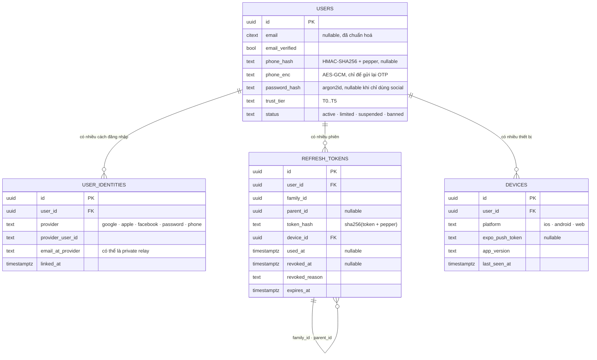

Unique bắt buộc: `uq_user_identities_provider_uid (provider, provider_user_id)` và `uq_refresh_tokens_hash (token_hash)`.

### 7.2 Access token — JWT RS256

**Vì sao RS256 chứ không HS256:** khoá công khai phát cho bất kỳ thành phần nào cần verify (BFF của Next.js, worker, sau này là service tách ra) mà không phải chia sẻ bí mật ký. Xoay khoá không cần phát lại secret cho mọi nơi. Chi phí ký cao hơn HMAC nhưng ở mức vài chục micro giây — không đáng kể so với một truy vấn DB.

**Claim:**

| Claim | Ví dụ | Ghi chú |
|---|---|---|
| `iss` | `https://api.<domain>` | Verify nghiêm ngặt |
| `aud` | `dnc-mobile` \| `dnc-web` | Token của web không dùng được cho mobile |
| `sub` | `01930b7e-...` | `user.id` |
| `sid` | `01930b81-...` | ID phiên, để thu hồi từng phiên |
| `jti` | UUIDv7 | Cho phép chặn từng token trong danh sách đen ngắn hạn |
| `iat` · `exp` | epoch | TTL **15 phút** |
| `roles` | `["user","organizer"]` | Đọc bởi `RolesGuard` |
| `tier` | `"T3"` | Đọc bởi `TrustTierGuard` |
| `amr` | `["google"]` \| `["pwd","otp"]` | Phương thức đã dùng để xác thực |
| `ver` | `1` | Version cấu trúc claim |

**Không nhét dữ liệu cá nhân vào token.** Không có email, không có tên, không có số điện thoại — token đi qua log, qua proxy, qua báo cáo lỗi.

**Xoay khoá:** luôn có hai khoá hoạt động (`kid` hiện tại để ký, `kid` trước đó chỉ để verify). Xoay 90 ngày một lần, hoặc ngay lập tức khi nghi ngờ lộ. Khoá riêng nằm trong secret của môi trường, không nằm trong image Docker. JWKS phục vụ ở `GET /.well-known/jwks.json`, cache 10 phút phía client.

**Hệ quả của việc token không kiểm tra được ngay:** JWT sống 15 phút nghĩa là một tài khoản bị cấm vẫn gọi API được tối đa 15 phút. Với hành động nghiêm trọng (cấm tài khoản, gỡ nội dung), guard tra thêm một khoá Redis `revoked:sid:{sid}` — chỉ một lệnh `EXISTS`, TTL bằng đúng TTL còn lại của token. Đây là đường tắt có kiểm soát, không phải kiểm tra DB mỗi request.

### 7.3 Refresh token xoay vòng và phát hiện tái sử dụng

Refresh token **không phải JWT**. Nó là 32 byte ngẫu nhiên mã base64url. Server lưu `sha256(token + pepper)`, không lưu bản gốc — lộ database cũng không dùng được token.

| Thuộc tính | Giá trị |
|---|---|
| TTL trượt | 30 ngày kể từ lần dùng gần nhất |
| TTL tuyệt đối | 180 ngày kể từ khi đăng nhập; hết hạn là phải đăng nhập lại |
| Xoay vòng | Mỗi lần `/auth/refresh` cấp token mới và đánh dấu token cũ `used_at` |
| Họ token | `family_id` giữ nguyên suốt chuỗi xoay; `parent_id` trỏ token trước |

**Phát hiện tái sử dụng:** nếu một token đã có `used_at` lại được gửi lên lần nữa, hoặc là kẻ tấn công đang dùng token đánh cắp, hoặc là người dùng thật đang dùng token đã bị đánh cắp trước đó. Không phân biệt được, nên xử lý cứng: thu hồi **toàn bộ** `family_id`, ghi `security_event`, gửi email + push "Có hoạt động đăng nhập bất thường, bạn đã bị đăng xuất khỏi mọi thiết bị".

**Cửa sổ ân hạn 30 giây** — chi tiết dễ bỏ sót nhưng gây khiếu nại nhiều nhất: app di động thường bắn hai request song song cùng lúc access token hết hạn, cả hai cùng gọi `/auth/refresh` với cùng một refresh token. Không có ân hạn thì request thứ hai bị coi là tấn công và người dùng bị đăng xuất vô cớ. Quy tắc: nếu `used_at` nằm trong vòng 30 giây và token con sinh ra từ nó **chưa** bị thu hồi, trả lại đúng cặp token đã cấp cho request đầu thay vì báo động.

Ngoài ra, client phải tự tuần tự hoá việc refresh: một mutex trong `packages/api-client`, các request 401 xếp hàng chờ một lần refresh duy nhất rồi cùng thử lại.

### 7.4 Nơi lưu token

| Kênh | Access token | Refresh token | Rủi ro chính | Biện pháp |
|---|---|---|---|---|
| **Mobile (Expo)** | Chỉ trong bộ nhớ tiến trình (Zustand, **không** persist) | `expo-secure-store` → iOS Keychain, Android Keystore/EncryptedSharedPreferences | Thiết bị đã root/jailbreak | Bật `requireAuthentication` cho thiết bị có sinh trắc; xoá SecureStore khi phát hiện tái sử dụng token |
| **Web (Next.js BFF)** | Cookie `httpOnly` `Secure` `SameSite=Lax`, tên `__Host-dnc_at` | Cookie `httpOnly` `Secure` `SameSite=Strict`, `Path=/api/auth`, tên `__Host-dnc_rt` | XSS đánh cắp token | JS trong trình duyệt **không đọc được** cookie; CSP nghiêm ngặt; refresh chạy hoàn toàn phía server |
| **Web → API** | Route Handler của Next.js đọc cookie, gắn `Authorization` khi gọi API | Không bao giờ rời server | Máy chủ Next.js bị chiếm | Không lưu token dài hạn trên server; cookie là nơi duy nhất |

**Cấm tuyệt đối:** `localStorage` và `sessionStorage` cho bất kỳ loại token nào. Một lỗ XSS duy nhất — kể cả từ thư viện bên thứ ba — là mất sạch phiên của mọi người dùng.

**CSRF cho chế độ cookie:** vì trình duyệt tự gắn cookie, mọi request thay đổi dữ liệu đi qua BFF phải kèm token double-submit (`__Host-dnc_csrf` cookie có thể đọc + header `X-CSRF-Token` khớp), cộng với `SameSite`. Mobile không dùng cookie nên không có bề mặt CSRF.

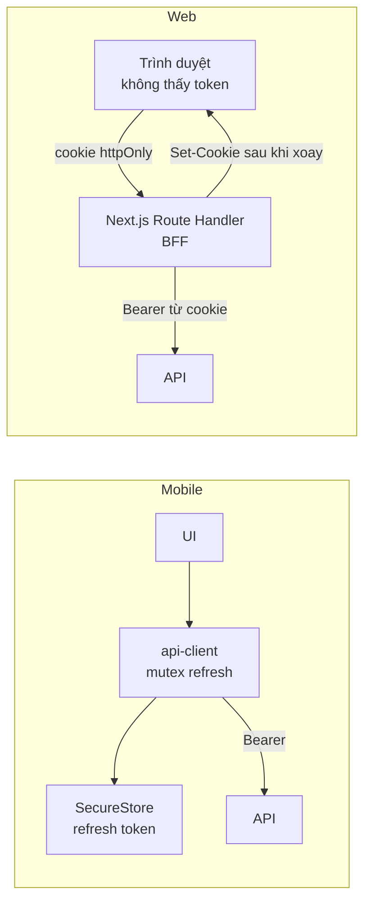

### 7.5 Social login

Luồng chung: client lấy `id_token` (hoặc `authorization code`) từ nhà cung cấp, gửi lên `POST /api/v1/auth/social`. API tự verify chữ ký theo JWKS của nhà cung cấp — **không** gọi endpoint `tokeninfo` của bên thứ ba trong đường request nóng.

Bốn kiểm tra bắt buộc: chữ ký hợp lệ theo `kid`; `iss` đúng; `aud` nằm trong danh sách client ID của chính mình; `nonce` khớp giá trị client gửi kèm khi khởi tạo (chống replay).

| Nhà cung cấp | Thư viện client | Cạm bẫy phải xử lý |
|---|---|---|
| **Google** | `expo-auth-session` / `@react-native-google-signin` | Có **ba** client ID khác nhau (iOS, Android, Web). `aud` phải whitelist cả ba. Trên Android, `id_token` chỉ trả về khi truyền đúng `webClientId`. |
| **Apple** | `expo-apple-authentication` | Email và tên **chỉ trả về lần đầu tiên** — không lưu ngay là mất vĩnh viễn. Email có thể là `@privaterelay.appleid.com`; email này đổi nếu người dùng huỷ liên kết rồi liên kết lại → tuyệt đối không dùng email làm khoá. Bắt buộc có trên iOS nếu app đã có social login khác (App Review 4.8). |
| **Facebook** | `react-native-fbsdk-next` | Trả access token chứ không phải `id_token` → phải gọi `GET /debug_token` để xác nhận `app_id` là của mình, rồi `GET /me?fields=id,name,email`. Email **có thể không có** (đăng ký bằng số điện thoại) → phải có màn hình bổ sung email. |

**Liên kết tài khoản — quy tắc chống chiếm tài khoản:** nếu email từ nhà cung cấp trùng với một tài khoản đã có, **không** tự động gộp. Yêu cầu người dùng đăng nhập bằng phương thức cũ trước, rồi mới thêm identity mới. Tự động gộp theo email là lỗ hổng kinh điển: một nhà cung cấp không xác minh email là đủ để chiếm tài khoản người khác. Chỉ chấp nhận email khi nhà cung cấp khẳng định `email_verified: true`.

### 7.6 Xác thực số điện thoại bằng OTP

**Hai lý do phải có:** trust tier T2 (`phone_verified`, +12 điểm theo tài liệu 03 mục 4) và nghĩa vụ pháp lý theo Nghị định 147/2024/NĐ-CP. Tài liệu 06 (kết luận #5) đã đánh dấu đây là **rủi ro pháp lý số 1** vì luật yêu cầu số di động Việt Nam, trong khi người dùng mục tiêu là expat, nhiều người dùng số nước ngoài. Kiến trúc dưới đây chuẩn bị cho cả hai đường, nhưng **quyết định cuối cùng phải có ý kiến luật sư** trước khi khoá luồng đăng ký.

**Định tuyến lai theo mã quốc gia:**

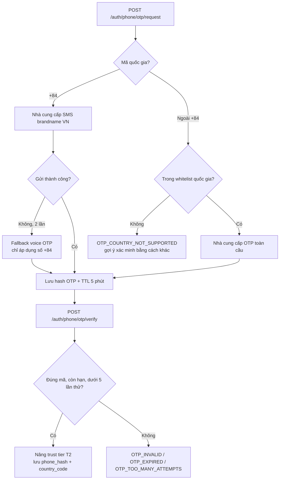

**Nhà cung cấp khả thi tại Việt Nam và chi phí tham chiếu** (giá 08/2026, ±20%, tỷ giá 26.000 VND/USD):

| Nhà cung cấp | Loại | Phạm vi | Giá tham chiếu / tin | Quy đổi USD | Đánh giá |
|---|---|---|---|---|---|
| eSMS.vn | SMS brandname | Số VN | 350 – 800 VND | 0,013 – 0,031 | Phổ biến nhất, API REST đơn giản, hoá đơn VAT trong nước |
| VietGuys | SMS brandname | Số VN | 350 – 750 VND | 0,013 – 0,029 | Tương đương, hay dùng làm nhà cung cấp thứ hai để dự phòng |
| Incom / VNPT SMS | SMS brandname | Số VN | 400 – 850 VND | 0,015 – 0,033 | Đi thẳng qua nhà mạng, ổn định hơn khi tải cao |
| Stringee | Voice OTP + SMS | Số VN | 700 – 1.200 VND (voice) | 0,027 – 0,046 | Đường lùi khi SMS không tới; tỷ lệ tới cao |
| Zalo ZNS | Tin qua Zalo | Số VN có Zalo | 250 – 450 VND | 0,010 – 0,017 | Rẻ nhất nhưng **expat hiếm dùng Zalo** → chỉ hữu ích cho người Việt |
| Twilio Verify | OTP toàn cầu | ~200 quốc gia | ~0,05 USD/lần verify + cước SMS | 0,09 – 0,15 | Đắt gấp 4–8 lần đường VN nhưng là đường duy nhất cho số quốc tế |
| Vonage Verify | OTP toàn cầu | Toàn cầu | tương đương Twilio | 0,08 – 0,14 | Ứng viên dự phòng |

**Chốt:** `OtpSenderService` là một interface với hai adapter — `VnBrandnameOtpAdapter` (mặc định eSMS, cấu hình đổi được sang VietGuys mà không sửa code) và `GlobalOtpAdapter` (Twilio Verify). Định tuyến theo `country_code` đã chuẩn hoá bằng `libphonenumber-js`.

**Điều kiện vận hành phải chuẩn bị trước mốc M3 (13/11/2026):** đăng ký brandname với nhà mạng cần giấy phép kinh doanh và mất 5–10 ngày làm việc — tức là phụ thuộc vào việc thành lập công ty TNHH (tài liệu 06, kết luận #10). Đưa việc này vào lịch từ Sprint 4, không để đến lúc cần mới làm.

**Bảo mật OTP:**

| Biện pháp | Chi tiết |
|---|---|
| Độ dài và TTL | 6 chữ số, 5 phút, sinh bằng `crypto.randomInt` |
| Lưu trữ | Chỉ lưu `sha256(otp + phone_hash + pepper)` trong Redis, không lưu mã thô |
| Số lần thử | Tối đa 5, quá thì huỷ mã |
| Rate limit | 3 lần/giờ, 8 lần/ngày theo `phone_hash` (tài liệu 05, mục 6.1) |
| Lưu số điện thoại | `phone_hash` = HMAC-SHA256 + pepper để so trùng; `phone_enc` = AES-256-GCM chỉ để gửi lại tin. Khoá mã hoá **không** nằm cùng database |
| Chống gian lận cước (SMS pumping) | Whitelist mã quốc gia; chặn dải số dịch vụ trả phí; giới hạn theo IP/ASN; bật CAPTCHA khi vượt ngưỡng; đặt cảnh báo chi tiêu ngày ở nhà cung cấp |
| Chống dò | Phản hồi giống nhau cho số đã đăng ký và chưa đăng ký |

### 7.7 Phân quyền — role và trust tier

Hai trục độc lập, kiểm tra bằng hai guard xếp chồng:

```ts
@UseGuards(JwtAuthGuard, RolesGuard, TrustTierGuard)
@Roles(UserRole.USER)
@MinTrustTier(TrustTier.T2)
@Post()
create(@CurrentUser() user: AuthUser, @Body() body: CreateEventRequest) { /* ... */ }
```

| Guard | Nguồn dữ liệu | Lỗi trả về |
|---|---|---|
| `JwtAuthGuard` | Chữ ký JWT + `revoked:sid:{sid}` trong Redis | `AUTH_TOKEN_*` |
| `RolesGuard` | Claim `roles` | `PERM_ROLE_REQUIRED` |
| `TrustTierGuard` | Claim `tier` | `PERM_TRUST_TIER_TOO_LOW`, kèm `requiredTier` để UI hiện đúng hướng dẫn nâng cấp |
| `@Public()` | Decorator | Bỏ qua toàn bộ chuỗi guard |

Vì `tier` nằm trong token 15 phút, người dùng vừa xác minh số điện thoại sẽ chưa thấy quyền mới ngay. Xử lý: endpoint `/auth/phone/otp/verify` trả luôn cặp token mới với `tier` đã cập nhật, client thay token tại chỗ.

### 7.8 Bảng cạm bẫy xác thực và biện pháp

| Cạm bẫy | Hậu quả | Biện pháp |
|---|---|---|
| Dùng email làm khoá định danh | Chiếm tài khoản qua nhà cung cấp không xác minh email | Khoá là `(provider, provider_user_id)`; chỉ tin `email_verified: true` |
| Không lưu email/tên Apple lần đầu | Mất vĩnh viễn, hồ sơ trống | Lưu ngay trong transaction tạo user |
| Không có mutex refresh ở client | Đăng xuất vô cớ hàng loạt | Mutex + cửa sổ ân hạn 30 giây (7.3) |
| Token trong `localStorage` | Một XSS mất toàn bộ phiên | Cookie `httpOnly` cho web, SecureStore cho mobile |
| `X-Forwarded-For` không kiểm soát | Vượt mọi rate limit theo IP | `trust proxy` đúng số tầng proxy |
| Không giới hạn quốc gia OTP | Hoá đơn SMS tăng vọt do gian lận cước | Whitelist + cảnh báo chi tiêu |
| Mật khẩu hash bằng bcrypt cấu hình yếu | Bẻ khoá hàng loạt khi lộ DB | `argon2id`, `memoryCost` ≥ 19 MiB, `timeCost` ≥ 2 |
| Thông báo lỗi đăng nhập quá chi tiết | Dò danh sách email đã đăng ký | Một thông báo chung cho sai email và sai mật khẩu |

---

## 8. Realtime và Push Notification

### 8.1 Ma trận quyết định — cái gì realtime, cái gì push

Nhầm lẫn hai kênh này là nguồn gốc của cả thông báo phiền và thông báo bị mất. Quy tắc phân định: **Socket.IO phục vụ người đang nhìn màn hình; push phục vụ người không nhìn màn hình; email phục vụ thứ cần lưu lại.**

| Sự kiện nghiệp vụ | Realtime (app đang mở) | Push (nền / đã đóng) | Email | Ghi chú |
|---|---|---|---|---|
| `attendee_count_changed` | ✓ | ✗ | ✗ | Chỉ cập nhật số trên màn hình chi tiết sự kiện. Push cho việc này là phiền. |
| `rsvp_created` (báo cho organizer) | ✓ | ✓ gộp nhóm | ✗ | Gộp: "3 người mới đăng ký" thay vì 3 thông báo |
| `waitlist_promoted` | ✓ | ✓ | ✓ | **Quan trọng nhất** — người dùng cần biết ngay để sắp xếp lịch |
| `event_updated` (đổi giờ / địa điểm) | ✓ | ✓ | ✓ | Bỏ qua giờ yên lặng nếu sự kiện diễn ra trong 24 giờ tới |
| `event_cancelled` | ✓ | ✓ **critical** | ✓ | Luôn gửi, kể cả trong giờ yên lặng |
| `new_chat_message` | ✓ | ✓ gộp theo luồng | ✗ | Gộp theo `event_id`, tối đa 1 push / 5 phút / luồng |
| `event_reminder_t24h` | ✗ | ✓ | ✗ | Job trễ trong BullMQ |
| `event_reminder_t2h` | ✗ | ✓ | ✗ | Kèm deep link tới chỉ đường |
| `moderation_action` | ✗ | ✓ | ✓ | Nội dung bị gỡ, cảnh cáo, cấm — email là bằng chứng |
| `claim_listing_invite` | ✗ | ✗ | ✓ | Gửi cho organizer gốc, người chưa có tài khoản |
| `weekly_digest` | ✗ | ✓ tuỳ chọn | ✓ tuỳ chọn | Repeatable job, sáng Thứ Năm giờ Đà Nẵng |
| `security_alert` (tái sử dụng token) | ✗ | ✓ **critical** | ✓ | Xem mục 7.3 |

### 8.2 Socket.IO — hợp đồng kênh realtime

| Hạng mục | Chốt |
|---|---|
| Namespace | Duy nhất `/rt`. Không tạo namespace theo miền — phân tách bằng room là đủ. |
| Xác thực | Access token trong `handshake.auth.token`. **Không** dùng query string (lộ trong log của proxy). Verify ở `ConnectionGuard`; token hết hạn giữa phiên → server phát `auth:expired`, client refresh rồi kết nối lại. |
| Room | `user:{userId}` (cá nhân), `event:{eventId}` (mọi người xem chi tiết), `thread:{eventId}` (chỉ người đã RSVP, cho chat) |
| Vào room | Client gửi `event:subscribe { eventId }`; server kiểm tra quyền rồi mới `join`. Không tin client tự khai. |
| Scale ngang | `@socket.io/redis-adapter` trên Redis db 2. Nginx bật `ip_hash` để giữ sticky session cho polling fallback. |
| Nhịp tim | `pingInterval: 25s`, `pingTimeout: 20s` |
| Giới hạn | 3 kết nối đồng thời / user; vượt thì đóng kết nối cũ nhất |
| Nén | `perMessageDeflate` tắt — payload nhỏ, nén tốn CPU hơn tiết kiệm băng thông |

**Sự kiện server → client:**

| Tên | Payload | Room |
|---|---|---|
| `event:counts` | `{ eventId, goingCount, waitlistCount, spotsLeft }` | `event:{id}` |
| `event:updated` | `{ eventId, changedFields[], version }` | `event:{id}` |
| `event:cancelled` | `{ eventId, reason }` | `event:{id}` |
| `rsvp:promoted` | `{ eventId, rsvpId, newStatus }` | `user:{id}` |
| `chat:message` | `{ eventId, messageId, authorId, body, sentAt }` | `thread:{id}` |
| `notification:new` | `{ id, type, title, body, url }` | `user:{id}` |
| `auth:expired` | `{}` | kết nối hiện tại |

**Sự kiện client → server:** `event:subscribe`, `event:unsubscribe`, `chat:send` (có ack), `chat:typing` (throttle 3 giây, không lưu DB).

**Luật:** realtime là kênh **tăng cường**, không phải nguồn sự thật. Mất kết nối, mất gói, app ở nền — mọi thứ vẫn phải đúng sau khi client gọi lại REST. Không có trạng thái nào chỉ tồn tại qua socket.

### 8.3 Đường ống push notification

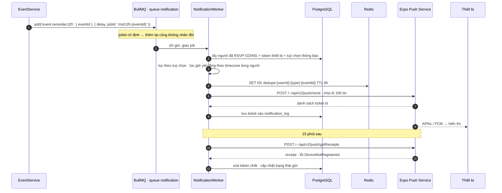

**Payload chuẩn:**

```json
{
  "to": "ExponentPushToken[xxxxxxxxxxxxxxxxxxxxxx]",
  "title": "You're in! A spot opened up",
  "body": "Sunday Beach Volleyball at My Khe — Sun 15 Nov, 4:00 PM",
  "data": {
    "type": "waitlist_promoted",
    "url": "https://<domain>/events/sunday-beach-volleyball-my-khe",
    "eventId": "01930b7e-2f4a-7c31-9e55-1f2b3c4d5e6f",
    "notificationId": "01930b90-..."
  },
  "channelId": "events",
  "priority": "high",
  "sound": "default",
  "badge": 3
}
```

| Quy tắc | Chi tiết |
|---|---|
| Nội dung push | Tiếng Anh theo mặc định, dùng `locale` đã lưu của người dùng nếu có. Dịch ở worker bằng `packages/i18n`, không dịch ở client. |
| Không chứa dữ liệu riêng tư | Không đưa nội dung tin nhắn đầy đủ, không đưa email/số điện thoại vào payload — payload đi qua APNs/FCM ở nước ngoài |
| Giờ yên lặng | 22:00 – 07:00 theo timezone người dùng (mặc định `Asia/Ho_Chi_Minh`); loại `critical` bỏ qua |
| Gộp nhóm | Khoá `dedupe:{userId}:{type}:{entityId}` trong Redis; trong cửa sổ gộp thì cộng dồn thành một tin |
| Chia lô | 100 tin/request theo giới hạn của Expo; `Promise.allSettled` để một lô lỗi không kéo đổ cả job |
| Thử lại | 5 lần, backoff mũ 5s → 80s; lỗi `MessageRateExceeded` thì đẩy lại vào hàng đợi với delay |
| Token chết | `DeviceNotRegistered` → xoá bản ghi `devices` ngay, không thử lại |
| Android channel | Tạo sẵn `events`, `chat`, `moderation` với độ ưu tiên khác nhau để người dùng tắt riêng từng loại |
| Ghi vết | Mọi push ghi vào `notification_log` với `ticket_id` và `receipt_status` — cần cho việc gỡ rối "tôi không nhận được thông báo" |

### 8.4 Deep link và universal link

Một URL, ba hành vi. Đây là điều kiện để việc chia sẻ link sự kiện vào Facebook group và WhatsApp — kênh tăng trưởng chính theo tài liệu 07 — thật sự dẫn được người dùng vào app.

| Hạ tầng | Giá trị | Nơi khai báo |
|---|---|---|
| Custom scheme | `dnconnect://` | `app.config.ts` → `scheme` |
| Universal Link (iOS) | `https://<domain>/.well-known/apple-app-site-association` — trả `application/json`, **không** redirect, **không** có đuôi `.json` trong URL | Phục vụ bởi `apps/web` |
| App Link (Android) | `https://<domain>/.well-known/assetlinks.json` | Phục vụ bởi `apps/web` |
| Associated domains | `applinks:<domain>` | `app.config.ts` → `ios.associatedDomains` |
| Intent filter | `autoVerify: true`, host `<domain>` | `app.config.ts` → `android.intentFilters` |

**Cạm bẫy Android quan trọng nhất:** `assetlinks.json` phải chứa vân tay SHA-256 của **cả** khoá tải lên **và** khoá do Google Play ký lại (Play App Signing). Chỉ khai vân tay khoá tải lên là link mở được ở bản debug nhưng chết ở bản phát hành trên Play — lỗi hay gặp và mất thời gian truy tìm.

**Bảng ánh xạ route:**

| URL công khai | Route Expo Router | Khi chưa cài app | Cần đăng nhập |
|---|---|---|---|
| `/events/{slug}` | `/event/[id]` | Trang web đầy đủ + OG tag + nút "Open in app" | Không |
| `/events/{slug}/attendees` | `/event/[id]/attendees` | Trang web, danh sách rút gọn | Không |
| `/areas/{slug}` | `/(tabs)/index?area={slug}` | Trang khu vực có SEO | Không |
| `/u/{handle}` | `/profile/[handle]` | Hồ sơ công khai | Không |
| `/invite/{code}` | `/invite/[code]` | Trang mời + hướng dẫn tải app | Có, sau khi mở |
| `/my/events` | `/(tabs)/my-events` | Chuyển tới trang đăng nhập web | Có |
| `/verify-email?token=` | `/auth/verify` | Xử lý ngay trên web | Không |

**Quy tắc:** push notification luôn mang `data.url` là **URL https**, không phải `dnconnect://`. Một cơ chế xử lý duy nhất cho cả push, link chia sẻ và mã QR; nếu app đã cài thì hệ điều hành mở app, nếu chưa thì mở web. Custom scheme chỉ còn dùng cho callback OAuth.

**Checklist kiểm thử trước mỗi lần phát hành** — dán vào Definition of Done của M5:

- [ ] iOS: dán link vào Notes rồi bấm → mở app đúng màn hình (Safari address bar **không** kích hoạt universal link, phải test đúng cách)
- [ ] Android: `adb shell am start -a android.intent.action.VIEW -d "https://<domain>/events/abc"` mở đúng app
- [ ] Gỡ app → bấm link → mở web, nội dung đầy đủ
- [ ] App đang chạy nền → push → bấm → tới đúng màn hình, không về màn hình chủ
- [ ] Link tới sự kiện đã bị gỡ → màn hình "not available", không màn hình trắng
- [ ] `assetlinks.json` chứa vân tay của Play App Signing

---

## 9. Dữ liệu địa lý — khu vực Đà Nẵng và PostGIS

### 9.1 Vì sao khu vực là bảng, không phải chuỗi

Expat nói "An Thượng", "Mỹ Khê", "Sơn Trà" — không ai nói "trong bán kính 2,4 km từ toạ độ 16.05, 108.24". Bộ lọc theo tên khu là điểm khác biệt cốt lõi so với việc lướt feed. Nghĩa là khu vực phải là **thực thể có index**, có đa giác ranh giới, có tên song ngữ, có slug ổn định cho SEO.

Bảng `areas` phân cấp `city → district → ward → micro_area` (tài liệu 03, quyết định D-04). Sáu khu MVP bắt buộc seed: **An Thượng, Mỹ Khê, Mỹ An, Hải Châu, Sơn Trà, Ngũ Hành Sơn**; mở rộng dần sang Thanh Khê, Hoà Xuân, Nam Ô.

| Trường | Kiểu | Ghi chú |
|---|---|---|
| `slug` | `varchar` unique | `an-thuong` — dùng trong URL, không đổi sau khi phát hành |
| `name_en` · `name_vi` | `varchar` | "An Thuong" / "An Thượng" |
| `level` | enum | `city` · `district` · `ward` · `micro_area` |
| `parent_id` | uuid | Cây phân cấp |
| `boundary` | `geography(MultiPolygon,4326)` | Ranh giới; `micro_area` là vùng vẽ tay theo cách cộng đồng hiểu, không theo địa giới hành chính |
| `center` | `geography(Point,4326)` | Điểm canh giữa bản đồ |

**Nguồn ranh giới:** đa giác hành chính lấy từ OpenStreetMap (giấy phép ODbL — bắt buộc ghi công trong màn hình About và trang footer web). Riêng `micro_area` như "An Thượng" không tồn tại trong dữ liệu hành chính, phải **vẽ tay** theo cách cộng đồng expat hiểu về ranh giới đó, lưu dưới dạng GeoJSON trong `ops/scripts/seed-danang-areas.ts` và review được qua pull request.

### 9.2 Gán khu vực và truy vấn

Gán `area_id` **lúc ghi**, không tính lúc đọc:

```sql
-- gán micro_area khi tạo sự kiện; fallback sang khu gần nhất trong 800 m
SELECT id FROM areas
WHERE level = 'micro_area' AND ST_Contains(boundary::geometry, $1::geometry)
UNION ALL
SELECT id FROM areas
WHERE level = 'micro_area' AND ST_DWithin(center, $1::geography, 800)
ORDER BY 1 LIMIT 1;
```

Truy vấn feed kết hợp không gian + thời gian + thuộc tính trong một câu:

```sql
SELECT e.id, e.title, e.start_at,
       ST_Distance(e.location, $1::geography) AS distance_m
FROM events e
WHERE e.status = 'PUBLISHED'
  AND e.deleted_at IS NULL
  AND e.start_at BETWEEN $2 AND $3
  AND ($4::uuid[] IS NULL OR e.area_id = ANY($4))
  AND ($5::text[] IS NULL OR e.languages && $5)
  AND ST_DWithin(e.location, $1::geography, $6)
ORDER BY distance_m ASC, e.id ASC
LIMIT $7;
```

**Index bắt buộc:**

```sql
CREATE INDEX idx_events_location_gist ON events USING gist (location);
CREATE INDEX idx_areas_boundary_gist  ON areas  USING gist (boundary);
CREATE INDEX idx_events_area_time     ON events (area_id, start_at) WHERE status = 'PUBLISHED' AND deleted_at IS NULL;
```

`ST_DWithin` trên `geography` dùng được index GiST; `ST_Distance` trong `ORDER BY` thì không — nên luôn giữ `ST_DWithin` trong `WHERE` để thu hẹp tập trước khi sắp xếp.

### 9.3 Hai ràng buộc không được quên

**Chủ quyền trên bản đồ.** Tài liệu 06 (kết luận #11): bản đồ thể hiện sai chủ quyền Việt Nam bị phạt 60–100 triệu đồng đối với tổ chức và buộc gỡ bỏ. Stack dùng tile của bên thứ ba nên rủi ro là thật. Việc bắt buộc: kiểm thử tile ở vùng Biển Đông ở mọi mức zoom trước M6; nếu nhà cung cấp không đạt thì tự host tile cho vùng Đà Nẵng (vùng phủ nhỏ nên hoàn toàn khả thi) và chỉ tải tile vùng ngoài ở mức zoom thấp có kiểm soát. Đây là **gate phát hành**, không phải việc làm sau.

**Vị trí là dữ liệu cá nhân nhạy cảm.** Tài liệu 06 (kết luận #6). Hệ quả kỹ thuật: toạ độ người dùng cho tính năng "gần tôi" chỉ đi qua tham số truy vấn, **không ghi vào database**; không có bảng lịch sử vị trí; ảnh bị strip EXIF GPS trước khi công khai (mục 4.7); toạ độ sự kiện là địa điểm công cộng nên không thuộc diện này, nhưng sự kiện tại nhà riêng phải có tuỳ chọn chỉ hiện địa chỉ cho người đã được duyệt.

---

## 10. Môi trường và biến môi trường

### 10.1 Ba môi trường

| Hạng mục | Local | Staging | Production |
|---|---|---|---|
| Nơi chạy | Máy lập trình viên, Docker Compose | 1 VM tại Việt Nam | Cụm VM tại Việt Nam (xem [mục 14](#14-quyết-định-hosting--việt-nam-hay-nước-ngoài)) |
| Tên miền | `localhost` | `*-staging.<domain>` | `<domain>`, `api.<domain>` |
| Dữ liệu | Seed giả, có thể xoá bất cứ lúc nào | Seed giả + một phần dữ liệu curate thật đã ẩn danh | Thật |
| Object storage | MinIO trong Compose | Bucket riêng | Bucket riêng, versioning bật |
| Email | Mailpit (bắt mọi thư, không gửi ra ngoài) | Nhà cung cấp thật, **chỉ gửi tới domain trong whitelist** | Nhà cung cấp thật |
| SMS OTP | Adapter giả, mã luôn là `000000`, in ra log | Nhà cung cấp thật, hạn mức chi tiêu thấp | Nhà cung cấp thật |
| Push | Expo, thiết bị dev | Expo, kênh `preview` | Expo, kênh `production` |
| Swagger | Bật | Bật, chặn bằng Basic Auth | **Tắt** |
| Mức log | `debug`, in đẹp | `info`, JSON | `info`, JSON, lấy mẫu request thành công |
| Sentry | Tắt | Bật, `environment=staging` | Bật, `environment=production`, có source map |
| Bản đồ | Tile miễn phí có hạn mức | Như production | Khoá riêng, giới hạn theo referrer |
| Ai truy cập được | Lập trình viên | Đội + beta tester qua danh sách IP hoặc Basic Auth | Công khai |
| Migration | Chạy tay | Tự động khi deploy | Tự động, sau khi đã sao lưu |

**Nguyên tắc:** staging phải giống production về **hình dạng** (cùng image, cùng biến, cùng migration), khác về **quy mô và dữ liệu**. Mọi khác biệt phải nằm trong biến môi trường, không nằm trong code (`if (env === 'production')` rải rác là mùi xấu — chỉ chấp nhận ở tầng `config`).

### 10.2 Danh mục biến môi trường

Toàn bộ được validate bằng Zod ở `src/config/env.schema.ts` khi khởi động. Thiếu hoặc sai định dạng thì tiến trình **thoát ngay** với thông báo rõ tên biến — không bao giờ chạy tiếp với giá trị mặc định âm thầm.

| Nhóm | Biến | Ví dụ | Bắt buộc | Ghi chú |
|---|---|---|---|---|
| Chung | `NODE_ENV` | `production` | ✓ | `development` · `test` · `production` |
| | `APP_ENV` | `staging` | ✓ | `local` · `staging` · `production` — tách khỏi `NODE_ENV` |
| | `PORT` | `3000` | ✓ | |
| | `API_BASE_URL` | `https://api.<domain>` | ✓ | Dùng làm `iss` của JWT |
| | `WEB_BASE_URL` | `https://<domain>` | ✓ | Dùng dựng deep link trong push và email |
| | `LOG_LEVEL` | `info` | | Mặc định theo `APP_ENV` |
| Database | `DB_HOST` · `DB_PORT` · `DB_NAME` · `DB_USER` · `DB_PASSWORD` | | ✓ | |
| | `DB_SSL` | `true` | | Bật khi DB không cùng mạng riêng |
| | `DB_POOL_MAX` | `20` | | Tổng qua mọi replica phải nhỏ hơn `max_connections` |
| | `DB_REPLICA_URL` | | | Bỏ trống thì đọc từ primary |
| Redis | `REDIS_URL` | `redis://:pass@host:6379` | ✓ | |
| | `REDIS_DB_CACHE` · `REDIS_DB_QUEUE` · `REDIS_DB_SOCKET` | `0` · `1` · `2` | | |
| Auth | `JWT_PRIVATE_KEY` | PEM PKCS#8 | ✓ | Chỉ API có; truyền dạng base64 để tránh xuống dòng |
| | `JWT_PUBLIC_KEYS` | JSON mảng `{kid, pem}` | ✓ | Chứa khoá hiện tại + khoá trước đó |
| | `JWT_ACTIVE_KID` | `2026-09` | ✓ | |
| | `ACCESS_TOKEN_TTL` · `REFRESH_TOKEN_TTL` | `15m` · `30d` | | |
| | `REFRESH_TOKEN_ABSOLUTE_TTL` | `180d` | | |
| | `TOKEN_HASH_PEPPER` | 32 byte ngẫu nhiên | ✓ | Đổi là đăng xuất toàn hệ thống |
| | `CURSOR_SIGNING_SECRET` | | ✓ | Mục 6.4 |
| | `CSRF_SECRET` | | ✓ | Chỉ `apps/web` dùng |
| Social | `GOOGLE_CLIENT_ID_IOS` · `_ANDROID` · `_WEB` | | ✓ | Cả ba nằm trong whitelist `aud` |
| | `APPLE_TEAM_ID` · `APPLE_SERVICE_ID` · `APPLE_KEY_ID` · `APPLE_PRIVATE_KEY` | | ✓ | Cho luồng web |
| | `FACEBOOK_APP_ID` · `FACEBOOK_APP_SECRET` | | | Có thể bật sau |
| OTP | `OTP_VN_PROVIDER` | `esms` | ✓ | `esms` · `vietguys` · `incom` |
| | `OTP_VN_API_KEY` · `OTP_VN_SECRET` · `OTP_VN_BRANDNAME` | | ✓ | |
| | `OTP_GLOBAL_PROVIDER` · `OTP_GLOBAL_ACCOUNT_SID` · `OTP_GLOBAL_AUTH_TOKEN` · `OTP_GLOBAL_SERVICE_SID` | | ✓ | |
| | `OTP_ALLOWED_COUNTRY_CODES` | `VN,US,GB,KR,JP,RU,AU,DE,FR,CA,...` | ✓ | Chống gian lận cước |
| | `OTP_DAILY_SPEND_LIMIT_USD` | `20` | | Vượt thì dừng gửi và cảnh báo |
| Storage | `S3_ENDPOINT` · `S3_REGION` · `S3_ACCESS_KEY` · `S3_SECRET_KEY` | | ✓ | |
| | `S3_BUCKET_PRIVATE` · `S3_BUCKET_PUBLIC` | | ✓ | Ảnh gốc private, biến thể public |
| | `CDN_BASE_URL` | `https://cdn.<domain>` | ✓ | |
| | `MEDIA_MAX_SIZE_BYTES` | `8388608` | | |
| Push | `EXPO_ACCESS_TOKEN` | | ✓ | Bảo vệ khỏi việc người lạ gửi push mạo danh |
| Email | `SMTP_HOST` · `SMTP_PORT` · `SMTP_USER` · `SMTP_PASSWORD` · `MAIL_FROM` | | ✓ | |
| | `MAIL_ALLOWED_DOMAINS` | `<domain>,gmail.com` | | Chỉ ở staging |
| Bản đồ | `MAP_TILE_URL_TEMPLATE` · `MAP_TILE_API_KEY` | | ✓ | |
| Quan sát | `SENTRY_DSN_API` · `SENTRY_DSN_WEB` · `SENTRY_DSN_MOBILE` | | | Bỏ trống thì tắt |
| | `SENTRY_TRACES_SAMPLE_RATE` | `0.1` | | |
| Cờ tính năng | `FEATURE_CHAT_ENABLED` · `FEATURE_WAITLIST_ENABLED` · `FEATURE_PHONE_OTP_REQUIRED` | `true` | | Tắt nhanh khi có sự cố mà không phải deploy lại |
| Bảo trì | `MAINTENANCE_MODE` · `MIN_SUPPORTED_APP_VERSION` | `false` · `1.2.0` | | Phục vụ `GET /app/config` |

Biến của `apps/web` cần lộ ra trình duyệt phải có tiền tố `NEXT_PUBLIC_` — và **chỉ** những thứ thật sự công khai (`NEXT_PUBLIC_WEB_BASE_URL`, `NEXT_PUBLIC_SENTRY_DSN`, `NEXT_PUBLIC_MAP_TILE_URL_TEMPLATE`). Một khoá bí mật lỡ mang tiền tố này là nó nằm trong bundle JavaScript gửi cho mọi khách truy cập.

### 10.3 Quản lý bí mật

| Nơi | Cách làm |
|---|---|
| Repo | Chỉ commit `.env.example` với giá trị giả. `.env*` nằm trong `.gitignore`. Chạy `gitleaks` trong CI để chặn commit lỡ tay. |
| CI | GitHub Environments (`staging`, `production`) giữ secret; môi trường `production` bật **required reviewer** |
| Máy chủ | File `.env` quyền `600`, chủ sở hữu là user chạy Docker; hoặc mã hoá bằng SOPS + age, giải mã lúc deploy |
| Mobile | Không có bí mật trong app. Mọi thứ trong bundle đều đọc được — client ID của OAuth là công khai theo thiết kế, `EXPO_ACCESS_TOKEN` **không** nằm trong app |
| Xoay | Khoá JWT 90 ngày; khoá API bên thứ ba 180 ngày; `TOKEN_HASH_PEPPER` chỉ xoay khi buộc phải (đăng xuất toàn hệ thống) |
| Ghi log | Bộ lọc redact ở pino và Sentry cho `password`, `token`, `authorization`, `otp`, `phone`, `secret`, `cookie` |

### 10.4 Cấu hình mobile theo môi trường

`app.config.ts` đọc `APP_ENV` và trả cấu hình khác nhau, để cài được ba bản song song trên cùng một máy:

| `APP_ENV` | Bundle ID / package | Tên hiển thị | Kênh EAS Update | API |
|---|---|---|---|---|
| `local` | `com.dnc.app.dev` | DNC (Dev) | không | `http://<IP LAN>:3000` |
| `staging` | `com.dnc.app.staging` | DNC (Staging) | `preview` | `https://api-staging.<domain>` |
| `production` | `com.dnc.app` | Da Nang Connect | `production` | `https://api.<domain>` |

Ba bundle ID riêng là chi tiết nhỏ nhưng tiết kiệm rất nhiều thời gian: tester giữ được bản production trong khi vẫn thử bản staging, không phải gỡ đi cài lại.

---

## 11. Chiến lược migration TypeORM

### 11.1 Luật nền

| # | Luật | Lý do |
|---|---|---|
| 1 | `synchronize: false` ở **mọi** môi trường, kể cả local | `synchronize: true` sẽ âm thầm drop cột khi entity đổi. Một lần là mất dữ liệu. |
| 2 | Mọi thay đổi lược đồ đi qua file migration được review | Migration là code, phải qua pull request như code |
| 3 | Migration đã merge vào `main` là **bất biến** | Sửa migration cũ làm máy người khác và staging lệch nhau vĩnh viễn. Sai thì viết migration mới. |
| 4 | `migrationsTransactionMode: 'each'` | Mỗi migration là một transaction; hỏng thì rollback sạch, không để lược đồ nửa vời |
| 5 | Mọi migration có `down()` **thật sự chạy được** | Nếu không revert được (ví dụ đã drop cột) thì ghi rõ trong comment đầu file và dùng chiến lược sửa tiến |
| 6 | Migration không import entity | Entity đổi theo thời gian; migration phải mô tả lược đồ tại thời điểm đó bằng SQL hoặc `QueryRunner` API |
| 7 | Không có `raw SQL` phá huỷ dữ liệu mà không có bản sao lưu ngay trước đó | Xem 11.5 |

### 11.2 Lệnh và tổ chức file

```bash
pnpm --filter @dnc/api migration:generate --name AddWaitlistPositionToRsvps
pnpm --filter @dnc/api migration:create   --name SeedDanangAreas      # migration viết tay
pnpm --filter @dnc/api migration:run
pnpm --filter @dnc/api migration:revert
pnpm --filter @dnc/api migration:show
```

File nằm ở `apps/api/src/database/migrations/`, đặt tên `<epoch_ms>-<PascalCase>.ts`. `data-source.ts` dùng riêng cho CLI, đọc cùng bộ biến môi trường với ứng dụng để không bao giờ chạy nhầm database.

Ba migration đầu tiên có thứ tự cố định: (1) bật extension (`postgis`, `pgcrypto`, `citext`, `unaccent`, `pg_trgm` — theo tài liệu 03 mục 3.1); (2) tạo type enum; (3) tạo bảng lõi.

### 11.3 Expand – Contract cho thay đổi phá vỡ

Không bao giờ đổi cột tại chỗ khi ứng dụng đang chạy. Ví dụ đổi `users.phone` (số thô) thành `users.phone_hash` + `users.phone_enc`:

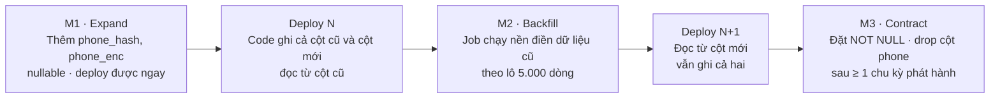

Nguyên tắc kéo theo: **migration luôn chạy trước khi deploy code mới**, và migration luôn tương thích ngược với code đang chạy. Nhờ vậy quá trình phát hành không cần dừng dịch vụ, và rollback code không kéo theo rollback lược đồ.

### 11.4 Thao tác an toàn và thao tác nguy hiểm

| Thao tác | Mức rủi ro trên PostgreSQL 16 | Cách làm đúng |
|---|---|---|
| `ADD COLUMN ... NULL` | An toàn | Làm trực tiếp |
| `ADD COLUMN ... NOT NULL DEFAULT <hằng>` | An toàn từ PG 11 | Không viết lại bảng |
| `ADD COLUMN ... NOT NULL DEFAULT <hàm biến đổi>` | **Nguy hiểm** — viết lại toàn bảng, khoá ACCESS EXCLUSIVE | Tách 3 bước: thêm nullable → backfill theo lô → đặt NOT NULL |
| `CREATE INDEX` | **Nguy hiểm** — chặn ghi | Dùng `CREATE INDEX CONCURRENTLY`; lệnh này **không chạy được trong transaction** → migration riêng với `transaction = false` |
| `DROP COLUMN` | Nhanh nhưng không hoàn tác được | Chỉ ở bước Contract, sau khi không còn code nào đọc |
| Đổi kiểu cột | Viết lại bảng | Thêm cột mới, backfill, đổi tên |
| `ADD CONSTRAINT ... CHECK` | Chặn khi kiểm tra | `NOT VALID` trước, `VALIDATE CONSTRAINT` sau |
| `ALTER TABLE ... SET NOT NULL` | Quét toàn bảng | Thêm `CHECK (col IS NOT NULL) NOT VALID`, validate, rồi mới `SET NOT NULL` |
| Thêm giá trị vào enum Postgres | An toàn | `ALTER TYPE ... ADD VALUE`; **không** xoá được giá trị enum → cân nhắc `varchar + CHECK` cho taxonomy còn biến động (tài liệu 03, D-06) |

Mỗi migration ghi ước lượng thời gian chạy trong comment đầu file. Migration nào dự kiến quá 5 giây trên dữ liệu production thì phải tách thành job nền, không chạy trong bước deploy.

### 11.5 Dữ liệu tham chiếu, sao lưu và kiểm tra ở CI

| Việc | Cách làm |
|---|---|
| Dữ liệu tham chiếu (`areas`, `categories`) | Là **migration** idempotent (`INSERT ... ON CONFLICT (slug) DO UPDATE`), vì môi trường nào cũng cần và phải giống nhau |
| Dữ liệu demo (người dùng giả, sự kiện giả) | Là **script** ở `ops/scripts/`, có chốt chặn từ chối chạy khi `APP_ENV=production` |
| Sao lưu | Trước mỗi lần migration ở production: `pg_dump` logic + xác nhận snapshot khối lưu trữ. Sao lưu hằng ngày giữ 30 ngày, hằng tuần giữ 12 tuần |
| Diễn tập khôi phục | **Hằng tháng**, khôi phục bản sao lưu mới nhất vào một VM tạm và chạy bộ smoke test. Bản sao lưu chưa từng khôi phục thử thì chưa phải là bản sao lưu |
| Kiểm tra trôi lược đồ ở CI | Dựng DB rỗng → `migration:run` → `migration:generate` → nếu sinh ra file khác rỗng thì **CI đỏ** (ai đó đổi entity mà quên tạo migration) |
| Kiểm tra revert | CI chạy `migration:run` → `migration:revert` → `migration:run` để chắc `down()` không hỏng |

---

## 12. CI/CD

### 12.1 Toàn cảnh

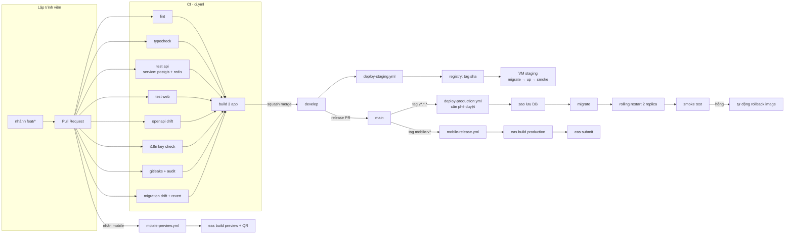

### 12.2 `ci.yml` — chạy trên mọi pull request

| Job | Việc | Điều kiện đỏ | Mục tiêu thời gian |
|---|---|---|---|
| `setup` | `pnpm install --frozen-lockfile`, khôi phục cache Turborepo | Lockfile lệch `package.json` | 60 s |
| `lint` | ESLint + Prettier check + `import/no-restricted-paths` | Vi phạm quy tắc phụ thuộc module (mục 3.2) | 90 s |
| `typecheck` | `tsc --noEmit` cho cả ba app và các package | Lỗi kiểu | 2 phút |
| `test-api` | Jest với `services:` PostgreSQL 16 + PostGIS 3.4 và Redis 7.4 | Test đỏ hoặc độ phủ nhánh `rsvp`/`auth` dưới 80% | 4 phút |
| `test-web` | Vitest cho unit; Playwright smoke trên bản build | Test đỏ | 5 phút |
| `openapi-drift` | Sinh lại `openapi.json` và `packages/api-client`, `git diff --exit-code` | Đổi DTO mà quên sinh lại client | 60 s |
| `i18n-check` | So khớp khoá giữa `en.json` và `vi.json`; tìm chuỗi hardcode trong JSX | Thiếu khoá hoặc có chuỗi không đi qua i18n | 30 s |
| `migration-check` | Dựng DB rỗng, `run` → `generate` phải rỗng → `revert` → `run` | Trôi lược đồ hoặc `down()` hỏng | 2 phút |
| `security` | `gitleaks`, `pnpm audit --audit-level=high`, `osv-scanner` | Lộ bí mật, hoặc lỗ hổng mức cao không có ngoại lệ đã duyệt | 90 s |
| `build` | `turbo build` cho ba app; dựng image Docker nhưng chưa đẩy | Build hỏng | 5 phút |

Tất cả job chạy song song trừ `setup`, đặt `concurrency` theo nhánh để pull request mới huỷ lần chạy cũ. Mục tiêu: pull request có kết quả trong **dưới 8 phút**.

### 12.3 `deploy-staging.yml` — tự động khi đẩy lên `develop`

1. Dựng và đẩy image `api`, `web` với tag `sha-<commit>` và `staging-latest`.
2. SSH vào VM staging, `docker compose pull`.
3. Chạy container migration một lần (`docker compose run --rm api pnpm migration:run`) — thất bại thì dừng, không deploy code.
4. `docker compose up -d` với health check; chờ `GET /health/ready` trả 200.
5. Smoke test: đăng nhập tài khoản test, `GET /events`, tạo và huỷ một RSVP, kiểm tra `/api/docs` sống.
6. Tạo release ở Sentry, tải source map lên, gắn commit.
7. Báo kết quả kèm link vào kênh nội bộ của đội.

### 12.4 `deploy-production.yml` — thủ công hoặc theo tag `v*.*.*`

| Bước | Chi tiết | Điều kiện dừng |
|---|---|---|
| 0 | Môi trường `production` của GitHub yêu cầu **người phê duyệt** khác tác giả | Không ai duyệt |
| 1 | Xác nhận tag nằm trên `main` và CI của commit đó đã xanh | Không xanh |
| 2 | Sao lưu database (`pg_dump` + snapshot khối lưu trữ), ghi lại tên file | Sao lưu lỗi |
| 3 | Bật cờ `MAINTENANCE_MODE` chỉ khi migration cần dừng ghi (hiếm) | — |
| 4 | Chạy migration | Migration lỗi → khôi phục sao lưu, dừng |
| 5 | Rolling restart: 2 replica API, đổi từng cái, chờ `/health/ready` | Replica mới không sẵn sàng trong 90 s |
| 6 | Smoke test trên tên miền thật | Hỏng → tự động `docker compose up -d` với tag trước đó |
| 7 | Sentry release + source map; ghi mục vào `CHANGELOG.md` | — |

Chiến lược phát hành là rolling restart vì chỉ có 2 replica. Blue-green đúng nghĩa cần gấp đôi tài nguyên — ghi vào [đường tiến hoá](#18-đường-tiến-hoá-kiến-trúc-theo-giai-đoạn) cho mốc 5.000+ người dùng.

### 12.5 Phát hành mobile qua EAS

**Profile trong `eas.json`:**

| Profile | Loại build | Phân phối | Kênh Update | Dùng khi |
|---|---|---|---|---|
| `development` | Development client | Nội bộ | — | Lập trình hằng ngày, có debug menu |
| `preview` | Release, ký nội bộ | Nội bộ (link + QR) | `preview` | Pull request có nhãn `mobile`, và TestFlight nội bộ |
| `production` | Release, ký cửa hàng | App Store + Play | `production` | Tag `mobile-v*` |

**`mobile-preview.yml`:** kích hoạt khi pull request có nhãn `mobile` → `eas build --profile preview --non-interactive` cho cả hai nền tảng → bình luận vào pull request kèm mã QR để tester cài trực tiếp. Đây là thứ rút ngắn vòng phản hồi thiết kế từ vài ngày xuống vài giờ.

**`mobile-release.yml`:** kích hoạt bởi tag `mobile-v*` → `eas build --profile production` → `eas submit` lên App Store Connect và Google Play (track `internal` trước, nâng lên `production` thủ công) → tạo release ở Sentry với source map của Hermes.

**Chính sách OTA (EAS Update):**

| Trường hợp | Cách phát hành | Vì sao |
|---|---|---|
| Sửa lỗi JS, đổi copy tiếng Anh, sửa layout | `eas update --channel production` — người dùng nhận ở lần mở app tiếp theo | Không phải chờ duyệt 1–3 ngày |
| Thêm/nâng module native, đổi quyền hệ thống, nâng SDK Expo | **Bắt buộc** build lại và nộp cửa hàng | `runtimeVersion` đổi, OTA không áp dụng được |
| Thay đổi luồng thanh toán hoặc tính năng mới đáng kể | Build lại và nộp | Chính sách cửa hàng cấm dùng OTA để lách quy trình duyệt |

`runtimeVersion` dùng policy `appVersion`. Bản OTA chỉ tới được thiết bị có cùng `runtimeVersion` — đây chính là cơ chế ngăn việc đẩy JS mới xuống bản native cũ và làm app hỏng. Mọi bản OTA phải qua kênh `preview` ít nhất 24 giờ trước khi lên `production`.

### 12.6 Quy tắc nhánh và phát hành

| Nhánh | Vai trò | Bảo vệ |
|---|---|---|
| `main` | Bằng đúng production | Cấm đẩy thẳng; cần 1 review + CI xanh; chỉ merge từ `develop` hoặc `hotfix/*` |
| `develop` | Bằng đúng staging | Cần CI xanh; squash merge |
| `feat/*` · `fix/*` | Công việc hằng ngày | — |
| `hotfix/*` | Cắt từ `main`, merge vào cả `main` và `develop` | Cần 1 review, được bỏ qua hàng chờ |

Phiên bản theo SemVer; backend và web dùng tag `v*`, mobile dùng tag `mobile-v*` riêng vì nhịp phát hành khác nhau. `CHANGELOG.md` sinh từ Conventional Commits.

---

## 13. Ước tính chi phí hạ tầng

### 13.1 Giả định

| # | Giả định | Ảnh hưởng nếu sai |
|---|---|---|
| G1 | Tỷ giá **1 USD = 26.000 VND** (đồng bộ với tài liệu 08, giả định A6) | ±5% tổng chi phí |
| G2 | Giá tham chiếu mặt bằng cloud Việt Nam tháng 08/2026, **sai số ±20%**; phải xin báo giá thật trước khi chốt ngân sách | Lệch tuyệt đối, không lệch tương quan giữa các mốc |
| G3 | Tự vận hành PostgreSQL và Redis trên VM, **không** dùng managed database — dịch vụ managed chất lượng cao tại Việt Nam còn hạn chế và đắt hơn 2–3 lần | Nếu đổi sang managed, cộng thêm 60–120% chi phí lớp dữ liệu |
| G4 | Đã trừ thuế giá trị gia tăng; chưa tính chi phí nhân sự vận hành | Chi phí thật cao hơn nếu thuê ngoài quản trị hệ thống |
| G5 | Ảnh trung bình 4 biến thể × 120 KB; tỷ lệ trúng cache CDN 90% | Egress tăng nhanh nếu tỷ lệ trúng thấp |
| G6 | 30% người dùng xác minh số điện thoại; trong đó 70% dùng số `+84` | Chi phí OTP là hạng mục biến động mạnh nhất |
| G7 | Sự kiện được xem nhiều hơn tạo theo tỷ lệ ~200:1 (đọc nhiều, ghi ít) | Quyết định việc bật read replica |

### 13.2 Định nghĩa ba mốc

| Chỉ số | Mốc A · 0–500 | Mốc B · 500–5.000 | Mốc C · 5.000–50.000 |
|---|---|---|---|
| Người dùng đăng ký | ≤ 500 | 5.000 | 50.000 |
| Người dùng hoạt động ngày (DAU) | ~120 | ~1.200 | ~11.000 |
| Đỉnh request/giây | 15 | 120 | 900 |
| Sự kiện đăng / tháng | 80 | 600 | 4.500 |
| RSVP / tháng | 900 | 12.000 | 130.000 |
| Ảnh tải lên / tháng | 400 | 4.000 | 32.000 |
| Push gửi / tháng | 6.000 | 90.000 | 900.000 |
| OTP gửi / tháng | 180 | 2.100 | 18.000 |
| Egress qua CDN / tháng | ~120 GB | ~1,4 TB | ~14 TB |
| Tương ứng mốc dự án | Beta kín M5 (12/2026) | Sau ra mắt M6 (Q2/2027) | Mở rộng (2028+) |

### 13.3 Bảng chi phí chi tiết (USD / tháng)

| Hạng mục | Cấu hình mốc A | A | Cấu hình mốc B | B | Cấu hình mốc C | C |
|---|---|---:|---|---:|---|---:|
| VM ứng dụng (API + worker + web + nginx) | 1 × 4 vCPU / 8 GB / 100 GB | 42 | 2 × 4 vCPU / 8 GB | 84 | 4 × 8 vCPU / 16 GB | 300 |
| VM worker riêng | gộp chung | 0 | 1 × 2 vCPU / 4 GB | 21 | 2 × 4 vCPU / 8 GB | 84 |
| VM database primary | gộp chung với app | 0 | 1 × 8 vCPU / 32 GB / 500 GB NVMe | 155 | 1 × 16 vCPU / 64 GB / 2 TB NVMe | 420 |
| VM database (mốc A gộp app+DB+Redis) | 1 × 4 vCPU / 16 GB / 200 GB SSD | 74 | — | 0 | — | 0 |
| Read replica | không | 0 | 1 × 4 vCPU / 16 GB / 500 GB | 88 | 2 × 8 vCPU / 32 GB / 2 TB | 400 |
| Redis | gộp chung | 0 | 1 × 2 vCPU / 8 GB | 36 | 3 nút × 4 vCPU / 16 GB | 186 |
| Load balancer + WAF + chống DDoS | nginx tự chạy | 0 | LB quản lý + WAF cơ bản | 55 | LB + WAF + chống DDoS nâng cao | 160 |
| Sao lưu (dung lượng + snapshot) | 200 GB | 7 | 1 TB | 26 | 5 TB | 115 |
| Object storage | 50 GB | 3 | 500 GB | 13 | 5 TB | 115 |
| CDN (egress) | 120 GB | 6 | 1,4 TB | 68 | 14 TB | 590 |
| SMS OTP số `+84` | 126 tin × ~0,022 USD | 3 | 1.470 tin | 32 | 12.600 tin | 277 |
| OTP quốc tế | 54 lần × ~0,12 USD | 7 | 630 lần | 76 | 5.400 lần | 648 |
| Email giao dịch | 3.000 thư (gói miễn phí) | 0 | 50.000 thư | 18 | 400.000 thư | 85 |
| Sentry | gói Team | 26 | gói Business | 89 | Business + hạn mức sự kiện | 260 |
| Expo EAS | gói miễn phí | 0 | gói Production | 99 | gói Production | 99 |
| GitHub (Actions + chỗ ngồi) | gói miễn phí | 0 | Team 4 chỗ | 16 | Team 8 chỗ + phút bổ sung | 60 |
| Tile bản đồ | gói miễn phí | 0 | gói trả phí | 50 | tự host trên VM riêng | 60 |
| Quan sát hệ thống (Prometheus/Grafana/Loki) | gộp chung | 0 | gộp trên VM worker | 0 | 1 VM riêng 4 vCPU / 16 GB | 78 |
| Môi trường staging | dùng chung máy local | 0 | 1 VM 4 vCPU / 8 GB + 100 GB | 52 | 1 VM 8 vCPU / 16 GB + preview | 130 |
| Tên miền + chứng chỉ TLS | Let's Encrypt miễn phí | 2 | | 2 | | 4 |
| **Tổng ước tính** | | **≈ 170** | | **≈ 980** | | **≈ 4.071** |
| Dự phòng 15% | | 26 | | 147 | | 611 |
| **Tổng có dự phòng** | | **≈ 196** | | **≈ 1.127** | | **≈ 4.682** |
| Quy đổi VND | | ≈ 5,1 tr | | ≈ 29,3 tr | | ≈ 121,8 tr |
| Chi phí / người dùng đăng ký / tháng | | 0,39 USD | | 0,23 USD | | 0,09 USD |
| Chi phí / DAU / tháng | | 1,63 USD | | 0,94 USD | | 0,43 USD |

### 13.4 Chi phí một lần và hằng năm

| Hạng mục | Chi phí | Thời điểm |
|---|---|---|
| Tài khoản Apple Developer Program | 99 USD / năm | Trước M5 — thủ tục D-U-N-S mất 2–4 tuần (tài liệu 08) |
| Tài khoản Google Play Developer | 25 USD một lần | Trước M5 |
| Tên miền `.com` | 12–15 USD / năm | Sprint 0 |
| Đăng ký brandname SMS với nhà mạng | 1–3 triệu VND thiết lập + phí duy trì | Trước M3 |
| Kiểm thử thâm nhập (khi có người dùng thật) | 2.000–5.000 USD | Trước hoặc ngay sau M6 |

Chi phí pháp lý (thủ tục thông báo / giấy phép mạng xã hội, tư vấn luật sư) thuộc phạm vi tài liệu 06, không tính trong bảng hạ tầng này.

### 13.5 Đòn bẩy giảm chi phí, xếp theo hiệu quả

| Đòn bẩy | Tiết kiệm ước tính | Ghi chú |
|---|---|---|
| Nâng tỷ lệ trúng cache CDN từ 90% lên 97% | 30–40% chi phí CDN | Đặt `immutable` cho biến thể ảnh, key bất biến (mục 4.7) |
| Phục vụ AVIF trước, WebP dự phòng | 25–35% khối lượng ảnh | Worker sinh sẵn cả hai định dạng |
| Ưu tiên đăng nhập social và email thay vì bắt buộc OTP | 40–60% chi phí OTP | Nhưng phụ thuộc kết luận pháp lý ở tài liệu 06 |
| Hoãn read replica tới khi p95 truy vấn đọc > 80 ms | ~88 USD/tháng ở mốc B | Có số đo mới bật, không bật theo cảm tính |
| Nén và lấy mẫu log; giữ log chi tiết 14 ngày, log tổng hợp 90 ngày | 20–30% chi phí lưu trữ và Sentry | |
| Lấy mẫu trace của Sentry 10% ở production | 30–50% hạn mức Sentry | Lỗi vẫn giữ 100%, chỉ lấy mẫu trace hiệu năng |
| Tự host tile bản đồ cho vùng Đà Nẵng | 50 USD/tháng từ mốc C | Vùng phủ nhỏ nên khả thi, đồng thời giải quyết vấn đề chủ quyền ở mục 9.3 |

### 13.6 Cảnh báo chi phí đột biến

Ba khoản có thể tăng gấp mười trong một đêm — bắt buộc đặt hạn mức và cảnh báo **trước** khi ra mắt:

| Rủi ro | Cơ chế | Chốt chặn |
|---|---|---|
| Gian lận cước SMS (SMS pumping) | Kẻ tấn công gửi hàng loạt yêu cầu OTP tới dải số trả phí ở nước ngoài | `OTP_ALLOWED_COUNTRY_CODES`, `OTP_DAILY_SPEND_LIMIT_USD`, CAPTCHA khi vượt ngưỡng, cảnh báo chi tiêu ở phía nhà cung cấp |
| Egress CDN do nhúng link ảnh trái phép | Trang khác nhúng thẳng ảnh của mình | Kiểm tra `Referer`, giới hạn tốc độ theo IP ở CDN, cảnh báo khi egress ngày vượt 2× trung bình 7 ngày |
| Bùng nổ sự kiện lỗi ở Sentry | Một lỗi trong vòng lặp gửi hàng chục nghìn sự kiện | `beforeSend` gộp theo dấu vân tay, giới hạn tốc độ phía client, đặt hạn mức tiêu thụ ở Sentry |

---

## 14. Quyết định hosting — Việt Nam hay nước ngoài

### 14.1 Bốn ràng buộc phải cân bằng

| Ràng buộc | Nội dung |
|---|---|
| **Pháp lý** | Nghị định 147/2024/NĐ-CP (dịch vụ mạng xã hội), Luật An ninh mạng 116/2025/QH15 (hiệu lực 01/07/2026), Luật Bảo vệ dữ liệu cá nhân 91/2025/QH15 và Nghị định 356/2025/NĐ-CP (thay thế Nghị định 13/2023/NĐ-CP). Chuyển dữ liệu cá nhân ra nước ngoài buộc phải lập **TIA** và nộp trong 60 ngày; vi phạm phạt tới 5% doanh thu năm liền kề hoặc tối đa 3 tỷ đồng (tài liệu 06, kết luận #8) |
| **Độ trễ** | Người dùng ở Đà Nẵng, dùng 4G và Wi-Fi gia đình. Chất lượng đường truyền quốc tế của Việt Nam phụ thuộc vài tuyến cáp quang biển, và sự cố đứt cáp là chuyện xảy ra vài lần mỗi năm |
| **Chi phí** | Xem [mục 13](#13-ước-tính-chi-phí-hạ-tầng). Thêm nghĩa vụ khấu trừ thuế nhà thầu nước ngoài khi trả tiền cho nhà cung cấp ngoài (tài liệu 06, kết luận #12) |
| **Năng lực vận hành** | Đội nhỏ. Càng ít dịch vụ managed thì càng nhiều việc tự làm |

### 14.2 Độ trễ tham chiếu từ Đà Nẵng

| Đích | RTT bình thường | RTT khi có sự cố cáp biển | Ảnh hưởng cảm nhận |
|---|---|---|---|
| Trung tâm dữ liệu tại Đà Nẵng / Hà Nội / TP.HCM | 5 – 25 ms | 5 – 25 ms (không đổi) | Không cảm nhận được |
| Singapore | 30 – 55 ms | 120 – 300 ms, có mất gói | Feed chậm rõ, socket rớt, tải ảnh giật |
| Tokyo / Hồng Kông | 50 – 90 ms | 150 – 350 ms | Như trên, nặng hơn |
| Châu Âu (ví dụ Frankfurt) | 180 – 260 ms | 300 – 500 ms | Không chấp nhận được cho ứng dụng tương tác |

Một trang chi tiết sự kiện gọi 3–4 request nối tiếp (xác thực, chi tiết, danh sách người tham gia, ảnh). Ở 50 ms RTT thì chênh lệch còn tha thứ được; ở 250 ms thì mỗi thao tác chậm thêm ngót một giây — đủ để người dùng bỏ đi. Rủi ro nằm ở **phương sai**, không phải giá trị trung bình.

### 14.3 So sánh bốn phương án

| Tiêu chí | A · VM tại Việt Nam | B · Cloud lớn ở Singapore | C · VPS quốc tế giá rẻ | D · Lai có kiểm soát |
|---|---|---|---|---|
| Độ trễ khi bình thường | ⭐⭐⭐⭐⭐ | ⭐⭐⭐⭐ | ⭐⭐ | ⭐⭐⭐⭐⭐ |
| Ổn định khi đứt cáp biển | ⭐⭐⭐⭐⭐ | ⭐ | ⭐ | ⭐⭐⭐⭐⭐ |
| Tuân thủ lưu trữ dữ liệu | ⭐⭐⭐⭐⭐ | ⭐⭐ (cần TIA, cần cơ chế lưu trữ trong nước) | ⭐ | ⭐⭐⭐⭐ |
| Chất lượng dịch vụ managed | ⭐⭐ | ⭐⭐⭐⭐⭐ | ⭐⭐ | ⭐⭐⭐ |
| Chi phí ở mốc B | ⭐⭐⭐⭐ (~980 USD) | ⭐⭐ (~1.500–2.000 USD) | ⭐⭐⭐⭐⭐ (~450 USD) | ⭐⭐⭐⭐ |
| Hoá đơn VAT, hợp đồng tiếng Việt | ⭐⭐⭐⭐⭐ | ⭐⭐ | ⭐ | ⭐⭐⭐⭐ |
| Gánh nặng thuế nhà thầu nước ngoài | Không | Có | Có | Tối thiểu |
| Hỗ trợ kỹ thuật theo giờ Việt Nam | ⭐⭐⭐⭐ | ⭐⭐⭐ | ⭐ | ⭐⭐⭐⭐ |
| Khả năng mở rộng về sau | ⭐⭐⭐ | ⭐⭐⭐⭐⭐ | ⭐⭐ | ⭐⭐⭐⭐ |

### 14.4 Khuyến nghị

> **Chốt phương án D — lai có kiểm soát, trọng tâm đặt tại Việt Nam.**
>
> Toàn bộ **dữ liệu cá nhân và dữ liệu nghiệp vụ** (PostgreSQL + PostGIS, Redis, object storage, sao lưu, log ứng dụng) đặt trên hạ tầng đặt tại Việt Nam của nhà cung cấp trong nước có hợp đồng và hoá đơn VAT Việt Nam. CDN chọn nhà cung cấp có POP tại Việt Nam. Các dịch vụ SaaS nước ngoài được giữ ở **danh sách tối thiểu, liệt kê tường minh**, chỉ nhận dữ liệu đã tối thiểu hoá, và là đầu vào cho hồ sơ TIA.

Bốn lý do, xếp theo trọng số:

1. **Rủi ro pháp lý là rủi ro tồn tại.** Mức phạt tới 5% doanh thu và khả năng bị đình chỉ dịch vụ lớn hơn mọi khoản tiết kiệm hạ tầng. Sản phẩm này chắc chắn là dịch vụ mạng xã hội theo Nghị định 147/2024 và chắc chắn xử lý dữ liệu nhạy cảm (vị trí).
2. **Phương sai độ trễ, không phải trung bình.** Đặt máy ở Singapore thì trong ngày thường không ai phàn nàn, nhưng vài lần mỗi năm sản phẩm sẽ chậm và rớt kết nối đúng vào lúc không kiểm soát được. Với một sản phẩm còn đang xây niềm tin ở 500 người dùng đầu tiên, một tuần như vậy đủ để mất họ.
3. **Chi phí ở quy mô mục tiêu là tương đương hoặc rẻ hơn.** Bảng ở mục 13 cho thấy tự vận hành trên VM Việt Nam rẻ hơn cloud lớn ở Singapore khoảng 35–50% ở cùng năng lực.
4. **Không khoá vào nhà cung cấp.** Nguyên tắc số 7 ở mục 2 đã chọn toàn chuẩn mở — Postgres, Redis, S3 API, Docker, OSM. Đổi nhà cung cấp trong nước, hoặc chuyển ra ngoài về sau, là công việc vài ngày chứ không phải viết lại.

### 14.5 Danh sách dịch vụ nước ngoài được giữ lại — đầu vào cho TIA

| Dịch vụ | Không thể thay thế vì | Dữ liệu gửi ra | Biện pháp tối thiểu hoá |
|---|---|---|---|
| Expo Push → APNs / FCM | Không có đường nào khác để đẩy thông báo tới iOS/Android | Token thiết bị, tiêu đề và nội dung ngắn | Không đưa nội dung tin nhắn đầy đủ, không đưa email/số điện thoại vào payload |
| Apple / Google / Facebook OIDC | Yêu cầu của chính nền tảng và của người dùng | Email, `provider_user_id` | Chỉ trao đổi lúc đăng nhập; không đồng bộ hồ sơ định kỳ |
| Sentry | Không có công cụ trong nước tương đương về chất lượng | Dấu vết lỗi, `userId` đã băm | Bật `beforeSend` để loại bỏ token, email, số điện thoại, thân request; không gửi ảnh chụp màn hình |
| Nhà cung cấp OTP toàn cầu | Cách duy nhất xác minh số điện thoại nước ngoài | Số điện thoại | Chỉ dùng cho số ngoài `+84`; số `+84` đi qua nhà cung cấp trong nước |
| App Store / Google Play | Kênh phân phối bắt buộc | Dữ liệu do nền tảng thu thập | Khai báo đúng trong Privacy Nutrition Label và Data Safety |
| GitHub | Nơi chứa mã nguồn và CI | Mã nguồn, **không** có dữ liệu người dùng | Cấm tuyệt đối dữ liệu thật trong repo, trong fixture test, trong log CI |
| Tile bản đồ | Chưa tự host ở giai đoạn đầu | Toạ độ ô tile đang xem | Chuyển sang tự host khi tới mốc C — xem mục 13.5 |

Danh sách này phải trùng khớp với hồ sơ TIA và với Privacy Policy. Thêm bất kỳ dịch vụ nước ngoài nào cũng phải cập nhật cả ba, và cập nhật `docs/adr/`.

### 14.6 Rủi ro của lựa chọn này và cách bù

| Rủi ro | Cách bù |
|---|---|
| Ít dịch vụ managed → phải tự vận hành PostgreSQL, Redis, sao lưu | Runbook viết trước M5; sao lưu tự động hằng ngày; **diễn tập khôi phục hằng tháng** (mục 11.5); giám sát chủ động |
| Chất lượng SLA của nhà cung cấp trong nước không đồng đều | Ký với một nhà cung cấp chính, giữ sẵn sao lưu ở nhà cung cấp thứ hai trong nước; kiểm thử khôi phục chéo mỗi quý |
| Ít lựa chọn nhiều vùng để dự phòng thảm hoạ | Sao lưu chéo giữa hai vùng của cùng nhà cung cấp (ví dụ Đà Nẵng ↔ TP.HCM); mục tiêu RPO 24 giờ, RTO 4 giờ ở giai đoạn 1 |
| Khách truy cập web từ nước ngoài (expat tìm hiểu trước khi tới) thấy chậm | CDN phủ trang public; trang sự kiện render tĩnh và cache ở biên; chỉ phần cần đăng nhập mới về origin |
| Khó tuyển người có kinh nghiệm vận hành thuần tuý | Giữ hạ tầng đơn giản (Docker Compose, không Kubernetes) đúng như quyết định ở mục 4.9 |

### 14.7 Khi nào xem lại quyết định

Ba điều kiện, chạm bất kỳ điều nào thì mở lại thảo luận và ghi ADR mới:

1. Vượt 50.000 người dùng và cần nhiều vùng thật sự để dự phòng thảm hoạ.
2. Mở rộng ra ngoài Việt Nam (sản phẩm hiện chỉ phục vụ Đà Nẵng — tài liệu 08, giả định A8).
3. Khung pháp lý thay đổi theo hướng nới lỏng rõ ràng đối với việc chuyển dữ liệu ra nước ngoài, được luật sư xác nhận bằng văn bản.

---

## 15. Bảo mật, quyền riêng tư và tuân thủ

Chi tiết pháp lý thuộc tài liệu 06; chi tiết an toàn cộng đồng thuộc tài liệu 05. Mục này chỉ liệt kê nghĩa vụ **kỹ thuật** tương ứng.

| Lớp | Biện pháp bắt buộc ở MVP |
|---|---|
| Truyền tải | TLS 1.2+ ở mọi nơi, HSTS `max-age=31536000; includeSubDomains`, chuyển hướng HTTP → HTTPS ở tầng biên |
| Đầu vào | `ValidationPipe` toàn cục với `whitelist` + `forbidNonWhitelisted`; TypeORM luôn dùng tham số hoá — **không** nối chuỗi SQL, kể cả trong truy vấn PostGIS thô |
| Đầu ra | Response DTO khai báo tường minh (mục 5.4); web dùng CSP nghiêm ngặt, không `unsafe-inline`; nội dung người dùng nhập luôn escape, Markdown đi qua bộ lọc danh sách trắng |
| Mật khẩu | `argon2id`, `memoryCost` ≥ 19 MiB, `timeCost` ≥ 2; đối chiếu danh sách mật khẩu đã lộ khi đăng ký |
| Bí mật | Xem mục 10.3; `gitleaks` chạy ở CI |
| Phụ thuộc | Dependabot hằng tuần; `pnpm audit` mức `high` chặn merge; `osv-scanner` |
| Tối thiểu hoá dữ liệu | Không thu thập thứ chưa dùng đến. Không lưu lịch sử vị trí. Số điện thoại lưu dạng băm để so trùng, dạng mã hoá chỉ để gửi lại tin |
| Dữ liệu nhạy cảm | Toạ độ là dữ liệu nhạy cảm (tài liệu 06, kết luận #6) → tách bảng, có consent riêng, ghi log truy cập |
| Quyền của chủ thể dữ liệu | `GET /me/data-export` (xuất JSON qua job nền, gửi link có hạn), `POST /me/deletion-request` (xoá mềm ngay, ẩn danh hoá theo lịch 30 ngày, giữ lại tối thiểu bản ghi cần cho an toàn cộng đồng) |
| Lưu trữ và xoá | Log chi tiết 14 ngày, log tổng hợp 90 ngày, `notification_log` 180 ngày, ảnh của tài khoản đã xoá gỡ trong 30 ngày |
| Ghi vết | `audit_log` cho hành động quản trị: ai, lúc nào, trên tài nguyên nào, giá trị trước và sau |
| Ứng phó sự cố | Runbook có sẵn: cô lập, đánh giá phạm vi, thông báo cho cơ quan có thẩm quyền và người dùng theo thời hạn luật định, khắc phục, báo cáo hậu sự cố |

---

## 16. Quan sát hệ thống

| Trụ cột | Công cụ | Chốt |
|---|---|---|
| Log | `pino` → stdout → Docker → Loki (hoặc file xoay vòng ở mốc A) | JSON có cấu trúc, luôn kèm `requestId`, `userId` (đã băm), `route`, `durationMs`. Bộ lọc redact bắt buộc |
| Số đo | `prom-client` → `/metrics` (chặn ở tầng mạng) → Prometheus → Grafana | Vàng: tỷ lệ request, tỷ lệ lỗi, độ trễ p50/p95/p99. Nghiệp vụ: RSVP/phút, sự kiện tạo/giờ, độ trễ hàng đợi, độ sâu hàng đợi, tỷ lệ push thành công |
| Lỗi | Sentry (API, web, mobile) | Có source map cho web và Hermes; `tracesSampleRate=0.1`; gắn `release` từ CI |
| Sẵn sàng | `/health/live` (tiến trình sống) và `/health/ready` (DB + Redis phản hồi) | `ready` sai thì load balancer rút khỏi vòng quay |
| Giám sát ngoài | Kiểm tra từ bên ngoài mỗi 60 giây từ hai vị trí | Kiểm tra trang sự kiện thật, không chỉ `/health` |

**Cảnh báo — chỉ giữ những cảnh báo có hành động tương ứng:**

| Cảnh báo | Ngưỡng | Mức |
|---|---|---|
| Tỷ lệ lỗi 5xx | > 1% trong 5 phút | Gọi điện |
| Độ trễ p95 của API | > 800 ms trong 10 phút | Gọi điện |
| Độ sâu hàng đợi `notification` | > 1.000 job trong 10 phút | Gọi điện |
| Kết nối database | > 80% `max_connections` | Cảnh báo |
| Dung lượng đĩa | > 80% | Cảnh báo |
| Sao lưu thất bại | 1 lần | Gọi điện |
| Chi tiêu OTP theo ngày | > `OTP_DAILY_SPEND_LIMIT_USD` | Gọi điện |
| Tỷ lệ crash-free của mobile | < 99% | Cảnh báo |

**SLO giai đoạn 1:** khả dụng 99,5% hằng tháng (tương đương ~3,6 giờ gián đoạn); p95 API < 300 ms cho endpoint đọc; p95 tạo RSVP < 500 ms; push tới thiết bị < 30 giây kể từ sự kiện; crash-free session ≥ 99,5%.

---

## 17. Rủi ro kỹ thuật và cách giảm thiểu

| # | Rủi ro | Xác suất | Tác động | Cách giảm thiểu | Dấu hiệu sớm |
|---|---|---|---|---|---|
| R1 | Xác thực số điện thoại xung đột với người dùng expat (tài liệu 06, #5) | Cao | Rất cao | Kiến trúc adapter tách rời (7.6); cờ `FEATURE_PHONE_OTP_REQUIRED` để đổi chính sách không cần deploy; xin ý kiến luật sư trước Sprint 4 | Luật sư chưa có kết luận sau Sprint 3 |
| R2 | Tranh chấp chỗ khi RSVP làm vượt sức chứa | Trung bình | Cao | `SELECT ... FOR UPDATE` trên bản ghi sự kiện + ràng buộc `CHECK` ở DB + test tải đồng thời trong CI | Test tranh chấp bị bỏ qua khi vội |
| R3 | Metro bundler gãy trong monorepo pnpm | Cao | Trung bình | `node-linker=hoisted` từ Sprint 0 (mục 5.1); ghim phiên bản; ghi rõ trong README | Lỗi "unable to resolve module" ngay tuần đầu |
| R4 | Deep link Android hỏng ở bản phát hành | Cao | Trung bình | Khai vân tay SHA-256 của cả khoá Play App Signing (8.4); checklist kiểm thử là gate của M5 | Link chỉ chạy ở bản debug |
| R5 | Hoá đơn SMS tăng vọt do gian lận cước | Trung bình | Cao | Whitelist quốc gia, hạn mức chi tiêu ngày, CAPTCHA (13.6) | Tỷ lệ yêu cầu OTP tăng đột biến, tỷ lệ xác minh thành công giảm |
| R6 | Tile bản đồ thể hiện sai chủ quyền → phạt và buộc gỡ | Trung bình | Rất cao | Kiểm thử vùng Biển Đông là gate phát hành; sẵn phương án tự host (9.3) | Chưa ai kiểm tra tới tuần trước ra mắt |
| R7 | Mất dữ liệu do sự cố ở nhà cung cấp trong nước | Thấp | Rất cao | Sao lưu hằng ngày + sao lưu chéo nhà cung cấp thứ hai + diễn tập khôi phục hằng tháng (11.5) | Chưa từng khôi phục thử |
| R8 | Truy vấn PostGIS chậm khi dữ liệu tăng | Trung bình | Trung bình | Index GiST + composite; `EXPLAIN ANALYZE` trong review; đặt ngân sách hiệu năng cho endpoint feed | p95 của `GET /events` vượt 300 ms |
| R9 | Xoay refresh token gây đăng xuất vô cớ | Trung bình | Cao | Cửa sổ ân hạn 30 giây + mutex ở client (7.3); số đo riêng cho tỷ lệ `AUTH_REFRESH_REUSE_DETECTED` | Người dùng báo "bị đăng xuất liên tục" |
| R10 | Ứng dụng trống lúc ra mắt (rủi ro số 1 của tài liệu 08) | Cao | Rất cao | Admin Curation Console là hạng mục kỹ thuật hạng nhất, không phải phụ trợ; nhập tay, không thu thập tự động | Số sự kiện đã curate dưới kế hoạch tuần |
| R11 | Nghẽn kiến thức ở một người | Trung bình | Cao | ADR bắt buộc cho mọi quyết định; runbook viết trước M5; luân phiên trực | Chỉ một người deploy được |
| R12 | Nâng cấp Expo SDK hằng năm gây vỡ | Cao | Trung bình | Ghim phiên bản; nâng cấp trong sprint riêng ngay sau khi SDK ổn định; đọc changelog trước | Bỏ lỡ hai kỳ SDK liên tiếp |

---

## 18. Đường tiến hoá kiến trúc theo giai đoạn

| Mốc | Điều kiện kích hoạt | Thay đổi kiến trúc |
|---|---|---|
| **Hiện tại** (0–500 người dùng) | Beta kín M5 | Một VM chạy tất cả; không replica; sao lưu hằng ngày; Compose |
| **Mốc B** (500–5.000) | p95 đọc > 300 ms **hoặc** DAU > 800 | Tách VM dữ liệu; bật read replica; 2 replica API sau load balancer; worker ra tiến trình riêng; bật WAF |
| **Mốc C** (5.000–50.000) | Đỉnh > 500 req/s **hoặc** độ sâu hàng đợi thường xuyên > 500 | Redis cụm; hai read replica; tách hẳn tầng worker; tự host tile; ngăn xếp quan sát riêng; cân nhắc phân vùng bảng `events` theo tháng |
| **Ngoài 50.000** | Nhiều đội cùng làm, hoặc cần autoscaling theo giờ cao điểm | Cân nhắc k3s; tách `search` thành service riêng nếu cần xếp hạng phức tạp; đọc/ghi tách hẳn |
| **Giai đoạn 2 · Nhà ở** | Sau khi Giai đoạn 1 ổn định | Thêm module `housing`, dùng lại `users`, `areas`, `venues`, `reports`, `conversations` (tài liệu 03). Rủi ro mới: giao dịch tiền → cần cổng thanh toán và rà lại Luật Thương mại điện tử 122/2025 |
| **Giai đoạn 3 · Y tế / dịch vụ chuyên môn** | Sau Giai đoạn 2 | Thêm module `pro-services`. Dữ liệu sức khoẻ là nhóm nhạy cảm nặng nhất → nhiều khả năng phải tách lược đồ riêng, mã hoá ở mức cột, kiểm soát truy cập chặt hơn hẳn |

**Điều không thay đổi qua mọi mốc:** một PostgreSQL là nguồn sự thật; hợp đồng API `v1` giữ tương thích ngược; ranh giới module không bị đục thủng; hạ tầng vẫn có thể chuyển nhà cung cấp.

---

## 19. Nhật ký quyết định kiến trúc (ADR log)

Mỗi dòng tương ứng một file trong `docs/adr/`. Định dạng: bối cảnh → quyết định → hệ quả → phương án đã loại.

| ID | Quyết định | Trạng thái | Mục liên quan |
|---|---|---|---|
| ADR-0001 | Monolith module hoá thay vì microservices | Chấp thuận | 2, 3.2 |
| ADR-0002 | PostgreSQL 16 + PostGIS làm nguồn sự thật duy nhất | Chấp thuận | 4.2, 9 |
| ADR-0003 | NestJS 11 trên Node.js 22 LTS, Express adapter | Chấp thuận | 4.1 |
| ADR-0004 | pnpm workspace + Turborepo, `node-linker=hoisted` | Chấp thuận | 5.1 |
| ADR-0005 | Bốn class lõi + layer DTO request/response + mapper cho mọi module backend | Chấp thuận | 5.4 |
| ADR-0006 | Envelope response và danh mục mã lỗi tập trung | Chấp thuận | 6.2, 6.3 |
| ADR-0007 | Phân trang cursor có chữ ký, không dùng OFFSET | Chấp thuận | 6.4 |
| ADR-0008 | JWT RS256 + refresh token xoay vòng có phát hiện tái sử dụng | Chấp thuận | 7.2, 7.3 |
| ADR-0009 | Mobile lưu token ở SecureStore; web dùng BFF với cookie `httpOnly` | Chấp thuận | 7.4 |
| ADR-0010 | Định tuyến OTP lai theo mã quốc gia | Chấp thuận, **phụ thuộc kết luận pháp lý** | 7.6 |
| ADR-0011 | Socket.IO cho realtime, Expo Push cho thông báo nền | Chấp thuận | 4.8, 8 |
| ADR-0012 | Universal Link / App Link làm cơ chế deep link duy nhất | Chấp thuận | 8.4 |
| ADR-0013 | Leaflet ở web, `react-native-maps` ở mobile; tile đổi nhà cung cấp được | Chấp thuận | 4.6 |
| ADR-0014 | Ảnh đi thẳng lên object storage bằng presigned URL, strip EXIF | Chấp thuận | 4.7 |
| ADR-0015 | Docker Compose thay vì Kubernetes ở giai đoạn 1 | Chấp thuận | 4.9, 18 |
| ADR-0016 | Migration expand–contract, `synchronize: false` ở mọi môi trường | Chấp thuận | 11 |
| ADR-0017 | Hosting trọng tâm tại Việt Nam, danh sách SaaS nước ngoài tối thiểu | Chấp thuận | 14 |
| ADR-0018 | Không dùng NativeWind; chia sẻ design token thay vì chia sẻ class | Chấp thuận | 4.5 |
| ADR-0019 | Không thu thập dữ liệu tự động; nhập tay qua Curation Console | Chấp thuận | 3.2, 17 (R10) |
| ADR-0020 | Toàn bộ file test nằm ngoài `src/`, phản chiếu cây thư mục nguồn | Chấp thuận | 5.5 |

**Quy tắc:** một quyết định đã ghi ADR chỉ được đảo ngược bằng một ADR mới ghi rõ điều gì đã thay đổi. Không sửa ADR cũ — thay trạng thái sang `Bị thay thế bởi ADR-XXXX`.
