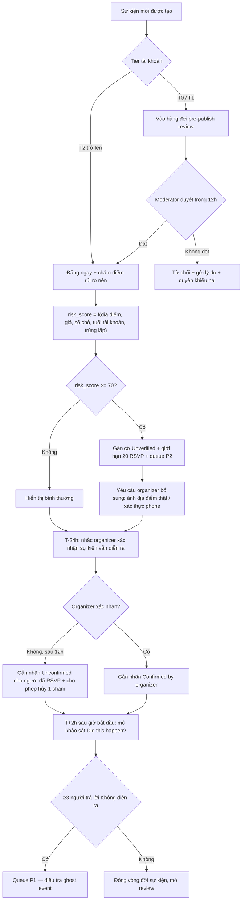
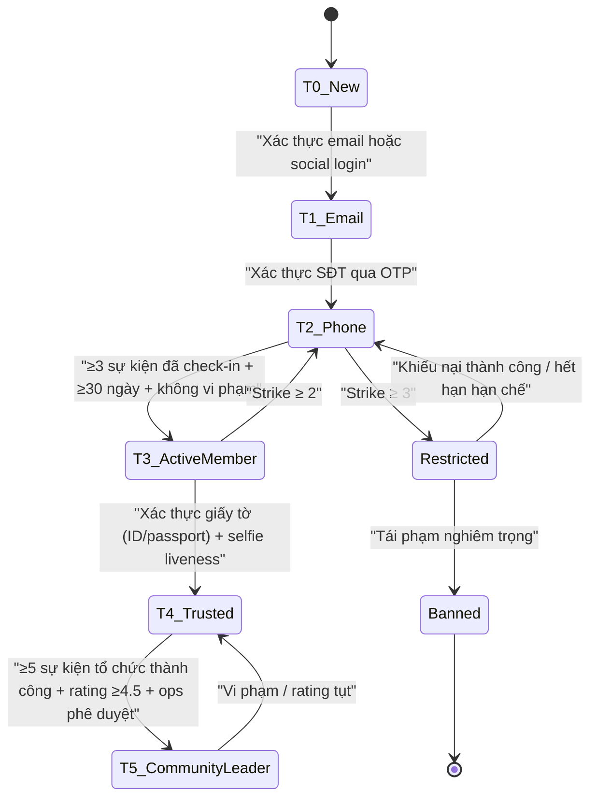
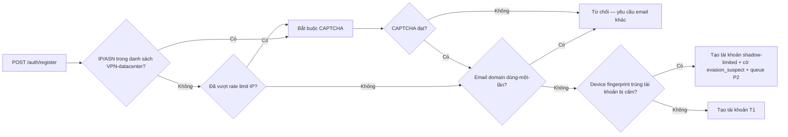
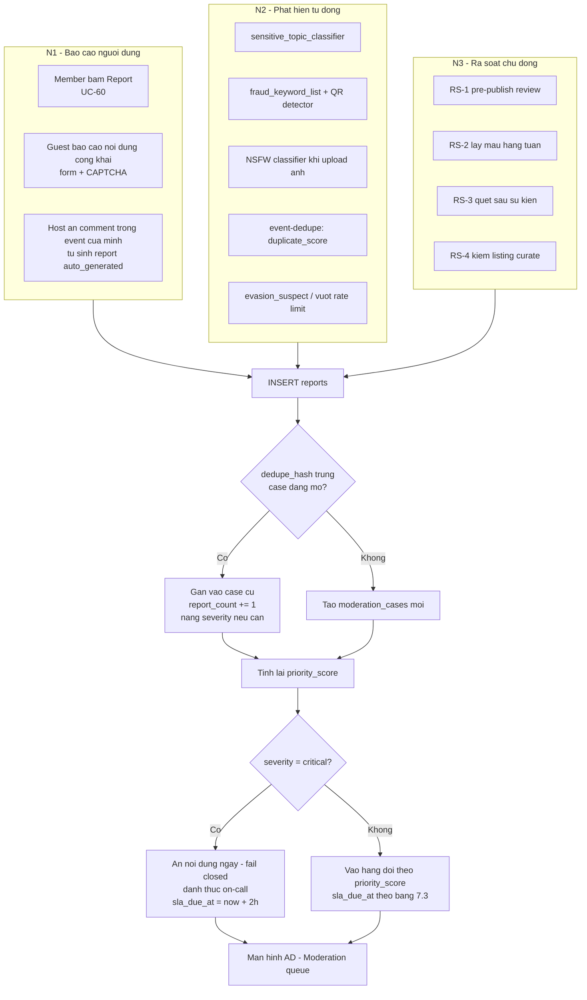
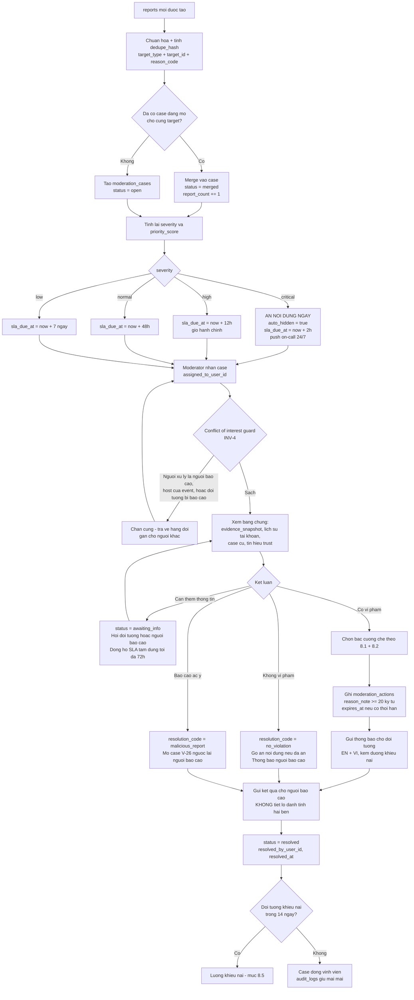
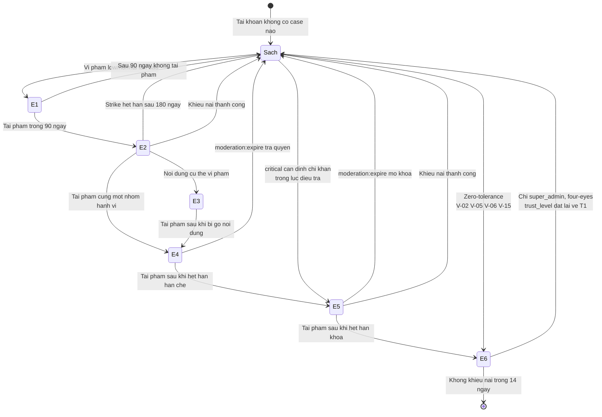
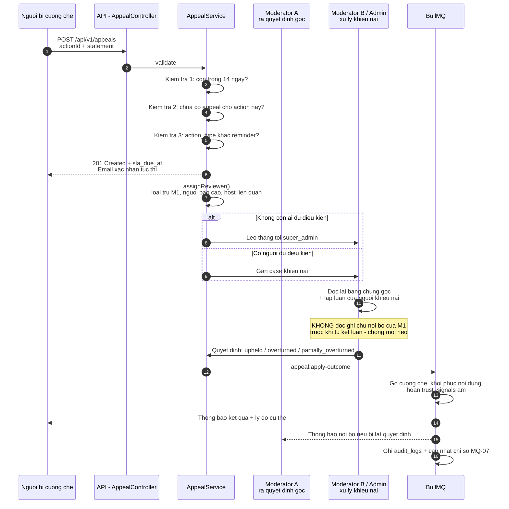
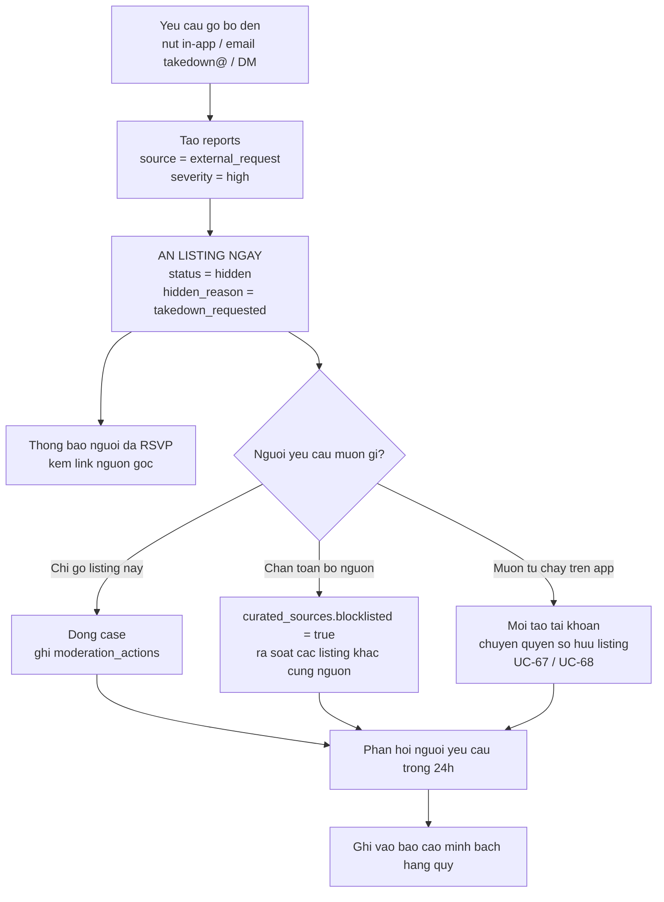
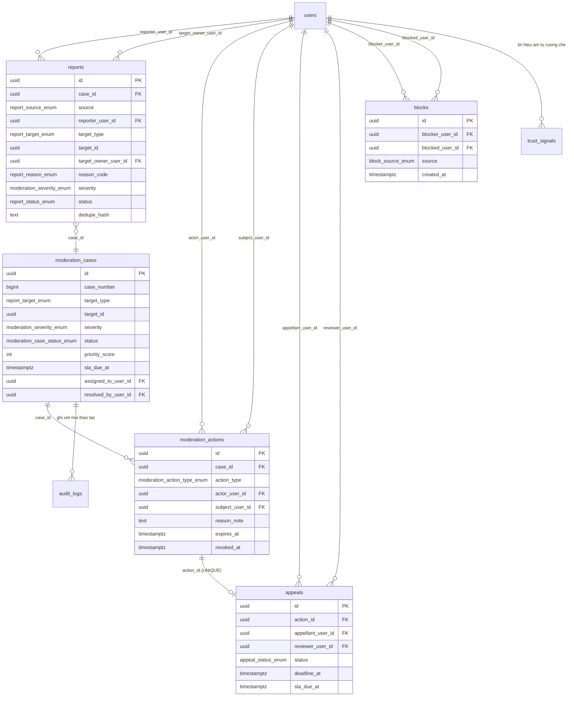

# 05 — Trust & Safety và Kiểm duyệt — Da Nang Connect

> **Trạng thái**: Bản thiết kế v1.0 — dùng cho MVP (Giai đoạn 1: Kết nối cộng đồng)
> **Ngày**: 2026-08-31
> **Phạm vi**: Đà Nẵng, cộng đồng expat. Ngôn ngữ mặc định của UI: English; ngôn ngữ thứ hai: Tiếng Việt.
> **Đối tượng đọc**: Product, Backend (NestJS), Mobile (Expo), Community Ops, Founder.
> **Tài liệu liên quan**: `01-*` (tác nhân & phân quyền), `02-*` (use case), `03-*` (domain & dữ liệu), `04-*` (tech stack & kiến trúc), `06-*` (pháp lý), `10-*` (UX & i18n).

---

## Mục lục

1. [Tóm tắt điều hành](#1-tóm-tắt-điều-hành)
2. [Nguyên tắc thiết kế Trust & Safety](#2-nguyên-tắc-thiết-kế-trust--safety)
3. [Bản đồ rủi ro (Risk Taxonomy)](#3-bản-đồ-rủi-ro-risk-taxonomy)
    - [3.1 Ma trận tổng hợp](#31-ma-trận-tổng-hợp)
    - [3.2 Chi tiết từng loại rủi ro](#32-chi-tiết-từng-loại-rủi-ro)
4. [Phòng ngừa theo tầng — Progressive Verification](#4-phòng-ngừa-theo-tầng--progressive-verification)
    - [4.1 Sáu tầng tin cậy](#41-sáu-tầng-tin-cậy)
    - [4.2 Điều kiện lên tầng và bằng chứng lưu trữ](#42-điều-kiện-lên-tầng-và-bằng-chứng-lưu-trữ)
    - [4.3 Ma trận quyền hạn theo tầng](#43-ma-trận-quyền-hạn-theo-tầng)
    - [4.4 Khi nào yêu cầu giấy tờ (T4) — quy tắc kích hoạt](#44-khi-nào-yêu-cầu-giấy-tờ-t4--quy-tắc-kích-hoạt)
    - [4.5 Xác thực bổ trợ không dùng giấy tờ](#45-xác-thực-bổ-trợ-không-dùng-giấy-tờ)
5. [Trust Score và quyền hạn](#5-trust-score-và-quyền-hạn)
    - [5.1 Công thức](#51-công-thức)
    - [5.2 Điểm phạt và suy giảm](#52-điểm-phạt-và-suy-giảm)
    - [5.3 Hiển thị cho người dùng](#53-hiển-thị-cho-người-dùng)
6. [Rate limit, giới hạn tạo sự kiện và phát hiện trùng lặp](#6-rate-limit-giới-hạn-tạo-sự-kiện-và-phát-hiện-trùng-lặp)
    - [6.1 Bảng rate limit theo tier](#61-bảng-rate-limit-theo-tier)
    - [6.2 Giới hạn đặc biệt cho tài khoản mới](#62-giới-hạn-đặc-biệt-cho-tài-khoản-mới)
    - [6.3 Chống bot ở tầng đăng ký](#63-chống-bot-ở-tầng-đăng-ký)
    - [6.4 Phát hiện trùng lặp (Duplicate Detection)](#64-phát-hiện-trùng-lặp-duplicate-detection)
7. [Quy trình báo cáo vi phạm và hàng đợi kiểm duyệt](#7-quy-trình-báo-cáo-vi-phạm-và-hàng-đợi-kiểm-duyệt)
    - [7.1 Ba nguồn vào hàng đợi](#71-ba-nguồn-vào-hàng-đợi)
    - [7.2 Bảng phân loại vi phạm](#72-bảng-phân-loại-vi-phạm)
    - [7.3 Bốn mức độ, SLA và người xử lý](#73-bốn-mức-độ-sla-và-người-xử-lý)
    - [7.4 Sơ đồ luồng đầy đủ một case kiểm duyệt](#74-sơ-đồ-luồng-đầy-đủ-một-case-kiểm-duyệt)
    - [7.5 Gộp báo cáo và chấm điểm ưu tiên hàng đợi](#75-gộp-báo-cáo-và-chấm-điểm-ưu-tiên-hàng-đợi)
    - [7.6 Biểu mẫu báo cáo — nội dung hiển thị](#76-biểu-mẫu-báo-cáo--nội-dung-hiển-thị)
    - [7.7 Bảo vệ người báo cáo và chống xung đột lợi ích](#77-bảo-vệ-người-báo-cáo-và-chống-xung-đột-lợi-ích)
    - [7.8 Runbook ca `critical` — 8 bước, đo bằng phút](#78-runbook-ca-critical--8-bước-đo-bằng-phút)
    - [7.9 Chống lạm dụng chính hệ thống báo cáo](#79-chống-lạm-dụng-chính-hệ-thống-báo-cáo)
8. [Thang hành động cưỡng chế và quyền khiếu nại](#8-thang-hành-động-cưỡng-chế-và-quyền-khiếu-nại)
    - [8.1 Sáu bậc cưỡng chế](#81-sáu-bậc-cưỡng-chế)
    - [8.2 Ma trận vi phạm × số lần tái phạm](#82-ma-trận-vi-phạm--số-lần-tái-phạm)
    - [8.3 Cơ chế hết hạn — phải là code, không phải lời hứa](#83-cơ-chế-hết-hạn--phải-là-code-không-phải-lời-hứa)
    - [8.4 Nội dung thông báo cưỡng chế](#84-nội-dung-thông-báo-cưỡng-chế)
    - [8.5 Quy trình khiếu nại](#85-quy-trình-khiếu-nại)
    - [8.6 Cam kết công khai và cách người ngoài kiểm chứng được](#86-cam-kết-công-khai-và-cách-người-ngoài-kiểm-chứng-được)
9. [Đánh giá hai chiều sau sự kiện và chống trả đũa](#9-đánh-giá-hai-chiều-sau-sự-kiện-và-chống-trả-đũa)
    - [9.1 Vì sao review hai chiều là vấn đề an toàn, không phải vấn đề chất lượng](#91-vì-sao-review-hai-chiều-là-vấn-đề-an-toàn-không-phải-vấn-đề-chất-lượng)
    - [9.2 Cơ chế double-blind](#92-cơ-chế-double-blind)
    - [9.3 Chống trả đũa](#93-chống-trả-đũa)
    - [9.4 Khi review chính nó là vi phạm](#94-khi-review-chính-nó-là-vi-phạm)
10. [Tính năng an toàn khi gặp mặt ngoài đời](#10-tính-năng-an-toàn-khi-gặp-mặt-ngoài-đời)
    - [10.1 Checklist an toàn cho người dùng khi gặp mặt lần đầu](#101-checklist-an-toàn-cho-người-dùng-khi-gặp-mặt-lần-đầu)
    - [10.2 Nội dung cảnh báo hiển thị trong app — vị trí và câu chữ](#102-nội-dung-cảnh-báo-hiển-thị-trong-app--vị-trí-và-câu-chữ)
    - [10.3 Bộ công cụ an toàn trong app](#103-bộ-công-cụ-an-toàn-trong-app)
    - [10.4 Danh bạ khẩn cấp hiển thị trong app](#104-danh-bạ-khẩn-cấp-hiển-thị-trong-app)
11. [Nội dung curate thủ công — chuẩn đạo đức và pháp lý](#11-nội-dung-curate-thủ-công--chuẩn-đạo-đức-và-pháp-lý)
    - [11.1 Năm quy tắc bất di bất dịch](#111-năm-quy-tắc-bất-di-bất-dịch)
    - [11.2 Nhãn hiển thị công khai — câu chữ chính xác](#112-nhãn-hiển-thị-công-khai--câu-chữ-chính-xác)
    - [11.3 Quy trình gỡ bỏ theo yêu cầu (takedown)](#113-quy-trình-gỡ-bỏ-theo-yêu-cầu-takedown)
    - [11.4 Chuyển giao quyền sở hữu — luồng claim](#114-chuyển-giao-quyền-sở-hữu--luồng-claim)
    - [11.5 Ranh giới với vai trò kiểm duyệt](#115-ranh-giới-với-vai-trò-kiểm-duyệt)
12. [Checklist an toàn cộng đồng khi tổ chức sự kiện tại Đà Nẵng](#12-checklist-an-toàn-cộng-đồng-khi-tổ-chức-sự-kiện-tại-đà-nẵng)
    - [12.1 Trước sự kiện — host tự kiểm](#121-trước-sự-kiện--host-tự-kiểm)
    - [12.2 Trong sự kiện](#122-trong-sự-kiện)
    - [12.3 Sau sự kiện](#123-sau-sự-kiện)
    - [12.4 Ba tình huống host phải biết cách xử lý](#124-ba-tình-huống-host-phải-biết-cách-xử-lý)
13. [Kiến trúc kỹ thuật và data model](#13-kiến-trúc-kỹ-thuật-và-data-model)
    - [13.1 Sơ đồ quan hệ](#131-sơ-đồ-quan-hệ)
    - [13.2 Enum tập trung](#132-enum-tập-trung)
    - [13.3 `reports` — `Report`](#133-reports--report)
    - [13.4 `moderation_cases` — `ModerationCase`](#134-moderation_cases--moderationcase)
    - [13.5 `moderation_actions` — `ModerationAction`](#135-moderation_actions--moderationaction)
    - [13.6 `appeals` — `Appeal`](#136-appeals--appeal)
    - [13.7 `blocks` — `Block`](#137-blocks--block)
    - [13.8 Cấu trúc module NestJS](#138-cấu-trúc-module-nestjs)
    - [13.9 Job BullMQ](#139-job-bullmq)
    - [13.10 API endpoints](#1310-api-endpoints)
    - [13.11 Lưu trữ, xóa và nghĩa vụ pháp lý](#1311-lưu-trữ-xóa-và-nghĩa-vụ-pháp-lý)
14. [Chỉ số vận hành và ngưỡng cảnh báo](#14-chỉ-số-vận-hành-và-ngưỡng-cảnh-báo)
    - [14.1 Bảng chỉ số](#141-bảng-chỉ-số)
    - [14.2 Truy vấn tham chiếu](#142-truy-vấn-tham-chiếu)
    - [14.3 Cảnh báo tự động](#143-cảnh-báo-tự-động)
    - [14.4 Dự phóng khối lượng và nhân sự](#144-dự-phóng-khối-lượng-và-nhân-sự)
15. [Lộ trình triển khai](#15-lộ-trình-triển-khai)
16. [Phụ lục](#16-phụ-lục)
    - [16.1 Từ điển lý do báo cáo](#161-từ-điển-lý-do-báo-cáo)
    - [16.2 Mẫu thông báo cưỡng chế](#162-mẫu-thông-báo-cưỡng-chế)
    - [16.3 Ánh xạ ký hiệu ưu tiên](#163-ánh-xạ-ký-hiệu-ưu-tiên)
    - [16.4 Danh sách câu hỏi cần luật sư xác nhận](#164-danh-sách-câu-hỏi-cần-luật-sư-xác-nhận)
    - [16.5 Danh mục kiểm tra chặn phát hành](#165-danh-mục-kiểm-tra-chặn-phát-hành)
    - [16.6 Thuật ngữ](#166-thuật-ngữ)

---

## 1. Tóm tắt điều hành

Da Nang Connect không phải là một mạng xã hội đọc-viết thuần túy. Sản phẩm này **đẩy người lạ ra gặp nhau ngoài đời thực**, ở một thành phố cụ thể, trong đó phần lớn người dùng là người nước ngoài không thạo tiếng Việt, không quen hệ thống pháp luật và hành chính địa phương, và thường ở trạng thái tạm trú ngắn hạn. Đây là điểm khác biệt cốt lõi so với Meetup hay Facebook Groups: **một lỗi kiểm duyệt ở đây không dừng ở một bài đăng xấu, nó có thể trở thành một sự cố an toàn thân thể**.

Hệ quả thiết kế:

| Quyết định | Lý do |
|---|---|
| An toàn là tính năng MVP, không phải backlog | Sự cố đầu tiên xảy ra khi cộng đồng còn 200 người sẽ giết luôn niềm tin — cộng đồng expat Đà Nẵng nhỏ và truyền miệng cực nhanh |
| Xác thực theo tầng, không phải xác thực cứng ngay từ đầu | Bắt KYC ở bước đăng ký sẽ giết conversion. Nhưng bắt KYC khi tạo sự kiện 50 người thì hợp lý |
| Số điện thoại KHÔNG BAO GIỜ hiển thị công khai | Đây là vector số một cho quấy rối và spam dịch vụ trong các nhóm expat hiện tại |
| Kiểm duyệt = con người + máy, máy chỉ xếp hàng và chặn thô | Ở quy mô MVP, khối lượng nhỏ; sai sót của mô hình tự động đắt hơn chi phí một moderator |
| Nội dung nhạy cảm chính trị/tôn giáo bị chặn ở tầng chính sách, không phải tầng thảo luận | Bối cảnh pháp lý Việt Nam khiến đây là rủi ro tồn vong của sản phẩm, không phải rủi ro danh tiếng |
| Nội dung curate thủ công phải ghi nguồn và có nút gỡ | Đây là điểm yếu pháp lý và đạo đức lớn nhất của chiến lược ra mắt |

**Ba cam kết công khai với người dùng** (đưa vào onboarding và trang Safety):

1. Chúng tôi không bao giờ hiển thị số điện thoại hay email của bạn cho người dùng khác.
2. Mọi báo cáo về nguy hiểm thân thể (mức **Critical**) được một con người xem trong vòng **2 giờ**, 24/7.
3. Mọi quyết định hạn chế tài khoản đều có lý do cụ thể và có quyền khiếu nại.

---

## 2. Nguyên tắc thiết kế Trust & Safety

| # | Nguyên tắc | Diễn giải vận hành |
|---|---|---|
| P1 | **Ma sát tỷ lệ thuận với rủi ro** | Tham gia một buổi chạy bộ công khai 8 người: gần như không ma sát. Tạo sự kiện thu phí 100 người: yêu cầu xác thực giấy tờ |
| P2 | **Mặc định riêng tư** | Mọi trường dữ liệu cá nhân mặc định ẩn; người dùng chủ động mở, không phải chủ động đóng |
| P3 | **Mọi hành động cưỡng chế đều để lại dấu vết** | Không có "xóa im lặng". Mọi action ghi vào `moderation_audit_log` bất biến, kèm actor, lý do, bằng chứng |
| P4 | **Người ra quyết định ≠ người xử lý khiếu nại** | Bắt buộc từ ngày đầu, kể cả khi đội chỉ có 2 người |
| P5 | **Không punish sự im lặng** | Người dùng ít hoạt động không bị hạ trust. Chỉ hành vi tiêu cực mới trừ điểm |
| P6 | **Chống trả đũa được thiết kế trước, không vá sau** | Review hai chiều dùng cơ chế double-blind ngay từ v1 |
| P7 | **Người báo cáo được bảo vệ tuyệt đối** | Danh tính người báo cáo không bao giờ lộ cho người bị báo cáo, kể cả trong nội dung thông báo cưỡng chế |
| P8 | **Không giả vờ là người khác** | Nội dung curate thủ công luôn dán nhãn rõ ràng, không bao giờ đăng dưới danh nghĩa organizer gốc |
| P9 | **Fail closed cho rủi ro thân thể, fail open cho rủi ro nội dung** | Nghi ngờ có nguy hiểm → ẩn trước, xem xét sau. Nghi ngờ spam → xếp hàng, không ẩn ngay |
| P10 | **Ngôn ngữ trung lập** | Toàn bộ thông báo cưỡng chế viết bằng English (mặc định) + Tiếng Việt, giọng điệu mô tả hành vi, không phán xét con người |

---

## 3. Bản đồ rủi ro (Risk Taxonomy)

### 3.1 Ma trận tổng hợp

Thang điểm: Khả năng xảy ra (L) và Mức nghiêm trọng (S) từ 1–5. Ưu tiên = L × S.

| Mã | Loại rủi ro | L | S | Ưu tiên | Nhóm |
|---|---|---|---|---|---|
| R-07 | An toàn thân thể khi gặp mặt | 2 | 5 | 10 | Physical |
| R-08 | Nội dung nhạy cảm chính trị / tôn giáo | 3 | 5 | 15 | Legal |
| R-01 | Lừa đảo tài chính | 4 | 4 | 16 | Fraud |
| R-02 | Spam quảng cáo dịch vụ | 5 | 2 | 10 | Content |
| R-03 | Quấy rối | 4 | 4 | 16 | Conduct |
| R-04 | Sự kiện ma / không có thật | 4 | 3 | 12 | Fraud |
| R-05 | No-show hàng loạt | 5 | 2 | 10 | Quality |
| R-06 | Người dùng giả mạo / mạo danh | 3 | 4 | 12 | Identity |
| R-09 | Nội dung khiêu dâm, mại dâm trá hình | 3 | 4 | 12 | Content |
| R-10 | Trẻ vị thành niên trong môi trường người lớn | 2 | 5 | 10 | Physical |
| R-11 | Doxxing / rò rỉ dữ liệu cá nhân | 2 | 4 | 8 | Privacy |
| R-12 | Rủi ro pháp lý từ nội dung curate | 3 | 3 | 9 | Legal |
| R-13 | Ma túy / chất cấm gắn với sự kiện | 2 | 5 | 10 | Legal |
| R-14 | Tai nạn thể thao / hoạt động ngoài trời | 3 | 4 | 12 | Physical |

### 3.2 Chi tiết từng loại rủi ro

#### R-01 — Lừa đảo tài chính

**Các biến thể quan sát được trong cộng đồng expat:**

| Biến thể | Mô tả | Tín hiệu phát hiện |
|---|---|---|
| Deposit scam | Yêu cầu chuyển khoản giữ chỗ cho sự kiện rồi biến mất | Sự kiện thu phí do tài khoản < 30 ngày tuổi tạo; có QR chuyển khoản trong ảnh cover |
| Fake ticket resale | Bán lại vé sự kiện lớn không có thật | Từ khóa "ticket", "resell", "spare ticket" + link ngoài |
| Crypto / investment pitch | Sự kiện "networking" thực chất là buổi mời đầu tư | Từ khóa cụm: "passive income", "financial freedom", "trading signal", "web3 networking" |
| Romance / long-con | Xây quan hệ qua chat rồi mượn tiền | Nhiều tin nhắn 1-1 tới người mới, tài khoản một ảnh, tự động lặp câu chào |
| Fake landlord / môi giới | Xuất hiện sớm dù Nhà ở là Giai đoạn 2 — người dùng vẫn tự đăng | Bài đăng lệch danh mục, có giá thuê + yêu cầu cọc trước khi xem |
| Việc làm ma | "Tuyển giáo viên tiếng Anh, phí hồ sơ 2 triệu" | Có nhắc "phí", "deposit", "processing fee" |

**Biện pháp:**

- **Phòng ngừa**: MVP **không xử lý thanh toán trong app**. Trường `price` chỉ là thông tin hiển thị; app hiển thị banner cảnh báo cố định trên mọi sự kiện có phí: *"Da Nang Connect does not process payments. Never transfer money before you have met the organizer in person."*
- **Phát hiện**: regex + danh sách từ khóa (`fraud_keyword_list`, cập nhật hàng tuần) chạy trên `title`, `description`, OCR ảnh cover. Phát hiện QR code trong ảnh → gắn cờ `contains_payment_qr` → auto-queue P1.
- **Khắc phục**: gỡ sự kiện, khóa vĩnh viễn, thông báo cho toàn bộ người đã RSVP, ghi vào `fraud_signal_registry` (hash email/phone/device) để chặn tái đăng ký.

#### R-02 — Spam quảng cáo dịch vụ

Dữ liệu nền cho thấy tỷ lệ cầu/cung là 11:1 — nghĩa là **khi có một kênh tập trung, phía cung sẽ đổ vào rất nhanh và rất mạnh**. Đây sẽ là loại vi phạm có khối lượng lớn nhất, không phải loại nguy hiểm nhất.

| Biến thể | Ví dụ |
|---|---|
| Sự kiện trá hình quảng cáo | "Free yoga class" nhưng thực chất là buổi chào bán gói tập 6 tháng |
| Spam trong chat sự kiện | Đăng dịch vụ visa / thuê xe máy vào chat của mọi sự kiện |
| Profile-as-billboard | Bio chứa số Zalo/WhatsApp và bảng giá dịch vụ |
| Cross-post hàng loạt | Cùng một nội dung đăng ở 10 khu vực khác nhau để phủ filter |

**Biện pháp:**

- Tạo danh mục hợp pháp riêng cho phía cung ở phiên bản sau (`listing_type = 'service'`), để spam có nơi đi đúng chỗ thay vì bị đẩy vào sự kiện. Ở MVP: chặn.
- Giới hạn liên hệ ngoài: trường `external_contact` chỉ mở cho tier ≥ T2; link ngoài trong description bị rút gọn và gắn interstitial cảnh báo.
- Phát hiện cross-post: xem mục [6.4](#64-phát-hiện-trùng-lặp-duplicate-detection).

#### R-03 — Quấy rối

| Biến thể | Kênh | Mức độ |
|---|---|---|
| Tin nhắn không mong muốn lặp lại | DM / chat sự kiện | P2 |
| Nội dung tình dục không mong muốn | DM | P1 |
| Đeo bám sau sự kiện (offline stalking) | Ngoài app | P0 |
| Ngôn từ thù ghét theo quốc tịch, chủng tộc, tôn giáo, giới tính, xu hướng tính dục | Công khai | P1 |
| Brigading — nhiều tài khoản cùng công kích một người | Review + report | P1 |
| Đe dọa tống tiền bằng ảnh riêng tư | DM | P0 |

**Biện pháp:**

- **Chặn (block) là hành động một chiều và tuyệt đối**: người bị chặn không nhìn thấy profile, không thấy sự kiện do người chặn tạo, không RSVP được vào sự kiện đó, và không nhận được bất kỳ thông báo nào cho biết mình đã bị chặn.
- **Message request**: người chưa từng tham gia chung sự kiện chỉ gửi được 1 tin nhắn đầu tiên; tin thứ hai bị chặn cho tới khi người nhận trả lời.
- **Rate limit DM cho tài khoản mới**: xem [6.1](#61-bảng-rate-limit-theo-tier).
- **Quick-report trong chat**: mỗi bong bóng tin nhắn có menu long-press → Report, kèm tự động đính kèm 20 tin nhắn gần nhất làm bằng chứng (`evidence_snapshot`), không cần người dùng chụp màn hình.

#### R-04 — Sự kiện ma / không có thật

Đây là rủi ro đặc thù của một app RSVP hyperlocal. Ba dạng:

1. **Sự kiện không tồn tại**: tạo để thu thập RSVP rồi bán data, hoặc để dụ người ra một địa điểm.
2. **Sự kiện bị hủy nhưng không cập nhật**: người tham gia đến nơi không có ai — lỗi vận hành hơn là ác ý.
3. **Sự kiện sao chép**: copy nguyên nội dung của organizer thật, đổi địa điểm hoặc đổi kênh liên hệ.

**Biện pháp:**



Cơ chế **"Did this happen?"** là xương sống chống sự kiện ma: rẻ, không cần AI, và tạo tín hiệu chất lượng cao vì chỉ người đã RSVP mới được hỏi.

#### R-05 — No-show hàng loạt

Không phải vi phạm đạo đức, nhưng là **sát thủ retention** với organizer nhỏ lẻ — nhóm mà sản phẩm phụ thuộc vào. Ở nhóm expat, đặc thù còn nặng hơn vì nhiều người ở ngắn hạn, tâm lý RSVP thoải mái.

| Cơ chế | Mô tả |
|---|---|
| Reliability score hiển thị công khai | Tỷ lệ tham gia trên tổng RSVP, chỉ hiện khi có ≥ 5 RSVP đã kết thúc. Hiển thị dạng nhãn: `Reliable` (≥ 85%), `Usually shows up` (65–84%), `Mixed` (40–64%), ẩn hoàn toàn nếu < 5 mẫu |
| Cửa sổ hủy không phạt | Hủy trước T-4h: không tính no-show. Sau đó tính, trừ khi organizer bấm "Excuse" |
| Waitlist tự động | Khi có người hủy, slot chuyển ngay cho người đầu waitlist + push notification |
| Nhắc nhở 2 lớp | Push T-24h và T-2h, kèm nút "I can't make it" một chạm |
| Trần RSVP đồng thời | T1: tối đa 3 sự kiện sắp tới. T2: 8. T3+: không giới hạn |
| Không phạt tiền, không phạt cứng | MVP không cấm người no-show; chỉ hiển thị minh bạch và cho organizer quyền tự lọc (`min_reliability` cho sự kiện của mình) |

#### R-06 — Người dùng giả mạo / mạo danh

| Biến thể | Xử lý |
|---|---|
| Ảnh đại diện lấy từ mạng | Reverse-image check ở v1.1; MVP dựa vào report + yêu cầu selfie-liveness khi bị báo cáo |
| Mạo danh organizer/doanh nghiệp có thật | P1, gỡ ngay, không cần chờ khiếu nại từ bên bị mạo danh |
| Mạo danh nhân viên Da Nang Connect | P0. Nhân viên chính thức có huy hiệu `Staff` do hệ thống cấp, không thể tự đặt trong display name |
| Đa tài khoản (sockpuppet) để né lệnh cấm | Device fingerprint + hash số điện thoại + hash email chuẩn hóa (bỏ dấu chấm Gmail, bỏ phần `+tag`) |
| Tài khoản "bot farm" tạo hàng loạt | Chặn ở tầng đăng ký: rate limit theo IP/ASN, chặn email dùng một lần, CAPTCHA thích ứng |

**Tên hiển thị (display name) — quy tắc bắt buộc:**

- Không chứa số điện thoại, URL, handle mạng xã hội, emoji quảng cáo.
- Không chứa từ khóa vai trò hệ thống: `admin`, `staff`, `moderator`, `support`, `official`, `Da Nang Connect`.
- Đổi display name > 2 lần / 90 ngày → gắn cờ và hiển thị nhãn `Recently renamed` cho tài khoản dưới T3.

#### R-07 — An toàn thân thể khi gặp mặt

Đây là rủi ro có mức nghiêm trọng cao nhất. Xem toàn bộ mục [10](#10-tính-năng-an-toàn-khi-gặp-mặt-ngoài-đời).

Các kịch bản cần chuẩn bị sẵn kịch bản phản ứng (runbook):

| Kịch bản | Phản ứng của đội |
|---|---|
| Người dùng bấm nút SOS trong sự kiện | Cảnh báo tức thì tới on-call, mở case P0, giữ nguyên toàn bộ dữ liệu vị trí và chat |
| Báo cáo tấn công tình dục sau sự kiện | Đình chỉ ngay tài khoản bị tố (không chờ điều tra), cung cấp danh bạ hỗ trợ, không tự điều tra như cơ quan chức năng, không khuyên nạn nhân nên hay không nên báo công an |
| Sự kiện được tổ chức tại nhà riêng của organizer | Gắn nhãn `Private residence` bắt buộc, yêu cầu organizer ở tier ≥ T3, hiện cảnh báo cho người RSVP |
| Người dùng mất tích / không liên lạc được sau sự kiện | Runbook lưu trữ dữ liệu, phối hợp theo yêu cầu hợp pháp từ cơ quan chức năng |

#### R-08 — Nội dung nhạy cảm chính trị / tôn giáo

**Đây là rủi ro tồn vong, không phải rủi ro danh tiếng.** Một app do đội ngũ vận hành tại Việt Nam, phục vụ người nước ngoài, tổ chức các buổi tụ họp ngoài đời, là bối cảnh mà cơ quan quản lý sẽ nhìn kỹ.

Khung pháp lý cần bám (danh sách để đội tham vấn luật sư xác nhận trước khi phát hành, **không được coi đây là tư vấn pháp lý**):

| Văn bản | Điểm liên quan trực tiếp |
|---|---|
| Luật An ninh mạng 2018 | Nghĩa vụ gỡ bỏ nội dung vi phạm theo yêu cầu; lưu trữ dữ liệu |
| Nghị định 53/2022/NĐ-CP | Hướng dẫn Luật An ninh mạng — lưu trữ dữ liệu, đặt chi nhánh |
| Nghị định 147/2024/NĐ-CP | Quản lý thông tin trên mạng; **yêu cầu xác thực tài khoản bằng số điện thoại**; thời hạn gỡ nội dung vi phạm |
| **Luật Bảo vệ dữ liệu cá nhân 91/2025/QH15** (hiệu lực 01/01/2026 — văn bản có hiệu lực cao hơn) **và Nghị định 13/2023/NĐ-CP** cùng nghị định hướng dẫn | ⚖️ **CẦN LUẬT SƯ XÁC NHẬN.** Từ 01/01/2026 mọi biểu mẫu đồng ý, thông báo xử lý dữ liệu và quy trình đáp ứng quyền chủ thể dữ liệu phải theo Luật 91/2025 và nghị định hướng dẫn; Nghị định 13/2023 chỉ còn áp dụng phần không trái. Cơ sở pháp lý xử lý dữ liệu, quyền của chủ thể dữ liệu, dữ liệu nhạy cảm (vị trí, sinh trắc học) |
| Nghị định 38/2005/NĐ-CP | Bảo đảm trật tự công cộng — tập trung đông người nơi công cộng |
| Pháp luật về nhập cảnh, xuất cảnh, cư trú của người nước ngoài | Khai báo tạm trú; hoạt động đúng mục đích nhập cảnh |

> ⚠️ **Vấn đề mở nghiêm trọng**: Nghị định 147/2024/NĐ-CP đặt ra yêu cầu xác thực tài khoản bằng số điện thoại. Phần lớn expat mới đến Đà Nẵng dùng số nước ngoài hoặc eSIM du lịch. Đội cần luật sư làm rõ: (a) nghĩa vụ này áp dụng cho loại hình dịch vụ nào, (b) số điện thoại nước ngoài có được chấp nhận không, (c) phương án dự phòng nếu bắt buộc số Việt Nam. Đây là câu hỏi có thể thay đổi cả luồng đăng ký — cần trả lời **trước khi** code auth.

**Chính sách nội dung — ba lớp:**

| Lớp | Nội dung | Xử lý |
|---|---|---|
| **Cấm tuyệt đối** | Kêu gọi tụ tập chính trị, biểu tình, vận động chính trị; nội dung chống Nhà nước; xuyên tạc lịch sử, chủ quyền lãnh thổ; bản đồ sai chủ quyền (đặc biệt trong ảnh cover và bản đồ nhúng); hoạt động tôn giáo trái phép, truyền đạo tại nơi công cộng không đăng ký | Chặn tự động khi phát hiện, gỡ ngay, P0, thông báo cho founder |
| **Cần duyệt trước** | Sự kiện tôn giáo hợp pháp (thánh lễ tại nhà thờ đã đăng ký, sinh hoạt tại chùa), sự kiện gắn quốc khánh/ngày lễ của quốc gia khác, sự kiện có diễn giả nước ngoài phát biểu công khai | Bắt buộc pre-publish review, organizer ≥ T3 |
| **Cho phép** | Sự kiện văn hóa, ẩm thực, thể thao, ngôn ngữ, nghề nghiệp, thiện nguyện đã có đơn vị bảo trợ | Bình thường |

**Kỹ thuật**: `sensitive_topic_classifier` chạy trước khi publish với 2 danh sách từ khóa (EN + VI) + kiểm tra ảnh bản đồ. Ngưỡng đặt **thiên về false-positive** — thà đưa một sự kiện vô hại vào hàng đợi duyệt còn hơn để lọt một sự kiện nhạy cảm.

**Điều khoản người dùng** phải có một mục riêng, viết bằng English rõ ràng, giải thích rằng nền tảng hoạt động theo pháp luật Việt Nam và không phải là nơi tổ chức hoạt động chính trị — nói thẳng, không né tránh, để người dùng expat hiểu ngay thay vì cảm thấy bị kiểm duyệt tùy tiện.

#### R-09 — Nội dung khiêu dâm, mại dâm trá hình

| Biến thể | Tín hiệu |
|---|---|
| "Massage", "companion", "date night for money" trá hình sự kiện | Danh sách từ khóa EN/VI + ảnh |
| Ảnh đại diện khiêu dâm | Kiểm duyệt ảnh khi upload (NSFW classifier) |
| Dùng DM để chào mời | Report từ người nhận + phát hiện mẫu tin nhắn lặp |

Xử lý: gỡ + khóa vĩnh viễn ngay lần đầu (không áp dụng thang strike). Đây là vi phạm zero-tolerance vì hệ quả pháp lý tại Việt Nam.

#### R-10 — Trẻ vị thành niên

- Độ tuổi tối thiểu: **16**, có ghi rõ trong ToS; **18+** bắt buộc cho sự kiện gắn nhãn `alcohol`, `nightlife`, `18+`.
- Khai sinh nhật ở bước đăng ký; sửa ngày sinh sau đó cần thao tác qua support (chống lách tuổi).
- Sự kiện `family-friendly` cho phép trẻ em đi kèm người giám hộ; người giám hộ chịu trách nhiệm, ghi rõ trong mô tả.
- Bất kỳ nghi ngờ nào về nội dung xâm hại trẻ em → P0, khóa ngay, bảo toàn bằng chứng, báo cáo cơ quan chức năng theo quy trình pháp lý. Không thương lượng, không khiếu nại.

#### R-11 — Doxxing / rò rỉ dữ liệu cá nhân

- Cấm đăng thông tin cá nhân của người khác: địa chỉ nhà, số điện thoại, nơi làm việc, ảnh chụp lén, ảnh hộ chiếu/visa.
- **Không hiển thị vị trí chính xác của người dùng.** Bản đồ cá nhân hóa chỉ hiển thị khoảng cách theo bậc: `< 1 km`, `1–3 km`, `3–7 km`, `> 7 km`.
- Ảnh upload bị **xóa EXIF** (bao gồm GPS) ở tầng backend trước khi lưu S3-compatible storage. Bắt buộc, không có tùy chọn tắt.
- Danh sách người tham gia sự kiện chỉ hiển thị cho người đã RSVP; người dùng có thể chọn `Attend privately` (hiện là "1 người tham gia ẩn danh").

#### R-12 — Rủi ro pháp lý từ nội dung curate

Xem mục [11](#11-nội-dung-curate-thủ-công--chuẩn-đạo-đức-và-pháp-lý).

#### R-13 — Ma túy và chất cấm

Zero-tolerance. Từ khóa lóng (EN + VI) trong `banned_substance_lexicon`, cập nhật hàng tháng. Gỡ + khóa vĩnh viễn + bảo toàn bằng chứng. Không cho khiếu nại tự phục hồi; chỉ founder review.

#### R-14 — Tai nạn thể thao và hoạt động ngoài trời

Đặc thù Đà Nẵng: tắm biển, lặn, đi xe máy đèo Hải Vân / bán đảo Sơn Trà, leo núi, chạy bộ giữa trưa nắng.

| Loại sự kiện | Yêu cầu bắt buộc trong form tạo sự kiện |
|---|---|
| `water` (biển, hồ, lặn) | Checkbox xác nhận: có khu vực cứu hộ; ghi rõ yêu cầu biết bơi; hiển thị cảnh báo dòng rip current |
| `motorbike` (đi phượt nhóm) | Nhắc yêu cầu giấy phép lái xe hợp lệ tại Việt Nam + bảo hiểm; hiển thị disclaimer |
| `hiking` / `trail` | Yêu cầu mô tả độ khó, thời lượng, điểm quay đầu, nước uống |
| `contact_sport` | Ghi rõ mức độ va chạm; khuyến nghị bảo hiểm |

App hiển thị **disclaimer trách nhiệm** cho các danh mục này: nền tảng chỉ kết nối, không tổ chức, không bảo hiểm cho hoạt động.

---
## 4. Phòng ngừa theo tầng — Progressive Verification

### 4.1 Sáu tầng tin cậy



### 4.2 Điều kiện lên tầng và bằng chứng lưu trữ

| Tier | Tên | Điều kiện đạt | Dữ liệu lưu | Thời hạn lưu |
|---|---|---|---|---|
| **T0** | New | Chưa đăng nhập, hoặc vừa tạo tài khoản chưa xác thực gì | Không | — |
| **T1** | Email verified | Xác thực email hoặc social login (Google / Apple / Facebook). Apple Sign-In bắt buộc trên iOS nếu có social login | `email_hash`, provider, `sub` | Vòng đời tài khoản |
| **T2** | Phone verified | OTP SMS thành công | `phone_hash` (HMAC-SHA256 + pepper), `country_code`, `carrier_type` | Vòng đời tài khoản |
| **T3** | Active member | ≥ 3 sự kiện đã check-in, tài khoản ≥ 30 ngày, 0 strike đang hiệu lực, ≥ 1 review nhận được ≥ 4★ | Tính toán từ dữ liệu có sẵn | — |
| **T4** | Trusted | Passport / CCCD / thẻ tạm trú qua nhà cung cấp KYC + liveness selfie | **Chỉ lưu**: `document_type`, `document_country`, `verification_ref`, `verified_at`, `name_match_score`. **Không lưu ảnh giấy tờ trên hệ thống của mình** | `verification_ref` 24 tháng |
| **T5** | Community leader | ≥ 5 sự kiện đã diễn ra với ≥ 5 người tham gia thực tế, rating trung bình ≥ 4.5, 0 case P0/P1, được Community Ops phê duyệt thủ công | Ghi chú phê duyệt + người phê duyệt | Vòng đời |

> **Nguyên tắc dữ liệu KYC**: Da Nang Connect **không tự lưu trữ ảnh giấy tờ tùy thân**. Toàn bộ khâu này ủy quyền cho nhà cung cấp KYC bên thứ ba; hệ thống chỉ giữ kết quả (pass/fail) và mã tham chiếu. Điều này giảm mạnh bề mặt rủi ro theo pháp luật bảo vệ dữ liệu cá nhân.

### 4.3 Ma trận quyền hạn theo tầng

| Hành động | T0 | T1 | T2 | T3 | T4 | T5 |
|---|:--:|:--:|:--:|:--:|:--:|:--:|
| Xem danh sách sự kiện công khai | ✅ | ✅ | ✅ | ✅ | ✅ | ✅ |
| Xem địa chỉ chính xác của sự kiện | ❌ | ❌ | ✅ | ✅ | ✅ | ✅ |
| Xem danh sách người tham gia | ❌ | ❌ | ✅ | ✅ | ✅ | ✅ |
| RSVP | ❌ | ✅¹ | ✅ | ✅ | ✅ | ✅ |
| Nhắn tin 1-1 | ❌ | ❌ | ✅² | ✅ | ✅ | ✅ |
| Chat trong sự kiện đã RSVP | ❌ | ✅ | ✅ | ✅ | ✅ | ✅ |
| Tạo sự kiện miễn phí ≤ 15 chỗ | ❌ | ✅³ | ✅ | ✅ | ✅ | ✅ |
| Tạo sự kiện ≤ 50 chỗ | ❌ | ❌ | ✅³ | ✅ | ✅ | ✅ |
| Tạo sự kiện > 50 chỗ | ❌ | ❌ | ❌ | ✅³ | ✅ | ✅ |
| Tạo sự kiện có thu phí | ❌ | ❌ | ❌ | ❌ | ✅ | ✅ |
| Tạo sự kiện tại nhà riêng | ❌ | ❌ | ❌ | ✅ | ✅ | ✅ |
| Tạo sự kiện gắn nhãn 18+ / nightlife | ❌ | ❌ | ❌ | ✅ | ✅ | ✅ |
| Tạo sự kiện tôn giáo hợp pháp | ❌ | ❌ | ❌ | ❌ | ✅³ | ✅³ |
| Tạo sự kiện lặp lại (recurring) | ❌ | ❌ | ❌ | ✅ | ✅ | ✅ |
| Hiển thị link ngoài trong mô tả | ❌ | ❌ | ✅⁴ | ✅⁴ | ✅ | ✅ |
| Nhận huy hiệu hiển thị trên profile | — | — | — | `Active member` | `Trusted` | `Community leader` |
| Được đề xuất ưu tiên trong feed | ❌ | ❌ | ❌ | ↑ | ↑↑ | ↑↑↑ |

¹ Tối đa 3 sự kiện sắp tới cùng lúc.
² Chỉ với người đã tham gia chung ít nhất 1 sự kiện, hoặc 1 message request.
³ Bắt buộc qua **pre-publish review** của moderator.
⁴ Link bị bọc interstitial cảnh báo; domain nằm ngoài allowlist bị ẩn.

### 4.4 Khi nào yêu cầu giấy tờ (T4) — quy tắc kích hoạt

Việc yêu cầu giấy tờ là ma sát rất lớn với expat. Chỉ kích hoạt khi có **ít nhất một** điều kiện sau:

| # | Điều kiện kích hoạt | Lý do |
|---|---|---|
| 1 | Tạo sự kiện có thu phí (bất kể mức phí) | Rủi ro lừa đảo tài chính |
| 2 | Tạo sự kiện > 50 chỗ | Rủi ro trật tự công cộng và an toàn đám đông |
| 3 | Tài khoản có ≥ 2 case đã xác nhận vi phạm và muốn khôi phục | Chống né lệnh cấm |
| 4 | Bị báo cáo mạo danh và muốn giữ tài khoản | Xác minh danh tính thật |
| 5 | Đăng ký sự kiện tôn giáo hợp pháp hoặc có diễn giả công khai | Trách nhiệm pháp lý |
| 6 | Tự nguyện — để lấy huy hiệu `ID verified` và ưu tiên hiển thị | Khuyến khích tích cực |
| 7 | Xin lên T5 Trusted organizer | Điều kiện tiên quyết |

**Không bao giờ yêu cầu giấy tờ chỉ để RSVP một sự kiện thường.**

### 4.5 Xác thực bổ trợ không dùng giấy tờ

Cho phép người dùng tăng độ tin cậy mà không cần KYC:

| Phương thức | Điểm trust cộng | Cách hoạt động |
|---|---|---|
| Liên kết social (Google/Apple/Facebook) có tuổi tài khoản ≥ 1 năm | +5 | Đọc `created_at` từ provider nếu khả dụng, nếu không thì chỉ +2 |
| Vouch từ người ở tier ≥ T4 | +8 mỗi vouch, tối đa 2 | Người vouch chịu liên đới: nếu người được vouch bị strike nghiêm trọng, người vouch bị trừ 5 điểm |
| Xác thực email công ty / trường học (domain không phải free mail) | +5 | Chỉ nhận domain đã trong `org_domain_allowlist` |
| Hoàn thành `Community Safety Quiz` (5 câu, 2 phút) | +3 | Nội dung: cách nhận diện lừa đảo, cách dùng nút báo cáo, quy tắc cộng đồng |
| Check-in thực tế tại sự kiện có QR của organizer T4/T5 | +2 mỗi lần, tối đa 10 | Bằng chứng offline mạnh nhất mà không cần giấy tờ |

---

## 5. Trust Score và quyền hạn

> **CHUẨN BẮT BUỘC — đọc trước khi code.** Thang tin cậy **duy nhất** của sản phẩm là **T0–T5**, lưu ở cột `users.trust_level` kiểu `smallint` (0–5). Không tồn tại enum `new/verified/established/trusted/ambassador` và không tồn tại thang tin cậy 0–100 nào khác song song với nó.
> Con số `trust_score` mô tả ở mục này là **biến trung gian nội bộ**: tổng có trọng số của các bản ghi trong bảng `trust_signals` (append-only, xem tài liệu 03 §4.5), do job BullMQ `trust:recompute` tính lại và **chỉ dùng để suy ra `users.trust_level`**. Nó **không bao giờ** được trả về API công khai, không hiển thị cho người dùng, không dùng làm nhãn.
> Ánh xạ chuẩn `trust_score` → `users.trust_level` (kèm điều kiện cứng, phải thỏa **cả hai**):
>
> | `trust_level` | Nhãn hiển thị (EN) | `trust_score` | Điều kiện cứng bắt buộc kèm theo |
> |:--:|---|---|---|
> | 0 | `New` | bất kỳ | Chưa xác thực email |
> | 1 | `Email verified` | ≥ 5 | Email đã xác thực |
> | 2 | `Phone verified` | ≥ 15 | OTP SMS thành công |
> | 3 | `Active member` | ≥ 40 | ≥ 3 lần `checked_in`, tài khoản ≥ 30 ngày, 0 strike hiệu lực |
> | 4 | `Trusted` | ≥ 65 | KYC giấy tờ `passed` |
> | 5 | `Community leader` | ≥ 85 | Community Ops phê duyệt thủ công |
>
> Nếu `trust_score` tụt hoặc điều kiện cứng mất hiệu lực, `trust_level` hạ ngay ở lần recompute kế tiếp. Việc hạ tầng luôn ghi một dòng `moderation_audit_log` với `action = 'trust_level_downgraded'`.

### 5.1 Công thức

`trust_score` (**biến nội bộ**, không phơi ra API công khai) là số nguyên 0–100, tính lại bằng BullMQ job `trust:recompute` mỗi khi có sự kiện thay đổi (event-driven) và một lần mỗi đêm (reconcile).

```
trust_score = clamp(0, 100,
    base_tier_points
  + identity_points
  + participation_points
  + reputation_points
  + tenure_points
  - penalty_points
)
```

| Thành phần | Cách tính | Trần |
|---|---|---|
| `base_tier_points` | T1=5, T2=15, T3=25, T4=40, T5=50 | 50 |
| `identity_points` | Tổng điểm ở bảng [4.5](#45-xác-thực-bổ-trợ-không-dùng-giấy-tờ) | 20 |
| `participation_points` | `min(15, 1.5 × số sự kiện đã check-in)` | 15 |
| `reputation_points` | `min(20, 4 × (avg_rating − 3))` nếu có ≥ 3 review, ngược lại 0 | 20 |
| `tenure_points` | `min(10, floor(số tháng tài khoản × 1.5))` | 10 |
| `penalty_points` | Xem [5.2](#52-điểm-phạt-và-suy-giảm) | không trần |

**Lưu ý thiết kế**: không có thành phần nào phạt sự thụ động. Một người mới, chưa từng tham gia sự kiện nào, vẫn có `trust_score` hợp lệ (T2 → 15+ điểm) và vẫn dùng app bình thường.

### 5.2 Điểm phạt và suy giảm

| Sự kiện | Điểm phạt | Thời gian hết hiệu lực |
|---|---|---|
| Report được xác nhận — mức nhẹ (spam, sai danh mục) | 5 | 90 ngày |
| Report được xác nhận — mức trung bình (quấy rối nhẹ, quảng cáo lặp) | 15 | 180 ngày |
| Report được xác nhận — mức nặng (lừa đảo, quấy rối nghiêm trọng, sự kiện ma) | 40 | 365 ngày |
| Vi phạm zero-tolerance | Khóa vĩnh viễn | — |
| Sự kiện bị hủy < 12h trước giờ bắt đầu (organizer) | 5 mỗi lần, tối đa 15 | 60 ngày |
| No-show sau cửa sổ hủy | 2 mỗi lần, tối đa 10 | 60 ngày |
| Report gửi đi bị kết luận là ác ý / trả đũa | 10 | 180 ngày |
| Người mình vouch bị strike nặng | 5 | 180 ngày |

Điểm phạt **hết hạn theo thời gian**, không xóa lịch sử. Bảng `moderation_audit_log` giữ vĩnh viễn để phục vụ điều tra pattern.

### 5.3 Hiển thị cho người dùng

Không bao giờ hiển thị số điểm trần trụi — nó tạo ra hành vi tối ưu điểm và cảm giác bị chấm điểm. Thay vào đó:

| `users.trust_level` | Nhãn hiển thị (EN — mặc định) | Nhãn Tiếng Việt | Màu | Key i18n |
|:--:|---|---|---|---|
| 0 | `New` | Thành viên mới | Xám | `trust.level.0` |
| 1 | `Email verified` | Đã xác thực email | Xanh nhạt | `trust.level.1` |
| 2 | `Phone verified` | Đã xác thực số điện thoại | Xanh | `trust.level.2` |
| 3 | `Active member` | Thành viên tích cực | Xanh đậm | `trust.level.3` |
| 4 | `Trusted` | Đáng tin cậy | Chàm | `trust.level.4` |
| 5 | `Community leader` | Người dẫn dắt cộng đồng | Vàng | `trust.level.5` |
| — | `Limited` | Đang bị hạn chế | Đỏ | `trust.state.limited` — **chỉ chủ tài khoản thấy**, là trạng thái cưỡng chế, không phải một bậc của thang |

Trên profile hiển thị **bằng chứng cụ thể**, không phải điểm số:

```
Maria K.
✅ Phone verified · ✅ ID verified
📅 Joined March 2026 · 12 events attended · 3 events hosted
⭐ 4.8 (9 reviews) · 🟢 Reliable — shows up 92% of the time
```

---

## 6. Rate limit, giới hạn tạo sự kiện và phát hiện trùng lặp

### 6.1 Bảng rate limit theo tier

Triển khai bằng Redis (sliding window counter), middleware NestJS `ThrottlerGuard` tùy biến khóa theo `userId` + `tier` + `action`.

| Hành động | Khóa Redis | T1 | T2 | T3 | T4 | T5 |
|---|---|---|---|---|---|---|
| Tạo sự kiện | `rl:event:create:{uid}` | 1 / 7 ngày | 2 / ngày, 5 / tuần | 3 / ngày, 12 / tuần | 5 / ngày, 20 / tuần | 10 / ngày, 40 / tuần |
| Sự kiện đang mở đồng thời | `evt:open:{uid}` | 1 | 3 | 8 | 15 | 30 |
| RSVP | `rl:rsvp:{uid}` | 5 / ngày | 15 / ngày | 30 / ngày | 50 / ngày | 50 / ngày |
| RSVP đang có hiệu lực | `rsvp:active:{uid}` | 3 | 8 | không giới hạn | không giới hạn | không giới hạn |
| Gửi DM tới người chưa quen | `rl:dm:new:{uid}` | 0 | 3 / ngày | 10 / ngày | 20 / ngày | 30 / ngày |
| Tin nhắn tổng | `rl:msg:{uid}` | 30 / giờ | 100 / giờ | 300 / giờ | 500 / giờ | 500 / giờ |
| Gửi report | `rl:report:{uid}` | 5 / ngày | 10 / ngày | 20 / ngày | 20 / ngày | 20 / ngày |
| Sửa sự kiện sau khi có RSVP | `rl:event:edit:{eid}` | 3 / ngày | 5 / ngày | 10 / ngày | 10 / ngày | 10 / ngày |
| Upload ảnh | `rl:upload:{uid}` | 5 / ngày | 20 / ngày | 50 / ngày | 100 / ngày | 100 / ngày |
| Đổi display name | `rl:rename:{uid}` | 1 / 30 ngày | 2 / 90 ngày | 3 / 90 ngày | 3 / 90 ngày | 3 / 90 ngày |
| Gửi lại OTP | `rl:otp:{phone_hash}` | 3 / giờ, 8 / ngày | — | — | — | — |
| Đăng ký tài khoản theo IP | `rl:signup:ip:{ip}` | 5 / giờ, 15 / ngày (mọi tier) | | | | |
| Đăng nhập sai | `rl:login:fail:{email_hash}` | 5 / 15 phút → khóa 30 phút | | | | |

### 6.2 Giới hạn đặc biệt cho tài khoản mới

| Ngưỡng | Quy tắc |
|---|---|
| Tài khoản < 48 giờ | Không tạo được sự kiện diễn ra trong vòng 24 giờ tới (chặn dụ gấp) |
| Tài khoản < 7 ngày | Sự kiện luôn qua pre-publish review; trần 15 chỗ |
| Tài khoản < 30 ngày | Không tạo được sự kiện lặp lại; không đặt `external_contact` |
| Tài khoản mới + IP trùng với tài khoản đang bị cấm | Chặn đăng ký, trả lỗi chung chung, gắn cờ `evasion_suspect` |
| Tài khoản mới tạo sự kiện tại đúng địa điểm của sự kiện đã bị gỡ trong 30 ngày | Auto-queue P1 |

### 6.3 Chống bot ở tầng đăng ký



`shadow-limited`: tài khoản tạo được nhưng nội dung không hiển thị cho người khác cho tới khi moderator xác nhận. Người dùng không được thông báo — đây là biện pháp duy nhất trong hệ thống không minh bạch với người dùng, chỉ dùng cho `evasion_suspect` có bằng chứng kỹ thuật, và **tối đa 72 giờ** trước khi phải có quyết định của con người.

### 6.4 Phát hiện trùng lặp (Duplicate Detection)

Ba tình huống cần phân biệt rõ — xử lý hoàn toàn khác nhau:

| Tình huống | Ví dụ | Xử lý |
|---|---|---|
| **A. Trùng do curate** | Đội sáng lập đã đăng lại sự kiện từ nguồn công khai, sau đó organizer gốc tự đăng | **Không phải vi phạm.** Đề xuất gộp: "This looks like your event — claim the existing listing?" |
| **B. Spam cross-post** | Cùng một người đăng 1 nội dung ở 8 khu vực khác nhau | Vi phạm. Giữ bản đầu, gỡ các bản còn lại, strike nhẹ |
| **C. Sự kiện sao chép ác ý** | Người lạ copy sự kiện của organizer thật, đổi số liên hệ | Vi phạm nặng. Gỡ, P1, điều tra tài khoản |

**Thuật toán chấm điểm trùng lặp** (`duplicate_score`, 0–1), chạy trong BullMQ worker `event-dedupe` ngay sau khi tạo/sửa sự kiện:

| Tín hiệu | Trọng số | Cách tính |
|---|---|---|
| Trùng thời gian | 0.25 | `start_time` cách nhau ≤ 90 phút → 1.0; ≤ 4 giờ → 0.5; ngoài ra 0 |
| Trùng không gian | 0.25 | Khoảng cách PostGIS `ST_DWithin` ≤ 150 m → 1.0; ≤ 500 m → 0.6; ≤ 2 km → 0.2 |
| Tương đồng tiêu đề | 0.20 | `pg_trgm similarity()` trên tiêu đề đã chuẩn hóa (lowercase, bỏ dấu, bỏ emoji, bỏ stopword) |
| Tương đồng mô tả | 0.15 | Cosine similarity trên embedding mô tả (nếu chưa có model: fallback về `similarity()` của 200 ký tự đầu) |
| Trùng ảnh cover | 0.10 | Hamming distance của perceptual hash ≤ 8 |
| Trùng liên hệ ngoài | 0.05 | Cùng `external_contact` đã chuẩn hóa |

Ngưỡng hành động:

| `duplicate_score` | Hành động |
|---|---|
| ≥ 0.85, cùng `host_user_id` | Chặn khi tạo: "You already have a very similar event" + nút Sửa bản cũ |
| ≥ 0.85, khác `host_user_id`, bản cũ là `curated` | Hiện luồng **Claim listing** cho người tạo mới |
| ≥ 0.85, khác `host_user_id`, bản cũ là user thật | Cho tạo nhưng auto-queue P1 (`suspected_event_clone`), hiện badge cảnh báo nội bộ |
| 0.60 – 0.84 | Hiển thị gợi ý cho người dùng: "3 similar events found nearby — see them?" + queue P3 |
| < 0.60 | Không làm gì |

**Chống cross-post spam**: nếu một `host_user_id` tạo ≥ 3 sự kiện có `duplicate_score` cặp đôi ≥ 0.7 trong 7 ngày → auto-queue P2 `cross_post_spam`, giữ bản đầu tiên, ẩn tạm các bản sau.

Index cần thiết:

```sql
CREATE EXTENSION IF NOT EXISTS pg_trgm;
CREATE EXTENSION IF NOT EXISTS postgis;

CREATE INDEX idx_event_title_trgm ON events USING gin (normalized_title gin_trgm_ops);
CREATE INDEX idx_event_location_gist ON events USING gist (location);
CREATE INDEX idx_event_start_time ON events (start_time) WHERE status = 'published';
CREATE INDEX idx_events_host_created ON events (host_user_id, created_at DESC);
```

---

## 7. Quy trình báo cáo vi phạm và hàng đợi kiểm duyệt

> **Quy ước ký hiệu — đọc một lần rồi dùng suốt tài liệu.** Trong tài liệu này ký hiệu `P0`–`P3` ở mục [3](#3-bản-đồ-rủi-ro-risk-taxonomy) và mục [6](#6-rate-limit-giới-hạn-tạo-sự-kiện-và-phát-hiện-trùng-lặp) là **mức ưu tiên hàng đợi**, còn `P1`–`P10` ở mục [2](#2-nguyên-tắc-thiết-kế-trust--safety) là **mã nguyên tắc thiết kế** — hai hệ ký hiệu khác nhau, không liên quan. Từ mục này trở đi, giá trị chuẩn lưu trong CSDL là cột `severity` kiểu `moderation_severity_enum` với **đúng bốn giá trị chữ thường**: `critical` · `high` · `normal` · `low`. Ánh xạ một-một: `P0 → critical`, `P1 → high`, `P2 → normal`, `P3 → low`. Code chỉ đọc/ghi `severity`; ký hiệu `P0`–`P3` chỉ tồn tại trong văn bản mô tả rủi ro.

### 7.1 Ba nguồn vào hàng đợi

Hàng đợi kiểm duyệt không chỉ được nuôi bằng nút "Report". Nếu chỉ trông vào báo cáo của người dùng, đội sẽ chỉ thấy phần vi phạm *đã gây khó chịu đủ để ai đó bỏ công bấm nút* — tức là phần nổi, và luôn muộn. Ba nguồn dưới đây bổ khuyết cho nhau và đều đổ vào **cùng một bảng `reports`**, phân biệt bằng cột `source`.

| Nguồn | `reports.source` | Ai/cái gì tạo | Tỷ trọng dự kiến ở M5–M6 | Đặc tính |
|---|---|---|---|---|
| **N1 — Báo cáo người dùng** | `user_report` | Member đang đăng nhập (UC-60); `guest` báo cáo nội dung công khai qua form có CAPTCHA (điều kiện Đ33, tài liệu 01) | ~45% | Độ chính xác trung bình, độ trễ cao, nhưng là nguồn duy nhất bắt được vi phạm xảy ra **ngoài app** (đeo bám, hành vi tại sự kiện) |
| **N2 — Phát hiện tự động** | `auto_detection` | Worker BullMQ (UC-64): `sensitive_topic_classifier`, `fraud_keyword_list`, `banned_substance_lexicon`, NSFW classifier, phát hiện QR thanh toán trong ảnh, `event-dedupe`, `evasion_suspect`, vượt rate limit | ~40% | Nhanh, phủ rộng, nhiễu cao. **Không bao giờ tự ra quyết định cưỡng chế** trừ hai ngoại lệ ở [7.3](#73-bốn-mức-độ-sla-và-người-xử-lý) |
| **N3 — Rà soát chủ động** | `proactive_review` | Moderator/Curator theo lịch cố định, không chờ tín hiệu | ~15% | Chậm nhưng bắt được loại vi phạm không ai báo: sự kiện ma chưa tới ngày, listing curate sai nguồn, host lạm quyền `no_show` |
| *(luồng riêng)* **N4 — Yêu cầu từ bên ngoài** | `external_request` | Cơ quan chức năng, chủ thể bị mạo danh, chủ sở hữu bản quyền, organizer yêu cầu gỡ listing curate | Thấp nhưng SLA cứng | **Không đi vào hàng đợi moderator thường** — chuyển thẳng cho `admin`/founder, xem [11.3](#113-quy-trình-gỡ-bỏ-theo-yêu-cầu-takedown) |

**Chi tiết N3 — bốn nhịp rà soát chủ động cố định** (đưa vào lịch, không phụ thuộc trí nhớ):

| Nhịp | Khi nào | Phạm vi rà | Ai | Đầu ra |
|---|---|---|---|---|
| RS-1 | Liên tục trong giờ làm việc | Hàng đợi `pre-publish review`: mọi sự kiện của tài khoản < 7 ngày tuổi, tài khoản T1, sự kiện tôn giáo hợp pháp, sự kiện > 50 chỗ, sự kiện thu phí | Moderator | Duyệt / từ chối kèm lý do trong **12 giờ** |
| RS-2 | Thứ Hai 09:00 | Mẫu ngẫu nhiên 30 sự kiện đã publish tuần trước + 20 hồ sơ mới nhất | Moderator | Tỷ lệ lọt lưới (chỉ số `MQ-05`, mục [14](#14-chỉ-số-vận-hành-và-ngưỡng-cảnh-báo)) |
| RS-3 | T+48h sau mỗi occurrence | Occurrence có ≥ 3 câu trả lời "It didn't happen" trong khảo sát *Did this happen?*, hoặc host đánh dấu `no_show` cho > 50% attendee (điều kiện Đ27) | Moderator | Case `ghost_event` hoặc `no_show_abuse` |
| RS-4 | Thứ Sáu 15:00 | 50 listing curate ngẫu nhiên: kiểm `source_url` còn sống, nhãn ghi nguồn hiển thị đúng, chưa bị organizer yêu cầu gỡ | Curator, đối chiếu chéo bởi Moderator | Danh sách gỡ / cập nhật nguồn |

**Sơ đồ ba nguồn hội tụ về một hàng đợi:**



### 7.2 Bảng phân loại vi phạm

Đây là bảng mà moderator thực sự dùng để bấm nút. Mỗi dòng ánh xạ tới đúng một giá trị `report_reason_enum` (chữ thường, snake_case) và một hành động mặc định **cho lần vi phạm đầu tiên đã được xác nhận**; tái phạm leo thang theo ma trận ở [8.2](#82-ma-trận-vi-phạm--số-lần-tái-phạm).

| Mã | `report_reason_enum` | Ví dụ cụ thể trong cộng đồng expat Đà Nẵng | `severity` | Hành động mặc định lần 1 | Rủi ro |
|---|---|---|---|:--:|---|
| V-01 | `physical_threat` | Sau buổi bóng đá ở Sơn Trà, một người nhắn "I know where you live in An Thượng, watch yourself" | `critical` | Ẩn nội dung + `suspended` ngay, chờ xác minh; bảo toàn bằng chứng | R-07 |
| V-02 | `sexual_harassment` | Người tham gia buổi language exchange gửi ảnh khỏa thân qua DM cho một người mới quen tối đó | `critical` | `banned` (zero-tolerance), bảo toàn toàn bộ chat | R-03 |
| V-03 | `sexual_assault_report` | Báo cáo bị tấn công tình dục sau một buổi tiệc tại nhà riêng ở Mỹ An | `critical` | Đình chỉ ngay tài khoản bị tố (**không** chờ điều tra), cung cấp danh bạ hỗ trợ, `legal_hold_until` = +365 ngày | R-07 |
| V-04 | `stalking` | Một người xuất hiện ở cả 6 buổi chạy bộ Mỹ Khê mà một thành viên nữ tham gia, sau khi đã bị chặn | `critical` | `suspended` 30 ngày + chặn cứng hai chiều + rà soát toàn bộ RSVP trùng lịch | R-03, R-07 |
| V-05 | `minor_safety` | Nghi ngờ nội dung xâm hại trẻ em, hoặc tài khoản khai 15 tuổi RSVP sự kiện gắn nhãn `nightlife` ở An Thượng | `critical` | `banned` + bảo toàn bằng chứng + quy trình báo cơ quan chức năng. **Không có quyền khiếu nại tự phục hồi** | R-10 |
| V-06 | `illegal_substance` | Sự kiện "Sunset session — bring your own greens" tại bãi biển Mỹ Khê, mô tả dùng tiếng lóng chất cấm | `critical` | Gỡ + `banned` + bảo toàn bằng chứng; chỉ founder được rà soát lại | R-13 |
| V-07 | `political_or_state_sensitive` | Sự kiện "March for ... at Hải Châu square"; ảnh cover dùng bản đồ sai chủ quyền biển đảo | `critical` | Gỡ ngay, không hiển thị lại; thông báo founder trong 15 phút | R-08 |
| V-08 | `unauthorized_religious_activity` | "Home church gathering & baptism" tổ chức tại một căn hộ ở Ngũ Hành Sơn, không thuộc cơ sở đã đăng ký | `critical` | Gỡ + liên hệ organizer giải thích chính sách; cho phép đăng lại nếu tổ chức tại cơ sở hợp pháp | R-08 |
| V-09 | `financial_scam` | "Pay 500.000 VND deposit via QR to hold your spot" cho một buổi BBQ chưa từng diễn ra | `critical` | Gỡ sự kiện + `banned` + thông báo **toàn bộ** người đã RSVP + ghi `fraud_signal_registry` | R-01 |
| V-10 | `fake_job_or_fee` | "Hiring English teachers in Hải Châu — 2.000.000 VND processing fee, pay before interview" | `high` | Gỡ + `suspended` 30 ngày; cảnh báo công khai trong danh mục nghề nghiệp | R-01 |
| V-11 | `investment_pitch` | Sự kiện "Web3 networking coffee" ở coworking Hải Châu, thực chất là buổi mời góp vốn | `high` | Gỡ + cảnh báo; tái phạm → `suspended` | R-01 |
| V-12 | `impersonation` | Tài khoản đặt tên "Da Nang Connect Support" nhắn tin xin mã OTP; hoặc mạo danh chủ một quán cà phê An Thượng để nhận cọc | `critical` nếu mạo danh nhân sự nền tảng · `high` với các trường hợp còn lại | Gỡ hồ sơ + `suspended`; yêu cầu selfie liveness nếu muốn giữ tài khoản | R-06 |
| V-13 | `ghost_event` | Buổi "Free surf lesson Mỹ Khê 6AM" có 14 RSVP, ≥ 3 người xác nhận "It didn't happen", organizer không phản hồi | `high` | Gỡ sự kiện, `feature_restricted` quyền tạo sự kiện 30 ngày, thông báo attendee | R-04 |
| V-14 | `event_clone` | Người lạ sao chép nguyên buổi yoga hằng tuần của một studio Mỹ An, chỉ đổi số Zalo liên hệ | `high` | Gỡ bản sao + `suspended` 14 ngày; mời organizer gốc claim listing | R-04, R-06 |
| V-15 | `sexual_services` | Sự kiện "Private massage & companion evening" ở An Thượng; hồ sơ có bảng giá "services" | `critical` | Gỡ + `banned` ngay lần đầu (zero-tolerance vì hệ quả pháp lý) | R-09 |
| V-16 | `nsfw_content` | Ảnh đại diện khiêu dâm; ảnh cover sự kiện hở phản cảm | `high` | Gỡ ảnh + `warning`; buộc thay ảnh trước khi dùng tiếp | R-09 |
| V-17 | `hate_speech` | Bình luận miệt thị người Việt hoặc miệt thị một quốc tịch trong chat sự kiện | `high` | Ẩn nội dung + `suspended` 7 ngày | R-03 |
| V-18 | `harassment` | Nhắn 12 tin liên tiếp cho một người sau buổi cà phê ngôn ngữ dù không được hồi đáp | `high` | Ẩn + `warning`; tái phạm → `feature_restricted` quyền DM 30 ngày | R-03 |
| V-19 | `doxxing` | Đăng ảnh chụp hộ chiếu của người khác vào chat sự kiện; đăng địa chỉ căn hộ của một thành viên | `critical` | Gỡ ngay + `suspended` 30 ngày; hỗ trợ người bị lộ rà soát dữ liệu | R-11 |
| V-20 | `spam_advertising` | Đăng dịch vụ visa run / thuê xe máy vào chat của 9 sự kiện khác nhau trong một buổi tối | `normal` | Ẩn nội dung + `reminder`; lần 2 → `warning`; lần 3 → `feature_restricted` bình luận 14 ngày | R-02 |
| V-21 | `cross_post_spam` | Cùng một buổi "Beach cleanup" đăng 8 lần để phủ cả 6 khu vực MVP | `normal` | Giữ bản đầu, ẩn các bản còn lại, `reminder` | R-02 |
| V-22 | `off_topic_or_miscategorized` | Đăng tin tìm phòng thuê ở Mỹ An vào danh mục thể thao | `low` | Đổi danh mục hoặc ẩn + hướng dẫn; không phạt | R-02 |
| V-23 | `unsafe_activity_setup` | Buổi "Night ride Hải Vân Pass" không yêu cầu bằng lái, không mũ bảo hiểm, không nêu phương án hỏng xe | `high` | Yêu cầu bổ sung điều kiện an toàn trong 24h, nếu không thì ẩn sự kiện | R-14 |
| V-24 | `private_residence_unverified` | Sự kiện tại nhà riêng do tài khoản T2 tạo, không gắn nhãn `private_residence` | `high` | Ẩn tới khi organizer đạt T3 và bật nhãn bắt buộc | R-07 |
| V-25 | `no_show_abuse` | Host đánh dấu `no_show` cho 11/14 attendee để đẩy điểm tin cậy của mình | `normal` | Gỡ toàn bộ nhãn `no_show`, hoàn `trust_signal` âm, `warning` cho host | R-05 |
| V-26 | `malicious_report` | Một người gửi 6 report nhắm vào cùng một organizer sau khi bị từ chối RSVP | `normal` | `warning` + trừ 10 điểm phạt (mục [5.2](#52-điểm-phạt-và-suy-giảm)) + hạ hạn mức report | R-03 |
| V-27 | `ban_evasion` | Tài khoản mới, cùng device fingerprint với tài khoản bị `banned` tuần trước, tạo lại sự kiện tại đúng quán cũ | `high` | `banned` tài khoản mới; ghi `fraud_signal_registry` | R-06 |
| V-28 | `curation_attribution_error` | Listing curate quên nhãn ghi nguồn, hoặc `source_url` đã 404 | `normal` | Sửa nhãn trong 24h, nếu không xác minh lại được thì gỡ listing | R-12 |

**Cách đọc bảng:** cột `severity` là **mức khởi tạo** khi case được mở, không phải kết luận. Moderator được nâng hoặc hạ mức, nhưng mọi thay đổi `severity` đều ghi `moderation_actions` với `action_type = 'severity_changed'` kèm lý do — không có việc âm thầm hạ mức để né SLA.

### 7.3 Bốn mức độ, SLA và người xử lý

| `severity` | Định nghĩa một câu | Ví dụ (mã V-) | **TTFR** — thời gian tới phản hồi đầu | **TTR** — thời gian tới khi đóng case | Đồng hồ chạy | Hành động tự động khi tiếp nhận | Ai xử lý | Leo thang nếu quá hạn |
|:--:|---|---|:--:|:--:|---|---|---|---|
| `critical` | Có nguy cơ tổn hại thân thể, xâm hại trẻ em, hoặc rủi ro pháp lý tồn vong của sản phẩm | V-01 → V-09, V-12 (mạo danh nhân sự), V-15, V-19 | **2 giờ** | 24 giờ | **24/7**, kể cả ngày lễ | **Ẩn nội dung ngay** (fail closed, nguyên tắc P9) + push tới on-call + email founder | Moderator on-call; quyết định `banned` phải do `admin`/`super_admin` | +30 phút → gọi điện on-call phụ; +60 phút → gọi founder |
| `high` | Gây hại thật cho một người cụ thể hoặc gian lận tài chính, nhưng chưa đe dọa thân thể | V-10, V-11, V-13, V-14, V-16 → V-18, V-23, V-24, V-27 | **12 giờ** | 3 ngày | Giờ hành chính VN (08:00–18:00, T2–T7) | Gắn cờ, **không** tự ẩn; giới hạn hiển thị nếu là sự kiện sắp diễn ra < 48h | Moderator | +6 giờ → gán cho `admin` |
| `normal` | Vi phạm quy tắc cộng đồng, gây khó chịu và bào mòn chất lượng | V-20, V-21, V-25, V-26, V-28 | **48 giờ** | 7 ngày | Giờ hành chính VN | Không có | Moderator, xử lý theo lô | +24 giờ → hiện trên dashboard đỏ |
| `low` | Sai danh mục, chất lượng kém, khiếu nại chủ quan | V-22 | **7 ngày** | 14 ngày | Giờ hành chính VN | Không có | Moderator, xử lý theo lô cuối tuần | Không leo thang; quá 30 ngày tự đóng `resolved_stale` |

> **Cam kết đối ngoại thấp hơn cam kết nội bộ — có chủ đích.** Thông điệp hiển thị cho người báo cáo dùng câu chung *"We review every report. Reports involving safety are reviewed within 4 hours."* (BR-19). Nội bộ chạy 2 giờ cho `critical`. Hứa ít hơn khả năng làm được là cách duy nhất để cam kết công khai không bao giờ bị vỡ trong tuần đầu ra mắt.

**Hai ngoại lệ duy nhất máy được tự cưỡng chế** (không chờ con người), vì độ chính xác gần tuyệt đối và hậu quả của việc chậm là không thể đảo ngược:

| Ngoại lệ | Điều kiện kích hoạt | Hành động máy | Ràng buộc bù |
|---|---|---|---|
| A1 | Ảnh upload bị NSFW classifier chấm ≥ 0,95 | Chặn ngay ở bước `POST /api/v1/media/confirm`, không lưu công khai | Người dùng nhận thông báo tức thì kèm nút "Request human review", vào hàng đợi `high` |
| A2 | Nội dung khớp `banned_substance_lexicon` hoặc danh sách cấm tuyệt đối ở [R-08](#r-08--nội-dung-nhạy-cảm-chính-trị--tôn-giáo) với khớp chính xác cụm từ | Chặn publish, sự kiện giữ ở `draft` | Case `critical` mở tự động, con người phải xác nhận trong 2 giờ; nếu là dương tính giả thì gỡ cờ và ghi vào `false_positive_log` để chỉnh từ khóa |

**Ai xử lý — ma trận thẩm quyền** (đồng bộ với tài liệu 01 §9.3, các điều kiện Đ37–Đ39):

| Hành động | `curator` | `moderator` | `admin` | `super_admin` |
|---|:--:|:--:|:--:|:--:|
| Xem hàng đợi kiểm duyệt | ⚠️ chỉ case gắn listing curate của mình | ✅ | ✅ | ✅ |
| Nhận (assign) case | ❌ | ✅ | ✅ | ✅ |
| Ẩn nội dung | ❌ | ✅ | ✅ | ✅ |
| `warning` / `reminder` | ❌ | ✅ | ✅ | ✅ |
| `feature_restricted` | ❌ | ✅ ≤ 30 ngày | ✅ | ✅ |
| `suspended` | ❌ | ✅ ≤ 30 ngày | ✅ không giới hạn | ✅ |
| `banned` vĩnh viễn | ❌ | ❌ | ✅ | ✅ |
| Gỡ `banned` | ❌ | ❌ | ❌ | ✅ (four-eyes) |
| Xử lý khiếu nại | ❌ | ✅ nếu **khác** người ra quyết định gốc | ✅ | ✅ |

### 7.4 Sơ đồ luồng đầy đủ một case kiểm duyệt



### 7.5 Gộp báo cáo và chấm điểm ưu tiên hàng đợi

Moderator không sắp xếp hàng đợi bằng cảm tính. Thứ tự hiển thị trên màn hình `AD-Moderation queue` được tính bằng `priority_score`, lưu ở `moderation_cases.priority_score`, tính lại mỗi khi có report mới gộp vào hoặc mỗi 5 phút bởi job `moderation:rescore`:

```
priority_score =
      severity_weight            -- critical 10000 | high 3000 | normal 500 | low 50
    + sla_pressure               -- 0..2000, tăng tuyến tính khi thời gian còn lại tới sla_due_at giảm
    + exposure_points            -- min(1500, 30 × số RSVP going của occurrence liên quan)
    + imminence_points           -- 1000 nếu occurrence bắt đầu trong 24h; 400 nếu trong 72h
    + corroboration_points       -- min(800, 200 × (report_count − 1)) khi các report đến từ người không quen nhau
    + reporter_trust_points      -- min(300, 60 × max(trust_level của các reporter))
    − noise_penalty              -- 200 × số report trong case đến từ tài khoản có lịch sử malicious_report
```

**Quy tắc gộp (`dedupe_hash`)**: `sha256(target_type || ':' || target_id || ':' || reason_group)`, trong đó `reason_group` gom các `reason_code` cùng họ (ví dụ `harassment` và `hate_speech` cùng nhóm `conduct`). Hai report cùng hash, cùng trỏ vào một case chưa `resolved` thì gộp. Ba hệ quả bắt buộc:

1. **Gộp không làm mất tiếng nói của ai**: mỗi `reports` vẫn là một dòng riêng, có mô tả riêng, và mọi người báo cáo đều nhận thông báo kết quả.
2. **Gộp làm tăng mức, không bao giờ làm giảm**: `moderation_cases.severity = max(severity của mọi report trong case)`.
3. **Ba người không quen nhau cùng báo cáo một đối tượng** trong 24 giờ → tự động nâng một bậc `severity` (trần là `critical`) và bật cờ `corroborated = true`. "Không quen nhau" định nghĩa bằng: không cùng RSVP ≥ 2 occurrence trong 90 ngày và không có quan hệ follow hai chiều — để một nhóm brigading không tự nâng mức cho nhau.

### 7.6 Biểu mẫu báo cáo — nội dung hiển thị

Màn hình `M-60 Report sheet` (tài liệu 10), namespace i18n `safety.report`. UI mặc định **English**, tiếng Việt là bản thứ hai.

| Bước | Nội dung EN (hiển thị mặc định) | Nội dung VI | Key i18n |
|---|---|---|---|
| Tiêu đề | `Report this` | `Báo cáo nội dung này` | `safety.report.title` |
| Trấn an | `Your report is anonymous. The person you report is never told who reported them.` | `Báo cáo của bạn được ẩn danh. Người bị báo cáo không bao giờ biết ai đã báo cáo.` | `safety.report.anonymity_notice` |
| Chọn lý do | Danh sách 12 lý do rút gọn, ánh xạ tới `report_reason_enum` — xem [16.1](#161-từ-điển-lý-do-báo-cáo) | | `safety.report.reason.*` |
| Mô tả | `Tell us what happened (optional, but it helps a lot)` | `Kể lại chuyện đã xảy ra (không bắt buộc, nhưng rất hữu ích)` | `safety.report.description_label` |
| Bằng chứng | `Attach screenshots (up to 3)` — với báo cáo trong chat, 20 tin nhắn gần nhất được đính kèm tự động | `Đính kèm ảnh chụp màn hình (tối đa 3)` | `safety.report.evidence_label` |
| Tùy chọn kèm theo | `Also block this person` (mặc định **bật** với lý do quấy rối) | `Chặn người này luôn` | `safety.report.also_block` |
| Nút gửi | `Submit report` | `Gửi báo cáo` | `safety.report.submit` |
| Xác nhận | `Thanks. We review every report. Reports involving safety are reviewed within 4 hours. We'll let you know the outcome.` | `Cảm ơn bạn. Chúng tôi xem xét mọi báo cáo. Báo cáo liên quan đến an toàn được xem trong vòng 4 giờ. Chúng tôi sẽ báo lại kết quả.` | `safety.report.submitted` |
| Trường hợp khẩn | `If someone is in immediate danger, call 113 (police) or 115 (ambulance) first. Then tell us.` — hiện ngay đầu sheet khi chọn nhóm lý do an toàn | `Nếu có người đang gặp nguy hiểm ngay lúc này, hãy gọi 113 (công an) hoặc 115 (cấp cứu) trước. Sau đó báo cho chúng tôi.` | `safety.report.emergency_first` |

Ràng buộc kỹ thuật: `POST /api/v1/reports` bắt buộc header `Idempotency-Key` (BR-23); ảnh đi theo luồng presigned URL (BR-27), client không gửi multipart.

### 7.7 Bảo vệ người báo cáo và chống xung đột lợi ích

| Cơ chế | Cách thực hiện | Kiểm chứng |
|---|---|---|
| **Ẩn danh tuyệt đối** | `reports.reporter_user_id` không bao giờ đi ra ngoài phạm vi `moderator+`. Response DTO gửi cho đối tượng bị báo cáo dùng `PickType` (danh sách trắng) nên không thể vô tình lọt trường | Unit test: `ModerationNoticeResponse` không chứa `reporterUserId`, `reporterDisplayName` |
| **Nội dung thông báo không suy ra được người báo cáo** | Thông báo cưỡng chế mô tả **hành vi và thời điểm**, không mô tả bối cảnh riêng chỉ hai người biết. Template cố định, moderator không được tự soạn phần gửi đi | Rà template ở [16.2](#162-mẫu-thông-báo-cưỡng-chế) |
| **Chặn xung đột lợi ích (INV-4)** | `ModerationService.assignCase()` ném `ConflictOfInterestException` nếu người nhận case là: người báo cáo, đối tượng bị báo cáo, `events.host_user_id` hoặc co-host của sự kiện liên quan, hoặc người đã ra quyết định gốc khi đây là case khiếu nại | Test tích hợp EP-09 |
| **Danh tính moderator không lộ** | Mọi thông báo ký tên tổ chức "Da Nang Connect Team". `moderation_actions.actor_user_id` chỉ hiển thị cho `admin`/`super_admin` | Điều kiện Đ31, tài liệu 01 |
| **Chống trả đũa bằng chặn** | Ngay khi report được gửi với nhóm lý do `conduct`, hệ thống tự tạo `blocks` một chiều nếu người dùng để mặc định — đối tượng không nhận được bất kỳ tín hiệu nào | Xem [13.7](#137-blocks--block) |

### 7.8 Runbook ca `critical` — 8 bước, đo bằng phút

Đây là quy trình on-call. In ra dán tường, không để trong Notion rồi quên.

| Phút | Bước | Ai | Ghi chú |
|---:|---|---|---|
| 0 | Case `critical` mở → push + cuộc gọi tự động tới on-call chính | Hệ thống | Nội dung máy đã tự ẩn xong trước khi chuông reo |
| 0–10 | Xác nhận đã nhận (`acknowledged_at`) | On-call | Không xác nhận trong 30 phút → gọi on-call phụ |
| 10–30 | Đọc bằng chứng, kiểm tra có người đang gặp nguy hiểm ngay lúc này không | On-call | Nếu có: **ưu tiên tuyệt đối** hướng dẫn người báo cáo gọi 113/115, dừng mọi thao tác sản phẩm |
| 30–60 | Bảo toàn bằng chứng: `legal_hold = true` trên case, `users.legal_hold_until` cho các bên, snapshot chat và vị trí | On-call | Chặn job ẩn danh hóa xóa dữ liệu đang cần |
| 60–90 | Ra quyết định tạm thời: đình chỉ, hủy occurrence sắp diễn ra, thông báo attendee | On-call (`moderator`); `banned` cần `admin` | Quyết định tạm **luôn nghiêng về an toàn**, có thể đảo lại sau |
| 90–120 | Thông báo: đối tượng (kèm quyền khiếu nại), người báo cáo (kèm danh bạ hỗ trợ), attendee nếu sự kiện bị hủy | On-call | Dùng template, không tự soạn |
| ≤ 120 | Đóng SLA phản hồi đầu — `first_response_at` | Hệ thống | Đây là con số đo cam kết công khai "2 giờ" |
| ≤ 24h | Rà soát lại bởi người thứ hai, ghi kết luận cuối, quyết định có leo lên `admin`/founder không | `admin` | Bắt buộc kể cả khi quyết định tạm là đúng |

**Lịch on-call ở quy mô đội nhỏ (M4 → M6):** hai người luân phiên tuần, `critical` chỉ trung bình dưới 1 ca/tuần theo dự phóng khối lượng ở [14.4](#144-dự-phóng-khối-lượng-và-nhân-sự). Không đủ người thì **hạ phạm vi sản phẩm**, không hạ cam kết 2 giờ.

### 7.9 Chống lạm dụng chính hệ thống báo cáo

Nút Report là một vũ khí. Ở cộng đồng nhỏ, nó bị dùng để trả đũa nhiều hơn là để bảo vệ.

| Hành vi lạm dụng | Phát hiện | Xử lý |
|---|---|---|
| Báo cáo trả đũa sau khi bị từ chối / bị chặn | Report gửi trong 24h sau `blocks`, `attendee.remove`, hoặc bị từ chối RSVP | Không loại bỏ report, nhưng gắn cờ `retaliation_suspected`, hạ `priority_score`, moderator xem kỹ ngữ cảnh |
| Brigading — nhóm cùng báo cáo một người | ≥ 3 report cùng target, các reporter có quan hệ follow chéo hoặc cùng RSVP nhiều occurrence | **Không** áp dụng quy tắc nâng mức ở [7.5](#75-gộp-báo-cáo-và-chấm-điểm-ưu-tiên-hàng-đợi); mở case `high` điều tra nhóm báo cáo |
| Spam report | Vượt hạn mức ở [6.1](#61-bảng-rate-limit-theo-tier) | `429 RATE_LIMITED` kèm `Retry-After` |
| Báo cáo sai lặp lại | `reports.is_false_report = true` ≥ 3 lần trong 90 ngày | `warning` (V-26) + hạ hạn mức report xuống 3/ngày trong 30 ngày. **Không bao giờ tước hẳn quyền báo cáo** — kể cả tài khoản `restricted` vẫn giữ `report.create` (điều kiện Đ0) |

> **Ranh giới cần khắc cốt**: "báo cáo sai" ≠ "báo cáo không được xác nhận". Chỉ đánh dấu `is_false_report` khi có bằng chứng người báo cáo **biết** nội dung là sai. Một người báo cáo nhầm vì lo lắng thật thì không bị phạt gì — nếu không, đội sẽ dạy cộng đồng im lặng.

---

## 8. Thang hành động cưỡng chế và quyền khiếu nại

### 8.1 Sáu bậc cưỡng chế

Nguyên tắc chi phối: **bậc thấp nhất đủ để chấm dứt hành vi**. Mục tiêu của kiểm duyệt trong một cộng đồng 200–2.000 người không phải là loại bỏ người vi phạm, mà là **thay đổi hành vi và giữ người đó lại nếu có thể**. Chỉ nhóm zero-tolerance mới nhảy thẳng bậc 6.

| Bậc | Tên EN / VI | `moderation_action_type` | Hiệu lực cụ thể lên tài khoản | Tiêu chí áp dụng | Thời hạn | Cơ chế hết hạn | Được khiếu nại? |
|:--:|---|---|---|---|---|---|:--:|
| **E1** | `Reminder` / Nhắc nhở | `reminder` | Không mất quyền gì. Một thông báo trong app, không email, không hiển thị công khai, **không** ghi strike | Vi phạm `low`/`normal` lần đầu, rõ ràng là do không biết quy tắc (V-20, V-21, V-22, V-28) | — | Tự động biến mất khỏi hồ sơ nội bộ sau 90 ngày | ❌ (không có hình phạt để khiếu nại, nhưng có nút "This wasn't me / I disagree" mở luồng phản hồi nhẹ) |
| **E2** | `Warning` / Cảnh báo | `warning` | Không mất quyền. Banner cố định trong app tới khi người dùng bấm xác nhận đã đọc. Ghi **1 strike**, tính vào ma trận tái phạm | Vi phạm `normal` lần 2, hoặc `high` lần đầu ở mức nhẹ (V-16, V-18, V-25, V-26) | Strike hiệu lực **180 ngày** | Job `moderation:expire` hạ strike khi `expires_at < now()` | ✅ |
| **E3** | `Content removed` / Gỡ nội dung | `content_hidden` | Nội dung chuyển `status = 'hidden'` + `hidden_reason` + `hidden_by`. **Không xóa khỏi CSDL** (điều kiện Đ35) — còn để phục vụ khiếu nại và nghĩa vụ lưu trữ. Tài khoản giữ nguyên mọi quyền | Nội dung vi phạm nhưng người dùng chưa có mẫu hành vi xấu: V-11, V-13, V-14, V-16, V-17, V-21, V-23 | Vĩnh viễn với nội dung đó; 0 hoặc 1 strike tùy `severity` | Không tự khôi phục. Chỉ khôi phục qua khiếu nại thành công | ✅ |
| **E4** | `Feature restricted` / Hạn chế tính năng | `feature_restricted` | Mất **đúng một nhóm quyền** liên quan tới hành vi vi phạm, giữ nguyên phần còn lại. Các nhóm: `create_event`, `send_dm`, `comment`, `upload_media`, `external_link`, `host_paid_event` | Vi phạm lặp lại đúng một nhóm hành vi: spam bình luận lần 3, quấy rối DM lần 2, sự kiện ma (V-13) | 7 / 14 / 30 ngày theo mức. `moderator` tối đa **30 ngày** | `moderation:expire` chạy mỗi 5 phút, tự trả quyền, gửi thông báo "Your ability to X is back" | ✅ |
| **E5** | `Temporary suspension` / Khóa tạm thời | `suspended` | `users.status = 'suspended'`. Mất toàn bộ quyền ghi; đăng xuất mọi phiên, thu hồi refresh token; **ẩn** (không hủy) mọi sự kiện đang mở của user khỏi feed; hủy mọi RSVP tương lai và **đôn waitlist lên thay chỗ**; vẫn đọc được và vẫn khiếu nại được | Vi phạm `high` nghiêm trọng, hoặc E4 lần 2, hoặc `critical` cần đình chỉ khẩn trong lúc điều tra (V-01, V-03, V-04, V-19) | 7 / 14 / 30 ngày. `moderator` tối đa **30 ngày**; `admin` không giới hạn | Hết hạn → `active` tự động qua `moderation:expire`. **Không** tự khôi phục `trust_level` hay `trust_signals` âm | ✅ |
| **E6** | `Permanent ban` / Khóa vĩnh viễn | `banned` | `users.status = 'banned'`. Hash email + hash số điện thoại vào `ban_list`; hủy toàn bộ sự kiện tương lai kèm thông báo attendee; chặn đăng ký lại; device fingerprint vào danh sách theo dõi | Nhóm zero-tolerance ngay lần đầu (V-02, V-05, V-06, V-15, V-09 có tổ chức), hoặc tái phạm sau E5, hoặc `ban_evasion` (V-27) | Vĩnh viễn | Không có cơ chế hết hạn. Chỉ `super_admin` gỡ được, cần four-eyes, và `trust_level` đặt lại về T1 | ✅ **một lần**, trừ V-05 (an toàn trẻ em) |

> **Điểm cần thống nhất giữa các tài liệu (chưa chốt, không thuộc phạm vi tài liệu này).** Thang trên dùng `users.status` theo tài liệu 01 §10.3, nơi `user_status_enum` có 8 giá trị và bao gồm `restricted`, `suspended`, `banned`. Tài liệu 03 §4.1 hiện liệt kê 5 giá trị (`pending` · `active` · `suspended` · `deactivated` · `deleted`) và **không có** `restricted` cũng như `banned`. Hai danh sách này phải được hợp nhất trước khi viết migration ở M1 — đề xuất lấy bản 8 giá trị của tài liệu 01 vì thang cưỡng chế sáu bậc cần cả `restricted` lẫn `banned`. Ghi nhận ở đây để không ai vô tình code theo một trong hai bản.

**Ba hành động phụ trợ, không thuộc thang** (nhưng vẫn ghi vào `moderation_actions` để mọi thứ có dấu vết):

| `action_type` | Khi nào dùng | Ghi chú |
|---|---|---|
| `no_action` | Case kết luận không vi phạm | Bắt buộc ghi, để đo `MQ-06` tỷ lệ báo cáo sai |
| `severity_changed` | Moderator nâng/hạ mức của case | Bắt buộc `reason_note`; chống việc hạ mức để né SLA |
| `trust_level_downgraded` | `trust:recompute` hạ bậc do mất điều kiện cứng hoặc do strike | Đồng bộ với tài liệu 03 §4.5 |

**Sơ đồ thang cưỡng chế và các đường thoát:**



### 8.2 Ma trận vi phạm × số lần tái phạm

Đọc theo hàng: loại vi phạm. Đọc theo cột: lần vi phạm thứ mấy **đã được xác nhận** trong **180 ngày gần nhất**. Ô ghi bậc cưỡng chế mặc định; moderator lệch khỏi mặc định thì phải ghi lý do trong `reason_note` và ô đó hiện màu trên dashboard để rà sau.

| Nhóm vi phạm | Lần 1 | Lần 2 | Lần 3 | Lần 4 |
|---|---|---|---|---|
| Zero-tolerance (V-02, V-05, V-06, V-15) | **E6** | — | — | — |
| An toàn thân thể (V-01, V-03, V-04, V-19) | E5 30 ngày *(E6 nếu bằng chứng rõ)* | **E6** | — | — |
| Rủi ro pháp lý (V-07, V-08) | E3 + E2 | E5 14 ngày | **E6** | — |
| Gian lận tài chính (V-09, V-10, V-11) | E3 + E5 30 ngày | **E6** | — | — |
| Mạo danh (V-12) | E3 + E5 14 ngày *(E6 nếu mạo danh nhân sự nền tảng)* | **E6** | — | — |
| Sự kiện ma / sao chép (V-13, V-14) | E3 + E4 `create_event` 30 ngày | E5 14 ngày | **E6** | — |
| Quấy rối / thù ghét (V-17, V-18) | E3 + E2 | E4 `send_dm` 30 ngày | E5 30 ngày | **E6** |
| Nội dung khiêu dâm nhẹ (V-16) | E3 + E2 | E4 `upload_media` 14 ngày | E5 14 ngày | **E6** |
| An toàn hoạt động (V-23, V-24) | Yêu cầu sửa trong 24h, không sửa → E3 | E3 + E2 | E4 `create_event` 14 ngày | E5 |
| Spam (V-20, V-21) | E1 | E2 | E4 `comment` hoặc `external_link` 14 ngày | E5 7 ngày |
| Lạm dụng vai trò host (V-25) | Gỡ nhãn + E2 | E4 `create_event` 14 ngày | E5 14 ngày | **E6** |
| Lạm dụng báo cáo (V-26) | E2 + hạ hạn mức report | E4 hạ hạn mức 90 ngày | E5 7 ngày | E5 30 ngày |
| Né lệnh cấm (V-27) | **E6** tài khoản mới | — | — | — |
| Chất lượng nội dung (V-22, V-28) | E1 | E1 | E2 | E3 |

**Ba quy tắc phủ lên toàn bộ ma trận:**

1. **Đếm strike theo nhóm, không theo tổng.** Ba lần spam không cộng dồn với một lần quấy rối để thành "4 strike". Mỗi nhóm có bộ đếm riêng — vì bản chất hành vi khác nhau. Bộ đếm tổng chỉ dùng làm tín hiệu điều tra khi ≥ 5 strike ở ≥ 3 nhóm khác nhau.
2. **Strike hết hạn nhưng lịch sử thì không.** `moderation_actions` là append-only. Một người sạch 180 ngày quay lại lần 1 của thang, nhưng moderator vẫn nhìn thấy toàn bộ quá khứ khi xét case mới.
3. **Vi phạm khi đang bị cưỡng chế = nhảy hai bậc.** Ví dụ đang ở E4 `send_dm` mà lách sang quấy rối trong chat sự kiện → không lên E5 mà lên thẳng E6.

### 8.3 Cơ chế hết hạn — phải là code, không phải lời hứa

| Thành phần | Đặc tả |
|---|---|
| Job | `moderation:expire`, BullMQ repeatable, **mỗi 5 phút**, idempotent, có dead-letter queue (đồng bộ tài liệu 01 §10.3) |
| Việc job làm | (a) `moderation_actions` có `expires_at < now()` và `revoked_at IS NULL` → đánh dấu hết hiệu lực; (b) `users.status IN ('restricted','suspended')` và mốc hết hạn đã qua → gọi `UserLifecycleService.transition(userId, 'active', ctx)`; (c) gửi thông báo khôi phục; (d) ghi `audit_logs` |
| Ràng buộc CSDL | `CHECK (action_type NOT IN ('feature_restricted','suspended') OR expires_at IS NOT NULL)` — **không tồn tại** hạn chế vô thời hạn ngoài `banned` |
| Không tự khôi phục | Hết hạn cưỡng chế **không** hoàn lại `trust_signals` âm và **không** đưa `trust_level` về mức cũ. Người dùng phải tích lũy lại — vì trust là dự đoán tương lai, không phải hình phạt quá khứ |
| Thông báo khôi phục | EN: `Your account restrictions have ended. Welcome back — here's a reminder of what happened and how to avoid it.` · VI: `Các hạn chế trên tài khoản của bạn đã kết thúc. Chào mừng quay lại — đây là tóm tắt chuyện đã xảy ra và cách tránh lặp lại.` |
| Kiểm chứng | Test tích hợp: tạo `suspended` 7 ngày, tua đồng hồ, xác nhận `status = 'active'` và các sự kiện bị ẩn hiện lại; test idempotent bằng cách chạy job hai lần liên tiếp |

### 8.4 Nội dung thông báo cưỡng chế

Mọi thông báo đi theo **cùng một khung bốn phần**, không moderator nào được tự viết lại: (1) chuyện gì đã xảy ra, (2) quy tắc nào bị vi phạm, (3) hệ quả và thời hạn, (4) làm gì tiếp theo. Giọng điệu mô tả **hành vi**, không phán xét **con người** (nguyên tắc P10).

**Mẫu E5 — khóa tạm thời (EN, mặc định):**

```
Your account is suspended for 14 days

What happened
On 12 Sep 2026 you sent repeated messages to a member who had asked you to stop.

Which rule
Community Guidelines, section 3: Harassment and unwanted contact.

What this means
Until 26 Sep 2026 you can read the app, cancel your own RSVPs, and contact us,
but you cannot post, message, comment or create events. Your upcoming RSVPs have
been cancelled and the spots were given to people on the waitlist.

What you can do
If you think this decision is wrong, you can appeal once, within 14 days.
A different member of our team will review it.
[ Appeal this decision ]
```

**Bản Tiếng Việt tương ứng** (khóa i18n `safety.notice.suspension.*`):

```
Tài khoản của bạn bị khóa tạm thời 14 ngày

Chuyện gì đã xảy ra
Ngày 12/09/2026 bạn đã nhắn tin nhiều lần cho một thành viên đã yêu cầu bạn dừng lại.

Quy tắc nào
Quy tắc cộng đồng, mục 3: Quấy rối và liên hệ không mong muốn.

Điều này nghĩa là gì
Tới ngày 26/09/2026 bạn vẫn đọc được ứng dụng, vẫn hủy được RSVP của mình và vẫn
liên hệ được với chúng tôi, nhưng không đăng bài, nhắn tin, bình luận hay tạo sự
kiện. Các RSVP sắp tới của bạn đã bị hủy và chỗ đã được chuyển cho người trong
danh sách chờ.

Bạn có thể làm gì
Nếu bạn cho rằng quyết định này sai, bạn được khiếu nại một lần, trong vòng 14 ngày.
Một người khác trong đội sẽ xem xét.
[ Khiếu nại quyết định này ]
```

| Bậc | Kênh gửi | Key i18n gốc |
|---|---|---|
| E1 | In-app | `safety.notice.reminder` |
| E2 | In-app + email | `safety.notice.warning` |
| E3 | In-app + email (kèm bản trích nội dung bị gỡ) | `safety.notice.content_removed` |
| E4 | In-app + push + email | `safety.notice.feature_restricted` |
| E5 | Email (bắt buộc — người dùng đã bị đăng xuất) + in-app khi đăng nhập lại | `safety.notice.suspension` |
| E6 | Email | `safety.notice.ban` |

Theo bảng ma trận kênh thông báo ở tài liệu 04, loại `moderation_action` **luôn gửi email** vì đó là bằng chứng người dùng giữ được, không phụ thuộc việc còn đăng nhập được hay không.

### 8.5 Quy trình khiếu nại

> **Đây là cam kết công khai số 3** ở mục [1](#1-tóm-tắt-điều-hành). Cam kết công khai mà không có tính năng thực hiện thì là nói dối có chủ đích. Vì vậy khiếu nại **là hạng mục MVP**, có màn hình (`M-68`), có bảng (`appeals`), có endpoint, có SLA, và có ràng buộc CSDL chặn việc một người tự xử khiếu nại chính mình.

| Câu hỏi | Trả lời chốt |
|---|---|
| **Ai được khiếu nại?** | Người bị áp dụng E2–E6. Cả người bị gỡ nội dung (E3) lẫn người bị khóa (E5, E6). Tài khoản `suspended`/`banned` vẫn đăng nhập được **chỉ để** vào màn hình khiếu nại và tải dữ liệu của mình |
| **Khiếu nại được mấy lần?** | **Đúng một lần cho mỗi quyết định** (BR-20). Ràng buộc bằng `UNIQUE (action_id)` trên `appeals`, không phụ thuộc quy trình con người |
| **Thời hạn nộp** | **14 ngày** kể từ `moderation_actions.created_at`. Quá hạn, nút chuyển trạng thái vô hiệu và giải thích rõ lý do, không im lặng |
| **Ai nhận và xử lý?** | Một `moderator` **khác** người ra quyết định gốc, hoặc `admin`. Với E6 và mọi case `critical`: bắt buộc `admin` trở lên. Với case liên quan tới chính đội ngũ: `super_admin` |
| **Thời hạn phản hồi** | Xác nhận đã nhận: **tự động, tức thì**. Quyết định: **72 giờ** với E5/E6 (người dùng đang mất quyền), **7 ngày** với E2/E3/E4. Đo bằng `MQ-08` |
| **Tách người ra quyết định và người xử lý khiếu nại** | Bắt buộc ở **tầng service**, không phải quy ước: `AppealService.assignReviewer()` ném `ConflictOfInterestException` nếu `reviewer_user_id = moderation_actions.actor_user_id`, hoặc reviewer là người báo cáo gốc, hoặc reviewer là host của sự kiện liên quan. Kèm ràng buộc CSDL ở [13.6](#136-appeals--appeal) |
| **Đội chỉ có 2 người thì sao?** | Nguyên tắc P4 nói "bắt buộc từ ngày đầu, kể cả khi đội chỉ có 2 người". Cụ thể: người A ra quyết định → người B xử khiếu nại; nếu B chính là người ra quyết định gốc thì khiếu nại **leo thẳng lên founder** (`super_admin`). Không có đường "tự xử" |
| **Kết quả có thể là gì?** | `upheld` (giữ nguyên) · `overturned` (hủy quyết định, khôi phục hoàn toàn) · `partially_overturned` (giảm bậc hoặc rút ngắn thời hạn) |
| **Khôi phục gồm những gì khi `overturned`?** | Gỡ cưỡng chế, khôi phục nội dung đã ẩn, **hoàn lại `trust_signals` âm phát sinh từ quyết định đó**, khôi phục các sự kiện đã ẩn. **Không** khôi phục được RSVP đã hủy nếu chỗ đã trao cho người trong waitlist — hệ thống thông báo trung thực điều này và ưu tiên xếp lại vào waitlist |
| **Người báo cáo có được biết kết quả khiếu nại không?** | Có, ở dạng trung tính: *"After review, we changed our earlier decision on the report you filed."* Không tiết lộ danh tính, không tiết lộ chi tiết quyết định |

**Sơ đồ luồng khiếu nại:**



**Chi tiết chống "mồi neo" (anchoring) — quan trọng hơn vẻ ngoài của nó:** nếu người xử lý khiếu nại mở case và thấy ngay dòng "Moderator A kết luận: quấy rối rõ ràng", họ sẽ xác nhận lại quyết định cũ trong đa số trường hợp. Vì vậy màn hình khiếu nại hiển thị theo thứ tự: (1) bằng chứng gốc, (2) lập luận của người khiếu nại, (3) chính sách liên quan — và **ghi chú nội bộ của người ra quyết định gốc nằm sau một nút "Show original reviewer's notes"**, có ghi log mỗi lần mở. Đây là chi tiết rẻ tiền để triển khai và là khác biệt giữa một quy trình khiếu nại thật và một quy trình khiếu nại trang trí.

### 8.6 Cam kết công khai và cách người ngoài kiểm chứng được

| Cam kết | Tính năng thực hiện | Số liệu công bố |
|---|---|---|
| "Mọi quyết định đều có lý do cụ thể" | `moderation_actions.reason_note` bắt buộc ≥ 20 ký tự, ràng buộc `CHECK` ở tầng CSDL; thông báo gửi đi luôn có phần "What happened" và "Which rule" | 100% quyết định có lý do — đo bằng truy vấn, không đo bằng niềm tin |
| "Bạn có quyền khiếu nại" | Màn hình `M-68`, endpoint `POST /api/v1/appeals`, `UNIQUE (action_id)` | `MQ-07` tỷ lệ khiếu nại thành công, công bố hằng quý |
| "Người xử lý khiếu nại khác người ra quyết định" | `ConflictOfInterestException` ở service + ràng buộc CSDL | 0 vi phạm — nếu > 0 là lỗi nghiêm trọng, dừng phát hành |
| "Báo cáo an toàn được xem trong 4 giờ" | Đồng hồ SLA 2 giờ nội bộ cho `critical`, on-call 24/7 | `MQ-02` tỷ lệ đạt SLA `critical`, công bố hằng quý |
| "Chúng tôi không hiển thị số điện thoại của bạn" | Luật DTO số 4 (tài liệu 04 §5.4.3); test tự động chặn `phone`/`email` lọt vào response công khai | Test CI, không có ngoại lệ |

**Báo cáo minh bạch (Transparency Report)** — xuất bản **hằng quý** từ quý đầu sau M6, một trang, nội dung: tổng số report theo `severity`, số hành động theo bậc, tỷ lệ đạt SLA, số khiếu nại và tỷ lệ lật quyết định, số yêu cầu từ cơ quan chức năng (dạng tổng hợp, theo đúng giới hạn pháp luật cho phép). Ở quy mô vài nghìn người, đây là chi phí một buổi chiều và là thứ tạo khác biệt niềm tin rõ rệt nhất so với các nhóm Facebook mà cộng đồng đang dùng.

---

## 9. Đánh giá hai chiều sau sự kiện và chống trả đũa

### 9.1 Vì sao review hai chiều là vấn đề an toàn, không phải vấn đề chất lượng

Trong một cộng đồng nhỏ nơi mọi người sẽ gặp lại nhau ở buổi chạy bộ Mỹ Khê tuần sau, review công khai không phải là công cụ đo chất lượng — nó là **công cụ gây áp lực xã hội**. Ba thất bại kinh điển cần chặn trước:

| Thất bại | Cơ chế xảy ra | Cách chặn |
|---|---|---|
| Lạm phát điểm | Ai cũng cho 5★ vì sợ mất lòng người sẽ gặp lại | Double-blind: không ai thấy điểm của người kia trước khi tự chấm xong |
| Trả đũa | Organizer bị chấm 3★ liền chấm ngược attendee là `no_show` | Cửa sổ khóa hai chiều + gỡ nhãn `no_show` chỉ qua khiếu nại (điều kiện Đ26) |
| Im lặng có hệ thống | Người có trải nghiệm tệ không dám nói, chỉ lặng lẽ rời đi | Kênh **phản hồi riêng tư** song song với review công khai |

### 9.2 Cơ chế double-blind

| Thành phần | Đặc tả |
|---|---|
| Cửa sổ mở | Từ **T+2h** sau `ends_at` của occurrence tới **T+7 ngày**. Cùng thời điểm với khảo sát *Did this happen?* |
| Ai chấm được ai | Attendee có `rsvp.status = 'checked_in'` chấm host; host chấm attendee. Người `no_show` **không** chấm được — không có trải nghiệm để chấm |
| Nguyên tắc mù | Review của cả hai phía bị giữ ở `status = 'pending'`, không hiển thị cho bất kỳ ai, cho tới khi **cả hai đã gửi** hoặc **hết cửa sổ 7 ngày** — lấy điều kiện nào đến trước |
| Ngưỡng ẩn danh | Điểm trung bình chỉ hiển thị khi có **≥ 3 review** cho cùng một người. Dưới ngưỡng, hồ sơ hiện `Not enough reviews yet` thay vì một con số suy ra được người chấm |
| Nội dung tự do | Nhận xét dạng chữ chỉ hiển thị khi đã có ≥ 3 review, và luôn qua bộ lọc `sensitive_topic_classifier` + kiểm tra chứa thông tin cá nhân (số điện thoại, địa chỉ) trước khi hiện |
| Sửa / xóa | Người viết sửa được trong 24h đầu, sau đó khóa. Xóa được bất cứ lúc nào (quyền của chủ thể dữ liệu), nhưng điểm đã tính vào trung bình thì tính lại chứ không giữ lại lén |

### 9.3 Chống trả đũa

| Cơ chế | Chi tiết |
|---|---|
| **Khóa chéo `no_show`** | Host không gắn được `no_show` cho một attendee **sau khi** attendee đó đã gửi review ≤ 3★ cho host, trừ khi có ≥ 1 bằng chứng check-in ngược lại. Vi phạm khuôn mẫu này → case V-25 |
| **Cửa sổ hẹp** | `no_show` chỉ gắn được trong **T+2h → T+48h** (điều kiện Đ27). Sau đó job `attendance:finalize` tự chốt, host mất quyền gắn tay |
| **Trần lạm dụng** | Host gắn `no_show` cho > 50% attendee của một occurrence → tự động vào hàng đợi kiểm duyệt (RS-3) |
| **Chặn không kéo theo review** | Chặn một người **không** xóa review họ đã viết, và không ngăn họ viết review về sự kiện đã tham dự — nếu không, chặn trở thành công cụ bịt miệng |
| **Review không phải kênh báo cáo** | Mỗi ô nhập review có dòng: `Something unsafe happened? Report it instead — reviews are public, reports are not.` (`safety.review.report_instead`), kèm nút dẫn thẳng sang `M-60` |
| **Kênh phản hồi riêng tư** | Ngoài review công khai, có ô `Private feedback to the Da Nang Connect team` — không gửi cho host, không tính điểm, chỉ đội đọc. Đây là nơi bắt được tín hiệu sớm nhất về organizer có vấn đề |

### 9.4 Khi review chính nó là vi phạm

| Trường hợp | Xử lý |
|---|---|
| Review chứa thông tin cá nhân của người khác | Gỡ (E3) + V-19 nếu nghiêm trọng |
| Review chứa ngôn từ thù ghét | Gỡ (E3) + V-17 |
| Review sai sự thật rõ ràng (chấm một sự kiện chưa từng dự) | Gỡ; kiểm tra bằng `rsvp.status`, hệ thống lẽ ra đã chặn — nếu lọt thì là lỗi phân quyền, mở bug ưu tiên cao |
| Review là đòn trả đũa sau khi bị từ chối RSVP | Gỡ + V-26 |
| Chuỗi review 1★ từ nhiều tài khoản mới trong 24h | Ẩn tạm toàn bộ, mở case brigading `high` |

---

## 10. Tính năng an toàn khi gặp mặt ngoài đời

### 10.1 Checklist an toàn cho người dùng khi gặp mặt lần đầu

Đây là nội dung hiển thị **trong app**, không phải một trang trợ giúp bị chôn vùi. Nó xuất hiện: (a) trong màn hình xác nhận RSVP đầu tiên của mỗi người dùng, (b) trong email nhắc lịch T-24h của sự kiện đầu tiên, (c) luôn truy cập được từ menu Safety.

**Bản English (mặc định) — `safety.first_meetup.checklist.*`:**

```
Before you go — 6 things that take 60 seconds

1. Meet in public first
   Your first time meeting anyone from this app should be in a public place —
   a cafe, a beach, a park, a studio. Not a private home, not a hotel room.

2. Tell one person where you're going
   Use "Share my plan" in the event screen. It sends the event name, address
   and end time to a contact you choose. They don't need the app.

3. Arrange your own transport
   Get there and leave on your own — Grab, taxi, your own bike. Don't rely on
   someone you just met for a ride home.

4. Keep your own drink
   Order it yourself, watch it being poured, keep it with you. This applies to
   anyone, anywhere.

5. Trust the feeling, not the plan
   If something feels off, you can leave at any moment. You owe nobody an
   explanation. Nothing about this app requires you to stay.

6. Know the numbers before you need them
   113 police - 115 ambulance - 114 fire and rescue.
   Save them now, not later.

If anything goes wrong, tell us. Reports about safety are read by a person
within 4 hours, any day, any hour.
```

**Bản Tiếng Việt:**

```
Trước khi đi — 6 việc mất 60 giây

1. Lần đầu hãy gặp ở nơi công cộng
   Lần đầu gặp bất kỳ ai từ ứng dụng này nên là ở nơi công cộng — quán cà phê,
   bãi biển, công viên, phòng tập. Không phải nhà riêng, không phải phòng khách sạn.

2. Nói cho một người biết bạn đi đâu
   Dùng "Chia sẻ kế hoạch" trong màn hình sự kiện. Hệ thống gửi tên sự kiện, địa
   chỉ và giờ kết thúc cho một người bạn chọn. Người đó không cần cài ứng dụng.

3. Tự lo phương tiện đi lại
   Tự đi và tự về — Grab, taxi, hoặc xe của bạn. Đừng phụ thuộc vào người mới quen
   để về nhà.

4. Tự giữ đồ uống của mình
   Tự gọi, nhìn thấy lúc rót, và giữ bên mình. Điều này đúng với mọi người, mọi nơi.

5. Tin cảm giác của bạn, đừng cố giữ kế hoạch
   Nếu thấy có gì đó không ổn, bạn có thể rời đi bất cứ lúc nào. Bạn không nợ ai
   một lời giải thích.

6. Nhớ các số khẩn cấp trước khi cần đến
   113 công an - 115 cấp cứu - 114 cứu hỏa, cứu nạn.
   Lưu ngay bây giờ, đừng để lúc cần mới tìm.

Nếu có chuyện không hay, hãy báo cho chúng tôi. Báo cáo liên quan đến an toàn
được một người thật đọc trong vòng 4 giờ, mọi ngày, mọi giờ.
```

**Bối cảnh Đà Nẵng — bốn điều bổ sung cho người mới đến**, hiển thị dưới dạng thẻ mở rộng "New to Đà Nẵng?":

| EN | VI |
|---|---|
| `Motorbike rides: a valid Vietnamese licence and a helmet are legally required. If someone offers you a ride without a helmet, say no.` | `Đi xe máy: pháp luật yêu cầu có giấy phép lái xe hợp lệ tại Việt Nam và đội mũ bảo hiểm. Nếu ai đó chở bạn mà không có mũ, hãy từ chối.` |
| `Beach events: Mỹ Khê and the Sơn Trà side have rip currents and a swimming season. Swim between the flags, and only where lifeguards are on duty.` | `Sự kiện ở biển: Mỹ Khê và phía Sơn Trà có dòng chảy xa bờ và mùa tắm biển. Chỉ bơi giữa hai cờ và ở nơi có cứu hộ trực.` |
| `Late nights in An Thượng: the area is busy and generally safe, but keep your phone and wallet close and use a booked ride home.` | `Đêm khuya ở An Thượng: khu này đông và nhìn chung an toàn, nhưng hãy giữ kỹ điện thoại, ví và đặt xe để về.` |
| `Your visa and residence status is your responsibility. This app connects people; it does not organise events and does not give legal advice.` | `Tình trạng visa và cư trú là trách nhiệm của bạn. Ứng dụng này kết nối mọi người; chúng tôi không đứng ra tổ chức sự kiện và không tư vấn pháp lý.` |

### 10.2 Nội dung cảnh báo hiển thị trong app — vị trí và câu chữ

Nguyên tắc đặt cảnh báo: **đúng lúc, một câu, có hành động kèm theo**. Cảnh báo dài dặc ở màn hình onboarding không ai đọc; cảnh báo một dòng ngay trên nút RSVP thì có.

| Mã | Vị trí hiển thị | Điều kiện hiện | Nội dung EN | Nội dung VI | Key i18n |
|---|---|---|---|---|---|
| SW-01 | Ngay dưới nút RSVP, mọi sự kiện có `price > 0` | Luôn | `Da Nang Connect does not process payments. Never transfer money before you have met the organizer in person.` | `Da Nang Connect không xử lý thanh toán. Đừng chuyển tiền trước khi bạn đã gặp trực tiếp người tổ chức.` | `safety.warning.no_payments` |
| SW-02 | Thẻ sự kiện + trang chi tiết | `location_type = 'private_residence'` | `This event is at a private home. Only go if you're comfortable — and tell someone where you'll be.` | `Sự kiện này diễn ra tại nhà riêng. Chỉ đi nếu bạn thấy thoải mái — và hãy nói cho ai đó biết bạn ở đâu.` | `safety.warning.private_residence` |
| SW-03 | Trang chi tiết sự kiện | Host có `trust_level <= 1` **hoặc** tài khoản < 7 ngày | `This organizer is new here. Their identity has not been verified yet.` | `Người tổ chức này mới tham gia. Danh tính chưa được xác minh.` | `safety.warning.new_organizer` |
| SW-04 | Trang chi tiết sự kiện | `risk_score >= 70` hoặc `duplicate_score >= 0.85` với bản gốc là user thật | `We're still checking this listing. RSVPs are limited until we do.` | `Chúng tôi đang kiểm tra tin này. Số lượt đăng ký bị giới hạn cho tới khi kiểm tra xong.` | `safety.warning.under_review` |
| SW-05 | Màn hình chat, tin nhắn đầu tiên với người lạ | Chưa từng cùng dự occurrence nào | `You haven't met this person at an event yet. Never share your address, your passport, or money.` | `Bạn chưa từng gặp người này ở sự kiện nào. Đừng chia sẻ địa chỉ, hộ chiếu hay tiền bạc.` | `safety.warning.first_dm` |
| SW-06 | Interstitial khi bấm link ngoài | Domain ngoài `link_allowlist` | `You're leaving Da Nang Connect. We can't check what's on the other side.` | `Bạn đang rời khỏi Da Nang Connect. Chúng tôi không kiểm soát được nội dung ở trang đích.` | `safety.warning.external_link` |
| SW-07 | Form tạo sự kiện, danh mục `water` | Khi chọn danh mục | `Beach and water events: confirm there is a lifeguarded area and state the swimming ability required.` | `Sự kiện biển và dưới nước: xác nhận có khu vực cứu hộ và ghi rõ yêu cầu về khả năng bơi.` | `safety.warning.water_activity` |
| SW-08 | Form tạo sự kiện, danh mục `motorbike` | Khi chọn danh mục | `Group rides: participants need a valid Vietnamese licence and a helmet. State this in your description.` | `Đi xe máy theo nhóm: người tham gia cần giấy phép lái xe hợp lệ tại Việt Nam và mũ bảo hiểm. Hãy ghi rõ trong mô tả.` | `safety.warning.motorbike_activity` |
| SW-09 | Trang chi tiết sự kiện, mọi sự kiện thể thao/ngoài trời | Danh mục thuộc R-14 | `Da Nang Connect connects people. We don't organise or insure activities — take part at your own risk.` | `Da Nang Connect kết nối mọi người. Chúng tôi không tổ chức và không bảo hiểm cho hoạt động — bạn tham gia với rủi ro của mình.` | `safety.warning.activity_disclaimer` |
| SW-10 | Màn hình RSVP đầu tiên của mỗi người dùng | Một lần duy nhất, có nút "Don't show again" sau lần thứ ba | Toàn bộ checklist ở [10.1](#101-checklist-an-toàn-cho-người-dùng-khi-gặp-mặt-lần-đầu) | | `safety.first_meetup.checklist` |
| SW-11 | Sự kiện gắn nhãn `18+` / `nightlife` / `alcohol` | Luôn | `18+ event. Please drink responsibly and arrange a safe way home.` | `Sự kiện 18+. Hãy uống có chừng mực và sắp xếp cách về nhà an toàn.` | `safety.warning.adult_event` |

> **Chống mù cảnh báo (warning blindness).** Tối đa **hai** cảnh báo hiển thị cùng lúc trên một màn hình; nếu nhiều điều kiện cùng đúng thì lấy theo thứ tự ưu tiên `SW-01 > SW-02 > SW-04 > SW-03 > phần còn lại`. Cảnh báo đã đọc và bấm xác nhận thì thu gọn thành một dòng nhỏ ở các lần sau — trừ `SW-01`, `SW-02` và `SW-11` luôn hiện đầy đủ.

### 10.3 Bộ công cụ an toàn trong app

| Tính năng | Cách hoạt động | Ưu tiên | Ghi chú riêng tư |
|---|---|---|---|
| **Share my plan** | Sinh một liên kết công khai chỉ đọc, hết hạn sau `ends_at + 6h`, chứa: tên sự kiện, địa chỉ, giờ bắt đầu/kết thúc, tên hiển thị của host. Gửi qua SMS/WhatsApp/Zalo bằng share sheet của hệ điều hành | **MVP** | **Không chứa vị trí thời gian thực** và không chứa dữ liệu của người dùng khác |
| **Safety check-in** | Sau `ends_at + 2h`, push hỏi `Did you get home okay?`. Không trả lời trong 60 phút → nhắc lần hai. Vẫn không trả lời → **không** báo động tự động, chỉ hiển thị trong hồ sơ cá nhân của người đó; báo động tự động sẽ tạo hàng loạt cảnh báo giả | **MVP** | Trả lời hoặc không đều không lộ cho ai khác |
| **Nút SOS** | Trong màn hình sự kiện đang diễn ra. Bấm → màn hình toàn trang với: nút gọi 113, nút gọi 115, nút "Alert Da Nang Connect" (mở case `critical`), nút "Send my location to my emergency contact" | **MVP** | Vị trí chỉ gửi khi người dùng chủ động bấm, mỗi lần một lần |
| **Emergency contact** | Một liên hệ, lưu tại thiết bị và một bản ở server đã mã hóa, chỉ dùng cho `Share my plan` và SOS | **MVP** | Không hiển thị ở bất kỳ đâu khác; xóa được một chạm |
| **Chặn (block)** | Một chiều, tuyệt đối, im lặng — xem [13.7](#137-blocks--block) | **MVP** | Người bị chặn không nhận bất kỳ tín hiệu nào |
| **Attend privately** | RSVP không hiện tên trong danh sách người tham gia; hiển thị gộp "và N người tham gia ẩn danh" | **MVP** | Host vẫn thấy để phục vụ điểm danh và sức chứa |
| **Rời sự kiện âm thầm** | Hủy RSVP không gửi thông báo cho host hay ai khác; chỗ chuyển cho người đầu waitlist | **MVP** | Không có "lý do hủy" bắt buộc với attendee |

### 10.4 Danh bạ khẩn cấp hiển thị trong app

| Dịch vụ | Số | Ghi chú hiển thị EN | Trạng thái dữ liệu |
|---|---|---|---|
| Công an / Police | **113** | `Police — emergency` | Số quốc gia, ổn định |
| Cứu hỏa, cứu nạn / Fire & rescue | **114** | `Fire and rescue` | Số quốc gia, ổn định |
| Cấp cứu y tế / Ambulance | **115** | `Ambulance and medical emergency` | Số quốc gia, ổn định |
| Bảo vệ trẻ em / Child protection | **111** | `National child protection hotline` | Số quốc gia, ổn định |
| Tổng đài dịch vụ công Đà Nẵng | *(điền trước phát hành)* | `Da Nang city services hotline` | ⚠️ **CẦN XÁC MINH** trước khi phát hành; không hardcode số chưa kiểm chứng |
| Đường dây nóng hỗ trợ du khách Đà Nẵng | *(điền trước phát hành)* | `Da Nang tourist support hotline` | ⚠️ **CẦN XÁC MINH** |
| Bệnh viện gần nhất theo khu vực | *(6 khu vực MVP)* | `Nearest hospital` | ⚠️ **CẦN XÁC MINH** — lập bảng cho An Thượng, Mỹ Khê, Mỹ An, Hải Châu, Sơn Trà, Ngũ Hành Sơn |
| Cơ quan quản lý xuất nhập cảnh | *(điền trước phát hành)* | `Immigration office` | ⚠️ **CẦN XÁC MINH**; kèm câu "we cannot advise on visa matters" |
| Đại sứ quán / lãnh sự quán | Liên kết ra ngoài | `Find your embassy` | Không lưu danh sách trong app — dẫn tới trang chính thức, tránh dữ liệu lỗi thời |

> **Quy tắc dữ liệu**: mọi số điện thoại và địa chỉ chưa được đội tự gọi kiểm chứng thì **không đưa vào bản phát hành**. Một số cấp cứu sai còn tệ hơn không có số nào. Việc kiểm chứng nằm trong checklist phát hành M6.

---

## 11. Nội dung curate thủ công — chuẩn đạo đức và pháp lý

> Chiến lược ra mắt phụ thuộc vào việc đội sáng lập tự tay nạp sự kiện có thật từ nguồn công khai vào app (playbook đầy đủ ở tài liệu 07 §7). Đây là đòn bẩy tăng trưởng mạnh nhất **và** là điểm yếu pháp lý — đạo đức lớn nhất của sản phẩm. Mục này là bộ quy tắc ràng buộc, không phải khuyến nghị.

### 11.1 Năm quy tắc bất di bất dịch

| # | Quy tắc | Thực hiện bằng gì trong sản phẩm | Hậu quả nếu vi phạm |
|---|---|---|---|
| C1 | **Luôn ghi nguồn** | Mọi listing curate bắt buộc có `source_type`, `source_url` (công khai, truy cập được), `source_name`, `source_verified_at`. Ràng buộc `CHECK` ở tầng CSDL, không cho `NULL` | Không publish được. Listing thiếu nguồn bị RS-4 phát hiện → V-28 |
| C2 | **Không mạo danh organizer** | `events.host_user_id` **luôn** là tài khoản đội (`users.role = 'curator'`) cho tới khi được claim. Không tồn tại đường code nào đặt `host_user_id` thành một user chưa xác nhận | Vi phạm nguyên tắc P8; là lỗi chặn phát hành, không phải lỗi thường |
| C3 | **Không thu thập tự động** | `curated_sources.collection_method` mặc định `manual_only` với ràng buộc `CHECK`. Không viết bot, không dùng API không được cấp phép, không tải hàng loạt (BR-18) | Rủi ro pháp lý với nền tảng nguồn; dừng ngay khi phát hiện |
| C4 | **Gỡ trong 24 giờ khi được yêu cầu** | Endpoint `POST /api/v1/curated-listings/{id}/takedown-request` + kênh email `takedown@` + biểu mẫu công khai. SLA cứng 24 giờ, không hỏi lại, không thương lượng | Đây là điều khiến việc tiếp cận organizer (MSG-08, tài liệu 07) còn đáng tin |
| C5 | **Chỉ thông tin công khai, không ảnh có bản quyền** | Chỉ lấy: tên, thời gian, địa điểm, giá, mô tả công khai, ảnh do chính organizer tự công bố. Không chắc về ảnh → dùng thư viện ảnh khu vực do đội tự chụp | Rủi ro bản quyền + uy tín |

### 11.2 Nhãn hiển thị công khai — câu chữ chính xác

Không có chuyện "ghi nguồn ở đâu đó trong trang". Nhãn phải ở nơi người dùng nhìn thấy **trước khi** RSVP.

| Vị trí | Nội dung EN (mặc định) | Nội dung VI | Key i18n |
|---|---|---|---|
| Badge trên thẻ sự kiện trong feed | `Listed by Da Nang Connect` | `Do Da Nang Connect tổng hợp` | `event.badge.curated` |
| Hộp ghi nguồn cuối trang chi tiết | `We found this event on {source_name} on {source_verified_at}. It is run by {organizer_name}, not by Da Nang Connect. If you are the organizer, you can claim this listing — or ask us to remove it.` | `Chúng tôi tìm thấy sự kiện này trên {source_name} ngày {source_verified_at}. Sự kiện do {organizer_name} tổ chức, không phải do Da Nang Connect tổ chức. Nếu bạn là người tổ chức, bạn có thể nhận listing này — hoặc yêu cầu chúng tôi gỡ xuống.` | `event.curated.attribution` |
| Nút trong hộp ghi nguồn | `View original` · `I'm the organizer` · `Request removal` | `Xem nguồn gốc` · `Tôi là người tổ chức` · `Yêu cầu gỡ` | `event.curated.actions.*` |
| Khi listing chưa được claim | `This listing hasn't been claimed by the organizer yet, so details may change. Check the original before you go.` | `Listing này chưa được người tổ chức nhận, nên thông tin có thể thay đổi. Hãy kiểm tra nguồn gốc trước khi đi.` | `event.curated.unclaimed_notice` |
| Trong email nhắc lịch T-24h | Một dòng nhắc lại nguồn + link gốc | Tương tự | `notification.reminder.curated_note` |

**Điều tuyệt đối không được làm:** đặt câu "Organized by {tên organizer thật}" ở vị trí host. Người dùng phải hiểu ngay rằng listing do đội tổng hợp. Sự khác biệt giữa "chúng tôi tổng hợp thông tin về sự kiện của X" và "X đăng sự kiện trên nền tảng của chúng tôi" là ranh giới giữa curate trung thực và mạo danh.

### 11.3 Quy trình gỡ bỏ theo yêu cầu (takedown)

**Ai được yêu cầu gỡ:** organizer gốc, chủ địa điểm, người xuất hiện trong ảnh, chủ sở hữu bản quyền, hoặc bất kỳ ai có quyền lợi liên quan. **Không yêu cầu chứng minh danh tính ở bước đầu** — chi phí của việc gỡ nhầm một listing thấp hơn nhiều so với chi phí niềm tin của việc bắt người ta chứng minh mới được gỡ.

| Bước | Việc | SLA | Ai |
|---|---|---|---|
| 1 | Tiếp nhận qua: nút `Request removal` trên trang sự kiện, email `takedown@`, hoặc tin nhắn trực tiếp tới tài khoản đội | Tức thì | Hệ thống |
| 2 | Tạo `reports` với `source = 'external_request'`, `reason_code = 'curation_takedown_request'`, `severity = 'high'` | Tức thì | Hệ thống |
| 3 | **Ẩn listing ngay** (`status = 'hidden'`, `hidden_reason = 'takedown_requested'`) — fail closed | ≤ 1 giờ trong giờ hành chính, ≤ 12 giờ ngoài giờ | Hệ thống + Curator |
| 4 | Thông báo cho những người đã RSVP: sự kiện vẫn diễn ra ngoài đời, chỉ là không còn hiển thị ở đây; kèm link nguồn gốc | Cùng lúc bước 3 | Hệ thống |
| 5 | Phản hồi người yêu cầu: xác nhận đã gỡ, kèm câu hỏi tùy chọn "would you like to run it here yourself instead?" | ≤ 24 giờ | Curator |
| 6 | Ghi `moderation_actions` (`action_type = 'content_hidden'`, `reason_code = 'takedown_request'`) và cập nhật `curated_sources.blocklisted = true` nếu người yêu cầu muốn chặn toàn bộ nguồn của họ về sau | ≤ 24 giờ | Curator |
| 7 | Tổng hợp vào báo cáo minh bạch hằng quý (số lượng, không nêu danh tính) | Hằng quý | Founder |



> **Không có bước "xem xét xem yêu cầu có chính đáng không" trước khi gỡ.** Gỡ trước, trao đổi sau. Nếu sau đó xác định yêu cầu là giả mạo (một đối thủ muốn hạ listing của người khác), listing được khôi phục và mở case `impersonation` (V-12).

### 11.4 Chuyển giao quyền sở hữu — luồng claim

Mục tiêu cuối của curate không phải là giữ listing, mà là **chuyển nó cho người thật rồi rút lui**.

| Giai đoạn | Trạng thái `claim_status` | Ai sở hữu `host_user_id` | Hiển thị |
|---|---|---|---|
| Mới curate | `unclaimed` | Tài khoản đội (`curator`) | Badge `Listed by Da Nang Connect` + hộp ghi nguồn |
| Đã gửi lời mời | `invited` | Tài khoản đội | Không đổi (người dùng không cần biết) |
| Organizer đã xác nhận | `claimed` | **Chuyển sang tài khoản organizer** | Badge biến mất, hiện `Organized by {organizer}`; hộp ghi nguồn đổi thành `This listing was created by our team and claimed by the organizer on {date}.` |
| Organizer từ chối | `declined` | Tài khoản đội | Gỡ listing trong 24 giờ nếu người từ chối yêu cầu; giữ nếu chỉ là "không muốn quản lý" |

Ràng buộc kỹ thuật của luồng claim (UC-67, UC-68): token mời hết hạn **14 ngày**, tối đa **3 lần liên hệ** cho một listing (điều kiện Đ30), gửi qua kênh hệ thống `claim_invitation` có template cố định — `curator` **không** được DM tự do. Khi claim thành công: giữ nguyên toàn bộ `rsvps` và `waitlist_entries` gắn với các `event_occurrences`, chỉ đổi `host_user_id`; gửi thông báo cho mọi người đã RSVP: `{organizer} now runs this listing directly.`

### 11.5 Ranh giới với vai trò kiểm duyệt

| Vấn đề | Quy tắc |
|---|---|
| `curator` có được kiểm duyệt không? | **Không.** `curator` chỉ thao tác trên listing do chính mình tạo và chưa được claim (điều kiện Đ7). Không xem hàng đợi kiểm duyệt chung, không ra quyết định cưỡng chế |
| Nếu một người vừa là `curator` vừa là `moderator`? | `users.role` là enum một giá trị — một người chỉ có một role toàn cục. Nếu cần cả hai, đổi role và ghi `audit_logs`; không tồn tại role kép |
| Case liên quan tới chính listing curate của mình | Conflict-of-interest guard chặn cứng. Chuyển cho `admin` |
| Ai rà soát chất lượng curate? | RS-4 hằng tuần, do Curator tự rà, **đối chiếu chéo bởi Moderator** — hai người, không phải một |

---

## 12. Checklist an toàn cộng đồng khi tổ chức sự kiện tại Đà Nẵng

Checklist này hiển thị trong luồng tạo sự kiện (`M-30 → M-37`) dưới dạng thẻ mở rộng theo danh mục, và gửi kèm email T-24h cho host. Mục tiêu: biến kiến thức vận hành của một organizer có kinh nghiệm thành thứ mà một người mới đến Đà Nẵng ba tuần cũng làm được.

### 12.1 Trước sự kiện — host tự kiểm

| # | Hạng mục | Vì sao quan trọng ở Đà Nẵng | Bắt buộc trong form? |
|---|---|---|---|
| 1 | Địa chỉ có số nhà và tên đường thật, không ghi "An Thượng" chung chung | Tài xế Grab và người mới đến không tìm được điểm hẹn mô tả mơ hồ; đây cũng là tiêu chí DoD của listing (tài liệu 07 §7.4) | ✅ |
| 2 | Điểm hẹn cụ thể tại địa điểm ("in front of the blue gate", "table by the window") | Quán ở An Thượng và Mỹ An thường có nhiều lối vào | Khuyến nghị |
| 3 | Sức chứa thật của địa điểm ≥ `capacity` khai báo | Waitlist là tính năng MVP; khai sức chứa ảo làm hỏng cả cơ chế waitlist lẫn niềm tin | ✅ |
| 4 | Phương án mưa / bão | Mùa mưa bão Đà Nẵng thường rơi vào khoảng tháng 9 – tháng 12. Sự kiện ngoài trời **phải** có ô "What happens if it rains" | ✅ với danh mục ngoài trời |
| 5 | Ngưỡng hủy: hủy khi nào, thông báo lúc mấy giờ | Hủy im lặng là nguyên nhân số một khiến người dùng bỏ app | Khuyến nghị |
| 6 | Nước uống / bóng râm cho hoạt động ban ngày | Chạy bộ hoặc leo Ngũ Hành Sơn giữa trưa là rủi ro sốc nhiệt thật, đặc biệt với người mới đến chưa quen khí hậu | ✅ với danh mục thể thao |
| 7 | Có người biết sơ cứu / có hộp sơ cứu | Với sự kiện > 20 người hoặc hoạt động thể chất | Khuyến nghị |
| 8 | Nếu tại nhà riêng: bật nhãn `private_residence` và đạt T3 | Bắt buộc theo ma trận quyền ở [4.3](#43-ma-trận-quyền-hạn-theo-tầng) | ✅ |
| 9 | Nếu có rượu bia: bật nhãn `18+`, ghi rõ, nhắc phương án về nhà | Trách nhiệm pháp lý và an toàn giao thông | ✅ |
| 10 | Nếu thu phí: đã đạt T4 và ghi rõ tiền dùng vào việc gì | Rào cản chính chống lừa đảo tài chính | ✅ |
| 11 | Ngôn ngữ của buổi gặp (`en` / `vi` / cả hai) | Người tham gia biết mình có theo được không, giảm no-show | ✅ |
| 12 | Mức độ phù hợp người mới (`is_beginner_friendly`) | Giảm cảm giác lạc lõng — lý do bỏ cuộc phổ biến của expat mới đến | Khuyến nghị |

### 12.2 Trong sự kiện

| # | Việc | Ghi chú |
|---|---|---|
| 1 | Có mặt sớm 10 phút và đứng ở đúng điểm hẹn đã ghi | Người đến lần đầu thường ngại, đứng vòng ngoài rồi bỏ về |
| 2 | Nhận diện được: mặc áo màu đã hẹn, hoặc để một vật dễ nhận | Mẹo rẻ tiền, hiệu quả cao |
| 3 | Điểm danh qua QR trong cửa sổ T-2h → T+48h | Là bằng chứng tham gia thật, nuôi trust level của cả hai phía |
| 4 | Giới thiệu người mới với ít nhất một người khác | Chỉ số giữ chân phụ thuộc vào việc người mới nói chuyện được với ai đó trong 15 phút đầu |
| 5 | Không ép uống, không ép ở lại | Ghi thẳng trong quy tắc cộng đồng |
| 6 | Nếu có sự cố: nút SOS, gọi 113/115, rồi báo cáo trong app | Thứ tự này quan trọng: cấp cứu trước, sản phẩm sau |
| 7 | Không chụp ảnh người khác mà chưa hỏi; không đăng ảnh có mặt người khác lên nhóm công khai | Nhiều expat có lý do riêng để không muốn xuất hiện trên mạng |

### 12.3 Sau sự kiện

| # | Việc | Thời hạn |
|---|---|---|
| 1 | Chốt điểm danh, sửa nhầm lẫn | Trong 48 giờ (điều kiện Đ27) |
| 2 | Trả lời khảo sát *Did this happen?* | T+2h |
| 3 | Gửi review hai chiều | Trong 7 ngày, double-blind |
| 4 | Báo cáo bất kỳ vấn đề an toàn nào, kể cả khi đã tự xử lý xong tại chỗ | Càng sớm càng tốt — dữ liệu mẫu hành vi quan trọng hơn một vụ việc đơn lẻ |
| 5 | Nếu đây là sự kiện lặp lại: tạo occurrence kế tiếp ngay | Đóng góp trực tiếp vào chỉ tiêu dòng chảy ≥ 25 sự kiện đang mở mỗi tuần ở M6 |

### 12.4 Ba tình huống host phải biết cách xử lý

| Tình huống | Việc host làm | Việc nền tảng làm |
|---|---|---|
| Một người tham gia có hành vi quấy rối tại chỗ | Yêu cầu người đó rời đi; không tranh cãi; ưu tiên an toàn của người bị nhắm tới. Sau đó dùng `attendee.remove` (bắt buộc ghi lý do) và gửi report | Case `high` hoặc `critical`; người bị gỡ không RSVP lại được occurrence đó |
| Có người bị thương | Gọi **115**; ở lại với người bị thương; báo cho đội qua nút SOS | Mở case `critical`, bảo toàn dữ liệu, hỗ trợ liên hệ khẩn cấp nếu người dùng đã lưu |
| Xuất hiện người không có trong danh sách và không chịu rời đi | Không đối đầu. Chuyển địa điểm nếu cần, hoặc kết thúc sớm. Báo cáo sau | Điều tra `ban_evasion` (V-27) nếu người đó từng bị khóa |

---

## 13. Kiến trúc kỹ thuật và data model

> **Đồng bộ với tài liệu 03.** Các bảng dưới đây thuộc bounded context **Community & Safety** (`COM`) trong bản đồ module ở tài liệu 03 §2 — nơi đã khai báo sẵn `Block`, `Report`, `ModerationAction`. Định nghĩa cột trong mục này là **bản chuẩn**; khi tài liệu 03 viết tiếp nhóm C, chép nguyên vào đó, không định nghĩa lại. Toàn bộ tuân thủ quy ước tài liệu 03 §3: PK `uuid` sinh bằng UUIDv7, `SnakeNamingStrategy`, thời gian `timestamptz` lưu UTC, enum Postgres đặt tên `<tên>_enum` và **mọi giá trị enum viết chữ thường snake_case**, index `idx_*`, unique `uq_*`, check `ck_*`, mọi UNIQUE trên bảng có xóa mềm đều là partial index `WHERE deleted_at IS NULL`.
>
> **Về `moderation_audit_log`** được nhắc ở [2](#2-nguyên-tắc-thiết-kế-trust--safety) (nguyên tắc P3) và [5.2](#52-điểm-phạt-và-suy-giảm): đó là **tên gọi nghiệp vụ**, không phải một bảng thứ hai. Bảng vật lý là `audit_logs` (append-only, BR-25, tài liệu 03 nhóm OPS); phần liên quan kiểm duyệt đọc qua view `v_moderation_audit_log` lọc `action LIKE 'moderation.%'`. Không tạo bảng audit riêng cho kiểm duyệt — hai nguồn sự thật về "ai đã làm gì" là công thức chắc chắn dẫn tới lệch dữ liệu.

### 13.1 Sơ đồ quan hệ



### 13.2 Enum tập trung

Khai báo một lần ở `packages/shared-types` (luật DTO số 6), import vào cả API, web và mobile.

```sql
CREATE TYPE report_source_enum AS ENUM (
  'user_report', 'auto_detection', 'proactive_review', 'external_request'
);

CREATE TYPE report_target_enum AS ENUM (
  'user', 'profile', 'event', 'occurrence', 'comment', 'message', 'review', 'photo'
);

CREATE TYPE moderation_severity_enum AS ENUM ('critical', 'high', 'normal', 'low');

CREATE TYPE report_status_enum AS ENUM (
  'open', 'merged', 'resolved', 'rejected', 'withdrawn'
);

CREATE TYPE moderation_case_status_enum AS ENUM (
  'open', 'in_review', 'awaiting_info', 'resolved', 'escalated'
);

CREATE TYPE moderation_action_type_enum AS ENUM (
  'reminder', 'warning', 'content_hidden', 'feature_restricted',
  'suspended', 'banned',
  'no_action', 'severity_changed', 'trust_level_downgraded', 'action_revoked'
);

CREATE TYPE restricted_feature_enum AS ENUM (
  'create_event', 'send_dm', 'comment', 'upload_media',
  'external_link', 'host_paid_event', 'submit_report'
);

CREATE TYPE appeal_status_enum AS ENUM (
  'submitted', 'under_review', 'upheld', 'overturned',
  'partially_overturned', 'withdrawn', 'expired'
);

CREATE TYPE block_source_enum AS ENUM (
  'profile', 'chat', 'event', 'report_flow', 'moderation'
);

-- 28 giá trị, khớp một-một với bảng phân loại vi phạm ở §7.2
CREATE TYPE report_reason_enum AS ENUM (
  'physical_threat', 'sexual_harassment', 'sexual_assault_report', 'stalking',
  'minor_safety', 'illegal_substance', 'political_or_state_sensitive',
  'unauthorized_religious_activity', 'financial_scam', 'fake_job_or_fee',
  'investment_pitch', 'impersonation', 'ghost_event', 'event_clone',
  'sexual_services', 'nsfw_content', 'hate_speech', 'harassment', 'doxxing',
  'spam_advertising', 'cross_post_spam', 'off_topic_or_miscategorized',
  'unsafe_activity_setup', 'private_residence_unverified', 'no_show_abuse',
  'malicious_report', 'ban_evasion', 'curation_attribution_error',
  'curation_takedown_request', 'other'
);
```

### 13.3 `reports` — `Report`

Một dòng = **một tiếng nói**. Gộp case không bao giờ xóa hay trộn hai report thành một.

| Cột | Kiểu Postgres | Ràng buộc | Ghi chú |
|---|---|---|---|
| `id` | uuid | PK | UUIDv7 |
| `case_id` | uuid | FK → `moderation_cases`, `ON DELETE RESTRICT`, nullable | Null trong khoảnh khắc giữa insert và triage; job gán trong ≤ 5 giây |
| `source` | `report_source_enum` | NOT NULL | Ba nguồn ở [7.1](#71-ba-nguồn-vào-hàng-đợi) + luồng ngoài |
| `reporter_user_id` | uuid | FK → `users`, `ON DELETE SET NULL`, nullable | **Null** với `guest` report và với `auto_detection`. Không bao giờ rời khỏi phạm vi `moderator+` |
| `reporter_ip_hash` | varchar(64) | nullable | HMAC-SHA256 + pepper. Chỉ dùng cho rate limit `guest` (điều kiện Đ33) |
| `reporter_trust_level` | smallint | nullable | Ảnh chụp tại thời điểm báo cáo — phục vụ `priority_score`, không join lại về sau |
| `target_type` | `report_target_enum` | NOT NULL | |
| `target_id` | uuid | NOT NULL | Không đặt FK vì trỏ đa hình; toàn vẹn kiểm ở service |
| `target_owner_user_id` | uuid | FK → `users`, `ON DELETE SET NULL` | Chủ sở hữu nội dung bị báo cáo — phi chuẩn hóa có chủ đích để truy vấn hàng đợi không phải join 5 bảng |
| `reason_code` | `report_reason_enum` | NOT NULL | |
| `severity` | `moderation_severity_enum` | NOT NULL | Mức khởi tạo, suy từ `reason_code` bằng bảng tra cố định |
| `description` | text | nullable, `CHECK length <= 2000` | Do người báo cáo viết |
| `evidence_snapshot` | jsonb | nullable | 20 tin nhắn gần nhất với report trong chat; ảnh chụp nội dung tại thời điểm báo cáo — **bắt buộc**, vì nội dung có thể bị sửa sau đó |
| `evidence_media_ids` | uuid[] | default `'{}'` | Ảnh do người báo cáo tải lên, tối đa 3 |
| `content_locale` | varchar(5) | nullable | Ngôn ngữ mô tả, phục vụ phân công người xử lý |
| `dedupe_hash` | varchar(64) | NOT NULL | `sha256(target_type:target_id:reason_group)` |
| `status` | `report_status_enum` | NOT NULL, default `open` | |
| `is_false_report` | boolean | NOT NULL, default `false` | Chỉ set khi có bằng chứng cố ý — xem cảnh báo ở [7.9](#79-chống-lạm-dụng-chính-hệ-thống-báo-cáo) |
| `retaliation_suspected` | boolean | NOT NULL, default `false` | |
| `idempotency_key` | uuid | nullable | BR-23 |
| `resolved_notice_sent_at` | timestamptz | nullable | Bằng chứng đã khép vòng phản hồi với người báo cáo |
| `created_at` / `updated_at` | timestamptz | NOT NULL | |

```sql
CREATE INDEX idx_reports_case ON reports (case_id);
CREATE INDEX idx_reports_target ON reports (target_type, target_id);
CREATE INDEX idx_reports_open_severity ON reports (severity, created_at DESC)
  WHERE status = 'open';
CREATE INDEX idx_reports_reporter_recent ON reports (reporter_user_id, created_at DESC)
  WHERE reporter_user_id IS NOT NULL;
CREATE UNIQUE INDEX uq_reports_idempotency ON reports (reporter_user_id, idempotency_key)
  WHERE idempotency_key IS NOT NULL;
CREATE INDEX idx_reports_dedupe ON reports (dedupe_hash, created_at DESC);

ALTER TABLE reports ADD CONSTRAINT ck_reports_reporter_present
  CHECK (source <> 'user_report' OR reporter_user_id IS NOT NULL OR reporter_ip_hash IS NOT NULL);
```

### 13.4 `moderation_cases` — `ModerationCase`

Đơn vị công việc của moderator. Nhiều `reports` → một case. Tên bảng này đã được tài liệu 01 tham chiếu (`moderation_case_id` bắt buộc trên request xem danh sách attendee — điều kiện Đ21; bất biến INV-4).

| Cột | Kiểu | Ràng buộc | Ghi chú |
|---|---|---|---|
| `id` | uuid | PK | |
| `case_number` | bigint | `GENERATED ALWAYS AS IDENTITY`, UNIQUE | Số hiển thị cho con người: `#1042`. Không dùng UUID trong giao tiếp nội bộ |
| `target_type` / `target_id` | `report_target_enum` / uuid | NOT NULL | |
| `target_owner_user_id` | uuid | FK → `users` | |
| `related_event_id` | uuid | FK → `events`, nullable | Để guard xung đột lợi ích kiểm được host và co-host |
| `related_occurrence_id` | uuid | FK → `event_occurrences`, nullable | RSVP gắn vào occurrence, nên ngữ cảnh an toàn cũng gắn vào occurrence |
| `severity` | `moderation_severity_enum` | NOT NULL | `= max()` của mọi report trong case |
| `status` | `moderation_case_status_enum` | NOT NULL, default `open` | |
| `priority_score` | integer | NOT NULL, default 0 | Công thức ở [7.5](#75-gộp-báo-cáo-và-chấm-điểm-ưu-tiên-hàng-đợi) |
| `report_count` | integer | NOT NULL, default 1 | |
| `corroborated` | boolean | NOT NULL, default false | ≥ 3 người không quen nhau |
| `auto_hidden` | boolean | NOT NULL, default false | Máy đã ẩn nội dung (fail closed) |
| `first_reported_at` | timestamptz | NOT NULL | Mốc bắt đầu đồng hồ SLA |
| `sla_due_at` | timestamptz | NOT NULL | Tính theo [7.3](#73-bốn-mức-độ-sla-và-người-xử-lý); `critical` cộng 2 giờ theo đồng hồ thật, các mức khác cộng theo giờ hành chính |
| `sla_paused_ms` | integer | NOT NULL, default 0 | Thời gian ở `awaiting_info`, tối đa 72 giờ |
| `first_response_at` | timestamptz | nullable | **Đây là số đo cam kết công khai**, không phải `resolved_at` |
| `assigned_to_user_id` | uuid | FK → `users`, nullable | |
| `assigned_at` | timestamptz | nullable | |
| `resolved_by_user_id` | uuid | FK → `users`, nullable | |
| `resolved_at` | timestamptz | nullable | |
| `resolution_code` | varchar(48) | nullable | `violation_confirmed` \| `no_violation` \| `malicious_report` \| `duplicate` \| `resolved_stale` |
| `resolution_note` | text | nullable | |
| `escalated_to_user_id` | uuid | FK → `users`, nullable | |
| `legal_hold` | boolean | NOT NULL, default false | Chặn job ẩn danh hóa xóa dữ liệu đang cần |
| `created_at` / `updated_at` | timestamptz | NOT NULL | |

```sql
CREATE UNIQUE INDEX uq_moderation_cases_number ON moderation_cases (case_number);
CREATE INDEX idx_moderation_cases_queue ON moderation_cases (priority_score DESC, first_reported_at)
  WHERE status IN ('open', 'in_review');
CREATE INDEX idx_moderation_cases_sla ON moderation_cases (sla_due_at)
  WHERE status IN ('open', 'in_review', 'awaiting_info');
CREATE INDEX idx_moderation_cases_target ON moderation_cases (target_type, target_id)
  WHERE status <> 'resolved';
CREATE INDEX idx_moderation_cases_assignee ON moderation_cases (assigned_to_user_id)
  WHERE status IN ('open', 'in_review', 'awaiting_info');

-- Mot target chi co dung mot case dang mo: co so cua co che gop bao cao
CREATE UNIQUE INDEX uq_moderation_cases_open_target
  ON moderation_cases (target_type, target_id)
  WHERE status IN ('open', 'in_review', 'awaiting_info');

ALTER TABLE moderation_cases ADD CONSTRAINT ck_moderation_cases_resolution
  CHECK (status <> 'resolved' OR (resolved_by_user_id IS NOT NULL AND resolution_code IS NOT NULL));
```

**Bất biến INV-4 (tài liệu 01) triển khai bằng trigger, không chỉ bằng code service** — vì một migration hay một script vận hành cũng phải bị chặn:

```sql
CREATE OR REPLACE FUNCTION fn_check_case_conflict_of_interest()
RETURNS trigger LANGUAGE plpgsql AS $$
BEGIN
  IF NEW.resolved_by_user_id IS NOT NULL THEN
    -- Nguoi xu ly khong duoc la doi tuong bi bao cao
    IF NEW.resolved_by_user_id = NEW.target_owner_user_id THEN
      RAISE EXCEPTION 'INV-4: resolver cannot be the reported party (case %)', NEW.case_number;
    END IF;
    -- Nguoi xu ly khong duoc la mot trong nhung nguoi bao cao
    IF EXISTS (SELECT 1 FROM reports r
               WHERE r.case_id = NEW.id AND r.reporter_user_id = NEW.resolved_by_user_id) THEN
      RAISE EXCEPTION 'INV-4: resolver cannot be a reporter (case %)', NEW.case_number;
    END IF;
    -- Nguoi xu ly khong duoc la host cua su kien lien quan
    IF NEW.related_event_id IS NOT NULL AND EXISTS (
         SELECT 1 FROM events e
         WHERE e.id = NEW.related_event_id AND e.host_user_id = NEW.resolved_by_user_id) THEN
      RAISE EXCEPTION 'INV-4: resolver cannot be the event host (case %)', NEW.case_number;
    END IF;
  END IF;
  RETURN NEW;
END $$;

CREATE TRIGGER trg_moderation_cases_coi
  BEFORE INSERT OR UPDATE ON moderation_cases
  FOR EACH ROW EXECUTE FUNCTION fn_check_case_conflict_of_interest();
```

### 13.5 `moderation_actions` — `ModerationAction`

**Append-only.** Application role chỉ được `INSERT` và `UPDATE` đúng ba cột thu hồi (`revoked_at`, `revoked_by_user_id`, `revoke_reason`); không có `DELETE`.

| Cột | Kiểu | Ràng buộc | Ghi chú |
|---|---|---|---|
| `id` | uuid | PK | |
| `case_id` | uuid | FK → `moderation_cases`, NOT NULL | |
| `action_type` | `moderation_action_type_enum` | NOT NULL | Sáu bậc + ba hành động phụ trợ + `action_revoked` |
| `actor_user_id` | uuid | FK → `users`, nullable | **Null = hệ thống** (job tự động). Chỉ hiển thị cho `admin`/`super_admin` (điều kiện Đ31) |
| `actor_role` | `user_role_enum` | nullable | Ảnh chụp role tại thời điểm hành động — role có thể đổi về sau |
| `subject_user_id` | uuid | FK → `users`, nullable | Người bị áp dụng; null khi hành động chỉ nhắm vào nội dung |
| `target_type` / `target_id` | `report_target_enum` / uuid | nullable | Nội dung bị ẩn |
| `reason_code` | `report_reason_enum` | NOT NULL | |
| `reason_note` | text | NOT NULL, `CHECK length >= 20` | Cam kết công khai "mọi quyết định có lý do cụ thể", ràng buộc ở tầng CSDL |
| `severity` | `moderation_severity_enum` | NOT NULL | |
| `restricted_features` | `restricted_feature_enum[]` | default `'{}'` | Chỉ dùng với `feature_restricted` |
| `starts_at` | timestamptz | NOT NULL, default `now()` | |
| `expires_at` | timestamptz | nullable | **Bắt buộc** với `feature_restricted` và `suspended` |
| `strike_weight` | smallint | NOT NULL, default 0 | 0 với `reminder`, 1 với các bậc còn lại |
| `strike_group` | varchar(32) | nullable | Nhóm đếm tái phạm: `safety` \| `fraud` \| `conduct` \| `spam` \| `content` \| `host_abuse` \| `report_abuse` |
| `revoked_at` | timestamptz | nullable | Đặt khi khiếu nại thành công hoặc moderator tự gỡ |
| `revoked_by_user_id` | uuid | FK → `users`, nullable | |
| `revoke_reason` | text | nullable | |
| `appeal_deadline_at` | timestamptz | nullable | `= created_at + 14 ngày`; null với `reminder` (không khiếu nại được) |
| `notified_at` | timestamptz | nullable | Đã gửi thông báo cho `subject_user_id` |
| `evidence_snapshot` | jsonb | nullable | Trạng thái nội dung tại thời điểm ra quyết định |
| `created_at` | timestamptz | NOT NULL | Không có `updated_at` — bảng append-only |

```sql
CREATE INDEX idx_moderation_actions_case ON moderation_actions (case_id, created_at DESC);
CREATE INDEX idx_moderation_actions_subject ON moderation_actions (subject_user_id, created_at DESC);
CREATE INDEX idx_moderation_actions_expiring ON moderation_actions (expires_at)
  WHERE expires_at IS NOT NULL AND revoked_at IS NULL;
CREATE INDEX idx_moderation_actions_strikes
  ON moderation_actions (subject_user_id, strike_group, created_at DESC)
  WHERE strike_weight > 0 AND revoked_at IS NULL;

ALTER TABLE moderation_actions ADD CONSTRAINT ck_moderation_actions_expiry
  CHECK (action_type NOT IN ('feature_restricted', 'suspended') OR expires_at IS NOT NULL);
ALTER TABLE moderation_actions ADD CONSTRAINT ck_moderation_actions_features
  CHECK (action_type <> 'feature_restricted' OR cardinality(restricted_features) > 0);
ALTER TABLE moderation_actions ADD CONSTRAINT ck_moderation_actions_ban_no_expiry
  CHECK (action_type <> 'banned' OR expires_at IS NULL);

REVOKE DELETE ON moderation_actions FROM app_role;
```

**View strike đang hiệu lực** — thứ moderator nhìn thấy khi mở một case mới:

```sql
CREATE VIEW v_user_active_strikes AS
SELECT subject_user_id,
       strike_group,
       count(*)                                AS active_strikes,
       max(created_at)                         AS last_strike_at,
       max(severity::text)                     AS worst_severity
FROM moderation_actions
WHERE strike_weight > 0
  AND revoked_at IS NULL
  AND created_at > now() - interval '180 days'
GROUP BY subject_user_id, strike_group;
```

### 13.6 `appeals` — `Appeal`

| Cột | Kiểu | Ràng buộc | Ghi chú |
|---|---|---|---|
| `id` | uuid | PK | |
| `action_id` | uuid | FK → `moderation_actions`, NOT NULL, **UNIQUE** | Thực thi quy tắc "một quyết định, một lần khiếu nại" (BR-20) ở tầng CSDL |
| `case_id` | uuid | FK → `moderation_cases`, NOT NULL | Phi chuẩn hóa để truy vấn nhanh |
| `appellant_user_id` | uuid | FK → `users`, NOT NULL | |
| `statement` | text | NOT NULL, `CHECK length BETWEEN 30 AND 3000` | Lập luận của người khiếu nại |
| `evidence_media_ids` | uuid[] | default `'{}'` | Tối đa 3 |
| `submitted_at` | timestamptz | NOT NULL, default `now()` | |
| `deadline_at` | timestamptz | NOT NULL | `= moderation_actions.created_at + 14 ngày`, kiểm ở service khi nhận |
| `sla_due_at` | timestamptz | NOT NULL | 72 giờ với `suspended`/`banned`; 7 ngày với các bậc còn lại |
| `status` | `appeal_status_enum` | NOT NULL, default `submitted` | |
| `reviewer_user_id` | uuid | FK → `users`, nullable | **Phải khác** `moderation_actions.actor_user_id` |
| `reviewer_assigned_at` | timestamptz | nullable | |
| `original_notes_opened_at` | timestamptz | nullable | Ghi lại thời điểm reviewer mở ghi chú của người quyết định gốc — cơ chế chống mồi neo ở [8.5](#85-quy-trình-khiếu-nại) |
| `decided_at` | timestamptz | nullable | |
| `decision_note` | text | nullable, `CHECK length >= 20` khi đã quyết định | |
| `outcome_applied_at` | timestamptz | nullable | Job `appeal:apply-outcome` đã chạy xong |
| `escalated_to_super_admin` | boolean | NOT NULL, default false | Khi không còn ai đủ điều kiện xử lý |
| `created_at` / `updated_at` | timestamptz | NOT NULL | |

```sql
CREATE UNIQUE INDEX uq_appeals_action ON appeals (action_id);
CREATE INDEX idx_appeals_open_sla ON appeals (sla_due_at)
  WHERE status IN ('submitted', 'under_review');
CREATE INDEX idx_appeals_appellant ON appeals (appellant_user_id, submitted_at DESC);

ALTER TABLE appeals ADD CONSTRAINT ck_appeals_decision
  CHECK (status NOT IN ('upheld','overturned','partially_overturned')
         OR (reviewer_user_id IS NOT NULL AND decided_at IS NOT NULL AND length(coalesce(decision_note,'')) >= 20));
```

**Tách người ra quyết định và người xử lý khiếu nại — trigger, không chỉ service:**

```sql
CREATE OR REPLACE FUNCTION fn_check_appeal_separation()
RETURNS trigger LANGUAGE plpgsql AS $$
DECLARE original_actor uuid;
BEGIN
  IF NEW.reviewer_user_id IS NOT NULL THEN
    SELECT actor_user_id INTO original_actor FROM moderation_actions WHERE id = NEW.action_id;
    IF original_actor IS NOT NULL AND original_actor = NEW.reviewer_user_id THEN
      RAISE EXCEPTION 'BR-20: appeal reviewer must differ from the original decision maker';
    END IF;
    IF NEW.reviewer_user_id = NEW.appellant_user_id THEN
      RAISE EXCEPTION 'BR-20: appellant cannot review their own appeal';
    END IF;
  END IF;
  RETURN NEW;
END $$;

CREATE TRIGGER trg_appeals_separation
  BEFORE INSERT OR UPDATE ON appeals
  FOR EACH ROW EXECUTE FUNCTION fn_check_appeal_separation();
```

### 13.7 `blocks` — `Block`

Chặn là hành động **một chiều, tuyệt đối và im lặng**. Không phải một quyết định kiểm duyệt — người dùng không cần lý do và không ai xem xét.

| Cột | Kiểu | Ràng buộc | Ghi chú |
|---|---|---|---|
| `id` | uuid | PK | |
| `blocker_user_id` | uuid | FK → `users`, `ON DELETE CASCADE`, NOT NULL | Người chặn |
| `blocked_user_id` | uuid | FK → `users`, `ON DELETE CASCADE`, NOT NULL | Người bị chặn — **không bao giờ được thông báo** |
| `source` | `block_source_enum` | NOT NULL | Chặn từ đâu: hồ sơ, chat, sự kiện, luồng báo cáo, hay do kiểm duyệt áp đặt |
| `reason_code` | `report_reason_enum` | nullable | Tùy chọn, chỉ để phục vụ thống kê nội bộ |
| `note` | varchar(280) | nullable | Ghi chú riêng của người chặn, không ai khác đọc được |
| `created_at` | timestamptz | NOT NULL | |

```sql
CREATE UNIQUE INDEX uq_blocks_pair ON blocks (blocker_user_id, blocked_user_id);
CREATE INDEX idx_blocks_blocked ON blocks (blocked_user_id);

ALTER TABLE blocks ADD CONSTRAINT ck_blocks_not_self
  CHECK (blocker_user_id <> blocked_user_id);
```

**Hiệu lực của một dòng `blocks` — bảng này là đặc tả để viết guard, không phải mô tả chung:**

| Phạm vi | Hiệu lực |
|---|---|
| Hồ sơ | Người bị chặn không mở được hồ sơ người chặn; trả `404`, **không** trả `403` (403 tiết lộ rằng có chặn) |
| Nhắn tin | Không gửi được DM theo cả hai chiều; hội thoại cũ vẫn còn nhưng ở chế độ chỉ đọc với người bị chặn |
| Sự kiện | Người bị chặn không RSVP được sự kiện do người chặn host; không thấy sự kiện đó trong feed |
| Danh sách người tham gia | Hai người không nhìn thấy nhau trong danh sách attendee |
| Bình luận & review | Bình luận của người bị chặn ẩn với người chặn (và ngược lại), nhưng vẫn hiển thị với người khác — chặn là bộ lọc cá nhân, không phải cưỡng chế |
| Thông báo | Người chặn không nhận bất kỳ thông báo nào phát sinh từ hoạt động của người bị chặn |
| Review đã viết | **Không** bị xóa — nếu không, chặn thành công cụ bịt miệng (xem [9.3](#93-chống-trả-đũa)) |
| Tín hiệu rò rỉ | Không có: không thông báo, không thay đổi giao diện phía người bị chặn, không lỗi khác thường |
| Sự kiện đã cùng RSVP trước khi chặn | Giữ nguyên. Hệ thống **không** tự hủy RSVP của ai — nhưng người chặn nhận gợi ý riêng tư: `Someone you blocked is going to this event. Do you want to cancel your RSVP?` |

### 13.8 Cấu trúc module NestJS

Theo quy ước bốn class lõi + layer DTO + mapper (tài liệu 04 §5.4). Kiểm duyệt tách thành **ba module**, vì ba trách nhiệm khác nhau — gộp lại sẽ có một service 2.000 dòng:

```text
apps/api/src/modules/report/
├── report.controller.ts        # POST /reports, GET /reports/mine
├── report.service.ts           # chuan hoa, dedupe_hash, chon severity, gan case, chong lam dung
├── report.repository.ts        # insert, truy van theo target, dem theo reporter
├── report.module.ts
├── report.mapper.ts
└── dto/
    ├── request/
    │   ├── create-report.request.ts       → CreateReportRequest
    │   └── list-report.query.ts           → ListReportQuery
    └── response/
        ├── report.response.ts             → ReportResponse
        └── report-detail.response.ts      → ReportDetailResponse

apps/api/src/modules/moderation/
├── moderation.controller.ts    # GET /admin/moderation/queue, POST /admin/moderation/{caseId}/decide,
│                               # POST /admin/moderation/{caseId}/assign, PATCH .../severity
├── moderation.service.ts       # triage, priority_score, thang cuong che, guard xung dot loi ich
├── moderation.repository.ts    # hang doi co cursor, view strike, khoa case khi dang xu ly
├── moderation.module.ts
├── moderation.mapper.ts
└── dto/
    ├── request/
    │   ├── decide-case.request.ts         → DecideCaseRequest
    │   ├── assign-case.request.ts         → AssignCaseRequest
    │   └── list-queue.query.ts            → ListQueueQuery
    └── response/
        ├── moderation-case.response.ts    → ModerationCaseResponse
        ├── moderation-case-detail.response.ts → ModerationCaseDetailResponse
        └── moderation-notice.response.ts  → ModerationNoticeResponse

apps/api/src/modules/appeal/
├── appeal.controller.ts        # POST /appeals, GET /appeals/mine, POST /admin/appeals/{id}/decide
├── appeal.service.ts           # kiem 14 ngay, chan trung, assignReviewer(), ap dung ket qua
├── appeal.repository.ts
├── appeal.module.ts
├── appeal.mapper.ts
└── dto/ ...
```

`blocks` **không** là module riêng — nó thuộc `modules/user/` vì đó là cài đặt riêng tư của người dùng, không phải công cụ vận hành. Guard `BlockGuard` nằm ở `src/common/guards/`.

**Bốn ràng buộc DTO riêng của nhóm module này** (bổ sung cho 10 luật cứng ở tài liệu 04):

| # | Ràng buộc | Vì sao |
|---|---|---|
| 1 | `ModerationNoticeResponse` — thứ gửi cho người bị cưỡng chế — xây bằng `PickType`, **danh sách trắng** | Một trường lọt ra là lộ danh tính người báo cáo. Không dùng `OmitType` ở ranh giới này |
| 2 | `reporterUserId`, `reporterDisplayName`, `reporterTrustLevel` **không tồn tại** trong bất kỳ DTO nào ngoài `ModerationCaseDetailResponse` (chỉ `moderator+` gọi được) | Nguyên tắc P7 |
| 3 | Mọi response của hàng đợi dùng `CursorPage<T>` (BR-24) | Hàng đợi thay đổi liên tục, offset sai số |
| 4 | Lý do báo cáo trả về dưới dạng **key i18n** (`safety.report.reason.harassment`), không phải chuỗi tiếng Anh | Luật DTO số 10 |

### 13.9 Job BullMQ

| Job | Nhịp | Việc | Idempotent bằng |
|---|---|---|---|
| `moderation:triage` | Event-driven, ngay sau `INSERT reports` | Tính `dedupe_hash`, gộp hoặc tạo case, đặt `sla_due_at`, ẩn nội dung nếu `critical`, đánh thức on-call | `jobId = triage:{reportId}` |
| `moderation:rescore` | Mỗi 5 phút | Tính lại `priority_score` cho case đang mở | Không tác dụng phụ ngoài UPDATE |
| `moderation:expire` | Mỗi 5 phút | Hết hạn `feature_restricted` và `suspended`, trả quyền, gửi thông báo, ghi `audit_logs` | `jobId = expire:{actionId}` |
| `moderation:sla-alert` | Mỗi 5 phút | Cảnh báo case sắp/đã quá SLA; leo thang theo [7.3](#73-bốn-mức-độ-sla-và-người-xử-lý) | `jobId = sla:{caseId}:{stage}` |
| `moderation:auto-close-low` | Hằng ngày 03:30 `Asia/Ho_Chi_Minh` | Đóng case `low` quá 30 ngày với `resolution_code = 'resolved_stale'` | Theo ngày |
| `appeal:apply-outcome` | Event-driven | Gỡ cưỡng chế, khôi phục nội dung, hoàn `trust_signals` âm, gửi thông báo | `jobId = appeal:{appealId}` |
| `appeal:expire` | Hằng ngày 03:00 | Đặt `status = 'expired'` cho khiếu nại quá hạn 14 ngày chưa nộp | Theo ngày |
| `trust:recompute` | Event-driven (debounce 30 giây) + hằng đêm 03:00 | Tính lại `trust_level` sau khi có cưỡng chế mới hoặc strike hết hạn | Theo `userId` |
| `safety:post-event-check` | `ends_at + 2h` | Gửi *Did you get home okay?* và khảo sát *Did this happen?* | `jobId = postevent:{occurrenceId}` |

### 13.10 API endpoints

| Nhóm | Endpoint | Quyền | Ghi chú |
|---|---|---|---|
| Báo cáo | `POST /api/v1/reports` | T1+ hoặc guest có CAPTCHA | Bắt buộc `Idempotency-Key` |
| | `GET /api/v1/reports/mine` | Chính chủ | Trạng thái xử lý các báo cáo của mình, không lộ chi tiết case |
| Chặn | `POST /api/v1/users/{userId}/block` | T1+ | Trả `204`, không tác dụng phụ nhìn thấy được |
| | `DELETE /api/v1/users/{userId}/block` | T1+ | |
| | `GET /api/v1/me/blocks` | Chính chủ | Màn hình `M-66` |
| Hàng đợi | `GET /api/v1/admin/moderation/queue` | `moderator+` | Sắp theo `priority_score DESC`, cursor-based |
| | `POST /api/v1/admin/moderation/{caseId}/assign` | `moderator+` | Guard xung đột lợi ích |
| | `POST /api/v1/admin/moderation/{caseId}/decide` | `moderator+`; `banned` cần `admin+` | Body: `actionType`, `reasonCode`, `reasonNote`, `expiresAt`, `restrictedFeatures` |
| | `PATCH /api/v1/admin/moderation/{caseId}/severity` | `moderator+` | Ghi `severity_changed` kèm lý do |
| Khiếu nại | `POST /api/v1/appeals` | Người bị cưỡng chế, kể cả `suspended`/`banned` | Kiểm 14 ngày + `UNIQUE (action_id)` |
| | `GET /api/v1/appeals/mine` | Chính chủ | Màn hình `M-68` |
| | `GET /api/v1/admin/appeals` | `moderator+` | Chỉ hiện khiếu nại mình **được phép** xử lý |
| | `POST /api/v1/admin/appeals/{id}/decide` | `moderator+` khác người quyết định gốc | Trigger CSDL chặn nếu trùng |
| Curate | `POST /api/v1/curated-listings/{id}/takedown-request` | Công khai, có CAPTCHA | Không yêu cầu đăng nhập — xem [11.3](#113-quy-trình-gỡ-bỏ-theo-yêu-cầu-takedown) |
| An toàn | `POST /api/v1/occurrences/{occurrenceId}/safety/share-plan` | Đã RSVP | Sinh link chỉ đọc, hết hạn `ends_at + 6h` |
| | `POST /api/v1/occurrences/{occurrenceId}/safety/sos` | Đã RSVP | Mở case `critical` tức thì |

### 13.11 Lưu trữ, xóa và nghĩa vụ pháp lý

| Dữ liệu | Thời gian lưu | Khi người dùng xóa tài khoản | Cơ sở |
|---|---|---|---|
| `reports` (nội dung mô tả, bằng chứng) | 24 tháng kể từ `resolved_at` | Ẩn danh `reporter_user_id` (`SET NULL`), **giữ** nội dung case | Nghĩa vụ chứng minh quyết định kiểm duyệt là có căn cứ |
| `moderation_cases`, `moderation_actions` | **Vĩnh viễn** ở dạng đã ẩn danh sau khi tài khoản bị xóa | Giữ `subject_user_id` trỏ tới bản ghi đã ẩn danh | Điều tra mẫu hành vi tái phạm, chống né lệnh cấm |
| `appeals` | 24 tháng kể từ `decided_at` | Ẩn danh | |
| `blocks` | Vòng đời tài khoản | Xóa cứng cùng tài khoản (`ON DELETE CASCADE`) | Đây là dữ liệu riêng tư của người dùng, không phải hồ sơ kiểm duyệt |
| `evidence_snapshot` chứa dữ liệu cá nhân | 12 tháng, sau đó giữ hash + tóm tắt | Xóa nội dung thô, giữ kết luận | Nguyên tắc tối thiểu hóa dữ liệu |
| `legal_hold = true` | Chặn mọi job ẩn danh hóa cho tới khi gỡ | `users.legal_hold_until` chặn `user:anonymize` | Vụ việc an toàn đang mở |

> ⚖️ **CẦN LUẬT SƯ XÁC NHẬN.** Toàn bộ bảng thời gian lưu trữ này phải được rà theo **Luật Bảo vệ dữ liệu cá nhân 91/2025/QH15** (hiệu lực từ 01/01/2026, là văn bản có hiệu lực cao hơn) **và Nghị định 13/2023/NĐ-CP** cùng nghị định hướng dẫn — Nghị định 13/2023 chỉ còn áp dụng phần không trái. Ba câu hỏi cụ thể cần luật sư trả lời **trước khi** viết migration: (a) căn cứ pháp lý nào cho việc giữ hồ sơ kiểm duyệt sau khi chủ thể dữ liệu yêu cầu xóa tài khoản; (b) thời hạn lưu tối đa được phép cho bằng chứng chứa dữ liệu cá nhân nhạy cảm (ảnh, vị trí, nội dung chat); (c) nghĩa vụ thông báo và biểu mẫu đồng ý phải theo Luật 91/2025 ở những điểm nào. Mọi mẫu biểu thu thập dữ liệu trong luồng báo cáo và khiếu nại phải theo Luật 91/2025.

---

## 14. Chỉ số vận hành và ngưỡng cảnh báo

Nguyên tắc chọn chỉ số: **chỉ đo thứ có thể hành động được**. Một dashboard 30 ô không ai nhìn thì tệ hơn 8 ô có ngưỡng đỏ rõ ràng. Toàn bộ chỉ số dưới đây tính được bằng SQL trên các bảng ở mục [13](#13-kiến-trúc-kỹ-thuật-và-data-model), không cần công cụ phân tích riêng ở giai đoạn MVP.

### 14.1 Bảng chỉ số

| Mã | Chỉ số | Định nghĩa vận hành | Mục tiêu M6 | Ngưỡng vàng | Ngưỡng đỏ | Nhịp xem |
|---|---|---|---|---|---|---|
| **MQ-01** | Thời gian tới phản hồi đầu (TTFR), trung vị theo `severity` | `first_response_at − first_reported_at` | `critical` ≤ 45 phút · `high` ≤ 6 giờ · `normal` ≤ 24 giờ | `critical` > 60 phút | `critical` > 120 phút | Hằng ngày |
| **MQ-02** | Tỷ lệ đạt SLA phản hồi đầu | % case có `first_response_at <= sla_due_at`, tách theo mức | `critical` **100%** · `high` ≥ 95% · `normal` ≥ 90% | `critical` < 100% | `critical` < 98% *(tức là đã lỡ ≥ 1 ca)* | Hằng ngày |
| **MQ-03** | Thời gian xử lý trung bình (TTR) | `resolved_at − first_reported_at − sla_paused_ms`, trung vị và p90 | Trung vị ≤ 18 giờ toàn bộ case | p90 > 5 ngày | p90 > 10 ngày | Hằng tuần |
| **MQ-04** | Tồn đọng quá hạn | Số case `open`/`in_review` có `sla_due_at < now()` | 0 | ≥ 3 | ≥ 8, hoặc ≥ 1 case `critical` | Thời gian thực |
| **MQ-05** | Tỷ lệ lọt lưới | Trong mẫu 30 sự kiện + 20 hồ sơ của RS-2, % chứa vi phạm chưa ai báo cáo | ≤ 3% | > 5% | > 10% | Hằng tuần |
| **MQ-06** | Tỷ lệ báo cáo không dẫn tới vi phạm | % case đóng với `resolution_code = 'no_violation'` | 25 – 45% *(một khoảng, không phải "càng thấp càng tốt")* | < 15% hoặc > 60% | < 10% hoặc > 70% | Hằng tuần |
| **MQ-07** | Tỷ lệ khiếu nại thành công | % appeal có `status IN ('overturned','partially_overturned')` | 10 – 25% | < 5% hoặc > 35% | < 2% hoặc > 50% | Hằng tháng |
| **MQ-08** | Thời gian phản hồi khiếu nại | `decided_at − submitted_at`, trung vị | ≤ 48 giờ với E5/E6 · ≤ 4 ngày với E2–E4 | > 72 giờ với E5/E6 | > 7 ngày với E5/E6 | Hằng tuần |
| **MQ-09** | Tỷ lệ tái phạm 90 ngày | % người bị cưỡng chế E2+ có thêm case xác nhận trong 90 ngày | ≤ 15% | > 25% | > 40% | Hằng tháng |
| **MQ-10** | Độ chính xác phát hiện tự động | % case `source = 'auto_detection'` kết luận `violation_confirmed` | ≥ 55% | < 40% | < 25% *(máy đang tạo rác cho người)* | Hằng tuần |
| **MQ-11** | Mật độ cưỡng chế | Số hành động E3+ trên 1.000 người hoạt động tuần | 2 – 8 | > 12 | > 20 *(hoặc cộng đồng đang hỏng, hoặc kiểm duyệt đang quá tay)* | Hằng tuần |
| **MQ-12** | Ảnh hưởng lên dòng chảy nguồn cung | % sự kiện bị gỡ trên tổng sự kiện publish trong tuần | ≤ 4% | > 7% | > 12% | Hằng tuần |
| **MQ-13** | Vòng phản hồi khép kín | % report có `resolved_notice_sent_at IS NOT NULL` | **100%** | < 98% | < 95% | Hằng tuần |
| **MQ-14** | Tỷ lệ báo cáo sai có chủ đích | % report bị đánh dấu `is_false_report = true` | ≤ 3% | > 6% | > 12% | Hằng tháng |

**Ba chỉ số dễ bị đọc sai — ghi rõ để không ai tối ưu nhầm:**

| Chỉ số | Bẫy | Cách đọc đúng |
|---|---|---|
| MQ-06 tỷ lệ không vi phạm | Kéo xuống 5% nghe như "kiểm duyệt chính xác hơn" | Thực chất nghĩa là **người dùng đã sợ không dám báo cáo**, hoặc moderator đang xác nhận vi phạm quá dễ dãi. Một hệ thống lành mạnh luôn có một tỷ lệ báo cáo thiện chí nhưng không vi phạm |
| MQ-07 tỷ lệ khiếu nại thành công | Kéo xuống 0% nghe như "quyết định luôn đúng" | 0% gần như chắc chắn nghĩa là quy trình khiếu nại chỉ để trang trí. Vượt 35% nghĩa là quyết định ban đầu đang quá tay |
| MQ-11 mật độ cưỡng chế | Kéo xuống 0 nghe như "cộng đồng sạch" | Có thể là **kiểm duyệt đã ngừng hoạt động**. Luôn đọc cùng MQ-05 tỷ lệ lọt lưới |

### 14.2 Truy vấn tham chiếu

```sql
-- MQ-02: ty le dat SLA phan hoi dau, 7 ngay gan nhat, tach theo severity
SELECT severity,
       count(*)                                                        AS total_cases,
       count(*) FILTER (WHERE first_response_at <= sla_due_at)         AS on_time,
       round(100.0 * count(*) FILTER (WHERE first_response_at <= sla_due_at)
             / nullif(count(*), 0), 1)                                 AS sla_pct
FROM moderation_cases
WHERE first_reported_at >= now() - interval '7 days'
  AND first_response_at IS NOT NULL
GROUP BY severity
ORDER BY array_position(ARRAY['critical','high','normal','low'], severity::text);

-- MQ-03: TTR trung vi va p90, tru thoi gian cho them thong tin
SELECT percentile_cont(0.5) WITHIN GROUP (
         ORDER BY extract(epoch FROM (resolved_at - first_reported_at)) - sla_paused_ms / 1000.0
       ) / 3600 AS ttr_median_hours,
       percentile_cont(0.9) WITHIN GROUP (
         ORDER BY extract(epoch FROM (resolved_at - first_reported_at)) - sla_paused_ms / 1000.0
       ) / 3600 AS ttr_p90_hours
FROM moderation_cases
WHERE status = 'resolved'
  AND resolved_at >= now() - interval '30 days';

-- MQ-07: ty le khieu nai thanh cong, 90 ngay
SELECT count(*)                                                              AS total_appeals,
       count(*) FILTER (WHERE status = 'overturned')                         AS overturned,
       count(*) FILTER (WHERE status = 'partially_overturned')               AS partial,
       round(100.0 * count(*) FILTER (WHERE status IN ('overturned','partially_overturned'))
             / nullif(count(*), 0), 1)                                       AS success_pct
FROM appeals
WHERE decided_at >= now() - interval '90 days';

-- MQ-09: ty le tai pham 90 ngay
WITH first_action AS (
  SELECT DISTINCT ON (subject_user_id) subject_user_id, created_at
  FROM moderation_actions
  WHERE strike_weight > 0 AND revoked_at IS NULL
    AND created_at BETWEEN now() - interval '180 days' AND now() - interval '90 days'
  ORDER BY subject_user_id, created_at
)
SELECT round(100.0 * count(*) FILTER (WHERE EXISTS (
         SELECT 1 FROM moderation_actions m
         WHERE m.subject_user_id = f.subject_user_id
           AND m.strike_weight > 0 AND m.revoked_at IS NULL
           AND m.created_at > f.created_at
           AND m.created_at <= f.created_at + interval '90 days'
       )) / nullif(count(*), 0), 1) AS recidivism_pct
FROM first_action f;

-- MQ-13: vong phan hoi khep kin
SELECT round(100.0 * count(*) FILTER (WHERE resolved_notice_sent_at IS NOT NULL)
             / nullif(count(*), 0), 1) AS closed_loop_pct
FROM reports
WHERE status IN ('resolved','rejected')
  AND updated_at >= now() - interval '30 days';
```

### 14.3 Cảnh báo tự động

| Cảnh báo | Điều kiện | Kênh | Nhận |
|---|---|---|---|
| `SLA_CRITICAL_BREACH` | Một case `critical` có `first_response_at IS NULL` và `now() > sla_due_at` | Gọi điện + push + Slack | On-call chính, sau 15 phút thêm founder |
| `SLA_CRITICAL_WARNING` | Còn 30 phút tới `sla_due_at` của case `critical` chưa ai nhận | Push + Slack | On-call chính và phụ |
| `BACKLOG_RED` | ≥ 8 case quá hạn, hoặc ≥ 1 case `critical` quá hạn | Slack | Cả đội |
| `AUTO_DETECTION_NOISE` | MQ-10 < 25% trong 7 ngày | Slack hằng tuần | Backend + Founder — dấu hiệu phải chỉnh ngưỡng từ khóa |
| `APPEAL_OVERTURN_SPIKE` | MQ-07 > 35% trong 30 ngày | Slack hằng tháng | Founder — kiểm duyệt đang quá tay |
| `SILENT_COMMUNITY` | MQ-06 < 10% **và** MQ-05 > 5% cùng lúc | Slack hằng tuần | Founder — người dùng đã ngừng báo cáo |
| `COI_VIOLATION` | Trigger CSDL ném ngoại lệ INV-4 hoặc BR-20 | Sentry mức `fatal` | Backend — đây là lỗi chặn phát hành |
| `SUPPLY_IMPACT` | MQ-12 > 12% trong 1 tuần | Slack | Founder + Curator — kiểm duyệt đang ăn vào dòng chảy nguồn cung, đối chiếu với gate M6 |

### 14.4 Dự phóng khối lượng và nhân sự

Cơ sở dự phóng: mục tiêu **WCA 220–280 lượt/tuần tại M6** và gate dòng chảy **≥ 25 sự kiện đang mở mỗi tuần, không khu vực MVP nào bằng 0**. Các hệ số dưới đây là ước lượng ban đầu, phải hiệu chỉnh bằng số thật từ beta kín M5.

| Đại lượng | Cách suy | Ước lượng tại M6 |
|---|---|---|
| Báo cáo người dùng (N1) | ≈ 4% số lượt tham dự tuần | 9 – 11 / tuần |
| Phát hiện tự động (N2) sau khi lọc trùng | ≈ 0,35 tín hiệu / sự kiện publish + tín hiệu chat | 8 – 10 / tuần |
| Rà soát chủ động (N3) | RS-1 theo lượng sự kiện mới; RS-2 → RS-4 cố định | 4 – 6 / tuần |
| **Tổng case sau khi gộp** | | **18 – 25 / tuần** |
| Trong đó `critical` | ≈ 3 – 4% tổng case | **0,5 – 1 / tuần** |
| Thời gian xử lý trung bình | `critical` 45 phút · `high` 25 phút · `normal` 12 phút · `low` 6 phút | |
| **Tổng giờ kiểm duyệt** | | **6 – 9 giờ / tuần** |
| Cộng RS-1 pre-publish review | ≈ 2 phút/sự kiện × sự kiện của tài khoản mới | +2 – 3 giờ / tuần |
| **Tổng nhân lực cần** | | **≈ 10 – 12 giờ / tuần** — một người bán thời gian, cộng lịch on-call 24/7 luân phiên hai người |

**Ước tính chi phí vận hành kiểm duyệt tại M6** (tỷ giá thống nhất **1 USD = 26.000 VND**):

| Khoản | VND / tháng | USD / tháng | Ghi chú |
|---|---:|---:|---|
| Moderator bán thời gian (~12 giờ/tuần) | 12.000.000 | ~462 | Có thể kiêm nhiệm với Curator ở giai đoạn đầu, nhưng **không** kiêm nhiệm trên cùng một case (xung đột lợi ích) |
| Phụ cấp on-call 24/7 (2 người luân phiên) | 4.000.000 | ~154 | |
| Nhà cung cấp KYC cho T4 (theo lượt, ước 40 lượt/tháng) | 2.600.000 | ~100 | Chỉ dùng khi có điều kiện kích hoạt ở [4.4](#44-khi-nào-yêu-cầu-giấy-tờ-t4--quy-tắc-kích-hoạt) |
| Dịch vụ phân loại ảnh NSFW | 1.300.000 | ~50 | Có thể chạy mô hình mã nguồn mở trên hạ tầng sẵn có để về 0 |
| **Tổng** | **19.900.000** | **~765** | |

> Con số này quan trọng hơn vẻ ngoài của nó: nó cho thấy **an toàn không phải là hạng mục đắt** ở quy mô MVP. Lý do các sản phẩm bỏ qua an toàn không phải là chi phí — mà là vì nó không tạo ra chỉ số tăng trưởng nhìn thấy được trong quý đầu. Đưa con số này vào ngân sách ngay từ M4 là cách duy nhất để nó không bị cắt.

---

## 15. Lộ trình triển khai

Ánh xạ theo bản đồ milestone ở tài liệu 08. Trust & Safety **không** dồn hết vào M4 — phần lớn công việc phòng ngừa phải nằm sẵn trong các milestone trước, vì thêm ma sát vào một luồng đã phát hành khó hơn nhiều so với xây kèm từ đầu.

| Milestone | Ngày | Hạng mục Trust & Safety phải xong | Tiêu chí nghiệm thu |
|---|---|---|---|
| **M0 · Hạ tầng** | 18/09/2026 | `audit_logs` append-only (thu hồi quyền `UPDATE`/`DELETE` của app role); Sentry; secret management | Thử `DELETE FROM audit_logs` bằng app role → bị từ chối |
| **M1 · API + Auth** | 02/10/2026 | Thang T0–T2; `trust_signals`; rate limit đăng ký theo IP/ASN; chặn email dùng-một-lần; CAPTCHA thích ứng; xóa EXIF ảnh; hash email/phone chuẩn hóa; `blocks` + `BlockGuard` | Sơ đồ chống bot ở [6.3](#63-chống-bot-ở-tầng-đăng-ký) chạy đúng; ảnh upload không còn GPS |
| **M2 · Tạo & Khám phá** | 30/10/2026 | Hàng đợi pre-publish review (RS-1); `sensitive_topic_classifier`; `fraud_keyword_list`; `event-dedupe` + `duplicate_score`; nhãn ghi nguồn curate + nút `Request removal`; ẩn địa chỉ chính xác | Sự kiện của tài khoản T1 không publish thẳng; listing curate không publish được nếu thiếu `source_url` |
| **M3 · RSVP + Thông báo** | 13/11/2026 | Nhắc T-24h và T-2h; waitlist; cửa sổ hủy không phạt; khảo sát *Did this happen?*; `Share my plan`; nhãn `private_residence` | Hủy RSVP đôn được người đầu waitlist; link share plan hết hạn đúng `ends_at + 6h` |
| **M4 · Trust & Safety** | 27/11/2026 | **Toàn bộ mục [7](#7-quy-trình-báo-cáo-vi-phạm-và-hàng-đợi-kiểm-duyệt), [8](#8-thang-hành-động-cưỡng-chế-và-quyền-khiếu-nại), [13](#13-kiến-trúc-kỹ-thuật-và-data-model)**: `reports`, `moderation_cases`, `moderation_actions`, `appeals`; màn hình hàng đợi; thang sáu bậc; `moderation:expire`; mẫu thông báo EN + VI; màn hình `M-68` khiếu nại; trigger INV-4 và BR-20; nút SOS | Test tích hợp EP-09 xanh; thử cho một người tự xử khiếu nại của mình → CSDL ném ngoại lệ |
| **M5 · Beta kín 100 user** | 25/12/2026 | Chạy thật runbook `critical` ít nhất **2 lần diễn tập**; lịch on-call; dashboard MQ-01 → MQ-08; checklist an toàn lần gặp đầu trong app; review hai chiều double-blind | TTFR `critical` trong diễn tập ≤ 45 phút; 100% report có thông báo kết quả gửi lại |
| **M6 · Ra mắt công khai** | 25/02/2027 | Danh bạ khẩn cấp **đã tự gọi kiểm chứng**; ý kiến luật sư về mục [16.4](#164-danh-sách-câu-hỏi-cần-luật-sư-xác-nhận); trang Safety công khai; nhịp báo cáo minh bạch hằng quý; toàn bộ ngưỡng cảnh báo ở [14.3](#143-cảnh-báo-tự-động) đã nối vào Slack | Không có mục nào trong [16.5](#165-danh-mục-kiểm-tra-chặn-phát-hành) còn bỏ trống |

**Năm hạng mục chặn phát hành — không có ngoại lệ, không có "làm sau":**

1. Cam kết 2 giờ cho `critical` phải có **người thật trực** và số điện thoại thật, không chỉ có code.
2. Màn hình khiếu nại `M-68` phải hoạt động **trước khi** bất kỳ ai bị khóa lần đầu.
3. Trigger INV-4 và BR-20 phải chạy ở tầng CSDL, không chỉ ở service.
4. Danh bạ khẩn cấp không được chứa số chưa kiểm chứng.
5. Nhãn ghi nguồn của listing curate phải hiển thị **trước** nút RSVP, không phải ở cuối trang.

---

## 16. Phụ lục

### 16.1 Từ điển lý do báo cáo

Người dùng thấy **12 lựa chọn**, hệ thống lưu **30 giá trị enum**. Ánh xạ nằm ở tầng service, không bắt người dùng đọc bảng phân loại của đội vận hành.

| Hiển thị EN (mặc định) | Hiển thị VI | Key i18n | Ánh xạ `report_reason_enum` |
|---|---|---|---|
| `Someone is in danger` | `Có người đang gặp nguy hiểm` | `safety.report.reason.danger` | `physical_threat`, `sexual_assault_report`, `minor_safety` |
| `Harassment or bullying` | `Quấy rối hoặc bắt nạt` | `safety.report.reason.harassment` | `harassment`, `stalking` |
| `Unwanted sexual content or contact` | `Nội dung hoặc tiếp cận tình dục không mong muốn` | `safety.report.reason.sexual` | `sexual_harassment`, `nsfw_content`, `sexual_services` |
| `Hate speech or discrimination` | `Ngôn từ thù ghét hoặc phân biệt đối xử` | `safety.report.reason.hate` | `hate_speech` |
| `Scam or someone asking for money` | `Lừa đảo hoặc xin tiền` | `safety.report.reason.scam` | `financial_scam`, `fake_job_or_fee`, `investment_pitch` |
| `This event isn't real` | `Sự kiện này không có thật` | `safety.report.reason.ghost_event` | `ghost_event`, `event_clone` |
| `Pretending to be someone else` | `Giả mạo người khác` | `safety.report.reason.impersonation` | `impersonation`, `ban_evasion` |
| `Spam or advertising` | `Spam hoặc quảng cáo` | `safety.report.reason.spam` | `spam_advertising`, `cross_post_spam` |
| `Shared someone's private information` | `Chia sẻ thông tin riêng tư của người khác` | `safety.report.reason.privacy` | `doxxing` |
| `Illegal activity` | `Hoạt động vi phạm pháp luật` | `safety.report.reason.illegal` | `illegal_substance`, `political_or_state_sensitive`, `unauthorized_religious_activity` |
| `Unsafe event setup` | `Sự kiện tổ chức thiếu an toàn` | `safety.report.reason.unsafe_setup` | `unsafe_activity_setup`, `private_residence_unverified` |
| `Something else` | `Vấn đề khác` | `safety.report.reason.other` | `other`, `off_topic_or_miscategorized`, `no_show_abuse`, `curation_attribution_error` |

Khi người dùng chọn `Someone is in danger`, sheet **lập tức** hiện khối `safety.report.emergency_first` với hai nút gọi 113 và 115 trước cả ô nhập mô tả.

### 16.2 Mẫu thông báo cưỡng chế

Tất cả nằm ở `packages/i18n/locales/{en,vi}/safety.json`, cấu trúc bốn phần cố định `what_happened` · `which_rule` · `what_it_means` · `what_you_can_do`.

| Key gốc | Dùng cho | Kênh | Có nút khiếu nại |
|---|---|---|---|
| `safety.notice.reminder` | E1 | In-app | ❌ (có nút "I disagree") |
| `safety.notice.warning` | E2 | In-app + email | ✅ |
| `safety.notice.content_removed` | E3 | In-app + email | ✅ |
| `safety.notice.feature_restricted` | E4 | In-app + push + email | ✅ |
| `safety.notice.suspension` | E5 | Email + in-app | ✅ |
| `safety.notice.ban` | E6 | Email | ✅ (trừ `minor_safety`) |
| `safety.notice.restored` | Hết hạn cưỡng chế | In-app + push | — |
| `safety.notice.appeal_received` | Xác nhận nhận khiếu nại | Email tức thì | — |
| `safety.notice.appeal_upheld` | Khiếu nại bị bác | Email | — |
| `safety.notice.appeal_overturned` | Khiếu nại thành công | Email + in-app | — |
| `safety.notice.report_resolved` | Gửi cho người báo cáo | In-app | — |
| `safety.notice.event_cancelled_safety` | Attendee của sự kiện bị gỡ vì lý do an toàn | Push + email | — |

**Mẫu gửi cho người báo cáo (không bao giờ tiết lộ hành động cụ thể):**

> EN: `Thanks for reporting. We reviewed it and took action in line with our Community Guidelines. We can't share the details of what happened to another account, but your report made a difference.`
> VI: `Cảm ơn bạn đã báo cáo. Chúng tôi đã xem xét và xử lý theo Quy tắc cộng đồng. Chúng tôi không thể chia sẻ chi tiết về tài khoản khác, nhưng báo cáo của bạn đã tạo ra khác biệt.`

### 16.3 Ánh xạ ký hiệu ưu tiên

| Ký hiệu trong mục [3](#3-bản-đồ-rủi-ro-risk-taxonomy) và [6](#6-rate-limit-giới-hạn-tạo-sự-kiện-và-phát-hiện-trùng-lặp) | Giá trị CSDL `severity` | SLA phản hồi đầu | Ví dụ mã vi phạm |
|:--:|:--:|:--:|---|
| P0 | `critical` | 2 giờ, 24/7 | V-01 → V-09, V-15, V-19 |
| P1 | `high` | 12 giờ, giờ hành chính | V-10, V-11, V-13, V-14, V-16 → V-18, V-23, V-24, V-27 |
| P2 | `normal` | 48 giờ | V-20, V-21, V-25, V-26, V-28 |
| P3 | `low` | 7 ngày | V-22 |

Nhắc lại: `P1`–`P10` ở mục [2](#2-nguyên-tắc-thiết-kế-trust--safety) là **mã nguyên tắc thiết kế**, không phải mức ưu tiên. Khi viết code, chỉ dùng `severity`.

### 16.4 Danh sách câu hỏi cần luật sư xác nhận

⚖️ **CẦN LUẬT SƯ XÁC NHẬN** — toàn bộ mục này. Khung pháp lý áp dụng: **Luật Bảo vệ dữ liệu cá nhân 91/2025/QH15** (hiệu lực 01/01/2026, văn bản có hiệu lực cao hơn, mọi mẫu biểu phải theo văn bản này) **và Nghị định 13/2023/NĐ-CP** cùng nghị định hướng dẫn — Nghị định 13/2023 chỉ còn áp dụng phần không trái Luật 91/2025.

| # | Câu hỏi | Ảnh hưởng tới | Cần trả lời trước |
|---|---|---|---|
| L-01 | Nghĩa vụ xác thực tài khoản bằng số điện thoại theo Nghị định 147/2024/NĐ-CP áp dụng cho loại hình dịch vụ nào? Số điện thoại nước ngoài có được chấp nhận? | Toàn bộ luồng đăng ký; phần lớn expat dùng số nước ngoài hoặc eSIM | **Trước khi code auth (M1)** |
| L-02 | Căn cứ pháp lý nào cho việc **giữ hồ sơ kiểm duyệt** sau khi chủ thể dữ liệu yêu cầu xóa tài khoản? | `moderation_cases`, `moderation_actions` lưu vĩnh viễn ở [13.11](#1311-lưu-trữ-xóa-và-nghĩa-vụ-pháp-lý) | Trước M4 |
| L-03 | Thời hạn lưu tối đa cho bằng chứng chứa dữ liệu cá nhân nhạy cảm (ảnh, vị trí, nội dung chat)? | `evidence_snapshot` | Trước M4 |
| L-04 | Mẫu biểu đồng ý và thông báo xử lý dữ liệu trong luồng **báo cáo** và **khiếu nại** phải có những nội dung gì theo Luật 91/2025? | `M-60`, `M-68` | Trước M4 |
| L-05 | Nghĩa vụ gỡ nội dung theo yêu cầu cơ quan chức năng: thời hạn, quy trình, hồ sơ phải lưu? | Luồng `external_request` | Trước M6 |
| L-06 | Việc lưu `reporter_ip_hash` cho báo cáo của `guest` có được coi là xử lý dữ liệu cá nhân không? | [13.3](#133-reports--report) | Trước M4 |
| L-07 | Ranh giới pháp lý của "sự kiện tôn giáo hợp pháp" mà nền tảng được phép cho đăng sau pre-publish review? | Chính sách R-08 | Trước M2 |
| L-08 | Trách nhiệm của nền tảng khi xảy ra tai nạn tại sự kiện do người dùng tự tổ chức? Câu chữ disclaimer nào có hiệu lực? | `SW-09`, ToS | Trước M6 |
| L-09 | Nghĩa vụ báo cáo với cơ quan chức năng khi phát hiện nội dung xâm hại trẻ em — quy trình và đầu mối cụ thể? | Runbook V-05 | Trước M4 |
| L-10 | Việc curate listing từ nguồn công khai và hiển thị lại có rủi ro pháp lý nào ngoài bản quyền ảnh? | Toàn bộ mục [11](#11-nội-dung-curate-thủ-công--chuẩn-đạo-đức-và-pháp-lý) | **Trước khi curate listing đầu tiên** |
| L-11 | Xuất bản báo cáo minh bạch có ràng buộc gì về việc nêu số liệu yêu cầu từ cơ quan chức năng? | [8.6](#86-cam-kết-công-khai-và-cách-người-ngoài-kiểm-chứng-được) | Trước báo cáo quý đầu |

### 16.5 Danh mục kiểm tra chặn phát hành

| # | Hạng mục | Cách kiểm | Trạng thái |
|---|---|---|---|
| 1 | Không có endpoint nào trả `phone` hoặc `email` của người khác | Test tự động quét toàn bộ response DTO | ☐ |
| 2 | Ảnh upload đã xóa EXIF, gồm GPS | Upload ảnh có GPS, tải về kiểm tra | ☐ |
| 3 | Trigger INV-4 hoạt động | Thử cập nhật `resolved_by_user_id` = người báo cáo → phải ném ngoại lệ | ☐ |
| 4 | Trigger BR-20 hoạt động | Thử gán `reviewer_user_id` = người ra quyết định gốc → phải ném ngoại lệ | ☐ |
| 5 | `UNIQUE (action_id)` trên `appeals` | Thử nộp khiếu nại lần hai → `409` | ☐ |
| 6 | `moderation_actions` không xóa được bằng app role | `DELETE` → bị từ chối | ☐ |
| 7 | `reason_note` ≥ 20 ký tự bị ràng buộc ở CSDL | Insert với 5 ký tự → bị từ chối | ☐ |
| 8 | `feature_restricted` và `suspended` bắt buộc có `expires_at` | Insert thiếu → bị từ chối | ☐ |
| 9 | Job `moderation:expire` idempotent | Chạy hai lần, so sánh trạng thái | ☐ |
| 10 | Người bị chặn nhận `404` chứ không phải `403` | Gọi API hồ sơ người đã chặn mình | ☐ |
| 11 | Chặn không xóa review đã viết | Kiểm dữ liệu sau khi chặn | ☐ |
| 12 | Số khẩn cấp trong app đã tự gọi kiểm chứng | Nhật ký kiểm chứng có chữ ký người thực hiện | ☐ |
| 13 | Màn hình `M-68` truy cập được khi tài khoản `suspended` | Đăng nhập bằng tài khoản bị khóa thử nghiệm | ☐ |
| 14 | Nhãn ghi nguồn curate hiển thị trước nút RSVP | Kiểm mắt trên cả web và mobile | ☐ |
| 15 | Mọi mẫu thông báo có đủ cả `en` và `vi` | `check-parity.ts` trong `packages/i18n` | ☐ |
| 16 | On-call có người thật, có số điện thoại, đã diễn tập 2 lần | Biên bản diễn tập | ☐ |

### 16.6 Thuật ngữ

| Thuật ngữ | Nghĩa trong tài liệu này |
|---|---|
| **Case** | Một đơn vị công việc kiểm duyệt, gom nhiều `reports` cùng đối tượng |
| **TTFR** | Time to first response — thời gian từ báo cáo đầu tiên tới lúc một con người phản hồi. Là số đo cam kết 2 giờ |
| **TTR** | Time to resolution — thời gian tới khi đóng case |
| **Strike** | Một hành động cưỡng chế E2+ còn hiệu lực, đếm theo `strike_group`, hết hạn sau 180 ngày |
| **Fail closed / fail open** | Nghi ngờ thì chặn trước (rủi ro thân thể) hay cho qua trước (rủi ro nội dung) — nguyên tắc P9 |
| **Double-blind** | Hai bên chấm điểm nhau mà không thấy điểm của bên kia cho tới khi cả hai đã gửi |
| **Shadow-limited** | Tài khoản tạo được nhưng nội dung không hiển thị cho người khác, tối đa 72 giờ, chỉ dùng cho `evasion_suspect` |
| **Mồi neo (anchoring)** | Xu hướng người xử lý khiếu nại xác nhận lại kết luận cũ vì đã đọc nó trước khi tự đánh giá |
| **Warning blindness** | Hiện tượng người dùng ngừng đọc cảnh báo khi có quá nhiều cảnh báo cùng lúc |
| **Curate** | Đội sáng lập nhập tay sự kiện có thật từ nguồn công khai, luôn ghi nguồn, không bao giờ mạo danh organizer |
