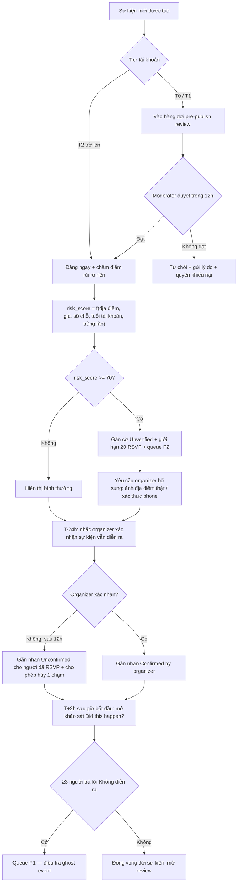
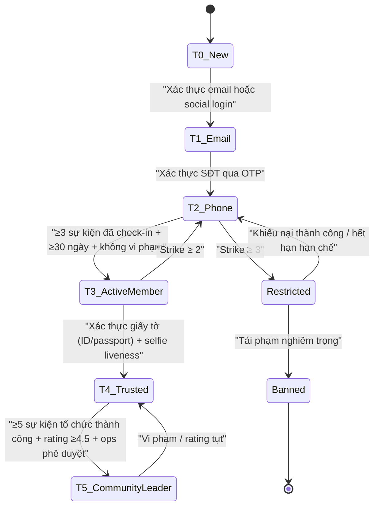
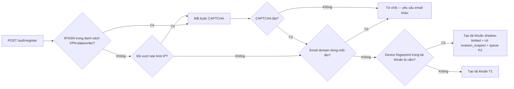

# 05 — Trust & Safety và Kiểm duyệt — Da Nang Connect

> **Trạng thái**: Bản thiết kế v1.0 — dùng cho MVP (Giai đoạn 1: Kết nối cộng đồng)
> **Ngày**: 2026-08-31
> **Phạm vi**: Đà Nẵng, cộng đồng expat. Ngôn ngữ mặc định của UI: English; ngôn ngữ thứ hai: Tiếng Việt.
> **Đối tượng đọc**: Product, Backend (NestJS), Mobile (Expo), Community Ops, Founder.
> **Tài liệu liên quan**: `01-*` (tác nhân & phân quyền), `02-*` (use case), `03-*` (domain & dữ liệu), `04-*` (tech stack & kiến trúc), `06-*` (pháp lý), `10-*` (UX & i18n).

---

## Mục lục

1. [Tóm tắt điều hành](#1-tóm-tắt-điều-hành)
2. [Nguyên tắc thiết kế Trust & Safety](#2-nguyên-tắc-thiết-kế-trust--safety)
3. [Bản đồ rủi ro](#3-bản-đồ-rủi-ro-risk-taxonomy)
4. [Phòng ngừa theo tầng — Progressive Verification](#4-phòng-ngừa-theo-tầng--progressive-verification)
5. [Trust Score và quyền hạn](#5-trust-score-và-quyền-hạn)
6. [Rate limit, giới hạn tạo sự kiện và phát hiện trùng lặp](#6-rate-limit-giới-hạn-tạo-sự-kiện-và-phát-hiện-trùng-lặp)
7. [Quy trình báo cáo vi phạm và hàng đợi kiểm duyệt](#7-quy-trình-báo-cáo-vi-phạm-và-hàng-đợi-kiểm-duyệt)
8. [Thang hành động cưỡng chế và quyền khiếu nại](#8-thang-hành-động-cưỡng-chế-và-quyền-khiếu-nại)
9. [Đánh giá hai chiều sau sự kiện và chống trả đũa](#9-đánh-giá-hai-chiều-sau-sự-kiện-và-chống-trả-đũa)
10. [Tính năng an toàn khi gặp mặt ngoài đời](#10-tính-năng-an-toàn-khi-gặp-mặt-ngoài-đời)
11. [Nội dung curate thủ công — chuẩn đạo đức và pháp lý](#11-nội-dung-curate-thủ-công--chuẩn-đạo-đức-và-pháp-lý)
12. [Checklist an toàn cộng đồng khi tổ chức sự kiện tại Đà Nẵng](#12-checklist-an-toàn-cộng-đồng-khi-tổ-chức-sự-kiện-tại-đà-nẵng)
13. [Kiến trúc kỹ thuật và data model](#13-kiến-trúc-kỹ-thuật-và-data-model)
14. [Chỉ số vận hành và ngưỡng cảnh báo](#14-chỉ-số-vận-hành-và-ngưỡng-cảnh-báo)
15. [Lộ trình triển khai](#15-lộ-trình-triển-khai)
16. [Phụ lục](#16-phụ-lục)

---

## 1. Tóm tắt điều hành

Da Nang Connect không phải là một mạng xã hội đọc-viết thuần túy. Sản phẩm này **đẩy người lạ ra gặp nhau ngoài đời thực**, ở một thành phố cụ thể, trong đó phần lớn người dùng là người nước ngoài không thạo tiếng Việt, không quen hệ thống pháp luật và hành chính địa phương, và thường ở trạng thái tạm trú ngắn hạn. Đây là điểm khác biệt cốt lõi so với Meetup hay Facebook Groups: **một lỗi kiểm duyệt ở đây không dừng ở một bài đăng xấu, nó có thể trở thành một sự cố an toàn thân thể**.

Hệ quả thiết kế:

| Quyết định | Lý do |
|---|---|
| An toàn là tính năng MVP, không phải backlog | Sự cố đầu tiên xảy ra khi cộng đồng còn 200 người sẽ giết luôn niềm tin — cộng đồng expat Đà Nẵng nhỏ và truyền miệng cực nhanh |
| Xác thực theo tầng, không phải xác thực cứng ngay từ đầu | Bắt KYC ở bước đăng ký sẽ giết conversion. Nhưng bắt KYC khi tạo sự kiện 50 người thì hợp lý |
| Số điện thoại KHÔNG BAO GIỜ hiển thị công khai | Đây là vector số một cho quấy rối và spam dịch vụ trong các nhóm expat hiện tại |
| Kiểm duyệt = con người + máy, máy chỉ xếp hàng và chặn thô | Ở quy mô MVP, khối lượng nhỏ; sai sót của mô hình tự động đắt hơn chi phí một moderator |
| Nội dung nhạy cảm chính trị/tôn giáo bị chặn ở tầng chính sách, không phải tầng thảo luận | Bối cảnh pháp lý Việt Nam khiến đây là rủi ro tồn vong của sản phẩm, không phải rủi ro danh tiếng |
| Nội dung curate thủ công phải ghi nguồn và có nút gỡ | Đây là điểm yếu pháp lý và đạo đức lớn nhất của chiến lược ra mắt |

**Ba cam kết công khai với người dùng** (đưa vào onboarding và trang Safety):

1. Chúng tôi không bao giờ hiển thị số điện thoại hay email của bạn cho người dùng khác.
2. Mọi báo cáo về nguy hiểm thân thể (mức **Critical**) được một con người xem trong vòng **2 giờ**, 24/7.
3. Mọi quyết định hạn chế tài khoản đều có lý do cụ thể và có quyền khiếu nại.

---

## 2. Nguyên tắc thiết kế Trust & Safety

| # | Nguyên tắc | Diễn giải vận hành |
|---|---|---|
| P1 | **Ma sát tỷ lệ thuận với rủi ro** | Tham gia một buổi chạy bộ công khai 8 người: gần như không ma sát. Tạo sự kiện thu phí 100 người: yêu cầu xác thực giấy tờ |
| P2 | **Mặc định riêng tư** | Mọi trường dữ liệu cá nhân mặc định ẩn; người dùng chủ động mở, không phải chủ động đóng |
| P3 | **Mọi hành động cưỡng chế đều để lại dấu vết** | Không có "xóa im lặng". Mọi action ghi vào `moderation_audit_log` bất biến, kèm actor, lý do, bằng chứng |
| P4 | **Người ra quyết định ≠ người xử lý khiếu nại** | Bắt buộc từ ngày đầu, kể cả khi đội chỉ có 2 người |
| P5 | **Không punish sự im lặng** | Người dùng ít hoạt động không bị hạ trust. Chỉ hành vi tiêu cực mới trừ điểm |
| P6 | **Chống trả đũa được thiết kế trước, không vá sau** | Review hai chiều dùng cơ chế double-blind ngay từ v1 |
| P7 | **Người báo cáo được bảo vệ tuyệt đối** | Danh tính người báo cáo không bao giờ lộ cho người bị báo cáo, kể cả trong nội dung thông báo cưỡng chế |
| P8 | **Không giả vờ là người khác** | Nội dung curate thủ công luôn dán nhãn rõ ràng, không bao giờ đăng dưới danh nghĩa organizer gốc |
| P9 | **Fail closed cho rủi ro thân thể, fail open cho rủi ro nội dung** | Nghi ngờ có nguy hiểm → ẩn trước, xem xét sau. Nghi ngờ spam → xếp hàng, không ẩn ngay |
| P10 | **Ngôn ngữ trung lập** | Toàn bộ thông báo cưỡng chế viết bằng English (mặc định) + Tiếng Việt, giọng điệu mô tả hành vi, không phán xét con người |

---

## 3. Bản đồ rủi ro (Risk Taxonomy)

### 3.1 Ma trận tổng hợp

Thang điểm: Khả năng xảy ra (L) và Mức nghiêm trọng (S) từ 1–5. Ưu tiên = L × S.

| Mã | Loại rủi ro | L | S | Ưu tiên | Nhóm |
|---|---|---|---|---|---|
| R-07 | An toàn thân thể khi gặp mặt | 2 | 5 | 10 | Physical |
| R-08 | Nội dung nhạy cảm chính trị / tôn giáo | 3 | 5 | 15 | Legal |
| R-01 | Lừa đảo tài chính | 4 | 4 | 16 | Fraud |
| R-02 | Spam quảng cáo dịch vụ | 5 | 2 | 10 | Content |
| R-03 | Quấy rối | 4 | 4 | 16 | Conduct |
| R-04 | Sự kiện ma / không có thật | 4 | 3 | 12 | Fraud |
| R-05 | No-show hàng loạt | 5 | 2 | 10 | Quality |
| R-06 | Người dùng giả mạo / mạo danh | 3 | 4 | 12 | Identity |
| R-09 | Nội dung khiêu dâm, mại dâm trá hình | 3 | 4 | 12 | Content |
| R-10 | Trẻ vị thành niên trong môi trường người lớn | 2 | 5 | 10 | Physical |
| R-11 | Doxxing / rò rỉ dữ liệu cá nhân | 2 | 4 | 8 | Privacy |
| R-12 | Rủi ro pháp lý từ nội dung curate | 3 | 3 | 9 | Legal |
| R-13 | Ma túy / chất cấm gắn với sự kiện | 2 | 5 | 10 | Legal |
| R-14 | Tai nạn thể thao / hoạt động ngoài trời | 3 | 4 | 12 | Physical |

### 3.2 Chi tiết từng loại rủi ro

#### R-01 — Lừa đảo tài chính

**Các biến thể quan sát được trong cộng đồng expat:**

| Biến thể | Mô tả | Tín hiệu phát hiện |
|---|---|---|
| Deposit scam | Yêu cầu chuyển khoản giữ chỗ cho sự kiện rồi biến mất | Sự kiện thu phí do tài khoản < 30 ngày tuổi tạo; có QR chuyển khoản trong ảnh cover |
| Fake ticket resale | Bán lại vé sự kiện lớn không có thật | Từ khóa "ticket", "resell", "spare ticket" + link ngoài |
| Crypto / investment pitch | Sự kiện "networking" thực chất là buổi mời đầu tư | Từ khóa cụm: "passive income", "financial freedom", "trading signal", "web3 networking" |
| Romance / long-con | Xây quan hệ qua chat rồi mượn tiền | Nhiều tin nhắn 1-1 tới người mới, tài khoản một ảnh, tự động lặp câu chào |
| Fake landlord / môi giới | Xuất hiện sớm dù Nhà ở là Giai đoạn 2 — người dùng vẫn tự đăng | Bài đăng lệch danh mục, có giá thuê + yêu cầu cọc trước khi xem |
| Việc làm ma | "Tuyển giáo viên tiếng Anh, phí hồ sơ 2 triệu" | Có nhắc "phí", "deposit", "processing fee" |

**Biện pháp:**

- **Phòng ngừa**: MVP **không xử lý thanh toán trong app**. Trường `price` chỉ là thông tin hiển thị; app hiển thị banner cảnh báo cố định trên mọi sự kiện có phí: *"Da Nang Connect does not process payments. Never transfer money before you have met the organizer in person."*
- **Phát hiện**: regex + danh sách từ khóa (`fraud_keyword_list`, cập nhật hàng tuần) chạy trên `title`, `description`, OCR ảnh cover. Phát hiện QR code trong ảnh → gắn cờ `contains_payment_qr` → auto-queue P1.
- **Khắc phục**: gỡ sự kiện, khóa vĩnh viễn, thông báo cho toàn bộ người đã RSVP, ghi vào `fraud_signal_registry` (hash email/phone/device) để chặn tái đăng ký.

#### R-02 — Spam quảng cáo dịch vụ

Dữ liệu nền cho thấy tỷ lệ cầu/cung là 11:1 — nghĩa là **khi có một kênh tập trung, phía cung sẽ đổ vào rất nhanh và rất mạnh**. Đây sẽ là loại vi phạm có khối lượng lớn nhất, không phải loại nguy hiểm nhất.

| Biến thể | Ví dụ |
|---|---|
| Sự kiện trá hình quảng cáo | "Free yoga class" nhưng thực chất là buổi chào bán gói tập 6 tháng |
| Spam trong chat sự kiện | Đăng dịch vụ visa / thuê xe máy vào chat của mọi sự kiện |
| Profile-as-billboard | Bio chứa số Zalo/WhatsApp và bảng giá dịch vụ |
| Cross-post hàng loạt | Cùng một nội dung đăng ở 10 khu vực khác nhau để phủ filter |

**Biện pháp:**

- Tạo danh mục hợp pháp riêng cho phía cung ở phiên bản sau (`listing_type = 'service'`), để spam có nơi đi đúng chỗ thay vì bị đẩy vào sự kiện. Ở MVP: chặn.
- Giới hạn liên hệ ngoài: trường `external_contact` chỉ mở cho tier ≥ T2; link ngoài trong description bị rút gọn và gắn interstitial cảnh báo.
- Phát hiện cross-post: xem mục [6.4](#64-phát-hiện-trùng-lặp-duplicate-detection).

#### R-03 — Quấy rối

| Biến thể | Kênh | Mức độ |
|---|---|---|
| Tin nhắn không mong muốn lặp lại | DM / chat sự kiện | P2 |
| Nội dung tình dục không mong muốn | DM | P1 |
| Đeo bám sau sự kiện (offline stalking) | Ngoài app | P0 |
| Ngôn từ thù ghét theo quốc tịch, chủng tộc, tôn giáo, giới tính, xu hướng tính dục | Công khai | P1 |
| Brigading — nhiều tài khoản cùng công kích một người | Review + report | P1 |
| Đe dọa tống tiền bằng ảnh riêng tư | DM | P0 |

**Biện pháp:**

- **Chặn (block) là hành động một chiều và tuyệt đối**: người bị chặn không nhìn thấy profile, không thấy sự kiện do người chặn tạo, không RSVP được vào sự kiện đó, và không nhận được bất kỳ thông báo nào cho biết mình đã bị chặn.
- **Message request**: người chưa từng tham gia chung sự kiện chỉ gửi được 1 tin nhắn đầu tiên; tin thứ hai bị chặn cho tới khi người nhận trả lời.
- **Rate limit DM cho tài khoản mới**: xem [6.1](#61-bảng-rate-limit-theo-tier).
- **Quick-report trong chat**: mỗi bong bóng tin nhắn có menu long-press → Report, kèm tự động đính kèm 20 tin nhắn gần nhất làm bằng chứng (`evidence_snapshot`), không cần người dùng chụp màn hình.

#### R-04 — Sự kiện ma / không có thật

Đây là rủi ro đặc thù của một app RSVP hyperlocal. Ba dạng:

1. **Sự kiện không tồn tại**: tạo để thu thập RSVP rồi bán data, hoặc để dụ người ra một địa điểm.
2. **Sự kiện bị hủy nhưng không cập nhật**: người tham gia đến nơi không có ai — lỗi vận hành hơn là ác ý.
3. **Sự kiện sao chép**: copy nguyên nội dung của organizer thật, đổi địa điểm hoặc đổi kênh liên hệ.

**Biện pháp:**



Cơ chế **"Did this happen?"** là xương sống chống sự kiện ma: rẻ, không cần AI, và tạo tín hiệu chất lượng cao vì chỉ người đã RSVP mới được hỏi.

#### R-05 — No-show hàng loạt

Không phải vi phạm đạo đức, nhưng là **sát thủ retention** với organizer nhỏ lẻ — nhóm mà sản phẩm phụ thuộc vào. Ở nhóm expat, đặc thù còn nặng hơn vì nhiều người ở ngắn hạn, tâm lý RSVP thoải mái.

| Cơ chế | Mô tả |
|---|---|
| Reliability score hiển thị công khai | Tỷ lệ tham gia trên tổng RSVP, chỉ hiện khi có ≥ 5 RSVP đã kết thúc. Hiển thị dạng nhãn: `Reliable` (≥ 85%), `Usually shows up` (65–84%), `Mixed` (40–64%), ẩn hoàn toàn nếu < 5 mẫu |
| Cửa sổ hủy không phạt | Hủy trước T-4h: không tính no-show. Sau đó tính, trừ khi organizer bấm "Excuse" |
| Waitlist tự động | Khi có người hủy, slot chuyển ngay cho người đầu waitlist + push notification |
| Nhắc nhở 2 lớp | Push T-24h và T-2h, kèm nút "I can't make it" một chạm |
| Trần RSVP đồng thời | T1: tối đa 3 sự kiện sắp tới. T2: 8. T3+: không giới hạn |
| Không phạt tiền, không phạt cứng | MVP không cấm người no-show; chỉ hiển thị minh bạch và cho organizer quyền tự lọc (`min_reliability` cho sự kiện của mình) |

#### R-06 — Người dùng giả mạo / mạo danh

| Biến thể | Xử lý |
|---|---|
| Ảnh đại diện lấy từ mạng | Reverse-image check ở v1.1; MVP dựa vào report + yêu cầu selfie-liveness khi bị báo cáo |
| Mạo danh organizer/doanh nghiệp có thật | P1, gỡ ngay, không cần chờ khiếu nại từ bên bị mạo danh |
| Mạo danh nhân viên Da Nang Connect | P0. Nhân viên chính thức có huy hiệu `Staff` do hệ thống cấp, không thể tự đặt trong display name |
| Đa tài khoản (sockpuppet) để né lệnh cấm | Device fingerprint + hash số điện thoại + hash email chuẩn hóa (bỏ dấu chấm Gmail, bỏ phần `+tag`) |
| Tài khoản "bot farm" tạo hàng loạt | Chặn ở tầng đăng ký: rate limit theo IP/ASN, chặn email dùng một lần, CAPTCHA thích ứng |

**Tên hiển thị (display name) — quy tắc bắt buộc:**

- Không chứa số điện thoại, URL, handle mạng xã hội, emoji quảng cáo.
- Không chứa từ khóa vai trò hệ thống: `admin`, `staff`, `moderator`, `support`, `official`, `Da Nang Connect`.
- Đổi display name > 2 lần / 90 ngày → gắn cờ và hiển thị nhãn `Recently renamed` cho tài khoản dưới T3.

#### R-07 — An toàn thân thể khi gặp mặt

Đây là rủi ro có mức nghiêm trọng cao nhất. Xem toàn bộ mục [10](#10-tính-năng-an-toàn-khi-gặp-mặt-ngoài-đời).

Các kịch bản cần chuẩn bị sẵn kịch bản phản ứng (runbook):

| Kịch bản | Phản ứng của đội |
|---|---|
| Người dùng bấm nút SOS trong sự kiện | Cảnh báo tức thì tới on-call, mở case P0, giữ nguyên toàn bộ dữ liệu vị trí và chat |
| Báo cáo tấn công tình dục sau sự kiện | Đình chỉ ngay tài khoản bị tố (không chờ điều tra), cung cấp danh bạ hỗ trợ, không tự điều tra như cơ quan chức năng, không khuyên nạn nhân nên hay không nên báo công an |
| Sự kiện được tổ chức tại nhà riêng của organizer | Gắn nhãn `Private residence` bắt buộc, yêu cầu organizer ở tier ≥ T3, hiện cảnh báo cho người RSVP |
| Người dùng mất tích / không liên lạc được sau sự kiện | Runbook lưu trữ dữ liệu, phối hợp theo yêu cầu hợp pháp từ cơ quan chức năng |

#### R-08 — Nội dung nhạy cảm chính trị / tôn giáo

**Đây là rủi ro tồn vong, không phải rủi ro danh tiếng.** Một app do đội ngũ vận hành tại Việt Nam, phục vụ người nước ngoài, tổ chức các buổi tụ họp ngoài đời, là bối cảnh mà cơ quan quản lý sẽ nhìn kỹ.

Khung pháp lý cần bám (danh sách để đội tham vấn luật sư xác nhận trước khi phát hành, **không được coi đây là tư vấn pháp lý**):

| Văn bản | Điểm liên quan trực tiếp |
|---|---|
| Luật An ninh mạng 2018 | Nghĩa vụ gỡ bỏ nội dung vi phạm theo yêu cầu; lưu trữ dữ liệu |
| Nghị định 53/2022/NĐ-CP | Hướng dẫn Luật An ninh mạng — lưu trữ dữ liệu, đặt chi nhánh |
| Nghị định 147/2024/NĐ-CP | Quản lý thông tin trên mạng; **yêu cầu xác thực tài khoản bằng số điện thoại**; thời hạn gỡ nội dung vi phạm |
| **Luật Bảo vệ dữ liệu cá nhân 91/2025/QH15** (hiệu lực 01/01/2026 — văn bản có hiệu lực cao hơn) **và Nghị định 13/2023/NĐ-CP** cùng nghị định hướng dẫn | ⚖️ **CẦN LUẬT SƯ XÁC NHẬN.** Từ 01/01/2026 mọi biểu mẫu đồng ý, thông báo xử lý dữ liệu và quy trình đáp ứng quyền chủ thể dữ liệu phải theo Luật 91/2025 và nghị định hướng dẫn; Nghị định 13/2023 chỉ còn áp dụng phần không trái. Cơ sở pháp lý xử lý dữ liệu, quyền của chủ thể dữ liệu, dữ liệu nhạy cảm (vị trí, sinh trắc học) |
| Nghị định 38/2005/NĐ-CP | Bảo đảm trật tự công cộng — tập trung đông người nơi công cộng |
| Pháp luật về nhập cảnh, xuất cảnh, cư trú của người nước ngoài | Khai báo tạm trú; hoạt động đúng mục đích nhập cảnh |

> ⚠️ **Vấn đề mở nghiêm trọng**: Nghị định 147/2024/NĐ-CP đặt ra yêu cầu xác thực tài khoản bằng số điện thoại. Phần lớn expat mới đến Đà Nẵng dùng số nước ngoài hoặc eSIM du lịch. Đội cần luật sư làm rõ: (a) nghĩa vụ này áp dụng cho loại hình dịch vụ nào, (b) số điện thoại nước ngoài có được chấp nhận không, (c) phương án dự phòng nếu bắt buộc số Việt Nam. Đây là câu hỏi có thể thay đổi cả luồng đăng ký — cần trả lời **trước khi** code auth.

**Chính sách nội dung — ba lớp:**

| Lớp | Nội dung | Xử lý |
|---|---|---|
| **Cấm tuyệt đối** | Kêu gọi tụ tập chính trị, biểu tình, vận động chính trị; nội dung chống Nhà nước; xuyên tạc lịch sử, chủ quyền lãnh thổ; bản đồ sai chủ quyền (đặc biệt trong ảnh cover và bản đồ nhúng); hoạt động tôn giáo trái phép, truyền đạo tại nơi công cộng không đăng ký | Chặn tự động khi phát hiện, gỡ ngay, P0, thông báo cho founder |
| **Cần duyệt trước** | Sự kiện tôn giáo hợp pháp (thánh lễ tại nhà thờ đã đăng ký, sinh hoạt tại chùa), sự kiện gắn quốc khánh/ngày lễ của quốc gia khác, sự kiện có diễn giả nước ngoài phát biểu công khai | Bắt buộc pre-publish review, organizer ≥ T3 |
| **Cho phép** | Sự kiện văn hóa, ẩm thực, thể thao, ngôn ngữ, nghề nghiệp, thiện nguyện đã có đơn vị bảo trợ | Bình thường |

**Kỹ thuật**: `sensitive_topic_classifier` chạy trước khi publish với 2 danh sách từ khóa (EN + VI) + kiểm tra ảnh bản đồ. Ngưỡng đặt **thiên về false-positive** — thà đưa một sự kiện vô hại vào hàng đợi duyệt còn hơn để lọt một sự kiện nhạy cảm.

**Điều khoản người dùng** phải có một mục riêng, viết bằng English rõ ràng, giải thích rằng nền tảng hoạt động theo pháp luật Việt Nam và không phải là nơi tổ chức hoạt động chính trị — nói thẳng, không né tránh, để người dùng expat hiểu ngay thay vì cảm thấy bị kiểm duyệt tùy tiện.

#### R-09 — Nội dung khiêu dâm, mại dâm trá hình

| Biến thể | Tín hiệu |
|---|---|
| "Massage", "companion", "date night for money" trá hình sự kiện | Danh sách từ khóa EN/VI + ảnh |
| Ảnh đại diện khiêu dâm | Kiểm duyệt ảnh khi upload (NSFW classifier) |
| Dùng DM để chào mời | Report từ người nhận + phát hiện mẫu tin nhắn lặp |

Xử lý: gỡ + khóa vĩnh viễn ngay lần đầu (không áp dụng thang strike). Đây là vi phạm zero-tolerance vì hệ quả pháp lý tại Việt Nam.

#### R-10 — Trẻ vị thành niên

- Độ tuổi tối thiểu: **16**, có ghi rõ trong ToS; **18+** bắt buộc cho sự kiện gắn nhãn `alcohol`, `nightlife`, `18+`.
- Khai sinh nhật ở bước đăng ký; sửa ngày sinh sau đó cần thao tác qua support (chống lách tuổi).
- Sự kiện `family-friendly` cho phép trẻ em đi kèm người giám hộ; người giám hộ chịu trách nhiệm, ghi rõ trong mô tả.
- Bất kỳ nghi ngờ nào về nội dung xâm hại trẻ em → P0, khóa ngay, bảo toàn bằng chứng, báo cáo cơ quan chức năng theo quy trình pháp lý. Không thương lượng, không khiếu nại.

#### R-11 — Doxxing / rò rỉ dữ liệu cá nhân

- Cấm đăng thông tin cá nhân của người khác: địa chỉ nhà, số điện thoại, nơi làm việc, ảnh chụp lén, ảnh hộ chiếu/visa.
- **Không hiển thị vị trí chính xác của người dùng.** Bản đồ cá nhân hóa chỉ hiển thị khoảng cách theo bậc: `< 1 km`, `1–3 km`, `3–7 km`, `> 7 km`.
- Ảnh upload bị **xóa EXIF** (bao gồm GPS) ở tầng backend trước khi lưu S3-compatible storage. Bắt buộc, không có tùy chọn tắt.
- Danh sách người tham gia sự kiện chỉ hiển thị cho người đã RSVP; người dùng có thể chọn `Attend privately` (hiện là "1 người tham gia ẩn danh").

#### R-12 — Rủi ro pháp lý từ nội dung curate

Xem mục [11](#11-nội-dung-curate-thủ-công--chuẩn-đạo-đức-và-pháp-lý).

#### R-13 — Ma túy và chất cấm

Zero-tolerance. Từ khóa lóng (EN + VI) trong `banned_substance_lexicon`, cập nhật hàng tháng. Gỡ + khóa vĩnh viễn + bảo toàn bằng chứng. Không cho khiếu nại tự phục hồi; chỉ founder review.

#### R-14 — Tai nạn thể thao và hoạt động ngoài trời

Đặc thù Đà Nẵng: tắm biển, lặn, đi xe máy đèo Hải Vân / bán đảo Sơn Trà, leo núi, chạy bộ giữa trưa nắng.

| Loại sự kiện | Yêu cầu bắt buộc trong form tạo sự kiện |
|---|---|
| `water` (biển, hồ, lặn) | Checkbox xác nhận: có khu vực cứu hộ; ghi rõ yêu cầu biết bơi; hiển thị cảnh báo dòng rip current |
| `motorbike` (đi phượt nhóm) | Nhắc yêu cầu giấy phép lái xe hợp lệ tại Việt Nam + bảo hiểm; hiển thị disclaimer |
| `hiking` / `trail` | Yêu cầu mô tả độ khó, thời lượng, điểm quay đầu, nước uống |
| `contact_sport` | Ghi rõ mức độ va chạm; khuyến nghị bảo hiểm |

App hiển thị **disclaimer trách nhiệm** cho các danh mục này: nền tảng chỉ kết nối, không tổ chức, không bảo hiểm cho hoạt động.

---
## 4. Phòng ngừa theo tầng — Progressive Verification

### 4.1 Sáu tầng tin cậy



### 4.2 Điều kiện lên tầng và bằng chứng lưu trữ

| Tier | Tên | Điều kiện đạt | Dữ liệu lưu | Thời hạn lưu |
|---|---|---|---|---|
| **T0** | New | Chưa đăng nhập, hoặc vừa tạo tài khoản chưa xác thực gì | Không | — |
| **T1** | Email verified | Xác thực email hoặc social login (Google / Apple / Facebook). Apple Sign-In bắt buộc trên iOS nếu có social login | `email_hash`, provider, `sub` | Vòng đời tài khoản |
| **T2** | Phone verified | OTP SMS thành công | `phone_hash` (HMAC-SHA256 + pepper), `country_code`, `carrier_type` | Vòng đời tài khoản |
| **T3** | Active member | ≥ 3 sự kiện đã check-in, tài khoản ≥ 30 ngày, 0 strike đang hiệu lực, ≥ 1 review nhận được ≥ 4★ | Tính toán từ dữ liệu có sẵn | — |
| **T4** | Trusted | Passport / CCCD / thẻ tạm trú qua nhà cung cấp KYC + liveness selfie | **Chỉ lưu**: `document_type`, `document_country`, `verification_ref`, `verified_at`, `name_match_score`. **Không lưu ảnh giấy tờ trên hệ thống của mình** | `verification_ref` 24 tháng |
| **T5** | Community leader | ≥ 5 sự kiện đã diễn ra với ≥ 5 người tham gia thực tế, rating trung bình ≥ 4.5, 0 case P0/P1, được Community Ops phê duyệt thủ công | Ghi chú phê duyệt + người phê duyệt | Vòng đời |

> **Nguyên tắc dữ liệu KYC**: Da Nang Connect **không tự lưu trữ ảnh giấy tờ tùy thân**. Toàn bộ khâu này ủy quyền cho nhà cung cấp KYC bên thứ ba; hệ thống chỉ giữ kết quả (pass/fail) và mã tham chiếu. Điều này giảm mạnh bề mặt rủi ro theo pháp luật bảo vệ dữ liệu cá nhân.

### 4.3 Ma trận quyền hạn theo tầng

| Hành động | T0 | T1 | T2 | T3 | T4 | T5 |
|---|:--:|:--:|:--:|:--:|:--:|:--:|
| Xem danh sách sự kiện công khai | ✅ | ✅ | ✅ | ✅ | ✅ | ✅ |
| Xem địa chỉ chính xác của sự kiện | ❌ | ❌ | ✅ | ✅ | ✅ | ✅ |
| Xem danh sách người tham gia | ❌ | ❌ | ✅ | ✅ | ✅ | ✅ |
| RSVP | ❌ | ✅¹ | ✅ | ✅ | ✅ | ✅ |
| Nhắn tin 1-1 | ❌ | ❌ | ✅² | ✅ | ✅ | ✅ |
| Chat trong sự kiện đã RSVP | ❌ | ✅ | ✅ | ✅ | ✅ | ✅ |
| Tạo sự kiện miễn phí ≤ 15 chỗ | ❌ | ✅³ | ✅ | ✅ | ✅ | ✅ |
| Tạo sự kiện ≤ 50 chỗ | ❌ | ❌ | ✅³ | ✅ | ✅ | ✅ |
| Tạo sự kiện > 50 chỗ | ❌ | ❌ | ❌ | ✅³ | ✅ | ✅ |
| Tạo sự kiện có thu phí | ❌ | ❌ | ❌ | ❌ | ✅ | ✅ |
| Tạo sự kiện tại nhà riêng | ❌ | ❌ | ❌ | ✅ | ✅ | ✅ |
| Tạo sự kiện gắn nhãn 18+ / nightlife | ❌ | ❌ | ❌ | ✅ | ✅ | ✅ |
| Tạo sự kiện tôn giáo hợp pháp | ❌ | ❌ | ❌ | ❌ | ✅³ | ✅³ |
| Tạo sự kiện lặp lại (recurring) | ❌ | ❌ | ❌ | ✅ | ✅ | ✅ |
| Hiển thị link ngoài trong mô tả | ❌ | ❌ | ✅⁴ | ✅⁴ | ✅ | ✅ |
| Nhận huy hiệu hiển thị trên profile | — | — | — | `Active member` | `Trusted` | `Community leader` |
| Được đề xuất ưu tiên trong feed | ❌ | ❌ | ❌ | ↑ | ↑↑ | ↑↑↑ |

¹ Tối đa 3 sự kiện sắp tới cùng lúc.
² Chỉ với người đã tham gia chung ít nhất 1 sự kiện, hoặc 1 message request.
³ Bắt buộc qua **pre-publish review** của moderator.
⁴ Link bị bọc interstitial cảnh báo; domain nằm ngoài allowlist bị ẩn.

### 4.4 Khi nào yêu cầu giấy tờ (T4) — quy tắc kích hoạt

Việc yêu cầu giấy tờ là ma sát rất lớn với expat. Chỉ kích hoạt khi có **ít nhất một** điều kiện sau:

| # | Điều kiện kích hoạt | Lý do |
|---|---|---|
| 1 | Tạo sự kiện có thu phí (bất kể mức phí) | Rủi ro lừa đảo tài chính |
| 2 | Tạo sự kiện > 50 chỗ | Rủi ro trật tự công cộng và an toàn đám đông |
| 3 | Tài khoản có ≥ 2 case đã xác nhận vi phạm và muốn khôi phục | Chống né lệnh cấm |
| 4 | Bị báo cáo mạo danh và muốn giữ tài khoản | Xác minh danh tính thật |
| 5 | Đăng ký sự kiện tôn giáo hợp pháp hoặc có diễn giả công khai | Trách nhiệm pháp lý |
| 6 | Tự nguyện — để lấy huy hiệu `ID verified` và ưu tiên hiển thị | Khuyến khích tích cực |
| 7 | Xin lên T5 Trusted organizer | Điều kiện tiên quyết |

**Không bao giờ yêu cầu giấy tờ chỉ để RSVP một sự kiện thường.**

### 4.5 Xác thực bổ trợ không dùng giấy tờ

Cho phép người dùng tăng độ tin cậy mà không cần KYC:

| Phương thức | Điểm trust cộng | Cách hoạt động |
|---|---|---|
| Liên kết social (Google/Apple/Facebook) có tuổi tài khoản ≥ 1 năm | +5 | Đọc `created_at` từ provider nếu khả dụng, nếu không thì chỉ +2 |
| Vouch từ người ở tier ≥ T4 | +8 mỗi vouch, tối đa 2 | Người vouch chịu liên đới: nếu người được vouch bị strike nghiêm trọng, người vouch bị trừ 5 điểm |
| Xác thực email công ty / trường học (domain không phải free mail) | +5 | Chỉ nhận domain đã trong `org_domain_allowlist` |
| Hoàn thành `Community Safety Quiz` (5 câu, 2 phút) | +3 | Nội dung: cách nhận diện lừa đảo, cách dùng nút báo cáo, quy tắc cộng đồng |
| Check-in thực tế tại sự kiện có QR của organizer T4/T5 | +2 mỗi lần, tối đa 10 | Bằng chứng offline mạnh nhất mà không cần giấy tờ |

---

## 5. Trust Score và quyền hạn

> **CHUẨN BẮT BUỘC — đọc trước khi code.** Thang tin cậy **duy nhất** của sản phẩm là **T0–T5**, lưu ở cột `users.trust_level` kiểu `smallint` (0–5). Không tồn tại enum `new/verified/established/trusted/ambassador` và không tồn tại thang tin cậy 0–100 nào khác song song với nó.
> Con số `trust_score` mô tả ở mục này là **biến trung gian nội bộ**: tổng có trọng số của các bản ghi trong bảng `trust_signals` (append-only, xem tài liệu 03 §4.5), do job BullMQ `trust:recompute` tính lại và **chỉ dùng để suy ra `users.trust_level`**. Nó **không bao giờ** được trả về API công khai, không hiển thị cho người dùng, không dùng làm nhãn.
> Ánh xạ chuẩn `trust_score` → `users.trust_level` (kèm điều kiện cứng, phải thỏa **cả hai**):
>
> | `trust_level` | Nhãn hiển thị (EN) | `trust_score` | Điều kiện cứng bắt buộc kèm theo |
> |:--:|---|---|---|
> | 0 | `New` | bất kỳ | Chưa xác thực email |
> | 1 | `Email verified` | ≥ 5 | Email đã xác thực |
> | 2 | `Phone verified` | ≥ 15 | OTP SMS thành công |
> | 3 | `Active member` | ≥ 40 | ≥ 3 lần `checked_in`, tài khoản ≥ 30 ngày, 0 strike hiệu lực |
> | 4 | `Trusted` | ≥ 65 | KYC giấy tờ `passed` |
> | 5 | `Community leader` | ≥ 85 | Community Ops phê duyệt thủ công |
>
> Nếu `trust_score` tụt hoặc điều kiện cứng mất hiệu lực, `trust_level` hạ ngay ở lần recompute kế tiếp. Việc hạ tầng luôn ghi một dòng `moderation_audit_log` với `action = 'trust_level_downgraded'`.

### 5.1 Công thức

`trust_score` (**biến nội bộ**, không phơi ra API công khai) là số nguyên 0–100, tính lại bằng BullMQ job `trust:recompute` mỗi khi có sự kiện thay đổi (event-driven) và một lần mỗi đêm (reconcile).

```
trust_score = clamp(0, 100,
    base_tier_points
  + identity_points
  + participation_points
  + reputation_points
  + tenure_points
  - penalty_points
)
```

| Thành phần | Cách tính | Trần |
|---|---|---|
| `base_tier_points` | T1=5, T2=15, T3=25, T4=40, T5=50 | 50 |
| `identity_points` | Tổng điểm ở bảng [4.5](#45-xác-thực-bổ-trợ-không-dùng-giấy-tờ) | 20 |
| `participation_points` | `min(15, 1.5 × số sự kiện đã check-in)` | 15 |
| `reputation_points` | `min(20, 4 × (avg_rating − 3))` nếu có ≥ 3 review, ngược lại 0 | 20 |
| `tenure_points` | `min(10, floor(số tháng tài khoản × 1.5))` | 10 |
| `penalty_points` | Xem [5.2](#52-điểm-phạt-và-suy-giảm) | không trần |

**Lưu ý thiết kế**: không có thành phần nào phạt sự thụ động. Một người mới, chưa từng tham gia sự kiện nào, vẫn có `trust_score` hợp lệ (T2 → 15+ điểm) và vẫn dùng app bình thường.

### 5.2 Điểm phạt và suy giảm

| Sự kiện | Điểm phạt | Thời gian hết hiệu lực |
|---|---|---|
| Report được xác nhận — mức nhẹ (spam, sai danh mục) | 5 | 90 ngày |
| Report được xác nhận — mức trung bình (quấy rối nhẹ, quảng cáo lặp) | 15 | 180 ngày |
| Report được xác nhận — mức nặng (lừa đảo, quấy rối nghiêm trọng, sự kiện ma) | 40 | 365 ngày |
| Vi phạm zero-tolerance | Khóa vĩnh viễn | — |
| Sự kiện bị hủy < 12h trước giờ bắt đầu (organizer) | 5 mỗi lần, tối đa 15 | 60 ngày |
| No-show sau cửa sổ hủy | 2 mỗi lần, tối đa 10 | 60 ngày |
| Report gửi đi bị kết luận là ác ý / trả đũa | 10 | 180 ngày |
| Người mình vouch bị strike nặng | 5 | 180 ngày |

Điểm phạt **hết hạn theo thời gian**, không xóa lịch sử. Bảng `moderation_audit_log` giữ vĩnh viễn để phục vụ điều tra pattern.

### 5.3 Hiển thị cho người dùng

Không bao giờ hiển thị số điểm trần trụi — nó tạo ra hành vi tối ưu điểm và cảm giác bị chấm điểm. Thay vào đó:

| `users.trust_level` | Nhãn hiển thị (EN — mặc định) | Nhãn Tiếng Việt | Màu | Key i18n |
|:--:|---|---|---|---|
| 0 | `New` | Thành viên mới | Xám | `trust.level.0` |
| 1 | `Email verified` | Đã xác thực email | Xanh nhạt | `trust.level.1` |
| 2 | `Phone verified` | Đã xác thực số điện thoại | Xanh | `trust.level.2` |
| 3 | `Active member` | Thành viên tích cực | Xanh đậm | `trust.level.3` |
| 4 | `Trusted` | Đáng tin cậy | Chàm | `trust.level.4` |
| 5 | `Community leader` | Người dẫn dắt cộng đồng | Vàng | `trust.level.5` |
| — | `Limited` | Đang bị hạn chế | Đỏ | `trust.state.limited` — **chỉ chủ tài khoản thấy**, là trạng thái cưỡng chế, không phải một bậc của thang |

Trên profile hiển thị **bằng chứng cụ thể**, không phải điểm số:

```
Maria K.
✅ Phone verified · ✅ ID verified
📅 Joined March 2026 · 12 events attended · 3 events hosted
⭐ 4.8 (9 reviews) · 🟢 Reliable — shows up 92% of the time
```

---

## 6. Rate limit, giới hạn tạo sự kiện và phát hiện trùng lặp

### 6.1 Bảng rate limit theo tier

Triển khai bằng Redis (sliding window counter), middleware NestJS `ThrottlerGuard` tùy biến khóa theo `userId` + `tier` + `action`.

| Hành động | Khóa Redis | T1 | T2 | T3 | T4 | T5 |
|---|---|---|---|---|---|---|
| Tạo sự kiện | `rl:event:create:{uid}` | 1 / 7 ngày | 2 / ngày, 5 / tuần | 3 / ngày, 12 / tuần | 5 / ngày, 20 / tuần | 10 / ngày, 40 / tuần |
| Sự kiện đang mở đồng thời | `evt:open:{uid}` | 1 | 3 | 8 | 15 | 30 |
| RSVP | `rl:rsvp:{uid}` | 5 / ngày | 15 / ngày | 30 / ngày | 50 / ngày | 50 / ngày |
| RSVP đang có hiệu lực | `rsvp:active:{uid}` | 3 | 8 | không giới hạn | không giới hạn | không giới hạn |
| Gửi DM tới người chưa quen | `rl:dm:new:{uid}` | 0 | 3 / ngày | 10 / ngày | 20 / ngày | 30 / ngày |
| Tin nhắn tổng | `rl:msg:{uid}` | 30 / giờ | 100 / giờ | 300 / giờ | 500 / giờ | 500 / giờ |
| Gửi report | `rl:report:{uid}` | 5 / ngày | 10 / ngày | 20 / ngày | 20 / ngày | 20 / ngày |
| Sửa sự kiện sau khi có RSVP | `rl:event:edit:{eid}` | 3 / ngày | 5 / ngày | 10 / ngày | 10 / ngày | 10 / ngày |
| Upload ảnh | `rl:upload:{uid}` | 5 / ngày | 20 / ngày | 50 / ngày | 100 / ngày | 100 / ngày |
| Đổi display name | `rl:rename:{uid}` | 1 / 30 ngày | 2 / 90 ngày | 3 / 90 ngày | 3 / 90 ngày | 3 / 90 ngày |
| Gửi lại OTP | `rl:otp:{phone_hash}` | 3 / giờ, 8 / ngày | — | — | — | — |
| Đăng ký tài khoản theo IP | `rl:signup:ip:{ip}` | 5 / giờ, 15 / ngày (mọi tier) | | | | |
| Đăng nhập sai | `rl:login:fail:{email_hash}` | 5 / 15 phút → khóa 30 phút | | | | |

### 6.2 Giới hạn đặc biệt cho tài khoản mới

| Ngưỡng | Quy tắc |
|---|---|
| Tài khoản < 48 giờ | Không tạo được sự kiện diễn ra trong vòng 24 giờ tới (chặn dụ gấp) |
| Tài khoản < 7 ngày | Sự kiện luôn qua pre-publish review; trần 15 chỗ |
| Tài khoản < 30 ngày | Không tạo được sự kiện lặp lại; không đặt `external_contact` |
| Tài khoản mới + IP trùng với tài khoản đang bị cấm | Chặn đăng ký, trả lỗi chung chung, gắn cờ `evasion_suspect` |
| Tài khoản mới tạo sự kiện tại đúng địa điểm của sự kiện đã bị gỡ trong 30 ngày | Auto-queue P1 |

### 6.3 Chống bot ở tầng đăng ký



`shadow-limited`: tài khoản tạo được nhưng nội dung không hiển thị cho người khác cho tới khi moderator xác nhận. Người dùng không được thông báo — đây là biện pháp duy nhất trong hệ thống không minh bạch với người dùng, chỉ dùng cho `evasion_suspect` có bằng chứng kỹ thuật, và **tối đa 72 giờ** trước khi phải có quyết định của con người.

### 6.4 Phát hiện trùng lặp (Duplicate Detection)

Ba tình huống cần phân biệt rõ — xử lý hoàn toàn khác nhau:

| Tình huống | Ví dụ | Xử lý |
|---|---|---|
| **A. Trùng do curate** | Đội sáng lập đã đăng lại sự kiện từ nguồn công khai, sau đó organizer gốc tự đăng | **Không phải vi phạm.** Đề xuất gộp: "This looks like your event — claim the existing listing?" |
| **B. Spam cross-post** | Cùng một người đăng 1 nội dung ở 8 khu vực khác nhau | Vi phạm. Giữ bản đầu, gỡ các bản còn lại, strike nhẹ |
| **C. Sự kiện sao chép ác ý** | Người lạ copy sự kiện của organizer thật, đổi số liên hệ | Vi phạm nặng. Gỡ, P1, điều tra tài khoản |

**Thuật toán chấm điểm trùng lặp** (`duplicate_score`, 0–1), chạy trong BullMQ worker `event-dedupe` ngay sau khi tạo/sửa sự kiện:

| Tín hiệu | Trọng số | Cách tính |
|---|---|---|
| Trùng thời gian | 0.25 | `start_time` cách nhau ≤ 90 phút → 1.0; ≤ 4 giờ → 0.5; ngoài ra 0 |
| Trùng không gian | 0.25 | Khoảng cách PostGIS `ST_DWithin` ≤ 150 m → 1.0; ≤ 500 m → 0.6; ≤ 2 km → 0.2 |
| Tương đồng tiêu đề | 0.20 | `pg_trgm similarity()` trên tiêu đề đã chuẩn hóa (lowercase, bỏ dấu, bỏ emoji, bỏ stopword) |
| Tương đồng mô tả | 0.15 | Cosine similarity trên embedding mô tả (nếu chưa có model: fallback về `similarity()` của 200 ký tự đầu) |
| Trùng ảnh cover | 0.10 | Hamming distance của perceptual hash ≤ 8 |
| Trùng liên hệ ngoài | 0.05 | Cùng `external_contact` đã chuẩn hóa |

Ngưỡng hành động:

| `duplicate_score` | Hành động |
|---|---|
| ≥ 0.85, cùng `host_user_id` | Chặn khi tạo: "You already have a very similar event" + nút Sửa bản cũ |
| ≥ 0.85, khác `host_user_id`, bản cũ là `curated` | Hiện luồng **Claim listing** cho người tạo mới |
| ≥ 0.85, khác `host_user_id`, bản cũ là user thật | Cho tạo nhưng auto-queue P1 (`suspected_event_clone`), hiện badge cảnh báo nội bộ |
| 0.60 – 0.84 | Hiển thị gợi ý cho người dùng: "3 similar events found nearby — see them?" + queue P3 |
| < 0.60 | Không làm gì |

**Chống cross-post spam**: nếu một `host_user_id` tạo ≥ 3 sự kiện có `duplicate_score` cặp đôi ≥ 0.7 trong 7 ngày → auto-queue P2 `cross_post_spam`, giữ bản đầu tiên, ẩn tạm các bản sau.

Index cần thiết:

```sql
CREATE EXTENSION IF NOT EXISTS pg_trgm;
CREATE EXTENSION IF NOT EXISTS postgis;

CREATE INDEX idx_event_title_trgm ON events USING gin (normalized_title gin_trgm_ops);
CREATE INDEX idx_event_location_gist ON events USING gist (location);
CREATE INDEX idx_event_start_time ON events (start_time) WHERE status = 'published';
CREATE INDEX idx_events_host_created ON events (host_user_id, created_at DESC);
```

---
