# 06 — Pháp lý & Tuân thủ tại Việt Nam

> **Sản phẩm:** Da Nang Connect — nền tảng kết nối cộng đồng người nước ngoài (expat) tại Đà Nẵng.
> **Phạm vi tài liệu:** Nghĩa vụ pháp lý khi vận hành nền tảng có nội dung do người dùng tạo (UGC), có tài khoản, có dữ liệu vị trí, người dùng chủ yếu là người nước ngoài cư trú tại Việt Nam.
> **Ngày lập:** 31/08/2026 · **Phiên bản:** 1.0
> **Trạng thái:** Bản phân tích nội bộ — **KHÔNG phải ý kiến pháp lý**. Mọi mục gắn nhãn 🔴 phải được luật sư Việt Nam xác nhận bằng văn bản trước khi hành động.
> **Phạm vi địa lý:** Chỉ Đà Nẵng (Giai đoạn 1).
> **Tài liệu liên quan:** `01-tac-nhan-va-phan-quyen.md`, `03-domain-va-du-lieu.md`, `04-tech-stack-va-kien-truc.md`, `05-trust-safety-va-kiem-duyet.md`, `08-roadmap-va-ke-hoach-trien-khai.md`.

---

## Quy ước ký hiệu dùng trong toàn bộ tài liệu

| Ký hiệu | Ý nghĩa | Cách dùng |
|---|---|---|
| 🟢 **CHẮC CHẮN** | Có văn bản pháp luật rõ ràng, điều khoản cụ thể, không cần diễn giải | Đưa thẳng vào backlog kỹ thuật/vận hành |
| 🟡 **KHẢ NĂNG CAO** | Có căn cứ pháp lý nhưng cách áp dụng cho mô hình cụ thể còn phụ thuộc diễn giải | Lên kế hoạch thực hiện, hỏi luật sư để chốt chi tiết |
| 🔴 **CẦN LUẬT SƯ** | Chưa có tiền lệ rõ, rủi ro cao nếu hiểu sai, hoặc văn bản hướng dẫn chưa đầy đủ | **KHÔNG** ra quyết định kinh doanh trước khi có ý kiến pháp lý bằng văn bản |
| ⚙️ | Có hệ quả trực tiếp lên kiến trúc kỹ thuật (NestJS · PostgreSQL+PostGIS · Redis · Next.js · Expo) | Ghi thành ADR hoặc ticket trong backlog |
| 📄 | Sinh ra một tài liệu pháp lý phải soạn và lưu | Đưa vào mục 10 |

> **Nguyên tắc trích dẫn:** mọi số hiệu văn bản trong tài liệu này phải được đối chiếu lại với Công báo hoặc cơ sở dữ liệu quốc gia về văn bản pháp luật trước khi dùng trong hồ sơ chính thức. Bộ máy hành chính Việt Nam đã trải qua đợt sắp xếp lớn trong năm 2025 (sáp nhập bộ, sáp nhập tỉnh), nên **đầu mối tiếp nhận hồ sơ có thể đã đổi so với mọi hướng dẫn tìm được trên internet**.

---

## Mục lục

1. [Tóm tắt điều hành — 12 kết luận cần nhớ](#1-tóm-tắt-điều-hành--12-kết-luận-cần-nhớ)
2. [Bản đồ khung pháp lý áp dụng](#2-bản-đồ-khung-pháp-lý-áp-dụng)
3. [Bảo vệ dữ liệu cá nhân](#3-bảo-vệ-dữ-liệu-cá-nhân)
4. [An ninh mạng, lưu trữ dữ liệu trong nước và văn phòng đại diện](#4-an-ninh-mạng-lưu-trữ-dữ-liệu-trong-nước-và-văn-phòng-đại-diện)
5. [Dịch vụ mạng xã hội — Nghị định 147/2024/NĐ-CP](#5-dịch-vụ-mạng-xã-hội--nghị-định-1472024nđ-cp)
6. [Thương mại điện tử và thanh toán](#6-thương-mại-điện-tử-và-thanh-toán)
7. [Pháp nhân, ngành nghề và thuế](#7-pháp-nhân-ngành-nghề-và-thuế)
8. [Rủi ro pháp lý khi curate nội dung từ nền tảng khác](#8-rủi-ro-pháp-lý-khi-curate-nội-dung-từ-nền-tảng-khác)
9. [Yêu cầu của App Store và Google Play](#9-yêu-cầu-của-app-store-và-google-play)
10. [Bộ tài liệu pháp lý phải chuẩn bị](#10-bộ-tài-liệu-pháp-lý-phải-chuẩn-bị)
11. [Nội dung TUYỆT ĐỐI TRÁNH trong cộng đồng tại Việt Nam](#11-nội-dung-tuyệt-đối-tránh-trong-cộng-đồng-tại-việt-nam)
12. [Ma trận rủi ro pháp lý và mức phạt](#12-ma-trận-rủi-ro-pháp-lý-và-mức-phạt)
13. [Checklist tuân thủ theo từng mốc phát triển](#13-checklist-tuân-thủ-theo-từng-mốc-phát-triển)
14. [Ngân sách pháp lý ước tính](#14-ngân-sách-pháp-lý-ước-tính)
15. [Danh sách câu hỏi gửi luật sư](#15-danh-sách-câu-hỏi-gửi-luật-sư)
16. [Giới hạn của tài liệu này](#16-giới-hạn-của-tài-liệu-này)

---

## 1. Tóm tắt điều hành — 12 kết luận cần nhớ

| # | Kết luận | Mức | Hệ quả ngay |
|---|---|---|---|
| 1 | **Khung bảo vệ dữ liệu cá nhân đã đổi.** Nghị định 13/2023/NĐ-CP từng là văn bản trung tâm; từ 01/01/2026 vai trò đó thuộc về **Luật Bảo vệ dữ liệu cá nhân số 91/2025/QH15** và nghị định hướng dẫn kèm theo. | 🟢 | Mọi mẫu Privacy Policy, checklist, bài tư vấn viết trước 2026 dựa trên NĐ 13 đều **lỗi thời** — không sao chép nguyên văn |
| 2 | **Nội dung nghĩa vụ thì gần như giữ nguyên.** Đồng ý, DPIA, chuyển dữ liệu ra nước ngoài, quyền của chủ thể dữ liệu, thông báo sự cố 72 giờ — cấu trúc kế thừa từ NĐ 13. | 🟢 | Đội kỹ thuật cứ triển khai theo mục 3; chỉ tên văn bản trích dẫn là phải cập nhật |
| 3 | App có tài khoản + hồ sơ cá nhân + đăng nội dung + tương tác giữa người dùng = **dịch vụ mạng xã hội** theo Nghị định 147/2024/NĐ-CP. Không né được bằng cách tự gọi tên khác. | 🟡 | Phải làm thủ tục **Thông báo** trước ngày ra mắt, và chuẩn bị hồ sơ **Giấy phép** trước khi chạm ngưỡng |
| 4 | Ngưỡng cấp phép rất thấp: khoảng **10.000 lượt truy cập thường xuyên/tháng** (số liệu trung bình 6 tháng liên tục), hoặc có livestream phát sinh doanh thu. Dưới ngưỡng chỉ cần Thông báo. | 🟡 | Kế hoạch GTM đặt mục tiêu vài nghìn người dùng — sẽ chạm ngưỡng trong vòng 6–12 tháng sau ra mắt ⚙️ |
| 5 | NĐ 147/2024 yêu cầu **xác thực tài khoản bằng số điện thoại di động Việt Nam**; chỉ khi người dùng xác nhận không có số Việt Nam mới dùng số định danh cá nhân. | 🔴 | **Xung đột trực tiếp với tệp người dùng expat.** Đây là rủi ro pháp lý số 1 của dự án — phải hỏi luật sư **trước khi** code luồng đăng ký ⚙️ |
| 6 | **Dữ liệu vị trí** của cá nhân xác định qua dịch vụ định vị là **dữ liệu cá nhân nhạy cảm**. Stack có PostGIS lưu tọa độ → rơi vào nhóm nghĩa vụ nặng hơn. | 🟢 | Tách bảng, mã hóa, consent riêng, ghi rõ "nhạy cảm" trong thông báo ⚙️ |
| 7 | **DPIA** (hồ sơ đánh giá tác động xử lý dữ liệu cá nhân) phải lập và nộp cho cơ quan chuyên trách bảo vệ dữ liệu (**A05 — Bộ Công an**) trong **60 ngày** kể từ ngày bắt đầu xử lý. | 🟢 | Đưa vào lịch: ngày ra mắt + 60 ngày, không phải "khi nào rảnh" |
| 8 | Dùng hạ tầng nước ngoài (S3 ngoài Việt Nam, Sentry, Expo Push, Apple, Google) = **chuyển dữ liệu cá nhân ra nước ngoài** → phải lập hồ sơ **TIA** và nộp trong 60 ngày. | 🟢 | Quyết định hạ tầng phải chốt ở M0, không lùi được ⚙️ |
| 9 | **Nội dung do đội sáng lập curate KHÔNG phải UGC.** Đứng dưới góc nhìn pháp luật, đó là nội dung do chính doanh nghiệp đăng → **không có miễn trừ trách nhiệm trung gian**. | 🟡 | Nội dung curate phải qua duyệt chặt hơn UGC, không phải lỏng hơn ⚙️ |
| 10 | **Hộ kinh doanh KHÔNG phù hợp.** Điều kiện cấp phép mạng xã hội yêu cầu chủ thể là tổ chức/doanh nghiệp có trụ sở, có bộ phận quản lý nội dung, có tên miền `.vn`, có máy chủ đặt tại Việt Nam. | 🟡 | Chọn **Công ty TNHH** ngay từ đầu, không đi đường vòng qua hộ kinh doanh |
| 11 | **Bản đồ hiển thị sai chủ quyền Việt Nam** (thiếu Hoàng Sa/Trường Sa, hoặc thể hiện yêu sách nước khác) là vi phạm hành chính có mức phạt thật và buộc gỡ bỏ. Stack dùng Leaflet + tile bên thứ ba → rủi ro thật. | 🟢 | Bắt buộc kiểm thử tile ở vùng Biển Đông trước mọi lần phát hành ⚙️ |
| 12 | Trả tiền cho Google, Apple, AWS, Sentry từ pháp nhân Việt Nam làm phát sinh **thuế nhà thầu nước ngoài (FCT)**. Cơ chế khấu trừ đã thay đổi trong giai đoạn 2025–2026. | 🔴 | Kế toán phải xác nhận cơ chế áp dụng **trước khi ký** hợp đồng hạ tầng |

### 1.1 Ba việc phải làm trong 30 ngày tới

| # | Việc | Vì sao gấp | Ai chịu trách nhiệm |
|---|---|---|---|
| 1 | **Thuê luật sư chuyên CNTT/dữ liệu tại Việt Nam** — không phải luật sư doanh nghiệp chung. Ưu tiên hãng đã từng làm hồ sơ giấy phép mạng xã hội. | Câu hỏi số 5 (xác thực SĐT) khóa cứng thiết kế luồng auth ở Sprint 1 | Founder |
| 2 | **Chốt quyết định hạ tầng lưu dữ liệu** (trong nước vs nước ngoài) | Khóa cứng kiến trúc, chi phí và hồ sơ TIA; sửa sau rất đắt | Tech Lead + Founder |
| 3 | **Giải bài toán xác thực số điện thoại cho người nước ngoài** | Nếu không giải được, mô hình sản phẩm phải điều chỉnh trước khi viết dòng code auth đầu tiên | Founder + Luật sư |

### 1.2 Nguyên tắc chi phối toàn bộ tài liệu

1. **Tuân thủ là ràng buộc thiết kế, không phải giấy tờ dán lên sau.** Mọi mục gắn ⚙️ phải thành ticket trong backlog `08`, không phải mục "sẽ làm trước khi ra mắt".
2. **Chọn phương án ít dữ liệu nhất.** Không thu thập trường dữ liệu nào mà sản phẩm không dùng ngay. Mỗi trường thừa là một dòng phải khai báo trong DPIA, trong Privacy Policy, trong form Data Safety của Google Play và trong nhãn quyền riêng tư của App Store.
3. **Ghi lại bằng chứng.** Với cơ quan quản lý, "chúng tôi có làm" mà không có log, không có bản ký, không có ảnh chụp màn hình thì tương đương "không làm".
4. **Không đánh cược vào việc không bị để ý.** Sản phẩm phục vụ người nước ngoài, có yếu tố tụ tập đông người, có bản đồ — đây đúng là ba đặc điểm khiến một nền tảng dễ được rà soát.

---

## 2. Bản đồ khung pháp lý áp dụng

```mermaid
flowchart TD
    APP["Da Nang Connect<br/>Web + iOS + Android"]

    APP --> L1["Dữ liệu cá nhân"]
    APP --> L2["Nội dung và dịch vụ mạng"]
    APP --> L3["An ninh mạng"]
    APP --> L4["Doanh nghiệp và thuế"]
    APP --> L5["Nền tảng phân phối app"]
    APP --> L6["Nội dung chuyên ngành<br/>giai đoạn 2 và 3"]

    L1 --> L1A["Luật Bảo vệ dữ liệu cá nhân<br/>91/2025/QH15"]
    L1 --> L1B["Nghị định hướng dẫn<br/>kế thừa NĐ 13/2023/NĐ-CP"]
    L1 --> L1C["Nghị định 15/2020/NĐ-CP<br/>xử phạt lĩnh vực bưu chính viễn thông"]

    L2 --> L2A["Nghị định 147/2024/NĐ-CP<br/>dịch vụ mạng xã hội"]
    L2 --> L2B["Luật Thương mại điện tử<br/>áp dụng từ giai đoạn 2"]
    L2 --> L2C["Luật Quảng cáo<br/>khi bật quảng cáo in-app"]

    L3 --> L3A["Luật An ninh mạng<br/>và nghị định hướng dẫn"]
    L3 --> L3B["Nghĩa vụ lưu trữ dữ liệu<br/>tại Việt Nam"]

    L4 --> L4A["Luật Doanh nghiệp"]
    L4 --> L4B["Luật Thuế GTGT và TNDN"]
    L4 --> L4C["Thuế nhà thầu nước ngoài"]

    L5 --> L5A["Apple App Review Guidelines"]
    L5 --> L5B["Google Play Developer Policy"]

    L6 --> L6A["Luật Kinh doanh bất động sản<br/>giai đoạn 2"]
    L6 --> L6B["Luật Khám bệnh, chữa bệnh<br/>giai đoạn 3"]

    style L1A fill:#1f6feb,color:#fff
    style L2A fill:#1f6feb,color:#fff
    style L3B fill:#1f6feb,color:#fff
    style L5A fill:#8250df,color:#fff
    style L5B fill:#8250df,color:#fff
    style L6A fill:#6e7781,color:#fff
    style L6B fill:#6e7781,color:#fff
```

### 2.1 Bảng văn bản pháp luật cốt lõi

| Văn bản | Vai trò với dự án | Áp dụng từ giai đoạn | Mức liên quan |
|---|---|---|---|
| Luật Bảo vệ dữ liệu cá nhân (2025) | Nghĩa vụ bên kiểm soát dữ liệu, đồng ý, DPIA, chuyển dữ liệu ra nước ngoài | GĐ1 ngay từ user đầu tiên | ⭐⭐⭐⭐⭐ |
| Nghị định hướng dẫn Luật BVDLCN (kế thừa NĐ 13/2023/NĐ-CP) | Biểu mẫu DPIA/TIA, thời hạn nộp, phân loại dữ liệu nhạy cảm | GĐ1 | ⭐⭐⭐⭐⭐ |
| Nghị định 147/2024/NĐ-CP | Phân loại dịch vụ, thông báo/giấy phép, xác thực tài khoản, gỡ nội dung, lưu log | GĐ1 trước ngày ra mắt | ⭐⭐⭐⭐⭐ |
| Luật An ninh mạng và nghị định hướng dẫn | Lưu trữ dữ liệu trong nước, phối hợp cơ quan chức năng, nội dung bị cấm | GĐ1 | ⭐⭐⭐⭐ |
| Nghị định 15/2020/NĐ-CP (sửa đổi) | Khung xử phạt hành chính với thông tin sai sự thật, vi phạm quản lý thông tin trên mạng | GĐ1 | ⭐⭐⭐⭐ |
| Nghị định 18/2020/NĐ-CP | Xử phạt vi phạm về đo đạc và bản đồ — thể hiện sai chủ quyền | GĐ1 vì app dùng bản đồ | ⭐⭐⭐⭐ |
| Luật Thương mại điện tử (2025) | Nền tảng số trung gian, nghĩa vụ với người bán, giải quyết tranh chấp | GĐ1 khi bán gói premium; nặng ở GĐ2, GĐ3 | ⭐⭐⭐ |
| Luật Doanh nghiệp | Loại hình pháp nhân, người đại diện theo pháp luật | Trước GĐ1 | ⭐⭐⭐⭐ |
| Pháp luật thuế GTGT, TNDN, quản lý thuế | Hóa đơn điện tử, kê khai, thuế nhà thầu nước ngoài | Trước GĐ1 | ⭐⭐⭐⭐ |
| Bộ luật Dân sự 2015 — Điều 32 | Quyền của cá nhân đối với hình ảnh — ảnh chụp tại sự kiện | GĐ1 | ⭐⭐⭐⭐ |
| Luật Phòng, chống tác hại của rượu, bia | Giới hạn quảng cáo, khuyến mại rượu bia — liên quan sự kiện pub crawl | GĐ1 | ⭐⭐⭐ |
| Luật Tín ngưỡng, tôn giáo 2016 | Sinh hoạt tôn giáo tập trung của người nước ngoài phải đăng ký | GĐ1 | ⭐⭐⭐ |
| Luật Kinh doanh bất động sản 2023 | Môi giới, sàn giao dịch, điều kiện đưa nhà vào kinh doanh | GĐ2 | ⭐⭐ |
| Luật Khám bệnh, chữa bệnh 2023 | Điều kiện hành nghề, quảng cáo dịch vụ y tế | GĐ3 | ⭐⭐ |

> ⚠️ **Cảnh báo về tài liệu tham khảo cũ:** rất nhiều bài viết tư vấn tiếng Việt và tiếng Anh trên internet vẫn trích dẫn Nghị định 13/2023/NĐ-CP và Nghị định 72/2013/NĐ-CP như văn bản đang hiệu lực. Khi trao đổi với đối tác, nhà đầu tư hoặc chính luật sư, hãy hỏi thẳng: *"Anh/chị đang dựa trên văn bản số bao nhiêu, hiệu lực từ ngày nào?"* Nếu câu trả lời là NĐ 13 hoặc NĐ 72 mà không kèm giải thích về văn bản thay thế, hãy đổi người tư vấn.

### 2.2 Đầu mối cơ quan quản lý — phải xác nhận lại trước khi nộp

| Việc | Cơ quan (theo hiểu biết hiện tại) | Mức | Cách xác nhận |
|---|---|---|---|
| Đăng ký doanh nghiệp | Phòng Đăng ký kinh doanh — Sở Tài chính TP Đà Nẵng | 🟡 | Cổng dịch vụ công quốc gia về đăng ký doanh nghiệp |
| Thông báo / Giấy phép mạng xã hội | Cục quản lý phát thanh, truyền hình và thông tin điện tử ở trung ương; đầu mối địa phương tại Đà Nẵng | 🔴 | **Gọi tổng đài 1022 Đà Nẵng** hoặc lên trực tiếp Trung tâm Hành chính công hỏi đúng phòng ban trước khi chuẩn bị hồ sơ |
| Nộp hồ sơ DPIA, TIA | Cục An ninh mạng và phòng, chống tội phạm sử dụng công nghệ cao (A05) — Bộ Công an | 🟡 | Kênh nộp trực tuyến do A05 công bố; luật sư xác nhận biểu mẫu hiện hành |
| Đăng ký tên miền `.vn` | Nhà đăng ký tên miền được cấp phép | 🟢 | Làm sớm ở M0, chi phí không đáng kể |
| Thuế | Chi cục Thuế khu vực quản lý địa bàn Đà Nẵng | 🟢 | Kế toán dịch vụ xử lý |
| Hóa đơn điện tử | Nhà cung cấp giải pháp hóa đơn điện tử có kết nối cơ quan thuế | 🟢 | Đăng ký cùng lúc mở tài khoản ngân hàng doanh nghiệp |

> 🔴 **Lưu ý sáp nhập hành chính:** trong năm 2025 bộ máy đã được sắp xếp lại ở cả cấp bộ và cấp tỉnh; Đà Nẵng cũng đã mở rộng địa giới. Mọi hướng dẫn thủ tục tìm được trên internet trước 2025 đều có nguy cơ chỉ sai tên cơ quan. **Luôn gọi hỏi trước khi in hồ sơ.**

---

## 3. Bảo vệ dữ liệu cá nhân

### 3.1 Vì sao vẫn phải đọc Nghị định 13/2023/NĐ-CP

Nghị định 13/2023/NĐ-CP là văn bản đầu tiên của Việt Nam quy định có hệ thống về bảo vệ dữ liệu cá nhân. Khung khái niệm của nó — *bên kiểm soát*, *bên xử lý*, *dữ liệu nhạy cảm*, *hồ sơ đánh giá tác động*, *chuyển dữ liệu ra nước ngoài* — được kế thừa gần như nguyên vẹn vào khung pháp luật hiện hành. Do đó tài liệu này giữ nguyên cấu trúc nghĩa vụ của NĐ 13 và chỉ cập nhật tên văn bản trích dẫn.

| Khái niệm NĐ 13/2023 | Trạng thái hiện nay | Việc phải làm |
|---|---|---|
| Bên Kiểm soát dữ liệu cá nhân | Giữ nguyên vai trò, nghĩa vụ nặng nhất | Da Nang Connect là bên kiểm soát cho gần như toàn bộ luồng |
| Bên Xử lý dữ liệu cá nhân | Giữ nguyên | Các nhà cung cấp hạ tầng, KYC, gửi email/SMS |
| Bên Kiểm soát và Xử lý | Giữ nguyên | Áp dụng khi vừa tự quyết mục đích vừa tự thực hiện |
| Dữ liệu cá nhân cơ bản / nhạy cảm | Giữ phân loại hai tầng | Xem bảng 3.3 |
| Sự đồng ý phải rõ ràng, cụ thể, có thể rút lại | Giữ nguyên, siết chặt hơn | Xem mục 3.4 |
| DPIA nộp trong 60 ngày | Giữ nguyên | Xem mục 3.6 |
| TIA cho chuyển dữ liệu ra nước ngoài | Giữ nguyên | Xem mục 3.7 |
| Thông báo vi phạm trong 72 giờ | Giữ nguyên | Xem mục 3.8 |
| Dữ liệu trẻ em dưới 16 tuổi cần đồng ý kép | Giữ nguyên | Xem mục 3.10 |

> 🟢 **Kết luận thực dụng:** đội kỹ thuật cứ triển khai theo mục 3 này. Chỉ khi in ra giấy nộp cơ quan nhà nước mới cần luật sư điền đúng số hiệu văn bản đang hiệu lực.

### 3.2 Xác định vai trò cho từng luồng dữ liệu

Đây là bước bắt buộc, vì nghĩa vụ khác nhau hoàn toàn theo vai trò. Bảng dưới ánh xạ theo đúng module trong `03-domain-va-du-lieu.md` và `04-tech-stack-va-kien-truc.md`.

| Luồng dữ liệu | Da Nang Connect đóng vai | Bên thứ ba | Vai của bên thứ ba | Giấy tờ cần ký |
|---|---|---|---|---|
| Đăng ký, hồ sơ, `users` + `profiles` | Bên Kiểm soát | — | — | — |
| Social login Google / Apple / Facebook | Bên Kiểm soát | Nhà cung cấp danh tính | Bên Kiểm soát độc lập | Đọc và tuân thủ điều khoản nền tảng |
| Gửi OTP SMS | Bên Kiểm soát | Nhà cung cấp SMS gateway | Bên Xử lý | 📄 Phụ lục xử lý dữ liệu (DPA) |
| Gửi email giao dịch | Bên Kiểm soát | Nhà cung cấp email | Bên Xử lý | 📄 DPA |
| Ảnh sự kiện, avatar trên object storage | Bên Kiểm soát | Nhà cung cấp lưu trữ | Bên Xử lý | 📄 DPA |
| Push notification qua Expo | Bên Kiểm soát | Expo, Apple APNs, Google FCM | Bên Xử lý (Expo), Bên Kiểm soát độc lập (Apple/Google) | 📄 DPA với Expo |
| Báo lỗi Sentry | Bên Kiểm soát | Sentry | Bên Xử lý | 📄 DPA + cấu hình scrub PII ⚙️ |
| Xác thực giấy tờ tầng T4 | Bên Kiểm soát | Nhà cung cấp KYC | Bên Xử lý | 📄 DPA + cam kết không lưu ảnh giấy tờ phía mình |
| Toạ độ sự kiện và vị trí người dùng | Bên Kiểm soát — **dữ liệu nhạy cảm** | — | — | Consent riêng ⚙️ |
| Analytics sản phẩm | Bên Kiểm soát | Công cụ analytics | Bên Xử lý | 📄 DPA + consent riêng, mặc định TẮT |

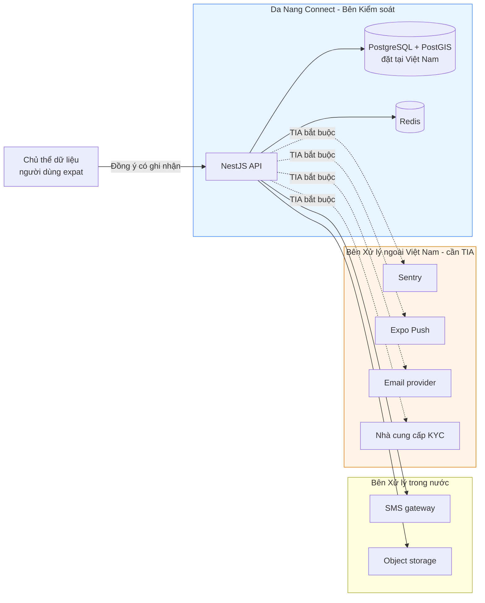

### 3.3 Kiểm kê dữ liệu — bảng ROPA rút gọn

Bảng này là **đầu vào bắt buộc** cho DPIA, cho Privacy Policy, cho form Data Safety của Google Play và nhãn quyền riêng tư của App Store. Một bảng dùng cho bốn nơi — đừng viết bốn lần rồi mâu thuẫn nhau.

| # | Trường / nhóm dữ liệu | Bảng trong DB | Phân loại | Mục đích | Cơ sở pháp lý | Thời hạn lưu | Ra nước ngoài? |
|---|---|---|---|---|---|---|---|
| D01 | Email | `users` | Cơ bản | Định danh, đăng nhập, thông báo giao dịch | Thực hiện hợp đồng dịch vụ | Vòng đời tài khoản + 30 ngày | Có (email provider) |
| D02 | Số điện thoại | `users` | Cơ bản | Xác thực tài khoản, khôi phục | Đồng ý + nghĩa vụ pháp luật | Vòng đời + 24 tháng (theo NĐ 147) | Có (SMS gateway nếu ngoài VN) |
| D03 | Họ tên, tên hiển thị | `profiles` | Cơ bản | Hiển thị công khai trong cộng đồng | Đồng ý | Vòng đời | Không |
| D04 | Ảnh đại diện | `profiles` | Cơ bản | Hiển thị công khai | Đồng ý | Vòng đời | Có (CDN) |
| D05 | Quốc tịch, ngôn ngữ | `profiles` | Cơ bản | Lọc sự kiện theo ngôn ngữ | Đồng ý | Vòng đời | Không |
| D06 | Ngày sinh / xác nhận đủ tuổi | `profiles` | Cơ bản | Kiểm soát độ tuổi, gắn nhãn 18+ | Nghĩa vụ pháp luật | Vòng đời | Không |
| D07 | **Vị trí người dùng (toạ độ thiết bị)** | `user_locations` | **NHẠY CẢM** | Sắp xếp sự kiện theo khoảng cách | **Đồng ý riêng biệt** | 30 ngày, chỉ lưu ở độ chính xác thấp | Không — **cấm rời VN** ⚙️ |
| D08 | Toạ độ địa điểm sự kiện | `venues`, `events` | Cơ bản (địa điểm, không phải người) | Bản đồ, tìm theo khu vực | Thực hiện hợp đồng | Vòng đời sự kiện + 24 tháng | Có (tile bản đồ chỉ nhận toạ độ khung nhìn) |
| D09 | Lịch sử RSVP, check-in | `rsvps`, `checkins` | Cơ bản | Vận hành sự kiện, tính trust | Thực hiện hợp đồng | 24 tháng sau sự kiện | Không |
| D10 | Tin nhắn 1-1, bình luận | `messages`, `comments` | Cơ bản | Tính năng cốt lõi | Thực hiện hợp đồng | Vòng đời + 24 tháng cho bằng chứng an toàn | Không |
| D11 | Kết quả xác thực giấy tờ | `trust_signals` | **NHẠY CẢM** (liên quan giấy tờ tùy thân) | Nâng tầng tin cậy T4 | **Đồng ý riêng biệt** | 24 tháng; **không lưu ảnh giấy tờ** | Có (nhà cung cấp KYC) |
| D12 | IP đăng nhập, user-agent, log phiên | `auth_sessions`, log | Cơ bản | Bảo mật, chống lạm dụng, nghĩa vụ lưu log | Nghĩa vụ pháp luật + lợi ích hợp pháp | **Tối thiểu 24 tháng** theo NĐ 147 | Không |
| D13 | Push token thiết bị | `push_tokens` | Cơ bản | Gửi thông báo | Đồng ý | Đến khi gỡ app hoặc tắt thông báo | Có (Expo/APNs/FCM) |
| D14 | Báo cáo vi phạm, hồ sơ kiểm duyệt | `reports`, `moderation_cases` | Cơ bản, có thể chứa nhạy cảm | Trust & Safety | Lợi ích hợp pháp + nghĩa vụ pháp luật | 36 tháng | Không |
| D15 | Sự kiện analytics | Kho analytics | Cơ bản, ưu tiên ẩn danh | Cải thiện sản phẩm | **Đồng ý riêng biệt, mặc định TẮT** | 14 tháng | Có |
| D16 | Dữ liệu lỗi (stack trace) | Sentry | Có nguy cơ chứa PII | Sửa lỗi | Lợi ích hợp pháp | 90 ngày | Có — bắt buộc scrub PII ⚙️ |

> ⚙️ **Ticket kỹ thuật bắt buộc phát sinh từ bảng này**
> - `LEGAL-01` Tách bảng `user_locations` riêng, mã hoá ở tầng cột, TTL 30 ngày, job xoá tự động.
> - `LEGAL-02` Cấu hình Sentry `beforeSend` để loại bỏ email, số điện thoại, token, toạ độ khỏi payload trước khi gửi.
> - `LEGAL-03` Cột `retention_policy` hoặc bảng `data_retention_rules` để job dọn dữ liệu chạy theo cấu hình, không hardcode.
> - `LEGAL-04` Bảng `consent_records` append-only (xem 3.4).
> - `LEGAL-05` Endpoint xuất dữ liệu và endpoint xoá tài khoản (xem 3.5 và mục 9.2).

### 3.4 Thiết kế sự đồng ý (consent)

Yêu cầu pháp lý cốt lõi, áp dụng nguyên vẹn từ NĐ 13:

| Yêu cầu | 🟢/🟡 | Hệ quả thiết kế |
|---|---|---|
| Đồng ý phải **rõ ràng, cụ thể**, cho **từng mục đích** | 🟢 | Không dùng một checkbox "Tôi đồng ý với mọi thứ" ⚙️ |
| **Im lặng hoặc không phản hồi không được coi là đồng ý** | 🟢 | Cấm checkbox tick sẵn cho mục đích không bắt buộc ⚙️ |
| Đồng ý phải ở **định dạng có thể in ra, sao chép bằng văn bản**, kể cả điện tử | 🟢 | Bảng `consent_records` lưu bản chụp toàn văn nội dung đã hiển thị ⚙️ |
| Người dùng có quyền **rút lại đồng ý** bất cứ lúc nào, việc rút lại không ảnh hưởng dữ liệu đã xử lý hợp pháp trước đó | 🟢 | Màn hình `Settings → Privacy` phải có công tắc bật/tắt từng mục đích ⚙️ |
| **Bên kiểm soát phải chứng minh được** người dùng đã đồng ý | 🟢 | Lưu `policy_version`, `ip`, `user_agent`, `consented_at`, `locale` ⚙️ |

#### Danh mục mục đích xử lý và cách trình bày

| Mã | Mục đích | Bắt buộc để dùng dịch vụ? | Mặc định | Vị trí hiển thị |
|---|---|---|---|---|
| `consent.core` | Tạo tài khoản, hiển thị hồ sơ, tham gia sự kiện | Có — không có thì không dùng được | Bắt buộc tick | Màn hình đăng ký |
| `consent.location_precise` | Dùng vị trí thiết bị để sắp xếp sự kiện theo khoảng cách | Không | TẮT | Hộp thoại riêng khi lần đầu bấm "Near me" |
| `consent.marketing_email` | Nhận bản tin tuần về sự kiện mới | Không | TẮT | Đăng ký, và trong Settings |
| `consent.push_marketing` | Nhận push gợi ý sự kiện (khác push giao dịch) | Không | TẮT | Sau khi hoàn tất onboarding |
| `consent.analytics` | Phân tích hành vi để cải thiện sản phẩm | Không | TẮT | Settings → Privacy |
| `consent.kyc_document` | Xử lý dữ liệu giấy tờ tùy thân để nâng tầng T4 | Không | Hỏi ngay tại luồng T4 | Luồng xác thực |
| `consent.photo_publication` | Đăng ảnh có mặt mình do organizer chụp tại sự kiện | Không | TẮT | Màn hình check-in |

> **Lưu ý quan trọng:** push **giao dịch** (nhắc sự kiện đã RSVP, thông báo bị hủy, tin nhắn mới) thuộc `consent.core` vì đó là thực hiện hợp đồng dịch vụ. Push **gợi ý** thì không. Trộn hai loại vào một công tắc là lỗi thiết kế phổ biến và cũng là lỗi tuân thủ.

#### Luồng consent khi onboarding

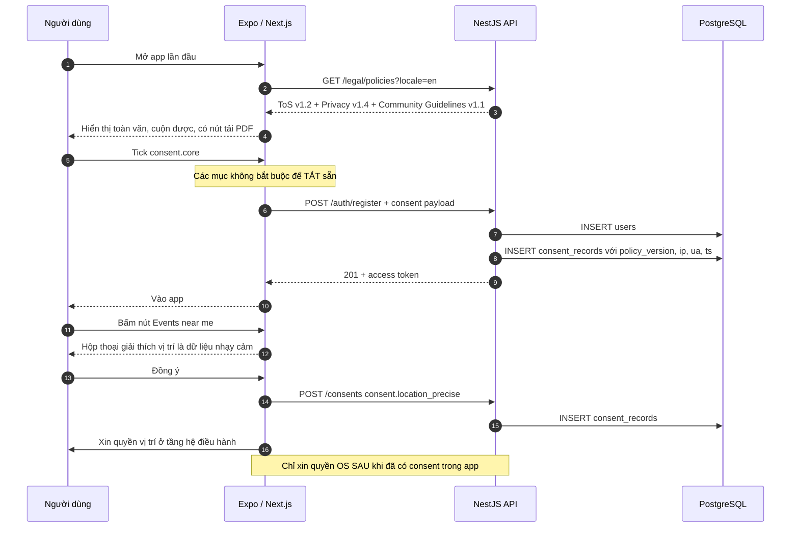

> ⚙️ **`LEGAL-04` — lược đồ bảng `consent_records`**
>
> | Cột | Kiểu | Ghi chú |
> |---|---|---|
> | `id` | uuid | |
> | `user_id` | uuid | FK |
> | `purpose` | varchar | Mã trong bảng trên |
> | `granted` | boolean | `false` khi rút lại |
> | `policy_version` | varchar | Ví dụ `privacy@1.4.0` |
> | `policy_text_hash` | char(64) | SHA-256 của toàn văn đã hiển thị |
> | `locale` | varchar(5) | `en` hoặc `vi` |
> | `ip` | inet | |
> | `user_agent` | text | |
> | `source` | varchar | `web`, `ios`, `android` |
> | `created_at` | timestamptz | Append-only, **không UPDATE, không DELETE** |
>
> Rút lại đồng ý = ghi thêm một dòng `granted = false`, không sửa dòng cũ. Đây là điều kiện để chứng minh được lịch sử đồng ý trước cơ quan quản lý.

### 3.5 Quyền của chủ thể dữ liệu và SLA

| Quyền | Nội dung | SLA phải đáp ứng | Cách hiện thực ⚙️ |
|---|---|---|---|
| Quyền được biết | Biết dữ liệu nào bị xử lý, ai xử lý, mục đích gì | Ngay khi đăng ký | Privacy Policy + màn hình `Privacy Center` trong app |
| Quyền đồng ý / không đồng ý | Từng mục đích riêng | Ngay | Mục 3.4 |
| Quyền truy cập, xem, chỉnh sửa | Xem và sửa dữ liệu của mình | Ngay với dữ liệu tự sửa được | Màn hình `Edit profile` |
| Quyền được cung cấp dữ liệu (data portability) | Nhận bản sao dữ liệu của mình | **72 giờ** kể từ khi yêu cầu | `POST /me/data-export` → job BullMQ → email link tải file JSON + ZIP ảnh, link hết hạn 7 ngày |
| Quyền rút lại đồng ý | Bất cứ lúc nào | Ngay | Công tắc trong Settings |
| Quyền xóa dữ liệu | Yêu cầu xóa | **72 giờ** kể từ khi yêu cầu | Mục 9.2 — lưu ý xung đột với ân hạn 14 ngày 🟡 |
| Quyền hạn chế xử lý | Tạm dừng một số mục đích | 72 giờ | Cờ `processing_restricted` trên `users` |
| Quyền phản đối xử lý | Phản đối xử lý cho mục đích cụ thể | 72 giờ | Kênh `privacy@` + form trong app |
| Quyền khiếu nại, tố cáo, khởi kiện | Gửi cơ quan có thẩm quyền | — | Ghi rõ trong Privacy Policy đầu mối và địa chỉ |
| Quyền yêu cầu bồi thường thiệt hại | — | — | Điều khoản giới hạn trách nhiệm trong ToS |

> 🟡 **Xung đột cần luật sư giải:** chính sách store cho phép ân hạn hủy xóa tài khoản; pháp luật Việt Nam đặt thời hạn 72 giờ cho yêu cầu xóa dữ liệu. Cách xử lý đề xuất: **trong 72 giờ, ngừng mọi hoạt động xử lý và ẩn toàn bộ dữ liệu khỏi mọi giao diện** (coi như đã thực hiện quyền xóa về mặt hiệu lực), rồi mới xóa/ẩn danh vật lý sau 14 ngày. Phải được luật sư xác nhận cách diễn giải này là chấp nhận được.

#### Kênh tiếp nhận yêu cầu — bắt buộc công bố

| Kênh | Địa chỉ | Ghi chú |
|---|---|---|
| Trong app | `Settings → Privacy → Manage my data` | Bắt buộc, xem mục 9.2 |
| Trên web | Trang `/privacy/requests` | Bắt buộc cho Google Play |
| Hộp thư | `privacy@` tên miền chính thức | Phải có người trực, SLA phản hồi ban đầu 24 giờ |
| Địa chỉ trụ sở | Ghi trong Privacy Policy | Bắt buộc theo pháp luật Việt Nam |

### 3.6 Hồ sơ đánh giá tác động xử lý dữ liệu cá nhân (DPIA)

| Hạng mục | Nội dung |
|---|---|
| Ai phải lập | Bên Kiểm soát — tức Da Nang Connect | 🟢 |
| Khi nào | Lập **từ khi bắt đầu xử lý** dữ liệu cá nhân, tức từ user thật đầu tiên (kể cả beta) | 🟢 |
| Nộp ở đâu | Cơ quan chuyên trách bảo vệ dữ liệu cá nhân — A05, Bộ Công an | 🟡 |
| Thời hạn nộp | **60 ngày** kể từ ngày bắt đầu xử lý | 🟢 |
| Lưu ở đâu | Bản gốc lưu tại trụ sở, sẵn sàng xuất trình khi kiểm tra | 🟢 |
| Cập nhật khi nào | Khi thay đổi nội dung hồ sơ đã nộp: thêm loại dữ liệu, thêm nhà cung cấp, đổi hạ tầng | 🟢 |

#### Nội dung tối thiểu của DPIA

1. Thông tin và chi tiết liên lạc của Bên Kiểm soát; họ tên và chi tiết liên lạc của **nhân sự phụ trách bảo vệ dữ liệu cá nhân**.
2. Mục đích xử lý — lấy từ bảng 3.4.
3. Các loại dữ liệu cá nhân được xử lý — lấy từ bảng 3.3.
4. Tổ chức, cá nhân nhận dữ liệu, gồm cả tổ chức ngoài lãnh thổ Việt Nam — bảng 3.2 và 3.7.
5. Trường hợp chuyển dữ liệu ra nước ngoài.
6. Thời gian xử lý, thời gian xóa/hủy.
7. Biện pháp bảo vệ dữ liệu đã áp dụng — mã hóa, phân quyền, log truy cập, kiểm thử.
8. Đánh giá mức độ ảnh hưởng và hậu quả, thiệt hại không mong muốn có khả năng xảy ra, biện pháp giảm thiểu.

> 📄 Tạo file `ops/legal/dpia/` với bản `dpia-v1.md` được kiểm soát phiên bản trong repo. Nộp bản in có chữ ký người đại diện theo pháp luật, lưu ảnh chụp biên nhận vào cùng thư mục.

#### Ai làm nhân sự phụ trách bảo vệ dữ liệu?

| Phương án | Ưu | Nhược | Khuyến nghị |
|---|---|---|---|
| Founder kiêm nhiệm | Miễn phí, hiểu sản phẩm | Không có chuyên môn pháp lý, xung đột vai trò | Chấp nhận được ở M0–M5, phải ghi rõ tên trong DPIA |
| Tech Lead kiêm nhiệm | Hiểu hệ thống, sửa được ngay | Bận, dễ bỏ SLA 72 giờ | Không khuyến nghị làm đầu mối duy nhất |
| Thuê ngoài theo tháng | Chuyên môn, có mẫu sẵn | Chi phí | **Khuyến nghị từ M5 trở đi**, khi bắt đầu có user thật |

### 3.7 Chuyển dữ liệu cá nhân ra nước ngoài (TIA)

Chuyển dữ liệu ra nước ngoài xảy ra ngay cả khi không "gửi" dữ liệu một cách chủ ý: chỉ cần dữ liệu được lưu trên máy chủ đặt ngoài Việt Nam, hoặc được truy cập từ nước ngoài, là đã thuộc phạm vi.

| Nhà cung cấp | Dữ liệu đi ra | Bắt buộc? | Phương án thay thế trong nước | Quyết định đề xuất |
|---|---|---|---|---|
| Sentry (SaaS) | Stack trace, có thể lẫn PII | Không — có thể self-host Sentry | Self-host trong VPC tại Việt Nam | **Self-host** nếu đủ nguồn lực; nếu dùng SaaS thì bắt buộc scrub PII + TIA ⚙️ |
| Expo Push | Push token, nội dung tiêu đề thông báo | Gần như bắt buộc với Expo | Gửi thẳng APNs/FCM (vẫn ra nước ngoài) | Chấp nhận, đưa vào TIA; **không đưa nội dung nhạy cảm vào tiêu đề push** ⚙️ |
| Apple APNs / Google FCM | Push token, payload | Bắt buộc về mặt kỹ thuật | Không có | Chấp nhận, đưa vào TIA |
| Apple App Store / Google Play | Dữ liệu tài khoản nhà phát triển, dữ liệu mua hàng | Bắt buộc | Không có | Chấp nhận |
| Email provider ngoài VN | Email người dùng, nội dung email | Không | Nhà cung cấp email trong nước | Cân nhắc nhà cung cấp trong nước để rút gọn hồ sơ |
| Object storage / CDN ngoài VN | Ảnh avatar, ảnh sự kiện | Không | Object storage trong nước + CDN có POP tại VN | **Chọn trong nước** — thống nhất với quyết định hosting ở `04` |
| Nhà cung cấp KYC ngoài VN | Ảnh giấy tờ, selfie | Không | Nhà cung cấp eKYC trong nước | **Chọn trong nước** — dữ liệu nhạy cảm nhất, đừng đưa ra ngoài |
| Nhà cung cấp analytics ngoài VN | Sự kiện hành vi | Không | Self-host công cụ analytics mã nguồn mở | **Self-host** — vừa rẻ hơn vừa gọn hồ sơ |

#### Nội dung tối thiểu của TIA

1. Thông tin và chi tiết liên lạc của bên chuyển và **bên tiếp nhận** dữ liệu.
2. Họ tên, chi tiết liên lạc của cá nhân phụ trách của bên chuyển dữ liệu.
3. Mô tả và luận giải mục tiêu của hoạt động xử lý sau khi chuyển ra nước ngoài.
4. Mô tả loại dữ liệu chuyển ra nước ngoài.
5. Mô tả **sự tuân thủ quy định pháp luật Việt Nam về bảo vệ dữ liệu** của bên tiếp nhận, kèm cam kết bằng văn bản.
6. Đánh giá tác động, hậu quả không mong muốn, biện pháp giảm thiểu.
7. Sự đồng ý của chủ thể dữ liệu, có cơ chế phản hồi và khiếu nại.
8. Văn bản thể hiện ràng buộc trách nhiệm giữa hai bên.

> 🟢 **Thời hạn:** nộp trong **60 ngày** kể từ khi bắt đầu chuyển dữ liệu. Cùng deadline với DPIA — làm hai hồ sơ cùng một đợt.
>
> 🟡 **Chế tài:** pháp luật hiện hành đặt mức phạt rất nặng cho vi phạm về chuyển dữ liệu ra nước ngoài và mua bán dữ liệu cá nhân, tính theo **tỷ lệ phần trăm doanh thu** chứ không chỉ mức tuyệt đối. Đây là loại vi phạm không nên thử.

### 3.8 Quy trình xử lý sự cố lộ, mất dữ liệu

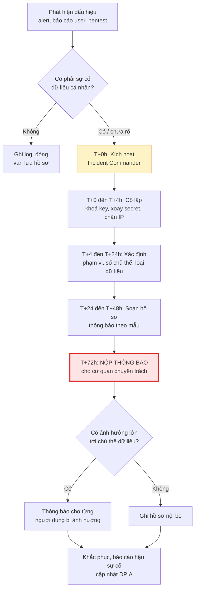

| Yêu cầu | Chi tiết | Mức |
|---|---|---|
| Thời hạn thông báo | **72 giờ** kể từ khi phát hiện vi phạm | 🟢 |
| Nếu chậm quá 72 giờ | Phải kèm **lý do chậm trễ** bằng văn bản | 🟢 |
| Nội dung thông báo | Mô tả sự cố, thời gian, loại dữ liệu, số lượng chủ thể bị ảnh hưởng, hậu quả, biện pháp khắc phục, thông tin người phụ trách | 🟢 |
| Lưu hồ sơ | Toàn bộ hồ sơ sự cố phải lưu, kể cả sự cố đã xử lý xong | 🟢 |
| Nghĩa vụ song song | Chính sách App Store / Google Play cũng có yêu cầu thông báo; hợp đồng với nhà cung cấp có thể có nghĩa vụ riêng | 🟡 |

> ⚙️ **`LEGAL-06`** — Runbook sự cố dữ liệu phải nằm trong `ops/runbooks/data-breach.md`, có **diễn tập ít nhất một lần trước M6** (roadmap `08` đã yêu cầu diễn tập runbook sự cố). Bổ sung kịch bản "lộ dữ liệu" vào buổi diễn tập đó.

### 3.9 Bảo mật tối thiểu phải chứng minh được

| Biện pháp | Bắt buộc trước mốc | Bằng chứng lưu ở đâu |
|---|---|---|
| Mã hoá đường truyền TLS 1.2+ trên mọi endpoint | M0 | Báo cáo quét SSL |
| Mã hoá dữ liệu nhạy cảm ở tầng cột (`user_locations`, `trust_signals`) | M4 | Migration + ADR |
| Băm mật khẩu bằng Argon2id hoặc bcrypt cost ≥ 12 | M1 | Code review |
| Băm số điện thoại bằng HMAC-SHA256 + pepper (đã chốt ở `05`) | M1 | Code review |
| Phân quyền RBAC, nguyên tắc quyền tối thiểu | M1 | Ma trận quyền trong `01` |
| Log truy cập dữ liệu cá nhân bởi nhân sự nội bộ (admin đọc hồ sơ ai, lúc nào) | M4 | Bảng `audit_logs` |
| Sao lưu có mã hoá, kiểm thử khôi phục | M5 | Nhật ký diễn tập khôi phục |
| Xoay vòng secret, không commit secret vào repo | M0 | Cấu hình CI + secret scanning |
| Rà soát quyền truy cập nhân sự hằng quý | Từ M5 | Biên bản rà soát |
| Kiểm thử xâm nhập cơ bản | Trước M6 | Báo cáo pentest |

> **Vì sao quan trọng:** khi có sự cố, câu hỏi đầu tiên của cơ quan chức năng không phải "vì sao lộ" mà là "anh đã áp dụng biện pháp bảo vệ nào". Bảng này chính là câu trả lời, và nó phải có bằng chứng ngày tháng.

### 3.10 Dữ liệu trẻ em — cách xử lý gọn nhất

| Yêu cầu pháp lý | Hệ quả |
|---|---|
| Dữ liệu của người **dưới 16 tuổi** cần đồng ý của **cả trẻ em từ đủ 7 tuổi trở lên và cha mẹ/người giám hộ** | 🟢 Nghĩa vụ rất nặng, gần như không khả thi cho một app cộng đồng nhỏ |
| Phải xác minh tuổi trước khi xử lý dữ liệu trẻ em | 🟢 |
| Phải ngừng xử lý và xoá khi cha mẹ yêu cầu | 🟢 |

**Khuyến nghị dứt khoát:** đặt **độ tuổi tối thiểu 18** trong Terms of Service, có age gate ở màn hình đăng ký, và tự động khoá tài khoản nếu phát hiện khai man tuổi. Lý do:

1. Loại bỏ hoàn toàn nghĩa vụ về dữ liệu trẻ em — không phải xây cơ chế đồng ý của cha mẹ.
2. Phù hợp với thực tế nội dung: cộng đồng expat có sự kiện gắn nhãn 18+/nightlife (đã có trong `05`), có quán bar, có rượu bia.
3. Đơn giản hoá khai báo phân loại độ tuổi trên hai store.
4. Giảm rủi ro Trust & Safety nghiêm trọng nhất — người lớn tiếp cận trẻ vị thành niên qua sự kiện gặp mặt ngoài đời.

> ⚙️ **`LEGAL-07`** — age gate ở đăng ký: nhập năm sinh, chặn nếu < 18, ghi `age_confirmed_at`. Không lưu ngày sinh đầy đủ nếu chỉ cần biết đủ tuổi — lưu cờ boolean + năm sinh là đủ, đúng nguyên tắc tối thiểu hoá dữ liệu.

---

## 4. An ninh mạng, lưu trữ dữ liệu trong nước và văn phòng đại diện

### 4.1 Hai nghĩa vụ hay bị nhầm lẫn

Rất nhiều bài viết gộp chung hai nghĩa vụ khác nhau. Với một startup Việt Nam, sự khác biệt này quyết định toàn bộ ngân sách hạ tầng.

| | **Doanh nghiệp trong nước** | **Doanh nghiệp nước ngoài** |
|---|---|---|
| Ai áp dụng | Công ty thành lập theo pháp luật Việt Nam — **chính là Da Nang Connect** | Doanh nghiệp nước ngoài cung cấp dịch vụ tại Việt Nam |
| Lưu trữ dữ liệu tại Việt Nam | **Bắt buộc**, không cần có yêu cầu riêng của cơ quan chức năng 🟡 | Chỉ khi có yêu cầu bằng văn bản của Bộ trưởng Bộ Công an |
| Đặt văn phòng đại diện tại Việt Nam | Không áp dụng (đã có trụ sở rồi) | Chỉ khi có yêu cầu bằng văn bản |
| Hệ quả với dự án | **Máy chủ chính phải đặt tại Việt Nam** | Không liên quan trực tiếp |

> 🟡 **Kết luận:** câu hỏi "startup nhỏ có phải đặt văn phòng đại diện không" là **câu hỏi sai** với dự án này. Da Nang Connect là pháp nhân Việt Nam, đã có trụ sở tại Đà Nẵng. Nghĩa vụ thực sự cần quan tâm là **lưu trữ dữ liệu tại Việt Nam**, và nghĩa vụ này áp dụng ngay, không có ngưỡng người dùng tối thiểu.
>
> 🔴 **Cần luật sư xác nhận:** phạm vi chính xác của nghĩa vụ lưu trữ trong nước theo văn bản đang hiệu lực, và liệu có được lưu bản sao/backup ở nước ngoài hay không.

### 4.2 Ba nhóm dữ liệu phải lưu tại Việt Nam

| Nhóm | Nội dung theo quy định | Bảng tương ứng trong `03-domain-va-du-lieu.md` |
|---|---|---|
| **1. Thông tin cá nhân của người sử dụng dịch vụ tại Việt Nam** | Họ tên, ngày sinh, nơi cư trú, số điện thoại, email, số giấy tờ tùy thân, sinh trắc học... | `users`, `profiles`, `trust_signals` |
| **2. Dữ liệu do người sử dụng tại Việt Nam tạo ra** | Tên tài khoản, thời gian sử dụng dịch vụ, thông tin thẻ tín dụng, địa chỉ email, IP đăng nhập/đăng xuất gần nhất, số điện thoại đăng ký | `auth_sessions`, `events`, `comments`, `messages`, `rsvps`, log truy cập |
| **3. Dữ liệu về mối quan hệ của người sử dụng tại Việt Nam** | Bạn bè, nhóm mà người sử dụng kết nối hoặc tương tác | `follows`, `event_participants`, `blocks`, danh sách RSVP |

> 🟢 **Kết luận kiến trúc:** cả ba nhóm này gần như là **toàn bộ cơ sở dữ liệu** của Da Nang Connect. Không có cách tách nhỏ nào có ý nghĩa. Quyết định đúng là đặt PostgreSQL, Redis và object storage chính tại Việt Nam — đúng như đã chốt ở `04-tech-stack-va-kien-truc.md`.

### 4.3 Bảng quyết định hạ tầng theo thành phần

| Thành phần | Đặt ở đâu | Lý do | Mức |
|---|---|---|---|
| PostgreSQL + PostGIS (primary + replica) | **Việt Nam** | Nghĩa vụ lưu trữ trong nước; độ trễ khi đứt cáp quang biển | 🟢 |
| Redis / BullMQ | **Việt Nam** | Chứa session, hàng đợi có PII | 🟢 |
| NestJS API | **Việt Nam** | Cùng vùng với DB để giảm độ trễ | 🟢 |
| Object storage ảnh | **Việt Nam** | Chứa ảnh đại diện, ảnh sự kiện có mặt người | 🟢 |
| CDN | POP tại Việt Nam, có thể là mạng toàn cầu | Chỉ phân phối nội dung công khai đã qua kiểm duyệt | 🟡 |
| Next.js web (SSR) | **Việt Nam** | Nhất quán, tránh dữ liệu phiên đi qua PaaS nước ngoài | 🟡 |
| Backup | **Việt Nam**, mã hoá; bản sao lạnh ngoài nước cần TIA | Nếu backup có PII và ra nước ngoài thì phải khai TIA | 🔴 |
| CI/CD runner | Có thể ngoài nước | Không chạm dữ liệu production nếu tách môi trường đúng | 🟢 |
| Sentry | Self-host Việt Nam (khuyến nghị) hoặc SaaS + TIA | Stack trace có nguy cơ chứa PII | 🟡 |
| Expo Push, APNs, FCM | Ngoài nước — không tránh được | Đưa vào TIA, hạn chế nội dung trong payload | 🟢 |

> ⚙️ **`LEGAL-08`** — viết một ADR duy nhất tên `adr-00X-data-residency.md` chốt bảng trên, có chữ ký Tech Lead và Founder. ADR này là bằng chứng đã cân nhắc nghĩa vụ pháp lý khi thiết kế, dùng được cả trong DPIA lẫn khi làm việc với nhà đầu tư.

### 4.4 Nghĩa vụ phối hợp với cơ quan chức năng

| Nghĩa vụ | Nội dung | Chuẩn bị trước |
|---|---|---|
| Đầu mối liên hệ | Phải có người và địa chỉ liên hệ để cơ quan chức năng gửi yêu cầu | 📄 Ghi trong hồ sơ thông báo dịch vụ, công bố trên web |
| Cung cấp thông tin người dùng khi có yêu cầu hợp pháp | Chỉ khi có văn bản đúng thẩm quyền | 📄 Quy trình nội bộ: ai nhận, ai duyệt, ai trả lời, lưu hồ sơ |
| Gỡ nội dung khi có yêu cầu | Thời hạn ngắn — xem mục 5.3 | ⚙️ Công cụ admin gỡ nội dung trong vài phút, có audit log |
| Lưu nhật ký hệ thống | Tối thiểu theo quy định — xem mục 5.3 | ⚙️ Chính sách lưu log tách khỏi chính sách xoá dữ liệu người dùng |
| Ngăn chặn, xoá bỏ thông tin vi phạm | Chủ động, không chỉ chờ yêu cầu | ⚙️ Blocklist từ khoá + pre-publish review (đã có trong `05`) |

> 📄 **Quy trình tiếp nhận yêu cầu từ cơ quan nhà nước** — soạn thành tài liệu nội bộ 2 trang, gồm: mẫu xác minh tính hợp lệ của văn bản, người duy nhất có quyền trả lời (người đại diện theo pháp luật), thời hạn nội bộ, và quy tắc **luôn tham vấn luật sư trước khi cung cấp dữ liệu người dùng**. Không để một nhân viên hỗ trợ tự quyết.

---

## 5. Dịch vụ mạng xã hội — Nghị định 147/2024/NĐ-CP

Đây là mục có tác động lớn nhất đến sản phẩm ở Giai đoạn 1.

### 5.1 Da Nang Connect thuộc loại dịch vụ nào

Nghị định 147/2024/NĐ-CP phân biệt các loại hình chính:

| Loại hình | Đặc điểm | Da Nang Connect có khớp? |
|---|---|---|
| **Mạng xã hội** | Hệ thống cho phép người sử dụng **tạo trang thông tin cá nhân, tương tác, chia sẻ, trao đổi thông tin** với nhau | ✅ **Khớp hoàn toàn** — có hồ sơ cá nhân, tạo sự kiện, bình luận, tin nhắn 1-1 |
| **Trang thông tin điện tử tổng hợp** | Cung cấp thông tin tổng hợp trên cơ sở **trích dẫn nguyên văn, chính xác nguồn tin chính thức** (báo chí) và ghi rõ tác giả, nguồn, thời gian đã đăng | ❌ Không khớp — nội dung curate là bài đăng của cá nhân trên mạng xã hội, không phải nguồn tin báo chí |
| **Trang thông tin điện tử nội bộ** | Chỉ cung cấp thông tin về chức năng, hoạt động của chính tổ chức | ❌ Không khớp |
| **Trang thông tin điện tử ứng dụng chuyên ngành** | Cung cấp dịch vụ ứng dụng chuyên ngành (ngân hàng, y tế, thương mại điện tử...) | ⚠️ Có thể chồng lấn ở Giai đoạn 2, 3 |

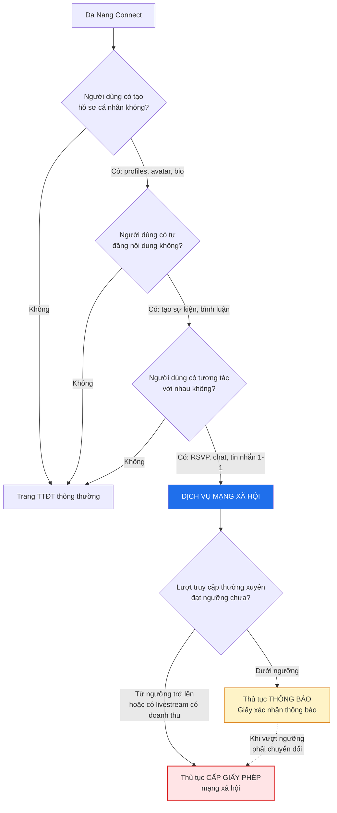

> 🟡 **Kết luận:** Da Nang Connect là **dịch vụ mạng xã hội**. Việc tự gọi sản phẩm là "nền tảng sự kiện", "thư mục cộng đồng" hay "event directory" không thay đổi bản chất pháp lý. Cơ quan quản lý đánh giá theo chức năng thực tế, không theo tên gọi trên website.

### 5.2 Thông báo và Giấy phép — so sánh

| Tiêu chí | **Thông báo** (Giấy xác nhận thông báo) | **Giấy phép** mạng xã hội |
|---|---|---|
| Khi nào áp dụng | Dưới ngưỡng lượt truy cập thường xuyên | Từ ngưỡng trở lên, hoặc có livestream phát sinh doanh thu |
| Ngưỡng tham chiếu | Dưới ~10.000 lượt truy cập thường xuyên/tháng, tính trung bình 6 tháng liên tục 🟡 | Từ ~10.000 lượt trở lên 🟡 |
| Thời gian xử lý | Ngắn hơn nhiều | Dài hơn, thẩm định kỹ hơn |
| Điều kiện về tên miền | Tên miền `.vn` hoặc theo quy định 🟡 | **Tên miền `.vn`** hợp lệ, còn hạn ít nhất 6 tháng 🟡 |
| Máy chủ | Đặt tại Việt Nam 🟡 | **Bắt buộc** đặt tại Việt Nam 🟢 |
| Nhân sự quản lý nội dung | Có đầu mối | **Bắt buộc** có nhân sự chịu trách nhiệm quản lý nội dung, là người có quốc tịch Việt Nam hoặc người nước ngoài có thẻ tạm trú còn hạn ≥ 6 tháng 🟡 |
| Biện pháp kỹ thuật | Có | **Bắt buộc**: hệ thống kiểm duyệt, chặn/gỡ nội dung, lưu trữ nhật ký, xác thực người dùng |
| Quy chế quản lý nội dung | Nên có | **Bắt buộc** ban hành và công khai |
| Thời hạn hiệu lực | Theo văn bản | Có thời hạn, phải gia hạn |

> 🔴 **Phải hỏi luật sư — ba câu hỏi cụ thể:**
> 1. Con số ngưỡng chính xác theo văn bản đang hiệu lực là bao nhiêu, và "lượt truy cập thường xuyên" được đo bằng phương pháp nào? Ai xác nhận số liệu — doanh nghiệp tự khai hay đo bằng công cụ được chỉ định?
> 2. Với một app mobile (không phải website), "lượt truy cập" được tính thế nào?
> 3. Nếu ra mắt dưới ngưỡng rồi vượt ngưỡng sau 6 tháng, thời điểm bắt buộc phải có giấy phép là ngày nào, và có được tiếp tục hoạt động trong lúc chờ cấp phép không?

### 5.3 Nghĩa vụ vận hành thường xuyên

| Nghĩa vụ | Yêu cầu | Hệ quả kỹ thuật ⚙️ | Mức |
|---|---|---|---|
| **Xác thực tài khoản** | Xác thực bằng **số điện thoại di động tại Việt Nam**; chỉ khi người dùng xác nhận không có số Việt Nam mới xác thực bằng **số định danh cá nhân** | Luồng auth phải rẽ nhánh; xem 5.4 | 🔴 |
| **Chỉ tài khoản đã xác thực mới được đăng tải nội dung** | Người chưa xác thực chỉ được xem | Ánh xạ thẳng vào bảng quyền theo tầng T0–T5 ở `05` | 🟡 |
| **Gỡ nội dung vi phạm khi có yêu cầu** | Thời hạn ngắn, tính bằng giờ kể từ khi nhận yêu cầu của cơ quan có thẩm quyền | Nút gỡ trong Admin Console, thao tác < 5 phút, có audit log | 🟢 |
| **Chủ động rà soát, ngăn chặn nội dung vi phạm** | Không chỉ chờ yêu cầu | Blocklist + pre-publish review đã thiết kế ở `05` | 🟢 |
| **Lưu trữ thông tin người dùng và nhật ký** | Tối thiểu **24 tháng** 🟡 | Chính sách lưu log **tách biệt** khỏi chính sách xoá tài khoản | 🟡 |
| **Ban hành và công khai quy chế quản lý nội dung** | Bằng tiếng Việt, đăng công khai | Trang `/legal/content-policy` bản tiếng Việt là bản có hiệu lực pháp lý | 🟢 |
| **Đầu mối liên hệ với cơ quan quản lý** | Tên, số điện thoại, email | Công bố trên web và trong hồ sơ | 🟢 |
| **Báo cáo định kỳ** | Theo yêu cầu của cơ quan quản lý | Xuất báo cáo số liệu từ Admin Console | 🟡 |

> ⚠️ **Mâu thuẫn cần xử lý ngay ở tầng thiết kế:** nghĩa vụ **lưu nhật ký tối thiểu 24 tháng** xung đột bề ngoài với **quyền xoá dữ liệu trong 72 giờ** của chủ thể dữ liệu. Cách hoà giải thông thường: quyền xoá không tuyệt đối, không áp dụng khi việc lưu trữ là **nghĩa vụ pháp luật**. Nhưng phải:
> 1. Ghi rõ ngoại lệ này trong Privacy Policy — 📄
> 2. Tách hệ thống log ra khỏi dữ liệu hồ sơ, chỉ giữ trường tối thiểu — ⚙️
> 3. Khi xoá tài khoản, ẩn danh hồ sơ nhưng giữ log kỹ thuật theo thời hạn luật định — ⚙️
> 4. 🔴 Luật sư xác nhận cách diễn giải này bằng văn bản.

### 5.4 Bài toán xác thực số điện thoại cho người nước ngoài

Đây là rủi ro pháp lý **số 1** của toàn dự án, đã được nêu là "vấn đề mở nghiêm trọng" trong `05-trust-safety-va-kiem-duyet.md`.

**Vì sao đây là vấn đề:** tệp người dùng mục tiêu là expat và digital nomad tại Đà Nẵng. Phân khúc S1 đã chọn trong `07` là nhóm di chuyển nhiều, nhiều người dùng eSIM du lịch, số nước ngoài, hoặc số Việt Nam trả trước đăng ký bằng hộ chiếu. Yêu cầu bắt buộc số điện thoại Việt Nam sẽ chặn một tỷ lệ đáng kể người dùng ngay tại bước đăng ký — đúng bước có tỷ lệ rơi cao nhất.

#### Bốn phương án và đánh giá

| # | Phương án | Ma sát người dùng | Rủi ro pháp lý | Chi phí | Đánh giá |
|---|---|---|---|---|---|
| **P1** | Bắt buộc SĐT Việt Nam cho mọi tài khoản | **Rất cao** — mất có thể 30–50% người đăng ký | Thấp nhất | Thấp | An toàn pháp lý nhưng có thể giết sản phẩm |
| **P2** | Chấp nhận SĐT bất kỳ quốc gia, có OTP | Thấp | **Cao** — có thể bị coi là chưa tuân thủ | Thấp | Hấp dẫn nhưng nguy hiểm nếu hiểu sai quy định |
| **P3** | **Phân tầng:** đọc tự do; muốn **đăng nội dung** thì phải xác thực SĐT Việt Nam hoặc số định danh | Trung bình — chỉ chặn người tạo nội dung | Trung bình | Trung bình | **Khuyến nghị** — bám sát nguyên tắc "chỉ tài khoản đã xác thực mới được đăng" |
| **P4** | Xác thực qua giấy tờ (hộ chiếu + thẻ tạm trú) thay cho SĐT | Cao | 🔴 Chưa rõ có được chấp nhận thay thế không | Cao (phí eKYC) | Chỉ dùng làm phương án dự phòng cho người không có số Việt Nam |

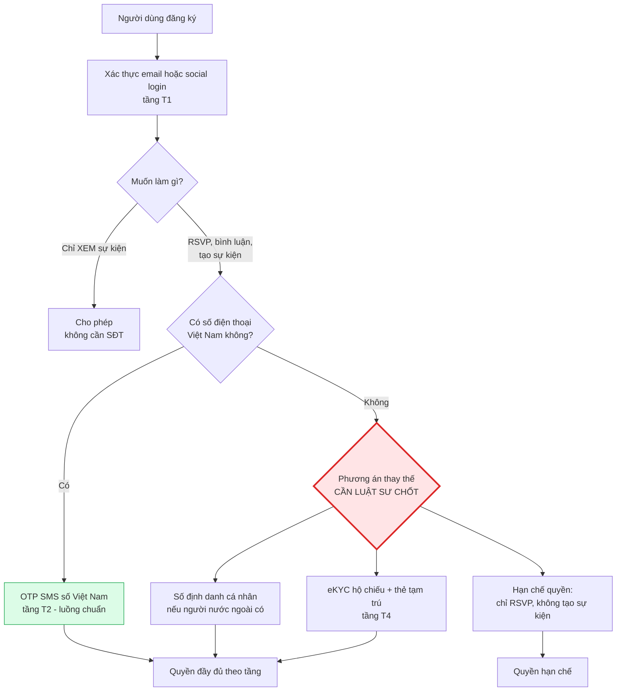

> 🔴 **Câu hỏi bắt buộc gửi luật sư, ưu tiên cao nhất, cần trả lời trước Sprint 1 (bắt đầu 21/09/2026):**
> 1. Nghĩa vụ xác thực bằng số điện thoại Việt Nam áp dụng cho **mọi tài khoản** hay chỉ tài khoản **đăng tải nội dung**?
> 2. Số điện thoại nước ngoài đã xác thực OTP có được chấp nhận không? Nếu không, căn cứ nào?
> 3. Người nước ngoài cư trú hợp pháp có "số định danh cá nhân" theo nghĩa của quy định không? Nếu có thì lấy từ đâu — thẻ tạm trú, thị thực, hay mã số thuế cá nhân?
> 4. Nếu app chỉ cho phép người chưa xác thực **xem** và **RSVP** (không đăng nội dung), thì có thoả mãn quy định không?
> 5. Rủi ro thực tế nếu triển khai P3 mà cách hiểu sau này bị coi là chưa đủ: mức xử phạt nào, có bị đình chỉ dịch vụ không?
>
> **Nguyên tắc quyết định:** nếu luật sư không trả lời được dứt khoát, chọn phương án **hạn chế hơn** (P3 với nhánh mặc định là P1), rồi nới ra khi có ý kiến chính thức. Nới quyền dễ hơn thu hồi quyền.

### 5.5 Quảng cáo trong ứng dụng

Mô hình kiếm tiền ở giai đoạn tăng trưởng có quảng cáo in-app. Ràng buộc cần biết trước khi thiết kế:

| Ràng buộc | Nội dung | Mức |
|---|---|---|
| Phân biệt nội dung và quảng cáo | Nội dung quảng cáo phải được **nhận biết rõ ràng**, gắn nhãn "Quảng cáo" / "Sponsored" | 🟢 |
| Cho phép tắt/bỏ qua quảng cáo | Quảng cáo không được che nội dung chính, phải có nút đóng ở vị trí cố định, dễ thấy | 🟡 |
| Cấm quảng cáo rượu ≥ 15 độ | Áp dụng cả với nội dung do đối tác trả tiền | 🟢 |
| Hạn chế quảng cáo bia và rượu dưới 15 độ | Không hướng tới người dưới 18 tuổi, phải có cảnh báo theo quy định | 🟢 |
| Quảng cáo dịch vụ y tế, thực phẩm chức năng, mỹ phẩm | Phải có **xác nhận nội dung quảng cáo** của cơ quan y tế trước khi phát hành | 🟢 — rất quan trọng cho Giai đoạn 3 |
| Quảng cáo dịch vụ bất động sản | Phải đúng thông tin dự án, dự án đủ điều kiện kinh doanh | 🟢 — Giai đoạn 2 |
| Trách nhiệm của người phát hành quảng cáo | Nền tảng chịu trách nhiệm với quảng cáo phát trên nền tảng của mình, kể cả từ mạng quảng cáo bên thứ ba | 🟡 |

> ⚙️ **`LEGAL-09`** — nếu tích hợp mạng quảng cáo bên thứ ba, phải bật danh mục chặn (category blocklist) cho: rượu mạnh, cờ bạc, tiền mã hoá, dịch vụ y tế không xác thực, cho vay ngang hàng. Đây là cấu hình phải làm ngay lúc tích hợp, không phải "khi có vấn đề".

---

## 6. Thương mại điện tử và thanh toán

### 6.1 Giai đoạn 1 chạm tới đâu

| Hoạt động của Giai đoạn 1 | Có thuộc phạm vi thương mại điện tử? | Ghi chú |
|---|---|---|
| Tạo và tham gia sự kiện miễn phí | ❌ Không | Không có giao dịch |
| Gói premium (lọc nâng cao, ẩn quảng cáo) bán qua App Store / Google Play | 🟡 Một phần | Giao dịch do store thực hiện; nghĩa vụ chính là **thuế và hoá đơn** |
| Gói premium bán qua website, thanh toán bằng cổng nội địa | ✅ Có | Website trở thành **website thương mại điện tử bán hàng** → nghĩa vụ thông báo/đăng ký 🟡 |
| Sự kiện có thu phí do organizer tổ chức, tiền đi trực tiếp organizer ↔ người tham gia | 🟡 Ranh giới | Nếu nền tảng chỉ hiển thị thông tin, không xử lý tiền → rủi ro thấp; nếu nền tảng giữ tiền hoặc thu hộ → thành **nền tảng số trung gian** 🔴 |
| Danh sách quán, địa điểm có gắn link đặt chỗ bên ngoài | ❌ Không, nếu chỉ là liên kết | Không được nhận hoa hồng theo giao dịch mà không khai báo |

> 🟢 **Khuyến nghị chốt cho Giai đoạn 1:** **không xử lý dòng tiền giữa organizer và người tham gia.** Sự kiện có phí thì ghi rõ "thu tại chỗ" hoặc "organizer tự thu", nền tảng chỉ hiển thị mức phí. Điều này giữ Giai đoạn 1 nằm ngoài phần lớn nghĩa vụ thương mại điện tử và tránh hoàn toàn nghĩa vụ trung gian thanh toán. Đúng tinh thần brief: *"không có bên thứ ba trong giao dịch tiền"*.

### 6.2 Khi nào trở thành "nền tảng số trung gian"

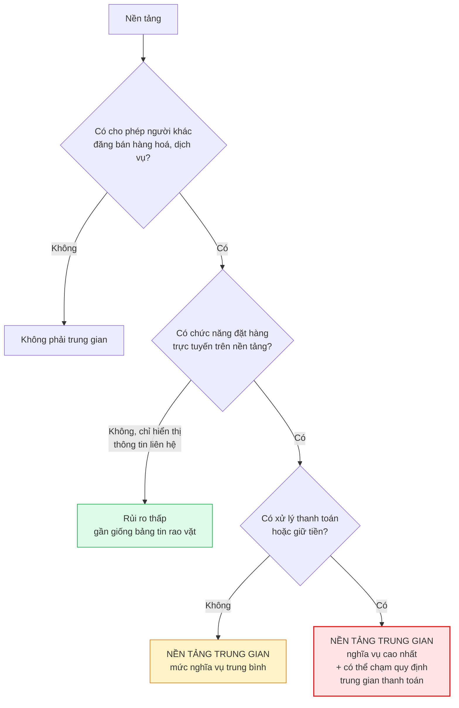

| Nghĩa vụ khi là nền tảng trung gian | Giai đoạn áp dụng | Mức |
|---|---|---|
| Thông báo/đăng ký hoạt động với cơ quan quản lý thương mại điện tử | GĐ2, GĐ3 | 🟢 |
| Công bố quy chế hoạt động của nền tảng | GĐ2, GĐ3 | 🟢 |
| Xác minh danh tính người bán (định danh người bán trên nền tảng) | GĐ2, GĐ3 | 🟢 |
| Lưu trữ thông tin giao dịch | GĐ2, GĐ3 | 🟢 |
| Cơ chế tiếp nhận và giải quyết khiếu nại, tranh chấp | GĐ2, GĐ3 | 🟢 |
| Gỡ bỏ thông tin hàng hoá, dịch vụ vi phạm | GĐ2, GĐ3 | 🟢 |
| Trách nhiệm liên đới trong một số trường hợp | GĐ2, GĐ3 | 🟡 |
| Nghĩa vụ hỗ trợ cơ quan thuế về thông tin người bán | GĐ2, GĐ3 | 🟡 |

> 🔴 **Quyết định chiến lược cần luật sư trước khi khởi động Giai đoạn 2:** mô hình nhà ở sẽ là *bảng tin đăng tin* (rủi ro thấp, doanh thu từ phí niêm yết) hay *nền tảng giao dịch* (rủi ro cao, doanh thu từ hoa hồng). Hai lựa chọn này khác nhau về nghĩa vụ pháp lý gấp nhiều lần. Quyết định này phải có trước khi viết dòng code đầu tiên của Giai đoạn 2.

### 6.3 Thanh toán trong ứng dụng

| Trường hợp | Kênh bắt buộc | Ghi chú |
|---|---|---|
| Bán tính năng số trong app iOS/Android (gói premium, ẩn quảng cáo) | **Bắt buộc dùng In-App Purchase** của Apple/Google | Chính sách hai store; vi phạm là bị gỡ app |
| Bán gói premium trên **web** | Cổng thanh toán nội địa hoặc quốc tế | Được phép; Apple/Google không kiểm soát kênh web |
| Vé sự kiện của bên thứ ba (organizer) | 🟡 Ranh giới — hàng hoá/dịch vụ vật lý ngoài app thường được miễn IAP | Cần đọc kỹ điều khoản hiện hành; **Giai đoạn 1 khuyến nghị không bán vé trong app** |
| Hoàn tiền | Theo chính sách store với IAP; theo chính sách riêng với kênh web | 📄 Phải có Refund Policy |

| Nghĩa vụ hoá đơn và thuế | Chi tiết | Mức |
|---|---|---|
| Hoá đơn điện tử | Bắt buộc với mọi doanh thu; phải đăng ký với cơ quan thuế | 🟢 |
| Thuế GTGT đầu ra | Áp dụng cho dịch vụ số bán trong nước | 🟢 |
| Doanh thu thu qua App Store / Google Play | Store giữ hoa hồng, chuyển phần còn lại; phần hoa hồng làm phát sinh nghĩa vụ **thuế nhà thầu** — xem 7.4 | 🔴 |
| Người mua là người nước ngoài nhưng đang ở Việt Nam | Nơi tiêu dùng dịch vụ là Việt Nam → vẫn chịu thuế Việt Nam | 🟡 |

---

## 7. Pháp nhân, ngành nghề và thuế

### 7.1 Hộ kinh doanh hay công ty TNHH

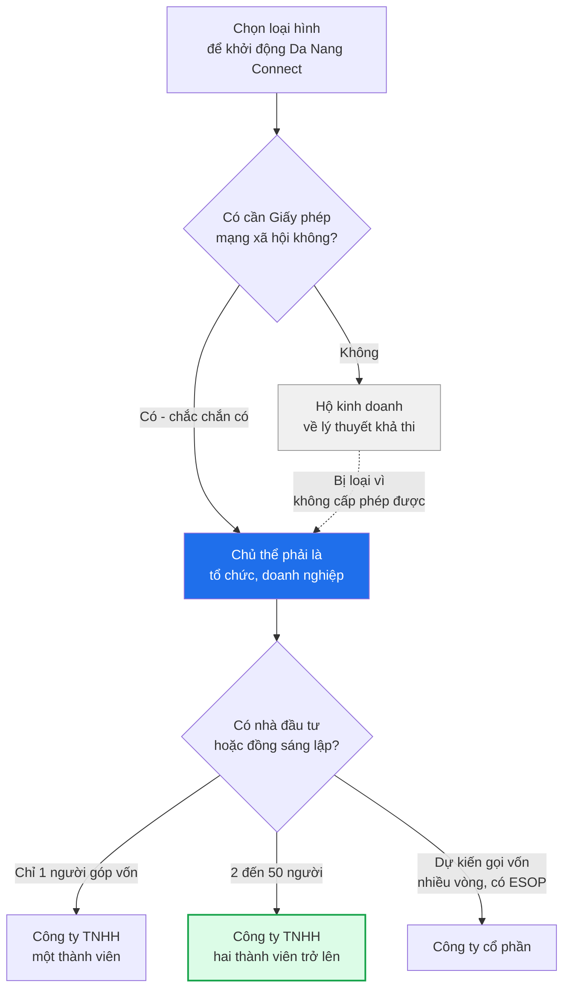

| Tiêu chí | Hộ kinh doanh | Công ty TNHH 1 TV | Công ty TNHH 2 TV+ | Công ty cổ phần |
|---|---|---|---|---|
| Tư cách pháp nhân | ❌ Không | ✅ Có | ✅ Có | ✅ Có |
| Trách nhiệm tài sản | **Vô hạn** — chủ hộ chịu bằng toàn bộ tài sản cá nhân | Hữu hạn trong vốn góp | Hữu hạn | Hữu hạn |
| Được cấp Giấy phép mạng xã hội | ❌ **Không** — điều kiện yêu cầu tổ chức/doanh nghiệp | ✅ | ✅ | ✅ |
| Ký hợp đồng với Apple/Google với tư cách tổ chức | ⚠️ Khó, thường phải dùng tài khoản cá nhân | ✅ | ✅ | ✅ |
| Nhận vốn đầu tư | ❌ Rất khó | ⚠️ Phải chuyển đổi | ✅ | ✅ Dễ nhất |
| Chia quyền sở hữu cho đồng sáng lập | ❌ Không | ❌ Không | ✅ | ✅ |
| ESOP cho nhân sự | ❌ | ❌ | ⚠️ Phức tạp | ✅ |
| Chi phí thành lập | Thấp nhất | Thấp | Thấp | Trung bình |
| Chi phí kế toán hằng tháng | Thấp | Trung bình | Trung bình | Cao hơn |
| Thuế | Từ 2026 bỏ thuế khoán, phải kê khai như doanh nghiệp 🟡 | TNDN + GTGT | TNDN + GTGT | TNDN + GTGT |
| Ưu đãi thuế cho DNNVV mới thành lập | ❌ | ✅ | ✅ | ✅ |
| **Kết luận** | ❌ **Loại** | 🟡 Được, nếu chắc chắn một chủ sở hữu | ✅ **Khuyến nghị** | 🟡 Chỉ khi đã có cam kết đầu tư |

> 🟢 **Khuyến nghị:** **Công ty TNHH hai thành viên trở lên**, trừ khi chỉ có đúng một người góp vốn thì chọn TNHH một thành viên. Lý do dứt điểm: điều kiện cấp Giấy phép mạng xã hội loại bỏ hộ kinh doanh, và chuyển đổi loại hình về sau tốn thời gian đúng vào lúc đang chạy nước rút ra mắt.
>
> 🟡 **Lưu ý về thuế khoán:** cơ chế thuế khoán cho hộ kinh doanh đã bị bãi bỏ trong lộ trình cải cách; lợi thế "đơn giản về thuế" của hộ kinh doanh gần như không còn. Đây là một lý do nữa để bỏ qua phương án này.

### 7.2 Ngành nghề đăng ký kinh doanh

Bảng mã ngành tham khảo. Đăng ký thừa vài mã ngành không tốn thêm chi phí, nhưng thiếu mã ngành thì phải bổ sung giữa chừng và có thể làm chậm hồ sơ cấp phép.

| Mã | Tên ngành | Vì sao cần | Điều kiện? |
|---|---|---|---|
| 6201 | Lập trình máy vi tính | Ngành chính | Không |
| 6209 | Hoạt động dịch vụ công nghệ thông tin và dịch vụ khác liên quan đến máy vi tính | Bao phủ rộng | Không |
| 6311 | Xử lý dữ liệu, cho thuê và các hoạt động liên quan | Vận hành hạ tầng dữ liệu | Không |
| 6312 | Cổng thông tin | **Mã then chốt** cho hồ sơ mạng xã hội | 🟡 Có điều kiện khi hoạt động |
| 7310 | Quảng cáo | Doanh thu quảng cáo in-app ở giai đoạn tăng trưởng | Không |
| 8230 | Tổ chức giới thiệu và xúc tiến thương mại | Nếu tự tổ chức sự kiện ra mắt, sự kiện cộng đồng | Không |
| 9319 | Hoạt động thể thao khác | Sự kiện thể thao cộng đồng | Không |
| 8299 | Hoạt động dịch vụ hỗ trợ kinh doanh khác chưa được phân vào đâu | Mã dự phòng linh hoạt | Không |
| 5820 | Xuất bản phần mềm | Phát hành app trên store | Không |
| 6820 | Tư vấn, môi giới, đấu giá bất động sản | **Chỉ khi vào Giai đoạn 2** | ✅ Có điều kiện |
| 8690 | Hoạt động y tế khác chưa được phân vào đâu | **Chỉ khi vào Giai đoạn 3** | ✅ Có điều kiện |

> ⚠️ **Không đăng ký ngành dạy ngoại ngữ (8559) ở Giai đoạn 1.** Trao đổi ngôn ngữ (language exchange) giữa các cá nhân **không phải** hoạt động giáo dục có điều kiện. Đăng ký mã ngành này sẽ tự đưa mình vào diện phải xin phép hoạt động giáo dục — hoàn toàn không cần thiết. Nếu sau này thực sự mở lớp có thu học phí thì mới bổ sung.
>
> 🟡 Mã ngành và tên gọi có thể khác đôi chút tùy phiên bản hệ thống ngành kinh tế đang áp dụng. Đưa danh sách này cho đơn vị dịch vụ thành lập doanh nghiệp để họ ánh xạ sang mã hiện hành.

### 7.3 Nhà đầu tư hoặc đồng sáng lập nước ngoài

| Tình huống | Vấn đề | Mức |
|---|---|---|
| Toàn bộ vốn từ cá nhân/tổ chức Việt Nam | Không có vướng mắc về tiếp cận thị trường | 🟢 |
| Có phần vốn nước ngoài | Dịch vụ mạng xã hội, cổng thông tin thuộc nhóm ngành **nhạy cảm về nội dung**; nhà đầu tư nước ngoài có thể gặp hạn chế tiếp cận thị trường hoặc phải xin chấp thuận riêng | 🔴 |
| Người nước ngoài làm người đại diện theo pháp luật | Phải có giấy phép lao động hoặc thuộc diện miễn; đồng thời điều kiện cấp phép mạng xã hội có yêu cầu về nhân sự quản lý nội dung | 🔴 |
| Nhận đầu tư qua pháp nhân nước ngoài (cấu trúc offshore) | Phổ biến với startup nhưng làm phức tạp hồ sơ cấp phép trong nước | 🔴 |

> 🔴 **Bắt buộc hỏi luật sư trước khi nhận bất kỳ khoản vốn nước ngoài nào.** Sai lầm phổ biến: nhận tiền trước, cấu trúc pháp lý sau. Với ngành có yếu tố nội dung, làm ngược thứ tự này có thể khiến hồ sơ cấp phép bị treo vô thời hạn.
>
> **Khuyến nghị an toàn cho Giai đoạn 1:** thành lập công ty **100% vốn Việt Nam**, để việc gọi vốn nước ngoài sang giai đoạn sau khi đã có giấy phép và có luật sư đồng hành.

### 7.4 Thuế — bức tranh tổng thể

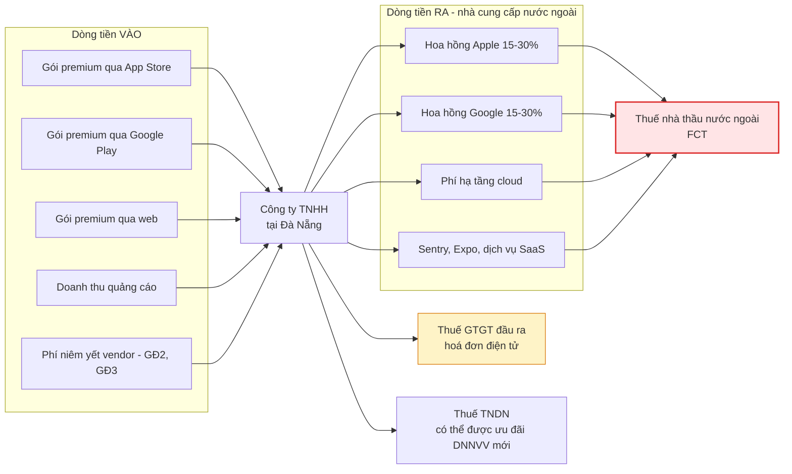

#### Thuế giá trị gia tăng

| Nội dung | Chi tiết | Mức |
|---|---|---|
| Thuế suất phổ thông | 10%, có giai đoạn được giảm còn 8% theo nghị quyết của Quốc hội | 🟡 — kế toán xác nhận thuế suất áp dụng tại thời điểm phát sinh |
| Phương pháp | Khấu trừ (mặc định với doanh nghiệp) | 🟢 |
| Hoá đơn điện tử | Bắt buộc, có mã của cơ quan thuế hoặc không mã tùy diện | 🟢 |
| Người mua là người nước ngoài đang ở Việt Nam | Vẫn là tiêu dùng tại Việt Nam | 🟡 |

#### Thuế thu nhập doanh nghiệp

| Nội dung | Chi tiết | Mức |
|---|---|---|
| Thuế suất phổ thông | 20% | 🟢 |
| Thuế suất ưu đãi cho doanh nghiệp nhỏ theo ngưỡng doanh thu | Có bậc thuế suất thấp hơn cho doanh nghiệp có doanh thu nhỏ | 🟡 |
| Miễn thuế cho doanh nghiệp nhỏ và vừa mới thành lập | Có chính sách miễn trong một số năm đầu | 🟡 — kế toán xác nhận điều kiện và thủ tục đăng ký hưởng |
| Ưu đãi cho hoạt động sản xuất phần mềm | Có mức ưu đãi riêng, nhưng phải chứng minh quy trình sản xuất phần mềm theo quy định | 🔴 — đáng theo đuổi vì mức ưu đãi lớn, nhưng hồ sơ chứng minh khá nặng |

#### Thuế nhà thầu nước ngoài (FCT) — điểm dễ sai nhất

Khi doanh nghiệp Việt Nam trả tiền cho nhà cung cấp nước ngoài không có hiện diện tại Việt Nam, thường phát sinh nghĩa vụ khấu trừ thuế nhà thầu.

| Khoản chi | Bản chất | Nghĩa vụ dự kiến | Mức |
|---|---|---|---|
| Hoa hồng App Store / Google Play trừ vào doanh thu | Dịch vụ phân phối | Có thể phát sinh FCT trên phần hoa hồng | 🔴 |
| Phí hạ tầng cloud nước ngoài | Dịch vụ | GTGT + TNDN nhà thầu theo tỷ lệ | 🟡 |
| Phí bản quyền phần mềm, license | Tiền bản quyền | Tỷ lệ TNDN riêng, GTGT có thể không áp dụng | 🟡 |
| Quảng cáo trên nền tảng nước ngoài đã đăng ký thuế tại Việt Nam | Nhà cung cấp tự kê khai | Bên mua có thể **không phải** khấu trừ | 🟡 |
| Dịch vụ SaaS nhỏ lẻ trả bằng thẻ tín dụng | Dịch vụ | Vẫn phát sinh nghĩa vụ dù giá trị nhỏ | 🟡 |

> 🔴 **Ba việc kế toán phải làm trước khi ký hợp đồng hạ tầng:**
> 1. Xác định với từng nhà cung cấp: họ **đã đăng ký thuế tại Việt Nam** chưa? Nếu rồi thì cơ chế khấu trừ khác hẳn.
> 2. Xác định điều khoản hợp đồng là **giá đã bao gồm thuế (gross)** hay **chưa bao gồm (net)**. Nếu net thì công ty phải gánh thêm phần thuế — ảnh hưởng trực tiếp tới ngân sách hạ tầng trong `08`.
> 3. Cơ chế thu thuế với nhà cung cấp nước ngoài đã thay đổi trong giai đoạn 2025–2026 theo hướng **ưu tiên khấu trừ tại nguồn** khi thanh toán. Phải đối chiếu văn bản đang hiệu lực tại thời điểm ký, không dựa vào bài viết cũ.
>
> ⚙️ **Hệ quả ngân sách:** phần FCT trên chi phí hạ tầng có thể làm tăng chi phí thực tế thêm khoảng 5–10%. Ngân sách hạ tầng trong `08-roadmap-va-ke-hoach-trien-khai.md` cần thêm một dòng dự phòng cho khoản này.

#### Nghĩa vụ khác

| Nghĩa vụ | Khi nào | Mức |
|---|---|---|
| Lệ phí môn bài | Hằng năm, theo mức vốn điều lệ; doanh nghiệp mới thành lập thường được miễn năm đầu | 🟢 |
| Thuế TNCN và bảo hiểm cho nhân sự | Từ khi có hợp đồng lao động | 🟢 |
| Thuế TNCN cho cộng tác viên, freelancer | Khấu trừ tại nguồn theo tỷ lệ | 🟢 |
| Thuế cho organizer nếu trả thù lao | 🟡 Nếu chi trả cho organizer để tổ chức sự kiện thì phát sinh nghĩa vụ khấu trừ | 🟡 |
| Báo cáo tài chính năm, quyết toán thuế | Hằng năm | 🟢 |

---

## 8. Rủi ro pháp lý khi curate nội dung từ nền tảng khác

Chiến lược ra mắt đã chốt trong brief và trong `01`, `05`, `08`: đội sáng lập **curate thủ công** sự kiện công khai từ Facebook, Meetup, WhatsApp, các trang sự kiện độc lập, và **tuyệt đối không dùng script tự động**. Mục này biến nguyên tắc đó thành quy tắc vận hành cụ thể.

### 8.1 Ba nhóm rủi ro tách bạch

| Nhóm | Nội dung rủi ro | Hậu quả thực tế | Mức |
|---|---|---|---|
| **A. Vi phạm điều khoản sử dụng của nền tảng nguồn** | Thu thập tự động vi phạm ToS của Facebook/Meetup | Khoá tài khoản dùng để curate; mất kênh phân phối; khiếu nại dân sự | 🟢 Chắc chắn có rủi ro nếu tự động hoá |
| **B. Quyền tác giả và quyền liên quan** | Sao chép nguyên văn mô tả sự kiện, **đặc biệt là ảnh** | Yêu cầu gỡ bỏ, khiếu nại bản quyền, DMCA takedown, có thể bị store cảnh cáo | 🟢 |
| **C. Dữ liệu cá nhân của bên thứ ba** | Đăng lại tên, ảnh, thông tin liên hệ của organizer gốc mà không có sự đồng ý của họ | Vi phạm pháp luật bảo vệ dữ liệu cá nhân; quyền hình ảnh theo Bộ luật Dân sự | 🟡 **Đây là nhóm rủi ro hay bị bỏ sót nhất** |

> ⚠️ **Điểm mù nguy hiểm nhất:** đa số đội ngũ chỉ lo nhóm A và B. Nhóm C mới là nhóm có chế tài hành chính rõ ràng tại Việt Nam. Đăng lại tên và ảnh của một organizer người nước ngoài lên nền tảng của mình mà không hỏi họ là hành vi xử lý dữ liệu cá nhân **không có cơ sở pháp lý**.

### 8.2 Nội dung curate KHÔNG được hưởng miễn trừ trung gian

Đây là kết luận quan trọng nhất của cả mục 8.

| Loại nội dung | Ai đăng | Trách nhiệm pháp lý của nền tảng | Quy trình duyệt |
|---|---|---|---|
| Sự kiện do organizer tự tạo trong app | Người dùng | Trách nhiệm **trung gian** — chịu trách nhiệm khi biết mà không gỡ | Hậu kiểm + báo cáo vi phạm |
| **Sự kiện do đội sáng lập curate và đăng** | **Doanh nghiệp** | Trách nhiệm **trực tiếp** như nội dung của chính mình | **Tiền kiểm bắt buộc** |
| Sự kiện đã chuyển giao cho organizer gốc quản lý | Người dùng | Trở lại trách nhiệm trung gian kể từ thời điểm chuyển giao | Hậu kiểm |

> 🟡 **Hệ quả vận hành ngược trực giác:** nội dung curate phải được duyệt **chặt hơn** UGC, không phải lỏng hơn. Nhiều đội làm ngược lại vì "đó là tin của mình, mình kiểm soát được rồi". Sai — chính vì là tin của mình nên không có ai để đổ trách nhiệm.
>
> ⚙️ **`LEGAL-10`** — bảng `events` cần cột `content_liability` với giá trị `first_party` / `user_generated`, gán tự động theo `collection_method` đã có trong `03-domain-va-du-lieu.md` (D-12). Admin Console lọc theo cột này để áp quy trình duyệt khác nhau.

### 8.3 Quy tắc curate an toàn — bảng ĐƯỢC và KHÔNG ĐƯỢC

| | Hành vi | Ghi chú |
|---|---|---|
| ✅ **ĐƯỢC** | Ghi lại **dữ kiện**: tên sự kiện, ngày giờ, địa điểm, mức phí, loại hình, ngôn ngữ | Dữ kiện thuần tuý không được bảo hộ quyền tác giả |
| ✅ **ĐƯỢC** | **Viết lại** mô tả bằng lời của mình, ngắn gọn 1–3 câu | Đây là công việc chính của Content Curator |
| ✅ **ĐƯỢC** | Ghi rõ **nguồn** và đặt liên kết trỏ về bài gốc | Vừa minh bạch, vừa là lý do tự nhiên để tiếp cận organizer |
| ✅ **ĐƯỢC** | Dùng ảnh **do đội tự chụp**, ảnh có giấy phép mở, hoặc ảnh minh hoạ mua bản quyền | An toàn tuyệt đối |
| ✅ **ĐƯỢC** | Dùng ảnh của organizer **sau khi họ đồng ý bằng văn bản** (tin nhắn cũng là văn bản) | Lưu ảnh chụp màn hình đồng ý |
| ✅ **ĐƯỢC** | Gỡ ngay lập tức khi organizer yêu cầu, không tranh luận | Quy tắc bất di bất dịch |
| ❌ **KHÔNG ĐƯỢC** | Chạy script, crawler, bot, tự động hoá bằng bất kỳ hình thức nào | Đã chốt ở brief; schema `03` có ràng buộc CHECK chặn từ gốc |
| ❌ **KHÔNG ĐƯỢC** | Sao chép nguyên văn mô tả dài của bài gốc | Rủi ro quyền tác giả rõ ràng |
| ❌ **KHÔNG ĐƯỢC** | Tải và đăng lại **ảnh** từ bài gốc | Rủi ro cao nhất trong nhóm B |
| ❌ **KHÔNG ĐƯỢC** | Đăng **họ tên đầy đủ, ảnh chân dung, số điện thoại, email** của organizer khi chưa xin phép | Nhóm C — vi phạm dữ liệu cá nhân |
| ❌ **KHÔNG ĐƯỢC** | Tạo tài khoản giả mạo organizer gốc trên app | Mạo danh, rủi ro pháp lý và uy tín nghiêm trọng |
| ❌ **KHÔNG ĐƯỢC** | Curate sự kiện từ **nhóm kín, nhóm riêng tư** | Không phải thông tin công khai; vi phạm kỳ vọng riêng tư |
| ❌ **KHÔNG ĐƯỢC** | Curate sự kiện có yếu tố nhạy cảm ở mục 11 | Rủi ro tồn vong |
| ❌ **KHÔNG ĐƯỢC** | Ghi tên organizer gốc theo cách khiến người đọc tưởng họ đã tham gia nền tảng | Gây nhầm lẫn, ảnh hưởng uy tín họ |

### 8.4 Quy trình curate có kiểm soát

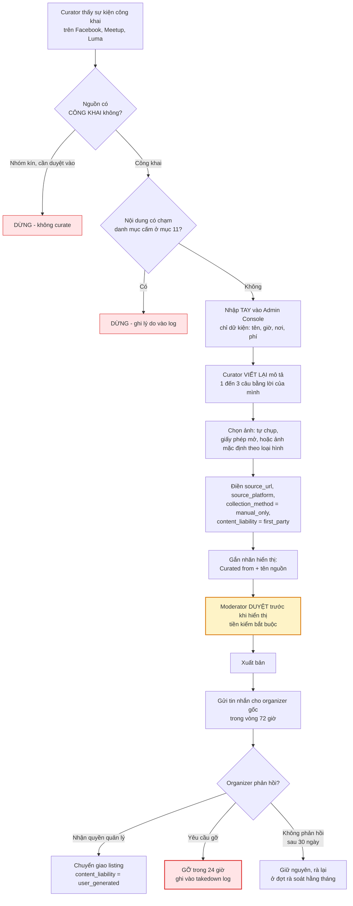

### 8.5 Trường dữ liệu bắt buộc cho mỗi bản ghi curate

| Trường | Kiểu | Bắt buộc | Ghi chú |
|---|---|---|---|
| `collection_method` | enum | ✅ | Chỉ nhận `manual_only`; ràng buộc CHECK đã có trong `03` |
| `content_liability` | enum | ✅ | `first_party` khi curate |
| `source_platform` | varchar | ✅ | `facebook`, `meetup`, `luma`, `whatsapp`, `other` |
| `source_url` | text | ✅ | Liên kết bài gốc |
| `source_captured_at` | timestamptz | ✅ | Thời điểm curator ghi nhận |
| `curated_by_user_id` | uuid | ✅ | Ai chịu trách nhiệm bản ghi này |
| `original_organizer_contact` | text | ⚠️ | **Lưu ở trường nội bộ, không hiển thị công khai** |
| `outreach_status` | enum | ✅ | `not_contacted`, `contacted`, `claimed`, `takedown_requested` |
| `outreach_sent_at` | timestamptz | | Bằng chứng đã chủ động liên hệ trong 72 giờ |
| `image_source` | enum | ✅ | `own_photo`, `licensed`, `default_placeholder`, `organizer_permission` |
| `image_permission_evidence` | text | ⚠️ | Bắt buộc khi `image_source = organizer_permission` |
| `takedown_requested_at` | timestamptz | | |
| `takedown_completed_at` | timestamptz | | SLA 24 giờ |

> ⚙️ **`LEGAL-11`** — Admin Curation Console phải **chặn nút Xuất bản** nếu thiếu bất kỳ trường bắt buộc nào ở trên. Đây là tuân thủ ở tầng công cụ, mạnh hơn nhiều so với tuân thủ ở tầng quy trình giấy.

### 8.6 Mẫu tin nhắn tiếp cận organizer gốc

**Bản tiếng Anh (mặc định — đối tượng là expat):**

> Hi [Name], I'm [Your name] from Da Nang Connect, a community app for expats in Da Nang.
> We listed your public event "[Event name]" on [date] so people searching for activities in [area] can find it. We wrote our own short summary and linked back to your original post — we did not copy your text or photos.
> [X] people have already saved it on our app.
> Two things:
> 1. If you'd like to manage this listing yourself — edit details, see who's coming, message attendees — we'll transfer it to your account for free.
> 2. If you'd rather we remove it, just say the word and it's gone within 24 hours, no questions asked.
> Thanks for what you're doing for the community.

**Bản tiếng Việt (dùng khi organizer là người Việt):**

> Chào anh/chị [Tên], mình là [Tên] từ Da Nang Connect — ứng dụng kết nối cộng đồng người nước ngoài tại Đà Nẵng.
> Mình có đăng lại sự kiện công khai "[Tên sự kiện]" ngày [ngày] để những người đang tìm hoạt động ở khu [khu vực] tìm thấy. Phần mô tả mình tự viết lại và có gắn liên kết về bài gốc, không sao chép nội dung hay ảnh của anh/chị.
> Hiện đã có [X] người quan tâm trên app.
> Hai điều mình muốn hỏi:
> 1. Anh/chị có muốn tự quản lý tin này không? Sửa thông tin, xem ai đăng ký, nhắn tin cho người tham gia — mình chuyển quyền miễn phí.
> 2. Nếu anh/chị muốn gỡ, chỉ cần nhắn một câu, mình gỡ trong vòng 24 giờ, không hỏi lý do.
> Cảm ơn anh/chị vì những gì đang làm cho cộng đồng.

> 📄 Lưu mẫu này vào `packages/i18n` hoặc `ops/templates/outreach/` để mọi curator dùng thống nhất. **Không được** dùng mẫu có ngôn ngữ ngụ ý organizer đã đồng ý hoặc đã hợp tác.

### 8.7 Quy trình gỡ nội dung theo yêu cầu (takedown)

| Nguồn yêu cầu | SLA | Người xử lý | Có được tranh luận? |
|---|---|---|---|
| Organizer gốc yêu cầu gỡ tin curate | **24 giờ** | Curator hoặc Moderator trực | ❌ Không — gỡ trước, hỏi sau nếu cần |
| Chủ sở hữu quyền tác giả (ảnh, văn bản) | **24 giờ** | Moderator | ❌ Không |
| Cá nhân yêu cầu gỡ thông tin cá nhân của mình | **72 giờ** theo quyền chủ thể dữ liệu, nhưng nên làm trong 24 giờ | Moderator | ❌ Không |
| Cơ quan nhà nước có thẩm quyền | Theo thời hạn nêu trong văn bản, thường tính bằng giờ | Người đại diện theo pháp luật | ❌ Không — nhưng phải xác minh tính hợp lệ của văn bản trước |
| Apple / Google chuyển tiếp khiếu nại | Theo hạn store nêu | Moderator + Founder | ❌ Không |

> ⚙️ **`LEGAL-12`** — bảng `takedown_requests` với các trường: nguồn yêu cầu, loại, đối tượng bị gỡ, thời điểm nhận, thời điểm gỡ, người xử lý, bằng chứng. Bảng này là hồ sơ chứng minh nền tảng có cơ chế phản hồi hiệu quả — cần khi làm việc với cơ quan quản lý và khi bị khiếu nại lên store.

---

## 9. Yêu cầu của App Store và Google Play

Đây là "luật" thứ hai mà sản phẩm phải tuân thủ, và trong thực tế nó được thực thi **nhanh hơn và cứng hơn** luật nhà nước: hồ sơ bị từ chối là chậm ra mắt ngay lập tức. Roadmap `08` đặt M6 vào 25/02/2027 — mỗi vòng từ chối review làm mất 3–7 ngày.

### 9.1 Bảng đối chiếu yêu cầu ↔ hạng mục sản phẩm

| # | Yêu cầu | Apple | Google Play | Đã có trong tài liệu nào | Mốc |
|---|---|---|---|---|---|
| 1 | **Xoá tài khoản ngay trong app** | ✅ Bắt buộc | ✅ Bắt buộc, **và phải có cả đường dẫn web** | `02` UC-10, `08` E8-S7 | M4 |
| 2 | Cơ chế lọc nội dung phản cảm với UGC | ✅ Bắt buộc | ✅ Bắt buộc | `05` blocklist + pre-publish | M4 |
| 3 | Cơ chế **báo cáo** nội dung/người dùng | ✅ Bắt buộc | ✅ Bắt buộc | `05` EP-09 | M4 |
| 4 | Cơ chế **chặn** người dùng khác | ✅ Bắt buộc | ✅ Bắt buộc | `05` block | M4 |
| 5 | Công bố **thông tin liên hệ** của nhà phát triển trong app | ✅ Bắt buộc | ✅ Bắt buộc | Mục 10 | M4 |
| 6 | **EULA / Terms** hiển thị được, chấp nhận được | ✅ | ✅ | Mục 10 | M4 |
| 7 | Hành động với báo cáo trong **24 giờ** với nội dung nghiêm trọng | ✅ Kỳ vọng rõ | ✅ | `05` SLA | M4 |
| 8 | **Sign in with Apple** khi có social login khác | ✅ Bắt buộc | — | `01`, `03`, `08` E2-S4 | M1 |
| 9 | **Privacy nutrition labels** khai đúng | ✅ Bắt buộc | — | Bảng 3.3 | M5 |
| 10 | **Data safety form** khai đúng | — | ✅ Bắt buộc | Bảng 3.3 | M5 |
| 11 | **Privacy manifest** cho SDK bên thứ ba | ✅ Bắt buộc | — | ⚙️ Kiểm tra mọi SDK Expo dùng | M5 |
| 12 | Phân loại độ tuổi khai đúng | ✅ | ✅ (qua IARC) | Mục 9.4 | M5 |
| 13 | Chính sách quyền riêng tư có URL công khai | ✅ | ✅ | Mục 10 | M4 |
| 14 | Target API level đúng hạn | — | ✅ Bắt buộc, hạn cứng hằng năm | ⚙️ Nâng Expo SDK theo lịch | Liên tục |
| 15 | Không thu thập dữ liệu ngoài phạm vi đã khai | ✅ | ✅ | Bảng 3.3 | Liên tục |
| 16 | Xin quyền vị trí có giải thích rõ mục đích | ✅ Chuỗi `NSLocationWhenInUseUsageDescription` | ✅ | ⚙️ | M2 |
| 17 | In-App Purchase cho nội dung số | ✅ | ✅ | Mục 6.3 | Khi bật premium |

### 9.2 Xoá tài khoản trong app — đặc tả bắt buộc

Đây là yêu cầu bị từ chối review nhiều nhất với app có tài khoản. Cả hai store đều coi đây là điều kiện cứng.

| Yêu cầu cụ thể | Chi tiết | Mức |
|---|---|---|
| Vị trí | Phải **tìm được trong app**, không được chỉ có ở web | 🟢 |
| Số bước | Không được chôn quá sâu; khuyến nghị ≤ 3 bước từ màn hình Settings | 🟢 |
| Không được chỉ "vô hiệu hoá" | Phải xoá **tài khoản và dữ liệu**, không chỉ ẩn | 🟢 |
| Không được bắt gửi email hoặc gọi điện | Phải làm được hoàn toàn trong app | 🟢 |
| Google Play bổ sung | Phải có **đường dẫn web công khai** để yêu cầu xoá, khai trong Play Console | 🟢 |
| Cho phép xoá một phần | Nếu app cho xoá dữ liệu mà giữ tài khoản, phải nêu rõ hai lựa chọn | 🟡 |
| Nếu có ràng buộc pháp lý phải giữ lại dữ liệu | Được phép, nhưng **phải nói rõ với người dùng** loại dữ liệu nào giữ lại và vì sao | 🟢 |

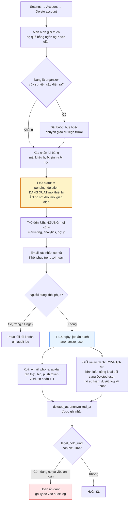

| Dữ liệu | Xử lý khi xoá tài khoản | Lý do giữ lại (nếu giữ) |
|---|---|---|
| Email, số điện thoại, tên thật | Xoá hoặc băm một chiều | — |
| Ảnh đại diện, ảnh do người dùng tải lên | Xoá khỏi object storage | — |
| Vị trí thiết bị | Xoá ngay lập tức, không chờ 14 ngày | Dữ liệu nhạy cảm |
| Push token | Xoá ngay | — |
| Tin nhắn 1-1 | Xoá phía người gửi; phía người nhận đổi thành "Deleted user" | Quyền của người còn lại trong cuộc trò chuyện 🟡 |
| Bình luận công khai | Giữ nội dung, đổi tác giả thành "Deleted user" | Toàn vẹn thảo luận cộng đồng 🟡 |
| Lịch sử RSVP, check-in | Ẩn danh, giữ số liệu tổng hợp | Số liệu vận hành sự kiện |
| Hồ sơ kiểm duyệt, báo cáo vi phạm | **Giữ** theo thời hạn đã công bố | An toàn cộng đồng, chống né lệnh cấm |
| Log kỹ thuật, IP đăng nhập | **Giữ** theo thời hạn luật định | Nghĩa vụ pháp luật — mục 5.3 |

> 📄 **Bắt buộc ghi vào Privacy Policy** đúng bảng trên. Nếu app giữ lại bất cứ thứ gì sau khi "xoá tài khoản" mà không nói trước, đó vừa là rủi ro bị từ chối review, vừa là rủi ro pháp lý.

### 9.3 Yêu cầu riêng cho app có nội dung do người dùng tạo

Apple có một điều khoản riêng cho UGC, yêu cầu app phải có **đủ bốn thứ**. Thiếu một là bị từ chối:

| # | Yêu cầu | Hiện thực trong Da Nang Connect | Mốc |
|---|---|---|---|
| 1 | **Phương pháp lọc** nội dung phản cảm trước khi đăng | Blocklist từ khoá + pre-publish review cho tầng thấp và nội dung nhạy cảm (`05`) | M4 |
| 2 | **Cơ chế báo cáo** nội dung phản cảm, có phản hồi kịp thời | Nút Report ở mọi sự kiện, bình luận, hồ sơ; hàng đợi kiểm duyệt; SLA 24 giờ | M4 |
| 3 | **Chặn người dùng** lạm dụng | Block hai chiều: người bị chặn không thấy nội dung, không nhắn tin được, không RSVP cùng sự kiện được 🟡 | M4 |
| 4 | **Thông tin liên hệ** công bố để người dùng liên hệ nhanh | `support@` + form trong app + địa chỉ trụ sở | M4 |

> ⚙️ **`LEGAL-13`** — Ba màn hình phải có trước khi nộp review lần đầu: `Report content`, `Block user`, `Contact us`. Không có đủ ba màn hình này thì **không nộp**, để tránh mất một vòng review.

### 9.4 Phân loại độ tuổi

| Nội dung trong app | Ảnh hưởng đến phân loại |
|---|---|
| UGC không kiểm duyệt hoàn toàn | Đẩy phân loại lên mức cao hơn |
| Sự kiện tại quán bar, pub crawl, đề cập rượu bia | Đẩy lên mức có nội dung rượu bia |
| Chức năng nhắn tin không giới hạn giữa người lạ | Đẩy lên mức cao hơn, cả hai store đều nhạy cảm với điểm này |
| Gặp mặt ngoài đời thực (real-world meetup) | Cả hai store yêu cầu khai báo rõ |
| Không có nội dung tình dục, bạo lực, cờ bạc | Giữ mức không quá cao |

| Quyết định đề xuất | Nội dung | Mức |
|---|---|---|
| Độ tuổi tối thiểu trong Terms of Service | **18 tuổi** | 🟢 (xem lý do ở 3.10) |
| Age gate ở đăng ký | Nhập năm sinh, chặn dưới 18 | 🟢 |
| Khai báo phân loại tuổi trên store | Khai đúng: có UGC, có nhắn tin giữa người lạ, có đề cập rượu bia, có tính năng gặp mặt ngoài đời | 🟢 |
| Không tham gia chương trình dành cho gia đình/trẻ em | Tránh hoàn toàn | 🟢 |

> ⚠️ **Sai lầm phải tránh:** khai phân loại tuổi thấp để tiếp cận nhiều người hơn. Cả hai store đều rà soát lại và **gỡ app** nếu phát hiện khai sai, và lần khai lại sẽ bị soi kỹ hơn.

### 9.5 Khai báo quyền riêng tư trên store

Bảng dưới dùng chung cho nhãn quyền riêng tư của App Store và form Data Safety của Google Play. Lấy thẳng từ bảng ROPA ở 3.3 — **không khai lại từ đầu**, vì mọi mâu thuẫn giữa hai bản khai là rủi ro.

| Loại dữ liệu | Có thu thập? | Liên kết với danh tính? | Dùng để theo dõi? | Mục đích khai báo |
|---|---|---|---|---|
| Email | ✅ | ✅ | ❌ | Chức năng ứng dụng |
| Số điện thoại | ✅ | ✅ | ❌ | Chức năng ứng dụng, xác thực |
| Tên, ảnh đại diện | ✅ | ✅ | ❌ | Chức năng ứng dụng |
| **Vị trí chính xác** | ✅ (tuỳ chọn) | ✅ | ❌ | Chức năng ứng dụng |
| Vị trí gần đúng | ✅ | ✅ | ❌ | Chức năng ứng dụng |
| Nội dung người dùng tạo | ✅ | ✅ | ❌ | Chức năng ứng dụng |
| Danh bạ | ❌ **Không thu thập** | — | — | — |
| Định danh thiết bị | ✅ (push token) | ✅ | ❌ | Chức năng ứng dụng |
| Dữ liệu sử dụng | ✅ (nếu bật analytics) | ⚠️ Nên khai không liên kết | ❌ | Phân tích |
| Dữ liệu chẩn đoán | ✅ (Sentry) | ❌ | ❌ | Phân tích lỗi |
| Thông tin tài chính | ❌ | — | — | Không xử lý thanh toán ở GĐ1 |
| Dữ liệu sức khoẻ | ❌ | — | — | Giai đoạn 3 sẽ phải khai lại |

> ⚙️ **`LEGAL-14`** — Không bật SDK theo dõi quảng cáo (advertising tracking) ở Giai đoạn 1. Ngay khi khai "dùng để theo dõi", app phải hiển thị hộp thoại xin phép theo dõi trên iOS, tỷ lệ đồng ý rất thấp, và nghĩa vụ khai báo nặng thêm — không đáng khi chưa có doanh thu quảng cáo.

### 9.6 Các lý do bị từ chối phổ biến và cách phòng

| Lý do từ chối | Xác suất với app này | Cách phòng |
|---|---|---|
| Thiếu chức năng xoá tài khoản | **Cao** | Làm ở M4, kiểm thử bằng tài khoản thật trước khi nộp |
| Thiếu Sign in with Apple khi có Google login | **Cao** | Đã có trong `08` E2-S4 |
| Nội dung UGC thiếu công cụ báo cáo/chặn | **Cao** | `LEGAL-13` |
| "App trống", ít nội dung khi reviewer mở | **Rất cao** với app cộng đồng mới | Chuẩn bị **tài khoản demo** có sẵn dữ liệu; ghi thông tin đăng nhập demo vào App Review Notes; đảm bảo ≥ 80 sự kiện thật như gate M6 |
| Reviewer ở nước ngoài không thấy nội dung vì app lọc theo vị trí Đà Nẵng | **Cao** — đây là bẫy đặc thù của sản phẩm hyperlocal | ⚙️ Không chặn cứng theo vị trí; mặc định hiển thị Đà Nẵng cho mọi vị trí; ghi rõ trong Review Notes |
| Khai báo quyền riêng tư không khớp hành vi thật | Trung bình | Bảng 9.5 là nguồn duy nhất |
| Xin quyền vị trí mà không giải thích | Trung bình | Chuỗi mô tả quyền viết bằng tiếng Anh rõ ràng, có bản dịch tiếng Việt |
| Đăng nhập bắt buộc để xem nội dung cơ bản | Trung bình | Cho phép xem danh sách sự kiện ở chế độ khách (đã có trong ma trận tầng T0 của `05`) |
| Metadata có nhắc tên nền tảng khác (Facebook, Meetup) | Trung bình | Không so sánh trực tiếp với đối thủ trong mô tả trên store |
| Dùng bản đồ có tranh chấp chủ quyền | Thấp với store, **cao với pháp luật Việt Nam** | Mục 11.2 |

> ⚙️ **`LEGAL-15`** — Tạo và duy trì tài khoản `reviewer@` với dữ liệu mẫu đầy đủ, không hết hạn, không cần OTP số Việt Nam. Đây là hạng mục hay bị quên và làm mất trọn một vòng review.

---

## 10. Bộ tài liệu pháp lý phải chuẩn bị

### 10.1 Danh mục tổng hợp

| # | Tài liệu | Ngôn ngữ | Ai soạn | Ai duyệt | Hạn chót | Công bố ở đâu |
|---|---|---|---|---|---|---|
| 1 | **Terms of Service** | EN chính + VI | Luật sư dựa trên bản nháp của đội | Luật sư | M4 · 27/11/2026 | `/legal/terms`, trong app, link ở store |
| 2 | **Privacy Policy** | **EN + VI, cả hai đều đầy đủ** | Luật sư | Luật sư | M4 | `/legal/privacy` — URL bắt buộc cho cả hai store |
| 3 | **Community Guidelines** | EN chính + VI | Đội (Community Manager) | Founder + Luật sư rà | M4 | `/legal/community`, trong app |
| 4 | **Quy chế quản lý, cung cấp và sử dụng dịch vụ** | **VI là bản có hiệu lực** | Luật sư | Luật sư | Trước hồ sơ thông báo dịch vụ | `/legal/content-policy` |
| 5 | **Organizer Agreement** | EN + VI | Luật sư | Luật sư | M5 · 25/12/2026 | Hiển thị khi lần đầu tạo sự kiện |
| 6 | **Cookie / Tracking Notice** | EN + VI | Đội | Luật sư rà | M4 | Banner trên web |
| 7 | **Refund Policy** | EN + VI | Đội | Luật sư | Khi bật gói premium | `/legal/refunds` |
| 8 | **Event Safety Disclaimer** | EN + VI | Đội | Luật sư | M4 | Hiển thị trên trang chi tiết sự kiện |
| 9 | **Photo & Media Consent** | EN + VI | Đội | Luật sư | M5 | Màn hình check-in |
| 10 | **DPIA** | VI | Đội + Luật sư | Người đại diện theo pháp luật | Ra mắt + 60 ngày | Nội bộ, nộp A05 |
| 11 | **TIA** | VI | Đội + Luật sư | Người đại diện theo pháp luật | Ra mắt + 60 ngày | Nội bộ, nộp A05 |
| 12 | **ROPA — hồ sơ hoạt động xử lý dữ liệu** | VI | Đội | DPO | M4 | Nội bộ |
| 13 | **DPA với từng nhà cung cấp** | EN hoặc VI | Nhà cung cấp cung cấp mẫu | Luật sư rà | Trước khi đưa vào production | Nội bộ |
| 14 | **Quy trình phản hồi cơ quan nhà nước** | VI | Luật sư | Founder | M5 | Nội bộ |
| 15 | **Runbook sự cố dữ liệu** | VI | Tech Lead | Founder | M5 | `ops/runbooks/` |
| 16 | **Nội quy lao động, hợp đồng lao động, NDA** | VI | Đơn vị dịch vụ | Founder | Khi tuyển người đầu tiên | Nội bộ |

### 10.2 Terms of Service — dàn ý điều khoản

| Điều | Nội dung | Điểm cần lưu ý riêng cho dự án này |
|---|---|---|
| 1 | Định nghĩa, phạm vi áp dụng | Phân biệt rõ **Member**, **Organizer**, **Curated listing** |
| 2 | Điều kiện sử dụng | **Đủ 18 tuổi**; cư trú hoặc đang ở Đà Nẵng; một người một tài khoản |
| 3 | Tài khoản và xác thực | Nghĩa vụ cung cấp thông tin chính xác; quy tắc xác thực số điện thoại |
| 4 | Nội dung người dùng | Người dùng giữ quyền sở hữu, cấp cho nền tảng license phi độc quyền để hiển thị |
| 5 | Nội dung do nền tảng curate | Nêu rõ nền tảng có thể đăng lại sự kiện công khai, ghi nguồn, và gỡ theo yêu cầu |
| 6 | Quy tắc hành vi | Trỏ sang Community Guidelines, xác nhận Guidelines là một phần của ToS |
| 7 | **Miễn trừ trách nhiệm với sự kiện ngoài đời thực** | **Điều khoản quan trọng nhất.** Nền tảng không tổ chức, không kiểm tra an toàn, không đảm bảo sự kiện diễn ra, không chịu trách nhiệm với thiệt hại phát sinh khi gặp mặt |
| 8 | Giao dịch giữa người dùng | Nền tảng không phải bên tham gia; mọi khoản thu phí sự kiện là giữa organizer và người tham gia |
| 9 | Đình chỉ và chấm dứt | Căn cứ, quy trình, quyền khiếu nại |
| 10 | Sở hữu trí tuệ của nền tảng | Tên gọi, logo, mã nguồn |
| 11 | Gói trả phí, thanh toán, hoàn tiền | Trỏ sang Refund Policy |
| 12 | Giới hạn trách nhiệm | Giới hạn theo mức tối đa pháp luật cho phép |
| 13 | Luật áp dụng và giải quyết tranh chấp | **Pháp luật Việt Nam**; toà án hoặc trọng tài tại Việt Nam 🟡 |
| 14 | Thay đổi điều khoản | Thông báo trước; cách lấy lại sự chấp nhận |
| 15 | Thông tin liên hệ | Tên công ty, mã số doanh nghiệp, địa chỉ trụ sở, email, điện thoại |

> ⚠️ **Điều 7 và 8 là lá chắn chính của sản phẩm.** Sản phẩm đưa người lạ gặp nhau ngoài đời thực tại một thành phố nước ngoài. Nếu có sự cố — tai nạn, mất tài sản, xung đột — câu hỏi đầu tiên sẽ là nền tảng đã cảnh báo và giới hạn trách nhiệm đến đâu. Đừng để luật sư viết hai điều này theo mẫu chung.

### 10.3 Privacy Policy song ngữ — nguyên tắc

| Nguyên tắc | Lý do |
|---|---|
| **Cả hai bản EN và VI đều đầy đủ**, không phải bản tóm tắt | Người dùng là expat nên EN là bản họ đọc; cơ quan quản lý đọc bản VI |
| Ghi rõ **bản nào có hiệu lực khi có mâu thuẫn** | Khuyến nghị: bản tiếng Việt có hiệu lực với cơ quan nhà nước; bản tiếng Anh dùng để giải thích cho người dùng 🔴 hỏi luật sư |
| Có **phiên bản và ngày hiệu lực** ở đầu trang | Bắt buộc để đối chiếu với `consent_records.policy_version` |
| Có **lịch sử phiên bản** truy cập được | Chứng minh được đã hiển thị gì tại thời điểm người dùng đồng ý |
| Nêu **đầy đủ danh sách bên thứ ba** nhận dữ liệu, kèm quốc gia | Yêu cầu bắt buộc; lấy từ bảng 3.2 và 3.7 |
| Nêu **thời hạn lưu trữ cụ thể** cho từng loại dữ liệu | Không được viết "lưu trong thời gian cần thiết" |
| Nêu **quyền của chủ thể dữ liệu** và cách thực hiện | Bảng 3.5 |
| Nêu **ngoại lệ giữ dữ liệu do nghĩa vụ pháp luật** | Mục 5.3 |
| Có **đầu mối liên hệ về quyền riêng tư** | `privacy@` + tên người phụ trách |

> ⚙️ **`LEGAL-16`** — nội dung pháp lý phải nằm trong `packages/i18n` với khoá riêng, được version hoá, chứ không hardcode trong component. Endpoint `GET /legal/policies` trả về `version`, `effective_date`, `content_hash` để client và `consent_records` khớp nhau.

### 10.4 Community Guidelines — khác gì Terms of Service

| | Terms of Service | Community Guidelines |
|---|---|---|
| Vai trò | Hợp đồng pháp lý | Quy tắc hành xử, viết bằng ngôn ngữ đời thường |
| Người viết | Luật sư | Community Manager |
| Giọng văn | Trang trọng, chặt chẽ | Gần gũi, có ví dụ cụ thể |
| Nội dung riêng cần có | — | Danh mục nội dung cấm ở mục 11, giải thích **vì sao** cấm để người nước ngoài hiểu bối cảnh Việt Nam |
| Cập nhật | Hiếm, cần thông báo trước | Thường xuyên |

> **Điểm đặc thù bắt buộc:** Community Guidelines của Da Nang Connect phải có một mục riêng giải thích cho người nước ngoài **những giới hạn về nội dung tại Việt Nam** — bằng tiếng Anh, ngắn gọn, không phán xét, nêu rõ đây là quy định pháp luật của nước sở tại chứ không phải quan điểm của nền tảng. Nhiều expat không biết những giới hạn này và vi phạm hoàn toàn vô tình.

### 10.5 Organizer Agreement — các cam kết bắt buộc

| # | Cam kết của organizer | Vì sao cần |
|---|---|---|
| 1 | Có quyền hợp pháp tổ chức sự kiện tại địa điểm đã nêu | Tránh sự kiện tại địa điểm không được phép |
| 2 | Không tổ chức sự kiện thuộc danh mục cấm ở mục 11 | Rủi ro tồn vong |
| 3 | Chịu trách nhiệm về an toàn của sự kiện | Chuyển trách nhiệm về đúng người |
| 4 | Thông tin cung cấp là chính xác, không gây hiểu nhầm | Chống lừa đảo |
| 5 | Nếu thu phí, tự chịu trách nhiệm về nghĩa vụ thuế và hoá đơn | Nền tảng không thu hộ ở GĐ1 |
| 6 | Nếu chụp ảnh tại sự kiện, phải thông báo và tôn trọng người từ chối chụp | Quyền hình ảnh theo Bộ luật Dân sự |
| 7 | Không thu thập dữ liệu cá nhân của người tham gia ngoài phạm vi nền tảng cung cấp | Bảo vệ dữ liệu |
| 8 | Chấp nhận nền tảng có quyền gỡ sự kiện, đình chỉ tài khoản | Quyền vận hành |
| 9 | Cam kết đủ 18 tuổi và cư trú hợp pháp tại Việt Nam | Rủi ro pháp lý |
| 10 | Cho phép nền tảng hiển thị tên và ảnh đại diện gắn với sự kiện | Cơ sở pháp lý xử lý dữ liệu |

> ⚙️ **`LEGAL-17`** — Organizer Agreement phải được chấp nhận **một lần, tại lần đầu tạo sự kiện**, và ghi vào `consent_records` với `purpose = agreement.organizer`. Không nhét vào ToS chung, vì phần lớn người dùng không phải organizer và không nên phải đồng ý với nghĩa vụ của organizer.

---

## 11. Nội dung TUYỆT ĐỐI TRÁNH trong cộng đồng tại Việt Nam

Mục này là danh sách rủi ro **tồn vong**, không phải rủi ro danh tiếng. Một lỗi ở đây có thể khiến dịch vụ bị đình chỉ, chứ không chỉ là bị phê bình.

### 11.1 Danh mục cấm tuyệt đối — zero tolerance

| # | Loại nội dung / sự kiện | Vì sao cấm | Xử lý | Mức |
|---|---|---|---|---|
| C1 | Nội dung chống Nhà nước, xuyên tạc lịch sử, phủ nhận thành tựu cách mạng, kích động chống phá | Vi phạm nghiêm trọng nhất trong pháp luật Việt Nam về thông tin trên mạng | Gỡ ngay, khoá vĩnh viễn, không khiếu nại | 🟢 |
| C2 | **Bản đồ thể hiện sai chủ quyền** — thiếu Hoàng Sa, Trường Sa, hoặc thể hiện yêu sách của nước khác trên Biển Đông | Có chế tài hành chính rõ ràng; là chủ đề cực kỳ nhạy cảm | Chặn ở tầng kỹ thuật, xem 11.2 | 🟢 |
| C3 | Tụ tập đông người mang tính chất chính trị, tuần hành, biểu tình, "protest", "march", "rally" chưa được phép | Trật tự công cộng | Chặn ở tầng chính sách và blocklist | 🟢 |
| C4 | **Sinh hoạt tôn giáo tập trung của người nước ngoài** tại địa điểm chưa đăng ký | Người nước ngoài sinh hoạt tôn giáo tập trung phải đăng ký và thực hiện tại địa điểm hợp pháp | Yêu cầu tầng T4 + duyệt thủ công (đã có trong `05`) | 🟢 |
| C5 | Sự kiện có **cờ bạc ăn tiền** — poker night, casino night, cá cược thể thao, xóc đĩa | Đánh bạc là hành vi bị xử lý hình sự tại Việt Nam, kể cả quy mô nhỏ | Chặn từ khoá + gỡ ngay | 🟢 |
| C6 | Nội dung liên quan **ma tuý**, kể cả cần sa, "420", "edibles" | Pháp luật Việt Nam không có ngoại lệ nào cho cần sa | Gỡ ngay, khoá vĩnh viễn, cân nhắc báo cơ quan chức năng | 🟢 |
| C7 | Mại dâm, môi giới mại dâm, dịch vụ tình dục dưới mọi hình thức trá hình | Bị cấm | Gỡ ngay, khoá vĩnh viễn | 🟢 |
| C8 | Nội dung khiêu dâm, đồi truỵ | Bị cấm; cũng vi phạm chính sách hai store | Gỡ ngay, khoá vĩnh viễn | 🟢 |
| C9 | Nội dung xâm hại trẻ em | Zero tolerance tuyệt đối | Khoá ngay, bảo toàn bằng chứng, báo cơ quan chức năng | 🟢 |
| C10 | Sự kiện quảng bá **làm việc không có giấy phép lao động**, "visa run", "how to work illegally in Vietnam" | Tiếp tay vi phạm pháp luật về lao động và xuất nhập cảnh | Gỡ, cảnh báo, tái phạm thì khoá | 🟡 |
| C11 | Kinh doanh đa cấp trá hình, "business opportunity meeting", tuyển dụng mô hình kim tự tháp | Rủi ro lừa đảo với cộng đồng expat, ngành có điều kiện | Gỡ, khoá tài khoản | 🟡 |
| C12 | Sự kiện quảng bá **thanh toán bằng tiền mã hoá**, đổi tiền mã hoá lấy hàng hoá dịch vụ | Dùng tiền mã hoá làm phương tiện thanh toán bị cấm và có chế tài hành chính | Gỡ phần thanh toán; meetup chia sẻ kiến thức thì cần duyệt thủ công | 🟡 |
| C13 | **Quảng cáo rượu từ 15 độ trở lên**; khuyến mại rượu bia cho người dưới 18 tuổi; "unlimited free beer" như một khuyến mại | Luật Phòng, chống tác hại của rượu, bia | Yêu cầu sửa mô tả, không cấm sự kiện | 🟢 |
| C14 | **Dịch vụ y tế, tư vấn sức khoẻ, bán thuốc** không có giấy phép; "English-speaking doctor house call" do cá nhân không rõ chứng chỉ | Hành nghề khám chữa bệnh phải có giấy phép; quảng cáo dịch vụ y tế cần xác nhận nội dung | Chặn hoàn toàn ở GĐ1; GĐ3 mới xử lý có kiểm soát | 🟢 |
| C15 | Cho vay, huy động vốn, đầu tư tài chính giữa cá nhân | Ngành có điều kiện, rủi ro lừa đảo cao | Gỡ, khoá | 🟡 |
| C16 | Thông tin sai sự thật, vu khống, bôi nhọ cá nhân hoặc doanh nghiệp địa phương | Có chế tài hành chính cụ thể; cũng là rủi ro bị kiện dân sự | Gỡ, yêu cầu chứng minh, áp thang strike | 🟢 |
| C17 | Đăng ảnh chân dung người khác không có sự đồng ý | Quyền của cá nhân đối với hình ảnh theo Bộ luật Dân sự | Gỡ theo yêu cầu trong 24 giờ | 🟢 |
| C18 | Buôn bán động vật hoang dã, ngà voi, sản phẩm từ động vật quý hiếm | Bị cấm; đây là rủi ro thật với thị trường du lịch | Gỡ, báo cáo | 🟢 |
| C19 | Hội nghị, hội thảo có yếu tố quốc tế bàn về chủ đề chính trị, đối ngoại, tôn giáo, dân tộc | Có thể thuộc diện phải xin phép tổ chức | Duyệt thủ công, yêu cầu organizer chứng minh đã xin phép | 🔴 |
| C20 | Tự tổ chức hoạt động mang danh nghĩa hội, nhóm, tổ chức chưa đăng ký của người nước ngoài | Thành lập hội có quy định riêng | Duyệt thủ công | 🔴 |

### 11.2 Bản đồ và chủ quyền — checklist kỹ thuật bắt buộc

Đây là rủi ro cụ thể nhất phát sinh từ chính stack đã chọn: Leaflet trên web và `react-native-maps` trên mobile đều lấy tile từ nhà cung cấp bên thứ ba, và **cách thể hiện Biển Đông khác nhau tuỳ nhà cung cấp và tuỳ vị trí người xem**.

| # | Việc kiểm tra | Cách làm | Tần suất | Mức |
|---|---|---|---|---|
| B1 | Kiểm tra tile hiển thị vùng **quần đảo Hoàng Sa và Trường Sa** | Mở bản đồ ở mức zoom 5–8, chụp màn hình, đối chiếu | **Trước mỗi lần phát hành** | 🟢 |
| B2 | Kiểm tra **không xuất hiện đường yêu sách** của nước khác | Cùng thao tác B1 | Trước mỗi lần phát hành | 🟢 |
| B3 | Kiểm tra nhãn địa danh bằng tiếng Anh không dùng tên gọi gây tranh chấp | Xem nhãn ở các mức zoom | Trước mỗi lần phát hành | 🟢 |
| B4 | Kiểm tra hành vi tile khi người dùng ở ngoài Việt Nam | Dùng thiết bị/mạng ở quốc gia khác hoặc kiểm thử qua proxy | Trước M6 | 🟡 |
| B5 | Ưu tiên **tự host tile chỉ cho vùng Đà Nẵng** | `04` đã nêu là hoàn toàn khả thi vì vùng phủ nhỏ | Cân nhắc ở M2 | 🟡 |
| B6 | Giới hạn khung nhìn bản đồ trong phạm vi Đà Nẵng | `maxBounds` của Leaflet + `region` giới hạn ở mobile | M2 | 🟢 |
| B7 | Không cho phép người dùng thả ghim tự do ra ngoài vùng đất liền Đà Nẵng | Ràng buộc ở tầng nhập liệu | M2 | 🟡 |
| B8 | Lưu ảnh chụp màn hình mỗi lần kiểm tra làm bằng chứng | Thư mục `ops/legal/map-audit/YYYY-MM-DD/` | Mỗi lần phát hành | 🟢 |

> ⚙️ **`LEGAL-18`** — thêm bước `map-sovereignty-check` vào checklist phát hành trong CI/CD. Đây là bước thủ công có người ký, không tự động hoá được, nhưng phải là **gate cứng** trước khi bấm nút phát hành.
>
> **Vì sao đáng làm nghiêm túc:** đây là loại vi phạm dễ bị phát hiện nhất (ai mở app cũng thấy), dễ bị báo cáo nhất, và có chế tài hành chính rõ ràng kèm buộc gỡ bỏ. Với một app phục vụ người nước ngoài, một ảnh chụp màn hình bản đồ sai lan trên mạng xã hội là đủ để tạo khủng hoảng.

### 11.3 Cơ chế kỹ thuật chặn nội dung nhạy cảm

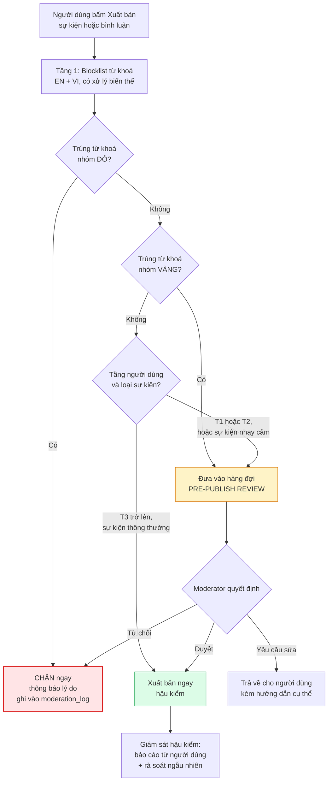

| Nhóm từ khoá | Ví dụ (không đầy đủ) | Hành động |
|---|---|---|
| **ĐỎ — chặn ngay** | Từ liên quan ma tuý, mại dâm, cờ bạc ăn tiền, nội dung chống Nhà nước, tên gọi tranh chấp lãnh thổ | Chặn xuất bản |
| **VÀNG — duyệt trước** | `protest`, `march`, `rally`, `church`, `bible study`, `temple`, `crypto`, `investment`, `MLM`, `visa run`, `doctor`, `clinic`, `medicine`, `poker`, `casino`, `bet` | Đưa vào hàng đợi duyệt |
| **XANH — chỉ gắn nhãn** | `bar`, `beer`, `pub crawl`, `nightlife`, `18+` | Tự động gắn nhãn 18+, hiển thị cảnh báo |

> ⚙️ **`LEGAL-19`** — blocklist phải là **dữ liệu cấu hình trong database**, không hardcode. Lý do: khi có sự kiện thời sự nhạy cảm, đội vận hành phải bổ sung từ khoá trong vài phút mà không cần phát hành lại app. Cung cấp giao diện quản lý trong Admin Console và ghi audit log mọi thay đổi.
>
> ⚠️ **Cẩn thận với false positive:** blocklist tiếng Anh dễ chặn nhầm nội dung vô hại (`church` trong tên địa danh, `bet` trong `better`). Dùng so khớp theo từ nguyên vẹn và có kiểm thử, đừng dùng so khớp chuỗi con.

### 11.4 Cách truyền đạt cho người dùng nước ngoài

Người dùng expat hầu hết **không cố ý vi phạm** — họ chỉ không biết. Cách trình bày quyết định hiệu quả:

| Cách làm sai | Cách làm đúng |
|---|---|
| Danh sách cấm dài, khô khan trong ToS | Một mục ngắn trong Community Guidelines: *"A few things that are different in Vietnam"* |
| Giọng văn phán xét, đe doạ | Giọng trung tính: *"This is a legal requirement here, not our preference."* |
| Chỉ hiện lúc đăng ký, không ai đọc | Hiện **đúng lúc cần**: khi người dùng nhập từ khoá nhóm vàng, hiện gợi ý ngay tại form |
| Từ chối không giải thích | Từ chối kèm lý do cụ thể và gợi ý cách sửa |
| Chỉ tiếng Anh | EN chính, có bản VI cho organizer người Việt |

> **Ví dụ nội dung nên có trong Community Guidelines (tiếng Anh):**
> *"Vietnam has specific rules about public gatherings, religious activities, gambling, and content about national sovereignty. These aren't our rules — they're the law where we all live. If your event touches on any of these, our team may ask you a few questions before publishing. We'll always tell you why."*

---

## 12. Ma trận rủi ro pháp lý và mức phạt

### 12.1 Ma trận xác suất × tác động

| Mã | Rủi ro | Xác suất | Tác động | Điểm | Chủ sở hữu | Giảm thiểu chính |
|---|---|:--:|:--:|:--:|---|---|
| L-01 | Không giải được bài toán xác thực SĐT → mô hình đăng ký không tuân thủ | 4 | 5 | **20** | Founder | Hỏi luật sư trước Sprint 1; mặc định chọn phương án hạn chế hơn |
| L-02 | Vượt ngưỡng người dùng mà chưa có Giấy phép mạng xã hội | 4 | 4 | **16** | Founder | Theo dõi số liệu hằng tháng; khởi động hồ sơ khi đạt 50% ngưỡng |
| L-03 | Bản đồ hiển thị sai chủ quyền | 3 | 5 | **15** | Tech Lead | `LEGAL-18` gate phát hành |
| L-04 | Nội dung curate bị organizer gốc khiếu nại bản quyền | 3 | 3 | **9** | Content Curator | Quy tắc 8.3, không dùng ảnh gốc |
| L-05 | Chưa nộp DPIA/TIA đúng hạn 60 ngày | 3 | 4 | **12** | Founder | Đưa vào lịch ngay khi có user thật đầu tiên |
| L-06 | Sự kiện chạm danh mục cấm lọt qua kiểm duyệt | 3 | 5 | **15** | Moderator | Blocklist + pre-publish review + tầng T |
| L-07 | Bị từ chối App Review nhiều vòng làm trượt mốc M6 | 4 | 3 | **12** | Mobile Dev | Checklist 9.1, tài khoản demo, nộp sớm 2 tuần |
| L-08 | Lộ dữ liệu cá nhân | 2 | 5 | **10** | Tech Lead | Mục 3.9 + runbook + diễn tập |
| L-09 | Sự cố an toàn tại sự kiện ngoài đời, nền tảng bị quy trách nhiệm | 2 | 5 | **10** | Founder | Điều 7, 8 của ToS; Event Safety Disclaimer |
| L-10 | Sai sót thuế nhà thầu nước ngoài, bị truy thu và phạt | 3 | 3 | **9** | Kế toán | Xác nhận trước khi ký hợp đồng hạ tầng |
| L-11 | Dữ liệu người dùng lưu ngoài Việt Nam trái nghĩa vụ | 2 | 4 | **8** | Tech Lead | ADR data residency `LEGAL-08` |
| L-12 | Đăng ảnh người tham gia không có sự đồng ý | 3 | 2 | **6** | Community Manager | Photo consent ở check-in |
| L-13 | Người dùng dưới 18 tuổi lọt vào nền tảng | 2 | 4 | **8** | Product | Age gate + điều khoản 18+ |
| L-14 | Nhà đầu tư nước ngoài làm phức tạp hồ sơ cấp phép | 2 | 4 | **8** | Founder | Hỏi luật sư trước khi nhận vốn |

### 12.2 Mức chế tài cần biết

| Nhóm vi phạm | Chế tài | Mức |
|---|---|---|
| Vi phạm về bảo vệ dữ liệu cá nhân, đặc biệt là chuyển dữ liệu ra nước ngoài trái quy định và mua bán dữ liệu | Phạt tiền rất nặng, có thể tính theo **tỷ lệ phần trăm doanh thu năm liền kề**, kèm biện pháp khắc phục | 🟡 |
| Cung cấp dịch vụ mạng xã hội **không có giấy phép** khi thuộc diện phải có | Phạt tiền + **buộc dừng cung cấp dịch vụ** | 🟡 |
| Không thực hiện gỡ nội dung theo yêu cầu đúng thời hạn | Phạt tiền, tăng nặng nếu tái phạm | 🟢 |
| Cung cấp thông tin sai sự thật, xuyên tạc, vu khống trên mạng | Phạt tiền theo khung của nghị định xử phạt lĩnh vực bưu chính, viễn thông, công nghệ thông tin | 🟢 |
| Thể hiện sai chủ quyền quốc gia trên bản đồ | Phạt tiền + **buộc gỡ bỏ, cải chính** | 🟢 |
| Sử dụng tiền mã hoá làm phương tiện thanh toán | Phạt tiền nặng theo quy định lĩnh vực ngân hàng | 🟢 |
| Vi phạm về quảng cáo rượu, bia | Phạt tiền + buộc gỡ quảng cáo | 🟢 |
| Vi phạm hình sự (đánh bạc, ma tuý, xâm hại trẻ em) | Trách nhiệm hình sự của cá nhân vi phạm; nền tảng có thể bị xem xét trách nhiệm nếu biết mà không xử lý | 🟢 |

> ⚠️ **Nguyên tắc chung về mức phạt với tổ chức:** trong nhiều nghị định xử phạt hành chính của Việt Nam, mức phạt tiền với **tổ chức gấp 2 lần** mức phạt với cá nhân cho cùng hành vi. Khi đọc bất kỳ con số nào trên internet, phải kiểm tra con số đó dành cho cá nhân hay tổ chức.
>
> 🔴 **Không đưa con số phạt cụ thể vào tài liệu đối ngoại** (pitch deck, tài liệu gọi vốn) nếu chưa được luật sư xác nhận theo văn bản đang hiệu lực.

---

## 13. Checklist tuân thủ theo từng mốc phát triển

Checklist bám đúng mốc M0–M6 trong `08-roadmap-va-ke-hoach-trien-khai.md`.

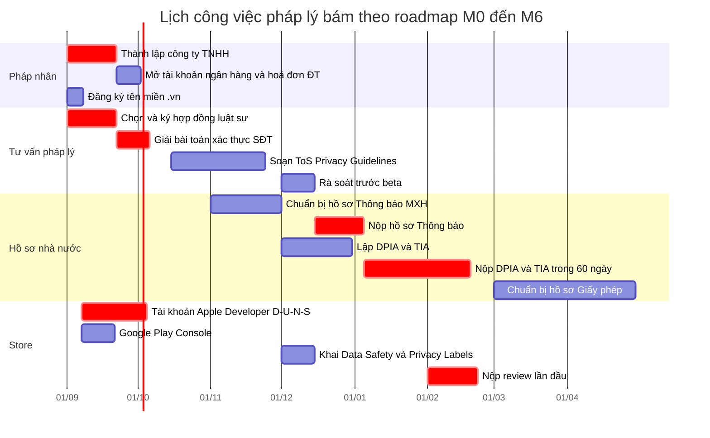

### 13.1 M0 — Setup hạ tầng (hạn 18/09/2026)

| # | Việc | Chủ sở hữu | Bằng chứng hoàn thành |
|---|---|---|---|
| M0-1 | Khởi động thủ tục thành lập **Công ty TNHH** với đủ mã ngành ở 7.2 | Founder | Giấy chứng nhận đăng ký doanh nghiệp |
| M0-2 | **Ký hợp đồng với luật sư CNTT/dữ liệu** | Founder | Hợp đồng dịch vụ pháp lý |
| M0-3 | Gửi bộ câu hỏi mục 15 cho luật sư | Founder | Email đã gửi + biên bản họp |
| M0-4 | Đăng ký **tên miền `.vn`** và tên miền quốc tế | Tech Lead | Hoá đơn đăng ký tên miền |
| M0-5 | Chốt **ADR data residency** theo bảng 4.3 | Tech Lead | `adr-00X-data-residency.md` đã merge |
| M0-6 | Mở tài khoản Apple Developer (tổ chức) + D-U-N-S | Founder | Tài khoản đã kích hoạt |
| M0-7 | Mở tài khoản Google Play Console (tổ chức) | Founder | Tài khoản đã kích hoạt |
| M0-8 | Cấu hình secret scanning, TLS, phân tách môi trường | Tech Lead | CI xanh, báo cáo quét |
| M0-9 | Tạo thư mục `ops/legal/` trong repo với cấu trúc thư mục hồ sơ | Tech Lead | Thư mục đã tồn tại |

### 13.2 M1 — API nền + Auth (hạn 02/10/2026)

| # | Việc | Chủ sở hữu | Bằng chứng |
|---|---|---|---|
| M1-1 | **Có câu trả lời bằng văn bản** của luật sư về xác thực SĐT (mục 5.4) | Founder | Thư tư vấn |
| M1-2 | Triển khai luồng auth theo phương án đã chốt | Backend | Test end-to-end |
| M1-3 | **Sign in with Apple** hoạt động trên iOS | Mobile | Build TestFlight |
| M1-4 | Bảng `consent_records` (`LEGAL-04`) | Backend | Migration + test |
| M1-5 | Age gate 18+ (`LEGAL-07`) | Backend + FE | Test case |
| M1-6 | Băm mật khẩu và số điện thoại đúng chuẩn ở 3.9 | Backend | Code review |
| M1-7 | Bản nháp đầu tiên của ToS và Privacy Policy (bản đội tự viết, chưa cần luật sư) | Founder | File trong `ops/legal/drafts/` |

### 13.3 M2 — Tạo & khám phá sự kiện (hạn 30/10/2026)

| # | Việc | Chủ sở hữu | Bằng chứng |
|---|---|---|---|
| M2-1 | **`LEGAL-18` map sovereignty check** thành gate phát hành | Tech Lead | Checklist + ảnh chụp trong `ops/legal/map-audit/` |
| M2-2 | Giới hạn khung nhìn bản đồ trong phạm vi Đà Nẵng (B6) | FE + Mobile | Cấu hình `maxBounds` |
| M2-3 | Cột `content_liability`, `collection_method`, `source_*` (`LEGAL-10`) | Backend | Migration |
| M2-4 | Admin Curation Console chặn xuất bản khi thiếu trường bắt buộc (`LEGAL-11`) | Backend + FE | Test case |
| M2-5 | Blocklist từ khoá lưu trong DB, có giao diện quản lý (`LEGAL-19`) | Backend | Seed data + Admin UI |
| M2-6 | Chuỗi giải thích quyền vị trí bằng EN và VI | Mobile | `app.json` + i18n |
| M2-7 | Bảng `user_locations` tách riêng, TTL 30 ngày (`LEGAL-01`) | Backend | Migration + job |

### 13.4 M3 — RSVP + Thông báo (hạn 13/11/2026)

| # | Việc | Chủ sở hữu | Bằng chứng |
|---|---|---|---|
| M3-1 | Tách push **giao dịch** và push **gợi ý** thành hai consent riêng | Backend | Bảng `notification_preferences` |
| M3-2 | Không đưa nội dung nhạy cảm vào payload push | Backend | Code review |
| M3-3 | Sentry scrub PII (`LEGAL-02`) | Tech Lead | Cấu hình `beforeSend` |
| M3-4 | DPA đã ký với mọi nhà cung cấp đang dùng | Founder | Thư mục `ops/legal/dpa/` |
| M3-5 | Bảng ROPA hoàn chỉnh theo 3.3 | Tech Lead | `ops/legal/ropa.md` |

### 13.5 M4 — Trust & Safety tối thiểu (hạn 27/11/2026) — **mốc pháp lý nặng nhất**

| # | Việc | Chủ sở hữu | Bằng chứng |
|---|---|---|---|
| M4-1 | **ToS, Privacy Policy, Community Guidelines** bản EN + VI đã qua luật sư, đã công bố | Founder + Luật sư | URL công khai + bản ký |
| M4-2 | Quy chế quản lý nội dung bản tiếng Việt | Luật sư | `/legal/content-policy` |
| M4-3 | **Xoá tài khoản trong app** hoạt động đầy đủ theo 9.2 | Backend + Mobile | Test bằng tài khoản thật |
| M4-4 | **Đường dẫn web xoá tài khoản** cho Google Play | FE | URL công khai |
| M4-5 | **Xuất dữ liệu cá nhân** trong 72 giờ | Backend | Test end-to-end |
| M4-6 | Ba màn hình bắt buộc: Report, Block, Contact us (`LEGAL-13`) | FE + Mobile | Ảnh chụp màn hình |
| M4-7 | Bảng `takedown_requests` (`LEGAL-12`) | Backend | Migration |
| M4-8 | Audit log truy cập dữ liệu cá nhân bởi admin | Backend | Bảng `audit_logs` |
| M4-9 | SLA kiểm duyệt 24 giờ có người trực thật | Community Manager | Lịch trực |
| M4-10 | Event Safety Disclaimer hiển thị trên trang sự kiện | FE | Ảnh chụp màn hình |

### 13.6 M5 — Beta kín 100 user (hạn 25/12/2026)

| # | Việc | Chủ sở hữu | Bằng chứng |
|---|---|---|---|
| M5-1 | ⚠️ **Đây là thời điểm bắt đầu xử lý dữ liệu cá nhân thật** → khởi động đồng hồ 60 ngày cho DPIA và TIA | Founder | Ghi ngày vào `ops/legal/timeline.md` |
| M5-2 | Nộp hồ sơ **Thông báo cung cấp dịch vụ mạng xã hội** | Founder + Luật sư | Biên nhận hồ sơ |
| M5-3 | Lập **DPIA** đầy đủ theo 3.6 | Tech Lead + Luật sư | `ops/legal/dpia/dpia-v1.md` + bản ký |
| M5-4 | Lập **TIA** đầy đủ theo 3.7 | Tech Lead + Luật sư | `ops/legal/tia/tia-v1.md` |
| M5-5 | Chỉ định **nhân sự phụ trách bảo vệ dữ liệu**, ghi tên vào DPIA | Founder | Quyết định bổ nhiệm |
| M5-6 | Khai **Data Safety form** và **Privacy nutrition labels** theo bảng 9.5 | Mobile | Ảnh chụp Console |
| M5-7 | Organizer Agreement (`LEGAL-17`) đã triển khai | Backend + FE | Test case |
| M5-8 | Photo & Media Consent ở màn hình check-in | FE + Mobile | Ảnh chụp màn hình |
| M5-9 | Tài khoản `reviewer@` với dữ liệu mẫu (`LEGAL-15`) | Mobile | Tài khoản hoạt động |
| M5-10 | **Diễn tập runbook sự cố dữ liệu** | Tech Lead | Biên bản diễn tập |
| M5-11 | Quy trình phản hồi cơ quan nhà nước đã soạn | Luật sư | Tài liệu nội bộ |
| M5-12 | Bắt đầu **đếm số liệu lượt truy cập thường xuyên** hằng tháng | Product | Dashboard analytics |

### 13.7 M6 — Ra mắt công khai (hạn 25/02/2027)

| # | Việc | Chủ sở hữu | Bằng chứng |
|---|---|---|---|
| M6-1 | Đã có **Giấy xác nhận thông báo** hoặc bằng chứng đã nộp hợp lệ | Founder | Văn bản của cơ quan |
| M6-2 | **Nộp DPIA và TIA trong 60 ngày** kể từ M5-1 | Founder | Biên nhận |
| M6-3 | Kiểm tra bản đồ chủ quyền lần cuối trước phát hành (`LEGAL-18`) | Tech Lead | Ảnh chụp có ngày tháng |
| M6-4 | Toàn bộ tài liệu pháp lý ở 10.1 đã công bố đúng URL | Founder | Checklist đối chiếu |
| M6-5 | Kiểm thử toàn bộ luồng quyền chủ thể dữ liệu bằng tài khoản thật | QA | Báo cáo kiểm thử |
| M6-6 | Rà soát khai báo store khớp hành vi thật của app | Mobile | Bảng đối chiếu 9.5 |
| M6-7 | Thiết lập cảnh báo khi số liệu chạm **50% ngưỡng cấp phép** | Product | Cảnh báo tự động |
| M6-8 | Kế toán xác nhận cơ chế thuế nhà thầu với từng nhà cung cấp | Kế toán | Thư xác nhận |
| M6-9 | Rà soát danh mục nội dung cấm cùng luật sư sau 3 tháng vận hành thật | Founder | Biên bản |

### 13.8 Sau ra mắt — nghĩa vụ định kỳ

| Tần suất | Việc |
|---|---|
| Hằng tuần | Rà soát hàng đợi kiểm duyệt; kiểm tra SLA takedown 24 giờ |
| Hằng tháng | Báo cáo số liệu lượt truy cập thường xuyên; rà soát blocklist; rà soát danh sách nội dung curate chưa có phản hồi organizer |
| Hằng quý | Rà soát quyền truy cập nhân sự; cập nhật ROPA nếu có thay đổi; rà soát danh sách nhà cung cấp và DPA |
| Khi thay đổi | Cập nhật DPIA/TIA khi thêm loại dữ liệu, thêm nhà cung cấp, đổi hạ tầng — nộp lại bản cập nhật |
| Hằng năm | Rà soát toàn bộ tài liệu pháp lý; gia hạn tên miền `.vn`; quyết toán thuế; rà soát ngưỡng cấp phép |
| Trước mỗi lần phát hành | Map sovereignty check; rà soát khai báo quyền riêng tư nếu có thay đổi thu thập dữ liệu |

### 13.9 Checklist bổ sung cho Giai đoạn 2 (Nhà ở)

| # | Việc | Mức |
|---|---|---|
| G2-1 | Quyết định mô hình: bảng tin đăng tin hay nền tảng giao dịch (mục 6.2) | 🔴 |
| G2-2 | Nếu là nền tảng trung gian: thông báo/đăng ký hoạt động thương mại điện tử | 🟢 |
| G2-3 | Bổ sung mã ngành 6820 nếu có hoạt động môi giới | 🟢 |
| G2-4 | Xác minh danh tính người đăng tin cho thuê; yêu cầu chứng minh quyền cho thuê | 🟡 |
| G2-5 | Cảnh báo trong app: chủ nhà có nghĩa vụ khai báo tạm trú cho người nước ngoài | 🟡 |
| G2-6 | Cơ chế giải quyết tranh chấp và khiếu nại có SLA | 🟢 |
| G2-7 | Cập nhật DPIA vì thêm loại dữ liệu (địa chỉ nơi ở là dữ liệu nhạy cảm hơn) | 🟢 |
| G2-8 | Quy tắc riêng cho nội dung quảng cáo bất động sản | 🟢 |

### 13.10 Checklist bổ sung cho Giai đoạn 3 (Y tế / dịch vụ chuyên môn)

| # | Việc | Mức |
|---|---|---|
| G3-1 | **Không đưa ra lời khuyên y tế** dưới mọi hình thức — kể cả gợi ý tự động | 🟢 |
| G3-2 | Xác minh **giấy phép hành nghề** và **giấy phép hoạt động cơ sở** của mọi nhà cung cấp dịch vụ y tế | 🟢 |
| G3-3 | Nội dung quảng cáo dịch vụ y tế phải có xác nhận nội dung của cơ quan y tế | 🟢 |
| G3-4 | Cẩn trọng với đánh giá, xếp hạng cơ sở y tế — rủi ro khiếu nại và quy định riêng | 🔴 |
| G3-5 | Nếu xử lý thông tin sức khoẻ của người dùng: đây là **dữ liệu nhạy cảm**, nghĩa vụ nặng nhất | 🟢 |
| G3-6 | Điều khoản miễn trừ trách nhiệm riêng cho phần giới thiệu dịch vụ y tế | 🟢 |
| G3-7 | Bổ sung mã ngành và rà soát điều kiện kinh doanh | 🟡 |
| G3-8 | Cập nhật DPIA, khai báo lại nhãn quyền riêng tư trên store | 🟢 |

---

## 14. Ngân sách pháp lý ước tính

Các con số dưới là **dải ước lượng để lập ngân sách**, không phải báo giá. Tỷ giá quy đổi theo giả định A6 của `08`: 1 USD = 26.000 VND.

| Hạng mục | Thời điểm | Dải chi phí (VND) | Ghi chú |
|---|---|---|---|
| Thành lập công ty TNHH qua đơn vị dịch vụ | M0 | 3 – 8 triệu | Đã gồm khắc dấu, công bố thông tin |
| Chữ ký số + hoá đơn điện tử năm đầu | M0 | 2 – 5 triệu | |
| Tên miền `.vn` (năm đầu) | M0 | 0,7 – 1,5 triệu | Bắt buộc cho hồ sơ mạng xã hội |
| **Tư vấn pháp lý ban đầu** — trả lời bộ câu hỏi mục 15 | M0–M1 | 15 – 40 triệu | Khoản chi quan trọng nhất của toàn bộ bảng này |
| Soạn ToS + Privacy Policy song ngữ | M4 | 20 – 60 triệu | Chênh lệch lớn tuỳ hãng luật |
| Soạn Quy chế quản lý nội dung | M4–M5 | 8 – 20 triệu | |
| Soạn Organizer Agreement | M5 | 5 – 15 triệu | |
| Lập DPIA + TIA có luật sư tham gia | M5 | 20 – 50 triệu | Có thể tự làm phần lớn, luật sư rà |
| Hồ sơ **Thông báo** cung cấp dịch vụ mạng xã hội | M5 | 10 – 30 triệu | Gồm phí dịch vụ, chưa gồm lệ phí nhà nước |
| Hồ sơ **Giấy phép** mạng xã hội (khi chạm ngưỡng) | Sau M6 | 40 – 120 triệu | Khoản lớn, cần dự phòng trước |
| Kế toán dịch vụ hằng tháng | Từ M0 | 2 – 5 triệu/tháng | |
| Tư vấn thuế nhà thầu nước ngoài | M0 + M6 | 5 – 15 triệu | Một lần thiết lập, sau đó theo phát sinh |
| Nhân sự phụ trách bảo vệ dữ liệu thuê ngoài | Từ M5 | 5 – 15 triệu/tháng | Có thể kiêm nhiệm ở giai đoạn đầu |
| Kiểm thử xâm nhập cơ bản | Trước M6 | 20 – 60 triệu | Có thể lùi sau M6 nếu ngân sách hẹp |
| **Tổng ước tính đến M6** | | **≈ 130 – 350 triệu** | Chưa gồm hồ sơ Giấy phép |
| **Dự phòng khuyến nghị** | | **+ 30%** | Vì nhiều hạng mục còn 🔴 |

> **So sánh với ngân sách tổng:** ngân sách kịch bản đủ đội trong `08` là ≈ 2,04 tỷ VND cho 7 tháng. Chi phí pháp lý ước tính chiếm khoảng **7–17%** — cao hơn cảm giác trực giác của phần lớn đội kỹ thuật, nhưng thấp hơn nhiều so với chi phí phải làm lại sản phẩm nếu chọn sai kiến trúc dữ liệu hoặc sai luồng đăng ký.
>
> **Nếu chạy kịch bản tinh gọn (≈ 0,91 tỷ VND):** không cắt hai khoản — tư vấn pháp lý ban đầu (M0) và ToS/Privacy Policy (M4). Có thể lùi: kiểm thử xâm nhập, nhân sự bảo vệ dữ liệu thuê ngoài, và phần soạn thảo tài liệu không bắt buộc.

---

## 15. Danh sách câu hỏi gửi luật sư

Gửi nguyên văn danh sách này. Yêu cầu trả lời **bằng văn bản**, có trích dẫn điều khoản và số hiệu văn bản đang hiệu lực.

### Nhóm A — Xác thực tài khoản (ưu tiên cao nhất, cần trước 21/09/2026)

1. Nghĩa vụ xác thực tài khoản bằng số điện thoại di động Việt Nam áp dụng cho **mọi tài khoản** hay chỉ tài khoản **đăng tải nội dung công khai**?
2. Số điện thoại nước ngoài đã xác thực bằng OTP có được chấp nhận không? Nếu không, căn cứ là điều khoản nào?
3. Người nước ngoài cư trú hợp pháp tại Việt Nam có "số định danh cá nhân" theo nghĩa của quy định không? Nếu có, lấy từ giấy tờ nào?
4. Nếu nền tảng chỉ cho phép tài khoản chưa xác thực **xem** và **đăng ký tham gia** sự kiện (không tạo nội dung công khai), có thoả mãn quy định không?
5. Rủi ro thực tế và mức chế tài nếu triển khai phương án phân tầng mà sau này bị đánh giá là chưa đủ?

### Nhóm B — Phân loại dịch vụ và thủ tục

6. Da Nang Connect có được xác định là **dịch vụ mạng xã hội** không? Có khả năng nào được xếp vào loại hình khác nhẹ nghĩa vụ hơn không?
7. Ngưỡng chính xác để chuyển từ Thông báo sang Giấy phép theo văn bản đang hiệu lực là bao nhiêu? "Lượt truy cập thường xuyên" đo bằng phương pháp nào, ai xác nhận số liệu?
8. Với ứng dụng di động (không phải website), chỉ tiêu này được tính thế nào?
9. Cơ quan nào tiếp nhận hồ sơ Thông báo và hồ sơ Giấy phép **sau đợt sắp xếp bộ máy năm 2025**? Có đầu mối tại Đà Nẵng không?
10. Thời gian xử lý thực tế của mỗi loại hồ sơ? Có được tiếp tục hoạt động trong lúc chờ cấp phép không?
11. Nhân sự chịu trách nhiệm quản lý nội dung có bắt buộc là công dân Việt Nam không, hay người nước ngoài có thẻ tạm trú đủ điều kiện cũng được?

### Nhóm C — Dữ liệu cá nhân

12. Văn bản nào đang là căn cứ áp dụng về bảo vệ dữ liệu cá nhân tại thời điểm tư vấn? Nghị định 13/2023/NĐ-CP còn hiệu lực phần nào không?
13. Dữ liệu vị trí do người dùng chủ động chia sẻ có được xác định là dữ liệu cá nhân nhạy cảm không? Nếu chỉ lưu ở độ chính xác thấp (cấp phường/quận) thì có đổi phân loại không?
14. Mẫu DPIA và TIA hiện hành là mẫu nào? Nộp qua kênh nào, dạng giấy hay trực tuyến?
15. Nghĩa vụ lưu nhật ký tối thiểu theo quy định quản lý thông tin trên mạng có được coi là ngoại lệ hợp pháp cho quyền xoá dữ liệu của chủ thể dữ liệu không? Cách diễn giải ở mục 5.3 của tài liệu này có chấp nhận được không?
16. Doanh nghiệp Việt Nam có bắt buộc lưu toàn bộ dữ liệu người dùng trên máy chủ tại Việt Nam không? Có được lưu bản sao dự phòng ở nước ngoài không?
17. Việc dùng Sentry, Expo Push, APNs, FCM có bắt buộc phải khai trong TIA không, kể cả khi dữ liệu chuyển đi là tối thiểu?

### Nhóm D — Nội dung và curate

18. Việc đăng lại thông tin sự kiện công khai từ mạng xã hội khác (viết lại mô tả, ghi nguồn, không dùng ảnh gốc) có rủi ro pháp lý nào tại Việt Nam?
19. Nội dung do doanh nghiệp curate và đăng có được hưởng cơ chế miễn trừ trách nhiệm trung gian như nội dung do người dùng đăng không?
20. Hiển thị tên và ảnh đại diện công khai của organizer gốc mà không xin phép có vi phạm quy định về dữ liệu cá nhân và quyền hình ảnh không?
21. Danh mục nội dung cấm ở mục 11 của tài liệu này có thiếu hạng mục nào không? Có hạng mục nào đang quá thận trọng không cần thiết?

### Nhóm E — Pháp nhân và thuế

22. Công ty TNHH hai thành viên trở lên có phải lựa chọn tối ưu để xin Giấy phép mạng xã hội không?
23. Danh sách mã ngành ở mục 7.2 có đủ và đúng không? Có mã nào nên bỏ vì tạo thêm điều kiện kinh doanh không cần thiết không?
24. Nếu có nhà đầu tư nước ngoài góp vốn, ngành dịch vụ mạng xã hội có bị hạn chế tiếp cận thị trường không? Thủ tục bổ sung là gì?
25. Cơ chế thuế nhà thầu nước ngoài áp dụng thế nào cho: hoa hồng App Store/Google Play, phí cloud, phí SaaS? Văn bản nào đang điều chỉnh?
26. Doanh nghiệp có đủ điều kiện hưởng ưu đãi thuế cho doanh nghiệp nhỏ và vừa mới thành lập hoặc ưu đãi cho hoạt động sản xuất phần mềm không? Thủ tục đăng ký hưởng?

### Nhóm F — Vận hành và trách nhiệm

27. Điều khoản miễn trừ trách nhiệm với sự cố xảy ra tại sự kiện gặp mặt ngoài đời thực có hiệu lực đến đâu theo pháp luật Việt Nam?
28. Nền tảng có nghĩa vụ pháp lý nào khi có sự cố an toàn giữa hai người dùng gặp nhau qua nền tảng không?
29. Bản tiếng Việt hay tiếng Anh của Terms of Service và Privacy Policy có hiệu lực khi có mâu thuẫn? Nên quy định thế nào?
30. Quy trình đúng khi nhận yêu cầu cung cấp thông tin người dùng từ cơ quan nhà nước là gì? Ai có thẩm quyền yêu cầu, và doanh nghiệp có quyền từ chối trong trường hợp nào?

---

## 16. Giới hạn của tài liệu này

| Điều tài liệu này **có** làm | Điều tài liệu này **không** làm |
|---|---|
| Liệt kê các nhóm nghĩa vụ pháp lý cần quan tâm | Thay thế ý kiến pháp lý của luật sư hành nghề |
| Chuyển nghĩa vụ pháp lý thành ticket kỹ thuật và mốc thời gian | Bảo đảm danh sách nghĩa vụ là đầy đủ |
| Đánh dấu rõ điều gì chắc chắn, điều gì cần xác nhận | Khẳng định số hiệu, điều khoản, mức phạt cụ thể |
| Chuẩn bị bộ câu hỏi để buổi làm việc với luật sư hiệu quả | Thay thế việc tra cứu văn bản gốc trên Công báo |
| Bám sát các quyết định đã chốt trong tài liệu `01` đến `08` | Cập nhật tự động khi pháp luật thay đổi |

### Ba điều dễ hiểu sai nhất trong tài liệu này

1. **"Đã có tài liệu này là đã tuân thủ."** Sai. Đây là bản đồ, không phải giấy chứng nhận. Giá trị của nó nằm ở việc biến thành ticket và mốc thời gian có người chịu trách nhiệm.
2. **"Startup nhỏ thì chưa ai để ý."** Sai về mặt quản trị rủi ro. Nghĩa vụ DPIA, TIA và Thông báo dịch vụ không có ngưỡng miễn trừ theo quy mô. Chi phí làm đúng từ đầu thấp hơn nhiều lần chi phí sửa sai.
3. **"Cứ làm sản phẩm trước, pháp lý tính sau."** Với dự án này thì không được, vì có **ba quyết định pháp lý khoá cứng kiến trúc**: xác thực số điện thoại (khoá luồng auth), nơi lưu dữ liệu (khoá hạ tầng), và loại hình pháp nhân (khoá khả năng xin giấy phép). Cả ba đều phải chốt ở M0–M1.

### Lịch rà soát tài liệu

| Thời điểm | Việc |
|---|---|
| Sau buổi làm việc đầu tiên với luật sư | Cập nhật toàn bộ nhãn 🔴 thành 🟢 hoặc 🟡 kèm trích dẫn |
| Trước M4 (27/11/2026) | Rà soát mục 9, 10, 11 với đội Trust & Safety |
| Trước M6 (25/02/2027) | Rà soát toàn bộ; đối chiếu với văn bản đang hiệu lực |
| Trước khi khởi động Giai đoạn 2 | Viết lại mục 6 và bổ sung nội dung bất động sản |
| Trước khi khởi động Giai đoạn 3 | Viết lại mục 6 và bổ sung nội dung y tế; nghĩa vụ nặng nhất của cả dự án |

---

> **Nhắc lại lần cuối:** tài liệu này do đội sản phẩm lập để chuẩn bị làm việc với luật sư, **không phải ý kiến pháp lý**. Không dùng làm căn cứ duy nhất cho bất kỳ quyết định kinh doanh nào. Mọi mục gắn 🔴 phải có xác nhận bằng văn bản của luật sư Việt Nam trước khi hành động.
