# 07 — Kế hoạch Go-To-Market: Da Nang Connect (phạm vi Đà Nẵng, từ 09/2026)

> **Tài liệu vận hành**, không phải tài liệu tầm nhìn. Mọi mục đều có người chịu trách nhiệm, ngày bắt đầu, chi phí và ngưỡng dừng.
> **Phạm vi:** chỉ Đà Nẵng. **Giai đoạn:** 1 — Kết nối cộng đồng (event, thể thao, trao đổi ngôn ngữ).
> **Cửa sổ thời gian:** M1 = 09/2026 → M6 = 02/2027.
> **Ngày lập:** 2026-08-31. **Chu kỳ rà soát:** thứ Hai hằng tuần, review lớn cuối mỗi tháng.
>
> ⚠️ **Đọc §12.1 trước khi thực thi bất kỳ mục nào.** Lịch GTM trong tài liệu này đã được hiệu chỉnh để khớp lịch kỹ thuật của tài liệu 08: **RSVP trong app chỉ chạy từ 13/11/2026 (KT‑M3)**, **beta kín 100 user từ 25/12/2026 (KT‑M5)**, **ra mắt công khai 25/02/2027 (KT‑M6)**. Mọi chỉ tiêu trước 13/11/2026 được đo bằng **đơn vị tiền‑app** (waitlist, nhóm cộng đồng, sổ check‑in), không đo bằng RSVP.

---

## Mục lục

1. [Tóm tắt điều hành](#1-tóm-tắt-điều-hành)
2. [Ước lượng quy mô thị trường expat tại Đà Nẵng](#2-ước-lượng-quy-mô-thị-trường-expat-tại-đà-nẵng)
3. [Phân khúc người dùng và bản đồ định vị](#3-phân-khúc-người-dùng-và-bản-đồ-định-vị)
4. [Bản đồ kênh tại Đà Nẵng](#4-bản-đồ-kênh-tại-đà-nẵng)
5. [Chiến lược seed 100 user đầu tiên](#5-chiến-lược-seed-100-user-đầu-tiên)
6. [Thư viện tin nhắn mẫu tiếng Anh](#6-thư-viện-tin-nhắn-mẫu-tiếng-anh)
7. [Playbook curate thủ công](#7-playbook-curate-thủ-công)
8. [Kịch bản chuyển đổi organizer](#8-kịch-bản-chuyển-đổi-organizer)
9. [Growth loop và cơ chế mời bạn](#9-growth-loop-và-cơ-chế-mời-bạn)
10. [Hệ thống chỉ số](#10-hệ-thống-chỉ-số)
11. [Kế hoạch đo lường và event tracking](#11-kế-hoạch-đo-lường-và-event-tracking)
12. [Tính mùa vụ và lịch 6 tháng](#12-tính-mùa-vụ-và-lịch-6-tháng)
13. [Ngân sách, nhân sự và công cụ](#13-ngân-sách-nhân-sự-và-công-cụ)
14. [Rủi ro GTM và phương án dự phòng](#14-rủi-ro-gtm-và-phương-án-dự-phòng)
15. [Phụ lục — checklist khảo sát thực địa tuần 0](#15-phụ-lục--checklist-khảo-sát-thực-địa-tuần-0)

---

## 1. Tóm tắt điều hành

### 1.1. Luận điểm GTM trong một đoạn

Nhu cầu kết nối của expat tại Đà Nẵng đã tồn tại và đang bị phân mảnh trên ít nhất 5 kênh. Da Nang Connect không tạo nhu cầu mới — nó **gom nhu cầu sẵn có vào một nơi có thể tìm kiếm được**. Vì vậy GTM không phải là chiến dịch quảng cáo, mà là một chuỗi thao tác vận hành: (a) tự tay curate lịch sự kiện đầy đủ nhất Đà Nẵng để app không bao giờ trống, (b) chiếm lĩnh **một** phân khúc có mật độ địa lý cao nhất — remote worker/digital nomad ở cụm An Thượng – Mỹ An, (c) dùng lưu lượng RSVP làm đòn bẩy để kéo organizer từ bị động sang chủ động.

### 1.2. Ba con số mục tiêu

| Mốc | Chỉ số | Mục tiêu | Ý nghĩa |
|---|---|---|---|
| Tuần 6 (19/10/2026) | 100 **seed member tiền‑app** hợp lệ thuộc đúng phân khúc seed — đo bằng waitlist + nhóm cộng đồng + sổ check‑in (§5.1, §12.1) | 100 | Chứng minh có thể kéo người rời Facebook cho một lần cụ thể |
| Tháng 3 (11/2026) | ≥ 25% sự kiện đăng bởi organizer tự phục vụ trên web preview | 25% | Chứng minh cung bắt đầu tự chảy |
| Tháng 6 (28/02/2027) | ≥ 100 beta user hoạt động, **≥ 25 sự kiện đang mở mỗi tuần và không khu vực MVP nào bằng 0**, ≥ 8 organizer tự quản lý listing | — | Đúng gate ra mắt công khai KT‑M6 ngày 25/02/2027. Gate M6 đo bằng **dòng chảy tuần**, không đo bằng tồn kho tích luỹ (§10.7, §14.2) |
| Tháng 9 (31/05/2027) | 820 MAU, 550 WCA/tuần, D30 ≥ 20% | — | Đủ tín hiệu để mở Giai đoạn 2 (nhà ở) |

### 1.3. North Star Metric

> **Weekly Confirmed Attendances (WCA)** — số lượt tham dự sự kiện được xác nhận trong 7 ngày gần nhất.

Lý do chọn: đây là đơn vị nhỏ nhất của "giá trị đã được giao" — một người thật đã gặp người thật vì Da Nang Connect. Nó buộc sản phẩm phải tốt ở cả ba phía cùng lúc: đủ nguồn cung sự kiện, tìm kiếm/lọc đủ tốt để người dùng chọn được, và trải nghiệm RSVP đủ đáng tin để người ta thực sự đi.

### 1.4. Sơ đồ chiến lược tổng thể

```mermaid
flowchart LR
    subgraph P0["Tuần 0 - Chuẩn bị"]
        A1["Khảo sát thực địa 20 địa điểm"]
        A2["Dựng curation board"]
        A3["Nạp 60 sự kiện mồi"]
    end
    subgraph P1["Tuần 1-6 - Seed 100 thanh vien tien-app"]
        B1["Cụm An Thuong - My An"]
        B2["Coworking + language exchange + the thao"]
        B3["Tu to chuc 2 su kien signature/tuan"]
    end
    subgraph P2["Thang 2-3 - Chuyen doi organizer"]
        C1["Claim listing"]
        C2["Founding Organizer 50 suat"]
        C3["Self-serve dat 25%"]
    end
    subgraph P3["Thang 4-6 - Growth loop"]
        D1["Weekly digest + push"]
        D2["Invite-a-friend tren RSVP"]
        D3["Mo rong Son Tra - Hai Chau"]
    end
    P0 --> P1 --> P2 --> P3
    P3 -.->|"du tin hieu"| E["Giai doan 2: Nha o"]
```

---

## 2. Ước lượng quy mô thị trường expat tại Đà Nẵng

### 2.1. Nguyên tắc

Không có một con số chính thức nào đo đúng thứ chúng ta cần ("người nước ngoài nói tiếng Anh, cư trú Đà Nẵng ≥ 1 tháng, có nhu cầu hoạt động cộng đồng"). Vì vậy tài liệu này **tam giác hóa từ 3 phương pháp độc lập**, công bố khoảng giá trị thay vì một con số, và gắn nhãn độ tin cậy cho từng đầu vào.

**Thang độ tin cậy dùng trong toàn tài liệu:**

| Nhãn | Nghĩa | Cách xử lý |
|---|---|---|
| `A` | Số liệu hành chính công bố hoặc đo trực tiếp được | Dùng làm neo |
| `B` | Suy ra từ nguồn công khai + giả định có cơ sở | Dùng nhưng phải kiểm định lại trong 90 ngày |
| `C` | Ước lượng chuyên gia / giai thoại cộng đồng | Chỉ dùng để kiểm tra tính hợp lý, không dùng làm neo |

> **Cảnh báo ranh giới hành chính:** từ giữa 2025 địa giới Đà Nẵng đã mở rộng. Toàn bộ tài liệu này dùng **"Đà Nẵng đô thị lõi"** = 6 quận nội thành cũ + bán đảo Sơn Trà + khu vực ven biển Ngũ Hành Sơn. Mọi số liệu dân số cấp tỉnh phải được cắt lại về phạm vi này trước khi dùng.

### 2.2. Phương pháp A — Từ số liệu hành chính (top-down)

| Thành phần | Ước lượng | Độ tin cậy | Ghi chú giả định |
|---|---|---|---|
| Người nước ngoài có giấy phép lao động tại Đà Nẵng | 4.500 – 6.000 | `B` | Dải công bố nhiều năm của cơ quan lao động địa phương dao động quanh mức này; cần xin số mới nhất |
| Hệ số người phụ thuộc đi kèm (vợ/chồng, con) | × 1,25 – 1,55 | `B` | Nhóm Hàn/Nhật/Âu có gia đình kéo hệ số lên; nhóm giáo viên trẻ kéo xuống |
| → Cụm "lao động chính thức + gia đình" | 5.600 – 9.300 | `B` | |
| Nhóm không thuộc diện work permit: visa doanh nghiệp/du lịch dài, remote worker, hưu trí, du học sinh, người kết hôn với công dân Việt Nam | + 55% – 100% so với cụm trên | `C` | Đây là nhóm khó đo nhất và cũng chính là phân khúc mục tiêu của chúng ta |
| **Tổng cư trú dài hạn (≥ 3 tháng)** | **9.000 – 18.500** | `B/C` | |

### 2.3. Phương pháp B — Từ dấu chân số (bottom-up)

| Bước | Giá trị | Độ tin cậy | Giả định |
|---|---|---|---|
| Tổng thành viên 2 nhóm Facebook expat lớn nhất | ~ 90.000 – 120.000 lượt thành viên | `B` | Đếm được trực tiếp; phải chụp lại số ngày Tuần 0 |
| Trừ trùng lặp giữa 2 nhóm | −45% đến −60% | `C` | Người quan tâm Đà Nẵng thường tham gia cả hai |
| → Thành viên duy nhất | 42.000 – 62.000 | `C` | |
| Tỷ lệ **đang thực sự ở Đà Nẵng** tại một thời điểm | 12% – 20% | `C` | Nhóm expat luôn tích lũy người đã rời đi, người đang lên kế hoạch, và cả người Việt |
| → Expat có mặt & dùng Facebook | 5.000 – 12.400 | `C` | |
| Cộng nhóm không dùng nhóm Facebook tiếng Anh: cộng đồng Hàn (KakaoTalk), Nhật (LINE), Trung (WeChat), Nga/Đông Âu (Telegram/VK) | + 30% – 55% | `C` | Cộng đồng Hàn Quốc tại Đà Nẵng đáng kể nhưng gần như không hiện diện trong nhóm tiếng Anh |
| **Tổng ước lượng** | **6.500 – 19.200** | `C` | Khoảng rộng — chỉ dùng để kiểm tra tính hợp lý |

### 2.4. Phương pháp C — Từ dòng chảy remote worker

| Đầu vào | Ước lượng | Độ tin cậy |
|---|---|---|
| Remote worker/nomad có mặt tại Đà Nẵng, mùa cao điểm (T2–T8) | 1.500 – 3.500 | `C` |
| Remote worker có mặt, mùa mưa (T10–T12) | 600 – 1.400 | `C` |
| Thời gian lưu trú trung vị | 5 – 10 tuần | `C` |
| → Số người **đi qua** Đà Nẵng trong 12 tháng | 8.000 – 16.000 lượt | `C` |

Ý nghĩa vận hành của con số này lớn hơn giá trị tuyệt đối: phân khúc nomad **thay máu 6–10 lần/năm**. Đó vừa là rủi ro churn, vừa là nguồn cầu tái tạo liên tục — mỗi người mới đến đều có nhu cầu "tuần này có gì" ở mức cao nhất trong 14 ngày đầu.

### 2.5. Tổng hợp — TAM / SAM / SOM

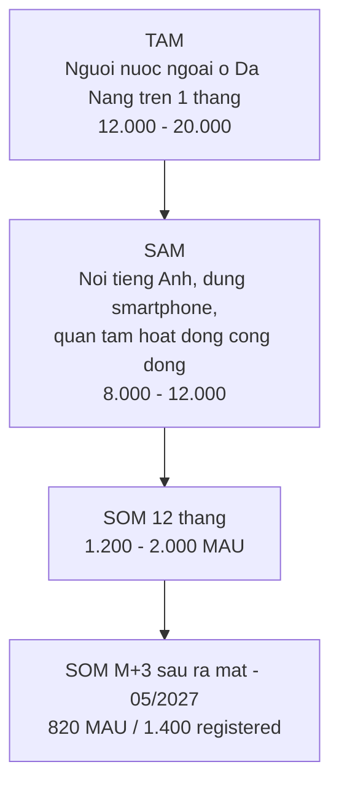

| Lớp | Định nghĩa vận hành | Ước lượng | Điểm neo dùng để lập kế hoạch |
|---|---|---|---|
| **TAM** | Người nước ngoài lưu trú Đà Nẵng ≥ 1 tháng, mọi ngôn ngữ | 12.000 – 20.000 | 15.000 |
| **SAM** | Trong TAM: giao tiếp bằng tiếng Anh, có smartphone, đã từng tìm kiếm hoạt động cộng đồng trong 90 ngày | 8.000 – 12.000 | **10.000** |
| **SOM M+3 sau ra mắt (31/05/2027)** | 8,2% SAM đạt MAU | 820 MAU | Mục tiêu cam kết |
| **SOM M+9 sau ra mắt (30/11/2027)** | 12% – 18% SAM | 1.200 – 2.000 MAU | Mục tiêu định hướng |

### 2.6. Kiểm tra chéo bằng dữ liệu hành vi đã có

Báo cáo phân tích 3.504 bài đăng cho một phép thử độc lập rất hữu ích:

| Tín hiệu | Giá trị | Suy luận |
|---|---|---|
| Bài đăng về Sự kiện + Thể thao (2 nhóm) | 809 bài / 8 tháng | ≈ 100 bài nêu nhu cầu kết nối mỗi tháng, **chỉ tính bài đăng** |
| Tỷ lệ cầu / cung | 11 : 1 | Cứ 11 người hỏi mới có 1 người chào |
| Từ khóa `sports bar` | 37 lần | Xác nhận kênh vật lý bar thể thao là điểm tụ có thật |
| Từ khóa `language exchange` | 28 lần | Xác nhận trao đổi ngôn ngữ là định dạng sự kiện dễ seed nhất |
| Tăng trưởng bài sự kiện T5–T6/2026 | × 10 so với tháng trước | Thị trường đang nóng lên đúng lúc ra mắt |

**Quy tắc ngón tay cái rút ra:** với mỗi bài đăng nêu nhu cầu công khai, ước tính có **15 – 40 người có cùng nhu cầu nhưng im lặng** (tỷ lệ 90-9-1 điều chỉnh cho nhóm cộng đồng nhỏ). → 100 bài/tháng ≈ **1.500 – 4.000 người có nhu cầu chủ động mỗi tháng**. Con số này tương thích với SAM 10.000 và củng cố mục tiêu 820 MAU ở mốc M+3 sau ra mắt (05/2027) là khả thi nhưng không dễ.

### 2.7. Việc phải làm để nâng độ tin cậy (deadline: hết tháng 10/2026)

| # | Hành động | Nâng nhãn từ → đến | Người phụ trách |
|---|---|---|---|
| 1 | Xin số work permit và tạm trú mới nhất từ cơ quan quản lý lao động/xuất nhập cảnh địa phương | `B` → `A` | Founder |
| 2 | Chụp lại số thành viên 6 nhóm Facebook + 4 nhóm Telegram vào ngày 01 hằng tháng | `C` → `B` | Community Curator |
| 3 | Khảo sát tại 6 coworking: đếm số ghế bán tháng đang có người | `C` → `B` | Community Curator |
| 4 | Thêm câu hỏi onboarding `arrival_date` và `planned_stay_length` để đo trực tiếp cơ cấu phân khúc | — → `A` | Product |
| 5 | Chốt lại TAM/SAM sau 500 registered user thật | — | Founder |

---

## 3. Phân khúc người dùng và bản đồ định vị

### 3.1. Năm phân khúc và điểm hấp dẫn

| # | Phân khúc | Ước tính quy mô trong SAM | Mật độ địa lý | Nhu cầu kết nối | Sẵn sàng thử app mới | Vòng đời | Điểm tổng |
|---|---|---|---|---|---|---|---|
| S1 | **Remote worker / digital nomad, lưu trú 1–6 tháng** | 1.500 – 3.500 | ★★★★★ | ★★★★★ | ★★★★★ | ★☆☆☆☆ | **21/25** |
| S2 | Giáo viên tiếng Anh (trung tâm + trường quốc tế), 1–3 năm | 900 – 1.800 | ★★★☆☆ | ★★★★☆ | ★★★★☆ | ★★★★☆ | 19/25 |
| S3 | Expat định cư dài hạn có gia đình (doanh nhân, quản lý, hưu trí) | 2.000 – 4.000 | ★★☆☆☆ | ★★★☆☆ | ★★☆☆☆ | ★★★★★ | 16/25 |
| S4 | Cộng đồng Hàn / Nhật / Trung | 2.500 – 5.000 | ★★★☆☆ | ★★★☆☆ | ★★☆☆☆ | ★★★★☆ | 14/25 |
| S5 | Người Việt nói tiếng Anh muốn trao đổi ngôn ngữ / kết nối quốc tế | rất lớn | ★☆☆☆☆ | ★★★★☆ | ★★★★☆ | ★★★☆☆ | — (xem 3.3) |

### 3.2. Quyết định — chọn duy nhất S1

**Chọn S1 (remote worker / digital nomad ở cụm An Thượng – Mỹ An) làm phân khúc seed duy nhất cho 100 user đầu tiên.**

Sáu lý do, xếp theo sức nặng:

1. **Mật độ địa lý cực cao.** S1 sống, làm việc, ăn uống và tập luyện trong bán kính khoảng 1,5 km quanh trục An Thượng – Mỹ An – Mỹ Khê. Đội ngũ 2 người có thể phủ vật lý toàn bộ phân khúc trong 1 ngày đi bộ. Không phân khúc nào khác có đặc tính này.
2. **Nhu cầu ở đỉnh trong 14 ngày đầu đến.** Người mới đến chưa có bạn, chưa biết chỗ chơi, và đang chủ động tìm kiếm. Đây là khoảnh khắc duy nhất trong vòng đời expat mà chi phí thuyết phục gần bằng 0.
3. **Chấp nhận app mới không do dự.** S1 đã quen cài app cho mỗi thành phố mới. Rào cản "tôi đã có Facebook rồi" yếu hơn hẳn so với S3.
4. **Khớp với định dạng sự kiện dễ seed nhất.** Language exchange, chạy bộ nhóm, board game, quiz night, bóng đá/cầu lông pickup — tất cả đều rẻ, tổ chức được trong 72 giờ, và trùng khớp với 5 từ khóa nhu cầu hàng đầu trong dữ liệu.
5. **Có sẵn cửa vào của bên thứ ba.** Coworking space có động cơ thương mại rõ ràng để cộng tác: sự kiện cộng đồng = lý do bán thẻ tháng. Đây là đối tác dễ ký nhất trong toàn bản đồ kênh.
6. **Thất bại rẻ và nhanh.** Nếu S1 không dùng app, ta biết trong 6 tuần với chi phí dưới 20 triệu VND, thay vì biết sau 6 tháng.

**Nhược điểm đã lường trước và cách bù:**

| Nhược điểm của S1 | Mức độ | Phương án bù |
|---|---|---|
| Churn cấu trúc: rời thành phố sau 5–10 tuần | Cao | (a) Coi churn địa lý là **tốt nghiệp**, không tính vào retention chuẩn — tách cohort `left_city`. (b) Thêm luồng `handoff`: trước khi rời, mời user giới thiệu 1 người thay thế, tặng badge `Community Passer`. |
| Không phải nguồn doanh thu bền vững | Trung bình | S1 là **nguồn cầu**; S2 và S3 mới là nguồn cung organizer và nguồn doanh thu. Mở S2 từ M3, S3 từ M5. |
| Sụt mạnh mùa mưa T10–T12 | Cao | Chuyển tỷ trọng sang sự kiện trong nhà và mở S2 (giáo viên không rời thành phố theo mùa) đúng M3. |

### 3.3. Vai trò kiểm soát của S5 (người Việt nói tiếng Anh)

S5 **không phải phân khúc seed** nhưng là nguồn cung không thể thiếu cho định dạng language exchange. Quy tắc kiểm soát:

- Chỉ mở S5 cho các sự kiện gắn nhãn `language_exchange` và `cultural_exchange`.
- **Trần tỷ lệ 40%** người tham dự là người bản địa trên mỗi sự kiện language exchange; vượt trần thì đóng RSVP phía bản địa.
- Không đưa S5 vào các kênh truyền thông chính, không tối ưu onboarding cho S5 ở Giai đoạn 1.
- Lý do: nếu tỷ lệ người bản địa vượt ngưỡng, định vị "dành riêng cho cộng đồng expat" bị hòa tan và app trở thành một nhóm Facebook đại trà khác.

---

## 4. Bản đồ kênh tại Đà Nẵng

> **Ghi chú tin cậy bắt buộc đọc trước:** tên địa điểm cụ thể dưới đây là **danh sách hạt giống** được lập từ hiểu biết chung về Đà Nẵng, nhãn `B`/`C`. Chúng **phải được xác minh thực địa trong Tuần 0** (còn hoạt động không, chủ mới, địa chỉ, người quyết định) theo checklist ở Mục 15. Không dùng danh sách này để gửi email hàng loạt trước khi xác minh.

### 4.1. Bốn cụm khu vực và vai trò

| Cụm | Đặc trưng cư dân | Vai trò trong GTM | Ưu tiên |
|---|---|---|---|
| **An Thượng** (Ngũ Hành Sơn, sau lưng biển Mỹ Khê) | Trung tâm nomad/backpacker; quán tây, coworking, homestay, gym boutique | **Trận địa chính Tuần 1–6** | P0 |
| **Mỹ An** (liền kề An Thượng) | Nomad ở dài hơn, căn hộ dịch vụ, gym, quán cà phê làm việc | **Trận địa chính Tuần 1–6** | P0 |
| **Mỹ Khê / ven biển Võ Nguyên Giáp** | Khách sạn, resort, hoạt động biển, chạy bộ sáng, surf | Nguồn sự kiện thể thao ngoài trời | P1 |
| **Sơn Trà** (bán đảo + An Hải) | Cư dân trung hạn, hoạt động ngoài trời, xe máy đường đèo | Mở rộng từ M4 | P2 |
| **Hải Châu** (trung tâm hành chính, ven sông Hàn) | Văn phòng, trường quốc tế, gia đình expat, bar trung tâm | Nguồn organizer & S2/S3, mở từ M3 | P1 |
| **Thanh Khê / Liên Chiểu / Cẩm Lệ** | Ít expat, giá rẻ, sinh viên | Không tiếp cận ở Giai đoạn 1 | P3 |

### 4.2. Bảng tổng hợp toàn kênh

| ID | Kênh | Loại | Quy mô tiếp cận ước tính | Cách tiếp cận cốt lõi | Chi phí ước tính / tháng | Ưu tiên | Độ tin cậy |
|---|---|---|---|---|---|---|---|
| CH-01 | Nhóm Facebook expat lớn (2 nhóm chính) | Cộng đồng số | 42k–62k thành viên duy nhất | Trả lời hữu ích trong comment, không spam link | 0 đ (chỉ công sức) | **P0** | `B` |
| CH-02 | Coworking space cụm An Thượng – Mỹ An | Vật lý | 300–700 người/tháng | Đồng tổ chức sự kiện, đổi lấy chỗ | 0–3 tr đ | **P0** | `B` |
| CH-03 | Nhóm Telegram/WhatsApp nomad & thể thao | Cộng đồng số | 1.500–5.000 | Xin phép admin, tham gia thật trước khi đăng | 0 đ | **P0** | `C` |
| CH-04 | Quán bar thể thao / pub expat | Vật lý | 200–600 khách/tuần | Quiz night & xem thể thao đồng thương hiệu | 1–3 tr đ | **P0** | `C` |
| CH-05 | Sự kiện tự tổ chức signature | Vật lý | 15–40 người/buổi | 2 buổi/tuần do đội ngũ đứng tên | 2–4 tr đ | **P0** | `A` |
| CH-06 | Phòng gym / studio yoga / võ thuật | Vật lý | 400–1.200 hội viên | Lịch lớp đưa lên app + poster QR | 0–1,5 tr đ | P1 | `C` |
| CH-07 | Câu lạc bộ chạy bộ / đạp xe / bóng đá pickup | Cộng đồng lai | 150–500 | Curate lịch + gia nhập với tư cách thành viên | 0 đ | P1 | `C` |
| CH-08 | Trung tâm ngoại ngữ (dạy tiếng Anh & dạy tiếng Việt cho người nước ngoài) | Đối tác | 60–200 giáo viên nước ngoài | Cửa vào S2 + nguồn học viên language exchange | 0–2 tr đ | P1 | `B` |
| CH-09 | Trường quốc tế / song ngữ | Đối tác | 100–300 gia đình expat | Cửa vào S3, tiếp cận qua hội phụ huynh | 0 đ | P2 | `C` |
| CH-10 | Nền tảng sự kiện hiện có (Meetup, Luma, trang sự kiện địa phương) | Nguồn nội dung | — | Nguồn curate, không phải kênh tuyển user | 0–1,2 tr đ | **P0** (nguồn) | `B` |
| CH-11 | Homestay / apartment building tập trung expat | Vật lý | 200–600 phòng | Thẻ chào mừng đặt tại lễ tân | 0,5–1,5 tr đ | P2 | `C` |
| CH-12 | Quán cà phê chuyên đồ specialty có dân làm việc bằng laptop | Vật lý | 300–800 khách/tuần | Standee QR + tờ lịch tuần in | 0,5–1 tr đ | P1 | `B` |
| CH-13 | Instagram / TikTok nội dung "This week in Da Nang" | Nội dung số | Tăng dần | Reels lịch tuần, 3 post/tuần | 0–2 tr đ | P1 | `A` |
| CH-14 | SEO trang web `what to do in Da Nang this week` | Nội dung số | Dài hạn, từ M3 | Trang lịch tuần render server-side, index được | 0 đ | P2 | `A` |

**Tổng ngân sách kênh khuyến nghị:** 8 – 15 triệu VND/tháng trong M1–M3. Không chạy quảng cáo trả tiền trước M4.

### 4.3. Chi tiết từng kênh P0

#### CH-01 — Nhóm Facebook expat lớn

| Mục | Nội dung |
|---|---|
| Vì sao P0 | Đây là nơi nhu cầu đang bị chôn vùi. Cũng là nơi 100% phân khúc seed chắc chắn có mặt. |
| Rủi ro lớn nhất | Bị admin cấm vì spam. Một lần bị cấm = mất kênh vĩnh viễn. |
| Nguyên tắc vàng | **Tỷ lệ 10:1** — 10 câu trả lời hữu ích không kèm link, mới đến 1 lần được nhắc tên sản phẩm. |
| Chiến thuật 1 | *Answer-first*: đặt cảnh báo từ khóa `this weekend`, `anything happening`, `language exchange`, `sports bar`, `looking for friends`, `just arrived`. Trả lời bằng **danh sách 3 sự kiện cụ thể có ngày giờ địa điểm**, viết thẳng trong comment. Không link ở comment đầu. |
| Chiến thuật 2 | *Weekly value post*: mỗi thứ Năm đăng "10 things happening in Da Nang this weekend" dưới dạng văn bản đầy đủ trong bài (không bắt click). Link đặt ở comment đầu tiên của chính mình. |
| Chiến thuật 3 | Liên hệ riêng admin nhóm, đề nghị cung cấp bản lịch tuần miễn phí để admin tự đăng, có ghi nguồn. Đổi lại xin quyền được đăng 1 bài/tuần. |
| Chi phí | 0 đồng tiền mặt; 5–7 giờ/tuần công sức |
| Chỉ số theo dõi | `channel_code=fb_group_a/fb_group_b`, số click ra ngoài, số registered gán về kênh |
| Ngưỡng bỏ kênh | Sau 4 tuần mà < 15 registered/tháng từ cả 2 nhóm cộng lại |

#### CH-02 — Coworking space (cụm An Thượng – Mỹ An)

Danh sách hạt giống cần xác minh Tuần 0 — ít nhất 6 địa điểm, gồm các không gian coworking chuyên nghiệp quanh trục An Thượng/Mỹ An và khu Hải Châu, cùng các quán cà phê có tầng làm việc dành cho khách dài hạn.

| Mục | Nội dung |
|---|---|
| Đề nghị hợp tác | Da Nang Connect tổ chức **1 sự kiện cộng đồng miễn phí/tuần** tại không gian của họ. Họ cho mượn chỗ và đăng lên kênh nội bộ. Không bên nào trả tiền bên nào. |
| Vì sao họ đồng ý | Sự kiện cộng đồng là lý do bán thẻ tháng. Họ đang thiếu người tổ chức, không thiếu chỗ. |
| Tài sản mang đến | Standee QR đặt tại quầy, thẻ lịch tuần A6 đặt bàn, dòng nhắc trong email chào mừng thành viên mới của họ |
| Người ra quyết định | Community Manager, không phải chủ. Hỏi đúng: *"Who runs your member events?"* |
| Chi phí | 0–3 triệu đ/tháng (in ấn + đồ uống nhẹ nếu tự chi) |
| Đo lường | QR riêng cho từng địa điểm: `channel_code=cowork_<slug>` |
| KPI | ≥ 4 địa điểm ký thỏa thuận miệng trong Tuần 2; ≥ 30 registered/tháng từ cụm này |

#### CH-03 — Nhóm Telegram / WhatsApp

| Nhóm mục tiêu | Cách vào | Lưu ý |
|---|---|---|
| Nhóm nomad Đà Nẵng trên Telegram | Tìm qua thư mục nhóm + hỏi tại coworking | Nhóm nomad rất nhạy với spam; phải đóng góp thật 2 tuần trước khi nhắc sản phẩm |
| Nhóm thể thao pickup (bóng đá, cầu lông, bóng rổ, chạy) | Xin số qua người chơi tại sân | Đây là nhóm **giá trị nhất**: nhu cầu ad-hoc đúng insight của brief |
| Nhóm phụ nữ expat / gia đình expat | Qua giới thiệu, thường là nhóm kín | Để dành M4+ |
| Nhóm quốc tịch (Nga, Hàn, Pháp...) | Qua đối tác nhà hàng/quán cùng quốc tịch | M5+ |

**Chiến thuật đặc thù cho nhóm thể thao:** đề nghị admin *"I'll keep your game schedule synced on Da Nang Connect so people stop asking 'is there a game today' — you keep full control and I'll hand the listing over to you anytime."* Đây là đề nghị **giảm việc** cho admin, không phải đề nghị quảng bá.

#### CH-04 — Quán bar thể thao / pub expat

Từ khóa `sports bar` xuất hiện 37 lần trong dữ liệu — đây là kênh có bằng chứng nhu cầu mạnh nhất trong nhóm kênh vật lý.

| Mục | Nội dung |
|---|---|
| Đề nghị | Quiz night hoặc đêm xem thể thao đồng thương hiệu, thứ Ba hoặc thứ Tư (đêm vắng khách của quán) |
| Bên nào chi | Quán chi giải thưởng nhỏ (1 pitcher bia + món ăn); Da Nang Connect chi công tổ chức + kéo người |
| Tài sản | Poster A3 tại cửa, tent card trên bàn, QR trên menu clip |
| Điều kiện bắt buộc | Sự kiện phải mở cho người không uống rượu — có định dạng đến sớm 18:30 dùng đồ ăn |
| Chi phí | 1–3 triệu đ/tháng cho in ấn + chi phí phát sinh |
| Ưu tiên khu vực | An Thượng trước, Hải Châu sau |

#### CH-05 — Sự kiện signature tự tổ chức

Đây là **kênh quan trọng nhất Tuần 1–6** vì nó là thứ duy nhất đội ngũ kiểm soát 100%.

| Sự kiện | Nhịp | Địa điểm | Sức chứa | Chi phí/buổi | Vai trò |
|---|---|---|---|---|---|
| `Da Nang Connect Language Exchange` | Thứ Tư 19:00 | Coworking đối tác | 25–40 | 300–600k đ | Định dạng dễ đầy nhất, tỷ lệ quay lại cao |
| `Newcomers Coffee` | Thứ Bảy 09:30 | Quán cà phê An Thượng | 10–20 | 0–200k đ | Bắt đúng người mới đến trong 14 ngày đầu |
| `Beach Run + Breakfast` | Chủ Nhật 06:00 | Bãi biển Mỹ Khê | 8–25 | 0 đ | Không tốn chi phí, ảnh đẹp cho nội dung |
| `Board Game Night` (mùa mưa) | Thứ Sáu 19:00 | Bar/quán cà phê | 12–25 | 200–400k đ | Thay thế sự kiện ngoài trời từ M2 |

**Quy tắc:** mọi sự kiện signature đều **chỉ nhận đăng ký qua kênh chính thức của Da Nang Connect**, không nhận qua tin nhắn riêng. Kênh chính thức đổi theo giai đoạn kỹ thuật (§12.1): trước 13/11/2026 là form đăng ký trên landing page + sổ check‑in tại cửa; từ 13/11/2026 (KT‑M3) là RSVP trong app. Đây là điểm ép chuyển đổi duy nhất và không được nhân nhượng.

### 4.4. Chi tiết kênh P1 và P2

| Kênh | Cách tiếp cận cụ thể | Chi phí | Thời điểm mở |
|---|---|---|---|
| CH-06 Gym/yoga/võ thuật | Đề nghị đưa **lịch lớp** lên app miễn phí như một listing thường trực. Đổi lại đặt standee. Nhắm các phòng có tỷ trọng hội viên nước ngoài cao ở An Thượng/Mỹ An và các chuỗi lớn ở trung tâm thương mại. | 0–1,5 tr đ | M2 |
| CH-07 CLB chạy/đạp/bóng đá | Gia nhập với tư cách thành viên thật trước. Sau 3 buổi mới đề nghị đồng bộ lịch. Nhắm các nhóm chạy bộ ven biển và nhóm bóng đá pickup sân cỏ nhân tạo. | 0 đ | M1 |
| CH-08 Trung tâm ngoại ngữ | Hai hướng: (1) tiếp cận **giáo viên nước ngoài** — đây là S2, nguồn organizer chất lượng cao; (2) tiếp cận **lớp dạy tiếng Việt cho người nước ngoài** — học viên chính là S1 và họ cần đối tác luyện nói. Đề nghị: tổ chức language exchange miễn phí, trung tâm cấp phòng học buổi tối. | 0–2 tr đ | M2 |
| CH-09 Trường quốc tế / song ngữ | Không tiếp cận trực tiếp nhà trường ở Giai đoạn 1 (chu kỳ phê duyệt dài). Vào qua **hội phụ huynh** và các nhóm chat phụ huynh. Định dạng phù hợp: family day, picnic cuối tuần. | 0 đ | M5 |
| CH-11 Homestay / căn hộ dịch vụ | Thẻ A6 *"Welcome to Da Nang — here's what's happening this week"* đặt tại lễ tân và trong phòng. Mỗi tòa nhà một QR riêng để đo. | 0,5–1,5 tr đ | M3 |
| CH-12 Quán cà phê làm việc | Tờ lịch tuần in A5 thay mới mỗi thứ Hai, đặt tại quầy. Đây là chi phí thấp nhất trên mỗi lượt tiếp xúc trong toàn bộ bản đồ. | 0,5–1 tr đ | M2 |
| CH-13 Instagram / TikTok | Format cố định: Reel 20 giây *"5 things happening in Da Nang this week"*, đăng thứ Năm. Tài khoản dùng tiếng Anh 100%. | 0–2 tr đ | M1 |
| CH-14 SEO | Trang `/this-week` render phía server bằng Next.js, cập nhật tự động từ dữ liệu event, có schema.org `Event`. Nhắm truy vấn dài: *what to do in da nang this weekend*, *da nang language exchange*, *expat events da nang*. | 0 đ | M3 |

### 4.5. Ma trận ưu tiên kênh

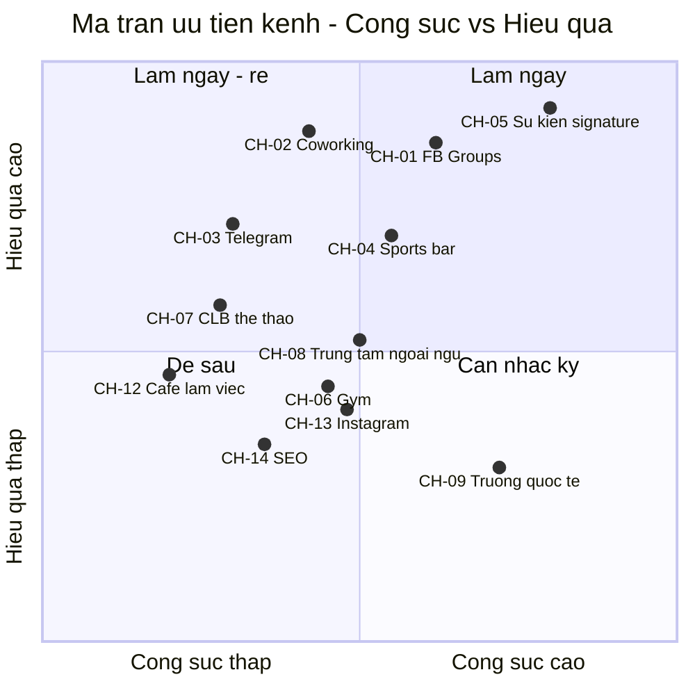

---

## 5. Chiến lược seed 100 user đầu tiên

### 5.1. Định nghĩa "user" trong bối cảnh này

Không đếm lượt tải app. Một **seed user hợp lệ** phải thỏa **cả ba** điều kiện:

1. Đã tạo hồ sơ và hoàn tất onboarding (chọn ≥ 2 sở thích, ≥ 1 khu vực). Trước 13/11/2026 tương đương form waitlist 5 trường trên landing page; từ 13/11/2026 là onboarding trong app.
2. Đã **cam kết tham dự một sự kiện cụ thể**. Đơn vị đo đổi theo giai đoạn kỹ thuật (§12.1): **trước 13/11/2026** = một bản ghi trong `signup_sheet` (Google Form) *và* một dòng trong sổ check‑in tại cửa, hoặc đã vào nhóm WhatsApp/Telegram cộng đồng và nhắn ≥ 1 tin thật; **từ 13/11/2026** = một bản ghi `rsvps` gắn với `occurrence_id` trong app.
3. Tự khai đang ở Đà Nẵng và dự kiến ở lại ≥ 3 tuần nữa.

> **Cảnh báo đo lường:** trong 6 tuần seed (01/09 – 19/10/2026) **chưa có RSVP trong app**. Toàn bộ chỉ tiêu tuần ở §5.3 là chỉ tiêu **tiền‑app**. Không được báo cáo con số này như "registered user trong app" — bảng quy đổi giữa hai đơn vị nằm ở §12.1.

Mục tiêu: **100 seed user hợp lệ trong 6 tuần**, trong đó ≥ 60 thuộc phân khúc S1 và ≥ 45 đã tham dự thật ít nhất 1 sự kiện.

### 5.2. Bài toán quy đổi ngược

| Bước phễu | Tỷ lệ giả định | Số cần thiết |
|---|---|---|
| 100 seed user hợp lệ | — | 100 |
| → Registered → hợp lệ | 70% | 143 registered |
| → Tiếp xúc có ý nghĩa → registered | 22% | **650 lượt tiếp xúc có ý nghĩa** |
| → Tiếp xúc thoáng qua → có ý nghĩa | 30% | ~2.200 lượt tiếp xúc thoáng qua |

**"Tiếp xúc có ý nghĩa"** = một cuộc trò chuyện trực tiếp ≥ 60 giây, hoặc một comment trả lời đích danh, hoặc một lần quét QR. **"Thoáng qua"** = nhìn thấy poster, lướt qua bài đăng.

650 tiếp xúc có ý nghĩa / 6 tuần = **~110/tuần** = ~22/ngày làm việc, chia cho 2 người = **11 cuộc trò chuyện có ý nghĩa mỗi người mỗi ngày**. Đây là con số khả thi nhưng đòi hỏi kỷ luật cao và là lý do phân khúc phải có mật độ địa lý cao.

### 5.3. Kịch bản theo tuần

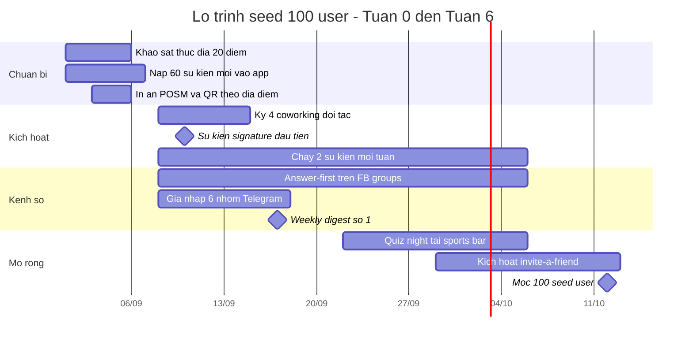

#### Tuần 0 — 01/09 đến 07/09: Đổ nền, không tuyển user

| Ngày | Việc | Người | Kết quả cần có |
|---|---|---|---|
| T2–T3 | Khảo sát thực địa: đi bộ toàn cụm An Thượng – Mỹ An, ghi nhận 20 địa điểm theo checklist Mục 15 | Cả đội | Bảng 20 địa điểm có tên người quyết định + số liên lạc |
| T2–T5 | Curate và nạp **60 sự kiện thật** trải trong 3 tuần tới | Curator | App không bao giờ hiện màn hình trống |
| T3 | Chốt **6 khu vực** `area_slug` cho MVP: `an-thuong`, `my-khe`, `my-an`, `hai-chau`, `son-tra`, `ngu-hanh-son` | Product | Bộ lọc khu vực chạy được |
| T4 | Thiết kế & in POSM: 20 standee A5, 200 thẻ A6, 15 poster A3, mỗi cái một QR riêng | Founder | Mỗi địa điểm một `channel_code` |
| T5 | Cài đặt tracking đầy đủ theo Mục 11 và kiểm tra bằng 10 phiên thử | Engineer | Dashboard hiển thị đúng |
| T6 | Chốt lịch 8 tuần sự kiện signature | Cả đội | Lịch cố định, không đổi giờ |
| T7 | Diễn tập: 5 người quen chạy thử toàn bộ luồng đăng ký → RSVP → tham dự | Cả đội | Không còn lỗi chặn |

**Nguyên tắc Tuần 0:** không mời một người lạ nào. Một người mở app thấy trống là một người mất vĩnh viễn.

#### Tuần 1 — 08/09 đến 14/09: Chiếm cụm coworking

| Việc | Chỉ tiêu | Ghi chú |
|---|---|---|
| Gặp trực tiếp community manager của 6 coworking | Ký miệng ≥ 4 | Dùng mẫu `MSG-05` |
| Tổ chức `Language Exchange` số 1 | ≥ 15 người dự | RSVP **chỉ** qua app |
| Tổ chức `Newcomers Coffee` số 1 | ≥ 8 người dự | Nhắm người mới đến |
| Trả lời 25 câu hỏi trên nhóm Facebook | 25 comment | Tỷ lệ 10:1 |
| Gia nhập 6 nhóm Telegram/WhatsApp, chỉ quan sát | 6 nhóm | Chưa đăng gì |
| **Mục tiêu tích lũy** | **20 seed user** | |

#### Tuần 2 — 15/09 đến 21/09: Nội dung định kỳ + phủ vật lý

| Việc | Chỉ tiêu |
|---|---|
| Phát hành `Weekly Digest` số 1 (email + đăng nhóm FB) | Gửi tới toàn bộ user hiện có |
| Đặt POSM tại 12 địa điểm đã ký | 12 QR hoạt động |
| 2 sự kiện signature | ≥ 30 lượt dự cộng dồn |
| Bắt đầu đóng góp thật trong nhóm Telegram (trả lời, chia sẻ, không link) | ≥ 15 lượt |
| Phỏng vấn 8 user đầu tiên, mỗi cuộc 15 phút | 8 bản ghi |
| **Mục tiêu tích lũy** | **40 seed user** |

#### Tuần 3 — 22/09 đến 28/09: Mở kênh bar thể thao + nội dung xã hội

| Việc | Chỉ tiêu |
|---|---|
| Quiz night số 1 tại pub đối tác | ≥ 20 người |
| Bắt đầu đăng Reel `5 things this week` (3 post/tuần) | 3 post |
| Lần đầu nhắc sản phẩm trong nhóm Telegram (sau 2 tuần đóng góp) | 3 nhóm |
| Liên hệ 10 organizer gốc bằng `MSG-08` | 10 email/DM |
| **Mục tiêu tích lũy** | **58 seed user** |

#### Tuần 4 — 29/09 đến 05/10: Bật vòng lặp giới thiệu

| Việc | Chỉ tiêu |
|---|---|
| Bật vòng lặp mời bạn **phiên bản tiền‑app**: mã mời in trên thẻ A6 + tin nhắn mẫu `MSG-13` gửi tay ngay sau khi ghi nhận đăng ký | Live |
| Chốt kịch bản nhắc lịch **T−24h và T−2h**, gửi tay qua email/WhatsApp cho tới khi push chạy ở KT‑M3 (13/11/2026) | Kịch bản đã duyệt |
| Mở rộng sang 4 quán cà phê làm việc | 4 điểm mới |
| 2 sự kiện signature + 1 sự kiện do organizer bên ngoài đăng | ≥ 1 self-serve |
| **Mục tiêu tích lũy** | **74 seed user** |

#### Tuần 5 — 06/10 đến 12/10: Nén và chốt mốc

| Việc | Chỉ tiêu |
|---|---|
| Sự kiện lớn nhất giai đoạn: `Da Nang Connect Community Night`, đồng tổ chức với 2 coworking + 1 pub | ≥ 45 người |
| Chiến dịch `Bring one friend` — mọi RSVP hiển thị lời mời | ≥ 20% RSVP có lời mời gửi đi |
| Rà soát toàn bộ user chưa RSVP lần 2, gửi push cá nhân hóa theo sở thích | — |
| **Mục tiêu tích lũy** | **100 seed user** |

#### Tuần 6 — 13/10 đến 19/10: Kiểm định, không mở rộng

| Việc | Đầu ra |
|---|---|
| Phỏng vấn sâu 15 user (10 đang hoạt động, 5 đã bỏ) | Bản tổng hợp lý do ở lại / rời đi |
| Tính retention W1 và W4 của cohort Tuần 1–2 | Con số thật đầu tiên |
| Đối chiếu với ngưỡng ở §10.7 và cổng quyết định §14.2 | Quyết định: tiếp tục / điều chỉnh / xoay trục |
| Chốt danh sách 15 organizer ưu tiên cho M2 | Danh sách có xếp hạng |

### 5.4. Phân bổ nguồn user dự kiến trong 100 seed user

| Nguồn | Số user | Tỷ trọng |
|---|---|---|
| Sự kiện signature tự tổ chức (CH-05) | 34 | 34% |
| Coworking — QR + giới thiệu miệng (CH-02) | 22 | 22% |
| Nhóm Facebook — answer-first (CH-01) | 16 | 16% |
| Telegram/WhatsApp (CH-03) | 11 | 11% |
| Bar thể thao / quiz night (CH-04) | 9 | 9% |
| Mời bạn từ user hiện có (loop) | 6 | 6% |
| Khác (cà phê, tự tìm thấy) | 2 | 2% |

### 5.5. Quy tắc kỷ luật khi seed

1. **Không mua user.** Không chạy quảng cáo trả tiền trong 6 tuần đầu. Quảng cáo che mất tín hiệu về việc sản phẩm có tự nhiên hấp dẫn hay không.
2. **Không mở phân khúc thứ hai** trước khi chạm mốc 100. Dàn trải là rủi ro số 1 đã được nêu trong brief.
3. **Không mở khu vực thứ hai.** Công sức tuyển user chỉ dồn vào An Thượng – Mỹ An; Sơn Trà và Hải Châu chỉ mở từ M3 trở đi. Đây là quy tắc phân bổ công sức, **không phải** cấu hình sản phẩm — bộ lọc vẫn luôn hiển thị đủ 6 khu vực MVP.
4. **Mọi đăng ký đi qua kênh chính thức.** Không có ngoại lệ, kể cả với bạn bè: trước 13/11/2026 là form + sổ check‑in, từ 13/11/2026 là RSVP trong app (§12.1).
5. **Mỗi user seed phải được gặp mặt hoặc nhắn tin riêng ít nhất một lần** trong 6 tuần đầu. 100 người là con số vẫn còn làm thủ công được.

---

## 6. Thư viện tin nhắn mẫu tiếng Anh

> Toàn bộ nội dung hướng tới người dùng viết bằng **tiếng Anh**. Tiếng Việt chỉ dùng trong kênh nội bộ và khi làm việc với đối tác Việt Nam.
> Quy tắc chung: ngắn, cụ thể, có ngày giờ địa điểm thật, không dùng từ ngữ marketing, không dùng emoji quá 1 cái mỗi tin.

### MSG-01 — Trả lời trong nhóm Facebook (answer-first, không link)

```
Three things this week that might fit:

- Wed 7pm — Language exchange at a coworking space in An Thuong, free, usually 25–30 people, half Vietnamese half foreigners.
- Fri 7pm — Board game night at a bar on Nguyen Van Thoai, free entry.
- Sun 6am — Beach run from My Khe, 5k easy pace, coffee after.

Happy to send you the exact addresses if you want them.
```

### MSG-02 — Bài đăng giá trị hằng tuần trên nhóm Facebook (thứ Năm)

```
What's happening in Da Nang this weekend — Fri 12 to Sun 14 Sept

FRIDAY
- 7:00pm  Board game night, An Thuong. Free.
- 8:00pm  Live acoustic, riverside Hai Chau. Free.

SATURDAY
- 9:30am  Newcomers coffee, My An. Free, good if you arrived recently.
- 4:00pm  Pickup football, artificial turf near My Khe. 50k per player.
- 7:00pm  Pub quiz, An Thuong. Free, teams of up to 5.

SUNDAY
- 6:00am  Beach run, 5k, My Khe. Free.
- 10:00am Vietnamese–English language exchange, My An. Free.

I put this list together by hand every week from Facebook, Meetup and a few
group chats, because I got tired of checking six places. Full list with
addresses and maps in the first comment.
```

### MSG-03 — Bắt chuyện trực tiếp tại coworking / quán cà phê

```
Hey — sorry to interrupt. Are you living here or just passing through?

[nếu vừa đến] How long have you been in Da Nang? … The first couple of weeks
are the hard part. I run a small thing that collects everything happening
here in one place — events, sports, language exchange. There's a language
exchange Wednesday 7pm two streets away, usually about 30 people. Want me to
show you?

[chìa điện thoại, mở đúng trang sự kiện đó, KHÔNG mở trang chủ]
```

**Quy tắc vàng khi bắt chuyện:** luôn mở app ở **một sự kiện cụ thể**, không bao giờ ở trang chủ. Bán một buổi tối, không bán một nền tảng.

### MSG-04 — Giới thiệu trong nhóm Telegram (chỉ dùng sau ≥ 2 tuần đóng góp thật)

```
Small thing that might be useful for this group: I keep a running list of
everything happening in Da Nang for foreigners — events, sports meetups,
language exchange — in one app, because it's currently spread across about
five different places.

It's free, there's no ads, and I add most of the listings by hand. If your
game or meetup is on there and you'd rather it wasn't, tell me and I'll take
it down within the day.

<link>
```

### MSG-05 — Đề nghị hợp tác với coworking space

```
Subject: Free weekly community event for your members

Hi <name>,

I run Da Nang Connect — a small app that collects everything happening in Da
Nang for the foreign community in one place. Right now I list about 60 events
a month, all added by hand.

I'd like to host a free weekly community event at <space> — most likely a
language exchange or a newcomers meetup, Wednesday or Thursday evening,
around 25–35 people.

What I bring: I organise it, I bring the people, I handle sign-ups, I clean up.
What I'd ask from you: the space for two hours, and a mention in your member
channel.

No money either way. Your members get a reason to come in the evening, I get
a room. If it doesn't work after three weeks we stop, no hard feelings.

Can I drop by this week to talk for ten minutes?

<name>
<phone / Telegram>
```

### MSG-06 — Đề nghị hợp tác với quán bar thể thao

```
Subject: Filling your Tuesday night

Hi <name>,

Tuesdays are quiet for most bars in An Thuong. I'd like to run a free pub
quiz at <bar> every Tuesday, 7:30pm, for the foreign community here.

I run Da Nang Connect, an app that lists everything happening in the city for
foreigners. I'd handle the questions, the hosting and the sign-ups, and I'd
push it to my list and to the Facebook groups.

All I'd ask is a small prize for the winning team — a pitcher and a plate of
something — and permission to put a poster by the door.

Expect 20–35 people, most of whom will eat and drink. First one is a trial.
Interested?

<name>
```

### MSG-07 — Thẻ chào mừng đặt tại homestay / căn hộ dịch vụ (A6, hai mặt)

```
MẶT TRƯỚC
Just arrived in Da Nang?
Here's what's happening this week.
[QR]
Free. No ads. Built by people who live here.

MẶT SAU
Language exchange · Pickup football · Beach runs · Pub quiz
Yoga · Live music · Newcomer meetups · Day trips
All in one place, filtered by neighbourhood.
An Thuong · My Khe · My An · Hai Chau · Son Tra · Ngu Hanh Son
```

### MSG-08 — Tiếp cận organizer lần đầu (sự kiện của họ đã được curate lên app)

```
Subject: 34 people are looking at your Wednesday meetup

Hi <name>,

I run Da Nang Connect, a small app that collects events for the foreign
community in Da Nang in one place.

I added your <event name> on <day> to the listings last week — the public
details only, with a link back to your <Facebook group / Meetup page> as the
source. Since then it's been viewed 34 times and 9 people have said they're
going.

Two things:

1. If you'd rather I didn't list it, say the word and it's gone today.
2. If you're happy with it, you can take the listing over — you'd control the
   details, see who's coming, and message them directly. It's free, and it
   takes about two minutes to set up.

Either way, thanks for running it — yours is one of the more consistent
meetups in the city.

<name>
<phone / Telegram>
```

**Vì sao mẫu này hiệu quả:** mở đầu bằng **con số thật của chính họ**, trao quyền gỡ bỏ trước khi mời hợp tác, và kết bằng lời khen cụ thể chứ không chung chung.

### MSG-09 — Nhắc lần 2 cho organizer (gửi sau 6 ngày nếu không phản hồi)

```
Subject: Re: 34 people are looking at your Wednesday meetup

Hi <name>,

Quick follow-up — your listing is now at 61 views and 17 going. Last
Wednesday, 6 of those came from the app.

The offer to hand it over to you stands, and so does the offer to take it
down. A one-word reply is enough either way.

<name>
```

### MSG-10 — Mời organizer vào chương trình Founding Organizer

```
Subject: Founding Organizer — 50 spots, yours if you want it

Hi <name>,

You've now run <n> events through Da Nang Connect and they've pulled in
<x> sign-ups. I'd like to offer you one of 50 Founding Organizer spots.

What it gets you, permanently:
- Verified Organizer badge on your profile and every listing
- Top placement in your neighbourhood and category for one week per event
- A slot in the weekly email that goes to every user in the city
- All paid features, free, for as long as the account exists
- A direct line to me for anything you need changed in the product

What I'd ask: post your events here first, or at the same time as elsewhere.
That's it. No exclusivity, no fee, ever.

There's no catch — I need the first fifty organisers to make this worth using,
and you're one of them.

<name>
```

### MSG-11 — Push notification (mọi bản đều ≤ 100 ký tự)

| Mã | Ngữ cảnh | Nội dung |
|---|---|---|
| `PUSH-01` | T−24h trước occurrence đã RSVP | `Tomorrow 7pm: Language Exchange, An Thuong. 28 going.` |
| `PUSH-02` | T−2h | `Starts in 2 hours. Directions and who's coming are in the app.` |
| `PUSH-03` | T+3h sau sự kiện | `Did you make it to Language Exchange? Tap to confirm.` |
| `PUSH-04` | Thứ Năm hằng tuần | `9 things happening this weekend in An Thuong and My An.` |
| `PUSH-05` | Sự kiện mới khớp sở thích | `New: pickup football, Sunday 4pm, My Khe. 6 spots left.` |
| `PUSH-06` | Người dùng im lặng 10 ngày | `You marked yourself interested in sports. Three games this week.` |
| `PUSH-07` | Bạn bè đã RSVP | `<name> is going to Pub Quiz on Tuesday.` |

### MSG-12 — Email digest hằng tuần (gửi 17:00 thứ Năm)

```
Subject: Da Nang this weekend — 11 things, all in one list

Hi <first_name>,

Eleven things happening between Friday and Sunday. Four of them are in An
Thuong, which is where you said you're based.

NEAR YOU — AN THUONG & MY AN
  Fri 7:00pm   Board game night              free      12 going
  Sat 9:30am   Newcomers coffee              free       8 going
  Sat 7:00pm   Pub quiz                      free      31 going
  Sun 10:00am  Language exchange             free      24 going

ELSEWHERE
  ...

Everything is free unless marked. Tap any of these to see who's going.

If Thursday is the wrong day for this email, you can move it or turn it off
here: <link>
```

### MSG-13 — Copy trong app cho luồng mời bạn

| Vị trí | Nội dung |
|---|---|
| Sau khi RSVP thành công | `You're going. Things are better with someone you know — invite a friend?` |
| Nút chính | `Invite someone to come with me` |
| Tin nhắn chia sẻ tạo sẵn | `I'm going to <event name> on <day> at <time>, <area>. Come with me — here's the link: <url>` |
| Sau khi lời mời được chấp nhận | `<name> is coming with you. Both of you got the Connector badge.` |

### MSG-14 — Kịch bản bàn giao khi user rời Đà Nẵng

```
In-app, kích hoạt khi user đặt trạng thái "leaving Da Nang":

Leaving already? Before you go — is there someone who's just arrived that
you'd hand this over to? A single introduction saves them the two weeks you
spent figuring the city out.

[Invite someone] [Not now]

Nếu gửi: tặng badge "Community Passer" và giữ hồ sơ ở trạng thái ngủ đông
thay vì xóa, để khi quay lại Đà Nẵng vẫn còn lịch sử tham gia.
```

---

## 7. Playbook curate thủ công

> Đây là công việc quan trọng nhất trong 6 tháng đầu và cũng là công việc dễ bị bỏ bê nhất vì nó không có cảm giác "làm sản phẩm". Nguyên tắc chi phối: **nội dung đi trước tính năng** (nguyên tắc 1 của tài liệu 08). Một người mở app thấy 4 sự kiện là một người không bao giờ quay lại.

### 7.1. Ranh giới pháp lý và đạo đức — đọc trước khi chạm vào bàn phím

| Quy tắc | Nội dung | Vì sao |
|---|---|---|
| **Không scraping** | Mọi listing nhập tay qua Admin Curation Console. Không viết bot, không dùng API không được phép, không tải hàng loạt. | Điều khoản nền tảng nguồn + rủi ro pháp lý. Trùng nguyên tắc 2 của tài liệu 08. |
| **Chỉ thông tin công khai** | Chỉ lấy: tên sự kiện, thời gian, địa điểm, giá, mô tả công khai, ảnh do organizer tự công bố. | Tránh xử lý dữ liệu cá nhân ngoài phạm vi. |
| **Không sao chép ảnh có bản quyền** | Nếu không chắc, dùng ảnh khu vực do đội tự chụp (thư viện 60 ảnh chụp Tuần 0). | Rủi ro DMCA và uy tín. |
| **Luôn ghi nguồn** | Mỗi listing curate có `source_type`, `source_url`, `source_name` hiển thị công khai ở cuối trang chi tiết: *"Listed from <source>. This event is run by <organizer>, not by Da Nang Connect."* | Trung thực + là cái cớ tự nhiên để mở lời với organizer (§8). |
| **Gỡ trong 24h khi được yêu cầu** | Organizer nhắn một chữ "remove" là gỡ trong ngày, không hỏi lại, không thương lượng. | Đây là điều khiến `MSG-08` đáng tin. |
| **Không mạo danh** | Không bao giờ tạo sự kiện dưới tên organizer khác. Listing curate luôn có `host_user_id` = tài khoản đội (`role = 'curator'`) cho tới khi được claim. | Quyết định chốt §5 về `events.host_user_id`. |

**Nhãn dữ liệu bắt buộc trên mọi listing curate:** `is_curated = true`, `curated_by_user_id`, `curated_at`, `source_type ∈ {facebook_group, facebook_page, meetup, luma, instagram, telegram, venue_website, poster_photo, word_of_mouth}`.

### 7.2. Nguồn curate và nhịp quét

| # | Nguồn | Loại | Nhịp quét | Sản lượng kỳ vọng/tuần | Người |
|---|---|---|---|---|---|
| SRC-01 | 2 nhóm Facebook expat lớn | `facebook_group` | Hằng ngày 08:30 | 6–10 | Curator |
| SRC-02 | Fanpage 25 địa điểm đã khảo sát Tuần 0 | `facebook_page` | T2 + T5 | 8–14 | Curator |
| SRC-03 | Meetup / Luma / trang sự kiện địa phương | `meetup`, `luma` | T2 | 3–6 | Curator |
| SRC-04 | Instagram 20 tài khoản địa điểm/CLB | `instagram` | T3 + T6 | 4–8 | CTV bán thời gian |
| SRC-05 | 6 nhóm Telegram/WhatsApp thể thao | `telegram` | Hằng ngày | 5–9 (nhiều sự kiện lặp) | CTV bán thời gian |
| SRC-06 | Poster chụp tại chỗ khi đi field | `poster_photo` | Liên tục | 2–5 | Cả đội |
| SRC-07 | Organizer gửi trực tiếp (email, DM) | `word_of_mouth` | Liên tục | 0 → tăng dần | Curator |
| SRC-08 | Lịch lớp cố định của gym/yoga/trung tâm | `venue_website` | Tháng 1 lần | 10–20 occurrence lặp | Curator |

**Chỉ tiêu tồn kho (bắt buộc kiểm mỗi thứ Hai 09:00, gắn với chỉ số `I4` ở §10.3):**

| Cửa sổ | Số occurrence tối thiểu đã publish | Ghi chú |
|---|---|---|
| 7 ngày tới | ≥ 20 (M1) → ≥ 55 (M6) | Ngưỡng đỏ tuyệt đối: **18**. Dưới mức này Curator dừng mọi việc khác. |
| 14 ngày tới | ≥ 30 | |
| Cuối tuần gần nhất (T6 tối → CN tối) | ≥ 8, trải ≥ 3 khu vực, ≥ 3 danh mục | Cuối tuần là lúc lưu lượng cao nhất |
| Sự kiện miễn phí | ≥ 60% tổng số | Định vị "free unless marked" |

### 7.3. Quy trình 8 bước cho một listing

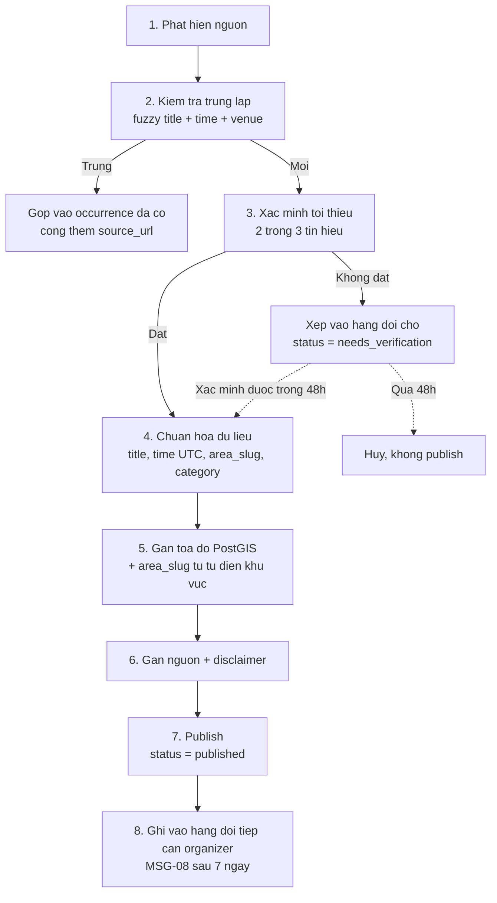

**Bước 3 — quy tắc "2 trong 3 tín hiệu".** Một sự kiện chỉ được publish nếu xác nhận được **ít nhất 2** trong 3:
1. Có bài đăng công khai còn hiệu lực trong 30 ngày gần nhất.
2. Địa điểm xác nhận (gọi điện, nhắn tin, hoặc đã có trong danh sách 25 địa điểm khảo sát Tuần 0).
3. Có bằng chứng sự kiện này đã diễn ra ít nhất 1 lần trước đó (ảnh, bài đăng cũ, lời kể của ≥ 2 người).

Sự kiện chỉ đạt 1 tín hiệu → `status = 'needs_verification'`, **không hiển thị công khai**, có 48 giờ để xác minh thêm.

### 7.4. Định nghĩa hoàn thành (DoD) cho một listing

Một listing chỉ được `published` khi đủ **8 trường bắt buộc** — đây chính là mẫu số của chỉ số `C1` ở §10.6:

| # | Trường | Quy tắc |
|---|---|---|
| 1 | `title` | Tiếng Anh, ≤ 60 ký tự, không viết hoa toàn bộ, không emoji |
| 2 | `starts_at` / `ends_at` | Lưu **UTC**, nhập theo `Asia/Ho_Chi_Minh`, luôn có giờ kết thúc (nếu nguồn không nói, mặc định +2h) |
| 3 | `venue_name` + `address_line` | Địa chỉ có số nhà + tên đường thật, không ghi "An Thượng" chung chung |
| 4 | `geo_point` | Toạ độ PostGIS, sai số ≤ 80 m |
| 5 | `area_slug` | Một trong 6 khu vực MVP |
| 6 | `category` | 1 danh mục chính + tối đa 2 phụ |
| 7 | `price_vnd` | Số cụ thể hoặc 0. **Không** để trống, **không** ghi "liên hệ" |
| 8 | `capacity` | Bắt buộc từ 13/11/2026 vì RSVP + waitlist gắn vào `event_occurrences`. Nếu nguồn không công bố, đặt ước lượng thận trọng và bật cờ `capacity_is_estimated` |

**Ba trường nên có (không chặn publish):** ảnh ≥ 1200 px, `language` (`en` / `vi` / `both`), `is_beginner_friendly`.

### 7.5. Khử trùng lặp

Trùng lặp là bệnh chết người của sản phẩm curate: một sự kiện xuất hiện 3 lần từ 3 nguồn làm người dùng mất niềm tin ngay lập tức.

| Lớp | Quy tắc so khớp | Xử lý |
|---|---|---|
| L1 — chắc chắn trùng | Cùng ngày, giờ bắt đầu lệch ≤ 30 phút, khoảng cách venue ≤ 150 m | Gộp tự động, giữ bản ghi cũ hơn, cộng thêm `source_url` |
| L2 — nghi ngờ | Cùng ngày, độ tương đồng tiêu đề ≥ 0,75 (trigram), cùng `area_slug` | Đưa vào hàng đợi người duyệt, quyết trong 24h |
| L3 — sự kiện lặp | Cùng `title` + cùng thứ trong tuần + cùng venue, xuất hiện ≥ 3 lần | Chuyển thành **event có nhiều `event_occurrences`**, không tạo event mới mỗi tuần |

Chỉ số theo dõi: `C7` — tỷ lệ trùng lặp còn sót sau khử trùng, đo bằng cách rà tay 50 listing ngẫu nhiên mỗi thứ Sáu.

### 7.6. Phân công và ngân sách thời gian

| Việc | Thời lượng/tuần | Người | Khung giờ cố định |
|---|---|---|---|
| Quét nguồn + nhập liệu | 8 giờ | Curator | T2–T6, 08:30–10:00 |
| Xác minh gọi/nhắn địa điểm | 3 giờ | Curator | T3 + T5 chiều |
| Khử trùng lặp + rà chất lượng 50 mẫu | 2 giờ | Curator | T6 09:00–11:00 |
| Quét Instagram + Telegram | 5 giờ | CTV | Linh hoạt |
| Tiếp cận organizer (`MSG-08`/`MSG-09`) | 3 giờ | Curator | T4 |
| Chụp ảnh field + poster | 2 giờ | Cả đội | Cuối tuần |
| **Tổng** | **23 giờ/tuần** | | ≈ 0,6 FTE |

### 7.7. Đường thoát khỏi curate thủ công

Curate thủ công là giàn giáo, không phải toà nhà. Điều kiện tháo giàn giáo:

| Mốc | Điều kiện | Hành động |
|---|---|---|
| Tỷ lệ tự phục vụ ≥ 25% (mục tiêu M3) | `S2 ≥ 25%` trong 4 tuần liên tiếp | Giảm SRC-03/SRC-04 xuống 1 lần/tuần |
| Tỷ lệ tự phục vụ ≥ 45% (mục tiêu M6) | `S2 ≥ 45%` trong 4 tuần liên tiếp | Cắt CTV bán thời gian, giữ Curator 0,3 FTE |
| Tỷ lệ tự phục vụ ≥ 70% | Sau ra mắt | Curate chỉ còn dùng cho sự kiện "mồi" khu vực mới |

**Không bao giờ tháo hoàn toàn.** Ngay cả khi tự phục vụ đạt 80%, đội vẫn giữ 4 giờ/tuần curate để lấp lỗ hổng cuối tuần — vì tồn kho cuối tuần là thứ trực tiếp tạo ra WCA.

---

## 8. Kịch bản chuyển đổi organizer

> Nhắc lại quyết định chốt: **`organizer` không phải role toàn cục**. Một người là organizer của những sự kiện mình tạo, thể hiện qua `events.host_user_id` và bảng `event_cohosts`. Role toàn cục trong `users.role` chỉ có 5 giá trị: `member`, `curator`, `moderator`, `admin`, `super_admin`. Quyền tạo/sửa sự kiện được guard RBAC quyết định bằng **role toàn cục + quan hệ theo sự kiện + trust level**.

### 8.1. Thang bậc chuyển đổi

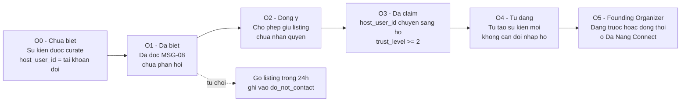

| Bậc | Định nghĩa vận hành | Sự kiện tracking đánh dấu | Mục tiêu M6 |
|---|---|---|---|
| O0 | Sự kiện của họ đã có trên app, họ chưa biết | `event_published` với `is_curated = true` | — |
| O1 | Đã nhận `MSG-08` | Ghi tay vào CRM bảng tính | 60 người |
| O2 | Trả lời đồng ý giữ listing | Ghi tay | 30 người |
| O3 | Đã claim thành công, `host_user_id` chuyển sang họ | `listing_claim_approved` | **28 người** |
| O4 | Tự tạo ≥ 1 sự kiện mới sau khi claim | `event_published` với `is_self_serve = true` | **22 người/tháng** |
| O5 | Đã nhận suất Founding Organizer | `organizer_program_accepted` | **30/50 suất** |

### 8.2. Điều kiện kỹ thuật để claim (guard RBAC)

Một yêu cầu claim chỉ được duyệt khi thỏa **tất cả**:

| # | Điều kiện | Kiểm tra bằng |
|---|---|---|
| 1 | `users.role = 'member'` trở lên (không phải khách chưa đăng nhập) | Cột `users.role` |
| 2 | `users.trust_level ≥ 2` (đã xác minh email **và** điện thoại) | Cột `users.trust_level` (smallint 0–5) |
| 3 | Chứng minh quan hệ với sự kiện gốc: quản trị viên trang/nhóm nguồn, hoặc email cùng tên miền địa điểm, hoặc gọi video 3 phút với Curator | Trường `verification_method` trong `listing_claim_requested` |
| 4 | Không có report `resolved = removed` nào trong 90 ngày | Bảng report |
| 5 | Một `moderator` bấm duyệt | `listing_claim_approved.reviewer_role` |

**SLA duyệt claim: 24 giờ làm việc.** Quá hạn → cảnh báo tự động cho Founder.

Sau khi duyệt: `events.host_user_id` chuyển sang user mới, bản ghi cũ giữ lại trong `event_cohosts` với vai trò `curator` để đội vẫn sửa được lỗi chính tả, và ghi một dòng `trust_signals` (+ điểm thành phần `organizer_claim`) theo quyết định chốt §3.

### 8.3. Chọn ai trước — bảng chấm điểm 15 organizer ưu tiên

Chấm mỗi organizer trên thang 25 điểm, tiếp cận theo thứ tự giảm dần.

| Tiêu chí | Trọng số | Thang điểm |
|---|---|---|
| Tần suất tổ chức | ×5 | 5 = hằng tuần · 3 = 2 tuần/lần · 1 = thất thường |
| Số người tham dự trung bình | ×5 | 5 = ≥ 40 · 3 = 15–39 · 1 = < 15 |
| Tỷ trọng người nước ngoài trong nhóm dự | ×5 | 5 = ≥ 80% · 3 = 40–79% · 1 = < 40% |
| Mức độ đau vì công cụ hiện tại (phải trả lời "có game hôm nay không?" thủ công) | ×5 | 5 = trả lời > 20 tin/tuần · 1 = không đau |
| Khả năng tiếp cận (có kênh liên lạc trực tiếp) | ×5 | 5 = biết mặt · 3 = có DM · 1 = chỉ qua trang |

**Thứ tự tiếp cận khuyến nghị:** (1) CLB thể thao pickup — điểm đau cao nhất, (2) nhóm language exchange, (3) coworking đã ký, (4) quán bar có quiz night, (5) gym/yoga có lịch lớp cố định.

### 8.4. Kịch bản hội thoại đầy đủ

**Bối cảnh:** gặp trực tiếp hoặc gọi 10 phút, sau khi họ đã đọc `MSG-08`.

| Nhịp | Bạn nói | Mục đích |
|---|---|---|
| 1. Mở | *"Your Wednesday game is one of the few things in this city that actually runs on time. I listed it — 61 views, 17 people said they're going last week."* | Số thật của họ, không nói về mình |
| 2. Trao quyền gỡ | *"Before anything else: if you want it off, I take it down today. No hard feelings."* | Đảo ngược thế yếu, tạo an toàn |
| 3. Nêu nỗi đau | *"How many times a week do people ask you 'is there a game tonight'?"* → để họ tự nói | Họ tự nêu vấn đề, không phải bạn |
| 4. Đề nghị hẹp | *"If you take the listing over, that question stops. People see the time, the spots left, and who's already coming."* | Bán **một** lợi ích, không bán nền tảng |
| 5. Hạ rào cản | *"Two minutes. I do it with you right now on your phone."* | Làm ngay tại chỗ, không hẹn lại |
| 6. Khử lo ngại độc quyền | *"Keep posting in your Facebook group exactly like now. This is in addition, never instead."* | Nỗi sợ lớn nhất của organizer |
| 7. Chốt nhỏ | *"Want me to set the next four weeks up as a repeating event so you never touch it again?"* | Chốt bằng việc mình làm hộ |

### 8.5. Bảng xử lý phản đối

| Phản đối thật hay gặp | Câu trả lời | Không được nói |
|---|---|---|
| *"I already have a Facebook group."* | *"Keep it. This just answers the 'when is it' question for people who aren't in your group yet."* | Đừng chê Facebook |
| *"Are you going to charge me later?"* | *"Founding Organizer accounts are free permanently, and that's written into the terms. If we ever charge, it applies to accounts created after that date."* | Đừng nói "chưa biết" |
| *"I don't want strangers showing up."* | *"You set the capacity, you see every name and trust level before they arrive, and you can remove anyone. Waitlist handles overflow so you never get 40 people at a 20-person table."* | Đừng hứa "sẽ có tính năng đó" |
| *"Who owns my member list?"* | *"You see who RSVP'd to your events. We never sell or share it. You can export it and you can delete your account with the data."* | Đừng lảng tránh |
| *"I don't have time."* | *"I'll enter the next four weeks for you now. After that it's one tap to repeat."* | Đừng để họ tự làm lần đầu |
| *"My event isn't for foreigners only."* | *"Nothing here is foreigners-only. About a third of the people on it are Vietnamese."* | Đừng khẳng định tỷ lệ nếu chưa đo |

### 8.6. Chương trình Founding Organizer — 50 suất

| Hạng mục | Quy định |
|---|---|
| Số suất | **50**, đánh số `slot_number` 1–50, công khai số suất còn lại |
| Cửa sổ mở | 01/11/2026 → 31/03/2027, hoặc tới khi hết suất |
| Điều kiện nhận | Đã ở bậc O3 (đã claim) **và** đã chạy ≥ 2 occurrence qua Da Nang Connect **và** `trust_level ≥ 3` |
| Quyền lợi | Huy hiệu `Verified Organizer` trên hồ sơ và mọi listing · Ưu tiên hiển thị đầu khu vực + danh mục 7 ngày/sự kiện · 1 slot trong email digest tuần · Toàn bộ tính năng trả phí miễn phí vĩnh viễn · Kênh liên hệ trực tiếp với Founder |
| Nghĩa vụ | Đăng sự kiện tại Da Nang Connect **trước hoặc đồng thời** với nơi khác. Không độc quyền, không phí, không cam kết số lượng. |
| Điều kiện mất suất | Ba lần liên tiếp hủy sự kiện < 24h, hoặc 1 vi phạm nghiêm trọng Community Guidelines đã xử lý `removed` |
| Mẫu thư mời | `MSG-10` |
| Chỉ số | `S6` tỷ lệ nhận lời mời, `S7` số suất đã lấp |

**Vì sao 50 chứ không phải 20 hay 200:** 50 là con số vừa đủ để phủ 6 khu vực × 8 danh mục ở mật độ 1 sự kiện/tuần, đồng thời vẫn đủ khan hiếm để có giá trị. 200 làm huy hiệu mất nghĩa; 20 không đủ lấp lịch.

### 8.7. Phễu chuyển đổi organizer và chỉ tiêu theo tháng

| Bước phễu | Tỷ lệ chuyển đổi giả định | M2 | M3 | M4 | M5 | M6 | Tích lũy M6 |
|---|---|---|---|---|---|---|---|
| Listing được curate (O0) | — | 70 | 80 | 85 | 90 | 110 | — |
| Gửi `MSG-08` (O1) | 100% listing đủ điều kiện | 10 | 14 | 12 | 12 | 12 | 60 |
| Phản hồi đồng ý (O2) | 50% | 5 | 7 | 6 | 6 | 6 | 30 |
| Claim thành công (O3) | 93% của O2 | 2 | 6 | 6 | 6 | 8 | 28 |
| Tự đăng sự kiện mới (O4) | 79% của O3 | 1 | 5 | 5 | 5 | 6 | 22 |
| Nhận Founding Organizer (O5) | ~68% của O4 | 0 | 6 | 6 | 8 | 10 | 30 |

**Nút thắt đã biết:** bước O1 → O2 (50%). Đòn bẩy hiệu quả nhất là `MSG-09` gửi sau 6 ngày — trong các nhóm cộng đồng nhỏ, thư nhắc lần 2 mang số liệu cập nhật thường nâng tỷ lệ phản hồi thêm 12–18 điểm phần trăm. Không gửi lần 3; im lặng sau 2 thư = đưa vào `do_not_contact` 90 ngày.

---

## 9. Growth loop và cơ chế mời bạn

> **Kỳ vọng đúng ngay từ đầu:** Da Nang Connect **không phải sản phẩm viral**. Hệ số k mục tiêu ở M6 là **0,30 – 0,35**, tức dưới 1 rất xa. Vòng lặp mời bạn ở đây không thay thế công sức seed thủ công (§5) — nó **khuếch đại** công sức đó lên khoảng 1,4–1,5 lần và, quan trọng hơn, nó **nâng tỷ lệ tham dự thật** vì người ta đi sự kiện lạ dễ hơn nhiều khi có một người quen đi cùng.
>
> ⚠️ **Ràng buộc lịch:** cơ chế mời trong app (deep link, `invite_code` gắn tài khoản, badge tự động) chỉ chạy được từ **KT‑M3 — 13/11/2026**, hoàn chỉnh ở **KT‑M5 — 25/12/2026**. Từ **Tuần 4 (29/09/2026)** đội chạy **phiên bản tiền‑app** bằng mã in trên thẻ A6 + tin nhắn tay `MSG-13`. Đơn vị đo của hai phiên bản khác nhau — xem bảng ở §12.1.

### 9.1. Vòng lặp cốt lõi — "Attendance Loop"

Vòng lặp chính không xoay quanh việc mời bạn, mà xoay quanh **một buổi đi chơi có thật**. Lời mời chỉ là một cạnh của vòng lặp, không phải trung tâm.

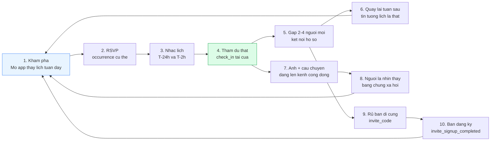

**Điểm gãy nguy hiểm nhất là bước 3 → 4** (RSVP nhưng không đến). Đây là lý do nhắc lịch **T−24h và T−2h** là quyết định chốt, không phải tuỳ chọn: mỗi điểm phần trăm no-show cắt trực tiếp vào North Star Metric.

### 9.2. Bốn vòng lặp phụ và tốc độ quay

Mỗi vòng lặp có một **chu kỳ quay** khác nhau. Vòng quay nhanh phải được đầu tư trước.

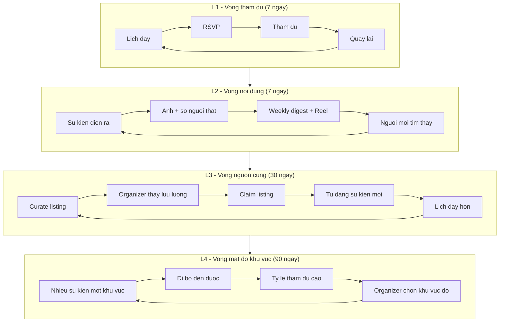

| Mã | Vòng lặp | Chu kỳ quay | Chỉ số đo tốc độ | Ưu tiên đầu tư | Bắt đầu chạy |
|---|---|---|---|---|---|
| **L1** | Tham dự | 7 ngày | `WCA` (§10.1) | **P0 — làm trước mọi thứ** | Tuần 1 (đo tay), KT‑M3 (đo trong app) |
| **L2** | Nội dung | 7 ngày | Số lượt xem digest + reach reel/tuần | P0 | Tuần 2 |
| **L3** | Nguồn cung | 30 ngày | `S2` tỷ lệ self-serve (§10.4) | P1 | M2 |
| **L4** | Mật độ khu vực | 90 ngày | `I7` số occurrence/khu vực/tuần | P2 | M4 |
| **L5** | Mời bạn | 14 ngày | `k-factor` (§9.6) | P2 — **không** làm trước L1 và L2 | Tuần 4 (tiền‑app), KT‑M3 (trong app) |

> **Quy tắc thứ tự:** không được bật vòng L5 khi L1 chưa quay. Mời một người bạn vào một app có 4 sự kiện là cách nhanh nhất để đốt cả hai mối quan hệ.

### 9.3. Cơ chế mời — ba đường vào

| Mã | Đường vào | Khi nào xuất hiện | Chạy được từ | Đơn vị đo |
|---|---|---|---|---|
| `INV-A` | **Mời sau khi RSVP** — màn hình xác nhận RSVP hiện đúng một nút `Invite someone to come with me` (`MSG-13`) | Ngay sau `rsvp_completed` | KT‑M3 (13/11/2026) | `invite_link_created` với `context = post_rsvp` |
| `INV-B` | **Mời kèm khách trong RSVP** — trường `guest_count` trên bảng `rsvps`, tối đa 2 khách, khách vẫn trừ vào `capacity` của `event_occurrences` | Trong form RSVP | KT‑M3 | `rsvp_completed.guest_count` |
| `INV-C` | **Chia sẻ sự kiện ra ngoài** — nút share tạo link có `invite_code` của người chia sẻ | Trang chi tiết sự kiện, digest email | KT‑M3 | `share_clicked` → `invite_link_opened` |
| `INV-D` | **Thẻ mời vật lý (tiền‑app)** — thẻ A6 in mã 6 ký tự, phát tay tại sự kiện; người nhận nhập mã vào form waitlist | Tuần 4 → 12/11/2026 | Tuần 4 (29/09/2026) | Cột `invite_code` trong `signup_sheet` |
| `INV-E` | **Bàn giao khi rời Đà Nẵng** — `MSG-14`, kích hoạt khi user đặt trạng thái *leaving Da Nang* | Hồ sơ | KT‑M5 (25/12/2026) | `invite_link_created` với `context = handover` |

**Thiết kế `invite_code`:** 6 ký tự chữ‑số viết hoa, loại bỏ `0/O/1/I/L` để đọc được qua điện thoại và in được lên thẻ giấy. Mỗi user có **một** mã cố định suốt đời tài khoản (dễ nhớ, dễ đọc to trong quán ồn) cộng với link deep-link theo sự kiện chứa cả `invite_code` và `occurrence_id`.

**Quy tắc gán công (attribution):** cửa sổ quy công **14 ngày** kể từ `invite_link_opened`; nếu một người mở nhiều link mời khác nhau thì **người mời đầu tiên** được ghi công (first-touch), vì mời bạn là hành vi quan hệ chứ không phải quảng cáo — ghi công cho người cuối sẽ khuyến khích spam.

### 9.4. Thưởng cho người mời và người được mời

> **Nguyên tắc tuyệt đối:** **không thưởng bằng tiền, voucher hay giảm giá.** Ba lý do: (a) sản phẩm ở Giai đoạn 1 gần như miễn phí hoàn toàn nên không có gì để giảm; (b) thưởng tiền kéo về đúng nhóm người không bao giờ đi sự kiện; (c) mọi chương trình thưởng tiền tại Việt Nam đều kéo theo nghĩa vụ thuế và kế toán không đáng ở giai đoạn này.
>
> Thưởng phải là **địa vị xã hội trong cộng đồng** và **sự tiện lợi**, không phải giá trị kinh tế.

#### 9.4.1. Bảng phần thưởng

| Bên nhận | Điều kiện kích hoạt | Phần thưởng | Cơ chế kỹ thuật | Chi phí |
|---|---|---|---|---|
| **Người mời** | Bạn được mời hoàn tất đăng ký + onboarding | Huy hiệu `Connector` trên hồ sơ, hiển thị số người đã đưa vào cộng đồng | Ghi 1 dòng `trust_signals` loại `invite_accepted` (append-only) | 0 đ |
| **Người mời** | Bạn được mời **check-in thật** một occurrence | +1 tín hiệu `invite_attended` — đây mới là tín hiệu tính điểm nặng khi job BullMQ tính lại `users.trust_level` | `trust_signals` | 0 đ |
| **Người mời** | 3 người được mời đã check-in thật | Đủ điều kiện xét **T3 — Active member** sớm hơn lộ trình thông thường | Job tính lại điểm tổng | 0 đ |
| **Người mời** | 10 người được mời đã check-in thật | Được mời vào nhóm `Community Builders` (kênh riêng với đội) và ưu tiên xét **T4 — Trusted** | Ghi tay + `trust_signals` | ~0 đ |
| **Người được mời** | Mở link mời | Vào thẳng trang sự kiện **đã điền sẵn**, thấy tên người mời và dòng *"<name> is going and invited you"* | Deep link mang `occurrence_id` | 0 đ |
| **Người được mời** | Hoàn tất đăng ký qua link mời | Huy hiệu `Invited by a member` hiển thị 30 ngày — giúp organizer yên tâm duyệt người mới | Cờ hiển thị, **không** thay đổi `users.trust_level` | 0 đ |
| **Người được mời** | Đăng ký qua link mời | Được **ghép ngồi cạnh** người mời trong sơ đồ đón khách của sự kiện đầu tiên; host được báo trước "đây là hai người đi cùng nhau" | Trường `invited_by_user_id` trên `rsvps` | 0 đ |
| **Cả hai** | Cùng check-in một occurrence | Cả hai nhận huy hiệu `Connector` cho đúng sự kiện đó (`MSG-13` dòng cuối) | `trust_signals` | 0 đ |
| **Người rời Đà Nẵng** | Gửi lời mời bàn giao (`INV-E`) thành công | Huy hiệu `Community Passer`, hồ sơ chuyển trạng thái ngủ đông thay vì xoá (`MSG-14`) | Cờ `is_dormant` | 0 đ |

#### 9.4.2. Ba thứ cố tình KHÔNG thưởng

| Không thưởng | Vì sao |
|---|---|
| **Ưu tiên vượt hàng đợi waitlist** | Waitlist là cơ chế công bằng theo thứ tự thời gian. Cho phép mua chỗ bằng lời mời sẽ phá huỷ niềm tin vào waitlist — thứ được chốt là MUST cho MVP. |
| **Nâng thẳng `users.trust_level`** | Trust level phản ánh mức độ **đáng tin**, không phản ánh mức độ **chăm mời bạn**. Lời mời chỉ tạo `trust_signals`; điểm tổng do job tính lại theo trọng số đã định, và mời bạn không bao giờ đủ để một mình đẩy ai lên T4. |
| **Bảng xếp hạng công khai người mời nhiều nhất** | Bảng xếp hạng biến quan hệ bạn bè thành cuộc thi và là mồi cho tài khoản ảo. Có thể có bảng **nội bộ** cho đội vận hành, không công khai. |

### 9.5. Chống lạm dụng

Vòng lặp mời là bề mặt tấn công dễ nhất trong toàn bộ sản phẩm, kể cả khi phần thưởng chỉ là huy hiệu — vì huy hiệu ảnh hưởng tới `trust_signals`, và `trust_level ≥ 2` là điều kiện claim listing (§8.2).

#### 9.5.1. Bảng luật chống lạm dụng

| # | Luật | Ngưỡng | Xử lý khi vi phạm | Tầng thực thi |
|---|---|---|---|---|
| A1 | Chỉ tài khoản `trust_level ≥ 1` (đã xác minh email) mới tạo được link mời | — | Ẩn nút mời | API guard |
| A2 | Giới hạn tần suất tạo link mời | 10 link / 24h / tài khoản | HTTP 429, ghi log | Rate limit Redis |
| A3 | Giới hạn số đăng ký được quy công cho một người mời | 5 / 24h · 25 / 30 ngày | Đăng ký vẫn thành công nhưng **không quy công**, không ghi `trust_signals` | Job kiểm tra |
| A4 | Chặn tự mời — trùng thiết bị, trùng IP trong 60 phút, trùng số điện thoại đã chuẩn hoá E.164, trùng địa chỉ email chuẩn hoá (bỏ dấu chấm, bỏ hậu tố `+`) | Bất kỳ dấu hiệu nào | Không quy công + gắn cờ `suspected_self_invite` vào hàng đợi `moderator` | Tầng đăng ký |
| A5 | Tín hiệu `invite_attended` chỉ ghi khi người được mời có `rsvps.status = 'checked_in'` **do host hoặc `curator` xác nhận**, không chấp nhận tự xác nhận | — | Không ghi tín hiệu | Job BullMQ |
| A6 | Một người được mời chỉ quy công **một lần trọn đời**, kể cả khi xoá tài khoản rồi tạo lại bằng cùng số điện thoại | — | Bỏ qua lần sau | Bảng `invite_attributions` có ràng buộc duy nhất |
| A7 | Trần đóng góp của kênh mời vào điểm trust tổng | Tối đa 20% điểm tổng | Cắt trần khi job tính lại | Job BullMQ |
| A8 | Tỷ lệ no-show của nhóm người do một người mời vượt ngưỡng | > 60% trong 10 lượt gần nhất | Tạm ngưng quyền tạo link mời 30 ngày, gửi thư giải thích | Job tuần |
| A9 | Mã mời vật lý (`INV-D`) có số lần dùng tối đa | 40 lần/mã, hết hạn 12/11/2026 | Mã hết hiệu lực | Bảng tính + kiểm tay |
| A10 | Không cho phép nhập mã mời sau khi tài khoản đã tồn tại > 14 ngày | 14 ngày | Từ chối nhập mã | API guard |
| A11 | Cấm gửi link mời hàng loạt qua kênh công cộng (đăng mã lên nhóm Facebook để farm badge) | Phát hiện thủ công + báo cáo cộng đồng | Thu hồi toàn bộ tín hiệu của mã đó, cảnh cáo lần 1, khoá vòng mời lần 2 | Kiểm duyệt |
| A12 | Rà soát tay hàng tuần | 100% tài khoản có > 8 lượt quy công trong 7 ngày | `moderator` xem thủ công | Vận hành |

#### 9.5.2. Sơ đồ quyết định quy công một lời mời

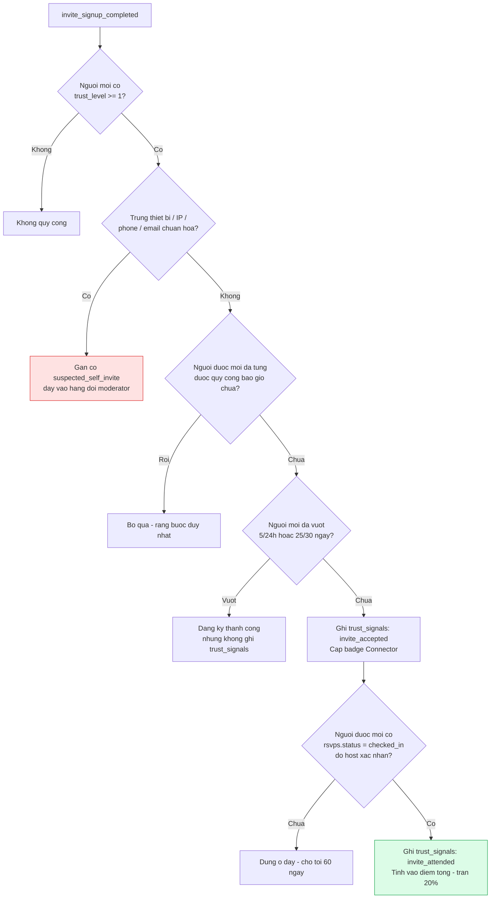

### 9.6. Hệ số k và mục tiêu theo tháng

**Công thức:**

```
k = i × c

i = (số lời mời gửi đi trong 30 ngày) / (số user hoạt động trong 30 ngày)
c = (số lời mời dẫn tới user hợp lệ được quy công) / (số lời mời gửi đi)

Hệ số khuếch đại = 1 / (1 − k)     [chỉ có ý nghĩa khi k < 1]
```

**Định nghĩa mẫu số:** "user hoạt động 30 ngày" = có ≥ 1 phiên mở app **và** ≥ 1 hành vi ngoài `app_open` (§10.5). "User hợp lệ được quy công" = qua đủ hàng rào ở §9.5.2 và đã hoàn tất onboarding.

| Tháng | Giai đoạn | `i` mục tiêu | `c` mục tiêu | `k` mục tiêu | Hệ số khuếch đại | Ghi chú |
|---|---|---|---|---|---|---|
| M1 (09/2026) | Tiền‑app | — | — | — | — | Chưa bật vòng mời |
| M2 (10/2026) | Tiền‑app, `INV-D` | 0,20 | 0,25 | 0,05 | 1,05× | Đo bằng cột `invite_code` trong form, không phải app |
| M3 (11/2026) | `INV-A/B/C` từ 13/11 | 0,35 | 0,30 | **0,11** | 1,12× | Chỉ đo 2,5 tuần cuối tháng |
| M4 (12/2026) | Beta kín từ 25/12 | 0,50 | 0,32 | **0,16** | 1,19× | Beta kín có tỷ lệ `c` cao bất thường — **không** ngoại suy |
| M5 (01/2027) | Beta mở rộng | 0,70 | 0,34 | **0,24** | 1,32× | |
| M6 (02/2027) | Ra mắt 25/02 | 0,90 | 0,36 | **0,32** | 1,47× | Ngưỡng đỏ: `k < 0,15` ở M6 |

**Đọc bảng này cho đúng:** ở M6, cứ 100 user kiếm được bằng công sức thủ công thì vòng mời cho thêm ~47 user. Nó đáng làm, nhưng nó **không** bao giờ thay được §5 và §7 trong Giai đoạn 1.

### 9.7. Sáu thử nghiệm tăng trưởng đã lên lịch sẵn

| Mã | Giả thuyết | Cách đo | Cửa sổ chạy | Ngưỡng thành công |
|---|---|---|---|---|
| `GX-01` | Hiện **tên người quen đã RSVP** trên thẻ sự kiện làm tăng tỷ lệ RSVP | A/B trên danh sách khám phá | M4 | +6 điểm phần trăm `event_viewed → rsvp_completed` |
| `GX-02` | Nhắc T−2h làm giảm no-show nhiều hơn nhắc T−24h | So sánh nhóm nhận 1 nhắc vs 2 nhắc | M4 | Nhóm 2 nhắc có no-show thấp hơn ≥ 8 điểm phần trăm |
| `GX-03` | Cho phép `guest_count` tối đa 2 làm tăng WCA mà không tăng no-show | So sánh occurrence bật/tắt | M5 | WCA/occurrence +12%, no-show không tăng quá 3 điểm phần trăm |
| `GX-04` | Digest gửi 17:00 thứ Năm tốt hơn 09:00 thứ Sáu | A/B thời điểm gửi | M5 | Tỷ lệ mở chênh ≥ 5 điểm phần trăm |
| `GX-05` | Lời mời gửi **sau khi check-in** (lúc đang vui) chuyển đổi tốt hơn lời mời gửi sau RSVP | A/B vị trí lời mời | M5 | `c` cao hơn ≥ 8 điểm phần trăm |
| `GX-06` | Trang `/this-week` render server-side kéo được lưu lượng tìm kiếm tự nhiên | Đo lượt vào tự nhiên | M6 | ≥ 250 phiên tự nhiên/tháng |

**Kỷ luật thử nghiệm:** mỗi lần chỉ chạy **một** thử nghiệm trên cùng một luồng; cỡ mẫu tối thiểu 120 lượt mỗi nhánh; nếu chưa đủ mẫu trong 3 tuần thì kết luận là "không đủ dữ liệu", không được đọc kết quả sớm.

---

## 10. Hệ thống chỉ số

> **Nguyên tắc:** một North Star Metric duy nhất, không quá 8 chỉ số đầu vào, và **mỗi chỉ số phải có công thức viết bằng cột dữ liệu thật** — không có chỉ số nào chỉ tồn tại trong slide.
>
> **Nguyên tắc thứ hai:** mọi chỉ số đều có **ngưỡng xanh** (đạt) và **ngưỡng đỏ** (dừng lại, xử lý ngay). Không có vùng vàng mơ hồ; khoảng giữa xanh và đỏ mặc định là "theo dõi sát".

### 10.1. North Star Metric — Weekly Confirmed Attendances (WCA)

> **WCA = số lượt tham dự sự kiện đã được xác nhận, tính trên các `event_occurrences` bắt đầu trong 7 ngày gần nhất.**

#### 10.1.1. Công thức chính xác

```sql
-- WCA lõi (North Star Metric chính thức)
-- Cửa sổ: [now() - interval '7 days', now())  -- so theo occurrences.starts_at (UTC)
SELECT COUNT(*) AS wca_core
FROM rsvps r
JOIN event_occurrences o ON o.id = r.occurrence_id
JOIN events e            ON e.id = o.event_id
JOIN users u             ON u.id = r.user_id
WHERE r.status = 'checked_in'                      -- enum chữ thường snake_case
  AND o.starts_at >= now() - interval '7 days'
  AND o.starts_at <  now()
  AND o.status    = 'published'                    -- occurrence không bị huỷ
  AND e.status    = 'published'
  AND u.is_staff  = false                          -- loại tài khoản đội ngũ và tài khoản thử
  AND u.is_test   = false;
```

| Quyết định định nghĩa | Chốt | Vì sao |
|---|---|---|
| Đơn vị đếm | **1 dòng `rsvps` có `status = 'checked_in'`** | Đây là đơn vị nhỏ nhất của giá trị đã giao: một người thật đã đến |
| Neo thời gian | `event_occurrences.starts_at`, **không** phải `rsvps.created_at` | WCA đo *tham dự*, không đo *ý định* |
| Múi giờ | Tính trên **UTC** trong DB; báo cáo quy đổi sang `Asia/Ho_Chi_Minh`; tuần báo cáo là **T2 00:00 → CN 23:59 giờ địa phương** | Quy ước lưu UTC của dự án |
| RSVP gắn vào đâu | **`occurrence_id`**, không phải `event_id` | Quyết định chốt: sự kiện không lặp lại vẫn có đúng 1 occurrence |
| Khách đi kèm (`guest_count`) | **Không** tính vào WCA lõi. Báo cáo riêng thành `WCA mở rộng` | Khách không có tài khoản nên không đo được retention; trộn vào sẽ thổi phồng NSM |
| Trạng thái `no_show` | Không tính | |
| Trạng thái `waitlisted` | Không tính, kể cả khi người đó có mặt — phải được nâng lên `confirmed` rồi `checked_in` | Giữ waitlist trung thực |
| Một người dự 2 sự kiện trong tuần | Tính **2** | WCA đo lượt, không đo người. Chỉ số đo người là `WCA-U` bên dưới |
| Trùng lặp | Ràng buộc duy nhất `(occurrence_id, user_id)` trên bảng `rsvps` đảm bảo không đếm đôi | |

```sql
-- WCA mở rộng (báo cáo phụ, KHÔNG phải NSM)
SELECT COUNT(*) + COALESCE(SUM(LEAST(r.guest_count, 2)), 0) AS wca_extended ...

-- WCA-U: số NGƯỜI duy nhất có ít nhất 1 lượt check-in trong tuần
SELECT COUNT(DISTINCT r.user_id) AS wca_users ...

-- Cường độ tham dự
intensity = wca_core / wca_users        -- mục tiêu M6: 1,25 - 1,45
```

#### 10.1.2. Ba nguồn hợp lệ của `status = 'checked_in'`

| Nguồn | Ai bấm | Độ tin cậy | Có được tính vào WCA? |
|---|---|---|---|
| Host hoặc co-host quét QR / tick danh sách tại cửa | `events.host_user_id` hoặc `event_cohosts` | Cao | **Có** |
| `curator` của đội điểm danh tay tại sự kiện signature | `users.role = 'curator'` | Cao | **Có** |
| Người dùng tự xác nhận qua `PUSH-03` (T+3h) | Chính user | Trung bình | **Có, nhưng gắn cờ `self_confirmed = true`** và báo cáo tách dòng |
| Không ai xác nhận sau 48h | — | — | Chuyển tự động sang `no_show` |

> **Kỷ luật báo cáo:** tỷ lệ `self_confirmed` trong WCA phải được in kèm mỗi tuần. Nếu vượt **40%**, con số WCA không còn đủ tin cậy để làm cơ sở ra quyết định — phải tăng điểm danh tại cửa trước khi báo cáo tiếp.

#### 10.1.3. Phân rã WCA — đây là công thức dùng để lập kế hoạch

```
WCA = N_occ × R_avg × (1 − no_show_rate)

N_occ         = số occurrence THỰC SỰ DIỄN RA trong tuần (không phải số listing tồn kho)
R_avg         = số RSVP confirmed trung bình mỗi occurrence
no_show_rate  = tỷ lệ RSVP confirmed không check-in
```

| Tháng | `N_occ` | `R_avg` | `no_show_rate` | **WCA** |
|---|---|---|---|---|
| M1 (09/2026) | 6 | 6,3 | 21% | **30** (proxy tiền‑app) |
| M2 (10/2026) | 9 | 7,0 | 21% | **50** (proxy tiền‑app) |
| M3 (11/2026) | 12 | 7,6 | 20% | **73** |
| M4 (12/2026) | 15 | 8,7 | 19% | **106** |
| M5 (01/2027) | 19 | 9,9 | 19% | **152** |
| M6 (02/2027) | **25 – 28** | 10,4 – 11,4 | 17% | **220 – 280** |

**Đây là lý do gate M6 được đo bằng dòng chảy chứ không phải tồn kho:** WCA phụ thuộc vào `N_occ` — số sự kiện **thực sự diễn ra mỗi tuần** — chứ không phụ thuộc vào tổng số listing tích luỹ trong cơ sở dữ liệu. Một kho 200 sự kiện đã qua ngày tạo ra WCA bằng 0.

> **Về con số 550 WCA/tuần ở §1.2:** đó là mục tiêu **Tháng 9 (31/05/2027)** — nằm ngoài cửa sổ 6 tháng của tài liệu này và thuộc về gate mở Giai đoạn 2. Mục tiêu M6 là **220 – 280**. Con số M9 phải được lập lại nền (re-baseline) bằng số thật của M6 vào tuần đầu 03/2027, không được dùng để lập ngân sách trước thời điểm đó.

### 10.2. Đo cái gì trong giai đoạn chưa có RSVP — bảng thay thế chỉ số

Từ **01/09/2026 đến 12/11/2026** chưa có RSVP trong app. Trong giai đoạn này NSM được đo bằng **WCA‑proxy** với quy tắc chặt chẽ, và **bắt buộc ghi nhãn** trong mọi báo cáo.

| Chỉ số | Đơn vị tiền‑app (01/09 → 12/11/2026) | Đơn vị trong app (từ 13/11/2026) | Nguồn dữ liệu tiền‑app | Ai nhập | Đối soát |
|---|---|---|---|---|---|
| **WCA** | `WCA-proxy` = số dòng trong **sổ check‑in giấy tại cửa**, đã khử trùng theo số điện thoại | `COUNT(rsvps WHERE status='checked_in')` | Sổ check‑in + ảnh chụp trang sổ | Host của buổi đó | Curator nhập vào bảng tính trước 12:00 hôm sau; Founder đối chiếu ảnh sổ mỗi thứ Hai |
| **Seed user / Registered** | Số bản ghi hợp lệ trong `signup_sheet` (form 5 trường trên landing page) | `COUNT(users)` sau onboarding | Google Form + nhóm WhatsApp/Telegram | Curator | Khử trùng theo email chuẩn hoá + số điện thoại E.164 |
| **RSVP** | Số bản ghi "đã xác nhận sẽ đến" trong form đăng ký sự kiện | `COUNT(rsvps WHERE status='confirmed')` | Form đăng ký theo từng sự kiện | Curator | |
| **Waitlist** | Danh sách chờ ghi tay khi form vượt sức chứa | `COUNT(rsvps WHERE status='waitlisted')` | Bảng tính | Curator | |
| **No-show** | (đăng ký form − dòng sổ check‑in) / đăng ký form | (confirmed − checked_in) / confirmed | Đối chiếu 2 bảng | Curator | |
| **Tồn kho sự kiện `I4`** | Số occurrence đã nhập vào Admin Curation Console (chạy từ KT‑M2 30/10) — trước đó là bảng tính curation | `COUNT(event_occurrences WHERE status='published')` | Bảng tính curation → Console | Curator | |
| **Retention** | **Không đo được** — chỉ đo "tỷ lệ quay lại buổi thứ 2" bằng cách khớp tên/điện thoại giữa các sổ check‑in | D1/D7/D30 theo `app_open` | Sổ check‑in | Curator | Chấp nhận sai số ±15% |
| **k-factor** | Cột `invite_code` trong form (thẻ A6 `INV-D`) | `invite_attributions` | Form | Curator | |

> **Ba điều cấm khi báo cáo giai đoạn tiền‑app:**
> 1. Không gọi `WCA-proxy` là `WCA` trong bất kỳ báo cáo, slide hay email nào. Luôn viết đủ hậu tố `-proxy`.
> 2. Không cộng gộp số tiền‑app và số trong app vào cùng một đường xu hướng. Biểu đồ phải có **đường kẻ dọc tại 13/11/2026** và đổi màu chuỗi.
> 3. Không ngoại suy tỷ lệ chuyển đổi của giai đoạn tiền‑app sang giai đoạn app. Form Google có ma sát khác hẳn RSVP một chạm.

**Tuần chuyển tiếp 13/11 – 19/11/2026:** chạy **song song** cả hai đơn vị đo trong đúng 1 tuần để đo hệ số lệch. Hệ số lệch này được ghi lại một lần và dùng để hiệu chỉnh mọi so sánh về sau.

### 10.3. Chỉ số đầu vào (Input metrics)

Chỉ số đầu vào là thứ đội ngũ **kiểm soát trực tiếp bằng hành động trong tuần**. Nếu WCA tụt, luôn bắt đầu điều tra từ đây.

| Mã | Chỉ số | Công thức | Nhịp đo | Chủ sở hữu | Ngưỡng xanh (M6) | Ngưỡng đỏ |
|---|---|---|---|---|---|---|
| `I1` | Lượt tiếp xúc có ý nghĩa/tuần | Đếm tay trong nhật ký field (§5.2) | Tuần | Founder | ≥ 110 | < 60 trong 2 tuần liên tiếp |
| `I2` | Số occurrence **thực sự diễn ra**/tuần (`N_occ`) | `COUNT(occurrences WHERE starts_at trong tuần AND status='published')` | Tuần | Curator | ≥ 25 | < 15 |
| `I3` | Số occurrence **mới publish**/tuần | `COUNT(occurrences WHERE published_at trong tuần)` | Tuần | Curator | ≥ 35 | < 20 |
| `I4` | **Tồn kho 7 ngày tới** | `COUNT(occurrences WHERE starts_at ∈ [now, now+7d] AND status='published')` | **Thứ Hai 09:00** | Curator | ≥ 55 | **< 18 — dừng mọi việc khác** (§7.2) |
| `I5` | Tồn kho cuối tuần gần nhất | Như `I4`, lọc T6 18:00 → CN 23:59 | Thứ Hai | Curator | ≥ 14, trải ≥ 4 khu vực, ≥ 3 danh mục | < 8 hoặc < 3 khu vực |
| `I6` | **Số khu vực MVP có ≥ 1 occurrence trong 7 ngày tới** | `COUNT(DISTINCT area_slug)` trên tập `I4` | Thứ Hai | Curator | **6/6** | **≤ 4/6 — vi phạm gate M6** |
| `I7` | Occurrence/khu vực/tuần (đo mật độ, vòng L4) | `I2` chia theo `area_slug` | Tuần | Curator | An Thượng ≥ 8; mỗi khu vực còn lại ≥ 1 | Bất kỳ khu vực nào = 0 |
| `I8` | Số organizer được tiếp cận (`MSG-08`)/tuần | Đếm tay trong CRM | Tuần | Curator | ≥ 3 | 0 trong 2 tuần liên tiếp |

> `I6` là chỉ số **trực tiếp thực thi gate M6 đã chốt**: "không khu vực MVP nào bằng 0". Nó được kiểm mỗi thứ Hai 09:00 cùng lúc với `I4` và có cảnh báo tự động gửi Founder.

### 10.4. Chỉ số nguồn cung (Supply metrics)

| Mã | Chỉ số | Công thức | Nhịp đo | Xanh (M6) | Đỏ |
|---|---|---|---|---|---|
| `S1` | Số organizer hoạt động (đã chạy ≥ 1 occurrence trong 30 ngày) | `COUNT(DISTINCT events.host_user_id)` loại tài khoản đội | Tháng | ≥ 18 | < 8 |
| `S2` | **Tỷ lệ sự kiện tự phục vụ** | `occurrences(is_self_serve) / occurrences(all)` publish trong tháng | Tháng | ≥ 45% | < 20% ở M6 |
| `S3` | Tỷ lệ organizer quay lại (đăng tháng N và tháng N+1) | Cohort tháng | Tháng | ≥ 60% | < 35% |
| `S4` | Thời gian trung bình để đăng 1 sự kiện | `event_create_started → event_published` (phút, trung vị) | Tháng | ≤ 6 phút | > 12 phút |
| `S5` | Tỷ lệ bỏ dở luồng tạo sự kiện | `1 − event_published / event_create_started` | Tháng | ≤ 35% | > 60% |
| `S6` | **Tỷ lệ nhận lời mời Founding Organizer** | `organizer_program_accepted / organizer_program_invited` | Tháng | ≥ 65% | < 35% |
| `S7` | **Số suất Founding Organizer đã lấp** | Đếm `slot_number` đã cấp / 50 | Tháng | ≥ 30/50 tại M6 | < 12/50 tại M6 |
| `S8` | Tỷ lệ claim thành công | `listing_claim_approved / listing_claim_requested` | Tháng | ≥ 85% | < 60% |
| `S9` | Tỷ lệ sự kiện bị huỷ < 24h trước giờ chạy | `cancelled_late / occurrences_scheduled` | Tuần | ≤ 4% | > 12% |

### 10.5. Retention

#### 10.5.1. Định nghĩa "hoạt động"

> Một user được tính là **hoạt động trong ngày D** khi có **≥ 1 sự kiện tracking khác `app_open` và khác `notification_opened`** trong ngày D. Chỉ mở app rồi thoát **không** tính.

Lý do siết chặt: với một app lịch sự kiện, `app_open` đơn thuần bị thổi phồng bởi push. Chỉ số phải phản ánh hành vi có chủ đích: xem sự kiện, lọc, RSVP, chia sẻ, tạo sự kiện.

#### 10.5.2. Ba lớp retention

| Lớp | Định nghĩa | Vì sao cần |
|---|---|---|
| **R-app** (D1/D7/D30) | % user của cohort đăng ký ngày D0 có ít nhất 1 ngày hoạt động trong cửa sổ D1 / D2–D7 / D8–D30 | Chuẩn so sánh với ngành |
| **R-attend** (W1/W4/W12) | % user của cohort có ≥ 1 lượt `checked_in` trong tuần 1 / tuần 4 / tuần 12 sau khi đăng ký | **Chỉ số thật sự quan trọng** — đo giá trị đã giao, không đo lượt mở app |
| **R-week** (weekly retained) | % user hoạt động tuần N cũng hoạt động tuần N+1 | Đo sức khoẻ vòng L1 |

**Cohort neo theo tuần đăng ký (T2 → CN), không neo theo tháng.** Chu kỳ sản phẩm là 7 ngày nên cohort tháng che mất tín hiệu.

#### 10.5.3. Mục tiêu retention

| Chỉ số | M3 | M4 | M5 | M6 | Xanh M6 | Đỏ M6 |
|---|---|---|---|---|---|---|
| `R1` — D1 (R-app) | 32% | 35% | 38% | **40%** | ≥ 40% | < 25% |
| `R2` — D7 (R-app) | 20% | 22% | 25% | **28%** | ≥ 28% | < 16% |
| `R3` — **D30 (R-app)** | 11% | 13% | 15% | **18%** | ≥ 18% | **< 10%** |
| `R4` — W1 (R-attend) | 25% | 28% | 32% | **35%** | ≥ 35% | < 20% |
| `R5` — W4 (R-attend) | 14% | 16% | 19% | **22%** | ≥ 22% | < 12% |
| `R6` — W12 (R-attend) | — | — | 9% | **12%** | ≥ 12% | < 6% |
| `R7` — weekly retained | 30% | 33% | 36% | **40%** | ≥ 40% | < 22% |

> **Hiệu chỉnh bắt buộc cho bối cảnh Đà Nẵng:** một phần lớn phân khúc S1 rời thành phố sau 4–12 tuần. Vì vậy mọi báo cáo retention phải tách **hai nhóm**: `still_in_da_nang = true` (tự khai hoặc suy ra từ hoạt động 21 ngày gần nhất) và nhóm đã rời đi. D30 tính trên nhóm còn ở lại là chỉ số ra quyết định; D30 tính trên toàn bộ là chỉ số báo cáo. Chênh lệch giữa hai con số thường **8–14 điểm phần trăm** và **không được coi là churn sản phẩm**.

### 10.6. Chỉ số sức khoẻ nội dung

| Mã | Chỉ số | Công thức | Nhịp | Xanh | Đỏ |
|---|---|---|---|---|---|
| `C1` | **Độ đầy đủ listing** | % occurrence publish có đủ **8 trường bắt buộc** (§7.4) | Tuần | ≥ 97% | < 85% |
| `C2` | Tỷ lệ listing có ảnh ≥ 1200px | Đếm | Tuần | ≥ 80% | < 50% |
| `C3` | Độ chính xác thời gian/địa điểm | Rà tay 30 listing/tuần, đếm số sai giờ hoặc sai địa chỉ | Tuần | ≤ 3% sai | > 10% sai |
| `C4` | Tỷ lệ sự kiện miễn phí | `price_vnd = 0 / all` | Tuần | ≥ 60% | < 40% |
| `C5` | Tỷ lệ sự kiện có `capacity` thật (không phải ước lượng) | `1 − capacity_is_estimated` | Tuần | ≥ 70% | < 40% |
| `C6` | Tỷ lệ tìm kiếm không có kết quả | `search_zero_results / search_performed` | Tuần | ≤ 8% | > 20% |
| `C7` | **Tỷ lệ trùng lặp còn sót** | Rà tay 50 listing ngẫu nhiên mỗi thứ Sáu (§7.5) | Tuần | ≤ 2% | > 6% |
| `C8` | Tỷ lệ listing bị organizer yêu cầu gỡ | `takedown_requested / curated_published` | Tháng | ≤ 3% | > 10% |
| `C9` | Độ tươi của lịch | % occurrence trong 7 ngày tới được kiểm lại trong 72h qua | Tuần | ≥ 90% | < 60% |

### 10.7. Bảng mục tiêu theo tháng — M1 đến M6

> Đây là bảng được đối chiếu ở §5.3 (Tuần 6) và §14.2 (cổng quyết định). **Cột M1–M2 là đơn vị tiền‑app** theo §10.2.

| # | Chỉ số | Đơn vị | M1 09/26 | M2 10/26 | M3 11/26 | M4 12/26 | M5 01/27 | **M6 02/27** | Ngưỡng xanh M6 | Ngưỡng đỏ M6 |
|---|---|---|---|---|---|---|---|---|---|---|
| 1 | **WCA** (NSM) | lượt/tuần | 30* | 50* | 73 | 106 | 152 | **220 – 280** | ≥ 220 | **< 130** |
| 2 | `WCA-U` người duy nhất | người/tuần | 26* | 42* | 58 | 82 | 115 | **165 – 200** | ≥ 165 | < 100 |
| 3 | Cường độ tham dự | lượt/người | 1,15 | 1,19 | 1,26 | 1,29 | 1,32 | **1,25 – 1,45** | ≥ 1,25 | < 1,10 |
| 4 | Registered tích luỹ | người | 55* | 100* | 190 | 320 | 480 | **700** | ≥ 600 | < 350 |
| 5 | MAU | người | — | — | 150 | 240 | 330 | **430** | ≥ 380 | < 200 |
| 6 | `I2` occurrence diễn ra | /tuần | 6 | 9 | 12 | 15 | 19 | **25 – 28** | ≥ 25 | < 15 |
| 7 | `I4` tồn kho 7 ngày | occurrence | 20 | 28 | 34 | 40 | 47 | **55** | ≥ 55 | **< 18** |
| 8 | `I6` khu vực MVP ≥ 1 sự kiện | /6 | 3 | 4 | 5 | 5 | 6 | **6** | **6/6** | ≤ 4/6 |
| 9 | `S1` organizer hoạt động | người | 2 | 4 | 7 | 10 | 14 | **18** | ≥ 18 | < 8 |
| 10 | `S2` tỷ lệ tự phục vụ | % | 0 | 8 | 25 | 32 | 38 | **45** | ≥ 45 | < 20 |
| 11 | `S7` suất Founding Organizer | /50 | 0 | 0 | 6 | 12 | 20 | **30** | ≥ 30 | < 12 |
| 12 | No-show | % | 21* | 21* | 20 | 19 | 19 | **17** | ≤ 17 | > 30 |
| 13 | `R3` D30 | % | — | — | 11 | 13 | 15 | **18** | ≥ 18 | < 10 |
| 14 | `R5` W4 tham dự | % | — | — | 14 | 16 | 19 | **22** | ≥ 22 | < 12 |
| 15 | `C1` độ đầy đủ listing | % | 90 | 93 | 95 | 96 | 97 | **97** | ≥ 97 | < 85 |
| 16 | `C7` trùng lặp còn sót | % | 6 | 4 | 3 | 3 | 2 | **2** | ≤ 2 | > 6 |
| 17 | `k-factor` | — | — | 0,05 | 0,11 | 0,16 | 0,24 | **0,32** | ≥ 0,25 | < 0,15 |
| 18 | Tỷ lệ `self_confirmed` trong WCA | % | 0* | 0* | 30 | 32 | 34 | **≤ 40** | ≤ 40 | > 55 |
| 19 | Tỷ lệ báo cáo vi phạm | /1000 lượt tham dự | — | — | ≤ 8 | ≤ 8 | ≤ 7 | **≤ 6** | ≤ 6 | > 20 |
| 20 | Tuân thủ SLA báo cáo critical **2 giờ** | % | — | — | 100 | 100 | 100 | **100** | 100 | < 90 |

`*` = đo bằng đơn vị **tiền‑app** theo §10.2, có hậu tố `-proxy`, không cùng thang với các cột từ M3.

**Ba con số phải nhớ thuộc lòng ở M6:** `WCA ≥ 220` · `I6 = 6/6` · `I2 ≥ 25`. Đây chính là gate M6 đã chốt, phát biểu bằng chỉ số.

### 10.8. Chỉ số phản chỉ báo (guardrail) — thứ không được phép cải thiện sai cách

| Mã | Guardrail | Vì sao cần | Ngưỡng đỏ |
|---|---|---|---|
| `G1` | Tỷ lệ huỷ đăng ký nhận email digest | Ngăn việc bơm WCA bằng cách spam email | > 2%/lần gửi |
| `G2` | Tỷ lệ tắt push | Ngăn việc lạm dụng push để đẩy `app_open` | > 12% người dùng đã bật |
| `G3` | Số push gửi tới một người/tuần | Trần cứng | > 5 |
| `G4` | Tỷ lệ sự kiện do đội ngũ tự tổ chức trong tổng WCA | Ngăn việc "tự bơm nguồn cung" giả tạo tăng trưởng | > 55% ở M6 |
| `G5` | Tỷ lệ WCA đến từ một khu vực duy nhất | Ngăn tăng trưởng chỉ ở An Thượng rồi tưởng là toàn thành phố | > 70% ở M6 |
| `G6` | Tỷ lệ tài khoản gắn cờ `suspected_self_invite` | Ngăn k-factor giả | > 5% lượt quy công |
| `G7` | Điểm hài lòng sau sự kiện (1 câu hỏi sau `checked_in`) | Ngăn việc chạy theo số lượng mà bỏ chất lượng | Trung bình < 3,8/5 |
| `G8` | Tỷ lệ nữ trong WCA | Sự kiện cộng đồng mất cân bằng giới nghiêm trọng sẽ tự sụp | < 30% trong 3 tuần liên tiếp |

### 10.9. Cây chỉ số

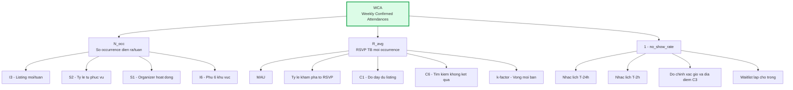

### 10.10. Nhịp báo cáo

| Nhịp | Thời điểm | Nội dung | Người |
|---|---|---|---|
| **Hằng ngày 09:00** | T2–T6 | 3 số: `I4` tồn kho 7 ngày · số RSVP hôm qua · hàng đợi báo cáo vi phạm quá SLA | Curator |
| **Thứ Hai 09:00** | Tuần | Bảng đầy đủ `I1`–`I8`, `C1`–`C9`, WCA tuần trước, so ngưỡng đỏ | Curator + Founder |
| **Thứ Sáu 16:00** | Tuần | Rà 50 listing (`C7`), rà 30 listing (`C3`), chốt tồn kho cuối tuần `I5` | Curator |
| **Thứ Hai đầu tháng** | Tháng | Toàn bộ §10.7 + retention cohort + k-factor + guardrail §10.8 | Cả đội |
| **Cuối M2, M4, M6** | Cổng | Đối chiếu §14.2, ra quyết định tiếp tục / điều chỉnh / xoay trục | Founder |

> **Quy tắc một trang:** báo cáo tuần phải vừa trong **một trang A4**. Bất kỳ chỉ số nào không dẫn tới một hành động cụ thể trong tuần tới đều bị loại khỏi báo cáo tuần và chuyển xuống báo cáo tháng.

---

## 11. Kế hoạch đo lường và event tracking

> Đây là lược đồ chi tiết hoá `E11-S1` của tài liệu 08. Lược đồ ở tài liệu 08 liệt kê 15 event tối thiểu; bản dưới đây là **bản đầy đủ 54 event** đội GTM cần để trả lời được mọi câu hỏi trong §10.

### 11.1. Bốn lô triển khai — tracking cũng có lịch riêng

Không phải toàn bộ 54 event có thể bật ngày Tuần 0. Việc "cài đặt tracking đầy đủ" ở Tuần 0 (§5.3) áp dụng cho **Lô 1** — phần chạy trên landing page, QR vật lý và form waitlist.

| Lô | Phạm vi | Số event | Chạy được từ | Phụ thuộc kỹ thuật |
|---|---|---|---|---|
| **Lô 1** | Landing page, QR theo địa điểm, form waitlist | **5** | **Tuần 0 — 05/09/2026** | Chỉ cần web analytics + `channel_code` trên URL |
| **Lô 2** | Web app: auth, onboarding, khám phá, tạo sự kiện | **22** | **KT‑M2 — 30/10/2026** | Lược đồ event thống nhất web/mobile |
| **Lô 3** | RSVP, waitlist, điểm danh, thông báo | **17** | **KT‑M3 — 13/11/2026** | E6 + E7 |
| **Lô 4** | Trust & Safety, claim listing, mời bạn, chia sẻ | **10** | **KT‑M4/M5 — 27/11 → 25/12/2026** | E8 + E11-S4 |
| | **Tổng** | **54** | | |

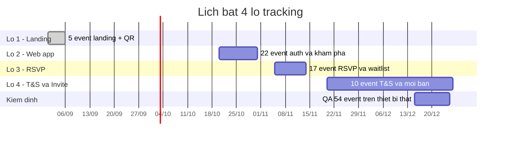

### 11.2. Quy ước đặt tên — bắt buộc

| Quy tắc | Nội dung | Ví dụ đúng | Ví dụ sai |
|---|---|---|---|
| Định dạng tên | `snake_case`, toàn chữ thường, không dấu | `rsvp_completed` | `RSVPCompleted`, `rsvp-completed` |
| Cấu trúc | `<đối tượng>_<hành động ở thì quá khứ>` | `event_viewed`, `waitlist_joined` | `view_event`, `joining_waitlist` |
| Thuộc tính | `snake_case`, kiểu dữ liệu cố định, **không đổi kiểu sau khi phát hành** | `spots_left: integer` | `spotsLeft: "3"` |
| Giá trị enum trong thuộc tính | Chữ thường `snake_case`, khớp đúng enum trong DB | `status: "checked_in"` | `status: "CheckedIn"` |
| Khu vực | Luôn dùng `area_slug` trong 6 giá trị MVP | `an-thuong`, `my-khe`, `my-an`, `hai-chau`, `son-tra`, `ngu-hanh-son` | `An Thuong` |
| Thời gian | ISO 8601 UTC | `2026-11-13T12:00:00Z` | `13/11/2026 19:00` |
| Tiền | Số nguyên VND, tên trường có hậu tố `_vnd` | `price_vnd: 0` | `price: "free"` |

> **Lưu ý về hai quy ước viết khác nhau — không phải lỗi:** giá trị **enum trong DB** (`users.role`, `rsvps.status`, `events.status`) viết `snake_case` theo quyết định đã chốt — `checked_in`, `no_show`, `published`, `super_admin`. Riêng **`area_slug` là URL slug**, viết `kebab-case` — `an-thuong`, `ngu-hanh-son` — vì nó xuất hiện trực tiếp trong đường dẫn của trang khu vực và trong `channel_code` in trên QR. Tên **event tracking** và **tên thuộc tính** luôn `snake_case`.

**Thuộc tính toàn cục gắn vào mọi event** (không lặp lại trong bảng bên dưới): `user_id` (hoặc `anonymous_id` khi chưa đăng nhập) · `session_id` · `platform` (`web` / `ios` / `android`) · `app_version` · `locale` (`en` / `vi`) · `timestamp_utc` · `channel_code` · `is_staff`.

### 11.3. Bảng 54 event tracking

#### A. Đăng ký, xác thực, tin cậy (9 event)

| # | Tên event | Kích hoạt khi nào | Thuộc tính kèm theo | Lô | Phục vụ chỉ số |
|---|---|---|---|---|---|
| 1 | `app_open` | Mỗi lần mở app hoặc phiên web mới sau 30 phút không hoạt động | `is_first_open`, `entry_point` (`icon`/`push`/`deep_link`/`share_link`), `push_code` | 1 | MAU, `R1`–`R3` |
| 2 | `signup_started` | Người dùng chạm nút đăng ký hoặc mở form waitlist | `method` (`email`/`google`/`apple`/`waitlist_form`), `entry_point`, `channel_code`, `invite_code` | 1 | Phễu §5.2 |
| 3 | `signup_completed` | Tài khoản được tạo thành công (hoặc bản ghi `signup_sheet` hợp lệ ở giai đoạn tiền‑app) | `method`, `seconds_to_complete`, `channel_code`, `invite_code`, `has_invite` | 1 | Registered, CAC |
| 4 | `signup_failed` | Đăng ký thất bại | `method`, `failure_reason` (`email_taken`/`weak_password`/`oauth_cancelled`/`network`) | 2 | `S5`, chẩn đoán |
| 5 | `login_completed` | Đăng nhập thành công | `method`, `days_since_last_login` | 2 | Retention |
| 6 | `email_verification_sent` | Hệ thống gửi thư xác minh | `attempt_number` | 2 | Phễu T0→T1 |
| 7 | `email_verified` | Người dùng bấm link xác minh → đủ điều kiện **T1 Email verified** | `hours_since_signup`, `trust_level_after` | 2 | Phân bố trust level |
| 8 | `phone_verification_started` | Người dùng nhập số điện thoại để nhận OTP | `country_code` | 3 | Chi phí SMS |
| 9 | `phone_verified` | OTP đúng → đủ điều kiện **T2 Phone verified** | `attempts`, `hours_since_signup`, `trust_level_after` | 3 | Điều kiện claim §8.2 |

#### B. Onboarding (6 event)

| # | Tên event | Kích hoạt khi nào | Thuộc tính kèm theo | Lô | Phục vụ chỉ số |
|---|---|---|---|---|---|
| 10 | `onboarding_started` | Màn hình onboarding đầu tiên hiển thị | `steps_total` | 2 | Phễu onboarding |
| 11 | `onboarding_interests_selected` | Người dùng xác nhận danh sách sở thích | `interest_count`, `interests` (mảng slug) | 2 | Chất lượng `PUSH-05` |
| 12 | `onboarding_areas_selected` | Người dùng xác nhận khu vực quan tâm | `area_count`, `areas` (mảng `area_slug`) | 2 | `I6`, `G5` |
| 13 | `onboarding_arrival_declared` | Người dùng khai thời điểm đến Đà Nẵng và dự kiến ở lại | `weeks_in_city`, `expected_stay_weeks`, `is_first_time` | 2 | Hiệu chỉnh retention §10.5.3 |
| 14 | `onboarding_completed` | Hoàn tất bước cuối, hồ sơ đủ điều kiện seed user (§5.1) | `duration_seconds`, `steps_completed` | 2 | Registered hợp lệ |
| 15 | `onboarding_abandoned` | Rời onboarding > 10 phút không quay lại | `last_step`, `steps_completed` | 2 | Điểm rơi |

#### C. Khám phá và tìm kiếm (8 event)

| # | Tên event | Kích hoạt khi nào | Thuộc tính kèm theo | Lô | Phục vụ chỉ số |
|---|---|---|---|---|---|
| 16 | `discover_viewed` | Màn hình khám phá hiển thị xong kết quả đầu tiên | `view_mode` (`list`/`map`), `result_count`, `default_area_slug`, `is_empty` | 2 | `C6`, tồn kho cảm nhận |
| 17 | `filter_applied` | Người dùng áp một bộ lọc bất kỳ | `filter_type` (`area`/`category`/`date_range`/`language`/`price`/`beginner_friendly`), `area_slug`, `category`, `date_range`, `result_count` | 2 | Nhu cầu theo khu vực |
| 18 | `search_performed` | Người dùng gửi truy vấn tìm kiếm | `query_length`, `result_count`, `has_filters` | 2 | `C6` |
| 19 | `search_zero_results` | Truy vấn trả về 0 kết quả | `query_normalized`, `applied_filters`, `area_slug` | 2 | **`C6`** + phát hiện lỗ hổng nguồn cung |
| 20 | `map_pin_tapped` | Chạm ghim trên bản đồ | `occurrence_id`, `area_slug`, `zoom_level` | 2 | Giá trị của bản đồ |
| 21 | `event_viewed` | Trang chi tiết sự kiện hiển thị ≥ 2 giây | `event_id`, `occurrence_id`, `source` (`discover_list`/`map`/`search`/`push`/`digest`/`share_link`/`seo`), `position_in_list`, `area_slug`, `category`, `is_curated`, `is_self_serve`, `spots_left`, `price_vnd` | 2 | Phễu chính, `S2` |
| 22 | `event_attendees_viewed` | Người dùng mở danh sách người tham dự | `occurrence_id`, `attendee_count`, `has_known_person` | 3 | Giả thuyết `GX-01` |
| 23 | `this_week_page_viewed` | Trang `/this-week` render server-side được xem | `source` (`seo`/`direct`/`social`), `event_count`, `is_bot` | 2 | `GX-06`, CH-14 |

#### D. RSVP, waitlist, điểm danh (11 event)

| # | Tên event | Kích hoạt khi nào | Thuộc tính kèm theo | Lô | Phục vụ chỉ số |
|---|---|---|---|---|---|
| 24 | `rsvp_started` | Chạm nút RSVP, trước khi gọi API | `occurrence_id`, `capacity`, `spots_left`, `is_full`, `hours_to_start`, `trust_level` | 3 | Phễu RSVP |
| 25 | `rsvp_completed` | API `POST /api/v1/occurrences/{occurrenceId}/rsvps` trả 201 | `occurrence_id`, `event_id`, `status` (`confirmed`/`waitlisted`), `guest_count`, `hours_to_start`, `area_slug`, `category`, `is_self_serve`, `invited_by_user_id` | 3 | **WCA (bước 1)**, `INV-B` |
| 26 | `rsvp_failed` | API trả lỗi | `occurrence_id`, `http_status`, `failure_reason` (`capacity_exceeded`/`already_rsvped`/`occurrence_cancelled`/`trust_level_too_low`/`network`) | 3 | Chẩn đoán tranh chấp chỗ |
| 27 | `rsvp_shortcut_conflict` | Gọi đường tắt `POST /api/v1/events/{eventId}/rsvps` nhưng có **nhiều occurrence sắp tới** → server trả **409** | `event_id`, `upcoming_occurrence_count`, `client_surface` | 3 | Đo tần suất đường tắt gây nhầm |
| 28 | `rsvp_cancelled` | Người dùng huỷ RSVP | `occurrence_id`, `hours_before_start`, `cancel_reason`, `freed_a_waitlist_spot` | 3 | `no_show_rate`, sức khoẻ waitlist |
| 29 | `waitlist_joined` | RSVP vào occurrence đã đầy → `status = 'waitlisted'` | `occurrence_id`, `position`, `waitlist_length`, `hours_to_start` | 3 | Cầu vượt cung |
| 30 | `waitlist_promoted` | Có chỗ trống, hệ thống nâng người đầu hàng đợi lên `confirmed` | `occurrence_id`, `position_at_join`, `hours_waited`, `hours_to_start` | 3 | Hiệu quả waitlist |
| 31 | `waitlist_promotion_responded` | Người được nâng phản hồi lời mời nhận chỗ | `occurrence_id`, `response` (`accepted`/`declined`/`expired`), `minutes_to_respond` | 3 | Thời hạn giữ chỗ |
| 32 | `waitlist_left` | Người dùng tự rời hàng đợi | `occurrence_id`, `position`, `hours_waited` | 3 | |
| 33 | `attendance_checked_in` | Trạng thái chuyển sang `checked_in` | `occurrence_id`, `method` (`host_qr`/`host_manual`/`curator_manual`/`self_confirm`), `self_confirmed`, `minutes_after_start`, `guest_count` | 3 | **WCA (số cuối cùng)** |
| 34 | `attendance_no_show_marked` | Trạng thái chuyển sang `no_show` (tay hoặc tự động sau 48h) | `occurrence_id`, `marked_by` (`host`/`curator`/`system_auto`), `had_reminders` | 3 | `no_show_rate`, luật `A8` |

#### E. Tạo sự kiện và claim listing (7 event)

| # | Tên event | Kích hoạt khi nào | Thuộc tính kèm theo | Lô | Phục vụ chỉ số |
|---|---|---|---|---|---|
| 35 | `event_create_started` | Mở form tạo sự kiện | `entry_point` (`fab`/`empty_state`/`organizer_dashboard`/`claim_flow`), `is_first_event` | 2 | `S4`, `S5` |
| 36 | `event_create_step_completed` | Hoàn tất một bước trong form nhiều bước | `step_name` (`basics`/`when`/`where`/`capacity`/`media`/`review`), `seconds_on_step` | 2 | Điểm rơi luồng tạo |
| 37 | `event_create_abandoned` | Rời form > 15 phút mà chưa publish | `last_step`, `missing_required_fields` (mảng), `seconds_total` | 2 | **`S5`** |
| 38 | `event_published` | Sự kiện chuyển sang `status = 'published'` | `event_id`, `is_self_serve`, `is_curated`, `source_type`, `area_slug`, `category`, `occurrence_count`, `capacity`, `capacity_is_estimated`, `price_vnd`, `has_image`, `required_fields_complete` | 2 | **`I3`, `S2`, `C1`, `C5`** |
| 39 | `event_cancelled` | Sự kiện hoặc occurrence bị huỷ | `occurrence_id`, `hours_before_start`, `confirmed_count_at_cancel`, `cancel_reason` (`weather`/`low_signup`/`venue`/`organizer`) | 3 | **`S9`**, runbook mùa mưa §12.4 |
| 40 | `listing_claim_requested` | Organizer gửi yêu cầu nhận lại listing | `event_id`, `verification_method` (`page_admin`/`venue_email`/`video_call`), `trust_level`, `days_since_msg08` | 4 | Phễu §8.7 |
| 41 | `listing_claim_reviewed` | `moderator` duyệt hoặc từ chối | `event_id`, `decision` (`approved`/`rejected`), `reviewer_role`, `hours_to_decision`, `rejection_reason` | 4 | **`S8`**, SLA 24h |

#### F. Chia sẻ, mời bạn, thông báo, báo cáo vi phạm (11 event)

| # | Tên event | Kích hoạt khi nào | Thuộc tính kèm theo | Lô | Phục vụ chỉ số |
|---|---|---|---|---|---|
| 42 | `share_clicked` | Chạm nút chia sẻ | `surface` (`event_detail`/`post_rsvp`/`digest`/`profile`), `channel` (`whatsapp`/`telegram`/`facebook`/`copy_link`/`system_sheet`), `occurrence_id` | 4 | `INV-C` |
| 43 | `invite_link_created` | Sinh link mời có `invite_code` | `context` (`post_rsvp`/`post_checkin`/`profile`/`handover`/`physical_card`), `occurrence_id` | 4 | `i` trong k-factor |
| 44 | `invite_link_opened` | Người nhận mở link mời | `invite_code`, `is_new_device`, `occurrence_id`, `referrer_channel` | 4 | `c` trong k-factor |
| 45 | `invite_signup_completed` | Người được mời hoàn tất đăng ký trong cửa sổ quy công 14 ngày | `inviter_user_id`, `invitee_user_id`, `hours_since_open`, `attribution_result` (`credited`/`rate_limited`/`duplicate`/`suspected_self_invite`) | 4 | **k-factor, luật §9.5** |
| 46 | `invite_reward_granted` | Ghi `trust_signals` cho một bên | `signal_type` (`invite_accepted`/`invite_attended`), `recipient_role` (`inviter`/`invitee`), `badge` | 4 | §9.4 |
| 47 | `notification_sent` | Hệ thống gửi push hoặc email | `push_code` (`PUSH-01`…`PUSH-07`), `channel` (`push`/`email`), `occurrence_id`, `scheduled_offset` (`t_minus_24h`/`t_minus_2h`/`t_plus_3h`/`weekly`) | 3 | `G3` trần 5 push/tuần |
| 48 | `notification_opened` | Người dùng mở thông báo | `push_code`, `channel`, `minutes_since_sent` | 3 | Hiệu quả nhắc lịch, `GX-02` |
| 49 | `notification_opt_out` | Tắt push hoặc huỷ đăng ký digest | `channel`, `scope` (`all`/`event_reminders`/`digest`/`recommendations`) | 3 | **`G1`, `G2`** |
| 50 | `report_submitted` | Người dùng gửi báo cáo vi phạm | `target_type` (`event`/`user`/`message`/`photo`), `target_id`, `reason_code`, `severity` (`low`/`medium`/`high`/`critical`), `reporter_trust_level` | 4 | Tỷ lệ báo cáo §10.7 #19 |
| 51 | `report_resolved` | `moderator` xử lý xong | `target_type`, `reason_code`, `severity`, `resolution` (`removed`/`warned`/`no_action`/`account_banned`), `reviewer_role`, `hours_to_resolve`, `sla_met` | 4 | **SLA critical 2 giờ** |
| 52 | `user_blocked` | Người dùng chặn người khác | `blocked_user_trust_level`, `context` (`profile`/`attendee_list`/`event_detail`) | 4 | Sức khoẻ cộng đồng |

#### G. Điểm chạm vật lý và landing tiền‑app (2 event)

| # | Tên event | Kích hoạt khi nào | Thuộc tính kèm theo | Lô | Phục vụ chỉ số |
|---|---|---|---|---|---|
| 53 | `landing_page_viewed` | Trang landing/`this-week` tiền‑app hiển thị | `channel_code`, `referrer`, `utm_source`, `is_mobile` | 1 | Phân bổ nguồn §5.4 |
| 54 | `qr_scanned` | Người dùng mở URL sinh ra từ một mã QR vật lý | `channel_code` (`cowork_<slug>`/`pub_<slug>`/`cafe_<slug>`/`homestay_<slug>`), `posm_type` (`standee_a5`/`card_a6`/`poster_a3`/`tent_card`), `venue_code` | 1 | Hiệu quả POSM từng địa điểm (CH-02, CH-04, CH-11, CH-12) |

> **54 tên event duy nhất**, không tên nào trùng. Yêu cầu tối thiểu là 25 — bản này gấp hơn hai lần và phủ **trọn** các luồng bắt buộc: đăng ký, onboarding, khám phá, RSVP, waitlist, tạo sự kiện, chia sẻ, báo cáo vi phạm. Mỗi event đều map tới ít nhất một chỉ số ở §10; event nào không map được thì bị loại khỏi lược đồ (quy tắc "không có event mồ côi" ở §11.5).

### 11.4. Sáu phễu được dựng sẵn trên dashboard

| Mã phễu | Các bước | Chỉ tiêu M6 |
|---|---|---|
| `F1` Đăng ký | `app_open` → `signup_started` → `signup_completed` → `email_verified` → `onboarding_completed` | ≥ 42% từ `signup_started` tới `onboarding_completed` |
| `F2` Khám phá → tham dự | `discover_viewed` → `event_viewed` → `rsvp_started` → `rsvp_completed` → `attendance_checked_in` | ≥ 9% từ `discover_viewed` tới `attendance_checked_in` |
| `F3` Waitlist | `waitlist_joined` → `waitlist_promoted` → `waitlist_promotion_responded(accepted)` → `attendance_checked_in` | ≥ 55% người vào waitlist cuối cùng có chỗ |
| `F4` Nguồn cung | `event_create_started` → `event_create_step_completed` → `event_published` | ≥ 65% (nghịch đảo `S5`) |
| `F5` Organizer | `event_published(is_curated)` → `listing_claim_requested` → `listing_claim_reviewed(approved)` → `event_published(is_self_serve)` | Khớp §8.7 |
| `F6` Mời bạn | `invite_link_created` → `invite_link_opened` → `invite_signup_completed(credited)` → `attendance_checked_in` | `c ≥ 0,36` |

### 11.5. Kiểm định chất lượng dữ liệu

| # | Việc | Nhịp | Tiêu chí đạt |
|---|---|---|---|
| 1 | Chạy 10 phiên thử thủ công trên thiết bị thật (iOS + Android + web), đối chiếu từng event và từng thuộc tính | Trước mỗi lần bật một lô | 100% event xuất hiện, 0 thuộc tính sai kiểu |
| 2 | Kiểm tra trùng lặp event (cùng `session_id` + cùng tên trong 1 giây) | Hằng ngày tự động | ≤ 0,5% |
| 3 | Đối chiếu `rsvp_completed` (analytics) với `COUNT(rsvps)` (DB) | Hằng tuần | Lệch ≤ 2% |
| 4 | Đối chiếu `attendance_checked_in` với WCA truy vấn thẳng từ DB | Hằng tuần | Lệch ≤ 1% — **DB là nguồn sự thật, analytics chỉ để chẩn đoán** |
| 5 | Kiểm tra tỷ lệ event thiếu `channel_code` | Hằng tuần | ≤ 15% |
| 6 | Rà soát bảng từ điển event (data dictionary) | Hằng tháng | Không có event nào "mồ côi" — mỗi event phải map tới ≥ 1 chỉ số ở §10 |

> **Quy tắc nguồn sự thật:** mọi con số đưa vào báo cáo tuần và mọi cổng quyết định ở §14.2 đều truy vấn **thẳng từ PostgreSQL**. Công cụ analytics chỉ dùng để dựng phễu và chẩn đoán điểm rơi. Hai nguồn lệch quá ngưỡng ở dòng 3–4 thì phải sửa tracking trước khi báo cáo.

### 11.6. Ràng buộc dữ liệu cá nhân trong tracking

> ⚠️ **CẦN LUẬT SƯ XÁC NHẬN.** Từ **01/01/2026**, **Luật Bảo vệ dữ liệu cá nhân số 91/2025/QH15** là văn bản có hiệu lực pháp lý cao hơn **Nghị định 13/2023/NĐ-CP**; hai văn bản cùng được viện dẫn, nhưng **mọi mẫu biểu — thông báo xử lý dữ liệu, biểu mẫu đồng ý, hồ sơ đánh giá tác động — phải soạn theo Luật 91/2025**. Chi tiết đầy đủ ở tài liệu 06.

| # | Ràng buộc bắt buộc với lược đồ tracking | Áp dụng từ |
|---|---|---|
| 1 | **Không** đưa dữ liệu cá nhân trực tiếp vào thuộc tính event: cấm `email`, `phone`, `full_name`, `date_of_birth`, toạ độ GPS chính xác của người dùng. Chỉ dùng `user_id` giả danh và `area_slug` cấp khu vực. | Lô 1 |
| 2 | `query_normalized` của `search_zero_results` phải được cắt còn ≤ 60 ký tự và lọc bỏ chuỗi giống email/số điện thoại trước khi ghi | Lô 2 |
| 3 | Tracking phân tích **không thiết yếu** chỉ bật sau khi người dùng đồng ý; đồng ý phải **tách bạch** khỏi đồng ý điều khoản dịch vụ và có thể rút lại bằng một thao tác | Lô 1 |
| 4 | Có chế độ **từ chối theo dõi** (opt-out) hoạt động thật, không phải nút giả | Lô 1 |
| 5 | Thời hạn lưu event thô: **13 tháng**, sau đó chỉ giữ dữ liệu đã tổng hợp không định danh | Lô 2 |
| 6 | Yêu cầu xoá tài khoản phải xoá hoặc ẩn danh cả event thô gắn `user_id` trong **30 ngày** | Lô 2 |
| 7 | Ghi nhật ký mọi lần chuyển dữ liệu ra nhà cung cấp phân tích ngoài lãnh thổ; lập hồ sơ đánh giá tác động chuyển dữ liệu ra nước ngoài theo Luật 91/2025 trước khi bật Lô 2 | Trước Lô 2 |
| 8 | Ảnh chụp sổ check‑in giấy (giai đoạn tiền‑app) chứa tên và số điện thoại — lưu trong kho có kiểm soát truy cập, **huỷ bản giấy trong 30 ngày** sau khi nhập liệu, ghi vào sổ xử lý dữ liệu | Tuần 1 |

---

## 12. Tính mùa vụ và lịch 6 tháng

### 12.1. Đồng bộ lịch GTM ↔ lịch kỹ thuật — đọc trước mọi mục khác

> Đây là mục được viện dẫn ở đầu tài liệu, ở §4.3 (CH-05), ở §5.1 và §5.3. **Mọi con số trước 13/11/2026 đều là số tiền‑app.**

#### 12.1.1. Hai hệ đánh số mốc — không được lẫn

| Hệ | Ký hiệu | Nghĩa | Ví dụ |
|---|---|---|---|
| **Tháng GTM** | `M1` … `M6` | Tháng thứ N của kế hoạch GTM. `M1` = 09/2026, `M6` = 02/2027 | "chỉ tiêu M4" = chỉ tiêu tháng 12/2026 |
| **Mốc kỹ thuật** | `KT‑M0` … `KT‑M6` | Milestone của tài liệu 08, có ngày chốt riêng | `KT‑M3` = 13/11/2026, `KT‑M6` = 25/02/2027 |

**Ánh xạ đầy đủ:**

| Tháng GTM | Khoảng ngày | Mốc kỹ thuật rơi vào tháng đó | Năng lực sản phẩm khả dụng |
|---|---|---|---|
| **M1** | 01/09 → 30/09/2026 | `KT‑M0` 18/09 (hạ tầng) | Chưa có app dùng được. Landing page + form waitlist |
| **M2** | 01/10 → 31/10/2026 | `KT‑M1` 02/10 (auth), `KT‑M2` 30/10 (tạo & khám phá) | Từ 30/10: web preview có tạo sự kiện + tìm kiếm/lọc. **Chưa có RSVP** |
| **M3** | 01/11 → 30/11/2026 | **`KT‑M3` 13/11 (RSVP + thông báo)**, `KT‑M4` 27/11 (T&S) | **RSVP + waitlist + nhắc T−24h/T−2h chạy từ 13/11.** Trust level T0–T5 hiển thị từ 27/11 |
| **M4** | 01/12 → 31/12/2026 | **`KT‑M5` 25/12 (beta kín 100 user)** | Beta kín bằng lời mời, TestFlight + Play closed testing |
| **M5** | 01/01 → 31/01/2027 | — (sprint S8–S9) | Beta mở rộng có kiểm soát |
| **M6** | 01/02 → 28/02/2027 | **`KT‑M6` 25/02 (ra mắt công khai)** | App trên hai cửa hàng + web production |

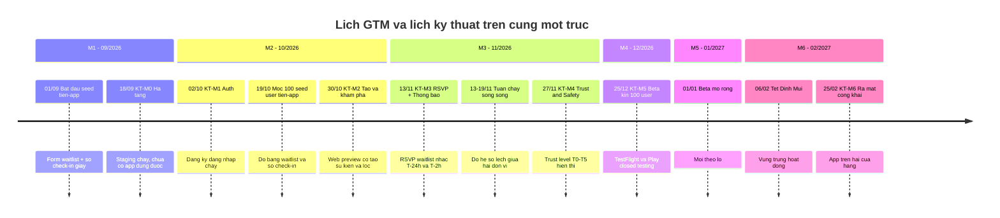

#### 12.1.2. Bảng đo lường theo từng giai đoạn — bản chuẩn

Bốn giai đoạn đo lường. Mỗi báo cáo phải ghi rõ mình đang ở giai đoạn nào.

| | **P‑A · Tiền‑app** | **P‑B · RSVP live** | **P‑C · Beta kín** | **P‑D · Công khai** |
|---|---|---|---|---|
| **Khoảng** | 01/09 → 12/11/2026 | 13/11 → 24/12/2026 | 25/12/2026 → 24/02/2027 | Từ 25/02/2027 |
| **Tháng GTM** | M1, M2, nửa đầu M3 | Nửa sau M3, phần lớn M4 | Cuối M4, M5, phần lớn M6 | Cuối M6 trở đi |
| **Định nghĩa "user"** | **Seed member tiền‑app** — thoả 3 điều kiện §5.1 bằng đơn vị tiền‑app | Registered user có `onboarding_completed` | Beta user được cấp lời mời | Registered user |
| **Đăng ký đo bằng** | Bản ghi hợp lệ trong `signup_sheet` (Google Form 5 trường) + xác nhận đã vào nhóm WhatsApp/Telegram | `COUNT(users)` sau onboarding | Như P‑B, có thêm cột `invite_batch` | `COUNT(users)` |
| **Cam kết tham dự đo bằng** | Dòng trong form đăng ký sự kiện **và** dòng trong sổ check‑in giấy tại cửa | `rsvps.status = 'confirmed'` | Như P‑B | Như P‑B |
| **Tham dự thật (NSM) đo bằng** | `WCA-proxy` = số dòng sổ check‑in đã khử trùng theo số điện thoại | `WCA` = `COUNT(rsvps WHERE status='checked_in')` | `WCA` | `WCA` |
| **Waitlist đo bằng** | Danh sách chờ ghi tay trên bảng tính khi form vượt sức chứa | `rsvps.status = 'waitlisted'` | Như P‑B | Như P‑B |
| **Nhắc lịch T−24h/T−2h** | Gửi **tay** qua email/WhatsApp theo kịch bản đã duyệt (Tuần 4) | Push + email tự động (`PUSH-01`, `PUSH-02`) | Tự động | Tự động |
| **Trust level** | Ghi tay trên bảng tính, chỉ phân biệt "đã gặp mặt" / "chưa gặp" | `users.trust_level` có nhưng chưa hiển thị (hiển thị từ 27/11) | T0–T5 đầy đủ | T0–T5 đầy đủ |
| **Vòng mời bạn** | `INV-D` — mã 6 ký tự in trên thẻ A6, nhập vào form | `INV-A/B/C` trong app | Thêm `INV-E` | Đầy đủ |
| **Tracking** | Lô 1 (5 event) | Lô 1 + 2 + 3 (44 event) | + Lô 4 (54 event) | 54 event |
| **Ai nhập số** | Curator nhập tay trước 12:00 hôm sau, Founder đối chiếu ảnh sổ thứ Hai | Tự động từ DB | Tự động | Tự động |
| **Sai số chấp nhận được** | ±15% | ±2% | ±1% | ±1% |
| **Hậu tố bắt buộc trong báo cáo** | `-proxy` | không | không | không |

#### 12.1.3. Bốn quy tắc chống nhầm lẫn

1. **Không đặt mục tiêu RSVP cho tháng M1–M2.** Mục tiêu của hai tháng đó là *seed member tiền‑app* và *tồn kho sự kiện*, không phải RSVP.
2. **Biểu đồ xu hướng phải có đường kẻ dọc tại 13/11/2026** và đổi màu chuỗi dữ liệu. Không vẽ một đường liền mạch qua mốc này.
3. **Tuần 13/11 – 19/11/2026 chạy song song hai đơn vị đo.** Hệ số lệch đo được trong tuần này ghi lại một lần và dùng để hiệu chỉnh mọi so sánh trước/sau.
4. **Mốc "100 seed user" ngày 19/10/2026 không phải mốc "100 beta user".** Mốc 100 beta user trong app là `KT‑M5` ngày **25/12/2026**. Hai con số 100 này là hai tập người khác nhau; kỳ vọng chỉ **55–70%** seed member tiền‑app chuyển thành beta user thật.

### 12.2. Bản đồ mùa vụ Đà Nẵng — 12 tháng

| Tháng | Thời tiết chi phối | Du lịch | Cộng đồng expat | Hệ số mùa vụ với hoạt động cộng đồng |
|---|---|---|---|---|
| 01 | Mát, mưa phùn nhẹ, 19–24°C | Thấp (trừ khách Hàn/Nga tránh rét) | **Cao** — nomad quay lại sau kỳ nghỉ | **1,10** |
| 02 | Mát khô, đẹp nhất năm | Thấp → trung bình | Cao, **trừ tuần Tết** | 1,15 (ngoài Tết) · **0,45** (tuần Tết) |
| 03 | Khô, 22–28°C | Trung bình | **Cao nhất năm** | **1,20** |
| 04 | Nóng dần, 24–31°C | Tăng, lễ 30/04 | Cao | 1,15 |
| 05 | Nóng, 26–33°C | Cao | Trung bình | 1,00 |
| 06 | Rất nóng, 27–35°C | **Đỉnh nội địa** | **Thấp** — nomad tránh nóng, đi Đà Lạt/Hội An/nước ngoài | **0,75** |
| 07 | Rất nóng, đông đúc | **Đỉnh nội địa** | Thấp nhất năm | **0,70** |
| 08 | Nóng, bắt đầu có mưa dông | Cao | Thấp | 0,80 |
| 09 | Chuyển mùa, mưa dông chiều | Giảm mạnh | Tăng — nomad quay lại | **0,95** |
| 10 | **Mưa nhiều, bão** | Thấp | Trung bình, sinh hoạt trong nhà | **0,80** |
| 11 | **Mưa to nhất, nguy cơ ngập** | Thấp nhất | Trung bình | **0,75** |
| 12 | Mưa giảm dần, mát | Tăng dịp Giáng sinh | **Cao** — mùa tiệc | **1,10** |

> **Hệ số mùa vụ dùng để làm gì:** nhân vào chỉ tiêu `I2` (số occurrence diễn ra) và `R_avg` khi lập kế hoạch tuần. Nó **không** dùng để biện minh khi trượt chỉ tiêu sau đó — hệ số phải được áp **trước**, ngay khi lập kế hoạch tháng.

**Điều đáng lo nhất:** cửa sổ seed quan trọng nhất (M1–M3, tháng 09–11/2026) rơi **trọn vào mùa mưa bão Đà Nẵng**, với hệ số 0,95 → 0,80 → 0,75. Kế hoạch §5.3 phải được đọc cùng §12.4.

### 12.3. Tết Đinh Mùi 2027 — biến số lớn nhất của M6

**Mùng 1 Tết Đinh Mùi rơi vào thứ Bảy 06/02/2027.** Kỳ nghỉ thực tế của thành phố kéo dài khoảng **03/02 → 12/02/2027**, một số hàng quán nghỉ tới rằm tháng Giêng (21/02/2027).

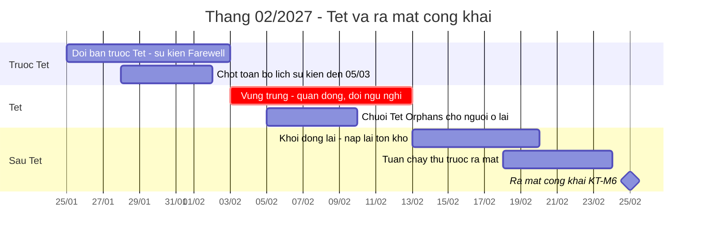

| Ảnh hưởng | Chi tiết | Hành động đối phó |
|---|---|---|
| **Nguồn cung sụp** | Coworking, quán bar, phòng gym đóng cửa 3–7 ngày. Organizer người Việt về quê. `I2` có thể rơi từ 20 xuống 6–8 trong tuần Tết | Chốt **toàn bộ** lịch sự kiện đến 05/03/2027 **trước ngày 28/01/2027**. Không để việc nạp lịch rơi vào tuần Tết |
| **Một phần expat rời thành phố** | Nhiều expat tranh thủ đi Đông Nam Á vì vé rẻ và thành phố vắng | Chấp nhận. Không đặt chỉ tiêu WCA cho tuần 03–12/02 |
| **Một phần expat ở lại và rất cô đơn** | Đây là **cơ hội lớn nhất của cả quý**: người ở lại thấy thành phố đóng cửa, không biết đi đâu | Chuỗi **`Tet Orphans`** — 5 buổi liên tiếp 05–09/02: bữa tối chung, đi bộ ngắm đường hoa, xem bắn pháo hoa giao thừa, cà phê sáng mùng 2, picnic biển mùng 3. Đây là nội dung **không kênh nào khác ở Đà Nẵng làm** |
| **Đội ngũ cần nghỉ** | Curator và CTV là người Việt, phải được nghỉ Tết | Lên lịch: đội trực tối thiểu 1 người/ngày cho kiểm duyệt (SLA critical **2 giờ** vẫn giữ nguyên, không nới trong Tết), phần curate tạm dừng 05–10/02 |
| **Ra mắt công khai cách Tết 13 ngày** | `KT‑M6` ngày 25/02/2027 chỉ cách ngày đi làm lại khoảng 1,5 tuần | Không dời ngày ra mắt, nhưng **dồn toàn bộ việc chuẩn bị ra mắt vào trước 30/01** — ảnh chụp màn hình cửa hàng, mô tả, thông cáo, danh sách khách mời Launch Night phải xong trước Tết |

> **Rủi ro lịch đã nhận diện:** nếu bất kỳ hạng mục nào của `KT‑M6` trượt sang tuần Tết, nó sẽ trượt tiếp **2 tuần** chứ không phải vài ngày, vì không ai ở Việt Nam làm việc trong khoảng đó. Đệm thời gian phải nằm **trước** Tết, không phải sau.

### 12.4. Mùa mưa bão — playbook vận hành cho M1 đến M4

Mùa mưa Đà Nẵng kéo dài **tháng 9 đến tháng 12**, đỉnh điểm **tháng 10–11**, đúng cửa sổ seed. Đây không phải rủi ro phụ — đây là điều kiện vận hành mặc định của nửa đầu kế hoạch.

#### 12.4.1. Ba trạng thái thời tiết và hành động tương ứng

| Trạng thái | Dấu hiệu | Hành động với sự kiện | Truyền thông |
|---|---|---|---|
| **W0 — Bình thường** | Không mưa hoặc mưa rào ngắn | Chạy bình thường | — |
| **W1 — Mưa lớn kéo dài** | Dự báo mưa > 50 mm trong khung giờ sự kiện | Sự kiện ngoài trời **tự động chuyển sang phương án trong nhà đã ghi sẵn trong listing**; báo trước **T−6h** | Push riêng + tin nhắn nhóm, không dùng `PUSH-01`/`PUSH-02` mặc định |
| **W2 — Bão / cảnh báo cấp thành phố** | Có công điện/cảnh báo chính thức | **Huỷ toàn bộ** sự kiện ngoài trời trong 48h, đánh dấu `event_cancelled` với `cancel_reason = 'weather'`; sự kiện trong nhà do địa điểm quyết | Thông báo trên mọi kênh trong **2 giờ**; đăng bài an toàn cộng đồng (nơi trú, số điện thoại khẩn) |

#### 12.4.2. Quy tắc thiết kế lịch cho mùa mưa

| # | Quy tắc | Áp dụng từ |
|---|---|---|
| 1 | **Tỷ lệ sự kiện trong nhà ≥ 70%** trong tháng 10 và 11 | 01/10/2026 |
| 2 | Mọi sự kiện ngoài trời phải khai **phương án dự phòng trong nhà** ngay trong listing (địa điểm thay thế + cùng giờ). Không có phương án dự phòng = không được publish trong tháng 10–11 | 01/10/2026 |
| 3 | `Beach Run + Breakfast` (CH-05) tạm treo trong tháng 11, thay bằng `Board Game Night` và `Indoor Bouldering` | 01/11/2026 |
| 4 | Chỉ tiêu `I2` tháng 10 nhân hệ số **0,80**, tháng 11 nhân **0,75** — áp **trước** khi lập kế hoạch | 01/10/2026 |
| 5 | Ngưỡng huỷ muộn `S9` được nới từ 4% lên **8%** riêng cho tháng 10–11, với điều kiện `cancel_reason = 'weather'` được ghi đúng | 01/10/2026 |
| 6 | POSM giấy đặt ngoài trời phải là loại chịu nước hoặc có mái che; ngân sách in ấn tháng 10–11 cộng thêm 20% cho việc thay thế | 01/10/2026 |
| 7 | Nội dung mùa mưa là **lợi thế**: "9 things to do in Da Nang when it rains" là bài đăng có hiệu suất cao nhất trong nhóm Facebook vào tháng 10–11 | 01/10/2026 |

> **Điểm sáng ít người nhận ra:** mưa **đẩy** người ta vào nhà và làm họ cô đơn hơn. Nhu cầu kết nối trong nhà (board game, quiz night, language exchange, lớp nấu ăn) **tăng** trong mùa mưa. Vấn đề không phải là ít nhu cầu, mà là **sai định dạng sự kiện**. Đội chuyển định dạng chứ không giảm nhịp.

### 12.5. Kỳ nghỉ trường quốc tế và ảnh hưởng tới phân khúc gia đình

Phân khúc S3 (gia đình expat) là kênh P2 mở từ M5 (CH-09), nhưng lịch trường quyết định thời điểm tiếp cận.

| Kỳ nghỉ | Khoảng thời gian điển hình | Ảnh hưởng | Hành động GTM |
|---|---|---|---|
| Nghỉ giữa kỳ I | Cuối 10/2026, 3–5 ngày | Gia đình đi du lịch ngắn | Không tiếp cận nhà trường; đây là lúc **tệ nhất** để gửi thư |
| **Nghỉ Giáng sinh — Năm mới** | ~18/12/2026 → 04/01/2027 | Phần lớn giáo viên nước ngoài rời Việt Nam; gia đình về quê | **Cảnh báo:** `KT‑M5` beta kín 100 user rơi ngày 25/12/2026 — **giữa kỳ nghỉ**. Xem §12.5.1 |
| Nghỉ Tết | ~03/02 → 12/02/2027 | Toàn bộ trường đóng | Xem §12.3 |
| Nghỉ giữa kỳ II | Cuối 3/2027, 3–5 ngày | | Ngoài cửa sổ |
| Nghỉ hè | ~10/06 → 15/08/2027 | **Nhiều gia đình rời Đà Nẵng cả mùa hè**; một số chuyển đi hẳn | Ngoài cửa sổ, nhưng phải tính vào kế hoạch Giai đoạn 2 |

#### 12.5.1. Hệ quả bắt buộc xử lý — beta kín rơi vào 25/12

`KT‑M5` (beta kín 100 user) chốt ngày **25/12/2026**, đúng ngày Giáng sinh và giữa kỳ nghỉ dài. Ba hệ quả và cách xử lý:

| Hệ quả | Xử lý |
|---|---|
| Tuyển đủ 100 beta user thật trong tuần Giáng sinh rất khó | **Chốt danh sách 130 beta user trước 15/12/2026** (dư 30% để bù người không phản hồi). Gửi lời mời theo 3 lô: 10/12, 17/12, 22/12 |
| Người dùng bận, tỷ lệ kích hoạt thấp trong 10 ngày đầu | Không đo tỷ lệ kích hoạt trong khoảng 24/12 – 02/01. **Cửa sổ đo chính thức của beta bắt đầu 05/01/2027** |
| Nhưng Giáng sinh lại là **mùa tiệc của expat ở Đà Nẵng** — nguồn cung sự kiện dồi dào | Tận dụng: chuỗi `Christmas in Da Nang` 20–26/12 (bữa tối chung cho người không về nhà, chợ Giáng sinh, đêm nhạc). Đây là dịp `I2` cao nhất của M4 |
| Đội ngũ kỹ thuật cần nghỉ | Đóng băng mã nguồn (code freeze) từ **23/12 → 02/01**, chỉ vá lỗi chặn. Ghi rõ trong kế hoạch sprint |

### 12.6. Lịch 6 tháng hợp nhất

| Tháng | Chủ đề tháng | Sự kiện trụ cột | Hệ số mùa vụ | Rủi ro mùa vụ chính | Điều chỉnh chỉ tiêu |
|---|---|---|---|---|---|
| **M1 · 09/2026** | *Đổ nền và chiếm cụm An Thượng* | Language Exchange (T4 hằng tuần), Newcomers Coffee (T7), Beach Run (CN) | 0,95 | Mưa dông chiều bắt đầu | `I2` = 6/tuần. Không đặt chỉ tiêu RSVP |
| **M2 · 10/2026** | *Nhịp đều và phủ vật lý* | Thêm Quiz Night (T3), Community Night 10/10 | **0,80** | **Mưa lớn, bão** | `I2` = 9/tuần (đã nhân hệ số). ≥ 70% sự kiện trong nhà |
| **M3 · 11/2026** | *Bật RSVP và chuyển đơn vị đo* | Chuỗi `Rainy Season Indoors`: board game, bouldering, lớp nấu ăn, quiz | **0,75** | **Đỉnh mưa, nguy cơ ngập** | `I2` = 12/tuần. Tuần 13–19/11 chạy song song hai đơn vị đo |
| **M4 · 12/2026** | *Beta kín và mùa tiệc* | Chuỗi `Christmas in Da Nang` 20–26/12, Beta Launch Night 27/12 | **1,10** | Kỳ nghỉ dài, code freeze 23/12–02/01 | `I2` = 15/tuần. Chốt 130 beta user trước 15/12 |
| **M5 · 01/2027** | *Mở rộng beta và làm dày nguồn cung* | `New Year New City` (chuỗi cho người mới đến đầu năm), giải bóng đá pickup 4 tuần | **1,10** | Người dùng đặt mục tiêu năm mới rồi bỏ giữa chừng | `I2` = 19/tuần. Bắt đầu chuẩn bị ra mắt |
| **M6 · 02/2027** | *Tết và ra mắt công khai* | Chuỗi `Tet Orphans` 05–09/02, **Launch Night 25/02** | 1,15 ngoài Tết · **0,45** tuần Tết | **Tết + ra mắt cách nhau 13 ngày** | `I2` = 25–28/tuần **tính trung bình cả tháng, bỏ tuần Tết ra khỏi mẫu số**. WCA mục tiêu **220–280** đo ở tuần cuối tháng |

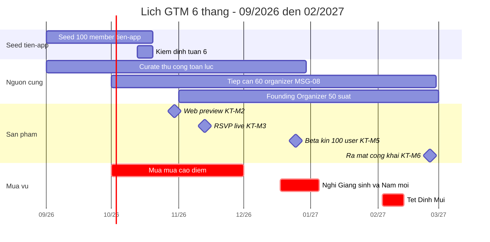

### 12.7. Bảy sự kiện cố định trong lịch — không được dời

| Ngày | Sự kiện | Vì sao không được dời |
|---|---|---|
| 19/10/2026 | Chốt mốc 100 seed member tiền‑app | Cổng quyết định §14.2 |
| 13–19/11/2026 | Tuần chạy song song hai đơn vị đo | Chỉ có đúng một cơ hội đo hệ số lệch |
| 15/12/2026 | Chốt danh sách 130 beta user | Nếu trượt thì `KT‑M5` trượt theo |
| 23/12/2026 | Bắt đầu code freeze | Bảo vệ kỳ nghỉ của đội |
| 28/01/2027 | Chốt toàn bộ lịch sự kiện đến 05/03 | Sau ngày này không ai nạp lịch được vì Tết |
| 30/01/2027 | Xong toàn bộ tài sản ra mắt (ảnh cửa hàng, mô tả, thông cáo, danh sách khách mời) | Tết nuốt mất 10 ngày làm việc |
| 25/02/2027 | Launch Night + ra mắt công khai | `KT‑M6` |

---

## 13. Ngân sách, nhân sự và công cụ

> **Tỷ giá quy đổi thống nhất trong toàn tài liệu: 1 USD = 26.000 VND.** Mọi con số USD dưới đây là kết quả quy đổi từ VND, làm tròn tới đơn vị USD. VND là đơn vị gốc để lập kế hoạch và quyết toán.
>
> **Phạm vi:** ngân sách này là **ngân sách GTM**, không bao gồm chi phí phát triển sản phẩm, hạ tầng máy chủ, phí Apple/Google, phí pháp lý thẩm định điều khoản — những khoản đó thuộc tài liệu 08 và 06.

### 13.1. Năm nguyên tắc chi tiêu

| # | Nguyên tắc | Hệ quả cụ thể |
|---|---|---|
| 1 | **Không mua user trước M4** | 0 đồng quảng cáo trả tiền trong M1–M3 (§5.5). Quảng cáo che mất tín hiệu sản phẩm có tự nhiên hấp dẫn hay không |
| 2 | **Chi cho sự kiện thật trước, chi cho công cụ sau** | Một buổi Language Exchange 450.000 đ tạo ra nhiều tín hiệu hơn bất kỳ gói SaaS nào cùng giá |
| 3 | **Mọi khoản in ấn phải gắn `channel_code` đo được** | Không in gì mà không biết QR đó thuộc địa điểm nào (`qr_scanned.venue_code`) |
| 4 | **Trần chi tháng cứng** | Vượt trần phải có phê duyệt của Founder bằng văn bản, không "quyết sau" |
| 5 | **Quỹ dự phòng tách riêng, không tiêu vào việc thường xuyên** | Dự phòng chỉ dùng cho: huỷ sự kiện do bão, sự cố an toàn, cơ hội đối tác đột xuất |

### 13.2. Ngân sách GTM tiền mặt theo tháng

Đơn vị: **nghìn VND** ở cột chi tiết, tổng có cả VND và USD.

| Hạng mục | M1 09/26 | M2 10/26 | M3 11/26 | M4 12/26 | M5 01/27 | M6 02/27 | **Tổng (nghìn đ)** |
|---|---|---|---|---|---|---|---|
| Sự kiện signature (đồ uống, giải thưởng, vật tư) | 3.200 | 3.600 | 4.500 | 6.000 | 6.000 | 7.000 | **30.300** |
| Sự kiện lớn theo mốc | — | 1.500 | — | 4.000 | — | 12.000 | **17.500** |
| In ấn POSM (standee, thẻ A6, poster A3, tent card) | 4.500 | 1.800 | 1.500 | 1.500 | 2.000 | 3.500 | **14.800** |
| Công cụ SaaS (§13.4) | 2.900 | 2.900 | 3.900 | 3.900 | 4.400 | 4.400 | **22.400** |
| SMS OTP nội địa (xác minh T2) | — | — | 500 | 800 | 1.000 | 1.200 | **3.500** |
| Nội dung: ảnh, video, thiết kế freelance | 3.000 | 3.000 | 3.000 | 3.500 | 3.500 | 6.000 | **22.000** |
| CTV curate & social bán thời gian (20h/tuần) | 5.500 | 5.500 | 5.500 | 5.500 | 5.500 | 5.500 | **33.000** |
| Quà cộng đồng (sticker, áo, huy hiệu vật lý) | — | — | — | 4.500 | — | — | **4.500** |
| Quảng cáo trả tiền (chỉ từ M5) | 0 | 0 | 0 | 0 | 5.000 | 8.000 | **13.000** |
| Đi lại, xăng xe, cà phê field | 1.200 | 1.200 | 1.300 | 1.300 | 1.300 | 1.400 | **7.700** |
| Quỹ dự phòng | 1.500 | 1.500 | 1.600 | 2.000 | 2.000 | 2.500 | **11.100** |
| **Tổng tháng (nghìn đ)** | **21.800** | **21.000** | **21.800** | **33.000** | **30.700** | **51.500** | **179.800** |
| **Tổng tháng (USD)** | **838** | **808** | **838** | **1.269** | **1.181** | **1.981** | **6.915** |

**Tổng ngân sách tiền mặt 6 tháng: 179.800.000 VND ≈ 6.915 USD.**

**Đọc bảng này cho đúng:** hai tháng đắt nhất là M4 (beta kín + mùa tiệc Giáng sinh) và M6 (Tết + Launch Night). Riêng M6 chiếm **28,6%** tổng ngân sách 6 tháng — đây là chủ ý, vì ra mắt công khai chỉ có một lần.

### 13.3. Ngân sách nhân sự

#### 13.3.1. Bảng nhân sự community

| Vai trò | Trách nhiệm chính | FTE M1–M3 | FTE M4–M6 | Thù lao/tháng (nghìn đ) | Tuyển khi nào | Vai trò trong hệ thống |
|---|---|---|---|---|---|---|
| **Founder / Community Lead** | Kênh, đối tác, organizer, quyết định cổng §14.2 | 1,0 | 1,0 | 0 (góp vốn bằng công sức) | Có sẵn | `users.role = 'super_admin'` |
| **Community Curator** | Toàn bộ §7 — quét nguồn, nhập liệu, khử trùng lặp, tiếp cận organizer, nhập số tiền‑app | 0,6 | 1,0 | 8.400 (M1–M3) → 14.000 (M4–M6) | **Tuần 0** | `users.role = 'curator'` |
| **CTV curate & social** (20h/tuần) | Quét Instagram/Telegram, dựng nội dung Reel, chụp ảnh sự kiện | 0,5 | 0,5 | 5.500 (đã nằm trong §13.2) | Tuần 1 | `users.role = 'curator'` |
| **Community Host / MC theo buổi** | Dẫn dắt Language Exchange và Quiz Night, đón người mới, điểm danh tại cửa | — | 0,2 | 500/buổi × 4 buổi = 2.000 | **M4** | `users.role = 'member'` + `event_cohosts` |
| **Moderator trực (10h/tuần)** | Hàng đợi kiểm duyệt, xử lý report, giữ **SLA critical 2 giờ** | 0,25 (từ 27/11) | 0,25 | 4.000 | **27/11/2026** (`KT‑M4`) | `users.role = 'moderator'` |
| **Nhiếp ảnh freelance** | 2 buổi/tháng, ảnh cho digest và mạng xã hội | — | — | 1.500/buổi (đã nằm trong §13.2) | Tuần 2 | — |

> **Lưu ý về role:** `curator`, `moderator`, `super_admin` là **giá trị của cột `users.role`** trong enum 5 giá trị đã chốt. `Community Host` **không** phải một role toàn cục — người đó là `member` và có quan hệ theo sự kiện qua bảng `event_cohosts`. Không tạo role mới cho vai trò vận hành.

#### 13.3.2. Chi phí nhân sự nằm ngoài bảng §13.2

| Khoản | M1 | M2 | M3 | M4 | M5 | M6 | **Tổng (nghìn đ)** |
|---|---|---|---|---|---|---|---|
| Community Curator | 8.400 | 8.400 | 8.400 | 14.000 | 14.000 | 14.000 | **67.200** |
| Community Host / MC | — | — | — | 2.000 | 2.000 | 2.000 | **6.000** |
| Moderator trực | — | — | 4.000 | 4.000 | 4.000 | 4.000 | **16.000** |
| **Tổng (nghìn đ)** | **8.400** | **8.400** | **12.400** | **20.000** | **20.000** | **20.000** | **89.200** |
| **Tổng (USD)** | **323** | **323** | **477** | **769** | **769** | **769** | **3.431** |

#### 13.3.3. Tổng chi phí GTM 6 tháng

| Nhóm chi | VND | USD |
|---|---|---|
| Tiền mặt vận hành (§13.2) | 179.800.000 | 6.915 |
| Nhân sự community (§13.3.2) | 89.200.000 | 3.431 |
| **TỔNG GTM 6 THÁNG** | **269.000.000** | **10.346** |
| *Chi phí cơ hội của Founder (không chi tiền, chỉ ghi nhận)* | *150.000.000* | *5.769* |

> **Trần cứng:** 300.000.000 VND (≈ 11.538 USD) cho 6 tháng. Vượt trần = kích hoạt cổng xem xét ở §14.2 bất kể chỉ số đang tốt hay xấu.

### 13.4. Công cụ cần mua

| # | Loại công cụ | Mục đích trong GTM | Chi phí/tháng (nghìn đ) | Chi phí/tháng (USD) | Mua từ | Ghi chú chọn nhà cung cấp |
|---|---|---|---|---|---|---|
| 1 | Landing page + form builder | Form waitlist 5 trường giai đoạn tiền‑app (§10.2), `signup_sheet` | 260 | 10 | **Tuần 0** | Gói rẻ nhất có xuất CSV và webhook |
| 2 | Bộ ứng dụng văn phòng đám mây (3 chỗ ngồi) | Bảng curation, CRM organizer, sổ nhập số tiền‑app | 390 | 15 | Tuần 0 | |
| 3 | Email giao dịch + digest (10.000 thư/tháng) | `MSG-12` weekly digest, xác minh email, nhắc lịch tiền‑app gửi tay | 520 | 20 | Tuần 0 | Phải có webhook mở/click để đo `G1` |
| 4 | Thiết kế (1 chỗ ngồi bản trả phí) | POSM, ảnh cửa hàng, ảnh sự kiện | 390 | 15 | Tuần 0 | |
| 5 | Lưu trữ media tương thích S3 | Kho 60 ảnh khu vực Tuần 0, ảnh sự kiện, **ảnh chụp sổ check‑in** (có kiểm soát truy cập) | 260 | 10 | Tuần 0 | Bật mã hoá at-rest, ghi log truy cập |
| 6 | Geocoding API | Gán toạ độ PostGIS cho listing curate, sai số ≤ 80 m (§7.4) | 390 | 15 | Tuần 0 | PostGIS tự quản, chỉ trả tiền geocoding |
| 7 | Quản lý mật khẩu đội | Chia sẻ tài khoản kênh an toàn | 130 | 5 | Tuần 0 | |
| 8 | Lên lịch & đăng nội dung mạng xã hội | 3 Reel/tuần (CH-13), bài định kỳ nhóm Facebook | 560 | 22 | Tuần 1 | |
| | **Cụm nền — chạy suốt M1 đến M6** | | **2.900** | **112** | | |
| 9 | Giám sát lỗi & crash | Crash-free session ≥ 99% là gate `KT‑M5` | 610 | 23 | **KT‑M3 13/11** | |
| 10 | Công cụ phỏng vấn user (ghi âm + gỡ băng) | Phỏng vấn định kỳ từ M3. *Phỏng vấn Tuần 6 dùng ghi âm điện thoại + gỡ băng tay, chưa tốn tiền* | 390 | 15 | M3 | Phải xin đồng ý ghi âm bằng văn bản |
| | **Cụm M3–M4** | | **3.900** | **150** | | |
| 11 | **Product analytics** | Phễu `F1`–`F6` (§11.4). Dùng **gói miễn phí** từ `KT‑M2`, lên gói trả phí khi vượt hạn mức sự kiện | 0 → **500** | 0 → 19 | Gói miễn phí `KT‑M2 30/10` · trả phí **M5** | Chọn nhà cung cấp cho phép **xoá dữ liệu theo `user_id`** và ký hợp đồng xử lý dữ liệu — bắt buộc theo §11.6 |
| | **Cụm M5–M6** | | **4.400** | **169** | | |
| 12 | SMS OTP nội địa | Xác minh điện thoại → **T2 Phone verified** | ~0,8/tin (**dòng ngân sách riêng** ở §13.2, không nằm trong cụm SaaS) | ~0,03/tin | **KT‑M3 13/11** | Nhà cung cấp trong nước, có hợp đồng và hoá đơn VAT |
| 13 | Quản lý push notification | `PUSH-01`…`PUSH-07` | **0** | **0** | KT‑M3 | **Tự triển khai** bằng BullMQ + APNs/FCM theo stack đã chốt — không mua dịch vụ ngoài |

> **Nguyên tắc chọn công cụ:** ưu tiên công cụ (a) xuất được dữ liệu thô ra CSV, (b) có webhook, (c) cho xoá dữ liệu theo `user_id`. Điều kiện (c) là **bắt buộc** — không có nó thì không đáp ứng được nghĩa vụ xoá dữ liệu trong 30 ngày ở §11.6. ⚠️ **CẦN LUẬT SƯ XÁC NHẬN** cho hợp đồng xử lý dữ liệu với nhà cung cấp analytics và email đặt máy chủ ngoài lãnh thổ, theo **Luật Bảo vệ dữ liệu cá nhân 91/2025/QH15** (hiệu lực từ 01/01/2026, cao hơn **Nghị định 13/2023/NĐ-CP**; mẫu biểu theo Luật 91/2025).

### 13.5. Chi phí trên mỗi người dùng

| Giai đoạn | Tổng chi (nghìn đ) | User mới trong giai đoạn | **Chi phí/user (đ)** | **Chi phí/user (USD)** | Nhận xét |
|---|---|---|---|---|---|
| M1–M2 · Seed tiền‑app | 59.600 | 100 seed member | **596.000** | **22,9** | Cao nhất, chấp nhận được — đây là chi phí học nghề và xây quan hệ, không phải chi phí mua user |
| M3–M4 · RSVP + beta kín | 87.200 | 220 registered | **396.000** | **15,2** | Bắt đầu có đòn bẩy từ curate và digest |
| M5–M6 · Mở rộng + ra mắt | 122.200 | 380 registered | **322.000** | **12,4** | Vòng mời bạn và SEO bắt đầu đóng góp |
| **Cả 6 tháng** | **269.000** | **700 registered** | **384.000** | **14,8** | |

**Chi phí trên mỗi WCA ở M6:** 51.500.000 đ ÷ (250 × 4 tuần) ≈ **51.500 đ/lượt tham dự ≈ 1,98 USD**. Ngưỡng đỏ: > 120.000 đ/lượt (4,6 USD) trong 2 tháng liên tiếp.

> **Ngưỡng đỏ CAC:** chi phí/user vượt **700.000 đ (26,9 USD)** trong 2 tháng liên tiếp → dừng mọi kênh trả tiền, quay lại 100% kênh công sức, và đưa vào cổng quyết định §14.2.

### 13.6. Ba tình huống cắt ngân sách

| Tình huống | Dấu hiệu kích hoạt | Cắt gì trước | Giữ gì bằng mọi giá |
|---|---|---|---|
| **Cắt 30%** | Chi phí/user vượt ngưỡng đỏ 1 tháng | Quảng cáo trả tiền, quà cộng đồng, nhiếp ảnh freelance, sự kiện lớn theo mốc | Sự kiện signature hằng tuần, CTV curate, SaaS nhóm 1–8 |
| **Cắt 50%** | Hai chỉ số đỏ ở §10.7 trong 2 tháng liên tiếp | Thêm: CTV curate (Curator gánh), công cụ nhóm 8, 9, 12 | **Language Exchange thứ Tư + Newcomers Coffee thứ Bảy** — hai định dạng này là xương sống của vòng L1 |
| **Chế độ tối thiểu** | Ngân sách còn < 40 triệu đ cho cả quãng còn lại | Mọi thứ trừ dòng dưới | 2 sự kiện/tuần · email digest · tồn kho `I4 ≥ 18` · SLA kiểm duyệt critical 2 giờ. **Chi phí chế độ tối thiểu: ~9,5 triệu đ/tháng ≈ 365 USD/tháng** |

---

## 14. Rủi ro GTM và phương án dự phòng

> **Phạm vi:** chỉ những rủi ro **của việc đưa sản phẩm ra thị trường**. Rủi ro sản phẩm, kỹ thuật, pháp lý và cạnh tranh nằm ở tài liệu 09 và 06. Mỗi rủi ro ở đây đều có **tín hiệu sớm đo được bằng một chỉ số ở §10** — rủi ro nào không đo được thì không nằm trong bảng.

### 14.1. Bảng rủi ro GTM

| Mã | Rủi ro | Xác suất | Tác động | Điểm | Tín hiệu sớm (chỉ số §10) | Phương án dự phòng | Chủ sở hữu |
|---|---|---|---|---|---|---|---|
| `GR-01` | **Nguồn cung cạn giữa mùa mưa** — curate không kịp, `I4` rơi dưới 18 | Cao | Rất cao | **9** | `I4 < 22` trong 2 tuần liên tiếp | Curator dừng toàn bộ việc khác (§7.2); kích hoạt "chế độ mồi": đội tự đăng 6 sự kiện trong nhà/tuần từ danh mục có sẵn (board game, quiz, language exchange); huy động `SRC-08` lịch lớp cố định của gym/trung tâm — mỗi lớp là một chuỗi occurrence lặp | Curator |
| `GR-02` | **Bị cấm khỏi nhóm Facebook lớn** — mất kênh CH-01 vĩnh viễn | Trung bình | Cao | **6** | Một cảnh báo từ admin, hoặc 1 bài bị gỡ | Không bao giờ đăng bằng tài khoản duy nhất; tuân thủ tuyệt đối tỷ lệ 10:1; chuẩn bị trước quan hệ với admin bằng bản lịch tuần miễn phí. Nếu mất: dồn sang CH-03 Telegram và CH-05 sự kiện signature, chấp nhận `I1` giảm 30% trong 4 tuần | Founder |
| `GR-03` | **Không ai đến dù đã đăng ký** — no-show > 35% | Trung bình | Rất cao | **7** | No-show > 28% trong 2 tuần | Nhắc **T−24h và T−2h** (đã chốt); yêu cầu xác nhận lại ở T−12h cho sự kiện có waitlist; công khai tỷ lệ đi/hẹn trên hồ sơ từ M5; giảm sức chứa công bố xuống 85% để waitlist luôn có người thay thế | Founder |
| `GR-04` | **Organizer từ chối hàng loạt, coi curate là ăn cắp nội dung** | Thấp | Rất cao | **5** | ≥ 3 yêu cầu gỡ trong 1 tháng (`C8 > 10%`) | Gỡ trong 24h vô điều kiện (§7.1); Founder gọi điện xin lỗi trực tiếp; tạm dừng curate nguồn đó; công khai lại nguyên tắc ghi nguồn. **Không** tranh cãi công khai | Founder |
| `GR-05` | **Seed 100 member tiền‑app trượt mốc 19/10** | Trung bình | Cao | **6** | Tuần 3 < 45 member tích luỹ | Xem cổng §14.2‑G1. Không kéo dài vô hạn: gia hạn tối đa **3 tuần**, sau đó bắt buộc xem lại phân khúc hoặc kênh | Founder |
| `GR-06` | **Chuyển đổi tiền‑app → app thất bại** — seed member không tải app khi RSVP live 13/11 | Trung bình | Rất cao | **8** | < 40% seed member có `onboarding_completed` trong 3 tuần sau 13/11 | Chiến dịch "hand-migration": Curator nhắn tay từng người trong 100 seed member; sự kiện đầu tiên sau 13/11 **chỉ nhận đăng ký qua app** (không ngoại lệ, §5.5); giữ song song form thêm tối đa 2 tuần rồi đóng hẳn | Curator |
| `GR-07` | **Bão lớn huỷ chuỗi sự kiện nhiều tuần** | Trung bình | Trung bình | **5** | Cảnh báo W2 (§12.4.1) | Chuyển toàn bộ sang định dạng trong nhà đã ghi sẵn trong listing; nếu không đi lại được: chuỗi trực tuyến tạm thời (quiz online, cà phê ảo) — chỉ dùng làm cầu nối, **không** biến thành sản phẩm chính | Curator |
| `GR-08` | **Mất cân bằng khu vực** — WCA dồn hết vào An Thượng, `I6 ≤ 4/6` | Cao | Cao | **7** | `I6 ≤ 4/6` hoặc `G5 > 70%` trong 3 tuần | Chỉ tiêu cứng: mỗi khu vực MVP ≥ 1 occurrence/tuần từ M5; Curator dành 4h/tuần riêng cho Hải Châu và Sơn Trà; ưu tiên tiếp cận organizer ngoài An Thượng trong `MSG-08` | Curator |
| `GR-09` | **Mất cân bằng giới nghiêm trọng** — `G8 < 30%` nữ trong WCA | Trung bình | Cao | **6** | `G8 < 33%` trong 2 tuần | Thêm định dạng ban ngày và cuối tuần (brunch, đi bộ, lớp học) thay vì chỉ tối ở bar; tuyển 2 co-host nữ; hiển thị rõ chính sách an toàn và nút báo cáo trên trang sự kiện; xem lại kênh CH-04 (bar thể thao lệch giới mạnh) | Founder |
| `GR-10` | **Sự cố an toàn tại sự kiện** — quấy rối, hành hung, tai nạn | Thấp | Rất cao | **6** | Bất kỳ `report_submitted` nào có `severity = 'critical'` | Runbook §14.4‑C. **SLA critical 2 giờ** không nới trong bất kỳ hoàn cảnh nào, kể cả Tết. Rút mọi listing của bên liên quan trong khi điều tra | Moderator |
| `GR-11` | **Cộng đồng luân chuyển quá nhanh** — D30 thấp vì người rời Đà Nẵng, không phải vì sản phẩm tệ | Cao | Trung bình | **5** | `R3 < 12%` nhưng `R3` của nhóm `still_in_da_nang` vẫn ≥ 18% | Tách hai nhóm khi báo cáo (§10.5.3); tối ưu cho vòng đời 8 tuần thay vì 12 tháng; kích hoạt `MSG-14` bàn giao khi rời đi để biến churn thành nguồn user mới | Founder |
| `GR-12` | **Đối thủ hoặc nhóm cộng đồng lớn sao chép format lịch tuần** | Trung bình | Trung bình | **4** | Xuất hiện bản digest tương tự trong nhóm Facebook | Không phản ứng công khai. Lợi thế phòng thủ là **quan hệ organizer đã claim** và **waitlist hoạt động thật**, không phải nội dung digest. Đẩy nhanh `S2` và chương trình Founding Organizer | Founder |
| `GR-13` | **Curator nghỉ việc hoặc kiệt sức** — 23 giờ/tuần curate dồn vào một người | Trung bình | Rất cao | **7** | Trượt nhịp quét 3 ngày liên tiếp, hoặc `C1 < 90%` | Ghi chép quy trình đầy đủ (§7 chính là tài liệu bàn giao); CTV được huấn luyện đủ để gánh 60% việc trong 2 tuần; Founder tự làm curate 1 buổi/tuần để không mất kỹ năng | Founder |
| `GR-14` | **Beta kín 25/12 tuyển không đủ 100 user thật** | Trung bình | Cao | **6** | < 90 người xác nhận trước 20/12 | Chốt danh sách **130 người trước 15/12** (§12.5.1); gửi lời mời theo 3 lô; dự phòng: mở thêm 30 suất từ danh sách waitlist tiền‑app còn hoạt động | Founder |
| `GR-15` | **Vượt trần ngân sách 300 triệu đ** | Thấp | Cao | **4** | Chi tích luỹ vượt 78% trần khi mới hết M4 | Kích hoạt kịch bản cắt 30% (§13.6) ngay, không chờ hết tháng | Founder |
| `GR-16` | **Vòng mời bạn bị lạm dụng để farm badge và trust signal** | Trung bình | Trung bình | **4** | `G6 > 5%` lượt quy công bị gắn cờ | Siết luật §9.5 (A2, A3, A4); tạm khoá tính năng mời 14 ngày và rà tay toàn bộ; thu hồi `trust_signals` đã cấp sai | Moderator |

**Cách chấm điểm:** Xác suất (Thấp 1 · Trung bình 2 · Cao 3) × Tác động (Trung bình 2 · Cao 3 · Rất cao 4), làm tròn xuống về thang 10.

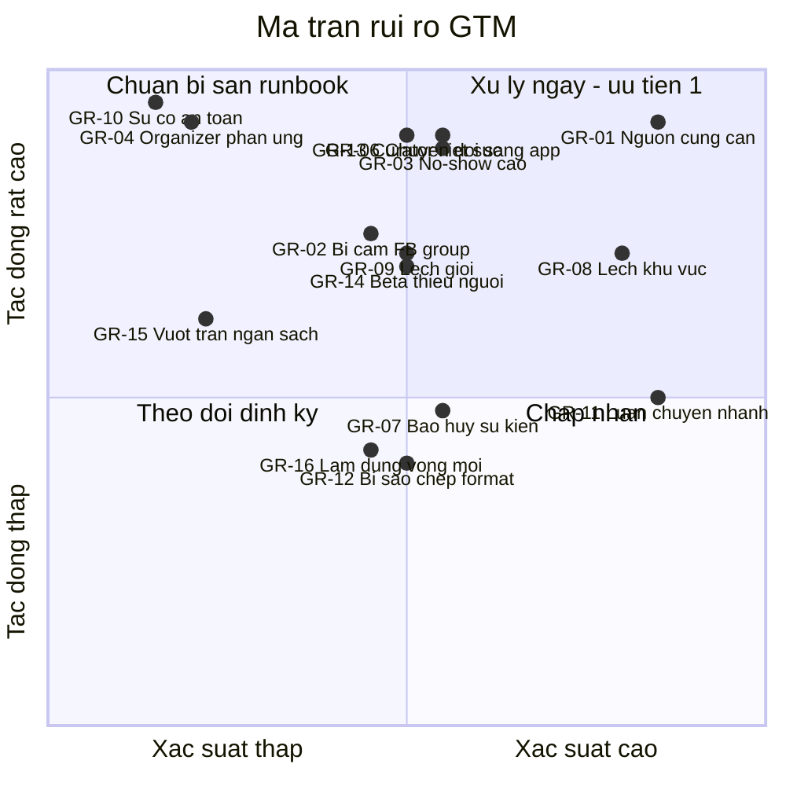

### 14.2. Cổng quyết định và ngưỡng thất bại theo cửa sổ thời gian

Đây là mục được viện dẫn ở §5.3 (Tuần 6) và §10.10. **Mỗi cổng có đúng ba kết quả** và người quyết định là Founder, ra quyết định bằng văn bản trong vòng 48 giờ sau ngày cổng.

| Cổng | Ngày chốt | Đơn vị đo | ✅ TIẾP TỤC | ⚠️ ĐIỀU CHỈNH | 🔴 XOAY TRỤC / DỪNG |
|---|---|---|---|---|---|
| **G1** — Cổng seed | **19/10/2026** (Tuần 6) | Tiền‑app (P‑A) | ≥ 85 seed member hợp lệ, trong đó ≥ 50 thuộc S1 và ≥ 38 đã dự thật ≥ 1 buổi. `I4 ≥ 20` | 55 – 84 seed member → gia hạn **tối đa 3 tuần**, giữ nguyên phân khúc, đổi tổ hợp kênh (dồn từ CH-01 sang CH-02 + CH-05) | **< 55 seed member** sau 6 tuần, hoặc < 20 người dự thật → xem lại **phân khúc** (§14.3‑P1). Không được gia hạn quá 3 tuần |
| **G2** — Cổng nguồn cung | **30/11/2026** (cuối M3) | Trong app (P‑B) | `S2 ≥ 25%` · `I4 ≥ 34` · ≥ 6 organizer đã claim · WCA ≥ 60 | `S2` 12–24% → tăng gấp đôi nhịp `MSG-08`, mở chương trình Founding Organizer sớm | `S2 < 12%` **và** ≥ 3 organizer từ chối gay gắt → nguồn cung không tự chảy được (§14.3‑P3) |
| **G3** — Cổng chuyển đổi đơn vị đo | **11/12/2026** (4 tuần sau `KT‑M3`) | Trong app | ≥ 55% seed member tiền‑app đã `onboarding_completed`; WCA ≥ 70; no-show ≤ 22% | 35–54% → chiến dịch hand-migration (`GR-06`), lùi mốc beta kín tối đa 1 tuần | **< 35%** → app không đủ tốt hơn form giấy. Dừng mở rộng, sửa luồng RSVP và onboarding trước khi làm bất cứ việc GTM nào khác |
| **G4** — Cổng beta | **31/01/2027** (cuối M5) | Trong app (P‑C) | ≥ 100 beta user hoạt động · WCA ≥ 140 · `R5 ≥ 19%` · `I6 ≥ 5/6` · crash-free ≥ 99% | WCA 95–139 hoặc `I6 = 4/6` → **lùi ngày ra mắt công khai tối đa 4 tuần** (sang 25/03/2027), dồn lực vào nguồn cung khu vực yếu | WCA < 95 **hoặc** `R5 < 12%` → không ra mắt công khai. Chuyển sang §14.3‑P2 |
| **G5** — Cổng ra mắt | **25/02/2027** (`KT‑M6`) | Trong app | **WCA ≥ 220** · **`I2 ≥ 25` occurrence/tuần** · **`I6 = 6/6`** · ≥ 8 organizer tự quản lý listing · SLA critical 2 giờ đạt 100% | WCA 160–219 → ra mắt nhưng **giới hạn truyền thông**, không chạy quảng cáo, tiếp tục dồn vào nguồn cung 4 tuần | WCA < 130 hoặc `I6 ≤ 4/6` → hoãn ra mắt công khai, giữ beta mở, xem lại toàn bộ §14.3 |
| **G6** — Cổng ngân sách | Cuối mỗi tháng | — | Chi tích luỹ ≤ kế hoạch + 10% | +10% đến +25% → cắt 30% (§13.6) | > +25% hoặc chi phí/user > 700.000 đ hai tháng liên tiếp → cắt 50% |

> **Quy tắc chống trì hoãn:** một cổng chỉ được kết luận "ĐIỀU CHỈNH" **tối đa hai lần liên tiếp**. Lần thứ ba bắt buộc là TIẾP TỤC hoặc XOAY TRỤC. Đây là hàng rào chống lại xu hướng tự nhiên là kéo dài mãi một kế hoạch đang không chạy.

#### 14.2.1. Ngưỡng thất bại theo cửa sổ thời gian — bảng tra nhanh

| Cửa sổ | Nếu đến cuối cửa sổ mà… | thì… |
|---|---|---|
| **3 tuần** (21/09/2026) | < 25 seed member hoặc < 30 lượt tiếp xúc có ý nghĩa/tuần | Đổi tổ hợp kênh ngay trong tuần, không chờ Tuần 6 |
| **6 tuần** (19/10/2026) | < 55 seed member | Cổng `G1` → xem lại phân khúc |
| **9 tuần** (09/11/2026) | `I4 < 22` liên tục 3 tuần | Kích hoạt "chế độ mồi" của `GR-01` |
| **13 tuần** (11/12/2026) | < 35% seed member chuyển sang app | Cổng `G3` → dừng mở rộng, sửa sản phẩm |
| **17 tuần** (05/01/2027) | Beta kín < 70 user hoạt động | Lùi ngày ra mắt 4 tuần, không cố ra mắt đúng hạn |
| **22 tuần** (08/02/2027) | Tuần Tết `I2 < 5` **và** không có chuỗi `Tet Orphans` chạy | Chấp nhận tuần chết, nhưng phải có bài học viết ra: đã bỏ lỡ cơ hội nội dung độc quyền của cả quý |
| **26 tuần** (28/02/2027) | WCA < 130 | Cổng `G5` → hoãn ra mắt, xem lại toàn bộ luận điểm GTM |

### 14.3. Bốn phương án xoay trục đã chuẩn bị sẵn

Chuẩn bị trước không có nghĩa là mong nó xảy ra. Nghĩa là khi nó xảy ra, đội không mất 3 tuần để tranh cãi.

| Mã | Phương án | Điều kiện kích hoạt | Nội dung | Chi phí chuyển đổi | Cái giữ lại |
|---|---|---|---|---|---|
| **P1** | **Đổi phân khúc trọng tâm** — từ S1 (remote worker/nomad) sang S2 (giáo viên nước ngoài) hoặc S5 (người Việt nói tiếng Anh) | `G1` = XOAY TRỤC | S2 ở lại lâu hơn nhiều (theo hợp đồng năm học), mật độ tập trung ở trung tâm ngoại ngữ thay vì coworking. S5 có sẵn nhu cầu luyện tiếng và ở lại vĩnh viễn. Đổi kênh chủ lực từ CH-02 sang CH-08, đổi định dạng chủ lực từ nomad meetup sang language exchange có cấu trúc | ~3 tuần, ~15 triệu đ in lại POSM và làm lại nội dung | Toàn bộ §7 curate, toàn bộ hạ tầng, 6 khu vực MVP |
| **P2** | **Thu hẹp về "lịch tuần + digest"** — bỏ tham vọng nền tảng hai chiều ở Giai đoạn 1 | `G4` = XOAY TRỤC | Sản phẩm chính trở thành **trang `/this-week` + email digest thứ Năm**, RSVP chỉ là tính năng phụ. Đo bằng lượt mở digest và lượt vào trang, không đo bằng WCA | ~2 tuần, gần như 0 đ | Curate, digest, SEO, quan hệ organizer |
| **P3** | **Xoay sang công cụ cho organizer (B2B2C)** | `G2` = XOAY TRỤC | Bán/tặng công cụ quản lý người tham dự cho 15–20 organizer sẵn có (trang RSVP riêng, waitlist, điểm danh, danh sách khách). Người dùng cuối đến qua organizer thay vì qua khám phá | ~4 tuần, cần đổi ưu tiên backlog | RSVP, waitlist, điểm danh, trust level |
| **P4** | **Hoãn ứng dụng di động, chạy web-only** | Ứng dụng bị từ chối trên cửa hàng, hoặc `G5` = hoãn | Web PWA làm sản phẩm chính, mobile lùi sang quý sau. Kéo theo: `PUSH-01`/`PUSH-02` chuyển sang email + tin nhắn nhóm | ~1 tuần | Mọi thứ khác |

**Điều KHÔNG bao giờ xoay trục ở Giai đoạn 1:**

| Không đổi | Vì sao |
|---|---|
| Thành phố Đà Nẵng | Toàn bộ lợi thế nằm ở mật độ địa lý và quan hệ thực địa. Mở thành phố thứ hai trước khi Đà Nẵng chạy là cách chắc chắn nhất để thất bại ở cả hai |
| Ngôn ngữ mặc định tiếng Anh | Đây là điều kiện tồn tại của phân khúc, không phải lựa chọn thẩm mỹ |
| Miễn phí ở Giai đoạn 1 | Thu phí khi chưa có mật độ là tự cắt phễu |
| 6 khu vực MVP | Đã chốt. Thu hẹp còn 3 khu vực làm bộ lọc vô nghĩa; mở rộng quá 6 làm loãng nguồn cung |
| Waitlist | Đã chốt là MUST cho MVP — nó là thứ khiến organizer tin sức chứa được tôn trọng |

### 14.4. Ba runbook GTM

#### A. Bão / cảnh báo thời tiết cấp thành phố (`GR-07`)

| Mốc | Việc | Người | Hạn |
|---|---|---|---|
| T−48h | Rà toàn bộ occurrence trong 48h tới, phân loại W0/W1/W2 (§12.4.1) | Curator | 30 phút |
| T−36h | Liên hệ từng địa điểm xác nhận mở hay đóng | Curator | 2 giờ |
| T−24h | Huỷ hoặc chuyển địa điểm; ghi `event_cancelled` với `cancel_reason = 'weather'` | Curator | 1 giờ |
| T−24h | Gửi thông báo cho **mọi** người đã RSVP, kể cả `waitlisted` | Hệ thống + tay | 30 phút |
| Trong bão | Đăng thông tin an toàn cộng đồng (nơi trú, số khẩn cấp, cập nhật ngập) trên mọi kênh | Founder | Liên tục |
| T+24h | Đăng lại lịch đã khôi phục; xin lỗi bằng một câu, không dài dòng | Curator | 1 giờ |

#### B. Bị cấm khỏi nhóm Facebook lớn (`GR-02`)

| Bước | Việc | Hạn |
|---|---|---|
| 1 | **Không** tạo tài khoản mới để lách. Việc đó biến sự cố thành xung đột vĩnh viễn | Ngay |
| 2 | Nhắn riêng admin bằng giọng người thật: hỏi đã sai ở đâu, xin hướng dẫn | 24 giờ |
| 3 | Đề nghị đền bù bằng giá trị: cung cấp bản lịch tuần miễn phí để **admin tự đăng**, ghi nguồn nhóm | 48 giờ |
| 4 | Nếu không được: chấp nhận mất kênh, chuyển ngân sách công sức sang CH-03 và CH-05, hạ chỉ tiêu `I1` 30% trong 4 tuần | 1 tuần |
| 5 | Viết lại quy tắc đăng bài nội bộ, phổ biến cho cả đội và CTV | 1 tuần |

#### C. Sự cố an toàn tại sự kiện (`GR-10`) — **SLA critical 2 giờ**

| Mốc | Việc | Người |
|---|---|---|
| 0–15 phút | Bảo đảm an toàn thân thể tại chỗ; gọi cấp cứu/công an nếu cần; tách các bên | Host tại chỗ |
| 15–60 phút | Ghi lại lời kể của người báo cáo bằng văn bản; **không** hứa kết quả xử lý | Moderator |
| **Trong 2 giờ** | Quyết định tạm thời: khoá tài khoản liên quan, gỡ listing liên quan, thông báo cho người đã RSVP nếu sự kiện bị huỷ | Moderator |
| 24 giờ | Founder gọi trực tiếp người báo cáo | Founder |
| 72 giờ | Kết luận và thông báo cho các bên; ghi vào hồ sơ vụ việc | Moderator + Founder |
| 7 ngày | Rà lại quy trình: điều gì trong thiết kế sự kiện đã tạo điều kiện cho việc này | Cả đội |

> **Ba điều tuyệt đối không làm:** không thảo luận vụ việc trên nhóm công khai; không tiết lộ danh tính người báo cáo; không nới SLA 2 giờ vì lý do ngày lễ, Tết hay cuối tuần.

---

## 15. Phụ lục — checklist khảo sát thực địa tuần 0

> Đây là checklist được viện dẫn ở §4 ("xác minh thực địa trong Tuần 0") và §5.3 (T2–T3: *"đi bộ toàn cụm An Thượng – Mỹ An, ghi nhận 20 địa điểm"*).
>
> **Cửa sổ chạy: 01/09 – 05/09/2026.** Đầu ra bắt buộc: **20 địa điểm đã xác minh**, mỗi địa điểm có tên người ra quyết định và một kênh liên lạc trực tiếp.
>
> **Nhắc lại:** danh sách địa điểm ở §4 là **danh sách hạt giống** nhãn `B`/`C`. Tuần 0 tồn tại để biến nó thành nhãn `A`. Không gửi email hàng loạt trước khi xác minh xong.

### 15.1. Mục tiêu và phân công

| # | Mục tiêu Tuần 0 | Chỉ tiêu | Người |
|---|---|---|---|
| 1 | Xác minh 20 địa điểm còn hoạt động, đúng địa chỉ, đúng chủ | 20/20 | Cả đội |
| 2 | Có tên + kênh liên lạc trực tiếp của người ra quyết định | ≥ 16/20 | Founder |
| 3 | Chốt vị trí đặt POSM và `channel_code` cho từng nơi | ≥ 12 vị trí | Founder |
| 4 | Thu thập lịch sự kiện đang có tại chỗ (poster, bảng, tờ rơi) | ≥ 25 sự kiện | Curator |
| 5 | Chụp thư viện ảnh khu vực dùng chung cho listing curate | ≥ 60 ảnh ≥ 1200 px | Curator |
| 6 | Đo mật độ người nước ngoài theo khung giờ | 3 khung giờ × 8 điểm | Cả đội |
| 7 | Chốt danh sách 6 khu vực `area_slug` và ranh giới thực tế trên bản đồ | 6/6 | Product |

**Phân tuyến:** hai người đi **cùng nhau** trong ngày đầu để hiệu chỉnh cách chấm điểm cho khớp nhau, sau đó tách đôi từ ngày 2.

### 15.2. Bộ dụng cụ mang theo

| Vật dụng | Vì sao |
|---|---|
| Điện thoại có pin dự phòng ≥ 10.000 mAh | Chụp ảnh + ghi toạ độ liên tục cả ngày |
| Biểu mẫu khảo sát ngoại tuyến (bản in **và** bản trên máy) | Sóng yếu trong nhiều quán; bản in là dự phòng |
| 30 danh thiếp có QR về landing page | Đưa ngay khi có người hỏi, không hẹn lại |
| 5 bản in mẫu POSM (standee A5, thẻ A6, tent card) | Cho người quản lý **nhìn thấy** vật thật, không mô tả bằng lời |
| Thước dây / thước đo bước chân | Ước lượng sức chứa trong nhà cho `capacity` |
| Áo mưa mỏng + túi chống nước | Đầu tháng 9 đã có mưa dông chiều |
| Tiền mặt lẻ | Gọi đồ uống ở mỗi nơi — **quy tắc: không khảo sát chùa** |

### 15.3. Biểu mẫu khảo sát một địa điểm

Ghi thành CSV/bảng tính, mỗi địa điểm một dòng. Các trường có dấu **\*** là bắt buộc.

| Nhóm | Trường | Kiểu | Ghi chú |
|---|---|---|---|
| Định danh | `venue_code`\* | text | `VEN-001` … `VEN-020`, dùng suốt đời trong `channel_code` |
| | `venue_name`\* | text | Tên đúng như biển hiệu, không tự dịch |
| | `venue_type`\* | enum | `coworking` · `cafe_work` · `sports_bar` · `pub` · `gym_studio` · `language_center` · `homestay` · `restaurant` · `outdoor_spot` |
| Vị trí | `address_line`\* | text | **Số nhà + tên đường thật**, không ghi "An Thượng" chung chung (§7.4) |
| | `area_slug`\* | enum | Một trong 6 khu vực MVP: `an-thuong` · `my-khe` · `my-an` · `hai-chau` · `son-tra` · `ngu-hanh-son` |
| | `geo_lat`, `geo_lng`\* | decimal | Lấy tại chỗ, sai số ≤ 80 m |
| | `walk_minutes_to_an_thuong_core` | int | Đo mật độ đi bộ cho vòng L4 |
| Hoạt động | `is_operating`\* | bool | **Xác minh bằng mắt**, không tin bài đăng cũ |
| | `opening_hours`\* | text | Ghi cả ngày nghỉ trong tuần |
| | `closes_for_tet` | enum | `no` · `1_3_days` · `4_7_days` · `over_7_days` · `unknown` — dùng cho §12.3 |
| Sức chứa | `indoor_capacity`\* | int | Ước lượng bằng số ghế thật |
| | `has_rain_backup`\* | bool | Có chỗ trong nhà khi mưa — điều kiện publish sự kiện tháng 10–11 (§12.4.2) |
| | `has_projector_or_screen` | bool | Cho quiz night và chiếu thể thao |
| | `noise_level` | enum | `quiet` · `medium` · `loud` — quyết định có làm language exchange được không |
| Người | `foreigner_ratio_observed`\* | enum | `under_20` · `20_50` · `50_80` · `over_80` — **quan sát thật, ghi kèm khung giờ** |
| | `peak_hours_observed`\* | text | Ba khung giờ quan sát: 09:00–10:00 · 15:00–16:00 · 19:00–20:00 |
| | `decision_maker_name`\* | text | **Hỏi đúng câu:** *"Who runs your member events?"* |
| | `decision_maker_role` | text | Community Manager / chủ / quản lý ca |
| | `contact_channel`\* | enum | `zalo` · `whatsapp` · `telegram` · `phone` · `email` · `facebook_page` · `none` |
| | `contact_value`\* | text | ⚠️ Đây là **dữ liệu cá nhân** — xem §15.7 |
| | `speaks_english` | enum | `fluent` · `basic` · `none` — quyết định dùng `MSG-05` bản tiếng Anh hay nói tiếng Việt |
| Sự kiện sẵn có | `existing_events_count`\* | int | Số sự kiện định kỳ họ đang chạy |
| | `existing_events_detail` | text | Tên + thứ + giờ, chép nguyên từ poster |
| | `posts_schedule_where` | text | Nơi họ đang đăng lịch — đây là nguồn `SRC-02` |
| POSM | `posm_slot_available`\* | bool | Có chỗ đặt standee/thẻ không |
| | `posm_type_agreed` | enum | `standee_a5` · `card_a6` · `poster_a3` · `tent_card` · `menu_clip` · `none` |
| | `channel_code` | text | `cowork_<slug>` / `pub_<slug>` / `cafe_<slug>` / `homestay_<slug>` — khớp `qr_scanned.channel_code` (§11.3 G) |
| Kết luận | `score_25`\* | int | Điểm theo §15.4 |
| | `priority`\* | enum | `p0` · `p1` · `p2` · `skip` |
| | `verdict_note`\* | text | Một câu: vì sao nên/không nên hợp tác |
| | `photo_ids`\* | text | ≥ 3 ảnh: mặt tiền · không gian trong · bảng lịch sự kiện nếu có |
| | `surveyed_by`, `surveyed_at`\* | text, datetime | Lưu **UTC**, nhập theo `Asia/Ho_Chi_Minh` |

### 15.4. Bảng chấm điểm địa điểm — thang 25

| Tiêu chí | ×5 = 5 điểm | 3 điểm | 1 điểm |
|---|---|---|---|
| **Mật độ người nước ngoài quan sát được** | `over_80` | `50_80` hoặc `20_50` | `under_20` |
| **Khả năng tiếp cận người ra quyết định** | Đã gặp mặt, có Zalo/WhatsApp trực tiếp | Có trang/số tổng đài | Không tiếp cận được |
| **Không gian có tổ chức được sự kiện 15–30 người** | Có, kèm chỗ trong nhà khi mưa | Có nhưng nhỏ hoặc không có phương án mưa | Không |
| **Đã có sự kiện định kỳ đang chạy** | ≥ 2 sự kiện/tuần | 1 sự kiện/tuần hoặc 2 tuần/lần | Không có |
| **Vị trí trong cụm trọng tâm An Thượng – Mỹ An** | Đi bộ ≤ 5 phút tới lõi cụm | 6–15 phút | > 15 phút hoặc khác cụm |

| Tổng điểm | Xếp loại | Hành động ngay trong Tuần 0 |
|---|---|---|
| **21 – 25** | `p0` | Đặt lịch gặp lại trong Tuần 1, dùng `MSG-05` hoặc `MSG-06`. Đặt POSM ngay nếu họ đồng ý |
| **15 – 20** | `p1` | Ghi vào danh sách tiếp cận M2, để lại danh thiếp |
| **9 – 14** | `p2` | Chỉ giữ làm **nguồn curate** (`SRC-02`), không đầu tư quan hệ |
| **≤ 8** | `skip` | Không quay lại. Ghi lý do để không lãng phí công sức lần sau |

### 15.5. Lộ trình đi bộ ba ngày

| Ngày | Buổi | Tuyến | Loại địa điểm nhắm | Chỉ tiêu |
|---|---|---|---|---|
| **T2 01/09** | Sáng 08:30–11:30 | Lõi An Thượng — trục đường quán tây và các ngõ ngang | Coworking, cà phê làm việc | 5 địa điểm |
| | Chiều 15:00–17:30 | An Thượng mở rộng về phía Mỹ An | Gym, studio yoga, trung tâm ngoại ngữ | 4 địa điểm |
| | Tối 19:00–21:30 | An Thượng — trục quán bar | Sports bar, pub | 3 địa điểm |
| **T3 02/09** | Sáng 08:30–11:30 | Mỹ An — khu căn hộ dịch vụ | Homestay, cà phê làm việc | 4 địa điểm |
| | Chiều 15:00–17:30 | Ven biển Mỹ Khê, dọc trục ven biển | Điểm ngoài trời, CLB chạy/surf | 3 địa điểm |
| | Tối 19:00–21:00 | Mỹ An | Nhà hàng có không gian nhóm | 2 địa điểm |
| **T4 03/09** | Sáng 09:00–12:00 | Hải Châu — ven sông Hàn và khu trung tâm | Coworking trung tâm, trung tâm ngoại ngữ | 3 địa điểm |
| | Chiều 15:00–17:00 | Sơn Trà — An Hải | Cà phê, điểm ngoài trời | 2 địa điểm |
| | Tối | Nhập liệu, chấm điểm, chốt danh sách 20 | — | Bảng hoàn chỉnh |

> **Ba khung giờ quan sát cố định — bắt buộc ghi vào `peak_hours_observed`:** 09:00–10:00 (dân làm việc), 15:00–16:00 (giờ chết, đo mật độ nền), 19:00–20:00 (giờ sinh hoạt cộng đồng). Một địa điểm chỉ được chấm `over_80` nếu quan sát ở **ít nhất hai** khung giờ.

### 15.6. Kịch bản hỏi tại chỗ — sáu câu, không quá 4 phút

Gọi một món đồ uống trước. Không mở laptop. Không nói "chúng tôi đang xây một nền tảng".

| # | Câu hỏi | Mục đích |
|---|---|---|
| 1 | *"How busy does it get here in the evenings? Mostly locals or foreigners?"* | Lấy `foreigner_ratio_observed` mà không hỏi trực tiếp |
| 2 | *"Do you run any regular events? Quiz, language exchange, anything weekly?"* | Lấy `existing_events_count` và `existing_events_detail` |
| 3 | *"Where do people find out about them?"* | Lấy `posts_schedule_where` — đây chính là nguồn `SRC-02` |
| 4 | **"Who runs your member events?"** | Lấy `decision_maker_name` — **câu quan trọng nhất**, hỏi đúng chữ này |
| 5 | *"If someone made a free weekly list of everything happening for foreigners in Da Nang, would you put a small card on the counter?"* | Thử phản ứng với POSM trước khi đề nghị chính thức |
| 6 | *"Is it okay if I take a couple of photos of the space?"* | **Luôn xin phép**, kể cả khi không ai để ý |

**Không làm trong Tuần 0:** không chốt hợp đồng, không hứa lưu lượng, không đưa số liệu chưa có, không xin danh sách khách hàng của họ.

### 15.7. Ràng buộc pháp lý và đạo đức khi khảo sát

> ⚠️ **CẦN LUẬT SƯ XÁC NHẬN.** Từ **01/01/2026**, **Luật Bảo vệ dữ liệu cá nhân số 91/2025/QH15** là văn bản có hiệu lực pháp lý cao hơn **Nghị định 13/2023/NĐ-CP**. Cả hai cùng được viện dẫn, nhưng **mọi mẫu biểu — thông báo xử lý dữ liệu, biểu mẫu đồng ý, sổ ghi hoạt động xử lý — phải soạn theo Luật 91/2025**. Chi tiết đầy đủ ở tài liệu 06.

| # | Ràng buộc | Cách thực hiện trong Tuần 0 |
|---|---|---|
| 1 | `contact_value` (số điện thoại, Zalo, email của người quản lý) là **dữ liệu cá nhân** | Chỉ ghi sau khi người đó **tự nguyện đưa** cho mục đích liên hệ hợp tác. Nói rõ một câu: *"I'll use this only to follow up about hosting events — nothing else."* |
| 2 | Lưu trữ có kiểm soát | Bảng khảo sát để trong kho có kiểm soát truy cập, chỉ Founder và Curator xem được. **Không** đưa lên nhóm chat |
| 3 | Mục đích giới hạn | **Không** dùng `contact_value` cho gửi thư hàng loạt, không nhập vào công cụ email marketing, không bán/chia sẻ |
| 4 | Quyền rút lại | Ai nói "đừng liên hệ nữa" → xoá khỏi bảng trong **7 ngày** và ghi vào `do_not_contact` |
| 5 | Ảnh chụp có mặt người | **Không chụp cận mặt khách** không xin phép. Ảnh dùng cho listing phải là ảnh không gian hoặc ảnh có người ở xa/không nhận diện được |
| 6 | Ảnh biển hiệu và poster sự kiện | Được chụp (thông tin công khai), nhưng khi đưa lên listing phải ghi nguồn theo §7.1 |
| 7 | Không thu thập dữ liệu ngoài phạm vi | Không hỏi doanh thu, không hỏi số lượng khách hàng, không hỏi thông tin cá nhân của khách |
| 8 | Sổ ghi hoạt động xử lý dữ liệu | Mở sổ từ **ngày 01/09/2026**, ghi: dữ liệu gì, mục đích gì, lưu ở đâu, giữ bao lâu, ai truy cập |
| 9 | Thời hạn lưu | Dữ liệu khảo sát địa điểm giữ tối đa **24 tháng**; `contact_value` của người đã từ chối xoá ngay |

### 15.8. Checklist in được — dán vào bìa sổ

**Trước khi đi (T2 07:30)**

- [ ] Pin dự phòng đã sạc đầy
- [ ] Biểu mẫu ngoại tuyến đã tải về máy + 25 bản in
- [ ] 30 danh thiếp có QR
- [ ] 5 bản in mẫu POSM
- [ ] Tiền mặt lẻ ≥ 500.000 đ
- [ ] Áo mưa mỏng
- [ ] Đã thống nhất cách chấm điểm §15.4 giữa hai người

**Tại mỗi địa điểm**

- [ ] Gọi một món đồ uống trước khi hỏi bất cứ điều gì
- [ ] Chụp đủ **3 ảnh**: mặt tiền · không gian trong · bảng lịch sự kiện
- [ ] Ghi toạ độ ngay tại chỗ, không ghi sau
- [ ] Hỏi đủ **6 câu** ở §15.6, đúng thứ tự
- [ ] Hỏi **"Who runs your member events?"** — không bỏ qua
- [ ] Xin phép trước khi chụp
- [ ] Ghi `foreigner_ratio_observed` **kèm khung giờ quan sát**
- [ ] Chấm `score_25` **ngay tại chỗ**, không để đến tối
- [ ] Ghi một câu `verdict_note` bằng lời của chính mình
- [ ] Nếu `score_25 ≥ 21`: xin luôn lịch hẹn Tuần 1 trước khi rời đi

**Cuối mỗi ngày (trước 22:00)**

- [ ] Đồng bộ toàn bộ dòng khảo sát lên bảng tính chung
- [ ] Đổi tên và tải lên toàn bộ ảnh theo `photo_ids`
- [ ] Cập nhật bảng xếp hạng 20 địa điểm theo `score_25`
- [ ] Ghi 3 điều bất ngờ học được trong ngày (đây là nguồn insight quý nhất của cả tuần)
- [ ] Hai người đối chiếu điểm số của 2 địa điểm bất kỳ để kiểm tra độ lệch chấm điểm

**Cuối Tuần 0 (T7 05/09 trước 18:00)**

- [ ] Đủ **20 địa điểm** đã xác minh `is_operating = true`
- [ ] ≥ **16** địa điểm có `decision_maker_name` và `contact_value`
- [ ] ≥ **12** địa điểm đã chốt `posm_slot_available = true` và có `channel_code`
- [ ] ≥ **25** sự kiện sẵn có đã ghi lại, sẵn sàng nạp vào lịch curate
- [ ] ≥ **60** ảnh ≥ 1200 px đã tải lên kho media
- [ ] Ranh giới thực tế của **6 khu vực MVP** đã vẽ trên bản đồ và được Product duyệt
- [ ] Danh sách `p0` (≥ 6 địa điểm) đã có lịch hẹn cụ thể trong Tuần 1
- [ ] Sổ ghi hoạt động xử lý dữ liệu đã mở và có dòng đầu tiên

### 15.9. Mẫu bảng tổng hợp 20 địa điểm

Bảng này là đầu ra chính thức của Tuần 0, dán vào tài liệu vận hành và cập nhật hằng tháng.

| `venue_code` | Tên | `venue_type` | `area_slug` | `foreigner_ratio_observed` | `existing_events_count` | `decision_maker_name` | `contact_channel` | `posm_slot_available` | `score_25` | `priority` | Hẹn Tuần 1 |
|---|---|---|---|---|---|---|---|---|---|---|---|
| VEN-001 | | `coworking` | `an-thuong` | | | | | | | `p0` | |
| VEN-002 | | | | | | | | | | | |
| … | | | | | | | | | | | |
| VEN-020 | | | | | | | | | | | |

**Phân bổ mục tiêu của 20 địa điểm:**

| Loại | Số lượng mục tiêu | Vì sao |
|---|---|---|
| `coworking` | 6 | Kênh CH-02, ưu tiên P0 |
| `cafe_work` | 4 | Kênh CH-12, chi phí trên mỗi lượt tiếp xúc thấp nhất |
| `sports_bar` / `pub` | 3 | Kênh CH-04, bằng chứng nhu cầu mạnh nhất |
| `gym_studio` | 2 | Kênh CH-06, nguồn `SRC-08` lịch lớp cố định |
| `language_center` | 2 | Kênh CH-08, cửa vào S2 |
| `homestay` | 2 | Kênh CH-11, bắt người mới đến trong 14 ngày đầu |
| `outdoor_spot` | 1 | Beach Run + sự kiện ngoài trời |
| **Tổng** | **20** | |

### 15.10. Định nghĩa hoàn thành Tuần 0

Tuần 0 được coi là hoàn thành khi **cả bảy** điều sau đúng — không có ngoại lệ, vì mọi mục còn lại của tài liệu này đều đứng trên nền của Tuần 0:

1. Bảng 20 địa điểm đã đầy đủ mọi trường có dấu **\***.
2. Đã có **60 sự kiện thật** trong lịch curate, trải đều 3 tuần tiếp theo (§5.3).
3. Sáu khu vực `area_slug` đã chốt ranh giới và bộ lọc khu vực chạy được trên bản dựng.
4. POSM đã in xong, mỗi địa điểm một `channel_code` riêng, QR đã thử quét thật.
5. Lô 1 tracking (5 event, §11.1) đã bật và kiểm bằng 10 phiên thử.
6. Lịch 8 tuần sự kiện signature đã cố định, không đổi giờ (§5.3).
7. Đã diễn tập trọn luồng đăng ký → cam kết tham dự → có mặt với 5 người quen, **bằng đơn vị đo tiền‑app** (form + sổ check‑in), vì chưa có RSVP trong app cho tới 13/11/2026.

> **Nguyên tắc Tuần 0 nhắc lại lần cuối:** không mời một người lạ nào trong tuần này. Một người mở app thấy trống là một người mất vĩnh viễn.

---

> **Kết thúc tài liệu 07.** Tài liệu này được rà soát vào thứ Hai hằng tuần và review lớn vào cuối mỗi tháng. Mọi thay đổi về mục tiêu số phải đi kèm lý do và được ghi vào nhật ký thay đổi ở đầu tài liệu.
