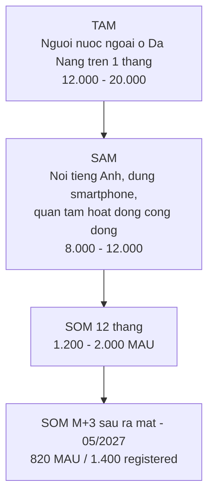
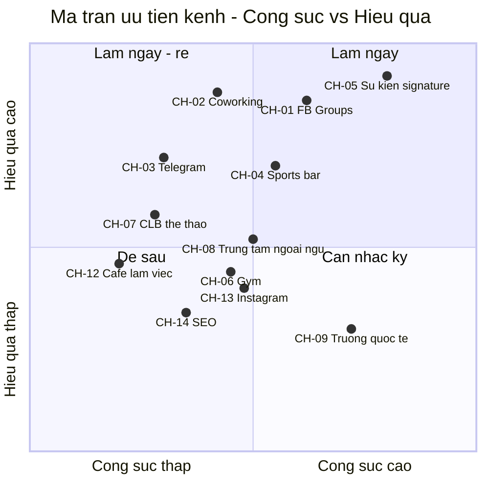
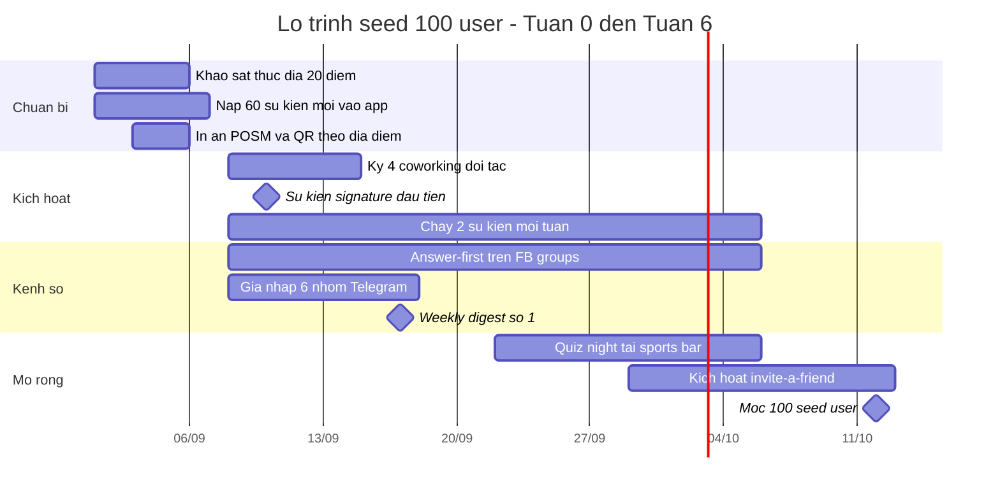
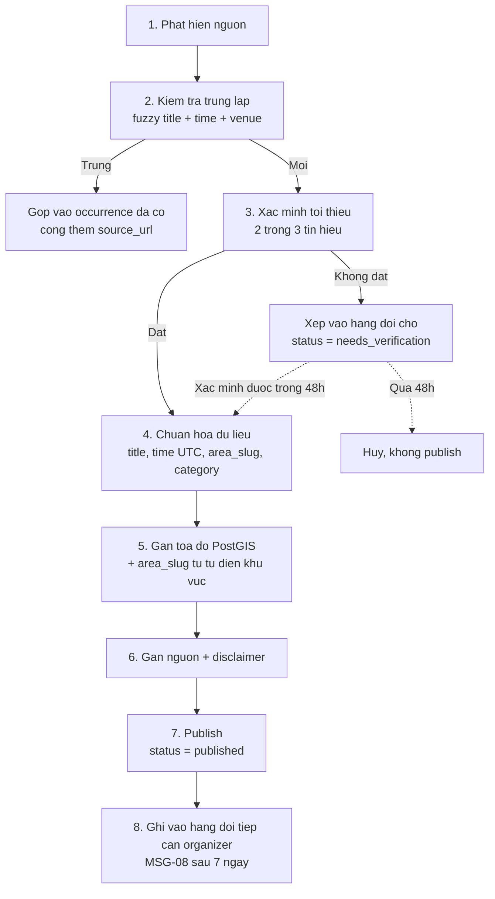
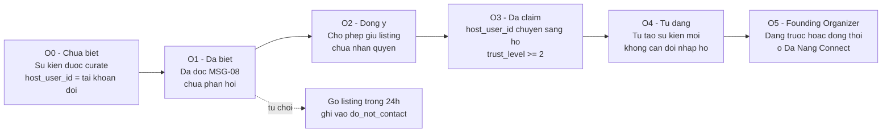

# 07 — Kế hoạch Go-To-Market: Da Nang Connect (phạm vi Đà Nẵng, từ 09/2026)

> **Tài liệu vận hành**, không phải tài liệu tầm nhìn. Mọi mục đều có người chịu trách nhiệm, ngày bắt đầu, chi phí và ngưỡng dừng.
> **Phạm vi:** chỉ Đà Nẵng. **Giai đoạn:** 1 — Kết nối cộng đồng (event, thể thao, trao đổi ngôn ngữ).
> **Cửa sổ thời gian:** M1 = 09/2026 → M6 = 02/2027.
> **Ngày lập:** 2026-08-31. **Chu kỳ rà soát:** thứ Hai hằng tuần, review lớn cuối mỗi tháng.
>
> ⚠️ **Đọc §12.1 trước khi thực thi bất kỳ mục nào.** Lịch GTM trong tài liệu này đã được hiệu chỉnh để khớp lịch kỹ thuật của tài liệu 08: **RSVP trong app chỉ chạy từ 13/11/2026 (KT‑M3)**, **beta kín 100 user từ 25/12/2026 (KT‑M5)**, **ra mắt công khai 25/02/2027 (KT‑M6)**. Mọi chỉ tiêu trước 13/11/2026 được đo bằng **đơn vị tiền‑app** (waitlist, nhóm cộng đồng, sổ check‑in), không đo bằng RSVP.

---

## Mục lục

1. [Tóm tắt điều hành](#1-tóm-tắt-điều-hành)
2. [Ước lượng quy mô thị trường expat tại Đà Nẵng](#2-ước-lượng-quy-mô-thị-trường-expat-tại-đà-nẵng)
3. [Phân khúc người dùng và bản đồ định vị](#3-phân-khúc-người-dùng-và-bản-đồ-định-vị)
4. [Bản đồ kênh tại Đà Nẵng](#4-bản-đồ-kênh-tại-đà-nẵng)
5. [Chiến lược seed 100 user đầu tiên](#5-chiến-lược-seed-100-user-đầu-tiên)
6. [Thư viện tin nhắn mẫu tiếng Anh](#6-thư-viện-tin-nhắn-mẫu-tiếng-anh)
7. [Playbook curate thủ công](#7-playbook-curate-thủ-công)
8. [Kịch bản chuyển đổi organizer](#8-kịch-bản-chuyển-đổi-organizer)
9. [Growth loop và cơ chế mời bạn](#9-growth-loop-và-cơ-chế-mời-bạn)
10. [Hệ thống chỉ số](#10-hệ-thống-chỉ-số)
11. [Kế hoạch đo lường và event tracking](#11-kế-hoạch-đo-lường-và-event-tracking)
12. [Tính mùa vụ và lịch 6 tháng](#12-tính-mùa-vụ-và-lịch-6-tháng)
13. [Ngân sách, nhân sự và công cụ](#13-ngân-sách-nhân-sự-và-công-cụ)
14. [Rủi ro GTM và phương án dự phòng](#14-rủi-ro-gtm-và-phương-án-dự-phòng)
15. [Phụ lục — checklist khảo sát thực địa tuần 0](#15-phụ-lục--checklist-khảo-sát-thực-địa-tuần-0)

---

## 1. Tóm tắt điều hành

### 1.1. Luận điểm GTM trong một đoạn

Nhu cầu kết nối của expat tại Đà Nẵng đã tồn tại và đang bị phân mảnh trên ít nhất 5 kênh. Da Nang Connect không tạo nhu cầu mới — nó **gom nhu cầu sẵn có vào một nơi có thể tìm kiếm được**. Vì vậy GTM không phải là chiến dịch quảng cáo, mà là một chuỗi thao tác vận hành: (a) tự tay curate lịch sự kiện đầy đủ nhất Đà Nẵng để app không bao giờ trống, (b) chiếm lĩnh **một** phân khúc có mật độ địa lý cao nhất — remote worker/digital nomad ở cụm An Thượng – Mỹ An, (c) dùng lưu lượng RSVP làm đòn bẩy để kéo organizer từ bị động sang chủ động.

### 1.2. Ba con số mục tiêu

| Mốc | Chỉ số | Mục tiêu | Ý nghĩa |
|---|---|---|---|
| Tuần 6 (19/10/2026) | 100 **seed member tiền‑app** hợp lệ thuộc đúng phân khúc seed — đo bằng waitlist + nhóm cộng đồng + sổ check‑in (§5.1, §12.1) | 100 | Chứng minh có thể kéo người rời Facebook cho một lần cụ thể |
| Tháng 3 (11/2026) | ≥ 25% sự kiện đăng bởi organizer tự phục vụ trên web preview | 25% | Chứng minh cung bắt đầu tự chảy |
| Tháng 6 (28/02/2027) | ≥ 100 beta user hoạt động, ≥ 80 sự kiện thật, ≥ 8 organizer tự quản lý listing | — | Đúng gate ra mắt công khai KT‑M6 ngày 25/02/2027 |
| Tháng 9 (31/05/2027) | 820 MAU, 550 WCA/tuần, D30 ≥ 20% | — | Đủ tín hiệu để mở Giai đoạn 2 (nhà ở) |

### 1.3. North Star Metric

> **Weekly Confirmed Attendances (WCA)** — số lượt tham dự sự kiện được xác nhận trong 7 ngày gần nhất.

Lý do chọn: đây là đơn vị nhỏ nhất của "giá trị đã được giao" — một người thật đã gặp người thật vì Da Nang Connect. Nó buộc sản phẩm phải tốt ở cả ba phía cùng lúc: đủ nguồn cung sự kiện, tìm kiếm/lọc đủ tốt để người dùng chọn được, và trải nghiệm RSVP đủ đáng tin để người ta thực sự đi.

### 1.4. Sơ đồ chiến lược tổng thể

```mermaid
flowchart LR
    subgraph P0["Tuần 0 - Chuẩn bị"]
        A1["Khảo sát thực địa 20 địa điểm"]
        A2["Dựng curation board"]
        A3["Nạp 60 sự kiện mồi"]
    end
    subgraph P1["Tuần 1-6 - Seed 100 thanh vien tien-app"]
        B1["Cụm An Thuong - My An"]
        B2["Coworking + language exchange + the thao"]
        B3["Tu to chuc 2 su kien signature/tuan"]
    end
    subgraph P2["Thang 2-3 - Chuyen doi organizer"]
        C1["Claim listing"]
        C2["Founding Organizer 50 suat"]
        C3["Self-serve dat 25%"]
    end
    subgraph P3["Thang 4-6 - Growth loop"]
        D1["Weekly digest + push"]
        D2["Invite-a-friend tren RSVP"]
        D3["Mo rong Son Tra - Hai Chau"]
    end
    P0 --> P1 --> P2 --> P3
    P3 -.->|"du tin hieu"| E["Giai doan 2: Nha o"]
```



---

## 2. Ước lượng quy mô thị trường expat tại Đà Nẵng

### 2.1. Nguyên tắc

Không có một con số chính thức nào đo đúng thứ chúng ta cần ("người nước ngoài nói tiếng Anh, cư trú Đà Nẵng ≥ 1 tháng, có nhu cầu hoạt động cộng đồng"). Vì vậy tài liệu này **tam giác hóa từ 3 phương pháp độc lập**, công bố khoảng giá trị thay vì một con số, và gắn nhãn độ tin cậy cho từng đầu vào.

**Thang độ tin cậy dùng trong toàn tài liệu:**

| Nhãn | Nghĩa | Cách xử lý |
|---|---|---|
| `A` | Số liệu hành chính công bố hoặc đo trực tiếp được | Dùng làm neo |
| `B` | Suy ra từ nguồn công khai + giả định có cơ sở | Dùng nhưng phải kiểm định lại trong 90 ngày |
| `C` | Ước lượng chuyên gia / giai thoại cộng đồng | Chỉ dùng để kiểm tra tính hợp lý, không dùng làm neo |

> **Cảnh báo ranh giới hành chính:** từ giữa 2025 địa giới Đà Nẵng đã mở rộng. Toàn bộ tài liệu này dùng **"Đà Nẵng đô thị lõi"** = 6 quận nội thành cũ + bán đảo Sơn Trà + khu vực ven biển Ngũ Hành Sơn. Mọi số liệu dân số cấp tỉnh phải được cắt lại về phạm vi này trước khi dùng.

### 2.2. Phương pháp A — Từ số liệu hành chính (top-down)

| Thành phần | Ước lượng | Độ tin cậy | Ghi chú giả định |
|---|---|---|---|
| Người nước ngoài có giấy phép lao động tại Đà Nẵng | 4.500 – 6.000 | `B` | Dải công bố nhiều năm của cơ quan lao động địa phương dao động quanh mức này; cần xin số mới nhất |
| Hệ số người phụ thuộc đi kèm (vợ/chồng, con) | × 1,25 – 1,55 | `B` | Nhóm Hàn/Nhật/Âu có gia đình kéo hệ số lên; nhóm giáo viên trẻ kéo xuống |
| → Cụm "lao động chính thức + gia đình" | 5.600 – 9.300 | `B` | |
| Nhóm không thuộc diện work permit: visa doanh nghiệp/du lịch dài, remote worker, hưu trí, du học sinh, người kết hôn với công dân Việt Nam | + 55% – 100% so với cụm trên | `C` | Đây là nhóm khó đo nhất và cũng chính là phân khúc mục tiêu của chúng ta |
| **Tổng cư trú dài hạn (≥ 3 tháng)** | **9.000 – 18.500** | `B/C` | |

### 2.3. Phương pháp B — Từ dấu chân số (bottom-up)

| Bước | Giá trị | Độ tin cậy | Giả định |
|---|---|---|---|
| Tổng thành viên 2 nhóm Facebook expat lớn nhất | ~ 90.000 – 120.000 lượt thành viên | `B` | Đếm được trực tiếp; phải chụp lại số ngày Tuần 0 |
| Trừ trùng lặp giữa 2 nhóm | −45% đến −60% | `C` | Người quan tâm Đà Nẵng thường tham gia cả hai |
| → Thành viên duy nhất | 42.000 – 62.000 | `C` | |
| Tỷ lệ **đang thực sự ở Đà Nẵng** tại một thời điểm | 12% – 20% | `C` | Nhóm expat luôn tích lũy người đã rời đi, người đang lên kế hoạch, và cả người Việt |
| → Expat có mặt & dùng Facebook | 5.000 – 12.400 | `C` | |
| Cộng nhóm không dùng nhóm Facebook tiếng Anh: cộng đồng Hàn (KakaoTalk), Nhật (LINE), Trung (WeChat), Nga/Đông Âu (Telegram/VK) | + 30% – 55% | `C` | Cộng đồng Hàn Quốc tại Đà Nẵng đáng kể nhưng gần như không hiện diện trong nhóm tiếng Anh |
| **Tổng ước lượng** | **6.500 – 19.200** | `C` | Khoảng rộng — chỉ dùng để kiểm tra tính hợp lý |

### 2.4. Phương pháp C — Từ dòng chảy remote worker

| Đầu vào | Ước lượng | Độ tin cậy |
|---|---|---|
| Remote worker/nomad có mặt tại Đà Nẵng, mùa cao điểm (T2–T8) | 1.500 – 3.500 | `C` |
| Remote worker có mặt, mùa mưa (T10–T12) | 600 – 1.400 | `C` |
| Thời gian lưu trú trung vị | 5 – 10 tuần | `C` |
| → Số người **đi qua** Đà Nẵng trong 12 tháng | 8.000 – 16.000 lượt | `C` |

Ý nghĩa vận hành của con số này lớn hơn giá trị tuyệt đối: phân khúc nomad **thay máu 6–10 lần/năm**. Đó vừa là rủi ro churn, vừa là nguồn cầu tái tạo liên tục — mỗi người mới đến đều có nhu cầu "tuần này có gì" ở mức cao nhất trong 14 ngày đầu.

### 2.5. Tổng hợp — TAM / SAM / SOM



| Lớp | Định nghĩa vận hành | Ước lượng | Điểm neo dùng để lập kế hoạch |
|---|---|---|---|
| **TAM** | Người nước ngoài lưu trú Đà Nẵng ≥ 1 tháng, mọi ngôn ngữ | 12.000 – 20.000 | 15.000 |
| **SAM** | Trong TAM: giao tiếp bằng tiếng Anh, có smartphone, đã từng tìm kiếm hoạt động cộng đồng trong 90 ngày | 8.000 – 12.000 | **10.000** |
| **SOM M+3 sau ra mắt (31/05/2027)** | 8,2% SAM đạt MAU | 820 MAU | Mục tiêu cam kết |
| **SOM M+9 sau ra mắt (30/11/2027)** | 12% – 18% SAM | 1.200 – 2.000 MAU | Mục tiêu định hướng |

### 2.6. Kiểm tra chéo bằng dữ liệu hành vi đã có

Báo cáo phân tích 3.504 bài đăng cho một phép thử độc lập rất hữu ích:

| Tín hiệu | Giá trị | Suy luận |
|---|---|---|
| Bài đăng về Sự kiện + Thể thao (2 nhóm) | 809 bài / 8 tháng | ≈ 100 bài nêu nhu cầu kết nối mỗi tháng, **chỉ tính bài đăng** |
| Tỷ lệ cầu / cung | 11 : 1 | Cứ 11 người hỏi mới có 1 người chào |
| Từ khóa `sports bar` | 37 lần | Xác nhận kênh vật lý bar thể thao là điểm tụ có thật |
| Từ khóa `language exchange` | 28 lần | Xác nhận trao đổi ngôn ngữ là định dạng sự kiện dễ seed nhất |
| Tăng trưởng bài sự kiện T5–T6/2026 | × 10 so với tháng trước | Thị trường đang nóng lên đúng lúc ra mắt |

**Quy tắc ngón tay cái rút ra:** với mỗi bài đăng nêu nhu cầu công khai, ước tính có **15 – 40 người có cùng nhu cầu nhưng im lặng** (tỷ lệ 90-9-1 điều chỉnh cho nhóm cộng đồng nhỏ). → 100 bài/tháng ≈ **1.500 – 4.000 người có nhu cầu chủ động mỗi tháng**. Con số này tương thích với SAM 10.000 và củng cố mục tiêu 820 MAU ở mốc M+3 sau ra mắt (05/2027) là khả thi nhưng không dễ.

### 2.7. Việc phải làm để nâng độ tin cậy (deadline: hết tháng 10/2026)

| # | Hành động | Nâng nhãn từ → đến | Người phụ trách |
|---|---|---|---|
| 1 | Xin số work permit và tạm trú mới nhất từ cơ quan quản lý lao động/xuất nhập cảnh địa phương | `B` → `A` | Founder |
| 2 | Chụp lại số thành viên 6 nhóm Facebook + 4 nhóm Telegram vào ngày 01 hằng tháng | `C` → `B` | Community Curator |
| 3 | Khảo sát tại 6 coworking: đếm số ghế bán tháng đang có người | `C` → `B` | Community Curator |
| 4 | Thêm câu hỏi onboarding `arrival_date` và `planned_stay_length` để đo trực tiếp cơ cấu phân khúc | — → `A` | Product |
| 5 | Chốt lại TAM/SAM sau 500 registered user thật | — | Founder |

---

## 3. Phân khúc người dùng và bản đồ định vị

### 3.1. Năm phân khúc và điểm hấp dẫn

| # | Phân khúc | Ước tính quy mô trong SAM | Mật độ địa lý | Nhu cầu kết nối | Sẵn sàng thử app mới | Vòng đời | Điểm tổng |
|---|---|---|---|---|---|---|---|
| S1 | **Remote worker / digital nomad, lưu trú 1–6 tháng** | 1.500 – 3.500 | ★★★★★ | ★★★★★ | ★★★★★ | ★☆☆☆☆ | **21/25** |
| S2 | Giáo viên tiếng Anh (trung tâm + trường quốc tế), 1–3 năm | 900 – 1.800 | ★★★☆☆ | ★★★★☆ | ★★★★☆ | ★★★★☆ | 19/25 |
| S3 | Expat định cư dài hạn có gia đình (doanh nhân, quản lý, hưu trí) | 2.000 – 4.000 | ★★☆☆☆ | ★★★☆☆ | ★★☆☆☆ | ★★★★★ | 16/25 |
| S4 | Cộng đồng Hàn / Nhật / Trung | 2.500 – 5.000 | ★★★☆☆ | ★★★☆☆ | ★★☆☆☆ | ★★★★☆ | 14/25 |
| S5 | Người Việt nói tiếng Anh muốn trao đổi ngôn ngữ / kết nối quốc tế | rất lớn | ★☆☆☆☆ | ★★★★☆ | ★★★★☆ | ★★★☆☆ | — (xem 3.3) |

### 3.2. Quyết định — chọn duy nhất S1

**Chọn S1 (remote worker / digital nomad ở cụm An Thượng – Mỹ An) làm phân khúc seed duy nhất cho 100 user đầu tiên.**

Sáu lý do, xếp theo sức nặng:

1. **Mật độ địa lý cực cao.** S1 sống, làm việc, ăn uống và tập luyện trong bán kính khoảng 1,5 km quanh trục An Thượng – Mỹ An – Mỹ Khê. Đội ngũ 2 người có thể phủ vật lý toàn bộ phân khúc trong 1 ngày đi bộ. Không phân khúc nào khác có đặc tính này.
2. **Nhu cầu ở đỉnh trong 14 ngày đầu đến.** Người mới đến chưa có bạn, chưa biết chỗ chơi, và đang chủ động tìm kiếm. Đây là khoảnh khắc duy nhất trong vòng đời expat mà chi phí thuyết phục gần bằng 0.
3. **Chấp nhận app mới không do dự.** S1 đã quen cài app cho mỗi thành phố mới. Rào cản "tôi đã có Facebook rồi" yếu hơn hẳn so với S3.
4. **Khớp với định dạng sự kiện dễ seed nhất.** Language exchange, chạy bộ nhóm, board game, quiz night, bóng đá/cầu lông pickup — tất cả đều rẻ, tổ chức được trong 72 giờ, và trùng khớp với 5 từ khóa nhu cầu hàng đầu trong dữ liệu.
5. **Có sẵn cửa vào của bên thứ ba.** Coworking space có động cơ thương mại rõ ràng để cộng tác: sự kiện cộng đồng = lý do bán thẻ tháng. Đây là đối tác dễ ký nhất trong toàn bản đồ kênh.
6. **Thất bại rẻ và nhanh.** Nếu S1 không dùng app, ta biết trong 6 tuần với chi phí dưới 20 triệu VND, thay vì biết sau 6 tháng.

**Nhược điểm đã lường trước và cách bù:**

| Nhược điểm của S1 | Mức độ | Phương án bù |
|---|---|---|
| Churn cấu trúc: rời thành phố sau 5–10 tuần | Cao | (a) Coi churn địa lý là **tốt nghiệp**, không tính vào retention chuẩn — tách cohort `left_city`. (b) Thêm luồng `handoff`: trước khi rời, mời user giới thiệu 1 người thay thế, tặng badge `Community Passer`. |
| Không phải nguồn doanh thu bền vững | Trung bình | S1 là **nguồn cầu**; S2 và S3 mới là nguồn cung organizer và nguồn doanh thu. Mở S2 từ M3, S3 từ M5. |
| Sụt mạnh mùa mưa T10–T12 | Cao | Chuyển tỷ trọng sang sự kiện trong nhà và mở S2 (giáo viên không rời thành phố theo mùa) đúng M3. |

### 3.3. Vai trò kiểm soát của S5 (người Việt nói tiếng Anh)

S5 **không phải phân khúc seed** nhưng là nguồn cung không thể thiếu cho định dạng language exchange. Quy tắc kiểm soát:

- Chỉ mở S5 cho các sự kiện gắn nhãn `language_exchange` và `cultural_exchange`.
- **Trần tỷ lệ 40%** người tham dự là người bản địa trên mỗi sự kiện language exchange; vượt trần thì đóng RSVP phía bản địa.
- Không đưa S5 vào các kênh truyền thông chính, không tối ưu onboarding cho S5 ở Giai đoạn 1.
- Lý do: nếu tỷ lệ người bản địa vượt ngưỡng, định vị "dành riêng cho cộng đồng expat" bị hòa tan và app trở thành một nhóm Facebook đại trà khác.

---

## 4. Bản đồ kênh tại Đà Nẵng

> **Ghi chú tin cậy bắt buộc đọc trước:** tên địa điểm cụ thể dưới đây là **danh sách hạt giống** được lập từ hiểu biết chung về Đà Nẵng, nhãn `B`/`C`. Chúng **phải được xác minh thực địa trong Tuần 0** (còn hoạt động không, chủ mới, địa chỉ, người quyết định) theo checklist ở Mục 15. Không dùng danh sách này để gửi email hàng loạt trước khi xác minh.

### 4.1. Bốn cụm khu vực và vai trò

| Cụm | Đặc trưng cư dân | Vai trò trong GTM | Ưu tiên |
|---|---|---|---|
| **An Thượng** (Ngũ Hành Sơn, sau lưng biển Mỹ Khê) | Trung tâm nomad/backpacker; quán tây, coworking, homestay, gym boutique | **Trận địa chính Tuần 1–6** | P0 |
| **Mỹ An** (liền kề An Thượng) | Nomad ở dài hơn, căn hộ dịch vụ, gym, quán cà phê làm việc | **Trận địa chính Tuần 1–6** | P0 |
| **Mỹ Khê / ven biển Võ Nguyên Giáp** | Khách sạn, resort, hoạt động biển, chạy bộ sáng, surf | Nguồn sự kiện thể thao ngoài trời | P1 |
| **Sơn Trà** (bán đảo + An Hải) | Cư dân trung hạn, hoạt động ngoài trời, xe máy đường đèo | Mở rộng từ M4 | P2 |
| **Hải Châu** (trung tâm hành chính, ven sông Hàn) | Văn phòng, trường quốc tế, gia đình expat, bar trung tâm | Nguồn organizer & S2/S3, mở từ M3 | P1 |
| **Thanh Khê / Liên Chiểu / Cẩm Lệ** | Ít expat, giá rẻ, sinh viên | Không tiếp cận ở Giai đoạn 1 | P3 |

### 4.2. Bảng tổng hợp toàn kênh

| ID | Kênh | Loại | Quy mô tiếp cận ước tính | Cách tiếp cận cốt lõi | Chi phí ước tính / tháng | Ưu tiên | Độ tin cậy |
|---|---|---|---|---|---|---|---|
| CH-01 | Nhóm Facebook expat lớn (2 nhóm chính) | Cộng đồng số | 42k–62k thành viên duy nhất | Trả lời hữu ích trong comment, không spam link | 0 đ (chỉ công sức) | **P0** | `B` |
| CH-02 | Coworking space cụm An Thượng – Mỹ An | Vật lý | 300–700 người/tháng | Đồng tổ chức sự kiện, đổi lấy chỗ | 0–3 tr đ | **P0** | `B` |
| CH-03 | Nhóm Telegram/WhatsApp nomad & thể thao | Cộng đồng số | 1.500–5.000 | Xin phép admin, tham gia thật trước khi đăng | 0 đ | **P0** | `C` |
| CH-04 | Quán bar thể thao / pub expat | Vật lý | 200–600 khách/tuần | Quiz night & xem thể thao đồng thương hiệu | 1–3 tr đ | **P0** | `C` |
| CH-05 | Sự kiện tự tổ chức signature | Vật lý | 15–40 người/buổi | 2 buổi/tuần do đội ngũ đứng tên | 2–4 tr đ | **P0** | `A` |
| CH-06 | Phòng gym / studio yoga / võ thuật | Vật lý | 400–1.200 hội viên | Lịch lớp đưa lên app + poster QR | 0–1,5 tr đ | P1 | `C` |
| CH-07 | Câu lạc bộ chạy bộ / đạp xe / bóng đá pickup | Cộng đồng lai | 150–500 | Curate lịch + gia nhập với tư cách thành viên | 0 đ | P1 | `C` |
| CH-08 | Trung tâm ngoại ngữ (dạy tiếng Anh & dạy tiếng Việt cho người nước ngoài) | Đối tác | 60–200 giáo viên nước ngoài | Cửa vào S2 + nguồn học viên language exchange | 0–2 tr đ | P1 | `B` |
| CH-09 | Trường quốc tế / song ngữ | Đối tác | 100–300 gia đình expat | Cửa vào S3, tiếp cận qua hội phụ huynh | 0 đ | P2 | `C` |
| CH-10 | Nền tảng sự kiện hiện có (Meetup, Luma, trang sự kiện địa phương) | Nguồn nội dung | — | Nguồn curate, không phải kênh tuyển user | 0–1,2 tr đ | **P0** (nguồn) | `B` |
| CH-11 | Homestay / apartment building tập trung expat | Vật lý | 200–600 phòng | Thẻ chào mừng đặt tại lễ tân | 0,5–1,5 tr đ | P2 | `C` |
| CH-12 | Quán cà phê chuyên đồ specialty có dân làm việc bằng laptop | Vật lý | 300–800 khách/tuần | Standee QR + tờ lịch tuần in | 0,5–1 tr đ | P1 | `B` |
| CH-13 | Instagram / TikTok nội dung "This week in Da Nang" | Nội dung số | Tăng dần | Reels lịch tuần, 3 post/tuần | 0–2 tr đ | P1 | `A` |
| CH-14 | SEO trang web `what to do in Da Nang this week` | Nội dung số | Dài hạn, từ M3 | Trang lịch tuần render server-side, index được | 0 đ | P2 | `A` |

**Tổng ngân sách kênh khuyến nghị:** 8 – 15 triệu VND/tháng trong M1–M3. Không chạy quảng cáo trả tiền trước M4.

### 4.3. Chi tiết từng kênh P0

#### CH-01 — Nhóm Facebook expat lớn

| Mục | Nội dung |
|---|---|
| Vì sao P0 | Đây là nơi nhu cầu đang bị chôn vùi. Cũng là nơi 100% phân khúc seed chắc chắn có mặt. |
| Rủi ro lớn nhất | Bị admin cấm vì spam. Một lần bị cấm = mất kênh vĩnh viễn. |
| Nguyên tắc vàng | **Tỷ lệ 10:1** — 10 câu trả lời hữu ích không kèm link, mới đến 1 lần được nhắc tên sản phẩm. |
| Chiến thuật 1 | *Answer-first*: đặt cảnh báo từ khóa `this weekend`, `anything happening`, `language exchange`, `sports bar`, `looking for friends`, `just arrived`. Trả lời bằng **danh sách 3 sự kiện cụ thể có ngày giờ địa điểm**, viết thẳng trong comment. Không link ở comment đầu. |
| Chiến thuật 2 | *Weekly value post*: mỗi thứ Năm đăng "10 things happening in Da Nang this weekend" dưới dạng văn bản đầy đủ trong bài (không bắt click). Link đặt ở comment đầu tiên của chính mình. |
| Chiến thuật 3 | Liên hệ riêng admin nhóm, đề nghị cung cấp bản lịch tuần miễn phí để admin tự đăng, có ghi nguồn. Đổi lại xin quyền được đăng 1 bài/tuần. |
| Chi phí | 0 đồng tiền mặt; 5–7 giờ/tuần công sức |
| Chỉ số theo dõi | `channel_code=fb_group_a/fb_group_b`, số click ra ngoài, số registered gán về kênh |
| Ngưỡng bỏ kênh | Sau 4 tuần mà < 15 registered/tháng từ cả 2 nhóm cộng lại |

#### CH-02 — Coworking space (cụm An Thượng – Mỹ An)

Danh sách hạt giống cần xác minh Tuần 0 — ít nhất 6 địa điểm, gồm các không gian coworking chuyên nghiệp quanh trục An Thượng/Mỹ An và khu Hải Châu, cùng các quán cà phê có tầng làm việc dành cho khách dài hạn.

| Mục | Nội dung |
|---|---|
| Đề nghị hợp tác | Da Nang Connect tổ chức **1 sự kiện cộng đồng miễn phí/tuần** tại không gian của họ. Họ cho mượn chỗ và đăng lên kênh nội bộ. Không bên nào trả tiền bên nào. |
| Vì sao họ đồng ý | Sự kiện cộng đồng là lý do bán thẻ tháng. Họ đang thiếu người tổ chức, không thiếu chỗ. |
| Tài sản mang đến | Standee QR đặt tại quầy, thẻ lịch tuần A6 đặt bàn, dòng nhắc trong email chào mừng thành viên mới của họ |
| Người ra quyết định | Community Manager, không phải chủ. Hỏi đúng: *"Who runs your member events?"* |
| Chi phí | 0–3 triệu đ/tháng (in ấn + đồ uống nhẹ nếu tự chi) |
| Đo lường | QR riêng cho từng địa điểm: `channel_code=cowork_<slug>` |
| KPI | ≥ 4 địa điểm ký thỏa thuận miệng trong Tuần 2; ≥ 30 registered/tháng từ cụm này |

#### CH-03 — Nhóm Telegram / WhatsApp

| Nhóm mục tiêu | Cách vào | Lưu ý |
|---|---|---|
| Nhóm nomad Đà Nẵng trên Telegram | Tìm qua thư mục nhóm + hỏi tại coworking | Nhóm nomad rất nhạy với spam; phải đóng góp thật 2 tuần trước khi nhắc sản phẩm |
| Nhóm thể thao pickup (bóng đá, cầu lông, bóng rổ, chạy) | Xin số qua người chơi tại sân | Đây là nhóm **giá trị nhất**: nhu cầu ad-hoc đúng insight của brief |
| Nhóm phụ nữ expat / gia đình expat | Qua giới thiệu, thường là nhóm kín | Để dành M4+ |
| Nhóm quốc tịch (Nga, Hàn, Pháp...) | Qua đối tác nhà hàng/quán cùng quốc tịch | M5+ |

**Chiến thuật đặc thù cho nhóm thể thao:** đề nghị admin *"I'll keep your game schedule synced on Da Nang Connect so people stop asking 'is there a game today' — you keep full control and I'll hand the listing over to you anytime."* Đây là đề nghị **giảm việc** cho admin, không phải đề nghị quảng bá.

#### CH-04 — Quán bar thể thao / pub expat

Từ khóa `sports bar` xuất hiện 37 lần trong dữ liệu — đây là kênh có bằng chứng nhu cầu mạnh nhất trong nhóm kênh vật lý.

| Mục | Nội dung |
|---|---|
| Đề nghị | Quiz night hoặc đêm xem thể thao đồng thương hiệu, thứ Ba hoặc thứ Tư (đêm vắng khách của quán) |
| Bên nào chi | Quán chi giải thưởng nhỏ (1 pitcher bia + món ăn); Da Nang Connect chi công tổ chức + kéo người |
| Tài sản | Poster A3 tại cửa, tent card trên bàn, QR trên menu clip |
| Điều kiện bắt buộc | Sự kiện phải mở cho người không uống rượu — có định dạng đến sớm 18:30 dùng đồ ăn |
| Chi phí | 1–3 triệu đ/tháng cho in ấn + chi phí phát sinh |
| Ưu tiên khu vực | An Thượng trước, Hải Châu sau |

#### CH-05 — Sự kiện signature tự tổ chức

Đây là **kênh quan trọng nhất Tuần 1–6** vì nó là thứ duy nhất đội ngũ kiểm soát 100%.

| Sự kiện | Nhịp | Địa điểm | Sức chứa | Chi phí/buổi | Vai trò |
|---|---|---|---|---|---|
| `Da Nang Connect Language Exchange` | Thứ Tư 19:00 | Coworking đối tác | 25–40 | 300–600k đ | Định dạng dễ đầy nhất, tỷ lệ quay lại cao |
| `Newcomers Coffee` | Thứ Bảy 09:30 | Quán cà phê An Thượng | 10–20 | 0–200k đ | Bắt đúng người mới đến trong 14 ngày đầu |
| `Beach Run + Breakfast` | Chủ Nhật 06:00 | Bãi biển Mỹ Khê | 8–25 | 0 đ | Không tốn chi phí, ảnh đẹp cho nội dung |
| `Board Game Night` (mùa mưa) | Thứ Sáu 19:00 | Bar/quán cà phê | 12–25 | 200–400k đ | Thay thế sự kiện ngoài trời từ M2 |

**Quy tắc:** mọi sự kiện signature đều **chỉ nhận đăng ký qua kênh chính thức của Da Nang Connect**, không nhận qua tin nhắn riêng. Kênh chính thức đổi theo giai đoạn kỹ thuật (§12.1): trước 13/11/2026 là form đăng ký trên landing page + sổ check‑in tại cửa; từ 13/11/2026 (KT‑M3) là RSVP trong app. Đây là điểm ép chuyển đổi duy nhất và không được nhân nhượng.

### 4.4. Chi tiết kênh P1 và P2

| Kênh | Cách tiếp cận cụ thể | Chi phí | Thời điểm mở |
|---|---|---|---|
| CH-06 Gym/yoga/võ thuật | Đề nghị đưa **lịch lớp** lên app miễn phí như một listing thường trực. Đổi lại đặt standee. Nhắm các phòng có tỷ trọng hội viên nước ngoài cao ở An Thượng/Mỹ An và các chuỗi lớn ở trung tâm thương mại. | 0–1,5 tr đ | M2 |
| CH-07 CLB chạy/đạp/bóng đá | Gia nhập với tư cách thành viên thật trước. Sau 3 buổi mới đề nghị đồng bộ lịch. Nhắm các nhóm chạy bộ ven biển và nhóm bóng đá pickup sân cỏ nhân tạo. | 0 đ | M1 |
| CH-08 Trung tâm ngoại ngữ | Hai hướng: (1) tiếp cận **giáo viên nước ngoài** — đây là S2, nguồn organizer chất lượng cao; (2) tiếp cận **lớp dạy tiếng Việt cho người nước ngoài** — học viên chính là S1 và họ cần đối tác luyện nói. Đề nghị: tổ chức language exchange miễn phí, trung tâm cấp phòng học buổi tối. | 0–2 tr đ | M2 |
| CH-09 Trường quốc tế / song ngữ | Không tiếp cận trực tiếp nhà trường ở Giai đoạn 1 (chu kỳ phê duyệt dài). Vào qua **hội phụ huynh** và các nhóm chat phụ huynh. Định dạng phù hợp: family day, picnic cuối tuần. | 0 đ | M5 |
| CH-11 Homestay / căn hộ dịch vụ | Thẻ A6 *"Welcome to Da Nang — here's what's happening this week"* đặt tại lễ tân và trong phòng. Mỗi tòa nhà một QR riêng để đo. | 0,5–1,5 tr đ | M3 |
| CH-12 Quán cà phê làm việc | Tờ lịch tuần in A5 thay mới mỗi thứ Hai, đặt tại quầy. Đây là chi phí thấp nhất trên mỗi lượt tiếp xúc trong toàn bộ bản đồ. | 0,5–1 tr đ | M2 |
| CH-13 Instagram / TikTok | Format cố định: Reel 20 giây *"5 things happening in Da Nang this week"*, đăng thứ Năm. Tài khoản dùng tiếng Anh 100%. | 0–2 tr đ | M1 |
| CH-14 SEO | Trang `/this-week` render phía server bằng Next.js, cập nhật tự động từ dữ liệu event, có schema.org `Event`. Nhắm truy vấn dài: *what to do in da nang this weekend*, *da nang language exchange*, *expat events da nang*. | 0 đ | M3 |

### 4.5. Ma trận ưu tiên kênh



---

## 5. Chiến lược seed 100 user đầu tiên

### 5.1. Định nghĩa "user" trong bối cảnh này

Không đếm lượt tải app. Một **seed user hợp lệ** phải thỏa **cả ba** điều kiện:

1. Đã tạo hồ sơ và hoàn tất onboarding (chọn ≥ 2 sở thích, ≥ 1 khu vực). Trước 13/11/2026 tương đương form waitlist 5 trường trên landing page; từ 13/11/2026 là onboarding trong app.
2. Đã **cam kết tham dự một sự kiện cụ thể**. Đơn vị đo đổi theo giai đoạn kỹ thuật (§12.1): **trước 13/11/2026** = một bản ghi trong `signup_sheet` (Google Form) *và* một dòng trong sổ check‑in tại cửa, hoặc đã vào nhóm WhatsApp/Telegram cộng đồng và nhắn ≥ 1 tin thật; **từ 13/11/2026** = một bản ghi `rsvps` gắn với `occurrence_id` trong app.
3. Tự khai đang ở Đà Nẵng và dự kiến ở lại ≥ 3 tuần nữa.

> **Cảnh báo đo lường:** trong 6 tuần seed (01/09 – 19/10/2026) **chưa có RSVP trong app**. Toàn bộ chỉ tiêu tuần ở §5.3 là chỉ tiêu **tiền‑app**. Không được báo cáo con số này như "registered user trong app" — bảng quy đổi giữa hai đơn vị nằm ở §12.1.

Mục tiêu: **100 seed user hợp lệ trong 6 tuần**, trong đó ≥ 60 thuộc phân khúc S1 và ≥ 45 đã tham dự thật ít nhất 1 sự kiện.

### 5.2. Bài toán quy đổi ngược

| Bước phễu | Tỷ lệ giả định | Số cần thiết |
|---|---|---|
| 100 seed user hợp lệ | — | 100 |
| → Registered → hợp lệ | 70% | 143 registered |
| → Tiếp xúc có ý nghĩa → registered | 22% | **650 lượt tiếp xúc có ý nghĩa** |
| → Tiếp xúc thoáng qua → có ý nghĩa | 30% | ~2.200 lượt tiếp xúc thoáng qua |

**"Tiếp xúc có ý nghĩa"** = một cuộc trò chuyện trực tiếp ≥ 60 giây, hoặc một comment trả lời đích danh, hoặc một lần quét QR. **"Thoáng qua"** = nhìn thấy poster, lướt qua bài đăng.

650 tiếp xúc có ý nghĩa / 6 tuần = **~110/tuần** = ~22/ngày làm việc, chia cho 2 người = **11 cuộc trò chuyện có ý nghĩa mỗi người mỗi ngày**. Đây là con số khả thi nhưng đòi hỏi kỷ luật cao và là lý do phân khúc phải có mật độ địa lý cao.

### 5.3. Kịch bản theo tuần



#### Tuần 0 — 01/09 đến 07/09: Đổ nền, không tuyển user

| Ngày | Việc | Người | Kết quả cần có |
|---|---|---|---|
| T2–T3 | Khảo sát thực địa: đi bộ toàn cụm An Thượng – Mỹ An, ghi nhận 20 địa điểm theo checklist Mục 15 | Cả đội | Bảng 20 địa điểm có tên người quyết định + số liên lạc |
| T2–T5 | Curate và nạp **60 sự kiện thật** trải trong 3 tuần tới | Curator | App không bao giờ hiện màn hình trống |
| T3 | Chốt **6 khu vực** `area_slug` cho MVP: `an-thuong`, `my-khe`, `my-an`, `hai-chau`, `son-tra`, `ngu-hanh-son` | Product | Bộ lọc khu vực chạy được |
| T4 | Thiết kế & in POSM: 20 standee A5, 200 thẻ A6, 15 poster A3, mỗi cái một QR riêng | Founder | Mỗi địa điểm một `channel_code` |
| T5 | Cài đặt tracking đầy đủ theo Mục 11 và kiểm tra bằng 10 phiên thử | Engineer | Dashboard hiển thị đúng |
| T6 | Chốt lịch 8 tuần sự kiện signature | Cả đội | Lịch cố định, không đổi giờ |
| T7 | Diễn tập: 5 người quen chạy thử toàn bộ luồng đăng ký → RSVP → tham dự | Cả đội | Không còn lỗi chặn |

**Nguyên tắc Tuần 0:** không mời một người lạ nào. Một người mở app thấy trống là một người mất vĩnh viễn.

#### Tuần 1 — 08/09 đến 14/09: Chiếm cụm coworking

| Việc | Chỉ tiêu | Ghi chú |
|---|---|---|
| Gặp trực tiếp community manager của 6 coworking | Ký miệng ≥ 4 | Dùng mẫu `MSG-05` |
| Tổ chức `Language Exchange` số 1 | ≥ 15 người dự | RSVP **chỉ** qua app |
| Tổ chức `Newcomers Coffee` số 1 | ≥ 8 người dự | Nhắm người mới đến |
| Trả lời 25 câu hỏi trên nhóm Facebook | 25 comment | Tỷ lệ 10:1 |
| Gia nhập 6 nhóm Telegram/WhatsApp, chỉ quan sát | 6 nhóm | Chưa đăng gì |
| **Mục tiêu tích lũy** | **20 seed user** | |

#### Tuần 2 — 15/09 đến 21/09: Nội dung định kỳ + phủ vật lý

| Việc | Chỉ tiêu |
|---|---|
| Phát hành `Weekly Digest` số 1 (email + đăng nhóm FB) | Gửi tới toàn bộ user hiện có |
| Đặt POSM tại 12 địa điểm đã ký | 12 QR hoạt động |
| 2 sự kiện signature | ≥ 30 lượt dự cộng dồn |
| Bắt đầu đóng góp thật trong nhóm Telegram (trả lời, chia sẻ, không link) | ≥ 15 lượt |
| Phỏng vấn 8 user đầu tiên, mỗi cuộc 15 phút | 8 bản ghi |
| **Mục tiêu tích lũy** | **40 seed user** |

#### Tuần 3 — 22/09 đến 28/09: Mở kênh bar thể thao + nội dung xã hội

| Việc | Chỉ tiêu |
|---|---|
| Quiz night số 1 tại pub đối tác | ≥ 20 người |
| Bắt đầu đăng Reel `5 things this week` (3 post/tuần) | 3 post |
| Lần đầu nhắc sản phẩm trong nhóm Telegram (sau 2 tuần đóng góp) | 3 nhóm |
| Liên hệ 10 organizer gốc bằng `MSG-08` | 10 email/DM |
| **Mục tiêu tích lũy** | **58 seed user** |

#### Tuần 4 — 29/09 đến 05/10: Bật vòng lặp giới thiệu

| Việc | Chỉ tiêu |
|---|---|
| Bật vòng lặp mời bạn **phiên bản tiền‑app**: mã mời in trên thẻ A6 + tin nhắn mẫu `MSG-13` gửi tay ngay sau khi ghi nhận đăng ký | Live |
| Chốt kịch bản nhắc lịch **T−24h và T−2h**, gửi tay qua email/WhatsApp cho tới khi push chạy ở KT‑M3 (13/11/2026) | Kịch bản đã duyệt |
| Mở rộng sang 4 quán cà phê làm việc | 4 điểm mới |
| 2 sự kiện signature + 1 sự kiện do organizer bên ngoài đăng | ≥ 1 self-serve |
| **Mục tiêu tích lũy** | **74 seed user** |

#### Tuần 5 — 06/10 đến 12/10: Nén và chốt mốc

| Việc | Chỉ tiêu |
|---|---|
| Sự kiện lớn nhất giai đoạn: `Da Nang Connect Community Night`, đồng tổ chức với 2 coworking + 1 pub | ≥ 45 người |
| Chiến dịch `Bring one friend` — mọi RSVP hiển thị lời mời | ≥ 20% RSVP có lời mời gửi đi |
| Rà soát toàn bộ user chưa RSVP lần 2, gửi push cá nhân hóa theo sở thích | — |
| **Mục tiêu tích lũy** | **100 seed user** |

#### Tuần 6 — 13/10 đến 19/10: Kiểm định, không mở rộng

| Việc | Đầu ra |
|---|---|
| Phỏng vấn sâu 15 user (10 đang hoạt động, 5 đã bỏ) | Bản tổng hợp lý do ở lại / rời đi |
| Tính retention W1 và W4 của cohort Tuần 1–2 | Con số thật đầu tiên |
| Đối chiếu với ngưỡng ở §10.7 và cổng quyết định §14.2 | Quyết định: tiếp tục / điều chỉnh / xoay trục |
| Chốt danh sách 15 organizer ưu tiên cho M2 | Danh sách có xếp hạng |

### 5.4. Phân bổ nguồn user dự kiến trong 100 seed user

| Nguồn | Số user | Tỷ trọng |
|---|---|---|
| Sự kiện signature tự tổ chức (CH-05) | 34 | 34% |
| Coworking — QR + giới thiệu miệng (CH-02) | 22 | 22% |
| Nhóm Facebook — answer-first (CH-01) | 16 | 16% |
| Telegram/WhatsApp (CH-03) | 11 | 11% |
| Bar thể thao / quiz night (CH-04) | 9 | 9% |
| Mời bạn từ user hiện có (loop) | 6 | 6% |
| Khác (cà phê, tự tìm thấy) | 2 | 2% |

### 5.5. Quy tắc kỷ luật khi seed

1. **Không mua user.** Không chạy quảng cáo trả tiền trong 6 tuần đầu. Quảng cáo che mất tín hiệu về việc sản phẩm có tự nhiên hấp dẫn hay không.
2. **Không mở phân khúc thứ hai** trước khi chạm mốc 100. Dàn trải là rủi ro số 1 đã được nêu trong brief.
3. **Không mở khu vực thứ hai.** Công sức tuyển user chỉ dồn vào An Thượng – Mỹ An; Sơn Trà và Hải Châu chỉ mở từ M3 trở đi. Đây là quy tắc phân bổ công sức, **không phải** cấu hình sản phẩm — bộ lọc vẫn luôn hiển thị đủ 6 khu vực MVP.
4. **Mọi đăng ký đi qua kênh chính thức.** Không có ngoại lệ, kể cả với bạn bè: trước 13/11/2026 là form + sổ check‑in, từ 13/11/2026 là RSVP trong app (§12.1).
5. **Mỗi user seed phải được gặp mặt hoặc nhắn tin riêng ít nhất một lần** trong 6 tuần đầu. 100 người là con số vẫn còn làm thủ công được.

---

## 6. Thư viện tin nhắn mẫu tiếng Anh

> Toàn bộ nội dung hướng tới người dùng viết bằng **tiếng Anh**. Tiếng Việt chỉ dùng trong kênh nội bộ và khi làm việc với đối tác Việt Nam.
> Quy tắc chung: ngắn, cụ thể, có ngày giờ địa điểm thật, không dùng từ ngữ marketing, không dùng emoji quá 1 cái mỗi tin.

### MSG-01 — Trả lời trong nhóm Facebook (answer-first, không link)

```
Three things this week that might fit:

- Wed 7pm — Language exchange at a coworking space in An Thuong, free, usually 25–30 people, half Vietnamese half foreigners.
- Fri 7pm — Board game night at a bar on Nguyen Van Thoai, free entry.
- Sun 6am — Beach run from My Khe, 5k easy pace, coffee after.

Happy to send you the exact addresses if you want them.
```

### MSG-02 — Bài đăng giá trị hằng tuần trên nhóm Facebook (thứ Năm)

```
What's happening in Da Nang this weekend — Fri 12 to Sun 14 Sept

FRIDAY
- 7:00pm  Board game night, An Thuong. Free.
- 8:00pm  Live acoustic, riverside Hai Chau. Free.

SATURDAY
- 9:30am  Newcomers coffee, My An. Free, good if you arrived recently.
- 4:00pm  Pickup football, artificial turf near My Khe. 50k per player.
- 7:00pm  Pub quiz, An Thuong. Free, teams of up to 5.

SUNDAY
- 6:00am  Beach run, 5k, My Khe. Free.
- 10:00am Vietnamese–English language exchange, My An. Free.

I put this list together by hand every week from Facebook, Meetup and a few
group chats, because I got tired of checking six places. Full list with
addresses and maps in the first comment.
```

### MSG-03 — Bắt chuyện trực tiếp tại coworking / quán cà phê

```
Hey — sorry to interrupt. Are you living here or just passing through?

[nếu vừa đến] How long have you been in Da Nang? … The first couple of weeks
are the hard part. I run a small thing that collects everything happening
here in one place — events, sports, language exchange. There's a language
exchange Wednesday 7pm two streets away, usually about 30 people. Want me to
show you?

[chìa điện thoại, mở đúng trang sự kiện đó, KHÔNG mở trang chủ]
```

**Quy tắc vàng khi bắt chuyện:** luôn mở app ở **một sự kiện cụ thể**, không bao giờ ở trang chủ. Bán một buổi tối, không bán một nền tảng.

### MSG-04 — Giới thiệu trong nhóm Telegram (chỉ dùng sau ≥ 2 tuần đóng góp thật)

```
Small thing that might be useful for this group: I keep a running list of
everything happening in Da Nang for foreigners — events, sports meetups,
language exchange — in one app, because it's currently spread across about
five different places.

It's free, there's no ads, and I add most of the listings by hand. If your
game or meetup is on there and you'd rather it wasn't, tell me and I'll take
it down within the day.

<link>
```

### MSG-05 — Đề nghị hợp tác với coworking space

```
Subject: Free weekly community event for your members

Hi <name>,

I run Da Nang Connect — a small app that collects everything happening in Da
Nang for the foreign community in one place. Right now I list about 60 events
a month, all added by hand.

I'd like to host a free weekly community event at <space> — most likely a
language exchange or a newcomers meetup, Wednesday or Thursday evening,
around 25–35 people.

What I bring: I organise it, I bring the people, I handle sign-ups, I clean up.
What I'd ask from you: the space for two hours, and a mention in your member
channel.

No money either way. Your members get a reason to come in the evening, I get
a room. If it doesn't work after three weeks we stop, no hard feelings.

Can I drop by this week to talk for ten minutes?

<name>
<phone / Telegram>
```

### MSG-06 — Đề nghị hợp tác với quán bar thể thao

```
Subject: Filling your Tuesday night

Hi <name>,

Tuesdays are quiet for most bars in An Thuong. I'd like to run a free pub
quiz at <bar> every Tuesday, 7:30pm, for the foreign community here.

I run Da Nang Connect, an app that lists everything happening in the city for
foreigners. I'd handle the questions, the hosting and the sign-ups, and I'd
push it to my list and to the Facebook groups.

All I'd ask is a small prize for the winning team — a pitcher and a plate of
something — and permission to put a poster by the door.

Expect 20–35 people, most of whom will eat and drink. First one is a trial.
Interested?

<name>
```

### MSG-07 — Thẻ chào mừng đặt tại homestay / căn hộ dịch vụ (A6, hai mặt)

```
MẶT TRƯỚC
Just arrived in Da Nang?
Here's what's happening this week.
[QR]
Free. No ads. Built by people who live here.

MẶT SAU
Language exchange · Pickup football · Beach runs · Pub quiz
Yoga · Live music · Newcomer meetups · Day trips
All in one place, filtered by neighbourhood.
An Thuong · My Khe · My An · Hai Chau · Son Tra · Ngu Hanh Son
```

### MSG-08 — Tiếp cận organizer lần đầu (sự kiện của họ đã được curate lên app)

```
Subject: 34 people are looking at your Wednesday meetup

Hi <name>,

I run Da Nang Connect, a small app that collects events for the foreign
community in Da Nang in one place.

I added your <event name> on <day> to the listings last week — the public
details only, with a link back to your <Facebook group / Meetup page> as the
source. Since then it's been viewed 34 times and 9 people have said they're
going.

Two things:

1. If you'd rather I didn't list it, say the word and it's gone today.
2. If you're happy with it, you can take the listing over — you'd control the
   details, see who's coming, and message them directly. It's free, and it
   takes about two minutes to set up.

Either way, thanks for running it — yours is one of the more consistent
meetups in the city.

<name>
<phone / Telegram>
```

**Vì sao mẫu này hiệu quả:** mở đầu bằng **con số thật của chính họ**, trao quyền gỡ bỏ trước khi mời hợp tác, và kết bằng lời khen cụ thể chứ không chung chung.

### MSG-09 — Nhắc lần 2 cho organizer (gửi sau 6 ngày nếu không phản hồi)

```
Subject: Re: 34 people are looking at your Wednesday meetup

Hi <name>,

Quick follow-up — your listing is now at 61 views and 17 going. Last
Wednesday, 6 of those came from the app.

The offer to hand it over to you stands, and so does the offer to take it
down. A one-word reply is enough either way.

<name>
```

### MSG-10 — Mời organizer vào chương trình Founding Organizer

```
Subject: Founding Organizer — 50 spots, yours if you want it

Hi <name>,

You've now run <n> events through Da Nang Connect and they've pulled in
<x> sign-ups. I'd like to offer you one of 50 Founding Organizer spots.

What it gets you, permanently:
- Verified Organizer badge on your profile and every listing
- Top placement in your neighbourhood and category for one week per event
- A slot in the weekly email that goes to every user in the city
- All paid features, free, for as long as the account exists
- A direct line to me for anything you need changed in the product

What I'd ask: post your events here first, or at the same time as elsewhere.
That's it. No exclusivity, no fee, ever.

There's no catch — I need the first fifty organisers to make this worth using,
and you're one of them.

<name>
```

### MSG-11 — Push notification (mọi bản đều ≤ 100 ký tự)

| Mã | Ngữ cảnh | Nội dung |
|---|---|---|
| `PUSH-01` | T−24h trước occurrence đã RSVP | `Tomorrow 7pm: Language Exchange, An Thuong. 28 going.` |
| `PUSH-02` | T−2h | `Starts in 2 hours. Directions and who's coming are in the app.` |
| `PUSH-03` | T+3h sau sự kiện | `Did you make it to Language Exchange? Tap to confirm.` |
| `PUSH-04` | Thứ Năm hằng tuần | `9 things happening this weekend in An Thuong and My An.` |
| `PUSH-05` | Sự kiện mới khớp sở thích | `New: pickup football, Sunday 4pm, My Khe. 6 spots left.` |
| `PUSH-06` | Người dùng im lặng 10 ngày | `You marked yourself interested in sports. Three games this week.` |
| `PUSH-07` | Bạn bè đã RSVP | `<name> is going to Pub Quiz on Tuesday.` |

### MSG-12 — Email digest hằng tuần (gửi 17:00 thứ Năm)

```
Subject: Da Nang this weekend — 11 things, all in one list

Hi <first_name>,

Eleven things happening between Friday and Sunday. Four of them are in An
Thuong, which is where you said you're based.

NEAR YOU — AN THUONG & MY AN
  Fri 7:00pm   Board game night              free      12 going
  Sat 9:30am   Newcomers coffee              free       8 going
  Sat 7:00pm   Pub quiz                      free      31 going
  Sun 10:00am  Language exchange             free      24 going

ELSEWHERE
  ...

Everything is free unless marked. Tap any of these to see who's going.

If Thursday is the wrong day for this email, you can move it or turn it off
here: <link>
```

### MSG-13 — Copy trong app cho luồng mời bạn

| Vị trí | Nội dung |
|---|---|
| Sau khi RSVP thành công | `You're going. Things are better with someone you know — invite a friend?` |
| Nút chính | `Invite someone to come with me` |
| Tin nhắn chia sẻ tạo sẵn | `I'm going to <event name> on <day> at <time>, <area>. Come with me — here's the link: <url>` |
| Sau khi lời mời được chấp nhận | `<name> is coming with you. Both of you got the Connector badge.` |

### MSG-14 — Kịch bản bàn giao khi user rời Đà Nẵng

```
In-app, kích hoạt khi user đặt trạng thái "leaving Da Nang":

Leaving already? Before you go — is there someone who's just arrived that
you'd hand this over to? A single introduction saves them the two weeks you
spent figuring the city out.

[Invite someone] [Not now]

Nếu gửi: tặng badge "Community Passer" và giữ hồ sơ ở trạng thái ngủ đông
thay vì xóa, để khi quay lại Đà Nẵng vẫn còn lịch sử tham gia.
```

---

## 7. Playbook curate thủ công

> Đây là công việc quan trọng nhất trong 6 tháng đầu và cũng là công việc dễ bị bỏ bê nhất vì nó không có cảm giác "làm sản phẩm". Nguyên tắc chi phối: **nội dung đi trước tính năng** (nguyên tắc 1 của tài liệu 08). Một người mở app thấy 4 sự kiện là một người không bao giờ quay lại.

### 7.1. Ranh giới pháp lý và đạo đức — đọc trước khi chạm vào bàn phím

| Quy tắc | Nội dung | Vì sao |
|---|---|---|
| **Không scraping** | Mọi listing nhập tay qua Admin Curation Console. Không viết bot, không dùng API không được phép, không tải hàng loạt. | Điều khoản nền tảng nguồn + rủi ro pháp lý. Trùng nguyên tắc 2 của tài liệu 08. |
| **Chỉ thông tin công khai** | Chỉ lấy: tên sự kiện, thời gian, địa điểm, giá, mô tả công khai, ảnh do organizer tự công bố. | Tránh xử lý dữ liệu cá nhân ngoài phạm vi. |
| **Không sao chép ảnh có bản quyền** | Nếu không chắc, dùng ảnh khu vực do đội tự chụp (thư viện 60 ảnh chụp Tuần 0). | Rủi ro DMCA và uy tín. |
| **Luôn ghi nguồn** | Mỗi listing curate có `source_type`, `source_url`, `source_name` hiển thị công khai ở cuối trang chi tiết: *"Listed from <source>. This event is run by <organizer>, not by Da Nang Connect."* | Trung thực + là cái cớ tự nhiên để mở lời với organizer (§8). |
| **Gỡ trong 24h khi được yêu cầu** | Organizer nhắn một chữ "remove" là gỡ trong ngày, không hỏi lại, không thương lượng. | Đây là điều khiến `MSG-08` đáng tin. |
| **Không mạo danh** | Không bao giờ tạo sự kiện dưới tên organizer khác. Listing curate luôn có `host_user_id` = tài khoản đội (`role = 'curator'`) cho tới khi được claim. | Quyết định chốt §5 về `events.host_user_id`. |

**Nhãn dữ liệu bắt buộc trên mọi listing curate:** `is_curated = true`, `curated_by_user_id`, `curated_at`, `source_type ∈ {facebook_group, facebook_page, meetup, luma, instagram, telegram, venue_website, poster_photo, word_of_mouth}`.

### 7.2. Nguồn curate và nhịp quét

| # | Nguồn | Loại | Nhịp quét | Sản lượng kỳ vọng/tuần | Người |
|---|---|---|---|---|---|
| SRC-01 | 2 nhóm Facebook expat lớn | `facebook_group` | Hằng ngày 08:30 | 6–10 | Curator |
| SRC-02 | Fanpage 25 địa điểm đã khảo sát Tuần 0 | `facebook_page` | T2 + T5 | 8–14 | Curator |
| SRC-03 | Meetup / Luma / trang sự kiện địa phương | `meetup`, `luma` | T2 | 3–6 | Curator |
| SRC-04 | Instagram 20 tài khoản địa điểm/CLB | `instagram` | T3 + T6 | 4–8 | CTV bán thời gian |
| SRC-05 | 6 nhóm Telegram/WhatsApp thể thao | `telegram` | Hằng ngày | 5–9 (nhiều sự kiện lặp) | CTV bán thời gian |
| SRC-06 | Poster chụp tại chỗ khi đi field | `poster_photo` | Liên tục | 2–5 | Cả đội |
| SRC-07 | Organizer gửi trực tiếp (email, DM) | `word_of_mouth` | Liên tục | 0 → tăng dần | Curator |
| SRC-08 | Lịch lớp cố định của gym/yoga/trung tâm | `venue_website` | Tháng 1 lần | 10–20 occurrence lặp | Curator |

**Chỉ tiêu tồn kho (bắt buộc kiểm mỗi thứ Hai 09:00, gắn với chỉ số `I4` ở §10.3):**

| Cửa sổ | Số occurrence tối thiểu đã publish | Ghi chú |
|---|---|---|
| 7 ngày tới | ≥ 20 (M1) → ≥ 55 (M6) | Ngưỡng đỏ tuyệt đối: **18**. Dưới mức này Curator dừng mọi việc khác. |
| 14 ngày tới | ≥ 30 | |
| Cuối tuần gần nhất (T6 tối → CN tối) | ≥ 8, trải ≥ 3 khu vực, ≥ 3 danh mục | Cuối tuần là lúc lưu lượng cao nhất |
| Sự kiện miễn phí | ≥ 60% tổng số | Định vị "free unless marked" |

### 7.3. Quy trình 8 bước cho một listing



**Bước 3 — quy tắc "2 trong 3 tín hiệu".** Một sự kiện chỉ được publish nếu xác nhận được **ít nhất 2** trong 3:
1. Có bài đăng công khai còn hiệu lực trong 30 ngày gần nhất.
2. Địa điểm xác nhận (gọi điện, nhắn tin, hoặc đã có trong danh sách 25 địa điểm khảo sát Tuần 0).
3. Có bằng chứng sự kiện này đã diễn ra ít nhất 1 lần trước đó (ảnh, bài đăng cũ, lời kể của ≥ 2 người).

Sự kiện chỉ đạt 1 tín hiệu → `status = 'needs_verification'`, **không hiển thị công khai**, có 48 giờ để xác minh thêm.

### 7.4. Định nghĩa hoàn thành (DoD) cho một listing

Một listing chỉ được `published` khi đủ **8 trường bắt buộc** — đây chính là mẫu số của chỉ số `C1` ở §10.6:

| # | Trường | Quy tắc |
|---|---|---|
| 1 | `title` | Tiếng Anh, ≤ 60 ký tự, không viết hoa toàn bộ, không emoji |
| 2 | `starts_at` / `ends_at` | Lưu **UTC**, nhập theo `Asia/Ho_Chi_Minh`, luôn có giờ kết thúc (nếu nguồn không nói, mặc định +2h) |
| 3 | `venue_name` + `address_line` | Địa chỉ có số nhà + tên đường thật, không ghi "An Thượng" chung chung |
| 4 | `geo_point` | Toạ độ PostGIS, sai số ≤ 80 m |
| 5 | `area_slug` | Một trong 6 khu vực MVP |
| 6 | `category` | 1 danh mục chính + tối đa 2 phụ |
| 7 | `price_vnd` | Số cụ thể hoặc 0. **Không** để trống, **không** ghi "liên hệ" |
| 8 | `capacity` | Bắt buộc từ 13/11/2026 vì RSVP + waitlist gắn vào `event_occurrences`. Nếu nguồn không công bố, đặt ước lượng thận trọng và bật cờ `capacity_is_estimated` |

**Ba trường nên có (không chặn publish):** ảnh ≥ 1200 px, `language` (`en` / `vi` / `both`), `is_beginner_friendly`.

### 7.5. Khử trùng lặp

Trùng lặp là bệnh chết người của sản phẩm curate: một sự kiện xuất hiện 3 lần từ 3 nguồn làm người dùng mất niềm tin ngay lập tức.

| Lớp | Quy tắc so khớp | Xử lý |
|---|---|---|
| L1 — chắc chắn trùng | Cùng ngày, giờ bắt đầu lệch ≤ 30 phút, khoảng cách venue ≤ 150 m | Gộp tự động, giữ bản ghi cũ hơn, cộng thêm `source_url` |
| L2 — nghi ngờ | Cùng ngày, độ tương đồng tiêu đề ≥ 0,75 (trigram), cùng `area_slug` | Đưa vào hàng đợi người duyệt, quyết trong 24h |
| L3 — sự kiện lặp | Cùng `title` + cùng thứ trong tuần + cùng venue, xuất hiện ≥ 3 lần | Chuyển thành **event có nhiều `event_occurrences`**, không tạo event mới mỗi tuần |

Chỉ số theo dõi: `C7` — tỷ lệ trùng lặp còn sót sau khử trùng, đo bằng cách rà tay 50 listing ngẫu nhiên mỗi thứ Sáu.

### 7.6. Phân công và ngân sách thời gian

| Việc | Thời lượng/tuần | Người | Khung giờ cố định |
|---|---|---|---|
| Quét nguồn + nhập liệu | 8 giờ | Curator | T2–T6, 08:30–10:00 |
| Xác minh gọi/nhắn địa điểm | 3 giờ | Curator | T3 + T5 chiều |
| Khử trùng lặp + rà chất lượng 50 mẫu | 2 giờ | Curator | T6 09:00–11:00 |
| Quét Instagram + Telegram | 5 giờ | CTV | Linh hoạt |
| Tiếp cận organizer (`MSG-08`/`MSG-09`) | 3 giờ | Curator | T4 |
| Chụp ảnh field + poster | 2 giờ | Cả đội | Cuối tuần |
| **Tổng** | **23 giờ/tuần** | | ≈ 0,6 FTE |

### 7.7. Đường thoát khỏi curate thủ công

Curate thủ công là giàn giáo, không phải toà nhà. Điều kiện tháo giàn giáo:

| Mốc | Điều kiện | Hành động |
|---|---|---|
| Tỷ lệ tự phục vụ ≥ 25% (mục tiêu M3) | `S2 ≥ 25%` trong 4 tuần liên tiếp | Giảm SRC-03/SRC-04 xuống 1 lần/tuần |
| Tỷ lệ tự phục vụ ≥ 45% (mục tiêu M6) | `S2 ≥ 45%` trong 4 tuần liên tiếp | Cắt CTV bán thời gian, giữ Curator 0,3 FTE |
| Tỷ lệ tự phục vụ ≥ 70% | Sau ra mắt | Curate chỉ còn dùng cho sự kiện "mồi" khu vực mới |

**Không bao giờ tháo hoàn toàn.** Ngay cả khi tự phục vụ đạt 80%, đội vẫn giữ 4 giờ/tuần curate để lấp lỗ hổng cuối tuần — vì tồn kho cuối tuần là thứ trực tiếp tạo ra WCA.

---

## 8. Kịch bản chuyển đổi organizer

> Nhắc lại quyết định chốt: **`organizer` không phải role toàn cục**. Một người là organizer của những sự kiện mình tạo, thể hiện qua `events.host_user_id` và bảng `event_cohosts`. Role toàn cục trong `users.role` chỉ có 5 giá trị: `member`, `curator`, `moderator`, `admin`, `super_admin`. Quyền tạo/sửa sự kiện được guard RBAC quyết định bằng **role toàn cục + quan hệ theo sự kiện + trust level**.

### 8.1. Thang bậc chuyển đổi



| Bậc | Định nghĩa vận hành | Sự kiện tracking đánh dấu | Mục tiêu M6 |
|---|---|---|---|
| O0 | Sự kiện của họ đã có trên app, họ chưa biết | `event_published` với `is_curated = true` | — |
| O1 | Đã nhận `MSG-08` | Ghi tay vào CRM bảng tính | 60 người |
| O2 | Trả lời đồng ý giữ listing | Ghi tay | 30 người |
| O3 | Đã claim thành công, `host_user_id` chuyển sang họ | `listing_claim_approved` | **28 người** |
| O4 | Tự tạo ≥ 1 sự kiện mới sau khi claim | `event_published` với `is_self_serve = true` | **22 người/tháng** |
| O5 | Đã nhận suất Founding Organizer | `organizer_program_accepted` | **30/50 suất** |

### 8.2. Điều kiện kỹ thuật để claim (guard RBAC)

Một yêu cầu claim chỉ được duyệt khi thỏa **tất cả**:

| # | Điều kiện | Kiểm tra bằng |
|---|---|---|
| 1 | `users.role = 'member'` trở lên (không phải khách chưa đăng nhập) | Cột `users.role` |
| 2 | `users.trust_level ≥ 2` (đã xác minh email **và** điện thoại) | Cột `users.trust_level` (smallint 0–5) |
| 3 | Chứng minh quan hệ với sự kiện gốc: quản trị viên trang/nhóm nguồn, hoặc email cùng tên miền địa điểm, hoặc gọi video 3 phút với Curator | Trường `verification_method` trong `listing_claim_requested` |
| 4 | Không có report `resolved = removed` nào trong 90 ngày | Bảng report |
| 5 | Một `moderator` bấm duyệt | `listing_claim_approved.reviewer_role` |

**SLA duyệt claim: 24 giờ làm việc.** Quá hạn → cảnh báo tự động cho Founder.

Sau khi duyệt: `events.host_user_id` chuyển sang user mới, bản ghi cũ giữ lại trong `event_cohosts` với vai trò `curator` để đội vẫn sửa được lỗi chính tả, và ghi một dòng `trust_signals` (+ điểm thành phần `organizer_claim`) theo quyết định chốt §3.

### 8.3. Chọn ai trước — bảng chấm điểm 15 organizer ưu tiên

Chấm mỗi organizer trên thang 25 điểm, tiếp cận theo thứ tự giảm dần.

| Tiêu chí | Trọng số | Thang điểm |
|---|---|---|
| Tần suất tổ chức | ×5 | 5 = hằng tuần · 3 = 2 tuần/lần · 1 = thất thường |
| Số người tham dự trung bình | ×5 | 5 = ≥ 40 · 3 = 15–39 · 1 = < 15 |
| Tỷ trọng người nước ngoài trong nhóm dự | ×5 | 5 = ≥ 80% · 3 = 40–79% · 1 = < 40% |
| Mức độ đau vì công cụ hiện tại (phải trả lời "có game hôm nay không?" thủ công) | ×5 | 5 = trả lời > 20 tin/tuần · 1 = không đau |
| Khả năng tiếp cận (có kênh liên lạc trực tiếp) | ×5 | 5 = biết mặt · 3 = có DM · 1 = chỉ qua trang |

**Thứ tự tiếp cận khuyến nghị:** (1) CLB thể thao pickup — điểm đau cao nhất, (2) nhóm language exchange, (3) coworking đã ký, (4) quán bar có quiz night, (5) gym/yoga có lịch lớp cố định.

### 8.4. Kịch bản hội thoại đầy đủ

**Bối cảnh:** gặp trực tiếp hoặc gọi 10 phút, sau khi họ đã đọc `MSG-08`.

| Nhịp | Bạn nói | Mục đích |
|---|---|---|
| 1. Mở | *"Your Wednesday game is one of the few things in this city that actually runs on time. I listed it — 61 views, 17 people said they're going last week."* | Số thật của họ, không nói về mình |
| 2. Trao quyền gỡ | *"Before anything else: if you want it off, I take it down today. No hard feelings."* | Đảo ngược thế yếu, tạo an toàn |
| 3. Nêu nỗi đau | *"How many times a week do people ask you 'is there a game tonight'?"* → để họ tự nói | Họ tự nêu vấn đề, không phải bạn |
| 4. Đề nghị hẹp | *"If you take the listing over, that question stops. People see the time, the spots left, and who's already coming."* | Bán **một** lợi ích, không bán nền tảng |
| 5. Hạ rào cản | *"Two minutes. I do it with you right now on your phone."* | Làm ngay tại chỗ, không hẹn lại |
| 6. Khử lo ngại độc quyền | *"Keep posting in your Facebook group exactly like now. This is in addition, never instead."* | Nỗi sợ lớn nhất của organizer |
| 7. Chốt nhỏ | *"Want me to set the next four weeks up as a repeating event so you never touch it again?"* | Chốt bằng việc mình làm hộ |

### 8.5. Bảng xử lý phản đối

| Phản đối thật hay gặp | Câu trả lời | Không được nói |
|---|---|---|
| *"I already have a Facebook group."* | *"Keep it. This just answers the 'when is it' question for people who aren't in your group yet."* | Đừng chê Facebook |
| *"Are you going to charge me later?"* | *"Founding Organizer accounts are free permanently, and that's written into the terms. If we ever charge, it applies to accounts created after that date."* | Đừng nói "chưa biết" |
| *"I don't want strangers showing up."* | *"You set the capacity, you see every name and trust level before they arrive, and you can remove anyone. Waitlist handles overflow so you never get 40 people at a 20-person table."* | Đừng hứa "sẽ có tính năng đó" |
| *"Who owns my member list?"* | *"You see who RSVP'd to your events. We never sell or share it. You can export it and you can delete your account with the data."* | Đừng lảng tránh |
| *"I don't have time."* | *"I'll enter the next four weeks for you now. After that it's one tap to repeat."* | Đừng để họ tự làm lần đầu |
| *"My event isn't for foreigners only."* | *"Nothing here is foreigners-only. About a third of the people on it are Vietnamese."* | Đừng khẳng định tỷ lệ nếu chưa đo |

### 8.6. Chương trình Founding Organizer — 50 suất

| Hạng mục | Quy định |
|---|---|
| Số suất | **50**, đánh số `slot_number` 1–50, công khai số suất còn lại |
| Cửa sổ mở | 01/11/2026 → 31/03/2027, hoặc tới khi hết suất |
| Điều kiện nhận | Đã ở bậc O3 (đã claim) **và** đã chạy ≥ 2 occurrence qua Da Nang Connect **và** `trust_level ≥ 3` |
| Quyền lợi | Huy hiệu `Verified Organizer` trên hồ sơ và mọi listing · Ưu tiên hiển thị đầu khu vực + danh mục 7 ngày/sự kiện · 1 slot trong email digest tuần · Toàn bộ tính năng trả phí miễn phí vĩnh viễn · Kênh liên hệ trực tiếp với Founder |
| Nghĩa vụ | Đăng sự kiện tại Da Nang Connect **trước hoặc đồng thời** với nơi khác. Không độc quyền, không phí, không cam kết số lượng. |
| Điều kiện mất suất | Ba lần liên tiếp hủy sự kiện < 24h, hoặc 1 vi phạm nghiêm trọng Community Guidelines đã xử lý `removed` |
| Mẫu thư mời | `MSG-10` |
| Chỉ số | `S6` tỷ lệ nhận lời mời, `S7` số suất đã lấp |

**Vì sao 50 chứ không phải 20 hay 200:** 50 là con số vừa đủ để phủ 6 khu vực × 8 danh mục ở mật độ 1 sự kiện/tuần, đồng thời vẫn đủ khan hiếm để có giá trị. 200 làm huy hiệu mất nghĩa; 20 không đủ lấp lịch.

### 8.7. Phễu chuyển đổi organizer và chỉ tiêu theo tháng

| Bước phễu | Tỷ lệ chuyển đổi giả định | M2 | M3 | M4 | M5 | M6 | Tích lũy M6 |
|---|---|---|---|---|---|---|---|
| Listing được curate (O0) | — | 70 | 80 | 85 | 90 | 110 | — |
| Gửi `MSG-08` (O1) | 100% listing đủ điều kiện | 10 | 14 | 12 | 12 | 12 | 60 |
| Phản hồi đồng ý (O2) | 50% | 5 | 7 | 6 | 6 | 6 | 30 |
| Claim thành công (O3) | 93% của O2 | 2 | 6 | 6 | 6 | 8 | 28 |
| Tự đăng sự kiện mới (O4) | 79% của O3 | 1 | 5 | 5 | 5 | 6 | 22 |
| Nhận Founding Organizer (O5) | ~68% của O4 | 0 | 6 | 6 | 8 | 10 | 30 |

**Nút thắt đã biết:** bước O1 → O2 (50%). Đòn bẩy hiệu quả nhất là `MSG-09` gửi sau 6 ngày — trong các nhóm cộng đồng nhỏ, thư nhắc lần 2 mang số liệu cập nhật thường nâng tỷ lệ phản hồi thêm 12–18 điểm phần trăm. Không gửi lần 3; im lặng sau 2 thư = đưa vào `do_not_contact` 90 ngày.

---
