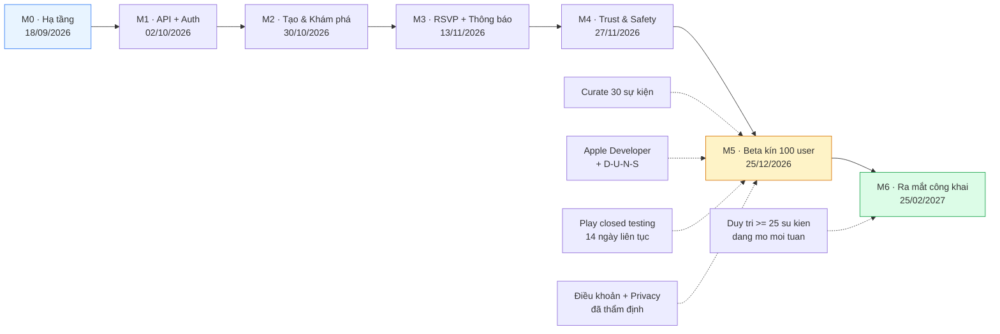
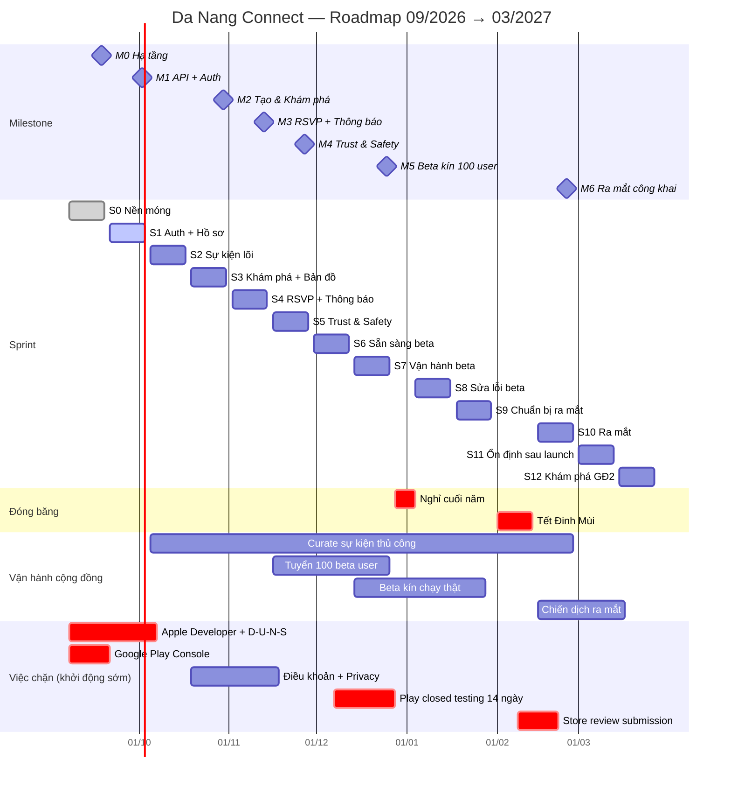
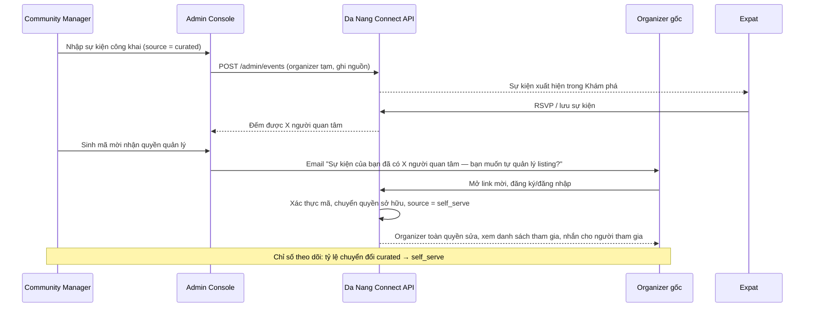
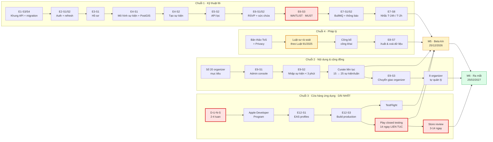
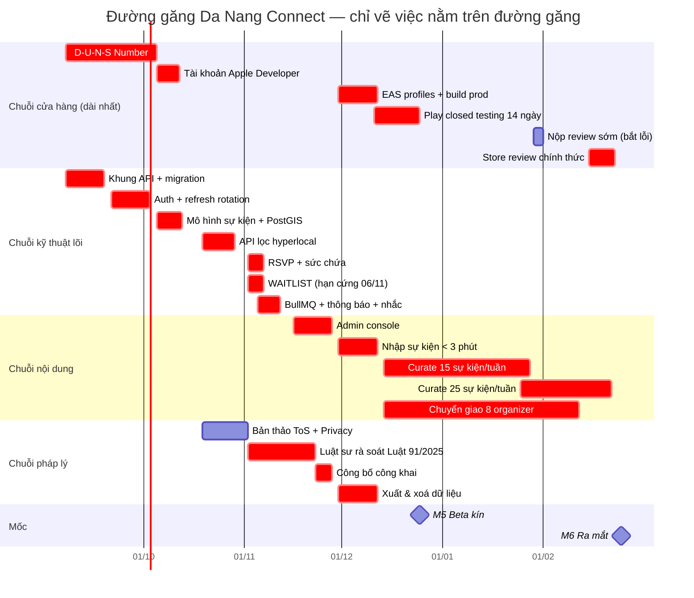

# 08 — Roadmap & Kế hoạch triển khai Da Nang Connect

> **Sản phẩm:** Da Nang Connect — nền tảng kết nối cộng đồng người nước ngoài (expat) tại Đà Nẵng.
> **Phạm vi tài liệu:** Roadmap kỹ thuật & vận hành từ **01/09/2026 → 31/03/2027**, tập trung vào Giai đoạn 1 (Kết nối cộng đồng) tới thời điểm ra mắt công khai tại Đà Nẵng.
> **Ngày lập:** 31/08/2026 · **Phiên bản:** 1.0 · **Trạng thái:** Sẵn sàng thực thi

---

## Mục lục

| § | Nội dung | Dùng khi nào |
|---|---|---|
| [1](#1-tóm-tắt-điều-hành) | Tóm tắt điều hành | Cần con số chốt trong 2 phút |
| [2](#2-giả-định-lập-kế-hoạch) | Giả định lập kế hoạch | Khi một con số trông sai — kiểm giả định trước |
| [3](#3-bản-đồ-milestone-m0--m6) | Bản đồ Milestone M0 → M6 | Nhìn tổng thể 7 tháng |
| [4](#4-timeline-tổng-thể-theo-tuần) | Timeline tổng thể theo tuần (Gantt + lịch 26 tuần) | Lập lịch tuần |
| [5](#5-cấu-trúc-backlog-epic--user-story--task) | Cấu trúc backlog: 12 Epic → 90 User Story → Task (563 SP) | Viết issue, ước lượng |
| [6](#6-kế-hoạch-sprint-chi-tiết-từ-s0-đến-s12) | **Kế hoạch sprint chi tiết từ S0 đến S12** — mục tiêu, story kèm SP, Definition of Done, deliverable demo được | Chạy sprint hằng ngày |
| [7](#7-milestone-từ-m0-đến-m6-ngày-chốt-và-tiêu-chí-nghiệm-thu) | **Milestone M0 → M6: ngày chốt và tiêu chí nghiệm thu** | Nghiệm thu mốc |
| [8](#8-đường-găng-và-phụ-thuộc-chặn) | **Đường găng và phụ thuộc chặn** | Biết cái gì chặn cái gì |
| [9](#9-cấu-trúc-đội-ngũ) | **Cấu trúc đội ngũ**: phương án đủ đội 5,5 FTE và phương án tinh gọn 2 dev + Founder | Tuyển người, phân vai |
| [10](#10-kịch-bản-cắt-scope-khi-chỉ-có-2-lập-trình-viên) | **Kịch bản cắt scope khi chỉ có 2 lập trình viên** — giữ / cắt / hoãn / thuê ngoài / dùng dịch vụ có sẵn | Khi thiếu người |
| [11](#11-ngân-sách-theo-giai-đoạn) | **Ngân sách theo giai đoạn** (nhân sự · hạ tầng · pháp lý · marketing), VND và USD | Lập kế hoạch tiền |
| [12](#12-launch-readiness-checklist-trước-m6) | **Launch readiness checklist trước M6** | Chốt cửa trước ra mắt |
| [13](#13-rủi-ro-lịch-trình-và-cửa-quyết-định-go-no-go) | **Rủi ro lịch trình và cửa quyết định go / no-go** | Khi lịch bắt đầu trượt |

> **Số sprint:** **11 sprint (S0 → S10) tới mốc ra mắt M6**, cộng 2 sprint sau ra mắt (S11, S12) — tổng **13 sprint** được lập lịch. Chi tiết từng sprint ở §6.

---

## 1. Tóm tắt điều hành

| Hạng mục | Kết luận |
|---|---|
| Ngày khởi động | Thứ Hai **07/09/2026** (Sprint 0) |
| Ngày ra mắt công khai (M6) | Thứ Năm **25/02/2027**, sự kiện ra mắt cuối tuần 27–28/02/2027 |
| Tổng số sprint tới ra mắt | **11 sprint** (Sprint 0 → Sprint 10), mỗi sprint 2 tuần |
| Tổng khối lượng backlog MVP | **≈ 563 story point** (chưa gồm 15% dự phòng) |
| Đội ngũ khuyến nghị | **5,5 FTE** (Tech Lead, BE, FE, Mobile, Designer 0.5, QA 0.5, Community Manager 0.5) |
| Đội ngũ tối thiểu khả thi | **2 lập trình viên** + Founder kiêm PO/Community — bắt buộc cắt scope theo §10.2 |
| Ngân sách kịch bản đủ đội | **≈ 2,04 tỷ VND ≈ 78.500 USD** cho 7 tháng |
| Ngân sách kịch bản tinh gọn | **≈ 0,91 tỷ VND ≈ 35.000 USD** cho 7 tháng |
| Rủi ro chặn lớn nhất | Tài khoản Apple Developer (D‑U‑N‑S 2–4 tuần) và chính sách closed testing 14 ngày của Google Play |
| Chỉ số quyết định "ra mắt được" | **≥ 25 sự kiện đang mở mỗi tuần và không khu vực MVP nào bằng 0** (chỉ tiêu dòng chảy, không phải tồn kho tích luỹ), WCA **220–280 lượt/tuần**, ≥ 100 beta user hoạt động, ≥ 8 organizer đã nhận quyền quản lý listing |

**Ba nguyên tắc chi phối toàn bộ roadmap này:**

1. **Nội dung đi trước tính năng.** Ứng dụng trống là rủi ro số 1 (cold-start nguồn cung, cung chỉ chiếm ~6% bài đăng). Công việc curate thủ công được đưa vào sprint như một hạng mục có người chịu trách nhiệm và có Definition of Done, không phải việc "làm thêm khi rảnh".
2. **Không scraping.** Mọi luồng nhập liệu từ nguồn ngoài đều là nhập tay qua Admin Curation Console, có ghi nhận nguồn và có đường chuyển giao cho organizer gốc.
3. **Hyperlocal là lợi thế cạnh tranh duy nhất được bảo vệ bằng kỹ thuật.** PostGIS + từ điển khu vực Đà Nẵng (Mỹ Khê, An Thượng, Mỹ An, Sơn Trà, Hải Châu, Ngũ Hành Sơn, Thanh Khê, Hòa Xuân, Nam Ô…) là hạng mục ưu tiên cao, không được cắt trong bất kỳ kịch bản nào.

---

## 2. Giả định lập kế hoạch

| # | Giả định | Ảnh hưởng nếu sai |
|---|---|---|
| A1 | Sprint 2 tuần, bắt đầu Thứ Hai, kết thúc Thứ Sáu. Demo chiều Thứ Sáu tuần thứ 2. | Lệch toàn bộ mốc ngày |
| A2 | Velocity đội đủ: 40 SP (Sprint 0, ramp-up) → 55 SP (Sprint 2 trở đi). Đội tinh gọn: 24–28 SP/sprint. | Kéo dài 2–4 sprint |
| A3 | Thang story point Fibonacci: 1, 2, 3, 5, 8, 13. 1 SP ≈ nửa ngày công của dev có kinh nghiệm với stack. | Sai lệch ước lượng |
| A4 | Nghỉ lễ đã trừ: Quốc khánh 02/09/2026, Tết Dương lịch 01/01/2027, **Tết Nguyên đán Đinh Mùi — mùng 1 rơi vào 06/02/2027**, đóng băng phát triển 01/02 → 12/02/2027. | Mất 2 tuần nếu quên |
| A5 | Đóng băng cuối năm 26/12/2026 → 03/01/2027 (đội nghỉ, nhưng beta vẫn chạy và vẫn có người trực sự cố). | Giảm 1 sprint |
| A6 | Tỷ giá quy đổi ngân sách: **1 USD = 26.000 VND**. | Sai số ngân sách ±5% |
| A7 | Ngôn ngữ mặc định của UI là **tiếng Anh**, tiếng Việt là ngôn ngữ thứ hai; i18n có ngay từ Sprint 0. | Làm lại toàn bộ chuỗi văn bản |
| A8 | Chỉ phục vụ **Đà Nẵng**. Không xây đa thành phố, nhưng data model đã có trường `city_id` để không phải migrate đau đớn về sau. | Nợ kỹ thuật khi mở rộng |

---

## 3. Bản đồ Milestone M0 → M6

| Mốc | Tên | Ngày chốt | Sprint | Điều kiện nghiệm thu (gate) |
|---|---|---|---|---|
| **M0** | Setup hạ tầng | **18/09/2026** | S0 | Môi trường staging chạy được; CI xanh; `GET /health` trả 200 từ tên miền staging; app dev build cài được trên máy thật (iOS + Android) |
| **M1** | API nền + Auth | **02/10/2026** | S1 | Đăng ký/đăng nhập bằng email + Google + Apple hoạt động end-to-end trên web và mobile; refresh token rotation có test; RBAC chặn đúng |
| **M2** | Tạo & khám phá sự kiện | **30/10/2026** | S2–S3 | Tạo sự kiện từ web và mobile; tìm kiếm + lọc theo loại hình/khu vực/thời gian/ngôn ngữ; bản đồ hiển thị đúng khu vực; trang chi tiết sự kiện có SEO/OG |
| **M3** | RSVP + Thông báo | **13/11/2026** | S4 | RSVP/hủy/waitlist đúng khi tranh chấp chỗ; push tới thiết bị thật; email xác nhận; nhắc T‑24h và T‑2h chạy đúng giờ |
| **M4** | Trust & Safety tối thiểu | **27/11/2026** | S5 | Report, block, hàng đợi kiểm duyệt, gỡ nội dung, ban tài khoản; Community Guidelines + Privacy Policy đã công bố; **trust level T0–T5** hiển thị trên hồ sơ |
| **M5** | Beta kín 100 user | **25/12/2026** | S6–S7 | 100 tài khoản beta thật; ≥ 60 sự kiện đã curate; TestFlight + Play closed testing chạy ổn định 14 ngày; crash-free session ≥ 99% |
| **M6** | Ra mắt công khai tại Đà Nẵng | **25/02/2027** | S9–S10 | App có mặt trên App Store + Google Play; web production; **≥ 25 sự kiện đang mở mỗi tuần (trung bình 4 tuần liên tiếp, không tuần nào < 20) và không khu vực MVP nào bằng 0**; WCA 220–280 lượt/tuần; ≥ 8 organizer tự quản lý listing; runbook sự cố đã diễn tập — xem tiêu chí đầy đủ ở §7.8 |

---

## 4. Timeline tổng thể theo tuần

### 4.1 Sơ đồ Gantt

### 4.2 Lịch tuần chi tiết

| Tuần | Ngày | Sprint | Trọng tâm | Mốc chạm |
|---|---|---|---|---|
| W01 | 07/09 – 11/09/2026 | S0 | Monorepo, Docker Compose, NestJS skeleton, đăng ký Apple/Google account | |
| W02 | 14/09 – 18/09/2026 | S0 | CI/CD, staging deploy, Expo dev build, i18n scaffolding | **M0 · 18/09** |
| W03 | 21/09 – 25/09/2026 | S1 | Auth email + JWT rotation, RBAC | |
| W04 | 28/09 – 02/10/2026 | S1 | Google/Apple/Facebook Sign-In, Auth UI web + mobile | **M1 · 02/10** |
| W05 | 05/10 – 09/10/2026 | S2 | Data model sự kiện + PostGIS, API tạo/sửa sự kiện, upload ảnh | |
| W06 | 12/10 – 16/10/2026 | S2 | Form tạo sự kiện web + mobile, trang chi tiết sự kiện | |
| W07 | 19/10 – 23/10/2026 | S3 | API search/filter, từ điển khu vực, truy vấn bán kính | |
| W08 | 26/10 – 30/10/2026 | S3 | Trang khám phá web + feed mobile + bản đồ | **M2 · 30/10** |
| W09 | 02/11 – 06/11/2026 | S4 | RSVP, capacity, waitlist, hàng đợi BullMQ | |
| W10 | 09/11 – 13/11/2026 | S4 | Expo Push, email transactional, WebSocket đếm chỗ realtime | **M3 · 13/11** |
| W11 | 16/11 – 20/11/2026 | S5 | Report/block, hàng đợi kiểm duyệt, trust level T0–T5 | |
| W12 | 23/11 – 27/11/2026 | S5 | Guidelines, quyền riêng tư, xuất/xóa dữ liệu, nhãn organizer đã xác minh | **M4 · 27/11** |
| W13 | 30/11 – 04/12/2026 | S6 | Admin Curation Console, luồng organizer nhận quyền quản lý listing | |
| W14 | 07/12 – 11/12/2026 | S6 | Hardening, EAS production build, nộp TestFlight + Play closed testing | |
| W15 | 14/12 – 18/12/2026 | S7 | Beta wave 1 (40 user), theo dõi telemetry, hotfix hằng ngày | |
| W16 | 21/12 – 25/12/2026 | S7 | Beta wave 2 (60 user), phỏng vấn 15 user, tổng kết beta | **M5 · 25/12** |
| — | 28/12 – 01/01/2027 | Đóng băng | Trực sự cố luân phiên, không release tính năng mới | |
| W17 | 04/01 – 08/01/2027 | S8 | Sửa lỗi beta ưu tiên P0/P1, tinh chỉnh onboarding | |
| W18 | 11/01 – 15/01/2027 | S8 | Tối ưu hiệu năng danh sách/bản đồ, giảm rớt phễu RSVP | |
| W19 | 18/01 – 22/01/2027 | S9 | Analytics funnel, SEO trang sự kiện, referral link | |
| W20 | 25/01 – 29/01/2027 | S9 | Release candidate, đóng gói tài sản cửa hàng, diễn tập runbook | |
| — | 01/02 – 12/02/2027 | Đóng băng | Tết Đinh Mùi. Chỉ trực sự cố P0. | |
| W21 | 15/02 – 19/02/2027 | S10 | Nộp store review, soft launch nội bộ, kiểm thử hồi quy đầy đủ | |
| W22 | 22/02 – 26/02/2027 | S10 | Ra mắt công khai, chiến dịch truyền thông, trực launch war-room | **M6 · 25/02** |
| W23 | 01/03 – 05/03/2027 | S11 | Ổn định sau ra mắt, xử lý phản hồi store | |
| W24 | 08/03 – 12/03/2027 | S11 | Vòng tăng trưởng: mời bạn bè, nhắc "tuần này có gì" | |
| W25 | 15/03 – 19/03/2027 | S12 | Thử nghiệm freemium (bộ lọc nâng cao), đo sẵn sàng trả phí | |
| W26 | 22/03 – 26/03/2027 | S12 | Khám phá Giai đoạn 2 (Nhà ở): nghiên cứu người dùng, phác thảo mô hình dữ liệu | |

---

## 5. Cấu trúc backlog: Epic → User Story → Task

### 5.1 Danh mục Epic

| Mã | Epic | Mốc chính | Story point | Chủ sở hữu chính |
|---|---|---|---|---|
| **E1** | Nền tảng & Hạ tầng | M0 | 54 | Tech Lead |
| **E2** | Định danh & Xác thực | M1 | 53 | Backend |
| **E3** | Hồ sơ cá nhân & Tín hiệu tin cậy | M1 / M4 | 42 | Backend |
| **E4** | Quản lý sự kiện | M2 | 84 | Backend + Frontend + Mobile |
| **E5** | Khám phá & Tìm kiếm hyperlocal | M2 | 83 | Backend + Frontend + Mobile |
| **E6** | RSVP & Điểm danh | M3 | 55 | Backend + Mobile |
| **E7** | Thông báo & Realtime | M3 | 57 | Backend + Mobile |
| **E8** | Trust & Safety | M4 | 39 | Backend |
| **E9** | Admin & Curation Console | M2 → M5 | 34 | Frontend |
| **E10** | i18n & Nội dung | Xuyên suốt | 11 | Frontend + Community |
| **E11** | Analytics & Tăng trưởng | M5 / M6 | 25 | Tech Lead |
| **E12** | Phát hành ứng dụng di động | M5 / M6 | 26 | Mobile |
| | **Tổng** | | **563** | |

**Ký hiệu vai trò:** `TL` Tech Lead · `BE` Backend · `FE` Frontend (web + admin) · `MB` Mobile · `DS` Designer · `QA` Kiểm thử · `CM` Community Manager · `PO` Product Owner (Founder)

---

### 5.2 E1 — Nền tảng & Hạ tầng (54 SP · M0)

| Story ID | User Story | SP | Vai trò | Sprint |
|---|---|---|---|---|
| E1-S1 | Là **dev**, tôi muốn một monorepo có chuẩn code thống nhất để mọi người viết cùng một phong cách. | 5 | TL | S0 |
| E1-S2 | Là **dev**, tôi muốn `docker compose up` dựng đủ Postgres 16 + PostGIS + Redis để chạy local trong 5 phút. | 5 | TL | S0 |
| E1-S3 | Là **dev**, tôi muốn bộ khung NestJS 11 với config theo môi trường và endpoint health check. | 5 | BE | S0 |
| E1-S4 | Là **dev**, tôi muốn TypeORM với migration và seed data để schema có phiên bản rõ ràng. | 5 | BE | S0 |
| E1-S5 | Là **dev**, tôi muốn bộ khung Next.js 15 App Router + Tailwind + design token. | 5 | FE | S0 |
| E1-S6 | Là **dev**, tôi muốn bộ khung Expo 54 + React Native 0.81 + điều hướng và một dev build cài được lên máy thật. | 8 | MB | S0 |
| E1-S7 | Là **dev**, tôi muốn CI GitHub Actions chạy lint + test + build trên mỗi pull request. | 5 | TL | S0 |
| E1-S8 | Là **dev**, tôi muốn merge vào `develop` là tự động deploy lên staging. | 8 | TL | S0 |
| E1-S9 | Là **dev trực sự cố**, tôi muốn Sentry và log tập trung để biết lỗi trước khi người dùng báo. | 3 | BE | S0 |
| E1-S10 | Là **expat**, tôi muốn giao diện mặc định tiếng Anh và đổi được sang tiếng Việt. | 5 | FE + MB | S0 |

**Phân rã task mẫu — E1-S2 (Docker Compose local):**

- [ ] `docker-compose.yml`: dịch vụ `postgres` (image `postgis/postgis:16-3.4`), `redis:7-alpine`, `api`, `web`
- [ ] Script `db:init` bật extension `postgis`, `pg_trgm`, `uuid-ossp`
- [ ] Named volume để dữ liệu không mất khi `down`
- [ ] `.env.example` đầy đủ biến, không commit secret thật
- [ ] Healthcheck cho từng service, `depends_on: condition: service_healthy`
- [ ] Tài liệu `README` phần "Chạy local trong 5 phút", có người thứ hai làm theo và xác nhận

---

### 5.3 E2 — Định danh & Xác thực (53 SP · M1)

| Story ID | User Story | SP | Vai trò | Sprint |
|---|---|---|---|---|
| E2-S1 | Là **expat mới**, tôi muốn đăng ký bằng email và xác minh email để tài khoản đáng tin. | 8 | BE | S1 |
| E2-S2 | Là **người dùng**, tôi muốn phiên đăng nhập được giữ an toàn với access token ngắn hạn và refresh token xoay vòng. | 8 | BE | S1 |
| E2-S3 | Là **expat**, tôi muốn đăng nhập bằng Google chỉ với một chạm. | 5 | BE + MB | S1 |
| E2-S4 | Là **người dùng iPhone**, tôi muốn đăng nhập bằng Apple (bắt buộc theo App Store Review Guideline 4.8 khi đã có social login khác). | 5 | MB + BE | S1 |
| E2-S5 | Là **expat quen dùng Facebook**, tôi muốn đăng nhập bằng Facebook để không phải tạo mật khẩu mới. | 3 | BE | S1 |
| E2-S6 | Là **người dùng quên mật khẩu**, tôi muốn đặt lại mật khẩu qua email trong 2 phút. | 3 | BE | S1 |
| E2-S7 | Là **quản trị viên**, tôi muốn enum role toàn cục `member` / `curator` / `moderator` / `admin` / `super_admin` được kiểm soát ở tầng guard, kết hợp thêm quan hệ theo sự kiện (`events.host_user_id`, `event_cohosts`) và `users.trust_level`. | 5 | BE | S1 |
| E2-S8 | Là **người dùng web**, tôi muốn màn đăng nhập/đăng ký rõ ràng, có trạng thái lỗi dễ hiểu bằng tiếng Anh. | 5 | FE | S1 |
| E2-S9 | Là **người dùng mobile**, tôi muốn đăng nhập một lần rồi giữ phiên, token lưu trong secure storage. | 8 | MB | S1 |
| E2-S10 | Là **hệ thống**, tôi muốn chặn dò mật khẩu và giới hạn tần suất gọi endpoint xác thực. | 3 | BE | S1 |

**Phân rã task mẫu — E2-S2 (JWT + refresh rotation):**

- [ ] BE: entity `refresh_token` (`id`, `user_id`, `token_hash`, `device_id`, `expires_at`, `revoked_at`, `replaced_by`)
- [ ] BE: `POST /api/v1/auth/refresh` — xoay token, thu hồi token cũ, phát hiện tái sử dụng token đã dùng → thu hồi cả họ token
- [ ] BE: `POST /api/v1/auth/logout` và `logout-all-devices`
- [ ] BE: access token TTL 15 phút, refresh TTL 30 ngày, ký RS256, khóa lưu ở biến môi trường
- [ ] BE: Redis denylist cho access token bị thu hồi sớm
- [ ] FE/MB: interceptor tự refresh khi gặp 401, có khóa chống refresh song song (single-flight)
- [ ] Test: unit cho service, e2e cho luồng refresh và luồng phát hiện tái sử dụng token
- [ ] Swagger: mô tả đầy đủ 4 endpoint

---

### 5.4 E3 — Hồ sơ cá nhân & Tín hiệu tin cậy (42 SP · M1/M4)

| Story ID | User Story | SP | Vai trò | Sprint |
|---|---|---|---|---|
| E3-S1 | Là **expat**, tôi muốn tạo hồ sơ có ảnh, giới thiệu ngắn, ngôn ngữ nói, khu vực đang ở và sở thích. | 8 | BE | S1 |
| E3-S2 | Là **người dùng**, tôi muốn tải ảnh lên nhanh và ảnh hiển thị mượt qua CDN. | 8 | BE | S2 |
| E3-S3 | Là **người sắp gặp người lạ**, tôi muốn thấy **trust level T0–T5** dựa trên tín hiệu có thật (email đã xác minh, số điện thoại đã xác minh, số hoạt động đã tham gia, tỷ lệ vắng mặt). | 8 | BE | S5 |
| E3-S4 | Là **khách web**, tôi muốn xem hồ sơ công khai của organizer trước khi đăng ký tham gia. | 5 | FE | S2 |
| E3-S5 | Là **người dùng mobile**, tôi muốn xem và sửa hồ sơ ngay trong app. | 8 | MB | S2 |
| E3-S6 | Là **người dùng muốn tăng độ tin cậy**, tôi muốn xác minh số điện thoại bằng OTP. | 5 | BE | S5 |

**Thiết kế trust level v1 (E3-S3) — thang duy nhất T0–T5 theo tài liệu 01, lưu ở `users.trust_level` kiểu `smallint` 0–5:**

| Bậc | Nhãn hiển thị | Điều kiện đạt bậc |
|---|---|---|
| **T0** | `New` | Vừa tạo tài khoản, chưa xác minh gì |
| **T1** | `Email verified` | Đã xác minh email |
| **T2** | `Phone verified` | Đã xác minh số điện thoại bằng OTP (E3-S6) |
| **T3** | `Active member` | T2 + đã điểm danh ≥ 3 occurrence + không có report được xác nhận trong 90 ngày |
| **T4** | `Trusted` | T3 + đã host ≥ 3 occurrence hoàn tất + tỷ lệ no-show ≤ 15% trong 10 lần gần nhất |
| **T5** | `Community leader` | T4 + được moderator/admin đề cử thủ công, xét lại mỗi quý |

**Tín hiệu thành phần — bảng `trust_signals` (append-only, không sửa/xoá):**

| `signal_type` | Trọng số | Nguồn phát sinh |
|---|---|---|
| `email_verified` | +1 bậc trần T1 | Module auth |
| `phone_verified` | +1 bậc trần T2 | Module auth (OTP) |
| `social_linked` | phụ trợ, không nâng bậc | Module auth |
| `avatar_approved` | phụ trợ | Hàng đợi kiểm duyệt UGC |
| `attendance_confirmed` | đếm tới ngưỡng T3 | Điểm danh QR (E6-S5) |
| `event_hosted_completed` | đếm tới ngưỡng T4 | Job đóng occurrence |
| `no_show_recorded` | trừ, kéo tụt bậc | Job đóng occurrence |
| `report_upheld` | trừ mạnh, hạ về T2 | Hàng đợi kiểm duyệt |
| `manual_promotion` | chỉ dùng cho T5 | Moderator / admin |

- [ ] Bậc tổng **không tính trực tiếp lúc ghi tín hiệu**; job BullMQ `trust-level-recompute` chạy mỗi giờ và chạy ngay sau `report_upheld`, đọc toàn bộ `trust_signals` của user rồi ghi lại `users.trust_level`
- [ ] Không dùng bất kỳ thang điểm 0–100 nào, không dùng enum `new/verified/established/trusted/ambassador`
- [ ] Hiển thị cho người dùng chỉ là nhãn ở cột "Nhãn hiển thị"; điểm thô và tín hiệu âm chỉ moderator thấy

---

### 5.5 E4 — Quản lý sự kiện (84 SP · M2)

| Story ID | User Story | SP | Vai trò | Sprint |
|---|---|---|---|---|
| E4-S1 | Là **hệ thống**, tôi cần mô hình dữ liệu sự kiện gắn toạ độ PostGIS và gắn khu vực Đà Nẵng. | 8 | BE | S2 |
| E4-S2 | Là **organizer**, tôi muốn tạo hoạt động (nháp → đăng) với tiêu đề, mô tả, loại hình, thời gian, địa điểm, sức chứa, ngôn ngữ, chi phí. | 8 | BE | S2 |
| E4-S3 | Là **organizer**, tôi muốn sửa hoặc huỷ hoạt động của mình và người đã đăng ký được thông báo. | 5 | BE | S2 |
| E4-S4 | Là **organizer**, tôi muốn thêm ảnh bìa và vài ảnh minh hoạ cho hoạt động. | 5 | BE | S2 |
| E4-S5 | Là **organizer của lớp học ngôn ngữ hằng tuần**, tôi muốn tạo hoạt động lặp lại theo tuần (sinh nhiều `event_occurrences` từ `recurrence_rule`) thay vì nhập lại mỗi lần. | 8 | BE | S3 |
| E4-S6 | Là **organizer trên web**, tôi muốn form tạo hoạt động nhiều bước, tự lưu nháp, xem trước trước khi đăng. | 13 | FE | S2 |
| E4-S7 | Là **organizer trên điện thoại**, tôi muốn tạo hoạt động ngay tại quán cà phê trong dưới 90 giây. | 13 | MB | S3 |
| E4-S8 | Là **khách chưa đăng nhập**, tôi muốn mở link sự kiện từ Facebook và thấy trang chi tiết đẹp, có OG image, đọc được không cần cài app. | 8 | FE | S3 |
| E4-S9 | Là **người dùng mobile**, tôi muốn xem chi tiết hoạt động và chia sẻ link deep-link cho bạn. | 8 | MB | S3 |
| E4-S10 | Là **organizer**, tôi muốn một trang quản lý các hoạt động của mình: sắp diễn ra, đã qua, nháp. | 8 | FE | S3 |

**Phân rã task mẫu — E4-S1 (mô hình dữ liệu sự kiện):**

| Bảng | Cột chính | Ghi chú |
|---|---|---|
| `events` | `id`, **`host_user_id`**, `title`, `description`, `category_id`, `timezone`, `price_amount`, `price_currency`, `language_codes[]`, `status`, `source`, `city_id`, `area_id`, `location` (`geography(Point,4326)`), `address_text`, `cover_image_id`, `recurrence_rule`, `published_at`, `cancelled_at` | Tên cột chủ sự kiện thống nhất là **`host_user_id`** (không dùng `creator_id`/`organizer_id`). `source` ∈ `self_serve` \| `curated` — bắt buộc để theo dõi tỷ lệ chuyển từ curate sang tự phục vụ |
| `event_occurrences` | `id`, `event_id`, `starts_at` (UTC), `ends_at` (UTC), `capacity`, `going_count`, `waitlist_count`, `status`, `cancelled_at` | **Mọi thời điểm diễn ra đều nằm ở đây.** Sự kiện không lặp lại vẫn có **đúng 1 occurrence** — không có ngoại lệ. RSVP gắn vào occurrence, không gắn vào `events` |
| `event_cohosts` | `id`, `event_id`, `user_id`, `role_in_event`, `added_by`, `created_at` | Quan hệ organizer theo sự kiện; `organizer` không phải role toàn cục |
| `event_categories` | `id`, `slug`, `name_en`, `name_vi`, `icon` | Seed: sports, language-exchange, social-meetup, food-drink, wellness, music-arts, outdoor, family, professional |
| `areas` | `id`, `city_id`, `slug`, `name_en`, `name_vi`, `boundary` (`geography(Polygon,4326)`), `centroid` | Seed thủ công cho Đà Nẵng |
| `event_images` | `id`, `event_id`, `storage_key`, `width`, `height`, `position` | Ảnh lưu S3-compatible |

- [ ] Index `GIST` trên `events.location`
- [ ] Index tổ hợp `(city_id, status)` trên `events` và `(event_id, starts_at)` trên `event_occurrences` cho truy vấn danh sách
- [ ] Index `GIN` trên `to_tsvector('english', title || ' ' || description)`
- [ ] Migration + seed 9 category + bảng `areas` phân cấp đầy đủ (`city` > `district` > `ward` > `micro_area`); **tập MVP hiển thị trong bộ lọc đúng 6 khu vực: An Thượng, Mỹ Khê, Mỹ An, Hải Châu, Sơn Trà, Ngũ Hành Sơn**
- [ ] Ràng buộc: `event_occurrences.ends_at > starts_at`, `capacity >= 0`; mọi giá trị enum trong DB viết **chữ thường snake_case**: `status` ∈ `draft|published|cancelled|completed`
- [ ] Trigger/hook đảm bảo mỗi `events` mới luôn sinh tối thiểu 1 `event_occurrences`

---

### 5.6 E5 — Khám phá & Tìm kiếm hyperlocal (83 SP · M2)

| Story ID | User Story | SP | Vai trò | Sprint |
|---|---|---|---|---|
| E5-S1 | Là **hệ thống**, tôi cần từ điển khu vực Đà Nẵng với ranh giới thật để lọc theo "An Thượng" cho ra đúng kết quả. | 5 | BE + PO | S2 |
| E5-S2 | Là **expat**, tôi muốn lọc hoạt động theo loại hình, khu vực, khoảng thời gian, ngôn ngữ và mức phí. | 13 | BE | S3 |
| E5-S3 | Là **expat đang ở Mỹ An**, tôi muốn xem hoạt động trong bán kính 2 km quanh tôi. | 8 | BE | S3 |
| E5-S4 | Là **expat**, tôi muốn gõ "badminton" và thấy ngay các buổi cầu lông sắp tới. | 5 | BE | S3 |
| E5-S5 | Là **khách web**, tôi muốn trang khám phá có bộ lọc dạng chip, sắp xếp theo thời gian/khoảng cách, tải thêm mượt. | 13 | FE | S3 |
| E5-S6 | Là **khách web**, tôi muốn xem bản đồ Đà Nẵng với các điểm hoạt động gom cụm theo khu vực. | 8 | FE | S3 |
| E5-S7 | Là **người dùng mobile**, tôi muốn feed khám phá và bảng lọc kéo lên từ dưới. | 13 | MB | S3 |
| E5-S8 | Là **người dùng mobile**, tôi muốn chuyển giữa chế độ danh sách và bản đồ. | 8 | MB | S4 |
| E5-S9 | Là **expat**, tôi muốn một câu trả lời cho câu hỏi "tuần này có gì diễn ra" ngay ở màn hình đầu. | 5 | FE + MB | S4 |
| E5-S10 | Là **người dùng quay lại**, tôi muốn lưu bộ lọc yêu thích và lưu hoạt động để xem sau. | 5 | BE + FE | S4 |

**Danh sách khu vực seed cho Đà Nẵng (E5-S1)** — bảng `areas` thiết kế phân cấp đầy đủ (`city` > `district` > `ward` > `micro_area`) và có thể seed nhiều hơn, nhưng **tập MVP hiển thị trong bộ lọc đúng 6 khu vực** được đánh dấu **MVP**:

| Slug | Tên hiển thị (EN) | Vì sao có mặt |
|---|---|---|
| `an-thuong` | **An Thuong · MVP** | Trung tâm sinh hoạt của expat, mật độ quán/coworking cao nhất |
| `my-khe` | **My Khe Beach · MVP** | Thể thao bãi biển, chạy bộ, bóng chuyền |
| `my-an` | **My An · MVP** | Khu ở dài hạn phổ biến của digital nomad |
| `son-tra` | **Son Tra · MVP** | Hoạt động ngoài trời, leo núi, xe máy |
| `hai-chau` | **Hai Chau · MVP** | Trung tâm hành chính, quán cà phê làm việc, sự kiện chuyên môn |
| `thanh-khe` | Thanh Khe | Khu dân cư, phòng gym, sân thể thao |
| `ngu-hanh-son` | **Ngu Hanh Son · MVP** | Gần Non Nước, yoga/wellness |
| `hoa-xuan` | Hoa Xuan | Khu ở gia đình, sân bóng |
| `nam-o` | Nam O | Bãi biển phía Bắc, hoạt động cuối tuần |
| `lien-chieu` | Lien Chieu | Gần đại học, trao đổi ngôn ngữ |
| `cam-le` | Cam Le | Khu ở giá rẻ, cầu lông/bóng bàn |
| `city-wide` | City-wide / Online | Hoạt động không gắn một khu cụ thể |

**Phân rã task mẫu — E5-S2 (API tìm kiếm & lọc):**

- [ ] `GET /api/v1/events` với query: `q`, `categories[]`, `areas[]`, `from`, `to`, `languages[]`, `priceMax`, `lat`, `lng`, `radiusKm`, `sort` (`starts_at` \| `distance` \| `popularity`), `cursor`, `limit`
- [ ] Phân trang bằng cursor (`starts_at`, `id`) — không dùng OFFSET vì danh sách thay đổi liên tục
- [ ] Query builder gộp điều kiện; khi có `lat/lng` dùng `ST_DWithin` trên cột `geography`
- [ ] Cache Redis theo khoá băm của bộ lọc, TTL 60s; huỷ cache khi có sự kiện mới publish trong cùng khu vực
- [ ] Trả kèm `facets`: số lượng theo category và theo area để hiển thị chip có badge số
- [ ] Test hiệu năng: 10.000 sự kiện giả lập, p95 < 200 ms
- [ ] Swagger + ví dụ request/response

---

### 5.7 E6 — RSVP & Điểm danh (55 SP · M3)

| Story ID | User Story | SP | Vai trò | Sprint |
|---|---|---|---|---|
| E6-S1 | Là **hệ thống**, tôi cần mô hình RSVP có sức chứa và danh sách chờ. | 8 | BE | S4 |
| E6-S2 | Là **expat**, tôi muốn đăng ký tham gia hoặc rút đăng ký, và không bao giờ bị nhận chỗ vượt sức chứa. | 8 | BE | S4 |
| E6-S3 | Là **người trong danh sách chờ**, tôi muốn được đôn lên tự động khi có người rút. **(MUST của MVP — không được hoãn qua M3)** | 5 | BE | S4 |
| E6-S4 | Là **người sắp đi**, tôi muốn thấy ai đã đăng ký — trong giới hạn quyền riêng tư mà họ chọn. | 5 | BE | S4 |
| E6-S5 | Là **organizer**, tôi muốn điểm danh nhanh tại chỗ bằng mã QR. | 8 | BE + MB | S6 |
| E6-S6 | Là **cộng đồng**, tôi muốn người hay đăng ký rồi không đến bị ghi `no_show_recorded` vào `trust_signals` và kéo tụt trust level. | 5 | BE | S5 |
| E6-S7 | Là **khách web**, tôi muốn đăng ký tham gia ngay trên trang chi tiết, thấy số chỗ còn lại. | 5 | FE | S4 |
| E6-S8 | Là **người dùng mobile**, tôi muốn thấy số chỗ còn lại cập nhật realtime khi người khác đăng ký. | 8 | MB | S4 |
| E6-S9 | Là **organizer**, tôi muốn xuất danh sách người tham gia ra CSV. | 3 | FE | S6 |

**Phân rã task mẫu — E6-S2 (RSVP an toàn khi tranh chấp chỗ):**

- [ ] Bảng **`rsvps`** (`id`, **`occurrence_id`**, `user_id`, `status` ∈ `going|waitlisted|cancelled|checked_in|no_show`, `guest_count`, `position`, `created_at`, `cancelled_at`), unique `(occurrence_id, user_id)` — RSVP gắn vào `event_occurrences`, **không** gắn vào `events`
- [ ] Cột đếm phi chuẩn hoá `event_occurrences.going_count` / `waitlist_count` cập nhật trong cùng transaction
- [ ] Dùng `SELECT ... FOR UPDATE` trên hàng `event_occurrences` khi nhận chỗ để tránh vượt sức chứa (tính cả `guest_count`)
- [ ] Kiểm thử tải: 200 request RSVP đồng thời vào sự kiện có 50 chỗ → đúng 50 `going`, phần còn lại `waitlisted`
- [ ] Bắn sự kiện domain `rsvp.created` / `rsvp.cancelled` vào BullMQ để module thông báo tiêu thụ
- [ ] Endpoint công khai: `POST /api/v1/occurrences/{occurrenceId}/rsvps`, `DELETE /api/v1/occurrences/{occurrenceId}/rsvps/me`, `GET /api/v1/occurrences/{occurrenceId}/attendees`
- [ ] Đường tắt giữ lại: `POST /api/v1/events/{eventId}/rsvps` tự trỏ tới occurrence gần nhất sắp diễn ra của event; trả **409** nếu event có nhiều occurrence sắp tới
- [ ] Chặn RSVP với sự kiện đã bắt đầu hoặc đã huỷ

---

### 5.8 E7 — Thông báo & Realtime (57 SP · M3)

| Story ID | User Story | SP | Vai trò | Sprint |
|---|---|---|---|---|
| E7-S1 | Là **hệ thống**, tôi cần hàng đợi BullMQ trên Redis với worker riêng và cơ chế retry. | 5 | BE | S4 |
| E7-S2 | Là **hệ thống**, tôi cần dịch vụ thông báo có template song ngữ EN/VI và chọn ngôn ngữ theo người nhận. | 8 | BE | S4 |
| E7-S3 | Là **người dùng mobile**, tôi muốn nhận push khi hoạt động tôi đăng ký có thay đổi. | 8 | BE + MB | S4 |
| E7-S4 | Là **người dùng**, tôi muốn nhận email xác nhận sau khi đăng ký và email nhắc trước 24 giờ. | 5 | BE | S4 |
| E7-S5 | Là **người xem trang sự kiện**, tôi muốn số chỗ còn lại và số người tham gia cập nhật ngay không cần tải lại. | 13 | BE | S4 |
| E7-S6 | Là **người dùng**, tôi muốn một trung tâm thông báo trong app để không bỏ lỡ gì. | 8 | MB + FE | S5 |
| E7-S7 | Là **người dùng**, tôi muốn tắt riêng từng loại thông báo thay vì tắt tất cả. | 5 | FE + MB | S5 |
| E7-S8 | Là **người đã đăng ký**, tôi muốn được nhắc trước 24 giờ và trước 2 giờ để không quên. | 5 | BE | S5 |

**Ma trận thông báo (E7-S2):**

| Sự kiện kích hoạt | Push | Email | In-app | Người nhận |
|---|---|---|---|---|
| RSVP thành công | — | ✅ | ✅ | Người đăng ký |
| Có người đăng ký hoạt động của bạn | ✅ | — | ✅ | Organizer |
| Được đôn từ danh sách chờ lên tham gia | ✅ | ✅ | ✅ | Người trong danh sách chờ |
| Hoạt động bị sửa thời gian/địa điểm | ✅ | ✅ | ✅ | Tất cả người đã đăng ký |
| Hoạt động bị huỷ | ✅ | ✅ | ✅ | Tất cả người đã đăng ký |
| Nhắc T‑24h | ✅ | ✅ | — | Người đã đăng ký |
| Nhắc T‑2h | ✅ | — | — | Người đã đăng ký |
| Tóm tắt "tuần này có gì" (Thứ Năm 18:00) | ✅ | ✅ | — | Người dùng đã bật |
| Lời mời nhận quyền quản lý listing | — | ✅ | — | Organizer gốc |

---

### 5.9 E8 — Trust & Safety (39 SP · M4)

| Story ID | User Story | SP | Vai trò | Sprint |
|---|---|---|---|---|
| E8-S1 | Là **người dùng**, tôi muốn báo cáo một hoạt động hoặc một người có hành vi không phù hợp. | 5 | BE | S5 |
| E8-S2 | Là **người dùng**, tôi muốn chặn một người để không thấy nội dung của họ và họ không nhắn được cho tôi. | 5 | BE | S5 |
| E8-S3 | Là **moderator**, tôi muốn hàng đợi kiểm duyệt xếp theo mức độ nghiêm trọng và thời gian chờ. | 8 | BE + FE | S5 |
| E8-S4 | Là **moderator**, tôi muốn ẩn nội dung, gỡ hoạt động hoặc khoá tài khoản, có ghi lại lý do và người thực hiện. | 5 | BE | S5 |
| E8-S5 | Là **người dùng mới**, tôi muốn đọc Community Guidelines rõ ràng và đồng ý trước khi tham gia. | 3 | FE + PO | S5 |
| E8-S6 | Là **hệ thống**, tôi muốn chặn spam: giới hạn số hoạt động tạo mỗi ngày, lọc từ khoá, chặn link đáng ngờ. | 5 | BE | S5 |
| E8-S7 | Là **người dùng**, tôi muốn tải về dữ liệu của mình và yêu cầu xoá tài khoản. | 5 | BE | S6 |
| E8-S8 | Là **expat cẩn trọng**, tôi muốn thấy nhãn "Verified organizer" để biết ai đã được kiểm chứng. | 3 | BE | S5 |

**Mức độ ưu tiên xử lý report (SLA nội bộ, E8-S3):**

| Loại report | Mức | SLA phản hồi | Hành động mặc định |
|---|---|---|---|
| Nguy cơ an toàn thân thể, quấy rối | P0 | 2 giờ | Ẩn ngay, khoá tạm tài khoản, moderator xem xét |
| Lừa đảo, đòi tiền, link độc hại | P0 | 2 giờ | Gỡ hoạt động, chặn link |
| Nội dung khiêu dâm / thù ghét | P1 | 12 giờ | Ẩn, cảnh cáo |
| Spam, đăng trùng, quảng cáo trá hình | P2 | 48 giờ | Ẩn, giới hạn tần suất |
| Thông tin sai (địa điểm/giờ) | P3 | 72 giờ | Liên hệ organizer sửa |

---

### 5.10 E9 — Admin & Curation Console (34 SP · M2 → M5)

| Story ID | User Story | SP | Vai trò | Sprint |
|---|---|---|---|---|
| E9-S1 | Là **admin**, tôi muốn khu vực quản trị riêng, đăng nhập tách biệt, có audit log. | 5 | FE + BE | S3 |
| E9-S2 | Là **Community Manager**, tôi muốn nhập một sự kiện công khai đã thấy ngoài đời vào hệ thống trong dưới 3 phút, có ghi nguồn và gán organizer tạm. | 8 | FE + BE | S6 |
| E9-S3 | Là **Community Manager**, tôi muốn gửi lời mời để organizer gốc nhận quyền quản lý listing của họ. | 8 | BE + FE | S6 |
| E9-S4 | Là **admin**, tôi muốn quản lý người dùng, khu vực và loại hình hoạt động. | 5 | FE | S6 |
| E9-S5 | Là **Founder**, tôi muốn một bảng điều khiển vận hành: hoạt động tuần này, số RSVP, report đang chờ, tỷ lệ chuyển đổi organizer. | 8 | FE | S6 |

**Luồng chuyển organizer từ bị động sang chủ động (E9-S3):**

---

### 5.11 E10 — i18n & Nội dung (11 SP)

| Story ID | User Story | SP | Vai trò | Sprint |
|---|---|---|---|---|
| E10-S1 | Là **dev**, tôi muốn khoá i18n được đặt theo namespace nhất quán giữa web và mobile. | 3 | FE | S0 |
| E10-S2 | Là **người dùng Việt**, tôi muốn bản dịch tiếng Việt tự nhiên, không phải dịch máy. | 5 | PO + CM | S8 |
| E10-S3 | Là **người mới**, tôi muốn trang About / FAQ / Community Guidelines song ngữ. | 3 | CM | S6 |

---

### 5.12 E11 — Analytics & Tăng trưởng (25 SP)

| Story ID | User Story | SP | Vai trò | Sprint |
|---|---|---|---|---|
| E11-S1 | Là **Founder**, tôi cần một lược đồ sự kiện phân tích thống nhất giữa web và mobile. | 5 | BE | S6 |
| E11-S2 | Là **Founder**, tôi muốn tích hợp công cụ phân tích sản phẩm và xem phễu thực tế. | 5 | TL | S8 |
| E11-S3 | Là **Founder**, tôi muốn báo cáo tuần tự động về hoạt động, RSVP, giữ chân người dùng. | 5 | TL + PO | S9 |
| E11-S4 | Là **người dùng hài lòng**, tôi muốn mời bạn bằng một link và được ghi nhận. | 5 | BE + FE | S9 |
| E11-S5 | Là **expat tìm Google "things to do in Da Nang this week"**, tôi muốn thấy trang sự kiện của nền tảng. | 5 | FE | S9 |

**Lược đồ sự kiện phân tích tối thiểu (E11-S1):**

`app_open` · `signup_started` · `signup_completed` · `discover_viewed` · `filter_applied` (props: `area`, `category`) · `event_viewed` (`source`) · `rsvp_started` · `rsvp_completed` · `rsvp_cancelled` · `event_create_started` · `event_create_published` · `notification_opened` · `share_clicked` · `organizer_claim_opened` · `organizer_claim_completed`

---

### 5.13 E12 — Phát hành ứng dụng di động (26 SP)

| Story ID | User Story | SP | Vai trò | Sprint |
|---|---|---|---|---|
| E12-S1 | Là **dev**, tôi muốn 3 profile EAS Build (`development`, `preview`, `production`) và versioning tự động. | 5 | MB | S0 |
| E12-S2 | Là **người dùng**, tôi muốn app có icon, splash và ảnh cửa hàng chỉn chu. | 3 | DS | S6 |
| E12-S3 | Là **beta tester**, tôi muốn cài app qua TestFlight hoặc Play closed testing. | 5 | MB | S6 |
| E12-S4 | Là **người tìm app**, tôi muốn mô tả cửa hàng song ngữ, ảnh chụp màn hình rõ giá trị. | 5 | MB + PO | S9 |
| E12-S5 | Là **dev**, tôi muốn đẩy bản vá nhanh qua EAS Update mà không cần chờ duyệt cửa hàng. | 3 | MB | S6 |
| E12-S6 | Là **Founder**, tôi muốn app được duyệt và có mặt trên cả hai cửa hàng đúng ngày ra mắt. | 5 | MB | S10 |

---

## 6. Kế hoạch sprint chi tiết từ S0 đến S12

### 6.1 Quy ước, sức chứa và cách đọc mục này

**Tổng số sprint: 13 sprint được lập lịch, trong đó đúng 11 sprint (S0 → S10) nằm trước mốc ra mắt M6.** S11 và S12 là hai sprint sau ra mắt (ổn định + khám phá Giai đoạn 2), không chứa story nào của backlog MVP 563 SP.

> **Lưu ý quan trọng khi đọc §5 và §6 cùng lúc.** Cột `Sprint` trong các bảng ở §5 ghi **sprint mục tiêu theo epic** (epic thuộc mốc nào thì gắn sprint của mốc đó). §6 là **bản san tải cuối cùng (capacity-leveled)** — đây mới là bản có hiệu lực để lập kế hoạch tuần và cam kết với đội. Chỗ nào hai bản khác nhau thì §6 thắng, và story được dời đều được ghi rõ trong bảng §6.2.

**Sức chứa (velocity) theo A2, quy đổi thành số SP cam kết được mỗi sprint:**

| Sprint | Ngày | Sức chứa nền (5,5 FTE) | BE hợp đồng (+14 SP) | Sức chứa dùng để lập kế hoạch | SP cam kết | Đệm |
|---|---|---:|---:|---:|---:|---:|
| S0 | 07/09 – 18/09/2026 | 40 | — | 40 | **49** | −9 ⚠️ |
| S1 | 21/09 – 02/10/2026 | 50 | — | 50 | **53** | −3 ⚠️ |
| S2 | 05/10 – 16/10/2026 | 55 | +14 | 69 | **68** | +1 |
| S3 | 19/10 – 30/10/2026 | 55 | +14 | 69 | **68** | +1 |
| S4 | 02/11 – 13/11/2026 | 55 | +14 | 69 | **70** | −1 ⚠️ |
| S5 | 16/11 – 27/11/2026 | 55 | +14 | 69 | **63** | +6 |
| S6 | 30/11 – 11/12/2026 | 55 | +14 | 69 | **68** | +1 |
| S7 | 14/12 – 25/12/2026 | 40 *(vận hành beta chiếm 15 SP)* | — | 40 | **26** | +14 |
| S8 | 04/01 – 15/01/2027 | 55 | — | 55 | **36** | +19 |
| S9 | 18/01 – 29/01/2027 | 55 | — | 55 | **52** | +3 |
| S10 | 15/02 – 26/02/2027 | 30 *(vận hành ra mắt chiếm 25 SP)* | — | 30 | **10** | +20 |
| | **Cộng S0 → S10** | **545** | **+70** | **615** | **563** | **+52 (9%)** |
| S11 | 01/03 – 12/03/2027 | 45 | — | 45 | *(sau ra mắt)* | |
| S12 | 15/03 – 26/03/2027 | 45 | — | 45 | *(sau ra mắt)* | |

**Ba kết luận rút ra từ bảng này — đây là phần quan trọng nhất của §6:**

1. **Backlog 563 SP không vừa sức chứa nền 545 SP của đội 5,5 FTE.** Phải bổ sung **1 Backend hợp đồng toàn thời gian trong 10 tuần (05/10 → 11/12/2026, tức S2 → S6)**. Kiểm tra chéo theo nhánh vai trò: nhánh backend gánh **≈ 289 SP / 563 SP** trong khi sức chứa backend của 5,5 FTE chỉ là **22 SP/sprint × 11 = 242 SP**. Thiếu ≈ 47 SP, tất cả nằm gọn trong S2 → S6. Chi phí: **150 triệu VND (≈ 5.770 USD)** — đã tính vào ngân sách §11.
2. **Đệm 52 SP (9%) thấp hơn mức dự phòng 15% mà §1 nêu.** Phần thiếu không được cấp thêm sprint; nó được hấp thụ bằng ba cơ chế: (a) 33 SP đệm tập trung ở S7/S8 để nuốt lỗi beta, (b) 20 SP đệm ở S10 để nuốt sự cố ra mắt, (c) danh sách 6 story hạng **SHOULD** ở §6.16 được phép cắt không cần họp.
3. **S0 và S1 cam kết vượt sức chứa.** Chấp nhận có điều kiện, vì 100% khối lượng S0 là scaffolding chạy song song trên 4 nhánh không chặn nhau. Phương án hạ tải nếu tuần W02 trượt được ghi trong DoD của S0.

**Ưu tiên story dùng trong toàn §6:** `MUST` = không có thì mốc không nghiệm thu được · `SHOULD` = cắt được, mất chất lượng nhưng không mất mốc · `COULD` = cắt tự do.

**Definition of Done chung (áp dụng cho MỌI story, không nhắc lại ở từng sprint):**

| # | Điều kiện | Bằng chứng phải có |
|---|---|---|
| DoD-1 | Code đã merge vào `develop`, qua ít nhất 1 review | Link PR đã approve |
| DoD-2 | Lint + typecheck + unit test xanh trên CI | Run CI xanh |
| DoD-3 | Độ phủ test của module mới ≥ 70% dòng; nhánh backend có test e2e cho mọi endpoint mới | Báo cáo coverage |
| DoD-4 | Migration TypeORM có `up` **và** `down`, đã chạy thuận + chạy ngược trên staging | Log migration |
| DoD-5 | Endpoint mới có mô tả Swagger đầy đủ, kèm ví dụ request/response | `/api/docs` trên staging |
| DoD-6 | Mọi chuỗi hiển thị đều đi qua i18n, có **cả** khoá `en` và `vi`; mặc định `en` | Không còn chuỗi cứng khi grep |
| DoD-7 | Mọi thời điểm lưu **UTC**, hiển thị quy đổi `Asia/Ho_Chi_Minh`; không có `new Date()` không có timezone | Test timezone |
| DoD-8 | Mọi giá trị enum ghi xuống DB đều **chữ thường snake_case** | Kiểm tra migration |
| DoD-9 | Đã deploy lên staging và người thứ hai (QA hoặc PO) xác nhận theo kịch bản chấp nhận | Ghi chú nghiệm thu trong issue |
| DoD-10 | Đã cập nhật tài liệu ảnh hưởng (`README`, ADR, hoặc runbook) nếu có thay đổi kiến trúc/vận hành | Link commit tài liệu |
| DoD-11 | Không tăng số lỗi Sentry mức `error` trên staging trong 24 giờ sau deploy | Bảng Sentry |
| DoD-12 | Với story chạm dữ liệu cá nhân: đã ghi mục đích xử lý vào sổ đăng ký hoạt động xử lý theo Luật 91/2025/QH15 | Dòng mới trong sổ đăng ký |

---

### 6.2 Bảng san tải toàn bộ backlog theo sprint

| Sprint | Story được giao | SP |
|---|---|---:|
| **S0** | E1-S1 (5) · E1-S2 (5) · E1-S3 (5) · E1-S4 (5) · E1-S5 (5) · E1-S6 (8) · E1-S7 (5) · E1-S8 (8) · E10-S1 (3) | **49** |
| **S1** | E2-S1 (8) · E2-S2 (8) · E2-S3 (5) · E2-S4 (5) · E2-S6 (3) · E2-S7 (5) · E2-S8 (5) · E2-S9 (8) · E2-S10 (3) · E1-S9 (3) | **53** |
| **S2** | E4-S1 (8) · E4-S2 (8) · E4-S3 (5) · E4-S4 (5) · E4-S6 (13) · E3-S1 (8) · E3-S2 (8) · E5-S1 (5) · E2-S5 (3) · E1-S10 (5) | **68** |
| **S3** | E5-S2 (13) · E5-S3 (8) · E5-S4 (5) · E5-S5 (13) · E5-S6 (8) · E4-S8 (8) · E4-S9 (8) · E12-S1 (5) | **68** |
| **S4** | E6-S1 (8) · E6-S2 (8) · **E6-S3 (5)** · E6-S7 (5) · E7-S1 (5) · E7-S2 (8) · E7-S3 (8) · E7-S4 (5) · E7-S8 (5) · E5-S7 (13) | **70** |
| **S5** | E8-S1 (5) · E8-S2 (5) · E8-S3 (8) · E8-S4 (5) · E8-S5 (3) · E8-S8 (3) · E3-S3 (8) · E7-S6 (8) · E9-S1 (5) · E4-S7 (13) | **63** |
| **S6** | E9-S2 (8) · E9-S3 (8) · E9-S4 (5) · E9-S5 (8) · E6-S5 (8) · E6-S6 (5) · E3-S6 (5) · E8-S6 (5) · E8-S7 (5) · E12-S2 (3) · E12-S3 (5) · E12-S5 (3) | **68** |
| **S7** | E6-S4 (5) · E6-S9 (3) · E5-S9 (5) · E7-S7 (5) · E10-S3 (3) · E11-S1 (5) | **26** |
| **S8** | E7-S5 (13) · E3-S4 (5) · E3-S5 (8) · E10-S2 (5) · E11-S2 (5) | **36** |
| **S9** | E4-S5 (8) · E4-S10 (8) · E5-S8 (8) · E6-S8 (8) · E11-S3 (5) · E11-S4 (5) · E11-S5 (5) · E12-S4 (5) | **52** |
| **S10** | E12-S6 (5) · E5-S10 (5) | **10** |
| | **Tổng** | **563** |

**Story bị dời so với cột `Sprint` ở §5 — danh sách đầy đủ, không có ngoại lệ nào khác:**

| Story | §5 ghi | §6 giao | Lý do dời |
|---|---|---|---|
| E1-S9 (Sentry + log) | S0 | S1 | Hạ tải S0; chỉ cần trước khi staging có người dùng thật |
| E1-S10 (đổi ngôn ngữ EN/VI) | S0 | S2 | Khung khoá i18n (E10-S1) vẫn ở S0 theo A7; công tắc đổi ngôn ngữ đi cùng màn hình thật |
| E12-S1 (3 profile EAS Build) | S0 | S3 | Dev build ở S0 dùng `expo run`; profile EAS chỉ cần trước khi có bản `preview` |
| E2-S5 (đăng nhập Facebook) | S1 | S2 | Không nằm trong gate M1; hạ tải S1 |
| E3-S1 (tạo hồ sơ) | S1 | S2 | Đi cùng luồng tạo sự kiện để có tác giả hiển thị |
| E3-S3 (trust level T0–T5) | S5 | S5 | Không đổi |
| E3-S4 (hồ sơ organizer công khai) | S2 | S8 | `SHOULD`; trang chi tiết sự kiện ở S3 đã hiển thị tên + nhãn organizer |
| E3-S5 (hồ sơ trên mobile) | S2 | S8 | `SHOULD`; sửa hồ sơ trên web là đủ cho beta |
| E3-S6 (xác minh SĐT bằng OTP) | S5 | S6 | Đi cùng gói chuẩn bị beta; T2 chỉ cần trước ngày mời beta wave 1 |
| E4-S5 (sự kiện lặp lại) | S3 | S9 | Không nằm trong gate M2; Community Manager nhân bản trong Admin Console tới khi có |
| E4-S7 (tạo sự kiện trên mobile) | S3 | **S5** | **Xem cảnh báo M2 ở §6.7** |
| E4-S10 (trang quản lý sự kiện của tôi) | S3 | S9 | `SHOULD`; organizer dùng danh sách lọc theo `host_user_id` tới khi có |
| E5-S7 (feed khám phá mobile) | S3 | **S4** | **Xem cảnh báo M2 ở §6.7** |
| E5-S8 (chuyển danh sách ↔ bản đồ trên mobile) | S4 | S9 | `SHOULD` |
| E5-S9 ("tuần này có gì") | S4 | S7 | Cần dữ liệu sự kiện thật của beta mới chỉnh được thuật toán chọn |
| E5-S10 (lưu bộ lọc, lưu sự kiện) | S4 | S10 | `COULD` |
| E6-S4 (xem danh sách người tham gia) | S4 | S7 | `SHOULD`; phụ thuộc cài đặt quyền riêng tư chốt ở S5 |
| E6-S6 (ghi `no_show_recorded`) | S5 | S6 | Phụ thuộc điểm danh QR (E6-S5) cùng sprint |
| E6-S8 (số chỗ realtime trên mobile) | S4 | S9 | `SHOULD`; mobile hiển thị số chỗ khi mở màn hình |
| E6-S9 (xuất CSV người tham gia) | S6 | S7 | `SHOULD`; hạ tải S6 vốn đã đầy |
| E7-S5 (WebSocket đếm chỗ realtime) | S4 | S8 | `SHOULD`; S4 đã có polling 30 giây làm phương án tạm |
| E7-S7 (tắt riêng từng loại thông báo) | S5 | S7 | Cần dữ liệu beta để biết loại nào gây phiền |
| E7-S8 (nhắc T‑24h và T‑2h) | S5 | **S4** | **Kéo sớm 1 sprint** — nằm trong gate M3 ngày 13/11 |
| E8-S6 (chống spam) | S5 | S6 | Ngưỡng chặn chỉ chỉnh đúng khi có lưu lượng beta |
| E8-S7 (xuất & xoá dữ liệu) | S6 | S6 | Không đổi — **bắt buộc xong trước khi mở beta** |
| E9-S1 (khung admin + audit log) | S3 | S5 | Chỉ cần ngay trước hàng đợi kiểm duyệt (E8-S3) cùng sprint |
| E10-S3 (About / FAQ / Guidelines song ngữ) | S6 | S7 | Viết khi đã có nội dung thật của beta |
| E11-S1 (lược đồ sự kiện phân tích) | S6 | S7 | Đặt ngay trước beta để đo được wave 1 |

---

### 6.3 Sprint 0 — Nền móng · 07/09 – 18/09/2026

**Mục tiêu sprint:** Bất kỳ ai trong đội `git clone` xong chạy được toàn bộ hệ thống trong 5 phút, và mỗi lần merge vào `develop` là staging tự cập nhật.

| Story | Nội dung rút gọn | SP | Nhánh | Ưu tiên |
|---|---|---:|---|---|
| E1-S1 | Monorepo + chuẩn code thống nhất | 5 | TL | MUST |
| E1-S2 | `docker compose up` = Postgres 16 + PostGIS 3.4 + Redis | 5 | TL | MUST |
| E1-S3 | Khung NestJS 11 + config theo môi trường + `GET /health` | 5 | BE | MUST |
| E1-S4 | TypeORM migration + seed data | 5 | BE | MUST |
| E1-S5 | Khung Next.js 15 App Router + Tailwind + design token | 5 | FE | MUST |
| E1-S6 | Khung Expo 54 + RN 0.81 + điều hướng + dev build máy thật | 8 | MB | MUST |
| E1-S7 | CI GitHub Actions: lint + test + build mỗi PR | 5 | TL | MUST |
| E1-S8 | Merge `develop` → tự động deploy staging | 8 | TL | MUST |
| E10-S1 | Khoá i18n theo namespace, dùng chung web + mobile | 3 | FE | MUST |
| | **Tổng** | **49** | | |

**Definition of Done bổ sung của S0:**

- [ ] Người thứ hai trong đội làm theo `README` từ máy sạch, dựng xong toàn hệ thống trong **≤ 5 phút bấm đồng hồ**, không hỏi ai
- [ ] `GET /health` trả **200** từ tên miền staging thật (không phải IP), có HTTPS hợp lệ
- [ ] CI chạy < 8 phút; PR đỏ **không** merge được (branch protection đã bật)
- [ ] Dev build cài được lên **1 iPhone thật + 1 Android thật**, ảnh chụp màn hình lưu trong issue
- [ ] Khung i18n có sẵn 2 locale `en`/`vi`, mặc định `en`; đã có 1 chuỗi mẫu chứng minh cả hai đường
- [ ] Sổ đăng ký hoạt động xử lý dữ liệu cá nhân đã tạo file rỗng có cấu trúc, chờ điền từ S1

**Phương án hạ tải nếu W02 trượt (đã duyệt trước, không cần họp):** rút E1-S8 xuống mức "script `deploy.sh` một lệnh chạy từ máy dev" (3 SP thay vì 8) — vẫn đạt gate M0 vì gate chỉ yêu cầu *staging chạy được*, không yêu cầu *tự động*. Hoàn thiện pipeline đầy đủ ở S1.

**Deliverable demo được (chiều Thứ Sáu 18/09):**

1. Mở terminal máy sạch, `git clone` + `docker compose up`, gọi `curl localhost:3000/api/v1/health` → `{"status":"ok"}`
2. Mở trình duyệt vào tên miền staging → trang Next.js chào mừng, bấm nút đổi ngôn ngữ EN ↔ VI
3. Cầm iPhone thật lên, mở app dev build, đi qua 3 màn hình khung
4. Push 1 commit vô hại lên `develop` ngay trong buổi demo → mọi người xem CI chạy và staging tự cập nhật sau ~6 phút

**Việc không tính SP nhưng bắt buộc xong trong S0** (chủ sở hữu: Founder):

- [ ] Nộp hồ sơ **D-U-N-S Number** (miễn phí, 5–14 ngày làm việc) — **đây là việc chặn dài nhất của cả dự án, làm ngày đầu tiên**
- [ ] Mở tài khoản **Google Play Console** (25 USD một lần) — làm ngay vì chính sách closed testing 14 ngày tính từ lúc có tester
- [ ] Đăng ký tên miền + email doanh nghiệp
- [ ] Chốt danh sách 20 organizer mục tiêu để tiếp cận từ S2

---

### 6.4 Sprint 1 — Định danh & Xác thực · 21/09 – 02/10/2026

**Mục tiêu sprint:** Một người thật tạo được tài khoản, đăng nhập trên cả web lẫn điện thoại, và phiên đăng nhập giữ được qua nhiều ngày mà không tự đăng xuất.

| Story | Nội dung rút gọn | SP | Nhánh | Ưu tiên |
|---|---|---:|---|---|
| E2-S1 | Đăng ký email + xác minh email | 8 | BE | MUST |
| E2-S2 | JWT access 15 phút + refresh 30 ngày xoay vòng, phát hiện tái sử dụng | 8 | BE | MUST |
| E2-S3 | Đăng nhập Google | 5 | BE + MB | MUST |
| E2-S4 | Đăng nhập Apple (Guideline 4.8) | 5 | MB + BE | MUST |
| E2-S6 | Đặt lại mật khẩu qua email | 3 | BE | MUST |
| E2-S7 | Enum role toàn cục 5 giá trị + guard RBAC | 5 | BE | MUST |
| E2-S8 | Màn đăng nhập/đăng ký web, trạng thái lỗi rõ ràng | 5 | FE | MUST |
| E2-S9 | Giữ phiên trên mobile, token trong secure storage | 8 | MB | MUST |
| E2-S10 | Rate limit endpoint xác thực, chặn dò mật khẩu | 3 | BE | MUST |
| E1-S9 | Sentry + log tập trung | 3 | BE | MUST |
| | **Tổng** | **53** | | |

**Definition of Done bổ sung của S1:**

- [ ] Migration tạo cột `users.role` kiểu enum đúng **5 giá trị chữ thường**: `member`, `curator`, `moderator`, `admin`, `super_admin`. Mặc định `member`. **Không có** giá trị `guest`, `organizer`, `verified_member`, `support` trong enum — kiểm tra bằng một test đọc `pg_enum` và so khớp đúng 5 phần tử
- [ ] Migration tạo cột `users.trust_level` kiểu `smallint`, `CHECK (trust_level BETWEEN 0 AND 5)`, mặc định `0`
- [ ] Bảng `trust_signals` đã tạo (append-only), có `REVOKE UPDATE, DELETE` cho vai trò ứng dụng
- [ ] Test e2e luồng tái sử dụng refresh token: dùng lại token đã xoay → **toàn bộ họ token của thiết bị đó bị thu hồi**, trả 401
- [ ] Test guard: `member` gọi endpoint chỉ dành cho `moderator` → **403**, không phải 404 và không phải 500
- [ ] Đăng nhập Apple chạy thật trên **thiết bị iOS thật**, không phải simulator
- [ ] Rate limit: 10 lần đăng nhập sai/IP/15 phút → 429 có header `Retry-After`
- [ ] Sổ đăng ký xử lý dữ liệu cá nhân đã có 3 dòng đầu: email, mật khẩu băm, định danh nhà cung cấp social

**Deliverable demo được (chiều Thứ Sáu 02/10 — trùng gate M1):**

1. Trên web: đăng ký bằng email thật → nhận mail xác minh → bấm xác minh → vào được khu vực đã đăng nhập
2. Trên iPhone thật: đăng nhập bằng Apple ID → đóng app hoàn toàn → mở lại sau 10 phút → vẫn đăng nhập
3. Trên Android thật: đăng nhập Google một chạm
4. Demo bảo mật: lấy refresh token cũ trong Postman gọi lại → cả họ token bị thu hồi, thiết bị bị đá ra
5. Demo RBAC: đổi `role` của tài khoản demo trong DB từ `member` sang `moderator` → endpoint kiểm duyệt mở ra ngay lần gọi kế tiếp

**Việc không tính SP:** theo dõi hồ sơ D-U-N-S; nếu quá 14 ngày chưa có kết quả thì mở ticket với Dun & Bradstreet — đây là ngưỡng cảnh báo đường găng đầu tiên.

---

### 6.5 Sprint 2 — Sự kiện lõi · 05/10 – 16/10/2026

**Mục tiêu sprint:** Một organizer thật đăng được một hoạt động thật lên staging, có ảnh bìa, có toạ độ đúng khu vực, và sự kiện đó sinh ra đúng một `event_occurrences`.

| Story | Nội dung rút gọn | SP | Nhánh | Ưu tiên |
|---|---|---:|---|---|
| E4-S1 | Mô hình dữ liệu sự kiện + PostGIS + `areas` | 8 | BE | MUST |
| E4-S2 | API tạo hoạt động: nháp → đăng | 8 | BE | MUST |
| E4-S3 | API sửa / huỷ hoạt động | 5 | BE | MUST |
| E4-S4 | Ảnh bìa + ảnh minh hoạ | 5 | BE | MUST |
| E4-S6 | Form tạo hoạt động nhiều bước trên web, tự lưu nháp, xem trước | 13 | FE | MUST |
| E3-S1 | Tạo hồ sơ: ảnh, giới thiệu, ngôn ngữ, khu vực, sở thích | 8 | BE | MUST |
| E3-S2 | Tải ảnh nhanh + phục vụ qua CDN | 8 | BE | MUST |
| E5-S1 | Từ điển khu vực Đà Nẵng có ranh giới thật | 5 | BE + PO | MUST |
| E2-S5 | Đăng nhập Facebook | 3 | BE | SHOULD |
| E1-S10 | Công tắc đổi ngôn ngữ EN ↔ VI trên web + mobile | 5 | FE + MB | MUST |
| | **Tổng** | **68** | | |

**Definition of Done bổ sung của S2:**

- [ ] Cột chủ sự kiện đặt tên đúng **`events.host_user_id`**. Chạy `grep -rn "creator_id\|organizer_id" apps/api/src` phải trả về **rỗng**
- [ ] `events.status` là enum chữ thường: `draft`, `published`, `cancelled`, `completed`
- [ ] **Mọi `events` được tạo đều sinh tối thiểu 1 dòng `event_occurrences`** — kể cả sự kiện không lặp lại. Có test: tạo sự kiện đơn → `SELECT count(*) FROM event_occurrences WHERE event_id = ?` trả về đúng `1`
- [ ] `starts_at` / `ends_at` lưu **UTC**; form nhập theo `Asia/Ho_Chi_Minh` và test có ca nhập 23:30 giờ Việt Nam để bắt lỗi lệch ngày
- [ ] Index `GIST` trên `events.location` đã có; `EXPLAIN` một truy vấn `ST_DWithin` cho thấy dùng index
- [ ] Bảng `areas` seed phân cấp đầy đủ, nhưng **bộ lọc chỉ phơi ra đúng 6 khu vực MVP**: An Thượng, Mỹ Khê, Mỹ An, Hải Châu, Sơn Trà, Ngũ Hành Sơn. Có test kiểm tra endpoint `GET /api/v1/areas?mvp=true` trả đúng 6 phần tử
- [ ] `events.source` ∈ `self_serve` | `curated`, bắt buộc, không null
- [ ] Ảnh: giới hạn 8 MB/ảnh, tự nén, sinh 3 kích cỡ, trả qua CDN, thời gian tải ảnh bìa trên 4G mô phỏng < 1,5 giây

**Deliverable demo được (chiều Thứ Sáu 16/10):**

1. Đăng nhập bằng tài khoản thật → hoàn thiện hồ sơ có ảnh, ngôn ngữ nói, khu vực "An Thượng"
2. Tạo hoạt động "Sunday Beach Volleyball · My Khe" qua form 4 bước, thoát giữa chừng, quay lại → nháp còn nguyên
3. Đăng hoạt động → mở lại API `GET /api/v1/events/{id}` cho thấy `host_user_id`, `status: "published"`, `source: "self_serve"`, và đúng 1 occurrence
4. Chạy SQL trực tiếp trên staging chứng minh `location` rơi đúng trong polygon `my-khe`
5. Đổi ngôn ngữ sang tiếng Việt trên cả web và mobile, toàn bộ nhãn đổi theo

**Việc không tính SP:** Community Manager bắt đầu **playbook curate** — mở sổ theo dõi 20 organizer mục tiêu, ghi nguồn công khai, chưa nhập vào hệ thống (chờ Admin Console ở S6, giai đoạn này nhập vào bảng tính).

---

### 6.6 Sprint 3 — Khám phá hyperlocal & Bản đồ · 19/10 – 30/10/2026

**Mục tiêu sprint:** Một expat mở web, chọn "An Thượng · cuối tuần này · thể thao" và thấy đúng những gì đang có; link sự kiện dán lên Facebook hiện ảnh và mô tả đẹp.

| Story | Nội dung rút gọn | SP | Nhánh | Ưu tiên |
|---|---|---:|---|---|
| E5-S2 | API lọc: loại hình, khu vực, thời gian, ngôn ngữ, mức phí | 13 | BE | MUST |
| E5-S3 | Truy vấn bán kính quanh vị trí người dùng | 8 | BE | MUST |
| E5-S4 | Tìm theo từ khoá ("badminton") | 5 | BE | MUST |
| E5-S5 | Trang khám phá web: chip lọc, sắp xếp, tải thêm | 13 | FE | MUST |
| E5-S6 | Bản đồ Đà Nẵng, gom cụm điểm theo khu vực | 8 | FE | MUST |
| E4-S8 | Trang chi tiết sự kiện công khai, SEO + OG image | 8 | FE | MUST |
| E4-S9 | Màn chi tiết hoạt động trên mobile + deep link chia sẻ | 8 | MB | MUST |
| E12-S1 | 3 profile EAS Build + versioning tự động | 5 | MB | MUST |
| | **Tổng** | **68** | | |

**Definition of Done bổ sung của S3:**

- [ ] `GET /api/v1/events` phân trang bằng **cursor** `(starts_at, id)`, không dùng `OFFSET`
- [ ] Kiểm thử hiệu năng: seed **10.000 sự kiện** + 30.000 occurrence, `p95 < 200 ms` cho truy vấn có đủ 5 điều kiện lọc; kết quả đo dán vào issue
- [ ] Trả kèm `facets` đếm theo category và theo area; chip lọc hiển thị badge số thật, không phải số giả
- [ ] Cache Redis TTL 60 giây, có test chứng minh cache bị huỷ khi có sự kiện mới `published` trong cùng `area_id`
- [ ] Lọc "An Thượng" trả về **đúng** tập sự kiện nằm trong polygon `an-thuong`, đối chiếu thủ công 10 sự kiện mẫu
- [ ] Trang chi tiết đạt **Lighthouse SEO ≥ 95**, có `og:image` sinh động (tiêu đề + ngày + khu vực), đọc được không cần đăng nhập, không cần cài app
- [ ] Deep link `danangconnect://events/{id}` và universal link HTTPS đều mở đúng màn hình trên iOS và Android thật
- [ ] Bản đồ: 500 điểm không làm rớt khung hình dưới 45 fps trên máy tầm trung

**Deliverable demo được (chiều Thứ Sáu 30/10 — trùng gate M2):**

1. Trang khám phá web: bấm chip "My An" + "Language exchange" + "Weekend" → danh sách rút còn đúng những buổi phù hợp, badge số trên chip khớp
2. Bật định vị trình duyệt tại văn phòng → "trong 2 km quanh tôi" trả kết quả hợp lý
3. Gõ "badminton" → kết quả hiện dưới 300 ms
4. Chuyển sang chế độ bản đồ → cụm điểm theo khu vực, bấm cụm thì mở ra
5. Copy link một sự kiện, dán vào ô soạn bài Facebook → preview hiện ảnh OG đúng
6. Quét deep link bằng iPhone thật → app mở thẳng màn chi tiết sự kiện đó

**⚠️ Cảnh báo lịch — M2 là gate căng nhất của cả roadmap.** Xem §6.7 ngay dưới.

---

### 6.7 Cảnh báo đường găng tại M2 và cách nghiệm thu theo ba nấc

Gate M2 mô tả ở §3 yêu cầu **"tạo sự kiện từ web và mobile"** cùng với khám phá đầy đủ trên cả hai nền tảng. Tổng khối lượng để đạt đúng câu chữ đó là:

| Nhóm | Story | SP |
|---|---|---:|
| Nền sự kiện + tạo trên web | E4-S1, E4-S2, E4-S3, E4-S4, E4-S6, E3-S1, E3-S2 | 55 |
| Khám phá web + bản đồ + SEO | E5-S1, E5-S2, E5-S3, E5-S4, E5-S5, E5-S6, E4-S8 | 60 |
| Mobile: chi tiết, feed, tạo sự kiện | E4-S9, E5-S7, E4-S7 | 34 |
| | **Cộng** | **149** |

Sức chứa S2 + S3 kể cả BE hợp đồng là **138 SP**, và trong đó nhánh Mobile chỉ có **28 SP** trong khi khối mobile cần **34 SP** cộng thêm E12-S1. **Thiếu đúng một nhịp.**

Có ba đòn bẩy, đã cân nhắc và chốt phương án:

| # | Đòn bẩy | Chi phí | Hậu quả | Quyết định |
|---|---|---|---|---|
| 1 | Thuê thêm 1 Mobile hợp đồng 6 tuần (05/10 – 13/11) | ≈ 63 triệu VND (2.420 USD) | Kéo đủ mobile về 30/10; tăng chi phí điều phối | Dự phòng — kích hoạt nếu nhà đầu tư yêu cầu giữ nguyên câu chữ M2 |
| 2 | **Nghiệm thu M2 theo ba nấc, giữ nguyên ngày các mốc sau** | 0 đồng | Bản mobile ở 30/10 mới là "đọc + chia sẻ"; đủ dùng cho demo nhà đầu tư, chưa đủ để tuyển beta | ✅ **Chọn phương án này** |
| 3 | Cắt hẳn "tạo sự kiện trên mobile" khỏi MVP | 0 đồng, tiết kiệm 13 SP | Mất thông điệp "đăng hoạt động trong 90 giây tại quán cà phê" — một trong hai lời hứa mạnh nhất với organizer | Chỉ dùng trong kịch bản tinh gọn (§10) |

**Ba nấc nghiệm thu M2 (đây là bản có hiệu lực):**

| Nấc | Ngày | Nội dung nghiệm thu | Sprint |
|---|---|---|---|
| **M2** | **30/10/2026** | Web đầy đủ: tạo/sửa/huỷ hoạt động, khám phá + 5 nhóm bộ lọc, bản đồ, trang chi tiết có SEO/OG. Mobile: xem chi tiết + deep link chia sẻ. | S3 |
| **M2+** | 13/11/2026 *(demo chung với M3)* | Mobile: feed khám phá + bảng lọc kéo lên (E5-S7). | S4 |
| **M2++** | 27/11/2026 *(demo chung với M4)* | Mobile: tạo hoạt động dưới 90 giây (E4-S7). | S5 |

Cả ba nấc đều **hoàn tất trước M5 (25/12/2026)**, nên beta kín vẫn nhận được một ứng dụng di động đầy đủ chức năng. Đường găng tới M6 **không đổi**.

---

### 6.8 Sprint 4 — RSVP, Waitlist & Thông báo · 02/11 – 13/11/2026

**Mục tiêu sprint:** Hai trăm người bấm đăng ký cùng lúc vào một buổi có 50 chỗ thì đúng 50 người vào `going`, phần còn lại vào `waitlisted` theo thứ tự, và ai cũng nhận được thông báo đúng.

| Story | Nội dung rút gọn | SP | Nhánh | Ưu tiên |
|---|---|---:|---|---|
| E6-S1 | Mô hình `rsvps` gắn vào `event_occurrences`, có sức chứa + danh sách chờ | 8 | BE | MUST |
| E6-S2 | Đăng ký / rút đăng ký, không bao giờ vượt sức chứa | 8 | BE | MUST |
| **E6-S3** | **Đôn tự động từ danh sách chờ khi có người rút — MUST của MVP** | **5** | **BE** | **MUST** |
| E6-S7 | Nút đăng ký trên trang chi tiết web, hiện số chỗ còn lại | 5 | FE | MUST |
| E7-S1 | Hàng đợi BullMQ + worker riêng + retry theo cấp số nhân | 5 | BE | MUST |
| E7-S2 | Dịch vụ thông báo, template song ngữ EN/VI theo ngôn ngữ người nhận | 8 | BE | MUST |
| E7-S3 | Expo Push tới thiết bị thật | 8 | BE + MB | MUST |
| E7-S4 | Email xác nhận RSVP + email nhắc | 5 | BE | MUST |
| E7-S8 | Nhắc **T‑24h** và **T‑2h** | 5 | BE | MUST |
| E5-S7 | Feed khám phá mobile + bảng lọc kéo lên *(nấc M2+)* | 13 | MB | MUST |
| | **Tổng** | **70** | | |

> **Thứ tự trong sprint là bắt buộc:** E6-S1 → E6-S2 → **E6-S3 xong trong tuần W09 (02/11 – 06/11)**, tức **trước ngày gate M3 13/11/2026 một tuần trọn**. Waitlist là MUST của MVP; nếu W09 kết thúc mà E6-S3 chưa xong thì đây là điều kiện dừng, cắt E5-S7 sang S5 để dồn người.

**Definition of Done bổ sung của S4:**

- [ ] Bảng `rsvps` có cột **`occurrence_id`** tham chiếu `event_occurrences(id)`. **Không có cột `event_id` trong `rsvps`** — kiểm tra bằng test đọc `information_schema.columns`
- [ ] `UNIQUE (occurrence_id, user_id)`
- [ ] `rsvps.status` là enum chữ thường: `going`, `waitlisted`, `cancelled`, `checked_in`, `no_show`
- [ ] Nhận chỗ dùng `SELECT ... FOR UPDATE` trên hàng `event_occurrences`, tính cả `guest_count`; `going_count` / `waitlist_count` cập nhật **trong cùng transaction**
- [ ] **Test tải bắt buộc:** 200 request đồng thời vào occurrence có `capacity = 50` → đúng **50** `going`, **150** `waitlisted`, thứ tự `position` liên tục 1..150, không có lỗ. Chạy 3 lần liên tiếp đều cho kết quả như nhau
- [ ] Test đôn waitlist: người thứ 12 rút → người `position = 1` chuyển sang `going`, `position` của phần còn lại dồn lên, người được đôn nhận **push + email + in-app** trong ≤ 60 giây
- [ ] Endpoint chính hoạt động: `POST /api/v1/occurrences/{occurrenceId}/rsvps`, `DELETE /api/v1/occurrences/{occurrenceId}/rsvps/me`, `GET /api/v1/occurrences/{occurrenceId}/attendees`
- [ ] Đường tắt `POST /api/v1/events/{eventId}/rsvps` trỏ tới occurrence sắp diễn ra gần nhất; có test khẳng định trả **409** khi event có **nhiều hơn một** occurrence sắp tới
- [ ] Nhắc T‑24h và T‑2h chạy đúng theo giờ địa phương `Asia/Ho_Chi_Minh` của sự kiện; có test cho sự kiện lúc 07:00 sáng (nhắc T‑24h rơi vào 07:00 hôm trước, T‑2h rơi vào 05:00 — kiểm tra không bị đẩy sang khung giờ cấm)
- [ ] Job nhắc **chống gửi trùng**: chạy lại worker 3 lần không tạo thêm bản ghi gửi nào (khoá idempotency theo `rsvp_id + reminder_type`)
- [ ] Không đăng ký được vào sự kiện đã bắt đầu hoặc đã `cancelled` → 422 có mã lỗi rõ

**Deliverable demo được (chiều Thứ Sáu 13/11 — trùng gate M3 và nấc M2+):**

1. Chạy script k6 ngay trên màn hình: 200 RSVP đồng thời vào 50 chỗ → bảng kết quả 50/150
2. Trên iPhone thật: rút đăng ký của một người đang `going` → điện thoại người đứng đầu danh sách chờ **rung ngay tại chỗ** với thông báo "You're in!"
3. Kiểm tra hộp thư: email xác nhận tiếng Anh cho tài khoản `en`, tiếng Việt cho tài khoản `vi`
4. Chỉnh giờ máy chủ staging để mô phỏng mốc T‑24h và T‑2h → hai đợt nhắc bắn đúng, không trùng
5. Feed khám phá trên mobile, kéo bảng lọc lên, lọc theo khu vực

---

### 6.9 Sprint 5 — Trust & Safety · 16/11 – 27/11/2026

**Mục tiêu sprint:** Một người dùng gặp nội dung xấu có đường báo cáo rõ ràng; moderator xử lý được trong SLA; và mọi hồ sơ đều hiển thị đúng bậc T0–T5.

| Story | Nội dung rút gọn | SP | Nhánh | Ưu tiên |
|---|---|---:|---|---|
| E8-S1 | Báo cáo hoạt động / người dùng | 5 | BE | MUST |
| E8-S2 | Chặn người dùng | 5 | BE | MUST |
| E8-S3 | Hàng đợi kiểm duyệt xếp theo mức nghiêm trọng + thời gian chờ | 8 | BE + FE | MUST |
| E8-S4 | Ẩn nội dung / gỡ hoạt động / khoá tài khoản, có ghi lý do & người thực hiện | 5 | BE | MUST |
| E8-S5 | Community Guidelines + màn đồng ý trước khi tham gia | 3 | FE + PO | MUST |
| E8-S8 | Nhãn "Verified organizer" | 3 | BE | SHOULD |
| E3-S3 | **Trust level T0–T5** trên hồ sơ, tính bằng job BullMQ | 8 | BE | MUST |
| E7-S6 | Trung tâm thông báo trong app và trên web | 8 | MB + FE | SHOULD |
| E9-S1 | Khu vực quản trị riêng, đăng nhập tách biệt, audit log | 5 | FE + BE | MUST |
| E4-S7 | Tạo hoạt động trên mobile dưới 90 giây *(nấc M2++)* | 13 | MB | MUST |
| | **Tổng** | **63** | | |

**Definition of Done bổ sung của S5:**

- [ ] `users.trust_level` **không bao giờ được ghi trực tiếp bởi luồng nghiệp vụ**. Mọi thay đổi đều do job BullMQ `trust-level-recompute` thực hiện; có test khẳng định service RSVP và service auth không có quyền `UPDATE` cột này
- [ ] `trust-level-recompute` chạy mỗi giờ **và** chạy ngay sau mỗi `report_upheld`; đọc toàn bộ `trust_signals` của user rồi ghi lại bậc
- [ ] Grep toàn repo không còn dấu vết thang cũ: `grep -rniE "trust_score|reputation_score|verified_member|established|ambassador"` phải rỗng. **Không tồn tại bất kỳ thang điểm 0–100 nào**
- [ ] Nhãn hiển thị đúng 6 chuỗi i18n: `T0 New`, `T1 Email verified`, `T2 Phone verified`, `T3 Active member`, `T4 Trusted`, `T5 Community leader`
- [ ] Tín hiệu âm (`no_show_recorded`, `report_upheld`) **chỉ moderator thấy**; người dùng thường gọi API hồ sơ người khác không nhận được các trường này — có test 2 vai trò
- [ ] Hàng đợi kiểm duyệt tính **thời gian còn lại của SLA** theo bảng ở §5.9: **P0 = 2 giờ**, P1 = 12 giờ, P2 = 48 giờ, P3 = 72 giờ. Ticket sắp quá hạn nhuộm màu cảnh báo
- [ ] Mọi hành động moderator ghi vào `moderation_actions` bất biến: ai, lúc nào, đối tượng nào, lý do gì, hành động gì
- [ ] Chặn hai chiều: A chặn B thì B không thấy nội dung của A, không RSVP vào sự kiện của A, không nhắn được cho A — test cả hai chiều
- [ ] Community Guidelines song ngữ đã đăng ở URL công khai, có phiên bản và ngày hiệu lực

**Deliverable demo được (chiều Thứ Sáu 27/11 — trùng gate M4 và nấc M2++):**

1. Tài khoản A báo cáo sự kiện của B với lý do "lừa đảo" → ticket vào hàng đợi mức **P0**, đồng hồ SLA 2 giờ bắt đầu chạy
2. Moderator gỡ sự kiện, ghi lý do → sự kiện biến khỏi khám phá ngay, người đã RSVP nhận thông báo huỷ
3. Chạy `report_upheld` cho B → job recompute chạy ngay, `trust_level` của B tụt về **T2**, nhãn trên hồ sơ đổi ngay
4. Tài khoản C xác minh số điện thoại bằng OTP → lên **T2** (tính năng OTP giao ở S6, demo bằng seed tín hiệu)
5. Trên iPhone thật, bấm đồng hồ: tạo một hoạt động từ màn hình chính tới lúc đăng — **dưới 90 giây**

---

### 6.10 Sprint 6 — Sẵn sàng beta & Curation Console · 30/11 – 11/12/2026

**Mục tiêu sprint:** Community Manager nhập được sự kiện thật vào hệ thống trong dưới 3 phút, organizer gốc nhận được lời mời tự quản lý listing, và bản build đã nộp lên TestFlight + Play closed testing.

| Story | Nội dung rút gọn | SP | Nhánh | Ưu tiên |
|---|---|---:|---|---|
| E9-S2 | Nhập sự kiện công khai vào hệ thống < 3 phút, có ghi nguồn | 8 | FE + BE | MUST |
| E9-S3 | Lời mời organizer gốc nhận quyền quản lý listing | 8 | BE + FE | MUST |
| E9-S4 | Quản lý người dùng, khu vực, loại hình hoạt động | 5 | FE | MUST |
| E9-S5 | Bảng điều khiển vận hành cho Founder | 8 | FE | MUST |
| E6-S5 | Điểm danh tại chỗ bằng mã QR | 8 | BE + MB | MUST |
| E6-S6 | Ghi `no_show_recorded` vào `trust_signals` | 5 | BE | MUST |
| E3-S6 | Xác minh số điện thoại bằng OTP | 5 | BE | MUST |
| E8-S6 | Chống spam: trần số hoạt động/ngày, lọc từ khoá, chặn link đáng ngờ | 5 | BE | MUST |
| E8-S7 | Xuất dữ liệu cá nhân + yêu cầu xoá tài khoản | 5 | BE | MUST |
| E12-S2 | Icon, splash, ảnh cửa hàng | 3 | DS | MUST |
| E12-S3 | TestFlight + Play closed testing | 5 | MB | MUST |
| E12-S5 | EAS Update để vá nhanh không cần chờ duyệt | 3 | MB | MUST |
| | **Tổng** | **68** | | |

**Definition of Done bổ sung của S6:**

- [ ] Bấm đồng hồ: Community Manager nhập một sự kiện thật từ một bài đăng công khai → **≤ 3 phút**, đo trên 5 sự kiện khác nhau, lấy trung vị
- [ ] Mọi listing curate bắt buộc có: `source = 'curated'`, trường nguồn gốc, nhãn hiển thị *"Listed by Da Nang Connect from a public post — not managed by the organiser"*, và nút gỡ ngay trên trang công khai
- [ ] **Không có chức năng scraping nào trong repo.** `grep -rniE "puppeteer|playwright-scrape|cheerio|scrape"` trong `apps/api` phải rỗng (trừ dev-dependency test)
- [ ] Luồng nhận quyền: mã mời một lần, hết hạn 14 ngày, dùng rồi vô hiệu; nhận quyền xong `source` đổi `curated` → `self_serve`, `host_user_id` chuyển sang organizer thật, người curate cũ chuyển thành `event_cohosts` với `role_in_event = 'listed_by'`
- [ ] Điểm danh QR: mã xoay theo thời gian, không dùng lại được; quét xong `rsvps.status` = `checked_in` và sinh tín hiệu `attendance_confirmed`
- [ ] Job đóng occurrence chạy T+3h sau `ends_at`: ai `going` mà không `checked_in` → `no_show`, sinh `no_show_recorded`
- [ ] **Xuất & xoá dữ liệu (E8-S7) phải xong trước ngày mở beta.** Xuất trả gói JSON + ảnh trong ≤ 72 giờ; xoá thực hiện xoá cứng dữ liệu định danh và giữ bản ghi ẩn danh cho thống kê, có mô tả trong Privacy Policy
- [ ] OTP: giới hạn 5 lần gửi/số/ngày, mã 6 số, hết hạn 5 phút, chống brute-force
- [ ] Build `production` đã nộp TestFlight **và** đã tạo track closed testing trên Play với ≥ 12 tester — **đồng hồ 14 ngày bắt đầu chạy chậm nhất 11/12/2026**

**Deliverable demo được (chiều Thứ Sáu 11/12):**

1. Community Manager nhập 3 sự kiện thật trên màn hình, bấm đồng hồ từng lần
2. Gửi lời mời tới hộp thư của một organizer thật đang hợp tác → organizer bấm link, đăng nhập, nhận quyền → sự kiện đổi chủ ngay trước mắt
3. In một mã QR, quét bằng app trên Android thật → điểm danh thành công, trust signal xuất hiện
4. Bảng điều khiển Founder: số hoạt động tuần này, RSVP, report đang chờ, tỷ lệ `curated → self_serve`
5. Yêu cầu xuất dữ liệu của tài khoản demo → tải về file JSON, mở ra đọc được
6. Cài app từ TestFlight lên iPhone thật ngay trong buổi demo

---

### 6.11 Sprint 7 — Vận hành beta kín 100 user · 14/12 – 25/12/2026

**Mục tiêu sprint:** Một trăm expat thật dùng sản phẩm trong đời thật, và đội nhìn thấy họ dùng như thế nào.

**Đây là sprint có tỷ trọng vận hành cao nhất:** 15 SP sức chứa dành cho trực beta, phỏng vấn, hotfix. Chỉ cam kết 26 SP story.

| Story | Nội dung rút gọn | SP | Nhánh | Ưu tiên |
|---|---|---:|---|---|
| E11-S1 | Lược đồ sự kiện phân tích thống nhất web + mobile | 5 | BE | MUST |
| E6-S4 | Xem danh sách người tham gia trong giới hạn quyền riêng tư | 5 | BE | SHOULD |
| E5-S9 | "Tuần này có gì" ngay trên màn hình đầu | 5 | FE + MB | MUST |
| E7-S7 | Tắt riêng từng loại thông báo | 5 | FE + MB | SHOULD |
| E6-S9 | Xuất danh sách người tham gia ra CSV | 3 | FE | SHOULD |
| E10-S3 | About / FAQ / Community Guidelines song ngữ | 3 | CM | MUST |
| | **Tổng** | **26** | | |

**Việc vận hành (không tính SP, nhưng là lý do tồn tại của sprint này):**

| Tuần | Việc | Chủ sở hữu | Chỉ tiêu |
|---|---|---|---|
| W15 (14–18/12) | Beta wave 1: mời **40 user** | CM + Founder | ≥ 30 kích hoạt trong 72 giờ |
| W15 | Trực hotfix hằng ngày, họp 15 phút mỗi sáng đọc Sentry | TL | P0 vá trong ngày |
| W16 (21–25/12) | Beta wave 2: mời **60 user** | CM | Tổng ≥ 100 tài khoản, ≥ 70 hoạt động |
| W16 | Phỏng vấn sâu **15 user**, 30 phút/người, ghi âm | Founder | 15 bản ghi + bảng tổng hợp |
| Cả sprint | Curate để luôn có **≥ 15 sự kiện đang mở mỗi tuần** trong beta | CM | Không khu vực MVP nào bằng 0 |

**Definition of Done bổ sung của S7:**

- [ ] 15 sự kiện phân tích ở §5.12 đều bắn được từ **cả web lẫn mobile**, cùng tên thuộc tính, kiểm tra bằng bảng đối chiếu
- [ ] Crash-free session ≥ **99%** đo trên 7 ngày cuối sprint
- [ ] Toàn bộ P0 và P1 phát hiện trong beta được ghi vào backlog S8 với mức ưu tiên và người nhận
- [ ] Bảng tổng hợp 15 cuộc phỏng vấn có ít nhất 5 phát hiện có hành động kèm story tương ứng

**Deliverable demo được (chiều Thứ Sáu 25/12 — trùng gate M5):**

1. Bảng điều khiển: 100 tài khoản beta thật, biểu đồ kích hoạt theo ngày
2. Phễu thật đọc từ công cụ phân tích: `app_open` → `discover_viewed` → `event_viewed` → `rsvp_completed`, kèm tỷ lệ rớt từng bước
3. Ba trích đoạn phỏng vấn video, mỗi đoạn 60 giây, kèm việc đội sẽ làm với nó
4. Bảng Sentry: crash-free session của 7 ngày cuối
5. Xác nhận Play closed testing đã chạy đủ **14 ngày liên tục**

> **Đóng băng 28/12/2026 – 01/01/2027.** Không release tính năng. Trực sự cố luân phiên 2 người, chỉ vá P0. Beta vẫn chạy, curate vẫn chạy.

---

### 6.12 Sprint 8 — Sửa lỗi beta & Hoàn thiện · 04/01 – 15/01/2027

**Mục tiêu sprint:** Đóng toàn bộ P0/P1 của beta, và bịt hai chỗ rớt phễu lớn nhất tìm được ở S7.

**19 SP trong sức chứa 55 để trống có chủ đích** — dành cho lỗi beta chưa biết tên tại thời điểm lập kế hoạch.

| Story | Nội dung rút gọn | SP | Nhánh | Ưu tiên |
|---|---|---:|---|---|
| E7-S5 | WebSocket đếm chỗ realtime (thay polling 30 giây) | 13 | BE | SHOULD |
| E3-S5 | Xem & sửa hồ sơ ngay trong app | 8 | MB | MUST |
| E3-S4 | Hồ sơ công khai của organizer trên web | 5 | FE | SHOULD |
| E10-S2 | Bản dịch tiếng Việt do người dịch, không phải dịch máy | 5 | PO + CM | MUST |
| E11-S2 | Tích hợp công cụ phân tích sản phẩm, dựng phễu thật | 5 | TL | MUST |
| | **Tổng** | **36** | | |
| | *Đệm sửa lỗi beta* | *19* | | |

**Definition of Done bổ sung của S8:**

- [ ] **Không còn P0 nào mở.** P1 còn mở ≤ 3, mỗi cái có ngày hẹn
- [ ] Hai chỗ rớt phễu lớn nhất đã có thay đổi cụ thể và đo lại được — ghi rõ "trước / sau" trong issue
- [ ] Bản dịch tiếng Việt được **một người Việt không thuộc đội** đọc lại toàn bộ, chấm ≥ 4/5 về độ tự nhiên
- [ ] Thời gian tải danh sách khám phá trên 4G mô phỏng < 2,5 giây tới nội dung đầu tiên
- [ ] Realtime: nếu WebSocket rớt thì tự hạ cấp về polling 30 giây, không hiện lỗi cho người dùng

**Deliverable demo được (chiều Thứ Sáu 15/01):**

1. Bảng lỗi beta: mở đầu sprint bao nhiêu, đóng bao nhiêu, còn lại bao nhiêu
2. Hai màn hình đã sửa, đặt cạnh ảnh chụp bản cũ, kèm số liệu phễu trước/sau
3. Mở hai thiết bị cạnh nhau: một máy RSVP → máy kia thấy số chỗ giảm ngay
4. Duyệt toàn bộ app ở chế độ tiếng Việt, không còn chuỗi lai

---

### 6.13 Sprint 9 — Chuẩn bị ra mắt · 18/01 – 29/01/2027

**Mục tiêu sprint:** Có một **release candidate** đóng gói xong, tài sản cửa hàng xong, và runbook sự cố đã được diễn tập thật.

| Story | Nội dung rút gọn | SP | Nhánh | Ưu tiên |
|---|---|---:|---|---|
| E4-S5 | Hoạt động lặp lại theo tuần (`recurrence_rule` sinh nhiều occurrence) | 8 | BE | MUST |
| E4-S10 | Trang quản lý hoạt động của tôi: sắp diễn ra / đã qua / nháp | 8 | FE | MUST |
| E5-S8 | Chuyển danh sách ↔ bản đồ trên mobile | 8 | MB | SHOULD |
| E6-S8 | Số chỗ còn lại cập nhật realtime trên mobile | 8 | MB | SHOULD |
| E11-S3 | Báo cáo tuần tự động | 5 | TL + PO | MUST |
| E11-S4 | Link mời bạn có ghi nhận | 5 | BE + FE | SHOULD |
| E11-S5 | SEO cho truy vấn "things to do in Da Nang this week" | 5 | FE | MUST |
| E12-S4 | Mô tả cửa hàng song ngữ + ảnh chụp màn hình | 5 | MB + PO | MUST |
| | **Tổng** | **52** | | |

**Definition of Done bổ sung của S9:**

- [ ] Sự kiện lặp lại: `recurrence_rule` sinh occurrence trước **12 tuần**, sửa một buổi không ảnh hưởng các buổi khác, huỷ chuỗi hỏi rõ "buổi này hay tất cả buổi sau"
- [ ] Release candidate `v1.0.0-rc.1` đã dựng bằng profile `production`, đã chạy hồi quy đầy đủ, không có lỗi chặn
- [ ] Trang chỉ mục theo khu vực và theo loại hình đã sinh sitemap, đã submit Search Console; Lighthouse SEO ≥ 95 trên 5 trang mẫu
- [ ] **Diễn tập runbook sự cố thật:** cố ý tắt Redis trên staging trong giờ làm việc → đo thời gian phát hiện (mục tiêu ≤ 5 phút) và thời gian khôi phục (mục tiêu ≤ 30 phút); biên bản diễn tập lưu lại
- [ ] Ảnh chụp màn hình cửa hàng dùng **dữ liệu thật đã được phép**, không dùng ảnh người không có đồng ý
- [ ] Tài khoản demo cho reviewer cửa hàng đã tạo, có sẵn dữ liệu, thông tin đăng nhập đã ghi vào App Review Notes

**Deliverable demo được (chiều Thứ Sáu 29/01):**

1. Tạo một lớp trao đổi ngôn ngữ lặp mỗi Thứ Ba trong 12 tuần → 12 occurrence hiện ra, RSVP vào một buổi không ảnh hưởng buổi khác
2. Trình bày trang cửa hàng giả lập với ảnh chụp màn hình và mô tả song ngữ
3. Xem lại video diễn tập tắt Redis, đọc biên bản thời gian phát hiện / khôi phục
4. Báo cáo tuần tự động gửi vào email lúc 09:00 Thứ Hai

> **Đóng băng Tết Đinh Mùi 01/02 – 12/02/2027.** Mùng 1 rơi vào 06/02/2027. Chỉ trực sự cố P0, một người/ngày, luân phiên, có phụ cấp. **Không nộp store review trong khoảng này** — nếu bị từ chối sẽ không có ai xử lý.

---

### 6.14 Sprint 10 — Ra mắt công khai · 15/02 – 26/02/2027

**Mục tiêu sprint:** App có mặt trên cả hai kho ứng dụng, web production sống, và cộng đồng Đà Nẵng biết chuyện đó.

**25 SP trong sức chứa 30 dành cho vận hành ra mắt.** Chỉ cam kết 10 SP story.

| Story | Nội dung rút gọn | SP | Nhánh | Ưu tiên |
|---|---|---:|---|---|
| E12-S6 | App được duyệt và có mặt trên cả hai cửa hàng đúng ngày | 5 | MB | MUST |
| E5-S10 | Lưu bộ lọc yêu thích, lưu hoạt động xem sau | 5 | BE + FE | COULD |
| | **Tổng** | **10** | | |

**Lịch ngày trong sprint — đây là sprint duy nhất lập kế hoạch theo ngày:**

| Ngày | Việc | Chủ sở hữu |
|---|---|---|
| Thứ Hai 15/02 | Nộp App Store Review + Play production review. Bật soft launch nội bộ trên web | MB + TL |
| 16–18/02 | Hồi quy đầy đủ trên production; chuẩn bị nội dung truyền thông | QA + CM |
| Thứ Năm 19/02 | Hạn chót nhận kết quả review lần 1. Nếu bị từ chối: vá trong 24 giờ, nộp lại | MB |
| Thứ Hai 22/02 | Hạn chót tuyệt đối để app được duyệt (còn 3 ngày đệm) | MB |
| Thứ Ba 23/02 | Bật bản ghi cửa hàng ở chế độ chờ phát hành; kiểm tra lần cuối toàn bộ checklist §12 | TL |
| **Thứ Tư 24/02** | **Cửa quyết định go / no-go, 17:00.** Xem §13.3 | Founder + TL |
| **Thứ Năm 25/02** | **Ra mắt công khai.** Phát hành cửa hàng 09:00, thông cáo 10:00, war-room mở tới 21:00 | Cả đội |
| 26/02 | Trực phản hồi, đọc đánh giá cửa hàng, vá nóng qua EAS Update nếu cần | TL + MB |
| 27–28/02 | Sự kiện ra mắt cuối tuần: 2 buổi tại An Thượng và Hải Châu | CM + Founder |

**Definition of Done bổ sung của S10:**

- [ ] Toàn bộ checklist §12 đã tích xanh, có tên người ký từng mục
- [ ] Chuông báo (alerting) đã bật cho: tỷ lệ lỗi 5xx > 1%, độ trễ p95 > 800 ms, hàng đợi BullMQ tồn > 500 job, Postgres kết nối > 80%
- [ ] Có phương án lùi (rollback) đã thử: web lùi trong ≤ 5 phút, mobile vá bằng EAS Update trong ≤ 30 phút
- [ ] War-room có kênh riêng, danh sách trực theo giờ, số điện thoại dự phòng

**Deliverable demo được (25/02):** sản phẩm thật, trên cửa hàng thật, có người thật tải về.

---

### 6.15 Sprint 11 và Sprint 12 — Sau ra mắt · 01/03 – 26/03/2027

Hai sprint này **không chứa story nào của backlog MVP 563 SP**. Nội dung được chốt lại vào ngày 26/02/2027 dựa trên số liệu ra mắt thật, nhưng khung định trước như sau:

| Sprint | Ngày | Trọng tâm | Đầu ra kỳ vọng |
|---|---|---|---|
| **S11** | 01/03 – 12/03/2027 | Ổn định sau ra mắt: xử lý đánh giá cửa hàng, vá lỗi tải cao, đóng nợ kỹ thuật của S10. Vòng tăng trưởng đầu tiên: mời bạn bè, nhắc "tuần này có gì" gửi Thứ Năm 18:00 | Crash-free ≥ 99,5%; D7 của nhóm người dùng ra mắt ≥ 25% |
| **S12** | 15/03 – 26/03/2027 | Thử nghiệm freemium (bộ lọc nâng cao, ưu tiên hiển thị cho organizer) đo sẵn sàng trả phí. Khám phá Giai đoạn 2 (Nhà ở): 20 cuộc phỏng vấn, phác thảo mô hình dữ liệu, chưa viết code sản phẩm | Báo cáo sẵn sàng trả phí; bản phác thảo domain Giai đoạn 2 |

---

### 6.16 Van an toàn phạm vi — story được phép cắt không cần họp

Khi một sprint tràn, Tech Lead được quyền cắt theo đúng thứ tự dưới đây mà không cần họp lại, chỉ cần thông báo trong ghi chú sprint. Đây là cơ chế hấp thụ phần dự phòng 15% mà §6.1 nói đến.

| Thứ tự cắt | Story | SP thu hồi | Hậu quả chấp nhận được |
|---:|---|---:|---|
| 1 | E5-S10 — Lưu bộ lọc & lưu sự kiện | 5 | Người dùng lọc lại mỗi lần vào |
| 2 | E11-S4 — Link mời bạn có ghi nhận | 5 | Không đo được kênh giới thiệu ở tháng đầu |
| 3 | E6-S8 — Số chỗ realtime trên mobile | 8 | Mobile hiển thị số chỗ khi mở màn hình, không cập nhật sống |
| 4 | E5-S8 — Chuyển danh sách ↔ bản đồ trên mobile | 8 | Mobile chỉ có danh sách; bản đồ vẫn có trên web |
| 5 | E7-S5 — WebSocket đếm chỗ realtime | 13 | Giữ polling 30 giây; người dùng gần như không phân biệt được |
| 6 | E3-S4 — Hồ sơ công khai organizer trên web | 5 | Trang chi tiết vẫn hiện tên + nhãn trust level của organizer |
| | **Tổng có thể thu hồi** | **44** | |

**Không bao giờ được cắt, kể cả khi tràn:** E6-S3 (waitlist), E3-S3 (trust level T0–T5), E7-S8 (nhắc T‑24h/T‑2h), E8-S1 → E8-S4 (báo cáo & kiểm duyệt), E8-S7 (xuất/xoá dữ liệu), E5-S1 → E5-S3 (lọc hyperlocal), E9-S2 và E9-S3 (curation + chuyển giao organizer).

---

### 6.17 Cân đối tải theo nhánh vai trò

| Nhánh | SP phải gánh | Sức chứa 11 sprint (5,5 FTE) | Chênh | Xử lý |
|---|---:|---:|---:|---|
| Backend (BE + 60% Tech Lead) | ≈ 289 | 242 | **−47** | **Thuê 1 BE hợp đồng 10 tuần, S2 → S6** |
| Frontend (web + admin) | ≈ 130 | 154 | +24 | Đủ; phần dư đỡ cho admin console ở S6 |
| Mobile | ≈ 118 | 154 | +36 | Đủ; phần dư đỡ cho vận hành cửa hàng ở S9–S10 |
| Hạ tầng / ops (40% Tech Lead) | ≈ 26 | 55 | +29 | Đủ; phần dư dành cho trực sự cố |

**Đọc bảng này thế nào:** con số duy nhất cần hành động là **−47 SP ở nhánh backend**. Đây không phải rủi ro mơ hồ mà là một khoản thiếu hụt đã định lượng, có giá cụ thể (150 triệu VND) và có cửa sổ quyết định cụ thể (**trước 25/09/2026** để người mới kịp vào từ 05/10/2026). Nếu không tuyển được thì tự động rơi sang kịch bản cắt scope §10.

---

## 7. Milestone từ M0 đến M6: ngày chốt và tiêu chí nghiệm thu

### 7.1 Bảng milestone đầy đủ

Bảng ở §3 là bản tóm tắt. Bảng dưới đây là **bản có hiệu lực để nghiệm thu**: mỗi mốc có ngày, sprint, tiêu chí đo được, bằng chứng phải nộp, người ký và hành động bắt buộc nếu trượt.

| Mốc | Tên | Ngày chốt | Sprint | Người ký |
|---|---|---|---|---|
| **M0** | Setup hạ tầng | Thứ Sáu **18/09/2026** | S0 | Tech Lead |
| **M1** | API nền + Auth | Thứ Sáu **02/10/2026** | S1 | Tech Lead |
| **M2** | Tạo & khám phá sự kiện *(nấc 1/3, xem §6.7)* | Thứ Sáu **30/10/2026** | S2–S3 | Founder + Tech Lead |
| **M2+** | Feed khám phá mobile | Thứ Sáu **13/11/2026** | S4 | Tech Lead |
| **M3** | RSVP + Waitlist + Thông báo | Thứ Sáu **13/11/2026** | S4 | Founder + Tech Lead |
| **M2++** | Tạo sự kiện trên mobile | Thứ Sáu **27/11/2026** | S5 | Tech Lead |
| **M4** | Trust & Safety tối thiểu | Thứ Sáu **27/11/2026** | S5 | Founder + Cố vấn pháp lý |
| **M5** | Beta kín 100 user | Thứ Sáu **25/12/2026** | S6–S7 | Founder |
| **M6** | Ra mắt công khai tại Đà Nẵng | Thứ Năm **25/02/2027** | S9–S10 | Founder |

---

### 7.2 M0 — Setup hạ tầng · 18/09/2026

| # | Tiêu chí nghiệm thu (đo được) | Bằng chứng |
|---|---|---|
| M0-1 | `GET /api/v1/health` trả **200** từ tên miền staging có HTTPS hợp lệ | Ảnh chụp `curl -i` + chứng chỉ |
| M0-2 | CI xanh trên `develop`, thời gian chạy < 8 phút, branch protection đã bật | Link run CI + ảnh cấu hình |
| M0-3 | Người thứ hai dựng local từ máy sạch trong ≤ 5 phút | Video màn hình bấm đồng hồ |
| M0-4 | Dev build cài chạy trên **1 iPhone thật + 1 Android thật** | 2 ảnh chụp màn hình thiết bị |
| M0-5 | Merge `develop` → staging tự cập nhật ≤ 10 phút *(hoặc script 1 lệnh, xem phương án hạ tải §6.3)* | Log deploy |
| M0-6 | 2 locale `en`/`vi` hoạt động, mặc định `en` | Ảnh 2 trạng thái |
| M0-7 | Hồ sơ **D-U-N-S đã nộp**, có mã hồ sơ | Email xác nhận |

**Nếu trượt:** M0 trượt tối đa **3 ngày làm việc**. Quá 3 ngày thì rút E1-S8 xuống mức script và đẩy phần còn lại vào S1 — không được để trượt lan sang M1 vì M1 nằm trên đường găng.

---

### 7.3 M1 — API nền + Auth · 02/10/2026

| # | Tiêu chí nghiệm thu | Bằng chứng |
|---|---|---|
| M1-1 | Đăng ký + xác minh email chạy end-to-end trên web và mobile | Video 2 nền tảng |
| M1-2 | Đăng nhập Google và Apple chạy trên **thiết bị thật**, không phải simulator | Video thiết bị |
| M1-3 | Refresh token rotation có test e2e, gồm ca **tái sử dụng token đã xoay → thu hồi cả họ** | Báo cáo test |
| M1-4 | `users.role` là enum đúng **5 giá trị** `member`/`curator`/`moderator`/`admin`/`super_admin`; không có `guest`, `organizer`, `verified_member`, `support` | Test đọc `pg_enum` |
| M1-5 | Guard RBAC chặn đúng: `member` gọi endpoint `moderator` → **403** | Test e2e |
| M1-6 | `users.trust_level` `smallint` 0–5 đã có, mặc định 0; bảng `trust_signals` append-only đã có | Migration + kiểm tra quyền |
| M1-7 | Rate limit endpoint xác thực hoạt động, trả 429 có `Retry-After` | Kịch bản test |
| M1-8 | Sổ đăng ký hoạt động xử lý dữ liệu cá nhân đã mở, có ≥ 3 mục | File sổ đăng ký |

**Nếu trượt:** M1 **không được trượt**. Đây là mắt xích đường găng cứng nhất phía kỹ thuật — toàn bộ E3, E4, E6 đều chờ nó. Trượt M1 thì trượt hết. Phương án khẩn: cắt E2-S5 (Facebook) và E2-S6 (đặt lại mật khẩu) sang S2, dồn 2 người vào E2-S2 và E2-S9.

---

### 7.4 M2 — Tạo & khám phá sự kiện · 30/10/2026

| # | Tiêu chí nghiệm thu | Bằng chứng |
|---|---|---|
| M2-1 | Tạo, sửa, huỷ hoạt động trên **web** hoạt động đầy đủ, gồm tự lưu nháp và xem trước | Video |
| M2-2 | Mỗi `events` sinh **tối thiểu 1 `event_occurrences`**, kể cả sự kiện không lặp lại | Test + truy vấn SQL |
| M2-3 | Cột chủ sự kiện tên đúng **`events.host_user_id`**; grep `creator_id`/`organizer_id` rỗng | Kết quả grep |
| M2-4 | Bộ lọc phơi đúng **6 khu vực MVP**: An Thượng, Mỹ Khê, Mỹ An, Hải Châu, Sơn Trà, Ngũ Hành Sơn | Ảnh giao diện + test API |
| M2-5 | Lọc theo loại hình / khu vực / khoảng thời gian / ngôn ngữ / mức phí đều đúng, có `facets` đếm thật | Video + so khớp 10 mẫu |
| M2-6 | Truy vấn bán kính `ST_DWithin` dùng index GIST; `p95 < 200 ms` với 10.000 sự kiện | Báo cáo đo + `EXPLAIN` |
| M2-7 | Bản đồ Đà Nẵng hiển thị đúng khu vực, gom cụm, ≥ 45 fps với 500 điểm | Video |
| M2-8 | Trang chi tiết công khai đọc được không cần đăng nhập, Lighthouse SEO ≥ 95, `og:image` sinh động | Báo cáo Lighthouse + preview Facebook |
| M2-9 | Mobile: xem chi tiết + deep link chia sẻ hoạt động trên thiết bị thật | Video |
| M2-10 | *(nấc M2+, hạn 13/11)* Feed khám phá mobile · *(nấc M2++, hạn 27/11)* Tạo sự kiện trên mobile | Video từng nấc |

**Nếu trượt:** M2 đã có sẵn cơ chế ba nấc (§6.7). Nếu **nấc 1 (web)** trượt quá 1 tuần thì đây là **điều kiện dừng cấp 1** — dừng nhận story mới, họp lại phạm vi trong 48 giờ, cân nhắc đòn bẩy 1 (thuê Mobile hợp đồng) hoặc rơi sang §10.

---

### 7.5 M3 — RSVP + Waitlist + Thông báo · 13/11/2026

| # | Tiêu chí nghiệm thu | Bằng chứng |
|---|---|---|
| M3-1 | `rsvps` gắn vào **`occurrence_id`**; bảng **không có** cột `event_id` | Test đọc `information_schema` |
| M3-2 | 200 RSVP đồng thời vào 50 chỗ → đúng 50 `going`, 150 `waitlisted`, `position` liên tục, lặp 3 lần đều đúng | Báo cáo k6 |
| M3-3 | **Waitlist đôn tự động** khi có người rút; người được đôn nhận push + email + in-app trong ≤ 60 giây. **Story E6-S3 phải xong trước 06/11/2026** | Video + log job |
| M3-4 | `POST /api/v1/occurrences/{occurrenceId}/rsvps` là endpoint chính | Swagger + test |
| M3-5 | `POST /api/v1/events/{eventId}/rsvps` trỏ tới occurrence sắp tới gần nhất và trả **409** khi có nhiều occurrence sắp tới | Test e2e |
| M3-6 | Push tới **thiết bị thật** (iOS + Android), không phải simulator | Video 2 máy |
| M3-7 | Email xác nhận gửi đúng ngôn ngữ người nhận (EN mặc định, VI nếu chọn) | 2 ảnh hộp thư |
| M3-8 | Nhắc **T‑24h** và **T‑2h** bắn đúng giờ địa phương `Asia/Ho_Chi_Minh`, chống gửi trùng khi chạy lại worker | Log + test idempotency |
| M3-9 | Enum `rsvps.status` chữ thường: `going`, `waitlisted`, `cancelled`, `checked_in`, `no_show` | Migration |

**Nếu trượt:** M3-3 (waitlist) là **MUST của MVP, không được hoãn**. Nếu tuần W09 kết thúc mà E6-S3 chưa xong, cắt ngay E5-S7 khỏi S4 và dồn toàn bộ nhánh backend vào RSVP. Nấc M2+ lùi sang S5.

---

### 7.6 M4 — Trust & Safety tối thiểu · 27/11/2026

| # | Tiêu chí nghiệm thu | Bằng chứng |
|---|---|---|
| M4-1 | Báo cáo hoạt động và báo cáo người dùng đều hoạt động, có phân loại lý do | Video |
| M4-2 | Chặn người dùng có hiệu lực **hai chiều** | Test 2 tài khoản |
| M4-3 | Hàng đợi kiểm duyệt xếp theo mức nghiêm trọng và thời gian chờ; **SLA P0 = 2 giờ** hiển thị đồng hồ đếm ngược | Ảnh giao diện |
| M4-4 | Ẩn nội dung / gỡ hoạt động / khoá tài khoản đều ghi `moderation_actions` bất biến (ai, lúc nào, lý do) | Truy vấn SQL |
| M4-5 | **Trust level T0–T5** hiển thị trên hồ sơ với đúng 6 nhãn quy định; tính bằng job `trust-level-recompute` | Ảnh 6 hồ sơ mẫu |
| M4-6 | Không tồn tại thang điểm 0–100 hay enum `new/verified/established/trusted/ambassador` trong repo | Kết quả grep |
| M4-7 | Tín hiệu âm chỉ moderator thấy; người dùng thường không đọc được qua API | Test 2 vai trò |
| M4-8 | **Community Guidelines** và **Privacy Policy** đã công bố ở URL công khai, song ngữ, có phiên bản và ngày hiệu lực | Link công khai |
| M4-9 | Privacy Policy soạn theo **Luật Bảo vệ dữ liệu cá nhân 91/2025/QH15** (hiệu lực từ 01/01/2026), có tham chiếu Nghị định 13/2023/NĐ-CP ở phần lịch sử. **CẦN LUẬT SƯ XÁC NHẬN** trước khi công bố | Thư xác nhận của luật sư |

**Nếu trượt:** M4-8 và M4-9 là **điều kiện chặn cứng để mở beta** — không có chính sách đã thẩm định thì không được thu thập dữ liệu của 100 người thật. Nếu luật sư chưa xác nhận kịp, lùi ngày mời beta wave 1 chứ **không** mở beta bằng bản thảo chưa thẩm định.

---

### 7.7 M5 — Beta kín 100 user · 25/12/2026

| # | Tiêu chí nghiệm thu | Ngưỡng | Bằng chứng |
|---|---|---|---|
| M5-1 | Tài khoản beta thật đã kích hoạt | **≥ 100** | Truy vấn `users` |
| M5-2 | Beta user **hoạt động** (mở app ≥ 2 lần trong 14 ngày cuối) | ≥ 70 | Bảng phân tích |
| M5-3 | Sự kiện đã curate trong hệ thống | ≥ 60 | Truy vấn `events` |
| M5-4 | **Dòng chảy trong beta:** sự kiện đang mở mỗi tuần, đo 4 tuần liên tiếp | **≥ 15/tuần**, không tuần nào < 10 | Báo cáo tuần |
| M5-5 | Không khu vực MVP nào có 0 sự kiện đang mở trong 4 tuần liên tiếp | 6/6 khu vực có mặt | Bảng theo khu vực |
| M5-6 | RSVP thật (không phải tài khoản test) | ≥ 200 | Truy vấn `rsvps` |
| M5-7 | TestFlight chạy ổn định + **Play closed testing đủ 14 ngày liên tục** | Đủ 14 ngày | Ảnh Play Console |
| M5-8 | Crash-free session, đo 7 ngày cuối | **≥ 99%** | Sentry |
| M5-9 | Phỏng vấn sâu người dùng | ≥ 15 cuộc | Bản ghi + tổng hợp |
| M5-10 | Xuất & xoá dữ liệu cá nhân hoạt động thật (đã thử trên 1 tài khoản thật) | Đạt | Gói dữ liệu xuất ra |

**Nếu trượt:** M5 có **2 tuần đệm tự nhiên** (đóng băng cuối năm + S8). Nếu M5-7 trượt vì Play closed testing bắt đầu muộn thì đây là rủi ro chặn M6 — xem §8.3.

---

### 7.8 M6 — Ra mắt công khai · 25/02/2027

> **Gate M6 đo bằng DÒNG CHẢY, không đo bằng TỒN KHO.** Chỉ tiêu tồn kho kiểu "đã có bao nhiêu sự kiện tích luỹ" đạt được bằng cách nạp dồn một lần trước ngày nghiệm thu và **không chứng minh sản phẩm còn sống**. Chỉ tiêu dòng chảy thì không nạp dồn được.

| # | Tiêu chí nghiệm thu | Ngưỡng | Cách đo |
|---|---|---|---|
| **M6-1** | **Sự kiện đang mở mỗi tuần** — đếm số occurrence có `status = 'published'`, `starts_at` rơi trong tuần đó và còn nhận RSVP | **≥ 25 mỗi tuần**, trung bình 4 tuần liên tiếp **25/01 – 21/02/2027**, và **không tuần nào < 20** (sàn tuyệt đối) | Truy vấn tự động, báo cáo tuần |
| **M6-2** | **Phủ khu vực** — không khu vực MVP nào có **0** sự kiện đang mở | 6/6 khu vực (An Thượng, Mỹ Khê, Mỹ An, Hải Châu, Sơn Trà, Ngũ Hành Sơn) có ≥ 1 sự kiện trong **mỗi** tuần của 4 tuần đo | Bảng chéo tuần × khu vực |
| **M6-3** | **WCA — Weekly Confirmed Attendances**, số lượt tham dự đã xác nhận (`checked_in`) trong 7 ngày | **220 – 280 lượt/tuần** ở thời điểm M6. Ngưỡng cảnh báo đỏ: **< 110** | Truy vấn `rsvps.status = 'checked_in'` |
| **M6-4** | Organizer **tự quản lý** listing của mình (`events.source = 'self_serve'` và `host_user_id` là người thật) | **≥ 8 organizer** | Truy vấn `events` gộp theo `host_user_id` |
| **M6-5** | Tỷ lệ sự kiện tự phục vụ trên tổng sự kiện đang mở | ≥ 35% | Báo cáo tuần |
| **M6-6** | App có mặt trên **App Store** và **Google Play** | Cả hai, trạng thái `available` | Link cửa hàng công khai |
| **M6-7** | Web production sống trên tên miền chính, HTTPS, có giám sát | Đạt | Bảng giám sát |
| **M6-8** | Crash-free session, đo 7 ngày trước ra mắt | ≥ 99,5% | Sentry |
| **M6-9** | Beta user hoạt động chuyển tiếp sang bản công khai | ≥ 100 | Bảng phân tích |
| **M6-10** | **Runbook sự cố đã diễn tập thật** (không phải chỉ viết ra) | 1 lần diễn tập có biên bản, thời gian phát hiện ≤ 5 phút, khôi phục ≤ 30 phút | Biên bản diễn tập S9 |
| **M6-11** | Toàn bộ checklist §12 tích xanh, có tên người ký từng mục | 100% | Checklist đã ký |

**Vì sao ngưỡng là 25 và vì sao WCA là 220–280:** với quy mô trung bình 12–14 người/sự kiện và tỷ lệ có mặt thật (`show_rate`) 70%, **25 sự kiện đang mở mỗi tuần** cho ra khoảng **220–280 lượt tham dự xác nhận mỗi tuần**. Đây là dải mục tiêu WCA đã hiệu chỉnh cho M6 — nó nhất quán với quy mô người dùng đạt được trong 6 tháng, thay vì một con số tham vọng không có phía cung tương ứng.

**Nếu trượt M6-1 hoặc M6-2:** **không ra mắt công khai đúng hạn.** Lùi ra mắt 2–4 tuần và dồn toàn bộ nguồn lực vào curate + chuyển giao organizer. Ra mắt với một ứng dụng trông đầy nhưng không có dòng chảy là kịch bản hỏng tệ nhất: người dùng mở lần đầu, không thấy gì đáng đi, và không quay lại — không có lần ra mắt thứ hai với cùng một người.

---

## 8. Đường găng và phụ thuộc chặn

### 8.1 Bốn chuỗi găng song song

Dự án này không có **một** đường găng mà có **bốn** chuỗi chạy song song, và mốc M6 chỉ đạt khi cả bốn cùng về đích. Chuỗi dài nhất về thời gian trôi qua là **chuỗi hành chính cửa hàng ứng dụng**, không phải chuỗi viết code.

### 8.2 Bảng phụ thuộc chặn giữa các story

| Story bị chặn | Chờ story | Loại phụ thuộc | Đệm (float) | Ghi chú |
|---|---|---|---:|---|
| E2-S1 Đăng ký email | E1-S3, E1-S4 | Cứng | 0 | Không có khung API thì không có gì cả |
| E3-S1 Hồ sơ | E2-S1 | Cứng | 0 | Hồ sơ gắn với `users` |
| E4-S1 Mô hình sự kiện | E1-S4, E3-S1 | Cứng | 0 | Cần `host_user_id` trỏ tới `users` |
| E4-S2 Tạo sự kiện | E4-S1 | Cứng | 0 | |
| E4-S4 Ảnh sự kiện | E3-S2 CDN | Cứng | 3 ngày | Cùng sprint, làm E3-S2 trước |
| E5-S2 API lọc | E4-S1, E5-S1 | Cứng | 0 | Không có `areas` thì không lọc được khu vực |
| E5-S5/S6/S7 Giao diện khám phá | E5-S2 | Cứng | 2 ngày | |
| E4-S8 SEO/OG | E4-S2 | Cứng | 5 ngày | |
| **E6-S1 Mô hình RSVP** | **E4-S1** | **Cứng** | **0** | **RSVP gắn `occurrence_id`, cần `event_occurrences` tồn tại** |
| E6-S2 Nhận chỗ | E6-S1 | Cứng | 0 | |
| **E6-S3 Waitlist** | **E6-S2** | **Cứng** | **3 ngày** | **MUST của MVP; hạn cứng 06/11/2026** |
| E7-S2 Dịch vụ thông báo | E7-S1 BullMQ | Cứng | 2 ngày | |
| E7-S3 Push | E7-S2, E12-S1 | Cứng | 2 ngày | Cần EAS project id để lấy push token |
| E7-S8 Nhắc T‑24h/T‑2h | E7-S2, E6-S2 | Cứng | 0 | |
| E3-S3 Trust level | E6-S2, E8-S4 | Mềm | 5 ngày | Có thể ra mắt với T0–T2 rồi bổ sung T3–T5 |
| E6-S6 `no_show_recorded` | E6-S5 QR | Cứng | 4 ngày | Không điểm danh thì không biết ai vắng |
| E8-S3 Hàng đợi kiểm duyệt | E8-S1, E9-S1 | Cứng | 0 | Cần khung admin |
| E9-S2 Nhập sự kiện | E9-S1, E4-S2 | Cứng | 0 | |
| E9-S3 Chuyển giao organizer | E9-S2, E7-S2 | Cứng | 5 ngày | Cần gửi email mời |
| E12-S3 TestFlight/closed testing | E12-S1, **tài khoản Apple** | Cứng | 0 | **Chặn bởi D-U-N-S ở ngoài dự án** |
| E12-S6 Duyệt cửa hàng | E12-S3, E12-S4, checklist §12 | Cứng | 3 ngày | |
| Mở beta (M5) | E8-S7, Privacy đã thẩm định | **Chặn pháp lý** | 0 | Không có chính sách thì không thu dữ liệu thật |

### 8.3 Ba việc chặn nguy hiểm nhất và cách xử lý

| Rủi ro chặn | Vì sao nguy hiểm | Bắt đầu | Hạn chót thật | Cách phòng |
|---|---|---|---|---|
| **D-U-N-S + tài khoản Apple Developer** | Nằm ngoài tầm kiểm soát, 2–4 tuần, có thể bị hỏi thêm giấy tờ doanh nghiệp. Không có tài khoản thì **không có TestFlight, không có beta mobile, không có M5** | **07/09/2026, ngày đầu tiên** | 05/10/2026 | Nộp ngày đầu. Nếu quá 14 ngày chưa có kết quả thì mở ticket. Phương án dự phòng: dùng tài khoản cá nhân (Individual) để có TestFlight sớm, chuyển sang Organization sau — chấp nhận tên hiển thị là tên cá nhân trong giai đoạn beta |
| **Play closed testing 14 ngày liên tục** | Google yêu cầu tối thiểu 12 tester tham gia liên tục 14 ngày trước khi được lên production. Đồng hồ **chỉ chạy khi đã có tester thật**. Bắt đầu muộn 1 ngày là lùi ra mắt 1 ngày | **11/12/2026** (cuối S6) | Phải xong trước 25/12/2026 | Chuẩn bị sẵn danh sách 15 tester (dư 3 người) từ S5. Kiểm tra hằng ngày rằng tester vẫn còn trong track |
| **Store review trong cửa sổ sát Tết** | Nộp review 15/02, mà 01–12/02 là đóng băng Tết. Nếu bị từ chối trong Tết thì không có ai vá | 15/02/2027 | Duyệt xong 22/02/2027 | Nộp **bản nháp review sớm** (không phát hành) từ 29/01 để bắt sớm lỗi metadata. Chuẩn bị tài khoản demo có dữ liệu sẵn và ghi vào App Review Notes — lý do từ chối phổ biến nhất với app cộng đồng mới là "app trống khi reviewer mở" |

### 8.4 Đường găng vẽ theo thời gian

**Đọc sơ đồ này thế nào:** đệm mỏng nhất nằm ở **chuỗi cửa hàng** — từ lúc kết thúc closed testing (25/12) tới lúc nộp review (15/02) chỉ còn đúng một cửa sổ, và cửa sổ đó bị Tết cắt mất 12 ngày. Đó là lý do §6.13 bắt buộc nộp bản nháp review từ 29/01.

---

## 9. Cấu trúc đội ngũ

### 9.1 Phương án đủ đội — 5,5 FTE nền, đỉnh 6,5 FTE

| Vai trò | FTE | Có mặt | Trách nhiệm chính | Nhánh SP gánh | Lương gross (triệu VND/tháng) |
|---|---:|---|---|---:|---:|
| **Tech Lead** | 1,0 | S0 → S12 | Kiến trúc, CI/CD, hạ tầng, review mọi PR, 60% thời gian viết backend, trực sự cố cấp 1 | ≈ 100 | 60 |
| **Backend** | 1,0 | S0 → S12 | NestJS, TypeORM, PostGIS, BullMQ, Socket.IO, toàn bộ domain logic | ≈ 189 | 45 |
| **Frontend** | 1,0 | S0 → S12 | Next.js 15 web công khai + Admin Curation Console + i18n | ≈ 130 | 40 |
| **Mobile** | 1,0 | S0 → S12 | Expo 54 / RN 0.81, EAS Build & Update, quan hệ với hai cửa hàng | ≈ 118 | 42 |
| **Designer** | 0,5 | S0 → S10 | Design token, 40 màn hình chính, tài sản cửa hàng, ảnh OG | — | 18 |
| **QA** | 0,5 | S2 → S12 | Kịch bản chấp nhận, hồi quy trước mỗi mốc, test tải RSVP, ký DoD-9 | — | 14 |
| **Community Manager** | 0,5 | S2 → S12 | Curate sự kiện, quan hệ organizer, tuyển beta, kiểm duyệt ca ngày | — | 9 |
| **Backend hợp đồng** | 1,0 | **S2 → S6 (10 tuần)** | Bù 47 SP thiếu hụt nhánh backend (§6.17) | ≈ 70 | 50 |
| | **5,5 → 6,5** | | | **563** | **228 + 50** |

**Ma trận trách nhiệm RACI cho các quyết định hay gây tranh cãi:**

| Quyết định | Founder/PO | Tech Lead | BE | FE | MB | CM | QA |
|---|---|---|---|---|---|---|---|
| Ưu tiên backlog, cắt scope | **A** | C | I | I | I | C | I |
| Kiến trúc, chọn thư viện | C | **A** | R | R | R | I | I |
| Chốt schema DB | I | **A** | R | C | C | I | I |
| Ký DoD của story | I | C | I | I | I | I | **A** |
| Ký nghiệm thu milestone | **A** | R | I | I | I | C | C |
| Xử lý report P0 trong giờ | C | I | I | I | I | **A** | I |
| Xử lý report P0 ngoài giờ | **A** | R | I | I | I | C | I |
| Quyết định go / no-go ra mắt | **A** | R | I | I | I | C | C |
| Công bố văn bản pháp lý | **A** | I | I | R | I | I | I |

*R = thực hiện · A = chịu trách nhiệm cuối · C = được hỏi ý kiến · I = được thông báo*

**Nhịp làm việc cố định:**

| Nhịp | Khi nào | Ai | Dài |
|---|---|---|---|
| Đồng bộ nhanh | 09:15 mỗi ngày | Cả đội kỹ thuật | 15 phút |
| Chải backlog | Thứ Tư tuần 1 của sprint | PO + TL + QA | 60 phút |
| Lập kế hoạch sprint | Thứ Hai đầu sprint | Cả đội | 90 phút |
| Demo | Chiều Thứ Sáu tuần 2 | Cả đội + khách mời | 45 phút |
| Nhìn lại (retro) | Ngay sau demo | Cả đội | 45 phút |
| Duyệt chỉ số tuần | Thứ Hai 09:00 | Founder + TL + CM | 30 phút |
| Trực kiểm duyệt | Hằng ngày 09:00 và 17:00 | CM (ca ngày), Founder (ngoài giờ) | 30 phút |

---

### 9.2 Phương án tinh gọn — 2 lập trình viên + Founder

| Vai trò | FTE | Trách nhiệm gộp | Lương gross (triệu VND/tháng) |
|---|---:|---|---:|
| **Founder** | 1,0 | PO + Community Manager + curate sự kiện + kiểm duyệt + quan hệ organizer + pháp lý + gọi vốn. **Không nhận lương trong 7 tháng** | 0 *(chi phí cơ hội ≈ 40/tháng)* |
| **Dev 1 — Backend & Platform** | 1,0 | NestJS + TypeORM + PostGIS + BullMQ + hạ tầng + CI/CD + trực sự cố. Kiêm luôn vai trò Tech Lead | 46 |
| **Dev 2 — Product & Web** | 1,0 | Next.js 15 + PWA + Admin Console + i18n + SEO + tài sản hình ảnh cơ bản | 43 |
| **Designer** | thuê ngoài | Design token + 20 màn hình + tài sản cửa hàng. Trọn gói, giao trong 4 tuần | 45 *(một lần)* |
| **QA** | thuê ngoài | 2 đợt kiểm thử: trước beta và trước ra mắt, mỗi đợt 1 tuần | 15 × 2 |
| **Dịch giả tiếng Việt** | thuê ngoài | Dịch toàn bộ chuỗi UI + 3 trang nội dung | 12 *(một lần)* |
| | **3,0 + thuê ngoài** | | |

**Bốn hệ quả bắt buộc phải chấp nhận khi chỉ có 2 lập trình viên:**

1. **Không có nhánh Mobile riêng.** Đây là hệ quả nặng nhất và nó dẫn thẳng tới quyết định cắt lớn nhất ở §10.2 — ra mắt bằng **PWA** thay vì ứng dụng native. Một người không thể vừa gánh 189 SP backend vừa gánh 118 SP mobile.
2. **Không có QA thường trực.** DoD-9 (người thứ hai xác nhận) do Founder ký, và mỗi dev kiểm chéo story của người kia. Chấp nhận tỷ lệ lỗi lọt ra staging cao hơn.
3. **Founder không được viết code.** Thời gian của Founder đã bị curate và kiểm duyệt chiếm hết. Nếu Founder viết code thì **chuỗi 2 (nội dung) đứt**, và chuỗi nội dung mới là thứ quyết định gate M6.
4. **Velocity 24–28 SP/sprint, không phải 55.** Mọi phép tính lịch ở §10.3 dựa trên **28 SP/sprint** (mức lạc quan trong dải A2).

**So sánh hai phương án:**

| Tiêu chí | Đủ đội (5,5 → 6,5 FTE) | Tinh gọn (2 dev + Founder) |
|---|---|---|
| Velocity | 55 SP/sprint (69 khi có BE hợp đồng) | 28 SP/sprint |
| Backlog thực thi | 563 SP đầy đủ | 330–367 SP sau khi cắt |
| Ứng dụng di động | Native Expo trên cả hai cửa hàng | **PWA**, native hoãn sang sau ra mắt |
| Ngày ra mắt M6 | **25/02/2027** | **01/04/2027** *(cắt nhóm A+B)* hoặc **18/03/2027** *(cắt cả A+B+C)* |
| Ngân sách 7 tháng | ≈ **2,04 tỷ VND** (78.500 USD) | ≈ **0,91 tỷ VND** (35.000 USD) |
| Rủi ro lớn nhất | Đốt tiền trước khi chứng minh được dòng chảy | Kiệt sức; một người nghỉ là dừng dự án |
| Điểm rơi nếu sai | Còn tiền để xoay trục | Hết đường lùi, phải gọi vốn hoặc dừng |
| Khi nào chọn | Đã có vốn ≥ 100.000 USD hoặc có doanh thu khác đỡ | Vốn tự có, muốn kiểm chứng giả thuyết trước khi gọi vốn |

---

## 10. Kịch bản cắt scope khi chỉ có 2 lập trình viên

### 10.1 Nguyên tắc quyết định — cắt cái gì và giữ cái gì

Bốn nguyên tắc dưới đây quyết định mọi ô trong bảng §10.2. Chúng được suy ra trực tiếp từ ba nguyên tắc chi phối ở §1.

| # | Nguyên tắc | Áp dụng |
|---|---|---|
| **NT-1** | **Không cắt thứ tạo ra dòng chảy nội dung.** Gate M6 đo bằng số sự kiện đang mở mỗi tuần. Mọi thứ phục vụ curate và chuyển giao organizer đều **GIỮ NGUYÊN**, kể cả khi đắt | E9-S2, E9-S3 giữ nguyên 100% |
| **NT-2** | **Không cắt lợi thế cạnh tranh duy nhất.** Lọc theo khu vực Đà Nẵng bằng PostGIS là thứ không đối thủ nào có. Giữ nguyên | E5-S1, E5-S2, E5-S3 giữ nguyên |
| **NT-3** | **Không cắt thứ pháp luật bắt buộc hoặc thứ giữ người dùng an toàn.** Luật 91/2025 và trách nhiệm với người gặp nhau ngoài đời không có phiên bản rút gọn | E8-S1→S4, E8-S7, E3-S3, E7-S8 giữ |
| **NT-4** | **Cắt trước tiên thứ tốn nhiều công nhất trên mỗi đơn vị giá trị chứng minh được.** Ứng dụng native tốn ≈ 118 SP và chưa chứng minh được gì mà web không chứng minh được | Cắt nhánh native, thay bằng PWA |

Thứ tự áp dụng: **cắt nhóm A trước, rồi B, và chỉ dùng C khi buộc phải giữ ngày 18/03/2027.**

### 10.2 Bảng cắt scope chi tiết

**Nhóm A — Quyết định lớn nhất: ra mắt bằng PWA, hoãn ứng dụng native**

| Hạng mục | Story | SP | Quyết định | Hậu quả cụ thể |
|---|---|---:|---|---|
| Khung Expo + RN | E1-S6 | 8 | **HOÃN** | Không có repo mobile trong 7 tháng đầu |
| Giữ phiên trên mobile | E2-S9 | 8 | **HOÃN** | — |
| Đăng nhập Apple | E2-S4 | 5 | **CẮT** | Guideline 4.8 chỉ áp dụng cho app trên App Store; không có app thì không bắt buộc. Giữ Google + email |
| Hồ sơ trên mobile | E3-S5 | 8 | **HOÃN** | Sửa hồ sơ trên web |
| Tạo sự kiện trên mobile | E4-S7 | 13 | **HOÃN** | **Mất thông điệp "đăng hoạt động trong 90 giây tại quán cà phê".** Đây là mất mát thật, phải bù bằng form web tối ưu cho điện thoại |
| Chi tiết sự kiện mobile | E4-S9 | 8 | **HOÃN** | Trang web chi tiết đã có SEO/OG, mở từ Facebook vẫn đẹp |
| Feed khám phá mobile | E5-S7 | 13 | **HOÃN** | — |
| Danh sách ↔ bản đồ mobile | E5-S8 | 8 | **HOÃN** | — |
| Số chỗ realtime mobile | E6-S8 | 8 | **HOÃN** | — |
| Toàn bộ phát hành cửa hàng | E12 (6 story) | 26 | **HOÃN** | **Không có mặt trên App Store / Google Play ở M6.** Mất một tín hiệu tin cậy và mất kênh khám phá tự nhiên của cửa hàng |
| Expo Push | E7-S3 | 8 | **DÙNG DỊCH VỤ CÓ SẴN** | Thay bằng Web Push (VAPID) cho PWA — 3 SP. Hoạt động trên Chrome/Android và trên iOS ≥ 16.4 **chỉ khi người dùng đã thêm vào màn hình chính**. Tỷ lệ nhận push thấp hơn native đáng kể |
| | **Cộng nhóm A** | **113** | | |
| *Phải làm thêm* | PWA: manifest, service worker, add-to-home, Web Push, tối ưu web trên điện thoại | **−16** | **GIỮ (việc mới)** | |
| | **Thu hồi ròng nhóm A** | **97 SP ≈ 3,5 sprint** | | |

**Nhóm B — Rút gọn, hoãn, thuê ngoài, dùng dịch vụ có sẵn**

| Hạng mục | Story | SP gốc | Quyết định | SP còn | Thu hồi | Hậu quả cụ thể |
|---|---|---:|---|---:|---:|---|
| Tự động deploy staging | E1-S8 | 8 | **RÚT GỌN** | 4 | 4 | Deploy bằng một lệnh chạy tay; mất tính tự động, thêm 2 phút mỗi lần |
| Đăng nhập Facebook | E2-S5 | 3 | **CẮT** | 0 | 3 | Giữ email + Google. Mất một phần expat quen dùng Facebook |
| Tải ảnh + CDN | E3-S2 | 8 | **DỊCH VỤ CÓ SẴN** | 3 | 5 | Dùng dịch vụ lưu ảnh có sẵn thay vì tự dựng pipeline. Phụ thuộc nhà cung cấp, chi phí biến đổi theo lưu lượng |
| Trust level T0–T5 | E3-S3 | 8 | **RÚT GỌN** | 5 | 3 | **Giữ nguyên thang T0–T5**, nhưng chỉ T0–T3 tính tự động; T4 và T5 do Founder gán tay hằng tuần |
| Xác minh SĐT | E3-S6 | 5 | **DỊCH VỤ CÓ SẴN** | 2 | 3 | Dùng nhà cung cấp OTP sẵn có; chi phí ≈ 400 đồng/tin |
| Form tạo sự kiện nhiều bước | E4-S6 | 13 | **RÚT GỌN** | 8 | 5 | Một trang cuộn dài + tự lưu nháp, không chia bước, không xem trước đầy đủ |
| Sự kiện lặp lại | E4-S5 | 8 | **HOÃN** | 0 | 8 | Organizer lớp học hằng tuần phải đăng lại mỗi tuần, hoặc Founder nhân bản trong Admin. **Tốn ≈ 20 phút/tuần công vận hành** |
| Trang quản lý sự kiện của tôi | E4-S10 | 8 | **RÚT GỌN** | 4 | 4 | Chỉ là danh sách lọc theo `host_user_id`, không có tab nháp/đã qua riêng |
| Trang khám phá web | E5-S5 | 13 | **RÚT GỌN** | 9 | 4 | Chip lọc cơ bản + tải thêm; bỏ sắp xếp theo khoảng cách ở bản đầu |
| Bản đồ web | E5-S6 | 8 | **HOÃN** | 0 | 8 | **Chỉ hoãn phần hiển thị bản đồ, KHÔNG hoãn lọc theo khu vực (NT-2).** Thay bằng danh sách nhóm theo 6 khu vực MVP có ảnh đại diện |
| Lưu bộ lọc & lưu sự kiện | E5-S10 | 5 | **HOÃN** | 0 | 5 | Người dùng lọc lại mỗi lần |
| Điểm danh QR | E6-S5 | 8 | **RÚT GỌN** | 2 | 6 | Organizer tick tay trong danh sách người tham gia trên điện thoại. Vẫn sinh đủ tín hiệu `attendance_confirmed` cho trust level |
| WebSocket đếm chỗ realtime | E7-S5 | 13 | **CẮT** | 2 | 11 | Polling 30 giây khi màn hình đang mở. Người dùng gần như không phân biệt được |
| Trung tâm thông báo | E7-S6 | 8 | **HOÃN** | 0 | 8 | Dựa vào email + Web Push. Người dùng không có nơi xem lại thông báo cũ |
| Tắt riêng từng loại thông báo | E7-S7 | 5 | **RÚT GỌN** | 2 | 3 | Một công tắc tổng + link huỷ đăng ký trong email. **Không được cắt hết vì Luật 91/2025 yêu cầu quyền phản đối xử lý** |
| Hàng đợi kiểm duyệt | E8-S3 | 8 | **RÚT GỌN** | 3 | 5 | Bảng report có lọc theo mức, xử lý tay. **SLA P0 = 2 giờ vẫn giữ**, do Founder trực |
| Bảng điều khiển vận hành | E9-S5 | 8 | **DỊCH VỤ CÓ SẴN** | 2 | 6 | Nối công cụ BI có sẵn vào bản sao đọc của DB. Founder tự dựng biểu đồ |
| Bản dịch tiếng Việt | E10-S2 | 5 | **THUÊ NGOÀI** | 1 | 4 | Dịch giả freelance làm, dev chỉ nạp file. Chi phí 12 triệu |
| Công cụ phân tích | E11-S2 | 5 | **DỊCH VỤ CÓ SẴN** | 3 | 2 | Dùng gói miễn phí của công cụ phân tích sản phẩm, tự động bắt sự kiện |
| Báo cáo tuần tự động | E11-S3 | 5 | **CẮT** | 0 | 5 | Founder đọc bảng điều khiển 10 phút mỗi sáng Thứ Hai |
| Link mời bạn | E11-S4 | 5 | **HOÃN** | 0 | 5 | Không đo được kênh giới thiệu trong 2 tháng đầu |
| | **Cộng nhóm B** | | | | **107 SP ≈ 3,8 sprint** | |

**Nhóm C — Chỉ dùng khi buộc phải giữ ngày ra mắt 18/03/2027**

| Hạng mục | Story | SP gốc | Quyết định | SP còn | Thu hồi | Hậu quả cụ thể |
|---|---|---:|---|---:|---:|---|
| Truy vấn bán kính quanh tôi | E5-S3 | 8 | **HOÃN** | 0 | 8 | Chỉ lọc theo 6 khu vực MVP. Mất câu "trong 2 km quanh tôi" — chấp nhận được vì NT-2 đã được bảo vệ bằng lọc khu vực |
| Xem danh sách người tham gia | E6-S4 | 5 | **HOÃN** | 0 | 5 | Người dùng không biết trước ai sẽ đến. **Ảnh hưởng tới cảm giác an toàn — cân nhắc kỹ trước khi cắt cái này** |
| Xuất CSV người tham gia | E6-S9 | 3 | **HOÃN** | 0 | 3 | Organizer chụp màn hình |
| Nhãn "Verified organizer" | E8-S8 | 3 | **HOÃN** | 0 | 3 | Trust level T0–T5 đã gánh phần lớn tín hiệu tin cậy |
| Quản lý user/khu vực trong admin | E9-S4 | 5 | **RÚT GỌN** | 1 | 4 | Founder chạy SQL trực tiếp. Rủi ro thao tác nhầm trên production |
| Hồ sơ công khai organizer | E3-S4 | 5 | **RÚT GỌN** | 2 | 3 | Chỉ hiện tên, ảnh, trust level ngay trên trang chi tiết sự kiện |
| Template thông báo song ngữ | E7-S2 | 8 | **RÚT GỌN** | 4 | 4 | Chỉ tiếng Anh ở bản đầu (UI mặc định là tiếng Anh nên vẫn nhất quán); tiếng Việt bổ sung sau ra mắt |
| About / FAQ / Guidelines | E10-S3 | 3 | **DỊCH VỤ CÓ SẴN** | 1 | 2 | Viết trên công cụ tài liệu có sẵn rồi nhúng vào web |
| SEO trang sự kiện | E11-S5 | 5 | **GIỮ NGUYÊN** | 5 | 0 | **Không cắt.** Đây là kênh tăng trưởng gần như miễn phí duy nhất còn lại khi đã bỏ cửa hàng ứng dụng |
| | **Cộng nhóm C** | | | | **32 SP ≈ 1,1 sprint** | |

**Danh sách không bao giờ cắt trong bất kỳ nhóm nào:**

| Story | Lý do |
|---|---|
| E6-S1, E6-S2, **E6-S3 (waitlist)** | Waitlist là **MUST của MVP**. Không có nó thì sự kiện kín chỗ trở thành ngõ cụt và người dùng biến mất |
| E5-S1, E5-S2 | Lọc theo 6 khu vực MVP là lợi thế cạnh tranh duy nhất (NT-2) |
| E7-S8 nhắc T‑24h và T‑2h | Biến số rẻ nhất để nâng tỷ lệ có mặt thật, mà tỷ lệ có mặt thật quyết định trực tiếp WCA |
| E8-S1, E8-S2, E8-S4 | Người lạ gặp nhau ngoài đời. Không có phiên bản rút gọn của trách nhiệm này |
| E8-S7 xuất & xoá dữ liệu | **Bắt buộc theo Luật 91/2025/QH15** |
| E9-S2, E9-S3 | Động cơ nguồn cung. Cắt cái này là tự sát theo NT-1 |
| E3-S3 trust level T0–T5 | Được rút gọn cách tính, **không được đổi thang** |
| E2-S7 enum role 5 giá trị | Nợ kỹ thuật kiểu này không bao giờ trả được sau |

### 10.3 Số sprint tiết kiệm được và ngày ra mắt tương ứng

| Kịch bản | Backlog còn lại | Sprint cần *(28 SP/sprint)* | Tuần trôi qua *(kể cả 3 tuần đóng băng)* | Ngày ra mắt M6 khả thi |
|---|---:|---:|---:|---|
| **Không cắt gì** | 563 SP | 21 sprint | 45 tuần | **~22/07/2027** — không khả thi về mặt tiền bạc |
| **Chỉ cắt nhóm A** | 466 SP | 17 sprint | 37 tuần | ~27/05/2027 |
| **Cắt A + B** | 359 SP | 13 sprint | 29 tuần | **~01/04/2027** ✅ *(khuyến nghị)* |
| **Cắt A + B + C** | 327 SP | 12 sprint | 27 tuần | **~18/03/2027** |

**Tổng kết bằng con số:**

- Nhóm A thu hồi ròng **97 SP ≈ 3,5 sprint ≈ 7 tuần** *(113 SP cắt đi trừ 16 SP làm PWA)*
- Nhóm B thu hồi **107 SP ≈ 3,8 sprint ≈ 8 tuần**
- Nhóm C thu hồi **32 SP ≈ 1,1 sprint ≈ 2 tuần**
- **Cộng A+B+C: 236 SP ≈ 8,4 sprint ≈ 17 tuần tiết kiệm được**, đưa backlog từ 563 SP xuống **327 SP — cắt đi 42% khối lượng**

**Khuyến nghị dứt khoát:** với 2 lập trình viên, **cắt nhóm A + B và dời M6 sang 01/04/2027**. Không nên cố ép về ngày 25/02/2027: kể cả cắt thêm cả nhóm C cũng chỉ về được 18/03/2027, và tới lúc đó sản phẩm đã bị moi ruột tới mức mất luôn danh sách người tham gia, mất truy vấn bán kính và mất thông báo tiếng Việt — tức là mất đúng những thứ tạo cảm giác an toàn và cảm giác "chỗ này dành cho mình". **Năm tuần chậm rẻ hơn rất nhiều so với một lần ra mắt hỏng, vì không có lần ra mắt thứ hai với cùng một người.**

### 10.4 Lịch sprint của kịch bản tinh gọn (đã cắt A + B, 359 SP, 13 sprint)

| Sprint | Ngày | Trọng tâm | SP |
|---|---|---|---:|
| **L0** | 07/09 – 18/09/2026 | Monorepo, Docker Compose, NestJS, Next.js, CI, khung i18n | 28 |
| **L1** | 21/09 – 02/10/2026 | Auth email + Google, refresh rotation, RBAC enum 5 role, `trust_signals` | 28 |
| **L2** | 05/10 – 16/10/2026 | Mô hình sự kiện + PostGIS + `areas` 6 khu vực MVP, hồ sơ cá nhân, ảnh qua dịch vụ có sẵn | 28 |
| **L3** | 19/10 – 30/10/2026 | Tạo / sửa / huỷ sự kiện, form web một trang có tự lưu nháp, trang chi tiết + SEO/OG | 28 |
| **L4** | 02/11 – 13/11/2026 | API lọc hyperlocal (khu vực · loại hình · thời gian · ngôn ngữ · phí), trang khám phá | 28 |
| **L5** | 16/11 – 27/11/2026 | **RSVP + sức chứa + WAITLIST**, hàng đợi BullMQ | 28 |
| **L6** | 30/11 – 11/12/2026 | Dịch vụ thông báo, email, **nhắc T‑24h và T‑2h**, Web Push cho PWA | 28 |
| **L7** | 14/12 – 25/12/2026 | Trust & Safety: report, block, xử lý kiểm duyệt, trust level T0–T3 tự động | 28 |
| — | 28/12 – 01/01/2027 | *Đóng băng cuối năm — chỉ trực P0* | — |
| **L8** | 04/01 – 15/01/2027 | Admin Curation Console + luồng chuyển giao organizer *(NT-1, không cắt)* | 28 |
| **L9** | 18/01 – 29/01/2027 | PWA: manifest, service worker, add-to-home, tối ưu điện thoại; **xuất & xoá dữ liệu cá nhân** | 28 |
| — | 01/02 – 12/02/2027 | *Đóng băng Tết Đinh Mùi — chỉ trực P0* | — |
| **L10** | 15/02 – 26/02/2027 | **Beta kín 60 user** *(giảm từ 100 vì không còn kênh cửa hàng ứng dụng)*, trực hotfix hằng ngày | 28 |
| **L11** | 01/03 – 12/03/2027 | Sửa lỗi beta P0/P1, nạp bản dịch tiếng Việt thuê ngoài, bịt hai chỗ rớt phễu lớn nhất | 28 |
| **L12** | 15/03 – 26/03/2027 | SEO, diễn tập runbook, release candidate, đẩy curate lên 25 sự kiện/tuần | 23 |
| — | 29/03 – 02/04/2027 | *Tuần ra mắt (ngoài sprint): war-room, chiến dịch truyền thông* | — |
| | | **Tổng** | **359** |

**Mốc dời tương ứng của kịch bản tinh gọn:**

| Mốc | Đủ đội | Tinh gọn | Chênh |
|---|---|---|---|
| M0 Hạ tầng | 18/09/2026 | 18/09/2026 | 0 |
| M1 API + Auth | 02/10/2026 | 02/10/2026 | 0 |
| M2 Tạo & khám phá | 30/10/2026 | **13/11/2026** | +2 tuần |
| M3 RSVP + Waitlist + Thông báo | 13/11/2026 | **11/12/2026** | +4 tuần |
| M4 Trust & Safety | 27/11/2026 | **25/12/2026** | +4 tuần |
| M5 Beta kín | 25/12/2026 *(100 user)* | **26/02/2027** *(60 user)* | +9 tuần |
| **M6 Ra mắt công khai** | 25/02/2027 | **01/04/2027** | **+5 tuần** |

**Gate M6 của kịch bản tinh gọn giữ nguyên tiêu chí dòng chảy, không được làm mềm:** ≥ 25 sự kiện đang mở mỗi tuần tính trung bình 4 tuần liên tiếp, không tuần nào dưới 20, không khu vực MVP nào bằng 0, WCA 220–280 lượt/tuần. Cắt phạm vi sản phẩm là chuyện của nguồn lực; **gate kinh doanh đo giả thuyết, và giả thuyết không rẻ đi khi đội nhỏ lại.** Nếu dòng chảy không đạt thì kết luận là giả thuyết sai, không phải "tại thiếu tính năng".

### 10.5 Những gì mất đi khi cắt — bảng tổng hợp để Founder ký

| Mất gì | Thuộc nhóm | Đo được bằng | Bù bằng cách nào |
|---|---|---|---|
| Không có mặt trên App Store và Google Play | A | Mất ~15–25% lượt cài đặt tự nhiên | Đẩy mạnh SEO (E11-S5 giữ nguyên) và chia sẻ link trong nhóm Facebook expat |
| Push notification yếu hơn hẳn | A | Tỷ lệ mở thông báo giảm từ ~35% xuống ~12% | Email nhắc T‑24h làm chủ lực; Web Push là bổ trợ |
| Không tạo được sự kiện từ điện thoại tại chỗ | A | Tỷ lệ organizer đăng lần thứ hai giảm | Form web tối ưu cho điện thoại, dán được link Google Maps |
| Không có bản đồ trực quan | B | Khó đo trực tiếp | Danh sách nhóm theo 6 khu vực MVP có ảnh đại diện — **lọc theo khu vực vẫn nguyên vẹn** |
| Sự kiện lặp lại phải đăng tay | B | ≈ 20 phút công vận hành/tuần | Founder nhân bản trong Admin Console |
| Không có trung tâm thông báo | B | Người dùng không xem lại được thông báo cũ | Email là bản lưu |
| Không xem trước được ai sẽ đến | C | Ảnh hưởng cảm giác an toàn của phụ nữ đi một mình | **Cân nhắc rất kỹ.** Nếu buộc phải cắt thì bù bằng hiển thị trust level của organizer thật rõ |
| Thông báo chỉ có tiếng Anh | C | Người dùng Việt thấy lạc lõng | UI mặc định vốn là tiếng Anh nên vẫn nhất quán; bổ sung tiếng Việt ngay sau ra mắt |

---

## 11. Ngân sách theo giai đoạn

> **Tỷ giá thống nhất toàn bộ mục này: 1 USD = 26.000 VND** (giả định A6). Mọi con số VND là chi phí gross đã gồm phần đóng góp bắt buộc của người sử dụng lao động. Chưa gồm thuế TNDN vì giai đoạn này chưa có doanh thu.

### 11.1 Ba giai đoạn chi tiêu

| Giai đoạn | Khoảng thời gian | Mốc phủ | Câu hỏi giai đoạn này trả lời |
|---|---|---|---|
| **GĐ A — Xây dựng** | 09/2026 – 11/2026 (3 tháng) | M0 → M4 | Sản phẩm có chạy được không? |
| **GĐ B — Beta** | 12/2026 – 01/2027 (2 tháng) | M5 | Người thật có dùng không? |
| **GĐ C — Ra mắt** | 02/2027 – 03/2027 (2 tháng) | M6 | Có dòng chảy tự nuôi được không? |

### 11.2 Kịch bản đủ đội — tổng ≈ 2,04 tỷ VND ≈ 78.500 USD

| Khoản mục | GĐ A (triệu VND) | GĐ B (triệu VND) | GĐ C (triệu VND) | Tổng (triệu VND) | Tổng (USD) |
|---|---:|---:|---:|---:|---:|
| **Nhân sự cơ hữu** (228 triệu/tháng × 7) | 684 | 456 | 456 | **1.596** | 61.385 |
| **Backend hợp đồng** (50 triệu/tháng, S2 → S6) | 100 | 50 | — | **150** | 5.769 |
| **Hạ tầng & dịch vụ** | 30 | 28 | 36 | **94** | 3.615 |
| **Pháp lý & tuân thủ** | 60 | 25 | — | **85** | 3.269 |
| **Marketing & cộng đồng** | 15 | 25 | 75 | **115** | 4.423 |
| **Cộng theo giai đoạn** | **889** | **584** | **567** | **2.040** | **78.462** |
| *Quy đổi USD* | *34.192* | *22.462* | *21.808* | | |

**Chi tiết nhân sự cơ hữu — 228 triệu VND/tháng:**

| Vai trò | FTE | Triệu VND/tháng | USD/tháng |
|---|---:|---:|---:|
| Tech Lead | 1,0 | 60 | 2.308 |
| Backend | 1,0 | 45 | 1.731 |
| Frontend | 1,0 | 40 | 1.538 |
| Mobile | 1,0 | 42 | 1.615 |
| Designer | 0,5 | 18 | 692 |
| QA | 0,5 | 14 | 538 |
| Community Manager | 0,5 | 9 | 346 |
| **Cộng** | **5,5** | **228** | **8.769** |

**Chi tiết hạ tầng & dịch vụ — 94 triệu VND cho 7 tháng:**

| Hạng mục | Triệu VND/tháng | Số tháng | Tổng (triệu VND) |
|---|---:|---:|---:|
| VPS API + worker (staging + production) | 4,00 | 7 | 28,00 |
| PostgreSQL 16 + PostGIS managed, có sao lưu | 2,60 | 7 | 18,20 |
| Redis managed (cache + BullMQ) | 0,80 | 7 | 5,60 |
| Lưu trữ đối tượng S3-compatible + CDN ảnh | 0,70 | 7 | 4,90 |
| Hosting Next.js (gói Pro) | 0,52 | 7 | 3,64 |
| Expo EAS gói Production | 2,57 | 4 *(từ S6)* | 10,30 |
| Sentry (gói Team) | 0,70 | 7 | 4,90 |
| Email transactional | 0,30 | 7 | 2,10 |
| Map tiles | 0,65 | 7 | 4,55 |
| Công cụ phân tích sản phẩm | 0,78 | 5 | 3,90 |
| Tên miền + email doanh nghiệp + SSL | 0,35 | 7 | 2,45 |
| **Apple Developer Program** (99 USD/năm) | — | một lần | 2,57 |
| **Google Play Console** (25 USD) | — | một lần | 0,65 |
| SMS OTP (giai đoạn beta) | 0,40 | 5 | 2,00 |
| | | **Cộng** | **93,76** |

**Chi tiết pháp lý & tuân thủ — 85 triệu VND · 🔴 CẦN LUẬT SƯ XÁC NHẬN**

| Hạng mục | Triệu VND | Khi nào | Ghi chú |
|---|---:|---|---|
| Soạn & rà soát **Terms of Service + Privacy Policy** theo **Luật Bảo vệ dữ liệu cá nhân 91/2025/QH15** | 45 | S3 – S5 | Từ **01/01/2026** Luật 91/2025 là văn bản có hiệu lực cao hơn Nghị định 13/2023/NĐ-CP. **Mọi biểu mẫu đồng ý, thông báo xử lý dữ liệu và văn bản đối tác phải soạn theo Luật 91/2025**, tham chiếu Nghị định 13/2023 chỉ ở phần lịch sử. **CẦN LUẬT SƯ XÁC NHẬN** |
| Hồ sơ **đánh giá tác động xử lý dữ liệu cá nhân** + hồ sơ chuyển dữ liệu ra nước ngoài | 25 | S5 – S6 | Bắt buộc vì hạ tầng có thành phần đặt ngoài Việt Nam. **CẦN LUẬT SƯ XÁC NHẬN** |
| Tư vấn điều kiện hoạt động của nền tảng có nội dung do người dùng tạo và phương án đăng ký với cơ quan quản lý | 15 | S4 – S5 | Xác định nền tảng thuộc nhóm nào và phải đăng ký gì. **CẦN LUẬT SƯ XÁC NHẬN** |
| | **85** | | |

**Chi tiết marketing & cộng đồng — 115 triệu VND:**

| Hạng mục | Triệu VND | Giai đoạn |
|---|---:|---|
| Bộ nội dung + thiết kế cho chiến dịch ra mắt | 25 | GĐ C |
| Hai sự kiện ra mắt cuối tuần (An Thượng + Hải Châu): địa điểm, đồ ăn nhẹ, in ấn | 40 | GĐ C |
| Hợp tác nhỏ với 10 quán cà phê / coworking (voucher, standee, thẻ QR để bàn) | 20 | GĐ B – C |
| Quảng cáo có mục tiêu trong 2 tháng, nhắm nhóm expat tại Đà Nẵng | 20 | GĐ C |
| Quà cảm ơn 20 organizer hạt giống | 10 | GĐ A – B |
| | **115** | |

### 11.3 Kịch bản tinh gọn — tổng ≈ 0,91 tỷ VND ≈ 35.000 USD

| Khoản mục | GĐ A (triệu VND) | GĐ B (triệu VND) | GĐ C (triệu VND) | Tổng (triệu VND) | Tổng (USD) |
|---|---:|---:|---:|---:|---:|
| Dev 1 — Backend & Platform (46 triệu/tháng) | 138 | 92 | 92 | **322** | 12.385 |
| Dev 2 — Product & Web (43 triệu/tháng) | 129 | 86 | 86 | **301** | 11.577 |
| Founder (không lương) | 0 | 0 | 0 | **0** | 0 |
| Designer thuê ngoài (trọn gói) | 45 | — | — | **45** | 1.731 |
| QA thuê theo đợt (2 đợt × 15) | — | 15 | 15 | **30** | 1.154 |
| Dịch giả tiếng Việt (trọn gói) | — | 12 | — | **12** | 462 |
| **Hạ tầng & dịch vụ** (gói tối giản) | 22 | 20 | 26 | **68** | 2.615 |
| **Pháp lý & tuân thủ** (gói rút gọn) | 40 | 15 | — | **55** | 2.115 |
| **Marketing & cộng đồng** (grassroots) | 8 | 15 | 54 | **77** | 2.962 |
| **Cộng theo giai đoạn** | **382** | **255** | **273** | **910** | **35.000** |
| *Quy đổi USD* | *14.692* | *9.808* | *10.500* | | |

**Bốn khác biệt về chi phí so với kịch bản đủ đội:**

| Khoản | Đủ đội | Tinh gọn | Vì sao rẻ hơn |
|---|---:|---:|---|
| Hạ tầng | 94 triệu | 68 triệu | Bỏ Expo EAS (10,3 triệu) và Apple Developer (2,6 triệu) vì không phát hành app native; gói VPS nhỏ hơn |
| Pháp lý | 85 triệu | 55 triệu | Dùng bản thảo mẫu do Founder soạn, luật sư chỉ **rà soát và ký xác nhận** thay vì soạn từ đầu. **Vẫn phải theo Luật 91/2025/QH15 và vẫn CẦN LUẬT SƯ XÁC NHẬN** — đây là khoản duy nhất không được cắt xuống 0 |
| Marketing | 115 triệu | 77 triệu | Một sự kiện ra mắt thay vì hai; bỏ quảng cáo trả tiền, dồn vào quan hệ trực tiếp trong các nhóm expat |
| Nhân sự | 1.746 triệu | 710 triệu | 2 người thay vì 5,5 + 1; Founder không nhận lương |

> **Chi phí cơ hội của Founder không nằm trong bảng.** Bảy tháng không lương ở mức thị trường ≈ 40 triệu VND/tháng tương đương **280 triệu VND (10.770 USD)** vốn góp bằng công sức. Nếu tính vào thì tổng thực của kịch bản tinh gọn là **1,19 tỷ VND ≈ 45.800 USD** — vẫn chỉ bằng **58%** kịch bản đủ đội.

### 11.4 Điểm kiểm soát ngân sách

| Ngày | Đã tiêu (đủ đội) | Đã tiêu (tinh gọn) | Câu hỏi phải trả lời được | Nếu trả lời "không" |
|---|---:|---:|---|---|
| 30/10/2026 (M2) | ≈ 593 triệu | ≈ 255 triệu | Sản phẩm chạy được trên staging chưa? | Dừng tuyển, rà soát lại đội |
| 25/12/2026 (M5) | ≈ 1.181 triệu | ≈ 510 triệu | 100 người thật có dùng không? Có ≥ 15 sự kiện đang mở/tuần không? | **Không ra mắt.** Kéo dài beta thêm 6 tuần với chi phí tối thiểu |
| 25/02/2027 (M6) | ≈ 1.757 triệu | — | Có ≥ 25 sự kiện đang mở/tuần và WCA ≥ 220 không? | Lùi ra mắt 2–4 tuần, dồn 100% vào curate |
| 31/03/2027 | ≈ 2.040 triệu — hết ngân sách 7 tháng | ≈ 782 triệu *(còn 128 triệu cho tháng 4)* | Có đủ tín hiệu để gọi vốn hoặc tự nuôi chưa? | Chuyển sang chế độ duy trì tối thiểu: 1 người, chi phí hạ tầng ≈ 10 triệu/tháng |

---

## 12. Launch readiness checklist trước M6

> **Cách dùng:** đây là danh sách chốt cửa, không phải danh sách gợi ý. Mỗi dòng phải có **tên người ký** và **ngày ký** trước **17:00 Thứ Tư 24/02/2027** — thời điểm họp go / no-go. Dòng nào chưa ký thì mặc định là "chưa đạt", không có ngoại lệ ngầm.

### 12.1 Sản phẩm & kỹ thuật

| # | Hạng mục | Ngưỡng đạt | Chủ ký | Hạn |
|---|---|---|---|---|
| P-01 | Toàn bộ story `MUST` của S0 → S10 đã đóng | 100% | Tech Lead | 19/02 |
| P-02 | Không còn lỗi P0; lỗi P1 mở ≤ 3, mỗi lỗi có ngày hẹn | Đạt | QA | 19/02 |
| P-03 | Hồi quy đầy đủ trên production chạy xanh | 100% ca | QA | 18/02 |
| P-04 | Test tải RSVP: 200 đồng thời vào 50 chỗ → đúng 50/150, chạy 3 lần | Đạt | Backend | 17/02 |
| P-05 | **Waitlist** đôn tự động, thông báo tới người được đôn ≤ 60 giây | Đạt | Backend | 17/02 |
| P-06 | Nhắc **T‑24h** và **T‑2h** đúng giờ `Asia/Ho_Chi_Minh`, chống gửi trùng | Đạt | Backend | 17/02 |
| P-07 | `p95` API danh sách < 200 ms với dữ liệu production | Đạt | Tech Lead | 19/02 |
| P-08 | Crash-free session ≥ **99,5%** trên 7 ngày | Đạt | Mobile | 23/02 |
| P-09 | Lighthouse: Performance ≥ 85, SEO ≥ 95, Accessibility ≥ 90 trên 5 trang mẫu | Đạt | Frontend | 19/02 |
| P-10 | Sao lưu DB tự động hằng ngày **và đã khôi phục thử thành công một lần** | Đạt | Tech Lead | 18/02 |
| P-11 | Phương án lùi đã thử: web ≤ 5 phút, mobile qua EAS Update ≤ 30 phút | Đạt | Tech Lead | 18/02 |
| P-12 | Giới hạn tần suất bật trên mọi endpoint ghi; chống spam tạo sự kiện hoạt động | Đạt | Backend | 19/02 |

### 12.2 Cửa hàng ứng dụng

| # | Hạng mục | Ngưỡng đạt | Chủ ký | Hạn |
|---|---|---|---|---|
| S-01 | App Store: trạng thái `Ready for Sale` hoặc `Pending Developer Release` | Đạt | Mobile | 22/02 |
| S-02 | Google Play: bản production đã duyệt, chờ phát hành | Đạt | Mobile | 22/02 |
| S-03 | Play closed testing đã chạy đủ **14 ngày liên tục** với ≥ 12 tester | Đạt | Mobile | 25/12/2026 |
| S-04 | Mô tả cửa hàng song ngữ EN/VI, ảnh chụp màn hình đủ mọi kích cỡ bắt buộc | Đạt | Mobile + PO | 20/02 |
| S-05 | **Tài khoản demo cho reviewer** đã tạo, có sẵn dữ liệu phong phú, ghi vào App Review Notes | Đạt | Mobile | 15/02 |
| S-06 | Nhãn quyền riêng tư trên cả hai cửa hàng khớp đúng với Privacy Policy đã công bố | Đạt | PO | 20/02 |
| S-07 | Đăng nhập Apple hoạt động trên bản production build | Đạt | Mobile | 19/02 |
| S-08 | Đường dẫn xoá tài khoản hiển thị được từ trong app (yêu cầu của cả hai cửa hàng) | Đạt | Mobile | 19/02 |

### 12.3 Nội dung & cộng đồng — phần quyết định gate M6

| # | Hạng mục | Ngưỡng đạt | Chủ ký | Hạn |
|---|---|---|---|---|
| C-01 | **Sự kiện đang mở mỗi tuần**, trung bình 4 tuần 25/01 – 21/02 | **≥ 25/tuần**, không tuần nào < 20 | Community Manager | 22/02 |
| C-02 | **Phủ khu vực**: mỗi tuần trong 4 tuần đo, cả 6 khu vực MVP đều có ≥ 1 sự kiện | 6/6 mỗi tuần | Community Manager | 22/02 |
| C-03 | **WCA** — lượt tham dự đã xác nhận mỗi tuần | **220 – 280** | Founder | 22/02 |
| C-04 | Organizer tự quản lý listing (`source = 'self_serve'`) | ≥ 8 | Founder | 22/02 |
| C-05 | Tỷ lệ sự kiện tự phục vụ trên tổng sự kiện đang mở | ≥ 35% | Founder | 22/02 |
| C-06 | Beta user hoạt động chuyển tiếp sang bản công khai | ≥ 100 | Community Manager | 22/02 |
| C-07 | Lịch sự kiện của 4 tuần **sau** ra mắt đã được lấp sẵn | ≥ 25 sự kiện/tuần × 4 tuần | Community Manager | 23/02 |
| C-08 | Không listing curate nào thiếu nhãn nguồn và nút gỡ | 100% | Community Manager | 20/02 |
| C-09 | Nội dung About / FAQ / Community Guidelines song ngữ đã đăng | Đạt | Community Manager | 18/02 |

### 12.4 Pháp lý & tuân thủ — 🔴 CẦN LUẬT SƯ XÁC NHẬN

| # | Hạng mục | Ngưỡng đạt | Chủ ký | Hạn |
|---|---|---|---|---|
| L-01 | **Privacy Policy** soạn theo **Luật 91/2025/QH15**, đã công bố, có phiên bản và ngày hiệu lực | Đạt | Luật sư + Founder | 15/02 |
| L-02 | **Terms of Service** đã công bố, song ngữ | Đạt | Luật sư + Founder | 15/02 |
| L-03 | Biểu mẫu thu thập đồng ý theo đúng **Luật 91/2025**, tách riêng từng mục đích, rút lại được | Đạt | Luật sư | 15/02 |
| L-04 | Sổ đăng ký hoạt động xử lý dữ liệu cá nhân đầy đủ, cập nhật tới ngày ra mắt | Đạt | Tech Lead | 20/02 |
| L-05 | Hồ sơ đánh giá tác động xử lý dữ liệu cá nhân đã hoàn thành | Đạt | Luật sư | 15/02 |
| L-06 | Hồ sơ chuyển dữ liệu cá nhân ra nước ngoài (hạ tầng đặt ngoài Việt Nam) | Đạt | Luật sư | 15/02 |
| L-07 | Quyền của chủ thể dữ liệu chạy thật: **xuất dữ liệu ≤ 72 giờ**, xoá tài khoản, phản đối xử lý | Đã thử trên 1 tài khoản thật | Backend | 18/02 |
| L-08 | Community Guidelines nêu rõ nội dung cấm và quy trình khiếu nại | Đạt | Founder | 18/02 |
| L-09 | Quy trình phản hồi cơ quan quản lý: ai nhận, ai trả lời, trong bao lâu | Có văn bản | Founder | 20/02 |

> **Ghi chú bắt buộc cho toàn bộ mục 12.4:** kể từ **01/01/2026**, **Luật Bảo vệ dữ liệu cá nhân 91/2025/QH15 là văn bản có hiệu lực cao hơn Nghị định 13/2023/NĐ-CP**. Mọi biểu mẫu, thông báo và điều khoản phải soạn theo Luật 91/2025; Nghị định 13/2023 chỉ được nhắc tới ở phần lịch sử văn bản. Toàn bộ 9 dòng trên **CẦN LUẬT SƯ XÁC NHẬN** bằng văn bản trước ngày ra mắt — đội kỹ thuật không được tự đánh giá là đạt.

### 12.5 Vận hành & ứng cứu sự cố

| # | Hạng mục | Ngưỡng đạt | Chủ ký | Hạn |
|---|---|---|---|---|
| O-01 | Runbook sự cố đã viết **và đã diễn tập thật** (tắt Redis trên staging) | Có biên bản: phát hiện ≤ 5 phút, khôi phục ≤ 30 phút | Tech Lead | 29/01 |
| O-02 | Chuông báo bật cho: 5xx > 1%, p95 > 800 ms, BullMQ tồn > 500 job, kết nối DB > 80% | Đạt | Tech Lead | 18/02 |
| O-03 | Lịch trực war-room ngày ra mắt: theo giờ, có tên, có số điện thoại dự phòng | Đạt | Founder | 23/02 |
| O-04 | **SLA report P0 = 2 giờ** đã có người trực thật cho cả ngoài giờ, kể cả cuối tuần ra mắt | Đạt | Founder | 23/02 |
| O-05 | Kênh hỗ trợ người dùng công khai (email + biểu mẫu trong app), có người đọc | Đạt | Community Manager | 20/02 |
| O-06 | Danh sách liên hệ khẩn: nhà cung cấp hạ tầng, luật sư, hai cửa hàng ứng dụng | Đạt | Tech Lead | 20/02 |

### 12.6 Đo lường & truyền thông

| # | Hạng mục | Ngưỡng đạt | Chủ ký | Hạn |
|---|---|---|---|---|
| M-01 | 15 sự kiện phân tích ở §5.12 bắn đúng từ cả web lẫn mobile | 15/15 | Tech Lead | 19/02 |
| M-02 | Bảng theo dõi gate M6 chạy tự động: sự kiện đang mở/tuần, phủ khu vực, WCA | Đạt | Tech Lead | 19/02 |
| M-03 | Báo cáo tuần tự động gửi 09:00 Thứ Hai | Đạt | Tech Lead | 19/02 |
| M-04 | Bộ tài sản truyền thông: thông cáo, 5 bài mạng xã hội song ngữ, 3 ảnh chụp màn hình | Đạt | Founder + Designer | 20/02 |
| M-05 | 10 nhóm cộng đồng expat đã được liên hệ trước, biết ngày ra mắt | Đạt | Community Manager | 20/02 |
| M-06 | Hai sự kiện ra mắt 27–28/02 đã chốt địa điểm, đã mở đăng ký | Đạt | Community Manager | 20/02 |

---

## 13. Rủi ro lịch trình và cửa quyết định go no-go

### 13.1 Năm rủi ro lịch có thật, xếp theo mức đe doạ ngày ra mắt

| # | Rủi ro | Xác suất | Ảnh hưởng | Dấu hiệu sớm | Hành động khi thấy dấu hiệu |
|---|---|---|---|---|---|
| RL-1 | Không tuyển được **Backend hợp đồng** trước 05/10/2026 | Trung bình | Thiếu 47 SP nhánh backend → trượt M2 và M3 | Tới 25/09 chưa có ứng viên nhận việc | Chuyển ngay sang cắt nhóm B của §10.2 (thu hồi 107 SP) và lùi M6 4 tuần |
| RL-2 | **D-U-N-S / Apple Developer** quá 5 tuần | Trung bình | Không có TestFlight → M5 trượt → M6 trượt | Sau 14 ngày chưa có phản hồi | Mở tài khoản Individual để có TestFlight sớm; chuyển sang Organization sau |
| RL-3 | **Play closed testing** bắt đầu muộn hơn 11/12/2026 | Cao | Lùi ngày lên production đúng bằng số ngày muộn | Build production chưa xong ngày 09/12 | Nộp bản rút gọn để khởi động đồng hồ 14 ngày, cập nhật tính năng bằng bản mới trong track |
| RL-4 | **Store review từ chối** trong hoặc ngay sau Tết | Trung bình | Lùi ra mắt 1–2 tuần | Bản nháp review 29/01 đã bị hỏi thêm | Đã phòng bằng nộp nháp sớm; giữ 1 người trực Tết chỉ để xử lý phản hồi cửa hàng |
| RL-5 | **Dòng chảy sự kiện không đạt 25/tuần** ở tháng 02/2027 | Cao | Trượt gate M6-1, không được ra mắt | Tuần 25/01 dưới 18 sự kiện | Dồn 100% thời gian Founder + CM vào curate trong 4 tuần; nếu vẫn không đạt thì lùi ra mắt, **không ra mắt với app rỗng** |

### 13.2 Ba điều kiện dừng — khi nào phải họp lại toàn bộ kế hoạch

| Cấp | Kích hoạt khi | Trong 48 giờ phải làm gì |
|---|---|---|
| **Cấp 1** | Một sprint trượt > 30% khối lượng cam kết, hoặc M2 nấc 1 trượt quá 1 tuần | Dừng nhận story mới. Tech Lead + PO rà lại §6.16 và cắt theo thứ tự |
| **Cấp 2** | Hai mốc liên tiếp trượt, hoặc RL-1 xảy ra | Chuyển sang kịch bản §10, chốt lại ngày M6 bằng văn bản, thông báo mọi bên liên quan |
| **Cấp 3** | M5 không đạt (< 70 beta user hoạt động, hoặc < 10 sự kiện đang mở/tuần) | **Không ra mắt.** Kéo dài beta 6 tuần ở chế độ chi phí tối thiểu và kiểm chứng lại giả thuyết nguồn cung trước khi tiêu thêm tiền |

### 13.3 Cửa go / no-go — 17:00 Thứ Tư 24/02/2027

Chỉ ra mắt khi **cả năm điều kiện** dưới đây cùng đúng. Bốn trên năm là **no-go**.

| # | Điều kiện | Nguồn kiểm |
|---|---|---|
| 1 | Toàn bộ mục 12.1, 12.2, 12.4, 12.5 đã ký đủ, không dòng nào trống | Checklist §12 |
| 2 | **C-01 đạt**: ≥ 25 sự kiện đang mở/tuần trung bình 4 tuần, không tuần nào < 20 | Bảng theo dõi tự động |
| 3 | **C-02 đạt**: cả 6 khu vực MVP đều có sự kiện trong mỗi tuần của 4 tuần đo | Bảng chéo tuần × khu vực |
| 4 | **C-07 đạt**: lịch 4 tuần sau ra mắt đã lấp đầy ≥ 25 sự kiện/tuần | Sổ curate |
| 5 | Không có lỗi P0 mở, crash-free ≥ 99,5%, phương án lùi đã thử trong 7 ngày qua | Sentry + biên bản |

**Nếu no-go:** lùi ra mắt **2 tuần** sang 11/03/2027, giữ nguyên hai sự kiện cộng đồng cuối tuần 27–28/02 (chạy trên web, không công bố app), và dồn toàn bộ hai tuần đó vào việc còn thiếu. Quyết định lùi phải được thông báo cho các bên trong **24 giờ**, kèm ngày mới và điều kiện để ngày mới có hiệu lực.
