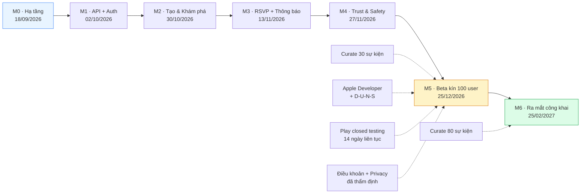
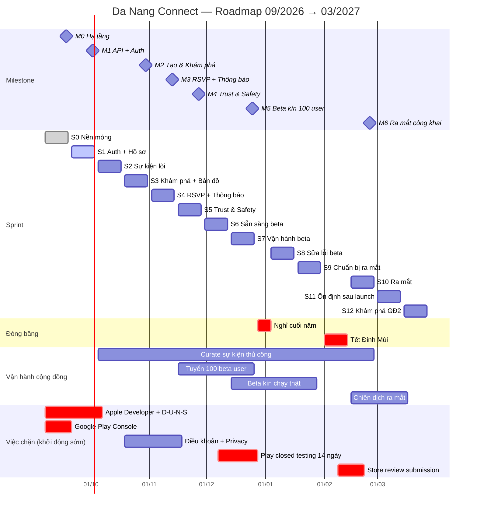
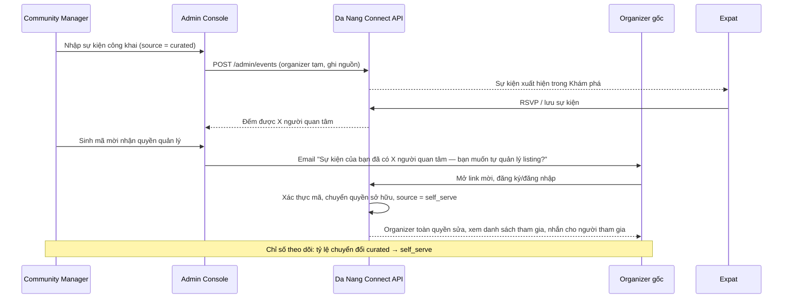

# 08 — Roadmap & Kế hoạch triển khai Da Nang Connect

> **Sản phẩm:** Da Nang Connect — nền tảng kết nối cộng đồng người nước ngoài (expat) tại Đà Nẵng.
> **Phạm vi tài liệu:** Roadmap kỹ thuật & vận hành từ **01/09/2026 → 31/03/2027**, tập trung vào Giai đoạn 1 (Kết nối cộng đồng) tới thời điểm ra mắt công khai tại Đà Nẵng.
> **Ngày lập:** 31/08/2026 · **Phiên bản:** 1.0 · **Trạng thái:** Sẵn sàng thực thi

---

## 1. Tóm tắt điều hành

| Hạng mục | Kết luận |
|---|---|
| Ngày khởi động | Thứ Hai **07/09/2026** (Sprint 0) |
| Ngày ra mắt công khai (M6) | Thứ Năm **25/02/2027**, sự kiện ra mắt cuối tuần 27–28/02/2027 |
| Tổng số sprint tới ra mắt | **11 sprint** (Sprint 0 → Sprint 10), mỗi sprint 2 tuần |
| Tổng khối lượng backlog MVP | **≈ 563 story point** (chưa gồm 15% dự phòng) |
| Đội ngũ khuyến nghị | **5,5 FTE** (Tech Lead, BE, FE, Mobile, Designer 0.5, QA 0.5, Community Manager 0.5) |
| Đội ngũ tối thiểu khả thi | **2 lập trình viên** + Founder kiêm PO/Community — bắt buộc cắt scope theo §10.2 |
| Ngân sách kịch bản đủ đội | **≈ 2,04 tỷ VND ≈ 78.500 USD** cho 7 tháng |
| Ngân sách kịch bản tinh gọn | **≈ 0,91 tỷ VND ≈ 35.000 USD** cho 7 tháng |
| Rủi ro chặn lớn nhất | Tài khoản Apple Developer (D‑U‑N‑S 2–4 tuần) và chính sách closed testing 14 ngày của Google Play |
| Chỉ số quyết định "ra mắt được" | ≥ 80 sự kiện thật đã curate, ≥ 100 beta user hoạt động, ≥ 8 organizer đã nhận quyền quản lý listing |

**Ba nguyên tắc chi phối toàn bộ roadmap này:**

1. **Nội dung đi trước tính năng.** Ứng dụng trống là rủi ro số 1 (cold-start nguồn cung, cung chỉ chiếm ~6% bài đăng). Công việc curate thủ công được đưa vào sprint như một hạng mục có người chịu trách nhiệm và có Definition of Done, không phải việc "làm thêm khi rảnh".
2. **Không scraping.** Mọi luồng nhập liệu từ nguồn ngoài đều là nhập tay qua Admin Curation Console, có ghi nhận nguồn và có đường chuyển giao cho organizer gốc.
3. **Hyperlocal là lợi thế cạnh tranh duy nhất được bảo vệ bằng kỹ thuật.** PostGIS + từ điển khu vực Đà Nẵng (Mỹ Khê, An Thượng, Mỹ An, Sơn Trà, Hải Châu, Ngũ Hành Sơn, Thanh Khê, Hòa Xuân, Nam Ô…) là hạng mục ưu tiên cao, không được cắt trong bất kỳ kịch bản nào.

---

## 2. Giả định lập kế hoạch

| # | Giả định | Ảnh hưởng nếu sai |
|---|---|---|
| A1 | Sprint 2 tuần, bắt đầu Thứ Hai, kết thúc Thứ Sáu. Demo chiều Thứ Sáu tuần thứ 2. | Lệch toàn bộ mốc ngày |
| A2 | Velocity đội đủ: 40 SP (Sprint 0, ramp-up) → 55 SP (Sprint 2 trở đi). Đội tinh gọn: 24–28 SP/sprint. | Kéo dài 2–4 sprint |
| A3 | Thang story point Fibonacci: 1, 2, 3, 5, 8, 13. 1 SP ≈ nửa ngày công của dev có kinh nghiệm với stack. | Sai lệch ước lượng |
| A4 | Nghỉ lễ đã trừ: Quốc khánh 02/09/2026, Tết Dương lịch 01/01/2027, **Tết Nguyên đán Đinh Mùi — mùng 1 rơi vào 06/02/2027**, đóng băng phát triển 01/02 → 12/02/2027. | Mất 2 tuần nếu quên |
| A5 | Đóng băng cuối năm 26/12/2026 → 03/01/2027 (đội nghỉ, nhưng beta vẫn chạy và vẫn có người trực sự cố). | Giảm 1 sprint |
| A6 | Tỷ giá quy đổi ngân sách: **1 USD = 26.000 VND**. | Sai số ngân sách ±5% |
| A7 | Ngôn ngữ mặc định của UI là **tiếng Anh**, tiếng Việt là ngôn ngữ thứ hai; i18n có ngay từ Sprint 0. | Làm lại toàn bộ chuỗi văn bản |
| A8 | Chỉ phục vụ **Đà Nẵng**. Không xây đa thành phố, nhưng data model đã có trường `city_id` để không phải migrate đau đớn về sau. | Nợ kỹ thuật khi mở rộng |

---

## 3. Bản đồ Milestone M0 → M6

| Mốc | Tên | Ngày chốt | Sprint | Điều kiện nghiệm thu (gate) |
|---|---|---|---|---|
| **M0** | Setup hạ tầng | **18/09/2026** | S0 | Môi trường staging chạy được; CI xanh; `GET /health` trả 200 từ tên miền staging; app dev build cài được trên máy thật (iOS + Android) |
| **M1** | API nền + Auth | **02/10/2026** | S1 | Đăng ký/đăng nhập bằng email + Google + Apple hoạt động end-to-end trên web và mobile; refresh token rotation có test; RBAC chặn đúng |
| **M2** | Tạo & khám phá sự kiện | **30/10/2026** | S2–S3 | Tạo sự kiện từ web và mobile; tìm kiếm + lọc theo loại hình/khu vực/thời gian/ngôn ngữ; bản đồ hiển thị đúng khu vực; trang chi tiết sự kiện có SEO/OG |
| **M3** | RSVP + Thông báo | **13/11/2026** | S4 | RSVP/hủy/waitlist đúng khi tranh chấp chỗ; push tới thiết bị thật; email xác nhận; nhắc T‑24h và T‑2h chạy đúng giờ |
| **M4** | Trust & Safety tối thiểu | **27/11/2026** | S5 | Report, block, hàng đợi kiểm duyệt, gỡ nội dung, ban tài khoản; Community Guidelines + Privacy Policy đã công bố; **trust level T0–T5** hiển thị trên hồ sơ |
| **M5** | Beta kín 100 user | **25/12/2026** | S6–S7 | 100 tài khoản beta thật; ≥ 60 sự kiện đã curate; TestFlight + Play closed testing chạy ổn định 14 ngày; crash-free session ≥ 99% |
| **M6** | Ra mắt công khai tại Đà Nẵng | **25/02/2027** | S9–S10 | App có mặt trên App Store + Google Play; web production; ≥ 80 sự kiện; ≥ 8 organizer tự quản lý listing; runbook sự cố đã diễn tập |

---

## 4. Timeline tổng thể theo tuần

### 4.1 Sơ đồ Gantt

### 4.2 Lịch tuần chi tiết

| Tuần | Ngày | Sprint | Trọng tâm | Mốc chạm |
|---|---|---|---|---|
| W01 | 07/09 – 11/09/2026 | S0 | Monorepo, Docker Compose, NestJS skeleton, đăng ký Apple/Google account | |
| W02 | 14/09 – 18/09/2026 | S0 | CI/CD, staging deploy, Expo dev build, i18n scaffolding | **M0 · 18/09** |
| W03 | 21/09 – 25/09/2026 | S1 | Auth email + JWT rotation, RBAC | |
| W04 | 28/09 – 02/10/2026 | S1 | Google/Apple/Facebook Sign-In, Auth UI web + mobile | **M1 · 02/10** |
| W05 | 05/10 – 09/10/2026 | S2 | Data model sự kiện + PostGIS, API tạo/sửa sự kiện, upload ảnh | |
| W06 | 12/10 – 16/10/2026 | S2 | Form tạo sự kiện web + mobile, trang chi tiết sự kiện | |
| W07 | 19/10 – 23/10/2026 | S3 | API search/filter, từ điển khu vực, truy vấn bán kính | |
| W08 | 26/10 – 30/10/2026 | S3 | Trang khám phá web + feed mobile + bản đồ | **M2 · 30/10** |
| W09 | 02/11 – 06/11/2026 | S4 | RSVP, capacity, waitlist, hàng đợi BullMQ | |
| W10 | 09/11 – 13/11/2026 | S4 | Expo Push, email transactional, WebSocket đếm chỗ realtime | **M3 · 13/11** |
| W11 | 16/11 – 20/11/2026 | S5 | Report/block, hàng đợi kiểm duyệt, trust level T0–T5 | |
| W12 | 23/11 – 27/11/2026 | S5 | Guidelines, quyền riêng tư, xuất/xóa dữ liệu, nhãn organizer đã xác minh | **M4 · 27/11** |
| W13 | 30/11 – 04/12/2026 | S6 | Admin Curation Console, luồng organizer nhận quyền quản lý listing | |
| W14 | 07/12 – 11/12/2026 | S6 | Hardening, EAS production build, nộp TestFlight + Play closed testing | |
| W15 | 14/12 – 18/12/2026 | S7 | Beta wave 1 (40 user), theo dõi telemetry, hotfix hằng ngày | |
| W16 | 21/12 – 25/12/2026 | S7 | Beta wave 2 (60 user), phỏng vấn 15 user, tổng kết beta | **M5 · 25/12** |
| — | 28/12 – 01/01/2027 | Đóng băng | Trực sự cố luân phiên, không release tính năng mới | |
| W17 | 04/01 – 08/01/2027 | S8 | Sửa lỗi beta ưu tiên P0/P1, tinh chỉnh onboarding | |
| W18 | 11/01 – 15/01/2027 | S8 | Tối ưu hiệu năng danh sách/bản đồ, giảm rớt phễu RSVP | |
| W19 | 18/01 – 22/01/2027 | S9 | Analytics funnel, SEO trang sự kiện, referral link | |
| W20 | 25/01 – 29/01/2027 | S9 | Release candidate, đóng gói tài sản cửa hàng, diễn tập runbook | |
| — | 01/02 – 12/02/2027 | Đóng băng | Tết Đinh Mùi. Chỉ trực sự cố P0. | |
| W21 | 15/02 – 19/02/2027 | S10 | Nộp store review, soft launch nội bộ, kiểm thử hồi quy đầy đủ | |
| W22 | 22/02 – 26/02/2027 | S10 | Ra mắt công khai, chiến dịch truyền thông, trực launch war-room | **M6 · 25/02** |
| W23 | 01/03 – 05/03/2027 | S11 | Ổn định sau ra mắt, xử lý phản hồi store | |
| W24 | 08/03 – 12/03/2027 | S11 | Vòng tăng trưởng: mời bạn bè, nhắc "tuần này có gì" | |
| W25 | 15/03 – 19/03/2027 | S12 | Thử nghiệm freemium (bộ lọc nâng cao), đo sẵn sàng trả phí | |
| W26 | 22/03 – 26/03/2027 | S12 | Khám phá Giai đoạn 2 (Nhà ở): nghiên cứu người dùng, phác thảo mô hình dữ liệu | |

---

## 5. Cấu trúc backlog: Epic → User Story → Task

### 5.1 Danh mục Epic

| Mã | Epic | Mốc chính | Story point | Chủ sở hữu chính |
|---|---|---|---|---|
| **E1** | Nền tảng & Hạ tầng | M0 | 54 | Tech Lead |
| **E2** | Định danh & Xác thực | M1 | 53 | Backend |
| **E3** | Hồ sơ cá nhân & Tín hiệu tin cậy | M1 / M4 | 42 | Backend |
| **E4** | Quản lý sự kiện | M2 | 84 | Backend + Frontend + Mobile |
| **E5** | Khám phá & Tìm kiếm hyperlocal | M2 | 83 | Backend + Frontend + Mobile |
| **E6** | RSVP & Điểm danh | M3 | 55 | Backend + Mobile |
| **E7** | Thông báo & Realtime | M3 | 57 | Backend + Mobile |
| **E8** | Trust & Safety | M4 | 39 | Backend |
| **E9** | Admin & Curation Console | M2 → M5 | 34 | Frontend |
| **E10** | i18n & Nội dung | Xuyên suốt | 11 | Frontend + Community |
| **E11** | Analytics & Tăng trưởng | M5 / M6 | 25 | Tech Lead |
| **E12** | Phát hành ứng dụng di động | M5 / M6 | 26 | Mobile |
| | **Tổng** | | **563** | |

**Ký hiệu vai trò:** `TL` Tech Lead · `BE` Backend · `FE` Frontend (web + admin) · `MB` Mobile · `DS` Designer · `QA` Kiểm thử · `CM` Community Manager · `PO` Product Owner (Founder)

---

### 5.2 E1 — Nền tảng & Hạ tầng (54 SP · M0)

| Story ID | User Story | SP | Vai trò | Sprint |
|---|---|---|---|---|
| E1-S1 | Là **dev**, tôi muốn một monorepo có chuẩn code thống nhất để mọi người viết cùng một phong cách. | 5 | TL | S0 |
| E1-S2 | Là **dev**, tôi muốn `docker compose up` dựng đủ Postgres 16 + PostGIS + Redis để chạy local trong 5 phút. | 5 | TL | S0 |
| E1-S3 | Là **dev**, tôi muốn bộ khung NestJS 11 với config theo môi trường và endpoint health check. | 5 | BE | S0 |
| E1-S4 | Là **dev**, tôi muốn TypeORM với migration và seed data để schema có phiên bản rõ ràng. | 5 | BE | S0 |
| E1-S5 | Là **dev**, tôi muốn bộ khung Next.js 15 App Router + Tailwind + design token. | 5 | FE | S0 |
| E1-S6 | Là **dev**, tôi muốn bộ khung Expo 54 + React Native 0.81 + điều hướng và một dev build cài được lên máy thật. | 8 | MB | S0 |
| E1-S7 | Là **dev**, tôi muốn CI GitHub Actions chạy lint + test + build trên mỗi pull request. | 5 | TL | S0 |
| E1-S8 | Là **dev**, tôi muốn merge vào `develop` là tự động deploy lên staging. | 8 | TL | S0 |
| E1-S9 | Là **dev trực sự cố**, tôi muốn Sentry và log tập trung để biết lỗi trước khi người dùng báo. | 3 | BE | S0 |
| E1-S10 | Là **expat**, tôi muốn giao diện mặc định tiếng Anh và đổi được sang tiếng Việt. | 5 | FE + MB | S0 |

**Phân rã task mẫu — E1-S2 (Docker Compose local):**

- [ ] `docker-compose.yml`: dịch vụ `postgres` (image `postgis/postgis:16-3.4`), `redis:7-alpine`, `api`, `web`
- [ ] Script `db:init` bật extension `postgis`, `pg_trgm`, `uuid-ossp`
- [ ] Named volume để dữ liệu không mất khi `down`
- [ ] `.env.example` đầy đủ biến, không commit secret thật
- [ ] Healthcheck cho từng service, `depends_on: condition: service_healthy`
- [ ] Tài liệu `README` phần "Chạy local trong 5 phút", có người thứ hai làm theo và xác nhận

---

### 5.3 E2 — Định danh & Xác thực (53 SP · M1)

| Story ID | User Story | SP | Vai trò | Sprint |
|---|---|---|---|---|
| E2-S1 | Là **expat mới**, tôi muốn đăng ký bằng email và xác minh email để tài khoản đáng tin. | 8 | BE | S1 |
| E2-S2 | Là **người dùng**, tôi muốn phiên đăng nhập được giữ an toàn với access token ngắn hạn và refresh token xoay vòng. | 8 | BE | S1 |
| E2-S3 | Là **expat**, tôi muốn đăng nhập bằng Google chỉ với một chạm. | 5 | BE + MB | S1 |
| E2-S4 | Là **người dùng iPhone**, tôi muốn đăng nhập bằng Apple (bắt buộc theo App Store Review Guideline 4.8 khi đã có social login khác). | 5 | MB + BE | S1 |
| E2-S5 | Là **expat quen dùng Facebook**, tôi muốn đăng nhập bằng Facebook để không phải tạo mật khẩu mới. | 3 | BE | S1 |
| E2-S6 | Là **người dùng quên mật khẩu**, tôi muốn đặt lại mật khẩu qua email trong 2 phút. | 3 | BE | S1 |
| E2-S7 | Là **quản trị viên**, tôi muốn enum role toàn cục `member` / `curator` / `moderator` / `admin` / `super_admin` được kiểm soát ở tầng guard, kết hợp thêm quan hệ theo sự kiện (`events.host_user_id`, `event_cohosts`) và `users.trust_level`. | 5 | BE | S1 |
| E2-S8 | Là **người dùng web**, tôi muốn màn đăng nhập/đăng ký rõ ràng, có trạng thái lỗi dễ hiểu bằng tiếng Anh. | 5 | FE | S1 |
| E2-S9 | Là **người dùng mobile**, tôi muốn đăng nhập một lần rồi giữ phiên, token lưu trong secure storage. | 8 | MB | S1 |
| E2-S10 | Là **hệ thống**, tôi muốn chặn dò mật khẩu và giới hạn tần suất gọi endpoint xác thực. | 3 | BE | S1 |

**Phân rã task mẫu — E2-S2 (JWT + refresh rotation):**

- [ ] BE: entity `refresh_token` (`id`, `user_id`, `token_hash`, `device_id`, `expires_at`, `revoked_at`, `replaced_by`)
- [ ] BE: `POST /api/v1/auth/refresh` — xoay token, thu hồi token cũ, phát hiện tái sử dụng token đã dùng → thu hồi cả họ token
- [ ] BE: `POST /api/v1/auth/logout` và `logout-all-devices`
- [ ] BE: access token TTL 15 phút, refresh TTL 30 ngày, ký RS256, khóa lưu ở biến môi trường
- [ ] BE: Redis denylist cho access token bị thu hồi sớm
- [ ] FE/MB: interceptor tự refresh khi gặp 401, có khóa chống refresh song song (single-flight)
- [ ] Test: unit cho service, e2e cho luồng refresh và luồng phát hiện tái sử dụng token
- [ ] Swagger: mô tả đầy đủ 4 endpoint

---

### 5.4 E3 — Hồ sơ cá nhân & Tín hiệu tin cậy (42 SP · M1/M4)

| Story ID | User Story | SP | Vai trò | Sprint |
|---|---|---|---|---|
| E3-S1 | Là **expat**, tôi muốn tạo hồ sơ có ảnh, giới thiệu ngắn, ngôn ngữ nói, khu vực đang ở và sở thích. | 8 | BE | S1 |
| E3-S2 | Là **người dùng**, tôi muốn tải ảnh lên nhanh và ảnh hiển thị mượt qua CDN. | 8 | BE | S2 |
| E3-S3 | Là **người sắp gặp người lạ**, tôi muốn thấy **trust level T0–T5** dựa trên tín hiệu có thật (email đã xác minh, số điện thoại đã xác minh, số hoạt động đã tham gia, tỷ lệ vắng mặt). | 8 | BE | S5 |
| E3-S4 | Là **khách web**, tôi muốn xem hồ sơ công khai của organizer trước khi đăng ký tham gia. | 5 | FE | S2 |
| E3-S5 | Là **người dùng mobile**, tôi muốn xem và sửa hồ sơ ngay trong app. | 8 | MB | S2 |
| E3-S6 | Là **người dùng muốn tăng độ tin cậy**, tôi muốn xác minh số điện thoại bằng OTP. | 5 | BE | S5 |

**Thiết kế trust level v1 (E3-S3) — thang duy nhất T0–T5 theo tài liệu 01, lưu ở `users.trust_level` kiểu `smallint` 0–5:**

| Bậc | Nhãn hiển thị | Điều kiện đạt bậc |
|---|---|---|
| **T0** | `New` | Vừa tạo tài khoản, chưa xác minh gì |
| **T1** | `Email verified` | Đã xác minh email |
| **T2** | `Phone verified` | Đã xác minh số điện thoại bằng OTP (E3-S6) |
| **T3** | `Active member` | T2 + đã điểm danh ≥ 3 occurrence + không có report được xác nhận trong 90 ngày |
| **T4** | `Trusted` | T3 + đã host ≥ 3 occurrence hoàn tất + tỷ lệ no-show ≤ 15% trong 10 lần gần nhất |
| **T5** | `Community leader` | T4 + được moderator/admin đề cử thủ công, xét lại mỗi quý |

**Tín hiệu thành phần — bảng `trust_signals` (append-only, không sửa/xoá):**

| `signal_type` | Trọng số | Nguồn phát sinh |
|---|---|---|
| `email_verified` | +1 bậc trần T1 | Module auth |
| `phone_verified` | +1 bậc trần T2 | Module auth (OTP) |
| `social_linked` | phụ trợ, không nâng bậc | Module auth |
| `avatar_approved` | phụ trợ | Hàng đợi kiểm duyệt UGC |
| `attendance_confirmed` | đếm tới ngưỡng T3 | Điểm danh QR (E6-S5) |
| `event_hosted_completed` | đếm tới ngưỡng T4 | Job đóng occurrence |
| `no_show_recorded` | trừ, kéo tụt bậc | Job đóng occurrence |
| `report_upheld` | trừ mạnh, hạ về T2 | Hàng đợi kiểm duyệt |
| `manual_promotion` | chỉ dùng cho T5 | Moderator / admin |

- [ ] Bậc tổng **không tính trực tiếp lúc ghi tín hiệu**; job BullMQ `trust-level-recompute` chạy mỗi giờ và chạy ngay sau `report_upheld`, đọc toàn bộ `trust_signals` của user rồi ghi lại `users.trust_level`
- [ ] Không dùng bất kỳ thang điểm 0–100 nào, không dùng enum `new/verified/established/trusted/ambassador`
- [ ] Hiển thị cho người dùng chỉ là nhãn ở cột "Nhãn hiển thị"; điểm thô và tín hiệu âm chỉ moderator thấy

---

### 5.5 E4 — Quản lý sự kiện (84 SP · M2)

| Story ID | User Story | SP | Vai trò | Sprint |
|---|---|---|---|---|
| E4-S1 | Là **hệ thống**, tôi cần mô hình dữ liệu sự kiện gắn toạ độ PostGIS và gắn khu vực Đà Nẵng. | 8 | BE | S2 |
| E4-S2 | Là **organizer**, tôi muốn tạo hoạt động (nháp → đăng) với tiêu đề, mô tả, loại hình, thời gian, địa điểm, sức chứa, ngôn ngữ, chi phí. | 8 | BE | S2 |
| E4-S3 | Là **organizer**, tôi muốn sửa hoặc huỷ hoạt động của mình và người đã đăng ký được thông báo. | 5 | BE | S2 |
| E4-S4 | Là **organizer**, tôi muốn thêm ảnh bìa và vài ảnh minh hoạ cho hoạt động. | 5 | BE | S2 |
| E4-S5 | Là **organizer của lớp học ngôn ngữ hằng tuần**, tôi muốn tạo hoạt động lặp lại theo tuần (sinh nhiều `event_occurrences` từ `recurrence_rule`) thay vì nhập lại mỗi lần. | 8 | BE | S3 |
| E4-S6 | Là **organizer trên web**, tôi muốn form tạo hoạt động nhiều bước, tự lưu nháp, xem trước trước khi đăng. | 13 | FE | S2 |
| E4-S7 | Là **organizer trên điện thoại**, tôi muốn tạo hoạt động ngay tại quán cà phê trong dưới 90 giây. | 13 | MB | S3 |
| E4-S8 | Là **khách chưa đăng nhập**, tôi muốn mở link sự kiện từ Facebook và thấy trang chi tiết đẹp, có OG image, đọc được không cần cài app. | 8 | FE | S3 |
| E4-S9 | Là **người dùng mobile**, tôi muốn xem chi tiết hoạt động và chia sẻ link deep-link cho bạn. | 8 | MB | S3 |
| E4-S10 | Là **organizer**, tôi muốn một trang quản lý các hoạt động của mình: sắp diễn ra, đã qua, nháp. | 8 | FE | S3 |

**Phân rã task mẫu — E4-S1 (mô hình dữ liệu sự kiện):**

| Bảng | Cột chính | Ghi chú |
|---|---|---|
| `events` | `id`, **`host_user_id`**, `title`, `description`, `category_id`, `timezone`, `price_amount`, `price_currency`, `language_codes[]`, `status`, `source`, `city_id`, `area_id`, `location` (`geography(Point,4326)`), `address_text`, `cover_image_id`, `recurrence_rule`, `published_at`, `cancelled_at` | Tên cột chủ sự kiện thống nhất là **`host_user_id`** (không dùng `creator_id`/`organizer_id`). `source` ∈ `self_serve` \| `curated` — bắt buộc để theo dõi tỷ lệ chuyển từ curate sang tự phục vụ |
| `event_occurrences` | `id`, `event_id`, `starts_at` (UTC), `ends_at` (UTC), `capacity`, `going_count`, `waitlist_count`, `status`, `cancelled_at` | **Mọi thời điểm diễn ra đều nằm ở đây.** Sự kiện không lặp lại vẫn có **đúng 1 occurrence** — không có ngoại lệ. RSVP gắn vào occurrence, không gắn vào `events` |
| `event_cohosts` | `id`, `event_id`, `user_id`, `role_in_event`, `added_by`, `created_at` | Quan hệ organizer theo sự kiện; `organizer` không phải role toàn cục |
| `event_categories` | `id`, `slug`, `name_en`, `name_vi`, `icon` | Seed: sports, language-exchange, social-meetup, food-drink, wellness, music-arts, outdoor, family, professional |
| `areas` | `id`, `city_id`, `slug`, `name_en`, `name_vi`, `boundary` (`geography(Polygon,4326)`), `centroid` | Seed thủ công cho Đà Nẵng |
| `event_images` | `id`, `event_id`, `storage_key`, `width`, `height`, `position` | Ảnh lưu S3-compatible |

- [ ] Index `GIST` trên `events.location`
- [ ] Index tổ hợp `(city_id, status)` trên `events` và `(event_id, starts_at)` trên `event_occurrences` cho truy vấn danh sách
- [ ] Index `GIN` trên `to_tsvector('english', title || ' ' || description)`
- [ ] Migration + seed 9 category + bảng `areas` phân cấp đầy đủ (`city` > `district` > `ward` > `micro_area`); **tập MVP hiển thị trong bộ lọc đúng 6 khu vực: An Thượng, Mỹ Khê, Mỹ An, Hải Châu, Sơn Trà, Ngũ Hành Sơn**
- [ ] Ràng buộc: `event_occurrences.ends_at > starts_at`, `capacity >= 0`; mọi giá trị enum trong DB viết **chữ thường snake_case**: `status` ∈ `draft|published|cancelled|completed`
- [ ] Trigger/hook đảm bảo mỗi `events` mới luôn sinh tối thiểu 1 `event_occurrences`

---

### 5.6 E5 — Khám phá & Tìm kiếm hyperlocal (83 SP · M2)

| Story ID | User Story | SP | Vai trò | Sprint |
|---|---|---|---|---|
| E5-S1 | Là **hệ thống**, tôi cần từ điển khu vực Đà Nẵng với ranh giới thật để lọc theo "An Thượng" cho ra đúng kết quả. | 5 | BE + PO | S2 |
| E5-S2 | Là **expat**, tôi muốn lọc hoạt động theo loại hình, khu vực, khoảng thời gian, ngôn ngữ và mức phí. | 13 | BE | S3 |
| E5-S3 | Là **expat đang ở Mỹ An**, tôi muốn xem hoạt động trong bán kính 2 km quanh tôi. | 8 | BE | S3 |
| E5-S4 | Là **expat**, tôi muốn gõ "badminton" và thấy ngay các buổi cầu lông sắp tới. | 5 | BE | S3 |
| E5-S5 | Là **khách web**, tôi muốn trang khám phá có bộ lọc dạng chip, sắp xếp theo thời gian/khoảng cách, tải thêm mượt. | 13 | FE | S3 |
| E5-S6 | Là **khách web**, tôi muốn xem bản đồ Đà Nẵng với các điểm hoạt động gom cụm theo khu vực. | 8 | FE | S3 |
| E5-S7 | Là **người dùng mobile**, tôi muốn feed khám phá và bảng lọc kéo lên từ dưới. | 13 | MB | S3 |
| E5-S8 | Là **người dùng mobile**, tôi muốn chuyển giữa chế độ danh sách và bản đồ. | 8 | MB | S4 |
| E5-S9 | Là **expat**, tôi muốn một câu trả lời cho câu hỏi "tuần này có gì diễn ra" ngay ở màn hình đầu. | 5 | FE + MB | S4 |
| E5-S10 | Là **người dùng quay lại**, tôi muốn lưu bộ lọc yêu thích và lưu hoạt động để xem sau. | 5 | BE + FE | S4 |

**Danh sách khu vực seed cho Đà Nẵng (E5-S1)** — bảng `areas` thiết kế phân cấp đầy đủ (`city` > `district` > `ward` > `micro_area`) và có thể seed nhiều hơn, nhưng **tập MVP hiển thị trong bộ lọc đúng 6 khu vực** được đánh dấu **MVP**:

| Slug | Tên hiển thị (EN) | Vì sao có mặt |
|---|---|---|
| `an-thuong` | **An Thuong · MVP** | Trung tâm sinh hoạt của expat, mật độ quán/coworking cao nhất |
| `my-khe` | **My Khe Beach · MVP** | Thể thao bãi biển, chạy bộ, bóng chuyền |
| `my-an` | **My An · MVP** | Khu ở dài hạn phổ biến của digital nomad |
| `son-tra` | **Son Tra · MVP** | Hoạt động ngoài trời, leo núi, xe máy |
| `hai-chau` | **Hai Chau · MVP** | Trung tâm hành chính, quán cà phê làm việc, sự kiện chuyên môn |
| `thanh-khe` | Thanh Khe | Khu dân cư, phòng gym, sân thể thao |
| `ngu-hanh-son` | **Ngu Hanh Son · MVP** | Gần Non Nước, yoga/wellness |
| `hoa-xuan` | Hoa Xuan | Khu ở gia đình, sân bóng |
| `nam-o` | Nam O | Bãi biển phía Bắc, hoạt động cuối tuần |
| `lien-chieu` | Lien Chieu | Gần đại học, trao đổi ngôn ngữ |
| `cam-le` | Cam Le | Khu ở giá rẻ, cầu lông/bóng bàn |
| `city-wide` | City-wide / Online | Hoạt động không gắn một khu cụ thể |

**Phân rã task mẫu — E5-S2 (API tìm kiếm & lọc):**

- [ ] `GET /api/v1/events` với query: `q`, `categories[]`, `areas[]`, `from`, `to`, `languages[]`, `priceMax`, `lat`, `lng`, `radiusKm`, `sort` (`starts_at` \| `distance` \| `popularity`), `cursor`, `limit`
- [ ] Phân trang bằng cursor (`starts_at`, `id`) — không dùng OFFSET vì danh sách thay đổi liên tục
- [ ] Query builder gộp điều kiện; khi có `lat/lng` dùng `ST_DWithin` trên cột `geography`
- [ ] Cache Redis theo khoá băm của bộ lọc, TTL 60s; huỷ cache khi có sự kiện mới publish trong cùng khu vực
- [ ] Trả kèm `facets`: số lượng theo category và theo area để hiển thị chip có badge số
- [ ] Test hiệu năng: 10.000 sự kiện giả lập, p95 < 200 ms
- [ ] Swagger + ví dụ request/response

---

### 5.7 E6 — RSVP & Điểm danh (55 SP · M3)

| Story ID | User Story | SP | Vai trò | Sprint |
|---|---|---|---|---|
| E6-S1 | Là **hệ thống**, tôi cần mô hình RSVP có sức chứa và danh sách chờ. | 8 | BE | S4 |
| E6-S2 | Là **expat**, tôi muốn đăng ký tham gia hoặc rút đăng ký, và không bao giờ bị nhận chỗ vượt sức chứa. | 8 | BE | S4 |
| E6-S3 | Là **người trong danh sách chờ**, tôi muốn được đôn lên tự động khi có người rút. **(MUST của MVP — không được hoãn qua M3)** | 5 | BE | S4 |
| E6-S4 | Là **người sắp đi**, tôi muốn thấy ai đã đăng ký — trong giới hạn quyền riêng tư mà họ chọn. | 5 | BE | S4 |
| E6-S5 | Là **organizer**, tôi muốn điểm danh nhanh tại chỗ bằng mã QR. | 8 | BE + MB | S6 |
| E6-S6 | Là **cộng đồng**, tôi muốn người hay đăng ký rồi không đến bị ghi `no_show_recorded` vào `trust_signals` và kéo tụt trust level. | 5 | BE | S5 |
| E6-S7 | Là **khách web**, tôi muốn đăng ký tham gia ngay trên trang chi tiết, thấy số chỗ còn lại. | 5 | FE | S4 |
| E6-S8 | Là **người dùng mobile**, tôi muốn thấy số chỗ còn lại cập nhật realtime khi người khác đăng ký. | 8 | MB | S4 |
| E6-S9 | Là **organizer**, tôi muốn xuất danh sách người tham gia ra CSV. | 3 | FE | S6 |

**Phân rã task mẫu — E6-S2 (RSVP an toàn khi tranh chấp chỗ):**

- [ ] Bảng **`rsvps`** (`id`, **`occurrence_id`**, `user_id`, `status` ∈ `going|waitlisted|cancelled|checked_in|no_show`, `guest_count`, `position`, `created_at`, `cancelled_at`), unique `(occurrence_id, user_id)` — RSVP gắn vào `event_occurrences`, **không** gắn vào `events`
- [ ] Cột đếm phi chuẩn hoá `event_occurrences.going_count` / `waitlist_count` cập nhật trong cùng transaction
- [ ] Dùng `SELECT ... FOR UPDATE` trên hàng `event_occurrences` khi nhận chỗ để tránh vượt sức chứa (tính cả `guest_count`)
- [ ] Kiểm thử tải: 200 request RSVP đồng thời vào sự kiện có 50 chỗ → đúng 50 `going`, phần còn lại `waitlisted`
- [ ] Bắn sự kiện domain `rsvp.created` / `rsvp.cancelled` vào BullMQ để module thông báo tiêu thụ
- [ ] Endpoint công khai: `POST /api/v1/occurrences/{occurrenceId}/rsvps`, `DELETE /api/v1/occurrences/{occurrenceId}/rsvps/me`, `GET /api/v1/occurrences/{occurrenceId}/attendees`
- [ ] Đường tắt giữ lại: `POST /api/v1/events/{eventId}/rsvps` tự trỏ tới occurrence gần nhất sắp diễn ra của event; trả **409** nếu event có nhiều occurrence sắp tới
- [ ] Chặn RSVP với sự kiện đã bắt đầu hoặc đã huỷ

---

### 5.8 E7 — Thông báo & Realtime (57 SP · M3)

| Story ID | User Story | SP | Vai trò | Sprint |
|---|---|---|---|---|
| E7-S1 | Là **hệ thống**, tôi cần hàng đợi BullMQ trên Redis với worker riêng và cơ chế retry. | 5 | BE | S4 |
| E7-S2 | Là **hệ thống**, tôi cần dịch vụ thông báo có template song ngữ EN/VI và chọn ngôn ngữ theo người nhận. | 8 | BE | S4 |
| E7-S3 | Là **người dùng mobile**, tôi muốn nhận push khi hoạt động tôi đăng ký có thay đổi. | 8 | BE + MB | S4 |
| E7-S4 | Là **người dùng**, tôi muốn nhận email xác nhận sau khi đăng ký và email nhắc trước 24 giờ. | 5 | BE | S4 |
| E7-S5 | Là **người xem trang sự kiện**, tôi muốn số chỗ còn lại và số người tham gia cập nhật ngay không cần tải lại. | 13 | BE | S4 |
| E7-S6 | Là **người dùng**, tôi muốn một trung tâm thông báo trong app để không bỏ lỡ gì. | 8 | MB + FE | S5 |
| E7-S7 | Là **người dùng**, tôi muốn tắt riêng từng loại thông báo thay vì tắt tất cả. | 5 | FE + MB | S5 |
| E7-S8 | Là **người đã đăng ký**, tôi muốn được nhắc trước 24 giờ và trước 2 giờ để không quên. | 5 | BE | S5 |

**Ma trận thông báo (E7-S2):**

| Sự kiện kích hoạt | Push | Email | In-app | Người nhận |
|---|---|---|---|---|
| RSVP thành công | — | ✅ | ✅ | Người đăng ký |
| Có người đăng ký hoạt động của bạn | ✅ | — | ✅ | Organizer |
| Được đôn từ danh sách chờ lên tham gia | ✅ | ✅ | ✅ | Người trong danh sách chờ |
| Hoạt động bị sửa thời gian/địa điểm | ✅ | ✅ | ✅ | Tất cả người đã đăng ký |
| Hoạt động bị huỷ | ✅ | ✅ | ✅ | Tất cả người đã đăng ký |
| Nhắc T‑24h | ✅ | ✅ | — | Người đã đăng ký |
| Nhắc T‑2h | ✅ | — | — | Người đã đăng ký |
| Tóm tắt "tuần này có gì" (Thứ Năm 18:00) | ✅ | ✅ | — | Người dùng đã bật |
| Lời mời nhận quyền quản lý listing | — | ✅ | — | Organizer gốc |

---

### 5.9 E8 — Trust & Safety (39 SP · M4)

| Story ID | User Story | SP | Vai trò | Sprint |
|---|---|---|---|---|
| E8-S1 | Là **người dùng**, tôi muốn báo cáo một hoạt động hoặc một người có hành vi không phù hợp. | 5 | BE | S5 |
| E8-S2 | Là **người dùng**, tôi muốn chặn một người để không thấy nội dung của họ và họ không nhắn được cho tôi. | 5 | BE | S5 |
| E8-S3 | Là **moderator**, tôi muốn hàng đợi kiểm duyệt xếp theo mức độ nghiêm trọng và thời gian chờ. | 8 | BE + FE | S5 |
| E8-S4 | Là **moderator**, tôi muốn ẩn nội dung, gỡ hoạt động hoặc khoá tài khoản, có ghi lại lý do và người thực hiện. | 5 | BE | S5 |
| E8-S5 | Là **người dùng mới**, tôi muốn đọc Community Guidelines rõ ràng và đồng ý trước khi tham gia. | 3 | FE + PO | S5 |
| E8-S6 | Là **hệ thống**, tôi muốn chặn spam: giới hạn số hoạt động tạo mỗi ngày, lọc từ khoá, chặn link đáng ngờ. | 5 | BE | S5 |
| E8-S7 | Là **người dùng**, tôi muốn tải về dữ liệu của mình và yêu cầu xoá tài khoản. | 5 | BE | S6 |
| E8-S8 | Là **expat cẩn trọng**, tôi muốn thấy nhãn "Verified organizer" để biết ai đã được kiểm chứng. | 3 | BE | S5 |

**Mức độ ưu tiên xử lý report (SLA nội bộ, E8-S3):**

| Loại report | Mức | SLA phản hồi | Hành động mặc định |
|---|---|---|---|
| Nguy cơ an toàn thân thể, quấy rối | P0 | 2 giờ | Ẩn ngay, khoá tạm tài khoản, moderator xem xét |
| Lừa đảo, đòi tiền, link độc hại | P0 | 2 giờ | Gỡ hoạt động, chặn link |
| Nội dung khiêu dâm / thù ghét | P1 | 12 giờ | Ẩn, cảnh cáo |
| Spam, đăng trùng, quảng cáo trá hình | P2 | 48 giờ | Ẩn, giới hạn tần suất |
| Thông tin sai (địa điểm/giờ) | P3 | 72 giờ | Liên hệ organizer sửa |

---

### 5.10 E9 — Admin & Curation Console (34 SP · M2 → M5)

| Story ID | User Story | SP | Vai trò | Sprint |
|---|---|---|---|---|
| E9-S1 | Là **admin**, tôi muốn khu vực quản trị riêng, đăng nhập tách biệt, có audit log. | 5 | FE + BE | S3 |
| E9-S2 | Là **Community Manager**, tôi muốn nhập một sự kiện công khai đã thấy ngoài đời vào hệ thống trong dưới 3 phút, có ghi nguồn và gán organizer tạm. | 8 | FE + BE | S6 |
| E9-S3 | Là **Community Manager**, tôi muốn gửi lời mời để organizer gốc nhận quyền quản lý listing của họ. | 8 | BE + FE | S6 |
| E9-S4 | Là **admin**, tôi muốn quản lý người dùng, khu vực và loại hình hoạt động. | 5 | FE | S6 |
| E9-S5 | Là **Founder**, tôi muốn một bảng điều khiển vận hành: hoạt động tuần này, số RSVP, report đang chờ, tỷ lệ chuyển đổi organizer. | 8 | FE | S6 |

**Luồng chuyển organizer từ bị động sang chủ động (E9-S3):**

---

### 5.11 E10 — i18n & Nội dung (11 SP)

| Story ID | User Story | SP | Vai trò | Sprint |
|---|---|---|---|---|
| E10-S1 | Là **dev**, tôi muốn khoá i18n được đặt theo namespace nhất quán giữa web và mobile. | 3 | FE | S0 |
| E10-S2 | Là **người dùng Việt**, tôi muốn bản dịch tiếng Việt tự nhiên, không phải dịch máy. | 5 | PO + CM | S8 |
| E10-S3 | Là **người mới**, tôi muốn trang About / FAQ / Community Guidelines song ngữ. | 3 | CM | S6 |

---

### 5.12 E11 — Analytics & Tăng trưởng (25 SP)

| Story ID | User Story | SP | Vai trò | Sprint |
|---|---|---|---|---|
| E11-S1 | Là **Founder**, tôi cần một lược đồ sự kiện phân tích thống nhất giữa web và mobile. | 5 | BE | S6 |
| E11-S2 | Là **Founder**, tôi muốn tích hợp công cụ phân tích sản phẩm và xem phễu thực tế. | 5 | TL | S8 |
| E11-S3 | Là **Founder**, tôi muốn báo cáo tuần tự động về hoạt động, RSVP, giữ chân người dùng. | 5 | TL + PO | S9 |
| E11-S4 | Là **người dùng hài lòng**, tôi muốn mời bạn bằng một link và được ghi nhận. | 5 | BE + FE | S9 |
| E11-S5 | Là **expat tìm Google "things to do in Da Nang this week"**, tôi muốn thấy trang sự kiện của nền tảng. | 5 | FE | S9 |

**Lược đồ sự kiện phân tích tối thiểu (E11-S1):**

`app_open` · `signup_started` · `signup_completed` · `discover_viewed` · `filter_applied` (props: `area`, `category`) · `event_viewed` (`source`) · `rsvp_started` · `rsvp_completed` · `rsvp_cancelled` · `event_create_started` · `event_create_published` · `notification_opened` · `share_clicked` · `organizer_claim_opened` · `organizer_claim_completed`

---

### 5.13 E12 — Phát hành ứng dụng di động (26 SP)

| Story ID | User Story | SP | Vai trò | Sprint |
|---|---|---|---|---|
| E12-S1 | Là **dev**, tôi muốn 3 profile EAS Build (`development`, `preview`, `production`) và versioning tự động. | 5 | MB | S0 |
| E12-S2 | Là **người dùng**, tôi muốn app có icon, splash và ảnh cửa hàng chỉn chu. | 3 | DS | S6 |
| E12-S3 | Là **beta tester**, tôi muốn cài app qua TestFlight hoặc Play closed testing. | 5 | MB | S6 |
| E12-S4 | Là **người tìm app**, tôi muốn mô tả cửa hàng song ngữ, ảnh chụp màn hình rõ giá trị. | 5 | MB + PO | S9 |
| E12-S5 | Là **dev**, tôi muốn đẩy bản vá nhanh qua EAS Update mà không cần chờ duyệt cửa hàng. | 3 | MB | S6 |
| E12-S6 | Là **Founder**, tôi muốn app được duyệt và có mặt trên cả hai cửa hàng đúng ngày ra mắt. | 5 | MB | S10 |
