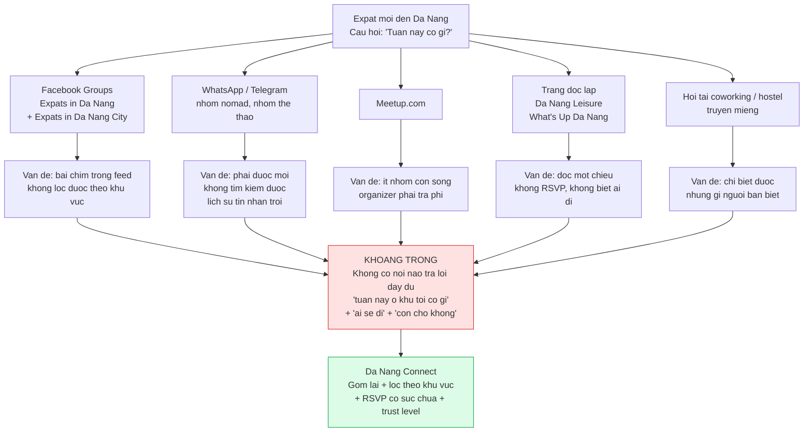
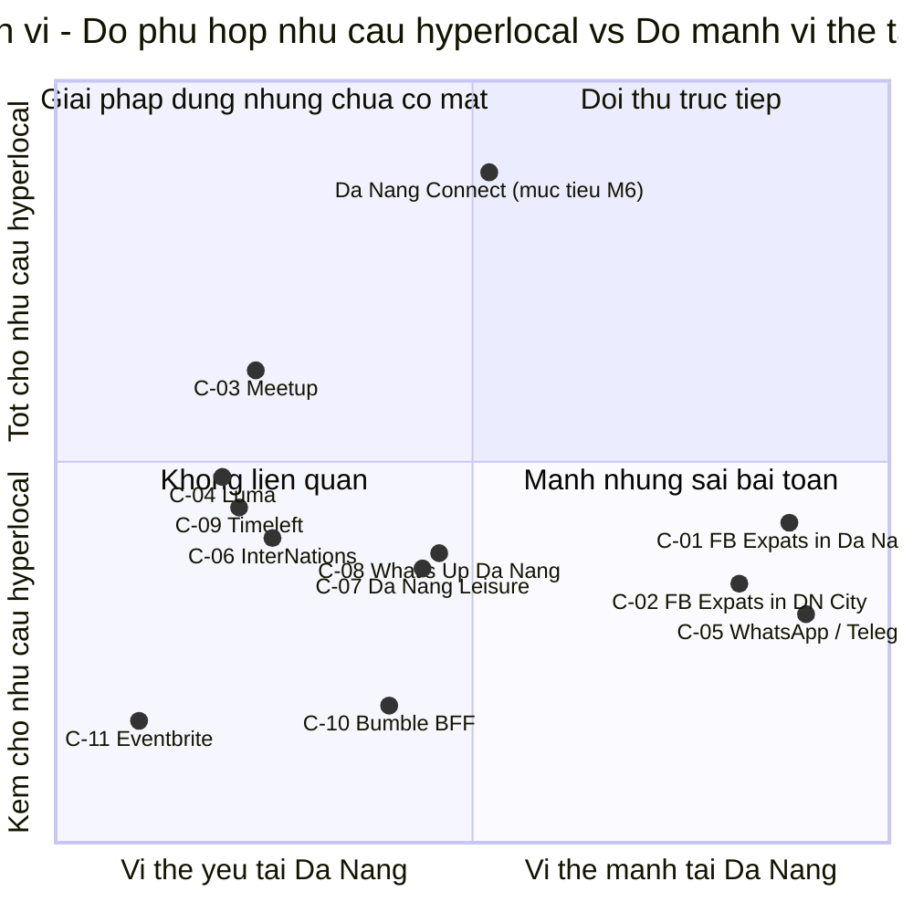
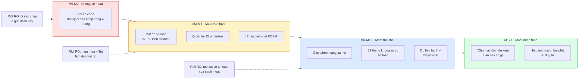
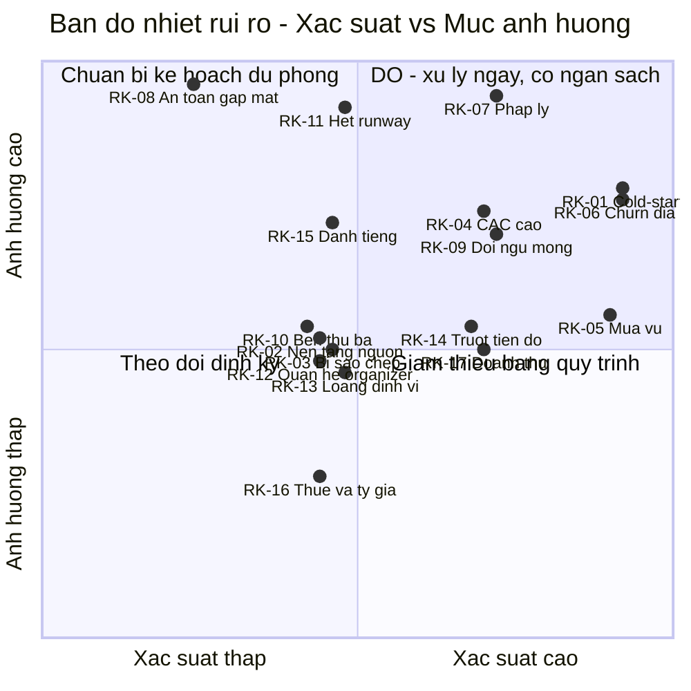
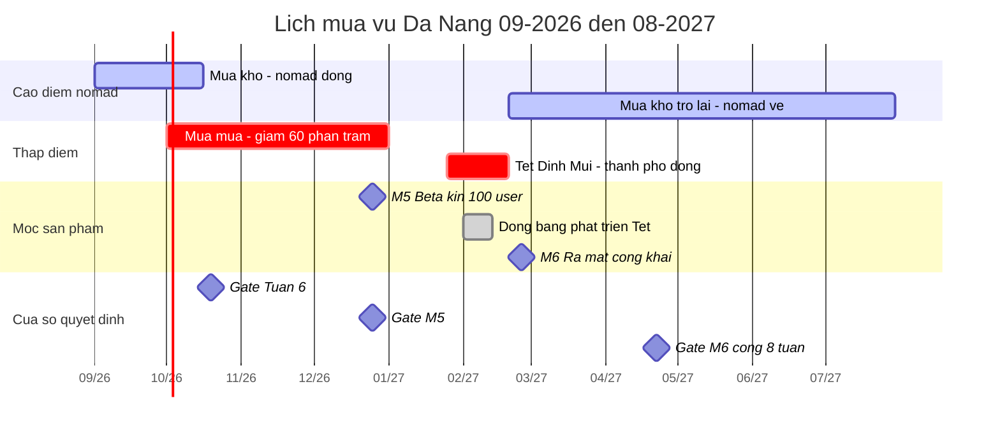
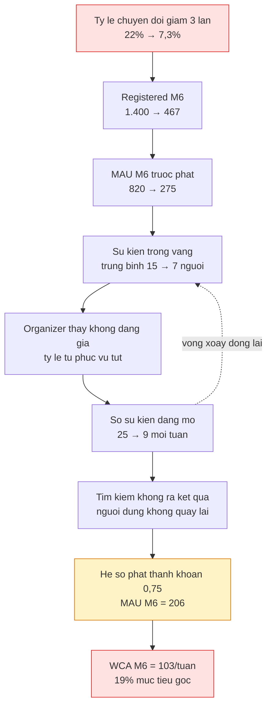
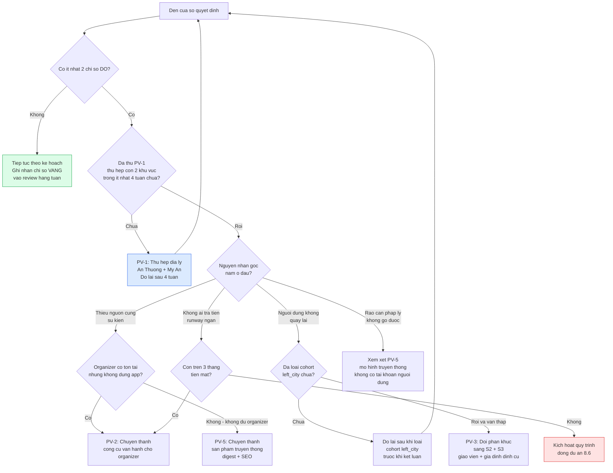
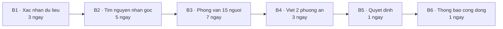

# 09 — Phân tích Cạnh tranh & Rủi ro — Da Nang Connect

> **Sản phẩm:** Da Nang Connect — nền tảng kết nối cộng đồng người nước ngoài (expat) tại Đà Nẵng.
> **Phạm vi tài liệu:** Giai đoạn 1 (Kết nối cộng đồng: sự kiện, thể thao, trao đổi ngôn ngữ), cửa sổ 09/2026 → 03/2027, chỉ thị trường Đà Nẵng.
> **Ngày lập:** 31/08/2026 · **Phiên bản:** 1.0 · **Chu kỳ rà soát:** risk register rà soát thứ Hai hằng tuần, đối thủ rà soát ngày 01 hằng tháng.
> **Tài liệu liên quan:** `docs/analysis/05-trust-safety-va-kiem-duyet.md` (rủi ro an toàn nội dung, mã `R-xx`), `docs/analysis/06-phap-ly-va-tuan-thu-viet-nam.md` (khung pháp lý), `docs/analysis/07-go-to-market-da-nang.md` (thị trường, kênh, phễu seed), `docs/analysis/08-roadmap-va-ke-hoach-trien-khai.md` (mốc M0–M6, ngân sách).

> ⚠️ **Không trùng mã:** tài liệu 05 dùng mã `R-01 … R-14` cho **rủi ro an toàn & nội dung ở cấp người dùng**. Tài liệu này dùng mã `RK-01 … RK-17` cho **rủi ro cấp doanh nghiệp**. Bảng tra cứu chéo ở Phụ lục A.

---

## Mục lục

1. [Tóm tắt điều hành](#1-tóm-tắt-điều-hành)
2. [Khung phân tích và quy ước chấm điểm](#2-khung-phân-tích-và-quy-ước-chấm-điểm)
3. [Phân tích từng đối thủ](#3-phân-tích-từng-đối-thủ)
4. [Bảng so sánh tính năng](#4-bảng-so-sánh-tính-năng)
5. [Vì sao chưa ai làm được và rào cản gia nhập thật sự](#5-vì-sao-chưa-ai-làm-được-và-rào-cản-gia-nhập-thật-sự)
6. [Risk register](#6-risk-register)
7. [Phân tích độ nhạy](#7-phân-tích-độ-nhạy)
8. [Ngưỡng thất bại và điều kiện xoay trục](#8-ngưỡng-thất-bại-và-điều-kiện-xoay-trục)
9. [Theo dõi cạnh tranh liên tục](#9-theo-dõi-cạnh-tranh-liên-tục)
10. [Phụ lục](#10-phụ-lục)

---

## 1. Tóm tắt điều hành

### 1.1. Chín kết luận cần nhớ

| # | Kết luận | Hệ quả hành động ngay |
|---|---|---|
| 1 | **Đối thủ thật không phải Meetup.** Đối thủ thật là **thói quen mở Facebook** và **hai nhóm chat riêng tư** mà người dùng đã ở trong đó. Cả hai đều miễn phí, đã có sẵn bạn bè, và không tốn một lần cài app. | Mọi thông điệp phải trả lời câu "tại sao tôi phải mở thêm một app nữa", không phải "tại sao app này tốt hơn Meetup". |
| 2 | **Đối thủ bị đánh giá thấp nhất là WhatsApp/Telegram groups** (điểm đe dọa 15/20, ngang Facebook). Nhóm chat thể thao pickup là nơi nhu cầu ad-hoc — chính insight lõi của brief — đang được phục vụ **đủ tốt** và hoàn toàn miễn phí. | Không cạnh tranh trực diện với nhóm chat. Chiến thuật là **giảm việc cho admin nhóm** (đồng bộ lịch, ai đi ai không), không phải kéo thành viên ra khỏi nhóm. |
| 3 | **Không có đối thủ nào có động cơ phản ứng.** Meetup, Luma, Eventbrite, InterNations đều không đủ doanh thu tiềm năng ở một thành phố 15.000 người nước ngoài để phân bổ nguồn lực. Điểm D4 (khả năng phản ứng) của họ đều ≤ 3/5. | Rủi ro cạnh tranh thật không đến từ 11 cái tên trong tài liệu này, mà từ **một người expat khác cũng có cùng ý tưởng** — RK-03. |
| 4 | **Rào cản gia nhập bằng công nghệ gần bằng 0.** Toàn bộ MVP là 563 story point, hai lập trình viên làm được trong 4–5 tháng. Rào cản thật là **mật độ nội dung sống trong bán kính 1,5 km**, **quan hệ với ~25 organizer**, và **pháp nhân + giấy phép mạng xã hội tại Việt Nam**. | Ưu tiên ngân sách và thời gian của founder theo đúng thứ tự đó, không theo thứ tự tính năng. |
| 5 | **Ba rủi ro Đỏ (điểm ≥ 16):** RK-01 cold-start hai phía (20), RK-07 pháp lý — đặc biệt yêu cầu xác thực số điện thoại Việt Nam (20), RK-06 churn địa lý của phân khúc seed (20). Cả ba đều **có thể giết dự án**, không chỉ làm chậm. | Ba rủi ro này phải có báo cáo trạng thái riêng trong review thứ Hai hằng tuần, không gộp chung. |
| 6 | **Mục tiêu 550 WCA ở M6 đòi hỏi một giả định hành vi rất mạnh** — trung bình 5,2 lượt tham dự/tháng trên mỗi người dùng có RSVP. Kiểm tra chéo phía cung: cần **~31 sự kiện đang mở mỗi tuần**, trong khi gate M6 ở tài liệu 08 chỉ yêu cầu **80 sự kiện tích lũy**. | Đổi gate M6 từ chỉ tiêu tồn kho (80 sự kiện) sang chỉ tiêu dòng chảy (**≥ 25 sự kiện đang mở/tuần**). Xem §7.1. |
| 7 | **Nếu tỷ lệ chuyển đổi thấp hơn 3 lần**, mốc 100 seed user trong 6 tuần là **bất khả thi về mặt năng lực vật lý** — không phải vì thiếu ngân sách mà vì hai người không thể thực hiện 33 cuộc trò chuyện có ý nghĩa mỗi ngày. Kết quả thực tế: 35–40 seed user. | Không cứu bằng cách tăng ngân sách quảng cáo. Cứu bằng cách đổi đơn vị tiếp xúc từ 1-1 sang **1-nhiều** (sự kiện signature lớn hơn, ít hơn). Xem §7.2. |
| 8 | **Ngưỡng cấp phép mạng xã hội (> 1.000 người dùng thường xuyên/tháng) sẽ bị chạm trước mục tiêu tăng trưởng.** Ở kịch bản cơ sở, ngưỡng bị chạm khoảng M6–M7 — nghĩa là hồ sơ giấy phép phải nộp **trước khi** đạt mục tiêu MAU, không phải sau. | Khởi động hồ sơ giấy phép ở M4 (11/2026), không đợi tới khi chạm ngưỡng. |
| 9 | **Có 3 ngưỡng thất bại cứng và 6 phương án xoay trục đã xếp hạng.** Phương án xoay trục hợp lý nhất nếu Giai đoạn 1 không đạt: **không nhảy sang Nhà ở**, mà thu hẹp thành công cụ vận hành cho organizer (B2B nhỏ). Xem §8.4. | Quyết định xoay trục chỉ được ra ở đúng 3 thời điểm: cuối Tuần 6, cuối M5, cuối M6 + 8 tuần. |

### 1.2. Bản đồ nhu cầu hiện tại — nơi expat Đà Nẵng đang đi trước khi có Da Nang Connect



**Đọc sơ đồ này thế nào:** năm ô vấn đề `P1`–`P5` là năm lý do tồn tại của sản phẩm. Nếu một tính năng trong backlog không giải quyết trực tiếp một trong năm ô đó, nó không thuộc MVP.

---

## 2. Khung phân tích và quy ước chấm điểm

### 2.1. Thang độ tin cậy dữ liệu (kế thừa từ `docs/analysis/07-go-to-market-da-nang.md`)

| Nhãn | Nghĩa | Cách dùng trong tài liệu này |
|---|---|---|
| `A` | Số liệu công bố hoặc đo trực tiếp được | Dùng làm neo cho quyết định |
| `B` | Suy ra từ nguồn công khai + giả định có cơ sở | Dùng được nhưng phải kiểm định trong 90 ngày |
| `C` | Ước lượng chuyên gia / quan sát cộng đồng | Chỉ dùng kiểm tra tính hợp lý |

> **Cảnh báo bắt buộc đọc:** toàn bộ đánh giá về đối thủ ở §3 mang nhãn `B` hoặc `C`. Chúng được lập từ hiểu biết về mô hình sản phẩm của từng nền tảng và bối cảnh Đà Nẵng, **không phải từ kiểm chứng thực địa**. Checklist kiểm chứng ở §9.2 phải được thực hiện trong Tuần 0 trước khi dùng bất kỳ con số nào ở đây cho quyết định đầu tư hoặc trình bày với nhà đầu tư.

### 2.2. Thang chấm mức độ đe dọa của đối thủ

Bốn tiêu chí, mỗi tiêu chí 1–5 điểm, tổng tối đa 20.

| Mã | Tiêu chí | 1 điểm | 5 điểm |
|---|---|---|---|
| **D1** | Chồng lấn nhu cầu (job-to-be-done) | Phục vụ nhu cầu hoàn toàn khác | Phục vụ đúng nhu cầu "tuần này ở khu tôi có gì" |
| **D2** | Mật độ hiện diện tại Đà Nẵng | Gần như không có người dùng ở Đà Nẵng | Gần như 100% phân khúc mục tiêu đang dùng |
| **D3** | Chi phí chuyển đổi họ tạo ra | Rời đi không mất gì | Rời đi là mất bạn bè, lịch sử, danh tiếng |
| **D4** | Khả năng & động cơ phản ứng nếu ta thành công | Không biết ta tồn tại, không quan tâm | Có tiền, có đội, và Đà Nẵng nằm trong kế hoạch của họ |

| Tổng điểm | Mức đe dọa | Xử lý |
|---|---|---|
| 15 – 20 | 🔴 **Cao** | Phải có chiến lược đối phó viết thành văn + chỉ số theo dõi hằng tháng |
| 9 – 14 | 🟠 **Trung bình** | Theo dõi hằng quý, có phương án nếu tình huống thay đổi |
| ≤ 8 | 🟡 **Thấp** | Ghi nhận, không phân bổ nguồn lực |

### 2.3. Thang chấm rủi ro doanh nghiệp

**Xác suất (P)** — khả năng rủi ro xảy ra ở mức đáng kể trong 12 tháng tới (09/2026 → 09/2027):

| P | Nhãn | Khoảng xác suất |
|---|---|---|
| 1 | Rất thấp | < 10% |
| 2 | Thấp | 10 – 25% |
| 3 | Trung bình | 25 – 50% |
| 4 | Cao | 50 – 75% |
| 5 | Gần như chắc chắn | > 75% |

**Mức ảnh hưởng (I)** — quy đổi về ba trục, lấy trục nặng nhất:

| I | Nhãn | Tài chính | Tiến độ | Chiến lược |
|---|---|---|---|---|
| 1 | Không đáng kể | < 50 tr VND | < 1 tuần | Không ảnh hưởng |
| 2 | Nhỏ | 50 – 150 tr VND | 1 – 2 tuần | Điều chỉnh chiến thuật |
| 3 | Trung bình | 150 – 400 tr VND | 2 – 6 tuần | Phải cắt scope |
| 4 | Lớn | 400 tr – 1 tỷ VND | 6 – 12 tuần | Phải xoay trục một phần |
| 5 | Nghiêm trọng | > 1 tỷ VND | > 12 tuần | Dừng hoặc xoay trục toàn phần |

**Điểm rủi ro = P × I.** Phân loại:

| Điểm | Mức | Yêu cầu bắt buộc |
|---|---|---|
| 16 – 25 | 🔴 Đỏ | Kế hoạch dự phòng viết sẵn, có ngân sách phân bổ, báo cáo trạng thái riêng hằng tuần |
| 9 – 15 | 🟠 Cam | Có biện pháp giảm thiểu và người chịu trách nhiệm, review 2 tuần/lần |
| 4 – 8 | 🟡 Vàng | Có dấu hiệu cảnh báo sớm được theo dõi, review hằng tháng |
| 1 – 3 | 🟢 Xanh | Ghi nhận trong register, review hằng quý |

### 2.4. Danh sách chủ sở hữu rủi ro

| Ký hiệu | Vai trò | Ai giữ ở kịch bản đội tinh gọn (2 dev + Founder) |
|---|---|---|
| `FDR` | Founder / CEO | Founder |
| `CM` | Community Manager | Founder kiêm |
| `TL` | Tech Lead | Dev 1 |
| `PRD` | Product Owner | Founder kiêm |
| `LEG` | Cố vấn pháp lý (thuê ngoài) | Hãng luật CNTT tại Việt Nam |
| `OPS` | Vận hành & kiểm duyệt | Founder kiêm, chuyển giao ở M5 |
| `FIN` | Tài chính / kế toán | Kế toán dịch vụ thuê ngoài |

> **Cảnh báo cấu trúc:** ở kịch bản tinh gọn, Founder giữ **5 trên 7 vai**. Đây chính là RK-09 (đội ngũ mỏng) và nó là hệ số nhân cho gần như mọi rủi ro khác trong register.

---

## 3. Phân tích từng đối thủ

### 3.1. Bảng xếp hạng tổng hợp

| Mã | Đối thủ | Loại | D1 | D2 | D3 | D4 | Tổng | Mức đe dọa | Độ tin cậy |
|---|---|---|:--:|:--:|:--:|:--:|:--:|---|:--:|
| **C-01** | Facebook Group "Expats in Da Nang" | Cộng đồng số | 5 | 5 | 4 | 1 | **15** | 🔴 Cao | `B` |
| **C-05** | WhatsApp / Telegram groups | Nhắn tin nhóm | 4 | 5 | 5 | 1 | **15** | 🔴 Cao | `C` |
| **C-02** | Facebook Group "Expats in Da Nang City" | Cộng đồng số | 5 | 5 | 3 | 1 | **14** | 🟠 Trung bình | `B` |
| **C-03** | Meetup.com | Nền tảng sự kiện | 5 | 2 | 2 | 2 | **11** | 🟠 Trung bình | `B` |
| **C-09** | Timeleft | Sản phẩm gặp gỡ người lạ | 3 | 2 | 2 | 4 | **11** | 🟠 Trung bình | `C` |
| **C-10** | Bumble BFF | Kết bạn 1-1 | 2 | 3 | 2 | 3 | **10** | 🟠 Trung bình | `C` |
| **C-04** | Luma (lu.ma) | Công cụ tạo sự kiện | 3 | 2 | 1 | 3 | **9** | 🟠 Trung bình | `C` |
| **C-06** | InterNations | Cộng đồng expat toàn cầu | 3 | 2 | 2 | 2 | **9** | 🟠 Trung bình | `C` |
| **C-07** | Da Nang Leisure | Trang thông tin địa phương | 3 | 3 | 1 | 2 | **9** | 🟠 Trung bình | `C` |
| **C-08** | What's Up Da Nang | Trang thông tin địa phương | 3 | 3 | 1 | 2 | **9** | 🟠 Trung bình | `C` |
| **C-11** | Eventbrite | Bán vé sự kiện | 2 | 1 | 1 | 1 | **5** | 🟡 Thấp | `C` |

### 3.2. Bản đồ định vị



**Điều sơ đồ này nói:** ô "Đối thủ trực tiếp" (góc trên phải) **đang trống**. Không có nền tảng nào vừa mạnh ở Đà Nẵng vừa giải đúng bài toán hyperlocal. Đó là cơ hội. Nhưng nó cũng nói rằng để tới được vị trí mục tiêu, Da Nang Connect phải **đi ngang** (xây vị thế tại Đà Nẵng, trục x) chứ không chỉ **đi lên** (xây tính năng, trục y). Trục x là công việc vận hành thủ công, không phải công việc kỹ thuật.

---

### 3.3. C-01 — Facebook Group "Expats in Da Nang"

| Mục | Nội dung |
|---|---|
| **Mô hình** | Nhóm Facebook công khai/kín, miễn phí, do admin tình nguyện vận hành. Doanh thu = 0 với admin; giá trị = ảnh hưởng cộng đồng. Facebook kiếm tiền gián tiếp qua quảng cáo trên feed. |
| **Quy mô quan sát được** | 1.919 bài đăng trong giai đoạn Th12/2025–Th7/2026 (dữ liệu Insight Social). Nhịp đăng đều, ít drama. Sự kiện & kết nối là chủ đề #1 với **363 bài**, gấp 1,8 lần nhóm còn lại. |
| **Vai trò thực tế với người dùng** | Đây là **màn hình mặc định** khi expat có bất kỳ câu hỏi nào về Đà Nẵng. Không phải công cụ tìm sự kiện — là nơi hỏi mọi thứ. |

**Điểm mạnh**

1. **Chi phí chuyển đổi bằng 0 và đã ở sẵn trong app người dùng mở 6 lần/ngày.** Không cần cài, không cần đăng ký, không cần nhớ mật khẩu.
2. **Hiệu ứng mạng đã bão hòa.** Đăng một câu hỏi ở đây được trả lời trong 20 phút. Không nền tảng mới nào làm được điều đó trong năm đầu.
3. **Danh tính có sẵn.** Người trả lời có hồ sơ Facebook thật với bạn chung, ảnh, lịch sử — một dạng trust signal tự nhiên mà sản phẩm mới phải xây từ đầu.
4. **Admin nhóm là người thật ở Đà Nẵng**, có động cơ giữ chất lượng, phản ứng nhanh với spam.
5. **Bao phủ mọi nhu cầu**, không chỉ sự kiện: nhà ở, visa, bác sĩ, sửa xe. Đây là lý do người ta không rời đi.

**Điểm yếu**

| Điểm yếu | Bằng chứng / cơ chế | Mức độ khai thác được |
|---|---|---|
| Không có bộ lọc theo khu vực | Feed là dòng thời gian, không có `area_slug`. Người ở An Thượng vẫn thấy bài của người ở Hòa Khánh | ★★★★★ |
| Bài chìm sau 6–12 giờ | Thuật toán ưu tiên tương tác, một bài sự kiện Thứ Tư đăng Thứ Hai đã biến mất trước khi nhiều người thấy | ★★★★★ |
| Không có RSVP có sức chứa | "Interested" của Facebook Events không ràng buộc, không có waitlist, không có số chỗ còn lại | ★★★★★ |
| Không tìm kiếm được | Search trong nhóm gần như vô dụng với truy vấn dạng "sự kiện thứ Bảy tuần này ở Mỹ An" | ★★★★☆ |
| Tỷ lệ cầu/cung 11:1 | 11 người hỏi mới có 1 người chào — nghĩa là phần lớn câu hỏi **không được trả lời đầy đủ** | ★★★★★ |
| Nhiễu thương mại | Bài bán dịch vụ, môi giới, tuyển dụng lẫn vào cùng dòng với bài sự kiện | ★★★☆☆ |
| Không có tín hiệu an toàn | Không biết người tổ chức đã tổ chức bao nhiêu buổi, có ai phàn nàn không | ★★★★☆ |

**Mức độ đe dọa: 🔴 Cao — 15/20 (D1=5, D2=5, D3=4, D4=1)**

D4 chỉ 1 điểm vì admin nhóm là tình nguyện viên, không có ngân sách, không có đội kỹ thuật, và **không có động cơ tiêu diệt một công cụ giúp họ giảm việc**.

**Cách thắng ở thị trường Đà Nẵng**

> **Nguyên tắc: không đối đầu, ký sinh có ích.** Facebook Group là *kênh phân phối*, không phải đối thủ cần đánh bại.

1. **Chiến thuật `answer-first` với tỷ lệ 10:1** (đã định nghĩa ở `docs/analysis/07-go-to-market-da-nang.md` §4.3): 10 câu trả lời hữu ích không kèm link mới đến 1 lần nhắc tên sản phẩm. Trả lời bằng **3 sự kiện cụ thể có ngày/giờ/địa điểm viết thẳng trong comment**.
2. **Biến điểm yếu "bài chìm" thành sản phẩm:** bài `Weekly Value Post` mỗi thứ Năm — "10 things happening in Da Nang this weekend" — viết **toàn văn trong bài**, không bắt click. Đây là thứ nhóm đang thiếu và admin sẽ ghim.
3. **Đề nghị hợp tác với admin, không cạnh tranh:** cung cấp bản lịch tuần miễn phí để admin tự đăng, có ghi nguồn. Đổi lại xin quyền đăng 1 bài/tuần.
4. **Không bao giờ đăng link ở comment đầu.** Một lần bị admin đánh dấu spam = mất kênh vĩnh viễn với 100% phân khúc seed.
5. **Điểm khác biệt bán được ở đây chỉ có một câu:** *"Same events, but you can filter by neighbourhood and see who's actually going."*

**Ngưỡng bỏ kênh:** sau 4 tuần mà < 15 registered/tháng từ cả hai nhóm cộng lại.

---

### 3.4. C-02 — Facebook Group "Expats in Da Nang City"

| Mục | Nội dung |
|---|---|
| **Mô hình** | Giống C-01. |
| **Quy mô quan sát được** | 1.585 bài trong cùng giai đoạn; 57.793 reactions và 52.002 bình luận trên 1.634 bài gốc — **tương tác trên mỗi bài cao hơn C-01** (C-01: 36.511 reactions / 2.000 bài). |
| **Đặc trưng khác biệt** | Nhiều drama hơn, tranh luận nhiều hơn, chủ đề sự kiện chỉ bằng ~55% C-01. Báo cáo nguồn khuyến nghị **C-01 mới là nhóm phù hợp để tổ chức sự kiện, meetup, lớp học**. |

**Điểm mạnh:** tương tác cao trên mỗi bài (bài được nhìn thấy nhiều hơn), lượng người trùng lặp với C-01 chỉ khoảng 40–55% nên đây là **nguồn tiếp cận bổ sung thật**, không phải trùng lặp hoàn toàn.

**Điểm yếu:** tỷ trọng nội dung tranh cãi cao làm giảm chất lượng cảm nhận; bài sự kiện dễ bị nhấn chìm bởi bài tranh luận có nhiều bình luận hơn; admin thường mệt mỏi với kiểm duyệt nên phản ứng gay gắt hơn với bất cứ thứ gì giống quảng cáo.

**Mức độ đe dọa: 🟠 Trung bình — 14/20 (D1=5, D2=5, D3=3, D4=1)**

D3 thấp hơn C-01 một điểm: chất lượng thấp hơn nghĩa là người dùng gắn bó lỏng hơn, dễ dời sang nơi khác hơn.

**Cách thắng ở Đà Nẵng**

- **Dùng làm kênh thứ hai, không phải kênh chính.** Ngân sách công sức: 30% so với C-01.
- **Khai thác đúng điểm đau đặc trưng:** trong nhóm nhiều drama, thông điệp hiệu quả nhất là *"a place for the events, without the arguments"* — định vị bằng **sự vắng mặt của drama**, một thứ Facebook Group không thể tự cung cấp.
- **Rủi ro cần tránh:** không tham gia bất kỳ tranh luận nào dưới danh nghĩa tài khoản gắn với sản phẩm. Một lần bị gắn nhãn "phe" nào đó là mất trung lập vĩnh viễn.
- **Chỉ số theo dõi riêng:** `channel_code=fb_group_b`, so sánh tỷ lệ chuyển đổi với `fb_group_a`. Nếu sau 6 tuần tỷ lệ chuyển đổi thấp hơn 50% so với C-01 → cắt xuống còn 1 bài/tuần tự động.

---

### 3.5. C-03 — Meetup.com

| Mục | Nội dung |
|---|---|
| **Mô hình** | SaaS thu phí **organizer** (gói tổ chức nhóm theo tháng/nửa năm), miễn phí cho người tham dự. Doanh thu phụ thuộc số nhóm trả phí, không phụ thuộc số người tham dự. |
| **Vị thế tại Đà Nẵng** | Có mặt nhưng mỏng. Số nhóm còn hoạt động thật (có sự kiện trong 30 ngày gần nhất) tại Đà Nẵng ước tính **5–15 nhóm**, phần lớn là ngôn ngữ, board game, đi bộ đường dài. Nhãn `C` — **phải đếm chính xác trong Tuần 0**. |
| **Vai trò thực tế** | Với Da Nang Connect, Meetup **vừa là đối thủ vừa là nguồn curate** (CH-10 trong bản đồ kênh). |

**Điểm mạnh**

1. **Cơ chế discovery theo sở thích đã trưởng thành** — người dùng theo dõi chủ đề, hệ thống gợi ý nhóm. Đây là thứ Facebook không có và Da Nang Connect phải xây lại từ đầu.
2. **RSVP có sức chứa và waitlist đã có sẵn** — đúng tính năng lõi của MVP Da Nang Connect.
3. **Thương hiệu quốc tế được tin cậy.** Một nomad đến từ Berlin đã biết Meetup là gì; không cần giải thích.
4. **Tự động nhắc trước sự kiện, danh sách người tham dự công khai** — đủ tốt cho phần lớn nhu cầu.

**Điểm yếu**

| Điểm yếu | Cơ chế | Mức độ khai thác được |
|---|---|---|
| **Thu phí organizer** | Rào cản cứng với organizer nghiệp dư — người tổ chức một buổi đá bóng không trả phí tháng để làm việc đó | ★★★★★ |
| Đơn vị là **nhóm**, không phải **sự kiện** | Phải lập nhóm, nuôi nhóm, rồi mới đăng được sự kiện. Ma sát quá lớn cho sự kiện một lần | ★★★★★ |
| Không có khái niệm khu vực trong thành phố | Lọc theo bán kính km từ một điểm, không theo `an-thuong` / `my-an` — vô dụng ở thành phố mà 3 km là ranh giới văn hóa | ★★★★☆ |
| Chết dần ở thị trường nhỏ | Nhóm không có organizer trả phí sẽ ngừng hoạt động, để lại "nghĩa địa nhóm" làm giảm niềm tin | ★★★★☆ |
| Không phục vụ nhu cầu ad-hoc | Không có định dạng "cần bạn đánh cầu chiều nay" | ★★★★★ |
| Không có tín hiệu an toàn theo tầng | Không có trust level, không có xác thực giấy tờ cho organizer sự kiện lớn | ★★★☆☆ |

**Mức độ đe dọa: 🟠 Trung bình — 11/20 (D1=5, D2=2, D3=2, D4=2)**

D4 = 2: Meetup là công ty toàn cầu; Đà Nẵng với 15.000 người nước ngoài và ARPU tiềm năng gần 0 **không nằm trong bất kỳ kế hoạch thị trường nào của họ**. Nếu Da Nang Connect thành công, phản ứng khả dĩ nhất của Meetup là **không phản ứng**.

**Cách thắng ở thị trường Đà Nẵng**

1. **Miễn phí tuyệt đối cho organizer ở Giai đoạn 1** và nói thẳng điều đó trong mọi thông điệp tiếp cận organizer. Đây là điểm khác biệt **dễ hiểu nhất trong một câu**.
2. **Đơn vị nhỏ nhất là một sự kiện, không phải một nhóm.** Tạo sự kiện trong ≤ 2 phút, không cần tạo nhóm, không cần cam kết định kỳ. Đây là quyết định sản phẩm, đã phản ánh trong domain model (`docs/analysis/03-domain-va-du-lieu.md`).
3. **Lọc theo `area_slug` là vũ khí kỹ thuật được bảo vệ** (PostGIS + từ điển khu vực Đà Nẵng — nguyên tắc số 3 của roadmap). Meetup không thể sao chép vì họ không có từ điển khu vực cho từng thành phố.
4. **Curate hợp pháp từ Meetup:** trang sự kiện công khai trên Meetup được phép tham chiếu và liên kết ngược; đội curate nhập tay, ghi nguồn, có nút gỡ theo yêu cầu organizer (nguyên tắc P8 ở tài liệu 05). **Không scraping tự động.**
5. **Kịch bản chuyển đổi organizer từ Meetup:** *"You're paying to run a group. Here you'd pay nothing, and 34 people in An Thuong already saw your last event."* Đây là đề nghị tiết kiệm tiền, dễ thắng nhất trong toàn bản đồ đối thủ.

**Dấu hiệu cần theo dõi hằng quý:** Meetup thay đổi chính sách giá (miễn phí hóa) hoặc ra mắt định dạng sự kiện đơn lẻ không cần nhóm → điểm D1 giữ nguyên nhưng điểm yếu số 1 và 2 biến mất, phải viết lại toàn bộ định vị.

---

### 3.6. C-04 — Luma (lu.ma)

| Mục | Nội dung |
|---|---|
| **Mô hình** | Công cụ tạo trang sự kiện + quản lý đăng ký, miễn phí ở gói cơ bản, thu phí ở tính năng nâng cao và bán vé. Định vị là **công cụ cho người tổ chức**, không phải nơi khám phá cho người tham dự. |
| **Vị thế tại Đà Nẵng** | Đang được dùng bởi nhóm tech/startup/nomad có trình độ số cao — chính là phân khúc S1. Nhưng chưa có "trang khám phá theo thành phố" đủ mật độ ở Đà Nẵng. Nhãn `C`. |
| **Vai trò thực tế** | **Vừa là nguồn curate, vừa là mối đe dọa gián tiếp**: nếu organizer chuẩn hóa quy trình quanh Luma, họ sẽ không muốn nhập lại dữ liệu ở nơi thứ hai. |

**Điểm mạnh**

1. **Trải nghiệm tạo sự kiện đẹp và nhanh nhất thị trường.** Ngưỡng so sánh cho sản phẩm của chúng ta chính là Luma, không phải Meetup.
2. **Miễn phí ở gói cơ bản** — triệt tiêu lợi thế "miễn phí" của Da Nang Connect với nhóm organizer am hiểu công nghệ.
3. **Nhúng và chia sẻ tốt** — trang sự kiện Luma hiển thị đẹp khi dán vào Telegram/WhatsApp, tức là nó **cộng sinh với đối thủ C-05** chứ không cạnh tranh.
4. **Đang mở rộng dần theo hướng khám phá theo thành phố** — đây là hướng đe dọa thật.

**Điểm yếu**

| Điểm yếu | Cơ chế |
|---|---|
| Không có lớp khám phá theo khu vực trong thành phố | Trang thành phố (nếu có) là danh sách phẳng, không lọc `an-thuong` / `my-an` |
| Không có cộng đồng, không có hồ sơ người tham dự | Người dùng đến từ link, đăng ký, rời đi. Không có lý do quay lại |
| Không có trust level, không có kiểm duyệt UGC | Nền tảng công cụ, không nhận trách nhiệm nội dung |
| Không tiếng Việt, không hiểu bối cảnh địa phương | Địa chỉ nhập tự do, không chuẩn hóa theo khu vực Đà Nẵng |
| Không có push notification gắn với vòng đời sự kiện địa phương | Nhắc qua email là chính |

**Mức độ đe dọa: 🟠 Trung bình — 9/20 (D1=3, D2=2, D3=1, D4=3)**

D4 = 3 là điểm cao nhất trong nhóm nền tảng toàn cầu: Luma đang tăng trưởng, có vốn, và **hướng phát triển tự nhiên của họ đúng là trang khám phá theo thành phố**. Nếu họ làm tốt trang thành phố cho Đà Nẵng, điểm D1 sẽ nhảy từ 3 lên 5.

**Cách thắng ở thị trường Đà Nẵng**

1. **Không cạnh tranh ở vai trò công cụ tạo sự kiện — cạnh tranh ở vai trò nơi khám phá.** Cho phép organizer dán link Luma vào listing Da Nang Connect thay vì bắt họ nhập lại toàn bộ. Trường `external_url` + `source_platform` phải có trong entity `Event` ngay từ MVP.
2. **Định vị bổ trợ, không thay thế:** *"Keep running it on Luma. We just make sure people in An Thuong find it."*
3. **Lợi thế không sao chép được:** hồ sơ người tham dự có trust level và lịch sử tham gia. Luma không xây được vì họ là công cụ trung lập cho mọi thành phố, không nhận trách nhiệm kiểm duyệt.
4. **Chỉ số cảnh báo sớm:** nếu ≥ 5 organizer trong danh sách 25 organizer ưu tiên chuyển sang dùng Luma làm công cụ chính trong một quý → nâng D4 lên 4 và kích hoạt phương án tích hợp sâu (hiển thị lại sự kiện Luma có ghi nguồn, kèm nút RSVP nội bộ chỉ để đếm và nhắc).

---

### 3.7. C-05 — WhatsApp / Telegram groups

> **Đây là đối thủ bị đánh giá thấp nhất trong toàn bộ tài liệu brief gốc, và là đối thủ nguy hiểm nhất về mặt cơ chế.**

| Mục | Nội dung |
|---|---|
| **Mô hình** | Nhóm chat riêng tư, miễn phí, do một admin tình nguyện lập. Không có mô hình kinh doanh. Ước tính 1.500–5.000 người trong các nhóm nomad và thể thao tại Đà Nẵng (nhãn `C`). |
| **Loại nhóm quan trọng nhất** | **Nhóm thể thao pickup** (bóng đá, cầu lông, bóng rổ, chạy bộ). Đây là nơi nhu cầu ad-hoc — insight lõi của brief — đang được phục vụ **đủ tốt và tức thời**. |

**Điểm mạnh — và vì sao chúng khó đánh bại**

1. **Độ trễ bằng 0.** "Ai đá bóng chiều nay?" → 5 phản hồi trong 3 phút. Không app nào có thể nhanh hơn một nhóm chat mà mọi người đã bật thông báo.
2. **Chi phí chuyển đổi cao nhất trong toàn bảng (D3 = 5).** Rời nhóm = mất liên lạc với những người bạn thực sự chơi cùng. Đây không phải chi phí kỹ thuật, là chi phí xã hội.
3. **Riêng tư = an toàn cảm nhận.** Nhóm kín có cơ chế lọc tự nhiên: phải được ai đó thêm vào. Đây là trust level thô sơ nhưng hiệu quả.
4. **Không có thuật toán.** Mọi tin nhắn đều được thấy. Đây chính là điểm yếu số 1 của Facebook mà nhóm chat không mắc phải.
5. **Miễn phí, không quảng cáo, không cần cài thêm gì.**

**Điểm yếu**

| Điểm yếu | Cơ chế | Mức độ khai thác được |
|---|---|---|
| **Không tìm kiếm được, không khám phá được** | Người mới đến không thể tìm ra nhóm. Phải được ai đó mời | ★★★★★ |
| **Không có trạng thái, chỉ có dòng chảy** | "Trận đấu tối nay đã đủ người chưa?" phải cuộn ngược 40 tin nhắn để đoán | ★★★★★ |
| **Đếm người tham gia bằng tay** | Admin phải tự đếm "+1", tự nhắc, tự quản lý danh sách chờ | ★★★★★ |
| Không có lịch sử, không có hồ sơ | Không biết người mới vào nhóm là ai, đã đi bao nhiêu buổi | ★★★☆☆ |
| Quá tải thông báo | Nhóm 200 người nhắn 300 tin/ngày → người dùng tắt thông báo → mất luôn giá trị "độ trễ bằng 0" | ★★★★☆ |
| Admin kiệt sức | Công việc quản trị hoàn toàn thủ công, không ai trả công | ★★★★★ |

**Mức độ đe dọa: 🔴 Cao — 15/20 (D1=4, D2=5, D3=5, D4=1)**

**Cách thắng ở thị trường Đà Nẵng — chiến lược "giảm việc cho admin", không phải "kéo thành viên"**

> **Sai lầm chết người cần tránh:** cố kéo thành viên ra khỏi nhóm chat. Điều đó vừa bất khả thi (D3 = 5) vừa biến admin — người có ảnh hưởng lớn nhất — thành kẻ thù.

1. **Đề nghị chính xác gửi cho admin nhóm thể thao** (đã có sẵn ở `docs/analysis/07-go-to-market-da-nang.md` §4.3): *"I'll keep your game schedule synced on Da Nang Connect so people stop asking 'is there a game today' — you keep full control and I'll hand the listing over to you anytime."*
2. **Sản phẩm phải sinh ra một artefact dán được vào nhóm chat.** Mỗi sự kiện có một link ngắn hiển thị đẹp trong Telegram/WhatsApp với: tiêu đề, giờ, khu vực, **số chỗ còn lại được cập nhật realtime**. Admin dán link đó thay vì đếm tay. Đây là yêu cầu kỹ thuật cụ thể: Open Graph động + số liệu cập nhật, thuộc epic E5 (Khám phá) trong roadmap.
3. **Không đòi độc quyền.** Sự kiện vẫn sống ở nhóm chat; Da Nang Connect chỉ giữ **trạng thái** (ai đi, còn mấy chỗ, waitlist). Chúng ta bán **cái nhóm chat không có**: trạng thái và khả năng tìm kiếm.
4. **Cửa vào cho người mới đến — nơi nhóm chat yếu nhất.** Thông điệp nhắm đúng: *"You can't find these groups until someone adds you. Here they are, all of them, on one page."* Đây là lý do tồn tại rõ ràng nhất của sản phẩm với phân khúc S1 trong 14 ngày đầu.
5. **Đo lường:** tạo `channel_code` riêng cho mỗi nhóm chat đã hợp tác; chỉ tiêu là **≥ 6 nhóm đồng bộ lịch trước hết M3**.

---

### 3.8. C-06 — InterNations

| Mục | Nội dung |
|---|---|
| **Mô hình** | Cộng đồng expat toàn cầu, hội viên trả phí (gói Albatross) để dự sự kiện và dùng đầy đủ tính năng. Sự kiện do "Community Consul" tình nguyện tổ chức, thường ở khách sạn/nhà hàng cao cấp. |
| **Vị thế tại Đà Nẵng** | Có cộng đồng danh nghĩa nhưng hoạt động thưa. Trọng tâm châu Á của InterNations là Bangkok, Singapore, TP.HCM, Hà Nội. Đà Nẵng ở rìa. Nhãn `C`. |

**Điểm mạnh:** thương hiệu lâu năm và uy tín với nhóm expat doanh nghiệp lớn tuổi (phân khúc S3); định dạng sự kiện sang trọng có sức hút riêng; cấu trúc Community Consul là mô hình tuyển organizer đã được kiểm chứng, đáng học hỏi.

**Điểm yếu:** thu phí hội viên là rào cản cứng với S1 (nomad ngân sách thấp); tần suất sự kiện quá thấp (thường 1–2 buổi/tháng ở thành phố hạng hai) — không giải quyết được câu hỏi "tuần này có gì"; định dạng networking trang trọng lệch hẳn khỏi nhu cầu "đá bóng chiều nay"; giao diện và app bị đánh giá cũ; hoàn toàn không có yếu tố hyperlocal.

**Mức độ đe dọa: 🟠 Trung bình — 9/20 (D1=3, D2=2, D3=2, D4=2)**

**Cách thắng ở thị trường Đà Nẵng**

- **Không cạnh tranh trực tiếp ở Giai đoạn 1** — InterNations phục vụ S3, Da Nang Connect seed bằng S1.
- **Học mô hình Community Consul** cho chương trình `Founding Organizer 50 suất` (đã thiết kế ở tài liệu 07, mẫu MSG-10): danh hiệu + đặc quyền hiển thị thay cho tiền.
- **Cửa mở khi tiếp cận S3 từ M5:** thông điệp *"Everything InterNations does, plus the 40 smaller things happening this week — and it's free."*
- **Cảnh báo:** không công kích InterNations công khai. Nhóm expat lớn tuổi coi việc chê bai đối thủ là dấu hiệu thiếu chuyên nghiệp.

---

### 3.9. C-07 — Da Nang Leisure

| Mục | Nội dung |
|---|---|
| **Mô hình** | Trang thông tin/hướng dẫn địa phương bằng tiếng Anh về ăn uống, giải trí, sự kiện tại Đà Nẵng. Doanh thu chủ yếu từ quảng cáo, bài viết tài trợ, liên kết với nhà hàng/quán bar. |
| **Vị thế** | Có lượng độc giả ổn định, hiện diện tốt trên kết quả tìm kiếm cho truy vấn tiếng Anh về Đà Nẵng. Nhãn `C` — cần xác minh mức độ hoạt động và tần suất cập nhật trong Tuần 0. |

**Điểm mạnh:** hiểu bối cảnh địa phương sâu; có quan hệ thương mại sẵn với địa điểm — chính là những đối tác CH-04, CH-12 mà chúng ta cần; có lợi thế SEO tích lũy nhiều năm mà một trang mới cần 12–18 tháng mới bắt kịp; nội dung được biên tập nên đáng tin hơn UGC.

**Điểm yếu:** **một chiều** — đọc được nhưng không RSVP được, không biết ai đi, không có waitlist; cập nhật theo nhịp biên tập (tuần/tháng) chứ không theo thời gian thực; thiên về du khách và ăn uống hơn là cộng đồng thường trú; không có hồ sơ người dùng, không có trust level; mô hình doanh thu quảng cáo tạo xung đột lợi ích với tính khách quan.

**Mức độ đe dọa: 🟠 Trung bình — 9/20 (D1=3, D2=3, D3=1, D4=2)**

**Cách thắng ở thị trường Đà Nẵng — đây là ứng viên đối tác, không phải đối thủ**

1. **Đề nghị hợp tác nội dung hai chiều:** họ có độc giả và SEO, chúng ta có dữ liệu sự kiện có cấu trúc và cập nhật liên tục. Cung cấp widget/danh sách "This week's events" nhúng được vào trang của họ, có ghi nguồn ngược.
2. **Không cạnh tranh SEO trực diện trong 12 tháng đầu.** Trang `/this-week` (CH-14) nhắm truy vấn dài và có cấu trúc dữ liệu `schema.org/Event` — một hạng mục nội dung mà trang tin tức khó làm tốt vì họ không có cơ sở dữ liệu sự kiện chuẩn hóa.
3. **Điểm khác biệt bán được:** *"They tell you what exists. We tell you who's going and whether there's room."*
4. **Rủi ro cần theo dõi:** nếu họ bổ sung chức năng đăng ký tham gia, điểm D1 nhảy lên 4–5. Dấu hiệu sớm: xuất hiện form đăng ký hoặc tích hợp công cụ đăng ký của bên thứ ba trên trang sự kiện của họ.

---

### 3.10. C-08 — What's Up Da Nang

| Mục | Nội dung |
|---|---|
| **Mô hình** | Tương tự C-07: trang/kênh thông tin tiếng Anh về hoạt động, sự kiện, địa điểm tại Đà Nẵng; thường kèm hiện diện mạnh trên Facebook Page. Nhãn `C`. |
| **Khác biệt so với C-07** | Nghiêng về **lịch sự kiện và tin tức "cái gì đang diễn ra"** hơn là hướng dẫn du lịch — tức là **chồng lấn nhu cầu cao hơn C-07 một chút**. |

**Điểm mạnh:** đúng định vị "what's up" — trùng ngay với câu hỏi lõi của người dùng; phân phối qua Facebook Page nên đến được đúng nơi người dùng đang ở; chi phí vận hành cực thấp (một biên tập viên); đã có thói quen của độc giả theo nhịp tuần.

**Điểm yếu:** phụ thuộc hoàn toàn vào Facebook Page — chịu đúng những vấn đề `P1` (bài chìm) và không kiểm soát được phân phối; không có RSVP, không có trạng thái sức chứa; không lọc được theo khu vực; phụ thuộc một người biên tập nên dễ gián đoạn; không có cơ chế để organizer tự đăng.

**Mức độ đe dọa: 🟠 Trung bình — 9/20 (D1=3, D2=3, D3=1, D4=2)**

**Cách thắng ở thị trường Đà Nẵng**

1. **Đây là đối tác curate giá trị nhất trong nhóm trang địa phương** — nội dung của họ đã được sàng lọc, tiết kiệm hàng giờ cho đội curate. Nhập tay, ghi nguồn, liên kết ngược, theo đúng nguyên tắc P8 (không đăng dưới danh nghĩa người khác) ở tài liệu 05.
2. **Đề nghị đôi bên cùng lợi:** *"You publish the list. We handle the sign-ups and tell you how many actually showed up."* Dữ liệu tham dự thật là thứ họ chưa bao giờ có và không thể tự có.
3. **Đường phòng thủ:** nếu họ từ chối hợp tác và tự xây chức năng đăng ký, lợi thế còn lại của chúng ta là **hồ sơ người dùng + trust level + kiểm duyệt UGC** — ba thứ đòi hỏi hạ tầng kỹ thuật và quy trình vận hành mà một trang tin không xây được trong dưới 6 tháng.
4. **Nguyên tắc bắt buộc:** mọi listing curate từ nguồn này phải có nút *"Remove this listing"* dành cho chủ nội dung gốc, phản hồi trong 24 giờ. Đây vừa là đạo đức vừa là lá chắn pháp lý (RK-12).

---

### 3.11. C-09 — Timeleft

| Mục | Nội dung |
|---|---|
| **Mô hình** | Ứng dụng ghép người lạ thành nhóm ~6 người ăn tối cùng nhau, thường vào một tối cố định trong tuần. Thu phí người tham gia theo lượt hoặc theo gói. Có mặt tại nhiều thành phố và mở rộng nhanh theo mô hình chuẩn hóa. |
| **Vị thế tại Đà Nẵng** | Chưa rõ mức độ hoạt động; nếu đã có mặt thì ở quy mô nhỏ. Nhãn `C` — **phải kiểm chứng trong Tuần 0**, đây là mục kiểm chứng ưu tiên cao nhất trong nhóm đối thủ. |

**Điểm mạnh — và vì sao đây là mối đe dọa có tính cấu trúc**

1. **Giải đúng nhu cầu sâu nhất, không phải nhu cầu bề mặt.** Người dùng không thực sự muốn "một danh sách sự kiện" — họ muốn **không phải ăn tối một mình**. Timeleft bán thẳng kết quả đó, bỏ qua bước tìm kiếm.
2. **Không có bài toán cold-start phía cung.** Không cần organizer. Thuật toán ghép nhóm là nguồn cung. Đây là lợi thế mô hình rất lớn so với Da Nang Connect (RK-01).
3. **Người dùng trả tiền ngay từ đầu** — mô hình doanh thu đã được kiểm chứng, không cần chờ quy mô.
4. **Mở rộng theo thành phố bằng playbook chuẩn hóa** — Đà Nẵng có thể vào danh sách bất cứ lúc nào mà không cần đội ngũ tại chỗ.

**Điểm yếu**

| Điểm yếu | Cơ chế |
|---|---|
| Một định dạng duy nhất | Chỉ ăn tối. Không phục vụ thể thao, trao đổi ngôn ngữ, hoạt động sáng, hoạt động gia đình |
| Không phục vụ nhu cầu ad-hoc | Lịch cố định theo tuần, không có "chiều nay" |
| Không có cộng đồng lặp lại | Mỗi lần một nhóm người khác — tốt cho khám phá, kém cho xây quan hệ bền |
| Thu phí trong thị trường nhạy giá | Nomad ở Đà Nẵng chọn Đà Nẵng một phần vì chi phí thấp |
| Không hyperlocal | Ghép theo thành phố, không theo khu vực |
| Rào cản văn hóa/ngôn ngữ | Ghép nhóm không kiểm soát tỷ lệ người bản địa/người nước ngoài như quy tắc trần 40% của chúng ta |

**Mức độ đe dọa: 🟠 Trung bình — 11/20 (D1=3, D2=2, D3=2, D4=4)**

D4 = 4 là **điểm cao nhất toàn bảng**: đây là công ty có vốn, có động cơ mở rộng, và Đà Nẵng là loại thành phố họ nhắm tới.

**Cách thắng ở thị trường Đà Nẵng**

1. **Cạnh tranh bằng độ rộng, không bằng độ sâu của một định dạng.** Da Nang Connect phục vụ 8+ định dạng; Timeleft phục vụ 1. Với người ở lại 5–10 tuần, một định dạng là không đủ.
2. **Cạnh tranh bằng giá:** miễn phí ở Giai đoạn 1. Nếu Timeleft vào Đà Nẵng, đây là đường phân định rõ ràng nhất.
3. **Học và sao chép định dạng của họ như một loại sự kiện, không phải như một sản phẩm.** Thêm event type `small_group_dinner` với sức chứa 6 và cơ chế ghép nhóm đơn giản — chi phí phát triển thấp vì đã có sẵn RSVP + waitlist + trust level. Đưa vào backlog M5 như một hạng mục phòng thủ.
4. **Lợi thế không sao chép được:** trust level theo tầng (T0–T5) và lịch sử tham gia thật tại Đà Nẵng. Với một người phụ nữ đi ăn tối cùng 5 người lạ, đây là khác biệt có trọng lượng.
5. **Cảnh báo sớm:** đặt cảnh báo tìm kiếm cho cụm từ tên nền tảng này kèm "Da Nang". Nếu họ mở tại Đà Nẵng → nâng D2 lên 4, tổng lên 13, và kích hoạt hạng mục phòng thủ ở điểm 3 ngay trong sprint kế tiếp.

---

### 3.12. C-10 — Bumble BFF

| Mục | Nội dung |
|---|---|
| **Mô hình** | Chế độ kết bạn trong ứng dụng hẹn hò Bumble: vuốt và ghép cặp 1-1 để kết bạn. Miễn phí ở gói cơ bản, thu phí ở tính năng nâng cao. |
| **Vị thế tại Đà Nẵng** | Bumble có người dùng thật tại Đà Nẵng nhờ tính năng hẹn hò; chế độ BFF là tính năng phụ đi kèm nên có mật độ người dùng "miễn phí" tương đối. Nhãn `C`. |

**Điểm mạnh:** đã cài sẵn trên máy nhiều người trong phân khúc mục tiêu; không cần cold-start vì tận dụng người dùng hẹn hò; cơ chế ghép cặp giải quyết trực tiếp nỗi cô đơn của người mới đến; thương hiệu an toàn tương đối tốt với người dùng nữ.

**Điểm yếu:** **1-1 chứ không phải nhóm** — không phục vụ được nhu cầu "đủ 10 người đá bóng"; không có khái niệm sự kiện, địa điểm, thời gian; nhập nhằng ranh giới với hẹn hò khiến nhiều người ngại dùng; không hyperlocal; không có nội dung để quay lại khi không ghép cặp; tỷ lệ chuyển từ ghép cặp sang gặp mặt thật rất thấp.

**Mức độ đe dọa: 🟠 Trung bình — 10/20 (D1=2, D2=3, D3=2, D4=3)**

**Cách thắng ở thị trường Đà Nẵng**

- **Định vị bổ trợ, không loại trừ:** *"Bumble finds you one person. We find you the room they're already in."*
- **Khai thác điểm yếu lớn nhất — ma sát từ ghép cặp đến gặp mặt.** Trên Da Nang Connect, khoảng cách từ "thấy" đến "có mặt" là một nút RSVP và một địa điểm đã có sẵn ngày giờ.
- **Bài học cần lấy:** cơ chế an toàn cho người dùng nữ của Bumble là chuẩn tham chiếu. Áp dụng vào tài liệu 05: không hiển thị số điện thoại, chặn/báo cáo trong một chạm, và ưu tiên sự kiện nhóm công khai hơn gặp riêng.
- **Rủi ro cần theo dõi:** nếu Bumble đẩy mạnh tính năng sự kiện nhóm theo địa phương → D1 tăng lên 4.

---

### 3.13. C-11 — Eventbrite

| Mục | Nội dung |
|---|---|
| **Mô hình** | Nền tảng bán vé sự kiện; doanh thu từ phí trên mỗi vé bán ra. Sự kiện miễn phí gần như không tạo doanh thu. |
| **Vị thế tại Đà Nẵng** | Rất mỏng. Được dùng cho một số sự kiện lớn có bán vé. Nhãn `C`. |

**Điểm mạnh:** hạ tầng bán vé và thanh toán trưởng thành; thương hiệu quen thuộc quốc tế; tốt cho sự kiện lớn có thu phí.

**Điểm yếu:** mô hình doanh thu **không tương thích** với phần lớn sự kiện cộng đồng ở Đà Nẵng vốn miễn phí; ma sát tạo sự kiện cao; không có lớp khám phá cộng đồng; không hyperlocal; không có hồ sơ người dùng theo cộng đồng.

**Mức độ đe dọa: 🟡 Thấp — 5/20 (D1=2, D2=1, D3=1, D4=1)**

**Cách thắng:** không cần chiến lược riêng. **Điểm cần lưu ý là cơ hội, không phải đe dọa:** khi Da Nang Connect mở tính năng sự kiện thu phí (ngoài phạm vi Giai đoạn 1), Eventbrite là chuẩn tham chiếu về luồng thanh toán và chính sách hoàn tiền — nhưng lưu ý ràng buộc thuế và pháp lý ở `docs/analysis/06-phap-ly-va-tuan-thu-viet-nam.md`.

---

### 3.14. Nhóm đối thủ tiềm ẩn — không phân tích sâu nhưng phải theo dõi

| Tên | Vì sao có thể trở thành đe dọa | Dấu hiệu cảnh báo sớm | Tần suất theo dõi |
|---|---|---|---|
| **Google Maps / Google Events** | Nếu Google đẩy mạnh khối "sự kiện gần bạn" trong kết quả tìm kiếm địa phương, nó chiếm mất tầng khám phá | Xuất hiện khối sự kiện có cấu trúc khi tìm "events in Da Nang" | Hằng quý |
| **Discord server cộng đồng** | Nhóm nomad trẻ đang dịch chuyển từ Telegram sang Discord; có kênh theo chủ đề, tìm kiếm tốt hơn WhatsApp | Một server Đà Nẵng vượt 1.000 thành viên hoạt động | Hằng quý |
| **Strava / các app thể thao** | Chức năng câu lạc bộ và sự kiện nhóm có thể nuốt trọn nhu cầu thể thao — chiếm ~30% nhu cầu kết nối theo dữ liệu | Xuất hiện club Đà Nẵng đăng lịch đều đặn | Hằng quý |
| **Zalo** | Nếu nhắm người Việt nói tiếng Anh (S5) thì Zalo là mặc định; nhưng S5 không phải phân khúc seed | Không áp dụng ở Giai đoạn 1 | Hằng năm |
| **Nền tảng nomad quốc tế (danh sách thành phố, diễn đàn)** | Có sẵn phễu người sắp đến Đà Nẵng, đúng khoảnh khắc vàng 14 ngày | Ra mắt tính năng sự kiện theo thành phố | Hằng quý |
| **Một expat khác cùng ý tưởng** | **Đây là đe dọa thật nhất.** Rào cản kỹ thuật thấp, insight công khai, brief này dựa trên báo cáo ai cũng đọc được | Xuất hiện poster/QR của một app sự kiện khác tại coworking An Thượng | **Hằng tuần** (quan sát thực địa) |

---

## 4. Bảng so sánh tính năng

### 4.1. Ma trận tính năng đầy đủ

Ký hiệu: ✅ có và tốt · 🟡 có nhưng yếu/gián tiếp · ❌ không có · 🔵 có trong MVP Da Nang Connect · ⚪ lộ trình sau MVP

| # | Tính năng | DNC (MVP) | C-01/02 FB Group | C-03 Meetup | C-04 Luma | C-05 Chat groups | C-06 InterNations | C-07/08 Trang địa phương | C-09 Timeleft | C-10 Bumble BFF | C-11 Eventbrite |
|---|---|:--:|:--:|:--:|:--:|:--:|:--:|:--:|:--:|:--:|:--:|
| F-01 | Tạo sự kiện miễn phí, không cần lập nhóm | 🔵 | 🟡 | ❌ | ✅ | 🟡 | ❌ | ❌ | ❌ | ❌ | 🟡 |
| F-02 | **Lọc theo khu vực trong thành phố** (`an-thuong`, `my-an`…) | 🔵 | ❌ | ❌ | ❌ | ❌ | ❌ | 🟡 | ❌ | ❌ | ❌ |
| F-03 | Lọc theo loại hình hoạt động | 🔵 | ❌ | ✅ | 🟡 | ❌ | 🟡 | 🟡 | ❌ | ❌ | ✅ |
| F-04 | Lọc theo khung thời gian ("tối nay", "cuối tuần này") | 🔵 | ❌ | 🟡 | 🟡 | ❌ | 🟡 | 🟡 | ❌ | ❌ | 🟡 |
| F-05 | Lọc theo ngôn ngữ sử dụng của sự kiện | 🔵 | ❌ | ❌ | ❌ | ❌ | ❌ | ❌ | ❌ | ❌ | ❌ |
| F-06 | **RSVP có sức chứa** (biết còn mấy chỗ) | 🔵 | ❌ | ✅ | ✅ | ❌ | ✅ | ❌ | ✅ | ❌ | ✅ |
| F-07 | **Waitlist tự động thăng hạng khi có người hủy** | 🔵 | ❌ | ✅ | 🟡 | ❌ | 🟡 | ❌ | 🟡 | ❌ | 🟡 |
| F-08 | Xem danh sách người sẽ tham dự | 🔵 | 🟡 | ✅ | 🟡 | 🟡 | ✅ | ❌ | ❌ | ❌ | ❌ |
| F-09 | **Check-in tại sự kiện & theo dõi no-show** | 🔵 | ❌ | 🟡 | ❌ | ❌ | 🟡 | ❌ | ✅ | ❌ | ✅ |
| F-10 | **Trust level theo tầng (T0–T5)** | 🔵 | ❌ | ❌ | ❌ | 🟡 | 🟡 | ❌ | 🟡 | 🟡 | ❌ |
| F-11 | Xác thực giấy tờ cho organizer sự kiện lớn | 🔵 | ❌ | ❌ | ❌ | ❌ | ❌ | ❌ | ❌ | ❌ | ❌ |
| F-12 | Kiểm duyệt UGC có hàng đợi + nhật ký bất biến | 🔵 | 🟡 | 🟡 | ❌ | 🟡 | 🟡 | ✅ | 🟡 | ✅ | 🟡 |
| F-13 | Báo cáo vi phạm & chặn người dùng trong một chạm | 🔵 | 🟡 | 🟡 | ❌ | ❌ | 🟡 | ❌ | 🟡 | ✅ | 🟡 |
| F-14 | Push nhắc T−24h / T−3h trước sự kiện | 🔵 | ❌ | ✅ | 🟡 | 🟡 | 🟡 | ❌ | ✅ | ❌ | ✅ |
| F-15 | Bản đồ hiển thị sự kiện theo vị trí | 🔵 | ❌ | 🟡 | ❌ | ❌ | ❌ | 🟡 | ❌ | ❌ | 🟡 |
| F-16 | Ẩn địa chỉ chính xác với tài khoản chưa xác thực | 🔵 | ❌ | ❌ | ❌ | ❌ | ❌ | ❌ | 🟡 | — | ❌ |
| F-17 | Không bao giờ hiển thị số điện thoại công khai | 🔵 | ❌ | 🟡 | 🟡 | ❌ | 🟡 | ❌ | ✅ | ✅ | 🟡 |
| F-18 | Digest hằng tuần theo khu vực người dùng chọn | 🔵 | ❌ | 🟡 | ❌ | ❌ | 🟡 | 🟡 | ❌ | ❌ | 🟡 |
| F-19 | Giao diện mặc định tiếng Anh, có tiếng Việt | 🔵 | 🟡 | ❌ | ❌ | 🟡 | ❌ | 🟡 | ❌ | 🟡 | ❌ |
| F-20 | Trang sự kiện render phía máy chủ, tìm thấy qua công cụ tìm kiếm | 🔵 | ❌ | ✅ | ✅ | ❌ | 🟡 | ✅ | ❌ | ❌ | ✅ |
| F-21 | Link chia sẻ hiển thị đẹp trong Telegram/WhatsApp kèm số chỗ còn lại | 🔵 | 🟡 | 🟡 | ✅ | — | ❌ | 🟡 | ❌ | ❌ | 🟡 |
| F-22 | Chuyển giao listing từ đội curate sang organizer gốc | 🔵 | ❌ | ❌ | ❌ | ❌ | ❌ | ❌ | ❌ | ❌ | ❌ |
| F-23 | **Nhu cầu ad-hoc** ("cần bạn đánh cầu chiều nay") | ⚪ GĐ2 | 🟡 | ❌ | ❌ | ✅ | ❌ | ❌ | ❌ | ❌ | ❌ |
| F-24 | Trần tỷ lệ người bản địa trong sự kiện trao đổi ngôn ngữ | 🔵 | ❌ | ❌ | ❌ | ❌ | ❌ | ❌ | ❌ | ❌ | ❌ |
| F-25 | Đánh giá hai chiều sau sự kiện (double-blind) | ⚪ M4+ | ❌ | 🟡 | ❌ | ❌ | ❌ | ❌ | 🟡 | ❌ | ❌ |
| F-26 | Bán vé / thu tiền | ⚪ ngoài GĐ1 | ❌ | 🟡 | ✅ | ❌ | ✅ | ❌ | ✅ | ❌ | ✅ |
| F-27 | Nhắn tin 1-1 giữa người dùng | ⚪ M5+ | ✅ | ✅ | ❌ | ✅ | ✅ | ❌ | ❌ | ✅ | ❌ |
| F-28 | Bao phủ nhu cầu ngoài sự kiện (nhà ở, visa, y tế) | ⚪ GĐ2–3 | ✅ | ❌ | ❌ | ✅ | 🟡 | 🟡 | ❌ | ❌ | ❌ |

### 4.2. Đọc bảng trên: bốn hàng quyết định

| Hàng | Vì sao quan trọng |
|---|---|
| **F-02 lọc theo khu vực** | Ô duy nhất mà **toàn bộ 10 đối thủ đều ❌ hoặc 🟡**. Đây là khác biệt lõi và cũng là lý do PostGIS + từ điển khu vực Đà Nẵng được xếp "không bao giờ được cắt" trong roadmap. |
| **F-06 + F-07 RSVP có sức chứa + waitlist** | Facebook và nhóm chat — hai đối thủ mạnh nhất (đe dọa 15/20) — đều ❌ cả hai ô. Đây là khác biệt **đối với đúng những đối thủ khó nhất**. |
| **F-10 trust level** | Không đối thủ nào có hệ thống theo tầng. Đây là khác biệt tốn nhiều công xây nhất nhưng cũng khó sao chép nhất, vì nó đòi hỏi cả hạ tầng kỹ thuật lẫn quy trình vận hành. |
| **F-27 + F-28 nhắn tin và bao phủ nhu cầu rộng** | **Hai ô mà chúng ta thua rõ ràng.** Facebook Group và nhóm chat thắng tuyệt đối. Đây là lý do người dùng **sẽ không rời Facebook** — họ sẽ dùng cả hai. Chấp nhận điều đó và thiết kế cho việc dùng song song, thay vì thiết kế cho việc thay thế. |

### 4.3. Ma trận job-to-be-done — ai đang thắng ở từng nhu cầu

| Nhu cầu của người dùng (viết theo lời họ) | Người thắng hiện tại | Da Nang Connect thắng được không | Điều kiện để thắng |
|---|---|---|---|
| "Tuần này ở khu tôi có gì?" | **Không ai** | ✅ Có | Mật độ ≥ 25 sự kiện đang mở/tuần, phủ đủ 4 khu vực MVP |
| "Tôi mới đến, làm sao gặp người?" | Facebook Group + hostel | ✅ Có | Định dạng `Newcomers Coffee` + onboarding hỏi `arrival_date` |
| "Chiều nay có ai đá bóng không?" | **Nhóm chat (áp đảo)** | ❌ Chưa (GĐ1) | Cần F-23, thuộc Giai đoạn 2. Chiến thuật GĐ1: hợp tác với admin nhóm |
| "Buổi này còn chỗ không, ai sẽ đi?" | Meetup (nếu có nhóm) | ✅ Có | F-06 + F-08 hoạt động ổn định, dữ liệu realtime |
| "Người tổ chức này có đáng tin không?" | **Không ai** | ✅ Có | F-10 + F-11 + lịch sử tham gia hiển thị trên hồ sơ |
| "Tôi muốn luyện tiếng Việt/tiếng Anh với người thật" | Facebook + trung tâm | ✅ Có | F-05 + F-24 (trần 40% người bản địa) |
| "Tôi muốn không phải ăn tối một mình" | Timeleft (nếu có mặt) | 🟡 Một phần | Cần định dạng `small_group_dinner` — hạng mục phòng thủ M5 |
| "Tìm nhà, tìm bác sĩ nói tiếng Anh" | Facebook Group | ❌ Không (GĐ1) | Giai đoạn 2 và 3 |
| "Nói chuyện riêng với người tôi vừa gặp" | Facebook Messenger / chat | ❌ Chưa | F-27 sau M5; trước đó chấp nhận người dùng chuyển sang kênh khác |

**Kết luận vận hành:** Da Nang Connect thắng rõ ràng ở **5 trên 9 nhu cầu**, và 5 nhu cầu đó đều nằm quanh trục "khám phá + tin cậy + trạng thái". Không cố thắng ở 4 nhu cầu còn lại trong Giai đoạn 1.

### 4.4. Khác biệt bền vững và khác biệt dễ sao chép

| Khác biệt | Thời gian đối thủ cần để sao chép | Bền vững? | Ghi chú |
|---|---|---|---|
| Bộ lọc `area_slug` + từ điển khu vực Đà Nẵng | 2–4 tuần công sức kỹ thuật | ❌ Không | Nhưng cần **dữ liệu thật** để lọc mới có nghĩa — xem hàng dưới |
| **Mật độ sự kiện thật trong 4 khu vực MVP** | 4–6 tháng công sức thủ công | ✅ **Có** | Đây là moat thật số 1 |
| RSVP + waitlist + check-in | 3–5 tuần | ❌ Không | Tính năng chuẩn |
| **Quan hệ với ~25 organizer + 12 địa điểm** | 4–8 tháng, cần người ở tại chỗ | ✅ **Có** | Moat thật số 2 |
| Trust level T0–T5 + quy trình kiểm duyệt | 2–3 tháng kỹ thuật + vận hành liên tục | 🟡 Một phần | Kỹ thuật sao chép được; **uy tín không có sự cố** thì không |
| Giao diện tiếng Anh + hiểu bối cảnh expat | 1–2 tháng | ❌ Không | |
| **Pháp nhân Việt Nam + giấy phép mạng xã hội** | 4–9 tháng + chi phí pháp lý | ✅ **Có** | Moat thật số 3, và là rào cản mạnh nhất với đối thủ nước ngoài |
| **Dữ liệu hành vi hyperlocal** (khu nào, giờ nào, định dạng nào lấp đầy) | Không sao chép được, phải tự tích lũy | ✅ **Có** | Moat thật số 4, mạnh dần theo thời gian |
| Thương hiệu "nơi mặc định để xem tuần này có gì" | 12–24 tháng | ✅ **Có** | Moat cuối cùng, chỉ đạt được nếu ba moat trên giữ được |

---

## 5. Vì sao chưa ai làm được và rào cản gia nhập thật sự

### 5.1. Bốn lời giải thích SAI mà cần loại bỏ ngay

| Lời giải thích sai | Vì sao sai |
|---|---|
| *"Chưa ai nghĩ ra."* | Sai hoàn toàn. Báo cáo phân tích 3.504 bài đăng là tài liệu công khai; nhu cầu được nói ra công khai hàng ngày trong hai nhóm Facebook. Ý tưởng này đã được nghĩ ra nhiều lần. |
| *"Công nghệ khó."* | Sai. Toàn bộ MVP là 563 story point — hai lập trình viên có kinh nghiệm làm trong 4–5 tháng với stack phổ thông. Không có thành phần nào cần nghiên cứu. |
| *"Cần nhiều vốn."* | Sai. Kịch bản tinh gọn ở tài liệu 08 là **≈ 0,91 tỷ VND cho 7 tháng**. Một cá nhân có tiết kiệm hoặc một nhóm 3 người tự làm đều đủ sức. |
| *"Thị trường chưa đủ lớn."* | Nửa đúng nửa sai. Thị trường **quá nhỏ cho một công ty toàn cầu** nhưng **đủ lớn cho một đội 3–5 người**. Đây chính là lý do thật, nhưng nó là lý do đối thủ lớn không vào, không phải lý do chưa ai làm. |

### 5.2. Năm lý do THẬT

#### Lý do 1 — Bài toán không giải được bằng phần mềm, phải giải bằng chân

Giá trị của sản phẩm này bằng **mật độ nội dung sống**, và mật độ đó chỉ có được bằng lao động thủ công: đi bộ khắp An Thượng, gõ cửa 20 địa điểm, xin số của 25 organizer, nhập tay 60 sự kiện, rồi làm lại việc đó mỗi tuần trong 12 tháng.

Đây là loại công việc mà:
- **Không thể thuê ngoài** — cần người sống ở đó, nói được tiếng Anh, hiểu cả hai văn hóa.
- **Không thể tăng tốc bằng tiền** — thêm gấp đôi ngân sách không làm organizer trả lời tin nhắn nhanh hơn.
- **Không thể tự động hóa** — Facebook không có API công khai ổn định cho việc này, và scraping vi phạm điều khoản sử dụng, có thể khiến sản phẩm gãy đột ngột.

> Đây là lý do quan trọng nhất và cũng là moat lớn nhất. Nó khó chịu vì nó không mở rộng được, nhưng chính vì không mở rộng được nên đối thủ có vốn không muốn làm.

#### Lý do 2 — Người có động cơ nhất lại là người sắp rời đi

Người hiểu nỗi đau sâu nhất là expat mới đến. Nhưng theo chính dữ liệu ở tài liệu 07, phân khúc S1 có thời gian lưu trú trung vị **5–10 tuần** và thay máu **6–10 lần/năm**.

Hệ quả: mọi nỗ lực xây "trang sự kiện Đà Nẵng" trước đây đều theo cùng một đường cong — một expat nhiệt tình lập trang, chạy được 3–6 tháng, rồi rời thành phố hoặc hết hứng, trang chết. Đây là **nghĩa địa các dự án cộng đồng ở mọi thành phố nomad**, không riêng Đà Nẵng.

**Hệ quả cho chúng ta:** cam kết ở lại Đà Nẵng ≥ 24 tháng là một **yêu cầu chiến lược**, không phải sở thích cá nhân. Nếu founder không thể cam kết điều đó, dự án nên dừng ở đây.

#### Lý do 3 — Rào cản pháp lý Việt Nam loại bỏ hầu hết đối thủ nước ngoài

Theo `docs/analysis/06-phap-ly-va-tuan-thu-viet-nam.md`:

- Sản phẩm có tài khoản + hồ sơ + đăng nội dung + tương tác = **dịch vụ mạng xã hội** theo Nghị định 147/2024/NĐ-CP. Không né được bằng cách gọi tên khác.
- Điều kiện cấp phép yêu cầu **tổ chức/doanh nghiệp có trụ sở tại Việt Nam**, có bộ phận quản lý nội dung, và **nhân sự chịu trách nhiệm nội dung là công dân Việt Nam**.
- Nghĩa vụ **DPIA nộp trong 60 ngày**, **TIA cho chuyển dữ liệu ra nước ngoài**, mức phạt tới **5% doanh thu năm liền kề hoặc tối đa 3 tỷ đồng**.

Một startup nước ngoài muốn vào Đà Nẵng phải lập pháp nhân Việt Nam, thuê người Việt chịu trách nhiệm nội dung, và làm hồ sơ giấy phép cho một thị trường 15.000 người. **Không ai làm việc đó.** Đây là rào cản mạnh nhất và ít được nhắc đến nhất.

> **Nhưng đây là con dao hai lưỡi:** rào cản này áp dụng với chúng ta y hệt. Nó là moat chỉ khi chúng ta vượt qua được nó — xem RK-07.

#### Lý do 4 — Người Việt làm được về mặt pháp lý nhưng thiếu kênh phân phối tiếng Anh

Một đội Việt Nam có thể lập công ty, xin giấy phép, xây app dễ dàng hơn nhiều. Nhưng họ vấp ở chỗ khác:
- Không vào được nhóm Facebook expat với tư cách người trong cuộc; mọi bài đăng bị đọc như quảng cáo.
- Không hiểu được sự khác biệt giữa nhu cầu của nomad 5 tuần và expat có gia đình 5 năm.
- Ngôn ngữ marketing lệch — người bản ngữ nhận ra ngay và mất niềm tin.

**Hệ quả cho chúng ta:** cấu trúc đội lý tưởng là **người Việt lo pháp lý và vận hành + người nước ngoài (hoặc người Việt sống trong cộng đồng expat) lo nội dung và quan hệ cộng đồng**. Vai trò `A3 — Local Bilingual Host` trong tài liệu 01 chính là hiện thân của điều này.

#### Lý do 5 — Facebook "đủ tốt" cho 80% nhu cầu, nên phần thưởng cho việc làm tốt hơn bị giới hạn

Người dùng chịu đựng feed lộn xộn vì cái giá phải trả cho việc chịu đựng gần bằng 0 — họ vẫn đang ở đó vì lý do khác. Một sản phẩm thay thế phải tốt hơn **rất nhiều**, không chỉ tốt hơn một chút, mới vượt được ma sát "cài thêm một app nữa".

**Ngưỡng cụ thể:** khoảng cách giá trị phải đủ lớn để trả lời được câu hỏi trong 5 giây trên một tấm poster. Chỉ có hai câu vượt được ngưỡng đó:
1. *"Everything happening this week in An Thuong, in one list."* (giải quyết `P1` + `P2`)
2. *"See who's going and whether there's still room."* (giải quyết `P4`)

Mọi thông điệp khác — trust level, kiểm duyệt, đa nền tảng — đều **không đủ mạnh để làm lý do cài app**, dù chúng là lý do ở lại.

### 5.3. Rào cản gia nhập — cái nào thật, cái nào ảo

| Rào cản | Thật hay ảo | Thời gian để một đội 3 người vượt qua | Chi phí ước tính |
|---|---|---|---|
| Xây được app (web + iOS + Android) | 🔴 Ảo | 4–5 tháng | 0,6–1,4 tỷ VND |
| Thiết kế và thương hiệu | 🔴 Ảo | 3–4 tuần | 50–150 tr VND |
| Có ý tưởng và insight | 🔴 Ảo | 1 ngày (báo cáo công khai) | 0 |
| Hạ tầng vận hành (máy chủ, CDN, push) | 🔴 Ảo | 1–2 tuần | 8–20 tr VND/tháng |
| **Nạp đủ mật độ sự kiện trong 4 khu vực** | 🟢 **Thật** | **4–6 tháng lao động liên tục** | Chủ yếu là thời gian, không phải tiền |
| **Quan hệ với 25 organizer + 12 địa điểm** | 🟢 **Thật** | **4–8 tháng, phải có mặt tại chỗ** | 15–40 tr VND + toàn bộ thời gian founder |
| **Pháp nhân + Thông báo/Giấy phép mạng xã hội** | 🟢 **Thật** | **4–9 tháng** | 80–250 tr VND gồm phí luật sư |
| **Vượt qua một mùa mưa và một cái Tết mà không chết** | 🟢 **Thật** | **6 tháng lịch** | Không mua được bằng tiền |
| **Uy tín an toàn: 12 tháng không có sự cố** | 🟢 **Thật** | **12 tháng** | Không mua được bằng tiền |
| **Dữ liệu hành vi hyperlocal** | 🟢 **Thật** | Tích lũy liên tục | Không mua được |

**Tổng thời gian tối thiểu để một đối thủ mới đuổi kịp vị trí của Da Nang Connect ở M6: khoảng 10–14 tháng** — với điều kiện họ không mắc sai lầm nào và có người cam kết ở lại thành phố.

### 5.4. Moat hình thành theo thời gian



**Điều sơ đồ này buộc phải chấp nhận:** trong 6 tháng đầu **không có moat nào cả**. Bất kỳ ai cũng có thể sao chép. Chiến lược duy nhất trong giai đoạn đó là **đi nhanh hơn và bám chặt hơn vào cộng đồng**, không phải giấu tính năng.

### 5.5. Cảnh báo tự soi — chúng ta cũng đang đối mặt đúng năm lý do đó

| Lý do khiến người khác thất bại | Chúng ta có miễn nhiễm không | Biện pháp cụ thể |
|---|---|---|
| Bài toán giải bằng chân, không bằng code | ❌ Không | Đưa curate vào sprint như hạng mục có Definition of Done (nguyên tắc 1 của roadmap) |
| Người xây rồi rời thành phố | ❌ Không | Cam kết cư trú ≥ 24 tháng của founder; kế hoạch chuyển giao vai `CM` ở M5 |
| Rào cản pháp lý | ❌ Không | Thuê luật sư CNTT trong 30 ngày; khởi động hồ sơ giấy phép ở M4 |
| Thiếu kênh tiếng Anh (nếu đội là người Việt) | ⚠️ Một phần | Tuyển hoặc hợp tác với ≥ 1 người bản ngữ/người sống trong cộng đồng expat trước M2 |
| Facebook đủ tốt | ❌ Không | Thông điệp rút gọn về đúng 2 câu ở §5.2; không quảng bá tính năng phụ |

---

## 6. Risk register

### 6.1. Bảng tổng hợp — 17 rủi ro cấp doanh nghiệp

Sắp xếp theo điểm rủi ro giảm dần. `P` = xác suất (1–5), `I` = mức ảnh hưởng (1–5), `Điểm` = P × I.

| Mã | Rủi ro | Nhóm | P | I | Điểm | Mức | Chủ sở hữu | Mốc rà soát |
|---|---|---|:--:|:--:|:--:|:--:|---|---|
| **RK-01** | Cold-start hai phía — không đủ sự kiện thì không có người dùng, không có người dùng thì organizer không đăng | Thị trường | 5 | 4 | **20** | 🔴 | `FDR` + `CM` | Hằng tuần |
| **RK-06** | Expat rời thành phố — churn cấu trúc của phân khúc seed | Thị trường | 5 | 4 | **20** | 🔴 | `PRD` | Hằng tuần |
| **RK-07** | Rủi ro pháp lý — giấy phép mạng xã hội, xác thực số điện thoại Việt Nam, DPIA/TIA, bản đồ chủ quyền | Pháp lý | 4 | 5 | **20** | 🔴 | `FDR` + `LEG` | Hằng tuần |
| **RK-04** | Chi phí thu hút người dùng cao hơn khả năng chi trả | Tài chính | 4 | 4 | **16** | 🔴 | `FDR` | Hằng tuần |
| **RK-09** | Đội ngũ mỏng — Founder giữ 5/7 vai, bus factor = 1 | Tổ chức | 4 | 4 | **16** | 🔴 | `FDR` | 2 tuần/lần |
| **RK-05** | Tính mùa vụ — mùa mưa T10–T12, Tết, mùa du lịch cao điểm | Thị trường | 5 | 3 | **15** | 🟠 | `CM` | Hằng tháng |
| **RK-11** | Rủi ro tài chính — hết runway trước khi đạt tín hiệu | Tài chính | 3 | 5 | **15** | 🟠 | `FDR` + `FIN` | Hằng tháng |
| **RK-14** | Trượt tiến độ kỹ thuật và bị từ chối phát hành trên app store | Sản phẩm | 4 | 3 | **12** | 🟠 | `TL` | 2 tuần/lần |
| **RK-15** | Sự cố danh tiếng trong một cộng đồng nhỏ truyền miệng nhanh | Danh tiếng | 3 | 4 | **12** | 🟠 | `FDR` + `OPS` | Hằng tháng |
| **RK-17** | Mô hình doanh thu chưa được kiểm chứng — không ai chịu trả tiền | Tài chính | 4 | 3 | **12** | 🟠 | `FDR` | Hằng tháng |
| **RK-08** | An toàn người dùng khi gặp mặt ngoài đời | An toàn | 2 | 5 | **10** | 🟠 | `OPS` | 2 tuần/lần |
| **RK-02** | Nền tảng nguồn thay đổi chính sách (Facebook, Meetup, Luma) | Phụ thuộc | 3 | 3 | **9** | 🟠 | `CM` | Hằng tháng |
| **RK-03** | Đối thủ sao chép — đặc biệt là một expat khác cùng ý tưởng | Cạnh tranh | 3 | 3 | **9** | 🟠 | `FDR` | Hằng tháng |
| **RK-10** | Phụ thuộc dịch vụ bên thứ ba (Expo, Apple, Google, S3, Sentry, KYC, SMS OTP) | Kỹ thuật | 3 | 3 | **9** | 🟠 | `TL` | Hằng tháng |
| **RK-12** | Quan hệ organizer xấu đi và rủi ro từ nội dung curate thủ công | Vận hành | 3 | 3 | **9** | 🟠 | `CM` | 2 tuần/lần |
| **RK-13** | Loãng định vị — người bản địa và du khách tràn vào làm mất bản sắc expat | Sản phẩm | 3 | 3 | **9** | 🟠 | `PRD` | Hằng tháng |
| **RK-16** | Thuế nhà thầu nước ngoài và biến động tỷ giá | Tài chính | 3 | 2 | **6** | 🟡 | `FIN` | Hằng quý |

**Tổng điểm rủi ro danh mục: 218/425.** Chỉ số này được ghi lại hằng tháng; nếu tăng 2 tháng liên tiếp mà không có rủi ro mới nào được thêm vào, đó là dấu hiệu dự án đang xấu đi có hệ thống.

### 6.2. Bản đồ nhiệt



### 6.3. Chi tiết từng rủi ro

---

#### 🔴 RK-01 — Cold-start hai phía

| Trường | Nội dung |
|---|---|
| **Mô tả** | Sản phẩm chỉ có giá trị khi có đủ sự kiện; sự kiện chỉ được đăng khi có đủ người xem. Dữ liệu nguồn cho thấy **cung chỉ chiếm ~6% bài đăng** (tỷ lệ cầu/cung 11:1) — nghĩa là bên cung vốn đã cực yếu ngay cả trên nền tảng đã bão hòa như Facebook. |
| **Kịch bản cụ thể** | Tuần 8: đội curate mệt, số sự kiện đang mở tụt từ 25 xuống 9/tuần. Người dùng mở app, thấy 2 sự kiện trong khu của mình, cả hai đều đã qua. 40% số người mở app lần đó không quay lại. Tuần 10: chỉ còn 4 sự kiện, organizer được mời không thấy lý do đăng. Vòng xoáy đóng lại. |
| **P / I / Điểm** | 5 / 4 / **20** 🔴 |
| **Chủ sở hữu** | `FDR` (chiến lược) + `CM` (thực thi hằng ngày) |
| **Biện pháp giảm thiểu** | 1. **Curate là hạng mục sprint có Definition of Done**, không phải việc làm thêm khi rảnh (nguyên tắc 1 của roadmap 08).<br>2. **Chỉ tiêu tồn kho cứng:** không bao giờ dưới **20 sự kiện đang mở** trải đều 4 khu vực MVP. Cảnh báo tự động khi < 20.<br>3. **Tự tạo nguồn cung:** 2 sự kiện signature/tuần do đội đứng tên (CH-05) — đây là phần cung duy nhất kiểm soát 100%.<br>4. **Lấp phía cầu trước:** Tuần 0 nạp 60 sự kiện **trước khi mời một người lạ nào**. "Một người mở app thấy trống là một người mất vĩnh viễn".<br>5. **Chuyển đổi organizer bằng số liệu của chính họ** (mẫu MSG-08/09): *"34 people are looking at your Wednesday meetup."*<br>6. **Chương trình `Founding Organizer` 50 suất** — trả bằng danh hiệu và hiển thị, không bằng tiền. |
| **Dấu hiệu cảnh báo sớm** | • Số sự kiện đang mở/tuần < 20 trong 2 tuần liên tiếp<br>• Số sự kiện trong bất kỳ khu vực MVP nào = 0 trong 7 ngày<br>• Tỷ lệ tìm kiếm không ra kết quả (`search_zero_result_rate`) > 15%<br>• Thời gian trung bình đội curate bỏ ra/sự kiện tăng > 25 phút<br>• Tỷ lệ organizer tự phục vụ đứng yên < 10% sau M3 |
| **Kế hoạch dự phòng** | **Kích hoạt khi** sự kiện đang mở < 15/tuần trong 2 tuần liên tiếp.<br>1. Đóng băng toàn bộ hoạt động tuyển user mới trong 2 tuần; dồn 100% thời gian vào curate và tổ chức.<br>2. Nâng số sự kiện signature từ 2 lên 4/tuần, chấp nhận chi phí 1,2–2,4 tr VND/tuần.<br>3. Thu hẹp phạm vi từ 4 khu vực xuống **2 khu vực** (An Thượng + Mỹ An) để dồn mật độ — thà dày ở 2 khu còn hơn mỏng ở 4.<br>4. Nếu sau 4 tuần vẫn < 15 → đây là tín hiệu đầu vào cho quyết định xoay trục ở §8. |

---

#### 🔴 RK-06 — Expat rời thành phố (churn cấu trúc)

| Trường | Nội dung |
|---|---|
| **Mô tả** | Phân khúc seed S1 có thời gian lưu trú trung vị **5–10 tuần**, thay máu **6–10 lần/năm**. Người dùng không rời vì sản phẩm tệ — họ rời vì hết visa, hết mùa, hoặc đi thành phố khác. Mọi chỉ số retention chuẩn sẽ **trông thảm hại** dù sản phẩm tốt. |
| **Kịch bản cụ thể** | M4: D30 đo được là 11%. Đội hoảng, kết luận sản phẩm hỏng, bắt đầu thêm tính năng gamification để "giữ chân". Ba sprint bị đốt vào việc sai. Thực tế: 62% số người rời đi đã rời Đà Nẵng, và trong nhóm còn ở lại D30 là 29% — một con số tốt. |
| **P / I / Điểm** | 5 / 4 / **20** 🔴 |
| **Chủ sở hữu** | `PRD` |
| **Biện pháp giảm thiểu** | 1. **Tách cohort `left_city` ra khỏi mẫu số retention chuẩn** ngay từ ngày đầu — đây là yêu cầu kỹ thuật thuộc epic E11 (Analytics), không phải việc phân tích sau.<br>2. **Thu thập tín hiệu tại nguồn:** onboarding hỏi `arrival_date` và `planned_stay_length`; hồ sơ có trạng thái `leaving_da_nang` người dùng tự đặt.<br>3. **Coi churn địa lý là "tốt nghiệp", không phải thất bại.** Định nghĩa lại chỉ số chính: `retention_in_city` = retention tính trên nhóm khai báo còn ở Đà Nẵng.<br>4. **Luồng bàn giao (`handoff`)**: trước khi rời, mời user giới thiệu 1 người thay thế, tặng badge `Community Passer` (mẫu MSG-14). Đây là biến churn thành kênh tuyển user.<br>5. **Không xóa hồ sơ, chuyển sang ngủ đông** — nomad quay lại Đà Nẵng theo mùa; giữ lịch sử tham gia là giữ trust level.<br>6. **Mở phân khúc S2 (giáo viên tiếng Anh, lưu trú 1–3 năm) từ M3** để cân bằng cơ cấu. |
| **Dấu hiệu cảnh báo sớm** | • Tỷ trọng cohort `left_city` trong tổng churn > 70% (churn quá phụ thuộc một nguyên nhân)<br>• `retention_in_city` D30 < 20%<br>• Tỷ lệ user đặt trạng thái `leaving_da_nang` và có gửi lời mời bàn giao < 15%<br>• Tỷ trọng S1 trong tổng MAU > 80% sau M4 (chưa mở được S2/S3) |
| **Kế hoạch dự phòng** | **Kích hoạt khi** `retention_in_city` D30 < 15% ở hai cohort liên tiếp.<br>1. Đẩy nhanh mở S2 lên trước lịch — trung tâm ngoại ngữ và trường quốc tế (CH-08, CH-09).<br>2. Chuyển trọng tâm định dạng từ sự kiện một lần sang **chuỗi định kỳ có cùng nhóm người** (câu lạc bộ hằng tuần), vì nhóm lặp lại tạo lý do quay lại mạnh hơn.<br>3. Nếu vẫn không cải thiện → xem xét phương án xoay trục PV-3 ở §8.4 (chuyển trọng tâm sang expat định cư dài hạn). |

---

#### 🔴 RK-07 — Rủi ro pháp lý

| Trường | Nội dung |
|---|---|
| **Mô tả** | Bốn rủi ro pháp lý riêng biệt, gộp thành một mã vì cùng chủ sở hữu và cùng có thể dừng sản phẩm: (a) **yêu cầu xác thực tài khoản bằng số điện thoại di động Việt Nam** theo Nghị định 147/2024/NĐ-CP — xung đột trực tiếp với đối tượng expat; (b) **ngưỡng cấp phép mạng xã hội** ≥ 10.000 lượt truy cập/tháng hoặc > 1.000 người dùng thường xuyên/tháng; (c) nghĩa vụ **DPIA** nộp trong 60 ngày và **TIA** cho chuyển dữ liệu ra nước ngoài, phạt tới **5% doanh thu năm** hoặc tối đa **3 tỷ đồng**; (d) **bản đồ hiển thị sai chủ quyền** — phạt 60–100 triệu đồng và buộc gỡ bỏ, mà stack đang dùng Leaflet + tile bên thứ ba. |
| **Kịch bản cụ thể** | M5, beta 100 user: luật sư xác nhận không thể bỏ qua yêu cầu xác thực số điện thoại Việt Nam. 70% người dùng mục tiêu dùng số nước ngoài hoặc eSIM du lịch. Luồng đăng ký phải chèn thêm bước, tỷ lệ hoàn tất onboarding rơi từ 70% xuống 30%. Toàn bộ mô hình phễu ở tài liệu 07 sụp. |
| **P / I / Điểm** | 4 / 5 / **20** 🔴 |
| **Chủ sở hữu** | `FDR` + `LEG` |
| **Biện pháp giảm thiểu** | 1. **Thuê luật sư CNTT/dữ liệu tại Việt Nam trong 30 ngày** — không phải luật sư doanh nghiệp chung; ưu tiên hãng có kinh nghiệm hồ sơ giấy phép mạng xã hội.<br>2. **Giải bài toán xác thực số điện thoại trước khi viết dòng code đăng ký nào.** Ba hướng cần luật sư xác nhận: chấp nhận số quốc tế cho người nước ngoài; dùng số định danh cá nhân/hộ chiếu như phương án thay thế được ghi nhận; hoặc thiết kế tầng T1 (email/social login) đủ dùng cho phần lớn tính năng và chỉ yêu cầu T2 (SĐT) khi tạo sự kiện.<br>3. **Chọn Công ty TNHH ngay từ đầu**, không đi đường vòng qua hộ kinh doanh — điều kiện cấp phép yêu cầu tổ chức có trụ sở và nhân sự chịu trách nhiệm nội dung là công dân Việt Nam.<br>4. **Khởi động hồ sơ giấy phép ở M4 (11/2026)**, không đợi chạm ngưỡng — hồ sơ mất 4–9 tháng.<br>5. **Chốt quyết định hạ tầng lưu trữ dữ liệu** (trong nước vs nước ngoài) trước M1 vì nó khóa cứng kiến trúc.<br>6. **Kiểm thử tile bản đồ ở vùng Biển Đông trước khi phát hành** — hạng mục bắt buộc trong Definition of Done của epic bản đồ. Chuẩn bị sẵn phương án tile thay thế từ nhà cung cấp trong nước.<br>7. **Lịch DPIA:** ngày ra mắt + 60 ngày, đưa vào lịch như một mốc cứng. |
| **Dấu hiệu cảnh báo sớm** | • Người dùng thường xuyên/tháng chạm 700 (70% ngưỡng 1.000) mà hồ sơ giấy phép chưa nộp<br>• Luật sư chưa được ký hợp đồng sau ngày 30/09/2026<br>• Tỷ lệ người dùng có số điện thoại Việt Nam < 40% trong beta<br>• Chưa có tên nhân sự chịu trách nhiệm nội dung là công dân Việt Nam trước M4<br>• Kiểm thử tile Biển Đông chưa có kết quả trước sprint phát hành |
| **Kế hoạch dự phòng** | **Kích hoạt khi** luật sư kết luận yêu cầu xác thực số điện thoại Việt Nam là bắt buộc không có ngoại lệ.<br>1. **Phương án A — tái thiết kế tầng quyền:** giữ T1 (email/social) cho toàn bộ chức năng đọc, khám phá, và RSVP sự kiện miễn phí công khai; chỉ yêu cầu T2 khi **tạo** sự kiện. Giảm thiểu tác động lên phễu.<br>2. **Phương án B — hợp tác nhà mạng:** làm việc với nhà cung cấp eSIM du lịch tại Việt Nam để người dùng có số Việt Nam ngay khi đến; biến ràng buộc pháp lý thành tính năng onboarding ("get a local number in 5 minutes").<br>3. **Phương án C — giữ dưới ngưỡng có chủ đích** trong 6 tháng đầu, tập trung vào chiều sâu tương tác thay vì số lượng tài khoản, để có thời gian hoàn tất hồ sơ giấy phép.<br>4. Ngân sách dự phòng pháp lý: **150 tr VND** đã trích lập riêng, không nằm trong ngân sách vận hành. |

---

#### 🔴 RK-04 — Chi phí thu hút người dùng cao hơn khả năng chi trả

| Trường | Nội dung |
|---|---|
| **Mô tả** | Kế hoạch seed dựa trên lao động thủ công miễn phí của founder. Khi quy đổi thành tiền, chi phí thu hút người dùng thật có thể vượt xa bất kỳ doanh thu nào Giai đoạn 1 tạo ra. |
| **Tính toán cơ sở** | **CAC biên** (chỉ chi phí kênh + công `CM`): ngân sách kênh 8–15 tr VND/tháng + 0,5 FTE community ≈ 12 tr VND/tháng → ~24 tr VND/tháng. Trong 6 tuần seed ≈ **36 tr VND cho 100 seed user → 360.000 VND/user (≈ 14 USD)**. Chấp nhận được.<br>**CAC nạp đủ chi phí** (gồm cả chi phí xây sản phẩm): kịch bản đủ đội 2,04 tỷ VND / 1.400 registered = **1,46 tr VND/registered (≈ 56 USD)**; kịch bản tinh gọn 0,91 tỷ / 1.400 = **650.000 VND/registered (≈ 25 USD)**. |
| **Kịch bản cụ thể** | M5: founder hết sức làm 11 cuộc trò chuyện/ngày, thuê một community associate 12 tr VND/tháng. Người này đạt 60% năng suất của founder. CAC biên nhảy từ 360k lên 900k VND/user. Với freemium và không có doanh thu, mỗi user mới là một khoản lỗ thuần. |
| **P / I / Điểm** | 4 / 4 / **16** 🔴 |
| **Chủ sở hữu** | `FDR` |
| **Biện pháp giảm thiểu** | 1. **Không chạy quảng cáo trả tiền trước M4.** Quảng cáo che mất tín hiệu sản phẩm có tự nhiên hấp dẫn hay không.<br>2. **Đo CAC theo `channel_code` ngay từ Tuần 0** — mỗi POSM, mỗi coworking, mỗi nhóm chat một mã riêng. Không có mã thì không đo được, không đo được thì không cắt được.<br>3. **Ngưỡng bỏ kênh viết sẵn cho từng kênh** (đã có ở tài liệu 07, ví dụ CH-01: < 15 registered/tháng sau 4 tuần → bỏ).<br>4. **Ưu tiên kênh có chi phí biên giảm dần:** sự kiện signature (34% nguồn user dự kiến) có chi phí cố định mà số người dự tăng được; phát tờ rơi thì không.<br>5. **Đầu tư vào vòng lặp giới thiệu sớm** — `invite_a_friend` bật từ Tuần 4, vì user do giới thiệu có CAC gần bằng 0.<br>6. **Đặt trần cứng:** CAC biên không vượt **500.000 VND/registered user** ở bất kỳ kênh nào trong 12 tháng đầu. |
| **Dấu hiệu cảnh báo sớm** | • CAC biên của bất kỳ kênh nào > 500k VND/registered trong 2 tháng liên tiếp<br>• Tỷ trọng user đến từ vòng lặp giới thiệu < 10% sau M4<br>• Số cuộc trò chuyện có ý nghĩa/người/ngày giảm dưới 8 (dấu hiệu kiệt sức)<br>• Chi phí kênh vượt 18 tr VND/tháng mà số registered không tăng tương ứng |
| **Kế hoạch dự phòng** | **Kích hoạt khi** CAC biên tổng hợp > 500k VND/registered trong 2 tháng liên tiếp.<br>1. Cắt toàn bộ kênh vật lý chi phí cao (CH-11 homestay, CH-04 bar), giữ lại CH-02 coworking và CH-05 sự kiện signature.<br>2. Chuyển toàn bộ nỗ lực sang **hai kênh chi phí gần 0**: answer-first trên nhóm Facebook và hợp tác admin nhóm chat.<br>3. Đổi đơn vị tiếp xúc từ 1-1 sang 1-nhiều: thay 4 sự kiện nhỏ 15 người bằng 1 sự kiện 60 người (xem §7.2).<br>4. Nếu vẫn không đạt → đây là đầu vào cho ngưỡng thất bại FT-2 ở §8.2. |

---

#### 🔴 RK-09 — Đội ngũ mỏng (bus factor = 1)

| Trường | Nội dung |
|---|---|
| **Mô tả** | Ở kịch bản tinh gọn, Founder giữ đồng thời `FDR`, `CM`, `PRD`, `OPS` và một phần `FIN` — 5 trên 7 vai. Nếu founder ốm, kiệt sức, hoặc phải rời Đà Nẵng 3 tuần, sản phẩm đứng lại hoàn toàn: không ai curate, không ai kiểm duyệt, không ai tổ chức sự kiện signature. |
| **Kịch bản cụ thể** | Cuối M3, founder bị sốt xuất huyết, nằm 12 ngày. Trong 12 ngày đó: không sự kiện signature nào diễn ra, số sự kiện đang mở tụt từ 24 xuống 11, 3 báo cáo vi phạm không được xử lý, 2 organizer nhắn tin không được trả lời và quay lại đăng trên Facebook. Mất khoảng 5 tuần để hồi phục về mức cũ. |
| **P / I / Điểm** | 4 / 4 / **16** 🔴 |
| **Chủ sở hữu** | `FDR` |
| **Biện pháp giảm thiểu** | 1. **Runbook viết sẵn cho 5 việc không được dừng:** curate hằng tuần, tổ chức sự kiện signature, xử lý báo cáo vi phạm P0/P1, gửi digest thứ Năm, trả lời organizer. Mỗi runbook đủ chi tiết để một người lạ làm được.<br>2. **Người thứ hai được đào tạo chéo trước M3** — tối thiểu một cộng tác viên bán thời gian biết vận hành Admin Curation Console.<br>3. **Nguyên tắc P4 của tài liệu 05 là ràng buộc cứng:** người ra quyết định cưỡng chế ≠ người xử lý khiếu nại, bắt buộc kể cả khi đội chỉ 2 người. Điều này tự động ép phải có người thứ hai.<br>4. **Tự động hóa những gì tự động hóa được:** digest hằng tuần sinh tự động từ dữ liệu; nhắc T−24h/T−3h qua BullMQ; cảnh báo khi số sự kiện đang mở < 20.<br>5. **Giới hạn giờ làm có kỷ luật:** 11 cuộc trò chuyện có ý nghĩa/ngày là mức đã tính toán được, không phải mức tối đa. Vượt quá 3 tuần liên tiếp là dấu hiệu kiệt sức.<br>6. **Chương trình `Founding Organizer` là chiến lược giảm tải**, không chỉ là chương trình marketing — 50 organizer tự vận hành nghĩa là founder bớt 50 phần việc. |
| **Dấu hiệu cảnh báo sớm** | • Bất kỳ runbook nào chưa được viết trước M3<br>• Không có người thứ hai truy cập được Admin Console trước M3<br>• Thời gian phản hồi báo cáo vi phạm vượt cam kết 1 giờ (với rủi ro thân thể) quá 2 lần/tháng<br>• Founder làm > 60 giờ/tuần trong 3 tuần liên tiếp<br>• Sprint velocity giảm > 25% mà không có nguyên nhân kỹ thuật |
| **Kế hoạch dự phòng** | **Kích hoạt khi** founder không thể làm việc ≥ 5 ngày liên tiếp.<br>1. Chuyển sản phẩm sang **chế độ duy trì tối thiểu**: dừng tuyển user mới, dừng sự kiện signature, chỉ giữ curate ở mức 10 sự kiện/tuần và xử lý báo cáo vi phạm.<br>2. Kích hoạt danh sách 3 người đã đồng ý trước làm người trực khẩn cấp (mỗi người 4 giờ/tuần).<br>3. Thông báo minh bạch với cộng đồng thay vì im lặng — cộng đồng nhỏ tha thứ cho sự trung thực, không tha thứ cho việc biến mất.<br>4. Nếu > 3 tuần → lùi toàn bộ mốc M sau đó thêm 4 tuần và thông báo cho các bên liên quan. |

---

#### 🟠 RK-05 — Tính mùa vụ của cộng đồng expat tại Đà Nẵng

| Trường | Nội dung |
|---|---|
| **Mô tả** | Ba chu kỳ mùa vụ chồng lên nhau và **cả ba đều rơi đúng vào cửa sổ M3–M6**: (a) **mùa mưa T10–T12** — số remote worker có mặt tụt từ 1.500–3.500 xuống 600–1.400, tức giảm khoảng 60%, và mọi sự kiện ngoài trời bị hủy; (b) **Tết Nguyên đán** — mùng 1 Tết Đinh Mùi rơi vào **06/02/2027**, thành phố đóng cửa, đối tác địa điểm nghỉ, đội phát triển đóng băng 01/02–12/02/2027; (c) **mùa du lịch cao điểm T5–T8** — giá thuê nhà tăng, nomad dạt sang thành phố khác, đồng thời có làn sóng khách ngắn hạn làm nhiễu dữ liệu người dùng. |
| **Kịch bản cụ thể** | Tháng 11/2026 (M3–M4): ba tuần mưa liên tục. `Beach Run + Breakfast` hủy 3 tuần liền, `Newcomers Coffee` từ 12 người xuống 4. WCA giảm 45% trong 4 tuần. Đội đọc nhầm tín hiệu này là "sản phẩm không hoạt động" và xoay trục sai thời điểm. |
| **P / I / Điểm** | 5 / 3 / **15** 🟠 |
| **Chủ sở hữu** | `CM` |
| **Biện pháp giảm thiểu** | 1. **Điều chỉnh mọi chỉ số theo mùa vụ trước khi đọc.** Thiết lập hệ số mùa vụ ngay từ M2 và ghi vào dashboard: T10–T12 hệ số 0,6; T1–T2 (quanh Tết) hệ số 0,5 trong 3 tuần; T5–T8 hệ số 1,2.<br>2. **Dịch chuyển danh mục sự kiện theo mùa, không chống lại mùa.** Từ M2 chuyển tỷ trọng sang định dạng trong nhà: `Board Game Night`, quiz night, language exchange tại coworking, lớp nấu ăn. Bốn định dạng này đã có trong danh mục sự kiện signature.<br>3. **Mở phân khúc S2 (giáo viên tiếng Anh) đúng M3** — nhóm này **không rời thành phố theo mùa** vì họ có hợp đồng năm học. Đây là biện pháp chống mùa vụ mạnh nhất.<br>4. **Kế hoạch Tết riêng, viết trước 15/01/2027:** giảm kỳ vọng, không đặt mốc tăng trưởng nào trong 01/02–20/02/2027; thay bằng chiến dịch nội dung "Tet for foreigners: what's open, what's closed, what to do" — đây là nhu cầu có thật và ít ai phục vụ.<br>5. **Dời mốc ra mắt công khai ra sau Tết** — M6 đã đặt 25/02/2027, đúng nguyên tắc này. Không được rút ngắn.<br>6. **Đặt gate quyết định xoay trục ngoài vùng nhiễu mùa vụ** — không ra quyết định lớn nào trong T12/2026 và T02/2027. |
| **Dấu hiệu cảnh báo sớm** | • Số sự kiện ngoài trời bị hủy > 2/tuần trong 2 tuần liên tiếp<br>• Tỷ trọng sự kiện trong nhà < 50% khi bước vào tháng 10<br>• Tỷ lệ tham dự thực tế/RSVP (`show_rate`) giảm > 15 điểm phần trăm so với tháng trước<br>• Số user mới khai `planned_stay_length` < 4 tuần tăng vọt (dấu hiệu mùa du khách) |
| **Kế hoạch dự phòng** | **Kích hoạt khi** WCA giảm > 35% trong 3 tuần liên tiếp trong giai đoạn mùa mưa.<br>1. Không xoay trục. Xác nhận nguyên nhân bằng cách so sánh với `show_rate` của riêng sự kiện trong nhà — nếu sự kiện trong nhà vẫn ổn thì đây là mùa vụ, không phải sản phẩm.<br>2. Chuyển 100% lịch signature sang định dạng trong nhà trong 6 tuần.<br>3. Dùng giai đoạn thấp điểm làm **cửa sổ xây dựng**: hoàn tất hồ sơ pháp lý, đào tạo người thứ hai, viết runbook — những việc không cần người dùng. |

**Lịch mùa vụ 12 tháng — dùng để lập kế hoạch, không phải để tham khảo**



---

#### 🟠 RK-11 — Rủi ro tài chính: hết runway trước khi có tín hiệu

| Trường | Nội dung |
|---|---|
| **Mô tả** | Ngân sách kịch bản đủ đội ≈ **2,04 tỷ VND (≈ 78.500 USD)** cho 7 tháng; kịch bản tinh gọn ≈ **0,91 tỷ VND (≈ 35.000 USD)**. Cả hai đều **kết thúc đúng ở mốc M6 (25/02/2027)** — tức là runway hết đúng lúc sản phẩm vừa ra mắt, trước khi có bất kỳ dữ liệu tăng trưởng hậu ra mắt nào để gọi vốn hoặc quyết định. |
| **Kịch bản cụ thể** | 03/2027: app đã lên hai kho ứng dụng, có 700 registered, WCA 180/tuần. Đây là tín hiệu **chưa đủ để gọi vốn** nhưng **quá tốt để bỏ**. Tiền hết. Founder buộc phải nhận việc bán thời gian, thời gian dành cho sản phẩm giảm 60%, và mật độ sự kiện tụt — kích hoạt luôn RK-01. |
| **P / I / Điểm** | 3 / 5 / **15** 🟠 |
| **Chủ sở hữu** | `FDR` + `FIN` |
| **Biện pháp giảm thiểu** | 1. **Lập kế hoạch runway 12 tháng, không phải 7 tháng.** Ngân sách phải phủ tới **08/2027**, tức thêm khoảng 0,5–0,9 tỷ VND ở kịch bản tinh gọn.<br>2. **Đặt điểm quyết định tài chính ở M4 (27/11/2026), không phải M6** — khi còn 3 tháng tiền mặt, còn đủ thời gian để cắt hoặc gọi vốn.<br>3. **Ngưỡng tiền mặt cứng:** khi số dư < **4 tháng chi phí vận hành**, tự động chuyển sang kịch bản tinh gọn (cắt scope theo tài liệu 08).<br>4. **Tách ngân sách pháp lý (150 tr VND) ra khỏi ngân sách vận hành** — không được dùng lẫn.<br>5. **Miễn thuế TNDN 3 năm cho doanh nghiệp nhỏ và vừa mới thành lập** (Nghị định 20/2026/NĐ-CP) — xác nhận điều kiện áp dụng với kế toán ngay khi lập công ty.<br>6. **Giảm chi phí cố định trước khi giảm chi phí biến đổi:** hạ tầng chạy Docker Compose trên một máy chủ duy nhất ở giai đoạn beta là quyết định đúng, không nâng cấp sớm. |
| **Dấu hiệu cảnh báo sớm** | • Số dư tiền mặt < 5 tháng chi phí vận hành<br>• Chi phí thực tế vượt ngân sách kế hoạch > 15% trong 2 tháng liên tiếp<br>• Chi phí hạ tầng tăng > 25%/tháng khi số người dùng chưa tăng tương ứng<br>• Chưa có bất kỳ nguồn doanh thu nào được kiểm chứng trước M6 |
| **Kế hoạch dự phòng** | **Kích hoạt khi** số dư < 4 tháng chi phí.<br>1. Chuyển ngay sang kịch bản tinh gọn: 2 lập trình viên + founder, cắt scope theo danh sách đã định trước ở tài liệu 08.<br>2. Dừng chi kênh vật lý, giữ 100% ngân sách cho hạ tầng + pháp lý.<br>3. Kích hoạt nguồn doanh thu sớm nhất khả thi: **phí niêm yết nổi bật cho địa điểm** (bar, coworking) — nhóm này đã có quan hệ, có động cơ thương mại rõ, và không đòi hỏi hạ tầng thanh toán phức tạp.<br>4. Nếu < 2 tháng chi phí → kích hoạt quy trình quyết định ở §8.6. |

---

#### 🟠 RK-14 — Trượt tiến độ kỹ thuật và bị từ chối phát hành

| Trường | Nội dung |
|---|---|
| **Mô tả** | Hai rủi ro chặn đã được xác định trong roadmap: **tài khoản Apple Developer cần mã D-U-N-S, mất 2–4 tuần**, và **chính sách closed testing của Google Play yêu cầu 14 ngày liên tục với số lượng tester tối thiểu**. Cộng thêm rủi ro chung: 563 story point với velocity 55 SP/sprint không có dự phòng đủ. |
| **Kịch bản cụ thể** | 12/2026: nộp hồ sơ Apple, phát hiện tên công ty trên giấy phép kinh doanh không khớp với hồ sơ D-U-N-S. Mất thêm 3 tuần. M5 lùi từ 25/12 sang giữa 01/2027, đâm thẳng vào vùng đóng băng Tết. M6 lùi sang 03/2027, mất trọn cửa sổ mùa khô đầu năm. |
| **P / I / Điểm** | 4 / 3 / **12** 🟠 |
| **Chủ sở hữu** | `TL` |
| **Biện pháp giảm thiểu** | 1. **Đăng ký mã D-U-N-S và tài khoản Apple Developer ngay trong Sprint 0**, trước cả khi có gì để phát hành. Đây là hạng mục đường găng.<br>2. **Khởi động Google Play closed testing từ M4**, không đợi M5 — 14 ngày liên tục là ràng buộc lịch, không phải ràng buộc kỹ thuật.<br>3. **Dự phòng 15% khối lượng** đã có trong kế hoạch; bảo vệ nó, không tiêu vào tính năng mới.<br>4. **Web đi trước mobile.** Nếu app store chặn, phiên bản web Next.js vẫn phát hành được và vẫn phục vụ được toàn bộ luồng lõi. Đây là lý do chiến lược để web không bị cắt xuống thành "phiên bản phụ".<br>5. **Danh sách kiểm tra tuân thủ App Store/Play viết trước sprint phát hành:** chính sách quyền riêng tư, khai báo thu thập dữ liệu, cơ chế báo cáo nội dung vi phạm và chặn người dùng (bắt buộc với app có UGC), tuổi tối thiểu, và **kiểm thử tile bản đồ vùng Biển Đông**. |
| **Dấu hiệu cảnh báo sớm** | • Mã D-U-N-S chưa có trước 30/09/2026<br>• Velocity thực tế < 45 SP/sprint trong 2 sprint liên tiếp<br>• Closed testing chưa khởi động trước 15/11/2026<br>• Số lượng defect mở tăng nhanh hơn số defect đóng trong 2 sprint |
| **Kế hoạch dự phòng** | **Kích hoạt khi** dự báo lệch M6 > 3 tuần.<br>1. **Ra mắt web trước, mobile sau.** Web production + PWA đủ để chạy toàn bộ GTM; mobile theo sau 4–6 tuần.<br>2. Cắt theo thứ tự đã định: F-25 đánh giá hai chiều → F-27 nhắn tin → bản đồ nâng cao. **Không bao giờ cắt** lọc theo khu vực, RSVP/waitlist, và Trust & Safety tối thiểu.<br>3. Dời sự kiện ra mắt công khai chứ không dời chất lượng — một lần ra mắt với app lỗi trong cộng đồng 15.000 người là thiệt hại danh tiếng khó phục hồi (RK-15). |

---

#### 🟠 RK-15 — Sự cố danh tiếng trong cộng đồng nhỏ

| Trường | Nội dung |
|---|---|
| **Mô tả** | Cộng đồng expat Đà Nẵng nhỏ và truyền miệng cực nhanh. Một bài đăng tiêu cực trong nhóm Facebook 60.000 thành viên có thể được 300 người đọc trong 2 giờ. Nguồn sự cố khả dĩ: một sự kiện tổ chức tệ, một tranh chấp với organizer về việc curate, một quyết định kiểm duyệt bị coi là thiên vị, hoặc rò rỉ thông tin cá nhân. |
| **Kịch bản cụ thể** | Một organizer phát hiện sự kiện của mình đã được curate lên app mà không hỏi trước. Họ đăng ảnh chụp màn hình lên nhóm Facebook với tiêu đề *"This new app is stealing our events"*. Bài được 180 bình luận trong 6 giờ. Ba coworking đối tác nhắn tin hỏi lại. Thiệt hại lớn hơn nhiều so với giá trị của listing đó. |
| **P / I / Điểm** | 3 / 4 / **12** 🟠 |
| **Chủ sở hữu** | `FDR` + `OPS` |
| **Biện pháp giảm thiểu** | 1. **Nguyên tắc P8 của tài liệu 05 là bất khả xâm phạm:** nội dung curate luôn dán nhãn nguồn rõ ràng, **không bao giờ đăng dưới danh nghĩa organizer gốc**.<br>2. **Nút gỡ có sẵn và phản hồi trong 24 giờ.** Mẫu MSG-08 mở đầu bằng chính lời đề nghị gỡ bỏ trước khi mời hợp tác — đây là thiết kế đúng, giữ nguyên.<br>3. **Ba cam kết công khai** ở onboarding và trang Safety (tài liệu 05): không hiển thị số điện thoại/email; báo cáo nguy hiểm thân thể được xem trong 1 giờ; mọi hạn chế tài khoản đều có lý do và quyền khiếu nại.<br>4. **Runbook xử lý khủng hoảng viết trước M4**, có mẫu phản hồi công khai, người phát ngôn duy nhất, và quy tắc "trả lời trong 4 giờ, xin lỗi trước khi giải thích".<br>5. **Không tranh luận công khai.** Trả lời một lần công khai, phần còn lại chuyển sang tin nhắn riêng.<br>6. **Ghi nhật ký bất biến mọi hành động kiểm duyệt** (`moderation_audit_log`) — khi bị cáo buộc thiên vị, bằng chứng là thứ duy nhất có giá trị. |
| **Dấu hiệu cảnh báo sớm** | • ≥ 2 organizer yêu cầu gỡ listing trong một tháng<br>• Xuất hiện bất kỳ bài đăng công khai nào nhắc tên sản phẩm với giọng tiêu cực<br>• Tỷ lệ khiếu nại quyết định kiểm duyệt > 20%<br>• Thời gian phản hồi tin nhắn organizer trung bình > 24 giờ |
| **Kế hoạch dự phòng** | **Kích hoạt khi** có bài đăng công khai tiêu cực đạt > 30 bình luận.<br>1. Trong 4 giờ: một phản hồi công khai duy nhất, thừa nhận cụ thể, nêu hành động đã làm (không hứa hẹn).<br>2. Gỡ ngay nội dung gây tranh cãi, không đợi kết luận đúng sai.<br>3. Liên hệ riêng người khởi xướng trong 24 giờ, đề nghị gặp trực tiếp — cộng đồng nhỏ thì gặp mặt hiệu quả gấp nhiều lần nhắn tin.<br>4. Nếu liên quan an toàn hoặc dữ liệu cá nhân → chuyển sang quy trình sự cố của tài liệu 05 và cân nhắc nghĩa vụ thông báo theo pháp luật bảo vệ dữ liệu cá nhân. |

---

#### 🟠 RK-17 — Mô hình doanh thu chưa được kiểm chứng

| Trường | Nội dung |
|---|---|
| **Mô tả** | Ba nguồn doanh thu dự kiến đều có vấn đề ở quy mô Đà Nẵng: (a) **freemium với bộ lọc nâng cao** — rất khó thuyết phục người dùng trả tiền cho bộ lọc trong một app miễn phí có sẵn thay thế; (b) **quảng cáo trong app** — cần lưu lượng lớn hơn nhiều lần SOM M12 (1.200–2.000 MAU) mới có giá trị thương mại; (c) **hoa hồng giao dịch** — chỉ khả thi từ Giai đoạn 2 trở đi. |
| **Tính toán** | Ở SOM M12 = 2.000 MAU, giả định tỷ lệ trả phí 3% và giá 49.000 VND/tháng → **2,9 tr VND/tháng**. Doanh thu quảng cáo với 2.000 MAU ở thị trường Việt Nam gần như không đáng kể. Kết luận: **Giai đoạn 1 không có mô hình doanh thu tự nuôi được**. |
| **P / I / Điểm** | 4 / 3 / **12** 🟠 |
| **Chủ sở hữu** | `FDR` |
| **Biện pháp giảm thiểu** | 1. **Chấp nhận rõ ràng rằng Giai đoạn 1 là giai đoạn kiểm chứng, không phải giai đoạn kiếm tiền.** Đây đã là quan điểm của brief; giữ nguyên và không để áp lực tiền mặt làm lệch sản phẩm.<br>2. **Kiểm chứng sớm nguồn doanh thu B2B khả thi nhất — địa điểm, không phải người dùng.** Coworking, bar, gym, trung tâm ngoại ngữ đã có động cơ thương mại rõ ràng. Thử nghiệm gói niêm yết nổi bật 500k–1,5 tr VND/tháng với 3 địa điểm ở M5 để lấy tín hiệu thật.<br>3. **Không bật quảng cáo trong app ở Giai đoạn 1** — nó làm hỏng định vị "free, no ads, built by people who live here" đang dùng trong POSM, và kéo thêm nghĩa vụ theo Luật Quảng cáo.<br>4. **Thiết kế trước để không phải làm lại:** entity `Venue` và trường `is_promoted` có trong schema từ MVP, kể cả khi chưa bật.<br>5. **Đo lường sẵn sàng chi trả bằng phỏng vấn, không bằng khảo sát** — trong 15 cuộc phỏng vấn sâu ở Tuần 6, hỏi thẳng câu hỏi giá. |
| **Dấu hiệu cảnh báo sớm** | • 0/3 địa điểm thử nghiệm đồng ý trả phí niêm yết ở M5<br>• Trong phỏng vấn sâu, < 2/15 người sẵn sàng trả bất kỳ mức giá nào<br>• Chi phí hạ tầng/MAU tăng trong khi doanh thu/MAU = 0 sau M6 |
| **Kế hoạch dự phòng** | **Kích hoạt khi** M6 kết thúc mà chưa có 1 VND doanh thu được kiểm chứng.<br>1. Không ép doanh thu từ người dùng cuối. Chuyển hoàn toàn sang mô hình B2B địa điểm + organizer chuyên nghiệp.<br>2. Xem xét phương án xoay trục PV-2 ở §8.4 (công cụ vận hành cho organizer, thu phí theo tính năng quản lý).<br>3. Nếu cả hai đều không có tín hiệu → dự án phải được tài trợ như một dự án cộng đồng, không phải một doanh nghiệp; điều chỉnh kỳ vọng và cấu trúc chi phí tương ứng. |

---

#### 🟠 RK-08 — An toàn người dùng khi gặp mặt ngoài đời

> Đồng bộ với `R-07` trong `docs/analysis/05-trust-safety-va-kiem-duyet.md` (L=2, S=5, ưu tiên 10). Card này chỉ bổ sung **góc nhìn cấp doanh nghiệp**; chi tiết vận hành nằm ở tài liệu 05.

| Trường | Nội dung |
|---|---|
| **Mô tả** | Sản phẩm này **đẩy người lạ ra gặp nhau ngoài đời thực**. Một lỗi kiểm duyệt ở đây không dừng ở một bài đăng xấu — nó có thể trở thành sự cố an toàn thân thể. Ở góc độ doanh nghiệp, một sự cố nghiêm trọng khi cộng đồng còn 200 người **giết luôn niềm tin và xóa sạch mọi moat đã xây**. |
| **Kịch bản cụ thể** | Tháng thứ 5: một người dùng nữ bị quấy rối sau một sự kiện nhỏ do tài khoản mới tạo tổ chức. Cô đăng lên nhóm Facebook. Trong 48 giờ, ba coworking đối tác rút khỏi hợp tác, và mọi thông điệp về "safe community" trở thành gánh nặng thay vì lợi thế. |
| **P / I / Điểm** | 2 / 5 / **10** 🟠 |
| **Chủ sở hữu** | `OPS` |
| **Biện pháp giảm thiểu (cấp doanh nghiệp)** | 1. **An toàn là tính năng MVP, không phải backlog** — M4 là mốc cứng, không được cắt trong bất kỳ kịch bản nào.<br>2. **Ma sát tỷ lệ thuận với rủi ro (P1):** sự kiện công khai 8 người gần như không ma sát; sự kiện thu phí 100 người yêu cầu xác thực giấy tờ (T4).<br>3. **Ưu tiên định dạng nhóm công khai ở nơi công cộng** trong toàn bộ Giai đoạn 1. Không khuyến khích gặp riêng 1-1 trong sản phẩm.<br>4. **Địa chỉ chính xác chỉ hiển thị từ T2 trở lên** (F-16).<br>5. **Cam kết công khai: mọi báo cáo nguy hiểm thân thể được xem trong 1 giờ** — và phải có người trực thật để giữ cam kết đó (liên hệ trực tiếp với RK-09).<br>6. **Bảo hiểm trách nhiệm:** tham vấn luật sư về nghĩa vụ và khả năng mua bảo hiểm trách nhiệm cho sự kiện do đội tự tổ chức. |
| **Dấu hiệu cảnh báo sớm** | • Bất kỳ báo cáo nào được phân loại P0/P1<br>• Tỷ lệ sự kiện do tài khoản < 30 ngày tuổi tổ chức > 25%<br>• Tỷ lệ người tham dự nữ giảm ở bất kỳ định dạng nào<br>• Thời gian phản hồi báo cáo vượt 1 giờ |
| **Kế hoạch dự phòng** | **Kích hoạt ngay khi** có một sự cố an toàn thân thể được xác nhận.<br>1. Áp dụng nguyên tắc P9 — fail closed: ẩn trước, xem xét sau.<br>2. Kích hoạt runbook sự cố của tài liệu 05; hỗ trợ nạn nhân là ưu tiên số 1, truyền thông là số 2.<br>3. Tạm dừng toàn bộ tính năng tạo sự kiện của tài khoản dưới T3 trong 7 ngày trong khi rà soát.<br>4. Công bố minh bạch những gì đã thay đổi — im lặng là phản ứng tệ nhất trong cộng đồng nhỏ. |

---

#### 🟠 RK-02 — Nền tảng nguồn thay đổi chính sách

| Trường | Nội dung |
|---|---|
| **Mô tả** | Chiến lược ra mắt phụ thuộc vào ba nguồn ngoài mà chúng ta không kiểm soát: (a) **nhóm Facebook** — admin có thể cấm tài khoản của đội bất cứ lúc nào; (b) **Facebook** — thay đổi thuật toán hoặc chính sách nhóm; (c) **Meetup/Luma/trang địa phương** — thay đổi điều khoản về việc tham chiếu nội dung công khai. Lưu ý: dự án **không scraping**, nên rủi ro kỹ thuật thấp, nhưng rủi ro **mất kênh phân phối** vẫn cao. |
| **Kịch bản cụ thể** | Tuần 5: admin nhóm Facebook lớn nhất đánh giá bài `Weekly Value Post` là quảng cáo trá hình và cấm vĩnh viễn tài khoản của đội. Mất 16% nguồn user dự kiến trong một ngày, và mất luôn kênh answer-first — kênh chi phí thấp nhất. |
| **P / I / Điểm** | 3 / 3 / **9** 🟠 |
| **Chủ sở hữu** | `CM` |
| **Biện pháp giảm thiểu** | 1. **Tỷ lệ 10:1 là luật, không phải hướng dẫn.** Vi phạm một lần là mất kênh vĩnh viễn.<br>2. **Không dùng một tài khoản duy nhất** cho toàn bộ hoạt động cộng đồng; nhưng cũng **không dùng tài khoản giả** — điều đó vi phạm nguyên tắc P8 và rủi ro cao hơn lợi ích. Thay vào đó: nhiều thành viên đội, mỗi người một tài khoản thật, hoạt động tự nhiên.<br>3. **Xây quan hệ trực tiếp với admin nhóm từ Tuần 1**, trước khi cần đến họ. Đề nghị cung cấp lịch tuần miễn phí để admin tự đăng.<br>4. **Không phụ thuộc quá 35% nguồn user vào bất kỳ kênh nào** — phân bổ dự kiến ở tài liệu 07 (34% signature, 22% coworking, 16% Facebook) đã tuân thủ nguyên tắc này.<br>5. **Xây kênh sở hữu sớm:** danh sách email cho digest hằng tuần và push notification là hai tài sản không ai có thể lấy đi.<br>6. **Với nguồn curate:** ghi nguồn, liên kết ngược, có nút gỡ, và không bao giờ sao chép toàn văn mô tả sự kiện — chỉ thông tin thực tế (ngày, giờ, địa điểm, loại hình). |
| **Dấu hiệu cảnh báo sớm** | • Bất kỳ bài đăng nào bị admin gỡ<br>• Tương tác trên bài `Weekly Value Post` giảm > 50% trong 2 tuần (dấu hiệu bị hạn chế hiển thị)<br>• Một nguồn curate yêu cầu ngừng tham chiếu<br>• Tỷ trọng user từ một kênh vượt 40% |
| **Kế hoạch dự phòng** | **Kích hoạt khi** mất quyền đăng ở một nhóm Facebook lớn.<br>1. Không tạo tài khoản mới để lách — hành động đó nếu bị phát hiện sẽ gây thiệt hại danh tiếng lớn hơn.<br>2. Liên hệ admin qua tin nhắn riêng, hỏi rõ nguyên nhân, đề nghị sửa cách làm.<br>3. Dồn nỗ lực sang CH-02 (coworking) và CH-03 (nhóm chat) — hai kênh có quan hệ trực tiếp, không qua trung gian thuật toán.<br>4. Tăng tốc kênh sở hữu: đẩy mạnh digest email và SEO trang `/this-week`. |

---

#### 🟠 RK-03 — Đối thủ sao chép

| Trường | Nội dung |
|---|---|
| **Mô tả** | Rào cản kỹ thuật gần bằng 0, insight nằm trong một báo cáo công khai, và mô hình sản phẩm nhìn thấy được ngay khi app ra mắt. Nguồn sao chép nguy hiểm nhất **không phải Meetup hay Luma** (D4 ≤ 3) mà là: (a) một expat khác có kỹ năng kỹ thuật ở Đà Nẵng; (b) một đội Việt Nam có sẵn pháp nhân và giấy phép; (c) một trang địa phương hiện có (C-07/C-08) bổ sung chức năng đăng ký tham gia. |
| **Kịch bản cụ thể** | M7: một app tương tự xuất hiện với poster tại đúng ba coworking chúng ta đã ký. Họ miễn phí, giao diện đẹp hơn, và có một người bản ngữ làm cộng đồng. Cuộc đua trở thành cuộc đua tiêu tiền và tiêu sức, trong một thị trường chỉ đủ chỗ cho một nền tảng. |
| **P / I / Điểm** | 3 / 3 / **9** 🟠 |
| **Chủ sở hữu** | `FDR` |
| **Biện pháp giảm thiểu** | 1. **Chấp nhận rằng trong 6 tháng đầu không có moat** (§5.4) và hành động tương ứng: **tốc độ và độ bám cộng đồng là chiến lược duy nhất**, không phải giữ bí mật.<br>2. **Khóa quan hệ, không khóa tính năng.** Chương trình `Founding Organizer` 50 suất, thỏa thuận đồng tổ chức với coworking, và vai trò thành viên thật trong các câu lạc bộ thể thao — đây là những thứ đối thủ mới phải mất 4–8 tháng để dựng lại.<br>3. **Không đòi độc quyền với organizer** (mẫu MSG-10 ghi rõ "No exclusivity, no fee, ever") — đòi độc quyền là cách nhanh nhất đẩy họ về phía đối thủ.<br>4. **Chạy nhanh tới moat thể chế:** pháp nhân + hồ sơ giấy phép mạng xã hội là rào cản 4–9 tháng mà đối thủ mới phải chịu, còn ta đã trả.<br>5. **Quan sát thực địa hằng tuần:** khi đi qua các coworking và quán cà phê đối tác, chụp lại bảng POSM. Đối thủ mới xuất hiện ở đó trước khi xuất hiện trên kho ứng dụng. |
| **Dấu hiệu cảnh báo sớm** | • Xuất hiện poster/QR của một app sự kiện khác tại bất kỳ địa điểm đối tác nào<br>• Một organizer trong danh sách 25 ưu tiên nhắc đến "một app khác cũng vừa liên hệ"<br>• Xuất hiện tên miền hoặc trang mạng xã hội mới nhắm cụm từ "expat events Da Nang"<br>• Một trang địa phương (C-07/C-08) bổ sung form đăng ký tham gia |
| **Kế hoạch dự phòng** | **Kích hoạt khi** một đối thủ trực tiếp ra mắt tại Đà Nẵng.<br>1. **Không hạ giá, không công kích.** Cả hai đều làm cộng đồng nhỏ khó chịu.<br>2. Tăng tốc chương trình `Founding Organizer` — mở toàn bộ 50 suất trong 4 tuần thay vì rải theo quý.<br>3. Tập trung vào một thứ họ chắc chắn chưa có: **lịch sử tham gia và trust level đã tích lũy**. Truyền thông về độ tin cậy, không về tính năng.<br>4. Cân nhắc hợp tác thay vì cạnh tranh nếu quy mô hai bên đều nhỏ — thị trường 15.000 người không đủ chỗ cho hai nền tảng cùng đốt tiền. |

---

#### 🟠 RK-10 — Phụ thuộc dịch vụ bên thứ ba

| Trường | Nội dung |
|---|---|
| **Mô tả** | Stack phụ thuộc vào chuỗi dịch vụ bên ngoài, mỗi mắt xích đều có thể gãy: **Expo Push** (đẩy thông báo), **Apple / Google** (phân phối app), **S3-compatible + CDN** (ảnh), **Sentry** (giám sát), **nhà cung cấp KYC** (tầng T4), **nhà cung cấp SMS OTP** (tầng T2 — đặc biệt nhạy vì SMS quốc tế đắt và tỷ lệ gửi tới số nước ngoài không ổn định), **nhà cung cấp tile bản đồ**, và **social login Google/Apple/Facebook**. |
| **Kịch bản cụ thể** | M4: tỷ lệ gửi thành công SMS OTP tới số điện thoại nước ngoài chỉ đạt 62%. Gần 4/10 người dùng không lên được tầng T2, tức là không xem được địa chỉ chính xác của sự kiện và không RSVP được sự kiện có giới hạn. Chỉ số chuyển đổi sụp mà nguyên nhân nằm hoàn toàn ngoài sản phẩm. |
| **P / I / Điểm** | 3 / 3 / **9** 🟠 |
| **Chủ sở hữu** | `TL` |
| **Biện pháp giảm thiểu** | 1. **Đo tỷ lệ gửi thành công SMS OTP theo mã quốc gia ngay từ beta** và đặt ngưỡng cảnh báo < 90%. Chuẩn bị sẵn nhà cung cấp thứ hai để chuyển đổi.<br>2. **Trừu tượng hóa mọi tích hợp bên thứ ba sau một interface nội bộ** — đổi nhà cung cấp không được đụng vào tầng nghiệp vụ. Đây là quy ước kiến trúc, đưa vào Definition of Done.<br>3. **Web là đường thoát khi app store chặn** (xem RK-14).<br>4. **Suy giảm có kiểm soát:** nếu push hỏng, email digest vẫn chạy; nếu CDN hỏng, hiển thị ảnh mặc định thay vì lỗi trang; nếu KYC hỏng, tạm dừng luồng lên T4 chứ không chặn toàn bộ đăng nhập.<br>5. **Chi phí và nghĩa vụ thuế của mọi dịch vụ nước ngoài** phải được kế toán xác nhận trước khi ký hợp đồng (liên hệ RK-16), và mọi dịch vụ lưu trữ dữ liệu cá nhân ở nước ngoài phải nằm trong TIA (liên hệ RK-07).<br>6. **Sao lưu dữ liệu hằng ngày ra một nơi độc lập với nhà cung cấp chính**, kiểm thử khôi phục ít nhất một lần trước M5. |
| **Dấu hiệu cảnh báo sớm** | • Tỷ lệ gửi SMS OTP thành công < 90% ở bất kỳ mã quốc gia nào có > 20 người dùng<br>• Tỷ lệ đăng ký push token thành công < 85%<br>• Bất kỳ nhà cung cấp nào thông báo thay đổi điều khoản hoặc giá<br>• Chưa kiểm thử khôi phục dữ liệu trước M5 |
| **Kế hoạch dự phòng** | **Kích hoạt khi** một dịch vụ then chốt ngừng hoạt động > 4 giờ hoặc chất lượng tụt dưới ngưỡng 2 tuần liên tiếp.<br>1. Chuyển sang nhà cung cấp dự bị đã cấu hình sẵn (SMS, tile bản đồ, lưu trữ ảnh — ba dịch vụ này phải có phương án dự bị trước M5).<br>2. Với OTP: mở tạm đường thay thế bằng xác thực email nâng cao cho các thao tác không nhạy cảm, giữ nguyên yêu cầu T2 cho việc tạo sự kiện.<br>3. Thông báo trạng thái công khai trong app thay vì để người dùng tự đoán. |

---

#### 🟠 RK-12 — Quan hệ organizer và rủi ro từ nội dung curate thủ công

| Trường | Nội dung |
|---|---|
| **Mô tả** | Chiến lược ra mắt dựa trên việc đội tự tay curate sự kiện công khai của người khác. Ba rủi ro đi kèm: (a) organizer phản đối việc bị đưa lên app; (b) thông tin curate sai (giờ, địa điểm, giá) làm người dùng đi hụt và đổ lỗi cho chúng ta; (c) khối lượng curate thủ công vượt sức đội và chất lượng tụt. |
| **Kịch bản cụ thể** | Đội curate nhập nhầm giờ một buổi language exchange từ 19:00 thành 18:00. Chín người đến sớm một tiếng, quán chưa mở. Ba người đăng lên nhóm Facebook. Organizer gốc nổi giận vì bị đổ lỗi cho một sự kiện họ không hề đăng ở đó. |
| **P / I / Điểm** | 3 / 3 / **9** 🟠 |
| **Chủ sở hữu** | `CM` |
| **Biện pháp giảm thiểu** | 1. **Mọi listing curate phải có:** nhãn nguồn hiển thị rõ, liên kết ngược tới nguồn gốc, dòng chữ *"Listed by Da Nang Connect from a public post — not managed by the organiser"*, và nút gỡ.<br>2. **Quy tắc dữ liệu:** chỉ nhập **thông tin thực tế** (ngày, giờ, địa điểm, loại hình, giá nếu công khai). **Không sao chép nguyên văn** mô tả, không dùng ảnh của organizer trừ khi được phép.<br>3. **Kiểm tra kép trước khi xuất bản:** mọi sự kiện curate phải được người thứ hai xác nhận ngày/giờ/địa điểm, hoặc được đối chiếu lại với nguồn trong vòng 24 giờ trước sự kiện.<br>4. **Tiếp cận organizer trong 7 ngày kể từ khi listing lên** — không để họ tự phát hiện. Mẫu MSG-08 mở đầu bằng lời đề nghị gỡ bỏ.<br>5. **Chỉ tiêu chuyển giao:** ≥ 8 organizer tự quản lý listing trước M6, ≥ 25% sự kiện tự phục vụ trước M3 — mỗi listing được chuyển giao là một listing hết rủi ro.<br>6. **Trần khối lượng:** không quá 25 sự kiện curate thủ công/tuần cho mỗi người. Vượt trần là dấu hiệu cần thuê thêm người hoặc cắt phạm vi khu vực. |
| **Dấu hiệu cảnh báo sớm** | • ≥ 1 yêu cầu gỡ listing/tháng<br>• Tỷ lệ sự kiện có thông tin sai được báo cáo > 3%<br>• Thời gian trung bình cho mỗi listing curate > 25 phút<br>• Tỷ lệ sự kiện tự phục vụ đứng yên hoặc giảm giữa hai tháng liên tiếp |
| **Kế hoạch dự phòng** | **Kích hoạt khi** có ≥ 2 yêu cầu gỡ listing trong một tháng.<br>1. Tạm dừng toàn bộ curate mới trong 1 tuần; rà lại toàn bộ listing đang có, gỡ mọi listing chưa liên hệ được organizer.<br>2. Chuyển sang mô hình **chỉ curate khi có sự đồng ý trước** — chậm hơn nhưng an toàn hơn, đánh đổi tốc độ lấy quan hệ.<br>3. Bù mật độ bằng cách tăng sự kiện signature tự tổ chức (kênh kiểm soát 100%). |

---

#### 🟠 RK-13 — Loãng định vị

| Trường | Nội dung |
|---|---|
| **Mô tả** | Nếu tỷ lệ người Việt bản địa hoặc du khách ngắn hạn vượt ngưỡng, định vị "dành riêng cho cộng đồng người nước ngoài tại Đà Nẵng" bị hòa tan và sản phẩm trở thành **một nhóm Facebook đại trà khác** — mất luôn lý do tồn tại. Nguy cơ lớn nhất nằm ở định dạng trao đổi ngôn ngữ, nơi người Việt có động cơ tham gia rất mạnh. |
| **Kịch bản cụ thể** | M4: một buổi language exchange có 34 người Việt và 9 người nước ngoài. Người nước ngoài cảm thấy bị vây quanh và không quay lại. Hai buổi sau, không còn người nước ngoài nào. Định dạng dễ seed nhất trở thành định dạng đầu tiên chết. |
| **P / I / Điểm** | 3 / 3 / **9** 🟠 |
| **Chủ sở hữu** | `PRD` |
| **Biện pháp giảm thiểu** | 1. **Trần tỷ lệ 40% người bản địa trên mỗi sự kiện `language_exchange` / `cultural_exchange`** — vượt trần thì tự động đóng RSVP phía bản địa. Đây là ràng buộc kỹ thuật (F-24), không phải hướng dẫn vận hành.<br>2. **Không mở S5 cho các loại sự kiện khác** ở Giai đoạn 1.<br>3. **Không đưa S5 vào bất kỳ kênh truyền thông chính nào** và không tối ưu onboarding cho S5.<br>4. **Phân biệt du khách và cư dân bằng dữ liệu, không bằng cảm tính:** trường `planned_stay_length` trong onboarding; người khai < 2 tuần không được tính vào cohort chính.<br>5. **Đo tỷ trọng quốc tịch và thời gian lưu trú hằng tháng** như một chỉ số sức khỏe sản phẩm, ngang hàng với MAU. |
| **Dấu hiệu cảnh báo sớm** | • Tỷ trọng người dùng khai quốc tịch Việt Nam > 25% tổng registered<br>• Bất kỳ sự kiện trao đổi ngôn ngữ nào chạm trần 40% trong 3 buổi liên tiếp (dấu hiệu cầu phía bản địa quá lớn)<br>• Tỷ trọng người khai `planned_stay_length` < 2 tuần > 20%<br>• Ngôn ngữ giao tiếp trong phần bình luận sự kiện chuyển sang tiếng Việt |
| **Kế hoạch dự phòng** | **Kích hoạt khi** tỷ trọng người dùng Việt Nam > 30%.<br>1. Siết trần từ 40% xuống 30% và mở rộng áp dụng sang mọi định dạng sự kiện.<br>2. Yêu cầu người dùng khai quốc tịch Việt Nam phải được một người dùng T3+ giới thiệu mới tham gia được sự kiện trao đổi ngôn ngữ.<br>3. Không cấm — chỉ điều tiết. Người Việt nói tiếng Anh là nguồn cung không thể thiếu cho định dạng này; vấn đề là tỷ lệ, không phải sự hiện diện. |

---

#### 🟡 RK-16 — Thuế nhà thầu nước ngoài và biến động tỷ giá

| Trường | Nội dung |
|---|---|
| **Mô tả** | Từ 01/07/2026, theo Nghị định 252/2026/NĐ-CP và Thông tư 89/2026/TT-BTC, cơ chế thuế nhà thầu nước ngoài chuyển sang **thu thuế tại nguồn** — doanh nghiệp Việt Nam **ưu tiên khấu trừ** khi trả tiền cho các nhà cung cấp nước ngoài, không còn mặc định dựa vào việc nhà cung cấp tự khai. Cộng thêm rủi ro tỷ giá: toàn bộ ngân sách lập theo tỷ giá 1 USD = 26.000 VND. |
| **Kịch bản cụ thể** | Kế toán phát hiện các khoản chi cho dịch vụ hạ tầng và phân phối app trong 6 tháng đầu đều thiếu khấu trừ thuế nhà thầu. Phải nộp bổ sung kèm tiền chậm nộp, đúng vào lúc runway đã mỏng. |
| **P / I / Điểm** | 3 / 2 / **6** 🟡 |
| **Chủ sở hữu** | `FIN` |
| **Biện pháp giảm thiểu** | 1. **Kế toán xác nhận nghĩa vụ khấu trừ trước khi ký bất kỳ hợp đồng dịch vụ nước ngoài nào** — không phải sau khi thanh toán.<br>2. Lập **danh mục toàn bộ nhà cung cấp nước ngoài** kèm bản chất dịch vụ và nghĩa vụ thuế tương ứng, cập nhật khi thêm dịch vụ mới.<br>3. Dự phòng tỷ giá **±8%** trong ngân sách cho các khoản chi bằng ngoại tệ.<br>4. Ưu tiên nhà cung cấp có pháp nhân tại Việt Nam khi chi phí và chất lượng tương đương — giảm cả nghĩa vụ thuế lẫn nghĩa vụ TIA.<br>5. Xác nhận điều kiện áp dụng **miễn thuế TNDN 3 năm** theo Nghị định 20/2026/NĐ-CP ngay khi lập công ty. |
| **Dấu hiệu cảnh báo sớm** | • Có khoản chi cho nhà cung cấp nước ngoài chưa qua rà soát của kế toán<br>• Tỷ giá vượt 28.000 VND/USD<br>• Chi phí hạ tầng thực tế vượt dự toán > 20% |
| **Kế hoạch dự phòng** | **Kích hoạt khi** phát hiện nghĩa vụ thuế chưa thực hiện.<br>1. Tự rà soát và kê khai bổ sung ngay, trước khi bị thanh tra — mức phạt thấp hơn nhiều.<br>2. Rà lại toàn bộ hợp đồng dịch vụ nước ngoài, chuyển sang nhà cung cấp trong nước ở những hạng mục có thể.<br>3. Tính lại ngân sách với tỷ giá và thuế thực tế; nếu vượt > 10% thì kích hoạt cắt scope. |

---

### 6.4. Năm rủi ro hàng đầu và ngân sách giảm thiểu

| Xếp hạng | Mã | Điểm | Ngân sách giảm thiểu đề xuất | Nội dung chi |
|:--:|---|:--:|---|---|
| 1 | RK-07 Pháp lý | 20 | **150 tr VND** (tách riêng) | Luật sư CNTT/dữ liệu, hồ sơ Thông báo + Giấy phép mạng xã hội, DPIA, TIA |
| 2 | RK-01 Cold-start | 20 | **60 tr VND** (6 tháng) | Sự kiện signature 2–4 buổi/tuần, chi phí địa điểm và đồ uống |
| 3 | RK-06 Churn địa lý | 20 | **12 tr VND** | Công cụ đo cohort, luồng `handoff`, badge — chủ yếu là công sức kỹ thuật |
| 4 | RK-04 CAC cao | 16 | **0 VND bổ sung** | Đây là rủi ro giảm thiểu bằng kỷ luật đo lường và ngưỡng bỏ kênh, không bằng tiền |
| 5 | RK-09 Đội ngũ mỏng | 16 | **72 tr VND** (6 tháng) | Cộng tác viên bán thời gian 12 tr VND/tháng từ M3 |
| | **Tổng** | | **294 tr VND** | ≈ 32% ngân sách kịch bản tinh gọn — cần được phê duyệt tường minh, không trích từ ngân sách phát triển |

### 6.5. Nhịp rà soát rủi ro

| Nhịp | Nội dung | Người chủ trì | Đầu ra |
|---|---|---|---|
| **Thứ Hai hằng tuần, 30 phút** | Rà 5 rủi ro Đỏ: trạng thái dấu hiệu cảnh báo sớm, có kích hoạt kế hoạch dự phòng nào không | `FDR` | Cập nhật trạng thái trong register |
| **Hai tuần một lần, cuối sprint** | Rà nhóm Cam; rà điểm P và I xem có thay đổi không | `FDR` + `TL` | Điều chỉnh điểm, ghi lý do |
| **Ngày 01 hằng tháng** | Rà toàn bộ register; cập nhật bảng đối thủ §3.1; tính lại tổng điểm rủi ro danh mục | `FDR` | Báo cáo một trang |
| **Cuối mỗi mốc M** | Rà lại toàn bộ giả định; kiểm tra ngưỡng thất bại §8.2 | Cả đội | Quyết định tiếp tục / điều chỉnh / xoay trục |
| **Hằng quý** | Rà nhóm Vàng và Xanh; rà nhóm đối thủ tiềm ẩn §3.14 | `FDR` | Cập nhật danh sách theo dõi |

**Quy tắc bắt buộc:** một rủi ro chỉ được **đóng** khi có bằng chứng cụ thể rằng nguyên nhân gốc không còn, không phải khi "đã lâu không thấy xảy ra". Rủi ro được hạ điểm phải ghi rõ lý do và người quyết định.

---

## 7. Phân tích độ nhạy

### 7.1. Mô hình cơ sở và kiểm tra chéo hai phía

**Phễu seed 6 tuần (kế thừa từ `docs/analysis/07-go-to-market-da-nang.md` §5.2):**

| Bước | Tỷ lệ | Số lượng |
|---|---|---|
| Tiếp xúc thoáng qua | — | ~2.200 |
| → Tiếp xúc có ý nghĩa | 30% | 650 |
| → Registered | **22%** ← *biến số lõi* | 143 |
| → Seed user hợp lệ | 70% | 100 |

**Mô hình North Star ở M6:**

```
WCA = MAU × (RSVP trung bình / MAU / tuần) × show_rate
```

**Kiểm tra chéo phía cầu — con số ẩn sau mục tiêu 550 WCA:**

| Bước tính ngược | Phép tính | Kết quả |
|---|---|---|
| RSVP cần có mỗi tuần | 550 ÷ 0,70 (`show_rate`) | **786 RSVP/tuần** |
| RSVP trên mỗi MAU mỗi tuần | 786 ÷ 820 | **0,96** |
| Quy ra tháng | 0,96 × 4,33 | **4,15 RSVP/MAU/tháng** |
| Nếu chỉ 55% MAU từng RSVP | 4,15 ÷ 0,55 | **7,5 RSVP/tháng trên mỗi người có RSVP** |

> ⚠️ **Phát hiện quan trọng:** 7,5 lượt đăng ký tham gia mỗi tháng trên mỗi người dùng có hoạt động là một giả định hành vi **rất mạnh**. Mức hợp lý cho một thành viên cộng đồng gắn bó là **2–4 lượt/tháng**. Nếu lấy 3 lượt/tháng và 55% MAU có RSVP:
>
> `820 × 0,55 × 3 ÷ 4,33 × 0,70 ≈ 219 WCA`
>
> tức **chỉ bằng 40% mục tiêu 550**.

**Ba cách hòa giải, và khuyến nghị:**

| Phương án | Nội dung | Đánh giá |
|---|---|---|
| A | Giữ mục tiêu 550 WCA → cần **~2.050 MAU** ở M6 | ❌ Gấp 2,5 lần SOM M6; không khả thi trong 6 tháng |
| B | Giữ mục tiêu 820 MAU → **hiệu chỉnh mục tiêu WCA về 220–280/tuần** | ✅ **Khuyến nghị.** Giữ tham vọng ở đúng chỗ đo được |
| C | Định nghĩa lại WCA để tính cả người tham dự sự kiện curate không đăng ký qua app | ⚠️ Khả thi nhưng làm loãng ý nghĩa "giá trị đã giao" của North Star |

**Kiểm tra chéo phía cung — bao nhiêu sự kiện là đủ:**

| Mục tiêu WCA | Quy mô trung bình/sự kiện | Số sự kiện đang mở cần có mỗi tuần |
|:--:|:--:|:--:|
| 550 (mục tiêu gốc) | 18 người | **31** |
| 400 | 16 người | **25** |
| 250 (mục tiêu hiệu chỉnh) | 15 người | **17** |
| 150 | 12 người | **13** |

> **Khuyến nghị đổi gate M6:** thay chỉ tiêu tồn kho *"≥ 80 sự kiện đã curate"* bằng chỉ tiêu dòng chảy *"**≥ 25 sự kiện đang mở mỗi tuần**, không khu vực MVP nào bằng 0"*. Chỉ tiêu tồn kho có thể đạt được bằng cách nạp dồn một lần; chỉ tiêu dòng chảy thì không. Ngưỡng sàn tuyệt đối 20 sự kiện/tuần đã ghi trong RK-01.

### 7.2. Kịch bản trung tâm — tỷ lệ chuyển đổi thấp hơn 3 lần

Giả định: biến số lõi **tiếp xúc có ý nghĩa → registered giảm từ 22% xuống 7,3%**. Các bước khác giữ nguyên.

#### 7.2.1. Tác động tức thời lên giai đoạn seed

| Đại lượng | Kịch bản cơ sở | Chuyển đổi ÷ 3 | Chênh lệch |
|---|:--:|:--:|:--:|
| Tiếp xúc có ý nghĩa cần để đạt 143 registered | 650 | **1.959** | ×3,0 |
| Quy ra mỗi tuần (6 tuần) | 108 | **327** | ×3,0 |
| Quy ra mỗi ngày làm việc (5 ngày/tuần) | 22 | **65** | ×3,0 |
| **Quy ra mỗi người mỗi ngày (2 người)** | **11** | **33** | ×3,0 |

**Trần năng lực vật lý.** Một "tiếp xúc có ý nghĩa" là cuộc trò chuyện ≥ 60 giây hoặc một comment trả lời đích danh. Cộng thời gian di chuyển, chờ, và bối cảnh, mức trần thực tế là **12–14 cuộc/người/ngày**, và chỉ duy trì được vài tuần trước khi kiệt sức.

| Đại lượng | Giá trị |
|---|---|
| Năng lực tối đa 2 người × 12 cuộc × 5 ngày × 6 tuần | **720 tiếp xúc có ý nghĩa** |
| Registered thu được ở tỷ lệ 7,3% | **53** |
| Seed user hợp lệ (70%) | **37** |
| **Tỷ lệ đạt mục tiêu 100 seed user** | **37%** |

> **Kết luận số 1:** ở kịch bản chuyển đổi ÷ 3, mốc 100 seed user trong 6 tuần **không phải là vấn đề ngân sách — nó là bất khả thi về mặt vật lý**. Bơm thêm tiền không giải được, vì nút thắt là số giờ có mặt của con người.

#### 7.2.2. Chuỗi lan truyền sang M6

Tác động không dừng ở phễu đầu vào. Mật độ thấp làm sự kiện trông vắng, sự kiện vắng làm organizer bỏ đi, organizer bỏ đi làm mật độ thấp hơn nữa. Áp **hệ số phạt thanh khoản 0,75** cho MAU và giảm `RSVP/MAU` từ 0,96 xuống 0,50.



#### 7.2.3. Bảng hậu quả đầy đủ

| Chỉ số ở M6 (25/02/2027) | Cơ sở | Chuyển đổi ÷ 3 | Còn lại |
|---|:--:|:--:|:--:|
| Registered | 1.400 | **467** | 33% |
| MAU (sau hệ số phạt thanh khoản) | 820 | **206** | 25% |
| WCA/tuần (dùng mục tiêu hiệu chỉnh 250) | 250 | **~62** | 25% |
| Số sự kiện đang mở/tuần | 25 | **9** | 36% |
| Tỷ lệ sự kiện tự phục vụ | 25% | **~8%** | 32% |
| **CAC nạp đủ chi phí — kịch bản tinh gọn** | 650k VND | **1,95 tr VND (≈ 75 USD)** | ×3,0 |
| **CAC nạp đủ chi phí — kịch bản đủ đội** | 1,46 tr VND | **4,37 tr VND (≈ 168 USD)** | ×3,0 |
| Lượt truy cập/tháng (ước 12 phiên/MAU) | ~9.800 | **~2.500** | 25% |
| Chạm ngưỡng cấp phép mạng xã hội? | Có, quanh M6 | **Chưa** | — |

**Hai hệ quả trái chiều đáng chú ý:**

1. **Hệ quả xấu — CAC nạp đủ chi phí ≈ 168 USD/registered ở kịch bản đủ đội.** Với một sản phẩm freemium miễn phí phục vụ thị trường 10.000 người, con số này không thể biện minh trước bất kỳ ai. Đây là ngưỡng khiến việc gọi vốn trở nên bất khả thi.
2. **Hệ quả tốt duy nhất — chưa chạm ngưỡng cấp phép mạng xã hội.** Ở ~2.500 lượt truy cập/tháng và ~206 người dùng thường xuyên, nghĩa vụ Giấy phép chưa phát sinh; chỉ cần thủ tục Thông báo. Điều này **mua thêm 6–9 tháng** để hoàn tất hồ sơ pháp lý. Đây không phải lý do để mong tăng trưởng chậm, nhưng là dữ kiện thật khi lập kế hoạch.

#### 7.2.4. Thời gian cần để bù lại bằng lao động thủ công

| Phép tính | Kết quả |
|---|---|
| Tiếp xúc có ý nghĩa cần để đạt 1.400 registered ở tỷ lệ 7,3% | **19.178** |
| Năng lực tối đa duy trì được (2 người, 120 cuộc/tuần) | 120/tuần |
| Thời gian cần | **160 tuần ≈ 37 tháng** |

> **Kết luận số 2:** kế hoạch tăng trưởng **không bao giờ có thể chạy bằng tiếp xúc thủ công**. Ngay ở kịch bản cơ sở, năng lực thủ công trong 7 tháng chỉ tạo được **~792 registered** (3.600 tiếp xúc × 22%) — tức **57% mục tiêu 1.400**. Phần còn lại **bắt buộc** phải đến từ vòng lặp giới thiệu, tìm kiếm tự nhiên, và digest hằng tuần.
>
> **Hệ quả hành động:** `invite_a_friend` và trang `/this-week` render phía máy chủ **không phải tính năng "nice to have"** — chúng là điều kiện cần để kế hoạch số học đứng vững. Bất kỳ đề xuất cắt scope nào chạm vào hai hạng mục này phải bị từ chối.

### 7.3. Độ nhạy đa biến — biến nào đau nhất

Thay đổi từng biến ±50% quanh giá trị cơ sở, giữ các biến khác cố định. Chỉ số đầu ra: **WCA ở M6** (cơ sở = 250, theo mục tiêu hiệu chỉnh ở §7.1).

| Biến số | Cơ sở | −50% → WCA | +50% → WCA | Biên độ | Xếp hạng |
|---|:--:|:--:|:--:|:--:|:--:|
| **Số sự kiện đang mở/tuần** | 25 | **98** | 355 | **257** | **1** |
| **Tiếp xúc có ý nghĩa → registered** | 22% | **125** | 375 | **250** | **2** |
| **`retention_in_city` D30** | 20% | **140** | 340 | **200** | **3** |
| **Hệ số vòng lặp giới thiệu (k)** | 0,25 | **166** | 348 | 182 | 4 |
| **RSVP → check-in (`show_rate`)** | 70% | **125** | 313* | 188* | 5 |
| **Registered → MAU** | 59% | **125** | 375 | 250 | (đồng hạng 2)** |

\* `show_rate` không thể vượt 100%, nên +50% được cắt ở 100% → 357; giá trị bảng đã hiệu chỉnh.
\** Biến này về mặt toán học tuyến tính như biến số 2 nhưng **khó tác động hơn nhiều** bằng hành động vận hành, nên xếp sau về mức ưu tiên can thiệp.

**Kết luận vận hành từ bảng độ nhạy:**

1. **Nguồn cung sự kiện là đòn bẩy số 1** — mạnh hơn cả tỷ lệ chuyển đổi. Điều này xác nhận nguyên tắc "nội dung đi trước tính năng" của roadmap và biện minh cho việc phân bổ 60 tr VND cho sự kiện signature (§6.4).
2. **`retention_in_city` xếp thứ 3 dù chỉ số này thường bị coi là "đo lường", không phải "đòn bẩy"**. Nâng D30 từ 20% lên 30% có giá trị tương đương việc tăng 36% số tiếp xúc — và rẻ hơn nhiều.
3. **`show_rate` là biến rẻ nhất để cải thiện.** Push T−24h/T−3h, danh sách người tham dự công khai, và cơ chế theo dõi no-show là những thứ đã nằm trong MVP. Nâng `show_rate` từ 70% lên 80% cho thêm ~36 WCA mà gần như không tốn chi phí biên.

### 7.4. Ba kịch bản tổng hợp

| Chỉ số ở M6 | Bi quan | Cơ sở | Lạc quan |
|---|:--:|:--:|:--:|
| Giả định chuyển đổi lõi | 7,3% | 22% | 30% |
| Registered | 467 | 1.400 | 1.900 |
| MAU | 206 | 820 | 1.250 |
| Sự kiện đang mở/tuần | 9 | 25 | 38 |
| WCA/tuần | 62 | 250 | 430 |
| Tỷ lệ sự kiện tự phục vụ | 8% | 25% | 40% |
| CAC nạp đủ (tinh gọn) | 1,95 tr VND | 650k VND | 480k VND |
| Chạm ngưỡng giấy phép | Chưa | Có, quanh M6 | Có, quanh M4 |
| Runway còn lại sau M6 (tinh gọn, kế hoạch 12 tháng) | ~4 tháng | ~5 tháng | ~5 tháng |
| **Kết luận** | Kích hoạt §8 — xoay trục | Mở Giai đoạn 2 theo lộ trình | Đẩy nhanh Giai đoạn 2 + gọi vốn |

### 7.5. Điểm hòa vốn vận hành — vì sao Giai đoạn 1 không thể tự nuôi

| Phép tính | Giá trị |
|---|---|
| Chi phí vận hành hằng tháng, kịch bản tinh gọn | ≈ **130 tr VND** |
| Doanh thu khả thi nhất: gói niêm yết nổi bật cho địa điểm | 500k – 1,5 tr VND/tháng/địa điểm |
| Số địa điểm cần để hòa vốn (ở mức 1,5 tr) | **87 địa điểm** |
| Số địa điểm phù hợp thực tế tại Đà Nẵng (coworking, bar, gym, trung tâm ngoại ngữ, quán cà phê làm việc) | **25 – 40** |
| Doanh thu trần thực tế của kênh này | **37 – 60 tr VND/tháng** |
| **Tỷ lệ phủ chi phí** | **29 – 46%** |

> **Kết luận số 3:** Giai đoạn 1 **không có đường tự nuôi**, kể cả ở kịch bản lạc quan. Đây là kết luận đã được ngầm định trong brief ("mục tiêu là chứng minh mô hình, không phải tối đa hóa doanh thu") nhưng cần được nói thẳng thành số, vì nó quyết định hai việc: (a) runway phải được lập cho **12 tháng, không phải 7**; (b) tiêu chí thành công của Giai đoạn 1 là **tín hiệu đủ để mở Giai đoạn 2**, không phải doanh thu.

---

## 8. Ngưỡng thất bại và điều kiện xoay trục

### 8.1. Bốn nguyên tắc ra quyết định

| # | Nguyên tắc | Vì sao |
|---|---|---|
| N1 | **Ngưỡng phải được viết trước khi có dữ liệu.** Toàn bộ §8.2 được chốt trước ngày 07/09/2026 và không được sửa sau khi biết kết quả. | Con người luôn tìm được lý do để dời ngưỡng khi đã đầu tư cảm xúc |
| N2 | **Chỉ ra quyết định lớn ở đúng 3 cửa sổ:** cuối Tuần 6 (19/10/2026), cuối M5 (25/12/2026), M6 + 8 tuần (22/04/2027). | Tránh phản ứng giật cục theo biến động tuần và theo nhiễu mùa vụ |
| N3 | **Không ra quyết định xoay trục trong vùng nhiễu mùa vụ** — không quyết trong tháng 12/2026 và tháng 02/2027 (mùa mưa sâu và Tết). | RK-05: hiểu nhầm mùa vụ thành thất bại sản phẩm là sai lầm tốn kém nhất |
| N4 | **Trước khi xoay trục, phải thử phương án rẻ nhất trước** — thu hẹp phạm vi (PV-1) luôn được thử trước mọi phương án khác. | Phần lớn "thất bại" là do dàn trải, không phải do sai mô hình |

### 8.2. Bảng ngưỡng thất bại

Ký hiệu: 🟢 tiếp tục theo kế hoạch · 🟡 điều chỉnh, giữ hướng · 🔴 kích hoạt quy trình xoay trục §8.5

#### Cửa sổ 1 — Cuối Tuần 6: 19/10/2026

| Mã | Chỉ số | 🟢 | 🟡 | 🔴 |
|---|---|:--:|:--:|:--:|
| FT-1 | Seed user hợp lệ | ≥ 85 | 50 – 84 | **< 50** |
| FT-2 | Số người đã tham dự thật ≥ 1 sự kiện | ≥ 45 | 25 – 44 | **< 25** |
| FT-3 | Số sự kiện đang mở/tuần | ≥ 20 | 12 – 19 | **< 12** |
| FT-4 | `show_rate` (tham dự thật / RSVP) | ≥ 65% | 50 – 64% | **< 50%** |
| FT-5 | Retention W4 của cohort Tuần 1–2 (đã loại `left_city`) | ≥ 30% | 18 – 29% | **< 18%** |
| FT-6 | Số coworking đã ký thỏa thuận | ≥ 4 | 2 – 3 | **< 2** |

**Quy tắc tổng hợp cửa sổ 1:** bất kỳ **hai** chỉ số 🔴 → kích hoạt §8.5. Một chỉ số 🔴 đơn lẻ → thử PV-1 (thu hẹp còn 2 khu vực) trong 4 tuần rồi đo lại.

#### Cửa sổ 2 — Cuối M5: 25/12/2026

| Mã | Chỉ số | 🟢 | 🟡 | 🔴 |
|---|---|:--:|:--:|:--:|
| FT-7 | Beta user hoạt động | ≥ 100 | 60 – 99 | **< 60** |
| FT-8 | Sự kiện đã curate tích lũy | ≥ 60 | 35 – 59 | **< 35** |
| FT-9 | Tỷ lệ sự kiện tự phục vụ (organizer tự đăng) | ≥ 20% | 10 – 19% | **< 10%** |
| FT-10 | Organizer đã nhận quyền quản lý listing | ≥ 6 | 3 – 5 | **< 3** |
| FT-11 | `retention_in_city` D30 | ≥ 20% | 12 – 19% | **< 12%** |
| FT-12 | CAC biên tổng hợp | ≤ 400k VND | 400 – 600k VND | **> 600k VND** |
| FT-13 | Crash-free session | ≥ 99% | 97 – 98,9% | **< 97%** |
| FT-14 | Hồ sơ pháp lý: đã có luật sư + đã xác định đường xử lý xác thực SĐT | Có cả hai | Có một | **Không có** |

**Quy tắc tổng hợp cửa sổ 2:** FT-14 🔴 là **ngưỡng chặn tuyệt đối** — không ra mắt công khai khi chưa có đường xử lý pháp lý, bất kể các chỉ số khác đẹp đến đâu. Ngoài ra, ≥ 3 chỉ số 🔴 → kích hoạt §8.5.

#### Cửa sổ 3 — M6 + 8 tuần: 22/04/2027

| Mã | Chỉ số | 🟢 | 🟡 | 🔴 |
|---|---|:--:|:--:|:--:|
| FT-15 | MAU | ≥ 700 | 350 – 699 | **< 350** |
| FT-16 | WCA/tuần (mục tiêu hiệu chỉnh) | ≥ 220 | 110 – 219 | **< 110** |
| FT-17 | Sự kiện đang mở/tuần | ≥ 25 | 15 – 24 | **< 15** |
| FT-18 | Tỷ lệ sự kiện tự phục vụ | ≥ 25% | 15 – 24% | **< 15%** |
| FT-19 | `retention_in_city` D30 | ≥ 22% | 15 – 21% | **< 15%** |
| FT-20 | Tỷ trọng user từ vòng lặp giới thiệu + tự nhiên | ≥ 35% | 20 – 34% | **< 20%** |
| FT-21 | Doanh thu được kiểm chứng (bất kỳ nguồn nào) | ≥ 15 tr VND/tháng | 1 – 15 tr VND/tháng | **0 VND** |
| FT-22 | Runway còn lại | ≥ 5 tháng | 3 – 4 tháng | **< 3 tháng** |

**Quy tắc tổng hợp cửa sổ 3:** ≥ 3 chỉ số 🔴 → xoay trục bắt buộc. FT-22 🔴 đơn lẻ → kích hoạt §8.6.

> **Chỉ số quan trọng nhất trong toàn bảng là FT-18 (tỷ lệ sự kiện tự phục vụ) và FT-20 (tỷ trọng user tự nhiên).** Hai chỉ số này trả lời câu hỏi duy nhất thực sự quan trọng: **sản phẩm có tự chạy được không, hay nó chỉ chạy khi founder đẩy?** Mọi chỉ số khác có thể đẹp nhờ nỗ lực thủ công; hai chỉ số này thì không.

### 8.3. Cây quyết định



### 8.4. Sáu phương án xoay trục, đã xếp hạng

| Hạng | Mã | Phương án | Khi nào chọn | Chi phí chuyển đổi | Giữ lại được gì | Mất gì |
|:--:|---|---|---|---|---|---|
| 1 | **PV-1** | **Thu hẹp địa lý**: từ 4 khu vực xuống 2 (An Thượng + Mỹ An) | Bất kỳ khi nào mật độ mỏng. **Luôn thử đầu tiên** | Gần 0 — chỉ là quyết định vận hành | Toàn bộ sản phẩm, dữ liệu, quan hệ | Phạm vi tiếp cận ngắn hạn |
| 2 | **PV-2** | **Công cụ vận hành cho organizer** (B2B nhỏ): bán chức năng quản lý RSVP, waitlist, check-in, nhắc tự động cho admin nhóm chat và organizer định kỳ | Khi organizer tồn tại và có nhu cầu nhưng người dùng cuối không đến từ app | Thấp — dùng lại 80% backend (E4, E6, E7) | Toàn bộ hạ tầng sự kiện, RSVP, thông báo | Lớp khám phá; quy mô nhỏ hơn nhiều |
| 3 | **PV-3** | **Đổi phân khúc** sang S2 (giáo viên tiếng Anh) + S3 (expat định cư có gia đình) | Khi `retention_in_city` vẫn thấp sau khi đã loại cohort `left_city` | Trung bình — phải làm lại kênh và định dạng sự kiện | Sản phẩm, phần lớn tính năng | Mật độ địa lý cao của S1; tốc độ seed |
| 4 | **PV-5** | **Sản phẩm truyền thông**: digest hằng tuần + trang `/this-week` + nội dung xã hội là sản phẩm chính; kiếm tiền từ tài trợ địa điểm | Khi không đủ organizer để có nguồn cung, hoặc khi rào cản pháp lý cho tài khoản người dùng không gỡ được | Cao về mặt định vị, **thấp nhất về chi phí vận hành** | Nội dung curate, quan hệ địa điểm, SEO | Tài khoản người dùng, RSVP, trust level — tức phần lớn sản phẩm |
| 5 | **PV-6** | **Mở rộng địa lý** sang thành phố thứ hai với cùng playbook | **Chỉ khi Đà Nẵng đã chứng minh mô hình.** Không bao giờ dùng như phản ứng với thất bại | Cao — cần người tại chỗ ở thành phố mới | Toàn bộ sản phẩm và playbook | Sự tập trung; nhân đôi rủi ro vận hành |
| 6 | **PV-4** | **Nhảy sớm sang Giai đoạn 2 (Nhà ở)** | ❌ **Không khuyến nghị trong mọi kịch bản thất bại** | Rất cao | Người dùng hiện có (nếu còn) | — |

> **Vì sao PV-4 bị xếp cuối và gắn nhãn không khuyến nghị:** brief chọn Kết nối cộng đồng làm điểm khởi đầu chính xác vì nó là **điểm rủi ro thấp nhất** — không cần xác thực chuyên môn, không có bên thứ ba trong giao dịch tiền. Nhà ở đòi hỏi cơ chế xử lý tranh chấp và xác thực môi giới/chủ nhà. **Nhảy sang một bài toán khó hơn khi bài toán dễ hơn chưa giải được là sai lầm chiến lược điển hình.** Nếu Giai đoạn 1 thất bại vì thiếu nguồn cung, Giai đoạn 2 sẽ thất bại vì thiếu nguồn cung **và** thêm rủi ro pháp lý.

### 8.5. Quy trình ra quyết định xoay trục



| Bước | Nội dung | Đầu ra bắt buộc |
|---|---|---|
| **B1 — Xác nhận dữ liệu** (3 ngày) | Kiểm tra tracking có đúng không trước khi tin vào số. Đối chiếu dữ liệu sản phẩm với đếm tay tại 3 sự kiện gần nhất | Xác nhận số liệu không phải lỗi đo lường |
| **B2 — Tìm nguyên nhân gốc** (5 ngày) | Phân tách theo `channel_code`, theo khu vực, theo cohort, theo định dạng sự kiện. Loại trừ mùa vụ bằng cách so với sự kiện trong nhà | Bảng phân tách + kết luận nguyên nhân |
| **B3 — Phỏng vấn 15 người** (7 ngày) | 10 người còn hoạt động, 5 người đã bỏ. Câu hỏi bắt buộc: *"What did you use instead?"* | Bản ghi + danh sách lý do xếp theo tần suất |
| **B4 — Viết hai phương án** (3 ngày) | Luôn viết **hai** phương án, mỗi phương án có chi phí, thời gian, chỉ số thành công, và ngưỡng thất bại mới | Hai tài liệu một trang |
| **B5 — Quyết định** (1 ngày) | Founder quyết, có ghi lại lý do và những gì đã cân nhắc nhưng loại bỏ | Bản ghi quyết định |
| **B6 — Thông báo cộng đồng** (1 ngày) | Nói thẳng với người dùng và organizer về thay đổi. Cộng đồng nhỏ tha thứ cho sự trung thực | Bài đăng + email |

**Tổng thời gian: 20 ngày.** Ngân sách và lịch phải luôn giữ đủ 20 ngày dự phòng cho quy trình này ở mỗi cửa sổ quyết định.

### 8.6. Điều kiện đóng dự án

Đóng dự án là một kết quả hợp lệ, không phải thất bại cá nhân. Ba điều kiện, **thỏa bất kỳ một điều kiện nào**:

| Mã | Điều kiện | Lý do |
|---|---|---|
| **SD-1** | Runway < 2 tháng **và** chưa có nguồn tài trợ hoặc doanh thu nào được xác nhận | Kéo dài trong tình trạng cạn tiền làm hỏng quan hệ với đối tác, người dùng và nhà cung cấp — thiệt hại lớn hơn việc dừng đúng lúc |
| **SD-2** | Rào cản pháp lý được xác định là **không thể tuân thủ** ở quy mô đội hiện tại, sau khi đã có ý kiến chính thức bằng văn bản của luật sư | Vận hành một dịch vụ mạng xã hội không tuân thủ tại Việt Nam là rủi ro tồn vong, không phải rủi ro danh tiếng |
| **SD-3** | Sau khi đã thử PV-1 **và** một phương án xoay trục khác, cả hai đều không đạt ngưỡng 🟡 trong 3 tháng | Đã kiểm chứng đủ; tiếp tục là đốt nguồn lực không có giả thuyết mới |

**Danh sách việc phải làm khi đóng dự án — viết trước, không viết lúc đang buồn:**

1. **Thông báo trước 30 ngày** cho toàn bộ người dùng và organizer, kèm ngày ngừng dịch vụ cụ thể.
2. **Cho phép xuất dữ liệu cá nhân** theo quyền của chủ thể dữ liệu; **xóa dữ liệu cá nhân** theo đúng nghĩa vụ pháp luật bảo vệ dữ liệu cá nhân, và ghi nhận việc xóa.
3. **Trả lại quyền cho organizer:** gửi danh sách người tham dự sự kiện của họ (chỉ dữ liệu họ có quyền nhận), gợi ý nơi chuyển tiếp.
4. **Công bố những gì học được** — báo cáo công khai. Ở một cộng đồng nhỏ, đây là tài sản danh tiếng cho dự án tiếp theo.
5. **Giữ tên miền và tài khoản mạng xã hội tối thiểu 12 tháng**, chuyển hướng về trang giải thích.
6. **Hoàn tất nghĩa vụ thuế và giải thể pháp nhân đúng thủ tục** — không bỏ hoang công ty.

---

## 9. Theo dõi cạnh tranh liên tục

### 9.1. Bảng chỉ số theo dõi đối thủ

| Đối thủ | Chỉ số theo dõi | Cách đo | Tần suất | Ngưỡng cần hành động |
|---|---|---|---|---|
| C-01, C-02 | Số thành viên nhóm; số bài về sự kiện/tuần | Chụp lại thủ công ngày 01 hằng tháng | Hằng tháng | Số bài sự kiện tăng > 50% → cầu đang tăng, tăng tốc curate |
| C-03 Meetup | Số nhóm Đà Nẵng có sự kiện trong 30 ngày | Đếm thủ công trên trang khám phá theo thành phố | Hằng tháng | Tăng > 30% → cạnh tranh thật đang nóng lên |
| C-04 Luma | Có trang khám phá theo thành phố cho Đà Nẵng không | Kiểm tra thủ công | Hằng tháng | Xuất hiện → nâng D1 lên 5, kích hoạt phương án tích hợp |
| C-05 Nhóm chat | Số nhóm đã hợp tác đồng bộ lịch | Danh sách nội bộ | Hằng tuần | < 6 nhóm trước M3 → tăng ưu tiên |
| C-09 Timeleft | Có mặt tại Đà Nẵng chưa | Cảnh báo tìm kiếm + hỏi tại coworking | Hằng tháng | Có → kích hoạt định dạng `small_group_dinner` |
| C-07, C-08 | Có bổ sung chức năng đăng ký tham gia không | Kiểm tra thủ công trang sự kiện của họ | Hằng tháng | Có → chuyển từ chiến lược đối tác sang chiến lược khác biệt hóa |
| **Đối thủ mới** | Poster/QR lạ tại địa điểm đối tác | Quan sát thực địa khi đi tuần | **Hằng tuần** | Bất kỳ dấu hiệu nào → điều tra trong 48 giờ |

### 9.2. Checklist kiểm chứng đối thủ — bắt buộc hoàn thành trong Tuần 0

Mọi con số ở §3 mang nhãn `B`/`C` cho tới khi checklist này hoàn tất.

| # | Việc | Đầu ra | Nâng nhãn |
|:--:|---|---|:--:|
| 1 | Chụp lại số thành viên chính xác của 2 nhóm Facebook chính + 4 nhóm phụ | Ảnh chụp có ngày | `C` → `B` |
| 2 | Đếm số nhóm Meetup tại Đà Nẵng có sự kiện trong 30 ngày gần nhất, ghi tên và định dạng | Bảng danh sách | `C` → `A` |
| 3 | Kiểm tra Luma có trang thành phố Đà Nẵng không; đếm sự kiện đang mở | Ảnh chụp + số | `C` → `A` |
| 4 | Xác định Timeleft có hoạt động tại Đà Nẵng không | Kết luận có/không | `C` → `A` |
| 5 | Kiểm tra InterNations: số sự kiện Đà Nẵng trong 90 ngày gần nhất | Số | `C` → `B` |
| 6 | Kiểm tra Da Nang Leisure và What's Up Da Nang: tần suất cập nhật, có mục sự kiện không, có form đăng ký không | Bảng so sánh | `C` → `A` |
| 7 | Hỏi 10 expat tại coworking: *"Where do you look to find out what's happening this week?"* — ghi câu trả lời nguyên văn, không gợi ý | 10 câu trả lời | Kiểm chứng D2 |
| 8 | Hỏi 5 admin nhóm chat: họ quản lý lịch bằng cách nào, mất bao nhiêu thời gian | 5 bản ghi | Kiểm chứng đề nghị "giảm việc" |
| 9 | Rà soát các coworking và quán cà phê đối tác: có POSM của app sự kiện nào khác không | Ảnh chụp | Phát hiện RK-03 sớm |
| 10 | Tìm kiếm tên miền và tài khoản mạng xã hội nhắm cụm từ `expat events da nang` | Danh sách | Phát hiện RK-03 sớm |

### 9.3. Nhịp rà soát cạnh tranh

| Nhịp | Nội dung | Người |
|---|---|---|
| Hằng tuần | Quan sát thực địa: POSM lạ tại địa điểm đối tác; nghe ngóng tại sự kiện | `CM` |
| Ngày 01 hằng tháng | Cập nhật bảng chỉ số §9.1; chấm lại điểm D1–D4 nếu có thay đổi | `FDR` |
| Hằng quý | Rà nhóm đối thủ tiềm ẩn §3.14; rà lại toàn bộ bảng so sánh tính năng §4.1 | `FDR` + `PRD` |
| Khi có sự kiện lớn | Đối thủ mới ra mắt, đối thủ cũ đổi chính sách giá, một nguồn curate từ chối hợp tác | Cả đội, trong 48 giờ |

---

## 10. Phụ lục

### 10.1. Phụ lục A — Tra cứu chéo mã rủi ro giữa tài liệu 05 và tài liệu 09

| Mã tài liệu 09 (doanh nghiệp) | Mã tài liệu 05 (an toàn & nội dung) liên quan | Quan hệ |
|---|---|---|
| RK-08 An toàn gặp mặt | `R-07` An toàn thân thể, `R-14` Tai nạn thể thao, `R-10` Trẻ vị thành niên | RK-08 là góc nhìn doanh nghiệp của cùng nhóm rủi ro; điểm số đồng bộ với `R-07` (2×5=10) |
| RK-15 Danh tiếng | `R-03` Quấy rối, `R-11` Doxxing | Sự cố ở cấp người dùng leo thang thành sự cố danh tiếng |
| RK-12 Curate thủ công | `R-12` Rủi ro pháp lý từ nội dung curate | RK-12 bao gồm cả rủi ro quan hệ, `R-12` chỉ rủi ro pháp lý |
| RK-07 Pháp lý | `R-08` Nội dung nhạy cảm chính trị/tôn giáo, `R-13` Ma túy/chất cấm | `R-08` và `R-13` là rủi ro tồn vong ở cấp nội dung; RK-07 ở cấp giấy phép và dữ liệu |
| RK-01 Cold-start | `R-04` Sự kiện ma, `R-05` No-show hàng loạt | Nguồn cung yếu làm tăng tỷ trọng nội dung chất lượng thấp |
| RK-13 Loãng định vị | `R-02` Spam quảng cáo dịch vụ | Cùng cơ chế: nội dung ngoài phạm vi làm loãng giá trị |

### 10.2. Phụ lục B — Checklist rà soát rủi ro hằng tháng (một trang, in ra dùng)

```
NGAY RA SOAT: ____/____/______        NGUOI CHU TRI: ______________

A. NAM RUI RO DO
[ ] RK-01 Cold-start      · So su kien dang mo/tuan: ______ (san: 20)
[ ] RK-06 Churn dia ly    · retention_in_city D30: ______% (san: 15%)
[ ] RK-07 Phap ly         · Trang thai ho so: ______________________
[ ] RK-04 CAC             · CAC bien tong hop: ______ VND (tran: 500k)
[ ] RK-09 Doi ngu         · So runbook da viet: ____/5 · Nguoi thu 2: [ ]

B. CHI SO SUC KHOE
    MAU: ______   WCA/tuan: ______   Su kien dang mo/tuan: ______
    Ty le tu phuc vu: ______%   show_rate: ______%
    Ty trong user tu vong lap + tu nhien: ______%
    Runway con lai: ______ thang

C. CANH TRANH
[ ] Da chup so thanh vien 2 nhom Facebook
[ ] Da dem nhom Meetup con hoat dong
[ ] Da kiem tra POSM la tai dia diem doi tac
[ ] Co doi thu moi khong?  [ ] Khong  [ ] Co: ______________________

D. QUYET DINH
    Tong diem rui ro danh muc thang nay: ______ (thang truoc: ______)
    Rui ro moi them vao: ______________________________________
    Rui ro duoc dong (co bang chung): ________________________
    Hanh dong phai lam truoc lan ra soat sau:
    1. ______________________________________________________
    2. ______________________________________________________
    3. ______________________________________________________
```

### 10.3. Phụ lục C — Giả định cần kiểm định, xếp theo mức độ nguy hiểm nếu sai

| # | Giả định | Nếu sai thì sao | Cách kiểm định | Hạn |
|:--:|---|---|---|---|
| 1 | Expat sẵn sàng cài thêm một app cho nhu cầu này | Toàn bộ mô hình sai; phải chuyển sang PV-5 (sản phẩm truyền thông trên web) | Tỷ lệ cài app / số người quét QR tại Tuần 1–3 | 30/09/2026 |
| 2 | Vấn đề xác thực số điện thoại Việt Nam có đường xử lý hợp pháp | Phễu onboarding sụp; phải tái thiết kế tầng quyền | Ý kiến bằng văn bản của luật sư | 31/10/2026 |
| 3 | Có đủ 25 organizer thật đang hoạt động tại Đà Nẵng để chuyển đổi | Nguồn cung không bao giờ tự chảy; phải chuyển sang PV-5 | Đếm và liên hệ trong Tuần 0–3 | 30/09/2026 |
| 4 | Mục tiêu WCA 550 là khả thi (xem §7.1) | Toàn bộ hệ chỉ số bị đặt sai; ra quyết định sai ở mọi cửa sổ | Đo `RSVP/MAU/tháng` thật của 100 seed user | 31/10/2026 |
| 5 | Tỷ lệ tiếp xúc có ý nghĩa → registered đạt 22% | Xem toàn bộ §7.2 | Đo theo `channel_code` từ Tuần 1 | 19/10/2026 |
| 6 | Coworking sẵn sàng hợp tác không lấy phí | Mất 22% nguồn user dự kiến và kênh chi phí thấp nhất | Ký miệng ≥ 4 địa điểm trong Tuần 1–2 | 21/09/2026 |
| 7 | Sự kiện signature đạt 15–40 người/buổi | Mất 34% nguồn user dự kiến | Đếm thực tế 4 buổi đầu | 30/09/2026 |
| 8 | Timeleft và các sản phẩm tương tự chưa có mặt tại Đà Nẵng | Cạnh tranh trực tiếp sớm hơn dự kiến | Checklist §9.2 mục 4 | 07/09/2026 |
| 9 | Có thể tuyển được người thứ hai cho vai `CM` với 12 tr VND/tháng | RK-09 leo thang; bus factor vẫn = 1 | Đăng tin và phỏng vấn thử | 30/11/2026 |
| 10 | Địa điểm sẵn sàng trả phí niêm yết nổi bật | RK-17 leo thang; không có đường doanh thu nào ở Giai đoạn 1 | Thử nghiệm với 3 địa điểm ở M5 | 25/12/2026 |

---

> **Ghi chú cuối:** tài liệu này là tài liệu sống. Điểm rủi ro, điểm đe dọa đối thủ và các ngưỡng thất bại phải được cập nhật theo nhịp ở §6.5 và §9.3. Mọi thay đổi ngưỡng ở §8.2 sau ngày 07/09/2026 phải được ghi lại kèm lý do và người quyết định — theo đúng nguyên tắc N1.
