# 10 — Thiết kế UX, Luồng màn hình & i18n — Da Nang Connect (Giai đoạn 1)

> **Phạm vi:** Giai đoạn 1 — Kết nối cộng đồng (sự kiện, thể thao, trao đổi ngôn ngữ).
> **Nguyên tắc nền:** mobile-first, người dùng chính là expat nói tiếng Anh, giao diện mặc định **English**, tiếng Việt là ngôn ngữ thứ hai.
> **Tài liệu tham chiếu bắt buộc:** `01-tac-nhan-va-phan-quyen.md` (persona, role), `02-use-case.md` (UC-01…UC-76), `03-domain-va-du-lieu.md` (entity, enum), `04-tech-stack-va-kien-truc.md` (monorepo, quy ước đặt tên), `05-trust-safety-va-kiem-duyet.md` (tier T0–T5, risk R-01…R-14), `07-go-to-market-da-nang.md` (phân khúc S1, cụm khu vực), `08-roadmap-va-ke-hoach-trien-khai.md` (epic E1–E12, seed 9 category + 12 khu vực).
> **Ngày lập:** 31/08/2026.

---

## Mục lục

1. [Tóm tắt điều hành và 10 quyết định UX đã chốt](#1-tóm-tắt-điều-hành-và-10-quyết-định-ux-đã-chốt)
2. [Nguyên tắc UX và ràng buộc bắt buộc từ persona](#2-nguyên-tắc-ux-và-ràng-buộc-bắt-buộc-từ-persona)
3. [Sitemap và quy ước mã màn hình](#3-sitemap-và-quy-ước-mã-màn-hình)
4. [Danh sách màn hình đầy đủ — mobile](#4-danh-sách-màn-hình-đầy-đủ--mobile)
5. [Danh sách màn hình đầy đủ — web](#5-danh-sách-màn-hình-đầy-đủ--web)
6. [Danh sách màn hình đầy đủ — console vận hành](#6-danh-sách-màn-hình-đầy-đủ--console-vận-hành)
7. [User flow — 10 luồng bằng Mermaid](#7-user-flow--10-luồng-bằng-mermaid)
8. [Wireframe dạng văn bản cho 6 màn hình quan trọng nhất](#8-wireframe-dạng-văn-bản-cho-6-màn-hình-quan-trọng-nhất)
9. [Thiết kế bộ lọc và tương tác bản đồ với danh sách](#9-thiết-kế-bộ-lọc-và-tương-tác-bản-đồ-với-danh-sách)
10. [Chiến lược onboarding và aha moment](#10-chiến-lược-onboarding-và-aha-moment)
11. [Empty state cho từng màn hình](#11-empty-state-cho-từng-màn-hình)
12. [Hệ thống thiết kế](#12-hệ-thống-thiết-kế)
13. [i18n chi tiết](#13-i18n-chi-tiết)
14. [Accessibility tối thiểu phải đạt](#14-accessibility-tối-thiểu-phải-đạt)
15. [Ma trận truy vết màn hình với use case](#15-ma-trận-truy-vết-màn-hình-với-use-case)
16. [Rủi ro UX và việc phải làm tiếp](#16-rủi-ro-ux-và-việc-phải-làm-tiếp)

---

## 1. Tóm tắt điều hành và 10 quyết định UX đã chốt

Bài toán UX cốt lõi của Da Nang Connect không phải là "làm giao diện đẹp hơn Facebook", mà là **rút ngắn quãng đường từ câu hỏi "tối nay có gì?" tới câu trả lời có thật xuống dưới 60 giây, ngay ở lần mở app đầu tiên, khi trong máy chưa có tài khoản và trong hệ thống chưa có nhiều dữ liệu**. Mọi quyết định dưới đây phục vụ đúng một mục tiêu đó.

| # | Quyết định | Nội dung | Hệ quả kỹ thuật | Ràng buộc từ tài liệu |
|---|---|---|---|---|
| Q-01 | **Guest-first, không có tường đăng nhập ở khám phá** | Khách chưa đăng nhập xem được feed, chi tiết sự kiện, bản đồ, hồ sơ công khai. Chỉ chặn ở hành động tạo cam kết. | Toàn bộ endpoint `GET /events*` cho phép ẩn danh; chỉ ẩn địa chỉ chính xác và danh sách người tham dự. | UC-09; persona P1 "điều làm anh ta bỏ app: đăng ký bắt buộc trước khi được xem gì" |
| Q-02 | **Onboarding đặt sau hành động, không đặt trước** | Không hỏi sở thích ngay khi mở app. Chỉ chạy onboarding 3 bước khi người dùng chạm hành động cần danh tính lần đầu (RSVP, lưu, tạo). | Lưu `pending_intent` trong storage, phát lại sau khi đăng nhập xong. | UC-05, UC-09 |
| Q-03 | **Bộ lọc thời gian là công dân hạng nhất** | Hàng chip đầu tiên luôn là `Tonight · Tomorrow · This weekend · Next 7 days`, không nằm trong bottom sheet. | API nhận `from`/`to` dạng ISO đã quy đổi theo timezone sự kiện. | Persona P1; E5-S9 |
| Q-04 | **Bản đồ là chế độ xem thứ hai, không phải mặc định** | Mặc định luôn là danh sách. Bản đồ mở qua segmented control. Web dùng bố cục chia đôi từ breakpoint `lg`. | Chỉ tải bundle bản đồ khi người dùng chuyển chế độ (lazy import). | E5-S6, E5-S8 |
| Q-05 | **Sức chứa và danh sách chờ luôn hiển thị bằng số tuyệt đối** | Không dùng "sắp hết chỗ" mơ hồ. Luôn ghi `7 of 20 spots left` và `4 people waiting`. | Realtime qua Socket.IO cập nhật `going_count` và `waitlist_count`. | E6-S8, E7-S5 |
| Q-06 | **RSVP tối đa 2 chạm với người đã đăng nhập** | Chạm nút → sheet xác nhận tóm tắt → xong. Không có bước trung gian nào khác trừ khi organizer bật câu hỏi tùy chỉnh. | `POST /api/v1/events/:id/rsvp` trả về trạng thái cuối cùng ngay lần gọi đầu. | UC-38, UC-41 |
| Q-07 | **Minh bạch nguồn gốc listing curate** | Sự kiện `source = curated` luôn có nhãn hiển thị và dòng ghi nguồn, không giả vờ là nội dung tự phục vụ. | Trường `source`, `source_url`, `verified_at` phải ra tới response public. | UC-65, UC-66; R-12 |
| Q-08 | **Giờ hiển thị luôn là giờ Đà Nẵng, kèm cảnh báo lệch múi giờ** | Mọi thời gian sự kiện hiển thị theo `Asia/Ho_Chi_Minh`. Nếu thiết bị người dùng lệch múi giờ, hiện dòng phụ nhỏ. | Lưu UTC + `events.timezone`; format bằng `Intl.DateTimeFormat` với `timeZone` cố định. | Yêu cầu i18n; persona P1 làm theo múi giờ CET |
| Q-09 | **Empty state là tính năng, không phải trạng thái lỗi** | Mỗi màn hình có ít nhất 2 biến thể empty state với nội dung cụ thể và CTA dẫn tới hành động có ích. | Component `EmptyState` nhận `variant`, khoá i18n riêng cho từng biến thể. | Rủi ro cold-start trong brief |
| Q-10 | **Không hardcode chuỗi từ commit đầu tiên** | Mọi text đi qua khoá i18n. ESLint chặn literal string trong JSX. CI so khớp khoá `en.json` với `vi.json`. | `packages/i18n` là nguồn duy nhất cho web, mobile và template thông báo. | Quyết định #6 trong `04-tech-stack-va-kien-truc.md`; E10-S1 |

---

## 2. Nguyên tắc UX và ràng buộc bắt buộc từ persona

### 2.1 Bảy nguyên tắc chi phối toàn bộ giao diện

| # | Nguyên tắc | Diễn giải thao tác được | Phản ví dụ bị cấm |
|---|---|---|---|
| N-1 | **Trả lời trước, giải thích sau** | Màn hình đầu tiên phải trả lời "tuần này có gì" bằng nội dung thật, không phải bằng banner giới thiệu sản phẩm. | Splash screen kể chuyện 3 slide trước khi thấy sự kiện. |
| N-2 | **Địa lý là chiều thông tin cấp một** | Tên khu vực xuất hiện trên mọi card, mọi tiêu đề nhóm, mọi thông báo push. | Card sự kiện chỉ ghi "Da Nang". |
| N-3 | **Ai tổ chức quan trọng ngang việc gì diễn ra** | Avatar, tên, trust badge và số buổi đã tổ chức của organizer nằm ngay trên card, không giấu trong màn hình phụ. | Chỉ hiện organizer ở cuối trang chi tiết. |
| N-4 | **Trạng thái phải là số, không phải tính từ** | `12 going · 8 spots left · 3 waiting`. | "Đang hot", "sắp đầy". |
| N-5 | **Mỗi màn hình có đúng một hành động chính** | Nút chính duy nhất, tương phản cao, nằm trong vùng ngón cái ở mobile. | Ba nút cùng cấp độ nhấn trên một màn hình. |
| N-6 | **Không bao giờ mất dữ liệu người dùng nhập** | Form tạo sự kiện tự lưu nháp mỗi 5 giây và khi rời màn hình. | Thoát form là mất trắng. |
| N-7 | **Giảm ma sát theo tier, không chặn theo tier** | Người ở tier thấp vẫn thấy hành động, nhưng thấy rõ điều kiện mở khoá và đường đi tới đó. | Ẩn hoàn toàn nút "Create event" với người ở T1. |

### 2.2 Ràng buộc bắt buộc rút ra từ persona

Bảng dưới là hợp đồng thiết kế: mỗi dòng phải kiểm chứng được trên bản dựng thật trước khi đóng sprint.

| Persona | Ràng buộc bắt buộc | Màn hình chịu trách nhiệm | Cách kiểm chứng |
|---|---|---|---|
| **P1 Marco** (nomad ngắn hạn, An Thượng) | Duyệt nội dung không cần đăng nhập | `M-10`, `M-20`, `W-10`, `W-20` | Mở app lần đầu, không đăng nhập, đếm số sự kiện thấy được ≥ 5 |
| P1 | Chip thời gian `Tonight` có mặt ở hàng chip đầu tiên | `M-10` | Chạm ≤ 1 lần từ khi mở app |
| P1 | Sắp xếp mặc định theo khoảng cách khi đã cấp quyền vị trí | `M-10` | Kiểm tra `sort=distance` trong request |
| P1 | Thấy avatar và trust badge người đã tham gia trước khi quyết định | `M-20` | Có `AttendeeAvatarStack` phía trên nút RSVP |
| **P2 Sarah** (định cư dài hạn, có con) | Bộ lọc `family_friendly` và `alcohol_free` có trong bộ lọc nâng cao | `M-12`, `W-12` | Có 2 toggle trong nhóm "Audience" |
| P2 | Xem lịch dạng tháng để lên kế hoạch trước 2 tuần | `M-14`, `W-14` | Chuyển được sang chế độ Calendar |
| P2 | Cấu hình riêng tư `who_can_message_me` mặc định `verified_only` | `M-64` | Giá trị mặc định khi tạo tài khoản mới |
| P2 | Digest hằng tuần thay cho push realtime | `M-63` | Có toggle riêng cho `weekly_digest` |
| **P3 Tom** (organizer nghiệp dư) | Tạo sự kiện trên mobile dưới 90 giây | `M-30` | Bấm đồng hồ trên thiết bị thật, 5 người thử |
| P3 | Nhân bản sự kiện cũ trong ≤ 10 giây | `M-41` | Có action "Duplicate" trong menu sự kiện đã qua |
| P3 | Quản lý danh sách người tham dự và điểm danh tại chỗ | `M-42`, `M-43` | Điểm danh 10 người trong ≤ 60 giây |
| **B1 Curator** (đội sáng lập) | Nhập một listing curate dưới 3 phút | `AD-20` | Đo trên 10 listing thật |
| **B2 Moderator** | Xử lý một báo cáo trong ≤ 90 giây | `AD-30` | Đo trên hàng đợi giả lập 20 báo cáo |

---

## 3. Sitemap và quy ước mã màn hình

### 3.1 Quy ước mã màn hình

| Tiền tố | Nền tảng | Dải số | Ghi chú |
|---|---|---|---|
| `M-xx` | Mobile — Expo Router, `apps/mobile/app/**` | 01–79 | Màn hình gốc của trải nghiệm chính |
| `W-xx` | Web người dùng cuối — Next.js App Router, `apps/web-client-side/src/app/[locale]/**` | 01–79 | Ngang hàng chức năng với mobile, thêm các trang SEO |
| `AD-xx` | Web vận hành — Next.js App Router, `apps/web-admin-side/src/app/**` | 01–49 | App riêng, không index, không có bản mobile |
| `X-xx` | Màn hình hệ thống dùng chung | 01–19 | Lỗi, offline, bảo trì, deep link không hợp lệ |

Nhóm chức năng theo dải số, áp dụng chung cho cả `M-` và `W-`:

| Dải | Nhóm chức năng |
|---|---|
| 01–09 | Auth và onboarding |
| 10–19 | Khám phá, tìm kiếm, bản đồ, lịch |
| 20–29 | Chi tiết sự kiện, RSVP, tương tác |
| 30–39 | Tạo và chỉnh sửa sự kiện |
| 40–49 | Không gian của tôi: sự kiện của tôi, quản lý người tham dự, đã lưu |
| 50–59 | Hồ sơ, độ tin cậy, người dùng khác |
| 60–69 | Thông báo, cài đặt, riêng tư, an toàn |
| 70–79 | Nội dung tĩnh: giới thiệu, FAQ, quy tắc cộng đồng, pháp lý |

### 3.2 Sitemap mobile

```mermaid
graph TD
    ROOT["App root<br/>M-00 Splash + bootstrap"] --> TABS["Tab bar 4 tab"]

    TABS --> T1["Tab 1 — Discover<br/>M-10"]
    TABS --> T2["Tab 2 — Map<br/>M-13"]
    TABS --> T3["Tab 3 — My Events<br/>M-40"]
    TABS --> T4["Tab 4 — Profile<br/>M-50"]

    T1 --> M11["M-11 Search"]
    T1 --> M12["M-12 Filter sheet"]
    T1 --> M14["M-14 Calendar view"]
    T1 --> M20["M-20 Event detail"]

    T2 --> M13a["M-13a Map cluster detail sheet"]
    T2 --> M20

    M20 --> M21["M-21 RSVP confirm sheet"]
    M20 --> M22["M-22 Attendee list"]
    M20 --> M23["M-23 Event comments"]
    M20 --> M24["M-24 Event group chat"]
    M20 --> M25["M-25 Share sheet"]
    M20 --> M26["M-26 Waitlist status"]
    M20 --> M60["M-60 Report sheet"]
    M20 --> M51["M-51 Public profile"]

    T3 --> M41["M-41 My hosted events"]
    T3 --> M42["M-42 Attendee management"]
    T3 --> M43["M-43 QR check-in scanner"]
    T3 --> M44["M-44 Saved events"]
    T3 --> M45["M-45 Past events + review"]

    T4 --> M50["M-50 My profile"]
    M50 --> M52["M-52 Edit profile"]
    M50 --> M53["M-53 Trust center"]
    M50 --> M61["M-61 Notification center"]
    M50 --> M62["M-62 Settings"]
    M62 --> M63["M-63 Notification preferences"]
    M62 --> M64["M-64 Privacy settings"]
    M62 --> M65["M-65 Language and region"]
    M62 --> M66["M-66 Blocked users"]
    M62 --> M67["M-67 Account and data"]
    M62 --> M70["M-70 Static pages"]

    FAB["FAB Create<br/>hiện ở tab 1 và 3"] --> M30["M-30 Create event wizard"]
    M30 --> M31["M-31 Location picker"]
    M30 --> M32["M-32 Preview before publish"]
    M30 --> M33["M-33 Recurring setup"]

    GATE["M-05 Auth gate sheet"] -.->|"chặn hành động cần danh tính"| M01["M-01 Sign in / Sign up"]
    M01 --> M02["M-02 Onboarding 3 bước"]
```

### 3.3 Sitemap web

```mermaid
graph TD
    W00["apps/web-client-side — Layout [locale]"] --> PUB["Nhóm route (public) — không cần đăng nhập"]
    W00 --> APP["Nhóm route (app) — cần đăng nhập"]
    A00["apps/web-admin-side — Layout (admin)"] --> ADM["Console vận hành — theo role"]

    PUB --> W10["W-10 /events — Discover"]
    PUB --> W13["W-13 /events/map"]
    PUB --> W14["W-14 /events/calendar"]
    PUB --> W20["W-20 /events/[slug] — Event detail"]
    PUB --> W15["W-15 /areas/[slug] — Landing khu vực, SEO"]
    PUB --> W16["W-16 /categories/[slug] — Landing loại hình, SEO"]
    PUB --> W17["W-17 /this-week — Trang lịch tuần, SEO"]
    PUB --> W51["W-51 /u/[handle] — Hồ sơ công khai"]
    PUB --> W70["W-70 /about /faq /guidelines /privacy /terms"]
    PUB --> W01["W-01 /sign-in, /sign-up, /reset-password"]

    APP --> W02["W-02 /onboarding"]
    APP --> W30["W-30 /events/new — Wizard tạo sự kiện"]
    APP --> W34["W-34 /events/[slug]/edit"]
    APP --> W40["W-40 /my/events"]
    APP --> W42["W-42 /my/events/[slug]/attendees"]
    APP --> W44["W-44 /my/saved"]
    APP --> W46["W-46 /my/rsvps"]
    APP --> W50["W-50 /my/profile"]
    APP --> W61["W-61 /my/notifications"]
    APP --> W62["W-62 /my/settings"]

    ADM --> AD10["AD-10 /admin — Dashboard"]
    ADM --> AD20["AD-20 /admin/curation"]
    ADM --> AD30["AD-30 /admin/reports"]
    ADM --> AD40["AD-40 /admin/users"]
    ADM --> AD50["AD-50 /admin/taxonomy"]
```

### 3.4 Cấu trúc điều hướng và lý do

| Quyết định điều hướng | Lựa chọn | Vì sao |
|---|---|---|
| Số tab ở mobile | **4 tab**: Discover, Map, My Events, Profile | Bản đồ đủ quan trọng với sản phẩm hyperlocal để chiếm một tab; nhưng vẫn không phải tab mặc định. |
| Vị trí nút tạo sự kiện | **FAB** nổi ở tab Discover và My Events, không phải tab thứ 5 | Tỷ lệ organizer trên tổng người dùng dự kiến dưới 10%; chiếm một tab là lãng phí. |
| Thông báo | **Icon chuông ở header** của tab Discover, không phải tab riêng | Giảm số tab; badge số vẫn nhìn thấy từ mọi tab vì header cố định. |
| Web breakpoint bản đồ | Chia đôi danh sách/bản đồ từ `lg` (1024px) | Dưới ngưỡng đó dùng đúng mô hình mobile: segmented control. |
| Deep link | Mọi màn hình có `M-` đều có universal link tương ứng `W-` | Link chia sẻ từ Facebook phải mở được cả khi chưa cài app. |

---

## 4. Danh sách màn hình đầy đủ — mobile

Cột **Tier** là bậc tin cậy tối thiểu để dùng đầy đủ màn hình, theo `05-trust-safety-va-kiem-duyet.md` §4.3.

### 4.1 Auth và onboarding

| Mã | Tên màn hình | Route Expo Router | Tier | UC | Namespace i18n |
|---|---|---|---|---|---|
| M-00 | App bootstrap và splash | `app/_layout.tsx` | T0 | — | `common` |
| M-01 | Sign in / Sign up | `app/auth/index.tsx` | T0 | UC-01, UC-03, UC-04 | `auth.signIn` |
| M-02 | Onboarding 3 bước | `app/auth/onboarding.tsx` | T1 | UC-05 | `onboarding` |
| M-03 | Email verification | `app/auth/verify-email.tsx` | T1 | UC-02 | `auth.verifyEmail` |
| M-04 | Phone OTP verification | `app/auth/verify-phone.tsx` | T1 | UC-13 | `auth.verifyPhone` |
| M-05 | Auth gate sheet | Sheet toàn cục | T0 | UC-09 | `auth.gate` |
| M-06 | Forgot / reset password | `app/auth/reset-password.tsx` | T0 | UC-06 | `auth.reset` |
| M-07 | Permission primer — vị trí | Sheet toàn cục | T0 | UC-32 | `permission.location` |
| M-08 | Permission primer — thông báo | Sheet toàn cục | T1 | UC-51 | `permission.push` |
| M-09 | Community Safety Quiz | `app/auth/safety-quiz.tsx` | T1 | UC-15 | `onboarding.quiz` |

### 4.2 Khám phá

| Mã | Tên màn hình | Route | Tier | UC | Namespace i18n |
|---|---|---|---|---|---|
| M-10 | Discover feed — "This week in Da Nang" | `app/(tabs)/index.tsx` | T0 | UC-29 | `discover.feed` |
| M-11 | Search | `app/search.tsx` | T0 | UC-30 | `discover.search` |
| M-12 | Filter bottom sheet | Sheet của M-10 | T0 | UC-31 | `discover.filter` |
| M-13 | Map view | `app/(tabs)/map.tsx` | T0 | UC-33 | `discover.map` |
| M-13a | Cluster detail sheet | Sheet của M-13 | T0 | UC-33 | `discover.map` |
| M-14 | Calendar view | `app/calendar.tsx` | T1 | UC-37 | `discover.calendar` |
| M-15 | Near me | Chế độ của M-10 | T1 | UC-32 | `discover.nearMe` |
| M-16 | Saved filters | `app/saved-filters.tsx` | T1 | UC-34 | `discover.savedFilters` |
| M-17 | Area landing sheet | Sheet của M-10 | T0 | UC-31 | `discover.area` |

### 4.3 Chi tiết sự kiện và RSVP

| Mã | Tên màn hình | Route | Tier | UC | Namespace i18n |
|---|---|---|---|---|---|
| M-20 | Event detail | `app/event/[id].tsx` | T0 | UC-19, UC-43 | `event.detail` |
| M-21 | RSVP confirm sheet | Sheet của M-20 | T1 | UC-38, UC-41 | `rsvp.confirm` |
| M-22 | Attendee list | `app/event/[id]/attendees.tsx` | T2 | UC-43 | `rsvp.attendees` |
| M-23 | Event comments | `app/event/[id]/comments.tsx` | T1 | UC-45 | `event.comments` |
| M-24 | Event group chat | `app/event/[id]/chat.tsx` | T1 | UC-46 | `event.chat` |
| M-25 | Share sheet | Sheet của M-20 | T0 | UC-48 | `event.share` |
| M-26 | Waitlist status | Sheet của M-20 | T1 | UC-40 | `rsvp.waitlist` |
| M-27 | Add to calendar | Sheet của M-20 | T1 | UC-42 | `rsvp.calendar` |
| M-28 | Invite friends | Sheet của M-20 | T1 | UC-44 | `rsvp.invite` |
| M-29 | Curated listing claim | `app/event/[id]/claim.tsx` | T2 | UC-68 | `event.claim` |

### 4.4 Tạo và chỉnh sửa sự kiện

| Mã | Tên màn hình | Route | Tier | UC | Namespace i18n |
|---|---|---|---|---|---|
| M-30 | Create event wizard — 4 bước | `app/event/create.tsx` | T1 | UC-19, UC-21 | `create.wizard` |
| M-31 | Location picker trên bản đồ | `app/event/create/location.tsx` | T1 | UC-20 | `create.location` |
| M-32 | Preview trước khi đăng | `app/event/create/preview.tsx` | T1 | UC-21 | `create.preview` |
| M-33 | Recurring setup | `app/event/create/recurring.tsx` | T3 | UC-24 | `create.recurring` |
| M-34 | Edit published event | `app/event/[id]/edit.tsx` | T1 | UC-22 | `create.edit` |
| M-35 | Cancel event | Sheet của M-41 | T1 | UC-23 | `create.cancel` |
| M-36 | Co-host management | `app/event/[id]/co-hosts.tsx` | T3 | UC-26 | `create.coHosts` |
| M-37 | Custom RSVP questions | Bước phụ của M-30 | T2 | UC-41 | `create.questions` |

### 4.5 Không gian của tôi

| Mã | Tên màn hình | Route | Tier | UC | Namespace i18n |
|---|---|---|---|---|---|
| M-40 | My Events — tab tổng | `app/(tabs)/my-events.tsx` | T1 | UC-25 | `myEvents.index` |
| M-41 | Hosted events — upcoming / past / drafts | Tab con của M-40 | T1 | UC-21, UC-28 | `myEvents.hosted` |
| M-42 | Attendee management | `app/event/[id]/manage.tsx` | T1 | UC-25 | `myEvents.attendees` |
| M-43 | QR check-in scanner | `app/event/[id]/check-in.tsx` | T1 | UC-27 | `myEvents.checkIn` |
| M-44 | Saved events | Tab con của M-40 | T1 | UC-35 | `myEvents.saved` |
| M-45 | Past events và review | Tab con của M-40 | T1 | UC-16 | `myEvents.past` |
| M-46 | My QR ticket | Sheet của M-20 | T1 | UC-27 | `rsvp.ticket` |
| M-47 | Organizer analytics | `app/event/[id]/insights.tsx` | T3 | UC-72 | `myEvents.insights` |

### 4.6 Hồ sơ và độ tin cậy

| Mã | Tên màn hình | Route | Tier | UC | Namespace i18n |
|---|---|---|---|---|---|
| M-50 | My profile | `app/(tabs)/profile.tsx` | T1 | UC-11 | `profile.mine` |
| M-51 | Public profile của người khác | `app/u/[handle].tsx` | T0 | UC-12 | `profile.public` |
| M-52 | Edit profile | `app/profile/edit.tsx` | T1 | UC-11 | `profile.edit` |
| M-53 | Trust center | `app/profile/trust.tsx` | T1 | UC-15 | `profile.trust` |
| M-54 | Following organizers | `app/profile/following.tsx` | T1 | UC-50 | `profile.following` |
| M-55 | Review sau sự kiện | Sheet của M-45 | T1 | UC-16 | `profile.review` |

### 4.7 Thông báo, cài đặt, an toàn

| Mã | Tên màn hình | Route | Tier | UC | Namespace i18n |
|---|---|---|---|---|---|
| M-60 | Report sheet | Sheet toàn cục | T1 | UC-60 | `safety.report` |
| M-61 | Notification center | `app/notifications.tsx` | T1 | UC-54 | `notification.center` |
| M-62 | Settings — trang gốc | `app/settings/index.tsx` | T1 | — | `settings.index` |
| M-63 | Notification preferences | `app/settings/notifications.tsx` | T1 | UC-53 | `settings.notifications` |
| M-64 | Privacy settings | `app/settings/privacy.tsx` | T1 | UC-17 | `settings.privacy` |
| M-65 | Language and region | `app/settings/language.tsx` | T0 | UC-08 | `settings.language` |
| M-66 | Blocked users | `app/settings/blocked.tsx` | T1 | UC-18 | `settings.blocked` |
| M-67 | Account and data | `app/settings/account.tsx` | T1 | UC-10 | `settings.account` |
| M-68 | Appeal a moderation decision | `app/settings/appeals.tsx` | T1 | UC-63 | `safety.appeal` |
| M-69 | Sessions and devices | `app/settings/sessions.tsx` | T1 | UC-07 | `settings.sessions` |

### 4.8 Nội dung tĩnh và màn hình hệ thống

| Mã | Tên màn hình | Route | Tier | Ghi chú |
|---|---|---|---|---|
| M-70 | About / FAQ / Community Guidelines | `app/static/[slug].tsx` | T0 | Nội dung song ngữ, tải từ CMS tĩnh trong repo |
| M-71 | Privacy Policy và Terms | `app/static/legal.tsx` | T0 | Bắt buộc theo Nghị định 13/2023/ND-CP |
| X-01 | Offline | Overlay toàn cục | T0 | Có nút thử lại, hiện dữ liệu cache nếu có |
| X-02 | Lỗi 500 / lỗi mạng | Overlay toàn cục | T0 | Có mã lỗi để gửi hỗ trợ |
| X-03 | Not found — sự kiện đã xoá hoặc hết hạn | `app/event/[id]` fallback | T0 | Gợi ý 3 sự kiện gần nhất cùng khu vực |
| X-04 | Event cancelled | Biến thể của M-20 | T0 | Giữ trang, hiện lý do huỷ |
| X-05 | Account suspended | Overlay toàn cục | — | Kèm nút khiếu nại `M-68` |
| X-06 | Force update | Overlay toàn cục | T0 | Dùng khi EAS Update không đủ |
| X-07 | Maintenance | Overlay toàn cục | T0 | Đọc từ feature flag |

**Tổng mobile: 62 màn hình và sheet.**

---

## 5. Danh sách màn hình đầy đủ — web

Toàn bộ màn hình `W-*` dưới đây nằm ở `apps/web-client-side`. App này phục vụ hai mục tiêu tách bạch: **SEO công khai** (trang lịch tuần, trang khu vực, trang sự kiện) và **màn hình làm việc nặng của người dùng cuối** (tạo sự kiện, quản lý người tham dự). Console vận hành đã tách sang `apps/web-admin-side` — xem mục 6.

| Mã | Route | Tên | Nhóm route | Render | Tier | UC |
|---|---|---|---|---|---|---|
| W-01 | `/[locale]/sign-in` · `/sign-up` | Auth | `(public)` | CSR | T0 | UC-01, UC-03, UC-04 |
| W-02 | `/[locale]/onboarding` | Onboarding | `(app)` | CSR | T1 | UC-05 |
| W-03 | `/[locale]/verify-email` | Xác minh email | `(public)` | SSR | T1 | UC-02 |
| W-06 | `/[locale]/reset-password` | Đặt lại mật khẩu | `(public)` | SSR | T0 | UC-06 |
| W-10 | `/[locale]/events` | Discover — danh sách + bộ lọc | `(public)` | SSR + streaming | T0 | UC-29, UC-31 |
| W-11 | `/[locale]/search` | Kết quả tìm kiếm | `(public)` | SSR | T0 | UC-30 |
| W-13 | `/[locale]/events/map` | Bản đồ chia đôi | `(public)` | CSR sau SSR khung | T0 | UC-33 |
| W-14 | `/[locale]/events/calendar` | Lịch tháng | `(public)` | SSR | T0 | UC-37 |
| W-15 | `/[locale]/areas/[slug]` | Landing khu vực | `(public)` | SSG + ISR 15 phút | T0 | UC-31 |
| W-16 | `/[locale]/categories/[slug]` | Landing loại hình | `(public)` | SSG + ISR | T0 | UC-31 |
| W-17 | `/[locale]/this-week` | "What's on this week in Da Nang" | `(public)` | SSG + ISR 30 phút | T0 | UC-29 |
| W-20 | `/[locale]/events/[slug]` | Chi tiết sự kiện | `(public)` | SSR + OG image động | T0 | UC-19, UC-38 |
| W-22 | `/[locale]/events/[slug]/attendees` | Danh sách người tham dự | `(app)` | CSR | T2 | UC-43 |
| W-29 | `/[locale]/events/[slug]/claim` | Nhận quyền listing curate | `(public)` có token | SSR | T2 | UC-67, UC-68 |
| W-30 | `/[locale]/events/new` | Wizard tạo sự kiện | `(app)` | CSR | T1 | UC-19, UC-21 |
| W-34 | `/[locale]/events/[slug]/edit` | Chỉnh sửa sự kiện | `(app)` | CSR | T1 | UC-22 |
| W-40 | `/[locale]/my/events` | Sự kiện tôi tổ chức | `(app)` | CSR | T1 | UC-25 |
| W-42 | `/[locale]/my/events/[slug]/attendees` | Quản lý người tham dự | `(app)` | CSR | T1 | UC-25 |
| W-44 | `/[locale]/my/saved` | Đã lưu | `(app)` | CSR | T1 | UC-35 |
| W-46 | `/[locale]/my/rsvps` | Sự kiện tôi tham gia | `(app)` | CSR | T1 | UC-38 |
| W-47 | `/[locale]/my/events/[slug]/insights` | Analytics organizer | `(app)` | CSR | T3 | UC-72 |
| W-50 | `/[locale]/my/profile` | Hồ sơ của tôi | `(app)` | CSR | T1 | UC-11 |
| W-51 | `/[locale]/u/[handle]` | Hồ sơ công khai | `(public)` | SSR | T0 | UC-12 |
| W-53 | `/[locale]/my/trust` | Trust center | `(app)` | CSR | T1 | UC-15 |
| W-61 | `/[locale]/my/notifications` | Trung tâm thông báo | `(app)` | CSR | T1 | UC-54 |
| W-62 | `/[locale]/my/settings` | Cài đặt — có tab con | `(app)` | CSR | T1 | UC-53, UC-17, UC-08, UC-18, UC-10 |
| W-70 | `/[locale]/about` · `/faq` · `/guidelines` | Nội dung tĩnh | `(public)` | SSG | T0 | — |
| W-71 | `/[locale]/privacy` · `/terms` | Pháp lý | `(public)` | SSG | T0 | — |
| W-72 | `/[locale]/download` | Trang tải app, smart banner | `(public)` | SSG | T0 | — |
| X-10 | `/[locale]/not-found` | 404 | — | SSG | T0 | — |
| X-11 | `/[locale]/error` | 500 | — | — | T0 | — |

**Khác biệt cố ý giữa web và mobile:**

| Chức năng | Mobile | Web | Lý do |
|---|---|---|---|
| QR check-in | Có (`M-43`) | Không | Cần camera, thao tác đứng tại chỗ |
| Landing SEO theo khu vực | Không | Có (`W-15`, `W-16`, `W-17`) | Kênh CH-14 trong `07-go-to-market-da-nang.md` |
| Xuất CSV danh sách người tham dự | Không | Có (`W-42`) | Thao tác bàn phím, tệp tải về |
| Console vận hành | Không | Không — nằm ở app riêng `apps/web-admin-side` (`AD-*`) | Không tối ưu cho màn hình nhỏ |
| Wizard tạo sự kiện | 4 bước dọc, tự lưu | 4 bước có preview cạnh bên | Web có chỗ hiển thị song song |

---

## 6. Danh sách màn hình đầy đủ — console vận hành

Toàn bộ màn hình `AD-*` nằm ở `apps/web-admin-side` (`@dnc/web-admin`) — app web riêng cho đội vận hành, không index (`robots: noindex`), ưu tiên bố cục desktop và thao tác hàng loạt.

| Mã | Route | Tên | Actor | UC |
|---|---|---|---|---|
| AD-10 | `/admin` | Dashboard vận hành | Admin, Curator, Moderator | UC-71 |
| AD-20 | `/admin/curation` | Hàng đợi curate — danh sách listing | Curator | UC-65, UC-69 |
| AD-21 | `/admin/curation/new` | Form nhập listing curate | Curator | UC-65, UC-66 |
| AD-22 | `/admin/curation/[id]/claim-invite` | Gửi lời mời nhận listing | Curator | UC-67 |
| AD-23 | `/admin/curation/funnel` | Phễu chuyển đổi curate | Curator | UC-69 |
| AD-30 | `/admin/reports` | Hàng đợi báo cáo vi phạm | Moderator | UC-61 |
| AD-31 | `/admin/reports/[id]` | Chi tiết một case | Moderator | UC-61, UC-62 |
| AD-32 | `/admin/appeals` | Hàng đợi khiếu nại | Moderator khác | UC-63 |
| AD-33 | `/admin/pre-publish` | Hàng đợi duyệt trước khi đăng | Moderator | `05` §4.3 chú thích ³ |
| AD-40 | `/admin/users` | Quản lý người dùng và vai trò | Admin | UC-73 |
| AD-41 | `/admin/users/[id]` | Hồ sơ nội bộ một người dùng | Admin, Moderator | UC-73 |
| AD-50 | `/admin/taxonomy/areas` | Quản lý khu vực và polygon | Admin | UC-70 |
| AD-51 | `/admin/taxonomy/categories` | Quản lý loại hình và bản dịch | Admin | UC-70 |
| AD-60 | `/admin/flags` | Feature flag | Admin | UC-74 |
| AD-70 | `/admin/audit-log` | Nhật ký audit | Admin | UC-75 |
| AD-80 | `/admin/health` | Sức khoẻ hệ thống và hàng đợi | Admin | UC-76 |

---

## 7. User flow — 10 luồng bằng Mermaid

Quy ước đọc: hình chữ nhật bo góc là màn hình có mã; hình thoi là điểm quyết định; hình bình hành là hành động hệ thống chạy nền.

### 7.1 F-01 — Đăng ký và đăng nhập

Nguyên tắc: **không có màn hình đăng nhập chắn ở đầu app**. Luồng này chỉ khởi động khi người dùng chạm một hành động cần danh tính, hoặc khi họ tự vào tab Profile.

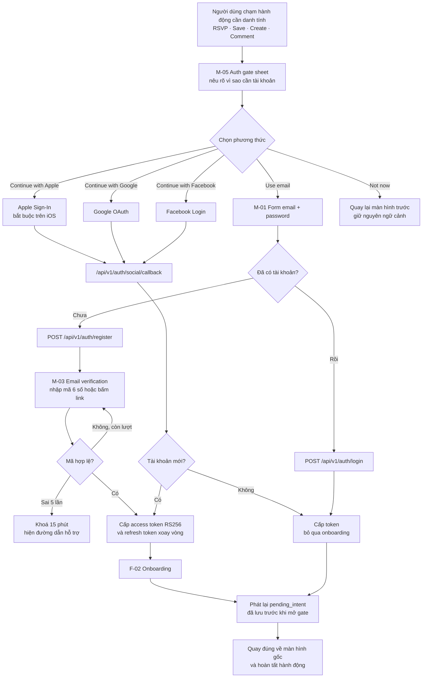

**Quy tắc bắt buộc của F-01**

| # | Quy tắc | Lý do |
|---|---|---|
| 1 | `pending_intent` gồm `screen`, `params`, `action` được ghi vào SecureStore trước khi mở gate và xoá sau khi phát lại | Không bao giờ đẩy người dùng về feed sau khi đăng nhập |
| 2 | Apple Sign-In phải xuất hiện đầu tiên trên iOS | Yêu cầu App Store khi đã có social login khác |
| 3 | Không yêu cầu xác minh email trước khi cho xem lại nội dung | Chỉ chặn ở hành động ghi dữ liệu |
| 4 | Nút "Not now" luôn có mặt và không bị làm mờ | N-7 — giảm ma sát chứ không chặn |
| 5 | Lỗi mạng ở bước OAuth giữ nguyên sheet, không đóng | Tránh mất ngữ cảnh |

### 7.2 F-02 — Onboarding chọn sở thích và khu vực

Mục tiêu: **dưới 45 giây, tối đa 3 màn hình, mọi bước đều bỏ qua được**.

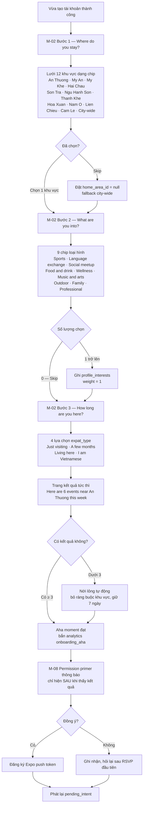

**Ba lý do cho thứ tự bước này**

1. **Khu vực trước sở thích.** Với sản phẩm hyperlocal, khu vực lọc mạnh hơn sở thích. Hỏi trước để trang kết quả ở bước 4 có nội dung sát nhất.
2. **`expat_type` đặt cuối** vì đó là câu hỏi ít trực tiếp phục vụ kết quả nhất, đặt cuối để không làm hỏng đà.
3. **Xin quyền push đặt sau khi đã thấy giá trị.** Xin trước khi thấy kết quả là cách nhanh nhất để bị từ chối vĩnh viễn ở iOS.

### 7.3 F-03 — Khám phá sự kiện

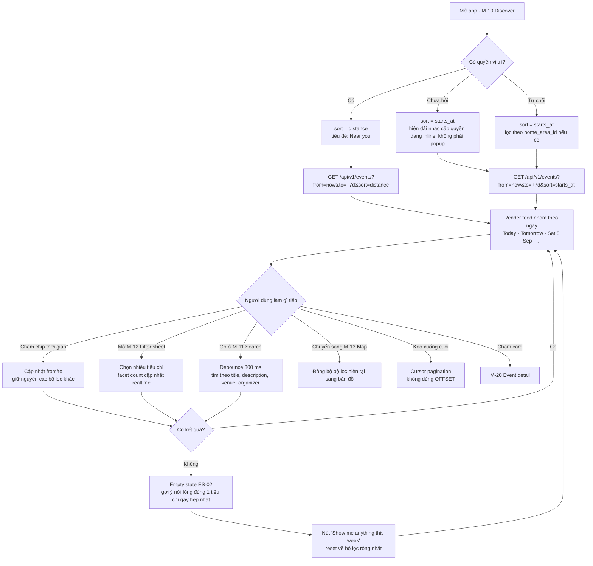

**Quy tắc nới lỏng bộ lọc tự động (chỉ gợi ý, không tự áp dụng)**

| Thứ tự gợi ý bỏ | Tiêu chí | Vì sao bỏ trước |
|---|---|---|
| 1 | `languages` | Phần lớn sự kiện đã là tiếng Anh, lọc thêm gần như không thêm giá trị |
| 2 | `priceMax` | Đa số sự kiện miễn phí, bỏ ràng buộc này ít khi đổi kết quả |
| 3 | `radiusKm` mở rộng 2 km → 5 km | Đà Nẵng nhỏ, 5 km vẫn đi xe máy trong 15 phút |
| 4 | `categories` | Giảm còn nhóm cha nếu có |
| 5 | `areas` | Bỏ cuối cùng vì đây là giá trị cốt lõi của sản phẩm |
| Không bao giờ bỏ | `from`/`to` | Sự kiện đã qua không có giá trị hiển thị |

### 7.4 F-04 — Chi tiết sự kiện và RSVP

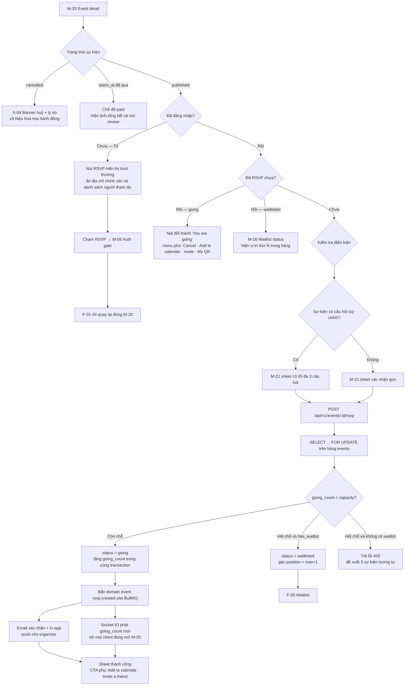

**Quy tắc chống nhầm lẫn ở nút RSVP**

| Trạng thái | Nhãn nút EN | Nhãn nút VI | Kiểu nút | Hành động chạm |
|---|---|---|---|---|
| Chưa RSVP, còn chỗ | `RSVP · 8 spots left` | `Đăng ký · còn 8 chỗ` | Primary đặc | Mở `M-21` |
| Chưa RSVP, hết chỗ, có waitlist | `Join waitlist · 4 waiting` | `Vào danh sách chờ · 4 người đang chờ` | Secondary viền | Mở `M-21` biến thể waitlist |
| Chưa RSVP, hết chỗ, không waitlist | `Event is full` | `Sự kiện đã đầy` | Disabled | Không, kèm gợi ý sự kiện tương tự |
| Đã RSVP going | `You are going` + icon tick | `Bạn sẽ tham gia` | Success nhạt + viền | Mở menu quản lý |
| Đang trong waitlist | `Waiting · #3` | `Đang chờ · #3` | Warning nhạt | Mở `M-26` |
| Được mời từ waitlist, chờ xác nhận | `Confirm your spot · 11h left` | `Xác nhận chỗ · còn 11 giờ` | Primary nhấp nháy nhẹ 1 lần | Xác nhận ngay |
| Sự kiện đã huỷ | `Cancelled` | `Đã huỷ` | Disabled | Không |
| Sự kiện đã diễn ra | `Leave a review` | `Viết đánh giá` | Secondary | Mở `M-55` |

### 7.5 F-05 — Waitlist và thăng hạng tự động

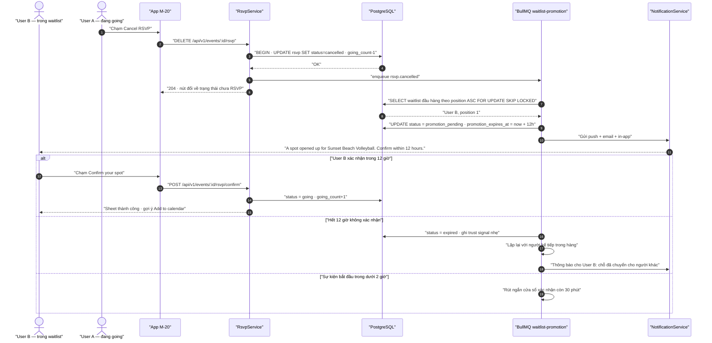

**Bảng trạng thái waitlist hiển thị trên `M-26`**

| Trạng thái nội bộ | Nhãn hiển thị EN | Thông tin phụ | Hành động khả dụng |
|---|---|---|---|
| `waitlisted` | `You are #3 on the waitlist` | `Typically 2 of 4 waitlisted people get in` | Leave waitlist |
| `promotion_pending` | `A spot is yours — confirm now` | Đồng hồ đếm ngược tới `promotion_expires_at` | Confirm · Decline |
| `expired` | `The spot went to someone else` | `You are back at #1 for the next opening` | Stay on waitlist · Leave |
| `going` sau thăng hạng | `You are going` | Nhãn phụ `Promoted from waitlist` | Menu quản lý RSVP |

> **Quyết định UX quan trọng:** con số "typically X of Y waitlisted people get in" chỉ hiển thị khi hệ thống đã có ít nhất 20 lượt thăng hạng lịch sử cho cùng loại hình. Trước ngưỡng đó ẩn hoàn toàn, không hiển thị số bịa.

### 7.6 F-06 — Tạo sự kiện

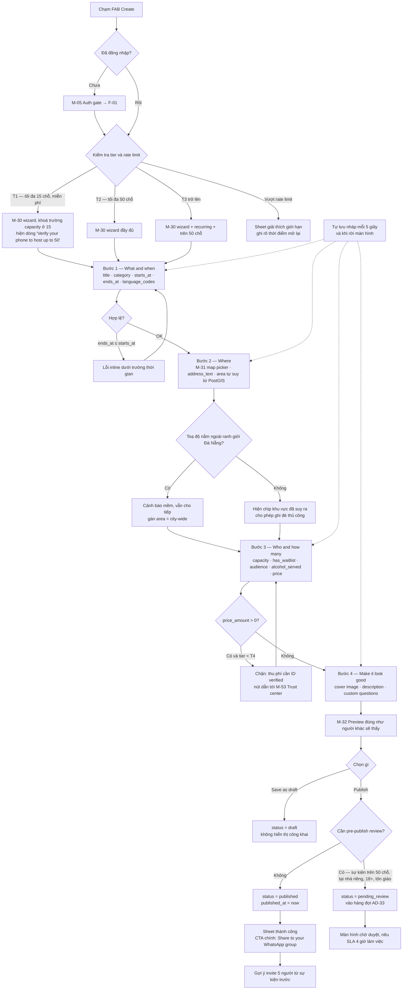

**Ngân sách thời gian cho mục tiêu "dưới 90 giây trên mobile"**

| Bước | Trường bắt buộc | Ngân sách | Kỹ thuật rút ngắn |
|---|---|---|---|
| 1 | title, category, starts_at | 25 s | `starts_at` mặc định "hôm nay + 3 giờ, làm tròn 30 phút"; category dạng chip 1 chạm |
| 2 | location | 20 s | Mặc định ghim ở `home_area_id`; ô tìm địa điểm gợi ý các venue đã dùng trước đó |
| 3 | capacity | 15 s | Preset `8 · 12 · 20 · No limit`; `has_waitlist` bật sẵn |
| 4 | description | 25 s | Ảnh bìa tuỳ chọn, có ảnh mặc định theo category; description tối thiểu 30 ký tự |
| Preview + publish | — | 5 s | — |
| **Tổng** | | **90 s** | |

### 7.7 F-07 — Quản lý sự kiện của tôi

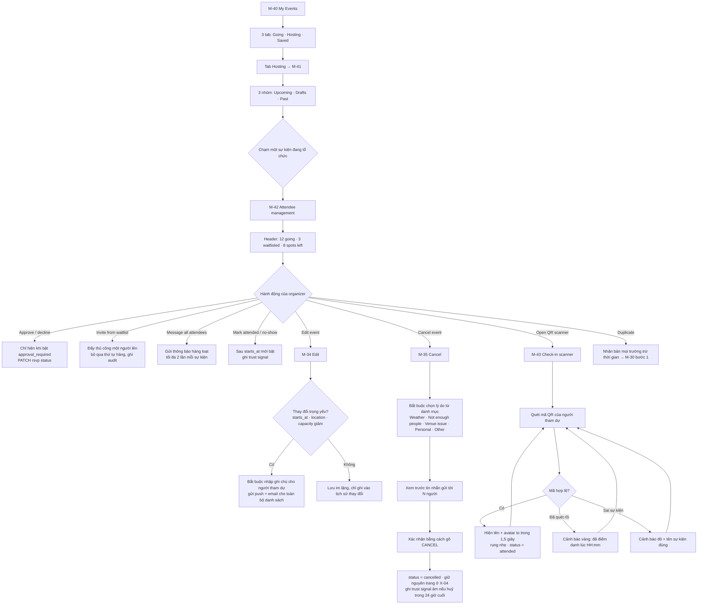

### 7.8 F-08 — Báo cáo vi phạm

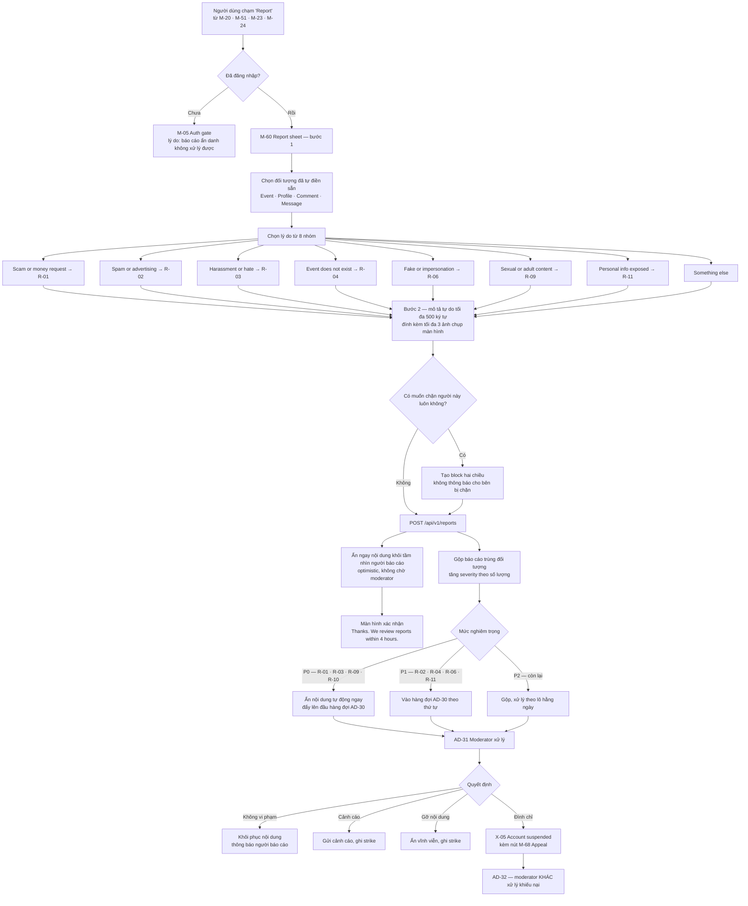

### 7.9 F-09 — Organizer nhận quyền một listing curate

Luồng này là **cửa chuyển đổi quan trọng nhất của giai đoạn seed**, theo brief và `07-go-to-market-da-nang.md`.

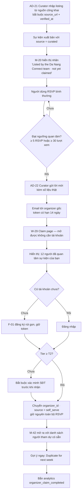

### 7.10 F-10 — Khách vào từ deep link Facebook

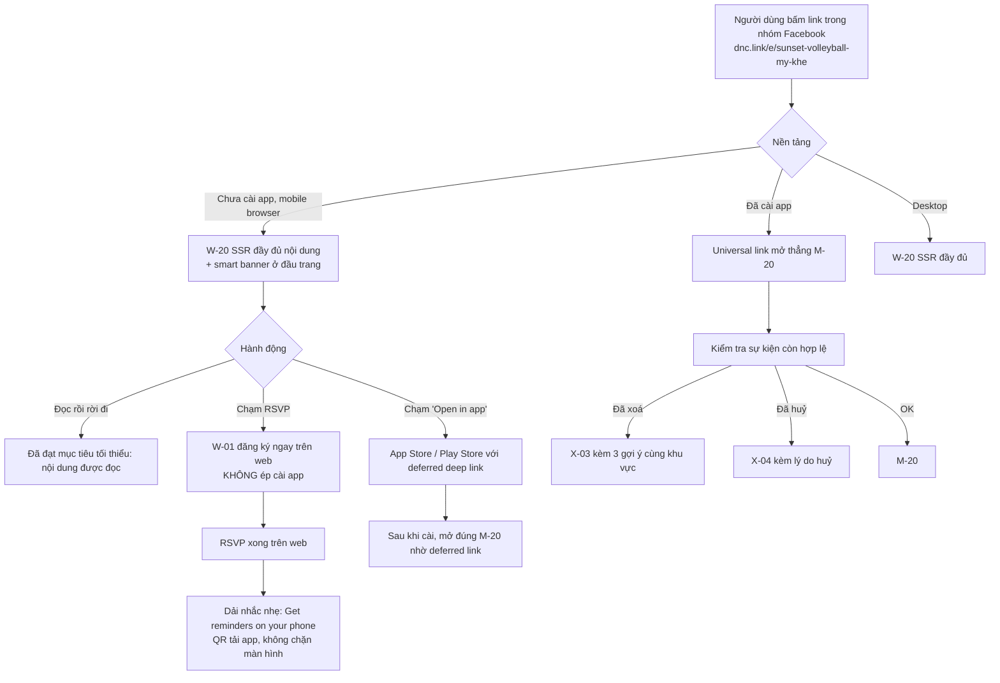

---

## 8. Wireframe dạng văn bản cho 6 màn hình quan trọng nhất

Sáu màn hình dưới đây chiếm khoảng 80% thời gian sử dụng dự kiến. Ký hiệu: `[ ]` là vùng chạm được, `───` là đường phân cách, chữ trong ngoặc kép là chuỗi hiển thị thật (bản EN).

### 8.1 M-10 — Discover feed (mobile, 390 × 844 dp)

```text
┌──────────────────────────────────────────────┐
│ safe area top                                │
├──────────────────────────────────────────────┤
│ [☰ An Thuong ▾]        "Da Nang"    [🔔 3] [🔍]│  ← header 56dp, dính khi cuộn
│  ↑ area switcher = bộ lọc khu vực nhanh      │
├──────────────────────────────────────────────┤
│ ◀ [Tonight] [Tomorrow] [This weekend] [7d] ▶ │  ← chip thời gian, cuộn ngang, 40dp
│   [⚙ Filters ·2]                             │  ← chip cuối, badge số bộ lọc đang bật
├──────────────────────────────────────────────┤
│ ╭──────────────────────────────────────────╮ │
│ │ "Curated by us this week"      [See all] │ │  ← dải nổi bật, CHỈ hiện khi có ≥3 mục
│ │ ┌────────┐ ┌────────┐ ┌────────┐         │ │     cuộn ngang, card 160dp
│ │ │ ảnh    │ │ ảnh    │ │ ảnh    │         │ │
│ │ │ Fri 19h│ │ Sat 07h│ │ Sun 17h│         │ │
│ │ └────────┘ └────────┘ └────────┘         │ │
│ ╰──────────────────────────────────────────╯ │
├──────────────────────────────────────────────┤
│ ▌ TODAY · Mon 31 Aug                         │  ← date group header, dính
│ ┌──────────────────────────────────────────┐ │
│ │ ┌────┐  "Sunset Beach Volleyball"        │ │  ← EventCard, cao 108dp
│ │ │ 96 │  ⏰ 17:30 – 19:30 · 📍 My Khe      │ │
│ │ │ dp │  ●●●+9 going · 8 spots left       │ │  ← AttendeeAvatarStack + CapacityMeter
│ │ └────┘  🏐 Sports · 🇬🇧 English · Free    │ │
│ │         [👤 Tom M. ✓Established]   [♡]   │ │  ← organizer + trust badge + nút lưu
│ └──────────────────────────────────────────┘ │
│ ┌──────────────────────────────────────────┐ │
│ │ ┌────┐  "Vietnamese–English Exchange"    │ │
│ │ │    │  ⏰ 19:00 – 21:00 · 📍 An Thuong   │ │
│ │ │    │  ●●●●+16 going · FULL · 4 waiting │ │  ← trạng thái đầy hiển thị rõ, không ẩn card
│ │ └────┘  💬 Language · 🇬🇧🇻🇳 · 50,000 ₫   │ │
│ │         [🏷 Listed by our team]      [♡] │ │  ← nhãn nguồn curate
│ └──────────────────────────────────────────┘ │
│ ▌ TOMORROW · Tue 1 Sep                       │
│ ┌──────────────────────────────────────────┐ │
│ │ ...                                      │ │
│ └──────────────────────────────────────────┘ │
│           ⟳ đang tải thêm (skeleton ×2)      │
├──────────────────────────────────────────────┤
│                                    ╭───────╮ │
│                                    │  ＋   │ │  ← FAB Create, 56dp, cách đáy 88dp
│                                    ╰───────╯ │
├──────────────────────────────────────────────┤
│  ⌂ Discover   🗺 Map   ★ My Events   ⚇ Profile│  ← tab bar 56dp + safe area bottom
└──────────────────────────────────────────────┘
```

**Ghi chú thiết kế bắt buộc**

| Yếu tố | Quy tắc |
|---|---|
| Thứ tự thông tin trên card | Thời gian và khu vực đứng **trước** loại hình và giá — đây là hai tiêu chí quyết định của P1 |
| `CapacityMeter` | Thanh mảnh 3dp dưới dòng going; màu chuyển sang cảnh báo khi còn dưới 20% chỗ; luôn kèm số |
| Sự kiện đã đầy | Vẫn hiển thị trong feed, không lọc bỏ — người dùng cần biết để vào waitlist |
| Ảnh bìa | Bắt buộc có ảnh mặc định theo category; không bao giờ để ô xám trống |
| Header khu vực | Chạm mở `M-17` để đổi nhanh khu vực đang xem, đây là thao tác lặp nhiều nhất |
| Kéo xuống làm mới | Có, kèm haptic nhẹ, không tự làm mới ngầm khi người dùng đang cuộn |

### 8.2 M-12 — Filter bottom sheet (mobile)

```text
┌──────────────────────────────────────────────┐
│                 ▁▁▁▁ grabber                 │  ← sheet 3 snap point: 45% · 90% · full
│ [✕]           "Filters"          [Reset all] │
├──────────────────────────────────────────────┤
│ WHEN                                         │
│ ( ) Tonight      ( ) Tomorrow                │  ← radio, đúng một lựa chọn
│ (•) This weekend ( ) Next 7 days             │
│ ( ) Custom range  → [31 Aug] – [7 Sep]       │
├──────────────────────────────────────────────┤
│ WHERE                                        │
│ [An Thuong 12] [My An 8] [My Khe 6]          │  ← chip đa chọn + facet count thật
│ [Hai Chau 4]  [Son Tra 2] [Ngu Hanh Son 1]   │
│ [Thanh Khe 0] [Hoa Xuan 0] ...  [Show all ▾] │  ← chip count = 0 bị làm mờ, vẫn chạm được
│ ─────────────────────────────────────────    │
│ [◉] Near me            [ 2 km ▁▃▅▇ 10 km ]   │  ← toggle + slider, tắt nếu chưa cấp quyền
│      "Turn on location to use this"  [Allow] │
├──────────────────────────────────────────────┤
│ WHAT                                         │
│ [🏐 Sports 9] [💬 Language 5] [🍜 Food 4]     │
│ [🧘 Wellness 3] [🎵 Music 2] [🌄 Outdoor 2]   │
│ [👨‍👩‍👧 Family 1] [💼 Professional 0] [🤝 Social 7]│
├──────────────────────────────────────────────┤
│ EVENT LANGUAGE                               │
│ [English 24] [Vietnamese 6] [Korean 1]       │
│ [ ] Only events I can follow                 │  ← khớp với spoken_languages của hồ sơ
├──────────────────────────────────────────────┤
│ PRICE                                        │
│ (•) Any   ( ) Free only   ( ) Under 200,000 ₫│
├──────────────────────────────────────────────┤
│ AVAILABILITY                                 │
│ [ ] Only show events with spots left         │
│ [ ] Include events I can join the waitlist   │
├──────────────────────────────────────────────┤
│ AUDIENCE                                     │
│ [ ] Family friendly    [ ] Alcohol free      │
│ [ ] Beginner welcome   [ ] Women only        │
├──────────────────────────────────────────────┤
│ HOSTED BY                                    │
│ [ ] Verified hosts only                      │
│ [ ] Hide listings not yet claimed            │
├──────────────────────────────────────────────┤
│  [ Save this filter ]   [ Show 17 events ]   │  ← nút chính dính đáy, LUÔN có số kết quả
└──────────────────────────────────────────────┘
```

**Quy tắc tương tác của bộ lọc**

| # | Quy tắc | Chi tiết |
|---|---|---|
| 1 | Nút chính luôn ghi số kết quả thật | `Show 17 events`; nếu bằng 0 đổi thành `No events match — see suggestions` |
| 2 | Facet count cập nhật ngay khi đổi một tiêu chí | Gọi `GET /api/v1/events/facets` debounce 250 ms, không chờ đóng sheet |
| 3 | Không tự áp dụng bộ lọc khi đang chọn | Chỉ áp dụng khi chạm nút chính — tránh giật danh sách nền |
| 4 | Reset all chỉ xoá bộ lọc, không xoá chip thời gian | Chip thời gian là ngữ cảnh, không phải bộ lọc |
| 5 | Trạng thái bộ lọc đồng bộ vào URL trên web và vào deep link trên mobile | Chia sẻ được một bộ lọc cụ thể |
| 6 | Tối đa 3 tiêu chí được nhớ giữa các phiên | `time`, `areas`, `categories`; các tiêu chí còn lại reset mỗi phiên |

### 8.3 M-20 — Event detail (mobile)

```text
┌──────────────────────────────────────────────┐
│ [←]                            [♡] [↗ Share] │  ← header trong suốt phủ lên ảnh
│ ┌──────────────────────────────────────────┐ │
│ │            ẢNH BÌA 16:9                  │ │  ← parallax nhẹ khi cuộn
│ │  [🏷 Listed by our team · not claimed]   │ │  ← chỉ khi source = curated
│ └──────────────────────────────────────────┘ │
├──────────────────────────────────────────────┤
│ "Sunset Beach Volleyball"                    │  ← h1, tối đa 3 dòng
│ 🏐 Sports · 🇬🇧 English · Beginner welcome    │
├──────────────────────────────────────────────┤
│ 📅  Monday, 31 August · 17:30 – 19:30        │
│     GMT+7 · Da Nang time                     │
│     ⚠ "That is 12:30 in your timezone (CEST)"│  ← CHỈ hiện khi tz thiết bị ≠ Asia/Ho_Chi_Minh
│     [ + Add to calendar ]                    │
├──────────────────────────────────────────────┤
│ 📍  My Khe Beach · My Khe                    │
│     ┌────────────────────────────────────┐   │
│     │   mini map 100dp, ghim vị trí      │   │  ← T0/T1 thấy vòng tròn mờ bán kính 300m
│     └────────────────────────────────────┘   │
│     "Exact address shown after you RSVP"     │  ← khi organizer bật hide_exact_address
│     [ Open in Google Maps ]                  │
├──────────────────────────────────────────────┤
│ 👥  12 going · 8 spots left · 3 on waitlist  │
│     ( ●● ●● ●● ●● +8 )      [ See who is going ]│
│     ▓▓▓▓▓▓▓▓▓▓▓▓░░░░░░░░  60%                │
├──────────────────────────────────────────────┤
│ HOSTED BY                                    │
│ ┌──┐ "Tom M."           ✓ Established        │
│ │  │ 14 events hosted · ★ 4.8 (23)           │
│ └──┘ "In Da Nang since 2025"    [ Follow ]   │
├──────────────────────────────────────────────┤
│ ABOUT                                        │
│ "Casual 4v4 on the sand. We have two nets..."│
│ [ Show more ]                                │  ← cắt ở 4 dòng
│                                              │
│ WHAT TO BRING                                │
│ • Water · sunscreen · 50,000 ₫ for the net   │
├──────────────────────────────────────────────┤
│ 💬  Questions (4)                       [ > ]│  ← M-23
│ ┌──────────────────────────────────────────┐ │
│ │ "Is it ok if I have never played?"       │ │
│ │ └ Tom M. · "Totally, half of us haven't" │ │
│ └──────────────────────────────────────────┘ │
├──────────────────────────────────────────────┤
│ [ ⚑ Report this event ]                      │  ← nhỏ, thứ cấp, luôn có mặt
├──────────────────────────────────────────────┤
│ ╔══════════════════════════════════════════╗ │
│ ║   [ RSVP · 8 spots left ]                ║ │  ← thanh dính đáy, nút 48dp
│ ║   Free · Cancel anytime                  ║ │
│ ╚══════════════════════════════════════════╝ │
└──────────────────────────────────────────────┘
```

**Thứ tự khối là kết quả của quyết định sản phẩm, không phải thẩm mỹ**

| Thứ tự | Khối | Vì sao ở vị trí này |
|---|---|---|
| 1 | Thời gian | Câu hỏi đầu tiên của mọi người dùng là "khi nào" |
| 2 | Địa điểm và khu vực | Câu hỏi thứ hai, và là giá trị khác biệt hyperlocal |
| 3 | Ai đã tham gia | P1 ngại đến chỗ toàn người lạ; đưa lên trước mô tả |
| 4 | Organizer | P2 cần biết ai chịu trách nhiệm trước khi đọc nội dung |
| 5 | Mô tả | Ít quyết định nhất, nhưng dài nhất |
| 6 | Hỏi đáp | Giảm tin nhắn riêng cho organizer |
| 7 | Báo cáo | Luôn có mặt, không bao giờ giấu trong menu ba chấm |

### 8.4 M-30 — Create event wizard, bước 1 (mobile)

```text
┌──────────────────────────────────────────────┐
│ [✕ Save & exit]   ●━━○━━○━━○   "1 of 4"      │  ← stepper, chạm được để nhảy về bước trước
├──────────────────────────────────────────────┤
│ "What are you organising?"                   │  ← h2, câu hỏi chứ không phải nhãn trường
│                                              │
│ ┌──────────────────────────────────────────┐ │
│ │ Sunset run at My Khe                     │ │  ← input tự động focus, placeholder là ví dụ thật
│ └──────────────────────────────────────────┘ │
│ "Keep it short. 48 characters left."         │  ← đếm ngược, không chặn
│                                              │
│ "Pick a type"                                │
│ [🏐 Sports] [💬 Language] [🤝 Social]         │  ← chip 1 chạm, chọn xong tự cuộn xuống
│ [🍜 Food] [🧘 Wellness] [🎵 Music]            │
│ [🌄 Outdoor] [👨‍👩‍👧 Family] [💼 Professional]   │
│                                              │
│ "When?"                                      │
│ ┌────────────────────┐ ┌───────────────────┐ │
│ │ Mon 31 Aug         │ │ 17:30             │ │  ← mặc định: hôm nay + 3h, làm tròn 30 phút
│ └────────────────────┘ └───────────────────┘ │
│ "Ends at"  [ 19:30 ]   "2 hours"             │  ← thời lượng mặc định 2h, sửa được
│ ⓘ "All times are Da Nang time (GMT+7)"       │
│                                              │
│ "Language of the event"                      │
│ [✓ English] [ Vietnamese ] [ + Add ]         │  ← mặc định English đã chọn
├──────────────────────────────────────────────┤
│ 💾 "Draft saved 2s ago"                      │  ← chỉ báo tự lưu, không phải nút
├──────────────────────────────────────────────┤
│              [      Next      ]              │  ← disabled tới khi đủ title + category + time
└──────────────────────────────────────────────┘
```

### 8.5 M-42 — Attendee management (mobile)

```text
┌──────────────────────────────────────────────┐
│ [←] "Sunset Beach Volleyball"          [⋯]   │  ← ⋯ = Edit · Duplicate · Cancel · Insights
│      Mon 31 Aug · 17:30 · My Khe             │
├──────────────────────────────────────────────┤
│ ┌────────┬────────┬────────┬────────┐        │
│ │  12    │   8    │   3    │   0    │        │  ← 4 ô số, chạm để lọc danh sách bên dưới
│ │ Going  │ Spots  │Waiting │No-show │        │
│ └────────┴────────┴────────┴────────┘        │
├──────────────────────────────────────────────┤
│ [ 📢 Message everyone ]  [ 📷 Check in ]     │  ← 2 hành động chính, ngang hàng
├──────────────────────────────────────────────┤
│ [ All ] [ Going ] [ Waitlist ] [ Checked in ]│  ← segmented, dính khi cuộn
├──────────────────────────────────────────────┤
│ GOING · 12                                   │
│ ┌──────────────────────────────────────────┐ │
│ │ ⚇ "Marco R."   ✓Verified  🇮🇹            │ │
│ │   "2 events with you" · joined 2d ago    │ │  ← ngữ cảnh giúp organizer nhận ra người quen
│ │   [ ✓ Attended ]  [ ✗ No-show ]     [⋯]  │ │  ← chỉ bật sau starts_at
│ └──────────────────────────────────────────┘ │
│ ┌──────────────────────────────────────────┐ │
│ │ ⚇ "Sarah K."   ✓ID verified  🇬🇧         │ │
│ │   "First time" · joined 5h ago           │ │
│ │   Q: "Can I bring my 9-year-old?"        │ │  ← câu trả lời custom question hiện ngay
│ │   [ ✓ Attended ]  [ ✗ No-show ]     [⋯]  │ │
│ └──────────────────────────────────────────┘ │
│ ...                                          │
├──────────────────────────────────────────────┤
│ WAITLIST · 3                                 │
│ ┌──────────────────────────────────────────┐ │
│ │ #1 ⚇ "Linh N."  ✓Verified  🇻🇳           │ │
│ │      waiting since 1d              [ Invite ]│ ← đẩy thủ công, ghi vào audit log
│ └──────────────────────────────────────────┘ │
├──────────────────────────────────────────────┤
│ ⓘ "You can message attendees 2 times per event"│
└──────────────────────────────────────────────┘
```

### 8.6 W-10 — Discover trên web (desktop ≥ 1280px)

```text
┌───────────────────────────────────────────────────────────────────────────────┐
│ ▣ Da Nang Connect   Events  Map  This week  About      [EN ▾] [🔔] [＋ Create] │
├───────────────────────────────────────────────────────────────────────────────┤
│ "What's on in Da Nang"                                                        │
│ [Tonight] [Tomorrow] [This weekend] [Next 7 days] [Custom ▾]   Sort: [Soonest ▾]│
│ [An Thuong ✕] [Sports ✕] [+ Add filter]                        [ Save filter ] │  ← chip đang bật, gỡ được từng cái
├──────────────────────┬────────────────────────────────────────────────────────┤
│ SIDEBAR 280px        │  KẾT QUẢ — lưới 2 cột ở ≥1280px, 1 cột ở <1024px       │
│                      │                                                        │
│ WHEN                 │  ▌ TODAY · Monday 31 August                            │
│ ○ Tonight            │  ┌──────────────────────┐ ┌──────────────────────┐     │
│ ● This weekend       │  │  [ảnh 16:9]          │ │  [ảnh 16:9]          │     │
│                      │  │ "Sunset Beach Volley"│ │ "VN–EN Exchange"     │     │
│ WHERE                │  │ 17:30 · My Khe       │ │ 19:00 · An Thuong    │     │
│ ☑ An Thuong    12    │  │ ●●●+9 · 8 left       │ │ FULL · 4 waiting     │     │
│ ☐ My An         8    │  │ Tom M. ✓Established  │ │ 🏷 Listed by our team│     │
│ ☐ My Khe        6    │  │ Free            [♡]  │ │ 50,000 ₫        [♡]  │     │
│ ☐ Hai Chau      4    │  └──────────────────────┘ └──────────────────────┘     │
│ [Show 6 more]        │                                                        │
│                      │  ▌ TOMORROW · Tuesday 1 September                      │
│ ◉ Near me            │  ┌──────────────────────┐ ┌──────────────────────┐     │
│ 2km ▁▃▅▇ 10km        │  │ ...                  │ │ ...                  │     │
│                      │  └──────────────────────┘ └──────────────────────┘     │
│ WHAT                 │                                                        │
│ ☑ Sports        9    │  [ Load more ]                                         │
│ ☐ Language      5    │                                                        │
│ ...                  │                                                        │
│                      │                                                        │
│ [ Reset all ]        │                                                        │
├──────────────────────┴────────────────────────────────────────────────────────┤
│ FOOTER · Browse by area: An Thuong · My An · My Khe · Hai Chau · Son Tra ...   │  ← link nội bộ cho SEO
└───────────────────────────────────────────────────────────────────────────────┘
```

Ở breakpoint `lg` (1024–1279px) sidebar thu thành nút `Filters` mở drawer trái; dưới `lg` dùng đúng mô hình mobile với bottom sheet.

---

## 9. Thiết kế bộ lọc và tương tác bản đồ với danh sách

### 9.1 Đặc tả đầy đủ các tiêu chí lọc

| Nhóm | Tiêu chí | Tham số API | Kiểu điều khiển | Giá trị mặc định | Ghi nhớ giữa phiên | Ghi chú |
|---|---|---|---|---|---|---|
| Thời gian | Khoảng thời gian | `from`, `to` | Radio + custom range | `Next 7 days` | Có | Quy đổi theo `Asia/Ho_Chi_Minh` trước khi gửi |
| Khu vực | Danh sách khu vực | `areas[]` | Chip đa chọn có facet count | `home_area_id` nếu có | Có | 12 khu vực seed theo `08` §5.6 |
| Khu vực | Bán kính quanh tôi | `lat`, `lng`, `radiusKm` | Toggle + slider 1–15 km | Tắt | Không | Loại trừ lẫn nhau với `areas[]` |
| Loại hình | Category | `categories[]` | Chip đa chọn có icon | Sở thích đã chọn khi onboarding | Có | 9 category seed |
| Ngôn ngữ | Ngôn ngữ sự kiện | `languages[]` | Chip đa chọn | Trống | Không | Thêm tuỳ chọn "chỉ ngôn ngữ tôi nói" |
| Chi phí | Mức phí | `priceMax` | Radio: Any / Free / Under 200,000 ₫ / Custom | `Any` | Không | Hiển thị VND theo locale |
| Chỗ trống | Còn chỗ | `hasSpots=true` | Checkbox | Tắt | Không | Ánh xạ sang `going_count < capacity` |
| Chỗ trống | Chấp nhận waitlist | `includeWaitlist=true` | Checkbox | Bật | Không | Chỉ hiện khi `hasSpots` bật |
| Đối tượng | Family friendly | `audience=family_friendly` | Checkbox | Tắt | Không | Ràng buộc từ persona P2 |
| Đối tượng | Alcohol free | `alcoholServed=false` | Checkbox | Tắt | Không | Ràng buộc từ persona P2 |
| Đối tượng | Beginner welcome | `skillLevel=beginner` | Checkbox | Tắt | Không | Quan trọng với sự kiện thể thao |
| Đối tượng | Women only | `audience=women_only` | Checkbox | Tắt | Không | Liên quan R-07 an toàn thân thể |
| Organizer | Chỉ host đã xác minh | `minHostTier=T2` | Checkbox | Tắt | Có | Ánh xạ trực tiếp sang tier |
| Organizer | Ẩn listing chưa có chủ | `source=self_serve` | Checkbox | Tắt | Có | Minh bạch với người khó tính |
| Sắp xếp | — | `sort` | Dropdown: Soonest / Nearest / Most popular | `Soonest`, đổi thành `Nearest` khi có vị trí | Có | — |

### 9.2 Quy tắc facet count

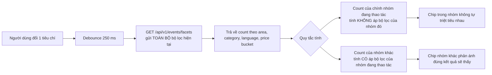

Lý do: nếu tính count cho chính nhóm đang thao tác có áp bộ lọc của nhóm đó, khi người dùng chọn "An Thuong" thì mọi chip khu vực khác về 0 — trông như hỏng.

### 9.3 Bản đồ và danh sách

| Khía cạnh | Mobile (`M-13`) | Web (`W-13`) |
|---|---|---|
| Bố cục | Bản đồ toàn màn hình + bottom sheet 3 nấc (peek 120dp / half 50% / full 90%) | Chia đôi: bản đồ trái 60%, danh sách phải 40%, cuộn độc lập |
| Chuyển đổi | Segmented control nổi ở đầu bản đồ: `List / Map` | Nút `Show map` bật/tắt cột bản đồ |
| Đồng bộ khi kéo bản đồ | Không tự tìm lại; hiện nút nổi `Search this area` | Giống mobile — không tự tìm lại |
| Đồng bộ khi chạm ghim | Bottom sheet trượt lên nấc half, hiện card sự kiện đó | Card tương ứng trong danh sách được cuộn tới và highlight 1,5 s |
| Đồng bộ khi hover card | Không có hover trên mobile | Ghim tương ứng phóng to và đổi màu |
| Gom cụm | Bật khi zoom < 15; nhãn cụm ghi số sự kiện | Giống mobile |
| Nhiều sự kiện cùng toạ độ | Ghim chồng có badge số, chạm mở `M-13a` liệt kê | Popup liệt kê |
| Ghim theo loại hình | Icon category trong ghim, màu theo trạng thái chỗ | Giống mobile |
| Quyền riêng tư vị trí | T0/T1 hoặc `hide_exact_address = true`: vẽ vòng tròn mờ bán kính 300 m thay cho ghim chính xác | Giống mobile |
| Thư viện | `react-native-maps` | `react-leaflet` |
| Hiệu năng | Chỉ render tối đa 200 ghim trong viewport; phần còn lại gom cụm phía máy chủ | Giống mobile |
| Trạng thái rỗng | Bản đồ vẫn hiển thị Đà Nẵng, phủ card trung tâm "No events in this area" + nút mở rộng bán kính | Giống mobile |

**Ba quy tắc bất di bất dịch của bản đồ**

1. **Không bao giờ tự động tìm lại khi người dùng kéo bản đồ.** Kéo bản đồ là hành vi khám phá, tìm lại tự động làm mất kết quả đang xem.
2. **Danh sách và bản đồ luôn dùng chung một đối tượng bộ lọc.** Không có bộ lọc riêng cho bản đồ.
3. **Bản đồ không bao giờ là màn hình khởi động.** Bản đồ trống trông tệ hơn danh sách trống rất nhiều trong giai đoạn cold-start.

---

## 10. Chiến lược onboarding và aha moment

### 10.1 Định nghĩa aha moment

> **Aha moment của Da Nang Connect:** người dùng nhìn thấy **ít nhất 3 hoạt động có thật, có ngày giờ cụ thể, trong khu vực họ đang ở, diễn ra trong 7 ngày tới** — và ít nhất một trong số đó khiến họ nghĩ "cái này tôi đi được".

Chỉ số đại diện đo được: sự kiện analytics `discover_viewed` với thuộc tính `result_count >= 3` và `time_to_first_result_ms`, xảy ra trong **90 giây đầu tiên** của phiên đầu tiên.

### 10.2 Bốn tầng rút ngắn đường tới aha

| Tầng | Chiến thuật | Cụ thể | Chỉ số kiểm chứng |
|---|---|---|---|
| **1. Bỏ mọi rào chắn** | Không splash kể chuyện, không tường đăng nhập, không xin quyền ở màn hình đầu | Từ chạm icon app tới thấy sự kiện đầu tiên: ≤ 3 giây trên mạng 4G | `time_to_first_result_ms` p75 < 3000 |
| **2. Đảm bảo luôn có nội dung** | Đội curate giữ tối thiểu **20 sự kiện đang mở** ở mọi thời điểm, trong đó ≥ 8 ở cụm An Thượng – Mỹ An | Kiểm tra hằng ngày lúc 09:00 bằng `AD-10` | `open_events_count` ≥ 20 |
| **3. Cá nhân hoá ngay bước 1** | Hỏi khu vực trước tiên, dùng ngay để lọc | Trang kết quả onboarding hiển thị "6 events near An Thuong this week" | Tỷ lệ onboarding hoàn tất ≥ 70% |
| **4. Đưa hành động dễ nhất lên trước** | Hành động đầu tiên gợi ý không phải RSVP mà là **Save** — cam kết thấp hơn | Nút `♡` xuất hiện trên mọi card từ màn hình đầu | Tỷ lệ có ≥ 1 `save` trong phiên đầu ≥ 35% |

### 10.3 Kịch bản 90 giây đầu tiên, tính bằng giây

| Giây | Điều gì xảy ra | Màn hình | Không được xảy ra |
|---|---|---|---|
| 0–3 | Mở app → thấy feed thật với ảnh và thời gian | `M-10` | Splash kể chuyện, video giới thiệu |
| 3–15 | Cuộn 2–3 card, đọc tiêu đề và khu vực | `M-10` | Popup xin đánh giá app, popup xin push |
| 15–20 | Chạm chip `Tonight` hoặc chạm card | `M-10` → `M-20` | Yêu cầu đăng nhập |
| 20–45 | Đọc chi tiết: giờ, chỗ, ai đi, ai tổ chức | `M-20` | Ẩn danh sách người tham gia hoàn toàn |
| 45–50 | Chạm `RSVP` hoặc `♡` | `M-05` gate | Gate không giải thích lý do |
| 50–70 | Đăng nhập bằng Apple/Google — 1 chạm | `M-01` | Bắt buộc điền form dài |
| 70–85 | Onboarding 3 bước, mỗi bước ≤ 5 giây | `M-02` | Quá 3 bước, hoặc bước không bỏ qua được |
| 85–90 | Hành động ban đầu tự hoàn tất, thấy sheet thành công | `M-20` | Bị đẩy về feed, phải tự tìm lại sự kiện |

### 10.4 Onboarding cho ba nhóm người dùng khác nhau

| Nhóm vào app | Điểm vào | Điều chỉnh onboarding | Aha moment tương ứng |
|---|---|---|---|
| **Tự tìm thấy app** (App Store, truyền miệng) | `M-10` | Luồng chuẩn ở §7.2 | Thấy 3 sự kiện gần chỗ ở |
| **Vào từ deep link sự kiện** (Facebook, WhatsApp) | `M-20` hoặc `W-20` | Bỏ bước 1 khu vực — suy ra từ khu vực của sự kiện đó; chỉ hỏi 2 bước | RSVP thành công vào đúng sự kiện họ quan tâm |
| **Organizer được mời nhận listing** | `W-29` | Bỏ hoàn toàn bước sở thích; hỏi ngay "muốn quản lý listing này chứ" | Nhìn thấy 12 người đã quan tâm sự kiện của mình |

### 10.5 Chống bỏ cuộc ở ngày 2 tới ngày 7

Aha moment ở phiên đầu chưa đủ. Với vòng đời 5–10 tuần của phân khúc S1, phải có ít nhất một lý do quay lại trong 48 giờ.

| Thời điểm | Cơ chế | Nội dung | Điều kiện gửi |
|---|---|---|---|
| T+24h sau phiên đầu, chưa RSVP lần nào | Push | `3 new events near An Thuong this week. One starts tonight.` | Đã bật push, chưa có RSVP |
| T+48h, đã save nhưng chưa RSVP | Push | `You saved "Sunset Beach Volleyball". 8 spots left.` | Có ≥ 1 save, 0 RSVP |
| Thứ Năm 18:00 hằng tuần | Push + email digest | `What's on this weekend in An Thuong` — 5 sự kiện | Người dùng đã bật digest |
| Sau RSVP đầu tiên, T-24h và T-2h | Push | Nhắc lịch | Bắt buộc, không tắt được T-2h |
| Sau sự kiện đầu tiên tham dự | In-app | `How was it? Rate Tom and the event.` | Trong 7 ngày sau sự kiện |
| Im lặng 10 ngày | Push, tối đa 1 lần | `You marked yourself interested in sports. Three games this week.` | Có sở thích đã chọn |

> **Trần tần suất push tuyệt đối:** tối đa **4 push/tuần** cho người dùng chưa từng RSVP, **7 push/tuần** cho người dùng đã hoạt động. Vượt trần thì gộp vào digest. Vi phạm trần này là lỗi chặn phát hành.

---

## 11. Empty state cho từng màn hình

Với một sản phẩm cold-start, empty state là **màn hình được nhìn thấy nhiều nhất trong 8 tuần đầu**. Mỗi empty state phải trả lời ba câu: *chuyện gì đang xảy ra*, *có phải lỗi của tôi không*, *tôi làm gì tiếp*.

### 11.1 Nguyên tắc chung

| # | Nguyên tắc | Áp dụng |
|---|---|---|
| E-1 | Không bao giờ chỉ hiện icon và chữ "No data" | Mọi empty state có tiêu đề, mô tả, và ít nhất 1 CTA |
| E-2 | CTA phải dẫn tới hành động **có kết quả ngay**, không dẫn tới màn hình rỗng khác | "Show me anything this week" thay vì "Try again" |
| E-3 | Phân biệt rõ **rỗng vì bộ lọc** với **rỗng vì chưa có dữ liệu** | Hai biến thể copy hoàn toàn khác nhau |
| E-4 | Với rỗng vì chưa có dữ liệu, luôn kèm **lối thoát tạo nội dung** | "Be the first to organise something" |
| E-5 | Không dùng minh hoạ vui nhộn choán chỗ trên mobile | Icon đơn sắc 64dp là đủ; ưu tiên chỗ cho nội dung |
| E-6 | Nếu có thể hiển thị nội dung thay thế, ưu tiên hơn empty state | Không có sự kiện ở An Thượng → hiện sự kiện ở Mỹ An với nhãn rõ ràng |

### 11.2 Bảng empty state đầy đủ

| Mã | Màn hình | Biến thể | Tiêu đề (EN) | Tiêu đề (VI) | Mô tả (EN) | CTA chính | CTA phụ | Khoá i18n |
|---|---|---|---|---|---|---|---|---|
| ES-01 | `M-10` Discover | Chưa có sự kiện nào trong hệ thống | `Nothing scheduled yet — but that changes fast` | `Chưa có hoạt động nào — nhưng sẽ có sớm thôi` | `We are adding events across Da Nang every day. Get a ping when something lands near you.` | `Notify me about new events` | `Organise the first one` | `discover.feed.empty.noData` |
| ES-02 | `M-10` Discover | Rỗng vì bộ lọc | `No events match these filters` | `Không có hoạt động nào khớp bộ lọc` | `Try removing "English only" — that is what is narrowing your results the most.` | `Show me anything this week` | `Edit filters` | `discover.feed.empty.noMatch` |
| ES-03 | `M-10` Discover | Khu vực đã chọn rỗng, khu vực lân cận có | `Nothing in An Thuong right now` | `Hiện chưa có gì ở An Thượng` | `But there are 6 events in My An — a 7-minute ride away.` | `Show events in My An` | `Keep An Thuong only` | `discover.feed.empty.nearbyOnly` |
| ES-04 | `M-10` Discover | Chip `Tonight` rỗng | `Quiet night in Da Nang` | `Tối nay Đà Nẵng khá yên` | `Nothing tonight, but 9 events are lined up for the weekend.` | `See this weekend` | `Post something for tonight` | `discover.feed.empty.tonight` |
| ES-05 | `M-11` Search | Không có kết quả | `No results for "padel"` | `Không có kết quả cho "padel"` | `Nobody has organised padel yet. You could be the first — it takes 90 seconds.` | `Create a padel event` | `Search something else` | `discover.search.empty` |
| ES-06 | `M-11` Search | Trước khi gõ | `Search events, places and hosts` | `Tìm hoạt động, địa điểm và người tổ chức` | Gợi ý 6 từ khoá phổ biến dạng chip: `badminton · language exchange · run club · board games · yoga · quiz night` | — | — | `discover.search.idle` |
| ES-07 | `M-13` Map | Không có ghim trong viewport | `No events in this area` | `Không có hoạt động trong khu vực này` | `Zoom out or search a wider area to see what is around.` | `Search this wider area` | `Switch to list` | `discover.map.empty` |
| ES-08 | `M-14` Calendar | Tháng rỗng | `Nothing on the calendar for September yet` | `Tháng 9 chưa có lịch nào` | `Most events get posted 3–5 days before they happen.` | `See this week instead` | `Set a reminder` | `discover.calendar.empty` |
| ES-09 | `M-16` Saved filters | Chưa lưu bộ lọc nào | `Save a filter, get a ping` | `Lưu bộ lọc để nhận thông báo` | `Set up "Sports in An Thuong on weekends" once and we will tell you when something new matches.` | `Create a saved filter` | — | `discover.savedFilters.empty` |
| ES-10 | `M-22` Attendee list | Chưa ai RSVP | `Nobody has joined yet` | `Chưa có ai tham gia` | `Be the first — events with one person signed up fill up 3× faster.` | `RSVP now` | — | `rsvp.attendees.empty` |
| ES-11 | `M-22` Attendee list | Mọi người đều ẩn danh sách | `Attendees keep their profiles private` | `Người tham dự đang để hồ sơ riêng tư` | `12 people are going. They chose not to show their profiles publicly.` | — | `Learn about privacy` | `rsvp.attendees.private` |
| ES-12 | `M-23` Comments | Chưa có bình luận | `No questions yet` | `Chưa có câu hỏi nào` | `Ask the host anything — what to bring, how to find the spot, whether beginners are welcome.` | `Ask a question` | — | `event.comments.empty` |
| ES-13 | `M-24` Group chat | Chat trống | `This chat opens 48 hours before the event` | `Phòng chat mở trước sự kiện 48 giờ` | `You will be able to coordinate with the other 11 people going.` | — | — | `event.chat.notYet` |
| ES-14 | `M-26` Waitlist | Không ai trong waitlist | `No waitlist yet` | `Chưa có ai trong danh sách chờ` | `There are still 8 spots. You can RSVP directly.` | `RSVP now` | — | `rsvp.waitlist.empty` |
| ES-15 | `M-40` My Events, tab Going | Chưa RSVP gì | `You have not joined anything yet` | `Bạn chưa tham gia hoạt động nào` | `There are 17 events happening in Da Nang this week.` | `Find something to join` | — | `myEvents.going.empty` |
| ES-16 | `M-41` Hosted, Upcoming | Chưa tổ chức gì | `Organise your first event` | `Tổ chức hoạt động đầu tiên của bạn` | `A run, a language table, a board game night. It takes 90 seconds and it is free.` | `Create an event` | `See what others organise` | `myEvents.hosted.empty` |
| ES-17 | `M-41` Hosted, Drafts | Không có nháp | `No drafts` | `Không có bản nháp nào` | `Anything you start creating is saved here automatically.` | `Start a new event` | — | `myEvents.drafts.empty` |
| ES-18 | `M-41` Hosted, Past | Chưa có sự kiện đã qua | `Your past events will appear here` | `Các hoạt động đã diễn ra sẽ xuất hiện ở đây` | `You will be able to duplicate them in one tap.` | — | — | `myEvents.past.empty` |
| ES-19 | `M-42` Attendee mgmt | Chưa ai đăng ký | `No sign-ups yet` | `Chưa có ai đăng ký` | `Events shared to a WhatsApp or Facebook group get 4× more sign-ups.` | `Share your event` | `Invite past attendees` | `myEvents.attendees.empty` |
| ES-20 | `M-42` Attendee mgmt | Waitlist rỗng | `Nobody is waiting` | `Không có ai đang chờ` | `You still have 8 open spots.` | `Share your event` | — | `myEvents.waitlist.empty` |
| ES-21 | `M-44` Saved events | Chưa lưu gì | `Nothing saved yet` | `Chưa lưu hoạt động nào` | `Tap the heart on any event to keep it here. We will remind you before it starts.` | `Browse events` | — | `myEvents.saved.empty` |
| ES-22 | `M-45` Past events | Chưa tham gia gì | `Your history starts with your first event` | `Lịch sử của bạn bắt đầu từ hoạt động đầu tiên` | `Attending events builds your trust level, which unlocks hosting bigger events.` | `Find an event` | `How trust works` | `myEvents.pastAttended.empty` |
| ES-23 | `M-50` My profile | Hồ sơ chưa hoàn thiện | `Your profile is 40% complete` | `Hồ sơ của bạn hoàn thành 40%` | `Hosts are 2× more likely to approve people with a photo and a short bio.` | `Complete your profile` | `Skip for now` | `profile.mine.incomplete` |
| ES-24 | `M-51` Public profile | Người dùng chưa có hoạt động nào | `New here` | `Người mới` | `Marco joined 3 days ago and has not attended an event yet.` | — | — | `profile.public.empty` |
| ES-25 | `M-53` Trust center | Ở tier T1 | `You are at level 1 of 5` | `Bạn đang ở bậc 1 trên 5` | `Verify your phone to host events for up to 50 people and message anyone.` | `Verify my phone` | `See all levels` | `profile.trust.empty` |
| ES-26 | `M-54` Following | Chưa theo dõi ai | `Follow hosts you like` | `Theo dõi người tổ chức bạn thích` | `You will get a ping whenever they post something new.` | `Browse hosts` | — | `profile.following.empty` |
| ES-27 | `M-61` Notification center | Trống | `No notifications yet` | `Chưa có thông báo nào` | `RSVP to an event and we will keep you posted about changes and reminders.` | `Find an event` | — | `notification.center.empty` |
| ES-28 | `M-61` Notification center | Đã đọc hết | `You are all caught up` | `Bạn đã xem hết` | Hiện 3 sự kiện gợi ý bên dưới thay vì để trống | `See what is on this week` | — | `notification.center.caughtUp` |
| ES-29 | `M-66` Blocked users | Chưa chặn ai | `You have not blocked anyone` | `Bạn chưa chặn ai` | `Blocked people cannot see your profile or message you, and you will not see their events.` | — | `How blocking works` | `settings.blocked.empty` |
| ES-30 | `M-68` Appeals | Không có khiếu nại | `No appeals` | `Không có khiếu nại nào` | `If a moderator removes your content, you can appeal once from here.` | — | — | `safety.appeal.empty` |
| ES-31 | `W-15` Area landing | Khu vực chưa có sự kiện | `Nothing scheduled in Son Tra this week` | `Tuần này Sơn Trà chưa có hoạt động nào` | `Son Tra is popular for hikes and coastal rides. Nobody has posted one yet — you could.` | `Create an event in Son Tra` | `See all areas` | `area.landing.empty` |
| ES-32 | `W-17` This week | Tuần rỗng | `A quiet week in Da Nang` | `Một tuần khá yên ở Đà Nẵng` | Hiển thị 5 sự kiện của tuần kế tiếp thay vì để trống | `See next week` | `Get the weekly email` | `thisWeek.empty` |
| ES-33 | `AD-20` Curation queue | Hàng đợi rỗng | `Nothing in the curation queue` | `Hàng đợi curate đang trống` | `Target is 20 open events at all times. Right now there are 14.` | `Add a listing` | — | `admin.curation.empty` |
| ES-34 | `AD-30` Reports queue | Không có báo cáo | `No open reports` | `Không có báo cáo nào đang mở` | `Median handling time this week: 41 minutes.` | — | `See resolved reports` | `admin.reports.empty` |
| ES-35 | `X-01` Offline | Mất mạng, có cache | `You are offline` | `Bạn đang ngoại tuyến` | `Showing events saved on this device. Some details may be out of date.` | `Try again` | — | `common.offline.cached` |
| ES-36 | `X-01` Offline | Mất mạng, không cache | `No connection` | `Không có kết nối` | `Check your Wi-Fi or mobile data and try again.` | `Try again` | — | `common.offline.noCache` |
| ES-37 | `X-03` Not found | Sự kiện đã xoá | `This event is no longer available` | `Hoạt động này không còn khả dụng` | `It may have been removed by the organiser. Here are 3 similar events in My Khe.` | `See similar events` | `Back to discover` | `common.notFound.event` |

### 11.3 Empty state là dữ liệu vận hành

Số lần hiển thị mỗi empty state phải được đo. Nếu `ES-01` (chưa có sự kiện nào trong hệ thống) xuất hiện quá **2% số phiên** trong bất kỳ tuần nào, đó là tín hiệu đội curate đang tụt so với mục tiêu 20 sự kiện đang mở, và là điểm cảnh báo trên `AD-10`.

| Empty state | Ngưỡng cảnh báo | Ai chịu trách nhiệm |
|---|---|---|
| ES-01 | > 2% phiên | Content Curator |
| ES-02 | > 25% lần áp bộ lọc | Product — bộ lọc quá hẹp hoặc facet count sai |
| ES-03 | > 15% phiên có chọn khu vực | Content Curator — phân bố khu vực lệch |
| ES-15 | > 60% người dùng ở ngày thứ 3 | Growth — RSVP funnel gãy |
| ES-19 | > 40% sự kiện sau 48 giờ đăng | Community — organizer không được hỗ trợ chia sẻ |

---

## 12. Hệ thống thiết kế

Hệ thống thiết kế là trung tính có chủ đích: không mượn ngôn ngữ hình ảnh của bất kỳ thương hiệu nào, không dùng bảng màu hay kiểu chữ đặc trưng của sản phẩm khác. Nguồn duy nhất là `packages/ui/tokens.ts`, được web tiêu thụ qua `@theme` của Tailwind 4 và mobile tiêu thụ qua `StyleSheet.create`.

### 12.1 Năm nguyên tắc thị giác

| # | Nguyên tắc | Diễn giải |
|---|---|---|
| V-1 | **Nội dung trước khung** | Ảnh sự kiện và chữ chiếm chỗ; viền, bóng đổ, gradient chỉ dùng khi có nhiệm vụ phân tách rõ ràng. |
| V-2 | **Một màu nhấn duy nhất** | Chỉ `primary` được dùng cho hành động chính. Mọi màu còn lại là ngữ nghĩa trạng thái, không phải trang trí. |
| V-3 | **Trung tính ấm, không lạnh** | Thang xám nghiêng nhẹ về ấm để ảnh bãi biển và ảnh người không bị "bệnh viện hoá". |
| V-4 | **Chữ số là thông tin** | Số chỗ, số người, giá tiền dùng chữ số tabular, không bao giờ nằm trong ảnh. |
| V-5 | **Chuyển động phục vụ định hướng** | Chỉ animate khi giải thích quan hệ không gian giữa hai màn hình. Tôn trọng `prefers-reduced-motion`. |

### 12.2 Thang khoảng cách

Cơ số 4. Áp dụng cho cả web và mobile với cùng con số (dp trên mobile, px trên web).

| Token | Giá trị | Dùng cho |
|---|---|---|
| `space-0` | 0 | Reset |
| `space-1` | 4 | Khoảng cách icon với nhãn liền kề |
| `space-2` | 8 | Trong một cụm: avatar với tên |
| `space-3` | 12 | Giữa các dòng trong một card |
| `space-4` | 16 | Padding ngang chuẩn của màn hình mobile |
| `space-5` | 20 | Padding trong card |
| `space-6` | 24 | Giữa hai card, giữa hai nhóm trường form |
| `space-8` | 32 | Giữa hai section trong một màn hình |
| `space-10` | 40 | Trước và sau tiêu đề section lớn |
| `space-12` | 48 | Padding dọc của empty state |
| `space-16` | 64 | Khoảng trắng lớn trên web desktop |

Quy tắc bố cục cố định:

| Ngữ cảnh | Giá trị |
|---|---|
| Padding ngang màn hình mobile | `space-4` (16) |
| Padding ngang web dưới `md` | 16 |
| Padding ngang web `md`–`lg` | 24 |
| Chiều rộng nội dung tối đa web | 1280, cột chữ tối đa 72 ký tự |
| Chiều cao tối thiểu vùng chạm | 44 × 44 (iOS), 48 × 48 (Android) |
| Bán kính bo góc | `radius-sm` 6 · `radius-md` 10 · `radius-lg` 16 · `radius-full` 999 |
| Grid web | 12 cột, gutter 24 |
| Breakpoint | `sm` 640 · `md` 768 · `lg` 1024 · `xl` 1280 |

### 12.3 Kiểu chữ

| Hạng mục | Lựa chọn | Lý do |
|---|---|---|
| Font UI | `Inter` với fallback `system-ui, -apple-system, "Segoe UI", Roboto, sans-serif` | Bộ ký tự Latin Extended đầy đủ, hỗ trợ tốt dấu tiếng Việt, có biến thể tabular figures |
| Font số liệu | `Inter` với `font-variant-numeric: tabular-nums` | Giữ số chỗ và giá tiền không nhảy khi cập nhật realtime |
| Không dùng | Font hiển thị có chân, font viết tay, font thiếu dấu tiếng Việt | Dấu tiếng Việt vỡ là lỗi chặn phát hành |

Thang chữ — cùng giá trị cho web và mobile:

| Token | Kích thước / Hành cao | Trọng lượng | Letter spacing | Dùng cho |
|---|---|---|---|---|
| `text-display` | 32 / 40 | 700 | −0.5 | Tiêu đề trang web, hiếm dùng trên mobile |
| `text-h1` | 26 / 34 | 700 | −0.3 | Tên sự kiện trên `M-20` |
| `text-h2` | 22 / 30 | 600 | −0.2 | Tiêu đề màn hình, câu hỏi trong wizard |
| `text-h3` | 18 / 26 | 600 | 0 | Tên sự kiện trên card |
| `text-body` | 16 / 24 | 400 | 0 | Mô tả, nội dung chính |
| `text-body-strong` | 16 / 24 | 600 | 0 | Nhấn trong đoạn |
| `text-sm` | 14 / 20 | 400 | 0 | Thông tin phụ trên card, nhãn trường |
| `text-caption` | 12 / 16 | 500 | 0.2 | Nhãn nhóm, chú thích, đơn vị |
| `text-overline` | 11 / 16 | 700 | 1.0 | Tiêu đề nhóm ngày, viết hoa toàn bộ |
| `text-button` | 16 / 20 | 600 | 0.1 | Nhãn nút |

Quy tắc chữ:

- Không dùng quá **3 cấp chữ** trên một màn hình mobile.
- Tiêu đề sự kiện cắt ở **2 dòng** trên card, **3 dòng** trên chi tiết, dùng `line-clamp` chứ không cắt bằng ký tự.
- Chữ viết hoa toàn bộ chỉ dùng cho `text-overline`; **không** viết hoa toàn bộ chuỗi tiếng Việt có dấu vì dấu bị chồng lên nhau ở một số hệ máy.

### 12.4 Bảng màu

Màu được định nghĩa dạng token ngữ nghĩa. Giá trị hex chỉ tồn tại ở tầng token gốc; component không bao giờ dùng hex trực tiếp.

**Token gốc — thang trung tính ấm**

| Token | Light | Dark |
|---|---|---|
| `neutral-0` | `#FFFFFF` | `#0E0F0E` |
| `neutral-50` | `#FAFAF8` | `#151716` |
| `neutral-100` | `#F2F2EE` | `#1C1E1D` |
| `neutral-200` | `#E5E5DF` | `#262927` |
| `neutral-300` | `#D2D2CA` | `#343833` |
| `neutral-400` | `#A8A89E` | `#4B504A` |
| `neutral-500` | `#7A7A70` | `#6B716A` |
| `neutral-600` | `#585850` | `#8E948C` |
| `neutral-700` | `#3E3E38` | `#B4B9B1` |
| `neutral-800` | `#262622` | `#D5D9D2` |
| `neutral-900` | `#141412` | `#F0F2ED` |

**Token gốc — màu nhấn và trạng thái**

| Token | Light | Dark | Ghi chú |
|---|---|---|---|
| `teal-500` | `#0E7C74` | `#2BB3A6` | Màu nhấn chính |
| `teal-600` | `#0A625C` | `#219A8E` | Trạng thái nhấn giữ |
| `teal-100` | `#DBF1EE` | `#123A36` | Nền nhạt của màu nhấn |
| `amber-500` | `#B4740A` | `#E0A040` | Cảnh báo, waitlist |
| `amber-100` | `#FBEFD8` | `#3B2C10` | |
| `red-500` | `#B3261E` | `#E5675E` | Nguy hiểm, huỷ, lỗi |
| `red-100` | `#FBE3E1` | `#3E1815` | |
| `green-500` | `#1F7A45` | `#4CB77A` | Thành công, đã tham gia |
| `green-100` | `#DCF1E4` | `#12331F` | |
| `blue-500` | `#28558F` | `#6E9BD8` | Thông tin, link |
| `blue-100` | `#DEE8F6` | `#141F31` | |

**Token ngữ nghĩa — cái mà component thực sự dùng**

| Token ngữ nghĩa | Light | Dark | Dùng ở |
|---|---|---|---|
| `bg-canvas` | `neutral-50` | `neutral-0` | Nền màn hình |
| `bg-surface` | `neutral-0` | `neutral-100` | Card, sheet, danh sách |
| `bg-surface-raised` | `neutral-0` + shadow-2 | `neutral-200` | Modal, dropdown, bottom sheet |
| `bg-subtle` | `neutral-100` | `neutral-200` | Chip chưa chọn, skeleton |
| `border-default` | `neutral-200` | `neutral-300` | Viền card, phân cách |
| `border-strong` | `neutral-300` | `neutral-400` | Viền input, viền nút thứ cấp |
| `text-primary` | `neutral-900` | `neutral-900` | Tiêu đề, nội dung chính |
| `text-secondary` | `neutral-600` | `neutral-700` | Thông tin phụ |
| `text-muted` | `neutral-500` | `neutral-600` | Chú thích, placeholder |
| `text-on-accent` | `neutral-0` | `neutral-0` | Chữ trên nền màu nhấn |
| `accent` | `teal-500` | `teal-500` | Nút chính, link, chip đang chọn |
| `accent-hover` | `teal-600` | `teal-600` | |
| `accent-subtle` | `teal-100` | `teal-100` | Nền badge, nền chip đang chọn |
| `status-success` | `green-500` | `green-500` | Đã RSVP, đã điểm danh |
| `status-warning` | `amber-500` | `amber-500` | Waitlist, sắp hết chỗ, chờ duyệt |
| `status-danger` | `red-500` | `red-500` | Huỷ, báo cáo, lỗi |
| `status-info` | `blue-500` | `blue-500` | Ghi chú múi giờ, nhãn nguồn curate |
| `overlay-scrim` | `rgba(20,20,18,0.48)` | `rgba(0,0,0,0.64)` | Nền sau sheet và modal |
| `focus-ring` | `teal-500` viền 2px + offset 2px | như light | Vòng focus bàn phím |

**Kiểm tra tương phản bắt buộc** (WCAG 2.2 AA):

| Cặp | Light | Dark | Đạt |
|---|---|---|---|
| `text-primary` trên `bg-canvas` | 15,8:1 | 14,9:1 | AAA |
| `text-secondary` trên `bg-surface` | 7,1:1 | 6,4:1 | AAA |
| `text-muted` trên `bg-surface` | 4,7:1 | 4,6:1 | AA |
| `text-on-accent` trên `accent` | 4,9:1 | 5,2:1 | AA |
| `accent` trên `bg-surface` (dùng cho link) | 4,8:1 | 5,0:1 | AA |
| `status-danger` trên `bg-surface` | 5,4:1 | 4,8:1 | AA |

> Mọi cặp màu mới thêm vào token phải chạy qua script `pnpm ui:contrast` trong CI; dưới 4,5:1 cho chữ thường là lỗi chặn merge.

**Quy tắc dark mode**

| # | Quy tắc |
|---|---|
| 1 | Dark mode không phải là đảo ngược màu. Thang trung tính có giá trị riêng, độ bão hoà của màu nhấn tăng nhẹ để bù độ sáng nền thấp. |
| 2 | Nền tối nhất là `#0E0F0E`, **không dùng đen tuyệt đối** — tránh hiện tượng nhoè trên màn hình OLED khi cuộn. |
| 3 | Độ nâng bề mặt trong dark mode thể hiện bằng **màu nền sáng dần**, không bằng bóng đổ. |
| 4 | Ảnh bìa sự kiện phủ một lớp mờ 8% trong dark mode để không chói hơn giao diện. |
| 5 | Theo hệ thống là mặc định; người dùng ghi đè được ở `M-65`, lựa chọn lưu cục bộ và đồng bộ vào hồ sơ. |

### 12.5 Elevation và bóng đổ

| Token | Light | Dark | Dùng cho |
|---|---|---|---|
| `shadow-0` | none | none | Card trong danh sách — dùng viền thay bóng |
| `shadow-1` | `0 1px 2px rgba(20,20,18,.06)` | không dùng, thay bằng `bg-surface` sáng hơn 1 bậc | Chip nổi, header dính |
| `shadow-2` | `0 4px 12px rgba(20,20,18,.10)` | như trên | Bottom sheet, dropdown |
| `shadow-3` | `0 12px 32px rgba(20,20,18,.16)` | như trên | Modal, FAB khi kéo |

### 12.6 Component chính

| Component | Nền tảng | Biến thể | Trạng thái phải có | Ghi chú thiết kế |
|---|---|---|---|---|
| `EventCard` | Cả hai | `list` · `compact` · `featured` · `grid` | default, pressed, saved, full, cancelled, curated, skeleton | Cao cố định để danh sách ảo hoá được |
| `CapacityMeter` | Cả hai | `bar` · `text-only` | ok, low (dưới 20%), full, unlimited | Luôn kèm số; màu không phải kênh thông tin duy nhất |
| `RsvpButton` | Cả hai | — | 8 trạng thái ở §7.4 | Nhãn thay đổi theo trạng thái, không chỉ đổi màu |
| `TrustBadge` | Cả hai | `inline` · `chip` | 5 bậc `new` `verified` `established` `trusted` `ambassador` | Có tooltip giải thích; không hiện điểm số thô |
| `AreaChip` | Cả hai | `filter` · `label` | default, selected, disabled với count 0 | Hiển thị tên theo locale hiện tại |
| `FilterChipBar` | Cả hai | — | có badge số bộ lọc đang bật | Cuộn ngang, chip đầu luôn là thời gian |
| `AttendeeAvatarStack` | Cả hai | tối đa 4 avatar + `+N` | có avatar, không có avatar (initials), ẩn vì riêng tư | Không bao giờ hiển thị avatar của người đã chặn |
| `DateGroupHeader` | Cả hai | — | Today, Tomorrow, thứ + ngày | Dính khi cuộn |
| `EmptyState` | Cả hai | 1 CTA · 2 CTA · có nội dung thay thế | 37 biến thể ở §11.2 | Nhận `variant` và khoá i18n |
| `BottomSheet` | Mobile | 1 nấc · 3 nấc | mở, kéo, đóng, có bàn phím | Web dùng `Drawer` hoặc `Dialog` tương ứng |
| `SegmentedControl` | Cả hai | 2–4 mục | — | Dùng cho List/Map và các tab con của `M-40` |
| `MapPin` | Cả hai | `single` · `cluster` · `approximate` | selected, unselected | `approximate` là vòng tròn mờ 300 m |
| `PriceTag` | Cả hai | `free` · `paid` | — | `Free` / `Miễn phí` là chữ, không phải `0 ₫` |
| `LanguageBadge` | Cả hai | 1–3 ngôn ngữ | — | Dùng mã ngôn ngữ chữ, không dùng cờ quốc gia cho tiếng Anh |
| `SourceBadge` | Cả hai | `curated` · `claimed` | — | Bắt buộc trên mọi listing `source = curated` |
| `StepperHeader` | Cả hai | 3–4 bước | bước hiện tại, đã xong, chưa tới | Quay lại bước trước bằng cách chạm |
| `TimezoneNote` | Cả hai | — | chỉ hiện khi lệch múi giờ | Dùng `status-info` |
| `Toast` | Cả hai | info · success · warning · danger | có hành động hoàn tác | Không chồng quá 1 toast cùng lúc |
| `Skeleton` | Cả hai | card · list · detail | — | Không dùng spinner cho nội dung danh sách |
| `ReportSheet` | Cả hai | — | 2 bước ở §7.8 | Luôn truy cập được từ nội dung do người dùng tạo |

### 12.7 Chuyển động

| Chuyển động | Thời lượng | Đường cong | Ghi chú |
|---|---|---|---|
| Chuyển màn hình đẩy ngang | 280 ms | `cubic-bezier(.2,.8,.2,1)` | Chuẩn của nền tảng |
| Bottom sheet mở | 240 ms | `cubic-bezier(.2,.9,.2,1)` | Kéo theo ngón tay khi vuốt |
| Chip đổi trạng thái | 120 ms | `ease-out` | Chỉ đổi nền và viền |
| Cập nhật số chỗ realtime | 200 ms | `ease-in-out` | Nhấp nháy nền một lần, không đếm số chạy |
| Skeleton | 1200 ms lặp | `linear` | Tắt hoàn toàn khi `prefers-reduced-motion` |
| FAB xuất hiện | 180 ms | `ease-out` | Ẩn khi cuộn xuống, hiện khi cuộn lên |

---

## 13. i18n chi tiết

### 13.1 Quyết định nền

| # | Quyết định | Nội dung |
|---|---|---|
| I-1 | **English là ngôn ngữ mặc định** | `defaultLocale = 'en'`. Người dùng chính là expat. Tiếng Việt là ngôn ngữ thứ hai, không phải ngôn ngữ nguồn. |
| I-2 | **Ngôn ngữ nguồn của mọi khoá là tiếng Anh** | `en.json` là bản gốc; `vi.json` là bản dịch. Không bao giờ viết chuỗi gốc bằng tiếng Việt rồi dịch ngược. |
| I-3 | **`packages/i18n` là nguồn duy nhất** | Web, mobile và template thông báo phía backend đều đọc cùng bộ file. Không có bản sao chuỗi ở nơi khác. |
| I-4 | **Định dạng thông điệp là ICU MessageFormat** | Web dùng `next-intl` (ICU sẵn có); mobile dùng `i18next` + `i18next-icu` để cùng cú pháp. |
| I-5 | **Không hardcode chuỗi** | ESLint rule `i18next/no-literal-string` bật ở cả `apps/web-client-side` lẫn `apps/web-admin-side` và `apps/mobile`, mức `error`. |
| I-6 | **Chỉ 2 locale ở giai đoạn 1** | `en`, `vi`. Cấu trúc chừa chỗ cho `ko`, `ja` ở giai đoạn sau nhưng không dịch trước. |
| I-7 | **Ngôn ngữ giao diện tách rời ngôn ngữ nội dung** | UI tiếng Anh vẫn hiển thị mô tả sự kiện do organizer viết bằng tiếng Việt, kèm nhãn `Written in Vietnamese` và nút dịch ở giai đoạn sau. |

### 13.2 Cấu trúc thư mục `packages/i18n`

```text
packages/i18n/
├── src/
│   ├── index.ts                  # export type-safe key map, helper format
│   ├── config.ts                 # locales, defaultLocale, timeZone mặc định
│   ├── formats.ts                # preset date, time, number, currency
│   └── locales/
│       ├── en/
│       │   ├── common.json       # nút chung, lỗi chung, đơn vị
│       │   ├── auth.json         # M-01 → M-09, W-01 → W-06
│       │   ├── onboarding.json   # M-02, W-02
│       │   ├── discover.json     # M-10 → M-17, W-10 → W-17
│       │   ├── event.json        # M-20, M-23 → M-29, W-20
│       │   ├── rsvp.json         # M-21, M-22, M-26 → M-28
│       │   ├── create.json       # M-30 → M-37, W-30, W-34
│       │   ├── myEvents.json     # M-40 → M-47, W-40 → W-47
│       │   ├── profile.json      # M-50 → M-55, W-50 → W-53
│       │   ├── notification.json # M-61, W-61 + nội dung push và email
│       │   ├── settings.json     # M-62 → M-69, W-62
│       │   ├── safety.json       # M-60, M-68
│       │   ├── admin.json        # AD-*
│       │   ├── taxonomy.json     # tên 9 category, 12 khu vực, tên trust level
│       │   └── errors.json       # ánh xạ mã lỗi API sang thông điệp người dùng
│       └── vi/                   # gương y hệt cấu trúc en/
├── scripts/
│   ├── check-parity.ts           # so khớp tập khoá en với vi, exit 1 nếu lệch
│   ├── check-length.ts           # cảnh báo chuỗi vi dài hơn en quá ngưỡng
│   ├── find-unused.ts            # khoá không được tham chiếu ở đâu
│   └── pseudo-locale.ts          # sinh en-XA để test tràn chữ
└── package.json                  # @dnc/i18n
```

### 13.3 Quy ước đặt khoá

Theo `04-tech-stack-va-kien-truc.md` §5.3: `<namespace>.<screen>.<element>`.

| Thành phần | Quy tắc | Ví dụ |
|---|---|---|
| `namespace` | Tên file JSON, camelCase | `discover`, `myEvents` |
| `screen` | Tên màn hình hoặc component, camelCase | `feed`, `filter`, `rsvpButton` |
| `element` | Vai trò của chuỗi, camelCase | `title`, `subtitle`, `cta`, `placeholder`, `error` |
| Hậu tố trạng thái | Nối bằng dấu chấm | `discover.feed.empty.noMatch` |
| Số nhiều | **Không** tạo khoá riêng; dùng ICU plural trong một khoá | `rsvp.attendees.count` |
| Chuỗi dùng lại nhiều nơi | Đặt trong `common`, không sao chép | `common.action.cancel` |
| Nội dung thông báo push/email | Đặt trong `notification`, có hậu tố kênh | `notification.push.eventReminder24h.title` |

Ví dụ thật, trích `en/discover.json`:

```json
{
  "feed": {
    "title": "What's on in Da Nang",
    "titleWithArea": "What's on in {area}",
    "sectionToday": "Today",
    "sectionTomorrow": "Tomorrow",
    "chip": {
      "tonight": "Tonight",
      "tomorrow": "Tomorrow",
      "thisWeekend": "This weekend",
      "next7Days": "Next 7 days",
      "filters": "Filters"
    },
    "resultCount": "{count, plural, =0 {No events} one {1 event} other {# events}}",
    "empty": {
      "noData": {
        "title": "Nothing scheduled yet — but that changes fast",
        "body": "We are adding events across Da Nang every day. Get a ping when something lands near you.",
        "cta": "Notify me about new events",
        "ctaSecondary": "Organise the first one"
      },
      "noMatch": {
        "title": "No events match these filters",
        "body": "Try removing \"{narrowestFilter}\" — that is what is narrowing your results the most.",
        "cta": "Show me anything this week"
      },
      "nearbyOnly": {
        "title": "Nothing in {area} right now",
        "body": "But there {count, plural, one {is # event} other {are # events}} in {nearbyArea} — a {minutes}-minute ride away.",
        "cta": "Show events in {nearbyArea}"
      }
    }
  },
  "filter": {
    "title": "Filters",
    "reset": "Reset all",
    "apply": "{count, plural, =0 {No events match} one {Show 1 event} other {Show # events}}",
    "group": {
      "when": "When",
      "where": "Where",
      "what": "What",
      "language": "Event language",
      "price": "Price",
      "availability": "Availability",
      "audience": "Audience",
      "hostedBy": "Hosted by"
    },
    "nearMe": "Near me",
    "nearMeDisabled": "Turn on location to use this",
    "radiusValue": "Within {km} km"
  }
}
```

Bản `vi/discover.json` tương ứng:

```json
{
  "feed": {
    "title": "Đang diễn ra ở Đà Nẵng",
    "titleWithArea": "Đang diễn ra ở {area}",
    "sectionToday": "Hôm nay",
    "sectionTomorrow": "Ngày mai",
    "chip": {
      "tonight": "Tối nay",
      "tomorrow": "Ngày mai",
      "thisWeekend": "Cuối tuần này",
      "next7Days": "7 ngày tới",
      "filters": "Bộ lọc"
    },
    "resultCount": "{count, plural, =0 {Không có hoạt động} other {# hoạt động}}",
    "empty": {
      "noData": {
        "title": "Chưa có hoạt động nào — nhưng sẽ có sớm thôi",
        "body": "Chúng tôi bổ sung hoạt động khắp Đà Nẵng mỗi ngày. Bật thông báo để biết ngay khi có hoạt động gần bạn.",
        "cta": "Thông báo cho tôi",
        "ctaSecondary": "Tự tổ chức hoạt động đầu tiên"
      }
    }
  }
}
```

> **Lưu ý ICU cho tiếng Việt:** tiếng Việt chỉ có dạng `other` trong CLDR plural rules. Bản dịch **không được** khai báo `one`; nếu có, `check-parity.ts` báo lỗi. Ngược lại tiếng Anh bắt buộc có `one` và `other`.

### 13.4 Xử lý ngày giờ

Đây là phần dễ sai nhất của sản phẩm này, vì người dùng là expat với thiết bị đặt múi giờ nước họ.

**Ba lớp thời gian tách bạch**

| Lớp | Nơi tồn tại | Định dạng | Ví dụ |
|---|---|---|---|
| Lưu trữ | PostgreSQL, `timestamptz` | UTC tuyệt đối | `2026-08-31T10:30:00Z` |
| Ngữ cảnh sự kiện | Cột `events.timezone` | IANA time zone | `Asia/Ho_Chi_Minh` |
| Hiển thị | Client | `Intl.DateTimeFormat` với `timeZone` từ cột trên | `Monday, 31 August · 17:30` |

**Quy tắc hiển thị bắt buộc**

| # | Quy tắc | Chi tiết |
|---|---|---|
| T-1 | **Thời gian sự kiện luôn hiển thị theo múi giờ của sự kiện**, không theo múi giờ thiết bị | Một buổi bóng chuyền lúc 17:30 ở Mỹ Khê phải luôn hiện `17:30`, kể cả khi điện thoại đặt ở CEST |
| T-2 | Kèm nhãn múi giờ ở màn hình chi tiết | `GMT+7 · Da Nang time` |
| T-3 | Nếu múi giờ thiết bị khác `Asia/Ho_Chi_Minh`, hiện thêm một dòng phụ | `That is 12:30 in your timezone (CEST)` — dùng component `TimezoneNote` |
| T-4 | **Thời gian không phải sự kiện** (thời điểm bình luận, thời điểm nhận thông báo) hiển thị theo múi giờ thiết bị | `2 hours ago` |
| T-5 | Thời gian tương đối chỉ dùng trong vòng 7 ngày | Quá 7 ngày chuyển sang ngày tuyệt đối |
| T-6 | Ngày trong tuần luôn viết đủ ở chi tiết, viết tắt trên card | `Sunday` với `Sun` |
| T-7 | Không dùng định dạng mơ hồ `31/08` với người Mỹ hay `08/31` với người châu Âu | Luôn có tên tháng dạng chữ |
| T-8 | Đầu tuần: `en` bắt đầu Chủ nhật, `vi` bắt đầu Thứ hai — ảnh hưởng lưới lịch `M-14` | Đọc từ CLDR theo locale |

**Bảng định dạng chuẩn (`packages/i18n/src/formats.ts`)**

| Preset | `en` | `vi` | Dùng ở |
|---|---|---|---|
| `eventDateFull` | `Monday, 31 August 2026` | `Thứ hai, 31 tháng 8, 2026` | `M-20` |
| `eventDateShort` | `Mon 31 Aug` | `T2 31/8` | Card, nhóm ngày |
| `eventTimeRange` | `17:30 – 19:30` | `17:30 – 19:30` | Cả hai |
| `eventDateTimeCompact` | `Mon 31 Aug · 17:30` | `T2 31/8 · 17:30` | Card |
| `monthYear` | `September 2026` | `Tháng 9, 2026` | `M-14` |
| `relativeTime` | `2 hours ago` | `2 giờ trước` | Bình luận, thông báo |
| `countdown` | `11h 24m left` | `Còn 11 giờ 24 phút` | Waitlist promotion |
| `weekdayNarrow` | `S M T W T F S` | `CN T2 T3 T4 T5 T6 T7` | Lưới lịch |

> **Giờ luôn 24 giờ ở cả hai locale.** Đây là lựa chọn có chủ đích: cộng đồng expat ở Đà Nẵng đa quốc tịch, định dạng 12 giờ với `AM/PM` gây nhầm lẫn nhiều hơn tiện lợi, và tiếng Việt vốn dùng 24 giờ.

```ts
// packages/i18n/src/formats.ts — trích
export const EVENT_TIME_ZONE = 'Asia/Ho_Chi_Minh';

export const dateTimeFormats = {
  en: {
    eventDateFull: { weekday: 'long', day: 'numeric', month: 'long', year: 'numeric' },
    eventDateShort: { weekday: 'short', day: 'numeric', month: 'short' },
    eventTime: { hour: '2-digit', minute: '2-digit', hour12: false },
  },
  vi: {
    eventDateFull: { weekday: 'long', day: 'numeric', month: 'long', year: 'numeric' },
    eventDateShort: { weekday: 'short', day: '2-digit', month: '2-digit' },
    eventTime: { hour: '2-digit', minute: '2-digit', hour12: false },
  },
} as const;
```

### 13.5 Định dạng tiền tệ VND

| Tình huống | `en` | `vi` | Ghi chú |
|---|---|---|---|
| Sự kiện miễn phí | `Free` | `Miễn phí` | Không bao giờ hiển thị `0 ₫` |
| Có phí | `150,000 ₫` | `150.000 ₫` | Ký hiệu `₫` đặt sau, cách một khoảng trắng hẹp |
| Khoảng giá trong bộ lọc | `Under 200,000 ₫` | `Dưới 200.000 ₫` | |
| Giá theo người | `150,000 ₫ per person` | `150.000 ₫/người` | |
| Ghi chú thu tại chỗ | `Pay the host at the venue` | `Thanh toán trực tiếp cho người tổ chức` | Giai đoạn 1 không xử lý thanh toán trong app |

Quy tắc kỹ thuật:

- Luôn dùng `Intl.NumberFormat` với `style: 'currency'`, `currency: 'VND'`, `maximumFractionDigits: 0`. VND không có phần thập phân.
- **Không tự nối chuỗi** `amount + ' ₫'`. Dấu phân cách hàng nghìn khác nhau giữa `en` (dấu phẩy) và `vi` (dấu chấm), tự nối là nguồn lỗi kinh điển.
- Lưu `price_amount` dạng **số nguyên đơn vị đồng**, không dùng đơn vị nhỏ nhất kiểu cent.
- Nếu giai đoạn sau có tiền tệ khác, đọc từ `price_currency`, không giả định VND ở tầng hiển thị.

### 13.6 Tên khu vực song ngữ

`areas` có `name_en` và `name_vi`. Nguyên tắc: **tên hiển thị theo locale giao diện, tên tìm kiếm nhận cả hai**.

| Slug | `name_en` | `name_vi` | Bí danh tìm kiếm chấp nhận |
|---|---|---|---|
| `an-thuong` | An Thuong | An Thượng | `an thuong`, `An Thượng`, `AT`, `an-thuong` |
| `my-khe` | My Khe Beach | Biển Mỹ Khê | `my khe`, `Mỹ Khê`, `my khe beach`, `bien my khe` |
| `my-an` | My An | Mỹ An | `my an`, `Mỹ An` |
| `hai-chau` | Hai Chau | Hải Châu | `hai chau`, `Hải Châu`, `city centre`, `downtown` |
| `son-tra` | Son Tra | Sơn Trà | `son tra`, `Sơn Trà`, `monkey mountain` |
| `ngu-hanh-son` | Ngu Hanh Son | Ngũ Hành Sơn | `ngu hanh son`, `Ngũ Hành Sơn`, `marble mountains` |
| `thanh-khe` | Thanh Khe | Thanh Khê | `thanh khe`, `Thanh Khê` |
| `hoa-xuan` | Hoa Xuan | Hoà Xuân | `hoa xuan`, `Hoà Xuân` |
| `nam-o` | Nam O | Nam Ô | `nam o`, `Nam Ô` |
| `lien-chieu` | Lien Chieu | Liên Chiểu | `lien chieu`, `Liên Chiểu` |
| `cam-le` | Cam Le | Cẩm Lệ | `cam le`, `Cẩm Lệ` |
| `city-wide` | City-wide / Online | Toàn thành phố / Trực tuyến | `online`, `anywhere`, `toan thanh pho` |

Quy tắc:

| # | Quy tắc | Lý do |
|---|---|---|
| A-1 | Locale `en` hiển thị **tên không dấu** | Expat gõ và đọc không dấu; hiển thị có dấu khiến họ không nhận ra chính chỗ mình đang ở |
| A-2 | Locale `vi` hiển thị **tên có dấu đầy đủ** | Đúng chính tả tiếng Việt |
| A-3 | Tìm kiếm dùng extension `unaccent` của PostgreSQL | Gõ `an thuong` phải ra `An Thượng` |
| A-4 | Bí danh tiếng Anh phổ biến được đưa vào cột `search_aliases` | `marble mountains`, `monkey mountain` là cách expat gọi thực tế |
| A-5 | Tên khu vực **không dịch máy** | Đây là danh từ riêng; `name_en` là chuyển tự, không phải bản dịch nghĩa |
| A-6 | Tên khu vực trong push notification theo ngôn ngữ người nhận | Đọc `notification_preferences.locale` chứ không phải locale của người gửi |

Tên 9 loại hình cũng theo cùng cơ chế, lưu ở `event_categories.name_en` / `name_vi`, đồng thời có bản sao trong `taxonomy.json` để dùng khi client offline:

| Slug | EN | VI |
|---|---|---|
| `sports` | Sports | Thể thao |
| `language-exchange` | Language exchange | Trao đổi ngôn ngữ |
| `social-meetup` | Social meetup | Gặp gỡ giao lưu |
| `food-drink` | Food and drink | Ẩm thực |
| `wellness` | Wellness | Sức khoẻ và thư giãn |
| `music-arts` | Music and arts | Âm nhạc và nghệ thuật |
| `outdoor` | Outdoor | Ngoài trời |
| `family` | Family | Gia đình |
| `professional` | Professional | Nghề nghiệp |

### 13.7 Độ dài chuỗi khi dịch

Tiếng Việt dài hơn tiếng Anh trung bình **20–35%** với chuỗi ngắn, vì tiếng Việt là ngôn ngữ đơn âm tiết viết rời và ít viết tắt.

| Loại chuỗi | Giới hạn EN | Giới hạn VI | Xử lý khi tràn |
|---|---|---|---|
| Nhãn nút chính | ≤ 22 ký tự | ≤ 28 ký tự | Nút giãn theo nội dung, không cắt chữ; xuống 2 dòng nếu cần |
| Nhãn tab bar | ≤ 10 ký tự | ≤ 12 ký tự | Rút gọn bản dịch, ví dụ `Sự kiện` thay vì `Sự kiện của tôi` |
| Chip bộ lọc | ≤ 16 ký tự | ≤ 20 ký tự | Cắt bằng `line-clamp: 1` kèm tooltip |
| Tiêu đề màn hình | ≤ 30 ký tự | ≤ 38 ký tự | Giảm cấp chữ một bậc |
| Tiêu đề empty state | ≤ 48 ký tự | ≤ 60 ký tự | Cho phép 2 dòng |
| Mô tả empty state | ≤ 140 ký tự | ≤ 175 ký tự | Cho phép 3 dòng |
| Tiêu đề push notification | ≤ 40 ký tự | ≤ 50 ký tự | Bắt buộc, iOS cắt cứng |
| Nội dung push notification | ≤ 110 ký tự | ≤ 140 ký tự | Bắt buộc |
| Nhãn trường form | ≤ 24 ký tự | ≤ 30 ký tự | Đặt trên trường, không đặt bên trái |
| Thông điệp lỗi inline | ≤ 80 ký tự | ≤ 100 ký tự | Cho phép 2 dòng |

Quy tắc kỹ thuật để chống vỡ layout:

| # | Quy tắc |
|---|---|
| L-1 | **Không dùng chiều rộng cố định cho bất kỳ container chứa chữ nào.** Dùng `flex` với `min-width: 0` và `flex-shrink`. |
| L-2 | Không nối chuỗi bằng phép cộng. Mọi câu có biến dùng một khoá ICU trọn vẹn — trật tự từ tiếng Việt khác tiếng Anh. |
| L-3 | Không nhúng đơn vị vào chuỗi cứng. `{count} spots left` phải là khoá ICU có plural, không phải `count + ' spots left'`. |
| L-4 | Chạy `pnpm i18n:pseudo` sinh locale `en-XA` kéo dài chuỗi 40% và bọc trong dấu `[[ ]]` — mọi màn hình phải hiển thị đúng ở locale này trước khi merge. |
| L-5 | `check-length.ts` cảnh báo khi chuỗi `vi` dài hơn `en` quá **1,5 lần** ở nhóm nhãn nút và tab, và fail CI ở nhóm push notification. |
| L-6 | Ảnh chụp màn hình cho cửa hàng ứng dụng phải chụp cả hai locale. |

### 13.8 Chọn ngôn ngữ và lưu trạng thái

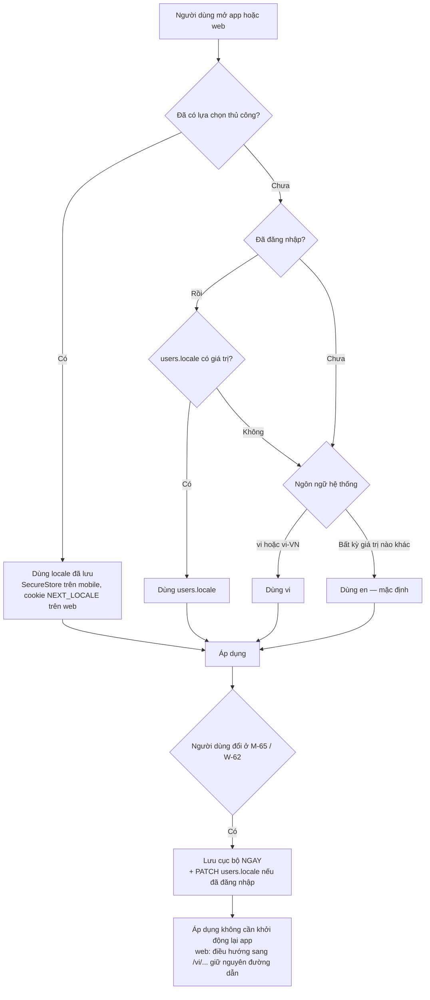

Quy tắc bổ sung:

- Web dùng tiền tố đường dẫn `/[locale]/...` với `en` **có** tiền tố (`/en/events`) để URL nhất quán và SEO rõ ràng; thêm `hreflang` cho cả hai bản.
- Chuyển locale trên web giữ nguyên toàn bộ query string, kể cả bộ lọc đang bật.
- Ngôn ngữ của **thông báo push và email** đọc từ `users.locale` ở thời điểm gửi, không phải thời điểm tạo job — người dùng có thể đổi ngôn ngữ giữa lúc job nằm trong hàng đợi.
- Chuỗi trong email và push nằm ở `notification.json`, được backend render bằng cùng thư viện ICU để không lệch với client.

### 13.9 Nội dung do người dùng tạo

| Loại nội dung | Xử lý |
|---|---|
| Tiêu đề và mô tả sự kiện | Không dịch tự động ở giai đoạn 1. Lưu `content_locale` suy ra bằng thư viện nhận diện ngôn ngữ; nếu khác locale giao diện thì hiện nhãn `Written in Vietnamese` |
| Bio hồ sơ | Tương tự, dùng cột `bio_locale` đã có trong `profiles` |
| Bình luận | Không dịch, không gắn nhãn — quá nhiễu |
| Tên địa điểm do organizer nhập | Giữ nguyên, không chuyển tự |
| Nội dung của đội ngũ (curated listing) | **Bắt buộc song ngữ** — đây là nội dung đại diện chất lượng chuẩn của sản phẩm |
| About, FAQ, Community Guidelines | Bắt buộc song ngữ, dịch thủ công, không dịch máy (E10-S2, E10-S3) |

### 13.10 Kiểm soát chất lượng i18n trong CI

| Bước CI | Script | Điều kiện fail |
|---|---|---|
| Parity khoá | `pnpm i18n:parity` | `en` có khoá mà `vi` thiếu, hoặc ngược lại |
| Cú pháp ICU | `pnpm i18n:validate` | Placeholder không khớp giữa `en` và `vi`; `vi` khai báo dạng `one` |
| Chuỗi hardcode | `pnpm lint` | ESLint `no-literal-string` phát hiện literal trong JSX/TSX |
| Khoá mồ côi | `pnpm i18n:unused` | Cảnh báo, không fail |
| Độ dài | `pnpm i18n:length` | Fail ở nhóm `notification.push.*` |
| Ảnh chụp màn hình | Playwright + Detox | Chụp 12 màn hình chính ở `en`, `vi`, `en-XA`; so sánh khác biệt bố cục |

---

## 14. Accessibility tối thiểu phải đạt

Mục tiêu: **WCAG 2.2 mức AA** cho web, và tương đương trên mobile theo hướng dẫn của từng nền tảng. Đây là mức tối thiểu bắt buộc, không phải mục tiêu phấn đấu.

### 14.1 Danh sách bắt buộc

| Mã | Hạng mục | Yêu cầu cụ thể | Cách kiểm chứng |
|---|---|---|---|
| AC-01 | Tương phản chữ | ≥ 4,5:1 với chữ thường, ≥ 3:1 với chữ ≥ 24px hoặc ≥ 19px đậm | Script `ui:contrast` trong CI |
| AC-02 | Tương phản thành phần phi văn bản | ≥ 3:1 cho viền input, icon mang nghĩa, ranh giới chip đang chọn | Kiểm tra thủ công theo checklist |
| AC-03 | Vùng chạm | ≥ 44 × 44 pt trên iOS, ≥ 48 × 48 dp trên Android; khoảng cách giữa hai vùng chạm ≥ 8 | Đo trên bản dựng thật |
| AC-04 | Màu không phải kênh thông tin duy nhất | Trạng thái "sắp hết chỗ" có cả chữ và số, không chỉ màu cam. Trạng thái đã RSVP có icon tick. | Xem lại ở chế độ ảnh xám |
| AC-05 | Nhãn cho screen reader | Mọi nút chỉ có icon phải có `accessibilityLabel` / `aria-label`. Nút `♡` là `Save this event` chứ không phải `heart` | VoiceOver và TalkBack đi hết `M-10`, `M-20`, `M-30` |
| AC-06 | Thứ tự đọc | Thứ tự DOM và thứ tự focus khớp thứ tự thị giác trên mọi màn hình | Tab đi hết trang web bằng bàn phím |
| AC-07 | Focus nhìn thấy | Vòng focus 2px `focus-ring` với offset 2px, không bao giờ `outline: none` | Kiểm tra bàn phím |
| AC-08 | Bẫy focus | Bottom sheet, modal, drawer giữ focus bên trong và trả về đúng phần tử kích hoạt khi đóng | Kiểm tra bàn phím |
| AC-09 | Skip link | Web có `Skip to main content` là phần tử focus đầu tiên | Nhấn Tab ở trang bất kỳ |
| AC-10 | Cỡ chữ động | Giao diện không vỡ khi phóng chữ tới 200%. Card sự kiện chuyển sang bố cục dọc thay vì cắt chữ | iOS Dynamic Type mức lớn nhất; Android font scale 2.0 |
| AC-11 | Thu phóng trang | Không khoá `user-scalable=no`; web cho phóng tới 400% mà không cuộn ngang | Kiểm tra thủ công |
| AC-12 | Giảm chuyển động | Tôn trọng `prefers-reduced-motion` và `Reduce Motion` của hệ điều hành; tắt parallax ảnh bìa, tắt skeleton nhấp nháy | Bật cài đặt hệ thống rồi kiểm tra |
| AC-13 | Ngôn ngữ trang | `<html lang="en">` hoặc `lang="vi"` chính xác; đoạn nội dung khác ngôn ngữ có `lang` riêng | Kiểm tra HTML |
| AC-14 | Nhãn form | Mọi input có nhãn nhìn thấy được, không chỉ dựa vào placeholder | Xem lại từng form |
| AC-15 | Lỗi form | Lỗi mô tả bằng chữ, gắn với input qua `aria-describedby`, và được thông báo qua vùng `aria-live` | Screen reader |
| AC-16 | Bản đồ có phương án thay thế | Mọi thông tin trên `M-13` đều truy cập được ở `M-10` dạng danh sách; ghim bản đồ có nhãn accessible | VoiceOver trên tab Map |
| AC-17 | Nội dung động | Số chỗ cập nhật realtime dùng `aria-live="polite"`, không cướp focus | Screen reader trong lúc có RSVP mới |
| AC-18 | Thời gian chờ | Cửa sổ xác nhận waitlist 12 giờ là đủ dài; không có bất kỳ giới hạn thời gian nào dưới 20 giây trong luồng chính | Rà soát luồng |
| AC-19 | Media | Ảnh bìa sự kiện có `alt` mô tả nội dung, không phải tên file. Ảnh trang trí có `alt=""` | Rà soát component |
| AC-20 | Đa phương thức xác thực | Không dùng CAPTCHA hình ảnh làm rào cản duy nhất; có phương án thay thế | Kiểm tra luồng đăng ký |

### 14.2 Bốn kịch bản kiểm thử accessibility bắt buộc trước mỗi lần phát hành

| # | Kịch bản | Đường đi | Tiêu chí đạt |
|---|---|---|---|
| 1 | Người dùng screen reader tìm và RSVP một sự kiện | `M-10` → `M-20` → `M-21` → thành công | Hoàn thành không cần trợ giúp thị giác; mọi trạng thái nút được đọc đúng |
| 2 | Người dùng chỉ dùng bàn phím tạo một sự kiện trên web | `W-10` → `W-30` 4 bước → publish | Không có bẫy focus; mọi bước đều tới được bằng Tab |
| 3 | Người dùng phóng chữ 200% duyệt feed và mở bộ lọc | `M-10` → `M-12` | Không mất nút chính; không cắt chữ giữa từ |
| 4 | Người dùng bật Reduce Motion đi qua onboarding | `M-01` → `M-02` → `M-10` | Không có chuyển động ngoài fade; không chóng mặt |

---

## 15. Ma trận truy vết màn hình với use case

Bảng này là công cụ kiểm tra độ phủ: mọi use case `Must` trong `02-use-case.md` phải có ít nhất một màn hình chịu trách nhiệm.

| Use case | Mô tả ngắn | Màn hình mobile | Màn hình web | Epic (`08`) | Luồng |
|---|---|---|---|---|---|
| UC-01 → UC-04 | Đăng ký và đăng nhập | `M-01`, `M-05` | `W-01` | E2 | F-01 |
| UC-02 | Xác minh email | `M-03` | `W-03` | E2 | F-01 |
| UC-05 | Onboarding lần đầu | `M-02` | `W-02` | E2 | F-02 |
| UC-06 | Quên mật khẩu | `M-06` | `W-06` | E2 | F-01 |
| UC-07 | Làm mới phiên, đăng xuất | `M-69` | `W-62` | E2 | — |
| UC-08 | Đổi ngôn ngữ | `M-65` | `W-62` | E10 | §13.8 |
| UC-09 | Duyệt ở chế độ khách | `M-10`, `M-20`, `M-05` | `W-10`, `W-20` | E5 | F-03, F-10 |
| UC-10 | Xoá tài khoản, xuất dữ liệu | `M-67` | `W-62` | E2 | — |
| UC-11 | Chỉnh sửa hồ sơ | `M-52` | `W-50` | E3 | — |
| UC-12 | Xem hồ sơ công khai | `M-51` | `W-51` | E3 | — |
| UC-13 | Xác minh email và SĐT | `M-04`, `M-53` | `W-53` | E3 | — |
| UC-15 | Chỉ số tin cậy | `M-53` | `W-53` | E3 | — |
| UC-16 | Đánh giá sau hoạt động | `M-55`, `M-45` | — | E3 | — |
| UC-17 | Riêng tư hồ sơ | `M-64` | `W-62` | E3 | — |
| UC-18 | Chặn người dùng | `M-60`, `M-66` | `W-62` | E8 | F-08 |
| UC-19 → UC-21 | Tạo, lưu nháp, xuất bản | `M-30` → `M-32` | `W-30` | E4 | F-06 |
| UC-20 | Chọn địa điểm, gán khu vực | `M-31` | `W-30` bước 2 | E4 | F-06 |
| UC-22 | Chỉnh sửa sự kiện đã đăng | `M-34` | `W-34` | E4 | F-07 |
| UC-23 | Huỷ sự kiện | `M-35` | `W-40` | E4 | F-07 |
| UC-24 | Sự kiện lặp lại | `M-33` | `W-30` | E4 | F-06 |
| UC-25 | Quản lý người tham dự | `M-42` | `W-42` | E6 | F-07 |
| UC-27 | Điểm danh QR | `M-43`, `M-46` | — | E6 | F-07 |
| UC-28 | Nhân bản sự kiện | `M-41` | `W-40` | E4 | F-07 |
| UC-29 | Feed "Tuần này ở Đà Nẵng" | `M-10` | `W-10`, `W-17` | E5 | F-03 |
| UC-30 | Tìm kiếm toàn văn | `M-11` | `W-11` | E5 | F-03 |
| UC-31 | Lọc nâng cao | `M-12` | `W-10` sidebar | E5 | F-03, §9 |
| UC-32 | Quanh vị trí hiện tại | `M-15`, `M-07` | `W-10` | E5 | F-03 |
| UC-33 | Bản đồ | `M-13`, `M-13a` | `W-13` | E5 | §9.3 |
| UC-34 | Lưu bộ lọc, cảnh báo | `M-16` | `W-10` | E5 | §9.1 |
| UC-35 | Lưu vào quan tâm | `M-44` | `W-44` | E5 | — |
| UC-37 | Lịch tháng | `M-14` | `W-14` | E5 | — |
| UC-38 → UC-39 | RSVP và huỷ RSVP | `M-20`, `M-21` | `W-20` | E6 | F-04 |
| UC-40 | Waitlist và thăng hạng | `M-26` | `W-20` | E6 | F-05 |
| UC-41 | Câu hỏi khi đăng ký | `M-21`, `M-37` | `W-30` | E6 | F-04, F-06 |
| UC-42 | Thêm vào lịch cá nhân | `M-27` | `W-20` | E6 | F-04 |
| UC-43 | Xem người tham dự | `M-22` | `W-22` | E6 | F-04 |
| UC-44 | Mời người khác | `M-28` | `W-20` | E11 | F-04 |
| UC-45 | Bình luận | `M-23` | `W-20` | E7 | — |
| UC-46 | Chat nhóm sự kiện | `M-24` | — | E7 | — |
| UC-48 | Chia sẻ ra ngoài | `M-25` | `W-20` | E11 | F-10 |
| UC-50 | Theo dõi organizer | `M-54`, `M-51` | `W-51` | E7 | — |
| UC-51 → UC-54 | Push, nhắc lịch, trung tâm thông báo | `M-08`, `M-61`, `M-63` | `W-61`, `W-62` | E7 | §10.5 |
| UC-55 | Bản tin hằng tuần | `M-63` | `W-62` | E7 | §10.5 |
| UC-60 | Báo cáo vi phạm | `M-60` | `W-20` | E8 | F-08 |
| UC-61 → UC-62 | Xử lý báo cáo, gỡ nội dung | — | `AD-30`, `AD-31` | E9 | F-08 |
| UC-63 | Khiếu nại | `M-68` | `AD-32` | E9 | F-08 |
| UC-65 → UC-67 | Curate và mời nhận listing | — | `AD-20` → `AD-23` | E9 | F-09 |
| UC-68 | Nhận quyền listing | `M-29` | `W-29` | E9 | F-09 |
| UC-70 | Quản lý khu vực và loại hình | — | `AD-50`, `AD-51` | E9 | — |
| UC-71 | Analytics sản phẩm | — | `AD-10` | E11 | — |
| UC-72 | Analytics organizer | `M-47` | `W-47` | E11 | — |
| UC-73 → UC-76 | Quản trị, flag, audit, health | — | `AD-40` → `AD-80` | E9 | — |

**Kết luận độ phủ:** toàn bộ 44 use case `Must` đều có màn hình chịu trách nhiệm. Các use case `Won't` (UC-14, UC-36, UC-56 → UC-59) không có màn hình trong tài liệu này, đúng phạm vi giai đoạn 1.

---

## 16. Rủi ro UX và việc phải làm tiếp

### 16.1 Rủi ro UX đã lường trước

| Mã | Rủi ro | Mức | Dấu hiệu sớm | Phương án xử lý |
|---|---|---|---|---|
| UX-R1 | **Feed trống ở tuần đầu ra mắt** phá huỷ ấn tượng đầu tiên | Cao | `ES-01` xuất hiện quá 2% phiên | Đội curate giữ ngưỡng 20 sự kiện mở; bật `ES-03` để mượn nội dung khu vực lân cận |
| UX-R2 | Người dùng bỏ ở bước xin quyền vị trí | Trung bình | Tỷ lệ cấp quyền dưới 40% | Không xin quyền ở màn hình đầu; dùng `home_area_id` làm phương án dự phòng đầy đủ |
| UX-R3 | Bộ lọc quá nhiều tiêu chí khiến người dùng lọc về 0 kết quả | Cao | `ES-02` quá 25% lần áp bộ lọc | Facet count thật ở mọi chip; gợi ý nới lỏng theo thứ tự §7.3 |
| UX-R4 | Wizard tạo sự kiện 4 bước quá dài với organizer nghiệp dư | Trung bình | Tỷ lệ bỏ giữa chừng trên 50% | Tự lưu nháp; ngân sách 90 giây ở §7.6; nút `Save & exit` ở mọi bước |
| UX-R5 | Nhãn "listing chưa có chủ" làm giảm niềm tin thay vì tăng minh bạch | Trung bình | Tỷ lệ RSVP của listing curate thấp hơn 40% so với self-serve | Thử nghiệm A/B từ ngữ; đổi sang `Verified by our team on 25 Aug` nhấn vào việc đã kiểm chứng |
| UX-R6 | Tiếng Việt làm vỡ bố cục ở nhãn nút và tab | Trung bình | Ảnh chụp màn hình CI khác biệt | Pseudo-locale `en-XA`; giới hạn độ dài ở §13.7 |
| UX-R7 | Nhầm lẫn múi giờ khiến người dùng bỏ lỡ sự kiện | Cao | Tỷ lệ no-show cao bất thường ở người dùng có múi giờ thiết bị khác GMT+7 | Quy tắc T-1 → T-3; `TimezoneNote` bắt buộc |
| UX-R8 | Bản đồ nặng làm chậm khởi động app | Trung bình | Thời gian tới tương tác trên 4 giây | Bản đồ là tab lazy, không tải bundle ở khởi động |
| UX-R9 | Waitlist với cửa sổ 12 giờ quá dài với sự kiện diễn ra trong ngày | Trung bình | Tỷ lệ chỗ trống bị bỏ phí | Rút ngắn còn 30 phút khi sự kiện bắt đầu trong dưới 2 giờ (đã có trong F-05) |
| UX-R10 | Push quá nhiều khiến người dùng tắt vĩnh viễn | Cao | Tỷ lệ tắt push trên 25% | Trần 4 push/tuần cho người chưa RSVP; gộp vào digest |

### 16.2 Việc phải làm tiếp, có người chịu trách nhiệm

| # | Việc | Đầu ra | Ai | Hạn |
|---|---|---|---|---|
| 1 | Dựng `packages/ui/tokens.ts` từ §12.2 → §12.5 và cắm vào Tailwind 4 `@theme` | File token + Storybook | Designer + FE | Trước Sprint S1 |
| 2 | Dựng khung `packages/i18n` với 14 file namespace, `en` đầy đủ, `vi` là bản sao chờ dịch | Package chạy được | FE | Sprint S0 |
| 3 | Viết 4 script kiểm soát i18n và cắm vào CI | Workflow `ci.yml` | FE | Sprint S1 |
| 4 | Prototype có thể bấm cho 6 wireframe ở §8 và thử nghiệm với 5 expat thật ở An Thượng | Báo cáo phát hiện | PO | Trước Sprint S3 |
| 5 | Chốt bản dịch tiếng Việt do người bản ngữ viết, không dịch máy (E10-S2) | `vi/*.json` hoàn chỉnh | Community Manager | Sprint S8 |
| 6 | Đo ngân sách 90 giây tạo sự kiện trên thiết bị thật với 5 organizer | Video + số liệu | Mobile | Sprint S3 |
| 7 | Chạy 4 kịch bản accessibility ở §14.2 | Checklist đã ký | QA | Trước mỗi lần phát hành |
| 8 | Chuẩn bị 37 nội dung empty state ở cả `en` và `vi` trước khi có dữ liệu thật | Nội dung đã duyệt | PO + CM | Sprint S2 |
| 9 | Xác minh danh sách 12 khu vực và bí danh tìm kiếm với người bản địa | `search_aliases` đã seed | PO | Sprint S2 |
| 10 | Thiết lập đo lường `time_to_first_result_ms` và `onboarding_aha` | Sự kiện analytics chạy được | TL | Sprint S6 |

### 16.3 Ba câu hỏi còn mở

1. **Tab thứ hai nên là Map hay Saved?** Tài liệu này chọn Map vì định vị hyperlocal, nhưng nếu thử nghiệm cho thấy dưới 15% phiên mở tab Map trong 4 tuần đầu, nên thay bằng Saved và đưa Map thành chế độ xem của Discover.
2. **Có nên hiển thị sự kiện đã đầy trong feed mặc định không?** Hiện đang hiển thị để người dùng biết đường vào waitlist. Rủi ro là feed trông "không dùng được" khi tỷ lệ sự kiện đầy cao. Cần đo lại sau 6 tuần.
3. **Ngưỡng nào thì tự động mở rộng khu vực?** `ES-03` mượn nội dung khu vực lân cận, nhưng chưa chốt khoảng cách tối đa được coi là "lân cận". Đề xuất tạm: 3 km theo đường chim bay hoặc chung ranh giới quận, cần kiểm chứng bằng hành vi thật.

---

*Tài liệu 10 — Thiết kế UX, Luồng màn hình & i18n. Cập nhật 31/08/2026. Thay đổi tài liệu này phải đồng bộ với `02-use-case.md` (mã UC) và `08-roadmap-va-ke-hoach-trien-khai.md` (mã Epic và Story).*
