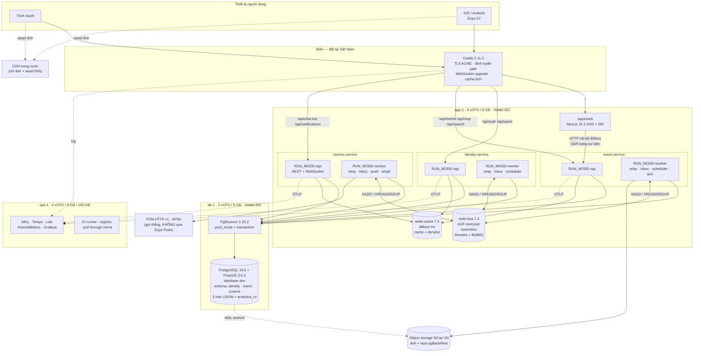
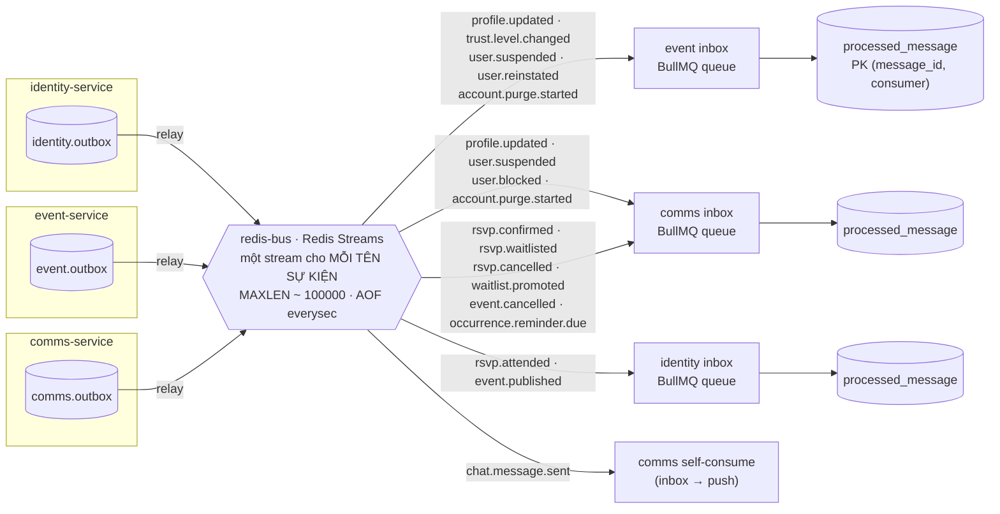
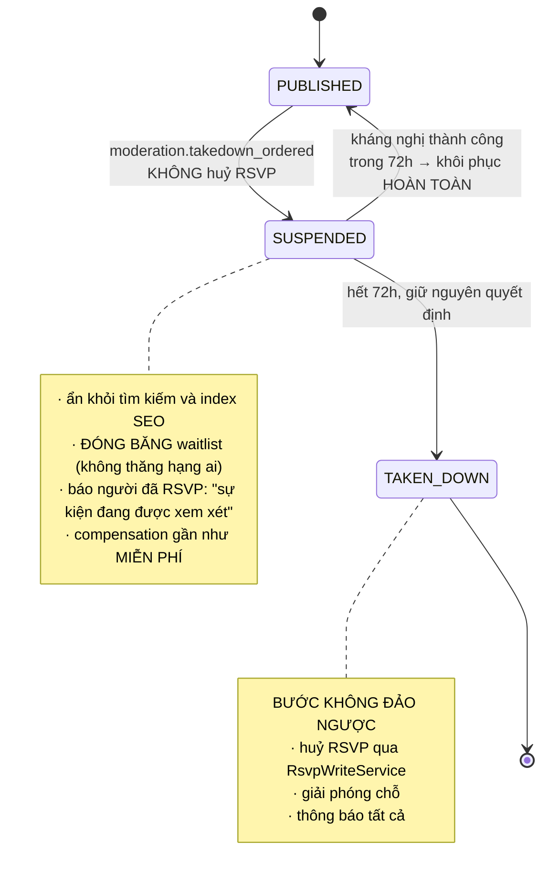

# 12 — Kiến trúc microservices cho Da Nang Connect (bản thi công được)

> **Trạng thái**: bản chốt sau phản biện đối kháng. Tài liệu này **thay thế và hoà giải** sáu bản phác thảo kiến trúc trước đó (KC1–KC6). Ở mọi chỗ sáu bản đó mâu thuẫn nhau, tài liệu này ra một quyết định duy nhất và ghi rõ bên nào bị loại cùng lý do.
>
> **Ngày**: 01/09/2026 · **Mốc ra mắt**: M6 = 25/02/2027 (≈26 tuần) · **Đội**: 2 lập trình viên + 1 founder
>
> **Nguyên tắc biên tập**: mọi phiên bản thư viện trong tài liệu này trỏ về `docs/adr/versions.md` — không lặp lại số phiên bản ở nhiều chỗ. Mọi con số tiền trỏ về mục 8. Mọi luật bất khả xâm phạm trỏ về mục 13.

---

## Mục lục

1. [Tóm tắt điều hành](#1-tóm-tắt-điều-hành)
2. [Sơ đồ kiến trúc tổng thể](#2-sơ-đồ-kiến-trúc-tổng-thể)
3. [Danh sách service](#3-danh-sách-service)
4. [Ranh giới transaction và chứng minh tính đúng của đếm chỗ RSVP](#4-ranh-giới-transaction-và-chứng-minh-tính-đúng-của-đếm-chỗ-rsvp)
5. [Giao tiếp giữa các service](#5-giao-tiếp-giữa-các-service)
6. [Chiến lược dữ liệu](#6-chiến-lược-dữ-liệu)
7. [Hạ tầng và triển khai](#7-hạ-tầng-và-triển-khai)
8. [Bảng chi phí ba mốc và so sánh thẳng với monolith](#8-bảng-chi-phí-ba-mốc-và-so-sánh-thẳng-với-monolith)
9. [Quan sát, cảnh báo và runbook sự cố](#9-quan-sát-cảnh-báo-và-runbook-sự-cố)
10. [Monorepo và packages dùng chung](#10-monorepo-và-packages-dùng-chung)
11. [Lộ trình tách service](#11-lộ-trình-tách-service)
12. [Cái giá và rủi ro — bảng trung thực, kèm đường lui](#12-cái-giá-và-rủi-ro--bảng-trung-thực-kèm-đường-lui)
13. [Quyết định đã chốt và câu hỏi còn mở](#13-quyết-định-đã-chốt-và-câu-hỏi-còn-mở)

---

## 1. Tóm tắt điều hành

### 1.1 Ba service, không phải năm

**Ra mắt M6 với ĐÚNG BA service**, mỗi service một tiến trình Node, một schema PostgreSQL, một DB role, một Docker image, deploy độc lập:

| Service | Bounded context | Vì sao là một ranh giới thật |
|---|---|---|
| **identity-service** | Danh tính, hồ sơ, trust T0–T5 | Chứa toàn bộ PII, gần như đóng băng sau M3, mọi service khác phụ thuộc nó qua JWT verify **cục bộ** chứ không qua lời gọi mạng |
| **event-service** | Sự kiện, occurrence, RSVP, waitlist, check-in, tìm kiếm, địa lý | Đảo ACID duy nhất. Ranh giới này do **ràng buộc 5** vẽ ra, không do sở thích kiến trúc |
| **comms-service** | Chat 1-1 (WebSocket) + thông báo (push/email/inbox) | Hồ sơ runtime khác hẳn (kết nối dài, gọi ra ngoài chậm), và là nơi duy nhất được phép có timeout 30 giây trong tiến trình |

**admin-service là service thứ tư, hoãn sang M7.** Tháng đầu sau ra mắt, kiểm duyệt và curate chạy bằng SQL script + Metabase trên role `analytics_ro`. Cột `moderation_state` và `featured_flag` đã nằm sẵn trên bảng của `event-service` từ M2, nên khi tách admin ra thì không phải migrate dữ liệu.

**Bốn ứng viên bị từ chối dứt khoát và sẽ không được nhắc lại**: `geo-service`, `search-service` (hay `svc-discovery`), `media-service`, và **một tiến trình `gateway`/BFF riêng**. Lý do từng cái ở mục 3.4. Bất kỳ tài liệu nào trong repo còn nhắc `svc-discovery`, `svc-messaging`, `geo-service`, `safety-service`, `social-service`, `moderation-service`, `notifications-service`, `apps/gateway` đều **đã lỗi thời** và phải sửa trỏ về mục 3 của tài liệu này.

### 1.2 Vì sao ba chứ không phải năm — con số, không phải khẩu vị

Đây là quyết định định lượng, không phải quyết định thẩm mỹ:

| Chỉ số | 5 service | 3 service | Chênh |
|---|---:|---:|---|
| Tiến trình Node thường trú (api + worker) | 10–11 | 7 (gồm cả Next.js) | −3 đến −4 |
| RAM thường trú ứng dụng | ~2,2 GB | ~1,4 GB | −800 MB → giữ app-1 ở hạng 8 GB thay vì phải nhảy 16 GB (**−58 USD/tháng**) |
| Bộ Dockerfile / CI job / dashboard / alert set / DB role / migration chain | 5 | 3 | −2 bộ, ước **−5 đến −7 tuần-người** |
| Bảng `user_snapshot` phải nuôi | 4 bản sao | 2 bản sao | −2 consumer, −2 job backfill, −2 metric lag |
| Chi phí một tính năng cắt ngang hồ sơ (mục 12.4) | 20–40× monolith | 7–12× monolith | giảm hơn một nửa |
| Tổng chi phí hạ tầng mốc A (có dự phòng 15%) | ~270–295 USD → **VƯỢT TRẦN** | **237 USD** → dưới trần | biên còn 13 USD |

Nói thẳng: **phương án 5 service vượt ngân sách 250 USD và vượt quỹ thời gian 26 tuần.** Phương án 3 service vẫn là microservices thật — ba tiến trình, ba schema, ba role, bus bất đồng bộ, deploy độc lập, và **giữ nguyên toàn bộ đường tách thêm ở Giai đoạn 2 (nhà ở) và Giai đoạn 3 (y tế)**, nơi kiến trúc này mới thật sự hoàn vốn.

### 1.3 Cái giá phải trả — nói trước, không giấu

| Khoản | Lượng hoá |
|---|---|
| Công việc nền tảng trước dòng nghiệp vụ đầu tiên | **9–11 tuần-người** trên quỹ 52 tuần-người = **18–21%** (mục 12.2) |
| Tiền hạ tầng mốc A | **+36 USD/tháng base, +41 USD có dự phòng** so với monolith (+21%) — mục 8 |
| Công nghệ hạ tầng mới phải vận hành được lúc 2h sáng | **12 thứ**, cộng **4 mô hình tư duy mới**, cộng **4 bản major mới** so với cái đội đang biết — mục 12.3 |
| Mã hạ tầng tự viết và tự bảo trì mãi mãi | ~700–900 LOC (`@dnc/bus` outbox/relay/inbox, `@dnc/auth`, propagation OTel qua bus và queue) |
| Tính năng cắt ngang | 7–12× thời gian so với monolith (mục 12.4) |
| Nhất quán cuối người dùng NHÌN THẤY | Đổi tên/avatar hiện sau ~2–5 giây ở thẻ sự kiện và chat; hạ trust có hiệu lực ngay ở đường ghi nhưng token cũ vẫn hiển thị badge cũ tới 15 phút |
| Không JOIN được nữa | Mọi báo cáo vận hành cắt ngang context là một read model mới phải nuôi |

### 1.4 Bốn điều kiện để kiến trúc này thành công

Nếu **bất kỳ điều nào** trong bốn điều dưới đây không được giữ, hãy dừng lại và kích hoạt đường lui ở mục 12.6 thay vì cố cho xong.

1. **Sprint 0 phải hoàn thành năm miếng vá cho ràng buộc 5** (trigger đếm lại ở tầng DB, `RsvpWriteService` là cửa ghi duy nhất, `lock_timeout` ở tầng role, từ vựng `RsvpStatus` khoá trong `@dnc/contracts`, bài test 25-request chạy distributed trong CI). Đây là ràng buộc duy nhất mà **sai một lần là mất niềm tin cộng đồng và không vá được sau khi ra mắt**.
2. **Correlation ID + OpenTelemetry + Tempo + bull-board phải có từ commit đầu tiên.** Không phải hạng mục tối ưu về sau. Không có chúng thì ràng buộc 7 gãy ngay tuần đầu có sự cố thật.
3. **Chế độ chạy gộp (`DNC_MODE=mono`) phải chạy trong CI mỗi PR** — không phải để lập trình viên dùng hằng ngày, mà để **giữ đường lui còn sống**. Đường lui thối thì không còn đường lui.
4. **Cổng quyết định tuần 12 (≈24/11/2026) phải được founder ký**, với tiêu chí viết sẵn ở mục 12.6. Không để dev tự cân nhắc ở tuần 20.

### 1.5 Bảy ràng buộc cứng — trạng thái sau thiết kế này

| # | Ràng buộc | Trạng thái | Ghi chú |
|---|---|---|---|
| 1 | Tự host tại VN, chịu được đứt cáp | ✅ ĐẠT sau ba sửa chữa | Bỏ Cloudflare khỏi đường API/SSR; bỏ Expo Push Service, đẩy thẳng FCM/APNs; registry mirror Docker tại VN. Chi tiết 7.6 |
| 2 | `ST_DWithin` + `ST_Contains` trên PostGIS | ✅ ĐẠT | Hình học nằm cùng schema `event`; không có geo-service, không có lời gọi mạng trên đường tìm kiếm. Mục 6.5 |
| 3 | SSR SEO cho trang sự kiện | ✅ ĐẠT | Next.js gọi HTTP thẳng `event-service` qua DNS Docker, một round-trip SQL nhờ `host_ref`; ISR + serve-stale-on-error. Mục 6.4 |
| 4 | iOS + Android thật (Expo) | ✅ ĐẠT | Không đổi. Bổ sung runbook build cục bộ khi mất mạng quốc tế (7.6) |
| 5 | Đếm RSVP đúng tuyệt đối | ✅ ĐẠT **có điều kiện** | Chỉ đúng nếu Sprint 0 làm đủ năm miếng vá ở mục 4. Trước đó, "lưới an toàn" được quảng cáo trong KC1/KC3 là **không có thật** |
| 6 | < 250 USD/tháng ở 500 user | ⚠️ ĐẠT **biên hẹp**: 237 USD có dự phòng | Biên 13 USD. Chưa có báo giá VPS VN thật — việc số 1 của tuần này. Mục 8 |
| 7 | 2 người gỡ lỗi được lúc 2h sáng | ⚠️ **CHỊU ÁP LỰC NẶNG NHẤT** | Đã cắt từ ~20 công nghệ xuống 12. Vẫn nặng hơn monolith một cách khách quan. Bù bằng runbook 7 bước, dashboard War Room, và chính sách on-call ở 9.6 |

---

## 2. Sơ đồ kiến trúc tổng thể

### 2.1 Toàn cảnh runtime (mốc A — 500 user)



### 2.2 Luồng sự kiện — ai phát, ai nghe



**Đọc sơ đồ này lúc 2h sáng**: một sự kiện đi đúng ba chặng — *bảng outbox trong schema của người phát* → *Redis Stream mang đúng tên sự kiện* → *BullMQ inbox queue của người nghe*. Cả ba chặng đều nhìn được: chặng 1 bằng `psql`, chặng 2 bằng `XINFO STREAM`, chặng 3 bằng **bull-board**. Không có chặng thứ tư và không có hệ thống message thứ hai.

---

## 3. Danh sách service

### 3.1 Bảng tổng hợp

| | identity-service | event-service | comms-service | *(M7)* admin-service |
|---|---|---|---|---|
| **Thư mục** | `services/identity` | `services/event` | `services/comms` | `services/admin` |
| **Schema** | `identity` | `event` | `comms` | `admin` |
| **DB role** | `svc_identity` | `svc_event` | `svc_comms` | `svc_admin` |
| **Image** | `registry.dnc.vn/identity:<sha>` | `registry.dnc.vn/event:<sha>` | `registry.dnc.vn/comms:<sha>` | — |
| **RUN_MODE** | `api`, `worker` | `api`, `worker` | `api`, `worker` | `api`, `worker` |
| **Cổng nội bộ** | 3001 | 3002 | 3003 | 3004 |
| **Route ở Caddy** | `/api/auth/*`, `/api/users/*`, `/.well-known/jwks.json` | `/api/events/*`, `/api/occurrences/*`, `/api/search`, `/api/geo/*` | `/api/chat/*`, `/api/notifications/*`, `/api/devices/*`, `/ws` | `/api/v1/admin/*` (IP allowlist) |

### 3.2 identity-service

**Trách nhiệm**: sở hữu danh tính và mọi PII. Cấp và xoay khoá JWT. Tính và lưu trust level T0–T5. Là **orchestrator duy nhất** của saga xoá tài khoản.

**Bảng sở hữu** (schema `identity`):

| Nhóm | Bảng |
|---|---|
| Danh tính | `user_account`, `credential`, `oauth_identity`, `session`, `refresh_token`, `signing_key` |
| Hồ sơ & trust | `profile`, `verification`, `trust_ledger`, `user_block`, `user_language` |
| Nền tảng | `outbox`, `processed_message`, `dead_letters`, `account_deletion_saga`, `saga_participant` |

> `credential` và `refresh_token` nằm trong **schema con `identity_secret`** với GRANT hẹp hơn, để một lỗi SQL injection ở đường hồ sơ không đọc được hash mật khẩu. Không tốn thêm container.

**API**

| Method | Path | Ghi chú |
|---|---|---|
| `POST` | `/api/auth/otp/request`, `/api/auth/otp/verify` | Rate limit chặt nhất hệ thống |
| `GET`/`POST` | `/api/auth/oidc/:provider` | Google, Apple, Facebook |
| `POST` | `/api/auth/refresh`, `/api/auth/logout` | Xoay refresh token |
| `GET` | `/api/users/:id` | Hồ sơ công khai |
| `PATCH` | `/api/me` | Sửa hồ sơ |
| `DELETE` | `/api/me`, `POST /api/me/restore` | Saga xoá tài khoản, ân hạn 30 ngày |
| `GET` | `/.well-known/jwks.json` | Cache-Control 600s |
| `GET` | `/internal/users/:id/state` | **Chỉ mạng nội bộ.** Dùng cho backfill và đối soát, **cấm gọi trên đường phục vụ request** |

**Sự kiện phát ra**

| Subject | Khi nào | Ai nghe |
|---|---|---|
| `dnc.identity.user.registered.v1` | Đăng ký xong | comms (chào mừng) |
| `dnc.identity.profile.updated.v1` | Đổi tên/avatar/pronouns/badge | event, comms |
| `dnc.identity.trust.level_changed.v1` | Trust đổi | event, comms |
| `dnc.identity.user.suspended.v1` / `.reinstated.v1` | Khoá / mở khoá | event, comms |
| `dnc.identity.account.deletion_requested.v1` | Yêu cầu xoá | comms |
| `dnc.identity.account.deletion_cancelled.v1` | Rút yêu cầu | comms |
| `dnc.identity.account.purge_started.v1` | Hết ân hạn 30 ngày | event, comms |
| `dnc.identity.account.purged.v1` | Xoá cứng xong | comms |

**Sự kiện lắng nghe**: `dnc.event.rsvp.attended.v1` (cộng điểm trust), `dnc.event.event.published.v1` (đếm sự kiện đã tổ chức), `dnc.event.purge.completed.v1` / `dnc.comms.purge.completed.v1` (thu saga).

---

### 3.3 event-service — trái tim

**Trách nhiệm**: sự kiện, lịch diễn ra, RSVP, waitlist, check-in, tìm kiếm toàn văn + địa lý, và trạng thái kiểm duyệt của chính nội dung nó sở hữu. **Đây là service duy nhất có ràng buộc ACID cứng.**

**Bảng sở hữu** (schema `event`):

| Nhóm | Bảng |
|---|---|
| Đảo ACID (**không bao giờ tách**) | `event`, `event_occurrence`, `rsvp`, `waitlist_entry`, `check_in` |
| Phụ trợ sự kiện | `event_cohost`, `event_photo`, `event_category`, `event_tag` |
| Tham chiếu địa lý | `geo_area` (vật chất hoá từ `@dnc/geo`, chỉ đọc, cập nhật bằng migration) |
| Bản sao đọc | `user_snapshot` (**hiển thị**), `user_state` (**trạng thái thật, được phép dùng cho phân quyền** — xem 6.3) |
| Kiểm duyệt tại chỗ | cột `moderation_state`, `featured_flag`, `suspended_until` trên `event` và `event_occurrence` |
| Nền tảng | `outbox`, `processed_message`, `dead_letters`, `idempotency_key` |

**API**

| Method | Path | Ghi chú |
|---|---|---|
| `POST`/`PATCH`/`DELETE` | `/api/events`, `/api/events/:id` | Tạo/sửa/huỷ; T0–T1 vào `PENDING_REVIEW` |
| `POST` | `/api/occurrences/:id/rsvp` | **Header `Idempotency-Key` bắt buộc** |
| `DELETE` | `/api/occurrences/:id/rsvp` | Huỷ + thăng hạng waitlist trong cùng transaction |
| `POST` | `/api/occurrences/:id/rsvp/confirm` | Xác nhận suất `held` được thăng hạng |
| `POST` | `/api/occurrences/:id/checkin` | Quét mã tại sự kiện |
| `GET` | `/api/search?q=&area=&lat=&lng=&radius=&from=&to=&category=` | **Một câu SQL**: GIN + GIST |
| `GET` | `/api/events/:slug` | Đường SSR — Next.js gọi thẳng, timeout 800ms |
| `GET` | `/api/geo/areas` | 6 khu vực, cache 24h ở Caddy |

**Sự kiện phát ra**

| Subject | Payload cốt lõi |
|---|---|
| `dnc.event.event.published.v1` / `.updated.v1` / `.cancelled.v1` | `eventId`, `slug`, `organizerId`, `areaId` |
| `dnc.event.rsvp.confirmed.v1` / `.waitlisted.v1` / `.cancelled.v1` | `occurrenceId`, `userId`, `position` |
| `dnc.event.waitlist.promoted.v1` | `occurrenceId`, `userId`, `holdExpiresAt` |
| `dnc.event.rsvp.hold_expired.v1` | Suất giữ chỗ hết hạn |
| `dnc.event.rsvp.attended.v1` | Check-in thành công → nuôi trust |
| `dnc.event.occurrence.reminder.due.v1` | Scheduler phát trước 24h và 2h |
| `dnc.event.event.moderation_state_changed.v1` | Cho admin read model (M7) |
| `dnc.event.purge.completed.v1` | Tham gia saga xoá tài khoản |

**Sự kiện lắng nghe**: `profile.updated` (nuôi `user_snapshot`), `trust.level_changed` + `user.suspended` + `user.reinstated` (nuôi `user_state`), `account.purge_started` (ẩn danh + huỷ occurrence tương lai).

---

### 3.4 comms-service — chat và thông báo gộp làm một

**Trách nhiệm**: chat 1-1 realtime, và toàn bộ thông báo ra ngoài (push, email, inbox trong app, digest tuần).

> **Vì sao gộp chat với notification** — đây là chỗ tài liệu này khác KC1 rõ nhất. KC1 tách chat riêng với lý do "deploy `event-service` ba lần/tuần không được ngắt chat ba lần". Nhưng Docker Compose **không có rolling update** (mục 7.1), nên **chính chat-service cũng rớt toàn bộ WebSocket mỗi lần deploy chính nó**; và vì `@dnc/contracts`, `@dnc/auth`, `@dnc/bus` là package không build dùng chung, phần lớn thay đổi hạ tầng chạm mọi service. Lợi ích được nêu **không thành hiện thực**, trong khi chi phí (một container, một schema, một role, một bộ CI/dashboard/alert) trả đủ. Ngoài ra `notification` vốn là service duy nhất phải nghe cả `rsvp.*` lẫn `chat.*`, nên gộp hai cái này lại là gộp đúng chỗ. Bù lại bằng ba cam kết kỹ thuật ở 3.5.

**Bảng sở hữu** (schema `comms`):

| Nhóm | Bảng |
|---|---|
| Chat | `conversation`, `conversation_participant`, `message`, `read_receipt`, `chat_attachment` |
| Thông báo | `device_token`, `notification_preference`, `quiet_hours`, `notification_log`, `inbox_item`, `digest_subscription` |
| Bản sao đọc | `user_snapshot` (hiển thị), `user_state` (chặn chat với người bị khoá / bị block) |
| Nền tảng | `outbox`, `processed_message`, `dead_letters` |

**API**: `GET /api/chat/conversations`, `GET /api/chat/conversations/:id/messages?cursor=`, `POST /api/chat/conversations`, `WS /ws`, `POST /api/devices`, `GET`/`PATCH /api/notifications/preferences`, `GET /api/notifications/inbox`.

**Sự kiện phát ra**: `dnc.comms.chat.message_sent.v1`, `dnc.comms.chat.conversation_opened.v1`, `dnc.comms.notification.delivered.v1`, `dnc.comms.notification.failed.v1`, `dnc.comms.purge.completed.v1`.

**Sự kiện lắng nghe**: gần như tất cả — `rsvp.confirmed`, `rsvp.waitlisted`, `rsvp.cancelled`, `waitlist.promoted`, `rsvp.hold_expired`, `event.cancelled`, `occurrence.reminder.due`, `profile.updated`, `trust.level_changed`, `user.suspended`, `user.blocked`, `account.deletion_requested`, `account.purge_started`.

### 3.5 Ba cam kết kỹ thuật bắt buộc cho chat gộp

Vì chat không còn được deploy độc lập với notification, ba việc sau **phải làm từ M2**, không phải "để sau":

1. **Client tự phục hồi.** SDK chat trên web và mobile phải reconnect với exponential backoff (1s → 30s, jitter), và sau khi kết nối lại phải `GET /messages?cursor=<id tin cuối đã nhận>` để lấp lỗ hổng. Người dùng thấy một chấm "đang kết nối lại", không thấy mất tin.
2. **Backplane fan-out viết ngay từ đầu**, dù mốc A chỉ chạy một replica. Dùng Redis pub/sub trên `redis-cache` (kênh `ws:user:{userId}`). Nếu để sau, ở mốc B khi chạy hai replica sẽ xuất hiện lỗi "A không thấy tin của B" cực khó lần.
3. **Deploy vào khung giờ thấp điểm.** Script `make deploy SVC=comms` từ chối chạy ngoài 02:00–05:00 giờ VN trừ khi truyền `FORCE=1`. E2E phải có kịch bản *restart giữa cuộc trò chuyện → reconnect → không mất tin nhắn*; nếu không kiểm thì lời hứa "chat không bị ngắt" là lời hứa suông.

### 3.6 Bốn ứng viên bị từ chối — và vì sao

| Ứng viên | Từ chối vì | Thay bằng |
|---|---|---|
| **geo-service** | 6 khu vực Đà Nẵng là **6 dòng dữ liệu tham chiếu**, đổi khi địa giới hành chính thay đổi (vài năm một lần). Biến nó thành service nghĩa là thêm một container, một schema, một role, một consumer `area_ref` + job đối soát đêm **cho mỗi service tiêu thụ**, và **một lời gọi đồng bộ `POST /internal/geo/resolve` nằm trên đường ghi tạo sự kiện** — đúng thứ nguy hiểm nhất mà mục 5.2 cấm. Ước ~1,5–2 tuần-người cho một bảng 6 dòng | Package `@dnc/geo` chứa GeoJSON 6 polygon (có version, commit vào git) + một migration dùng chung vật chất hoá bảng `geo_area` vào schema nào cần. Gán `area_id` lúc tạo sự kiện trở thành **một câu `ST_Contains` cục bộ trong chính transaction tạo event** — không lời gọi mạng nào |
| **search-service / svc-discovery** | Index tìm kiếm là read model dẫn xuất từ chính dữ liệu event. Tách ra = thêm projection, thêm độ trễ, thêm job reindex, thêm câu hỏi "sao sự kiện tôi vừa tạo chưa hiện" lúc 2h sáng. Corpus ước ~10k tài liệu sau năm đầu, trong khi GIN xử lý hàng triệu dòng | `tsvector` + `unaccent` + `pg_trgm` + generated column + GIN, **cùng schema** với `location geography` + GIST. "Từ khoá + khu vực + bán kính + thời gian" là **một câu SQL**. Cầu chì tách: p95 > 300ms **hoặc** corpus > 200k tài liệu (mục 11) |
| **media-service** | Phần nặng do object storage và CDN gánh. Phần của ta là presigned URL (~100 dòng) và sinh ảnh dẫn xuất | `@dnc/media` cho presign; sinh ảnh chạy trong `event-service` `RUN_MODE=worker`. Tách container, không tách codebase |
| **gateway / BFF riêng (tiến trình NestJS)** | Là +1 container, +1 network hop trên đúng đường SSR mà ràng buộc 3 quan tâm, +1 điểm chết, và là chỗ duy nhất từng được dùng để biện minh cho việc cần request/reply trên bus. Bỏ nó đi thì lựa chọn message broker trở nên dễ hẳn (mục 5.3) | Caddy định tuyến theo path (cấu hình, 3 route tĩnh). Next.js server component gọi thẳng `http://event-service:3002` qua DNS nội bộ Docker |

> **Ghi chú về "Caddy chỉ là cấu hình, không có on-call"** — câu đó trong KC1 **sai và tài liệu này bác bỏ**. Caddy đứng giữa người dùng và mọi thứ: ACME renew thất bại, WebSocket upgrade hỏng, cache header sai đều đánh thức người trực. Nó được đối xử như một thành phần vận hành thật: có healthcheck, có alert "cert còn < 14 ngày", và có kịch bản e2e kiểm WebSocket upgrade.

---

## 4. Ranh giới transaction và chứng minh tính đúng của đếm chỗ RSVP

### 4.1 Bất biến cần bảo vệ, viết chính xác

```
Với mọi occurrence o:
  COUNT(*) FROM rsvp WHERE occurrence_id = o.id AND status IN ('confirmed','held')  ≤  o.capacity
```

Hai điểm phải nói rõ ngay:

- Bất biến ràng buộc **số dòng thật**, không phải một cột bộ đếm. `event_occurrence.confirmed_count` chỉ là **cache hiển thị**, không bao giờ là nguồn sự thật cho quyết định nhận hay từ chối.
- Trạng thái `held` (suất được thăng hạng từ waitlist, đang chờ người dùng xác nhận) **chiếm chỗ** như `confirmed`. Bỏ sót điều này là cách oversell dễ nhất.

### 4.2 Vì sao bốn bảng phải nằm chung một service

Một bất biến chỉ cưỡng chế được bằng transaction khi **mọi dữ liệu nó chạm nằm trong cùng một ranh giới giao dịch**. `event_occurrence` (giữ `capacity`), `rsvp` (giữ các dòng phải đếm), `waitlist_entry` (giữ thứ tự thăng hạng) đều là một phần của cùng một bất biến. Vì chúng cùng schema, cùng DB role, cùng service, ranh giới đó tồn tại — nên **không có distributed transaction, không saga, không 2PC, không distributed lock, không eventual consistency** trên đường này.

**Phản chứng, để không ai đề nghị lại**: nếu tách `rsvp` sang service riêng, ta buộc phải làm reservation saga (`reserve → write → confirm`) kèm compensating action "release seat", cộng một sweeper dọn reservation quá hạn, và **vẫn oversell trong cửa sổ giữa `reserve` và `confirm`** trừ khi thêm distributed lock. Toàn bộ khối phức tạp đó bị xoá sổ chỉ bằng cách vẽ ranh giới theo bounded context.

### 4.3 Năm miếng vá bắt buộc của Sprint 0

Phản biện đã chỉ ra rằng "ba lớp phòng thủ" mà KC1/KC3 quảng cáo thực chất **chỉ có một lớp hoạt động**. Đây là sự thật và tài liệu này sửa nó.

#### Vá 1 — Từ vựng khoá trong `@dnc/contracts` (0,5 ngày)

KC1 dùng `confirmed_count` + `status IN ('confirmed','waitlisted')`; KC3 dùng `rsvp_going_count` + `'going'`; KC5 viết canary trên `status='confirmed'`. **Nếu schema thật dùng `going` thì canary trả 0 dòng vĩnh viễn** — tức chuông báo cháy không bao giờ kêu.

```ts
// packages/contracts/src/rsvp.ts — NGUỒN SỰ THẬT DUY NHẤT
export const RsvpStatus = z.enum([
  'confirmed',   // chiếm chỗ
  'held',        // được thăng hạng, đang chờ xác nhận — CHIẾM CHỖ
  'waitlisted',  // không chiếm chỗ
  'cancelled',   // không chiếm chỗ
  'attended',    // chiếm chỗ (đã check-in)
  'no_show',     // chiếm chỗ (đã diễn ra)
]);
export const SEAT_OCCUPYING: readonly RsvpStatusT[] = ['confirmed','held','attended','no_show'];
export const RSVP_TABLE = 'rsvp';
export const RSVP_STATUS_COLUMN = 'status';
export const OCCURRENCE_CAPACITY_COLUMN = 'capacity';
```

Entity TypeORM, câu SQL của trigger, **và câu truy vấn của canary** đều được sinh hoặc kiểm chéo từ hằng số này. CI có một test khẳng định `SEAT_OCCUPYING` trong contracts khớp với danh sách hard-code trong migration của trigger.

#### Vá 2 — Trigger đếm lại ở tầng DB, thay cho `CHECK` giả (1 ngày)

`CHECK (confirmed_count <= capacity)` **không phải lưới an toàn**: nó ràng buộc bộ đếm phi chuẩn hoá, không ràng buộc số dòng. Bất kỳ đường ghi nào chèn `rsvp` mà quên tăng bộ đếm — thăng hạng trong nhánh huỷ, handler inbox xử lý lại, saga purge, handler kiểm duyệt — tạo overbooking **thật** mà `CHECK` vẫn xanh.

```sql
CREATE OR REPLACE FUNCTION event.assert_capacity() RETURNS trigger
LANGUAGE plpgsql AS $$
DECLARE occ_id uuid; taken int; cap int;
BEGIN
  occ_id := COALESCE(NEW.occurrence_id, OLD.occurrence_id);
  -- Khoá dòng occurrence: nếu caller đã giữ khoá thì đây là no-op rẻ;
  -- nếu caller QUÊN giữ khoá thì đây là hàng rào cuối cùng.
  SELECT capacity INTO cap FROM event.event_occurrence WHERE id = occ_id FOR UPDATE;
  SELECT count(*) INTO taken FROM event.rsvp
   WHERE occurrence_id = occ_id
     AND status IN ('confirmed','held','attended','no_show');
  IF taken > cap THEN
    RAISE EXCEPTION 'DNC_OVERBOOKING occurrence=% taken=% capacity=%', occ_id, taken, cap
      USING ERRCODE = 'check_violation';
  END IF;
  RETURN NULL;
END $$;

CREATE CONSTRAINT TRIGGER trg_assert_capacity
  AFTER INSERT OR UPDATE OF status OR DELETE ON event.rsvp
  DEFERRABLE INITIALLY IMMEDIATE
  FOR EACH ROW EXECUTE FUNCTION event.assert_capacity();
```

Ở sức chứa 20–200 dòng, chi phí đếm lại là dưới 1ms — rẻ hơn nhiều so với một đêm mất ngủ. **Trigger không thể bị đường ghi nào bỏ qua**, kể cả consumer, saga, hay một câu SQL thô ai đó chạy tay. Đây mới là thứ biến bất biến từ *"được bảo vệ bởi kỷ luật"* thành *"không thể vi phạm"*.

Giữ luôn hai chỉ mục:

```sql
-- Chống double-tap và retry mạng
CREATE UNIQUE INDEX uq_rsvp_active ON event.rsvp (occurrence_id, user_id)
  WHERE status IN ('confirmed','held','waitlisted');
CREATE UNIQUE INDEX uq_idem ON event.idempotency_key (key, user_id, endpoint);
```

#### Vá 3 — `RsvpWriteService` là cửa ghi duy nhất (1 ngày)

Mọi ghi vào `rsvp` và `waitlist_entry` — **kể cả handler inbox, kể cả saga purge, kể cả handler kiểm duyệt, kể cả scheduler hết hạn suất giữ** — phải đi qua đúng một lớp luôn mở transaction và luôn lấy row lock trên `event_occurrence`.

Cưỡng chế bằng `dependency-cruiser`: chỉ `services/event/src/rsvp/rsvp-write.service.ts` được import `RsvpRepository` và `WaitlistRepository`; mọi module khác import là **CI đỏ**.

#### Vá 4 — Timeout ở tầng role (0,5 ngày)

Không có giới hạn thời gian chờ khoá thì một transaction treo (GC pause dài, mạng chậm, một lời gọi đồng bộ lọt vào) **chặn vô hạn** mọi RSVP khác vào cùng occurrence. Ở tầng ứng dụng biểu hiện là request treo → người dùng bấm lại → hàng đợi dài thêm → tự khuếch đại → cạn connection pool của cả service. Một sự kiện viral biến thành sự cố toàn hệ thống.

```sql
ALTER ROLE svc_event SET lock_timeout = '3s';
ALTER ROLE svc_event SET statement_timeout = '10s';
ALTER ROLE svc_event SET idle_in_transaction_session_timeout = '15s';
```

Trong đường RSVP đặt chặt hơn: `SET LOCAL lock_timeout = '3s'; SET LOCAL statement_timeout = '5s';`. SQLSTATE `55P03` (`lock_not_available`) map thành **HTTP 503 + `Retry-After: 2`** để client lùi có backoff thay vì bấm lại ngay.

#### Vá 5 — Bộ test chạy ở chế độ distributed trong CI (1,5 ngày)

| Test | Khẳng định |
|---|---|
| 25 request đồng thời vào occurrence 20 chỗ | Đúng 20 `confirmed`, 5 `waitlisted`, không request nào chờ > 3s |
| Huỷ 1 chỗ | Đúng 1 người đầu waitlist thành `held`, `hold_expires_at` = +12h |
| `INSERT` thô dòng thứ 21 bằng SQL | Trigger ném `DNC_OVERBOOKING` **và** canary query trả về đúng occurrence đó |
| Gửi 2 lần cùng `Idempotency-Key`; gửi 2 lần **không** có key | Cả bốn trường hợp ra đúng một dòng `rsvp` và hai response giống hệt nhau |
| Property test: N thao tác ngẫu nhiên (rsvp/huỷ/promote/đổi capacity) | `COUNT(*) == confirmed_count` **và** `COUNT(*) <= capacity` |
| Thăng hạng khi người đầu waitlist đã bị khoá | Bỏ qua, thăng người kế tiếp, ghi audit — tất cả trong cùng transaction |

Toàn bộ chạy bằng Testcontainers với image PostGIS thật, ở **chế độ distributed**, **không bao giờ ở chế độ mono** (in-process bus có thể che giấu race thật).

### 4.4 Sequence: 25 người bấm cùng lúc vào sự kiện 20 chỗ

```mermaid
sequenceDiagram
    autonumber
    participant M as Mobile (25 thiết bị)
    participant C as Caddy
    participant API as event-service api
    participant PGB as PgBouncer
    participant PG as PostgreSQL
    participant TRG as trigger assert_capacity
    participant OB as event.outbox
    participant WK as event-service worker (relay)
    participant R as redis-bus Stream
    participant CM as comms-service worker

    M->>C: POST /api/occurrences/o1/rsvp<br/>Idempotency-Key: k_1..k_25
    C->>API: proxy (X-Request-Id, traceparent)
    Note over API: RsvpWriteService — CỬA GHI DUY NHẤT
    API->>API: verify JWT cục bộ bằng JWKS cache<br/>đọc trust từ event.user_state (KHÔNG gọi mạng)
    API->>PGB: BEGIN
    PGB->>PG: BEGIN (server conn từ pool)
    API->>PG: SET LOCAL lock_timeout='3s'; statement_timeout='5s'
    API->>PG: SELECT capacity FROM event_occurrence WHERE id='o1' FOR UPDATE

    rect rgb(255, 244, 224)
    Note over PG: 25 transaction XẾP HÀNG trên row lock này.<br/>Ai không lấy được khoá trong 3s → 55P03 → HTTP 503 + Retry-After
    end

    API->>PG: SELECT count(*) FROM rsvp<br/>WHERE occurrence_id='o1'<br/>AND status IN ('confirmed','held','attended','no_show')
    Note over API: ĐẾM LẠI THẬT, không tin cột confirmed_count

    alt taken < capacity (20 transaction đầu)
        API->>PG: INSERT INTO rsvp (..., status='confirmed')
        PG->>TRG: AFTER INSERT
        TRG->>PG: đếm lại lần nữa; taken<=cap → OK
        API->>PG: UPDATE event_occurrence SET confirmed_count = taken+1 (cache hiển thị)
        API->>OB: INSERT outbox (dnc.event.rsvp.confirmed.v1)
    else taken >= capacity (5 transaction sau)
        API->>PG: INSERT INTO waitlist_entry (position = next)
        API->>PG: INSERT INTO rsvp (..., status='waitlisted')
        API->>OB: INSERT outbox (dnc.event.rsvp.waitlisted.v1)
    end

    API->>PGB: COMMIT
    Note over PG: Khoá nhả → transaction kế tiếp vào

    API-->>M: 201 {status: confirmed|waitlisted, position}

    Note over WK,R: TỪ ĐÂY TRỞ ĐI KHÔNG CÒN ẢNH HƯỞNG SỐ CHỖ
    WK->>PG: SELECT * FROM outbox WHERE published_at IS NULL<br/>ORDER BY id FOR UPDATE SKIP LOCKED LIMIT 100
    WK->>R: XADD dnc.event.rsvp.confirmed.v1 * ...
    WK->>PG: UPDATE outbox SET published_at = now()
    R->>CM: XREADGROUP (consumer group comms)
    CM->>CM: INSERT processed_message(message_id, consumer)<br/>ON CONFLICT DO NOTHING → 0 dòng thì ack và thoát
    CM->>CM: enqueue BullMQ job → FCM/APNs
```

**Điểm mấu chốt của sơ đồ**: đường ngang ở bước 20. **Mọi thứ phía trên là một transaction Postgres đơn.** Mọi thứ phía dưới là thông báo. Nếu `comms-service` chết một tiếng, message nằm bền trong Redis Stream (AOF everysec) và outbox giữ bản sao 7 ngày; **số chỗ chưa từng bị đe doạ một giây nào**.

### 4.5 Huỷ chỗ và thăng hạng waitlist — cùng transaction, cùng row lock

```mermaid
sequenceDiagram
    autonumber
    actor U as Người huỷ
    participant API as event-service api
    participant PG as PostgreSQL
    participant OB as outbox

    U->>API: DELETE /api/occurrences/o1/rsvp
    API->>PG: BEGIN; SET LOCAL lock_timeout='3s'
    API->>PG: SELECT capacity FROM event_occurrence WHERE id='o1' FOR UPDATE
    API->>PG: UPDATE rsvp SET status='cancelled' WHERE occurrence_id='o1' AND user_id=$me
    API->>PG: SELECT w.* FROM waitlist_entry w<br/>JOIN user_state us ON us.user_id = w.user_id<br/>WHERE w.occurrence_id='o1' AND w.status='waiting'<br/>AND us.is_suspended = false<br/>ORDER BY w.position<br/>FOR UPDATE SKIP LOCKED LIMIT 1
    Note over PG: user_state là TRẠNG THÁI THẬT (không phải bảng hiển thị)<br/>nên ĐƯỢC PHÉP dùng cho quyết định này — xem 6.3
    alt Có người hợp lệ
        API->>PG: UPDATE waitlist_entry SET status='promoted'
        API->>PG: UPDATE rsvp SET status='held', hold_expires_at = now() + interval '12 hours'
        API->>OB: INSERT outbox (rsvp.cancelled + waitlist.promoted)
    else Waitlist rỗng hoặc mọi ứng viên bị khoá
        API->>PG: INSERT audit_log('waitlist_skip_suspended', ...)
        API->>OB: INSERT outbox (rsvp.cancelled)
    end
    API->>PG: COMMIT
```

**Không tồn tại khoảnh khắc một chỗ trống chưa có chủ** để một RSVP mới cướp trước người trong waitlist — vì cả huỷ lẫn thăng hạng nằm dưới cùng một row lock trên `event_occurrence`.

### 4.6 Sửa câu chữ luật: "waitlist không bao giờ là job chạy sau"

Cách diễn đạt cũ trong KC1 **vừa quá rộng vừa quá hẹp**:

- **Quá rộng**: nó cấm luôn một cơ chế hợp lệ và gần như chắc chắn sản phẩm sẽ cần — *"người được thăng hạng phải xác nhận trong 12 giờ, không thì mất chỗ cho người kế tiếp"*. Bỏ tính năng này nghĩa là chỗ bị giữ bởi người đã bỏ đi, sự kiện trông đầy mà thực tế trống — nỗi đau kinh điển của mọi app sự kiện.
- **Quá hẹp**: nó không cấm một scheduler đụng vào sức chứa **ngoài** row lock, mà đó mới là thứ nguy hiểm thật.

**Luật đúng, ghi vào ADR-0004 và `CLAUDE.md`:**

> **Mọi thay đổi sức chứa — dù do người dùng, do consumer, do saga, hay do scheduler — phải nằm trong một transaction đang giữ row lock `FOR UPDATE` trên đúng dòng `event_occurrence`, và phải đi qua `RsvpWriteService`.**

Cơ chế hết hạn suất giữ chỗ vì thế **hợp lệ**: `event-service` `RUN_MODE=worker` chạy một scheduler quét `SELECT occurrence_id FROM rsvp WHERE status='held' AND hold_expires_at < now() GROUP BY occurrence_id`, rồi **với mỗi occurrence mở một transaction riêng** lấy row lock, hạ `held → cancelled`, thăng người kế tiếp, ghi outbox, commit. Vẫn một transaction, vẫn một row lock, vẫn ACID.

### 4.7 Xử lý lỗi `23505` — đường mà không ai viết

Kịch bản rất thường gặp trên 4G Đà Nẵng: transaction commit thành công nhưng response mất giữa đường; app retry; unique index ném `23505`. Nếu không map, NestJS trả **500** và người dùng thấy "lỗi hệ thống" trong khi họ **đã có chỗ**.

`RsvpWriteService` bắt `23505` trên đúng hai index (`uq_rsvp_active`, `uq_idem`) và **chuyển thành phản hồi thành công idempotent**: đọc lại dòng `rsvp` hiện có, trả về đúng payload như lần đầu (`200` kèm `status`), **không phải 409 và tuyệt đối không phải 500**.

### 4.8 Canary — đồng hồ báo động, không phải lưới an toàn

Nói thẳng: **quan sát không giữ được tính đúng, nó chỉ phát hiện sai SAU KHI đã sai.** Vì vậy trigger ở Vá 2 là phòng tuyến, còn canary chỉ là chuông. Nhưng chuông vẫn cần và phải kêu đúng:

```sql
-- Chạy mỗi 60 giây (KHÔNG phải 5 phút), chỉ quét occurrence trong 30 ngày tới
SELECT o.id, o.capacity, count(r.*) AS taken
FROM event.event_occurrence o
JOIN event.rsvp r ON r.occurrence_id = o.id
WHERE o.starts_at BETWEEN now() - interval '1 day' AND now() + interval '30 days'
  AND r.status IN ('confirmed','held','attended','no_show')
GROUP BY o.id, o.capacity
HAVING count(r.*) > o.capacity;
```

Kết quả xuất thành metric `rsvp_overbooking_detected_total`. Rule **P1** ở mục 9.4. Câu SQL này được sinh từ cùng hằng số `SEAT_OCCUPYING` trong `@dnc/contracts` để không bao giờ lệch schema.

### 4.9 Ba đề xuất tương lai sẽ xuất hiện và bị từ chối không cần thảo luận

Ghi vào ADR-0004 và `CLAUDE.md`:

1. **"Cache số chỗ trong Redis cho trang chủ nhanh hơn."** — Được phép cache **để hiển thị**, TTL ≤ 10 giây, và **cấm tuyệt đối** dùng giá trị cache đó để quyết định nhận hay từ chối. Redis không bao giờ là nguồn sự thật cho sức chứa.
2. **"Tách booking-service cho Giai đoạn 2 (nhà ở)."** — Không. Nếu Giai đoạn 2 cần giữ chỗ, nó có bảng riêng trong service riêng với bất biến riêng, không dùng chung `rsvp`.
3. **"Saga giữa event-service và payment khi có sự kiện thu phí."** — Tiền là **bước SAU** khi đã giữ chỗ thành công trong transaction cục bộ (`status='held'` + `hold_expires_at`), **không bao giờ** nằm trong cùng saga với sức chứa. Thanh toán thất bại thì suất `held` hết hạn theo cơ chế 4.6 — không cần compensation gì cả.

---

## 5. Giao tiếp giữa các service

### 5.1 Bức tranh một dòng

> **Mặc định là bất đồng bộ qua bus. Đồng bộ chỉ còn đúng MỘT cạnh: `apps/web` (Next.js SSR) → `event-service` qua HTTP nội bộ. Giữa ba service backend với nhau, KHÔNG có một lời gọi đồng bộ nào.**

### 5.2 Luật gọi đồng bộ

Một lời gọi đồng bộ chỉ được phép khi thoả **cả ba**: (a) caller không dựng nổi response nếu thiếu câu trả lời, (b) câu trả lời không được phép cũ, (c) đang nằm trên đường chặn người dùng.

Áp vào Da Nang Connect, chỉ còn **một** cạnh: Next.js render `/events/[slug]` cần dữ liệu sự kiện mới. Vì `event-service` đã có `user_snapshot` (tên + avatar người tổ chức) và `geo_area` (tên khu vực) **trong cùng schema**, đó là **một** lời gọi HTTP và **một** câu SQL — không fan-out, không nhân khả dụng ba service với nhau.

```
Next.js server component → http://event-service:3002/api/events/:slug
  timeout 800ms · retry 1 lần · CHỈ cho thao tác đọc
  thất bại → phục vụ bản ISR cũ (stale-while-revalidate), KHÔNG BAO GIỜ trả 5xx cho Googlebot
```

**Ba luật cứng, cưỡng chế bằng `dependency-cruiser` + checklist review:**

| Luật | Vì sao |
|---|---|
| **L1 — Cấm mọi lời gọi mạng (HTTP hoặc bus) nằm bên trong transaction ghi DB.** | Giữ row lock Postgres qua một vòng network là nguồn sự cố số một. Ở 25 người bấm cùng lúc, một dependency chậm 800ms biến thành hàng đợi khoá 20 giây |
| **L2 — Không service backend nào gọi HTTP sang service backend khác trên đường phục vụ request.** | Mọi dữ liệu cần đọc đã có bản sao cục bộ. Vi phạm luật này là biến ba service thành một monolith phân tán — tệ hơn cả hai lựa chọn |
| **L3 — Endpoint `/internal/*` chỉ dùng cho backfill, đối soát và công cụ vận hành**, không bao giờ trên đường request | Nếu ai đó cần nó ở đường nóng, đó là dấu hiệu thiếu một bản sao cục bộ, không phải thiếu một API |

### 5.3 Chọn message broker: **Redis Streams**, không phải NATS

Đây là mâu thuẫn lớn nhất giữa sáu bản phác thảo (KC1 chốt Redis Streams, KC2 chốt NATS JetStream, KC4–KC6 đã xây tiếp trên NATS). Tài liệu này ra quyết định dứt khoát.

#### Tiêu chí quyết định duy nhất

*Có cần request/reply đồng bộ đi qua bus không?*

**Không.** Lý do NATS được chọn ở KC2 là "phục vụ cả request/reply lẫn pub/sub trên một binary" — nhưng cạnh request/reply duy nhất mà KC2 nêu ra là `gateway → events` và `gateway → identity`, mà **tài liệu này đã bỏ tiến trình gateway** (mục 3.6) và đường SSR gọi HTTP thẳng qua DNS Docker. Lý do chọn NATS **biến mất cùng với gateway**.

#### Bảng so sánh, tính theo bảy ràng buộc

| | **Redis Streams + BullMQ** ✅ | NATS JetStream | RabbitMQ | Kafka |
|---|---|---|---|---|
| Container thêm | **0** (Redis đã có cho cache/queue; ta tách thành 2 instance nhỏ) | +1 | +1 | +1 nặng |
| RAM | ~30 MB cho `redis-bus` | 20–40 MB | 150–250 MB (Erlang VM) | 1–2 GB |
| Công nghệ mới phải học | **1** (Redis Streams + consumer group) | **3** (core NATS, JetStream, natscli) | 6+ khái niệm | rất nhiều |
| Mã hạ tầng tự viết | ~200 LOC (outbox + relay + inbox) | ~200 + **250 LOC module JetStream cho NestJS** + **150 LOC DLQ tự dựng** | ~200 LOC | ~200 LOC |
| Hỗ trợ NestJS sẵn có | `@nestjs/bullmq` chính chủ | Transport NATS **chỉ là core NATS, KHÔNG có JetStream**; gói cộng đồng đã chết từ 03/02/2024 | có | `kafkajs` đứng im từ 27/02/2023 |
| UI debug 2h sáng | **bull-board** — nhìn payload, bấm retry tay | `natscli` (CLI, phải học) | UI tốt | phải dựng |
| Vòng đời | Redis 7.4 ổn định, Valkey 9 là bản thay thế thả vào | server sống, nhưng hệ sinh thái Node nhỏ, client 3.4.0 đứng từ 08/05/2026 | series 4.3 **hết hỗ trợ 30/11/2026** — buộc nâng cấp giữa sprint chạy nước rút | — |
| Request/reply | không có | có | vụng | không |
| Replay > 7 ngày | không (outbox là nguồn replay) | có | không | có |

**Kết luận**: ở quy mô 3 service và ~2 message/giây, Redis Streams thắng **quyết định** trên ràng buộc 7 (bớt một công nghệ mới, bớt ~400 LOC hạ tầng tự viết, bớt một bộ công cụ debug) và trên ràng buộc 6 (bớt một container). Hai thứ NATS hơn — request/reply và replay dài — thì cái thứ nhất không còn cần, cái thứ hai đã có outbox thay thế.

> **Ghi nhận trung thực về á quân**: NATS JetStream là một lựa chọn tốt và phản biện thứ nhất đã đề xuất nó. Điểm nó thật sự hơn là **tách event log ra khỏi tiến trình cache** — một sự cố `maxmemory`/eviction không kéo đổ event log. Tài liệu này mua lại phần lớn lợi ích đó bằng cách chạy **hai instance Redis riêng** (5.4), rẻ hơn nhiều so với học một broker mới.

#### Ngưỡng chuyển sang NATS JetStream — ghi vào ADR-0003 ngay hôm nay

Chuyển khi **bất kỳ** điều nào xảy ra: (a) vượt **6 service**, (b) **> 50 message/giây** bền vững một tuần, (c) cần **replay lịch sử sự kiện quá 7 ngày**, (d) xuất hiện nhu cầu request/reply thật giữa các service backend. Khi đó `@dnc/bus` đổi driver, **mã nghiệp vụ không phải sửa một dòng** — đây chính là lý do bus được bọc sau một interface từ ngày đầu.

### 5.4 Cấu hình Redis bắt buộc — chỗ dễ hỏng im lặng nhất

**Hai instance Redis riêng, không phải một.** Đây không phải cầu toàn: BullMQ **yêu cầu** `maxmemory-policy=noeviction`; nếu dùng chung một Redis với cache đặt `allkeys-lru` thì **job, message chưa tiêu thụ và denylist ban sẽ bị evict im lặng** — không lỗi, không log, không alert.

| | `redis-cache` | `redis-bus` |
|---|---|---|
| `maxmemory-policy` | `allkeys-lru` | **`noeviction`** |
| Persistence | không cần | **AOF `appendfsync everysec`** |
| Nội dung | cache SSR, JWKS, denylist ban, Redis pub/sub backplane cho WebSocket | Redis Streams (bus) + BullMQ (job + inbox queue) |
| `maxmemory` | 256 MB | 512 MB |
| Mất dữ liệu thì sao? | Vô hại, tự dựng lại | Message chưa consume mất → **outbox là bản sao lưu, dùng `pnpm bus:replay`** |

Mỗi stream đặt `MAXLEN ~ 100000`. Alert P2 khi độ dài stream vượt 70% hoặc khi `XINFO GROUPS` báo `lag` tăng đơn điệu 10 phút.

> **Docker image Redis mặc định KHÔNG bật persistence.** Nếu bỏ sót dòng AOF, một lần `docker compose restart` là mất mọi message chưa tiêu thụ mà không có cảnh báo nào. Cấu hình này nằm trong `infra/redis-bus.conf` và có một test smoke trong CI khẳng định `CONFIG GET appendonly` trả `yes`.

### 5.5 Transactional outbox — mắt xích không được thiếu

Publish **sau** `COMMIT` có thể chết giữa chừng → mất event. Publish **trước** commit có thể phát event cho một transaction bị rollback. Cách duy nhất đúng là ghi outbox **trong cùng transaction nghiệp vụ**.

```sql
CREATE TABLE event.outbox (
  id            bigserial PRIMARY KEY,          -- thứ tự phát
  message_id    uuid NOT NULL DEFAULT uuidv7(), -- dùng làm khoá khử trùng lặp
  subject       text NOT NULL,                  -- dnc.event.rsvp.confirmed.v1
  aggregate_type text NOT NULL,
  aggregate_id  uuid NOT NULL,
  payload       jsonb NOT NULL,
  correlation_id text,
  causation_id  text,
  occurred_at   timestamptz NOT NULL DEFAULT now(),
  published_at  timestamptz,
  attempts      int NOT NULL DEFAULT 0
);
CREATE INDEX idx_outbox_unpublished ON event.outbox (id) WHERE published_at IS NULL;
```

**Relay** — ba luật:

1. **Chạy CHỈ ở `RUN_MODE=worker`, không bao giờ trong tiến trình `api`.** Nếu relay chạy chung tiến trình API thì mỗi 200ms nó đọc tới 100 dòng và publish, **chia sẻ event loop với chính đường RSVP đang xếp hàng lấy row lock** — làm cửa sổ giữ khoá dài thêm. Đây là một đường ghép nối ngầm giữa bus và ràng buộc 5 mà không bản phác thảo nào vẽ ra. Cơ chế `RUN_MODE` đã tồn tại sẵn; chỉ cần áp nó cho relay. Không tốn thêm container vì worker đã có sẵn cho BullMQ.
2. **CHỈ POLLING, tuyệt đối không `LISTEN/NOTIFY`.** `LISTEN` là trạng thái cấp **session**; qua PgBouncer `pool_mode=transaction`, kết nối bị trả về pool sau mỗi COMMIT nên đăng ký `LISTEN` biến mất — hoặc tệ hơn, chiếm vĩnh viễn một server connection ngoài pool. Đây **cùng một họ lỗi** với cái bẫy `pg_advisory_lock` mà KC3 đã bắt được ở D3-05, nhưng lần đó không ai bắt. Chế độ hỏng là **im lặng**: chạy đúng trên máy dev (kết nối trực tiếp), sai trên production. Ở 900 RSVP/tháng, độ trễ 200ms là vô nghĩa, và bớt được một cơ chế phải hiểu.
3. **`FOR UPDATE SKIP LOCKED`** để nhiều bản relay chạy song song vẫn an toàn.

```sql
SELECT * FROM event.outbox
 WHERE published_at IS NULL
 ORDER BY id
 FOR UPDATE SKIP LOCKED
 LIMIT 100;
```

**Alert P1**: `outbox_unpublished_count > 500 trong 5 phút` **và** `absent_over_time(relay_heartbeat[3m])`. Chế độ hỏng đặc trưng nhất của kiến trúc này là *"API trả 200, dữ liệu ghi thành công, nhưng event kẹt trong outbox nên không ai nhận được push"* — nếu không có hai alert này thì **người dùng chính là hệ thống giám sát**.

**Job dọn**: xoá dòng đã publish quá 7 ngày. **Nhưng xem 5.6 trước khi rút ngắn con số 7 ngày này.**

### 5.6 Outbox CHÍNH LÀ bản sao lưu của bus

Kế hoạch sao lưu (pgBackRest) chỉ nói về PostgreSQL. Nếu ổ đĩa app-1 hỏng hoặc ai đó chạy `docker compose down -v`, mọi message chưa được consumer ack biến mất. Outbox vẫn còn dòng đó nhưng **đã bị đánh `published_at`** nên không relay nào phát lại. Hậu quả cụ thể: một loạt `waitlist.promoted` không bao giờ tới `comms` — **người dùng được thăng hạng mà không ai báo, số chỗ vẫn đúng nên canary không kêu**, và không ai biết cho tới khi có người phàn nàn.

**Ba việc bắt buộc:**

1. Tuyên bố trong ADR-0003: **outbox (giữ 7 ngày) là bản sao lưu của bus**, và **làm cho tuyên bố đó đúng** bằng CLI:
   ```bash
   pnpm bus:replay --service event --from '2026-11-02T14:00:00Z' --to '2026-11-02T15:30:00Z' --subject 'dnc.event.rsvp.*'
   ```
   Phát lại **bất kể `published_at`**. An toàn vì mọi consumer đã idempotent qua `processed_message`. Đây là ~50 dòng và là công cụ 2h sáng quan trọng ngang bull-board.
2. Volume Redis AOF phải là **named volume**, không phải anonymous volume, để `down -v` không xoá.
3. **Diễn tập trong game day hằng quý**: xoá dữ liệu `redis-bus`, chạy `bus:replay`, xác nhận push tới đủ.

### 5.7 Định dạng message

Envelope kiểu CloudEvents, định nghĩa bằng Zod trong `@dnc/contracts` — **package duy nhất mọi service được import chéo**.

```ts
export const Envelope = z.object({
  id:            z.uuid(),        // = outbox.message_id
  type:          z.string(),      // dnc.event.rsvp.confirmed.v1
  source:        z.string(),      // event-service
  time:          z.iso.datetime(),// do PostgreSQL sinh, KHÔNG do Node sinh
  correlationId: z.string(),      // = trace_id W3C
  causationId:   z.string().optional(),
  actorId:       z.uuid().nullable(),
  schemaVersion: z.number().int(),
  data:          z.unknown(),
});
```

**Quy tắc đặt tên subject / tên stream**: `dnc.<context>.<aggregate>.<event>.v<major>`. Mỗi **tên sự kiện** là một Redis Stream riêng; bên tiêu thụ tạo consumer group trên đúng stream nó quan tâm. **Bên phát không biết bên nghe.**

**Đánh phiên bản tương thích ngược** — luật đơn giản, cưỡng chế được:

| Luật | Cưỡng chế |
|---|---|
| Trong cùng major, **mọi field mới phải `.optional()`** | Script CI ~50 dòng duyệt AST so hai commit git, fail nếu một field non-optional được **thêm** vào schema đã tồn tại. Đây thay cho "diff tool Zod" mà không ai có sẵn |
| Consumer parse bằng **`z.object()` mặc định (strip unknown key)**; **CẤM `.strict()`** | Lint rule. Giải quyết mâu thuẫn KC2 (strip) vs KC3 (`z.looseObject()`): chọn **strip**, và nếu một handler cần forward payload nguyên vẹn thì nó forward `envelope.data` **thô** chứ không forward kết quả parse |
| Breaking change → subject `.v2` mới, producer **dual-publish v1+v2 tối thiểu 4 tuần**, gỡ v1 khi `XINFO GROUPS` báo lag v1 = 0 | Runbook |
| **Fixture vàng** chỉ giữ cho ~6 sự kiện nhiều consumer: `rsvp.confirmed`, `rsvp.cancelled`, `waitlist.promoted`, `profile.updated`, `trust.level_changed`, `user.suspended` | CI parse mọi fixture cũ bằng schema hiện tại |
| **THỨ TỰ DEPLOY LUÔN LÀ CONSUMER TRƯỚC, PRODUCER SAU** | Một dòng trong runbook deploy này bắt được nhiều lỗi hơn cả bộ tooling |

> Cảm giác an toàn giả cần nói rõ: *"cùng repo, cùng Zod schema nên không lệch được"* chỉ đúng khi deploy cùng lúc — mà kiến trúc này **cố ý** không deploy cùng lúc. Vì vậy luật thứ tự deploy ở trên là bắt buộc, không phải khuyến nghị.

**Không dùng Pact ở Giai đoạn 1.** Chỉ thêm `@pact-foundation/pact` + Pact Broker khi có đội thứ hai hoặc khi service thật sự deploy lệch nhịp nhiều ngày.

### 5.8 Idempotency — bảng có khoá chính KÉP

Đây là một lỗi thật trong KC1 và KC3, sửa dứt điểm:

```sql
CREATE TABLE <schema>.processed_message (
  message_id  uuid  NOT NULL,
  consumer    text  NOT NULL,   -- TÊN HANDLER, không phải tên service
  processed_at timestamptz NOT NULL DEFAULT now(),
  PRIMARY KEY (message_id, consumer)
);
```

**Vì sao PK một cột là sai**: khi một service có từ hai handler trở lên cho cùng một sự kiện — chuyện chắc chắn xảy ra (`comms` nghe `rsvp.confirmed` để **bắn push** *và* để **cập nhật `inbox_item`**; `event` nghe `user.suspended` để **đổi `events.status`** *và* để **cập nhật `user_state`**) — thì handler chạy sau thấy `INSERT ... ON CONFLICT DO NOTHING` trả **0 dòng**, ack rồi thoát. **Push không bao giờ gửi. Không lỗi, không alert, không gì trong log.** Đây là loại bug mất hàng tuần để tìm.

Handler mở transaction, `INSERT ... ON CONFLICT DO NOTHING`; nếu 0 dòng → đã xử lý rồi → ack và thoát. Job dọn hằng đêm xoá bản ghi cũ hơn 7 ngày. **Test bắt buộc**: đăng ký 2 handler cho cùng một event và khẳng định **cả hai** chạy.

### 5.9 Xử lý lỗi và DLQ

**Phân biệt dứt khoát hai loại lỗi:**

| Loại | Ví dụ | Xử lý |
|---|---|---|
| **Tạm thời** | DB timeout, mạng, FCM 5xx | BullMQ retry với backoff `[1s, 5s, 30s, 2m, 10m]`, tối đa 5 lần |
| **Vĩnh viễn** | Zod parse fail, vi phạm business rule, `422` từ APNs | **Không retry.** `INSERT INTO <schema>.dead_letters` + Sentry + ack ngay |

**DLQ là một bảng Postgres, không phải một cơ chế broker.**

```sql
CREATE TABLE <schema>.dead_letters (
  message_id uuid, consumer text, subject text,
  payload jsonb, error text, stack text,
  failed_at timestamptz DEFAULT now(),
  replayed_at timestamptz,
  PRIMARY KEY (message_id, consumer)
);
```

Lợi ích so với DLQ dựng bằng advisory stream + direct-get + republish (~150–300 LOC mà KC2 đề xuất cho JetStream): **không cần stream advisory, không cần relay thứ hai, không có hai cơ chế DLQ song song có thể ghi trùng hoặc bỏ sót nhau**, và lúc 2h sáng câu hỏi *"message nào chết"* trả lời bằng **một câu SELECT trong đúng phiên `psql` đang mở** — thay vì học thêm một API nữa. Replay = `pnpm dlq:replay --service comms --consumer push-sender`. Cộng thêm **bull-board** cho hàng đợi BullMQ: nhìn job failed, payload đầy đủ, bấm retry tay.

**Ngữ nghĩa thật là at-least-once + consumer idempotent = effectively-once.** Exactly-once đầu-cuối không tồn tại; không hứa.

### 5.10 Saga #1 — xoá tài khoản (orchestration)

```mermaid
sequenceDiagram
    autonumber
    actor U as Người dùng
    participant ID as identity-service (orchestrator)
    participant PG as identity.account_deletion_saga
    participant BUS as redis-bus
    participant EV as event-service
    participant CM as comms-service

    U->>ID: DELETE /api/me
    ID->>PG: TX — status=DEACTIVATED, state=PENDING_GRACE,<br/>deadline = now() + 30 days, + outbox
    ID->>BUS: account.deletion_requested.v1
    BUS->>CM: email "còn 30 ngày để đổi ý"

    rect rgb(230, 245, 230)
    Note over U,ID: Cửa sổ compensation MIỄN PHÍ — chưa xoá cứng gì
    U->>ID: POST /api/me/restore
    ID->>PG: TX — state=CANCELLED, status=ACTIVE
    ID->>BUS: account.deletion_cancelled.v1
    end

    Note over ID,PG: SCHEDULER quét mỗi 15 phút:<br/>SELECT * FROM account_deletion_saga<br/>WHERE state='PENDING_GRACE' AND deadline < now()<br/>ĐỘC LẬP với BullMQ — xem ghi chú bên dưới
    ID->>PG: TX — state=PURGING, tạo 2 dòng saga_participant
    ID->>BUS: account.purge_started.v1 (sagaId)

    par Song song
        BUS->>EV: purge_started
        EV->>EV: TX — ẩn danh organizer_id trên occurrence ĐÃ DIỄN RA;<br/>occurrence TƯƠNG LAI → CANCELLED (không ẩn danh);<br/>huỷ RSVP của người này qua RsvpWriteService
        EV->>BUS: dnc.event.purge.completed.v1
    and
        BUS->>CM: purge_started
        CM->>CM: xoá device_token, ẩn danh message, gỡ khỏi mọi topic
        CM->>BUS: dnc.comms.purge.completed.v1
    end

    BUS->>ID: 2 bản tin completed
    ID->>PG: UPDATE saga_participant (idempotent theo sagaId+context)
    alt Đủ 2/2
        ID->>PG: TX — hard delete PII, state=DONE
        ID->>BUS: account.purged.v1
    else Thiếu sau 24h
        ID->>BUS: phát lại purge_started (idempotent theo sagaId)
        ID->>ID: Sentry alert — KHÔNG tự động bỏ cuộc
    end
```

**Ba sửa chữa so với KC2:**

1. **Deadline 30 ngày sống trong PostgreSQL, không trong BullMQ delayed job.** Redis mất dữ liệu (restart không AOF, flush nhầm, đổi VPS) = lệnh xoá **không bao giờ chạy** và không ai biết. Đây là rủi ro **pháp lý** (Nghị định 13/2023 về bảo vệ dữ liệu cá nhân), không phải rủi ro kỹ thuật. BullMQ delayed job chỉ là **tối ưu độ trễ**, không phải nguồn sự thật. Cùng nguyên tắc áp cho nhắc sự kiện: dẫn xuất từ truy vấn DB, không từ job Redis dài ngày.
2. **Tên sự kiện chốt một lần** trong `@dnc/contracts`: `dnc.identity.account.purge_started.v1` (không phải `user.deleted`).
3. **Quy tắc nghiệp vụ khi người xoá tài khoản là NGƯỜI TỔ CHỨC** — quyết ngay, không để lúc có người thật yêu cầu mới nghĩ:
   - Occurrence **tương lai** → `CANCELLED`, mọi người đã RSVP nhận thông báo huỷ. **Không** để sự kiện công khai với host vô danh.
   - Nếu có **co-host** → chuyển quyền cho co-host trước, chỉ huỷ khi không có ai nhận.
   - Occurrence **đã diễn ra** → ẩn danh `organizer_id`, giữ để không phá lịch sử của người tham dự.
   - **Test tuân thủ**: sau purge, khẳng định KHÔNG còn `user_id` đó trong bất kỳ schema nào — kể cả 2 bản sao `user_snapshot`, `user_state`, log Loki và Sentry.

### 5.11 Saga #2 — gỡ nội dung vi phạm: đẩy bước không đảo ngược xuống CUỐI

KC2 quy định takedown thì `event-service` **huỷ RSVP ngay**, rồi tự thừa nhận: kháng nghị thành công thì bỏ ẩn được sự kiện và phục hồi được trust, **nhưng các RSVP đã huỷ không khôi phục được** — chỗ đã giải phóng và thăng hạng cho waitlist rồi.

Với đội 2 người kiểm duyệt thủ công và tiền kiểm duyệt T0/T1, **quyết định sai là chắc chắn xảy ra**. Một quyết định sai phá huỷ vĩnh viễn danh sách khách của một sự kiện là loại sự cố làm mất người tổ chức tốt — đúng thứ một sản phẩm cộng đồng 0–500 user không chịu nổi.

**Thiết kế lại**, áp đúng nguyên tắc mà chính KC2 đã tìm ra ở saga #1 (*"đẩy bước không thể đảo ngược xuống cuối cùng"*):



Compensation trong cửa sổ 72 giờ: bỏ `SUSPENDED`, mở lại waitlist, **không mất một RSVP nào**. UI phải nói rõ với người kiểm duyệt rằng sau 72 giờ thì không lùi được.

### 5.12 Saga #3 — tiền kiểm duyệt T0/T1

Sự kiện của user trust thấp vào `PENDING_REVIEW` trước khi công khai và được index SEO. Duyệt → phát `event.published.v1` → kích hoạt **on-demand ISR revalidate** của Next.js. Từ chối → compensating action đưa về `DRAFT` cho tác giả sửa. **Timeout 48h tự động duyệt cho T1 trở lên** để sản phẩm không tắc vì đội chỉ có 2 người; **T0 không bao giờ tự duyệt**. Timer này cũng sống trong bảng Postgres, không trong BullMQ.

---

## 6. Chiến lược dữ liệu

### 6.1 Một cluster, ba schema, ba role

**Một PostgreSQL 18.6 + PostGIS 3.6.3, database `dnc`, mỗi service một schema + một role LOGIN riêng**, sau PgBouncer chế độ `transaction`.

Ba lý do định lượng:

- **Ngân sách**: ba instance riêng, mỗi cái tối thiểu 2 GB RAM để `shared_buffers`/autovacuum/WAL không giẫm nhau, ăn hết dư địa 13 USD trước dòng code đầu tiên. Chi phí biên của một schema mới = **0 USD**.
- **Sao lưu**: một cluster = một stanza pgBackRest, một dòng WAL, **một mốc PITR chung**. Với ba instance không tồn tại "khôi phục về 02:14:33" nhất quán giữa các service.
- **Chẩn đoán 2h sáng**: một phiên `psql` bằng role `analytics_ro` JOIN xuyên schema truy vết một RSVP hỏng. Ba máy thì không.

**Cách ly nằm ở tầng Postgres, không phải quy ước.** Migration nền tảng:

```sql
REVOKE ALL ON DATABASE dnc FROM PUBLIC;
REVOKE ALL ON SCHEMA public FROM PUBLIC;
REVOKE CREATE ON SCHEMA public FROM PUBLIC;

CREATE ROLE svc_event LOGIN PASSWORD :'pw_event' NOSUPERUSER NOCREATEDB NOCREATEROLE;
CREATE SCHEMA event AUTHORIZATION svc_event;
GRANT USAGE ON SCHEMA public TO svc_event;   -- chỉ để gọi hàm PostGIS/unaccent
ALTER ROLE svc_event SET search_path = event, public;
ALTER ROLE svc_event SET timezone = 'UTC';
ALTER ROLE svc_event SET lock_timeout = '3s';
ALTER ROLE svc_event SET statement_timeout = '10s';
ALTER ROLE svc_event SET idle_in_transaction_session_timeout = '15s';
```

`svc_event` chạy `SELECT * FROM identity.user_account` nhận `42501 permission denied for schema identity` — **chặn ở tầng DB, không phụ thuộc kỷ luật lập trình viên**.

> Đặt `search_path` ở tầng **ROLE** là then chốt: PgBouncer giữ pool server riêng cho từng cặp `(user, db)` nên thiết lập role luôn áp đúng, khác với startup parameter vốn có thể bị pooler từ chối. Ngoài ra entity TypeORM viết tên bảng **không định danh schema**, nên cùng một mã chạy được ở mọi môi trường.

**Test CI `db-isolation.e2e-spec.ts`** mở kết nối lần lượt bằng từng role và khẳng định mọi truy vấn tới schema khác ném `42501`; đồng thời khẳng định `analytics_ro` **không** có INSERT/UPDATE/DELETE ở bất kỳ schema nào. Test này chạy trong PR **và** chạy lại hằng đêm trên production. Đỏ thì chặn merge. Đây là **phòng tuyến duy nhất** ngăn một schema âm thầm bị "mở hé" lúc gấp deadline.

### 6.2 Bốn điều cấm tuyệt đối

Ghi vào `CLAUDE.md` và ADR-0005, kiểm bằng CI:

| # | Cấm | Cưỡng chế |
|---|---|---|
| a | **FK xuyên schema** | grep migration trong CI tìm `REFERENCES <schema_khác>.` |
| b | **JOIN xuyên schema trong code ứng dụng** | grep repository + migration tìm chuỗi `"<schema_khác>".` |
| c | **Transaction bao hai schema** | Không thể xảy ra vì mỗi service chỉ có credential của role mình |
| d | **GRANT chéo** | Test cách ly ở 6.1 |

Ngoại lệ duy nhất là role `analytics_ro` (SELECT-only, cấp ở mọi schema) cho BI và chẩn đoán. **Credential của nó KHÔNG được nạp vào bất kỳ container service nào**, chỉ nằm trong vault của người vận hành.

### 6.3 Hai loại bản sao — và đây là chỗ giải quyết mâu thuẫn trust/phân quyền

Ba bản phác thảo đưa ra ba luật loại trừ nhau về việc lấy trust level ở đâu khi phân quyền: KC1 cấm tuyệt đối gọi identity trên đường request; KC2 bảo lấy từ JWT claim; KC3 (D3-10) **bắt buộc** gọi đồng bộ tới identity ở đường ghi. Cả ba không thể cùng đúng, và luật thứ ba đặt một vòng mạng ngay trên đường RSVP.

**Nguy hiểm cụ thể của D3-10**: cách viết tự nhiên nhất khi đọc luật đó là đặt lời gọi kiểm trust **ngay sau `BEGIN` và trước `SELECT ... FOR UPDATE`**. Ở 25 người bấm cùng lúc, identity chậm 800ms nghĩa là hàng đợi row lock kéo dài 20 giây, request timeout, người dùng bấm lại, tải nhân đôi.

**Giải pháp: tách rõ HAI loại bảng bản sao trong mỗi service.**

| | `user_snapshot` — **HIỂN THỊ** | `user_state` — **TRẠNG THÁI THẬT** |
|---|---|---|
| Cột | `user_id`, `display_json jsonb`, `source_updated_at`, `applied_at` | `user_id`, `trust_level`, `is_suspended`, `is_deleted`, `source_updated_at`, `applied_at` |
| Nuôi bằng | `profile.updated` | `trust.level_changed`, `user.suspended`, `user.reinstated`, `account.purge_started` |
| Được dùng để | Render tên, avatar, pronouns, badge | **Quyết định phân quyền ở đường ghi** và quyết định thăng hạng waitlist |
| Ưu tiên consumer | thường | **cao nhất** — handler `user_state` chạy trước mọi handler khác trong cùng service |
| SLO lệch | p95 ≤ 5s, alert 60s | p95 ≤ 2s, alert 30s |

**Luật chốt, thay cho ba luật cũ** (ghi vào `CLAUDE.md`):

1. **Đọc / hiển thị** dùng claim trong JWT và `user_snapshot`.
2. **Ghi có tác dụng công khai** (tạo sự kiện, RSVP, mở conversation mới) đọc trust và trạng thái khoá từ **`user_state` cục bộ** — không gọi mạng, nhưng luôn là dữ liệu mới nhất bus đã giao, **không bị đóng băng 15 phút như JWT claim**.
3. **Nếu có trường hợp thật sự cần đọc nguồn sự thật**, lời gọi đó nằm **hoàn toàn trước `BEGIN`**, không bao giờ trong transaction. Cưỡng chế bằng rule `dependency-cruiser` + mục checklist review.
4. Host bị khoá **không** xử lý bằng cách sửa `user_snapshot` mà bằng sự kiện `user.suspended` khiến `event-service` đổi `event.status = 'hidden'` — thay đổi **trạng thái thật**, không phải thay đổi hiển thị.

Luật này giải quyết luôn bài toán *"thăng hạng waitlist cho người vừa bị khoá"* mà cả ba bản phác thảo đều không có đáp án: truy vấn thăng hạng ở mục 4.5 `JOIN user_state` — hợp lệ theo luật 2, không gọi mạng theo luật 1 của mục 5.2, và có hành vi rõ ràng (bỏ qua, thăng người kế tiếp, ghi audit, tất cả trong cùng transaction).

### 6.4 `display_json` — đòn bẩy rẻ nhất để hạ chi phí tính năng cắt ngang

Phản biện tính ra: thêm một trường hiển thị vào hồ sơ (ví dụ `pronouns`) rồi hiện ở thẻ sự kiện + chat + push đụng mọi bản sao `user_snapshot`, mỗi bản một migration + sửa consumer + backfill → **20–40× thời gian của monolith** với 5 service.

**Sửa bằng schema**: `user_snapshot` mang **một cột `display_json jsonb`** thay vì từng cột riêng.

```sql
CREATE TABLE event.user_snapshot (
  user_id      uuid PRIMARY KEY,
  display_json jsonb NOT NULL,  -- {displayName, avatarUrl, pronouns, badges[], languages[]}
  source_updated_at timestamptz NOT NULL,
  applied_at   timestamptz NOT NULL DEFAULT now()
);
```

Thêm một trường **thuần hiển thị** không cần migration ở service tiêu thụ nào: producer phát thêm field optional, consumer ghi nguyên khối, UI đọc `display_json->>'pronouns'`. Hệ số 20–40× tụt xuống **~3×**. Hình dạng của `display_json` do `@dnc/contracts` sở hữu (`ProfileDisplaySchema`), và mọi thay đổi của nó vẫn là thay đổi cắt ngang N service — chỉ là **không còn cần migration**.

**Quyết ngay hôm nay, không phải sau.** Đổi từ nhiều cột sang `jsonb` khi đã có 5.000 dòng ở 2 service là một quy trình expand/contract nữa.

### 6.5 PostGIS — hình học qua biên giới là THAM SỐ, không bao giờ là JOIN

Extension `postgis` cài **một lần** ở schema `public` (đối tượng cấp cluster, cần superuser) nên mọi schema gọi hàm được.

| Trường hợp | Cách làm | Tần suất |
|---|---|---|
| Tìm theo bán kính | `ST_DWithin(location, :point::geography, :r)` + `ORDER BY location <-> :point`, index GIST, **hoàn toàn trong schema `event`** | Đường đọc nóng nhất — tuyệt đối không biến thành lời gọi mạng |
| Gán `area_id` lúc tạo sự kiện | `ST_Contains(ga.boundary, ST_MakePoint(:lng,:lat)::geography)` trên bảng `event.geo_area` **cục bộ**, trong chính transaction tạo event | ~80 lần/tháng |
| Lọc "sự kiện ở Sơn Trà" | `WHERE area_id IN (...)`, cây con lấy từ `geo_area.path LIKE 'da-nang/son-tra/%'` | thường xuyên |
| Tìm trong đa giác tuỳ ý (hiếm) | Truyền GeoJSON vào bind parameter: `ST_Intersects(location, ST_GeomFromGeoJSON($1)::geography)` | hiếm |

**`geo_area` là dữ liệu tham chiếu, không phải service.** Sáu khu vực Đà Nẵng (An Thượng, Mỹ Khê, Mỹ An, Hải Châu, Sơn Trà, Ngũ Hành Sơn) + polygon bao Đà Nẵng nằm trong `packages/geo/data/da-nang-areas.v1.geojson`, commit vào git, có version. Một migration dùng chung vật chất hoá bảng vào schema nào cần. **Đổi địa giới hành chính = một PR đổi file GeoJSON + một migration** — đúng nhịp "vài năm một lần".

### 6.6 Tìm kiếm — một câu SQL

FTS (`tsvector` + `unaccent` + `pg_trgm`, generated column + GIN) và PostGIS **cùng schema `event`**, nên "từ khoá + khu vực + bán kính + thời gian" là **một** câu SQL dùng **một** GIN và **một** GIST. Không đồng bộ, không lệch dữ liệu, không dịch vụ mới.

```sql
SELECT e.id, e.slug, e.title, o.starts_at,
       o.capacity, o.confirmed_count,
       s.display_json AS host,
       ga.name_vi AS area_name
FROM event.event e
JOIN event.event_occurrence o ON o.event_id = e.id
JOIN event.user_snapshot s   ON s.user_id = e.organizer_id
JOIN event.geo_area ga       ON ga.id = e.area_id
WHERE e.status = 'published' AND e.moderation_state = 'ok'
  AND o.starts_at BETWEEN :from AND :to
  AND (:q IS NULL OR e.search_tsv @@ websearch_to_tsquery('simple', unaccent(:q)))
  AND (:area_id IS NULL OR e.area_id = ANY(:area_ids))
  AND (:radius IS NULL OR ST_DWithin(e.location, ST_MakePoint(:lng,:lat)::geography, :radius))
ORDER BY o.starts_at ASC
LIMIT 20;
```

Quy mô biện minh: 80 sự kiện/tháng lúc ra mắt, 600/tháng ở mốc B → corpus ~10k tài liệu sau năm đầu, trong khi GIN xử lý hàng triệu dòng thoải mái. **Cầu chì định trước** (ADR-0006): chỉ tách search-service khi p95 > 300ms **hoặc** corpus > 200k tài liệu **hoặc** cần xếp hạng đa ngôn ngữ chịu lỗi chính tả. Vì outbox đã sẵn, việc tách khi đó là ~2 tuần thêm một consumer, không phải viết lại.

### 6.7 Migration ba tầng và thứ tự khởi động

**Tầng 0 — platform migration.** `CREATE EXTENSION postgis, pgcrypto, citext, unaccent, pg_trgm, pg_stat_statements` + tạo role + tạo schema + `ALTER ROLE ... SET`. Chạy bằng superuser.

> **Sửa lỗi thi công quan trọng**: KC3 đặt tầng 0 ở "repo hạ tầng, không thuộc service nào" — nghĩa là một dev clone repo về chạy `pnpm i && pnpm dev` sẽ nhận `role svc_event does not exist`. Lời hứa "một lệnh" gãy ngay lần clone đầu.
>
> **Tầng 0 nằm TRONG monorepo** tại `infra/migrations/000-platform/`, chạy bằng init container `platform-migrate` với secret superuser, `restart: no`, idempotent. **Mọi `<svc>-migrate` `depends_on: { platform-migrate: service_completed_successfully }`.** Đây là ngoại lệ duy nhất cho luật "không thứ tự giữa các service".

**Tầng 1** — mỗi service một bộ migration TypeORM, bảng `<schema>.migrations` riêng, `migrationsTransactionMode: 'each'`.

**Tầng 2** — container `<svc>-migrate` chạy trước service. **Không có thứ tự giữa các service** — chúng chạy song song được, và đó chính là phần thưởng của việc cấm FK/JOIN xuyên schema.

**Bus bootstrap**: một container `bus-bootstrap` duy nhất sở hữu **toàn bộ** định nghĩa stream + consumer group (khai báo trong `@dnc/contracts`, không rải rác), chạy trước các service. Service chỉ tạo consumer group **của riêng nó** và **fail fast** nếu stream chưa tồn tại. Nếu để mỗi service tự tạo stream, chúng đua nhau và cấu hình cũ có thể thắng.

**Test CI "cold start"**: xoá sạch volume, `docker compose up`, khẳng định hệ thống healthy trong < 120 giây. Chạy hằng đêm — đây chính là kịch bản khôi phục sau thảm hoạ.

### 6.8 Migration khi hai service cùng phải đổi

**Expand/contract ba deploy**: (1) producer thêm trường mới, phát **cả** trường cũ lẫn mới, tăng `schemaVersion`; (2) consumer chuyển sang đọc trường mới, backfill xong thì bật; (3) producer gỡ trường cũ.

Ba thứ vận hành mà không bản phác thảo nào có:

1. **Mọi migration phải có `down` chạy được**, và CI test `up → down → up` trên mỗi PR có migration. `migrationsTransactionMode: 'each'` nghĩa là migration thứ 3 trong 5 hỏng thì hai cái đầu **đã commit** — người trực lúc 2h sáng đối mặt schema nửa vời.
2. **Cấm migration phá huỷ** (`DROP COLUMN`, `ALTER TYPE`, thêm `NOT NULL` không default) trừ khi tiêu đề PR có nhãn `contract-phase`. Cưỡng chế bằng grep trong CI.
3. **Job CI `compat` chạy hằng đêm**: dựng `event-service` ở commit `main~1` và `comms-service` ở `HEAD`, chạy smoke test luồng RSVP → push. Đây chính là trạng thái tồn tại vài giây (mỗi lần deploy) đến vài ngày (expand/contract) trong mọi lần ship.

### 6.9 Kết nối, khoá chính, đồng hồ

**PgBouncer 1.25.2 từ ngày đầu**, không phải từ mốc B. Lý do: lớp bug chỉ xuất hiện qua pooler phải lộ ra ở **tuần 2**, không phải tháng 12. `pool_mode = transaction`, `default_pool_size` cấu hình riêng cho từng cặp `(user, db)` — đây là lý do kỹ thuật thứ hai để mỗi service một role: quota kết nối tách bạch, một service rò kết nối không bóp chết service khác. Postgres `max_connections = 200`, tổng pool < 150, `superuser_reserved_connections = 5`.

**Danh mục cấm của transaction pooling** (ghi vào `CLAUDE.md`, grep trong CI):

- ❌ `pg_advisory_lock` (phạm vi session) → chỉ dùng `pg_advisory_xact_lock` hoặc `SELECT ... FOR UPDATE`
- ❌ `LISTEN` / `NOTIFY`
- ❌ `SET` ngoài transaction (dùng `SET LOCAL`)
- ❌ temp table
- ⚠️ prepared statement phía server: bật `max_prepared_statements = 200` trong PgBouncer (hỗ trợ từ 1.21) **và** viết một bài test tải nhỏ **chạy qua PgBouncer** lặp 1.000 truy vấn có tham số, khẳng định không lỗi `prepared statement S_1 already exists`. Làm ở tuần dựng nền, trước khi viết nghiệp vụ.
- 📌 Runbook: **mọi tái hiện lỗi production phải chạy qua pooler**, không bao giờ kết nối trực tiếp.

**Khoá chính**: hàm `uuidv7()` **native của PostgreSQL 18** làm `DEFAULT` ở tầng DB. Id sắp xếp theo thời gian → B-tree không phân mảnh; `uuid_extract_timestamp()` cho phép truy vết thời điểm tạo mà không cần JOIN.

**Đồng bộ đồng hồ — không bản phác thảo nào nhắc một lần, mà nó chạm bốn chỗ:**

| Chỗ hỏng | Triệu chứng | Sửa |
|---|---|---|
| JWT TTL 15 phút | Lệch vài giây giữa identity (ký) và event (verify) → 401 chớp nhoáng không tái hiện được | `clockTolerance: 30` khi verify |
| Mobile sinh `uuidv7` offline | Đồng hồ điện thoại do người dùng đặt được; một máy lệch 3 năm chèn PK có timestamp 2029, phá tính cục bộ B-tree và làm `uuid_extract_timestamp()` **nói dối** | **Bỏ hẳn việc cho client sinh khoá chính.** Client sinh `Idempotency-Key` (chuỗi ngẫu nhiên), server sinh `id` |
| `replica_lag_seconds = now() - max(applied_at)` | So hai đồng hồ khác nhau nếu `applied_at` do Node ghi → lag âm hoặc lag giả 60s → **alert giả lúc 2h sáng** | Mọi timestamp nghiệp vụ do PostgreSQL sinh (`DEFAULT now()`) |
| Thứ tự waitlist | `position`/`created_at` lấy từ `new Date()` phía app | Cấm truyền `Date` từ Node vào cột thời gian. `@dnc/domain` đã cấm `Date.now()`; mở rộng sang cấm `new Date()` trong repository |

Cộng: **chrony trên mọi VPS**, đồng bộ với `vn.pool.ntp.org`, alert **P2** khi offset > 500ms.

### 6.10 Sao lưu và khôi phục

**Lớp vật lý** — pgBackRest → object storage S3 tại VN: full hằng tuần, differential hằng ngày, incremental mỗi 6h, WAL archive liên tục (`archive_timeout = 300s`), nén zstd, giữ 2 full. **RPO ≤ 5 phút, RTO mục tiêu ≤ 60 phút.** Ưu điểm quyết định của một-cluster: PITR về một thời điểm cho **đồng thời mọi schema ở cùng một LSN**.

> **Repo pgBackRest KHÔNG đặt trên ops-1.** Đẩy thẳng lên object storage. Sao lưu không nên nằm chung máy với CI runner — đó là sai lầm về tính độc lập.

**Lớp logic** — `pg_dump -n <schema> -Fc` hằng đêm, giữ 14 bản.

**Cạm bẫy bắt buộc ghi vào runbook**: khôi phục logic một schema làm **lệch** bản sao (`user_snapshot`, `user_state`) ở schema khác, **và** làm outbox đã publish có thể bị publish lại. Sau mỗi lần khôi phục logic **phải** chạy job resync toàn bộ và đối chiếu `replica_lag_seconds` về 0 trước khi mở lưu lượng. Phải nói thẳng: **PITR không phải undo hoàn hảo trong kiến trúc event-driven** — sự kiện đã phát đi rồi thì đã phát rồi.

**Diễn tập khôi phục hằng quý** trên staging, bấm giờ, ghi lại số đo. *Sao lưu chưa từng được khôi phục thì không phải sao lưu.*

### 6.11 Đường thoát đã thiết kế sẵn (chưa dùng)

Khi một schema thật sự cần cluster riêng: `pg_dump -n <schema>` sang cluster mới → bắt kịp bằng logical replication của PostgreSQL 18 (`CREATE PUBLICATION ... FOR TABLES IN SCHEMA <schema>`) → đổi chuỗi kết nối của đúng một service. **Quy trình này khả thi chính vì đã cấm FK/JOIN/transaction xuyên schema từ ngày đầu.** Ghi thành ADR để người sau không tưởng rằng "chung instance" là khoá vĩnh viễn.

### 6.12 Cảnh báo phụ thuộc đã kiểm chứng

**Không dùng `typeorm-naming-strategies`** — bản mới nhất 4.1.0 xuất bản 27/03/2022, peer khai `typeorm: ^0.2.0 || ^0.3.0`, **không tương thích TypeORM 1.1.0** và đã bốn năm không cập nhật. `docs/analysis/03-domain-va-du-lieu.md` dòng 187 đang đề xuất gói này và **cần sửa**. Thay bằng ~30 dòng kế thừa `DefaultNamingStrategy`, đặt ở `packages/db-kit`.

---

## 7. Hạ tầng và triển khai

### 7.1 Chạy bằng gì: Docker Compose, KHÔNG Kubernetes

Trả lời thẳng câu hỏi "đội 2 người có nên dùng Kubernetes không": **KHÔNG.** k3s chỉ ~70 MB binary nhưng control plane + etcd chiếm 0,8–1,2 GB RAM trên chính con server mình trả tiền. Cái giá thật không phải RAM mà là số khái niệm phải nắm lúc 2h sáng: Deployment / Service / Ingress / PVC / RBAC / NetworkPolicy / Helm. Vi phạm ràng buộc 7.

**Docker Compose v2 (Docker Engine 29.x)** trên 3 VPS: `compose.yaml` gốc + `compose.prod.yaml`, deploy qua SSH bằng script ~80 dòng đọc hết trong 5 phút.

**Lộ trình**: ~5.000 user → **Docker Swarm** (cùng file compose, chỉ học thêm `docker stack deploy`, Mirantis cam kết hỗ trợ tới 2030); ~50.000 user mới tính k3s hoặc K8s quản lý của Bizfly/Viettel. **Nomad bị loại** (license BUSL). **Dokploy / Coolify bị loại ở M0–M6** — chúng chiếm quyền reverse proxy và là thêm một lớp trừu tượng có thể hỏng lúc 2h sáng.

**Trung thực về hệ quả**: Compose **không có rolling update**. Deploy một service = **3–8 giây gián đoạn** cho service đó. Chấp nhận được ở 500 user; từ mốc B dùng blue/green thủ công 2 container + chuyển route Caddy. Hệ quả cụ thể cho chat đã xử lý ở mục 3.5.

### 7.2 Danh sách container ở mốc A

| Node | Container | RAM ước |
|---|---|---:|
| **app-1** | `caddy` | 40 MB |
| | `web` (Next.js SSR) | 250 MB |
| | `identity-api`, `identity-worker` | 2 × 200 MB |
| | `event-api`, `event-worker` | 2 × 220 MB |
| | `comms-api` (REST + WS), `comms-worker` | 2 × 200 MB |
| | `redis-cache`, `redis-bus` | 2 × 30 MB |
| | *(init)* `platform-migrate`, `identity-migrate`, `event-migrate`, `comms-migrate`, `bus-bootstrap` | ephemeral |
| | **Tổng thường trú app-1** | **≈ 1,8 GB** — vừa thoải mái trên 8 GB |
| **db-1** | `postgres` (18.6 + PostGIS), `pgbouncer` | 3 GB + 20 MB |
| **ops-1** | `alloy`, `tempo`, `loki`, `victoriametrics`, `grafana`, `ci-runner`, `registry` (pull-through mirror) | ≈ 2,5 GB |

**Mỗi RUN_MODE — kể cả `worker` — mở một cổng HTTP tối thiểu** phục vụ `/health/live`, `/health/ready`, `/metrics`. Đây là ~15 dòng trong `@dnc/http-kit` và nó cứu cả Docker healthcheck lẫn **canary chống overbooking** (chạy trong `event-worker` scheduler — không có cổng thì không scrape được metric). Câu "một image nhiều RUN_MODE, không tốn thêm gì" trong KC1 bỏ sót đúng điểm này.

`/health/ready` **chỉ** kiểm dependency cứng của chính service (schema Postgres của nó, Redis, và nếu là api thì cả migration đã chạy xong). **Tuyệt đối không kiểm tra sức khoẻ service khác trong readiness** — làm vậy là biến một service chết thành cả cụm restart.

### 7.3 Biên: Caddy, không Traefik

Hai bản phác thảo chốt hai edge proxy khác nhau. **Chọn Caddy 2.11.2**, lý do: 3 route tĩnh không thay đổi động, Caddyfile ngắn hơn và **đọc được bằng mắt** — điểm cộng trực tiếp cho ràng buộc 7. Traefik mạnh hơn khi routing động theo Docker label, mà ta không cần.

```caddyfile
{
    email ops@dnc.vn
    servers { trusted_proxies static private_ranges }
}

api.dnc.vn {
    header {
        Access-Control-Allow-Origin "https://dnc.vn"
        Access-Control-Allow-Credentials "true"
        -Server
    }
    request_header X-Request-Id {http.request.uuid}

    handle /api/auth/*        { reverse_proxy identity-api:3001 }
    handle /api/users/*       { reverse_proxy identity-api:3001 }
    handle /.well-known/jwks.json { reverse_proxy identity-api:3001 }

    handle /api/events/*      { reverse_proxy event-api:3002 }
    handle /api/occurrences/* { reverse_proxy event-api:3002 }
    handle /api/search        { reverse_proxy event-api:3002 }
    handle /api/geo/*         { reverse_proxy event-api:3002 }

    handle /ws                { reverse_proxy comms-api:3003 }   # tự nâng cấp WebSocket
    handle /api/chat/*        { reverse_proxy comms-api:3003 }
    handle /api/notifications/* { reverse_proxy comms-api:3003 }
    handle /api/devices/*     { reverse_proxy comms-api:3003 }
}

dnc.vn, www.dnc.vn { reverse_proxy web:3000 }
```

**Hệ quả phải nói thẳng**: Caddy bản chính thức **không có rate limit tích hợp** (cần custom build với `caddy-ratelimit`, mà một Docker image tự build là một gánh bảo trì nữa). Vì vậy:

**Rate limit hai lớp thay vì ba:**

| Lớp | Ở đâu | Cấu hình |
|---|---|---|
| 1 | `@nestjs/throttler` + `redis-cache`, **trong mỗi service** | Theo `user_id` khi có JWT; theo `IP + User-Agent hash` khi chưa đăng nhập. `/api/auth/*`: 5 req/phút/IP. RSVP: 10 req/phút/user. Gửi chat: 30 req/phút/user. Tạo sự kiện: 5 req/giờ/user |
| 2 | CDN trong nước, **chỉ cho asset tĩnh** | Không đứng trên đường API |

Lớp theo `user_id` là **bắt buộc** chứ không phải bổ sung: expat dùng wifi quán cà phê và 4G CGNAT chia sẻ IP, rate limit thuần theo IP sẽ chặn nhầm cả nhóm.

**Đường thoát đã ghi vào ADR**: nếu xuất hiện lạm dụng thật ở tầng L7 mà lớp ứng dụng không chặn nổi, build Caddy với `caddy-ratelimit` — ~1 ngày công, không phải đổi kiến trúc.

**CORS chỉ khai báo MỘT nơi** (Caddy). `app.enableCors()` trong Nest **tắt** ở production (double header làm hỏng preflight), chỉ bật khi dev chạy local.

**Mạng**: service dùng `expose`, **không** `ports` — không container nào bind port ra host, chỉ Caddy bind 80/443. UFW chặn hết trừ 22/80/443. Caddy **không** mount Docker socket (dùng route tĩnh), nên bỏ luôn nhu cầu `docker-socket-proxy`.

### 7.4 Service discovery: không cần

DNS nội bộ của Docker network là đủ: `http://event-service:3002`. Bắc–nam do Caddy lo bằng route tĩnh. Đông–tây gần như toàn bộ qua Redis Streams — pub/sub không cần discovery. **Không Consul, không Eureka, không service mesh.**

### 7.5 Cấu hình và bí mật

**Chống copy N lần** bằng YAML anchor:

```yaml
x-common-env: &common-env
  NODE_ENV: production
  DATABASE_HOST: pgbouncer
  DATABASE_PORT: "6432"
  REDIS_CACHE_URL: redis://redis-cache:6379
  REDIS_BUS_URL:   redis://redis-bus:6379
  JWT_ISSUER: https://api.dnc.vn
  JWKS_URL: http://identity-api:3001/.well-known/jwks.json
  OTEL_EXPORTER_OTLP_ENDPOINT: http://ops-1:4318
  TZ: UTC
```

**Bí mật**: dùng khối `secrets:` của Compose (mount `/run/secrets/*`), **không** dùng env — env lộ trong `docker inspect` và crash dump. File secret mã hoá bằng **`age`** (không cần cả bộ SOPS — một công cụ ít hơn), commit thẳng vào git.

> **Mã hoá cho HAI recipient**: khoá của server **và** khoá founder giữ offline (giấy hoặc hardware key). "Khoá riêng nằm trên server" như KC4 viết nghĩa là server chết = mất toàn bộ secret. CI **không cần** giải mã vì deploy chỉ là SSH + `docker compose up` trên chính server.

**Validate cấu hình lúc boot**: package `@dnc/config`, mỗi service khai báo schema Zod và `process.exit(1)` nếu thiếu biến. Đây là biện pháp tiết kiệm nhiều đêm nhất trong toàn thiết kế.

### 7.6 Ràng buộc 1 — ba vi phạm đã sửa

Phản biện tìm ra ba chỗ mà kiến trúc *tự nhận là "không bị đe doạ"* nhưng thực tế vi phạm. Tất cả đều sửa được.

| # | Vi phạm | Sửa |
|---|---|---|
| 1 | **Cloudflare Free KHÔNG đảm bảo định tuyến qua POP Việt Nam.** POP DAD/SGN/HAN có tồn tại, nhưng anycast phụ thuộc thoả thuận peering và lưu lượng từ nhiều ISP VN vẫn đi qua Hong Kong / Singapore; muốn chắc phải mua **Argo (trả phí)**. Nghĩa là mọi request của người dùng Đà Nẵng có thể đi VN → Singapore → VN, **đúng kịch bản đứt cáp mà ràng buộc 1 sinh ra để chống** — và vi phạm này **không nhìn thấy được** cho tới lúc cáp đứt | **`api.dnc.vn` và `dnc.vn` trỏ THẲNG vào Caddy trên VPS VN** (grey cloud / bản ghi A trực tiếp, không orange cloud). Cloudflare chỉ giữ vai trò **DNS**. CDN cho ảnh dùng **CDN trong nước** (Bizfly / VNPT / Viettel) — đằng nào object storage cũng đã ở Bizfly. **Bằng chứng**: synthetic check từ một máy đặt tại Đà Nẵng đo TTFB p95 của `/events/[slug]`, đưa lên dashboard. Đây là bằng chứng duy nhất chứng minh ràng buộc 1 còn đứng |
| 2 | **Expo Push Service đặt tại Mỹ** nằm trên đường báo *"bạn vừa được thăng hạng từ waitlist"* — tính năng lõi của MVP. Không bản phác thảo nào nhắc tới | **Bỏ Expo Push Service.** `comms-worker` gọi **thẳng FCM HTTP v1 và APNs** (cả hai có điểm hiện diện tại châu Á). Expo SDK vẫn dùng để **lấy device token native** (`getDevicePushTokenAsync`). Chi phí: ~1 ngày công, đổi lấy một phụ thuộc xuyên Thái Bình Dương ít đi trên đường lõi |
| 3 | **Sentry SaaS** — chấp nhận được vì là **lớp phủ**, nhưng SDK trong tiến trình có thể **chặn lúc shutdown** khi mạng quốc tế treo | `shutdownTimeout: 2000`, transport không chặn, `sendDefaultPii: false`, `beforeSend` scrub email/phone/token/body — chỉ gửi `user_id` dạng UUID. **Test bắt buộc**: chặn firewall ra internet, khẳng định service vẫn khởi động và phục vụ được. Ghi vào bộ test cách ly |
| 4 | **EAS Build** — không ảnh hưởng runtime nhưng chặn khả năng phát hành bản vá khẩn cấp đúng lúc mạng quốc tế có sự cố | Runbook *"phát hành khi mất mạng quốc tế"*: `expo prebuild` + build cục bộ bằng Xcode/Gradle. **Ít nhất một lần diễn tập trước M5** |
| 5 | **CI kéo image từ Docker Hub** (base Node, image PostGIS cho Testcontainers) — đứt cáp = CI đứng, không deploy được bản vá đúng lúc cần nhất | **Registry pull-through mirror (`registry:2`) trên ops-1 từ Sprint 0.** Rẻ hơn Verdaccio và cứu cả CI lẫn deploy. `withReuse()` của Testcontainers **chỉ bật ở local** bằng biến môi trường; CI luôn container sạch (reuse gây rò trạng thái giữa lần chạy). **Test thật một lần trong M1**: ngắt mạng quốc tế trên runner, khẳng định CI chạy hết |

### 7.7 CI/CD

**GitHub Actions + self-hosted runner đặt tại VN.**

> **Sửa một khẳng định sai đã lan vào luận cứ**: KC4 viết *"từ 01/03/2026 phút self-hosted runner trừ vào quota và tính 0,002 USD/phút"* và xây cả một phân tích quota trên đó. Kiểm chứng: GitHub công bố kế hoạch này tháng 12/2025 nhưng **đã hoãn vô thời hạn** sau phản ứng cộng đồng; khoản phí chỉ áp cho runner do GitHub host. **Giữ runner tại VN vì ràng buộc 1 (đứt cáp, và cần push ảnh vào registry nội bộ), KHÔNG phải vì giá.** Bỏ toàn bộ tính toán "2.100 phút/tháng" khỏi luận cứ. Gitea Actions hạ xuống mức *"ghi lại, không triển khai ở M0–M6"*.
>
> Đối chiếu ngược: khẳng định *"Promtail EOL 02/03/2026"* của KC5 thì **đúng** — phải dùng Grafana Alloy.

**Build**: một `Dockerfile` multi-stage dùng chung cho cả 3 service, tham số `--build-arg SERVICE=event`, `pnpm deploy --filter` để prune `node_modules`, BuildKit `cache-from/to type=registry` trỏ vào registry nội bộ. Chỉ build service đổi: `turbo build --filter='...[origin/main]'` sinh matrix.

**Phân bổ job theo lịch** (để ops-1 không tự giết mình — xem 7.8):

| Khi nào | Chạy gì | Thời gian |
|---|---|---|
| Mỗi PR | typecheck · oxlint · unit · integration (Testcontainers) · `dependency-cruiser` · test cách ly quyền · test 25-request RSVP | 8–12 phút |
| Merge vào `main` | + build image + push registry | +6 phút |
| Hằng đêm | e2e Playwright trên `compose.full.yaml` · job `compat` (main~1 vs HEAD) · cold-start test · test cách ly quyền trên production | 25–40 phút |

**Đánh version & rollback**: một monorepo, một git SHA, tag ảnh riêng từng service `registry.dnc.vn/event:<sha>`. Deploy = sửa **một dòng** trong `env/images.env` (đã commit) rồi `docker compose up -d event-api event-worker`. **`git log env/images.env` chính là nhật ký triển khai.** Rollback = revert dòng đó, **< 60 giây** vì ảnh cũ vẫn nằm trong registry nội bộ.

**Makefile để không ai phải nhớ cú pháp lúc nửa đêm:**

```makefile
make logs SVC=event          # docker compose logs -f, hoặc mở LogQL đúng service
make trace ID=4f2a9c         # mở Tempo với trace_id rút gọn người dùng đọc được
make rollback SVC=event      # revert 1 dòng images.env + up -d
make db-shell                # psql bằng analytics_ro
make outbox SVC=event        # đếm dòng chưa publish + 10 dòng cũ nhất
make dlq SVC=comms           # SELECT * FROM comms.dead_letters ORDER BY failed_at DESC
make bus-replay ...          # phát lại từ outbox
make maintenance on|off      # bật trang bảo trì ở Caddy — hành động 2h sáng hợp lệ
```

### 7.8 ops-1 gánh ba vai trò đối kháng — nói thẳng đây là rủi ro có ý thức

KC4 nhét CI runner + registry + Grafana/Loki/VictoriaMetrics vào một box; KC5 lại **yêu cầu VPS quan sát tách riêng** với lý do *"khi prod hết RAM vẫn còn chỗ đọc log"*. Hai bản mâu thuẫn thẳng, và một lần chạy e2e trên chính máy đang chạy Loki sẽ đẩy RAM lên trần — **OOM killer chọn tiến trình ngốn nhất, thường là Loki**. Tức stack quan sát chết đúng lúc CI đang chạy.

Ngân sách không cho phép ba box riêng (thêm một VPS = +21 USD = vượt trần, xem mục 8). **Quyết định và ghi vào ADR-0007 rằng đây là rủi ro đã biết được chấp nhận có ý thức:**

1. **Tách theo LỊCH thay vì theo MÁY**: e2e và build nặng chạy **ban đêm**, không chạy mỗi PR (7.7).
2. **`mem_limit` bắt buộc** trong Compose cho từng container trên ops-1, ưu tiên **Loki và VictoriaMetrics không bao giờ bị OOM trước CI runner**: `ci-runner: 2g`, `loki: 1g`, `victoriametrics: 1g`, `tempo: 768m`, `grafana: 384m`, `registry: 256m`.
3. **Repo pgBackRest chuyển ra khỏi ops-1**, đẩy thẳng object storage (6.10).
4. **ops-1 phải có ≥ 150 GB đĩa** — 55 GB không chứa nổi registry đa tag + cache CI + Loki 14 ngày + Tempo 7 ngày + VictoriaMetrics 90 ngày. Đã tính đúng vào bảng chi phí mục 8.
5. **Đường lui khi Grafana chết**: một cron 10 dòng trên app-1 `curl` các `/health/ready` và gửi `ntfy` — thay cho việc dựng Uptime Kuma (một công nghệ nữa phải học).

---

## 8. Bảng chi phí ba mốc và so sánh thẳng với monolith

### 8.1 Nguyên tắc tính

- **Cùng rổ hàng với `docs/analysis/04-tech-stack-va-kien-truc.md` mục 13.3** — đây là điểm phản biện bắt đúng: KC3 lấy monolith = 170 USD, KC4 lấy 119 USD, hai rổ hàng khác nhau nên mọi tỷ lệ "+51%" đều vô nghĩa. Tài liệu này dùng **một rổ duy nhất**.
- **Dự phòng 15%** như quy ước của doc 04.
- Quy đổi 26.000 VND/USD.
- ⚠️ **Giá VPS Việt Nam CHƯA ĐƯỢC KIỂM CHỨNG bằng báo giá thật.** Đây là ẩn số lớn nhất của ràng buộc 6 — xem 8.5.

### 8.2 Mốc A — 0–500 user (M6, 25/02/2027)

| Hạng mục | Cấu hình | **Microservices (3 svc)** | **Monolith** |
|---|---|---:|---:|
| app-1 — Caddy, 3 service × 2 process, Next.js, 2 Redis | 4 vCPU / 8 GB / 100 GB · Viettel IDC | 69 | — |
| Monolith app+db+redis gộp | 4 vCPU / 16 GB / 200 GB (doc 04) | — | 116 |
| db-1 — PostgreSQL 18.6 + PostGIS + PgBouncer | 2 vCPU / 8 GB / 100 GB · Viettel IDC | 56 | — |
| ops-1 — quan sát + CI runner + registry mirror | 4 vCPU / 8 GB / **160 GB** · AZDIGI/Vietnix | 28 | 12 *(chỉ Sentry + log cơ bản, không cần registry mirror lớn)* |
| Object storage ảnh (~50 GB) | Bizfly Simple Storage | 5 | 3 |
| Backup off-site pgBackRest (PITR 30 ngày) | | 4 | 7 |
| CDN trong nước (asset tĩnh, ~120 GB egress) | | 3 | 6 |
| Sentry SaaS Team | | 26 | 26 |
| SMS OTP `+84` + OTP quốc tế | 126 + 54 lần/tháng | 10 | 10 |
| Email giao dịch + FCM/APNs + domain/TLS | | 5 | 2 |
| Staging | **chạy chế độ mono trên ops-1** (không thêm VM) | 0 | 0 |
| **Tổng base** | | **206** | **182** |
| **Dự phòng 15%** | | 31 | 27 |
| **TỔNG CÓ DỰ PHÒNG** | | **≈ 237** | **≈ 209** |

**Chênh: +24 USD base / +28 USD có dự phòng (+13%).**

> **Đối chiếu với doc 04**: doc 04 tính monolith mốc A = 170 base / 196 có dự phòng. Bảng trên ra 182/209 vì tài liệu này **thêm** dòng ops-1 tối thiểu (12 USD) mà doc 04 gộp bằng 0, và **cộng CDN trong nước** thay vì Cloudflare Free. Chênh 12 USD là đúng và giải thích được.

**Trạng thái ràng buộc 6: ĐẠT, biên 13 USD.** Đây là biên **hẹp**, không phải 70 USD như KC4 tuyên bố.

**Vì sao phương án 5 service KHÔNG đạt** (để con số này được ghi lại):

| | 5 service |
|---|---:|
| app-1 phải lên 8 vCPU / 16 GB (10–11 process Node) | 127 |
| db-1 | 56 |
| ops-1 | 28 |
| Còn lại (storage, backup, CDN, Sentry, OTP, email) | 53 |
| **Tổng base** | **264** |
| **Có dự phòng 15%** | **≈ 304** — **VƯỢT TRẦN 54 USD** |

### 8.3 Mốc B — 500–5.000 user

| Hạng mục | **Microservices** | **Monolith** |
|---|---:|---:|
| app-1 (8 vCPU / 16 GB) | 127 | 127 |
| app-2 (blue/green + dự phòng) | 127 | 69 *(HR-8x đủ cho 1 process)* |
| db-1 primary (8 vCPU / 32 GB / 500 GB NVMe) | 155 | 155 |
| Read replica (4 vCPU / 16 GB) | 88 | 88 |
| Redis riêng (2 instance nhỏ / 1 instance) | 36 | 36 |
| ops-1 quan sát **tách riêng** (4 vCPU / 16 GB) | 78 | 40 |
| CI runner riêng | 28 | 21 |
| LB + WAF | 55 | 55 |
| Object storage 500 GB + CDN 1,4 TB | 81 | 81 |
| Backup 1 TB | 26 | 26 |
| SMS/OTP + email | 126 | 126 |
| Sentry Business | 89 | 89 |
| Expo EAS Production + GitHub Team + tile bản đồ | 165 | 165 |
| Staging | 52 | 52 |
| **Tổng base** | **1.233** | **1.130** |
| **Có dự phòng 15%** | **≈ 1.418** | **≈ 1.300** |

**Chênh: +103 USD base / +118 có dự phòng (+9%).** Ở mốc này PgBouncer đã có sẵn từ ngày đầu nên không phát sinh thêm.

### 8.4 Mốc C — 5.000–50.000 user

| Hạng mục | **Microservices** | **Monolith** |
|---|---:|---:|
| App node (4 × 8 vCPU/16 GB vs 3 ×) | 400 | 300 |
| Worker node riêng | 84 | 84 |
| DB primary (16 vCPU / 64 GB / 2 TB) | 420 | 420 |
| 2 read replica | 400 | 400 |
| Redis cluster | 186 | 186 |
| LB + WAF + chống DDoS | 160 | 160 |
| Object storage 5 TB + CDN 14 TB | 705 | 705 |
| Backup 5 TB | 115 | 115 |
| Quan sát (VM riêng, retention 30 ngày) | 120 | 78 |
| SMS/OTP + email | 1.010 | 1.010 |
| Sentry + EAS + GitHub + tile | 479 | 479 |
| Staging + preview | 130 | 130 |
| **Tổng base** | **4.209** | **4.067** |
| **Có dự phòng 15%** | **≈ 4.840** | **≈ 4.677** |

**Chênh: +142 USD base / +163 có dự phòng (+3,5%).** Đây là mốc đầu tiên microservices **trả lại tiền**: scale riêng `event-service` (tìm kiếm PostGIS + RSVP) mà không phải nhân bản cả hệ thống, và đây cũng là lúc `housing-service` (Giai đoạn 2) tái sử dụng được identity/comms mà không chạm vào `event-service`.

### 8.5 Nếu vượt ngân sách — thứ tự cắt giảm đã viết sẵn

**Đặt alert chi tiêu ở 200 USD/tháng** (không phải 220), vì ba thứ gần như chắc chắn xảy ra sẽ ăn biên 13 USD: (a) **Sentry Team vượt hạn mức sự kiện trong 2 tháng đầu ra mắt** (3 service code mới, false positive nhiều), (b) egress ảnh vượt dự kiến nếu curation dùng ảnh chưa nén, (c) VND mất giá 5%.

Thứ tự cắt, ưu tiên giữ cách ly dữ liệu và khả năng chẩn đoán:

| # | Hành động | Tiết kiệm | Mất gì |
|---|---|---:|---|
| 1 | Ép nén ảnh + `immutable` cache key, nâng tỉ lệ trúng CDN | −2 đến −4 | không mất gì |
| 2 | Chuyển app-1 sang AZDIGI/Vietnix cùng cấu hình | −25 đến −35 | mất SLA, CPU chia sẻ |
| 3 | Đổi Sentry sang **GlitchTip tự host** trên ops-1 | −26 | chất lượng gom lỗi kém hơn rõ rệt |
| 4 | Gộp ops-1 vào app-1, chỉ chạy CI runner theo lịch | −28 | mất tính độc lập của tầng quan sát — **rủi ro thật, xem 7.8** |
| 5 | Gộp db-1 vào app-1 (8 vCPU/16 GB) | −56 | **mất cách ly OOM giữa app và database** — đây là lằn ranh, chỉ làm khi đã hết cách |

**Việc số 1 của tuần này**: xin báo giá **thật** từ Viettel IDC, AZDIGI và Vietnix cho đúng ba cấu hình app-1, db-1, ops-1, dán vào `docs/adr/0008-vps-quotes.md`. Cả sáu bản phác thảo đều tự thú "chưa kiểm chứng" về giá VPS Việt Nam — **đây là ẩn số lớn nhất của ràng buộc 6 và nó có thể lật bảng trên theo cả hai chiều.**

### 8.6 Kết luận về tiền

Ở mốc 500 user, **microservices đắt hơn monolith 28 USD/tháng (+13%)** — tức **đắt về THỜI GIAN chứ không đắt về tiền server**. Khoản đắt thật nằm ở mục 12: 9–11 tuần-người nền tảng trên quỹ 52 tuần-người.

---
